# 义务教育教科书

# 数学

# SHUXUE

# 九年级 上册
$a x ^ {2} + b x + c = 0 (a \neq 0)$

# 义务教育教科书

# SHU XUE 数学

# 九年级 上册

主 编 马 复

副主编 史炳星 章飞

本册主编 刘晓玫

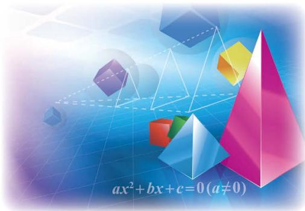

text_image

ax²+bx+c=0(a≠0)

北京师范大学出版社

· 北京 ·

# 走进数学新天地

亲爱的同学，祝贺你步入义务教育的最后一个学年！

七年级和八年级的数学学习生活使我们接触到许多数学对象，经历了许多有意义的数学活动，还学到了一些重要的数学方法，并且能够用它们去解决问题。更重要的是，我们看到了身边的数学，掌握了一些学习数学的基本方法，有了学好数学的信心……

我们已经研究了三角形、平行四边形的许多性质，在本册教科书中我们将继续探究并证明几种特殊平行四边形的性质，相信会使你对如何研究图形有更深刻的认识。

我们学习过一次方程（组）与分式方程，一元二次方程则是一个新的数学模型，它所表示的数量关系更为复杂，当然也能更好地体现数学的重要价值。

生活中我们常常可以见到 “相似” 的图形, “相似” 是图形之间的一种特殊关系, 与全等不一样, 但又有着关联。数学里 “相似” 意味着什么? 我们怎样从数学的角度去研究相似现象?

物体在灯光下、太阳光下都有影子，物体的这些影子有什么特点和规律？从数学的角度如何来认识它们？学完第五章你将发现“数学会使我们看得更深刻”。

我们已经学习了一次函数，反比例函数是另一种函数模型，学习反比例函数以后，我们对函数的认识会更丰富。

对概率的进一步研究，会使我们对随机现象有更深刻的认识。我们再一次感受到身边存在大量的数学，甚至游戏中也有数学，原来学数学不一定是很“枯燥”的事情。

学好数学当然不是轻而易举就能做到的，但也不是高不可攀的。自己想一想、做一做，与同伴们议一议，读一读教科书，听一听老师的讲解，并在日常生活中尝试使用数学。事实上，对数学了解得越多，就越能体会到她的意义与趣味。

让我们一起走进数学新天地!

北师大版

# 第一章 特殊平行四边形

1 菱形的性质与判定……2   
2 矩形的性质与判定……11   
3 正方形的性质与判定……20

回顾与思考……26

复习题……26

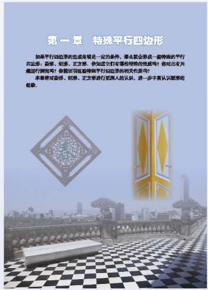

text_image

第一章 特殊平行四边形
如果平行四边形的造型都是一定的条件，那么就全部成一套特殊的平行四边形：如图、如图、正方形，你知道它们有相当特殊性性质吗？你找出有兴趣的倒视吗？你曾经只因这些特殊平行四边形的相关品质吗？
本准则对面感、如图、正方形进行正图人的认识，进一步丰富认识图源的经验。

# 第二章 一元二次方程

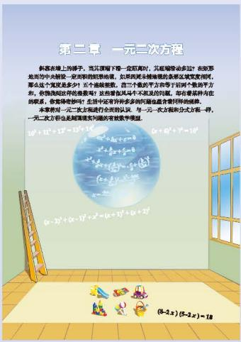

text_image

第二章 一元二次方程
斜率在端上的梯子，当实题项下一定距离时，只能缩进多少边？在该等
地而用中央检验一定的所测的矩形结果，如果因其特殊值的条形区域宽度相同，
那么这个域是多少？五个连续被数，但三个域的平方方等于若干个数的平方
形，使该线段它的根数等？某些根数及其不不满足的问题，却有些某种内在
的根数，你能得清楚时！且指中还有许多多列的直线包含相同轴线。
本题要对一次方程进行完全的知识。每一二次方程和分式方程一样。
一元二次方程是越简或大问题的有效数字模型。
(2-2x)(2-2x)=18

1 认识一元二次方程……31   
2 用配方法求解一元二次方程……36  
3 用公式法求解一元二次方程……41  
4 用因式分解法求解一元二次方程……46   
\*5 一元二次方程的根与系数的关系……49  
6 应用一元二次方程……52   
回顾与思考……56  
复习题……56

# 第三章 概率的进一步认识

text_image

第三章 概率的进一步认识
技能竞赛成绩均匀程度节，你统一一枚正面跟上、一枚反即要上的领养品多少？你知道如何解决这个问题吗？
你们都有3个同学的生日相同吗？有人说，50-个人中枢可能有2个人的生日都写，你究竟这种消极吗？
本期将进一步认识概率，探索可纠急、看转状想的力验计算简单随机事件发生的概率，用经典方法估计一些随机事件发生伪概率。

1 用树状图或表格求概率……60   
2 用频率估计概率……69   
回顾与思考……72  
复习题……72

# 第四章 图形的相似

1 成比例线段……76  
2 平行线分线段成比例……82  
3 相似多边形……86  
4 探索三角形相似的条件……89   
\*5 相似三角形判定定理的证明……99  
6 利用相似三角形测高……103  
7 相似三角形的性质……106  
8 图形的位似……113  
回顾与思考……119  
复习题……119

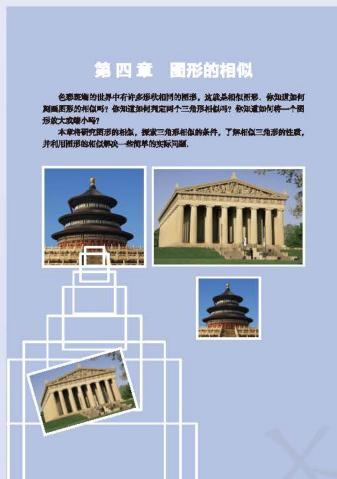

text_image

第四章 图形的相似
色彩被鉴的世界中有许多形状相同的质感，这类品质有形。例如如何用画图形的有效吗？你知道他利用两个三个三角形的技巧？你知道如何将一个图形放大或缩小吗？
本书将研究图形的相似，探索三角形的条件，了解三角形的性质，并利用图形和形状解决一种简单与实际问题。

# 第五章 投影与视图

1 投影……125  
2 视图……134

回顾与思考……144

复习题……144

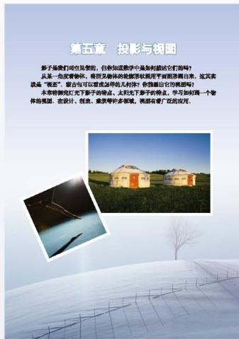

text_image

第五章 投影与视图
弟子是咱们将空尽身的，但参知道数学中是如何描述它们的吗？
从某一角度看物体，将凭实体的地振荡状照用平面图滑着出来。这其实就是“视图”。复古也可以增进益得幼儿你？你想回归它的视图吗？
本书将缩短红光子弟子的特点、太阳光下弟子的特点，学习如何画一个物体的视图。在设计、创造、现实等许多领域，视图有着广泛的应用。

# 第六章 反比例函数

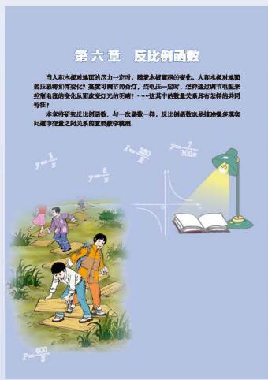

text_image

第六章 反比例函数
当事人未面对地面的正一定时，随着未被面积的变化，人称未面对地面的压面积划分变化？亮度可调节的台灯，型电正一定时，怎样通过调节电脑来控制电缆的变化从原或受打过的字符？……这其中的数量关系具有怎样的共同特征？
未来将研究应达到函数，与一次函数一样，反比例函数也是描述很多现实问题中权重之对关系的重要数学概念。
y=1/3
y=8/2
y=2/100
y=60/8

1 反比例函数……149  
2 反比例函数的图象与性质……152  
3 反比例函数的应用……158

回顾与思考……161

复习题……161

# 综合与实践

制作视力表……163

# 综合与实践

\- 猜想、证明与拓广…… 166

# 综合与实践

池塘里有多少条鱼……171

# 总复习

173

# 第一章 特殊平行四边形
如果平行四边形的边或角满足一定的条件，那么就会形成一些特殊的平行四边形：菱形、矩形、正方形．你知道它们有哪些特殊的性质吗？你对此有兴趣进行探究吗？你能证明这些特殊平行四边形的相关性质吗？

本章将对菱形、矩形、正方形进行更深入的认识，进一步丰富认识图形的经验.

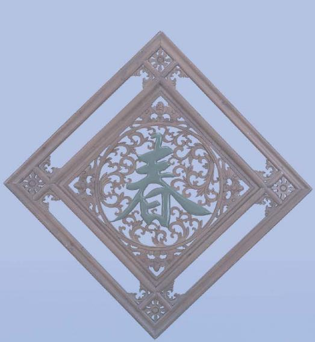

natural_image

Ornate wooden frame with intricate floral and geometric patterns, no text or symbols visible

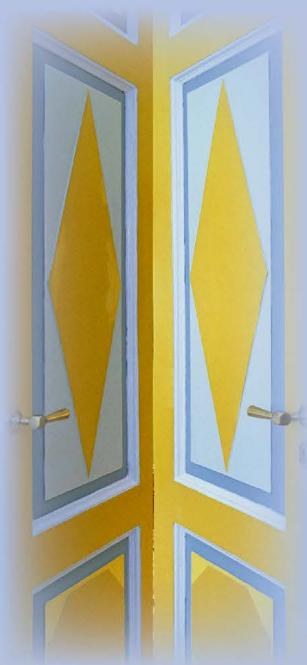

natural_image

Close-up of a double door with yellow diamond patterns and silver frame (no text or symbols)

# 学习目标

进一步获得对图形的性质进行探索、猜测和证明的经验   
获得对菱形、矩形、正方形的基本认识  
能够掌握几何证明的方法  
能证明菱形、矩形、正方形的性质定理和判定定理  
- 体会菱形、矩形、正方形与平行四边形的关系  
进一步理解一般与特殊的关系

# 1

# 菱形的性质与判定

下面几幅图片中都含有一些平行四边形。观察这些平行四边形，你能发现它们有什么样的共同特征？

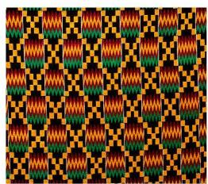

natural_image

Patterned textile with repeating geometric designs in orange, green, yellow, and black (no text or symbols)

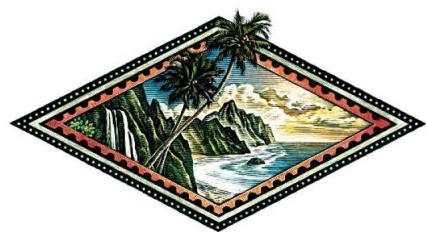

natural_image

Illustration of a tropical island with palm trees, waterfall, and ocean waves under a decorative diamond frame (no text or symbols)

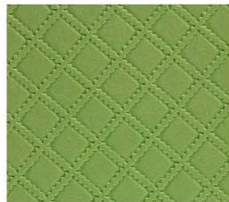

natural_image

Close-up of a green textured fabric with diamond stitching pattern (no text or symbols)

有一组邻边相等的平行四边形叫做菱形（rhombus）.

你能举出一些生活中菱形的例子吗？与同伴交流。

# 想一想
(1) 菱形是特殊的平行四边形, 它具有一般平行四边形的所有性质. 你能列举一些这样的性质吗?
(2) 你认为菱形还具有哪些特殊的性质？与同伴交流。

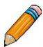

# 做一做

用菱形纸片折一折，回答下列问题：
(1) 菱形是轴对称图形吗? 如果是, 它有几条对称轴? 对称轴之间有什么位置关系?
(2) 菱形中有哪些相等的线段?

通过上面的折纸活动，我们可以发现菱形的四条边相等，对角线互相垂直。下面我们证明这些结论。

菱形是轴对称图形.

natural_image

Cartoon illustration of a smiling boy in blue overalls and boots, pointing upward with both hands (no text or symbols)

已知：如图1-1，在菱形ABCD中， $AB = AD$ ，对角线AC与BD相交于点O.

求证: (1) ${AB} = {BC} = {CD} = {AD}$ ; (2) ${AC} \bot  {BD}$ .
证明: (1) ∵ 四边形 $ABCD$ 是菱形,

∴ AB = CD, AD = BC (菱形的对边相等).
又∵ AB = AD,
$\therefore A B = B C = C D = A D.$
(2) $\because AB = AD,$

∴ $\triangle ABD$ 是等腰三角形.
又∵ 四边形 ABCD 是菱形，

∴ OB = OD（菱形的对角线互相平分）.

在等腰三角形 ABD 中，
$\because \quad O B = O D,$
$\therefore A O \perp B D,$
即 $AC \perp BD$ .

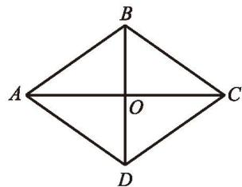

text_image

B
A	O	C
D

图 1- 1

定理 菱形的四条边相等.

定理 菱形的对角线互相垂直.

> [!example]- 例1 如图 1-2, 在菱形 $ABCD$ 中, 对角线 $AC$ 与 $BD$ 相交于点 $O$ , $\angle BAD = 60^{\circ}$ , $BD = 6$ , 求菱形的边长 $AB$ 和对角线 $AC$ 的长.
解：∵ 四边形 ABCD 是菱形，

∴ AB = AD (菱形的四条边相等),
$AC \perp BD$ (菱形的对角线互相垂直),
$OB = OD = \frac{1}{2} BD = \frac{1}{2} \times 6 = 3$ （菱形的对角线互相平分）.

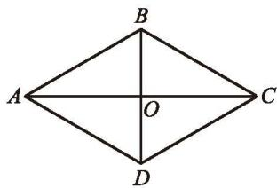

text_image

A
B
O
C
D

图1-2

在等腰三角形 ABD 中，
$\because \angle B A D = 6 0 ^ {\circ},$
$\therefore  \bigtriangleup {ABD}$ 是等边三角形.
$\therefore A B = B D = 6.$

在 Rt $\triangle AOB$ 中，由勾股定理，得
$O A ^ {2} + O B ^ {2} = A B ^ {2},$
$\therefore O A = \sqrt {A B ^ {2} - O B ^ {2}} = \sqrt {6 ^ {2} - 3 ^ {2}} = 3 \sqrt {3}.$

∴ AC = 2OA = 6 $\sqrt{3}$ （菱形的对角线互相平分）.

# 随堂练习

如图, 在菱形 $ABCD$ 中, 对角线 $AC$ 与 $BD$ 相交于点 $O$ . 已知 $AB = 5 \mathrm{~cm}$ , $AO = 4 \mathrm{~cm}$ , 求 $BD$ 的长.

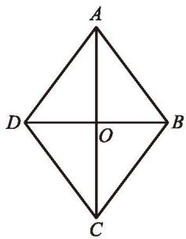

text_image

A
D
O
B
C

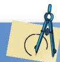

# 习题 1.1

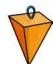

# 知识技能

1. 已知：如图,在菱形 ${ABCD}$ 中, $\angle {BAD} = 2\angle B$ . 求证： $\bigtriangleup  {ABC}$ 是等边三角形.  
2. 如图, 在菱形 ${ABCD}$ 中, ${BD} = 6,{AC} = 8$ ,求菱形 ${ABCD}$ 的周长.

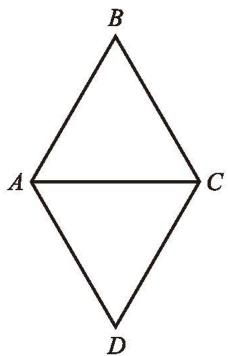

text_image

B
A C
D

(第1题)

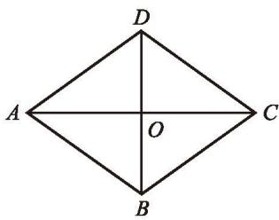

text_image

D
A	O	C
B

(第2题)

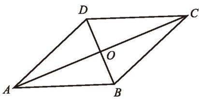

text_image

Geometric diagram of a parallelogram ABCD with diagonals intersecting at point O, labeled with vertices and intersection points.

(第3题)

3. 已知：如图，在菱形 ABCD 中，对角线 AC 与 BD 相交于点 O. 求证：AC 平分 $\angle BAD$ 和 $\angle BCD$ ，BD 平分 $\angle ABC$ 和 $\angle ADC$ .

# 数学理解

4. 如图, 在菱形 $ABCD$ 中, 对角线 $AC$ 与 $BD$ 相交于点 $O$ , 图中有多少个等腰三角形和直角三角形?

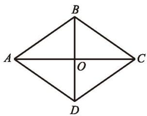

text_image

B
A	O	C
D

(第4题)

根据菱形的定义, 有一组邻边相等的平行四边形是菱形. 除此之外, 你认为还有什么条件可以判断一个平行四边形是菱形? 先想一想, 再与同伴交流.

可以发现, 对角线互相垂直的平行四边形是菱形. 下面我们证明这个结论.

已知: 如图 1-3, 在 $\square ABCD$ 中, 对角线 $AC$ 与 $BD$ 相交于点 $O$ , $AC \perp BD$ .

求证: $\square ABCD$ 是菱形.
证明：∵ 四边形 ABCD 是平行四边形，
$\therefore O A = O C.$
又∵ $AC \perp BD,$

∴ 直线 BD 是线段 AC 的垂直平分线.
$\therefore B A = B C.$

∴ □ABCD 是菱形（菱形的定义）.

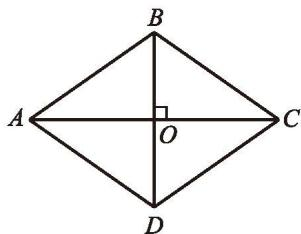

text_image

B
A
O
C
D

图1-3

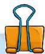

定理 对角线互相垂直的平行四边形是菱形.

# 议一议

已知线段 $AC$ ，你能用尺规作图的方法作一个菱形ABCD，使 $AC$ 为菱形的一条对角线吗？

natural_image

Illustration of a smiling boy wearing a red and striped sweater over blue jeans (no text or symbols)

如图 1-4，分别以 $A, C$ 为圆心，以大于 $\frac{1}{2} AC$ 的长为半径作弧，两条弧分别相交于点 $B, D$ ，依次连接 $A, B, C, D$ ，四边形ABCD看上去是菱形.

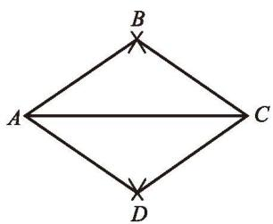

text_image

A
B
C
D

图1-4

你是怎么做的？你认为小刚的做法正确吗？与同伴交流。

定理 四边相等的四边形是菱形.

请你完成这个定理的证明.

# 做一做

你能用折纸等办法得到一个菱形吗？动手试一试！

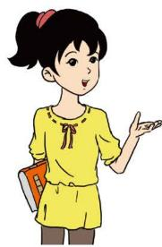

natural_image

Illustration of a girl in a yellow dress holding a book and gesturing with her hand (no text or symbols present)

先将一张长方形的纸对折、再对折，然后沿图中的虚线剪下，将纸展开，就得到了一个菱形.

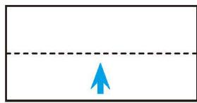

natural_image

Simple diagram with a blue upward arrow inside a dashed horizontal line (no text or symbols)

对折

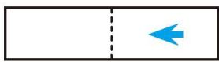  
再对折

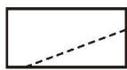  
沿虚线剪下

你能说说小颖这样做的道理吗？

> [!example]- 例2 已知：如图 1-5，在 $\square ABCD$ 中，对角线 $AC$ 与 $BD$ 相交于点 $O$ , $AB = \sqrt{5}$ , $OA = 2$ , $OB = 1$ .
求证：□ABCD是菱形.
证明：在 $\triangle AOB$ 中，
$\because A B = \sqrt {5}, O A = 2, O B = 1,$
$\therefore A B ^ {2} = O A ^ {2} + O B ^ {2}.$
$\therefore  \bigtriangleup {AOB}$ 是直角三角形, $\angle {AOB}$ 是直角.
$\therefore A C \perp B D.$

∴ □ABCD 是菱形（对角线互相垂直的平行四边形是菱形）.

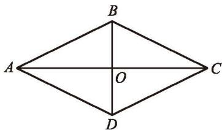

text_image

A
B
O
C
D

图1-5

# 随堂练习

画一个菱形，使它的两条对角线的长分别为 $4 \mathrm{~cm}$ 和 $6 \mathrm{~cm}$ .

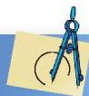

# 习题 1.2

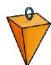

# 知识技能

1. 已知：如图，在 $\square ABCD$ 中，对角线 $AC$ 的垂直平分线分别与 $AD, AC, BC$ 相交于点 $E, O, F$ . 求证：四边形 $AFCE$ 是菱形.

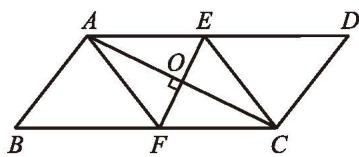

text_image

A
E
D
O
B
F
C

(第1题)

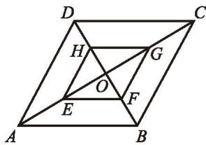

text_image

Geometric diagram of a parallelogram with labeled points and internal lines, likely for a math problem or proof.

(第2题)

2. 已知：如图，在菱形 $ABCD$ 中，对角线 $AC$ 与 $BD$ 相交于点 $O$ ，点 $E, F, G, H$ 分别是 $OA, OB, OC, OD$ 的中点。求证：四边形 $EFGH$ 是菱形。

# 数学理解

3. 如图, 在四边形纸片 $ABCD$ 中, $AD \parallel BC$ , $AD > CD$ , 将纸片沿过点 $D$ 的直线折叠, 使点 $C$ 落在 $AD$ 上的点 $C'$ 处, 折痕 $DE$ 交 $BC$ 于点 $E$ , 连接 $C'E$ . 你能确定四边形 $CDC'E$ 的形状吗? 证明你的结论.

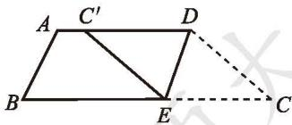

text_image

A C' D
B E C

(第3题)

> [!example]- 例3 如图 1-6，四边形 $ABCD$ 是边长为 $13 \mathrm{~cm}$ 的菱形，其中对角线 $BD$ 长 $10 \mathrm{~cm}$ . 求:
(1) 对角线 AC 的长度;  
(2) 菱形 ABCD 的面积.
解: (1) ∵ 四边形 ABCD 是菱形, AC 与 BD 相交于点 E,
$\therefore \angle AED = 90^{\circ}$ (菱形的对角线互相垂直),
$DE=\frac{1}{2}BD=\frac{1}{2}\times10=5\left(\mathrm{cm}\right)$ （菱形的对角）线互相平分).

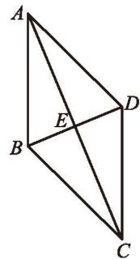

text_image

Geometric diagram with labeled points A, B, C, D, and E forming intersecting triangles and lines

图1-6
$\therefore A E = \sqrt {A D ^ {2} - D E ^ {2}} = \sqrt {1 3 ^ {2} - 5 ^ {2}} = 1 2 (\mathrm{cm}).$
$\therefore AC=2AE=2\times12=24(cm)$ （菱形的对角线互相平分）.
(2) 菱形 $ABCD$ 的面积
$=\triangle ABD$ 的面积 $+\triangle CBD$ 的面积
$=2\times\triangle ABD$ 的面积
$\begin{array}{l} = 2 \times \frac {1}{2} \times B D \times A E \\ = 2 \times \frac {1}{2} \times 1 0 \times 1 2 \\ = 1 2 0 \left(\mathrm{cm} ^ {2}\right). \\ \end{array}$

# 做一做

如图 1-7，两张等宽的纸条交叉重叠在一起，重叠的部分 $ABCD$ 是菱形吗？为什么？

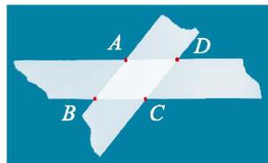

text_image

A
B
C
D

图1-7

# 随堂练习

1. 菱形 $ABCD$ 的周长为 $40 \mathrm{~cm}$ , 它的一条对角线长 $10 \mathrm{~cm}$ .
(1) 求这个菱形的每一个内角的度数;  
(2) 求这个菱形另一条对角线的长.

2. 已知: 如图, 在 Rt $\triangle ABC$ 中, $\angle ACB = 90^{\circ}$ , $\angle BAC = 60^{\circ}$ , $BC$ 的垂直平分线分别交 $BC$ 和 $AB$ 于点 $D$ , $E$ , 点 $F$ 在 $DE$ 的延长线上, 且 $AF = CE$ . 求证: 四边形 $ACEF$ 是菱形.

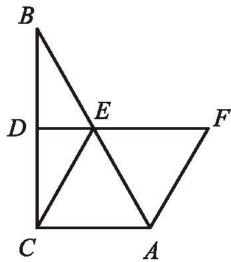

text_image

Geometric diagram with labeled points A, B, C, D, E, F forming triangles and a rectangle

(第2题)

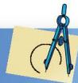

# 习题 1.3

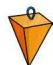

# 知识技能

1. 已知：如图，在菱形ABCD中，E, F分别是AB和BC上的点，且BE=BF.
求证：(1) $\triangle ADE \cong \triangle CDF$ ; (2) $\angle DEF = \angle DFE$ .

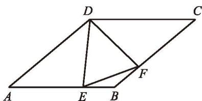

text_image

Geometric diagram of parallelogram ABCD with internal points E, F and connecting line segments

(第1题)

2. 证明：菱形的面积等于其对角线长的乘积的一半.  
3. 如图, 在菱形 $ABCD$ 中, 对角线 $AC$ 与 $BD$ 相交于点 $O$ , 且 $AC = 16$ , $BD = 12$ , 求菱形 $ABCD$ 的高 $DH$ .

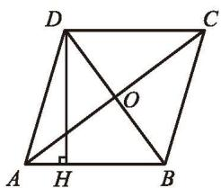

text_image

D
C
O
A H B

(第3题)

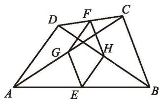

text_image

Geometric diagram of a quadrilateral with labeled points and intersecting lines, likely for a math problem or proof.

(第4题)

4. 已知：如图，在四边形 ABCD 中，AD = BC，点 E, F, G, H 分别是 AB, CD, AC, BD 的中点。求证：四边形 EGFH 是菱形。

# 问题解决

5. 如图,你能用一张锐角三角形纸片 $ABC$ 折出一个菱形,使 $\angle A$ 为菱形的一个内角吗?

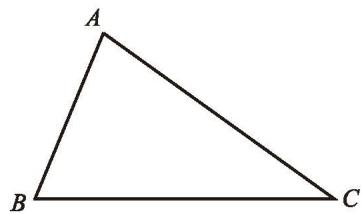

natural_image

Simple geometric triangle labeled A, B, C (no additional text or symbols)

(第5题)

# 2

# 矩形的性质与判定

下面图片中都含有一些特殊的平行四边形。观察这些特殊的平行四边形，你能发现它们有什么样的共同特征？

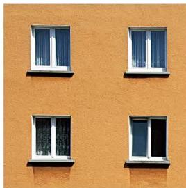

natural_image

Four-panel view of a two-story building facade with white-framed windows on an orange wall (no text or symbols visible)

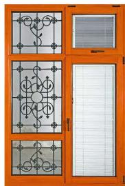

natural_image

Orange-framed door with lattice window and vertical panel (no text or symbols)

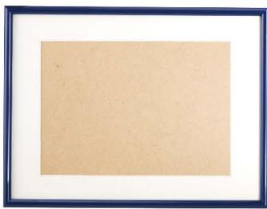

natural_image

Blank rectangular frame with a beige textured background and dark blue border (no text or symbols)

有一个角是直角的平行四边形叫做矩形（rectangle）.

矩形是生活中常见的图形，你还能举出一些生活中矩形的例子吗？与同伴交流。

# 想一想
(1) 矩形是特殊的平行四边形, 它具有一般平行四边形的所有性质. 你能列举一些这样的性质吗?  
(2) 矩形是轴对称图形吗? 如果是, 它有几条对称轴?  
(3) 你认为矩形还具有哪些特殊的性质？与同伴交流。

通过观察，可以发现矩形的四个角都是直角，对角线相等．下面我们证明这些结论.

已知：如图 1-8，四边形 $ABCD$ 是矩形， $\angle ABC = 90^{\circ}$ ，对角线 $AC$ 与 $DB$ 相交于点 $O$ .

text_image

矩形是轴对称图形.

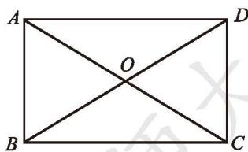

text_image

A
O
B
C
D

图1-8

求证: (1) $\angle ABC = \angle BCD = \angle CDA = \angle DAB = 90^{\circ}$ ; (2) $AC = DB$ .
证明: (1) $\because$ 四边形 $ABCD$ 是矩形,

∴ $\angle ABC = \angle CDA, \angle BCD = \angle DAB$ (矩形的对角相等), AB // DC (矩形的对边平行).
$\therefore \angle A B C + \angle B C D = 1 8 0 ^ {\circ}.$
又∵ $\angle ABC=90^{\circ}$ ,
$\begin{array}{l} \therefore \angle B C D = 9 0 ^ {\circ}. \\ \therefore \angle A B C = \angle B C D = \angle C D A = \angle D A B = 9 0 ^ {\circ}. \\ \end{array}$
(2) ∵ 四边形 ABCD 是矩形,

∴ AB = DC (矩形的对边相等).

在 $\triangle ABC$ 和 $\triangle DCB$ 中，
$\begin{array}{l} \because A B = D C, \angle A B C = \angle D C B, B C = C B, \\ \therefore \quad \triangle A B C \cong \triangle D C B. \\ \therefore A C = D B. \\ \end{array}$

定理 矩形的四个角都是直角. 定理 矩形的对角线相等.

# 议一议

如图1-9，矩形ABCD的对角线AC与BD交于点E，那么BE是Rt△ABC中一条怎样的特殊线段？它与AC有什么大小关系？由此你能得到怎样的结论？

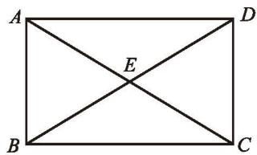

text_image

A
E
B
C
D

图1-9

定理 直角三角形斜边上的中线等于斜边的一半.

请你完成这个定理的证明.

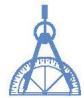

> [!example]- 例1 如图1-10, 在矩形 $ABCD$ 中, 两条对角线相交于点 $O$ , $\angle AOD = 120^{\circ}$ , $AB = 2.5$ , 求这个矩形对角线的长.
解：∵ 四边形 ABCD 是矩形，
$\therefore \angle DAB = 90^{\circ}$ (矩形的四个角都是直角),
$AC = BD$ （矩形的对角线相等），
$O A = O C = \frac {1}{2} A C, O B = O D = \frac {1}{2} B D$

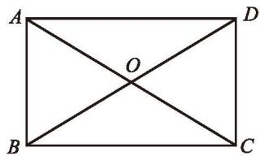

text_image

A
O
B
C
D

图1-10

(矩形的对角线互相平分).
$\therefore O A = O D.$
$\because \angle A O D = 1 2 0 ^ {\circ},$
$\therefore \angle O D A = \angle O A D = \frac {1}{2} (1 8 0 ^ {\circ} - 1 2 0 ^ {\circ}) = 3 0 ^ {\circ}.$
$\therefore B D = 2 A B = 2 \times 2. 5 = 5.$

你还有其他解法吗？

# 随堂练习

如图，在矩形 ABCD 中，两条对角线 AC 与 BD 相交于点 O，AB = 6，OA = 4。求 BD 与 AD 的长。

text_image

A
O
B
C
D

# 习题 1.4

# 知识技能

1. 一个矩形的对角线长为6，对角线与一边的夹角是 $45^{\circ}$ ，求这个矩形的各边长.

2. 一个矩形的两条对角线的一个夹角为 $60^{\circ}$ , 对角线长为 15, 求这个矩形较短边的长.

3. 如图, 在 Rt $\triangle ABC$ 中, $\angle ACB = 90^{\circ}$ , $D$ 为 $AB$ 的中点, $AE \parallel CD$ , $CE \parallel AB$ , 试判断四边形 $ADCE$ 的形状, 并证明你的结论.

text_image

Geometric diagram of triangle ABC with points D and E on sides AB and AC, and right angle at C.

(第3题)

# 数学理解

4. 证明：如果一个三角形一边上的中线等于这边的一半，那么这个三角形是直角三角形.

# 做一做

图 1-11 是一个平行四边形活动框架，拉动一对不相邻的顶点时，平行四边形的形状会发生变化.

图1-11

(1) 随着 $\angle \alpha$ 的变化, 两条对角线的长度将发生怎样的变化?
(2) 当两条对角线的长度相等时, 平行四边形有什么特征? 由此你能得到一个怎样的猜想?

定理 对角线相等的平行四边形是矩形.

已知: 如图 1-12, 在 $\square ABCD$ 中, $AC$ , $DB$ 是它的两条对角线, $AC = DB$ .

求证：□ABCD是矩形.
证明 $\because$ 四边形 $ABCD$ 是平行四边形，
$\therefore A B = D C, A B \parallel D C.$
又∵ BC = CB, AC = DB,
$\therefore \quad \triangle A B C \cong \triangle D C B.$
$\therefore \angle A B C = \angle D C B.$
$\because \quad A B \parallel D C,$
$\therefore \angle A B C + \angle D C B = 1 8 0 ^ {\circ}.$
$\therefore \angle A B C = \angle D C B = \frac {1}{2} \times 1 8 0 ^ {\circ} = 9 0 ^ {\circ}.$

∴ □ ABCD 是矩形（矩形的定义）.

natural_image

Geometric diagram of a rectangle with diagonals and labeled vertices A, B, C, D (no text or symbols beyond labels)

图1-12

# 想一想

我们知道，矩形的四个角都是直角．反过来，一个四边形至少有几个角是直角时，这个四边形就是矩形呢？请证明你的结论，并与同伴交流.

定理 有三个角是直角的四边形是矩形.

# 议一议

你有什么方法检查你家（或教室）刚安装的门框是不是矩形？如果仅有一根较长的绳子，你怎样检查？请说明检查方法的合理性，并与同伴交流。

> [!example]- 例2 如图 1-13, 在 $\square ABCD$ 中, 对角线 $AC$ 与 $BD$ 相交于点 $O$ , $\triangle ABO$ 是等边三角形, $AB = 4$ , 求 $\square ABCD$ 的面积.
解：∵ 四边形 ABCD 是平行四边形，
$\therefore O A = O C, O B = O D.$
又∵ $\triangle ABO$ 是等边三角形，
$\therefore O A = O B = A B = 4.$
$\therefore O A = O B = O C = O D = 4.$
$\therefore A C = B D = 2 O A = 2 \times 4 = 8.$

∴ □ABCD 是矩形（对角线相等的平行四边形是矩形）.

∴ $\angle ABC = 90^{\circ}$ (矩形的四个角都是直角).

text_image

A
O
B
C
D

图1-13

在 Rt $\triangle ABC$ 中，由勾股定理，得
$A B ^ {2} + B C ^ {2} = A C ^ {2},$
$\therefore B C = \sqrt {A C ^ {2} - A B ^ {2}} = \sqrt {8 ^ {2} - 4 ^ {2}} = 4 \sqrt {3}.$
$\therefore S _ {\square A B C D} = A B \cdot B C = 4 \times 4 \sqrt {3} = 1 6 \sqrt {3}.$

# 随堂练习

已知：如图，在□ABCD中，M是AD边的

中点，且 $MB = MC$

求证：四边形 ABCD 是矩形.

text_image

A
M
D
B
C

# 习题 1.5

# 知识技能

1. 如图, 在 $\triangle ABC$ 中, $AD$ 为 $BC$ 边上的中线, 延长 $AD$ 至 $E$ , 使 $DE = AD$ , 连接 $BE$ , $CE$ .
(1) 试判断四边形 $ABEC$ 的形状;  
(2) 当 $\triangle ABC$ 满足什么条件时, 四边形 $ABEC$ 是矩形?

text_image

A
B
D
C
E

(第1题)

text_image

A
C
O
D
M
B
N

(第2题)

2. 如图, 点 $B$ 在 ${MN}$ 上,过 ${AB}$ 的中点 $O$ 作 ${MN}$ 的平行线,分别交 $\angle {ABM}$ 的平分线和 $\angle {ABN}$ 的平分线于点 $C,D$ . 试判断四边形 ${ACBD}$ 的形状,并证明你的结论.

# 问题解决

3. 如图, 已知菱形 $ABCD$ , 画一个矩形, 使得 $A, B, C, D$ 四点分别在矩形的四条边上, 且矩形的面积为菱形 $ABCD$ 面积的 2 倍.

text_image

A
B
C
D

(第3题)

> [!example]- 例3 如图 1-14, 在矩形 $ABCD$ 中, $AD = 6$ , 对角线 $AC$ 与 $BD$ 相交于点 $O$ , $AE \perp BD$ , 垂足为 $E$ , $ED = 3BE$ . 求 $AE$ 的长.

解：∵ 四边形 ABCD 是矩形，
$\therefore \angle BAD = 90^{\circ}$ (矩形的四个角都是直角),

AC=BD（矩形的对角线相等），
$AO = CO = \frac{1}{2} AC, BO = DO = \frac{1}{2} BD$ （矩形的对角线互相平分）.
$\therefore A O = B O = D O = \frac {1}{2} B D.$
$\begin{array}{l} \because \quad E D = 3 B E, \\ \therefore B E = O E. \\ \end{array}$
又∵ $AE \perp BD$ ,
$\begin{array}{l} \therefore A B = A O. \\ \therefore A B = A O = B O, \\ \end{array}$
即 $\triangle ABO$ 是等边三角形.
$\begin{array}{l} \therefore \angle A B O = 6 0 ^ {\circ}. \\ \therefore \angle A D B = 9 0 ^ {\circ} - \angle A B O = 9 0 ^ {\circ} - 6 0 ^ {\circ} = 3 0 ^ {\circ}. \\ \therefore A E = \frac {1}{2} A D = \frac {1}{2} \times 6 = 3. \\ \end{array}$

> [!example]- 例4 已知：如图1-15，在 $\triangle ABC$ 中， $AB = AC$ ， $AD$ 是 $\triangle ABC$ 的一条角平分线， $AN$ 为 $\triangle ABC$ 的外角 $\angle CAM$ 的平分线， $CE \perp AN$ ，垂足为 $E$ 。求证：四边形 $ADCE$ 是矩形。
证明：∵ AD 平分 ∠BAC，AN 平分 ∠CAM，
$\therefore \angle C A D = \frac {1}{2} \angle B A C, \angle C A N = \frac {1}{2} \angle C A M.$
$\begin{array}{l} \therefore \angle D A E = \angle C A D + \angle C A N \\ = \frac {1}{2} (\angle B A C + \angle C A M) \\ = \frac {1}{2} \times 1 8 0 ^ {\circ} \\ = 9 0 ^ {\circ}. \\ \end{array}$

在 $\triangle ABC$ 中，

text_image

A
D
O
E
B
C

图1-14

text_image

Geometric diagram with labeled points and perpendicular lines, likely from a math problem or proof

图1-15

∵ AB = AC，AD 平分 $\angle BAC$ ，
$\therefore AD \perp BC.$
$\therefore \angle A D C = 9 0 ^ {\circ}.$
又∵ $CE \perp AN,$
$\therefore \angle C E A = 9 0 ^ {\circ}.$

∴ 四边形 ADCE 是矩形（有三个角是直角的四边形是矩形）.

# 想一想

在例 4 中，连接 DE，交 AC 于点 F（如图 1-16）.
(1) 试判断四边形 $ABDE$ 的形状, 并证明你的结论.  
(2) 线段 $DF$ 与 $AB$ 有怎样的关系? 请证明你的结论.

text_image

Geometric diagram with labeled points and lines, including triangle ABC and perpendiculars

图 1-16

# 随堂练习

已知：如图，四边形 ABCD 由两个全等的等边三角形 ABD 和 CBD 组成，M，N 分别是 BC 和 AD 的中点。求证：四边形 BMDN 是矩形。

text_image

D
N
A
B
C
M

# 习题 1.6

# 知识技能

1. 如图, 在矩形 $ABCD$ 中, 对角线 $AC$ 与 $BD$ 相交于点 $O$ , $\angle ACB = 30^{\circ}$ , $BD = 4$ , 求矩形 $ABCD$ 的面积.

text_image

A
O
B
C
D

(第1题)

text_image

A
B
E
O
C
D

(第2题)

2. 如图, 在矩形 $ABCD$ 中, 对角线 $AC$ 与 $BD$ 相交于点 $O$ , 过点 $A$ 作 $BD$ 的垂线, 垂足为 $E$ . 已知 $\angle EAD = 3 \angle BAE$ , 求 $\angle EAO$ 的度数.

3. 已知：如图，在 $\triangle ABC$ 中， $AB=AC$ ， $D$ 为 $BC$ 的中点，四边形 $ABDE$ 是平行四边形。求证：四边形 $ADCE$ 是矩形。

text_image

Geometric diagram with labeled points A, B, C, D, E forming triangles and quadrilaterals

(第3题)

# 问题解决

※4. 如图, 在矩形纸片 $ABCD$ 中, $AB = 6 \mathrm{~cm}$ , $BC = 8 \mathrm{~cm}$ , 将矩形纸片折叠, 使点 $C$ 与点 $A$ 重合. 请在图中画出折痕, 并求折痕的长.

natural_image

Simple geometric diagram of a rectangle labeled A, B, C, D (no additional text or symbols)

(第4题)

※5. 如图, 在矩形 $ABCD$ 中, $AB = 3$ , $AD = 4$ , $P$ 是 $AD$ 上不与 $A$ 和 $D$ 重合的一个动点, 过点 $P$ 分别作 $AC$ 和 $BD$ 的垂线, 垂足为 $E$ , $F$ . 求 $PE + PF$ 的值.

text_image

A
P
D
E
F
O
B
C

(第5题)

# 正方形的性质与判定

图 1-17 中的四边形都是特殊的平行四边形。观察这些特殊的平行四边形，你能发现它们有什么样的共同特征？

图1-17

有一组邻边相等，并且有一个角是直角的平行四边形叫做正方形（square）.

# 议一议
(1) 正方形是矩形吗？是菱形吗？  
(2) 你认为正方形具有哪些性质？与同伴交流。

正方形既是矩形，又是菱形，它具有矩形与菱形的所有性质.

定理 正方形的四个角都是直角，四条边相等.

定理 正方形的对角线相等且互相垂直平分.

请你完成这两个定理的证明.

# 想一想

正方形有几条对称轴?

> [!example]- 例1 如图 1-18, 在正方形 $ABCD$ 中, $E$ 为 $CD$ 边上一点, $F$ 为 $BC$ 延长线上一点, 且 $CE = CF$ . $BE$ 与 $DF$ 之间有怎样的关系? 请说明理由.
解：BE = DF，且 $BE \perp DF$ 。理由如下：
(1) ∵ 四边形 ABCD 是正方形，
$\therefore BC=DC,\angle BCE=90^{\circ}$ （正方形的四条边相等，四个角都是直角）.
$\begin{array}{l} \therefore \angle D C F = 1 8 0 ^ {\circ} - \angle B C E = 1 8 0 ^ {\circ} - 9 0 ^ {\circ} = 9 0 ^ {\circ}. \\ \therefore \angle B C E = \angle D C F. \\ \end{array}$
又∵ CE = CF,
$\begin{array}{l} \therefore \quad \triangle B C E \cong \triangle D C F. \\ \therefore \quad B E = D F. \\ \end{array}$
(2) 延长 BE 交 DF 于点 M (如图 1-19).
$\because \quad \triangle B C E \cong \triangle D C F,$
$\therefore \angle C B E = \angle C D F.$
$\because \angle D C F = 9 0 ^ {\circ},$
$\therefore \angle C D F + \angle F = 9 0 ^ {\circ}.$
$\therefore \angle C B E + \angle F = 9 0 ^ {\circ}.$
$\therefore \angle B M F = 9 0 ^ {\circ}.$
$\therefore B E \perp D F.$

text_image

Geometric diagram of a square ABCD with an extended line to point E, and triangle BFC drawn.

图1-18

text_image

Geometric diagram of a square with labeled points and lines, including triangle ABC and auxiliary lines.

图1-19

# 议一议

平行四边形、菱形、矩形、正方形之间有什么关系？你能用一个图直观地表示它们之间的关系吗？与同伴交流。

# 随堂练习

1. 如图, 在正方形 $ABCD$ 中, 对角线 $AC$ 与 $BD$ 相交于点 $O$ , 图中有多少个等腰三角形?

text_image

A
O
B
C
D

(第1题)

text_image

Geometric diagram of a square with labeled vertices A, B, C, D and intersection point F

(第2题)

2. 如图, 在正方形 $ABCD$ 中, 点 $F$ 为对角线 $AC$ 上一点, 连接 $BF$ , $DF$ . 你能找出图中的全等三角形吗? 选择其中一对进行证明.

# 习题 1.7

# 知识技能

1. 对角线长为 $2 \mathrm{~cm}$ 的正方形, 边长是多少?

2. 如图, 四边形 $ABCD$ 是正方形, $\triangle CBE$ 是等边三角形, 求 $\angle AEB$ 的度数.

# 数学理解

3. 如图, $A$ , $B$ , $C$ , $D$ 四家工厂分别坐落在正方形城镇的四个角上. 仓库 $P$ 和 $Q$ 分别位于 $AD$ 和 $DC$ 上, 且 $PD = QC$ . 证明两条直路 $BP = AQ$ 且 $BP \perp AQ$ .

# 问题解决

※4. 在一个正方形的花坛上，欲修建两条直的小路，使得两条直的小路将花坛分成大小、形状完全相同的四部分（不考虑道路的宽度）。你有几种方法？（至少说出三种）

text_image

A
D
E
B
C

(第2题)

text_image

青云公园
育兴中学
光华商场
光华酒店
桃园新村
B
C
D
A
P
Q

(第3题)

如图 1-20，将一张长方形纸对折两次，然后剪下一个角，打开．怎样剪才能剪出一个正方形？

# 议一议

满足什么条件的矩形是正方形？满足什么条件的菱形是正方形？请证明你的结论，并与同伴交流。

natural_image

Illustration of a yellow ribbon tied to a blank notepad with a dashed line (no text or symbols)

图1-20

定理 有一组邻边相等的矩形是正方形.

定理 对角线互相垂直的矩形是正方形.

定理 有一个角是直角的菱形是正方形.

定理 对角线相等的菱形是正方形.

> [!example]- 例2 已知：如图 1-21，在矩形 $ABCD$ 中， $BE$ 平分 $\angle ABC$ ， $CE$ 平分 $\angle DCB$ ， $BF \parallel CE$ ， $CF \parallel BE$ 。求证：四边形 $BECF$ 是正方形。
证明：∵ $BF \parallel CE,\quad CF \parallel BE,$

∴ 四边形 BECF 是平行四边形.

∵ 四边形 ABCD 是矩形，
$\therefore \angle A B C = 9 0 ^ {\circ}, \angle D C B = 9 0 ^ {\circ}.$
又∵ BE 平分 $\angle ABC$ ，CE 平分 $\angle DCB$ ，
$\therefore \angle E B C = \frac {1}{2} \angle A B C = 4 5 ^ {\circ}, \angle E C B = \frac {1}{2} \angle D C B = 4 5 ^ {\circ}.$
$\therefore \angle E B C = \angle E C B.$
$\therefore E B = E C.$

∴ □ BECF是菱形（菱形的定义）.

在 $\triangle EBC$ 中，
$\because \angle E B C = 4 5 ^ {\circ}, \angle E C B = 4 5 ^ {\circ},$
$\therefore \angle B E C = 9 0 ^ {\circ}.$

∴ 菱形 BECF 是正方形（有一个角是直角的菱形是正方形）.

text_image

A
E
D
B
C
F

图1-21

# 做一做

我们知道，任意画一个四边形，以四边的中点为顶点可以组成一个平行四边形。那么，任意画一个正方形（如图1-22），以四边的中点为顶点可以组成一个怎样的图形呢？先猜一猜，再证明。

text_image

A
A₁
B
D₁
B₁
D
C₁
C

图1-22

# 议一议
(1) 以菱形或矩形各边的中点为顶点可以组成一个什么图形? 先猜一猜, 再证明. 如果以平行四边形各边的中点为顶点呢?
(2) 以四边形各边中点为顶点所组成的新四边形的形状与哪些线段有关系? 有怎样的关系?

# 随堂练习

# 证明：
(1) 对角线互相垂直的矩形是正方形;  
(2) 有一个角是直角的菱形是正方形.

# 读一读

# 四边形的对称性

我们知道，一般的四边形既不一定是轴对称图形，也不一定是中心对称图形；平行四边形都是中心对称图形，却不一定是轴对称图形；所有的菱形和矩形既是中心对称图形，又是轴对称图形，而且它们至少都有两条对称轴。请你想一想、画一画，什么情况下菱形和矩形只有两条对称轴？什么情况下它们有两条以上的对称轴？

通过想象或实际画图, 可以发现, 当菱形有一个角为直角时, 它的对称轴的数量就增加了; 当矩形有一组邻边相等时, 它的对称轴的数量也增加了. 换句话说, 当菱形或矩形成为正方形时, 它的对称轴就不止两条了. 由此我们看到, 当图形从一般情况向特殊情况变化时, 它的对称性也随之发生了变化.

natural_image

Five geometric shapes: triangle, parallelogram, rhombus, rectangle, and square with dashed construction lines (no text or symbols)

图1-23

此外，我们还知道，如果把一个图形绕着某一点旋转一定角度（小于 $360^{\circ}$ ）后，能够与原来的图形重合，那么这个图形叫做旋转对称图形。请你想一想、试一试，平行四边形是旋转对称图形吗？菱形呢？矩形呢？正方形呢？

# 习题 1.8

# 知识技能

1. 证明：对角线相等的菱形是正方形.

2. 已知：如图，E，F 是正方形 ABCD 的对角线 BD 上的两点，且 BE = DF.
求证：四边形 AECF 是菱形.

text_image

Geometric diagram of a square with labeled vertices and internal points, showing diagonals and segments.

(第2题)

text_image

A
H
D
E
G
B
F
C

(第3题)

3. 如图, 在正方形 $ABCD$ 中, $E, F, G, H$ 分别在它的四条边上, 且 $AE = BF = CG = DH$ . 四边形 $EFGH$ 是什么特殊四边形? 你是如何判断的?

# 联系拓广

4. 如图, 正方形 $ABCD$ 的对角线相交于点 $O$ , 正方形 $A'B'C'O$ 与正方形 $ABCD$ 的边长相等. 在正方形 $A'B'C'O$ 绕点 $O$ 旋转的过程中, 两个正方形重叠部分的面积与正方形 $ABCD$ 的面积有什么关系? 请证明你的结论.

text_image

A
O
D
A'
B
C
C'
B'

(第4题)

# 回顾与思考

1. 说说平行四边形、菱形、矩形、正方形之间的关系，它们各有哪些性质？  
2. 在菱形、矩形、正方形中,哪些图形是轴对称图形？哪些图形是中心对称图形？  
3. 分别说说判定一个四边形是菱形、矩形、正方形的条件.  
4. 梳理本章内容，用适当的方式呈现全章知识结构，并与同伴交流。

# 复习题

# 知识技能

1. 一个菱形的两条对角线的长分别为 $4 \mathrm{~cm}$ 和 $8 \mathrm{~cm}$ , 求它的边长.  
2. 如图, 若四边形 $ABCD$ 的对角线 $AC$ 与 $BD$ 相交于点 $O$ , 且 $OA = OB = OC = OD = \frac{\sqrt{2}}{2} AB$ , 则四边形 $ABCD$ 是正方形吗?  
3. 如果一个四边形是轴对称图形，而且有两条互相垂直的对称轴，那么这个四边形一定是菱形吗？为什么？  
4. 一个菱形的周长是 $200 \mathrm{~cm}$ , 一条对角线长 $60 \mathrm{~cm}$ , 求:
(1) 另一条对角线的长度;  
(2) 菱形的面积.

5. 证明：如果四边形两条对角线互相垂直且相等，那么以它的四边中点为顶点可组成一个正方形.

6. 如图, 四边形 $ABCD$ 是一个正方形, $E$ 是 $BC$ 延长线上一点, 且 $AC = EC$ , 求 $\angle DAE$ 的度数.

7. (1) 如果一个菱形绕对角线的交点旋转 $90^{\circ}$ 后, 所得图形与原来的图形重合, 那么这个菱形是正方形吗? 为什么?
(2) 如果一个四边形绕对角线的交点旋转 $90^{\circ}$ 后, 所得图形与原来的图形重合, 那么这个四边形是正方形吗? 为什么?

text_image

A
D
O
B
C

(第2题)

text_image

Geometric diagram showing a square ABCD with an extended diagonal AC to point E on side BE, forming triangles and diagonals.

(第6题)

8. 已知：如图，AD 是 $\triangle ABC$ 的角平分线，过点 D 分别作 AC 和 AB 的平行线，交 AB 于点 E，交 AC 于点 F。求证：四边形 AEDF 是菱形。

9. 已知： $\triangle ABC$ 的两条高分别为 $BE, CF$ , 点 $M$ 为 $BC$ 的中点. 求证: $ME = MF$ .

10. 已知正方形的对角线的长为 $l$ ,求这个正方形的周长和面积.

11. 已知：如图，在矩形 $ABCD$ 中，对角线 $AC$ 与 $BD$ 相交于点 $O$ ，过点 $C$ 作 $BD$ 的平行线，过点 $D$ 作 $AC$ 的平行线，两线相交于点 $P$ 。求证：四边形 $CODP$ 是菱形。

text_image

Geometric diagram of triangle ABC with internal points D, E, F and connecting lines forming smaller triangles

(第8题)

text_image

A
O
B
D
C
P

(第11题)

text_image

A
M
P
O
Q
N
B
C
D

(第12题)

12. 已知：如图，在矩形 $ABCD$ 中，对角线 $AC$ 与 $BD$ 相交于点 $O$ ，点 $M, P, N, Q$ 分别在 $AO, BO, CO, DO$ 上，且 $AM = BP = CN = DQ$ . 求证：四边形 $MPNQ$ 是矩形.

13. 已知：如图，在 Rt $\triangle ABC$ 中， $\angle ACB = 90^{\circ}$ ，CD 是 $\triangle ABC$ 的角平分线， $DE \perp BC$ ， $DF \perp AC$ ，垂足分别为 E，F。求证：四边形 CEDF 是正方形。

text_image

Geometric diagram of triangle ABC with perpendiculars and right-angle markers at points D, E, F

(第13题)

text_image

D
Q
C
A
P
B

(第14题)

14. 如图, 在矩形 $ABCD$ 中, $AB = 20 \mathrm{~cm}$ . 动点 $P$ 从点 $A$ 开始沿 $AB$ 边以 $4 \mathrm{~cm} / \mathrm{s}$ 的速度运动, 动点 $Q$ 从点 $C$ 开始沿 $CD$ 边以 $1 \mathrm{~cm} / \mathrm{s}$ 的速度运动. 点 $P$ 和点 $Q$ 同时出发, 当其中一点到达终点时, 另一点也随之停止运动. 设动点的运动时间为 $t \mathrm{~s}$ , 则当 $t$ 为何值时, 四边形 $APQD$ 是矩形?

# 数学理解

15. 如图, 把一张矩形纸片沿对角线折叠, 重合部分是什么图形? 试说明理由.

text_image

A
B
C
D
E
F
A
B
C
D

(第15题)

16. 如图, 把两个全等的矩形 $ABCD$ 和矩形 $CEFG$ 拼成如图所示的图案, 求 $\angle ACF$ , $\angle AFC$ 的度数.

text_image

Geometric diagram with labeled points A, B, C, D, E, F, G forming triangles and rectangles

(第16题)

natural_image

Simple geometric diagram of a triangle with no text or symbols

(第17题)

17. 小颖在商店里看到一块漂亮的方纱巾，非常想买，但当她拿起来时，又感觉纱巾不太方。商店老板看她犹豫的样子，马上过来将纱巾沿对角线对折，让小颖检验（如图）。小颖还是有些疑惑，老板又将纱巾沿另一条对角线对折，让小颖检验。小颖发现这两次对折后两个对角都能对齐，终于下决心买下这块纱巾。你认为小颖买的这块纱巾一定是正方形吗？你认为用什么方法可以检验纱巾是不是正方形？

18. 已知：如图，□ABCD各角的平分线分别相交于点E，F，G，H.

求证：四边形EFGH是矩形.

text_image

Geometric diagram of parallelogram ABCD with internal points E, F, G, H and connecting line segments

(第18题)

# 问题解决

19. 你能通过剪切和拼接下列图形得到一个矩形吗？在这些剪拼的过程中，剪下的图形是经过怎样的运动最后拼接在一起的？

(1) 平行四边形；(2) 三角形；(3) 菱形.

# 联系拓广

20. 将相应的条件填在相应的箭头上，使得下图能清楚地表达几种四边形之间的关系。

flowchart

(第20题)

21. 已知两条对角线，利用尺规作一个菱形.

# 第二章 一元二次方程

斜靠在墙上的梯子，当其顶端下滑一定距离时，其底端滑动多远？在矩形地面的中央铺设一定面积的矩形地毯，如果四周未铺地毯的条形区域宽度相同，那么这个宽度是多少？五个连续整数，前三个数的平方和等于后两个数的平方和，你能找到这样的整数吗？这些看似风马牛不相及的问题，却有着某种内在的联系，你觉得奇妙吗？生活中还有许许多多的问题也蕴含着同样的规律。

本章将对一元二次方程进行全面的认识。与一元一次方程和分式方程一样，一元二次方程也是刻画现实问题的有效数学模型。
$1 0 ^ {2} + 1 1 ^ {2} + 1 2 ^ {2} = 1 3 ^ {2} + 1 4 ^ {2} \quad (x + 6) ^ {2} + 7 ^ {2} = 1 0 ^ {2}$
$x ^ {2} + \frac {b}{a} x + \frac {c}{a} = 0$
$t ^ {2} + \frac {b}{a} x + \left(\frac {b}{2 a}\right) ^ {2} = - \frac {c}{a} + \left(\frac {b}{2 a}\right) ^ {2}$
$(x + \frac {b}{2 a}) ^ {2} = \frac {b ^ {2} - 4 a c}{4 a ^ {2}}$
$x = \frac {- b \pm \sqrt {b ^ {2} - 4 a c}}{a}$
$(x - 2) ^ {2} + (x - 1) ^ {2} + x ^ {2} = (x + 1) ^ {2} + (x + 2) ^ {2}$

# 学习目标

积累从现实问题中抽象出数量之间的相等关系并加以表示的经验  
- 领悟用一元二次方程刻画数量关系的意义和作用  
能够用多种方法求解一元二次方程，体会转化思想  
会用一元二次方程解决实际问题，进一步体会模型思想

$(8 - 2 x) (5 - 2 x) = 1 8$

# 1

# 认识一元二次方程

幼儿园某教室矩形地面的长为 $8 \, m$ ，宽为 $5 \, m$ ，现准备在地面正中间铺设一块面积为 $18 \, m^{2}$ 的地毯（如图 2-1），四周未铺地毯的条形区域的宽度都相同，你能求出这个宽度吗？
如果设所求的宽度为 $x \mathrm{~m}$ , 那么你能列出怎样的方程?

natural_image

Rectangular pattern with repeating brown and beige motifs, labeled with dimensions 5 m and 8 m (no text or symbols within the pattern area)

图2-1

观察下面等式:
$1 0 ^ {2} + 1 1 ^ {2} + 1 2 ^ {2} = 1 3 ^ {2} + 1 4 ^ {2}.$

你还能找到五个连续整数，使前三个数的平方和等于后两个数的平方和吗？
如果将这五个连续整数中的第一个数设为 $x$ ，那么怎样用含 $x$ 的代数式表示其余四个数？根据题意，你能列出怎样的方程？

如图 2-2, 一个长为 $10 \mathrm{~m}$ 的梯子斜靠在墙上, 梯子的顶端距地面的垂直距离为 $8 \mathrm{~m}$ . 如果梯子的顶端下滑 $1 \mathrm{~m}$ , 那么梯子的底端滑动多少米?

natural_image

Illustration of a red brick wall with a yellow ladder leaning against it (no text or symbols)

(1)

text_image

8 m
10 m

(2)   
图2-2

你能计算出滑动前梯子底端距墙的距离吗？如果设梯子底端滑动 $x \mathrm{~m}$ ，那么你能列出怎样的方程？

# 议一议
由上面三个问题，我们可以得到三个方程：
$(8 - 2 x) (5 - 2 x) = 1 8,$
$x ^ {2} + (x + 1) ^ {2} + (x + 2) ^ {2} = (x + 3) ^ {2} + (x + 4) ^ {2},$
$(x + 6) ^ {2} + 7 ^ {2} = 1 0 ^ {2}.$

这三个方程有什么共同特点？

上面的方程都是只含有一个未知数 $x$ 的整式方程①, 并且都可以化成 $ax^{2} + bx + c = 0 (a, b, c \text{为常数, } a \neq 0)$ 的形式, 这样的方程叫做一元二次方程 (quadratic equation with one unknown).

我们把 $ax^2 + bx + c = 0 (a, b, c$ 为常数， $a \neq 0$ ）称为一元二次方程的一般形式，其中 $ax^2, bx, c$ 分别称为二次项、一次项和常数项， $a, b$ 分别称为二次项系数和一次项系数。

# 随堂练习

1. 根据题意列出一元二次方程：已知直角三角形的三边长为连续整数，求它的三边长。

2. 把方程 $(3x + 2)^{2} = 4(x - 3)^{2}$ 化成一元二次方程的一般形式，并写出它的二次项系数、一次项系数和常数项.

## 习题2.1

# 知识技能

1. 根据题意，列出一元二次方程：
(1) 有一面积为 $54 \mathrm{~m}^{2}$ 的长方形, 将它的一边剪短 $5 \mathrm{~m}$ , 另一边剪短 $2 \mathrm{~m}$ , 恰好变成一个正方形, 这个正方形的边长是多少?
(2) 三个连续整数两两相乘, 再求和, 结果为 242, 这三个数分别是多少?

2. 把下列方程化成一元二次方程的一般形式, 并写出它的二次项系数、一次项系数和常数项：

<table><tr><td>方程</td><td>一般形式</td><td>二次项系数</td><td>一次项系数</td><td>常数项</td></tr><tr><td> $3{x}^{2} = {5x} - 1$ </td><td></td><td></td><td></td><td></td></tr><tr><td> $\left( {x + 2}\right) \left( {x - 1}\right) = 6$ </td><td></td><td></td><td></td><td></td></tr><tr><td> $4 - 7{x}^{2} = 0$ </td><td></td><td></td><td></td><td></td></tr></table>

① 等号两边都是关于未知数的整式的方程, 称为整式方程.

# 问题解决

3. 从前有一天, 一个笨汉拿着竹竿进门, 横拿竖拿都进不去,横着比门框宽 4 尺①, 竖着比门框高 2 尺. 他的邻居教他沿着门的两个对角斜着拿竿, 这个笨汉一试, 不多不少刚好进去了. 你知道竹竿有多长吗?

请根据这一问题列出一元二次方程.

natural_image

Illustration of two people in traditional attire standing at a doorway with a red door and tiled roof (no text or symbols)

对于前一课第一个问题，你能设法估计四周未铺地毯部分的宽度 $x(\mathrm{m})$ 吗？我们知道， $x$ 满足方程
$(8 - 2 x) (5 - 2 x) = 1 8.$
(1) $x$ 可能小于0吗？可能大于4吗？可能大于2.5吗？说说你的理由。
(2) 你能确定 x 的大致范围吗?
(3) 填写下表:

<table><tr><td>x</td><td>0.5</td><td>1</td><td>1.5</td><td>2</td></tr><tr><td>(8-2x)(5-2x)</td><td></td><td></td><td></td><td></td></tr></table>
(4) 你知道所求宽度 $x(\mathrm{m})$ 是多少吗? 还有其他求解方法吗? 与同伴交流.

# 做一做

在前一课的问题中，梯子底端滑动的距离 $x(\mathrm{m})$ 满足方程
$(x + 6) ^ {2} + 7 ^ {2} = 1 0 ^ {2},$

也就是
$x ^ {2} + 1 2 x - 1 5 = 0.$
(1) 小明认为底端也滑动了 $1 \mathrm{~m}$ , 他的说法正确吗? 为什么?  
(2) 底端滑动的距离可能是 $2 \mathrm{~m}$ 吗? 可能是 $3 \mathrm{~m}$ 吗? 为什么?  
(3) 你能猜出滑动距离 x (m) 的大致范围吗?  
(4) x 的整数部分是几？十分位是几？

小亮把他的求解过程整理如下：

<table><tr><td>x</td><td>0</td><td>0.5</td><td>1</td><td>1.5</td><td>2</td></tr><tr><td> $x^{2}+12x-15$ </td><td>-15</td><td>-8.75</td><td>-2</td><td>5.25</td><td>13</td></tr></table>
所以 $1 < x < 1.5$ .

进一步计算：

<table><tr><td>x</td><td>1.1</td><td>1.2</td><td>1.3</td><td>1.4</td></tr><tr><td> $x^{2} + 12x - 15$ </td><td>-0.59</td><td>0.84</td><td>2.29</td><td>3.76</td></tr></table>
所以 $1.1 < x < 1.2$ .
因此 $x$ 的整数部分是1，十分位是1.

你的结果怎样呢？

# 随堂练习

五个连续整数，前三个数的平方和等于后两个数的平方和。你能求出这五个整数分别是多少吗？

# 读一读

# 用二分法确定一元二次方程的近似解

本节课, 我们通过不断缩小范围得到了一元二次方程的近似解. 在数学学习和生产生活中, 有很多这样通过缩小范围确定结果的例子. 例如, 估计 $\sqrt{2}$ 的近似值, 在某段线路上找出发生故障的那个点……

缩小范围的常用方法是二分法. 具体做法是: 找出初始范围的中间点, 判断解在中间点的哪一侧, 得到一个新的范围, 然后对这个新的范围进行类似操作……直到最终的结果符合实际问题的精确度要求.

比如，一个具体问题中，x 满足方程 $(x-10)(x-20)=140$ ，其中 x>20.

第一步：估计 $x$ 的大致范围．根据题意，可知 $x > 20$ ，且 $x$ 越大，方程左边的值就越大．不妨设 x=30，可以算出此时方程左边的值是 200，200>140，因此可以确定 20<x<30．

第二步: 缩小 $x$ 的范围. 令 $x$ 取 20 和 30 的中间值 25, 此时方程左边的值是 75, $75 < 140$ , 因此可以将 $x$ 的范围缩小为 $25 < x < 30$ .

不断重复第二步的操作，依次得到 $x$ 的范围：
$2 7. 5 <   x <   3 0, 2 7. 5 <   x <   2 8. 7 5, 2 7. 5 <   x <   2 8. 1 2 5, \dots$

最后按照实际需要确定近似解。如果实际问题中要求 $x$ 精确到个位，那么 $x \approx 28$ 。

可以看出，用二分法缩小范围时，操作过程是完全类似的，因此可以在计算机中借助程序进行“机械”操作。

## 习题2.2

# 知识技能

1. 一个面积为 $120 \mathrm{~m}^{2}$ 的矩形苗圃, 它的长比宽多 $2 \mathrm{~m}$ . 苗圃的长和宽各是多少?

2. 有一条长为 $16 \mathrm{~m}$ 的绳子, 你能否用它围出一个面积为 $15 \mathrm{~m}^{2}$ 的矩形? 若能, 则矩形的长、宽各是多少?

# 数学理解

3. 一名跳水运动员进行 $10 \mathrm{~m}$ 跳台跳水训练, 在正常情况下, 运动员必须在距水面 $5 \mathrm{~m}$ 以前完成规定的翻腾动作, 并且调整好入水姿势, 否则就容易出现失误。假设运动员起跳后的运动时间 $t(\mathrm{s})$ 和运动员距离水面的高度 $h(\mathrm{m})$ 之间满足关系: $h = 10 + 2.5 t - 5 t^{2}$ , 那么他最多有多长时间完成规定动作?

# 2

# 用配方法求解一元二次方程

在上一节的问题中, 梯子底端滑动的距离 $x(\mathrm{m})$ 满足方程 $x^{2} + 12x - 15 = 0$ . 我们已经求出了 $x$ 的近似值, 你能设法求出它的精确值吗?

# 议一议
(1) 你能解哪些特殊的一元二次方程?  
(2) 你会解下列一元二次方程吗? 你是怎么做的?
$x ^ {2} = 5, 2 x ^ {2} + 3 = 5, x ^ {2} + 2 x + 1 = 5, (x + 6) ^ {2} + 7 ^ {2} = 1 0 ^ {2}.$
(3) 你能解方程 $x^{2} + 12x - 15 = 0$ 吗? 你遇到的困难是什么? 你能设法将这个方程转化成上面方程的形式吗? 与同伴进行交流.

我们可以将方程 $x^{2} + 12x - 15 = 0$ 转化为
$(x + 6) ^ {2} = 5 1,$

两边开平方，得
$x + 6 = \pm \sqrt {5 1}.$
$x_{1}, x_{2}$ 都符合原问题的要求吗？
因此我们说方程 $x^{2} + 12x - 15 = 0$ 有两个根 $x_{1} = \sqrt{51} -6, x_{2} = -\sqrt{51} -6.$

这里，解一元二次方程的思路是将方程转化为 $(x+m)^{2}=n$ 的形式，它的一边是一个完全平方式，另一边是一个常数，当 $n\geqslant0$ 时，两边同时开平方，转化为一元一次方程，便可求出它的根.

# 做一做

填上适当的数，使下列等式成立：
$\begin{array}{l} x ^ {2} + 1 2 x + \underline {{{\quad}}} = (x + 6) ^ {2}; \\ x ^ {2} - 4 x + \underline {{{\quad}}} = (x - \underline {{{\quad}}}) ^ {2}; \\ x ^ {2} + 8 x + \underline {{{\quad}}} = (x + \underline {{{\quad}}}) ^ {2}. \\ \end{array}$

在上面等式的左边，常数项和一次项系数有什么关系？

> [!example]- 例1 解方程: $x^{2} + 8 x - 9 = 0$ .
解：可以把常数项移到方程的右边，得
$x ^ {2} + 8 x = 9.$

两边都加 $4^{2}$ (一次项系数 8 的一半的平方), 得
$x ^ {2} + 8 x + 4 ^ {2} = 9 + 4 ^ {2},$
即
$(x + 4) ^ {2} = 2 5.$

两边开平方，得
$x + 4 = \pm 5,$
即
$x + 4 = 5, \text {   或   } x + 4 = - 5.$
所以 $x_{1} = 1, x_{2} = -9.$

在例1中，我们通过配成完全平方式的方法得到了一元二次方程的根，这种解一元二次方程的方法称为配方法（solving by completing the square）.

# 随堂练习
解下列方程:
(1) $x^{2}-10x+25=7;$
(2) $x^{2}-14x=8;$
(3) $x^{2}+3x=1;$
(4) $x^{2}+2x+2=8x+4.$

## 习题2.3

# 知识技能

1. 解下列方程:
(1) $x^{2}+12x+25=0;$
(2) $x^{2}+4x=10;$
(3) $x^{2}-6x=11;$
(4) $x^{2}-9x+19=0.$

# 问题解决

2. 如图, 在一块长 $35 \mathrm{~m}$ 、宽 $26 \mathrm{~m}$ 的矩形地面上, 修建同样宽的两条互相垂直的道路 (两条道路各与矩形的一条边平行), 剩余部分栽种花草, 要使剩余部分的面积为 $850 \mathrm{~m}^{2}$ , 道路的宽应为多少?

3. 游行队伍有 8 行 12 列，后又增加了 69 人，使得队伍增加的行、列数相同，你知道增加了多少行或多少列吗？

text_image

35 m
26 m

(第2题)

> [!example]- 例2 解方程: $3 x ^ { 2 } + 8 x - 3 = 0 .$
解：两边同除以 3，得
$x ^ {2} + \frac {8}{3} x - 1 = 0.$

配方，得
$x ^ {2} + \frac {8}{3} x + (\frac {4}{3}) ^ {2} - (\frac {4}{3}) ^ {2} - 1 = 0,$
$\left(x + \frac {4}{3}\right) ^ {2} - \frac {2 5}{9} = 0.$

移项，得
$(x + \frac {4}{3}) ^ {2} = \frac {2 5}{9}.$

两边开平方，得
$x + \frac {4}{3} = \pm \frac {5}{3},$
即
$x + \frac {4}{3} = \frac {5}{3}, \text {或} x + \frac {4}{3} = - \frac {5}{3}.$
所以
$x _ {1} = \frac {1}{3}, x _ {2} = - 3.$

可以先将二次项系数化为1.

natural_image

Cartoon illustration of a smiling boy in blue overalls and yellow shirt pointing upward (no text or symbols)

# 做一做

一个小球从地面以 $15 \, m/s$ 的初速度竖直向上弹出，它在空中的高度 $h(\mathrm{~m})$ 与时间 $t(\mathrm{~s})$ 满足关系：
$h = 1 5 t - 5 t ^ {2},$

小球何时能达到 $10 \mathrm{~m}$ 高?

# 随堂练习
解下列方程:
(1) $3x^{2} - 9x + 2 = 0;$
(2) $2x^{2}+6=7x;$
(3) $4x^{2}-8x-3=0.$

# 读一读

# 一元二次方程的几何解法

你知道吗，对于一元二次方程，我国及其他一些国家的古代数学家还研究过其几何解法呢！

下面以方程 $x^{2}+2x-35=0$ 即 $x(x+2)=35$ 为例加以说明.

三国时期的数学家赵爽（公元3～4世纪）在其所著的《勾股圆方图注》中记载的方法是：构造图2-3，一方面，图中大正方形的面积是 $(x+x+2)^{2}$ ；另一方面，它又等于四个矩形的面积加上中间小正方形的面积，即 $4\times35+2^{2}$ 。据此易得x=5。

text_image

x + 2
x + 2
x
x + 2
x + 2
x + 2

图2-3

图2-4

公元 9 世纪，阿拉伯数学家阿尔·花拉子米采用的方法是：构造图 2-4，一方面，正方形的面积为 $(x+1)^{2}$ ；另一方面，它又等于 $35+1$ 。据此同样可得 x=5。

想一想，图2-3与图2-4有什么区别与联系？图2-4的方法与配方法又有什么联系？这样做，只得到了方程的一个根，为什么？

## 习题2.4

# 知识技能

1. 解下列方程:
(1) $6x^{2}-7x+1=0;$
(2) $5x^{2} - 18 = 9x$ ;
(3) $4x^{2}-3x=52;$
(4) $5x^{2} = 4 - 2x.$

# 问题解决

2. 印度古算书中有这样一首诗：“一群猴子分两队，高高兴兴在游戏。八分之一再平方，蹦蹦跳跳树林里；其余十二叽喳喳，伶俐活泼又调皮。告我总数共多少，两队猴子在一起。”你能解决这个问题吗？

※3. 如图, $A, B, C, D$ 是矩形的四个顶点, $AB = 16 \mathrm{~cm}$ , $BC = 6 \mathrm{~cm}$ , 动点 $P$ 从点 $A$ 出发, 以 $3 \mathrm{~cm} / \mathrm{s}$ 的速度向点 $B$ 运动, 直到点 $B$ 为止; 动点 $Q$ 同时从点 $C$ 出发, 以 $2 \mathrm{~cm} / \mathrm{s}$ 的速度向点 $D$ 运动. 何时点 $P$ 和点 $Q$ 之间的距离是 $10 \mathrm{~cm}$ ?

text_image

A
P
D
Q
B
C

(第3题)

# 用公式法求解一元二次方程

我们发现, 利用配方法解一元二次方程的基本步骤是相同的. 因此, 如果能用配方法解一般形式的一元二次方程 $ax^{2} + bx + c = 0 (a \neq 0)$ , 得到根的一般表达式, 那么再解一元二次方程时, 就会方便简捷得多.

你能用配方法解方程 $ax^2 + bx + c = 0 (a \neq 0)$ 吗？请你试一试，并与同伴交流.
事实上，对于一元二次方程 $ax^2 + bx + c = 0 (a \neq 0)$ ，因为二次项系数 $a \neq 0$ ，所以方程两边同除以 $a$ ，得
$x ^ {2} + \frac {b}{a} x + \frac {c}{a} = 0.$

配方,得
$x ^ {2} + \frac {b}{a} x + \left(\frac {b}{2 a}\right) ^ {2} - \left(\frac {b}{2 a}\right) ^ {2} + \frac {c}{a} = 0,$
$\left(x + \frac {b}{2 a}\right) ^ {2} - \frac {b ^ {2} - 4 a c}{4 a ^ {2}} = 0.$

移项，得
$\left(x + \frac {b}{2 a}\right) ^ {2} = \frac {b ^ {2} - 4 a c}{4 a ^ {2}}.$
因为 $a \neq 0$ ，所以 $4a^2 > 0$ 。当 $b^2 - 4ac \geqslant 0$ 时， $\frac{b^2 - 4ac}{4a^2}$ 是一个非负数，此时两边开平方，得
$x + \frac {b}{2 a} = \pm \sqrt {\frac {b ^ {2} - 4 a c}{4 a ^ {2}}},$
即
$x = - \frac {b}{2 a} \pm \sqrt {\frac {b ^ {2} - 4 a c}{4 a ^ {2}}},$
$x = \frac {- b \pm \sqrt {b ^ {2} - 4 a c}}{2 a}.$
这就是说，对于一元二次方程 $ax^2 + bx + c = 0 (a \neq 0)$ ，当 $b^2 - 4ac \geqslant 0$ 时，它的根是：

$x = \frac {- b \pm \sqrt {b ^ {2} - 4 a c}}{2 a}.$

上面这个式子称为一元二次方程的求根公式。用求根公式解一元二次方程的方法称为公式法（solving by formula）。

# 例 解方程:
(1) $x^{2} - 7x - 18 = 0;$ (2) $4x^{2} + 1 = 4x.$
解：（1）这里 a=1, b=-7, c=-18.
$\because b ^ {2} - 4 a c = (- 7) ^ {2} - 4 \times 1 \times (- 1 8) = 1 2 1 > 0,$
$\therefore x = \frac {7 \pm \sqrt {1 2 1}}{2 \times 1} = \frac {7 \pm 1 1}{2},$
即 $x_{1} = 9, x_{2} = -2.$
(2) 将原方程化为一般形式, 得
$4 x ^ {2} - 4 x + 1 = 0.$

这里 a=4, b=-4, c=1.
$\because b ^ {2} - 4 a c = (- 4) ^ {2} - 4 \times 4 \times 1 = 0,$
$\therefore x = \frac {- (- 4) \pm 0}{2 \times 4} = \frac {1}{2},$
即 $x_{1}=x_{2}=\frac{1}{2}.$

# 议一议
(1) 你能解一元二次方程 $x^{2} - 2x + 3 = 0$ 吗? 你是怎么想的?
（2）对于一元二次方程 $ax^2 + bx + c = 0 (a \neq 0)$ ，当 $b^2 - 4ac < 0$ 时，它的根的情况是怎样的？与同伴交流。

对于一元二次方程 $ax^{2} + bx + c = 0 (a \neq 0)$ ,
当 $b^{2}-4ac>0$ 时，方程有两个不相等的实数根；
当 $b^{2}-4ac=0$ 时，方程有两个相等的实数根；
当 $b^{2}-4ac<0$ 时，方程没有实数根.

由此可知，一元二次方程 $ax^{2} + bx + c = 0 (a \neq 0)$ 的根的情况可由 $b^{2} - 4ac$ 来判定。我们把 $b^{2} - 4ac$ 叫做一元二次方程 $ax^{2} + bx + c = 0 (a \neq 0)$ 的根的判别式，通常用希腊字母 “ $\Delta$ ”来表示。

# 随堂练习

1. 不解方程，判断下列方程的根的情况：
(1) $2x^{2}+5=7x;$
(2) $4x(x - 1) + 3 = 0;$
(3) $4(y^{2} + 0.09) = 2.4y.$

2. 用公式法解下列方程:
(1) $2x^{2}-9x+8=0;$
(2) $9x^{2}+6x+1=0;$
(3) $16x^{2} + 8x = 3;$
(4) $x(x - 3) + 5 = 0.$

3. 一个直角三角形三条边的长为三个连续偶数，求这个三角形的三条边长。

## 习题2.5

# 知识技能

1. 不解方程，判断下列方程的根的情况：
(1) $5x^{2}+x=7;$
(2) $25x^{2}+20x+4=0;$
(3) $(x+1)(4x+1)=2x.$

2. 用公式法解下列方程:
(1) $2x^{2}-4x-1=0;$
(2) $5x + 2 = 3x^{2}$ ;
(3) $(x-2)(3x-5)=1;$
(4) $0.2x^{2} + 5 = \frac{3}{2} x.$

# 问题解决

3. 《九章算术》“勾股”章有一题：“今有户高多于广六尺八寸，两隅相去适一丈。问户高、广各几何。”

大意是说：已知长方形门的高比宽多6尺8寸，门的对角线长1丈，那么门的高和宽各是多少？ $^{22}$

4. 长方体木箱的高是 $8 \, dm$ ，长比宽多 $5 \, dm$ ，体积是 $528 \, dm^{3}$ ，求这个木箱的长和宽.

① 希腊字母“Δ”读作 delta.

② “尺”“寸”“丈”都是我国传统的长度单位, 其中 1 丈 = 10 尺, 1 尺 = 10 寸.

在一块长 $16 \mathrm{~m}$ 、宽 $12 \mathrm{~m}$ 的矩形荒地上，要建造一个花园，并使花园所占面积为荒地面积的一半。你能给出设计方案吗？

小明的设计方案如图 2-5 所示，其中花园四周小路的宽度都相等.

通过解方程，他得到小路的宽为 $2 \mathrm{~m}$ 或 $12 \mathrm{~m}$ .

text_image

16 m
12 m

图2-5

小亮的设计方案如图2-6所示，其中花园每个角上的扇形都相同.
(1) 你认为小明的结果对吗？为什么？
(2) 你能帮小亮求出图 2-6 中的 x 吗?
(3) 你还有其他设计方案吗？与同伴交流。

text_image

16 m
12 m
x m

图2-6

# 随堂练习

对于本课花园设计问题，小颖的设计方案如图所示，你能帮她求出图中的 $x$ 吗？

text_image

16 m
12 m
x m
x m

natural_image

Illustration of a girl in a yellow dress holding a book, gesturing with her hand (no text or symbols present)

## 习题2.6

# 问题解决

1. 在一幅长 $90 \mathrm{~cm}$ 、宽 $40 \mathrm{~cm}$ 的风景画的四周外围镶上一条宽度相同的金色纸边, 制成一幅挂图, 如果要求风景画的面积是整个挂图面积的 $72 \%$ ，那么金色纸边的宽应该是多少?

2. 某农场要建一个长方形的养鸡场, 鸡场的一边靠墙 (墙长 $25 \mathrm{~m}$ ), 另三边用木栏围成, 木栏长 $40 \mathrm{~m}$ .
(1) 鸡场的面积能达到 $180 \, m^{2}$ 吗？能达到 $200 \, m^{2}$ 吗？
(2) 鸡场的面积能达到 $250 \, m^{2}$ 吗?
如果能，请你给出设计方案；如果不能，请说明理由。

3. 如图，圆柱的高为 $15 \, cm$ ，全面积（也称表面积）为 $200 \pi \, cm^{2}$ ，那么圆柱底面半径为多少？

# 联系拓广

※4. 如图，由点 $P(14,1), A(a,0), B(0,a) (0 < a < 14)$ 确定的 $\triangle PAB$ 的面积为 18，求 $a$ 的值。如果 $a > 14$ 呢？

（第3题）

text_image

y
B
O
A
x
P

(第4题)

# 4

# 用因式分解法求解一元二次方程

一个数的平方与这个数的 3 倍有可能相等吗？如果相等，这个数是几？你是怎样求出来的？

小颖、小明、小亮都设这个数为 $x$ ，根据题意，可得方程 $x^{2} = 3x$ 。但他们的解法各不相同。

natural_image

Illustration of a girl in a yellow dress with a ponytail, holding a book and gesturing with her hand (no text or symbols present)

由方程 $x^{2} = 3x$ ，得
$x ^ {2} - 3 x = 0.$
因此 $x = \frac{3\pm\sqrt{9}}{2}$
$x _ {1} = 0, x _ {2} = 3.$
所以这个数是0或3.

方程 $x^{2} = 3x$ 两边

同时约去 $x$ ，得
$x = 3.$
所以这个数是3.

natural_image

Cartoon illustration of a smiling boy in a green hoodie with arms crossed (no text or symbols)

natural_image

Cartoon illustration of a smiling boy wearing a purple jacket and cap (no text or symbols)

由方程 $x^{2} = 3x$ ，得
$x ^ {2} - 3 x = 0,$
即 $x(x-3)=0.$
于是 $x = 0$ ，或 $x - 3 = 0$
因此 $x_{1} = 0$ ， $x_{2} = 3$
所以这个数是0或3.
如果 $a \cdot b = 0$ 那么 $a = 0$ 或 $b = 0$ .

natural_image

Cartoon illustration of a smiling boy in blue overalls and boots, pointing upward with both hands (no text or symbols)

# 议一议

他们做得对吗？为什么？你是怎么做的？
当一元二次方程的一边为 0，而另一边易于分解成两个一次因式的乘积时，我们就可以用小亮的方法求解。这种解一元二次方程的方法称为因式分解法。

# 例 解下列方程:
(1) $5x^{2} = 4x;$ (2) $x(x - 2) = x - 2.$
解: (1) 原方程可变形为
$5 x ^ {2} - 4 x = 0,$
$x (5 x - 4) = 0.$

x=0, 或 5x-4=0.

∴ $x_{1}=0,\quad x_{2}=\frac{4}{5}.$

原来的一元二次方程转化成了两个一元一次方程.
(2) 原方程可变形为
$x (x - 2) - (x - 2) = 0,$
$(x - 2) (x - 1) = 0.$
$x - 2 = 0$ ，或 $x - 1 = 0$

∴ $x_{1}=2,\ x_{2}=1.$

# 想一想

你能用因式分解法解方程 $x^{2} - 4 = 0, (x + 1)^{2} - 25 = 0$ 吗？

# 随堂练习

1. 用因式分解法解下列方程:
(1) $(x + 2)(x - 4) = 0$ ; (2) $4x(2x + 1) = 3(2x + 1)$ .

2. 一个数平方的 2 倍等于这个数的 7 倍, 求这个数.

## 习题2.7

# 知识技能

1. 用因式分解法解下列方程：
(1) $(4x-1)(5x+7)=0;$
(2) $x(x + 2) = 3x + 6;$
(3) $(2x + 3)^{2} = 4(2x + 3)$ ;
(4) $2(x - 3)^{2} = x^{2} - 9.$

2. 解下列方程:
(1) $5(x^{2} - x) = 3(x^{2} + x)$ ;
(2) $(x - 2)^{2} = (2x + 3)^{2}$ ;
(3) $(x-2)(x-3)=12;$
(4) $2x + 6 = (x + 3)^{2}$ ;
(5) $2y^{2}+4y=y+2.$

# 问题解决

3. 公园原有一块正方形空地, 后来从这块空地上划出部分区域栽种鲜花 (如图), 原空地一边减少了 $1 \mathrm{~m}$ , 另一边减少了 $2 \mathrm{~m}$ , 剩余空地面积为 $12 \mathrm{~m}^{2}$ , 求原正方形空地的边长.

text_image

12
1
2

(第3题)

# 一元二次方程的根与系数的关系

通过前面的学习我们发现，一元二次方程的根完全由它的系数确定，求根公式就是根与系数关系的一种形式。除此之外，一元二次方程的根与系数之间还有什么形式的关系呢？

# 做一做
解下列方程:
(1) $x^{2}-2x+1=0;$
(2) $x^{2}-2\sqrt{3}x-1=0;$
(3) $2x^{2}-3x+1=0.$

每个方程的两根之和与它的系数有什么关系？两根之积呢？

对于任何一个一元二次方程，这种关系都成立吗？与同伴交流。

我们知道，一元二次方程 $ax^2 + bx + c = 0 (a \neq 0)$ 当 $b^2 - 4ac \geqslant 0$ 时有两个根：
$x _ {1} = \frac {- b + \sqrt {b ^ {2} - 4 a c}}{2 a}, x _ {2} = \frac {- b - \sqrt {b ^ {2} - 4 a c}}{2 a}.$
于是，两根之和为
$x _ {1} + x _ {2} = \frac {- b + \sqrt {b ^ {2} - 4 a c}}{2 a} + \frac {- b - \sqrt {b ^ {2} - 4 a c}}{2 a} = \frac {- 2 b}{2 a} = - \frac {b}{a};$

两根之积为
$\begin{array}{l} x _ {1} \cdot x _ {2} = \frac {- b + \sqrt {b ^ {2} - 4 a c}}{2 a} \cdot \frac {- b - \sqrt {b ^ {2} - 4 a c}}{2 a} \\ = \frac {(- b) ^ {2} - (\sqrt {b ^ {2} - 4 a c}) ^ {2}}{4 a ^ {2}} \\ = \frac {b ^ {2} - b ^ {2} + 4 a c}{4 a ^ {2}} \\ = \frac {c}{a}. \\ \end{array}$

如果方程 $ax^2 + bx + c = 0 (a \neq 0)$ 有两个实数根 $x_1, x_2$ ，那么
$x _ {1} + x _ {2} = - \frac {b}{a}, x _ {1} x _ {2} = \frac {c}{a}.$

例 利用根与系数的关系，求下列方程的两根之和、两根之积：
(1) $x^{2} + 7x + 6 = 0;$ (2) $2x^{2} - 3x - 2 = 0.$
解:(1)这里a=1,b=7,c=6.
$\Delta = b ^ {2} - 4 a c = 7 ^ {2} - 4 \times 1 \times 6 = 4 9 - 2 4 = 2 5 > 0,$

∴ 方程有两个实数根.
设方程的两个实数根是 $x_{1}, x_{2}$ , 那么
$x _ {1} + x _ {2} = - 7, x _ {1} x _ {2} = 6.$
(2) 这里 a=2, b=-3, c=-2.
$\Delta = b ^ {2} - 4 a c = (- 3) ^ {2} - 4 \times 2 \times (- 2) = 9 + 1 6 = 2 5 > 0,$

∴ 方程有两个实数根.
设方程的两个实数根是 $x_{1}, x_{2}$ , 那么
$x _ {1} + x _ {2} = \frac {3}{2}, x _ {1} x _ {2} = - 1.$

# 随堂练习

1. 利用根与系数的关系，求下列方程的两根之和、两根之积：
(1) $x^{2} - 3x - 1 = 0;$ (2) $3x^{2} + 2x - 5 = 0.$

2. 小明和小华分别求出了方程 $9x^{2} + 6x - 1 = 0$ 的根.

小明： $x_{1}=x_{2}=-\frac{1}{3};$

小华： $x_{1}=-3+3\sqrt{2}$ ， $x_{2}=-3-3\sqrt{2}$ .

他们的答案正确吗？说说你的判断方法。

3. 已知方程 $x^{2} - \frac{2}{3} x - 7 = 0$ 的一个根是3，求它的另一个根.

## 习题2.8

# 知识技能

1. 利用根与系数的关系，求下列方程的两根之和、两根之积：
(1) $x(3x - 1) - 1 = 0$ ;
(2) $(2x + 5)(x + 1) = x + 7$ .

2. 解下列方程:
(1) $12x^{2}+7x+1=0;$
(2) $0.8x^{2} + x = 0.3$ ;
(3) $3x^{2}+1=2\sqrt{3}x;$
(4) $(x + 1)(x - 3) = 2x + 5.$

# 数学理解

3. 已知方程 $5{x}^{2} + {kx} - 6 = 0$ 的一个根是 2,求它的另一个根及 $k$ 的值.

# 问题解决

4. 如果一个三角形两边的长分别等于一元二次方程 $x^{2} - 17x + 66 = 0$ 的两个实数根, 那么这个三角形的第三边的长可能是 20 吗? 为什么?

# 应用一元二次方程

还记得本章开始时梯子下滑的问题吗？
(1) 在这个问题中 (图2-7), 梯子顶端下滑 $1 \mathrm{~m}$ 时, 梯子底端滑动的距离大于 $1 \mathrm{~m}$ , 那么梯子顶端下滑几米时, 梯子底端滑动的距离和它相等呢?  
(2) 如果梯子的长度是 $13 \mathrm{~m}$ , 梯子顶端与地面的垂直距离为 $12 \mathrm{~m}$ , 那么梯子顶端下滑的距离与梯子的底端滑动的距离可能相等吗? 如果相等, 那么这个距离是多少?

> [!example]- 例1 如图 2-8, 某海军基地位于 $A$ 处, 在其正南方向 $200 \mathrm{~n} \mathrm{mile}$ 处有一重要目标 $B$ , 在 $B$ 的正东方向 $200 \mathrm{~n} \mathrm{mile}$ 处有一重要目标 $C$ . 小岛 $D$ 位于 $A C$ 的中点, 岛上有一补给码头; 小岛 $F$ 位于 $B C$ 的中点. 一艘军舰从 $A$ 出发, 经 $B$ 到 $C$ 匀速巡航, 一艘补给船同时从 $D$ 出发, 沿南偏西方向匀速直线航行, 欲将一批物品送达军舰.

natural_image

Illustration of a red brick wall with a yellow ladder leaning against it (no text or symbols)

(1)

text_image

8 m
10 m

(2)   
图2-7

text_image

A
B E F C
D
北
东

图2-8

已知军舰的速度是补给船的 2 倍, 军舰在由 $B$ 到 $C$ 的途中与补给船相遇于 $E$ 处, 那么相遇时补给船航行了多少海里? (结果精确到 $0.1 \mathrm{~n} \mathrm{mile}$ )
解：连接 $DF$ .
$\because A D = C D, B F = C F,$

∴ DF 是 $\triangle ABC$ 的中位线.

∴ $DF \parallel AB$ ，且 $DF = \frac{1}{2} AB$ .
$\begin{array}{l} \because A B \perp B C, A B = B C = 2 0 0 \mathrm{nmile}, \\ \therefore D F \perp B C, D F = 1 0 0 \mathrm{nmile}, B F = 1 0 0 \mathrm{nmile}. \\ \end{array}$
设相遇时补给船航行了 $x \mathrm{n}$ mile，那么
$D E = x \mathrm{n} \text { mile }, A B + B E = 2 x \mathrm{n} \text { mile },$
$E F = A B + B F - (A B + B E) = (3 0 0 - 2 x) \mathrm{nmile}.$

在 Rt△DEF 中，根据勾股定理可得方程
$x ^ {2} = 1 0 0 ^ {2} + (3 0 0 - 2 x) ^ {2},$

整理，得
$3 x ^ {2} - 1 2 0 0 x + 1 0 0 0 0 0 = 0.$
解这个方程，得
$x _ {1} = 2 0 0 - \frac {1 0 0 \sqrt {6}}{3} \approx 1 1 8. 4,$
$x _ {2} = 2 0 0 + \frac {1 0 0 \sqrt {6}}{3} (\text {   不合题意，舍去   }) .$
所以，相遇时补给船大约航行了 118.4 n mile.

# 随堂练习

《九章算术》“勾股”章有一题：“今有二人同所立。甲行率七，乙行率三。乙东行，甲南行十步而斜东北与乙会。问甲乙行各几何。”

大意是说：已知甲、乙二人同时从同一地点出发，甲的速度为7，乙的速度为3. 乙一直向东走，甲先向南走10步，后又斜向北偏东方向走了一段后与乙相遇．那么相遇时，甲、乙各走了多远？

## 习题2.9

# 问题解决

1. 有这样一道阿拉伯古算题：有两笔钱，一多一少，其和等于20，积等于96，多的一笔被许诺赏给赛义德，那么赛义德得到多少钱？

2. 如图, 在 Rt△ACB 中, $\angle C = 90^{\circ}$ , 点 $P$ , $Q$ 同时由 $A$ , $B$ 两点出发分别沿 $AC$ , $BC$ 方向向点 $C$ 匀速移动 (到点 $C$ 为止), 它们的速度都是 $1 \mathrm{~m} / \mathrm{s}$ . 经过几秒 $\triangle P C Q$ 的面积为 Rt△ACB 面积的一半?

3. 如图, 一条水渠的断面为梯形, 已知断面的面积为 ${0.78}{\mathrm{\;m}}^{2}$ ,

text_image

A
8 m
P
C
Q
B
6 m

(第2题)

上口比渠底宽 0.6 m，渠深比渠底少 0.4 m，求渠深.

（第3题）

text_image

C
P
Q
A
B

(第4题)

4. 如图, 在 Rt△ACB 中, ∠C = 90°, AC = 30 cm, BC = 21 cm. 动点 P 从点 C 出发, 沿 CA 方向运动; 动点 Q 同时从点 B 出发, 沿 BC 方向运动. 如果点 P, Q 的运动速度均为 1 cm/s, 那么运动几秒时, 它们相距 15 cm?

> [!example]- 例2 新华商场销售某种冰箱，每台进货价为 2500 元。调查发现，当销售价为 2900 元时，平均每天能售出 8 台；而当销售价每降低 50 元时，平均每天就能多售出 4 台。商场要想使这种冰箱的销售利润平均每天达到 5000 元，每台冰箱的定价应为多少元？
分析：本题的主要等量关系是：

每台冰箱的销售利润×平均每天销售冰箱的数量=5000元.
如果设每台冰箱降价 $x$ 元, 那么每台冰箱的定价就是 $(2900 - x)$ 元, 每台冰箱的销售利润为 $(2900 - x - 2500)$ 元, 平均每天销售冰箱的数量为 $\left(8 + 4 \times \frac{x}{50}\right)$ 台. 这样就可以列出一个方程, 从而使问题得到解决.
解：设每台冰箱降价 $x$ 元，根据题意，得
$(2 9 0 0 - x - 2 5 0 0) (8 + 4 \times \frac {x}{5 0}) = 5 0 0 0.$
解这个方程，得
$x _ {1} = x _ {2} = 1 5 0.$
$2 9 0 0 - 1 5 0 = 2 7 5 0.$
所以，每台冰箱应定价为 2750 元.

# 做一做

某商场将进货价为 30 元的台灯以 40 元售出，平均每月能售出 600 个．调查发现, 售价在 40 元至 60 元范围内, 这种台灯的售价每上涨 1 元, 其销售量就将减少 10 个. 为了实现平均每月 10000 元的销售利润, 这种台灯的售价应定为多少? 这时应购进台灯多少个?

# 议一议

利用方程解决实际问题的关键是什么？

# 随堂练习

某批发市场礼品柜台春节期间购进大量贺年卡, 一种贺年卡平均每天可售出 500 张, 每张赢利 0.3 元。为了尽快减少库存, 摊主决定采取适当的降价措施。调查发现, 如果这种贺年卡的售价每降价 0.05 元, 那么平均每天可多售出 200 张。摊主要想平均每天赢利 180 元, 每张贺年卡应降价多少元?

## 习题2.10

# 问题解决

1. 某种服装, 平均每天可销售 20 件, 每件赢利 44 元。在每件降价幅度不超过 10 元的情况下, 若每件降价 1 元, 则每天可多售 5 件。如果每天要赢利 1600 元, 每件应降价多少元?

2. 一个农业合作社以 64000 元的成本收获了某种农产品 80 t，目前可以以 1200 元/t 的价格售出。如果储藏起来，每星期会损失 2 t，且每星期需支付各种费用 1600 元，但同时每星期每吨的价格将上涨 200 元。那么，储藏多少个星期出售这批农产品可获利 122000 元？

3. 我国 2019 年并网太阳能发电装机容量约为 2 亿 kW，经过两年努力，我国 2021 年并网太阳能发电装机容量约为 3 亿 kW，求我国这两年并网太阳能发电装机容量的年均增长率（结果精确到 1%）.

4. 某公司今年10月的营业额为2500万元，按计划第四季度的总营业额要达到9100万元，求该公司11, 12两个月营业额的月均增长率.

# 回顾与思考

1. 一元二次方程在生活中有哪些应用？请举例说明。  
2. 在解决实际问题的过程中，怎样判断求得的结果是否合理？请举例说明。  
3. 举例说明解一元二次方程有哪些方法。配方法的一般过程是怎样的？  
4. 如何利用一元二次方程根的判别式判断方程根的情况？请举例说明。  
5. 利用方程解决实际问题的关键是什么？  
6. 梳理本章内容，用适当的方式呈现全章知识结构，并与同伴交流.

# 复习题

# 知识技能

1. 两个数的差等于4，积等于45，求这两个数。

2. 解下列方程:
(1) $x(x - 14) = 0$ ;
(2) $x^{2}+12x+27=0;$
(3) $x^{2}=x+56;$
(4) $x(5x + 4) = 5x + 4;$
(5) $4x^{2}-45=31x;$
(6) $-3x^{2}+22x-24=0;$
(7) $(x + 8)(x + 1) = -12$ ;
(8) $(3x+2)(x+3)=x+14.$

3. 解下列方程:
(1) $2(x + 3)^{2} = x(x + 3)$ ;
(2) $x^{2}-2\sqrt{5}x+2=0;$
(3) $(x + 1)^{2} - 3(x + 1) + 2 = 0.$

4. 不解方程，判断下列方程的根的情况：
(1) $2x^{2}+x-1=0;$
(2) $4(x^{2} - x) = -1$ ;
(3) $7x^{2}+2x+3=0.$

\*5. 利用根与系数的关系, 求下列方程的两根之和、两根之积:
(1) $x^{2}-5x-6=0;$
(2) $3x^{2}+5x+1=0.$

6. (1) 当 $x$ 为何值时, 代数式 ${x}^{2} - {13x} + {12}$ 的值等于0？
(2) 当 x 为何值时，代数式 $x^{2}-13x+12$ 的值等于 42?
（3）当 x 为何值时，代数式 $x^{2}-13x+12$ 的值与代数式 $-4x^{2}+18$ 的值相等？

7. 某公司前年缴税40万元，今年缴税48.4万元。该公司这两年缴税的年均增长率为多少？

8. 将一块正方形铁皮的四角各剪去一个边长为 $4 \mathrm{~cm}$ 的小正方形, 做成一个无盖的盒子. 已知盒子的容积是 $400 \mathrm{~cm}^{3}$ , 求原铁皮的边长.  
9. 一块长方形草地的长和宽分别为 $20 \mathrm{~m}$ 和 $15 \mathrm{~m}$ , 在它四周外围环绕着宽度相等的小路. 已知小路的面积为 $246 \mathrm{~m}^{2}$ , 求小路的宽度.  
10. 某剧场共有 1161 个座位，已知每行的座位数都相同，且每行的座位数比总行数少 16，求每行的座位数.

# 数学理解

11. 将一条长为 $56 \mathrm{~cm}$ 的铁丝剪成两段, 并把每一段铁丝做成一个正方形.
(1) 要使这两个正方形的面积之和等于 $100 \mathrm{~cm}^{2}$ , 该怎么剪?  
(2) 要使这两个正方形的面积之和等于 $196 \mathrm{~cm}^{2}$ , 该怎么剪?  
(3) 这两个正方形的面积之和可能等于 $200 \mathrm{~cm}^{2}$ 吗?

12. 解方程 $(x-1)^{2}-5(x-1)+4=0$ 时，我们可以将 x-1 看成一个整体，设 x-1=y，则原方程可化为 $y^{2}-5y+4=0$ ，解得 $y_{1}=1, y_{2}=4$ 。当 y=1 时，即 x-1=1，解得 x=2；当 y=4 时，即 x-1=4，解得 x=5。所以原方程的解为 $x_{1}=2, x_{2}=5$ 。请利用这种方法解方程： $(3x+5)^{2}-4(3x+5)+3=0$ 。  
13. 已知 $2 + \sqrt{3}$ 是方程 $x^{2} - 4x + c = 0$ 的一个根, 求方程的另一个根及 $c$ 的值.

# 问题解决

14. 某辆汽车在公路上行驶, 它行驶的路程 $s(\mathrm{m})$ 和时间 $t(\mathrm{s})$ 之间的关系为: $s = 10t + 3t^2$ , 那么行驶 $200 \mathrm{~m}$ 需要多长时间?

15. 如图, 在一块长 $92 \mathrm{~m}$ 、宽 $60 \mathrm{~m}$ 的矩形耕地上挖三条水渠 (水渠的宽都相等), 水渠把耕地分成面积均为 $885 \mathrm{~m}^{2}$ 的 6 个矩形小块, 水渠应挖多宽?

16. 某果园原计划种 100 棵桃树, 一棵桃树平均结 1000 个桃子, 现准备多种一些桃树以提高产量。试验发现, 每多种 1 棵桃树, 每棵桃树的产量就会减

text_image

92 m
60 m

(第15题)

少2个，但多种的桃树不能超过100棵。如果要使产量增加 $15.2\%$ ，那么应多种多少棵树？

17. 一个直角三角形的斜边长 $7 \mathrm{~cm}$ , 一条直角边比另一条直角边长 $1 \mathrm{~cm}$ , 求两条直角边的长度.

18. 某军舰以 20 kn 的速度由西向东航行, 一艘电子侦察船以 30 kn 的速度由南向北航行, 它能侦察出周围 50 n mile (包括 50 n mile) 范围内的目标。如图所示, 当该军舰行至 $A$ 处时, 电子侦察船正位于 $A$ 处正南方向的 $B$ 处, 且 $A B = 90 \mathrm{~nmile}$ 。如果军舰和侦察船仍按原速度沿原方向继续航行, 那么航行途中侦察船能否侦察到这艘军舰? 如果能, 最早何时能侦察到? 如果不能, 请说明理由.

19. 一次会议上, 每两个参加会议的人都相互握了一次手, 经统计所有人一共握了 66 次手。这次会议到会的人数是多少?  
20. 如图, 一次函数 $y =  - {2x} + 3$ 的图象交 $x$ 轴于点 $A$ ,交 $y$ 轴于点 $B$ , 点 $P$ 在线段 ${AB}$ 上(不与点 $A,B$ 重合),过点 $P$ 分别作 ${OA}$ 和 ${OB}$ 的 垂线,垂足为 $C,D$ . 点 $P$ 在何处时,矩形 ${OCPD}$ 的面积为 1 ?

text_image

y=-2x+3
B
D
P
O C A x

(第20题)

text_image

既定航线
C
北
东
A
B

(第21题)

text_image

北
A
东
B

(第18题)

21. 如图, 一艘轮船以 $30 \mathrm{~km} / \mathrm{h}$ 的速度沿既定航线由西向东航行, 途中接到台风警报, 某台风中心正以 $20 \mathrm{~km} / \mathrm{h}$ 的速度由南向北移动, 距台风中心 $200 \mathrm{~km}$ 的圆形区域 (包括边界) 都属台风影响区。当这艘轮船接到台风警报时, 它与台风中心的距离 $B C = 500 \mathrm{~km}$ , 此时台风中心与轮船既定航线的最近距离 $B A = 300 \mathrm{~km}$ .
(1) 如果这艘轮船不改变航向, 那么它会不会进入台风影响区?  
(2) 如果你认为这艘轮船会进入台风影响区, 那么从接到警报开始, 经过多长时间它就会进入台风影响区? (结果精确到0.01h)

※22. 某班级前年暑假将勤工俭学挣得的班费中的 2000 元按一年定期存入银行, 去年暑假到期后取出了 1000 元捐给 “希望工程”, 将剩下的 1000 元与利息继续按一年定期存入该银行, 今年暑假毕业时全部捐给了母校。假设该银行年利率无变化, 且今年暑假到期后取得本息和 1107.45 元, 那么该银行一年定期存款的年利率是多少?

# 第三章 概率的进一步认识

连续掷两枚质地均匀的硬币，恰好一枚正面朝上、一枚反面朝上的概率是多少？你知道如何解决这个问题吗？

你们班有 2 个同学的生日相同吗？有人说，50 个人中很可能有 2 个人的生日相同，你同意这种看法吗？

本章将进一步认识概率，探索用列表、画树状图的方法计算简单随机事件发生的概率，用试验的方法估计一些随机事件发生的概率.

natural_image

Illustration of children celebrating with a birthday cake on a table outdoors, surrounded by greenery and clouds (no text or symbols)

natural_image

Illustration of a boy in a green hoodie gesturing with her hand (no text or symbols)

natural_image

Illustration of a young boy wearing a red and orange sports shirt, standing in front of greenery (no text or symbols)

# 学习目标

- 进一步认识频率与概率的关系，加深对概率的理解  
会用列表和画树状图等方法计算简单随机事件发生的概率  
能用试验的方法估计一些随机事件发生的概率  
在试验活动中，积累活动经验，体会概率与统计的关系

# 1

# 用树状图或表格求概率

小明、小颖和小凡都想去看周末电影，但只有一张电影票，三人决定一起做游戏，谁获胜谁就去看电影。游戏规则如下：

连续掷两枚质地均匀的硬币，若两枚正面朝上，则小明获胜；若两枚反面朝上，则小颖获胜；若一枚正面朝上、一枚反面朝上，则小凡获胜。

你认为这个游戏公平吗？

# 做一做

连续掷两枚质地均匀的硬币，“两枚正面朝上”“两枚反面朝上”“一枚正面朝上、一枚反面朝上”这三个事件发生的概率相同吗？

先分组进行试验，然后累计各组的试验数据，分别计算这三个事件发生的频数与频率，并由此估计这三个事件发生的概率.

通过大量重复试验我们发现，在一般情况下，“一枚正面朝上、一枚反面朝上”发生的概率大于其他两个事件发生的概率。所以，这个游戏不公平，它对小凡比较有利。

# 议一议

在上面掷硬币的试验中，
(1) 掷第一枚硬币可能出现哪些结果? 它们发生的可能性是否一样?  
(2) 掷第二枚硬币可能出现哪些结果? 它们发生的可能性是否一样?  
(3) 在第一枚硬币正面朝上的情况下, 第二枚硬币可能出现哪些结果? 它们发生的可能性是否一样? 如果第一枚硬币反面朝上呢?
由于硬币质地均匀，因此掷第一枚硬币时出现“正面朝上”和“反面朝上”的概率相同；无论掷第一枚硬币出现怎样的结果，掷第二枚硬币时出现“正面朝上”和“反面朝上”的概率都是相同的.

我们通常利用树状图或表格列出所有可能出现的结果：

flowchart

<table><tr><td>第一枚硬币\第二枚硬币</td><td>正</td><td>反</td></tr><tr><td>正</td><td>(正, 正)</td><td>(正, 反)</td></tr><tr><td>反</td><td>(反, 正)</td><td>(反, 反)</td></tr></table>

总共有 4 种结果，每种结果出现的可能性相同。其中，

小明获胜的结果有1种:(正,正),所以小明获胜的概率是 $\frac{1}{4}$ ;

小颖获胜的结果有 1 种: (反, 反), 所以小颖获胜的概率也是 $\frac{1}{4}$ ;

小凡获胜的结果有2种:(正,反)(反,正),所以小凡获胜的概率是 $\frac{2}{4}$ .
因此，这个游戏对三人是不公平的。

利用树状图或表格，我们可以不重复、不遗漏地列出所有可能的结果，从而比较方便地求出某些事件发生的概率.

# 随堂练习

小颖有两件上衣，分别为红色和白色，有两条裤子，分别为黑色和白色，她随机拿出一件上衣和一条裤子穿上，恰好是白色上衣和白色裤子的概率是多少？

## 习题3.1

# 知识技能

1. 准备两组相同的牌，每组两张且大小一样，两张牌的牌面数字分别是1和2．从每组牌中各摸出一张牌，称为一次试验.
(1) 一次试验中两张牌的牌面数字和可能有哪些值?  
(2)两张牌的牌面数字和为几的概率最大?  
(3)两张牌的牌面数字和等于3的概率是多少?

2. 一个盒子中有 1 个红球、1 个白球，这些球除颜色外都相同。从中随机摸出一个球，记下颜色后放回，再从中随机摸出一个球。求：
(1) 两次都摸到红球的概率;   
(2) 两次摸到不同颜色的球的概率.

# 数学理解

3. 小明从一定高度随机掷一枚质地均匀的硬币，他已经掷了两次硬币，结果都是“正面朝上”。那么，你认为小明第三次掷硬币时，“正面朝上”与“反面朝上”的可能性相同吗？如果不同，哪种可能性大？说说你的理由，并与同伴交流。

> [!example]- 例1 小明、小颖和小凡做“石头、剪刀、布”游戏。游戏规则如下：
由小明和小颖做 “石头、剪刀、布” 的游戏, 如果两人的手势相同, 那么小凡为游戏的获胜者; 如果两人手势不同, 那么按照 “石头胜剪刀, 剪刀胜布, 布胜石头” 的规则, 小明和小颖中的获胜者为游戏的获胜者.

  
剪刀

  
石头

  
布

假设小明和小颖每次出这三种手势的可能性相同，你认为这个游戏对三人公平吗？
解：因为小明和小颖每次出这三种手势的可能性相同，所以可以利用树状图列出所有可能出现的结果：

flowchart

总共有 9 种可能的结果, 每种结果出现的可能性相同. 其中,

两人手势相同的结果有3种: (石头, 石头) (剪刀, 剪刀) (布, 布), 所以小凡获胜的概率为 $\frac{3}{9} = \frac{1}{3}$ ;

小明胜小颖的结果有3种: (石头, 剪刀) (剪刀,布) (布, 石头), 所以小明获胜的概率为 $\frac{3}{9} = \frac{1}{3}$ ;

小颖胜小明的结果也有3种: (剪刀, 石头) (布, 剪刀) (石头, 布), 所以小颖获胜的概率为 $\frac{3}{9} = \frac{1}{3}$ .
因此，这个游戏对三人是公平的。

你能用列表的方法来解答例1吗?

# 做一做

小明和小军两人一起做游戏。游戏规则如下：每人从1, 2, …, 12中任意选择一个数，然后两人各掷一次质地均匀的骰子，谁事先选择的数等于两人掷得的点数之和谁就获胜；如果两人选择的数都不等于掷得的点数之和，就再做一次上述游戏，直至决出胜负。如果你是游戏者，你会选择哪个数？

掷得的点数之和是哪个数的概率最大，选择这个数后获胜的概率就最大.

natural_image

Cartoon illustration of a smiling boy in overalls and pointing upward (no text or symbols)

# 随堂练习

有三张大小一样而画面不同的画片，先将每一张从中间剪开，分成上下两部分；然后把三张画片的上半部分都放在第一个盒子中，把下半部分都放在第二个盒子中。分别摇匀后，从每个盒子中各随机地摸出一张，求这两张恰好能拼成原来的一幅画的概率。

## 习题3.2

# 知识技能

1. 准备两组相同的牌，每组三张且大小一样，三张牌的牌面数字分别是 1, 2, 3. 从每组牌中各摸出一张牌.
(1) 两张牌的牌面数字和等于 1 的概率是多少?  
(2)两张牌的牌面数字和等于2的概率是多少?   
(3)两张牌的牌面数字和为几的概率最大?  
(4) 两张牌的牌面数字和大于3的概率是多少?

2. 经过某十字路口的行人, 可能直行, 也可能左拐或右拐。假设这三种可能性相同, 现有两人经过该路口, 求下列事件的概率:
(1) 两人都左拐;
(2) 恰好有一人直行，另一人左拐；
(3) 至少有一人直行.

3. 掷两枚质地均匀的骰子，求下列事件的概率：
(1) 至少有一枚骰子的点数为 1;  
(2) 两枚骰子的点数和为奇数;  
(3) 两枚骰子的点数和大于9;   
(4) 第二枚骰子的点数整除第一枚骰子的点数.

# 数学理解

4. 小明和小军做掷骰子游戏，两人各掷一枚质地均匀的骰子.
(1) 若两人掷得的点数之和为奇数, 则小军获胜, 否则小明获胜。这个游戏对双方公平吗? 为什么?  
(2) 若两人掷得的点数之积为奇数, 则小军获胜, 否则小明获胜. 这个游戏对双方公平吗? 为什么?

# 联系拓广

5. 如图, 小明和小红正在做一个游戏: 每人先掷骰子, 骰子朝上的数字是几, 就将棋子前进几格, 并获得格子中的相应物品。现在轮到小明掷骰子, 棋子在标有数字 “1” 的那一格, 小明能一次就获得 “汽车” 吗? 小红下一次掷骰子可能得到 “汽车” 吗? 她下一次得到 “汽车” 的概率是多少?

text_image

Illustration of two children playing a board game with numbered moves and icons on the board

※6. 在本节课的“石头、剪刀、布”游戏中, 小凡没有参与活动, 有 “任人宰割” 的感觉,于是他们修改游戏规则如下: 三人同时做 “石头、剪刀、布” 游戏, 如果三人的手势都相同或三人的手势互不相同, 那么三人不分胜负; 如果有两个人的手势相同, 那么按照 “石头胜剪刀, 剪刀胜布, 布胜石头” 的规则决定胜负 (有可能有两个胜者). 这个游戏对三人公平吗? 先算一算, 再做一做.

小颖为学校联欢会设计了一个“配紫色”游戏：下面是两个可以自由转动的转盘，每个转盘被分成面积相等的几个扇形。游戏者同时转动两个转盘，如果转盘 A 转出了红色，转盘 B 转出了蓝色，那么他就赢了，因为红色和蓝色在一起配成了紫色。

text_image

红
白

A盘

text_image

黄
蓝
绿

B盘   
图3-1
(1) 利用画树状图或列表的方法表示游戏所有可能出现的结果.  
(2) 游戏者获胜的概率是多少?

# 想一想

用图 3-2 所示的转盘进行 “配紫色” 游戏.

text_image

蓝
120°
红

A盘

text_image

蓝
红

B盘   
图3-2

小颖制作了下图，并据此求出游戏者获胜的概率为 $\frac{1}{2}$ ；

natural_image

Illustration of a girl with pigtails wearing a yellow shirt and brown pants, gesturing with her hand (no text or symbols present)

flowchart

小亮则先把转盘 A 的红色区域等分成 2 份，分别记作 “红色 1” “红色 2”，然后制作了下表，据此求出游戏者获胜的概率也是 $\frac{1}{2}$ .

<table><tr><td>A盘\B盘</td><td>红色</td><td>蓝色</td></tr><tr><td>红色1</td><td>(红1,红)</td><td>(红1,蓝)</td></tr><tr><td>红色2</td><td>(红2,红)</td><td>(红2,蓝)</td></tr><tr><td>蓝色</td><td>(蓝,红)</td><td>(蓝,蓝)</td></tr></table>

natural_image

Illustration of a smiling boy wearing a purple jacket and gray cap, standing with arms crossed (no text or symbols)

你认为谁做得对？说说你的理由。

# 议一议

利用画树状图和列表的方法求概率时应注意些什么？

> [!example]- 例2 一个盒子中装有两个红球、两个白球和一个蓝球，这些球除颜色外都相同。从中随机摸出一个球，记下颜色后放回，再从中随机摸出一个球，求两次摸到的球的颜色能配成紫色的概率。
解：先将两个红球分别记作“红 1”“红 2”，两个白球分别记作“白 1”“白 2”，然后列表如下：

<table><tr><td>第一次\第二次</td><td>红1</td><td>红2</td><td>白1</td><td>白2</td><td>蓝</td></tr><tr><td>红1</td><td>(红1, 红1)</td><td>(红1, 红2)</td><td>(红1, 白1)</td><td>(红1, 白2)</td><td>(红1, 蓝)</td></tr><tr><td>红2</td><td>(红2, 红1)</td><td>(红2, 红2)</td><td>(红2, 白1)</td><td>(红2, 白2)</td><td>(红2, 蓝)</td></tr><tr><td>白1</td><td>(白1, 红1)</td><td>(白1, 红2)</td><td>(白1, 白1)</td><td>(白1, 白2)</td><td>(白1, 蓝)</td></tr><tr><td>白2</td><td>(白2, 红1)</td><td>(白2, 红2)</td><td>(白2, 白1)</td><td>(白2, 白2)</td><td>(白2, 蓝)</td></tr><tr><td>蓝</td><td>(蓝, 红1)</td><td>(蓝, 红2)</td><td>(蓝, 白1)</td><td>(蓝, 白2)</td><td>(蓝, 蓝)</td></tr></table>

总共有25种结果，每种结果出现的可能性相同，而两次摸到的球的颜色能配成紫色的结果有4种：（红1，蓝）（红2，蓝）（蓝，红1）（蓝，红2），所以， $P$ （能配成紫色） $= \frac{4}{25}$ .

# 随堂练习

natural_image

Repeating pattern of metallic spiral rings with blue circular motifs on a white background (no text or symbols)

用如图所示的两个转盘进行“配紫色”游戏，每个转盘都被分成面积相等的三个扇形，配得紫色的概率是多少？

text_image

红
白
蓝

A盘

text_image

红
黄
蓝

B盘

## 习题3.3

# 知识技能

1. 用如图所示的两个转盘进行“配紫色”游戏，配得紫色的概率是多少？

text_image

120°
蓝色
红色

A盘

text_image

蓝色
120°
红色

B盘   
(第1题)

2. 一个盒子中装有三个红球和两个白球，这些球除颜色外都相同。从中随机摸出一个球，记下颜色后放回，再从中随机摸出一个球，求两次摸到相同颜色的球的概率。

3. 有两组卡片, 第一组卡片上写有 A, B, B, 第二组卡片上写有 A, B, B, C, C. 分别利用画树状图和列表的方法, 求从每组卡片中各抽出一张, 都抽到 B 的概率.

# 数学理解

4. 设计两个转盘进行“配紫色”游戏，使配得紫色的概率是 $\frac{1}{3}$ .

# 2

# 用频率估计概率

natural_image

Illustration of children celebrating with a birthday cake on a table (no text or symbols)

400 个同学中，一定有 2 个同学的生日相同（可以不同年）吗？300 个同学呢？

可有人说：“50 个同学中，就很可能有 2 个同学的生日相同。”你同意这种说法吗？与同伴交流。

# 议一议

为了说明上述说法正确与否，我们可以通过大量重复试验，用“50个人中有2个人的生日相同”的频率来估计这一事件的概率。请你设计试验方案，并与同伴交流。

# 做一做
(1) 每个同学课外调查 10 个人的生日. (2)从全班的调查结果中随机选取 50 个被调查人的生日, 记录其中有无 2 个人的生日相同。每选取 50 个被调查人的生日为一次试验, 重复尽可能多次试验,并将数据记录在下表中:

<table><tr><td>试验总次数</td><td>50</td><td>100</td><td>150</td><td>200</td><td>250</td><td>...</td></tr><tr><td>“有2个人的生日相同”的次数</td><td></td><td></td><td></td><td></td><td></td><td></td></tr><tr><td>“有2个人的生日相同”的频率</td><td></td><td></td><td></td><td></td><td></td><td></td></tr></table>
(3) 根据上表中的数据, 估计 “50个人中有2个人的生日相同” 的概率.

# 想一想
(1) 一个口袋中有 3 个红球、7 个白球, 这些球除颜色外都相同。从口袋中随机摸出一个球, 这个球是红球的概率是多少?
(2)一个口袋中有红球、白球共10个,这些球除颜色外都相同.如果不将球倒出来数,那么你能设计一个试验方案,估计其中红球和白球的比例吗?
(3) 你还能提出并解决哪些与问题 (2) 类似的问题? 与同伴交流.

# 随堂练习

1. 课外调查的 10 个人的生肖分别是什么？他们中有 2 个人的生肖相同吗？6 个人中呢？利用全班的调查数据设计一个方案，估计 6 个人中有 2 个人生肖相同的概率。

2. 一个口袋中有红球、白球共10个，这些球除颜色外都相同。将口袋中的球搅拌均匀，从中随机摸出一个球，记下它的颜色后再放回口袋中。不断重复这一过程，共摸了100次球，发现有69次摸到红球。请你估计这个口袋中红球和白球的数量。

# 读一读

# 模拟试验

我们知道，在相同的条件下进行多次试验并利用试验的频率估计概率，是求概率的一种有效的途径和方法。但要想使这种估计尽可能精确，往往需要做大量的试验，这样做既费时又费力，甚至有时试验还具有一定难度或破坏性。因此，人们通常进行模拟试验。

模拟试验是利用替代物模拟实际事物而进行的试验。例如，我们在估计6个人中有2个人生肖相同的概率时，可以用12个编有号码、大小相同的球代替12种不同的生肖，这样每个人的生肖都对应着一个球。6个人中有2个人生肖相同，就意味着6个球中有2个球的号码相同。因此，可在口袋中放入这样的12个球，从中摸出1个球，记下它的号码，放回去；再从中摸出1个球，记下它的号码，放回去……直至摸到第6个球，记下第6个号码，到此为一次模拟试验。重复多次这样的模拟试验，即可估计出 6 个人中有 2 个人生肖相同的概率.

其实, 我们还可以用计算器产生的随机数进行模拟试验。例如, 在估计 6 个人中有 2 个人生肖相同的概率时, 可以利用计算器产生 $1 \sim 12$ 的随机整数并记录下来, 每个人的生肖都对应着一个整数, 每产生 6 个随机整数为一次试验。重复多次试验, 即可估计 6 个人中有 2 个人生肖相同的概率。

对于 “50 个人中有 2 个人的生日相同” 的概率，我们也可以通过模拟试验的方法进行估计，你不妨试一试。

# 习题 3.4

# 数学理解

1. 小明和几个同学在课堂上进行摸球试验, 大家认为, 摸球的人每次摸球前应当将盒中的球摇一摇, 使得每个球被摸到的可能性相同。但小明有不同想法, 他认为, 如果连续两次都是自己摸球, 那么他只要在第二次摸球时有意识地避开第一次放进去的那个球, 而随意地摸取其他球, 就可以保证每个球被摸到的可能性相同。你觉得他的想法对吗? 为什么?

# 问题解决

2. 你几月过生日？和同学交流，看看6个同学中是否有2个人同月过生日。展开调查，看看6个人中有2个人同月过生日的概率大约是多少。

# 回顾与思考

1. 用画树状图和列表的方法求概率时应注意些什么？请举例说明。

2. 你能用试验的方法估计事件发生的概率吗？请举例说明。

3. 你掌握了哪些求概率的方法？请举例说明。

4. 通过本章的学习,你对概率的意义及其实用价值有怎样的认识?

5. 梳理本章内容，用适当的方式呈现全章知识结构，并与同伴交流。

# 复习题

# 知识技能

1. 在一个有 10 万人的小镇, 随机调查了 2000 人, 其中 250 人看某电视台的早间新闻. 在该镇随便问一个人, 他看该电视台早间新闻的概率大约是多少?

2. (1) 连掷两枚质地均匀的骰子, 它们的点数相同的概率是多少?
(2) 转动如图所示的转盘（转盘被分成面积相等的六个扇形）两次，两次所得的颜色相同的概率是多少？

text_image

白
红
蓝
绿
黄
黑

(第2(2)题)
(3)某口袋装有编号为 $1 \sim 6$ 的六个球 (除编号外都相同), 先从中摸出一个球, 将它放回口袋中, 再摸一次, 两次摸到的球相同的概率是多少?
(4) 小明认为, 上面几个求概率的问题本质上是相同的. 你同意他的观点吗?

3. 一个密码锁的密码由四个数字组成, 每个数字都是 $0 \sim 9$ 这十个数字中的一个, 只有当四个数字与所设定的密码相同时, 才能将锁打开。粗心的小明忘了中间的两个数字, 他一次就能打开该锁的概率是多少?

4. 两人做游戏：每人都在纸上随机写一个 -2 到 2 之间的整数（包括 -2 和 2），将两人所写整数相加，那么和的绝对值是 1 的概率是多少？

5. 用如图所示的两个转盘进行“配紫色”游戏，配得紫色的概率是多少？

text_image

黄
绿
蓝
红

A盘

text_image

白
蓝
红

B盘   
(第5题)

6. (1) 一个盒子中有 1 个红球、2 个白球和 2 个蓝球，这些球除颜色外都相同，从中随机摸出一个球，记下颜色后放回，再从中随机摸出一个球，求两次摸到的球的颜色能配成紫色的概率；
(2) 在上面的问题中, 如果从中随机摸出一个球, 记下颜色后不放回, 再从中随机摸出一个球, 那么两次摸到的球的颜色能配成紫色的概率又是多少?

# 数学理解

7. 掷一枚质地均匀的硬币 5 次, 其中 2 次正面朝上, 3 次反面朝上, 现再掷一次。小明认为, 因为硬币质地均匀, 前面已经是 2 次正面朝上, 3 次反面朝上, 所以这一次一定是正面朝上, 即这一次正面朝上的概率为 1; 小凡认为, 每次硬币正面朝上和反面朝上的可能性是相同的, 所以这一次正面朝上的概率仍然是 $\frac{1}{2}$ 。

你同意谁的观点？你是怎么想的？

8. 小明和小亮用如图所示的两个转盘（每个转盘被分成五个面积相等的扇形）做游戏，转动两个转盘各一次.

pie

| Slice | Value |
|---|---|
| 1 | 1 |
| 2 | 2 |
| 3 | 3 |
| 4 | 4 |
| 5 | 5 |

A盘

pie

| Segment | Value |
|---|---|
| 2 | 2 |
| 3 | 3 |
| 4 | 4 |
| 5 | 5 |
| 6 | 6 |

B盘   
(第8题)
(1) 若两次数字之和为 6, 7 或 8, 则小明胜, 否则小亮胜. 这个游戏对双方公平吗? 说说你的理由.
(2) 若两次数字之和为奇数, 则小明胜; 若两次数字之和为偶数, 则小亮胜. 这个游戏对双方公平吗? 说说你的理由.

# 问题解决

※9. 如图,地面上铺满了正方形的地砖(40 cm×40 cm),现在向这一地面上抛掷半径为5cm的圆碟,圆碟与地砖间的间隙相交的概率大约是多少?具体做做看!

natural_image

Illustration of a boy kicking a red ball on a rooftop with city buildings and greenery in the background (no text or symbols)

(第9题)

# 联系拓广

※10. 连续掷三枚质地均匀的硬币.
(1) 三枚硬币都是正面朝上的概率是多少?  
(2) 你觉得求解第 (1) 题时, 适合用画树状图还是用列表的方法?

※11. 将 36 个球放入标有 1, 2, …, 12 这 12 个号码的 12 个盒子中, 然后掷两枚质地均匀的骰子, 掷得的点数之和是几, 就从几号盒子中摸出一个球. 为了尽快将球摸完,你觉得应该怎样放球?

# 第四章 图形的相似

色彩斑斓的世界中有许多形状相同的图形，这就是相似图形。你知道如何刻画图形的相似吗？你知道如何判定两个三角形相似吗？你知道如何将一个图形放大或缩小吗？

本章将研究图形的相似，探索三角形相似的条件，了解相似三角形的性质，并利用图形的相似解决一些简单的实际问题.

natural_image

Exterior view of the Temple of Heaven in Beijing under a clear blue sky (no signage or text visible)

natural_image

Exterior view of a classical Greek temple with ornate golden facade and columns, surrounded by green lawn and trees (no signage)

natural_image

Exterior view of the Temple of Heaven in Beijing under a clear blue sky (no signage or text visible)

natural_image

Exterior view of a large yellow temple with ornate eaves and columns, set against a clear blue sky (no visible text or symbols)

# 学习目标

认识图形的相似，进一步积累认识图形性质的经验   
探索三角形相似的条件，了解相似三角形的性质，进一步发展推理能力  
能够利用三角形的相似解决一些测量问题  
了解图形的位似，能利用位似将一个图形放大或缩小

# 1

# 成比例线段

在实际生活中，我们经常会看到许多形状相同的图片。

natural_image

Two side-by-side photos of a young boy in a red and black jacket holding a soccer ball on a grass field (no text or symbols visible)

natural_image

Two photos of a blue and white bird perched on a branch, with blurred green foliage background (no text or symbols)

natural_image

Illustration of a yellow house with dark wood shingles and windows (no text or symbols)

natural_image

Vintage green convertible car with white and black design (no visible text or symbols)

natural_image

Vintage green convertible car with white and brown accents (no visible text or symbols)

你能在下面这些图形中找出形状相同的图形吗？这些形状相同的图形有什么不同？

natural_image

Collection of geometric shapes including a star, pentagon, and hexagon with varying fill styles (no text or symbols)

图4-1

形状相同而大小不同的两个平面图形，较大的图形可以看成是由较小的图形“放大”得到的，较小的图形可以看成是由较大的图形“缩小”得到的。在这个过程中，两个图形上的相应线段也被“放大”或“缩小”。因此，对于形状相同而大小不同的两个图形，我们可以用相应线段长度的比来描述它们的大小关系。
如果选用同一个长度单位量得两条线段 $AB$ ， $CD$ 的长度分别是 $m$ ， $n$ ，那么这两条线段的比（ratio）就是它们长度的比，即 $AB:CD=m:n$ ，或写成 $\frac{AB}{CD}=\frac{m}{n}$ 。其中，线段 $AB$ ， $CD$ 分别叫做这个线段比的前项和后项。如果把 $\frac{m}{n}$ 表示成比值 $k$ ，那么 $\frac{AB}{CD}=k$ ，或 $AB=k\cdot CD$ 。两条线段的比实际上就是两个数的比。

如图4-2，五边形 $ABCDE$ 与五边形 $A'B'C'D'E'$ 形状相同， $AB = 5\mathrm{cm}$ ， $A'B' = 3\mathrm{cm}$ ， $AB:A'B' = 5:3$ ， $\frac{5}{3}$ 就是线段 $AB$ 与线段 $A'B'$ 的比，这个比值刻画了这两个五边形的大小关系.

text_image

A
B E
C D
A'
B' E'
C' D'

图4-2

# 做一做

如图 4-3，设小方格的边长为 1，四边形 $ABCD$ 与四边形 $EFGH$ 的顶点都在格点上①，那么 $AB, AD, EF, EH$ 的长度分别是多少？

分别计算 $\frac{AB}{EF}$ , $\frac{AD}{EH}$ , $\frac{AB}{AD}$ , $\frac{EF}{EH}$ 的值, 你发现了什么?

text_image

A
D
C
B
E
H
G
F

图4-3

四条线段 $a, b, c, d$ 中，如果 $a$ 与 $b$ 的比等于 $c$ 与 $d$ 的比，即 $\frac{a}{b} = \frac{c}{d}$ ，那么这四条线段 $a, b, c, d$ 叫做成比例线段，简称比例线段（proportional segments）。在图4-3中， $AB, EF, AD, EH$ 是成比例线段， $AB, AD, EF,$

${EH}$ 也是成比例线段.

# 议一议
如果 $a, b, c, d$ 四个数成比例，即 $\frac{a}{b} = \frac{c}{d}$ ，那么 $ad = bc$ 吗？反过来，如果 $ad = bc$ ，那么 $a, b, c, d$ 四个数成比例吗？与同伴交流。

如果 $\frac{a}{b} = \frac{c}{d}$ ，那么 $ad = bc$ ：
如果 $ad = bc(a, b, c, d$ 都不等于0），那么 $\frac{a}{b} = \frac{c}{d}$ .

> [!example]- 例1 如图4- 4，一块矩形绸布的长 $AB = a \mathrm{~m}$ 宽 $AD = 1 \mathrm{~m}$ ，按照图中所示的方式将它裁成相同的三面矩形彩旗，且使裁出的每面彩旗的宽与长的比与原绸布的宽与长的比相同，即 $\frac{AE}{AD} = \frac{AD}{AB}$ ，那么 $a$ 的值应当是多少？

text_image

D F C
A E B

图4-4
解：根据题意可知， $AB = a\mathrm{m}$ ， $AE = \frac{1}{3} a\mathrm{m}$ ， $AD = 1\mathrm{m}$
由 $\frac{AE}{AD} = \frac{AD}{AB}$ ，得
$\frac {\frac {1}{3} a}{1} = \frac {1}{a},$
即 $\frac{1}{3} a^2 = 1.$
$\therefore \quad a ^ {2} = 3.$

开平方，得 $a = \sqrt{3}$ （ $a = -\sqrt{3}$ 舍去）.

# 随堂练习

1. 你知道地图比例尺的含义吗？生活中还有哪些利用线段比的事例？  
2. 一条线段的长度是另一条线段的5倍，求这两条线段的比.  
3. $a, b, c, d$ 是成比例线段，其中 $a = 3 \mathrm{~cm}, b = 2 \mathrm{~cm}, c = 6 \mathrm{~cm}$ ，求线段 $d$ 的长。

## 习题4.1

# 知识技能

1. 在 $\triangle ABC$ 中, $\angle B = 90^{\circ}$ , $AB = BC = 10 \mathrm{~cm}$ ; 在 $\triangle DEF$ 中, $ED = EF = 12 \mathrm{~cm}$ , $DF = 8 \mathrm{~cm}$ , 求 $AB$ 与 $EF$ 之比、 $AC$ 与 $DF$ 之比.

2. 如图, 在 $\triangle ABC$ 中, $D$ , $E$ 分别是 $AB$ 和 $AC$ 上的点, $AB = 12 \mathrm{~cm}$ , $AE = 6 \mathrm{~cm}$ , $EC = 5 \mathrm{~cm}$ , 且 $\frac{AD}{DB} = \frac{AE}{EC}$ , 求 $AD$ 的长.

text_image

A
D	E
B	C

(第2题)

# 问题解决

3. 如图, 将一张矩形纸片沿它的长边对折 (EF为折痕), 得到两个全等的小矩形. 如果小矩形长边与短边的比等于原来矩形长边与短边的比, 那么原来矩形的长边与短边的比是多少?

text_image

D
F
C
A
E
B

(第3题)

在图4-5中，已知
$\frac {A B}{H E} = \frac {B C}{E F} = \frac {C D}{F G} = \frac {A D}{H G} = 2,$

你能求出
$\frac {A B + B C + C D + A D}{H E + E F + F G + H G}$

的值吗？由此你能得出什么结论？

natural_image

Simple geometric rectangle labeled with vertices A, B, C, D (no additional text or symbols)

图4-5

# 议一议

已知 a, b, c, d, e, f 六个数。如果 $\frac{a}{b} = \frac{c}{d} = \frac{e}{f} (b + d + f \neq 0)$ ，那么 $\frac{a + c + e}{b + d + f} = \frac{a}{b}$ 成立吗？为什么？

如果 $\frac{a}{b} = \frac{c}{d} = \dots = \frac{m}{n} (b + d + \dots + n \neq 0)$ ，那么 $\frac{a + c + \cdots + m}{b + d + \cdots + n} = \frac{a}{b}$ .

> [!example]- 例2 在 $\triangle ABC$ 与 $\triangle DEF$ 中, 已知 $\frac{AB}{DE} = \frac{BC}{EF} = \frac{CA}{FD} = \frac{3}{4}$ , 且 $\triangle ABC$ 的周长为 $18\mathrm{cm}$ , 求 $\triangle DEF$ 的周长.
解：∵ $\frac{AB}{DE}=\frac{BC}{EF}=\frac{CA}{FD}=\frac{3}{4}$ ,
$\therefore \quad \frac {A B + B C + C A}{D E + E F + F D} = \frac {A B}{D E} = \frac {3}{4}.$
$\therefore 4 (A B + B C + C A) = 3 (D E + E F + F D),$
即 $DE + EF + FD = \frac{4}{3} (AB + BC + CA)$ .
又∵ $\triangle ABC$ 的周长为18 cm，即 $AB + BC + CA = 18 \, cm$ ，
$\therefore D E + E F + F D = \frac {4}{3} (A B + B C + C A) = \frac {4}{3} \times 1 8 = 2 4 (\mathrm{cm}),$
即 $\triangle DEF$ 的周长为 $24\mathrm{cm}$

# 随堂练习

已知 $\frac{a}{b} = \frac{c}{d} = \frac{2}{3} (b + d \neq 0)$ ，求 $\frac{a + c}{b + d}$ 的值.

## 习题4.2

# 知识技能

1. 已知 $\frac{a}{b} = \frac{c}{d} = \frac{e}{f} = \frac{2}{3} (b + d + f \neq 0)$ , 求 $\frac{a + c + e}{b + d + f}$ 的值.

2. 如图, 已知每个小方格的边长均为 1 , 求 ${AB}$ , ${DE}$ , ${BC}$ , ${DC}$ , ${AC}$ , ${EC}$ 的长,并计算 $\bigtriangleup  {ABC}$ 与 $\bigtriangleup  {EDC}$ 的周长比.

text_image

A
B
D
E
C

(第2题)

# 数学理解

3. 如果 $\frac{a}{b} = \frac{c}{d}$ ，那么 $\frac{a + b}{b} = \frac{c + d}{d}$ ， $\frac{a - b}{b} = \frac{c - d}{d}$ 。你认为这个结论正确吗？为什么？

# 2

# 平行线分线段成比例

在图4-6中，小方格的边长均为1，直线 $l_{1} \parallel l_{2} \parallel l_{3}$ ，分别交直线 $m$ ， $n$ 于格点 $A_{1}, A_{2}, A_{3}, B_{1}, B_{2}, B_{3}$ .

text_image

A₁
B₁
A₂
B₂
A₃
m
B₃
n
l₁
l₂
l₃

图4-6
(1)计算 $\frac{A_{1}A_{2}}{A_{2}A_{3}}$ 与 $\frac{B_{1}B_{2}}{B_{2}B_{3}}$ , $\frac{A_{1}A_{2}}{A_{1}A_{3}}$ 与 $\frac{B_{1}B_{2}}{B_{1}B_{3}}$ , $\frac{A_{2}A_{3}}{A_{1}A_{3}}$ 与 $\frac{B_{2}B_{3}}{B_{1}B_{3}}$ 的值, 你有什么发现?
(2) 将 $l_{2}$ 向下平移到如图4-7的位置, 直线m, n与 $l_{2}$ 的交点分别为 $A_{2}$ , $B_{2}$ , 你在问题 (1) 中发现的结论还成立吗? 如果将 $l_{2}$ 平移到其他位置呢?

text_image

A₁
B₁
A₂
B₂
A₃
m
B₃
n
l₁
l₂
l₃

图4-7
(3) 在平面上任意作三条平行线, 用它们截两条直线, 截得的线段成比例吗?

一般地，有如下基本事实：

两条直线被一组平行线所截，所得的对应线段成比例.

# 做一做

如图4-8，直线 $a \parallel b \parallel c$ ，分别交直线 $m$ ， $n$ 于点 $A_{1}, A_{2}, A_{3}, B_{1}, B_{2}, B_{3}$ ，过点 $A_{1}$ 作直线 $n$ 的平行线，分别交直线 $b, c$ 于点 $C_{2}, C_{3}$ （如图4-9）. 图4-9中有哪些成比例线段？

text_image

m
n
A₁
B₁
a
A₂
B₂
b
A₃
B₃
c

图4-8

text_image

m
n
A₁ B₁ a
A₂ C₂ B₂ b
A₃ C₃ B₃ c

图4-9

推论 平行于三角形一边的直线与其他两边相交，截得的对应线段成比例.

例如图4-10, 在 $\triangle ABC$ 中, $E$ , $F$ 分别是 $AB$ 和 $AC$ 上的点, 且 $EF \parallel BC$ .
(1) 如果 AE = 7, EB = 5, FC = 4, 那么 AF 的长是多少?  
(2) 如果 AB = 10, AE = 6, AF = 5, 那么 FC 的长是多少?
解：（1）∵ $EF \parallel BC,$
$\begin{array}{l} \therefore \quad \frac {A E}{E B} = \frac {A F}{F C}. \\ \because A E = 7, E B = 5, F C = 4, \\ \therefore A F = \frac {A E \cdot F C}{E B} = \frac {7 \times 4}{5} = \frac {2 8}{5}. \\ \end{array}$
(2) $\because EF\parallel BC,$
$\therefore \quad \frac {A E}{A B} = \frac {A F}{A C}.$
$\because A B = 1 0, A E = 6, A F = 5,$
$\therefore A C = \frac {A B \cdot A F}{A E} = \frac {1 0 \times 5}{6} = \frac {2 5}{3}.$
$\therefore F C = A C - A F = \frac {2 5}{3} - 5 = \frac {1 0}{3}.$

text_image

A
E
F
B
C

图4-10

# 随堂练习

已知两条直线被三条平行线所截，截得线段的长度如图所示，求 $x$ 的值.

text_image

3
4
x
7

## 习题4.3

# 知识技能

1. 如图，两条直线被三条平行线所截。
(1) 在图 (1) 中, ${AB} = 5,{BC} = 7,{EF} = 4$ ,求 ${DE}$ 的长；  
(2) 在图 (2) 中, $DE = 6$ , $EF = 7$ , $AB = 5$ , 求 $AC$ 的长.

text_image

A
l₁
B
E
C
F
l₂
l₃

(1)

text_image

A
D
B
E
C
F
l₁
l₂
l₃

(2)   
(第1题)

2. 如图, 在 $\triangle ABC$ 中, $D$ , $E$ 分别是 $AB$ 和 $AC$ 上的点, 且 $DE \parallel BC$ .
(1) 如果 AD = 3.2 cm, DB = 1.2 cm, AE = 2.4 cm, 那么 EC 的长是多少?  
(2) 如果 AB = 5 cm, AD = 3 cm, AC = 4 cm, 那么 EC 的长是多少?

text_image

A
D
E
B
C

(第2题)

# 问题解决

3. 如图, 在 $\triangle ABC$ 中, $D$ , $E$ 分别是 $AB$ 和 $BC$ 上的点, 且 $DE \parallel AC$ , $\frac{AB}{BE} = \frac{AC}{EC}$ , $\frac{AB}{AC} = \frac{5}{3}$ , 求 $\frac{AB}{BD}$ 的值.

text_image

A
D
B
E
C

(第3题)

text_image

A
D
E
B
F
C

(第4题)

4. 如图, 在 $\triangle ABC$ 中, $D$ , $E$ , $F$ 分别是 $AB$ , $AC$ , $BC$ 上的点, 且 $DE \parallel BC$ , $EF \parallel AB$ , $AD:DB = 2:3$ , $BC = 20 \mathrm{~cm}$ , 求 $BF$ 的长.

natural_image

Laptop with a simple geometric hexagon icon on the screen (no text or symbols)

natural_image

Simple geometric shape: a regular hexagon enclosed in a rectangle (no text or symbols)

图4-11 中的两个多边形分别是计算机显示屏上的多边形 $ABCDEF$ 和投射到银幕上的多边形 $A_{1}B_{1}C_{1}D_{1}E_{1}F_{1}$ , 它们的形状相同吗?

text_image

A
B
C
F
E
D
A₁
B₁
F₁
C₁
E₁
D₁

图4-11
(1) 在这两个多边形中, 是否有对应相等的内角? 设法验证你的猜测.  
(2) 在这两个多边形中, 夹相等内角的两边是否成比例?

图4-11 中的六边形 $ABCDEF$ 与六边形 $A_{1}B_{1}C_{1}D_{1}E_{1}F_{1}$ 是形状相同的多边形, 其中 $\angle A$ 与 $\angle A_{1}$ , $\angle B$ 与 $\angle B_{1}$ , $\angle C$ 与 $\angle C_{1}$ , $\angle D$ 与 $\angle D_{1}$ , $\angle E$ 与 $\angle E_{1}$ , $\angle F$ 与 $\angle F_{1}$ 分别相等, 称为对应角; $AB$ 与 $A_{1}B_{1}$ , $BC$ 与 $B_{1}C_{1}$ , $CD$ 与 $C_{1}D_{1}$ , $DE$ 与 $D_{1}E_{1}$ , $EF$ 与 $E_{1}F_{1}$ , $FA$ 与 $F_{1}A_{1}$ 的比都相等, 称为对应边.

各角分别相等、各边成比例的两个多边形叫做相似多边形（similar polygons）。例如，在图4-11中，六边形 $ABCDEF$ 与六边形 $A_{1}B_{1}C_{1}D_{1}E_{1}F_{1}$ 相似，记作六边形 $ABCDEF \sim$ 六边形 $A_{1}B_{1}C_{1}D_{1}E_{1}F_{1}$ ，“ $\sim$ ”读作“相似于”。在记两个多边形相似时，要把表示对应顶点的字母写在对应的位置上。

相似多边形对应边的比叫做相似比（similarity ratio）。例如，五边形
$ABCDE \sim$ 五边形 $A_{1}B_{1}C_{1}D_{1}E_{1}$ ，对应边的比 $\frac{AB}{A_{1}B_{1}} = \frac{BC}{B_{1}C_{1}} = \frac{CD}{C_{1}D_{1}} = \frac{DE}{D_{1}E_{1}} = \frac{EA}{E_{1}A_{1}} = \frac{4}{5}$ ，因此五边形 $ABCDE$ 与五边形 $A_{1}B_{1}C_{1}D_{1}E_{1}$ 的相似比为 $k_{1} = \frac{4}{5}$ ，五边形 $A_{1}B_{1}C_{1}D_{1}E_{1}$ 与五边形 $ABCDE$ 的相似比为 $k_{2} = \frac{5}{4}$ .

# 想一想
(1) 任意两个等边三角形相似吗？任意两个正方形呢？任意两个正 $n$ 边形呢？  
(2) 任意两个菱形相似吗?

# 做一做

一块长3 m、宽1.5 m 的矩形黑板如图4-12所示，镶在其外围的木质边框宽7.5 cm．边框的内外边缘所成的矩形相似吗？为什么？

natural_image

Blank gray rectangle with orange border (no text or symbols)

图4-12

# 随堂练习

1. 图中每组两个矩形相似吗？说说你的理由。

text_image

3
2

text_image

3
2

text_image

4.5
3

(1)

text_image

6
2.5

(2)   
(第1题)

2. 如图, 一个矩形广场的长为 $60 \mathrm{~m}$ , 宽为 $40 \mathrm{~m}$ , 广场内两条纵向小路的宽均为 $1.5 \mathrm{~m}$ , 如果设两条横向小路的宽都为 $x \mathrm{~m}$ , 那么当 $x$ 为多少时, 小路内外边缘所围成的两个矩形相似?

natural_image

Solid green rectangle with no text, symbols, or patterns

(第2题)

## 习题4.4

# 知识技能

1. 如图, 矩形 $ABCD \sim$ 矩形 $EFGH$ , 它们的相似比是 $2:3$ , 已知 $AB = 3 \mathrm{~cm}$ , $BC = 5 \mathrm{~cm}$ , 求 $EF$ , $FG$ 的长.

natural_image

Two simple rectangular shapes labeled A, B, C, D, E, F, G, H with no text or symbols inside the shapes.

(第1题)

2. 在菱形 $ABCD$ 与菱形 $EFGH$ 中, $\angle A = \angle E$ , 这两个菱形相似吗? 为什么?  
3. 以正方形各边中点为顶点,可以组成一个新正方形,求新正方形与原正方形的相似比.

# 数学理解

4. 现有大小相同的正方形纸片 30 张, 小亮用其中 3 张拼成一个如图所示的长方形, 小芳也想拼一个与它形状相同但比它大的长方形, 则她至少要用几张正方形纸片 (不得把每个正方形纸片剪开)？你知道她可能拼出什么样的图形吗？请你试着画一画。

natural_image

Three empty rectangular boxes arranged horizontally (no text or symbols)

(第4题)

# 4

# 探索三角形相似的条件

根据相似多边形的定义，三角分别相等、三边成比例的两个三角形叫做相似三角形（similar triangles）.

那么，两个三角形至少满足哪些条件就相似呢？能否类比两个三角形全等的条件，寻找判定两个三角形相似的条件呢？

# 想一想
如果两个三角形只有一个角相等，它们一定相似吗？如果有两个角分别相等呢？

# 做一做

与同伴合作，两个人分别画 $\triangle ABC$ 和 $\triangle A'B'C'$ ，使得 $\angle A$ 和 $\angle A'$ 都等于 $\angle \alpha$ ， $\angle B$ 和 $\angle B'$ 都等于 $\angle \beta$ ，此时， $\angle C$ 与 $\angle C'$ 相等吗？三边的比 $\frac{AB}{A'B'}$ ， $\frac{AC}{A'C'}$ ， $\frac{BC}{B'C'}$ 相等吗？这样的两个三角形相似吗？

改变 $\angle \alpha, \angle \beta$ 的大小，再试一试.

定理 两角分别相等的两个三角形相似.①

> [!example]- 例1 如图4-13, $D$ , $E$ 分别是 $\triangle ABC$ 的边 $AB$ , $AC$ 上的点, $DE \parallel BC$ , $AB = 7$ , $AD = 5$ , $DE = 10$ , 求 $BC$ 的长.
解：∵ DE∥BC,
$\therefore \angle A D E = \angle B, \angle A E D = \angle C.$

text_image

A
D
E
B
C

图4-13
$\therefore \triangle ADE \sim \triangle ABC$ (两角分别相等的两个三角形相似).
$\therefore \quad \frac {A D}{A B} = \frac {D E}{B C}.$
$\therefore B C = \frac {A B \cdot D E}{A D} = \frac {7 \times 1 0}{5} = 1 4.$

# 随堂练习

1. 有一个锐角相等的两个直角三角形是否相似？为什么？

2. 顶角相等的两个等腰三角形是否相似？为什么？

## 习题4.5

# 知识技能

1. 在 $\triangle ABC$ 与 $\triangle DEF$ 中， $\angle A=\angle D=70^{\circ}$ ， $\angle B=60^{\circ}$ ， $\angle E=50^{\circ}$ ，这两个三角形相似吗？为什么？

2. 如图, 在四边形 $ABCD$ 中, $AB \parallel CD$ , 对角线 $AC$ 与 $BD$ 相交于点 $O$ . 找出图中的相似三角形, 并说明理由.

text_image

Geometric diagram of a quadrilateral ABCD with diagonals intersecting at point O, labeled with vertices A, B, C, D and intersection point O.

(第2题)

# 数学理解

3. 如图, 在 $\triangle ABC$ 中, $\angle BAC = 90^{\circ}$ , $AD \perp BC$ , 垂足为 $D$ .
(1) 请指出图中所有的相似三角形;
(2) 你能得出 $AD^{2}=BD\cdot DC$ 吗?

text_image

A
B   D   C

(第3题)

text_image

A
B D E C
F G

(第4题)

4. 将两个全等的等腰直角三角形摆成如图所示的样子（图中的所有点、线都在同一平面内），请在图中找出两对相似而不全等的三角形，并说明它们相似的理由。

# 问题解决

5. 如图, 为了测量一个大峡谷的宽度, 位于峡谷一侧的地质勘探人员在对面的岩石上观察到一个特别明显的标志点 $O$ , 再在他们所在的这一侧选点 $A,B,D$ , 使得 ${AB} \bot  {AO},{DB} \bot  {AB}$ ,然后确定 ${DO}$ 和 ${AB}$ 的交点 $C$ . 测得 ${AC} = {120}\mathrm{\;m}$ , ${CB} = {60}\mathrm{\;m},{BD} = {50}\mathrm{\;m}$ ,你能帮助他们算出峡谷的宽 ${AO}$ 吗?

natural_image

Scenic view of a muddy river winding through rugged mountainous terrain with misty peaks in the background (no text or symbols visible)

text_image

Geometric diagram showing perpendicular lines and right angles at points A, B, and C, with dashed lines indicating construction or proof.

(第5题)

两个三角形有两边成比例，它们一定相似吗？与同伴交流。

小明认为，两边成比例的两个三角形不一定相似。如果再增加一个条件，你能说出有哪几种可能的情况吗？

我们先来考虑增加一角相等的情况.

相等的角可以是其中一边的对角，也可以是两边的夹角.

# 做一做

画△ABC与△A'B'C'，使∠A=∠A', $\frac{AB}{A'B'}$ 和 $\frac{AC}{A'C'}$ 都等于给定的值k. 设法比较∠B与∠B'(或∠C与∠C')的大小. △ABC和△A'B'C'相似吗?

改变 $k$ 值的大小，再试一试.

定理 两边成比例且夹角相等的两个三角形相似.

> [!example]- 例2 如图4-14, $D$ , $E$ 分别是 $\triangle ABC$ 的边 $AC$ , $AB$ 上的点, $AE = 1.5$ , $AC = 2$ , $BC = 3$ , 且 $\frac{AD}{AB} = \frac{3}{4}$ , 求 $DE$ 的长.

解：∵ AE=1.5, AC=2,
$\begin{array}{l} \therefore \quad \frac {A E}{A C} = \frac {3}{4}. \\ \because \quad \frac {A D}{A B} = \frac {3}{4}, \\ \therefore \quad \frac {A D}{A B} = \frac {A E}{A C}. \\ \end{array}$
又∵ $\angle EAD = \angle CAB,$

∴ $\triangle ADE \sim \triangle ABC$ (两边成比例且夹角相等的两个三角形相似).
$\therefore \quad \frac {D E}{B C} = \frac {A D}{A B} = \frac {3}{4}.$
$\because \quad B C = 3,$
$\therefore D E = \frac {3}{4} B C = \frac {3}{4} \times 3 = \frac {9}{4}.$

# 想一想

text_image

A
E
B
C
D

图4-14
如果 $\triangle ABC$ 与 $\triangle A'B'C'$ 两边成比例，且其中一边所对的角相等，那么这两个三角形一定相似吗？

小明和小颖分别画出了如图 4-15 所示的三角形。由此你能得到什么结论？

text_image

4 cm
3.2 cm
50°
2 cm
1.6 cm
50°

图4-15

# 随堂练习

如图，每组中的两个三角形是否相似？为什么？

text_image

A
1 3
E F 3
1
B C

(1)

text_image

4
35°
2.5

text_image

5
35°
3.5

(2)

## 习题4.6

# 知识技能

1. 一个直角三角形两条直角边的长分别为 $6 \mathrm{~cm}, 4 \mathrm{~cm}$ , 另一个直角三角形两条直角边的长分别为 $9 \mathrm{~cm}, 6 \mathrm{~cm}$ , 这两个直角三角形是否相似? 为什么?

2. 在 $\triangle ABC$ 中， $\angle B=39^{\circ}$ ， $AB=1.8cm$ ， $BC=2.4cm$ ；在 $\triangle DEF$ 中， $\angle D=39^{\circ}$ ， $DE=3.6cm$ ， $DF=2.7cm$ 。这两个三角形相似吗？为什么？

# 数学理解

3. 如图, $P$ 是 $\triangle ABC$ 的边 $AB$ 上的一点.
(1) 如果 $\angle ACP = \angle B$ ， $\triangle ACP$ 与 $\triangle ABC$ 是否相似？为什么？  
(2) 如果 $\frac{AP}{AC} = \frac{AC}{AB}$ ， $\triangle ACP$ 与 $\triangle ABC$ 是否相似？为什么？
如果 $\frac{AC}{CP} = \frac{BC}{AC}$ 呢？

text_image

A
P
B
C

(第3题)

# 问题解决

4. 如图，画一个三角形，使它与 $\triangle ABC$ 相似，且相似比为 $1: 2$ .

natural_image

Simple geometric diagram of a triangle labeled A, B, and C (no additional text or symbols)

(第4题)
如果两个三角形的三边成比例，那么这两个三角形一定相似吗？

# 做一做

画 $\triangle ABC$ 与 $\triangle A'B'C'$ ，使 $\frac{AB}{A'B'}$ ， $\frac{BC}{B'C'}$ 和 $\frac{AC}{A'C'}$ 都等于给定的值 $k$ 。设法比较 $\angle A$ 与 $\angle A'$ 的大小。 $\triangle ABC$ 与 $\triangle A'B'C'$ 相似吗？说说你的理由。

改变 k 值的大小，再试一试.

定理 三边成比例的两个三角形相似.

> [!example]- 例3 如图4-16, 在 $\triangle ABC$ 和 $\triangle ADE$ 中, $\frac{AB}{AD} = \frac{BC}{DE} = \frac{AC}{AE}$ , $\angle BAD = 20^{\circ}$ , 求 $\angle CAE$ 的度数.
解：∵ $\frac{AB}{AD}=\frac{BC}{DE}=\frac{AC}{AE}$ ,

∴ $\triangle ABC \sim \triangle ADE$ (三边成比例的两个三角形相似).
$\therefore \angle B A C = \angle D A E.$
$\therefore \angle B A C - \angle D A C = \angle D A E - \angle D A C,$
即 $\angle BAD = \angle CAE$
$\because \angle B A D = 2 0 ^ {\circ},$
$\therefore \angle C A E = 2 0 ^ {\circ}.$

text_image

Geometric diagram showing triangle ABC with points D and E on sides, forming an isosceles triangle

图4-16

# 议一议

如图4-17， $\triangle ABC$ 与 $\triangle A'B'C'$ 相似吗？你有哪些判断方法？

text_image

A'
C'
A
C
B'
B

图4-17

# 随堂练习

如图，每组中的两个三角形是否相似？为什么？

text_image

C
7
10
A 5 B

(1)

text_image

F
5 6
D 2.5 E

text_image

A
4
6
C
7
B

(2)

## 习题4.7

# 知识技能

1. 一个三角形三边的长分别为 $6 \mathrm{~cm}, 9 \mathrm{~cm}, 7.5 \mathrm{~cm}$ , 另一个三角形三边的长分别为 $8 \mathrm{~cm}, 10 \mathrm{~cm}, 12 \mathrm{~cm}$ , 这两个三角形相似吗? 为什么?

2. 如图， $\triangle ABC$ 与 $\triangle EFG$ 相似吗？为什么？

text_image

A
B
C
E
F
G

(第2题)

text_image

Geometric diagram showing six labeled triangles on a grid background, with numbers 1 through 6 marked.

(第3题)

3. 如图所示的 6 个三角形中, 哪些三角形相似? 为什么?

# 数学理解

4. 在一张 $8 \times 8$ 的方格纸上任意连接不在同一条直线上的三个格点，便可画出一个三角形。请用这种方式画出三对两两相似、大小不同的三角形，并指出它们的相似比。

5. 如图, 已知一个等腰三角形和一条线段, 以这条线段为边画三角形, 使之与已知等腰三角形相似. 你能画出几个符合要求的三角形?

text_image

8
8
6
4

(第5题)

一个五角星如图4-18所示.
(1) 从图中找出相等的角、相等的线段.  
(2) 在图中找出两对相似比不同的相似三角形.

text_image

K
A	L	C	B
D	H
E	F	G

图4-18

小亮认为, $\frac{AC}{AB} = \frac{BC}{AC}$ . 你同意他的看法吗? 说说你的理由.

一般地，点 $C$ 把线段 $AB$ 分成两条线段 $AC$ 和 $BC$ （如图4-19），如果 $\frac{AC}{AB} = \frac{BC}{AC}$ ，那么称线段 $AB$ 被点 $C$ 黄金分割（golden section），点 $C$ 叫做线段 $AB$ 的黄金分割点， $AC$ 与 $AB$ 的比叫做黄金比.

图4-19

> [!example]- 例4 计算黄金比.
解：由 $\frac{AC}{AB} = \frac{BC}{AC}$ ，得 $AC^2 = AB\cdot BC.$
设 AB = 1, AC = x，则 BC = 1 - x.
$\therefore x ^ {2} = 1 \times (1 - x),$
即 $x^{2} + x - 1 = 0.$
解这个方程，得
$x_{1}=\frac{-1+\sqrt{5}}{2},\quad x_{2}=\frac{-1-\sqrt{5}}{2}$ （不合题意，舍去）.
所以，黄金比 $\frac{AC}{AB} = \frac{\sqrt{5} - 1}{2} \approx 0.618.$

# 想一想

图4-20是古希腊时期的帕提侬神庙（Parthenon），如果把图中用虚线表示的矩形画成图4-21中的 $ABCD$ ，以矩形 $ABCD$ 的宽为边在其内部作正方形 $AEFD$ ，那么我们可以惊奇地发现， $\frac{BE}{BC} = \frac{BC}{AB}$ 。点 $E$ 是 $AB$ 的黄金分割点吗？矩形 $ABCD$ 的宽与长的比是黄金比吗？

natural_image

Exterior view of the Parthenon in Athens under a clear blue sky (no signage or text visible)

图4-20

text_image

A E B
D F C

图4-21

# 随堂练习

采用如下方法可以得到黄金分割点：如图，设AB是已知线段，经过点B作 $BD\perp AB$ ，使 $BD=\frac{1}{2}AB$ ；连接DA，在DA上截取DE=DB；在AB上截取AC=AE。点C就是线段AB的黄金分割点。你能说说其中的道理吗？

text_image

Geometric diagram of triangle ABD with points E and C on sides, showing a curved segment CE intersecting base AB at point B.

# 读一读

# 耐人寻味的 0.618

古希腊数学家、天文学家欧多克索斯（Eudoxus，约前400—前347）曾提出：能否将一条线段分成不相等的两部分，使较短线段与较长线段的比等于较长线段与原线段的比？这就是黄金分割问题，这个相等的比就是 $\frac{\sqrt{5} - 1}{2} = 0.61803398874989\cdots$ 天文学家开普勒（Johannes Kepler, 1571—1630）把这种分割线段的方法称为神圣分割，并指出，毕达哥拉斯定理（勾股定理）和黄金分割“是几何中的双宝，前者好比黄金，后者堪称珠玉”。历史上最早正式在书中使用“黄金分割”这个名称的是欧姆（Martin Ohm, 1792—1872）。19世纪以后，“黄金分割”的说法逐渐流行起来。

在相当一段时期里，人们非常崇拜黄金分割。比如，古希腊的许多矩形建筑中，宽与长的比都等于黄金比。其实，黄金分割很可能是由作图问题引出的。

值得一提的是，优选法中的“0.618法”与黄金分割紧密相关。20世纪70年代，这种方法经著名数学家华罗庚（1910—1985）的倡导在我国得到大规模推广，取得了很大的成果。

用图4-22所示的方法也可以作出一条已知线段 $AB$ 的黄金分割点 $H$ :

1. 以线段 $AB$ 为边作正方形 $ABCD$ .  
2. 取 $AD$ 的中点 $E$ , 连接 $EB$ .  
3. 延长 DA 至 F，使 EF = EB。  
4. 以线段 $AF$ 为边作正方形 $AFGH$ .

点 H 就是线段 AB 的黄金分割点.

你能说说这种作法的道理吗？

text_image

F
G
A
H
B
E
D
C

图4-22

## 习题4.8

# 数学理解

1. 如图, 乐器上的一根弦 $AB = 80 \mathrm{~cm}$ , 两个端点 $A$ , $B$ 固定在乐器面板上, 支撑点 $C$ 是靠近点 $B$ 的黄金分割点, 支撑点 $D$ 是靠近点 $A$ 的黄金分割点. 试确定支撑点 $C$ 到端点 $B$ 的距离以及支撑点 $D$ 到端点 $A$ 的距离.

text_image

A
D
C
B

(第1题)

2. 查阅资料，了解我国著名数学家华罗庚的生平事迹和他倡导的“0.618法”.

# 问题解决

3. 宽与长的比等于黄金比的矩形也称为黄金矩形。请设法作出一个黄金矩形。  
4. 通过寻找黄金分割点,设法作出一个形如图4-18所示的五角星.

# 相似三角形判定定理的证明

在上一节中，我们探索了三角形相似的条件，本节我们将对它们进行证明.

定理 两角分别相等的两个三角形相似.

已知：如图4-23，在 $\triangle ABC$ 和 $\triangle A'B'C'$ 中， $\angle A = \angle A'$ ， $\angle B = \angle B'$ .

求证： $\triangle ABC \sim \triangle A'B'C'$ .

text_image

A
D
E
B
F
C

text_image

A'
B' C'

图4-23
证明：在 $\triangle ABC$ 的边 $AB$ （或它的延长线）上截取 $AD = A'B'$ ，过点 $D$ 作 $BC$ 的平行线，交 $AC$ 于点 $E$ ，则
$\angle A D E = \angle B, \angle A E D = \angle C,$
$\frac{AD}{AB}=\frac{AE}{AC}$ (平行于三角形一边的直线与其他两边相交, 截得的对应线段成比例).

过点 $D$ 作 $AC$ 的平行线, 交 $BC$ 于点 $F$ , 则
$\frac{AD}{AB}=\frac{CF}{CB}$ （平行于三角形一边的直线与其他两边相交，截得的对应线段成比例）.
$\therefore \quad \frac {A E}{A C} = \frac {C F}{C B}.$
$\because \quad D E \parallel B C, D F \parallel A C,$

∴ 四边形 DFCE 是平行四边形.
$\therefore D E = C F.$
$\therefore \quad \frac {A E}{A C} = \frac {D E}{C B}.$
$\therefore \quad \frac {A D}{A B} = \frac {A E}{A C} = \frac {D E}{B C}.$

而 $\angle ADE = \angle B, \angle DAE = \angle BAC, \angle AED = \angle C,$
$\therefore \quad \triangle A D E \sim \triangle A B C.$
$\because \angle A = \angle A ^ {\prime}, \angle A D E = \angle B = \angle B ^ {\prime}, A D = A ^ {\prime} B ^ {\prime},$
$\therefore \quad \triangle A D E \cong \triangle A ^ {\prime} B ^ {\prime} C ^ {\prime}.$
$\therefore \quad \triangle A B C \sim \triangle A ^ {\prime} B ^ {\prime} C ^ {\prime}.$

定理 两边成比例且夹角相等的两个三角形相似.

已知：如图4-24，在△ABC和△A'B'C'中，∠A=∠A', $\frac{AB}{A'B'}=\frac{AC}{A'C'}$ 。

求证： $\triangle ABC \sim \triangle A'B'C'$ .

text_image

A
D
E
B
C

text_image

A'
B' C'

图4-24
证明：在 $\triangle ABC$ 的边 $AB$ （或它的延长线）上截取 $AD = A'B'$ ，过点 $D$ 作 $BC$ 的平行线，交 $AC$ 于点 $E$ ，则
$\angle B = \angle A D E, \angle C = \angle A E D,$
$\therefore \triangle ABC \sim \triangle ADE$ (两角分别相等的两个三角形相似).
$\therefore \quad \frac {A B}{A D} = \frac {A C}{A E}.$
$\because \quad \frac {A B}{A ^ {\prime} B ^ {\prime}} = \frac {A C}{A ^ {\prime} C ^ {\prime}}, A D = A ^ {\prime} B ^ {\prime},$
$\therefore \quad \frac {A B}{A D} = \frac {A C}{A ^ {\prime} C ^ {\prime}}.$
$\therefore \quad \frac {A C}{A E} = \frac {A C}{A ^ {\prime} C ^ {\prime}}.$

$\therefore A E = A ^ {\prime} C ^ {\prime}.$

而 $\angle A = \angle A^{\prime}$
$\therefore \quad \triangle A D E \cong \triangle A ^ {\prime} B ^ {\prime} C ^ {\prime}.$
$\therefore \quad \triangle A B C \sim \triangle A ^ {\prime} B ^ {\prime} C ^ {\prime}.$

定理 三边成比例的两个三角形相似.

已知：如图4-25，在 $\triangle ABC$ 和 $\triangle A'B'C'$ 中， $\frac{AB}{A'B'} = \frac{BC}{B'C'} = \frac{AC}{A'C'}$ .

求证： $\triangle ABC \sim \triangle A'B'C'$ .

text_image

A
D
E
B
C

text_image

A'
B' C'

图4-25
证明：在 $\triangle ABC$ 的边 $AB$ ， $AC$ （或它们的延长线）上分别截取 $AD=A'B'$ ， $AE=A'C'$ ，连接 $DE$ .
$\because \quad \frac {A B}{A ^ {\prime} B ^ {\prime}} = \frac {A C}{A ^ {\prime} C ^ {\prime}}, A D = A ^ {\prime} B ^ {\prime}, A E = A ^ {\prime} C ^ {\prime},$
$\therefore \quad \frac {A B}{A D} = \frac {A C}{A E}.$

而 $\angle BAC = \angle DAE,$
$\therefore \triangle ABC \sim \triangle ADE$ (两边成比例且夹角相等的两个三角形相似).
$\therefore \quad \frac {A B}{A D} = \frac {B C}{D E}.$
又 $\frac{AB}{A'B'}=\frac{BC}{B'C'}$ , $AD=A'B'$ ,
$\therefore \quad \frac {A B}{A D} = \frac {B C}{B ^ {\prime} C ^ {\prime}}.$
$\therefore \quad \frac {B C}{D E} = \frac {B C}{B ^ {\prime} C ^ {\prime}}.$
$\therefore D E = B ^ {\prime} C ^ {\prime}.$
$\therefore \quad \triangle A D E \cong \triangle A ^ {\prime} B ^ {\prime} C ^ {\prime}.$
$\therefore \triangle ABC \sim \triangle A'B'C'$ .

习题4.9

# 知识技能

1. 如图, 在等边三角形 $ABC$ 中, $D$ , $E$ , $F$ 分别是三边上的点, $AE = BF = CD$ , 那么 $\triangle ABC$ 与 $\triangle DEF$ 相似吗? 请证明你的结论.

text_image

A
E
D
B
F
C

(第1题)

text_image

A
B D E C

(第2题)

2. 已知：如图， $\frac{AD}{AC}=\frac{DE}{AB}=\frac{AE}{BC}$ . 求证：AB=AE.

3. 已知：如图，在 $\triangle ABC$ 中， $D$ 是边 $AC$ 上的一点， $\angle CBD$ 的平分线交 $AC$ 于点 $E$ ，且 $AE=AB$ 。求证： $AE^{2}=AD\cdot AC$ 。

text_image

Geometric diagram of triangle ABC with internal points D and E, showing segments BD and CE

(第3题)

# 问题解决

4. 如图, 在 $\triangle ABC$ 中, $AB = 8 \mathrm{~cm}$ , $BC = 16 \mathrm{~cm}$ , 动点 $P$ 从点 $A$ 开始沿 $AB$ 边运动, 速度为 $2 \mathrm{~cm} / \mathrm{s}$ ; 动点 $Q$ 从点 $B$ 开始沿 $BC$ 边运动, 速度为 $4 \mathrm{~cm} / \mathrm{s}$ . 如果 $P$ , $Q$ 两动点同时运动, 那么何时 $\triangle QBP$ 与 $\triangle ABC$ 相似?

text_image

B
Q
P
A
C

(第4题)

# 利用相似三角形测高

活动课题：利用相似三角形的有关知识测量旗杆（或路灯杆）的高度.

活动方式：分组活动、全班交流研讨.

活动工具：小镜子、标杆、皮尺等测量工具.
方法1: 利用阳光下的影子.

如图4-26, 每个小组选一名同学直立于旗杆影子的顶端处, 其他人分为两部分, 一部分同学测量该同学的影长, 另一部分同学测量同一时刻旗杆的影长.

根据测量数据，你能求出旗杆的高度吗？说明你的理由。

natural_image

Person standing on a slope with a red flag flying upward and blue diagonal line extending from the right (no text or symbols)

图4-26

natural_image

Illustration of a person standing beside a red flag with a blue diagonal line extending upward (no text or symbols)

图4-27
方法2: 利用标杆.

如图4-27, 每个小组选一名同学作为观测者, 在观测者与旗杆之间的地面上直立一根高度适当的标杆。观测者适当调整自己所处的位置, 使旗杆的顶端、标杆的顶端与自己的眼睛恰好在一条直线上, 这时其他同学立即测出观测者的脚到旗杆底端的距离, 以及观测者的脚到标杆底端的距离, 然后测出标杆的高。

根据测量数据，你能求出旗杆的高度吗？说明你的理由。
方法3: 利用镜子的反射.

如图4-28，每个小组选一名同学作为观测者，在观测者与旗杆之间的地面上平放一面镜子，在镜子上做一个标记，观测者看着镜子来回移动，直至看到旗杆顶端在镜子中的像与镜子上的标记重合.

natural_image

Illustration of a person standing on a pole with a red flag and a blue line extending upward, alongside a compass rose (no text or symbols)

图4-28

测量所需的数据，根据所测的结果你能求出旗杆的高度吗？说明你的理由。

# 想一想

你还有哪些测量旗杆高度的方法？

# 议一议

上述几种测量方法各有哪些优缺点？

# 读一读

# 刘徽与《海岛算经》

natural_image

Portrait of an elderly man in traditional attire, no visible text or symbols

刘徽

刘徽，公元3世纪人，是中国历史上最杰出的数学家之一。《九章算术注》和《海岛算经》是他留给后世最宝贵的数学遗产。

《海岛算经》最早附于《九章算术注》之后，唐初开始单行。刘徽在该书中精心选编了九个测量问题，都是利用测量的方法来计算高、深、广、远问题的。其中第一个问题是测算海岛的高、远问题，因此得名。《海岛算

经》是中国最早的一部测量数学专著，也是中国古代高度发达的地图学的数学基础。

《海岛算经》第一个问题的大意是：如图4-29，要测量海岛上一座山峰 $A$ 的高度 $AH$ ，立两根高3丈的标杆 $BC$ 和 $DE$ ，两杆之间的距离 $BD = 1000$ 步， $D, B, H$ 成一线；

text_image

A
H
B F
C
E
D G

图4-29

从 B 处退行123步到 F，人的眼睛贴着地面观察 A 点，A, C, F 三点成一线；从 D 处退行127步到 G，从 G 观察 A 点，A, E, G 三点也成一线．试计算山峰的高度 AH 及 HB 的长（这里1步 = 6 尺，1 丈 = 10 尺，结果用丈表示）.

怎样利用相似三角形求得线段 $AH$ 及 $HB$ 的长呢？请你试一试！

## 习题4.10

# 问题解决

1. 高 4 m 的旗杆在水平地面上的影子长 6 m，此时测得附近一个建筑物的影子长 24 m，求该建筑物的高度。

2. 旗杆的影子长 $6 \mathrm{~m}$ , 同时测得旗杆顶端到其影子顶端的距离是 $10 \mathrm{~m}$ , 如果此时附近一座纪念塔的影子长 $30 \mathrm{~m}$ , 那么这座纪念塔有多高?

3. 一盗窃犯于夜深人静之时潜入某单位作案，该单位的自动摄像系统摄下了他作案的全过程。请你为警方设计一个方案，估计该盗窃犯的大致身高。

4. 如图, $AB$ 表示一个窗户的高, $AM$ 和 $BN$ 表示射入室内的光线, 窗户的下端到地面的距离 $BC = 1 \mathrm{~m}$ . 已知某一时刻 $BC$ 在地面的影长 $CN = 1.5 \mathrm{~m}$ , $AC$ 在地面的影长 $CM = 4.5 \mathrm{~m}$ , 求窗户的高度.

text_image

A
B
M
N
C

(第4题)

# 7

# 相似三角形的性质

如图4-30, 小王依据图纸上的 $\triangle ABC$ , 以 $1:2$ 的比例建造了模型房的房梁 $\triangle A'B'C'$ , $CD$ 和 $C'D'$ 分别是它们的立柱.

text_image

C
A       D       B

text_image

C'
A'
D'
B'

图4-30
(1) $\triangle ACD$ 与 $\triangle A'C'D'$ 相似吗? 为什么? 如果相似, 指出它们的相似比.  
(2) 如果 ${CD} = {1.5}\mathrm{\;{cm}}$ ,那么模型房的房梁立柱有多高？

# 想一想

已知 $\triangle ABC \sim \triangle A'B'C'$ ， $\triangle ABC$ 与 $\triangle A'B'C'$ 的相似比为 $k$ ，它们对应高的比是多少？对应角平分线的比是多少？对应中线的比呢？请证明你的结论。

定理 相似三角形对应高的比、对应角平分线的比、对应中线的比都等于相似比.

# 议一议

如图 4-31, 已知 $\triangle ABC \sim \triangle A'B'C'$ , $\triangle ABC$ 与 $\triangle A'B'C'$ 的相似比为 $k$ ; 点 $D$ , $E$ 在 $BC$ 边上, 点 $D'$ , $E'$ 在 $B'C'$ 边上.
(1) 若 $\angle BAD = \frac{1}{3} \angle BAC, \angle B'A'D' = \frac{1}{3} \angle B'A'C'$ , 则 $\frac{AD}{A'D'}$ 的值等于多少?  
(2) 若 $BE = \frac{1}{3} BC$ ， $B'E' = \frac{1}{3} B'C'$ ，则 $\frac{AE}{A'E'}$ 的值等于多少？
(3) 你还能提出哪些问题? 与同伴交流.

text_image

A
B D E C

图4-31

text_image

A'
C' E' D' B'

> [!example]- 例1 如图 4-32, $AD$ 是 $\triangle ABC$ 的高, $AD = h$ , 点 $R$ 在 $AC$ 边上, 点 $S$ 在 $AB$ 边上, $SR \perp AD$ , 垂足为 $E$ .
当 $SR = \frac{1}{2} BC$ 时，求 $DE$ 的长．如果 $SR = \frac{1}{3} BC$ 呢？

text_image

A
S
E
R
B
D
C

图4-32
解：∵ $SR \perp AD, BC \perp AD,$
$\therefore \quad S R \parallel B C.$
$\therefore \angle A S R = \angle B, \angle A R S = \angle C.$
$\therefore  \bigtriangleup  {ASR} \sim   \bigtriangleup  {ABC}$ (两角分别相等的两个三角形相似).

∴ $\frac{AE}{AD}=\frac{SR}{BC}$ (相似三角形对应高的比等于相似比),
即 $\frac{AD - DE}{AD} = \frac{SR}{BC}$
当 $SR = \frac{1}{2} BC$ 时，得 $\frac{h - DE}{h} = \frac{1}{2}$ 解得 $DE = \frac{1}{2} h$
当 $SR = \frac{1}{3} BC$ 时，得 $\frac{h - DE}{h} = \frac{1}{3}$ 解得 $DE = \frac{2}{3} h.$

# 随堂练习

1. 已知 $\triangle ABC \sim \triangle A'B'C'$ , $BD$ 和 $B'D'$ 是它们的对应中线, $\frac{AC}{A'C'} = \frac{3}{2}$ , $B'D' = 4\mathrm{cm}$ , 求 $BD$ 的长.

2. 两个相似三角形一组对应角平分线的长分别是 $2 \mathrm{~cm}$ 和 $5 \mathrm{~cm}$ , 求这两个三角形的相似比。在这两个三角形的一组对应中线中, 如果较短的中线是 $3 \mathrm{~cm}$ , 那么较长的中线有多长?

## 习题4.11

# 知识技能

1. $\triangle ABC \sim \triangle A'B'C'$ , $AD$ 和 $A'D'$ 是它们的对应角平分线. 已知 $AD = 8 \mathrm{~cm}$ , $A'D' = 3 \mathrm{~cm}$ , 求 $\triangle ABC$ 与 $\triangle A'B'C'$ 对应高的比.

# 问题解决

2. 如图, 小强自制了一个小孔成像装置, 其中纸筒的长度为 $15 \mathrm{~cm}$ 。他准备了一支长为 $20 \mathrm{~cm}$ 的蜡烛,想要得到高度为 $5 \mathrm{~cm}$ 的像, 蜡烛应放在距离纸筒多远的地方?

3. 如图, 在 $\triangle ABC$ 中, $AB = 5$ , $D$ , $E$ 分别是边 $AC$ 和 $AB$ 上的点, 且 $\angle ADE = \angle B$ , $DE = 2$ , 求 $AD \cdot BC$ 的值.

text_image

Diagram illustrating the principle of reflection with a candle, showing light path from point A to O and ray paths from point B to 
C.

(第2题)

text_image

A
E
D
B
C

(第3题)

text_image

A
D
E
B
C

(第4题)

4. 如图, 在四边形 $ABCD$ 中, 对角线 $AC$ 与 $BD$ 相交于点 $E$ , 且 $\angle CAB = \angle CBD$ . 已知 $AB = 4$ , $AC = 6$ , $BC = 5$ , $BD = 5.5$ , 求 $DE$ 的长.

如果 $\triangle ABC \sim \triangle A'B'C'$ ，相似比为 2，那么 $\triangle ABC$ 与 $\triangle A'B'C'$ 的周长比是多少？面积比呢？
如果 $\triangle ABC \sim \triangle A'B'C'$ ，相似比为 $k$ ，那么你能求 $\triangle ABC$ 与 $\triangle A'B'C'$ 的周长比和面积比吗？

如图4-33，由已知，得 $\frac{AB}{A'B'} = \frac{BC}{B'C'} = \frac{AC}{A'C'} = k,$
$\therefore \quad \frac {A B + B C + A C}{A ^ {\prime} B ^ {\prime} + B ^ {\prime} C ^ {\prime} + A ^ {\prime} C ^ {\prime}} = \frac {A B}{A ^ {\prime} B ^ {\prime}} = k.$

分别作 $\triangle ABC$ 和 $\triangle A'B'C'$ 的高 $CD, C'D'$ .
$\because \triangle A B C \sim \triangle A ^ {\prime} B ^ {\prime} C ^ {\prime},$

∴ $\frac{CD}{C'D'}=\frac{AB}{A'B'}=k$ （相似三角形对应高的比等于相似比）.
$\therefore \quad \frac {S _ {\triangle A B C}}{S _ {\triangle A ^ {\prime} B ^ {\prime} C}} = \frac {\frac {1}{2} A B \cdot C D}{\frac {1}{2} A ^ {\prime} B ^ {\prime} \cdot C ^ {\prime} D ^ {\prime}} = \frac {A B}{A ^ {\prime} B ^ {\prime}} \cdot \frac {C D}{C ^ {\prime} D ^ {\prime}} = k ^ {2}.$

text_image

C
A D B

text_image

C'
A' D' B'

图4-33

定理 相似三角形的周长比等于相似比，面积比等于相似比的平方.

# 议一议

两个相似四边形的周长比等于相似比吗？面积比等于相似比的平方吗？两个相似五边形的周长比及面积比怎样呢？两个相似 $n$ 边形呢？

> [!example]- 例2 如图 4-34, 将 $\triangle ABC$ 沿 $BC$ 方向平移得到 $\triangle DEF$ , $\triangle ABC$ 与 $\triangle DEF$ 重叠部分 (图中阴影部分) 的面积是 $\triangle ABC$ 的面积的一半. 已知 $BC = 2$ , 求 $\triangle ABC$ 平移的距离.

text_image

A
D
G
B
E
C
F

图4-34
解：根据题意，可知 $EG \parallel AB$ .
$\therefore \angle G E C = \angle B, \angle E G C = \angle A.$

∴ $\triangle GEC \sim \triangle ABC$ (两角分别相等的两个三角形相似).

∴ $\frac{S_{\triangle GEC}}{S_{\triangle ABC}}=\left(\frac{EC}{BC}\right)^{2}=\frac{EC^{2}}{BC^{2}}$ (相似三角形的面积比等于相似比的平方),
即 $\frac{1}{2} = \frac{EC^2}{2^2}.$
$\therefore E C ^ {2} = 2.$
$\therefore E C = \sqrt {2}.$
$\therefore B E = B C - E C = 2 - \sqrt {2},$
即 $\triangle ABC$ 平移的距离为 $2 - \sqrt{2}$

# 随堂练习

# 判断正误:
(1) 如果把一个三角形三边的长同时扩大为原来的 10 倍, 那么它的周长也扩大为原来的 10 倍;
(2) 如果把一个三角形的面积扩大为原来的 9 倍, 那么它三边的长都扩大为原来的 9 倍.

## 习题4.12

# 知识技能

1. 如图, 在方格纸上有 $\triangle A_{1}B_{1}C_{1}$ 和 $\triangle A_{2}B_{2}C_{2}$ , 这两个三角形是否相似? 如果相似, $\triangle A_{1}B_{1}C_{1}$ 与 $\triangle A_{2}B_{2}C_{2}$ 的周长比和面积比分别是多少?

text_image

B₂
A₁ A₂ C₂
B₁ C₁

(第1题)

2. 如图, 在 $\triangle ABC$ 和 $\triangle DEF$ 中, $G$ , $H$ 分别是边 $BC$ 和 $EF$ 的中点, 已知 $AB = 2DE$ , $AC = 2DF$ , $\angle BAC = \angle EDF$ .
(1) 中线 AG 与 DH 的比是多少?  
(2) $\triangle ABC$ 与 $\triangle DEF$ 的面积比是多少?

text_image

A
B G C

（第2题）

3. 如图, Rt△ABC ∽ Rt△EFG, EF = 2 AB, BD 和 FH 分别是它们的中线, △BDC 与 △FHG 是否相似? 如果相似, 试确定其周长比和面积比.

text_image

A
D
B
C

text_image

E
H
F
G

(第3题)

# 问题解决

4. 一块三角形土地的一边长为 $120 \mathrm{~m}$ , 在地图上量得它的对应边长为 $0.06 \mathrm{~m}$ , 这边上的高为 $0.04 \mathrm{~m}$ , 求这块地的实际面积.  
5. 小明同学把一幅矩形图放大欣赏，经测量其中一条边由 $10 \, cm$ 变成了 $40 \, cm$ ，那么这次放大的比例是多少？这幅图的面积发生了怎样的变化？  
6. 一个小风筝与一个大风筝形状相同, 它们的形状如图所示, 其中对角线 $AC \perp BD$ . 已

知它们的对应边之比为1:3，小风筝两条对角线的长分别为12 cm和14 cm.
(1) 小风筝的面积是多少?  
(2) 如果在大风筝内装设一个连接对角顶点的十字交叉形的支撑架, 那么至少需用多长的材料? (不计损耗)  
(3) 大风筝要用彩色纸覆盖，而彩色纸是从一张刚

text_image

A
B
C
D

(第6题)

好覆盖整个风筝的矩形彩色纸（如图中虚线所示）裁剪下来的，那么从四个角裁剪下来废弃不用的彩色纸的面积是多少？

# 联系拓广

7. 如图, 在 $\triangle ABC$ 中, 点 $D$ , $E$ 分别在边 $AB$ 和 $AC$ 上, 且 $DE \parallel BC$ .
(1) 若 AD:DB=1:1，则 $S_{\triangle ADF}:S_{四边形DBCE}$ 等于多少？
(2) 若 $S_{\triangle ADE} = S_{四边形DBCE}$ ，则 DE : BC, AD : DB 各等于多少?

text_image

A
D
E
B
C

(第7题)

# 图形的位似

图 4-35 是一幅宣传海报, 它由一组形状相同的图片组成. 在图片①和图片②上任取一组对应点 $A, A'$ , 可以发现: 直线 $AA'$ 都经过镜头中心点 $O$ , 且 $\frac{OA'}{OA}$ 都等于一个固定值. 请你实际试一试.

text_image

A
①
A'
②
③
④
⑤
O

图4-35

图4-36是两个相似五边形, 设直线 $A A^{\prime}$ 与 $B B^{\prime}$ 相交于点 $O$ , 那么直线 $C C^{\prime}$ , $D D^{\prime}, E E^{\prime}$ 是否也都经过点 $O? \frac { O A ^ { \prime } } { O A }, \frac { O B ^ { \prime } } { O B }, \frac { O C ^ { \prime } } { O C }, \frac { O D ^ { \prime } } { O D }, \frac { O E ^ { \prime } } { O E }$ 有什么关系?

text_image

Geometric diagram showing two pentagons with labeled vertices and dashed lines indicating projections or transformations.

图4-36

natural_image

Geometric diagram showing two pentagons connected by dashed lines, forming a star-like shape (no text or symbols)

(1)

natural_image

Geometric diagram of nested polygons with dashed internal lines (no text or symbols)

(2)   
图4-37

一般地, 如果两个相似多边形任意一组对应顶点 $P$ , $P'$ 所在的直线都经过同一点 $O$ , 且有 $OP' = k \cdot OP (k \neq 0)$ , 那么这样的两个多边形叫做位似多边形 (homothetic polygons), 点 $O$ 叫做位似中心 (homothetic center). 实际上, $k$ 就是这两个相似多边形的相似比.

图4-36中的两个五边形就是位似五边形，图4-37每组中的两个五边形也是位似五边形.

> [!example]- 例1 如图4-38，已知 $\triangle ABC$ ，以点 $O$ 为位似中心画一个 $\triangle DEF$ ，使它
与 $\triangle ABC$ 位似，且相似比为 2.
解：如图4-39，画射线 $OA, OB, OC$ ；在射线 $OA, OB, OC$ 上分别取点 $D, E, F$ ，使 $OD = 2OA, OE = 2OB, OF = 2OC$ ；用线段顺次连接 $D, E, F, D$ ，则 $\triangle DEF$ 与 $\triangle ABC$ 位似，相似比为2.

text_image

A
B
C
O°

图4-38

text_image

Geometric diagram showing two triangles ABC and ADE with auxiliary points O, F, E and dashed construction lines

图4-39

满足条件的 $\triangle DEF$ 可以在点 $O$ 的另一侧吗？

# 做一做

利用下面的方法可以近似地将一个图形放大：

1. 将两根长短相同的橡皮筋系在一起，联结处形成一个结点.  
2. 选取一个图形，在图形外取一个定点.  
3. 将系在一起的橡皮筋的一端固定在定点，把一支铅笔固定在橡皮筋的另一端。  
4. 拉动铅笔，使两根橡皮筋的结点沿所选图形的边缘运动，当结点在已知图形上运动一圈时，铅笔就画出了一个新的图形。

这个新图形与已知图形形状相同.

请你用这种方法把一个已知图形放大.

natural_image

Hand drawing a simple black-and-white line drawing of a gourd shape on paper, with a pen resting on it (no text or symbols)

# 随堂练习

已知点 O 在 $\triangle ABC$ 内，以点 O 为位似中心画一个三角形，使它与 $\triangle ABC$ 位似，且相似比为 $\frac{1}{2}$ .

## 习题4.13

# 知识技能

1. 已知边长为 1 的正方形 ABCD，以它的两条对角线的交点为位似中心，画一个边长为 2 并与它位似的正方形.

2. 画一个任意四边形 $ABCD$ , 在它的内部任取一点 $O$ , 以点 $O$ 为位似中心, 画一个四边形 $A'B'C'D'$ , 使它与四边形 $ABCD$ 位似, 且相似比为 $\frac{1}{2}$ .

# 数学理解

3. 相似多边形都是位似多边形吗？若不是，请举反例；若是，请说明理由。

# 问题解决

4. 九年级（1）班的同学们筹备一次主题班会，为了活跃气氛，他们想把下面的两个图样放大，使得放大前后对应线段的比为 $1: 2$ ，然后做成各种彩纸图片。请你帮助他们画出放大后的图样。

natural_image

Simple five-pointed star shape with no text or symbols

(1)

  
(2)   
(第4题)

如图 4-40，在平面直角坐标系中， $\triangle OAB$ 三个顶点的坐标分别为 $O(0,0)$ ， $A(3,0)$ ， $B(2,3)$ 。

将点 O, A, B 的横坐标、纵坐标都乘 2，得到三个点，以这三个点为顶点的三角形与 $\triangle OAB$ 位似吗？如果位似，指出位似中心和相似比。
如果将点 O, A, B 的横坐标、纵坐标都乘 -2 呢?

text_image

y
6
B
2
O A
-2
-2
-4
-6
-6 x

图4-40

# 做一做

如图 4-41，在平面直角坐标系中，四边形ABCD的顶点坐标分别为 $A(4,2), B(8,6), C(6,10), D(-2,6)$ .

将点 A, B, C, D 的横坐标、纵坐标都乘 $\frac{1}{2}$ ，得到四个点，以这四个点为顶点的四边形与四边形 ABCD 位似吗？如果位似，指出位似中心和相似比.
如果将点 A, B, C, D 的横坐标、纵坐标都乘 $-\frac{1}{2}$ 呢？

text_image

y
10
C
6
D
B
4
2
A
-4 -2 O 2 6 8 x

图4-41

在平面直角坐标系中，将一个多边形每个顶点的横坐标、纵坐标都乘同一个数 $k (k \neq 0)$ ，所对应的图形与原图形位似，位似中心是坐标原点，它们的相似比为 $|k|$ .

> [!example]- 例2 在平面直角坐标系中, 四边形 $OABC$ 的顶点坐标分别是 $O(0, 0)$ , $A(6, 0)$ , $B(3, 6)$ , $C(-3, 3)$ . 以原点 $O$ 为位似中心画一个四边形, 使它与四边形 $OABC$ 位似, 且相似比是 $2: 3$ .
分析：为了使画出的四边形与原四边形的相似比为 $2:3$ ，可以将原四边形每个顶点的横坐标、纵坐标都乘 $\frac{2}{3}$ ，或都乘 $-\frac{2}{3}$ .
解：如图 4-42，有两种画法.

画法一：将四边形 OABC 各顶点的坐标都乘 $\frac{2}{3}$ ，得 $O(0,0)$ ， $A'(4,0)$ ， $B'(2,4)$ ， $C'(-2,2)$ ；在平面直角坐标系中描出点 $A'$ ， $B'$ ， $C'$ ，用线段顺次连接点 $O, A', B', C', O$ ，则四边形 $OA'B'C'$ 就是符合要求的四边形.

画法二: 将四边形 $OABC$ 各顶点的坐标都乘 $-\frac{2}{3}$ , 得 $O(0,0), A''(-4,0), B''(-2,-4)$ , $C''(2,-2)$ ; 在平面直角坐标系中描出点 $A''$ , $B''$ , $C''$ , 用线段顺次连接点 $O, A'', B'', C'', O$ , 则四边形 $OA''B''C''$ 也是符合要求的四边形.

text_image

y
6
B
4
C
B'
2
C'
A''
-4
O
2
4
x
A'
A
-2
C''
-4
B''

图4-42

# 随堂练习

如图, 在平面直角坐标系中, 四边形 $OABC$ 的顶点坐标分别是 $O(0, 0), A(3, 0), B(4, 4), C(-2, 3)$ , 以原点 $O$ 为位似中心画一个四边形, 使它与四边形 $OABC$ 位似, 且相似比是 $2: 1$ .

text_image

y
8
6
4
C
B
2
A
O
-4 -2 O 2 4 6 8 x

## 习题4.14

# 知识技能

1. 在平面直角坐标系中，△OBC各顶点的坐标分别是O(0,0)，B(6,0)，C(8,4)。将点O，B，C的横坐标、纵坐标都乘 $\frac{1}{2}$ ，得到三个点，以这三个点为顶点的三角形与△OBC位似吗？

2. 如图, 在平面直角坐标系中, 以原点 $O$ 为位似中心, 用上一课的方法画出五边形 ${OBCDE}$ 的位似图形,使它与五边形 ${OBCDE}$ 的相似比为 $1 : 2$ . 比较两个图形对应点的坐标,你能发现什么?

text_image

y
8
C
6
B
4
D
2
E
-2 O 2 4 6 8 x

(第2题)

# 数学理解

3. 在平面直角坐标系中, 五边形 $OBCDE$ 与五边形 $OFGHJ$ 位似, 位似中心是原点 $O$ , 五边形 $OBCDE$ 与五边形 $OFGHJ$ 的相似比是 $k$ , 这两个五边形每组对应顶点到位似中心的距离有什么关系?

4. 在平面直角坐标系中, 四边形 $OBCD$ 与四边形 $OEFG$ 位似, 位似中心是原点 $O$ . 已知 $C$ 与 $F$ 是对应顶点, 且 $C, F$ 的坐标分别是 $C(3,7), F(9,21)$ , 那么四边形 $OBCD$ 与四边形 $OEFG$ 的相似比是多少? 四边形 $OEFG$ 与四边形 $OBCD$ 的相似比呢?

# 回顾与思考

1. 举例说明比例的性质.   
2. 判定两个三角形相似的条件有哪些？你是如何得到它们的？三角形相似与三角形全等有怎样的关系？  
3. 相似三角形有哪些性质?  
4. 如何将一个图形放大或缩小？请举例说明。  
5. 在平面直角坐标系中，如何利用多边形各顶点坐标的变化得到与其位似的多边形？请举例说明.  
6. 梳理本章内容，用适当的方式呈现全章知识结构，并与同伴交流。

# 复习题

# 知识技能

1. 判断正误：
(1) 若线段 $a = 5 \, cm$ , $b = 2 \, cm$ ，则 a : b = 5 : 2;
(2) 若 A, B 两地在地图上的距离为 $7 \mathrm{~cm}$ , 地图的比例尺为 $1:5000$ , 则 A, B 两地的实际距离为 $35 \mathrm{~m}$ ;
(3) 若线段 $AB = \sqrt{5} \, cm$ ，C 是 AB 的黄金分割点，且 AC > BC，则 $AC = \frac{5 - \sqrt{5}}{2} \, cm$ . ()

2. (1) 四条线段 $a, b, c, d$ 成比例, 其中 $b = 3 \mathrm{~cm}, c = 2 \mathrm{~cm}, d = 6 \mathrm{~cm}$ , 求线段 $a$ 的长.
(2) 已知 $\frac{a}{6} = \frac{b}{5} = \frac{c}{4} \neq 0$ ，且 $a + b - 2c = 3$ ，求 a 的值.

3. 如图，已知直线 $a \parallel b \parallel c$ ，分别交直线 $m, n$ 于点 $A, C, E, B, D, F, AC = 4, CE = 6, BD = 3$ ，求 $BF$ 的长.

4. 如图，点B，D在AF上，点C，E在AG上，BC//DE//FG，图中有几对相似三角形？你是怎样判断的？

5. 如图, 点 $D$ , $E$ 分别是 $AB$ 和 $AC$ 上的点, $\triangle ADE \sim \triangle ABC$ , $AD = 2a\mathrm{cm}$ , $DB = a\mathrm{cm}$ , $BC = b\mathrm{cm}$ , $\angle A = 70^{\circ}$ , $\angle B = 50^{\circ}$ .

text_image

m
n
A
B
a
C
D
b
E
F
c

(第3题)

text_image

A
B C
D E
F G

(第4题)

text_image

A
D
E
B
C

(第5题)
(1) 求 $\angle ADE$ 的度数; (2) 求 $\angle AED$ 的度数; (3) 求 $DE$ 的长.

6. 如果两个相似三角形面积的比为4:9，那么这两个相似三角形对应边的比是多少？

7. 如图, 在 $\triangle ABC$ 中, 点 $D$ , $E$ 分别是 $AB$ 和 $AC$ 上的点, $DE \parallel BC$ , $AD = 3BD$ , $S_{\triangle ABC} = 48$ , 求 $S_{\triangle ADE}$ .

8. 如图, $AB$ 与 $CD$ 相交于点 $O$ , 且 $AC \parallel BD$ . $OA \cdot OD = OC \cdot OB$ 成立吗? 为什么?

text_image

A
D
E
B
C

(第7题)

text_image

D
B
O
A
C

(第8题)

text_image

A
1 2 E
D
B 3 4 C

(第9题)

9. 如图, 在 $\triangle ABC$ 中, $D$ , $E$ 分别是 $AB$ 和 $AC$ 上的点, 且 $AD = 31$ , $DB = 29$ , $AE = 30$ , $EC = 32$ . 请找出 $\angle 1$ , $\angle 2$ , $\angle 3$ , $\angle 4$ 中相等的角.

10. 公园中的儿童游乐场是两个相似三角形地块，相似比为 2:3，面积的差为 $30 \, m^{2}$ ，它们的面积之和为多少？

11. 如图, 点 $C,D$ 在线段 ${AB}$ 上, $\bigtriangleup  {PCD}$ 是等边三角形,且 $\bigtriangleup  {ACP} \sim   \bigtriangleup  {PDB}$ , 求 $\angle {APB}$ 的度数.

text_image

P
A C D B

(第11题)

text_image

y
4 C B
O 6 x
A

(第12题)

12. 如图，在平面直角坐标系中，矩形OABC的顶点坐标分别是 $O(0,0)$ ， $A(6,0)$ ，

$B(6,4), C(0,4)$ . 已知矩形 $OA'B'C'$ 与矩形 $OABC$ 位似, 位似中心是原点 $O$ , 且矩形 $OA'B'C'$ 的面积等于矩形 $OABC$ 面积的 $\frac{1}{4}$ , 求点 $B'$ 的坐标.

13. 如图, 在 $\square ABCD$ 中, 对角线 $AC$ 与 $BD$ 相交于点 $O$ , 在 $DC$ 的延长线上取一点 $E$ , 连接 $OE$ 交 $BC$ 于点 $F$ . 已知 $AB = a$ , $BC = b$ , $CE = c$ , 求 $CF$ 的长.

text_image

Geometric diagram of a parallelogram with labeled vertices and intersection points

(第13题)

text_image

y
6
B
4
A
C
-4
-2
O
2
x
-2
-4
-6
-8
-10

(第14题)

14. 如图, 在平面直角坐标系中, 将四边形 $OABC$ 四个顶点的横坐标、纵坐标分别乘 -2 ,画出以所得四个点为顶点的四边形, 并指出这两个四边形的位似中心和相似比.

15. 将三角形各边向外平移 1 个单位并适当延长, 得到如图 (1) 所示的图形, 变化前后的两个三角形相似吗? 如果把三角形改为正方形、长方形呢? (如图 (2) (3))

natural_image

Simple geometric diagram of two nested triangles (no text or symbols)

(1)

natural_image

Simple geometric diagram of two concentric squares (no text or symbols)

(2)

natural_image

Simple geometric diagram with two concentric rectangles (no text or symbols)

(3)   
(第15题)

16. 如图, $BC$ 与 $EF$ 在一条直线上, $AC \parallel DF$ . 将图 (2) 的三角形截去一块, 使它变为与图 (1) 相似的图形.

17. 如图, 四边形 $ABCD$ 和四边形 $ACED$ 都是平行四边形, 点 $R$ 为 $DE$ 的中点, $BR$ 分别交 $AC$ 和 $CD$ 于点 $P$ , $Q$ , 求 $BP: PQ: QR$ .

text_image

A
B C
(1)

(第16题)

text_image

D
E
F
(2)

text_image

A
D
P
Q
R
B
C
E
(第17题)

18. 如图, 已知 $\triangle ABC$ , $\triangle DCE$ , $\triangle FEG$ 是三个全等的等腰三角形, 底边 $BC$ , $CE$ , $EG$ 在同一直线上, 且 $AB = \sqrt{3}$ , $BC = 1$ , $BF$ 分别交 $AC$ , $DC$ , $DE$ 于点 $P$ , $Q$ , $R$ . (1) 求证: $\triangle BFG \sim \triangle FEG$ ; (2) 求 $AP:PC$ .

text_image

A
D
F
R
Q
P
B
C
E
G

(第18题)

text_image

y
4
D
C
3
2
B
1
O 1 2 3 4 5 6 7 8 x

(第19题)

19. 如图, 在平面直角坐标系中, 以原点 $O$ 为位似中心画一个四边形, 使它与矩形 ${OBCD}$ 位似,且相似比为 $1 : 2$ . 你有几种方法？

# 问题解决

20. 如图, $AB$ 和 $CD$ 表示两根直立于地面的柱子, $AD$ 和 $BC$ 表示起固定作用的两根钢筋, $AD$ 与 $BC$ 的交点为 $M$ . 已知 $AB = 10 \mathrm{~m}$ , $CD = 15 \mathrm{~m}$ , 求点 $M$ 离地面的高度 $MH$ .

text_image

Geometric diagram with labeled points A, B, C, D, H, M and intersecting lines forming triangles and a rectangle

(第20题)

text_image

Geometric diagram of triangle ABC with inscribed rectangle DEFG and right angle at B

(甲)

text_image

Geometric diagram of a right triangle with inscribed rectangle and labeled points A, B, C, D, E, F

(乙)   
(第21题)

21. 一块直角三角形木板的面积为 $1.5 \mathrm{~m}^{2}$ , 一条直角边 $A B$ 为 $1.5 \mathrm{~m}$ , 怎样才能把它加工成一个无拼接的面积最大的正方形桌面？甲、乙两位木匠的加工方法如图所示，请你用学过的知识说明哪位木匠的方法符合要求（加工损耗忽略不计，计算结果中的分数可保留）。

# 联系拓广

22. 如图, $AB \perp BD$ , $CD \perp BD$ , $AB = 6$ , $CD = 4$ , $BD = 14$ , 点 $P$ 在 $BD$ 上移动, 当以 $P, C, D$ 为顶点的三角形与 $\triangle ABP$ 相似时, 求 $PB$ 的长.

text_image

A
P
B
C
D

(第22题)

23. 如图, $\triangle ABC$ 的三边长分别为 $a$ , $b$ , $c (a > b > c)$ , $\triangle A_{1}B_{1}C_{1}$ 的三边长分别为 $a_{1}$ , $b_{1}$ , $c_{1}$ , $\triangle ABC \sim \triangle A_{1}B_{1}C_{1}$ , 相似比为 $k (k > 1)$ .
(1) 若 $c = a_{1}$ ，求证：a = kc;  
(2) 若 $c = a_1$ ，试给出符合条件的一对 $\triangle ABC$ 和 $\triangle A_1B_1C_1$ ，使得 $a, b, c$ 和 $a_1, b_1, c_1$ 都是正整数；  
(3) 若 $b = a_{1}$ , $c = b_{1}$ , 是否存在 $\triangle ABC$ 和 $\triangle A_{1}B_{1}C_{1}$ 使得 $k = 2$ ? 请说明理由.

text_image

A
b
c
B
a
C

text_image

A₁
c₁ b₁
B₁ a₁ C₁

(第23题)

# 第五章 投影与视图

影子是我们司空见惯的，但你知道数学中是如何描述它们的吗？

从某一角度看物体，将所见物体的轮廓形状图用平面图形画出来，这其实就是“视图”。蒙古包可以看成怎样的几何体？你能画出它的视图吗？

本章将探究灯光下影子的特点、太阳光下影子的特点，学习如何画一个物体的视图。在设计、制造、建筑等许多领域，视图有着广泛的应用。

natural_image

Composite image showing a person in motion near a blue carpet and a grassy field under bright sunlight (no text or symbols)

natural_image

Two white yurts with decorative patterns placed on a grassy field under a clear blue sky (no text or symbols visible)

# 学习目标

在观察、操作、想象等活动中增强对空间物体的把握和理解能力  
通过实例了解中心投影与平行投影  
会画直棱柱、圆柱、圆锥和球的三种视图  
能根据三种视图描述简单的几何体

# 1

# 投影

在日常生活中，我们可以看到各种各样的影子。比如，太阳光照射在窗框、长椅等物体上时，会在墙壁或地面上留下影子；而皮影和手影都是在灯光照射下形成的影子。

natural_image

View of a window with a lake and forest in the background (no text or symbols visible)

窗框的影子

natural_image

Paved stone path with a bench and trees, no visible text or symbols

长椅的影子

natural_image

Silhouette of figures in traditional attire on a yellow background, framed by dark wooden panels (no text or symbols)

皮影

natural_image

Two hand gestures: one white with 'OK' and one black with 'OK' against a red hexagonal background (no text or symbols)

手影

物体在光线的照射下，会在地面或其他平面上留下它的影子，这就是投影（projection）现象。影子所在的平面称为投影面。

# 做一做

取一些长短不等的小棒和三角形、矩形纸片，用手电筒（或台灯）等去照射这些小棒和纸片，观察它们的影子.
(1) 固定手电筒 (或台灯), 改变小棒或纸片的摆放位置和方向, 它们的影子分别发生了什么变化?
(2) 固定小棒或纸片, 改变手电筒 (或台灯) 的摆放位置和方向, 它们的影子发生了什么变化?

手电筒、路灯和台灯的光线可以看成是从一个点发出的，这样的光线所形成的投影称为中心投影（central projection）。

> [!example]- 例1 确定图5- 1中路灯灯泡所在的位置.

natural_image

Illustration of a tree with green foliage and a street lamp, set on a grid floor (no text or symbols)

图5-1
解: 如图 5-2, 过一根木杆的顶端及其影子的顶端画一条直线, 再过另一根木杆的顶端及其影子的顶端画一条直线, 两线相交于点 $O$ . 点 $O$ 就是路灯灯泡所在的位置.

natural_image

Diagram showing a tree with sunlight rays projecting onto a grid, no text or symbols present

图5-2

# 议一议

如图 5-3，一个广场中央有一盏路灯。
(1) 高矮相同的两个人在这盏路灯下的影子一定一样长吗? 如果不一定,那么什么情况下他们的影子一样长?  
(2) 高矮不同的两个人在这盏路灯下的影子有可能一样长吗? 请实际试一试, 并与同伴交流.

natural_image

Illustration of a solar panel array with a vertical pole and spherical sensor mounted on top (no text or symbols)

图5-3

# 随堂练习

1. 举例说明生活中的中心投影现象.  
2. 两棵小树在一盏路灯下的影子如图所示.
(1) 确定该路灯灯泡所在的位置;  
(2) 画出图中表示婷婷影长的线段.

natural_image

Illustration of three trees with a child standing beside it, labeled '婷婷' at the bottom right (no other text or symbols)

(第2题)

# 读一读

# 皮影戏

皮影戏是用兽皮或纸板做成的人物剪影来表演故事的戏曲。表演时，用灯光把剪影照射在银幕上，艺人在幕后一边操纵剪影，一边演唱，并配以音乐。皮影戏也称为影戏、灯影戏、土影戏等。

natural_image

Person photographing traditional shadow puppets displayed in a museum (no visible text or symbols)

皮影戏

皮影戏最早兴起于中国、印度、印度尼西亚、土耳其等亚洲国家，随后传入欧美各国。皮影戏的产生和兴盛，大都与宗教活动有关，甚至在近代某些国家，它仍作为一种祭祀仪式的演出。后来发展起来的欧美国家的皮影戏则是一种娱乐性的戏剧艺术。

相传, 汉武帝的宠妃李夫人死后, 汉武帝对她日思夜想, 以至于茶饭不思。一天, 他命令法师把李夫人的灵魂召来, 不然就要砍头, 法师急中生智, 想出一条妙计: 把李夫人的画像临摹在一张羊皮上, 绘上颜色, 用灯光一照, 影子映在一层布帘上, 仿佛真人一般, 汉武帝见了竟信以为真。这虽然是传说, 却说明了皮影戏的历史悠久, 也道出了皮影戏的特点。

  
习题5.1

# 知识技能

1. 如图，一个广告牌挡住了路灯的灯泡。
(1) 确定图中路灯灯泡所在的位置;  
(2) 在图中画出表示小赵身高的线段.

natural_image

Illustration of two people standing on a grid with a tall pole and a small structure in the background (no text or symbols)

小赵  
小张  
小李  
(第1题)

# 数学理解

2. 一个人在路灯下走动，他在这盏路灯下的影子的长度与他到灯杆的距离有什么关系？

# 问题解决

3. 一个人站在一盏路灯下，利用他在这盏路灯下的影子可以估算出路灯灯泡的高度，请你设计一个估测方案。

物体在太阳光下形成的影子与在灯光下形成的影子有什么不同呢？

# 做一做

取若干长短不等的小棒及三角形、矩形纸片，观察它们在太阳光下的影子.
(1) 固定投影面, 改变小棒或纸片的摆放位置和方向, 它们的影子分别发生了什么变化?  
(2) 固定小棒或纸片, 改变投影面的摆放位置和方向, 它们的影子分别发生了什么变化?

太阳光线可以看成平行光线，平行光线所形成的投影称为平行投影（parallel projection）。图 5-4（1）（2）表示的都是平行投影，其中图 5-4（2）中的平行光线与投影面垂直，这种投影称为正投影（orthographic projection）。

natural_image

Diagram showing two triangular shapes with blue arrows pointing downward and a gray base, no text or symbols present.

(1)

natural_image

Abstract geometric diagram with two triangles and vertical arrows, no text or symbols present

(2)   
图5-4

# 议一议

图 5-5 中的三幅图是在我国北方某地某天上午不同时刻的同一位置拍摄的.

natural_image

Exterior view of a modern house with a large white roof and surrounding greenery under a blue sky (no signage or text visible)

(甲)

natural_image

Exterior view of a classical-style building with arched windows and surrounding greenery under a clear blue sky (no signage or text visible)

(乙)

natural_image

Exterior view of a classical-style building with a dome and surrounding greenery under a blue sky (no signage or text visible)

(丙)   
图5-5
(1) 在三个不同时刻, 同一棵树的影子长度不同, 请将它们按拍摄的先后顺序进行排列, 并说明你的理由.  
(2) 在同一时刻, 两棵树影子的长度与它们的高度之间有什么关系? 与同伴交流.

> [!example]- 例2 某校墙边有甲、乙两根木杆，已知乙木杆的高度为 1.5 m.
（1）某一时刻甲木杆在阳光下的影子如图5-6所示．你能画出此时乙木杆的影子吗？  
(2) 在图 5-6 中, 当乙木杆移动到什么位置时, 其影子刚好不落在墙上?  
(3) 在 (2) 的情形下, 如果测得甲、乙木杆的影子长分别为 $1.24 \mathrm{~m}$ 和 $1 \mathrm{~m}$ , 那么你能求出甲木杆的高度吗?

text_image

D
甲
E
乙
A
D'
B

图5-6
解: (1) 如图 5-7, 连接 $DD'$ , 过点 $E$ 作 $DD'$ 的平行线, 交 $AD'$ 所在的直线于点 $E'$ . $BE'$ 就是乙木杆的影子.

text_image

D
甲
E
乙
A
D'
B
E'

图5-7

text_image

D
甲
A
D'
B
E
乙
E'

图5-8
(2) 如图 5-8, 平移由乙木杆、乙木杆的影子和太阳光线所构成的图形 (即 $\triangle BEE'$ ), 直到乙木杆影子的顶端 $E'$ 抵达墙根为止.  
(3) 因为 $\triangle ADD' \sim \triangle BEE'$ , 所以, $\frac{AD}{BE} = \frac{AD'}{BE'}$ , 即 $\frac{AD}{1.5} = \frac{1.24}{1}$ .
所以，甲木杆的高度为 $AD=\frac{1.5\times1.24}{1}=1.86\ (m)$ .

# 做一做
(1) 图 5-9 是两棵小树在同一时刻的影子, 请在图中画出形成树影的光线. 它们是太阳的光线还是灯光的光线? 与同伴交流.

natural_image

Two trees on a grid with shadow shading, no text or symbols present

图5-9
(2) 图 5-10 的影子是在太阳光下形成的还是在灯光下形成的? 画出同一时刻旗杆的影子 (用线段表示), 并与同伴交流这样做的理由.

natural_image

Illustration of a flagpole with Chinese national flag and two small trees on the ground (no text or symbols)

图5-10

# 随堂练习

甲、乙两根木杆竖直地立在平地上, 其中甲木杆的高度为 $3 \mathrm{~m}$ , 乙木杆的高度为 $2 \mathrm{~m}$ . 在某一时刻, 甲木杆在阳光下的影子如图所示, 请你在图中画出此时乙木杆在阳光下的影子.

natural_image

A single gray diagonal line on a white background (no text or symbols)

甲

。

乙

# 读一读

# 窗框的影子

一个矩形窗框被太阳光照射后，留在地面上的影子是什么形状？它还是矩形吗？在不同时刻，它的形状一样吗？如果窗框是圆形呢？假如影子不是落在地面上，而是落在与窗户平行的平面上，情况又会怎样？

natural_image

Simple 3D wireframe diagram of a rectangular prism with diagonal blue lines (no text or symbols)

图5-11

经过认真观察你会发现: 在太阳光照射下, 矩形窗框 在地面上的影子常常是平行四边形 (如图 5-11), 而且在不同时刻, 这些平行四边形的形状一般也不一样; 圆形窗框在地面上的影子一般是椭圆形. 如果影子落在与窗户平行的平面上, 那么窗框与其影子全等.

把太阳光换成灯光，你又能发现什么？

有兴趣的同学，可以通过实际操作或查阅有关资料，进行更深入的探究.

# 习题 5.2

# 知识技能

1. 一天下午, 秦老师先参加了校运动会女子 $200 \mathrm{~m}$ 比赛, 然后又参加了女子 $400 \mathrm{~m}$ 比赛,摄影师在同一位置拍摄了她参加这两场比赛的照片（如图）。你认为秦老师参加 $400 \mathrm{~m}$ 比赛的照片是哪一张？为什么？

natural_image

Athlete running on a red running track with white lane dividers (no text or symbols visible)

(1)

natural_image

Athlete running on a red running track with white lane dividers (no text or symbols visible)

(2)   
(第1题)

# 数学理解

2. 如图（1），中间是一盏路灯，周围有一圈栏杆，图（2）（3）表示的是这些栏杆的影子，但没有画完。请你把图（2）（3）补充完整。

natural_image

Illustration of a street lamp with vertical bars extending outward (no text or symbols)

(1)

natural_image

Simple diagram with a diagonal line and a square, surrounded by scattered circles (no text or symbols)

(2)

  
(3)   
(第2题)

# 问题解决

3. 分组活动：选一个阳光明媚的日子，4人一组在校园内平坦的空地上立两根高度不同的木杆，分别在上午、中午、下午观察这两根木杆影子的方向，同时测量木杆的影长，并将有关结果填入下表：

<table><tr><td>时间</td><td>杆影方向</td><td>杆影长度</td><td> $\frac{\text{杆影长度}}{\text{木杆长度}}$ </td></tr><tr><td></td><td></td><td></td><td></td></tr><tr><td></td><td></td><td></td><td></td></tr><tr><td></td><td></td><td></td><td></td></tr></table>

通过观察和测量, 你发现了什么? 把你发现的结论及有关思考整理成一篇数学小论文. ※4. 在太阳光下摆弄立方块, 观察立方块在地面上的影子, 你得到的影子分别是几边形? 与同伴交流.

# 2

# 视图

如图 5-12，假设有一束平行光线从正面投射到图中的物体上，你能想象出它在这束平行光线下的正投影吗？把你想象的正投影画出来，并与同伴交流。
如果平行光线从左面投射到图中的物体上，情况又如何？如果平行光线从上面投射到图中的物体上呢？

像这样，用正投影的方法绘制的物体在投影面上的图形，称为物体的视图（view）. 在实际生活和工程中，人们常常从正面、左

text_image

上面
左面
正面

图5-12

面和上面三个不同方向观察一个物体，分别得到这个物体的三个视图，这样大体上就把一个物体的形状特征用平面图形表示出来了。通常我们把从正面得到的视图叫做主视图（front view），从左面得到的视图叫做左视图（left view），从上面得到的视图叫做俯视图（planform view）。

例如，图 5-12 所示物体的主视图、左视图和俯视图分别是：

text_image

上面
左面
正面
主视图
左视图
俯视图

图5-13

# 议一议
(1) 图 5-14 中物体的形状分别可以看成什么样的几何体？与同伴交流.

natural_image

Metallic cylindrical can with ventilation slots (no text or symbols visible)

(甲)

natural_image

Colorful cartoon party hat with colorful balloons (no text or symbols)

(乙)

  
(丙)   
图5-14
(2) 在图 5-15 中分别找出上述几何体的主视图.

  
(A)

natural_image

Simple black outline of an equilateral triangle on white background (no text or symbols)

(B)
> 

> 
> |  |  |
> | --- | --- |
> | （C） | （D） |
> 

natural_image

Simple black outline of an equilateral triangle on white background (no text or symbols)

(E)

  
(F)   
图5-15
(3) 图 5-14 中各物体的左视图是什么? 俯视图呢? 与同伴交流.

图5-14（甲）（乙）（丙）物体的形状分别可以看成是圆柱、圆锥和球.圆柱、圆锥和球的三种视图如下表所示：

<table><tr><td>几何体</td><td>主视图</td><td>左视图</td><td>俯视图</td></tr><tr><td></td><td></td><td></td><td></td></tr><tr><td></td><td></td><td></td><td></td></tr><tr><td></td><td></td><td></td><td></td></tr></table>

# 想一想

图5-16是一个蒙古包的照片，小明认为这个蒙古包可以看成图5-17所示的几何体，你能帮小明画出这个几何体的三种视图吗？

natural_image

Exterior view of a large yurt decorated with colorful painted figures, set in a park-like setting with trees and clear blue sky (no text or symbols visible)

图5-16

natural_image

Green 3D cone shape with smooth shading (no text or symbols)

图5-17

# 随堂练习

1. 找出图中每一物品所对应的主视图.
> 

> 
> |  |  |  |  |  |  |  |  |
> | --- | --- | --- | --- | --- | --- | --- | --- |
> | （1） | （2） | （3） | （4） | （A） | （B） | （C） | （D） |
> 

2. 将两个圆盘、一个茶叶桶、一个皮球和一个蒙古包模型按如图所示的方式摆放在一起，其主视图是（）.

natural_image

Illustration of a basketball, red yurt, and can on wooden bases (no text or symbols)

(第2题)
> 

> 
> |  |  |  |  |
> | --- | --- | --- | --- |
> | （A） | （B） | （C） | （D） |
> 

# 习题 5.3

# 知识技能

1. (1) 画出图中各物体的主视图、左视图和俯视图； (2) 请找出一些类似形状的物体，并尝试画出它们的三种视图。

（第1题）

# 数学理解

2. 根据下列主视图和俯视图，找出对应的物体.

主视图

俯视图
> 

> 
|  |  |  |  |
| --- | --- | --- | --- |
| (3) | (4) | (1) | (2) |
> 

natural_image

Green 3D-rendered cylinder with smooth shading (no text or symbols)

(A)
> 

> 
> |  |  |  |
> | --- | --- | --- |
> | （B） | （C） | （D） |
> 

图 5-18 是一个正三棱柱①.
（1）你能想象出这个正三棱柱的主视图、左视图和俯视图吗？你能画出它们吗？  
(2) 小亮画出了这个正三棱柱的主视图、左视图和俯视图（如图 5-19），你同意他的画法吗？

natural_image

Blue 3D geometric shape resembling a truncated pyramid or prism (no text or symbols)

图5-18

natural_image

Simple geometric diagram with two vertical rectangles (no text or symbols)

主视图

natural_image

Empty white rectangle with black border (no text or symbols)

左视图

  
俯视图  
图5-19
（3）你所画的主视图与俯视图中有哪些部分对应相等？主视图与左视图中有哪些部分对应相等？左视图与俯视图呢？与同伴交流。

在三种视图中，主视图反映物体的长和高，俯视图反映物体的长和宽，左视图反映物体的高和宽。因此在画三种视图时，对应部分的长度要相等，而且通常把俯视图画在主视图下面，把左视图画在主视图右面。例如，图5-18所示几何体的三种视图可以表示为图5-20。

text_image

主视图
左视图
俯视图

图5-20

例 画出如图5-21所示的四棱柱的主视图、左视图和俯视图.
解: 在画视图时, 看得见部分的轮廓线要画成实线, 看不见部分的轮廓线要画成虚线. 这个四棱柱的三种视图如图 5-22 所示.

natural_image

Simple blue 3D geometric shape resembling a house or prism (no text or symbols)

图5-21

text_image

主视图
左视图
俯视图

图5-22

# 做一做

两个三棱柱的底面均为等腰直角三角形，它们的俯视图分别如图 5-23 所示，画出它们的主视图和左视图。

natural_image

Simple black right triangle outline on white background (no text or symbols)

(1)

  
(2)   
图5-23

# 随堂练习

1. 已知某四棱柱的俯视图如图所示, 画出它的主视图和左视图.

natural_image

Simple geometric shape: a quadrilateral outline with no text or symbols

(第1题)

natural_image

3D geometric shape resembling a L with directional arrows, no text or symbols present

(第2题)

2. 画出如图所示几何体的主视图、左视图和俯视图.

## 习题5.4

# 知识技能

1. 在如图所示的空心圆柱的两种视图中，哪些有错误？为什么？

text_image

主视图
俯视图
(1)
(2)
(3)
(第1题)
(第2题)

2. 画出如图所示几何体的三种视图.

# 数学理解

3. 画出图中正六棱柱的主视图、左视图和俯视图.

natural_image

Simple 3D hexagonal shape in light blue with no text or symbols

(第3题)

natural_image

Simple geometric pentagon outline with no text or symbols

(第4题)

4. 一个正五棱柱的俯视图如图所示，请你画出它的主视图和左视图.

观察图 5-24 的三种视图，你能在图 5-25 中找出与之对应的几何体吗？

text_image

主视图
左视图
俯视图

图5-24

natural_image

Four 3D geometric shapes with no text or symbols, labeled (1) to (4), showing variations in height and width.

图5-25

# 议一议

根据图 5-26 的三种视图，你能想象出相应几何体的形状吗？先独立思考，再与同伴交流.

text_image

主视图
俯视图
左视图

图5-26

# 做一做

先想象一个几何体并画出它的三种视图，然后请同伴根据你画出的三种视图，描述出这个几何体.

# 随堂练习

1. 画出如图所示几何体的主视图、左视图和俯视图.

natural_image

3D diagram of a curved blue block with directional arrows indicating flow or force (no text or symbols)

(第1题)

主视图  

natural_image

Empty white rectangle with black border (no text or symbols)

左视图

俯视图  

natural_image

Empty white rectangle with black border (no text or symbols)

(第2题)

2. 根据如图所示的三种视图,你能想象出相应几何体的形状吗？(画出几何体的草图)

## 习题5.5

# 知识技能

1. 画出如图所示几何体的主视图、左视图和俯视图.

natural_image

3D diagram of a mechanical component with directional arrows indicating force or movement (no text or symbols)

(第1题)

2. 根据如图所示的三种视图，你能想象出相应几何体的形状吗？（画出几何体的草图）

text_image

主视图
左视图
俯视图
(1)
主视图
左视图
俯视图
(2)

(第2题)

# 数学理解

3. 画出如图所示几何体的主视图、左视图和俯视图.

text_image

(第3题)
(第4题)

4. 画出如图所示几何体的主视图、左视图和俯视图.

# 回顾与思考

1. 列举一些中心投影和平行投影的实例.  
2. 举例说明灯光及其形成的影子、太阳光及其形成的影子的应用.  
3. 你能找出主视图和左视图完全相同的几何体吗？你能找出三种视图完全相同的几何体吗？请各举两例。  
4. 如何画直棱柱的三种视图？请举例说明。  
5. 与同伴结对，互相提供视图，让对方根据所提供的视图描述相应几何体的形状.  
6. 梳理本章内容，用适当的方式呈现全章知识结构，并与同伴交流.

# 复习题

# 知识技能

1. 确定图中路灯灯泡的位置，并画出此时婷婷在路灯下的影子.

text_image

婷婷
小李
小高

(第1题)

2. 画出图中旗杆在阳光下的影子.

natural_image

Illustration of a flagpole with Chinese national flag and a stone monument with wings, set against a grid of solar panels (no text or symbols)

(第2题)

3. 在一间黑屋子里用一盏白炽灯照射如图所示的球.
(1) 这个球在地面上的影子是什么形状?  
(2) 当球的位置变化时, 影子的形状和大小会怎样变化? 请你实际试一试!

natural_image

Simple diagram of a pendulum with a sphere suspended from the strings (no text or labels)

(第3题)

4. 在太阳光的照射下，球在地面上的影子是什么形状？当球的位置变化时，影子的形状和大小会发生变化吗？请你实际试一试！  
5. 下列几何体的三种视图有没有错误（不考虑尺寸）？为什么？如果有错误，应该怎样改正？
(1)

主视图

左视图

俯视图

(2)

主视图

左视图

俯视图

6. 添线补全下面几何体的三种视图.
(1)

主视图

左视图

俯视图

(2)

主视图

左视图

俯视图

7. 补全下列几何体的三种视图.
(1)

主视图

俯视图

(2)

主视图

俯视图

8. 两个四棱柱的底面均为梯形，它们的俯视图分别如图所示，画出它们的主视图和左视图。
> 

> 
> |  |  |
> | --- | --- |
> | （1） | （2） |
> 

> 
(第8题)

> 

9. 画出下列几何体的三种视图.
> 

> 
> |  |  |  |
> | --- | --- | --- |
> | （1） | （2） | （3） |
> 

> 
(第9题)

> 

# 数学理解

10. 下面是一天中四个不同时刻两座建筑物的影子.

text_image

(A)
北
东

text_image

(B)
北
东

text_image

(C)
北
东

text_image

(D)
北
东

(1) 将它们按时间先后顺序进行排列，并说一说你的理由；
(2)一天当中,物体在太阳光下的影子的方向是如何变化的?

11. 灯光下有一个广告牌, 小明用如下方法测量这个广告牌的高度: 先量出广告牌在灯光下的影长, 再找一根长度已知的竹竿, 任意选定一个位置测量竹竿在这同一灯光下的影长, 然后由广告牌高度与其影长之比等于竹竿长与其影长之比即可求出广告牌的高度。你觉得他的方法有道理吗? 为什么?

12. 画出如图所示几何体的三种视图.
> 

> 
> |  |  |
> | --- | --- |
> | （1） | （2） |
> 

> 
(第12题)

> 

text_image

主视图
俯视图
左视图

(第13题)

13. 根据如图所示的三种视图，你能想象出相应几何体的形状吗？（画出几何体的草图）

# 问题解决

14. 分组活动：分组设计并实施一个应用影子解决问题的活动，撰写一份活动报告，阐明活动的目的、要求、过程、结论及相关思考。

15. 在你所在地区，一天中什么时刻物体在阳光下的影子最短？实际进行观察、测量活动，并把活动的过程和结果写成一篇数学小论文。

# 第六章 反比例函数
当人和木板对地面的压力一定时，随着木板面积的变化，人和木板对地面的压强将如何变化？亮度可调节的台灯，当电压一定时，怎样通过调节电阻来控制电流的变化从而改变灯光的明暗？……这其中的数量关系具有怎样的共同特征？

本章将研究反比例函数。与一次函数一样，反比例函数也是描述很多现实问题中变量之间关系的重要数学模型。

text_image

y=\frac{1}{x}\ny=\frac{6}{x}\nP=\frac{600}{S}

text_image

=\frac{220}{R}\ny=\frac{7}{100x}

# 学习目标

积累从现实问题中抽象出变量之间依赖关系并加以表示的经验  
- 体会反比例函数的意义，能根据已知条件确定反比例函数的表达式  
能画出反比例函数的图象  
借助图象和表达式探索并理解反比例函数的性质，体会形数结合的思想   
- 进一步体会用函数解决实际问题的方法与思想

# 1

# 反比例函数

我们知道，导体中的电流 I，与导体的电阻 R、导体两端的电压 U 之间满足关系式 U = IR。当 U = 220 V 时，
(1) 你能用含有 R 的代数式表示 I 吗?  
(2) 利用写出的关系式完成下表:

<table><tr><td>R/Ω</td><td>20</td><td>40</td><td>60</td><td>80</td><td>100</td></tr><tr><td>I/A</td><td></td><td></td><td></td><td></td><td></td></tr></table>
当 $R$ 越来越大时， $I$ 怎样变化？如果 $R$ 越来越小呢？
(3) 变量 I 是 R 的函数吗？为什么？

natural_image

Illustration of a desk lamp illuminating an open book, with a glowing yellow light beam (no text or symbols)

亮度可调节的台灯，其灯光亮度的改变，可以通过调节总电阻来控制电流的变化实现。因为当电流 I 较小时，灯光较暗；反之，当电流 I 较大时，灯光较亮。

京沪高速铁路全长约为 1318 km, 列车沿京沪高速铁路从上海驶往北京, 列车行完全程所需要的时间 $t$ (h) 与行驶的平均速度 $v$ (km/h) 之间有怎样的关系? 变量 $t$ 是 $v$ 的函数吗? 为什么?

natural_image

High-speed train traveling on elevated tracks with rural landscape in background (no visible text or symbols)

在上述问题中，变量 $I$ 与 $R$ 之间的关系可以表示成：
$I = \frac {2 2 0}{R};$

变量 t 与 v 之间的关系可以表示成:
$t = \frac {1 3 1 8}{v}.$

你还能举出类似的实例吗？与同伴交流。

一般地，如果两个变量 x, y 之间的对应关系可以表示成 $y = \frac{k}{x}$ （k 为常数， $k \neq 0$ ）的形式，那么称 y 是 x 的反比例函数。反比例函数的自变量 x 不能为零。

# 做一做

1. 一个矩形的面积为 $20 \mathrm{~cm}^{2}$ , 相邻的两条边长分别为 $x \mathrm{~cm}$ 和 $y \mathrm{~cm}$ , 那么变量 $y$ 是变量 $x$ 的函数吗? 是反比例函数吗? 为什么?

2. 某村有耕地 $346.2 \mathrm{hm}^{2}$ , 人口数量 $n$ 逐年发生变化, 那么该村人均占有耕地面积 $m(\mathrm{hm}^{2} / \text {人})$ 是全村人口数 $n$ 的函数吗? 是反比例函数吗? 为什么?

3. $y$ 是 $x$ 的反比例函数, 下表给出了 $x$ 与 $y$ 的一些值.

<table><tr><td>x</td><td></td><td>-2</td><td>-1</td><td> $-\frac{1}{2}$ </td><td> $\frac{1}{2}$ </td><td>1</td><td></td><td>3</td></tr><tr><td>y</td><td> $\frac{2}{3}$ </td><td></td><td>2</td><td></td><td></td><td></td><td>-1</td><td></td></tr></table>
(1) 写出这个反比例函数的表达式;  
(2) 根据函数表达式完成上表.

# 想一想

上述问题中，自变量能取哪些值？

# 随堂练习

1. 在下列函数表达式中， $x$ 均表示自变量，那么哪些是反比例函数？每一个反比例函数相应的 $k$ 值是多少？
(1) $y=\frac{5}{x};$
(2) $y=\frac{0.4}{x};$
(3) $y=\frac{x}{2};$
(4) $xy = 2$ .

2. 你能举出两个反比例函数的实例吗？写出函数表达式，并与同伴交流。

## 习题6.1

# 知识技能

1. 计划修建铁路 1200 km，那么铺轨天数 y（d）是每日铺轨量 x（km/d）的反比例函数吗？

2. 三角形的面积 $S$ 是常数, 它的一条边长为 $y$ , 这条边上的高为 $x$ , 那么 $y$ 是 $x$ 的函数吗? 是反比例函数吗?

# 数学理解

3. 下列哪些式子表示 $y$ 是 $x$ 的反比例函数？为什么？
(1) $xy = -\frac{1}{3}$ ;
(2) $y = 5 - x$ ;
(3) $y=\frac{-2}{5x};$
(4) $y=\frac{2a}{x}$ (a为常数， $a\neq0$ ).

4. 用电器的电流 $I$ 、电阻 $R$ 、电功率 $P$ 之间满足关系式 $P = I^{2} R$ . 已知 $P = 5 \mathrm{~W}$ , 填写下表并回答问题.

<table><tr><td> $I/A$ </td><td>1</td><td>2</td><td>3</td><td>4</td><td>5</td><td>6</td><td>7</td><td>8</td></tr><tr><td> $R/\Omega$ </td><td></td><td></td><td></td><td></td><td></td><td></td><td></td><td></td></tr></table>
(1) 变量 R 是变量 I 的函数吗?
(2) 变量 R 是变量 I 的反比例函数吗?

# 2

# 反比例函数的图象与性质

还记得画一次函数图象的步骤吗？

你能尝试画出反比例函数 $y = \frac{4}{x}$ 的图象吗？你是怎样画的？与同伴交流。

下面是画反比例函数 $y = \frac{4}{x}$ 的图象的基本步骤.
(1) 列表:

<table><tr><td>x</td><td>...</td><td>-8</td><td>-4</td><td>-3</td><td>-2</td><td>-1</td><td> $-\frac{1}{2}$ </td><td> $\frac{1}{2}$ </td><td>1</td><td>2</td><td>3</td><td>4</td><td>8</td><td>...</td></tr><tr><td>y= $\frac{4}{x}$ </td><td>...</td><td> $-\frac{1}{2}$ </td><td>-1</td><td> $-\frac{4}{3}$ </td><td>-2</td><td>-4</td><td>-8</td><td>8</td><td>4</td><td>2</td><td> $\frac{4}{3}$ </td><td>1</td><td> $\frac{1}{2}$ </td><td>...</td></tr></table>
(2) 描点: 如图 6-1 所示.

scatter

| x  | y  |
|----|----|
| -8 | -1 |
| -4 | -2 |
| -2 | -3 |
| 0  | 8  |
| 2  | 4  |
| 4  | 2  |
| 6  | 1  |
| 8  | -1 |
| 0  | -4 |
| 2  | -8 |

图6-1

图6-2

(3) 连线: 用光滑的曲线顺次连接各点, 即可得到反比例函数 $y = \frac{4}{x}$ 的图象 (如图6-2).

# 议一议

你认为画反比例函数图象时应注意哪些问题？与同伴交流。

# 做一做

在图6-3的平面直角坐标系内画出反比例函数 $y = \frac{-4}{x}$ 的图象.

# 议一议

观察函数 $y = \frac{4}{x}$ 和 $y = \frac{-4}{x}$ 的图象，它们有什么相同点和不同点？

text_image

y
8
6
4
2
4
6
8
x
-2
O
-4
-6
-8

图6-3

反比例函数 $y=\frac{k}{x}$ 的图象是由两支曲线组成的①。当 k>0 时，两支曲线分别位于第一、三象限内；当 k<0 时，两支曲线分别位于第二、四象限内。

# 想一想

反比例函数图象是中心对称图形吗？如果是，请找出对称中心。反比例函数图象是轴对称图形吗？如果是，请指出它的对称轴。

# 随堂练习

下图给出了反比例函数 $y = \frac{2}{x}$ 和 $y = \frac{-2}{x}$ 的图象，你知道哪一个是 $y = \frac{-2}{x}$ 的图象吗？为什么？

line

| x   | y (Upper Curve) | y (Lower Curve) |
| --- | --------------- | --------------- |
| 0   | 0               | -4              |
| 1   | 1               | -3              |
| 2   | 2               | -2              |
| 3   | 3               | -1              |
| 4   | 4               | 0               |

(1)

line

| x | y |
|---|---|
| -4 | 0 |
| -3 | 1 |
| -2 | 2 |
| -1 | 3 |
| 0 | 4 |
| 1 | 3 |
| 2 | 2 |
| 3 | 1 |
| 4 | 0 |

(2)

## 习题6.2

# 知识技能

1. 分别画出函数 $y = \frac{6}{x}$ 和 $y = \frac{-6}{x}$ 的图象.

# 数学理解

2. 小华画的反比例函数 $y = \frac{6}{x}$ 的图象如图所示, 你认为他画得对吗？反比例函数的图象可能与 $x$ 轴相交吗？可能与 $y$ 轴相交吗？为什么？

line

| x | y |
|---|---|
| -6 | -6 |
| -4 | -2 |
| -2 | 0 |
| 0 | 2 |
| 2 | 4 |
| 4 | 6 |
| 6 | 8 |
| 8 | 10 |
| 10 | 12 |
| 12 | 14 |
| 14 | 16 |
| 16 | 18 |
| 18 | 20 |
| 20 | 22 |
| 22 | 24 |
| 24 | 26 |
| 26 | 28 |
| 28 | 30 |
| 30 | 32 |
| 32 | 34 |
| 34 | 36 |
| 36 | 38 |
| 38 | 40 |
| 40 | 42 |
| 42 | 44 |
| 44 | 46 |
| 46 | 48 |
| 48 | 50 |
| 50 | 52 |
| 52 | 54 |
| 54 | 56 |
| 56 | 58 |
| 58 | 60 |
| 60 | 62 |
| 62 | 64 |
| 64 | 66 |
| 66 | 68 |
| 68 | 70 |
| 70 | 72 |
| 72 | 74 |
| 74 | 76 |
| 76 | 78 |
| 78 | 80 |
| 80 | 82 |
| 82 | 84 |
| 84 | 86 |
| 86 | 88 |
| 88 | 90 |
| 90 | 92 |
| 92 | 94 |
| 94 | 96 |
| 96 | 98 |
| 98 | 100 |
| 100 | 102 |

(第2题)

# 联系拓广

3. 在同一平面直角坐标系内，画出函数 $y = \frac{2}{x}$ 与函数 $y = x - 1$ 的图象，并利用图象求它们的交点坐标.

观察反比例函数 $y = \frac{2}{x}, y = \frac{4}{x}, y = \frac{6}{x}$ 的图象（如图6-4），你能发现它们的共同特征吗？

line

| x | y |
|---|---|
| -6 | -2 |
| -4 | -2 |
| -2 | 0 |
| 0 | 0 |
| 2 | 2 |
| 4 | 4 |
| 6 | 6 |

line

| x | y = 4/x |
|---|---|
| -6 | 6 |
| -4 | 4 |
| -2 | 2 |
| 0 | 0 |
| 2 | -2 |
| 4 | -4 |
| 6 | -6 |

line

| x | y = 6/x |
|---|---|
| -6 | -2 |
| -4 | -1 |
| -2 | 0 |
| 0 | 1 |
| 2 | 2 |
| 4 | 3 |
| 6 | 4 |
| 8 | 5 |
| 10 | 6 |

图6-4
(1) 函数图象分别位于哪几个象限内? (2) 在每一个象限内, 随着 $x$ 值的增大, $y$ 的值是怎样变化的? 能说明这是为什么吗?

# 议一议

考察当 $k = -2, -4, -6$ 时，反比例函数 $y = \frac{k}{x}$ 的图象（如图6-5），它们有哪些共同特征？

line

| x    | y (line) |
| ---- | -------- |
| -6   | -2       |
| -4   | -1       |
| -2   | 0        |
| 0    | 1        |
| 2    | 2        |
| 4    | 3        |
| 6    | 4        |

line

| x | y = -4/x |
|---|---|
| -6 | -4 |
| -4 | -2 |
| -2 | 0 |
| 0 | 2 |
| 2 | 4 |
| 4 | 6 |
| 6 | 8 |
| -6 | -6 |
| -4 | -4 |
| -2 | -2 |
| 0 | 0 |
| 2 | 2 |
| 4 | 4 |
| 6 | 6 |

line

| x | y = -6/x |
|---|---|
| 0 | 2 |
| 4 | 4 |
| 6 | 6 |

图6-5

反比例函数 $y = \frac{k}{x}$ 的图象，当 $k > 0$ 时，在每一象限内， $y$ 的值随 $x$ 值的增大而减小；当 $k < 0$ 时，在每一象限内， $y$ 的值随 $x$ 值的增大而增大.

# 想一想

在一个反比例函数图象上任取两点 $P, Q$ . 过点 $P$ 分别作 $x$ 轴、 $y$ 轴的平行线，与坐标轴围成的矩形面积为 $S_{1}$ ; 过点 $Q$ 分别作 $x$ 轴、 $y$ 轴的平行线，与坐标轴围成的矩形面积为 $S_{2}, S_{1}$ 与 $S_{2}$ 有什么关系？为什么？

# 随堂练习

1. (1) 已知点 $(-6, y_1)$ , $(-4, y_2)$ 在反比例函数 $y = \frac{-6}{x}$ 的图象上, 试比较 $y_1$ 与 $y_2$ 的大小. 你是怎么做的?
(2) 已知点 $(4, y_3), (6, y_4)$ 在反比例函数 $y = \frac{-6}{x}$ 的图象上，试比较 $y_3$ 和 $y_4$ 的大小.  
(3) 已知点 $(-4, y_{5})$ , $(6, y_{6})$ 在反比例函数 $y = \frac{-6}{x}$ 的图象上, 试比较 $y_{5}$ 和 $y_{6}$ 的大小.

2. 下列函数中, 其图象位于第一、三象限的有 $\underline{\quad}$ ；在其图象所在象限内, $y$ 的值随 $x$ 值的增大而增大的有 $\underline{\quad}$ .
(1) $y=\frac{1}{2x};$
(2) $y=\frac{0.3}{x};$
(3) $y = \frac{10}{x};$
(4) $y = \frac{-7}{100x}.$

# 读一读

# 反比例函数图象与三等分角

我们知道，利用尺规可以平分任意一个角，从而可以把一个角四等分、八等分……那么，能否用尺规三等分一个任意角呢？

公元前 5 世纪, 古希腊的学者们就提出了这个问题。为了解决这个问题, 数学家们花费了大量的时间和精力。直到1837年, 数学家才证明了 “三等分任意角” 是不能用尺规完成的。

在研究这个问题的过程中，希腊数学家帕普斯（Pappus，约300—350）给出了一种方法，这种方法用今天的方式表示如图6-6所示。

text_image

y
P
A
Q
N
O
H
B
x
M
R

图6-6

你可以按以下步骤尝试做一做：

1. 建立平面直角坐标系, 将已知锐角 $\angle AOB$ 的顶点与原点 $O$ 重合, 角的一边 $OB$ 与 $x$ 轴正方向重合.

2. 在平面直角坐标系里, 绘制函数 $y = \frac{1}{x}$ 的图象, 图象与已知角的另一边 ${OA}$ 交于点 $P$ .

3. 以 $P$ 为圆心、以 $2OP$ 为半径作弧, 交函数 $y = \frac{1}{x}$ 的图象于点 $R$ .

4. 分别过点 $P$ 和 $R$ 作 $x$ 轴和 $y$ 轴的平行线, 两线相交于点 $M$ .

5. 连接 OM，得到 /MOB.

这时， $\angle MOB = \frac{1}{3} \angle AOB$ 。

## 习题6.3

# 知识技能

1. 下列函数中, 图象位于第一、三象限的有\_\_\_\_；在图象所在象限内, $y$ 的值随 $x$ 值的增大而增大的有\_\_\_\_。
(1) $y=\frac{2}{3x};$
(2) $y=\frac{0.1}{x};$
(3) $y=\frac{5}{x};$
(4) $y = \frac{-2}{75x}.$

2. 已知点 $(2, y_1), (1, y_2), (-1, y_3), (-2, y_4)$ 都在反比例函数 $y = \frac{1}{x}$ 的图象上，比较 $y_1, y_2, y_3$ 与 $y_4$ 的大小.

3. 已知点 $P(3,2)$ 、点 $Q(-2,a)$ 都在反比例函数 $y = \frac{k}{x}$ 的图象上。过点 $P$ 分别作两坐标轴的垂线，垂线与两坐标轴围成的矩形面积为 $S_{1}$ ；过点 $Q$ 分别作两坐标轴的垂线，垂线与两坐标轴围成的矩形面积为 $S_{2}$ 。求 $a, S_{1}, S_{2}$ 的值。

# 数学理解

※4. 已知点 $(x_{1}, y_{1}), (x_{2}, y_{2})$ 都在反比例函数 $y = \frac{1}{x}$ 的图象上，且 $x_{1} > x_{2}$ ，比较 $y_{1}$ 与 $y_{2}$ 的大小.

5. 已知矩形的面积为 9，试用图象表示出这个矩形两邻边之间的关系.

# 反比例函数的应用

natural_image

Illustration of children playing on wooden steps in a grassy field (no text or symbols)

某校科技小组进行野外考察，利用铺垫木板的方式通过了一片烂泥湿地，你能解释他们这样做的道理吗？当人和木板对湿地的压力一定时，随着木板面积 $S(\mathrm{m}^{2})$ 的变化，人和木板对地面的压强 $p(\mathrm{Pa})$ 将如何变化？
如果人和木板对湿地地面的压力合计 600 N, 那么
（1）用含 S 的代数式表示 p, p 是 S 的反比例函数吗？为什么？
(2) 当木板面积为
$0.2 \mathrm{~m}^{2}$ 时，压强是多少？
(3) 如果要求压强不超过 $6000 \mathrm{~Pa}$ , 木板面积至少要多大?
(4) 在平面直角坐标系中, 画出相应的函数图象.
(5) 请利用图象对 (2) 和 (3) 作出直观解释, 并与同伴交流.

text_image

p/Pa
O
S/m²

图6-7

# 做一做

1. 蓄电池的电压为定值。使用此电源时，用电器的电流 $I(\mathrm{A})$ 与电阻 $R(\Omega)$ 之间的函数关系如图6-8所示。
(1) 蓄电池的电压是多少? 你能写出这一函数的表达式吗?
(2) 如果以此蓄电池为电源的用电器限制电流不得超过 $10 \mathrm{~A}$ , 那么用电器的可变电阻应控制在什么范围内?

2. 如图 6-9，正比例函数 $y = k_{1}x$ 的

line

| R/Ω | I/A |
|---|---|
| 0 | 36 |
| 2 | 18 |
| 4 | 12 |
| 6 | 9 |
| 8 | 6 |
| 10 | 5 |
| 12 | 4 |
| 14 | 3 |
| 16 | 3 |
| 18 | 3 |
The chart is a line graph with a vertical dashed line at R=9Ω, indicating a specific point on the curve. The label 'A (9, 4)' appears near the point of the curve at approximately R=9Ω and I/A = 4. The vertical dashed lines are positioned at these points along the x-axis. The y-axis is labeled 'I/A'.

图6-8

图象与反比例函数 $y=\frac{k_{2}}{x}$ 的图象相交于 A, B 两点，其中点 A 的坐标为 $(\sqrt{3}, 2\sqrt{3})$ .
(1) 分别写出这两个函数的表达式;  
(2) 你能求出点 $B$ 的坐标吗? 你是怎样求的?

text_image

y
A
O
x
B

图6-9

# 随堂练习

某蓄水池排水管的排水速度是 $8 \mathrm{~m}^{3} / \mathrm{h}$ , $6 \mathrm{~h}$ 可将满池水全部排空.
(1) 蓄水池的容积是多少?   
(2) 如果增加排水管, 使排水速度达到 $Q(\mathrm{m}^{3} / \mathrm{h})$ , 那么将满池水排空所需的时间 $t(\mathrm{h})$ 将如何变化?  
(3) 写出 t 与 Q 之间的关系式.  
(4) 如果准备在 $5 \mathrm{~h}$ 内将满池水排空, 那么排水速度至少为多少?  
(5) 已知排水管的最大排水速度为 $12 \mathrm{~m}^{3} / \mathrm{h}$ , 那么最少多长时间可将满池水全部排空?

## 习题6.4

# 知识技能

1. 反比例函数的图象经过点 $A(2,3)$ , 那么点 $B(-\sqrt{2}, 3\sqrt{2})$ , $C(2\sqrt{3}, -\sqrt{3})$ , $D(9, \frac{2}{3})$ 是否在该函数的图象上?

# 问题解决

2. 某气球内充满了一定质量的气体, 当温度不变时, 气球内气体的气压 $p\left( \mathrm{{kPa}}\right)$ 是气体体积 $V\left( {\mathrm{\;m}}^{3}\right)$ 的反比例函数, 其图象如图所示.
(1) 写出这一函数的表达式;   
(2) 当气体体积为 $1 \, m^{3}$ 时，气压是多少？

line

| V/m³ | p/kPa |
|------|-------|
| 0.8  | 120   |

(第2题)
(3) 当气球内的气压大于 $140 \mathrm{kPa}$ 时, 气球将爆炸。为了安全起见, 气体的体积应不小于多少?

# 联系拓广

3. 已知正比例函数 $y = k_{1}x$ 的图象与反比例函数 $y = \frac{k_{2}}{x}$ 的图象的一个交点是 (1, 3).
(1) 写出这两个函数的表达式, 并确定这两个函数图象的另一个交点的坐标; ※(2) 画出草图, 并据此写出使反比例函数值大于正比例函数值的 $x$ 的取值范围.

# 回顾与思考

1. 你能举出现实生活中有关反比例函数的几个实例吗?  
2. 说说函数 $y = \frac{2}{x}$ 和 $y = \frac{-2}{x}$ 的图象的联系和区别.  
3. 你能总结一下反比例函数的图象特征吗？与同伴进行交流。  
4. 你能用反比例函数的知识解决有关问题吗？请举例说明。  
5. 梳理本章内容，用适当的方式呈现全章知识结构，并与同伴交流。

# 复习题

# 知识技能

1. 点（23，-3）在反比例函数 $y=\frac{k}{x}$ 的图象上，那么 k= \_\_\_\_ ，该反比例函数的图象位于第 \_\_\_\_ 象限.  
2. 反比例函数 $y = \frac{k}{x}$ 的图象经过点 (32, 3)，那么点 (2, 23) 是否在该反比例函数的图象上？为什么？  
3. 已知反比例函数 $y = \frac{m + 1}{x}$ 的图象具有下列特征：在所在象限内，y 的值随 x 值的增大而增大。那么 m 的取值范围是 \_\_\_\_。  
4. 如果反比例函数 $y=\frac{k}{x}$ 的图象经过点 $(-2,\sqrt{2})$ ，那么直线 $y=(k-1)x$ 一定经过点 $(2,$ \_\_\_\_.  
5. 考察函数 $y = \frac{2}{x}$ 的图象，当 x = -2 时，y = \_\_\_\_；当 x < -2 时，y 的取值范围是 \_\_\_\_；当 $y \geq -1$ 时，x 的取值范围是 \_\_\_\_.

# 数学理解

6. 函数 $y = {ax} - a$ 与 $y = \frac{a}{x}\left( {a \neq  0}\right)$ 在同一平面直角坐标系中的图象可能是(   ).

※7. 已知点 $A(-2, y_1), B(-1, y_2)$ 和 $C(3, y_3)$ 都在反比例函数 $y = \frac{k}{x}$ 的图象上，比较 $y_1, y_2$ 与 $y_3$ 的大小.

# 联系拓广

8. 已知正比例函数 $y = ax$ 的图象与反比例函数 $y = \frac{6 - a}{x}$ 的图象有一个交点的横坐标是 1，求它们两个交点的坐标.

9. 在同一平面直角坐标系中，正比例函数 $y = k_{1}x$ 的图象与反比例函数 $y = \frac{k_2}{x}$ 的图象没有公共点，则 $k_{1}k_{2}$ \_\_\_\_0.

※10. 表示关系式 ① $|y| = \frac{1}{x}$ , ② $y = \frac{1}{|x|}$ , ③ $y = -\frac{1}{|x|}$ , ④ $|y| = \frac{1}{|x|}$ 的图象依次是 \_\_\_\_, \_\_\_\_, \_\_\_\_, \_\_\_\_.

text_image

y
O
x

(A)

text_image

y
O x

(B)

text_image

y
O x

(C)

text_image

y
O
x

(D)

※11. 一次函数 $y = kx + b$ 的图象与反比例函数 $y = \frac{-2}{x}$ 的图象相交于 $A(-1, m), B(n, -1)$ 两点.
(1) 写出这个一次函数的表达式;  
(2) 画出函数图象草图, 并据此写出使一次函数值大于反比例函数值的 $x$ 的取值范围.

# 综合与实践

# 制作视力表

视力表对我们来说并不陌生。但你想过吗，视力表中蕴含着一定的数学知识。

有一种视力表, 它是以能否分辨出 “E” 的开口朝向为依据来测定视力的。换句话说, 它的测试依据是能否看清楚 “E” 的两个空白缺口 (如图 1 中 $AB$ , $CD$ 两个缺口)。

下面我们以“标准对数视力表”为例，探索视力表中的奥秘.

text_image

A
B
C
D

图1

text_image

a
b
d
d

图2

text_image

标准对数视力表
40
3M
41
42
43
44
45
46
47
48
49
50
51
52
53

1. 度量视力表中视力为 0.1, 0.2, 0.3, 0.4, 0.5, 0.6, 0.8, 1.0, 1.2, 1.5, 2.0 所对应的 “E” 的长 $a$ 、宽 $b$ 、空白缺口宽 $d$ (见图 2), 并填写下表:

<table><tr><td>视力</td><td>a/mm</td><td>b/mm</td><td>d/mm</td></tr><tr><td>0.1</td><td></td><td></td><td></td></tr><tr><td>0.2</td><td></td><td></td><td></td></tr><tr><td>0.3</td><td></td><td></td><td></td></tr><tr><td>0.4</td><td></td><td></td><td></td></tr><tr><td>0.5</td><td></td><td></td><td></td></tr><tr><td>0.6</td><td></td><td></td><td></td></tr><tr><td>0.8</td><td></td><td></td><td></td></tr><tr><td>1.0</td><td></td><td></td><td></td></tr><tr><td>1.2</td><td></td><td></td><td></td></tr><tr><td>1.5</td><td></td><td></td><td></td></tr><tr><td>2.0</td><td></td><td></td><td></td></tr></table>
(1) 观察上表，你发现了什么？
(2) 视力表中的各 “E” 形图之间有什么关系?

2. 用硬纸板复制视力表中视力为 $0.1, 0.2, 0.3, 0.5, 1.0$ 所对应的 “E”, 并依次编号为 ① ② ③ ④ ⑤.

取编号为①②的两个“E”，按图3的方式把它们放置在水平桌面上.

text_image

①
②
桌面

图3

如图4, 将②号 “E” 沿水平桌面向右移动, 直至从右侧点 $O$ 看去, 点 $P_{1}, P_{2}, O$ 在一条直线上为止. 这时我们说, 在 $D_{1}$ 处用①号 “E” 测得的视力与在 $D_{2}$ 处用②号 “E” 测得的视力相同.

text_image

① P₁
b₁
② P₂
b₂
桌面
D₁ D₂ l₂ O
l₁

图4

从图 4 你发现了什么？与同伴交流。

3. 按照上述方式, 将 ① $\sim$ ⑤ 各个 “E” 排列成如图 5 所示的样子.

text_image

①
b₁
②
E
b₂
③
E
b₃
④
b₄
⑤
b₅
O
桌面
D₁
D₂
D₃
D₄
D₅
l₅
l₄
l₃
l₂
l₁

图5

从图 5 你能得到什么结论?

4. 现有一个标准视力表, 它要求的测试距离 ①为 $5 \mathrm{~m}$ . 根据这个视力表, 怎样制作一个测试距离为 $3 \mathrm{~m}$ 的视力表? 如果要求测试距离为 $8 \mathrm{~m}$ 呢?  
5. 到有关单位进行调查，目前较为通用的视力表有哪几种？它们与我们上面讨论的视力表是一种什么换算关系？整理调查结果并写出调查报告。

# 综合与实践

# 猜想、证明与拓广
(1) 任意给定一个正方形, 是否存在另一个正方形, 它的周长和面积分别是已知正方形周长和面积的 2 倍?

你是怎么做的？你有哪些解决方法？你能提出新的问题吗？
(2) 任意给定一个矩形, 是否存在另一个矩形, 它的周长和面积分别是已知矩形周长和面积的 2 倍?

矩形的形状太多了，我们可以先研究一个具体的……

natural_image

Cartoon illustration of a smiling boy in blue overalls and yellow shirt pointing upward (no text or symbols)

# 做一做
如果已知矩形的长和宽分别为 2 和 1，那么你能找到满足上面要求的矩形吗？你是怎么做的？与同伴交流。
如果已知矩形的长和宽分别为 2 和 1，那么其周长和面积分别为 6 和 2，所求矩形的周长和面积应分别为 12 和 4.

可以先固定所求矩形的周长: 周长为 12 的矩形有很多, 它们的长和宽可以是 5 和 1, 4 和 2, 3 和 3, 也可以是 $\frac{11}{2}$ 和 $\frac{1}{2}$ ……其中是否有面积为 4 的矩形?

也可以先固定所求矩形的面积：面积为 4 的矩形也有很多，它们的长和宽可以是 4 和 1, 2 和 2, $\frac{1}{2}$ 和 8 ……其中是否有周长为 12 的矩形？
如果设所求矩形的长为 x，那么它的宽为 6 - x，而它的面积是 $x(6 - x)$ .

# 议一议
当已知矩形的长和宽分别为3和1时，是否还有相同的结论？已知矩形的长和宽分别为4和1，5和1，……，n和1呢？

更一般地，当已知矩形的长和宽分别为 $n$ 和 $m$ 时，是否仍然有相同的结论？

任意给定一个矩形，一定存在另一个矩形，它的周长和面积分别是已知矩形周长和面积的 2 倍.

# 想一想

任意给定一个矩形，是否一定存在另一个矩形，它的周长和面积分别是已知矩形周长和面积的一半？你是怎么做的？

natural_image

Cartoon illustration of a smiling boy in a green hoodie and blue pants, standing with arms crossed (no text or symbols)

这个结论是肯定的。理由是：既然任意给定一个矩形，都存在一个新矩形，它的周长和面积分别是已知矩形周长和面积的2倍，也就是任何一个矩形的周长和面积可以同时“加倍”，那么原矩形自然满足新矩形的“减半”要求，即原矩形的周长和面积分别是新矩形周长和面积的一半。例如，长和宽分别为 $3+\sqrt{5}$ 和 $3-\sqrt{5}$ 的矩形（记为A，其周长和面积分别是12和4），是由长和宽分别为2和1的矩形（记为B）“加倍”而来的。因而矩形B的周长和面积分别是矩形A的周长和面积的一半。

你同意小明的观点吗？

# 做一做
如果已知矩形的长和宽仍为 2 和 1，那么是否存在一个矩形，它的周长和面积分别是已知矩形周长和面积的一半？
如果已知矩形的长和宽分别是3和1, 4和1, 5和1呢?
当已知矩形的长和宽分别为 2 和 1, 3 和 1, 4 和 1, 5 和 1 时, 都不存在这样的矩形, 它的周长和面积分别是已知矩形周长和面积的一半.

# 议一议
当矩形满足什么条件时，才存在一个新的矩形，它的周长和面积分别是已知矩形周长和面积的一半？你能再找一个这样的例子吗？

# 读一读

# 换一个角度看

我们在本课中研究的是有关图形性质的问题，而解决问题所采用的基本方法是“代数”的。但还是可以从“图形”的角度来研究它。

以长和宽分别为2和1的矩形为例．我们知道，它的“加倍”矩形（周长和面积分别是它的2倍）满足 $x+y=6$ ，xy=4（x，y分别表示所求矩形的长和宽）.
如果固定所求矩形的面积, 那么可以发现: 满足要求的 $(x, y)$ 可以看成反比例函数 $y = \frac{4}{x}$ 的图象在第一象限内点的坐标. 这样的点有无数个, 也就是说面积为 4 的矩形有无数个. 如果固定所求矩形的周长, 那么可以发现: 满足要求的 $(x, y)$ 可以看成一次函数 $y = -x + 6$ 的图象在第一象限内点的坐标．这样的点也有无数个，也就是说周长为12的矩形有无数个．

而满足“加倍”要求的 $(x, y)$ 就可以看成反比例函数 $y = \frac{4}{x}$ 的图象与一次函数 $y = -x + 6$ 的图象在第一象限内交点的坐标。从图1中看到，这样的交点存在，即满足要求的矩形是存在的。
同样地，满足“减半”要求的 $(x, y)$ 可以看成反比例函数 $y = \frac{1}{x}$ 的图象与一次函数 $y=-x+\frac{3}{2}$ 的图象在第一象限内交点的坐标。从图2中看到，这样的交点不存在，即满足要求的矩形是不存在的。

line

| x | y = 4/x | y = -x + 6 |
|---|---|---|
| 0 | 8 | 0 |
| 2 | 4 | 1 |
| 4 | 2 | 2 |
| 6 | 1 | 3 |
| 8 | 0.5 | 4 |

图1

事实上，我们还可以借助图象探讨以下问题：对于面积为 1 的矩形来说，它的周长最小是多少——凡是周长要求小于这个值的矩形都是不存在的；或者，对于周长为 3 的矩形来说，它的面积最大是多少——凡是面积要求大于这个值的矩形也都是不存在的。

line

| x    | y = 1/x | y = -x + 3/2 |
| ---- | ------- | ------------ |
| 0    | 4       | 2            |
| 1    | 2       | 1            |
| 2    | 1       | 0.5          |
| 3    | 0.5     | 0.25         |
| 4    | 0.25    | 0.1          |

图2

# 习题

# 问题解决

1. 求解下列问题:
(1) 在 $1 \sim 10$ 这 10 个自然数中, 每次取两个数, 使得所取两数之和大于 10 , 共有多少种取法?  
(2) 在 $1 \sim 100$ 这 100 个自然数中, 每次取两个数, 使得所取两数之和大于 100 , 共有多少种取法?  
(3) 你还能提出什么问题?  
(4) 各边长度都是整数、最大边长为 11 的三角形有多少个？本题与上述哪个问题有联系？它们的区别是什么？

2. 任意给定一个正三角形.
(1) 是否存在另一个正三角形，它的周长和面积分别是已知正三角形周长和面积的 2 倍？  
(2) 是否存在另一个正三角形，它的周长和面积分别是已知正三角形周长和面积的一半？

你是怎么做的？

3. 任意给定一个矩形.
(1) 是否存在另一个矩形，它的周长和面积分别是已知矩形周长和面积的 3 倍？
(2) 是否存在另一个矩形，它的周长和面积分别是已知矩形周长和面积的 $\frac{1}{3}$ ?

4. 你还能提出什么问题？在综合与实践的学习过程中，你还学到了什么？

# 综合与实践

# 池塘里有多少条鱼

要想知道一个鱼缸里有几条鱼，只要数一数就可以了。但是如果承包养鱼塘的农民伯伯想知道自己的池塘中有多少条鱼，该怎么办呢？

先来考虑一个类似的简单一点的问题.

natural_image

Cartoon illustration of a smiling boy in overalls pointing upward (no text or symbols)

# 议一议

一个口袋中有 8 个黑球和若干个白球，这些球除颜色外都相同。如果不将球倒出来数，你能估计出其中的白球数量吗？

可以一次摸一个球，也可以一次摸多个球.
(1) 分组设计摸球方案, 估计口袋中所放的白球数. 有几种摸球方案?
(2) 交流各组的摸球方案, 说说其中的道理.

# 做一做

分小组进行下面的活动.

在每个小组的口袋中放入已知个数的黑球和若干个白球，这些球除颜色外都相同.
(1) 各小组分别采用两种摸球方法进行试验, 估计口袋中白球的数量, 结果相同吗?
(2) 打开口袋, 数数口袋中白球的个数. 你们的估计值和实际情况一致吗?

为什么？
(3) 全班交流, 看看各组的估计结果是否一致. 各组结果与实际情况的差别有多大?  
(4) 将各组的数据汇总, 并根据这个数据估计一个口袋中的白球数量, 看看估计结果又如何.

# 想一想
如果口袋中只有若干个白球，没有其他颜色的球，而且无法将球全部倒出来数，那么你如何估计出口袋中的白球数量呢？与同伴交流。

回到前面的问题，你现在能解决了吗？

natural_image

Cartoon illustration of a smiling boy in blue overalls and boots, pointing upward with both hands (no text or symbols)

# 做一做
(1) 你能设计一个方案估计某鱼塘中鱼的总数吗?  
(2) 利用这种方法还可以解决生活中的哪些问题? 请举一个实例, 并提供一个相应的解决方案.

# 习题

每个小组根据本地区的实际情况，选择一个类似于本课的实际问题，设计一个试验方案.

# 总复习

● 整理本学期学过的知识和方法，并与同伴交流.

\- 在自己经历过的解决问题的活动中，选择一个最具有挑战性的问题，写下解决它的过程：包括遇到的困难、克服困难的方法与过程，以及所获得的体会，并解释选择这个问题的原因。

● 通过本学期的数学学习，你有哪些收获？有哪些需要改进的地方？

# 知识技能

1. 已知菱形的两条对角线长分别为 $6 \, cm$ 和 $8 \, cm$ ，求菱形的周长和面积.

2. 从菱形的钝角的顶点向对边作垂线，且垂线平分对边，求菱形各角的度数.

3. 已知：如图，在正方形 $ABCD$ 中，等边三角形 $AEF$ 的顶点 $E, F$ 分别在边 $BC$ 和 $CD$ 上. 求证: $\angle CEF = \angle CFE$ .

text_image

A
D
F
B
E
C

(第3题)

4. 已知两个连续整数的积为 272，求这两个整数.

5. 一个两位数的十位数字比个位数字大2，把这个两位数的个位数字和十位数字互换后平方，所得的数值比原来的两位数大138，求原来的两位数.

6. 在一块面积为 $888 \, cm^{2}$ 的矩形材料的四角，各剪掉一个大小相同的正方形（剪掉的正方形作废料处理，不再使用），做成一个无盖的长方体盒子，要求盒子的长为 $25 \, cm$ ，宽为高的 2 倍，盒子的宽和高分别应为多少？

7. 解下列方程:
(1) $(4x + 3)(5 - x) = 0$ ;
(2) $(x - 1)^{2} + 2x(x - 1) = 0;$
(3) $2x^{2}-4x-5=0;$
(4) $-3x^{2}-4x+4=0;$
(5) $3x(x-1)=2-2x;$
(6) $(x-1)(x+2)=70;$
(7) $x(x + 6) = 7$ ;
(8) $(3-x)^{2}+x^{2}=9.$

8. 沿一张矩形纸较长两边的中点将纸一分为二, 所得的两张矩形纸的边缘形状仍然与原来的矩形纸相似, 那么这张矩形纸的长、宽之比是多少?

9. 如图, 已知 ${AD} = a\mathrm{\;{cm}}$ , ${AC} = b\mathrm{\;{cm}}$ , ${2BC} = {3AC},\angle B = {36}^{ \circ  },\angle D = {117}^{ \circ  }$ , ${\Delta ABC} \sim   \bigtriangleup  {DAC}$ .
(1) 求 AB 的长;
(2) 求 DC 的长;
(3) 求 $\angle BAD$ 的度数.

text_image

A
D
117°
B 36°
C

(第9题)

text_image

Geometric diagram of quadrilateral ABCD with diagonals AC and BD intersecting at point A

(第10题)

10. 如图， $\angle CAB = \angle CBD, AB = 4, BC = 5, AC = 6, BD = 7.5$ ，求 CD 的长.

11. 在 $\triangle ABC$ 中，已知 $\angle B=25^{\circ}$ ， $AD$ 是 $BC$ 边上的高，并且 $AD^{2}=BD\cdot DC$ ，求 $\angle ACB$ 的度数.

12. 婷婷、小张在路灯下的影子如图所示，画出小高在该路灯下的影子（可以用线段表示影子）.

text_image

婷婷
小张
小高

(第12题)

13. 下面四幅照片是在同一天下午的不同时刻拍摄的，请将它们按拍摄时间的先后顺序进行排列。

natural_image

Child standing on a grassy field with a soccer ball, under a blue sky with clouds (no text or symbols visible)

(1)

natural_image

Child standing on a grassy field holding a soccer ball under a blue sky with clouds (no text or symbols visible)

(2)

natural_image

A young boy standing on a grassy field under a blue sky with white clouds, holding a ball.

(3)

natural_image

A young child standing in a red jacket holding a soccer ball, standing on a green field under a blue sky with clouds (no text or symbols visible)

(4)   
(第13题)

14. 甲、乙两人在太阳光下行走，同一时刻他们的身高与其影长的比之间有什么关系？  
15. 小明和小红在太阳光下行走，小明身高 $1.75 \, m$ ，他的影长 $2.0 \, m$ ，小红比小明矮 $5 \, cm$ ，此刻小红的影长是多少？  
16. 分别画出如图所示的实物的三种视图.

natural_image

Two green cylindrical objects, one with a white spherical object and the other with a smooth dome-like shape, against a light blue background (no text or symbols)

(1)   
(2)   
(第16题)

  
(1)   
(第17题)

  
(2)

17. 画出如图所示的几何体的三种视图.  
18. 50 kg 的气体装在体积为 $V \, m^{3}$ 的容器中，气体的密度为 $\rho \, kg/m^{3}$ . 写出密度与体积间的关系式.  
19. 已知反比例函数 $y = \frac{k}{x}$ 的图象经过点（3，-2），那么点（-2，3）和点（-3，2）是否在这个函数的图象上？为什么？  
20. 反比例函数 $y = \frac{a}{2x}$ ( $a$ 为非零常数)的图象在其所在象限内 $y$ 的值随 $x$ 值的增大而增大, 那么函数 $y = \frac{2}{ax}$ 的图象位于哪些象限内? $y$ 的值随 $x$ 值的增大怎样变化? 为什么?

21. 已知 $A(m + 3, 2)$ 和 $B(3, \frac{m}{3})$ 是同一个反比例函数图象上的两个点.
(1) 求 m 的值;
(2) 画出这个反比例函数的图象;
(3) 将 A, B 两点标在函数图象上.

22. 两人一组, 每人在纸上随机写一个不大于 5 的正整数。两人所写的正整数恰好相同的概率是多少? 你是怎么计算的?

# 数学理解

23. 已知线段 $a, b, c, d (b \neq d)$ , 如果 $\frac{a}{b} = \frac{c}{d} = k$ , 那么 $\frac{a - c}{b - d} = \frac{a + c}{b + d}$ 成立吗? 为什么?

24. 如图, 在 $\triangle ABC$ 中, $AB > AC$ , 过 $AC$ 上一点 $D$ 作直线 $DE$ 交 $AB$ 于点 $E$ , 使所得的三角形与原三角形相似, 这样的直线可以作多少条?

25. 任意画一个三角形，设法将这个三角形分成四个小三角形，使得它们都与原来的三角形相似.

26. 平地上立有三根等高等距的木杆，其俯视图如图所示，图中画出了甲木杆在路灯灯光下的影子，你能画出乙木杆在同一路灯灯光下的影子吗？

text_image

A
B
C
D

(第24题)

text_image

甲
乙
路灯

(第 26 题)

text_image

婷婷
小高

(第 27 题)

27. 如图, 婷婷在太阳光下的影子如图所示, 画出此时小高在太阳光下的影子 (用线段表示影子).

28. 如图所示的图形是一个水平放置的正三棱柱被斜着截去一部分后形成的，请画出它的主视图、左视图和俯视图。

natural_image

Geometric diagram of a triangular pyramid (tetrahedron) with visible edges and dashed lines indicating hidden edges (no labels or text)

(第 28 题)

29. 根据下面两种视图, 你能想象出相应几何体的形状吗? (画出几何体的草图)
(1)

主视图

(2)

主视图

俯视图

俯视图

(3)

主视图

(4)

主视图

俯视图

俯视图

30. (1) 自制一个长方体盒子, 各面依次写上数字 1, 2, 3, 4, 5, 6, 从一定高度掷下, 落地后, 写有 1 的一面朝上的概率是 $\frac{1}{6}$ 吗? 通过试验的方法验证你的判断.
(2) 利用试验数据, 你还能估计哪些事件发生的概率?

# 问题解决

31. 如图, 要在长 $100 \mathrm{~m}$ 、宽 $90 \mathrm{~m}$ 的长方形绿地上修建宽度相同的道路, 6 块绿地的面积共 $8448 \mathrm{~m}^{2}$ , 求道路的宽.

32. 一个高尔夫球手击出一个高尔夫球, 球飞行的水平距离 $d\left( \mathrm{\;m}\right)$ 和球上升的高度 $h\left( \mathrm{\;m}\right)$ 满足关系:
$h = d - 0. 0 0 4 d ^ {2}.$

text_image

100 m
90 m

(第31题)
(1) 当球飞行了 90m 远时，它上升的高度是多少？
(2) 当球第一次到达 $50 \mathrm{~m}$ 高处时, 它已飞行了多远? (结果精确到 $1 \mathrm{~m}$ )

33. 一个人的血压与其年龄及性别有关。对女性来说，正常的收缩压 $p$ (毫米汞柱①)与年龄 $x$ (岁)大致满足关系: $p = 0.01x^{2} + 0.05x + 107$ ; 对男性来说，正常的收缩压 $p$ (毫米汞柱)与年龄 $x$ (岁)大致满足关系: $p = 0.006x^{2} - 0.02x + 120$ .
(1) 利用公式计算你的收缩压;  
(2) 如果一个女性的收缩压为 120 毫米汞柱, 那么她的年龄大概是多少?  
(3) 如果一个男性的收缩压为 130 毫米汞柱，那么他的年龄大概是多少？

34. 李先生存入银行 1 万元，先存一个一年定期，一年后将本息自动转存另一个一年定期，两年后共得本息 10609 元。存款的年利率为多少？

35. 2021年我国新增高效节水灌溉面积188万 $hm^{2}$ ，如果要使2021年至2023年三年新增高效节水灌溉面积总和为622.28万 $hm^{2}$ ，那么2022年、2023年两年新增高效节水灌溉面积年均增长率应为多少？

36. 一辆卡车装满货物后，它的高比宽多 $2 \mathrm{~m}$ ，且恰好通过如图所示的隧道（上部为半圆形）。卡车有多高？（结果精确到 $0.1 \mathrm{~m}$ ）

37. 利用相似三角形设计一种测量建筑物高度的方案，并具体实施你的方案。

38. 选一个你认为漂亮的图案, 利用橡皮筋放大图形的方法将它的边缘图案放大。如果有条件, 请在计算机上将一个图案放大。

text_image

4 m
5 m

(第36题)

39. 一个容器盛满纯药液 $20 \mathrm{~L}$ , 第一次倒出若干升后, 用水加满; 第二次又倒出同样体积的溶液, 这时容器里只剩下纯药液 $5 \mathrm{~L}$ . 每次倒出的液体是多少升?

# 联系拓广

40. 已知：如图，在 $\square ABCD$ 中， $AC = BC, M, N$ 分别是 $AB$ 和 $CD$ 的中点。求证：四边形 $AMCN$ 是矩形。

41. 先判断下列各命题的真假，然后写出它们的逆命题，并判断逆命题的真假：
(1) 对角线互相垂直的四边形是菱形;
(2) 相似四边形对应边成比例.

text_image

A
M
B
C
D
N

(第40题)

42. 正比例函数 $y = kx$ 和反比例函数 $y = \frac{k}{x}$ 的图象相交于 $A, B$ 两点，已知点 $A$ 的横坐标为 1，点 $B$ 的纵坐标为 -3.
(1) 求 A, B 两点的坐标;   
(2) 写出这两个函数的表达式.

# 后记

《北师大版义务教育教科书》由众多国家基础教育课程标准研制组负责人和核心成员、学科专家、教育专家、心理学专家和特级教师参加编写，研究基础深厚、教育理念先进、编写质量上乘、服务水平专业。教材力求反映国家基础教育课程标准精神，重视多种信息资源手段的利用，适当体现最新的学科进展，强调知识、技能与思想方法在实际生活中的应用，贴近学生生活，关注学生的学习过程，满足学生多样化的学习需求，促进每一位学生的全面发展。

《北师大版义务教育教科书·数学》(7～9年级)充分体现数学课程标准的基本理念，以实现课程目标为宗旨，使学生：获得适应社会生活和进一步发展所必需的数学的基础知识、基本技能、基本思想、基本活动经验；用数学的眼光观察世界，体会数学知识之间、数学与其他学科之间、数学与生活之间的联系，运用数学的思维方式进行思考，增强发现和提出问题的能力、分析和解决问题的能力；了解数学的价值，提高学习数学的兴趣，增强学好数学的信心，养成良好的学习习惯，具有初步的创新意识和科学态度。

教材力图向学生提供现实、有趣、富有挑战性的学习素材，为学生提供探索、交流的时间与空间，展现数学知识的形成与应用过程，满足不同学生发展的需求，逐步渗透重要的数学思想方法。

《北师大版义务教育教科书·数学》(7\~9年级)编写组成员有(按姓氏笔画排序): 马复、王永会、王建波、史炳星、刘晓玫、江守福、张惠英、胡赵云、顾继玲、章飞、程燕云、綦春霞.

本册教材作者是(按姓氏笔画排序): 王永会、史炳星、刘晓玫、刘德华、杨冬慧、张新华、林建明、高峻.

参与本册教材编写修改的人员还有(按姓氏笔画排序): 孔凡哲、李德山、张国栋、顾继玲、徐游、郭玉峰、章飞、綦春霞. 很多实验区的教研员和一线教师也为教材的修改提供了宝贵的意见, 在此一并表示感谢!

希望广大师生在使用过程中提出宝贵意见，以便我们进一步修改和完善。欢迎来电来函与我们联系：北京师范大学出版社初中数学编辑室(100088)，(010)58802832, czsx@bnupg.com.

北京师范大学出版社