# 义务教育教科书

# 数学

# SHUXUE

# 九年级 下册

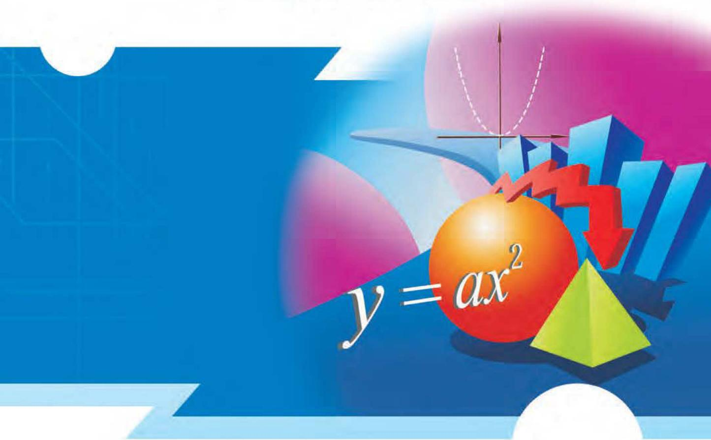

text_image

y = ax²

# 义务教育教科书

# SHU XUE 数学

# 九年级 下册

主 编 马 复

副主编 史炳星 章飞

本册主编 蔡春霞 王建波

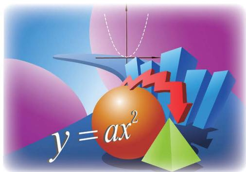

text_image

y = ax^2

北京师范大学出版社

· 北京 ·

# 走进数学新天地

亲爱的同学，祝贺你迎来了义务教育阶段最后一个学期的数学学习生活！

将近 9 年的数学学习生活，一定在你的脑海里留下了深刻的印记：学到了许多数学知识和数学方法，积累了一些数学活动的经验，解决了一些基本的数学问题和简单的“非数学”问题……这些都是你数学学习的成果。

“数学是什么？”“数学有什么作用？”相信你在9年数学学习生活结束时，会对这些有一个初步的认识，并自豪地说：“数学使我变得更聪明！”

在本册教科书中，我们将要学习一些新的内容——

“直角三角形的边角关系”与生活密切相关，与相似、比例、函数等有着千丝万缕的联系，学习它将有益于我们了解数形之间的关系，进一步体会到数学的价值。

二次函数是一种较为复杂的“经典”函数，对它的研究将使我们体会到二次函数的广泛应用和研究函数的基本思路、方法和内容，而这一切又是你未来数学学习的重要知识基础。

我们还要学习“圆”这种熟悉而又神秘的平面图形，用你所擅长的思路和方法去探索它的性质，了解它与所熟悉的平面图形之间的关系……

另外，通过再次经历统计活动，你将对统计活动全过程有更深刻的认识；通过研究商场里各种促销方案的收益，你将体会到统计与概率之间的内在联系；通过设计一种实用的遮阳篷，你会进一步感受到数学在生活中的广泛应用。

自己想一想、做一做，与同伴们议一议，读一读教科书，听一听老师的讲解，并在日常生活中尝试使用数学。事实上，对数学了解得越多，就越能体会到她的意义与趣味。

相信你一定能够学好数学、用好数学!

# 第一章 直角三角形的边角关系

1 锐角三角函数……2  
2 30°, 45°, 60°角的三角函数值 ……8  
3 三角函数的计算……12  
4 解直角三角形……16  
5 三角函数的应用……19  
6 利用三角函数测高……22

回顾与思考……24

复习题……24

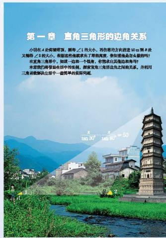

text_image

第一章 直角三角形的边角关系
公司在4处福建顶顶，铜骨√1的大小，再作落的方向接近50m厚×8处又缩短√8的大小。即使这些地被求出了背离高度，你可能像是怎么像吗？
在直角三角形中，如这一和一个拐角，你想求出其沿边角吗？
本章我们将拿底生活中的实例，挪家直角三角形边角之间的关系，并利用三角函数解决出错中一些简单的实际问题。

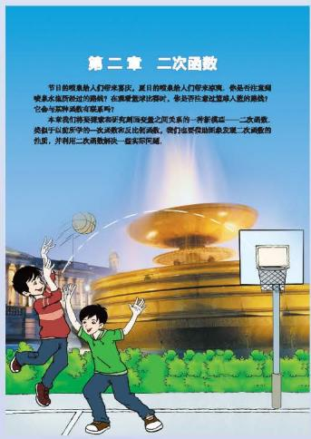

text_image

第二章 二次函数
节目的喷嚏给人带来暴饮，其目的喷嚏给人带来玫瑰。你是有往复闻喷嚏水瓶质经过的函数？在感觉疲劳比即时，你是若往往处受降入显的曲线？
它参与某种函数有联系吗？
本来我们将被接受新的研究而衡量之共同关系的一种影视高——二次函数，
类似于从最所学的一次函数和反论的函数，我们注意到她会更加二次函数的
性质，并利用二次函数映射一般失平而减。

# 第二章 二次函数

1 二次函数……29  
2 二次函数的图象与性质……32  
3 确定二次函数的表达式……42  
4 二次函数的应用……46  
5 二次函数与一元二次方程……51

回顾与思考……58

复习题……58

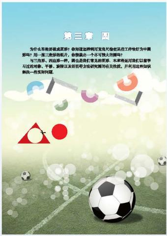

text_image

第三章
为什么车场要做成亚洲？你知道在阿姆可靠身轮在这些工件恰好为中国吗？用一篮三篮的敲片，你能避去一个尽可能大的罪吗？
与三角形、四边形一样，跟也是我们普及的差距。水库将把他们以备学习过的对象、平移、旋转以及思考方法研究的有关性质，并利用这些知识解决一些实际问题。

# 第三章 圆

1 圆……65

2 圆的对称性……70

\*3 垂径定理……74

4 圆周角和圆心角的关系……78

5 确定圆的条件……85

6 直线和圆的位置关系……89

\*7 切线长定理……94

8 圆内接正多边形……97

9 弧长及扇形的面积……100

回顾与思考……103

复习题……103

# 综合与实践

\- 视力的变化 …… 110

# 综合与实践
$\odot$ 哪种方式更合算 …… 114

# 综合与实践
设计遮阳篷 …… 117

# 总复习

120

# 第一章 直角三角形的边角关系

小明在 A 处仰望塔顶，测得 $\angle 1$ 的大小，再往塔的方向前进 50 m 到 B 处又测得 $\angle 2$ 的大小，根据这些他就求出了塔的高度。你知道他是怎么做的吗？

在直角三角形中，知道一边和一个锐角，你能求出其他边和角吗？

本章我们将借助生活中的实例，探索直角三角形边角之间的关系，并利用三角函数解决生活中一些简单的实际问题.

# 学习目标

探索直角三角形的边角关系，发展几何直观  
探索 $30^{\circ}$ , $45^{\circ}$ , $60^{\circ}$ 角的三角函数值  
- 学会用计算器解决一些三角函数计算问题  
用三角函数解决实际问题，发展应用意识
$\frac {x}{\tan 3 0 ^ {\circ}} - \frac {x}{\tan 6 0 ^ {\circ}} = 5 0$

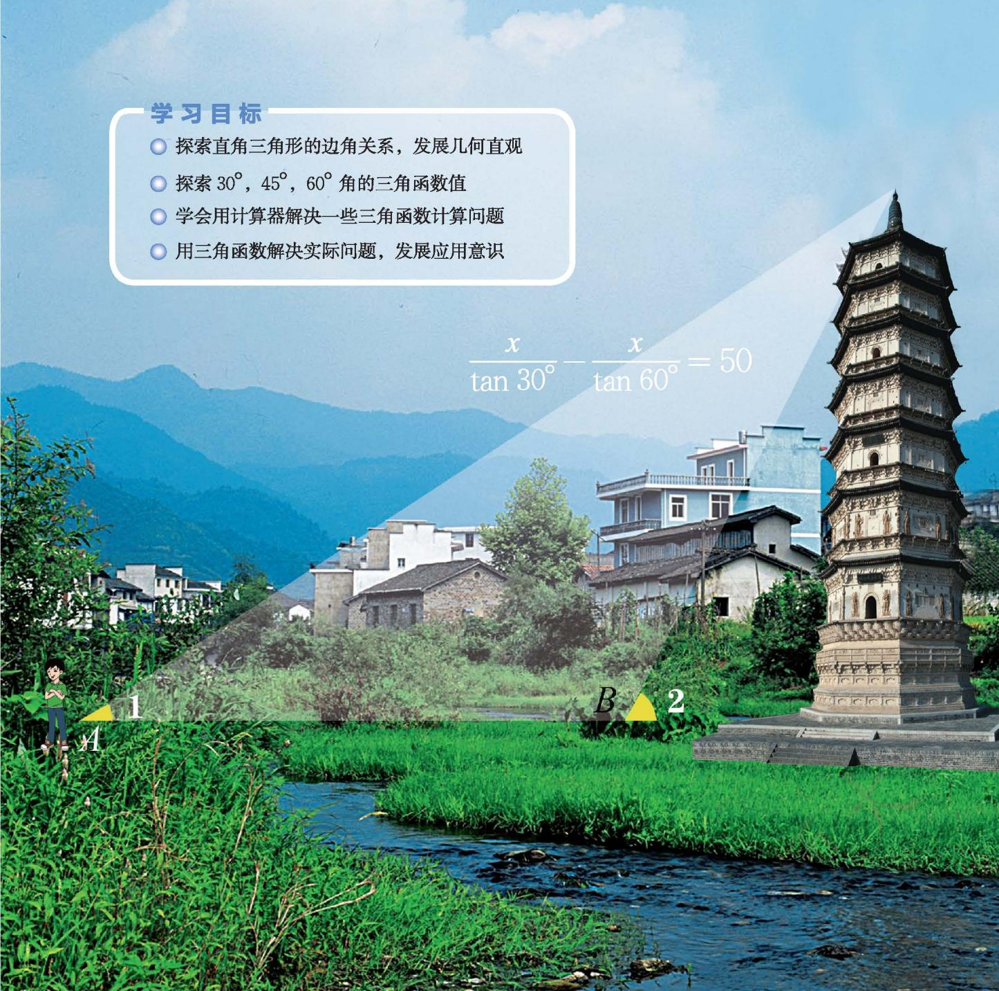

text_image

学习目标
○ 探索直角三角形的边角关系，发展几何直观
○ 探索 30°，45°，60° 角的三角函数值
○ 学会用计算器解决一些三角函数计算问题
○ 用三角函数解决实际问题，发展应用意识
x / tan 30° - x / tan 60° = 50
B 2

# 1

# 锐角三角函数

梯子是我们日常生活中常见的物体.
（1）在图1-1中，梯子 $AB$ 和 $EF$ 哪个更陡？你是怎样判断的？你有几种判断方法？

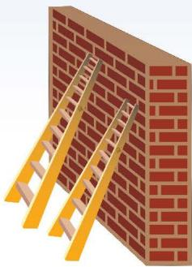

natural_image

Illustration of a brick wall with yellow ladders and a brick wall, no text or symbols present

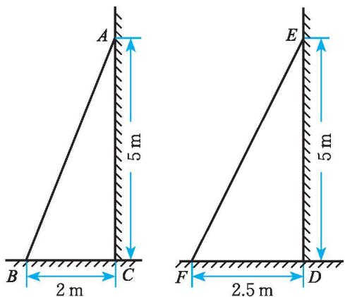

text_image

A
5 m
B
2 m
C
E
5 m
F
2.5 m
D

图1- 1

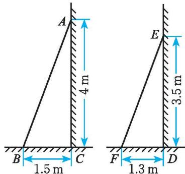

text_image

A
4 m
B
1.5 m
C
E
3.5 m
F
1.3 m
D

图1-2
(2) 在图 1-2 中, 梯子 $AB$ 和 $EF$ 哪个更陡? 你是怎样判断的?

# 想一想

如图1-3，小明想通过测量 $B_{1}C_{1}$ 及 $AC_{1}$ ，算出它们的比，来说明梯子的倾斜程度；而小亮则认为，通过测量 $B_{2}C_{2}$ 及 $AC_{2}$ ，算出它们的比，也能说明梯子的倾斜程度。你同意小亮的看法吗？
（1）直角三角形 $AB_{1}C_{1}$ 和直角三角形 $AB_{2}C_{2}$ 有什么关系？
(2) $\frac{B_{1}C_{1}}{AC_{1}}$ 和 $\frac{B_{2}C_{2}}{AC_{2}}$ 有什么关系?

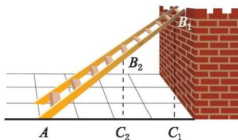

text_image

A
C₂
C₁
B₁
B₂

图1-3
(3) 如果改变 $B_{2}$ 在梯子上的位置呢? 由此你能得出什么结论?

如图 1-4，在 Rt△ABC 中，如果锐角 A 确定，那么 ∠A 的对边与邻边的比便随之确定，这个比叫做 ∠A 的正切（tangent），记作 tan A①，即
$\tan A = \frac {\angle A \text {的对边}}{\angle A \text {的邻边}}.$

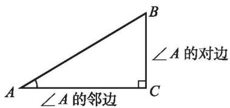

text_image

∠A的邻边
∠A的对边
A
C
B

图1-4
当锐角 $A$ 变化时, $\tan A$ 的值也随之变化.

# 议一议

在图 1-3 中，梯子的倾斜程度与 $\tan A$ 有关系吗？

$\tan A$ 的值越大，梯子越陡.

> [!example]- 例1 图 1-5 表示甲、乙两个自动扶梯，哪一个自动扶梯比较陡？
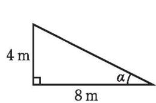

text_image

4 m
8 m
α

(甲)

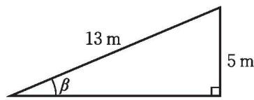

text_image

13 m
β
5 m

(乙)   
图1-5
解：甲梯中，
$\tan \alpha = \frac {4}{8} = \frac {1}{2}.$

乙梯中，
$\tan \beta = \frac {5}{\sqrt {1 3 ^ {2} - 5 ^ {2}}} = \frac {5}{1 2}.$
因为 $\tan\alpha > \tan\beta$ ，所以甲梯更陡.

正切也经常用来描述山坡的坡度①．例如，有一山坡在水平方向上每前进100 m 就升高 60 m（图 1-6），那么山坡的坡度就是
$\tan \alpha = \frac {6 0}{1 0 0} = \frac {3}{5}.$

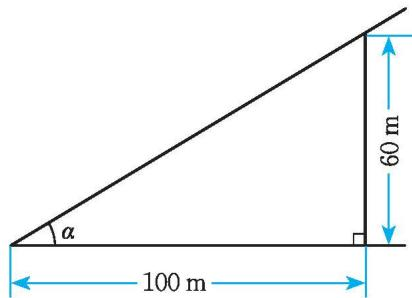

text_image

60 m
α
100 m

图1-6

# 随堂练习

1. 如图, $\triangle ABC$ 是等腰三角形, 你能根据图中所给数据求出 $\tan C$ 吗?

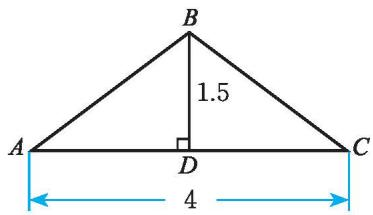

text_image

B
1.5
A
D
C
4

(第1题)

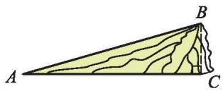

natural_image

Geometric diagram of a triangular prism with labeled vertices A, B, and C (no text or symbols present)

(第2题)

2. 如图, 某人从山脚下的点 $A$ 走了 $200 \mathrm{~m}$ 后到达山顶的点 $B$ , 已知点 $B$ 到山脚的垂直距离为 $55 \mathrm{~m}$ , 求山的坡度 (结果精确到 0.001).

# 习题 1.1

# 知识技能

1. 在 Rt△ABC 中，∠C=90°，AC=5，AB=13，求 tanA 和 tanB.

2. 在 Rt△ABC 中，∠C=90°，BC=3， $\tan A=\frac{5}{12}$ ，求 AC.

# 数学理解

3. 观察你们学校、你家或附近的楼梯，哪个更陡？

# 联系拓广

4. 在 Rt△ABC 中，∠C=90°，tanA 与 tanB 有什么关系？

如图1-7，当 $\mathrm{Rt}\triangle ABC$ 中的锐角 $A$ 确定时， $\angle A$ 的对边与邻边的比便随之确定。此时，其他边之间的比也确定吗？与同伴进行交流。

在 Rt△ABC 中，如果锐角 A 确定，那么 $\angle A$ 的对边与斜边的比、邻边与斜边的比也随之确定.

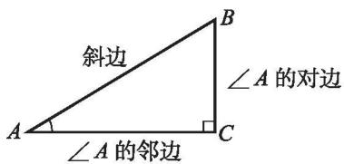

text_image

斜边
∠A的对边
∠A的邻边

图1-7

$\angle A$ 的对边与斜边的比叫做 $\angle A$ 的正弦（sine），记作 $\sin A$ ，即
$\sin A = \frac {\angle A \text {的对边}}{\text {斜边}}.$
$\angle A$ 的邻边与斜边的比叫做 $\angle A$ 的余弦（cosine），记作 $\cos A$ ，即
$\cos A = \frac {\angle A \text {的邻边}}{\text {斜边}}.$

锐角 $A$ 的正弦、余弦和正切都是 $\angle A$ 的三角函数（trigonometric function）. 当锐角 $A$ 变化时，相应的正弦、余弦和正切值也随之变化.

# 想一想

在图1-3中，梯子的倾斜程度与 $\sin A$ 和 $\cos A$ 有关系吗？

$\sin A$ 的值越大，梯子越陡；
cos A 的值越小，梯子越陡.

> [!example]- 例2 如图 1-8, 在 Rt△ABC 中, ∠B = 90°, AC = 200, sin A = 0.6, 求 BC 的长.
解：在 Rt△ABC 中，
$\because \quad \sin A = \frac {B C}{A C},$
即 $\frac{BC}{200}=0.6,$
$\therefore B C = 2 0 0 \times 0. 6 = 1 2 0.$

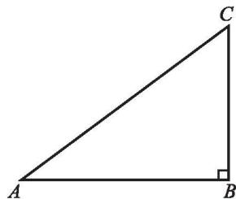

natural_image

Right triangle labeled with vertices A, B, and C, showing right angle at B (no additional text or symbols)

图1-8

# 做一做

如图1-9，在 $\mathrm{Rt}\triangle ABC$ 中， $\angle C = 90^{\circ}$ $\cos A = \frac{12}{13},AC = 10,AB$ 等于多少？ $\sin B$ 呢？

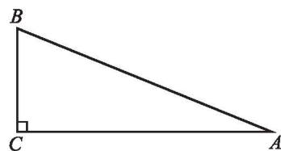

text_image

B
C
A

图1-9

# 随堂练习

1. 在等腰三角形 $ABC$ 中, $AB = AC = 5$ , $BC = 6$ , 求 $\sin B$ , $\cos B$ , $\tan B$ .

2. 在 $\triangle ABC$ 中, $\angle C = 90^{\circ}$ , $\sin A = \frac{4}{5}$ , $BC = 20$ , 求 $\triangle ABC$ 的周长和面积.

# 习题 1.2

# 知识技能

1. 如图,分别求 $\angle \alpha$ 和 $\angle \beta$ 的正弦、余弦和正切.

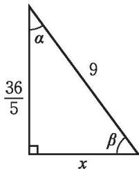

text_image

36/5
α
9
β
x

(第1题)

# 数学理解

2. 如何用正弦、余弦、正切来刻画梯子的倾斜程度?

# 联系拓广

3. 在 Rt△ABC 中，∠C=90°，sin A 与 cos B 有什么关系？

4. 在 Rt△ABC 中，∠BCA=90°，CD 是 AB 边上的中线，BC=8，CD=5，求 sin∠ACD，cos∠ACD 和 tan∠ACD。

5. 在 $\triangle ABC$ 中, $\angle BAC > 90^{\circ}$ , $AB = 5$ , $BC = 13$ , $AD$ 是 $BC$ 边上的高, $AD = 4$ , 求 $CD$ 和 $\sin C$ . 如果 $\angle BAC < 90^{\circ}$ 呢?

# $30^{\circ}$ , $45^{\circ}$ , $60^{\circ}$ 角的三角函数值

观察一副三角尺，其中有几个锐角？它们分别等于多少度？
(1) $\sin 30^{\circ}$ 等于多少？你是怎样得到的？与同伴进行交流.
(2) $\cos 30^{\circ}$ 等于多少? $\tan 30^{\circ}$ 呢?

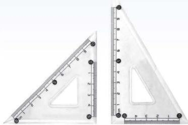

natural_image

Two transparent triangular rulers with measurement markings, one upright and one tilted (no text or symbols visible)

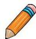

# 做一做
(1) $60^{\circ}$ 角的三角函数值分别是多少？你是怎样得到的？  
(2) $45^{\circ}$ 角的三角函数值分别是多少？你是怎样得到的？  
(3) 完成下表:

<table><tr><td>三角函数值\三角函数角α</td><td>sin α</td><td>cos α</td><td>tan α</td></tr><tr><td>30°</td><td></td><td></td><td></td></tr><tr><td>45°</td><td></td><td></td><td></td></tr><tr><td>60°</td><td></td><td></td><td></td></tr></table>

# 例1 计算:
(1) $\sin 30^{\circ} + \cos 45^{\circ}$ ;   
(2) $\sin^{2}60^{\circ} + \cos^{2}60^{\circ} - \tan 45^{\circ}$
解：（1） $\sin30^{\circ}+\cos45^{\circ}=\frac{1}{2}+\frac{\sqrt{2}}{2}=\frac{1+\sqrt{2}}{2};$
(2) $\sin^2 60^\circ + \cos^2 60^\circ - \tan 45^\circ = \frac{3}{4} + \frac{1}{4} - 1 = 0.$

> [!example]- 例2 如图1-10, 一个小孩荡秋千, 秋千链子的长度为 $2.5 \mathrm{~m}$ , 当秋千向两边摆动时, 摆过的角度 $\angle B O D$ 恰好为 $60^{\circ}$ , 且两边的摆动角度相同, 求它摆至最高位置时与摆至最低位置时的高度之差 (结果精确到 $0.01 \mathrm{~m}$ ).
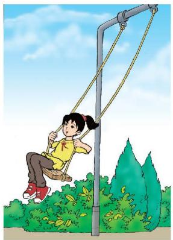

natural_image

Illustration of a girl swinging on a pole outdoors with greenery and trees in the background (no text or symbols)

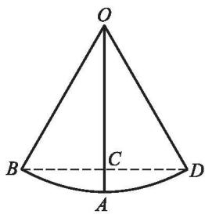

text_image

O
B
C
A
D

图1-10
解：根据题意可知，
$\angle A O D = \frac {1}{2} \times 6 0 ^ {\circ} = 3 0 ^ {\circ}, O D = 2. 5 \mathrm{m},$
$\therefore O C = O D \cos 3 0 ^ {\circ} = 2. 5 \times \frac {\sqrt {3}}{2} \approx 2. 1 6 5 (\mathrm{m}).$
$\therefore A C = 2. 5 - 2. 1 6 5 \approx 0. 3 4 (\mathrm{m}).$
所以，最高位置与最低位置的高度差约为 0.34 m.

# 随堂练习

1. 计算：
(1) $\sin 60^{\circ} - \tan 45^{\circ}$ ;
(2) $\cos 60^{\circ} + \tan 60^{\circ}$ ;
(3) $\frac{\sqrt{2}}{2}\sin 45^{\circ} + \sin 60^{\circ} - 2\cos 45^{\circ}$ .

2. 某商场有一自动扶梯, 其倾斜角为 $30^{\circ}$ , 高为 $7 \mathrm{~m}$ . 扶梯的长度是多少?

# 习题 1.3

# 知识技能

1. 计算：
(1) $\tan 45^{\circ} - \sin 30^{\circ}$ ; (2) $\cos 60^{\circ} + \sin 45^{\circ} - \tan 30^{\circ}$ ;
(3) $6 \tan^{2} 30^{\circ} - \sqrt{3} \sin 60^{\circ} - 2 \cos 45^{\circ}$ .

2. 如图, 河岸 $AD$ , $BC$ 互相平行, 桥 $AB$ 垂直于两岸, 桥长 $12 \mathrm{~m}$ , 在 $C$ 处看桥两端 $A, B$ , 夹角 $\angle BCA = 60^{\circ}$ , 求 $B, C$ 间的距离 (结果精确到 $1 \mathrm{~m}$ ).

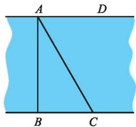

text_image

A
D
B
C

(第2题)

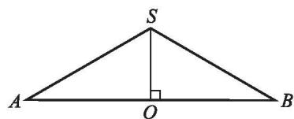

text_image

S
A O B

(第3题)

3. 如图, ${SO}$ 是等腰三角形 ${SAB}$ 的高,已知 $\angle {ASB} = {120}^{ \circ  },{AB} = {54}$ ,求 ${SO}$ 的长.

# 问题解决

4. 如图, 身高 $1.75 \mathrm{~m}$ 的小丽用一个两锐角分别为 $30^{\circ}$ 和 $60^{\circ}$ 的三角尺测量一棵树的高度 ( $\angle A = 30^{\circ}$ ), 已知她与树之间的距离为 $5 \mathrm{~m}$ , 那么这棵树大约有多高? (结果精确到 $0.1 \mathrm{~m}$ )

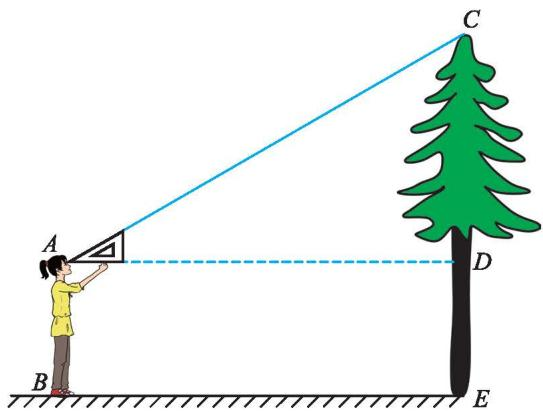

text_image

A
B
C
D
E

(第4题)

5. 如图, 一段长 $1500 \mathrm{~m}$ 的水渠, 它的横截面为梯形 $A B C D$ , 其中 $A B \parallel C D$ , $B C = A D$ , 渠深 $A E = 0.8 \mathrm{~m}$ , 底 $A B = 1.2 \mathrm{~m}$ , 坡角为 $45^{\circ}$ , 那么该段水渠最多能蓄水多少立方米?

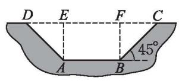

text_image

D E F C
A B 45°

(第5题)

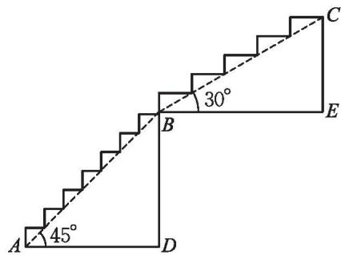

text_image

A 45°
B 30°
C
D
E

(第6题)

6. 某阶梯的形状如图所示, 其中线段 $AB = BC$ , $AB$ 部分的坡角为 $45^{\circ}$ , $BC$ 部分的坡角为 $30^{\circ}$ , $AD = 1.5 \mathrm{~m}$ . 如果每个台阶的高不超过 $20 \mathrm{~cm}$ , 那么这一阶梯至少有多少个台阶? (最后一个台阶的高不足 $20 \mathrm{~cm}$ 时, 按一个台阶计算)

# 三角函数的计算

如图 1-11, 当登山缆车的吊厢经过点 $A$ 到达点 $B$ 时, 它走过了 $200 \mathrm{~m}$ . 已知缆车行驶的路线与水平面的夹角为 $\angle \alpha = 16^{\circ}$ , 那么缆车垂直上升的距离是多少? (结果精确到 $0.01 \mathrm{~m}$ )

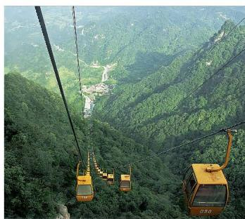

natural_image

Scenic view of a cable car cabin suspended over lush green mountains, with no visible text or symbols.

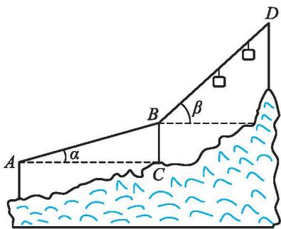

text_image

A
α
B
β
C
D

图 1-11

在 Rt△ABC 中，∠ACB = 90°，BC = AB sin 16°.

你知道 $\sin 16^{\circ}$ 是多少吗？我们可以借助科学计算器求锐角的三角函数值.

怎样用科学计算器求三角函数值呢？

用科学计算器求三角函数值, 要用到 $\sin^2 D$ 和 $\tan^2 F$ 键. 例如, 求 $\sin 16^\circ$ , $\cos 72^\circ 38' 25''$ 和 $\tan 85^\circ$ 的按键顺序如下表所示.

<table><tr><td></td><td>按键顺序</td><td>显示结果1</td></tr><tr><td>sin 16°</td><td>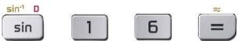</td><td>sin 16° = 0.275 637 355 8</td></tr><tr><td>cos 72°38'25"</td><td>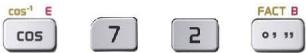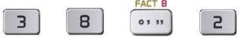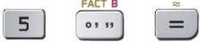按键顺序</td><td>cos 72°38'25" = 0.298 369 906 7显示结果</td></tr><tr><td> $\tan 85^{\circ}$ </td><td></td><td> $\tan 85^{\circ}=11.430\ 052\ 3$ </td></tr></table>

对于本节一开始的问题，利用科学计算器可以求得
$B C = 2 0 0 \sin 1 6 ^ {\circ} \approx 5 5. 1 2 (\mathrm{m}).$

# 议一议

在本节一开始的问题中，当缆车继续由点 B 到达点 D 时，它又走过了 200 m，缆车由点 B 到点 D 的行驶路线与水平面的夹角为 $\angle\beta=42^{\circ}$ ，由此你还能计算什么？

# 想一想

为了方便行人推自行车过某天桥，市政府在 $10 \, m$ 高的天桥两端修建了 $40 \, m$ 长的斜道（图 1-12）。这条斜道的倾斜角是多少？

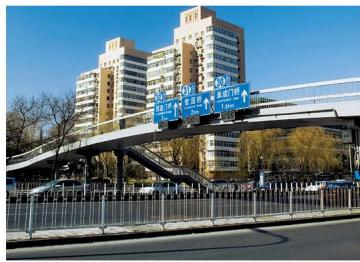

text_image

Street photo showing elevated highway traffic with visible road signs and building facades in the background

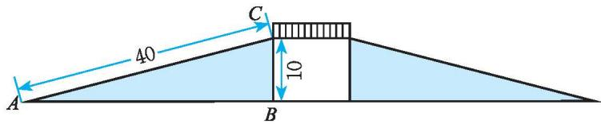

text_image

40
C
10
A
B

图1-12

如图 1-12, 在 Rt△ABC 中, $\sin A = \frac{BC}{AC} = \frac{10}{40} = \frac{1}{4}$ , 那么 ∠A 是多少度呢?

要解决这个问题，我们可以借助科学计算器。

已知三角函数值求角度，要用到 $\sin^{-1}D$ $\cos^{-1}E$ $\tan^{-1}F$ 键的第二功能 “ $\sin^{-1}$ ， $\cos^{-1}$ ， $\tan^{-1}$ ” 和 键。例如，已知 $\sin A$ ， $\cos B$ ， $\tan C$ ，求 $\angle A$ ， $\angle B$ ， $\angle C$ 的度数的按键顺序如下表所示。

<table><tr><td></td><td>按键顺序</td><td>显示结果</td></tr><tr><td>sin A = 0.9816</td><td>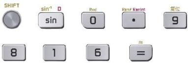</td><td> $\sin^{-1} 0.9816 = 78.99184039$ </td></tr><tr><td>cos B = 0.8607</td><td>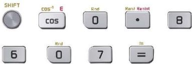</td><td> $\cos^{-1} 0.8607 = 30.60473007$ </td></tr><tr><td>tan C = 56.78</td><td>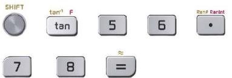</td><td> $\tan^{-1} 56.78 = 88.99102049$ </td></tr></table>

上表的显示结果是以 “度” 为单位的。再按 FACT B 键即可显示以 “度、分、秒” 为单位的结果①。

你能求出图 1-12 中 $\angle A$ 的度数吗?

# 随堂练习

1. 用计算器求下列各式的值:
(1) $\sin 56^{\circ}$ ;
(2) $\cos 20.5^{\circ}$ ;
(3) $\tan 44^{\circ}59'59''$ ;
(4) $\sin 15^{\circ} + \cos 61^{\circ} + \tan 76^{\circ}$ .

2. 已知 $\sin \theta = 0.82904$ ，求锐角 $\theta$ 的度数。

3. 在某次 “重走革命先辈路” 的主题教育活动中, 九 (1) 班同学需要翻越一座小山. 他们由山底先爬坡角为 $40^{\circ}$ 的山坡 $300 \mathrm{~m}$ , 再爬坡角为 $30^{\circ}$ 的山坡 $100 \mathrm{~m}$ 到达山顶. 这座小山有多高? (结果精确到 $0.1 \mathrm{~m}$ )

4. 一梯子斜靠在一面墙上。已知梯长 $4 \mathrm{~m}$ , 梯子位于地面上的一端离墙壁 $2.5 \mathrm{~m}$ , 求梯子与地面所成锐角的度数。

## 习题1.4

# 知识技能

1. 用计算器求下列各式的值:
(1) $\tan 32^{\circ}$ ;
(2) $\cos 24.53^{\circ}$ ;
(3) $\sin 62^{\circ}11'$ ;
(4) $\tan 39^{\circ}39'39''$ .

2. 用计算器求下列各式的值:
(1) $\sin^{2}56^{\circ}+\cos^{2}25^{\circ};$
(2) $\sin 62.6^{\circ} - 2\sin 37^{\circ}\cdot \cos 20^{\circ}.$

3. 根据下列条件求锐角 $\theta$ 的度数:
(1) $\tan\theta=2.9888;$
(2) $\sin \theta = 0.3957$ ;
(3) $\cos\theta=0.7850;$
(4) $\tan \theta = 0.8972$ .

# 问题解决

4. 如图, 物华大厦离小伟家 $60 \mathrm{~m}$ , 小伟从自家的窗中眺望大厦, 并测得大厦顶部的仰角 ① (angle of elevation) 是 $45^{\circ}$ , 而大厦底部的俯角 ② (angle of depression) 是 $37^{\circ}$ , 求该大厦的高度 (结果精确到 $0.1 \mathrm{~m}$ ).

5. 一辆汽车沿着一山坡行驶了 $1000 \mathrm{~m}$ , 其铅直高度上升了 $50 \mathrm{~m}$ . 求山坡与水平面所成锐角的度数.

6. 在 $1: 20000$ 的平面地图上, 量得甲、乙两地的直线距离为 $1.5 \mathrm{~cm}$ , 两地的实际高度相差 $27 \mathrm{~m}$ , 求甲、乙两地间的坡角.

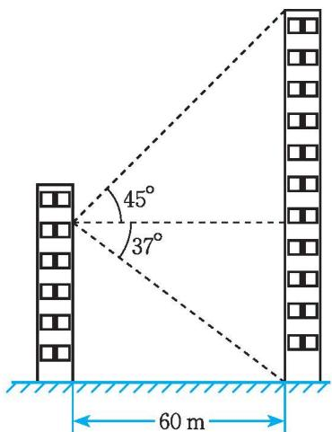

text_image

45°
37°
60 m

(第4题)

# 4

# 解直角三角形

生活中，我们常常遇到与直角三角形有关的问题。为了解决这些问题，往往需要确定直角三角形的边和角。

直角三角形中有 6 个元素，分别是三条边和三个角．那么至少知道几个元素，就可以求出其他的元素呢？

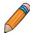

# 做一做

在 Rt△ABC 中，如果已知其中两边的长，你能求出这个三角形的其他元素吗？

> [!example]- 例1 在 Rt△ABC 中，∠C = 90°，∠A，∠B，∠C 所对的边分别为 a，b，c，且 $a = \sqrt{15}$ ， $b = \sqrt{5}$ ，求这个三角形的其他元素.
解：在 Rt△ABC 中， $a^{2}+b^{2}=c^{2}$ ， $a=\sqrt{15}$ ， $b=\sqrt{5}$ ，
$\therefore c = \sqrt {a ^ {2} + b ^ {2}} = \sqrt {(\sqrt {1 5}) ^ {2} + (\sqrt {5}) ^ {2}} = 2 \sqrt {5}.$

在 Rt△ABC 中， $\sin B=\frac{b}{c}=\frac{\sqrt{5}}{2\sqrt{5}}=\frac{1}{2}$
$\therefore \angle B = 3 0 ^ {\circ}.$
$\therefore \angle A = 6 0 ^ {\circ}.$
由直角三角形中已知的元素，求出所有未知元素的过程，叫做解直角三角形.

# 想一想

在 Rt△ABC 中，如果已知一边和一个锐角，你能求出这个三角形的其他元素吗？

> [!example]- 例2 在 Rt△ABC 中，∠C=90°，∠A，∠B，∠C 所对的边分别为 a, b, c,
且 $b = 30, \angle B = 25^{\circ}$ , 求这个三角形的其他元素 (边长精确到1).
解：在 Rt△ABC 中，∠C=90°，∠B=25°，
$\therefore \angle A = 6 5 ^ {\circ}.$
$\because \quad \sin B = \frac {b}{c}, b = 3 0,$
$\therefore c = \frac {b}{\sin B} = \frac {3 0}{\sin 2 5 ^ {\circ}} \approx 7 1.$
$\because \quad \tan B = \frac {b}{a}, b = 3 0,$
$\therefore a = \frac {b}{\tan B} = \frac {3 0}{\tan 2 5 ^ {\circ}} \approx 6 4.$

在直角三角形的 6 个元素中, 直角是已知元素, 如果再知道一条边和第三个元素, 那么这个三角形的所有元素就都可以确定下来.

# 随堂练习

在 Rt△ABC 中，∠C=90°，∠A，∠B，∠C所对的边分别为 a, b, c，根据下列条件求出直角三角形的其他元素（角度精确到 1°）：
(1) 已知 a=4, b=8;  
(2) 已知 b=10， $\angle B=60^{\circ}$ ;  
(3) 已知 c=20， $\angle A=60^{\circ}$ .

# 习题 1.5

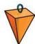

# 知识技能

1. 在 Rt△ABC 中，∠C=90°，∠A，∠B，∠C 所对的边分别为 a, b, c，根据下列条件求出直角三角形的其他元素：
(1) $a = 19, c = 19\sqrt{2}$ ;
(2) $a = 6\sqrt{2}, b = 6\sqrt{6}$ .

2. 在 Rt△ABC 中，∠C=90°，∠A，∠B，∠C 所对的边分别为 a, b, c，根据下列条件求出直角三角形的其他元素：
(1) $c = 20, \angle A = 45^{\circ}$ ;
(2) $a = 36, \angle B = 30^{\circ}$ .

# 问题解决

3. 如图, 工件上有一 V 形槽 (AC = BC), 测得它的上口宽 $20 \mathrm{~mm}$ , 深 $19.2 \mathrm{~mm}$ , 求 V 形角 ( $\angle ACB$ ) 的度数 (结果精确到 $1^{\circ}$ ).

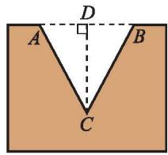

text_image

A
D
B
C

(第3题)

4. 要想使人安全地攀上斜靠在墙面上的梯子的顶端, 梯子与地面所成的角 $\alpha$ 一般要满足 $50^{\circ} \leqslant \angle \alpha \leqslant 75^{\circ}$ . 如果现有一个长 $6 \mathrm{~m}$ 的梯子, 那么
(1) 使用这个梯子最高可以安全攀上多高的墙? (结果精确到0.1m)  
(2)当梯子底端距离墙面 $2.4 \mathrm{~m}$ 时, 梯子与地面所成的锐角 $\alpha$ 等于多少? (结果精确到 $1^{\circ}$ ) 这时人是否能够安全使用这个梯子?

# 5

# 三角函数的应用

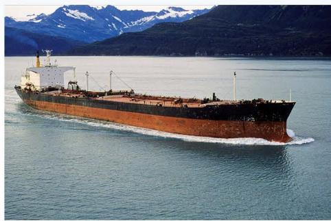

natural_image

Large cargo ship sailing on calm sea with snow-capped mountains in the background (no visible text or symbols)

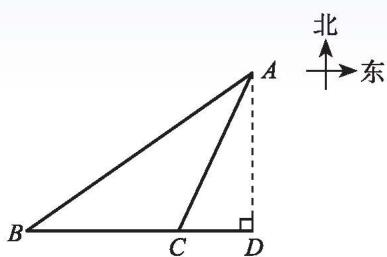

text_image

北
东
A
B
C
D

图1-13

如图 1-13, 海中有一个小岛 $A$ , 该岛四周 $10 \mathrm{~n} \mathrm{mile}$ 内有暗礁。今有货轮由西向东航行, 开始在 $A$ 岛南偏西 $55^{\circ}$ 的 $B$ 处, 往东行驶 $20 \mathrm{~n} \mathrm{mile}$ 后到达该岛的南偏西 $25^{\circ}$ 的 $C$ 处。之后, 货轮继续向东航行。

你认为货轮继续向东航行途中会有触礁的危险吗？你是怎样想的？与同伴进行交流。

# 想一想

如图 1-14，小明想测量塔 $CD$ 的高度。他在 $A$ 处仰望塔顶，测得仰角为 $30^{\circ}$ ，再往塔的方向前进 $50 \mathrm{~m}$ 至 $B$ 处，测得仰角为 $60^{\circ}$ ，那么该塔有多高？（小明的身高忽略不计，结果精确到 $1 \mathrm{~m}$ ）

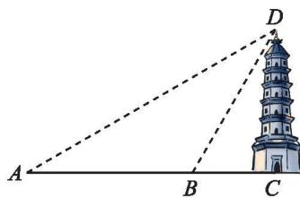

text_image

Geometric diagram showing a tower with labeled points A, B, C, D and dashed lines forming angles

图1-14

# 做一做

某商场准备改善原有楼梯的安全性能，把倾斜角由 $40^{\circ}$ 减至 $35^{\circ}$ ，已知原楼梯长为 $4 \mathrm{~m}$ ，调整后的楼梯会加长多少？楼梯多占多长一段地面？（结果精确到 $0.01 \mathrm{~m}$ ）

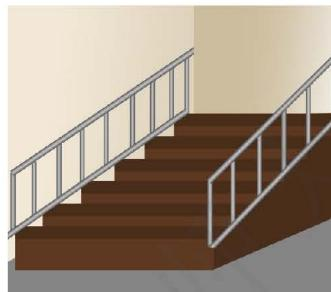

natural_image

Illustration of a staircase with metal railings and a white railing (no text or symbols)

# 随堂练习

1. 如图, 一灯柱 $AB$ 被一钢缆 $CD$ 固定, $CD$ 与地面成 $40^{\circ}$ 夹角, 且 $DB = 5 \mathrm{~m}$ . 在 $C$ 点上方 $2 \mathrm{~m}$ 处加固另一条钢缆 $ED$ , 那么钢缆 $ED$ 的长度为多少? (结果精确到 $0.01 \mathrm{~m}$ )

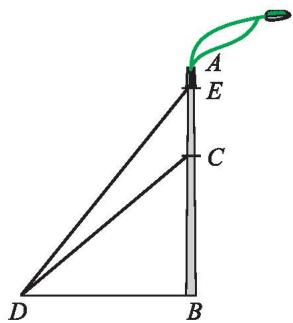

text_image

Geometric diagram showing triangle with labeled points A, B, C, D, E and a green arc extending from point A to point E

(第1题)
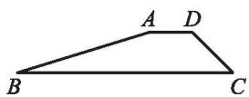

（第2题）

2. 如图, 水库大坝的横截面是梯形 $ABCD$ , 其中 $AD \parallel BC$ , 坝顶 $AD = 6 \mathrm{~m}$ , 坡长 $CD = 8 \mathrm{~m}$ , 坡底 $BC = 30 \mathrm{~m}$ , $\angle ADC = 135^{\circ}$ .
(1) 求 $\angle ABC$ 的度数;  
(2) 如果坝长 $100 \mathrm{~m}$ , 那么建筑这个大坝共需多少土石料? (结果精确到 $0.01 \mathrm{~m}^{3}$ )

# 读一读

# 三角学的发展

“三角学”（trigonometry）一词源于希腊文的“三角形”与“测量”，原意是“三角形的测量”。后来，人们把利用三角函数研究三角形和其他图形的数量关系，进而研究三角函数的性质及其应用的数学学科称为三角学。

三角学的发展大致可分为三个时期。从远古至11世纪前为第一个时期。在此期间，虽然人们还没有明确提到三角形的边与角之间的数量关系，更没有角的函数的概念，但是人们已经能够利用当时掌握的数学知识解决属于三角学范围内的一些实际问题。

11\~18世纪是三角学发展的第二个时期。这一时期，由于测量、贸易和航海等方面的需要，三角学得到了迅速发展，并逐渐形成一门独立的数学学科．在此期间，人们编制出大量的三角函数表，三角函数得到广泛应用.

第三个时期是 18 世纪以后, 这时三角学的研究逐步演变为研究三角函数的性质及其应用, 而且引进了现在所使用的三角函数符号.

三角学输入我国，开始于明崇祯年间。《崇祯历书》中的《大测》和《测量全义》最早介绍了西方三角学。其中，《大测》由邓玉函（1576—1630）译撰，这是我国第一部三角学著作；《测量全义》由罗雅谷（1593—1638）译撰、汤若望（1591—1666）订。1877年华蘅芳（1833—1902）与英国人傅兰雅（J.Fryer，1839—1928）合译英国人海麻士（I.Hymers，1803—1877）的《三角数理》，这是三角学第二次输入我国。

# 习题 1.6

# 问题解决

1. 如图, 有一斜坡 $AB$ 长 $40 \mathrm{~m}$ , 坡顶离地面的高度为 $20 \mathrm{~m}$ , 求此斜坡的倾斜角.

2. 有一座建筑物，在地面上 $A$ 点测得其顶点 $C$ 的仰角为 $30^{\circ}$ . 向建筑物的方向前进 $50 \mathrm{~m}$ 到 $B$ 点, 又测得 $C$ 的仰角为 $45^{\circ}$ , 求建筑物的高度 (结果精确到 $0.1 \mathrm{~m}$ ).

3. 榫卵结构是一种我国传统木建筑和家具的主要结构方式,是在两个构件上采用凹凸部位相结合的一种连接方式. 如图,在某燕尾榫中,桦槽的横截面 ${ABCD}$ 是梯形,其中 ${AD}//{BC},{AB} = {DC}$ ,燕尾角 $\angle B = {55}^{ \circ  }$ ,外口宽 ${AD} = {180}\mathrm{\;{mm}}$ ,桦槽深度是 ${70}\mathrm{\;{mm}}$ ,求它的里口宽 ${BC}$ (结果精确到 $1\mathrm{\;{mm}}$ ).

natural_image

Right triangle diagram labeled with vertices A, B, and C (no additional text or symbols)

(第1题)

text_image

180
A D
70
B C

(第3题)

text_image

北
东
N
75°
C
45°
A
B

(第4题)

4. 如图, 一艘货轮以 $36 \mathrm{~km}$ 的速度在海面上航行, 当它行驶到 $A$ 处时, 发现它的东北方向有一灯塔 $B$ . 货轮继续向北航行 $40 \mathrm{~min}$ 后到达 $C$ 处, 发现灯塔 $B$ 在它北偏东 $75^{\circ}$ 方向, 求此时货轮与灯塔 $B$ 的距离 (结果精确到 $0.01 \mathrm{~nmile}$ ).

# 利用三角函数测高

活动课题：利用直角三角形的边角关系测量物体的高度.

活动方式：分组活动、全班交流研讨.

活动工具: 测倾器 (或经纬仪、测角仪等)、皮尺等测量工具.

# 活动一：测量倾斜角.

测量倾斜角可以用测倾器。简单的测倾器由度盘、铅锤和支杆组成（如图1-15）。

使用测倾器测量倾斜角的步骤如下：

1. 把支杆竖直插入地面, 使支杆的中心线、铅垂线和度盘的 $0^{\circ}$ 刻度线重合, 这时度盘的顶线 $PQ$ 在水平位置.  
2. 转动度盘, 使度盘的直径对准目标 $M$ , 记下此时铅垂线所指的度数.

根据测量数据，你能求出目标 $M$ 的仰角或俯角吗？说说你的理由.

text_image

P
Q
90
60
30
0
30
90

图1-15

# 活动二：测量底部可以到达的物体的高度.

所谓 “底部可以到达”，就是在地面上可以无障碍地直接测得测点与被测物体的底部之间的距离。如图 1-16，要测量物体 $MN$ 的高度，可按下列步骤进行：

1. 在测点 A 处安置测倾器，测得 M 的仰角 $\angle MCE = \alpha$ .  
2. 量出测点 A 到物体底部 N 的水平距离 AN = l.  
3. 量出测倾器的高度 AC = a（即顶线 PQ 成水平位置时，它与地面的距离）.

根据测量数据，你能求出物体 MN 的高度吗？说说你的理由。

text_image

M
E
C
N
A

图1-16

活动三：测量底部不可以到达的物体的高度.

所谓 “底部不可以到达”，就是在地面上不能直接测得测点与被测物体的底部之间的距离。如图 1-17，要测量物体 $MN$ 的高度，可按下列步骤进行：

1. 在测点 A 处安置测倾器，测得此时 M 的仰角 $\angle MCE = \alpha$ .

2. 在测点 A 与物体之间的 B 处安置测倾器（A, B 与 N 在一条直线上，且 A, B 之间的距离可以直接测得），测得此时 M 的仰角 $\angle MDE = \beta$ .

3. 量出测倾器的高度 $AC = BD = a$ , 以及测点 $A, B$ 之间的距离 $AB = b$ .

text_image

M
E
D
C
N
B
A

图1-17

根据测量数据，你能求出物体 $MN$ 的高度吗？说说你的理由.

# 议一议
(1) 到目前为止，你有哪些测量物体高度的方法？  
(2) 如果一个物体的高度已知或容易测量, 那么如何测量某测点到该物体的水平距离?

# 习题 1.7

# 问题解决

1. 分组制作简单的测倾器.  
2. 选择一个底部可以到达的物体,测量它的高度,并撰写一份活动报告,阐明活动课题、 测量示意图、测得数据和计算过程等.  
3. 选择一个底部不可以到达的物体,测量它的高度,并撰写一份活动报告.

# 回顾与思考

1. 举例说明锐角三角函数在现实生活中的应用.  
2. 已知锐角，如何用计算器求它的三角函数值？已知三角函数值，如何用计算器求它的对应锐角？  
3. 用具体例子说明如何解直角三角形.  
4. 如何测量一座楼的高度？你能想出几种方法？  
5. 梳理本章内容，用适当的方式呈现全章知识结构，并与同伴进行交流。

# 复习题

# 知识技能

1. 计算：
(1) $\sin 45^{\circ} - \cos 60^{\circ} + \tan 60^{\circ}$ ;
(2) $\cos^2 30^\circ + \sin^2 30^\circ - \tan 45^\circ$ ;
(3) $\sin 30^{\circ} - \tan 30^{\circ} + \cos 45^{\circ}$ .

2. 用计算器求下列各式的值:
(1) $\sin 23^{\circ}5' + \cos 66^{\circ}55'$ ;
(2) $\cos 14^{\circ}28' - \tan 42^{\circ}57'$ ;
(3) $\sin^{2}7.8^{\circ}-\cos65^{\circ}37'+\tan49^{\circ}56''$

3. 在 Rt△ABC 中，∠C=90°，a, b, c 分别为 ∠A，∠B，∠C 的对边.
(1) 已知 a=3, b=3, 求 $\angle A;$
(2) 已知 b=4, c=8，求 a 及 $\angle A$ ;
(3) 已知 $\angle A = 45^{\circ}$ ，c = 8，求 a 及 b.

4. 已知 $\angle A$ 是锐角， $\cos A = \frac{3}{5}$ ，求 $\sin A, \tan A$ .

5. 根据条件求锐角：
(1) $\sin A = 0.675$ ，求 $\angle A;$
(2) $\cos B = 0.0789$ ，求 $\angle B$ ;
(3) $\tan C = 35.6$ ，求 $\angle C$ .

6. 计算:
(1) $\frac{\cos 30^{\circ} - \sin 45^{\circ}}{\sin 60^{\circ} - \cos 45^{\circ}};$
(2) $\sin^{2}30^{\circ} + 2\sin60^{\circ} + \tan45^{\circ} - \tan60^{\circ} + \cos^{2}30^{\circ};$

(3) $\sqrt{1 - 2\tan 60^{\circ} + \tan^{2}60^{\circ}} -\tan 60^{\circ}.$

7. 在 Rt△ABC 中，∠C=90°，∠B=60°，AB=4，求 AC，BC，sin A 和 cos A。

# 数学理解

8. 举一个生活中运用三角函数解决问题的例子.

9. 如图，在 Rt△ABC 中，∠C=90°.
(1) 在 BC 边上取一点 D，使得 BD = DC，则 $\tan \angle ABC$ 和 $\tan \angle ADC$ 有什么大小关系？
(2) 在 $BC$ 边上取一点 $D$ , 使得 $BD = 2DC$ , 则 $\tan \angle ABC$ 和 $\tan \angle ADC$ 有什么大小关系?
(3) 在 $BC$ 边上取一点 $D$ , 使得 $BD = nDC (n > 0)$ , 则 $\tan \angle ABC$ 和 $\tan \angle ADC$ 有什么大小关系?

text_image

A
B
D
C

(第9题)

# 问题解决

10. 求图中避雷针 $CD$ 的长度（结果精确到 $0.01 \mathrm{~m}$ ）.

text_image

A
50°
56°
20 m
B
C
D

(第10题)

text_image

30°
A
B

(第11题)

11. 如图,在高出海平面 $100 \mathrm{~m}$ 的悬崖顶 $A$ 处,观测海面上的一艘小船 $B$ ,并测得它的俯角为 $30^{\circ}$ ，求船与观测者之间的水平距离（结果精确到 0.1 m）.

12. 一艘船由 A 港沿北偏东 $60^{\circ}$ 方向航行 10 km 至 B 港，然后再沿北偏西 $30^{\circ}$ 方向航行 10 km 至 C 港.
(1) 求 A, C 两港之间的距离（结果精确到 0.1 km）;
(2) 确定 C 港在 A 港的什么方向.

13. 如图, 为了测量一条河流的宽度, 一测量员在河岸边相距 ${180}\mathrm{\;m}$ 的 $P$ 和 $Q$ 两点分别测定对岸一棵树 $T$ 的位置, $T$ 在 $P$ 的正南方向,在 $Q$ 的南偏西 ${50}^{ \circ  }$ 的方向,求河宽(结果精确到 $1\mathrm{\;m}$ ).

text_image

P
Q
T

(第13题)

14. 如图, 一名患者体内某重要器官后面有一肿瘤。在进行放射性治疗时, 为了最大限度地保证疗效, 并且防止伤害器官, 射线必须从侧面照射肿瘤。已知肿瘤在皮下 $6.3 \mathrm{~cm}$ 的 $A$ 处, 射线从肿瘤右侧 $9.8 \mathrm{~cm}$ 的 $B$ 处进入身体, 求射线与皮肤所成的锐角。

text_image

皮肤
C
9.8 cm
器官
A
B
肿瘤

(第14题)

15. 一根 $4 \mathrm{~m}$ 长的竹竿斜靠在墙上.
(1) 如果竹竿与地面成 $60^{\circ}$ 角, 那么竹竿下端离墙脚多远?
(2) 如果竹竿上端顺墙下滑到高度 $2.3 \mathrm{~m}$ 处停止, 那么此时竹竿与地面所成锐角的度数是多少?

16. 如图, 甲、乙两楼相距 $30 \mathrm{~m}$ , 甲楼高 $40 \mathrm{~m}$ , 自甲楼楼顶看乙楼楼顶, 仰角为 $30^{\circ}$ , 乙楼有多高? (结果精确到 $1 \mathrm{~m}$ )

text_image

40 m
30°
30 m
(甲)
(乙)

(第16题)

text_image

Diagram showing a building with labeled points A, B, C, D, E and a pagoda-like structure, likely illustrating a perspective or projection concept.

(第17题)

17. 如图,大楼高 $30 \mathrm{~m}$ ,远处有一塔 $B C$ ,某人在楼底 $A$ 处测得塔顶的仰角为 $60^{\circ}$ ,爬到楼顶 $D$ 测得塔顶的仰角为 $30^{\circ}$ ,求塔高 $B C$ 及大楼与塔之间的距离 $A C$ (结果精确到 $0.01 \mathrm{~m}$ ).

18. 海岛 A 的周围 8 n mile 内有暗礁，渔船跟踪鱼群由西向东航行，在点 B 处测得海岛 A 位于北偏东 $60^{\circ}$ ，航行 12 n mile 后到达点 C 处，又测得海岛 A 位于北偏东 $30^{\circ}$ 。如果渔船不改变航向继续向东航行，那么它有没有触礁的危险？

※19. 如图, 为了测量山坡的护坡石坝与地面的倾斜角 $\alpha$ , 把一根长为 $4.5 \mathrm{~m}$ 的竹竿 $A C$ 斜靠在石坝旁, 量出竿长 $1 \mathrm{~m}$ 处离地面的高度为 $0.6 \mathrm{~m}$ , 又量得竿顶与坝脚的距离 $B C = 2.8 \mathrm{~m}$ , 这样 $\angle \alpha$ 就可以计算出来了. 请你算一算.

text_image

1 m
0.6 m
A E B C
α

(第19题)

※20. 一块四边形空地如图所示, 求此空地的面积 (结果精确到 ${0.01}{\mathrm{\;m}}^{2}$ ).

text_image

30 m
50 m
60°
60°
50 m
20 m

(第20题)

text_image

A
E
30°
B
C
D

(第21题)

21. 如图, 某中学计划在主楼的顶部 $D$ 和大门的上方 $A$ 之间挂一些彩旗。经测量, 得到大门 ${AB}$ 的高度是 $5\mathrm{\;m}$ ,大门距主楼的距离是 ${30}\mathrm{\;m}$ 。在大门处测得主楼顶部的仰角是 ${30}^{ \circ  }$ ,而当时测倾器离地面 ${1.4}\mathrm{\;m}$ 。求：
(1) 学校主楼的高度 (结果精确到 0.01 m);  
(2)大门顶部与主楼顶部的距离(结果精确到0.01m).

# 联系拓广

22. 把一条长 $1.35 \, m$ 的铁丝弯成顶角为 $150^{\circ}$ 的等腰三角形，求此三角形的各边长（结果精确到 $0.01 \, m$ ）.  
23. 图中的螺旋形由一系列直角三角形组成, 每个三角形都以点 $O$ 为一顶点.
(1) 求 $\angle A_{0}OA_{1}, \angle A_{1}OA_{2}, \angle A_{2}OA_{3}$ 的度数；  
(2)已知 $\angle A_{n - 1}OA_{n}$ ( $n$ 为正整数)是第一个小于 $20^{\circ}$ 的角, 求 $n$ 的值.

text_image

A₂
1
A₃
1
A₄
1
A₁
1
A₀
1
O
1
A₅
1
A₆

(第23题)

# 第二章 二次函数

节日的喷泉给人们带来喜庆，夏日的喷泉给人们带来凉爽。你是否注意到喷泉水流所经过的路线？在观看篮球比赛时，你是否注意过篮球入篮的路线？它会与某种函数有联系吗？

本章我们将要探索和研究刻画变量之间关系的一种新模型——二次函数。类似于以前所学的一次函数和反比例函数，我们也要借助图象发现二次函数的性质，并利用二次函数解决一些实际问题。

# 学习目标

探索变量之间的二次函数关系，体会其中的模型思想  
会画二次函数的图象，发展几何直观  
探究二次函数的性质，进一步积累研究函数性质的经验  
会利用二次函数的图象求一元二次方程的近似解，进一步体会方程和函数的关系  
能够用二次函数解决现实生活中的问题，发展应用意识

natural_image

Illustration of two boys jumping joyfully in front of a golden fountain and basketball hoop, with classical architecture in the background (no text or symbols)

# 1 二次函数

某果园有 100 棵橙子树，平均每棵树结 600 个橙子。现准备多种一些橙子树以提高果园产量，但是如果多种树，那么树之间的距离和每一棵树所接受的阳光就会减少。根据经验估计，每多种一棵树，平均每棵树就会少结 5 个橙子。

natural_image

Tree with ripe oranges growing among green leaves (no text or symbols visible)

(1) 问题中有哪些变量? 其中哪些是自变量? 哪些是因变量?  
(2) 假设果园增种 $x$ 棵橙子树, 那么果园共有多少棵橙子树? 这时平均每棵树结多少个橙子?  
(3) 如果果园橙子的总产量为 $y$ 个, 那么请你写出 $y$ 与 $x$ 之间的关系式.

果园共有 $(100 + x)$ 棵树, 平均每棵树结 $(600 - 5x)$ 个橙子, 因此果园橙子的总产量
$y = (6 0 0 - 5 x) (1 0 0 + x) = - 5 x ^ {2} + 1 0 0 x + 6 0 0 0 0.$

# 做一做

银行的储蓄利率是随时间变化的，也就是说，利率是一个变量。在我国，利率的调整是由中国人民银行根据国民经济发展的情况而决定的。
设人民币一年定期储蓄的年利率是 $x$ ，一年到期后，银行将本金和利息自动按一年定期储蓄转存。如果存款额是 100 元，那么请你写出两年后的本息和 $y$ （元）的表达式。

银行储蓄利率表

<table><tr><td colspan="3">存款项目</td><td>年利率/%</td></tr><tr><td colspan="3">活期存款</td><td>0.35</td></tr><tr><td rowspan="13">定期存款</td><td rowspan="6">整存整取</td><td>三个月</td><td>2.85</td></tr><tr><td>半年</td><td>3.05</td></tr><tr><td>一年</td><td>3.25</td></tr><tr><td>二年</td><td>3.75</td></tr><tr><td>三年</td><td>4.25</td></tr><tr><td>五年</td><td>4.75</td></tr><tr><td rowspan="3">零存整取、 整存零取、 存本取息</td><td>一年</td><td>2.85</td></tr><tr><td>三年</td><td>2.90</td></tr><tr><td>五年</td><td>3.00</td></tr><tr><td>定活两便</td><td colspan="2">按一年以内定期整存整取 同档次利率打6折</td></tr><tr><td>协定存款</td><td></td><td>1.15</td></tr><tr><td rowspan="2">通知存款</td><td>一天</td><td>0.80</td></tr><tr><td>七天</td><td>1.35</td></tr></table>

# 想一想
（1）两数的和是20，设其中一个数是 $x$ ，你能写出这两数之积 $y$ 的表达式吗？  
(2) 已知矩形的周长为 $40 \mathrm{~cm}$ , 它的面积可能是 $100 \mathrm{~cm}^{2}$ 吗? 可能是 $75 \mathrm{~cm}^{2}$ 吗? 还可能是多少? 你能表示这个矩形的面积与其一边长的关系吗?

一般地, 若两个变量 $x, y$ 之间的对应关系可以表示成 $y = ax^{2} + bx + c (a, b, c \text{ 是常数, } a \neq 0)$ 的形式, 则称 $y$ 是 $x$ 的二次函数 (quadratic function).

例如， $y = -5x^{2} + 100x + 60000$ ， $y = 100x^{2} + 200x + 100$ 和 $y = -x^{2} + 20x$ 都是二次函数。我们以前学过的正方形面积 $A$ 与边长 $a$ 的关系 $A = a^{2}$ ，圆面积 $S$ 与半径 $r$ 的关系 $S = \pi r^{2}$ ，自由落体运动物体下落的高度 $h$ 与下落的时间 $t$ 的关系 $h = \frac{1}{2}gt^{2}$ 等也是二次函数的例子。

# 议一议

上述问题中，自变量能取哪些值？

# 随堂练习

1. 下列函数中 $(x, t$ 是自变量), 哪些是二次函数?
$y = - \frac {1}{2} + 3 x ^ {2}, y = \frac {1}{2} x ^ {2} - x ^ {3} + 2 5, y = 2 ^ {2} + 2 x, s = 1 + t + 5 t ^ {2}.$

2. 圆的半径是 $1 \mathrm{~cm}$ , 假设半径增加 $x \mathrm{~cm}$ 时, 圆的面积增加 $y \mathrm{~cm}^{2}$ .
(1) 写出 y 与 x 之间的关系式;  
(2) 当圆的半径分别增加 $1 \mathrm{~cm}, \sqrt{2} \mathrm{~cm}, 2 \mathrm{~cm}$ 时, 圆的面积各增加多少?

## 习题2.1

# 知识技能

1. 物体从某一高度落下, 已知下落的高度 $h(\mathrm{m})$ 和下落的时间 $t(\mathrm{s})$ 的关系是: $h = 4.9 t^{2}$ , 填表表示物体在前 $5 \mathrm{~s}$ 下落的高度:

<table><tr><td>t/s</td><td>1</td><td>2</td><td>3</td><td>4</td><td>5</td></tr><tr><td>h/m</td><td></td><td></td><td></td><td></td><td></td></tr></table>

# 数学理解

2. 举出一个生活中有关二次函数的例子.

# 问题解决

3. 某工厂计划为一批长方体形状的产品表面涂上油漆，长方体的长和宽相等，高比长多0.5 m.
(1) 长方体的长和宽用 $x(\mathrm{m})$ 表示, 长方体的表面积 $S(\mathrm{m}^{2})$ 的表达式是什么?  
(2) 如果涂漆每平方米所需要的费用是 5 元, 油漆每个长方体所需费用用 $y$ (元) 表示, 那么 $y$ 的表达式是什么?

4. 某超市欲购进一种新上市的产品, 购进价为 20 元/件. 为了调查这种新产品的销路, 该超市进行了试销售, 得知该产品每天的销售量 $t$ (件)与每件的销售价 $x$ (元/件)之间有如下关系: $t =  - {3x} + {70}$ . 请写出该超市销售这种产品每天的销售利润 $y$ (元)与 $x$ 之间的函数关系式.

5. 2020 年，我国新增水土流失治理面积约为 6 万 km $^{2}$ ；2021 年，我国新增水土流失治理面积比 2020 年增长约 3%.
(1) 2021 年, 我国新增水土流失治理面积大约是多少万平方千米? (结果精确到 $0.1 \mathrm{万} \mathrm{km}^{2}$ )   
(2) 如果 2022 年、2023 年我国新增水土流失治理面积年均增长率为 $x$ ，2023 年我国新增水土流失治理面积为 $y$ 万 $\mathrm{km}^{2}$ ，那么 $y$ 的表达式是什么？

# 2

# 二次函数的图象与性质

在二次函数 $y = x^{2}$ 中， $y$ 随 $x$ 的变化而变化的规律是什么？你想直观地了解它的性质吗？

画二次函数 $y = x^{2}$ 的图象.
(1) 观察 $y = x^{2}$ 的表达式, 选择适当的 $x$ 值, 并计算相应的 $y$ 值, 完成下表:

<table><tr><td>x</td><td></td><td></td><td></td><td></td><td></td><td></td><td></td></tr><tr><td>y</td><td></td><td></td><td></td><td></td><td></td><td></td><td></td></tr></table>
(2) 在直角坐标系中描点.

text_image

y
10
8
6
4
2
O
-4 -2 O 2 4 x

图2-1
(3)用光滑的曲线连接各点,便得到函数 $y = {x}^{2}$ 的图象.

# 议一议

对于二次函数 $y = x^{2}$ 的图象，
(1) 你能描述图象的形状吗? 与同伴进行交流.  
(2) 图象与 $x$ 轴有交点吗? 如果有, 交点坐标是什么?
（3）当 $x < 0$ 时，随着 $x$ 值的增大， $y$ 的值如何变化？当 $x > 0$ 时呢？  
（4）当 x 取什么值时，y 的值最小？最小值是什么？你是如何知道的？  
（5）图象是轴对称图形吗？如果是，它的对称轴是什么？请你找出几对对称点，并与同伴进行交流。

如图2-2，二次函数 $y = x^{2}$ 的图象是一条抛物线（parabola），它的开口向上，且关于 $y$ 轴对称。对称轴与抛物线的交点是抛物线的顶点，它是图象的最低点。

line

| x   | y = x² |
| --- | ------ |
| -4  | 10     |
| -2  | 6      |
| 0   | 0      |
| 2   | 6      |
| 4   | 10     |

图2-2

# 做一做

二次函数 $y = -x^{2}$ 的图象是什么形状？先想一想，然后画出它的图象。它与二次函数 $y = x^{2}$ 的图象有什么关系？与同伴进行交流。

text_image

-4
-2
O
2
4
x
y
-2
-4
-6
-8
-10

图2-3

# 读一读

# 二次函数的广泛应用

二次函数是刻画客观世界许多现象的一种重要模型。请看下面的一些例子。

1. 某一物体的质量为 $m$ ，它的动能 $E$ 与它的运动速度 $v$ 之间的关系是：
$E = \frac {1}{2} m v ^ {2} (m \text {为定值}).$

2. 导线的电阻为 $R$ , 当导线中有电流通过时, 单位时间所产生的热量 $Q$ 与电流 $I$ 之间的关系是:
$Q = R I ^ {2} (R \text {为定值}).$

3. g 表示重力加速度，当物体自由下落时，下落的距离 h 与下落时间 t 之间的关系是：
$h = \frac {1}{2} g t ^ {2} (g \text {为定值}).$

此外, 二次函数在建筑学上也有重要应用, 生活中不少建筑都设计成抛物线形状, 如抛物线型桥梁、隧道等. 我们常见的喷泉、抛球、流星雨,甚至是人的眉毛和微笑的嘴唇, 无不蕴藏着抛物线的影子.

natural_image

Fountains with glowing orange flame patterns in a water body, no visible text or symbols

## 习题2.2

# 知识技能

1. 设正方形的边长为 $a$ ,面积为 $S$ ,试画出 $S$ 随 $a$ 的变化而变化的图象.

# 数学理解

2. 点 $A(2,4)$ 在二次函数 $y = x^{2}$ 的图象上吗？请分别写出点 $A$ 关于 $x$ 轴的对称点 $B$ 的坐标、关于 $y$ 轴的对称点 $C$ 的坐标、关于原点 $O$ 的对称点 $D$ 的坐标。点 $B, C, D$ 在二次函数 $y = x^2$ 的图象上吗？在二次函数 $y = -x^2$ 的图象上吗？

下面接着讨论形如 $y = ax^{2}$ ， $y = ax^{2} + c$ 的二次函数的图象和性质.

画二次函数 $y = 2x^{2}$ 的图象.
(1) 完成下表:

<table><tr><td>x</td><td></td><td></td><td></td><td></td><td></td><td></td><td></td></tr><tr><td>y</td><td></td><td></td><td></td><td></td><td></td><td></td><td></td></tr></table>
(2) 在图 2-4 中画出 $y = 2x^{2}$ 的图象.  
（3）二次函数 $y=2x^{2}$ 的图象是什么形状？它与二次函数 $y=x^{2}$ 的图象有什么相同和不同？它的开口方向、对称轴和顶点坐标分别是什么？

line

| x   | y = x² |
| --- | ------ |
| -4  | 8      |
| -2  | 2      |
| 0   | 0      |
| 2   | 2      |
| 4   | 8      |

图2-4

# 想一想

在图2-4中画出 $y = \frac{1}{2} x^2$ 的图象，它与 $y = x^2$ ， $y = 2x^2$ 的图象有什么相同和不同？

# 做一做

画二次函数 $y=2x^{2}+1$ 的图象，你是怎样画的？与同伴进行交流.

# 议一议

二次函数 $y = 2x^{2} + 1$ 的图象与二次函数 $y = 2x^{2}$ 的图象有什么关系？它是轴对称图形吗？它的开口方向、对称轴和顶点坐标分别是什么？

二次函数 $y = 2{x}^{2} - 1$ 的图象呢？

二次函数 $y = 2x^{2}$ , $y = 2x^{2} + 1$ , $y = 2x^{2} - 1$ 的图象都是抛物线, 并且形状相同, 只是位置不同. 将函数 $y = 2x^{2}$ 的图象向上平移 1 个单位长度, 就得到函数 $y = 2x^{2} + 1$ 的图象; 将函数 $y = 2x^{2}$ 的图象向下平移 1 个单位长度, 就得到函数 $y = 2x^{2} - 1$ 的图象.

# 随堂练习

1. 二次函数 $y = 3x^{2} - \frac{1}{2}$ 的图象与二次函数 $y = 3x^{2}$ 的图象有什么关系？它是轴对称图形吗？它的开口方向、对称轴和顶点坐标分别是什么？画图看一看。

2. 二次函数 $y = -2x^{2} - \frac{1}{2}$ 的图象与二次函数 $y = -2x^{2} + \frac{1}{2}$ 的图象有什么关系？

## 习题2.3

# 知识技能

1. 二次函数 $y = \frac{1}{3} x^2$ 的图象与二次函数 $y = 3x^2$ 的图象有什么相同和不同？  
2. 二次函数 $y = -3x^{2}$ 的图象与二次函数 $y = 3x^{2}$ 的图象有什么关系？它是轴对称图形吗？它的开口方向、对称轴和顶点坐标分别是什么？先想一想，如果需要，画图看一看。二次函数 $y = -\frac{1}{2}x^{2}$ 的图象与二次函数 $y = \frac{1}{2}x^{2}$ 的图象呢？  
3. 二次函数 $y = 5{x}^{2} - 3$ 与二次函数 $y = 5{x}^{2}$ 的图象有什么关系？它是轴对称图形吗？它的开口方向、对称轴和顶点坐标分别是什么？先想一想，如果需要，画图看一看。二次函数 $y =  - 5{x}^{2} - 2$ 的图象与二次函数 $y =  - 5{x}^{2} + 3$ 的图象呢？

# 数学理解

4. 请写出两个二次函数的表达式, 要求这两个函数图象的对称轴为 $y$ 轴, 开口方向不同.  
5. 请写出两个二次函数的表达式, 要求这两个函数图象的对称轴为 $y$ 轴, 开口方向相同.

我们已经认识了二次函数 $y=2x^{2}$ 的图象，那么二次函数 $y=2(x-1)^{2}$ 的

图象与 $y = 2x^{2}$ 的图象有什么关系？

# 做一做

画二次函数 $y = 2(x - 1)^{2}$ 的图象.
(1) 完成下表:

<table><tr><td>x</td><td>-4</td><td>-3</td><td>-2</td><td>-1</td><td>0</td><td>1</td><td>2</td><td>3</td><td>4</td></tr><tr><td> $2x^{2}$ </td><td></td><td></td><td></td><td></td><td></td><td></td><td></td><td></td><td></td></tr><tr><td> $2(x-1)^{2}$ </td><td></td><td></td><td></td><td></td><td></td><td></td><td></td><td></td><td></td></tr></table>

观察上表,你能发现 $2 (x - 1)^{2}$ 与 $2 x^{2}$ 的值有什么关系?
(2) 在图 2-5 中，画出 $y = 2(x - 1)^{2}$ 的图象.

line

| x   | y     |
| --- | ----- |
| -4  | 7.5   |
| -2  | 3.75  |
| 0   | 0     |
| 2   | 3.75  |
| 4   | 7.5   |

图2-5

你是怎么画的？与同伴进行交流。

# 议一议

二次函数 $y = 2(x - 1)^2$ 的图象与二次函数 $y = 2x^2$ 的图象有什么关系？它的开口方向、对称轴和顶点坐标分别是什么？当 $x$ 取哪些值时， $y$ 的值随 $x$ 值的增大而增大？当 $x$ 取哪些值时， $y$ 的值随 $x$ 值的增大而减小？

类似地，你能发现二次函数 $y = 2(x + 1)^2$ 的图象与二次函数 $y = 2x^2$ 的图象有什么关系吗？

二次函数 $y = 2x^{2}$ , $y = 2(x - 1)^{2}$ , $y = 2(x + 1)^{2}$ 的图象都是抛物线, 并且形状相同, 只是位置不同. 将函数 $y = 2x^{2}$ 的图象向右平移 1 个单位长度, 就得到函数 $y = 2(x - 1)^{2}$ 的图象; 将函数 $y = 2x^{2}$ 的图象向左平移 1 个单位长度, 就得到函数 $y = 2(x + 1)^{2}$ 的图象.

# 想一想
由二次函数 $y = 2x^{2}$ 的图象，你能得到二次函数 $y = 2(x + 3)^{2} - \frac{1}{2}$ 的图象吗？你是怎样得到的？与同伴进行交流。

# 议一议

二次函数 $y = a(x - h)^{2} + k$ 与 $y = ax^{2}$ 的图象有什么关系？

一般地, 平移二次函数 $y = a{x}^{2}$ 的图象便可得到二次函数 $y = a{\left( x - h\right) }^{2} + k$ 的图象. 因此, 二次函数 $y = a{\left( x - h\right) }^{2} + k$ 的图象是一条抛物线, 它的开口方向、对称轴和顶点坐标如下表所示:

<table><tr><td>二次函数\图象特征</td><td>开口方向</td><td>对称轴</td><td>顶点坐标</td></tr><tr><td rowspan="2"> $y = a(x - h)^2 + k$ </td><td>向上( $a > 0$ )</td><td rowspan="2">直线 $x = h$ </td><td rowspan="2"> $(h, k)$ </td></tr><tr><td>向下( $a < 0$ )</td></tr></table>

# 随堂练习

对于二次函数 $y = -3(x + 2)^{2}$ ,
(1) 它的图象与二次函数 $y = -3x^{2}$ 的图象有什么关系？它是轴对称图形吗？它的开口方向、对称轴和顶点坐标分别是什么？
(2) 当 $x$ 取哪些值时, $y$ 的值随 $x$ 值的增大而增大? 当 $x$ 取哪些值时, $y$ 的值随 $x$ 值的增大而减小?

## 习题2.4

# 知识技能

1. 指出下列二次函数图象的开口方向、对称轴和顶点坐标，必要时画草图进行验证：
(1) $y = 2(x - 3)^{2} - 5;$
(2) $y = -0.5(x + 1)^{2}$ ;
(3) $y=-\frac{3}{4}x^{2}-1;$
(4) $y = 2(x - 2)^{2} + 5;$
(5) $y = 0.5(x + 4)^{2} + 2;$
(6) $y = -\frac{3}{4} (x - 3)^2$ .

2. 对于二次函数 $y =  - 3{\left( x - \frac{1}{2}\right) }^{2}$ ,它的图象与二次函数 $y =  - 3{x}^{2}$ 的图象有什么关系？它是轴对称图形吗？它的开口方向、对称轴和顶点坐标分别是什么？

# 数学理解

3. 怎样由函数 $y = 2{x}^{2}$ 的图象得到函数 $y = 2{\left( x - 1\right) }^{2} + 3$ 的图象？对于函数 $y = 2{\left( x - 1\right) }^{2} + 3$ ,当 $x$ 取哪些值时, $y$ 的值随 $x$ 值的增大而增大？当 $x$ 取哪些值时, $y$ 的值随 $x$ 值的增大而减小？

4. 分别写出符合下列条件的二次函数表达式：
(1) 两个函数的图象都不经过第三、四象限;
(2) 两个函数的图象只有顶点坐标不同.

我们已经认识了形如 $y = a(x - h)^2 + k$ 的二次函数的图象和性质，你能研究二次函数 $y = 2x^2 - 4x + 5$ 的图象和性质吗？

> [!example]- 例1 求二次函数 $y = 2x^{2} - 8x + 7$ 图象的对称轴和顶点坐标.
解： $y=2x^{2}-8x+7$
$= 2 (x ^ {2} - 4 x) + 7$
$= 2 \left(x ^ {2} - 4 x + 4\right) - 8 + 7$
$= 2 (x - 2) ^ {2} - 1.$
因此，二次函数 $y = 2x^{2} - 8x + 7$ 图象的对称轴是直线 $x = 2$ ，顶点坐标为(2, -1).

化成 $y=a(x-h)^{2}+k$ 的形式呗！

# 做一做

确定下列二次函数图象的对称轴和顶点坐标:
(1) $y=3x^{2}-6x+7;$
(2) $y=2x^{2}-12x+8.$

> [!example]- 例2 求二次函数 $y = ax^{2} + bx + c$ 图象的对称轴和顶点坐标.
解：把二次函数 $y = a{x}^{2} + {bx} + c$ 的右边配方,得
$\begin{array}{l} y = a x ^ {2} + b x + c \\ = a \left(x ^ {2} + \frac {b}{a} x\right) + c \\ = a \left[ x ^ {2} + 2 \cdot \frac {b}{2 a} x + \left(\frac {b}{2 a}\right) ^ {2} - \left(\frac {b}{2 a}\right) ^ {2} \right] + c \\ = a \left(x + \frac {b}{2 a}\right) ^ {2} + \frac {4 a c - b ^ {2}}{4 a}. \\ \end{array}$
因此，二次函数 $y = ax^{2} + bx + c$ 图象的对称轴是直线 $x = -\frac{b}{2a}$ ，顶点坐标是 $\left(-\frac{b}{2a}, \frac{4ac - b^{2}}{4a}\right)$ .

# 做一做

如图 2-6 所示，桥梁的两条钢缆具有相同的抛物线形状，而且左、右两条抛物线关于 $y$ 轴对称。按照图中的直角坐标系，左面的一条抛物线可以用 $y = \frac{9}{400} x^2 + \frac{9}{10} x + 10$ 表示。
(1) 钢缆的最低点到桥面的距离是多少?  
(2) 两条钢缆最低点之间的距离是多少?

line

| x/m | y/m |
| --- | --- |
| -5  | 10  |
| 0   | 10  |
| 5   | 10  |

图2-6

# 随堂练习

用配方法确定下列函数图象的对称轴和顶点坐标：
(1) $y = 2x^{2} - 12x + 3$ ;
(2) $y = -5x^{2} + 80x - 319$ ;
(3) $y = 2\left(x - \frac{1}{2}\right)(x - 2);$
(4) $y = 3(2x + 1)(2 - x)$ .

## 习题2.5

# 知识技能

1. 指出下列二次函数图象的开口方向、对称轴和顶点坐标，必要时画草图进行验证：
(1) $y = 2(x - 2)^{2} + 5;$
(2) $y=2x^{2}-4x-1;$
(3) $y=3x^{2}-6x+2;$
(4) $y = -3(x + 3)(x + 9).$

# 数学理解

2. 将二次函数 $y = {x}^{2} - {2x} + 1$ 的图象向上平移 2 个单位长度,再向左平移 3 个单位长度, 得到抛物线 $y = {x}^{2} + {bx} + c$ ,求 $b,c$ 的值,并求出这条抛物线的开口方向、对称轴和顶点坐标,必要时画草图进行验证.

# 问题解决

3. 当火箭被竖直向上发射时, 它的高度 $h(\mathrm{m})$ 与时间 $t(\mathrm{s})$ 的关系可以用公式 $h = -5t^{2} + 150t + 10$ 表示. 经过多长时间, 火箭到达它的最高点? 最高点的高度是多少?

4. 有心理学家研究发现, 学生对某类概念的接受能力 $y$ 与老师讲授概念所用时间 $x\left( \min \right)$ 之间满足函数关系 $y =  - {0.1}{x}^{2} + {2.6x} + {43}\left( {0 \leq  x \leq  {30}}\right) .y$ 值越大,表示接受能力越强. 根据这一结论回答下列问题：
(1) $x$ 在什么范围内, 学生的接受能力逐步增强? 在什么范围内, 学生的接受能力逐渐降低?
(2) 经过多长时间，学生的接受能力最强？

※5. 你知道图2-6中右面抛物线的表达式是什么吗?

# 确定二次函数的表达式

一名学生推铅球时，铅球行进高度 $y$ （m）与水平距离 $x$ （m）之间的关系如图2-7所示，其中（4，3）为图象的顶点，你能求出 $y$ 与 $x$ 之间的关系式吗？

line

| x | y |
|---|---|
| 0 | 1.5 |
| 3 | 2.8 |
| 4 | 3 |
| 10 | 0 |

图2-7

# 想一想

确定二次函数的表达式需要几个条件？与同伴进行交流。

> [!example]- 例1 已知二次函数 $y = ax^{2} + c$ 的图象经过点（2，3）和 $(-1, -3)$ ，求这个二次函数的表达式.
解：将点（2，3）和（-1，-3）的坐标分别代入表达式 $y = ax^{2} + c$ ，得
$\left\{ \begin{array}{l} 3 = 4 a + c, \\ - 3 = a + c. \end{array} \right.$
解这个方程组，得
$\left\{ \begin{array}{l} a = 2, \\ c = - 5. \end{array} \right.$
所以，所求二次函数表达式为 $y = 2{x}^{2} - 5$ .

# 做一做

已知二次函数的图象与 $y$ 轴交点的纵坐标为 1，且经过点 $(2,5)$ 和 $(-2,13)$ ，求这个二次函数的表达式.

# 想一想

在什么情况下，已知二次函数图象上两点的坐标就可以确定它的表达式？

二次函数 $y = ax^{2} + bx + c$ 可化成: $y = a(x - h)^{2} + k$ , 顶点是 (h, k). 如果已知顶点坐标, 那么再知道图象上另一点的坐标, 就可以确定这个二次函数的表达式.

已知二次函数 $y = ax^{2} + bx + c$ 中一项系数，再知道图象上两点的坐标，也可以确定这个二次函数的表达式.

# 随堂练习

1. 已知二次函数图象的顶点坐标是 $(-1, 1)$ , 且经过点 $(1, -3)$ , 求这个二次函数的表达式.

2. (1) 已知二次函数 $y = x^{2} + bx + c$ 的图象经过 (1, 1) 与 (2, 3) 两点，求这个二次函数的表达式；
(2) 请更换第 (1) 题中的部分已知条件, 重新设计一个求二次函数 $y = {x}^{2} + {bx} + c$ 表达式的题目,使所求得的二次函数表达式与第 (1) 题相同.

## 习题2.6

# 知识技能

1. 已知二次函数图象的顶点坐标是 $(2, 3)$ , 且经过点 $(-1, 0)$ , 求这个二次函数的表达式.

2. 已知二次函数图象与 $x$ 轴交点的横坐标为 $-2$ 和 1，且经过点 $(0, 3)$ ，求这个二次函数的表达式.

# 问题解决

※3. 某高尔夫球手击出的高尔夫球的运动路线是一条抛物线，当球水平运动了 $24 \mathrm{~m}$ 时，达到最高点；落球点比击球点的海拔低 $1 \mathrm{~m}$ ，它们的水平距离为 $50 \mathrm{~m}$ .
(1) 建立适当的直角坐标系, 求球的高度 $h\left( \mathrm{\;m}\right)$

关于水平距离 $x(\mathrm{m})$ 的二次函数表达式；
(2) 与击球点相比, 球运动到最高点时有多高?

natural_image

Scenic view of a lush green golf course with a red arch and pine tree in the foreground (no text or symbols visible)

①已知二次函数 $y = ax^{2} + bx + c$ 图象上的三个点，可以确定这个二次函数的表达式吗？

> [!example]- 例2 已知二次函数的图象经过 $(-1, 10)$ ， $(1, 4)$ ， $(2, 7)$ 三点，求这个二次函数的表达式，并写出它的对称轴和顶点坐标.
解：设所求二次函数的表达式为 $y = ax^{2} + bx + c$ .

将三点 $(-1, 10)$ ， $(1, 4)$ ， $(2, 7)$ 的坐标分别代入表达式，得
$\left\{ \begin{array}{l} 1 0 = a - b + c, \\ 4 = a + b + c, \\ 7 = 4 a + 2 b + c. \end{array} \right.$
解这个方程组，得
$\left\{ \begin{array}{l} a = 2, \\ b = - 3, \\ c = 5. \end{array} \right.$

用待定系数法可以确定 $a, b, c$ 的值.
所以，所求二次函数表达式为 $y=2x^{2}-3x+5$ .
因为 $y = 2x^{2} - 3x + 5 = 2 \left( x - \frac{3}{4} \right)^{2} + \frac{31}{8}$ ,
所以，二次函数图象的对称轴为直线 $x=\frac{3}{4}$ ，顶点坐标为 $\left(\frac{3}{4},\frac{31}{8}\right)$ .

# 议一议

一个二次函数的图象经过点 A(0,1), B(1,2), C(2,1), 你能确定这个二次函数的表达式吗? 你有几种方法? 与同伴进行交流.

# 随堂练习

已知二次函数的图象经过点 $(0,2)$ , $(1,0)$ 和 $(-2,3)$ , 求这个二次函数的表达式.

## 习题2.7

# 知识技能

1. 已知一个关于 $x$ 的二次函数，当 $x$ 分别为 1, 2, 3 时，对应函数值分别为 3, 0, 4，求这个二次函数的表达式.

2. 已知二次函数的图象经过点 $(1,0)$ , $(3,0)$ 和 $(2,3)$ , 求这个二次函数的表达式.

# 数学理解

3. 如图，题目中的灰色部分是被墨水污染了无法辨认的文字。请你根据已有信息添加一个适当的条件，把原题补充完整并求解。

已知二次函数 $y = ax^{2} + bx + c$ 的图象经过点 A(0, a), B(1, -2),

# 4

# 二次函数的应用

如图 2-8, 在一个直角三角形的内部作一个矩形 $ABCD$ , 其中 $AB$ 和 $AD$ 分别在两直角边上.
（1）如果设矩形的一边 AB = x m，那么 AD 边的长度如何表示？  
（2）设矩形的面积为 $y \, m^{2}$ ，当 x 取何值时，y 的值最大？最大值是多少？

text_image

30 m
D
C
A
B
40 m

图2-8

# 议一议

在上面的问题中，如果把矩形改为如图 2-9 所示的位置，其他条件不变，那么矩形的最大面积是多少？你是怎样知道的？

text_image

30 m
D
C
B
A
40 m

图2-9

text_image

x
x
y

图2-10

> [!example]- 例1 某建筑物的窗户如图 2-10 所示, 它的上半部分是半圆, 下半部分是矩形, 制造窗框的材料总长 (图中所有黑线的长度和) 为 $15 \mathrm{~m}$ 。当 $x$ 等于多少时, 窗户通过的光线最多? (结果精确到 $0.01 \mathrm{~m}$ ) 此时, 窗户的面积是多少? (结果精确到 $0.01 \mathrm{~m}^{2}$ )
解：∵ $7x + 4y + \pi x = 15,$
$\therefore y = \frac {1 5 - 7 x - \pi x}{4}.$

∵ 0 < x < 15，且 $0 < \frac{15 - 7x - \pi x}{4} < 15$ ，
$\therefore \quad 0 <   x <   1. 4 8.$
设窗户的面积是 $S \mathrm{~m}^{2}$ , 则
$\begin{array}{l} S = \frac {1}{2} \pi x ^ {2} + 2 x y \\ = \frac {1}{2} \pi x ^ {2} + 2 x \cdot \frac {1 5 - 7 x - \pi x}{4} \\ = - \frac {7}{2} x ^ {2} + \frac {1 5}{2} x \\ = - \frac {7}{2} (x - \frac {1 5}{1 4}) ^ {2} + \frac {2 2 5}{5 6}. \\ \end{array}$

∴ 当 $x=\frac{15}{14}\approx1.07$ 时， $S_{最大}=\frac{225}{56}\approx4.02$ .
因此，当 $x$ 约为 $1.07 \mathrm{~m}$ 时，窗户通过的光线最多。此时，窗户的面积约为 $4.02 \mathrm{~m}^{2}$ 。

# 随堂练习

在图2-8的问题中, 如果设 ${AD}$ 边的长为 ${xm}$ ,那么问题的结果会怎样？

## 习题2.8

# 问题解决

1. 一根铝合金型材长为 $6 \mathrm{~m}$ , 用它制作一个 “日” 字形窗户的框架 ABCD (如图), 如果恰好用完整条铝合金型材, 那么 $AB$ , $AD$ 分别为多少米时, 窗户的面积最大?

2. 如图, 小亮父亲想用长为 $80 \mathrm{~m}$ 的栅栏, 再借助房屋的外墙围成一个矩形羊圈 $A B C D$ , 已知房屋外墙长 $50 \mathrm{~m}$ , 设矩形 $A B C D$ 的边 $A B = x \mathrm{~m}$ , 面积为 $S \mathrm{~m}^{2}$ .
(1) 写出 S 与 x 之间的关系式，并指出 x 的取值范围；
(2) 当 AB, BC 分别为多少米时, 羊圈的面积最大? 最大面积是多少?

（第1题）

text_image

A
B
C
D

(第2题)

3. 如图, 隧道的截面由抛物线和长方形构成. 长方形的长是 $8 \mathrm{~m}$ , 宽是 $2 \mathrm{~m}$ , 抛物线可以用 $y = - \frac{1}{4} x^{2} + 4$ 表示. 一辆货运卡车高 $4 \mathrm{~m}$ , 宽 $2 \mathrm{~m}$ .
(1) 这辆货运卡车能通过该隧道吗?  
(2)如果该隧道内设双向行车道,那么这辆货运卡车是否可以通过？

text_image

y
3
1
O
-3 -1 1 3 x
-1
-3

(第3题)

text_image

y
5
x
C O D
A B

(第4题)

※4. 如图, 有一座抛物线型拱桥, 在正常水位时水面宽 $AB = 20 \mathrm{~m}$ , 当水位上升 $3 \mathrm{~m}$ 时, 水面宽 $CD = 10 \mathrm{~m}$ .
(1) 按如图所示的直角坐标系,求此抛物线的函数表达式:   
(2)有一条船以 $5 \mathrm{~km} / \mathrm{h}$ 的速度向此桥径直驶来, 当船距离此桥 $35 \mathrm{~km}$ 时, 桥下水位正好在 $A B$ 处, 之后水位每小时上涨 $0.25 \mathrm{~m}$ , 当水位达到 $C D$ 处时, 将禁止船只通行。如果该船的速度不变, 那么它能否安全通过此桥?

服装厂生产某品牌的T恤衫成本是每件10元。根据市场调查，以单价13元批发给经销商，经销商愿意经销5000件，并且表示单价每降价0.1元，愿意多经销500件。

natural_image

A light blue short-sleeve T-shirt with no visible text or logos.

请你帮助分析，厂家批发单价是多少时可以获利最多？

> [!example]- 例2 某旅馆有客房 120 间，每间房的日租金为 160 元时，每天都客满。经市场调查发现，如果每间客房的日租金增加 10 元，那么客房每天出租数会减少 6 间。不考虑其他因素，旅馆将每间客房的日租金提高到多少元时，客房日租金的总收入最高？最高总收入是多少？
解: 设每间客房的日租金提高 $10 x$ 元, 则每天客房出租数会减少 $6 x$ 间.
设客房日租金总收入为 $y$ 元，则

$y = (1 6 0 + 1 0 x) (1 2 0 - 6 x)$
$= - 6 0 (x - 2) ^ {2} + 1 9 4 4 0.$
$\because x\geqslant0,$ 且 120-6x>0,
$\therefore \quad 0 \leqslant x <   2 0.$
当 $x = 2$ 时， $y_{\text{最大}} = 19440$ .

这时每间客房的日租金为 $160 + 10 \times 2 = 180$ （元）.
因此，每间客房的日租金提高到 180 元时，客房总收入最高，最高收入为 19440 元.

# 议一议

还记得本章一开始的“种多少棵橙子树”的问题吗？我们得到表示增种橙子树的数量 $x$ （棵）与橙子总产量 $y$ （个）的二次函数表达式
$y = (6 0 0 - 5 x) (1 0 0 + x) = - 5 x ^ {2} + 1 0 0 x + 6 0 0 0 0.$
(1) 利用函数图象描述橙子的总产量与增种橙子树的棵数之间的关系.  
(2) 增种多少棵橙子树, 可以使橙子的总产量在 60400 个以上?

line

| x/棵 | y/个   |
| ----- | ------ |
| 0     | 60000  |
| 5     | 60000  |
| 10    | 60000  |
| 15    | 60000  |
| 20    | 60000  |

图2-11

# 随堂练习

某商店购进一批单价为 20 元的日用商品，如果以单价 30 元销售，那么半月内可售出 400 件。根据销售经验，提高销售单价会导致销售量的减少，即销售单价每提高 1 元，销售量相应减少 20 件。销售单价为多少元时，半月内获得的利润最大？最大利润是多少？

## 习题2.9

# 问题解决

1. 某旅行社组团去外地旅游，30人起组团，每人单价800元。旅行社对超过30人的团给予优惠，即旅游团每增加一人，每人的单价就降低10元。你能帮助算一下，当一个旅游团的人数是多少时，旅行社可以获得最大营业额？最大营业额是多少？

2. 某商店购进一批单价为 8 元的商品, 如果按每件 10 元出售, 那么每天可销售 100 件. 经调查发现, 这种商品的销售单价每提高 1 元, 其销售量相应减少 10 件. 将销售价定为多少, 才能使每天所获销售利润最大? 最大利润是多少?

3. 在测量时, 为了确定被测对象的最佳值, 经常要对同一对象测量若干次, 然后选取与各测量数据的差的平方和为最小的数作为最佳近似值。例如, 在测量了 5 个大麦穗长之后, 得到的数据 (单位: $\mathrm{{cm}}$ ) 是:

6.5 5.9 6.0 6.7 4.5

那么这些大麦穗的最佳近似长度可以取使函数
$y = (x - 6. 5) ^ {2} + (x - 5. 9) ^ {2} + (x - 6. 0) ^ {2} + (x - 6. 7) ^ {2} + (x - 4. 5) ^ {2}$

为最小值的 $x$ 值。整理上式,并求出大麦穗长的最佳近似长度。

# 5

# 二次函数与一元二次方程

我们已经知道，竖直上抛物体的高度 $h(\mathrm{m})$ 与运动时间 $t(\mathrm{s})$ 的关系可以近似地用公式 $h = -5t^{2} + v_{0}t + h_{0}$ 表示，其中 $h_0(\mathrm{m})$ 是抛出时的高度， $v_{0}(\mathrm{m/s})$ 是抛出时的速度。一个小球从地面被以 $40 \mathrm{~m/s}$ 的速度竖直向上抛起，小球距离地面的高度 $h(\mathrm{m})$ 与运动时间 $t(\mathrm{s})$ 的关系如图2-12所示，那么
(1) $h$ 与 $t$ 的关系式是什么?  
(2) 小球经过多少秒后落地？你有几种求解方法？与同伴进行交流。

line

| t/s | h/m |
| --- | --- |
| 0   | 0   |
| 1   | 30  |
| 2   | 50  |
| 3   | 65  |
| 4   | 75  |
| 5   | 70  |
| 6   | 55  |
| 7   | 30  |
| 8   | 0   |

图2-12

# 议一议

二次函数 $y = x^{2} + 2x$ , $y = x^{2} - 2x + 1$ , $y = x^{2} - 2x + 2$ 的图象如图2-13所示.

line

| x | y |
|---|---|
| -3 | 4 |
| -2 | 2 |
| -1 | 0 |
| 0 | 0 |
| 1 | 2 |
| 2 | 4 |

(1)

line

| x | y |
|---|---|
| -1 | 5 |
| 0 | 1 |
| 1 | 0 |
| 2 | 1 |
| 3 | 5 |

(2)

line

| x | y |
|---|---|
| -1 | 6 |
| 0 | 2 |
| 1 | 1 |
| 2 | 2 |
| 3 | 6 |

(3)   
图2-13
(1) 每个图象与 x 轴有几个交点?   
(2)一元二次方程 $x^{2} + 2x = 0, x^{2} - 2x + 1 = 0$ 有几个实数根？用判别式

验证一下．一元二次方程 $x^{2}-2x+2=0$ 有实数根吗？
（3）二次函数 $y = ax^{2} + bx + c$ 的图象与 $x$ 轴交点的坐标和一元二次方程 $ax^{2} + bx + c = 0$ 的根有什么关系？

二次函数 $y = ax^{2} + bx + c$ 的图象与 x 轴的交点有三种情况：有两个交点、有一个交点、没有交点.

与此相对应，一元二次方程 $ax^2 + bx + c = 0$ 的根也有三种情况：有两个不相等的实数根、有两个相等的实数根、没有实数根.

二次函数 $y = ax^{2} + bx + c$ 的图象与 $x$ 轴交点的横坐标就是一元二次方程 $ax^{2} + bx + c = 0$ 的根.

# 想一想

在本节一开始的小球上抛问题中，何时小球离地面的高度是 $60 \mathrm{~m}$ ？你是如何知道的？

# 随堂练习

一个足球被从地面向上踢出，它距地面的高度 $h(\mathrm{m})$ 可以用公式 $h = -4.9t^2 + 19.6t$ 来表示，其中 $t(\mathrm{s})$ 表示足球被踢出后经过的时间。
(1) 画出函数 $h = -4.9t^{2} + 19.6t$ 的图象；  
(2) 当 t=1, t=2 时，足球距地面的高度分别是多少？  
（3）方程 $-4.9t^{2}+19.6t=0,-4.9t^{2}+19.6t=14.7$ 的根的实际意义分别是什么？你能在图象上表示出来吗？

## 习题2.10

# 知识技能

1. 求下列二次函数的图象与 $x$ 轴的交点的坐标,并画草图验证：

(1) $y=\frac{1}{2}x^{2}-x+3;$
(2) $y = -2x^{2} + 20x - 49$ .

2. 二次函数 $y = x^{2} + bx - 1$ ( $b$ 为常数) 的图象与 $x$ 轴相交吗? 如果相交, 有几个交点?

# 数学理解

3. 一元二次方程 $x^{2} - 6x + 4 = 1$ 的根与二次函数 $y = x^{2} - 6x + 4$ 的图象有什么关系？试把方程的根在图象上表示出来。  
4. 二次函数 $y = -x^{2} + 3x + 4$ 的图象与一次函数 $y = 2x - 1$ 的图象相交吗？如果相交，请求出它们的交点坐标。

你能利用二次函数的图象估计一元二次方程 $x^{2} + 2x - 10 = 0$ 的根吗？

图2-14是函数 $y = x^{2} + 2x - 10$ 的图象.
由图象可知方程有两个根，一个在-5和-4之间，另一个在2和3之间.
(1) 先求 -5 和 -4 之间的根．利用计算器进行探索：

<table><tr><td>x</td><td>-4.1</td><td>-4.2</td><td>-4.3</td><td>-4.4</td></tr><tr><td>y</td><td>-1.39</td><td>-0.76</td><td>-0.11</td><td>0.56</td></tr></table>
因此，x=-4.3 是方程的一个近似根 $^{①}$ .

line

| x   | y   |
| --- | --- |
| -5  | 2   |
| -3  | -4  |
| -1  | -8  |
| 1   | -10 |
| 3   | 2   |

图2-14

line

| x    | y     |
| ---- | ----- |
| -5   | 0     |
| -4.5 | -4.5  |
| -4   | -4    |
| -1   | -10   |
| 1    | -8    |
| 3    | 2     |

图2-15

(2) 另一个根可以类似地求出:

<table><tr><td>x</td><td>2.1</td><td>2.2</td><td>2.3</td><td>2.4</td></tr><tr><td>y</td><td>-1.39</td><td>-0.76</td><td>-0.11</td><td>0.56</td></tr></table>
因此， $x = 2.3$ 是方程的另一个近似根.

用一元二次方程的求根公式验证一下，看是否有相同的结果.

line

| x    | y     |
| ---- | ----- |
| -5   | 2     |
| -3   | 0     |
| -1   | -2    |
| 1    | -6    |
| 3    | -10   |
| 2.5  | -10   |

图2-16

# 做一做
(1) 请利用图 2-17 求一元二次方程 $x^{2} + 2x - 10 = 3$ 的近似根.

line

| x   | y           |
| --- | ----------- |
| -5  | 5           |
| 0   | -10         |
| 5   | 5           |

图2-17

line

| x   | y     |
| --- | ----- |
| -5  | 5     |
| 0   | -10   |
| 5   | 5     |

图2-18
(2) 你还能利用图 2-18 求一元二次方程 $x^{2} + 2x - 10 = 3$ 的近似根吗?

# 随堂练习

利用二次函数的图象求一元二次方程 $-2x^{2}+4x+1=0$ 的近似根.

line

| x   | y     |
| --- | ----- |
| -4  | -4    |
| -2  | 0     |
| 0   | 3     |
| 2   | 0     |
| 4   | -4    |

# 读一读

# 走近函数大家庭

我们已经学过一次函数、反比例函数和二次函数。在这些函数中，对于自变量 $x$ 的每一个确定的值，因变量 $y$ 有几个值与它对应？

假设在一个变化过程中有两个变量 $x, y$ , 如果对于 $x$ 在某一范围内的每一个确定的值, $y$ 都有唯一确定的值与它对应, 那么就说变量 $y$ 是变量 $x$ 的函数, $x$ 叫做自变量.

除了一次函数、反比例函数和二次函数之外，在函数大家庭里还有许多其他成员。

natural_image

Exterior view of high-voltage power transmission towers in a rural landscape with green fields and distant mountains (no signage or text visible)

图2-19

text_image

y
O
x

如函数 $y=\frac{a}{2}\left(\mathrm{e}^{\frac{x}{a}}+\mathrm{e}^{-\frac{x}{a}}\right)$ (a>0, $e=2.7182818\cdots$ ), 它的面孔尽管陌生, 但是它的图象就是我们所熟悉的那种下垂的高压输电线(如图2-19).
又如下面的脑电波图，常人看上去也许觉得它们杂乱无章，但是对于一个临床医生来说，它们却是发现脑部异常的重要依据。脑细胞活动时会产生生物电流，脑电波图反映了生物电流随人脑活动的变化而变化的情况。

text_image

精神稳定时的脑电波

图2-20

text_image

精神紧张时的脑电波

图2-21

text_image

急性脑炎患者的脑电波

图2-22

利用函数图象的方法帮助医生进行医疗诊断，除了脑电波图之外，还有心电图等，它们都早已成为临床诊断常用的辅助手段。

还有一种函数的图象不是连续的，像下面表示某种公共汽车票价与乘坐距离之间关系的图象（图2-23）就是如此。结合乘车购票的经验，相信你一定可以读懂它。

scatter

| x/km | y/元 |
| ---- | ---- |
| 5    | 2    |
| 10   | 3    |
| 15   | 4    |
| 20   | 5    |

图2-23

## 习题2.11

# 知识技能

1. 利用二次函数的图象求下列一元二次方程的近似根:
(1) $2x^{2}+x-15=0;$
(2) $3x^{2}-x-1=0.$

line

| x   | y     |
| --- | ----- |
| -6  | 2     |
| -4  | 0     |
| -2  | -10   |
| 0   | -16   |
| 2   | -10   |
| 4   | 0     |
| 6   | 2     |

line

| x   | y     |
| --- | ----- |
| -2  | 4     |
| 0   | -2    |
| 2   | 4     |

# 问题解决

2. 如图, 一个圆形喷水池的中央竖直安装了一个柱形喷水装置 $OA$ , $A$ 处的喷头向外喷水, 水流在各个方向上沿形状相同的抛物线路径落下, 按如图所示的直角坐标系, 水流喷出的高度 $y(m)$ 与水平距离 $x(m)$ 之间的关系式是 $y = -x^{2} + 2x + \frac{7}{4} (x > 0)$ . 柱子 $OA$ 的高度为多少米? 若不计其他因素, 水池的半径至少为多少米, 才能使喷出的水流不至于落在池外?

text_image

y/m
A
O
x/m

(第2题)

# 联系拓广

3. 利用二次函数 $y = 2x^{2}$ 与一次函数 $y = x + 2$ 的图象，求一元二次方程 $2x^{2} = x + 2$ 的近似根.

# 回顾与思考

1. 你在哪些情况下见到过抛物线的“身影”？用语言或图形进行描述。  
2. 你能用二次函数的知识解决哪些实际问题？与同伴进行交流。  
3. 小结一下画二次函数图象的方法.  
4. 二次函数的图象有哪些性质？如何确定它的开口方向、对称轴和顶点坐标？请用具体例子说明。  
5. 用具体例子说明如何用待定系数法确定二次函数的表达式.  
6. 用自己的语言描述二次函数 $y = ax^{2} + bx + c$ 的图象与方程 $ax^{2} + bx + c = 0$ 的根之间的关系.  
7. 梳理本章内容，用适当的方式呈现全章知识结构，并与同伴进行交流。

# 复习题

# 知识技能

1. 两个数的和为6，这两个数的积最大可以达到多少？利用图象描述乘积与因数之间的关系。

2. 求下列二次函数图象的对称轴和顶点坐标:
(1) $y = 2 - 2x^{2}$ ;
(2) $y = -3(x - 1)^{2} + 5;$
(3) $y = 4(x + 3)^{2} - 1;$
(4) $y = x(5 - x)$ ;
(5) $y=1+2x-x^{2};$
(6) $y=2x^{2}-7x+12.$

3. 求下列二次函数的图象与 $x$ 轴的交点的坐标,并画草图验证：
(1) $y=x^{2}+6x+9;$
(2) $y = 9 - 4x^{2}$ ;
(3) $y=(x+1)^{2}-9.$

4. 把一根长 $120 \mathrm{~cm}$ 的铁丝分为两部分, 每一部分均弯曲成一个正方形, 它们的面积和最小是多少?

5. 当运动中的汽车撞到物体时, 汽车所受到的损坏程度可以用 “撞击影响” 来衡量。某

型汽车的撞击影响可以用公式 $I = 2{v}^{2}$ 来表示,其中 $v\left( {\mathrm{\;{km}}/\mathrm{{min}}}\right)$ 表示汽车的速度.
(1) 列表表示 I 与 v 的关系;
(2) 当汽车的速度增加到原来的 2 倍时, 撞击影响扩大为原来的多少倍?

6. 自由落体运动是由于引力的作用而造成的, 地球上物体自由下落的时间 $t(\mathrm{~s})$ 和下落的距离 $h(\mathrm{~m})$ 的关系是 $h=4.9 t^{2}$ . 我们知道, 对同一物体, 月球的引力大约是地球引力的 $\frac{1}{6}$ , 因此月球上物体自由下落的时间 $t(\mathrm{~s})$ 和下落的距离 $h(\mathrm{~m})$ 的关系大约是 $h=0.8 t^{2}$ .
(1) 在同一直角坐标系中画图,分别表示地球、月球上 $h$ 和 $t$ 的关系；
(2)比较物体下落4s时,在地球上和月球上分别下落的距离；
(3) 比较物体下落 $10 \mathrm{~m}$ 时, 在地球上和月球上分别所需要的时间 (结果精确到 $0.1 \mathrm{~s}$ ).

7. 求二次函数 $y = x^{2} - x - 5$ 的图象与一次函数 y = 2x - 1 的图象的交点坐标。请利用函数表达式、表格和图象三种方法求解。

8. 方程 $-x^{2}+2x+\frac{1}{2}=0$ 的根与二次函数 $y=-x^{2}+2x+\frac{1}{2}$ 的图象之间有什么关系？

9. 利用二次函数的图象求下列一元二次方程的近似根:
(1) $x^{2}+11x=9;$
(2) $x^{2}+3x=20;$
(3) $x^{2}+2x-9=0;$
(4) $x^{2}+3=3x.$

10. 写出等边三角形的面积 S 与其边长 a 之间的关系式，并分别计算当 $a=1,\sqrt{3}$ ，2 时三角形的面积.

# 数学理解

11. 正方形的边长是 $x$ ，面积是 $A$ ，周长是 $l$ .
(1) 分别写出 A, l 与 x 的关系式:  
(2) 在同一直角坐标系中画出 (1) 中两个函数的图象, 比较它们的变化趋势;  
(3) 你所画的函数 $A = x^{2}$ 的图象与函数 $y = x^{2}$ 的图象有什么不同？为什么？

12. 已知平行四边形的高与底边的比是 $h: a = 2:5$ , 用表达式表示平行四边形的面积 $S$ 与它的底边 $a$ 的关系, 并从图象观察平行四边形的面积随其底边的变化而变化的情况.

13. 如图, 一小球从斜坡 $O$ 点处抛出, 球的抛出路线可以用二次函数 $y = 4x - \frac{1}{2} x^2$ 刻画, 斜坡可以用一次函数 $y = \frac{1}{2} x$ 刻画.
(1) 求小球到达的最高点的坐标;  
(2) 小球的落点是 $A$ ，求点 $A$ 的坐标.

line

| x | y |
|---|---|
| 0 | 0 |
| 1 | 2 |
| 2 | 4 |
| 3 | 6 |
| 4 | 7 |
| 5 | 6 |
| 6 | 5 |
| 7 | 4 |
| 8 | 3 |

(第13题)

# 问题解决

14. 如图, 假设篱笆 (虚线部分) 的长度是 $15 \mathrm{~m}$ , 如何围篱笆才能使其所围矩形的面积最大? 最大面积是多少?

text_image

A
D
B
C

(第14题)

text_image

A
10
B 10 C 10 D
l

(第15题)

15. 如图（单位：m），等腰直角三角形 ABC 以 2m/s 的速度沿直线 l 向正方形移动，直到 AB 与 CD 重合。设 x s 时，三角形与正方形重叠部分的面积为 $y m^{2}$ 。
(1) 写出 y 与 x 的关系式;  
(2) 当 x=2, 3.5 时，y 分别是多少？
(3)当重叠部分的面积是正方形面积的一半时,三角形移动了多长时间?

16. 科研人员在测试一枚火箭向上竖直升空时, 获得火箭的高度 $h(\mathrm{m})$ 与时间 $t(\mathrm{s})$ 的关系数据如下:

<table><tr><td>时间 t/s</td><td>1</td><td>5</td><td>10</td><td>15</td><td>20</td><td>25</td></tr><tr><td>火箭高度 h/m</td><td>155</td><td>635</td><td>1 010</td><td>1 135</td><td>1 010</td><td>635</td></tr></table>
(1) 根据上表, 以时间 $t$ 为横轴、高度 $h$ 为纵轴建立直角坐标系, 并描出上述各点.  
(2)你能根据坐标系中各点的变化趋势确定 $h$ 关于 $t$ 的函数类型吗？  
(3)你能确定h关于t的函数表达式吗?  
(4)你能求出该火箭的最高射程是多少吗？你是根据哪种表示方式求解的？

\*17. 如图, 喷水池的喷水口位于水池中心, 离水面高为 $0.5 \mathrm{~m}$ , 喷出的水流呈抛物线形状,最高点离水面 $\frac{9}{16} \mathrm{~m}$ , 落水点离池中心 $1 \mathrm{~m}$ .

text_image

0.5
9/16
1

(第17题)

请建立适当的直角坐标系，用函数表达式描述左右两边的两条水流，并说明自变量的取值范围.

18. 把一个数 $a$ 拆成两数之和, 何时它们的乘积最大? 你能得出一个一般性的结论吗?

19. 相框边的宽窄影响可放入相片的大小。如图，相框长 26 cm，宽 22 cm，相框边的宽 x cm，相框内的面积为 $y \, cm^{2}$ 。
(1) 写出 y 与 x 的函数关系式;  
(2) 画出这个函数的图象:  
(3) 当 x=1, 1.5, 2 时，分别可以放入多大的相片？

20. 竖直向上发射的物体的高度 $h(\mathrm{m})$ 满足关系式 $h = -5t^{2} + v_{0}t$ , 其中 $t(\mathrm{s})$ 是物体运动的时间, $v_{0}(\mathrm{m/s})$ 是物体被发射时的速度. 某公园计划设计园内喷泉, 喷水的最大高度要求达到 $15 \mathrm{~m}$ , 那么喷水的速度应该达到多少? (结果精确到 $0.01 \mathrm{~m/s}$ )

natural_image

Simple geometric diagram of a rectangle with labeled corners A, B, C, D (no text or symbols within the shape)

(第19题)

※21. 一座抛物线型拱桥如图所示, 桥下水面宽度是 $4 \mathrm{~m}$ 时, 拱顶到水面的距离是 $2 \mathrm{~m}$ . 当水面下降 $1 \mathrm{~m}$ 后, 水面宽度是多少? (结果精确到 $0.1 \mathrm{~m}$ )

natural_image

Simple diagram showing a white semicircular arch above a blue liquid-filled region, with no text or symbols present.

(第21题)

# 联系拓广

22. 如图, 在 $\triangle ABC$ 中, $AB = AC = 10$ , $BC = 12$ . 在 $\triangle ABC$ 中截出一个矩形 $DEFG$ , 其中 $D$ , $G$ 分别在 $AB$ 和 $AC$ 边上, $EF$ 在 $BC$ 边上. 设 $EF = x$ , 矩形 $DEFG$ 的面积为 $y$ , 写出 $y$ 与 $x$ 之间的函数关系式, 列出表格, 并画出相应的函数图象. 根据三种表示方法回答下列问题:

text_image

A
D
G
B
E
F
C

(第22题)
(1) 自变量 $x$ 的取值范围是什么?  
(2) 图象的对称轴和顶点坐标分别是什么?  
(3)你能描述y随x的变化而变化的情况吗?

※23. 某种蔬菜的售价与销售月份之间的关系如图（1）所示，成本价与销售月份之间的关系如图（2）所示（图（1）中的图象是线段，图（2）中的图象是抛物线）。哪个月出售这种蔬菜，每千克的收益（即售价－成本价）最大？

line

| 月份 | 售价 (元/kg) |
|---|---|
| 3 | 5 |
| 4 | 4.5 |
| 5 | 4 |
| 6 | 3 |

(1)

line

| 月份 | 成本价 (元/kg) |
|---|---|
| 3 | 4 |
| 5 | 2 |
| 6 | 1 |

(2)   
(第23题)

※24.（1）如图，第 $n$ 个图形中有多少个小正方形？你是如何计算的？
(2) 求 $1 + 3, 1 + 3 + 5, 1 + 3 + 5 + 7, 1 + 3 + 5 + 7 + 9, \cdots, 1 + 3 + 5 + 7 + 9 + \cdots + (2n - 1)$ .

natural_image

Two light blue geometric shapes arranged in a pyramid-like structure, with ellipsis indicating continuation (no text or symbols)

(第24题)

※25.（1）你知道下面每一个图形中各有多少个小圆圈吗？第6个图形中应该有多少个小圆圈？为什么？

natural_image

Abstract pattern of triangular shapes composed of circles, no text or symbols present

(第25题)
(2) 完成下表:

<table><tr><td>边上的小圆圈数</td><td>1</td><td>2</td><td>3</td><td>4</td><td>5</td></tr><tr><td>每个图中小圆圈的总数</td><td></td><td></td><td></td><td></td><td></td></tr></table>
(3) 如果用 $n$ 表示等边三角形边上的小圆圈数, $m$ 表示这个三角形中小圆圈的总数, 那么 $m$ 和 $n$ 的关系是什么?

※26.（1）你知道下面每一个图形中各有多少个小圆圈吗？第5个图形中应该有多少个小圆圈？为什么？

natural_image

Three rows of circles arranged in a diamond pattern, no text or symbols present

(第26题)
(2) 完成下表:

<table><tr><td>边上的小圆圈数</td><td>1</td><td>2</td><td>3</td><td>4</td><td>5</td></tr><tr><td>每个图中小圆圈的总数</td><td></td><td></td><td></td><td></td><td></td></tr></table>
(3) 如果用 $n$ 表示六边形边上的小圆圈数, $m$ 表示这个六边形中小圆圈的总数, 那么 $m$ 和 $n$ 的关系是什么?

※27. 求如图所示的图形中小圆圈的总数.

natural_image

Colorful geometric pattern composed of hexagons and triangles, no text or symbols present

(第27题)

# 第三章 圆

为什么车轮要做成圆形？你知道怎样利用直角尺检查某些工件恰好为半圆形吗？用一张三角形的纸片，你能裁出一个尽可能大的圆吗？

与三角形、四边形一样，圆也是我们常见的图形。本章将运用我们以前学习过的对称、平移、旋转以及证明等方法研究圆的有关性质，并利用这些知识解决一些实际问题。

text_image

解决一些实际问题.
学习目标
• 认识圆及其相关概念，发展空间观念
• 经历探索圆及其相关结论的过程，发展推理能力，进一步积累研究几何图形的活动经验
• 用所学的知识解决日常生活中与圆有关的问题

# 学习目标

认识圆及其相关概念，发展空间观念  
经历探索圆及其相关结论的过程，发展推理能力，进一步积累研究几何图形的活动经验  
用所学的知识解决日常生活中与圆有关的问题

# 1 圆

如图 3-1，一些学生正在做投圈游戏，他们的投圈目标都是图中的花瓶。如果他们呈“一”字排开，这样的队形对每个人都公平吗？你认为他们应当排成什么样的队形才公平？

natural_image

Illustration of four children standing on a tiled floor with scattered red circles and a small object near the center (no text or symbols)

图3-1

前面我们已经认识了圆．事实上，圆还可以看成是平面上到定点的距离等于定长的所有点组成的图形，定点就是圆心，定长就是半径．以点 O 为圆心的圆记作 $\odot O$ ，读作 “圆 O”.

如图 3-2，连接圆上任意两点的线段叫做弦（chord），如 $AB$ ；经过圆心的弦叫做直径（diameter），如 $CD$ 。

我们知道，圆上任意两点间的部分叫做圆弧 $^{①}$ . 圆的任意一条直径的两个端点分圆成两条弧，每一条弧都叫做半圆（semicircle）.

能够重合的两个圆叫做等圆（equal circles）。在同圆或等圆中，能够互相重合的弧叫做等弧（equal arcs）。

text_image

A
B
C
O
D

图3-2

# 想一想

如图 3-3 所示， $\odot O$ 是一个半径为 $r$ 的圆．在圆内、圆外、圆上分别取一点，点到圆心的距离为 $d$ ，你能用 $r$ 与 $d$ 的大小关系刻画它们的位置特征吗？

text_image

O

图3- 3

点与圆的位置关系有三种：点在圆外、点在圆上、点在圆内.  

点在圆外，即 $d$ \_\_\_\_ $r$ ;

点在圆上，即 d \_\_\_\_ r;

点在圆内，即 $d$ \_\_\_\_ $r$ .

# 做一做
设 $AB = 3 \mathrm{~cm}$ , 画图说明满足下列要求的图形:
(1) 到点 A 和点 B 的距离都等于 2 cm 的所有点组成的图形.  
(2) 到点 $A$ 和点 $B$ 的距离都小于 $2 \mathrm{~cm}$ 的所有点组成的图形.

# 随堂练习

1. 体育老师想利用一根 $3 \mathrm{~m}$ 长的绳子在操场上画一个半径为 $3 \mathrm{~m}$ 的圆, 你能帮他想

想办法吗？

2. 小明和小华正在练习投铅球，铅球场地分为五个区域：4 m 以内，4\~5 m，5\~6 m，6\~7 m，7 m 以外。小明投了 5.2 m，小华投了 6.7 m，他们投的球分别落在哪个区域内？

text_image

4
5
6
7

(第2题)

# 车轮为什么是圆的

圆是一种美丽的图形。春秋战国时期，墨翟在其所著《墨经》一书中就曾明确指出：“圜，一中同长也。”意思是说：圆，只有一个圆心，由圆心到圆周的长都相等。圆在日常生活中的应用非常广泛，如车轮、方向盘、光盘等。相传，英国的亚瑟王用圆桌宴请骑士，就是因为圆形桌子不易区分上、下席，所以每位骑士都是贵宾。餐厅的餐桌大多做成圆形，月饼也大都做成圆形，这些都象征圆满、团圆、和谐。毕达哥拉斯曾经说过：“一切立体图形中最美的是球形，一切平面图形中最美的是圆形。”

在日常生活中，我们见到的车轮都是圆形的，它们可以在平地上平稳地滚动。人类很早就造出了装有圆形车轮的车辆，为什么车轮要做成圆形的呢？

观察图 3-4, 车辆在平坦的地面上行驶时, 车轴与地面的距离始终不变, 这个距离等于车轮的半径. 如果把车厢装在过轮子中心的车轴上, 那么车辆在平坦的地面上行驶时, 人坐在车厢里会感觉非常平稳. 试想一下, 如果车轮不是圆的, 而是正六边形的 (如图 3-5), 或是正三角形的 (如图 3-6), 那么坐在车上的人会感觉到颠簸.

natural_image

Geometric diagram showing three green circles with dashed inner circles and a red horizontal line intersecting the circle, with a horizontal line labeled 'l' at the bottom (no text or symbols beyond basic geometry)

图3-4

natural_image

Geometric diagram showing a polygonal structure with internal lines and a separate octagon, no text or symbols present.

图3-5

natural_image

Geometric diagram showing a fan-like pattern with dashed lines and red dots, no text or symbols present

图3-6
如果要保证正六边形、正三角形的车轮平稳地滚动，那么地面应分别设计成什么样子呢？请你试一试！

## 习题3.1

# 知识技能

1. 如图, 一根 $5 \mathrm{~m}$ 长的绳子, 一端拴在柱子上, 另一端拴着一只羊 (羊只能在草地上活动), 请画出羊的活动区域.

text_image

小羊
5 m

(第1题)

2. 已知 $\odot O$ 的面积为 $25\pi$ .
(1) 若 PO=5.5，则点 P 在 \_\_\_\_；  
(2) 若 $PO = 4$ , 则点 $P$ 在 \_\_\_\_;  
(3) 若 PO= \_\_\_\_，则点 P 在 $\odot O$ 上.

# 数学理解

3. 设 $AB = 3 \mathrm{~cm}$ , 画图说明: 到点 $A$ 的距离小于 $2 \mathrm{~cm}$ , 且到点 $B$ 的距离大于 $2 \mathrm{~cm}$ 的所有点组成的图形.

※4. 一张靶纸如图所示. 靶纸上的 1,3,5,7,9 分别表示投中该靶区的得分数. 小明、小华、小红 3 人各投了 6 次镖, 每次镖都中了靶. 最后他们是这样说的——

小明说：“我只得了8分。”小华说：“我共得了56分。”小红说：“我共得了28分。”他们可能得到这些分数吗？如果可能，请把投中的靶区在靶纸上表示出来（用不同颜色的彩笔画出来）；如果不可能，请说明理由。

radar

| Level | Value |
|-------|-------|
| 1     | 1     |
| 3     | 3     |
| 5     | 5     |
| 7     | 7     |
| 9     | 9     |

(第4题)

# 2

# 圆的对称性
(1) 圆是轴对称图形吗? 如果是, 它的对称轴是什么? 你能找到多少条对称轴?
（2）你是用什么方法解决上述问题的？与同伴进行交流.

text_image

O

图3-7

利用折叠的方法，我们可以得到

圆是轴对称图形，其对称轴是任意一条过圆心的直线.

# 想一想

一个圆绕着它的圆心旋转任意一个角度，还能与原来的图形重合吗？

一个圆绕着它的圆心旋转任意一个角度，都能与原来的图形重合。特别地，

圆是中心对称图形，对称中心为圆心.

# 做一做

在等圆 $\odot O$ 和 $\odot O'$ 中, 分别作相等的圆心角 $\angle AOB$ 和 $\angle A'O'B'$ (如图3-8), 将两圆重叠, 并固定圆心, 然后把其中的一个圆旋转一个角度, 使得 $OA$ 与 $O'A'$ 重合.

你能发现哪些等量关系？说一说你的理由。

text_image

B
O A
B'
O' A'
→
B
O(O')
A
B'

图3-8

小红认为 $\widehat{AB} = \widehat{A'B'}$ ， $AB = A'B'$ 。她是这样想的：
$\because$ 半径 ${OA}$ 与 ${O}^{\prime }{A}^{\prime }$ 重合, $\angle {AOB} = \angle {A}^{\prime }{O}^{\prime }{B}^{\prime },$

∴ 半径 OB 与 O'B' 重合.

∵ 点 A 与点 $A'$ 重合，点 B 与点 $B'$ 重合，

∴ $\widehat{AB}$ 与 $\widehat{A'B'}$ 重合，弦 AB 与弦 $A'B'$ 重合.

∴ $\widehat{AB} = \widehat{A'B'}$ , $AB = A'B'$ .

在同圆或等圆中，相等的圆心角所对的弧相等，所对的弦相等.

# 想一想

在同圆或等圆中，如果两个圆心角所对的弧相等，那么它们所对的弦相等吗？这两个圆心角相等吗？你是怎么想的？

在同圆或等圆中，如果两条弦相等，你能得出什么结论？

在同圆或等圆中，如果两个圆心角、两条弧、两条弦中有一组量相等，那么它们所对应的其余各组量都分别相等.

例如图3-9, $AB$ , $DE$ 是 $\odot O$ 的直径, $C$ 是 $\odot O$ 上的一点, 且 $\widehat{AD}=\widehat{CE}$ . $BE$ 与 $CE$ 的大小有什么关系? 为什么?
解：BE = CE. 理由是：
$\begin{array}{l} \because \angle A O D = \angle B O E, \\ \therefore \quad \widehat {A D} = \widehat {B E}. \\ \end{array}$
又∵ $\widehat{AD}=\widehat{CE}$ ,
$\therefore \widehat {B E} = \widehat {C E}.$
$\therefore B E = C E.$

text_image

B
E
O
C
D
A

图3-9

# 议一议

在得出本节结论的过程中，你用到了哪些方法？与同伴进行交流。

# 随堂练习

1. 日常生活中的许多图案或现象都与圆的对称性有关，试举几例。  
2. 利用一个圆及其若干条弦分别设计出符合下列条件的图案:
(1) 是轴对称图形但不是中心对称图形;  
(2) 是中心对称图形但不是轴对称图形;  
(3) 既是轴对称图形又是中心对称图形.

3. 已知 $A$ ， $B$ 是 $\odot  O$ 上的两点， $\angle {AOB} = {120}^{ \circ  }$ ， $C$ 是 $\overset{⏜}{AB}$ 的中点．试确定四边形 ${OACB}$ 的形状，并说明理由.

## 习题3.2

# 知识技能

1. 如图, $A$ , $B$ , $C$ , $D$ 是 $\odot O$ 上的四点, $AB = DC$ , $\triangle ABC$ 与 $\triangle DCB$ 全等吗? 为什么?

text_image

B
C
O
A
D

(第1题)

# 数学理解

2. 如图, 在 $\odot O$ 中, $AB$ , $CD$ 是两条弦, $OE \perp AB$ , $OF \perp CD$ , 垂足分别为 $E$ , $F$ .

text_image

A
E
B
O
C
F
D

(第2题)
(1) 如果 $\angle AOB = \angle COD$ ，那么 OE 与 OF 的大小有什么关系？为什么？  
(2) 如果 OE=OF，那么 AB 与 CD 的大小有什么关系？ $\widehat{AB}$ 与 $\widehat{CD}$ 的大小有什么关系？

/AOB 与 /COD 呢？为什么？

3. 如图, $AB$ 是 $\odot O$ 的直径, $OD \parallel AC$ . $\widehat{CD}$ 与 $\widehat{BD}$ 的大小有什么关系? 为什么?

text_image

C
D
A
O
B

(第3题)

如图 3-10, $AB$ 是 $\odot O$ 的一条弦, 作直径 $CD$ , 使 $CD \perp AB$ , 垂足为 $M$ .
（1）图 3-10 是轴对称图形吗？如果是，其对称轴是什么？
(2) 你能发现图中有哪些等量关系? 说一说你的理由.

text_image

C
A       M       B
O
D

图3-10

垂径定理 垂直于弦的直径平分这条弦，并且平分弦所对的弧.

已知：如图 3-11，AB 是 $\odot O$ 的一条弦，CD 是 $\odot O$ 的一条直径，并且 $CD \perp AB$ ，垂足为 M.

求证： $AM = BM$ ， $\widehat{AC} = \widehat{BC}$ ， $\widehat{AD} = \widehat{BD}$
证明：连接 $OA, OB$ ，则 $OA = OB$ .

在 Rt△OAM 和 Rt△OBM 中，
$\because O A = O B, O M = O M,$
$\therefore \quad \mathrm{Rt} \triangle O A M \cong \mathrm{Rt} \triangle O B M.$
$\therefore A M = B M, \angle A O C = \angle B O C.$
$\therefore \quad \widehat {A C} = \widehat {B C}.$
$\because \angle A O D = 1 8 0 ^ {\circ} - \angle A O C,$
$\angle B O D = 1 8 0 ^ {\circ} - \angle B O C,$
$\therefore \angle A O D = \angle B O D.$
$\therefore \quad \widehat {A D} = \widehat {B D}.$

text_image

C
A M B
O
D

图3-11

# 想一想

如图 3-12, $AB$ 是 $\odot O$ 的弦 (不是直径), 作一条平分 $AB$ 的直径 $CD$ , 交 $AB$ 于点 $M$ .

text_image

C
A M B
O
D

图3-12
(1) 图 3-12 是轴对称图形吗？如果是，其对称轴是什么？
(2) 你能发现图中有哪些等量关系? 说一说你的理由.

平分弦（不是直径）的直径垂直于弦，并且平分弦所对的弧。

例如图 3-13, 一条公路的转弯处是一段圆弧 (即图中 $\widehat{CD}$ , 点 $O$ 是 $\widehat{CD}$ 所在圆的圆心), 其中 $CD = 600 \mathrm{~m}$ , $E$ 为 $\widehat{CD}$ 上一点, 且 $OE \perp CD$ , 垂足为 $F$ , $EF = 90 \mathrm{~m}$ . 求这段弯路的半径.

text_image

C
E
F
D
O

图3-13
解：连接 OC.
设弯路的半径为 R m，则 $OF = (R - 90)$ m.
$\because \quad O E \perp C D,$
$\therefore C F = \frac {1}{2} C D = \frac {1}{2} \times 6 0 0 = 3 0 0 (\mathrm{m}).$

在 Rt△OCF 中，根据勾股定理，得 $OC^{2}=CF^{2}+OF^{2}$ ，即
$R ^ {2} = 3 0 0 ^ {2} + (R - 9 0) ^ {2}.$
解这个方程，得 R = 545.
所以，这段弯路的半径为 545 m.

# 随堂练习

1. 1400多年前, 我国隋朝建造的赵州石拱桥 (如图) 是圆弧形, 它的跨度 (即弧所对的弦长) 为 $37.4 \mathrm{~m}$ , 拱高 (即弧的中点到弦的距离) 为 $7.2 \mathrm{~m}$ , 求桥拱所在圆的半径 (结果精确到 $0.1 \mathrm{~m}$ ).

natural_image

Scenic view of a stone arch bridge spanning a calm river under a clear blue sky, with boats and trees in the foreground (no visible text or symbols)

text_image

37.4
7.2
A
C
D
B
R
O

(第1题)

2. 如果圆的两条弦互相平行, 那么这两条弦所夹的弧相等吗? 为什么?

## 习题3.3

# 知识技能

1. “圆材埋壁”是我国古代数学名著《九章算术》中的一个问题：“今有圆材，埋在壁中，不知大小。以锯锯之，深一寸，锯道长一尺。问：径几何？”转化为现在的数学语言就是：如图，CD为⊙O的直径，弦AB⊥CD，垂足为E，CE=1寸，AB=10寸，求直径CD的长。

text_image

A
C E
O D
B

(第1题)

text_image

O
A B

(第2题)

2. 如图, 已知 $\odot O$ 的半径为 $30 \mathrm{~mm}$ , 弦 $A B = 36 \mathrm{~mm}$ , 求点 $O$ 到 $A B$ 的距离及 $\angle O A B$ 的余弦值.

# 数学理解

3. 如图, 两个圆都以点 $O$ 为圆心, 小圆的弦 $CD$ 与大圆的弦 $AB$ 在同一条直线上, 你认为 $AC$ 与 $BD$ 的大小有什么关系? 为什么?

text_image

O
A C D B

(第3题)

text_image

M
O

(第4题)

4. 如图, $M$ 为 $\odot O$ 内一点, 利用尺规作一条弦 $A B$ , 使 $A B$ 过点 $M$ , 并且 $A M = B M$ .

# 4

# 圆周角和圆心角的关系

在射门游戏中（如图 3-14），球员射中球门的难易程度与他所处的位置 $B$ 对球门 $AC$ 的张角（ $\angle ABC$ ）有关。当球员在 $B, D, E$ 处射门时，他所处的位置对球门 $AC$ 分别形成三个张角 $\angle ABC, \angle ADC, \angle AEC$ 。这三个角的大小有什么关系？

text_image

A
B
C
D
E

text_image

A
B
C
D
E

图3-14

观察图 3-14 中的 $\angle ABC, \angle ADC, \angle AEC$ ，可以发现，它们的顶点都在圆上，两边分别与圆还有另一个交点。像这样的角，叫做圆周角（angle of circumference）。

# 做一做

如图 3-15, $\angle AOB = 80^{\circ}$ .
(1) 请你画出几个 $\widehat{AB}$ 所对的圆周角, 这几个圆周角有什么关系? 与同伴进行交流.  
(2) 这些圆周角与圆心角 $\angle AOB$ 的大小有什么关系? 你是怎样发现的? 与同伴进行交流.

text_image

A
O
B

图3-15

# 议一议

在图 3-15 中，改变 $\angle AOB$ 的度数，你得到的结论还成立吗？

圆周角定理 圆周角的度数等于它所对弧上的圆心角度数的一半.

已知：如图3-16， $\angle C$ 是 $\widehat{AB}$ 所对的圆周角， $\angle AOB$ 是 $\widehat{AB}$ 所对的圆心角.

求证: $\angle C = \frac{1}{2} \angle AOB$ .
分析：根据圆周角和圆心的位置关系，分三种情况讨论：

圆周角与圆心有几种不同的位置关系呢？
(1) 圆心 O 在 $\angle C$ 的一条边上，如图 3-16 (1);  
(2) 圆心 O 在 $\angle C$ 的内部，如图 3-16 (2);  
(3) 圆心 O 在 $\angle C$ 的外部，如图 3-16 (3).

text_image

A
B
O
C

(1)

text_image

A
B
O
C

(2)

text_image

A
B
O
C

(3)   
图3-16

在三种位置关系中，我们选择（1）给出证明，其他情况可以转化为（1）的情况进行证明.
证明: (1) 圆心 $O$ 在 $\angle C$ 的一条边上, 如图 3-16 (1).
$\because \angle AOB$ 是 $\triangle AOC$ 的外角，
$\therefore \angle A O B = \angle A + \angle C.$
$\because \quad O A = O C,$
$\therefore \angle A = \angle C.$
$\therefore \angle A O B = 2 \angle C,$
即 $\angle C = \frac{1}{2}\angle AOB.$

请你完成图 3-16（2）和图 3-16（3）两种情况的证明.

# 想一想

在图 3-14 的射门游戏中, 当球员在 $B, D, E$ 处射门时, 所形成的三个张角 $\angle ABC$ , $\angle ADC$ , $\angle AEC$ 的大小有什么关系? 你能用圆周角定理证明你的结论吗?

推论 同弧或等弧所对的圆周角相等.

# 随堂练习

1. 如图, 在 $\odot O$ 中, $\angle O = 50^{\circ}$ , 求 $\angle A$ 的度数.

text_image

A
B
C
O

(第1题)

text_image

A
B
C
D

(第2题)

2. 如图, 哪个角与 $\angle BAC$ 相等? 你还能找到哪些相等的角?

# 习题 3.4

# 知识技能

1. 如图, $OA$ , $OB$ , $OC$ 都是 $\odot O$ 的半径, $\angle AOB = 2\angle BOC$ , $\angle ACB$ 与 $\angle BAC$ 的大小有什么关系? 为什么?

text_image

Geometric diagram showing a circle with inscribed triangle ABC and point O on the circumference, labeled with vertices A, B, C, and center O.

(第1题)

text_image

A
O
B
C
D

(第2题)

2. 如图, $A$ , $B$ , $C$ , $D$ 是 $\odot  O$ 上的四点,且 $\angle C = {100}^{ \circ  }$ ,求 $\angle {BOD}$ 和 $\angle A$ 的度数.

# 数学理解

3. 为什么有些电影院的座位排列（横排）呈圆弧形？说一说这种设计的合理性。

# 问题解决

4. 船在航行过程中, 船长常常通过测定角度来确定是否会遇到暗礁。如图, $A, B$ 表示灯塔, 暗礁分布在经过 $A, B$ 两点的一个圆形区域内, 优弧 $AB$ 上任一点 $C$ 都是有触礁危险的临界点, $\angle ACB$ 就是“危险角”。当船 $P$ 位于安全区域时, 它与两个灯塔的夹角 $\angle \alpha$ 与“危险角”有怎样的大小关系?

text_image

C
α
P
O
A
B

(第4题)

在图3-17中， $BC$ 是 $\odot O$ 的直径，它所对的圆周角有什么特点？你能证明你的结论吗？

text_image

A
B
O
C

图3-17

text_image

A
B
O
C

图3-18

在图 3-18 中，圆周角 $\angle A = 90^{\circ}$ ，弦 $BC$ 是直径吗？为什么？

推论 直径所对的圆周角是直角； $90^{\circ}$ 的圆周角所对的弦是直径.

# 议一议
(1) 如图 3-19, $A$ , $B$ , $C$ , $D$ 是 $\odot O$ 上的四点, $AC$ 为 $\odot O$ 的直径, $\angle BAD$ 与 $\angle BCD$ 之间有什么关系? 为什么?

text_image

A
D
O
B
C

图3-19

text_image

A
D
O
B
C

图3-20
(2) 如图 3-20, 点 $C$ 的位置发生了变化, $\angle BAD$ 与 $\angle BCD$ 之间的关系还成立吗? 为什么?

在图 3-19、图 3-20 中，四边形 $ABCD$ 的四个顶点都在 $\odot O$ 上，像这样的四边形叫做圆内接四边形（inscribed quadrilateral），这个圆叫做四边形的外接圆.

推论 圆内接四边形的对角互补.

# 想一想

如图3-21， $\angle DCE$ 是圆内接四边形ABCD的一个外角， $\angle A$ 与 $\angle DCE$ 的大小有什么关系？

text_image

A
D
O
B
C
E

图3-21

# 议一议

在得出本节结论的过程中，你用到了哪些方法？请举例说明，并与同伴进行交流。

# 随堂练习

1. 如图, $\odot  O$ 的直径 ${AB} = {10}\mathrm{\;{cm}}$ , $C$ 为 $\odot  O$ 上的一点, $\angle B = {30}^{ \circ  }$ ,求 ${AC}$ 的长.

text_image

B
O
A
C

(第1题)

2. 小明想用直角尺检查某些工件是否恰好为半圆形。下面所示的四种圆弧形，你能判断哪个是半圆形？为什么？
> 

> 
> |  |  |  |  |
> | --- | --- | --- | --- |
> | （1） | （2） | （3） | （4） |
> 

> 
(第2题)

> 

3. 在圆内接四边形 $ABCD$ 中, 对角 $\angle A$ 与 $\angle C$ 的度数之比是 $4:5$ , 求 $\angle C$ 的度数.

# 习题 3.5

# 知识技能

1. 如图, 在 $\odot O$ 中, $\angle BOD = 80^{\circ}$ , 求 $\angle A$ 和 $\angle C$ 的度数.

text_image

A
O
B
C
D

(第1题)

2. 如图, $AB$ 是 $\odot O$ 的直径, $\angle C = 15^{\circ}$ , 求 $\angle BAD$ 的度数.

text_image

C
A
D
O
B

(第2题)

text_image

Geometric diagram showing a circle with points A, B, C, D, E, F and center O, including chords and tangent lines.

(第3题)

3. 如图, 圆内接四边形 $ABCD$ 两组对边的延长线分别相交于点 $E$ , $F$ , 且 $\angle E = 40^{\circ}$ , $\angle F = 60^{\circ}$ , 求 $\angle A$ 的度数.

# 数学理解

4. 如图, $\odot O_{1}$ 与 $\odot O_{2}$ 都经过 $A, B$ 两点, 且点 $O_{2}$ 在 $\odot O_{1}$ 上. 点 $C$ 是 $\widehat{AO_{2}B}$ 上的一点 (点 $C$ 不与 $A, B$ 重合), $AC$ 的延长线交 $\odot O_{2}$ 于点 $P$ , 连接 $AB, BC, BP$ .
(1) 根据题意将图形补充完整;  
(2)当点 $C$ 在 $\overset{⏜}{AO_{2}}B$ 上运动时,图中大小不变的角有哪些？(将符合要求的角都写出来)

text_image

A
O₁
O₂
B

(第4题)

# 确定圆的条件

经过一点可以作无数条直线，经过两点可以确定一条直线。那么，经过几点能确定一个圆？

# 做一做
(1) 作圆, 使它经过已知点 $A$ . 你能作出几个这样的圆?  
(2) 作圆, 使它经过已知点 $A, B$ . 你是如何做的? 你能作出几个这样的圆? 其圆心的位置有什么特点? 与线段 $AB$ 有什么关系? 为什么?  
(3) 作圆, 使它经过已知点 $A, B, C$ ( $A, B, C$ 三点不在同一条直线上). 你是如何做的? 你能作出几个这样的圆?

利用尺规过不在同一条直线上的三点作圆的方法如下：

<table><tr><td>作法</td><td>图示</td></tr><tr><td>1. 连接AB, BC.</td><td></td></tr><tr><td>2. 分别作线段AB, BC的垂直平分线DE和FG, DE与FG相交于点O.</td><td></td></tr><tr><td>3. 以O为圆心, 以OB的长为半径作圆. ⊙O就是所要求作的圆.</td><td></td></tr></table>

说说以上作法的道理.

在上面的作图过程中，因为直线 $DE$ 和 $FG$ 只有一个交点 $O$ ，并且点 $O$ 到 $A, B, C$ 三个点的距离相等，所以经过 $A, B, C$ 三个点可以作一个圆，并且只能作一个圆。

不在同一条直线上的三个点确定一个圆.
因此，三角形的三个顶点确定一个圆，这个圆叫做三角形的外接圆（circumcircle of triangle），外接圆的圆心是三角形三边垂直平分线的交点，叫做三角形的外心（circumcenter）。

# 做一做

你能确定一个圆形纸片的圆心吗？你有哪些方法？与同伴进行交流。

# 随堂练习

已知下面的三个三角形，分别作出它们的外接圆．它们外心的位置有怎样的特点？

  
锐角三角形

  
直角三角形

  
钝角三角形

# 读一读

# 运用指令操作计算机

数学中有公理，也有定理，这些规则一方面能够帮助我们把握事情的规律，而另一方面似乎也会使我们感觉数学有些刻板、烦琐。这是数学中独有的吗？其实不然，规则和定理我们平时都在讲、都在用。例如，与我们生活紧密联系的计算机就特别守规则、讲道理。一些软件可以根据给出的指令画圆。

以几何画板为例，如何利用它画一个确定的圆呢？当使用作图菜单时，你会发现所有与画圆相关的条目都是灰色的。为什么呢？因为计算机没有得到规则，不知道你想在哪里画、画多大的圆，所以它拒绝完成。

你可以用如下三种方法画圆：

直接使用画圆工具，只要以一点为圆心通过拖拽就可以确定半径长，从而画出一个圆。

先画出两点，再选中它们，执行作图命令里的“以圆心和圆周上点绘圆”，也可以画圆。

给出点和线段长，选中它们，执行作图命令里的“以圆心和半径绘圆”（如图），可以画出指定半径的圆。

text_image

几何画板 - [未命名 1]
文件(F) 编辑(E) 显示(D) 作图(C) 变换(T) 度量(M) 图表(G) 窗口(W) 帮助(H)
对象上的点(P)
中点(M) Ctrl+M
交点(I) Ctrl+I
线段(S) Ctrl+L
射线(Y)
直线(L)
平行线(E)
垂线(D)
角平分线(E)
以圆心和圆周上点绘圆(C)
以圆心和半径绘圆(R)
圆上的弧(A)
过三点的弧(S)
内部(L) Ctrl+P
轨迹(U)
构造一圆, 以选定点为圆心, 选定的线段为半径

没有条件约束是不能确定一个圆的。用什么样的条件就可以确定一个圆呢？相信通过本节课的学习你已经心中有数了。请在几何画板上试一试！

# 习题 3.6

# 知识技能

1. 草原上有三个放牧点, 要修建一个牧民定居点, 使得三个放牧点到定居点的距离相等. 如果三个放牧点的位置如下图所示, 那么如何确定定居点的位置?

natural_image

Pastoral scene with a person on horseback grazing sheep across a green hill under a blue sky with clouds (no text or symbols visible)

(第1题)

text_image

放牧点 1
放牧点 2
• 放牧点 3

# 数学理解

2. 已知 ${AB} = 4\mathrm{\;{cm}}$ ,以 $3\mathrm{\;{cm}}$ 长为半径作圆,使它经过点 $A$ 和点 $B$ . 这样的圆能作出几个？  
3. 经过不在同一条直线上的四个点是否一定能作一个圆？举例说明。  
4. 如图, $MN$ 所在的直线垂直平分线段 $AB$ , 利用这样的工具, 最少使用多少次, 就可以找到圆形工件的圆心? 为什么?

text_image

A
M
B
N

(第4题)

# 直线和圆的位置关系

natural_image

Sunset over a dark sky with a bright golden sun partially visible (no text or symbols)

natural_image

Sunset with a bright yellow circle against a warm orange and black sky (no text or symbols)

natural_image

Sunset with a bright yellow circle against a dark sky, no text or symbols visible

(1) 观察上面的三幅图片, 地平线与太阳的位置关系是怎样的?  
(2) 作一个圆, 将直尺的边缘看成一条直线. 固定圆, 平移直尺, 直线和圆有几种位置关系?

可以发现，直线和圆有三种位置关系：相交、相切和相离（如图3-22）.

text_image

O
l
相交

text_image

O
l
相切

text_image

O
相离
l

图3-22

直线和圆有唯一的公共点（即直线和圆相切）时，这条直线叫做圆的切线（tangent line），这个唯一的公共点叫做切点（point of tangency）。

# 想一想

图 3-22 中，圆心 $O$ 到直线 $l$ 的距离 $d$ 与 $\odot O$ 的半径 $r$ 的大小有什么关系？你能根据 $d$ 与 $r$ 的大小关系确定直线与圆的位置关系吗？

直线和圆相交，即 $d$ \_\_\_\_ $r$ ;

直线和圆相切，即 $d$ \_\_\_\_ $r$ ;

直线和圆相离，即 $d$ \_\_\_\_ r.

# 议一议
(1) 请举出生活中直线与圆相交、相切、相离的实例.  
（2）图 3-22 中的三个图形是轴对称图形吗？如果是，你能画出它们的对称轴吗？  
(3) 如图 3-23, 直线 $CD$ 与 $\odot O$ 相切于点 $A$ , 直径 $AB$ 与直线 $CD$ 有怎样的位置关系? 说一说你的理由.

text_image

B
O
C A D

图3-23

# 圆的切线垂直于过切点的半径.

> [!example]- 例1 已知 Rt△ABC 的斜边 AB = 8 cm, AC = 4 cm.
(1) 以点 C 为圆心作圆，当半径为多长时，AB 与 $\odot C$ 相切？  
(2) 以点 $C$ 为圆心, 分别以 $2 \mathrm{~cm}$ 和 $4 \mathrm{~cm}$ 的长为半径作两个圆, 这两个圆与 $AB$ 分别有怎样的位置关系?
解: (1) 如图 3-24, 过点 $C$ 作 $AB$ 的垂线, 垂足为 $D$ .
$\begin{array}{l} \because A C = 4 \mathrm{cm}, A B = 8 \mathrm{cm}, \\ \therefore \quad \cos A = \frac {A C}{A B} = \frac {1}{2}. \\ \therefore \angle A = 6 0 ^ {\circ}. \\ \therefore C D = A C \sin A = 4 \sin 6 0 ^ {\circ} = 2 \sqrt {3} (\mathrm{cm}). \\ \end{array}$
因此，当半径长为 $2\sqrt{3}$ cm时，AB与 $\odot C$ 相切.
（2）由（1）可知，圆心 C 到 AB 的距离 $d = 2\sqrt{3} \, cm$ ，所以
当 $r = 2\mathrm{cm}$ 时， $d > r$ ， $\odot C$ 与 $AB$ 相离；

text_image

A
D
C
B

图3-24

对于例1（1），你还有其他解法吗？

当 $r = 4\mathrm{cm}$ 时， $d < r$ ， $\odot C$ 与 $AB$ 相交.

# 随堂练习

1. 直线 $l$ 与半径为 $r$ 的 $\odot O$ 相交, 且点 $O$ 到直线 $l$ 的距离为 5 , 求 $r$ 的取值范围.  
2. 如图, 一枚直径为 $d$ 的硬币沿着直线滚动一圈, 圆心经过的距离是多少?

text_image

2011
2011

(第2题)

## 习题3.7

# 知识技能

1. 在 Rt△ABC 中，∠C=90°，∠B=30°，O 是 AB 上的一点，OA=m，⊙O 的半径为 r，当 r 与 m 满足怎样的关系时，
(1) AC 与 $\odot O$ 相交?
(2) AC 与 $\odot O$ 相切?
(3) AC 与 $\odot O$ 相离?

# 数学理解

2. 用如下方法可以估测河流的宽度: 如图, 观测者站在岸边 $O$ 处投下一块石头, 激起的半圆形波纹逐渐向远处扩展, 当波纹刚好抵达对岸时, 另一观测者记录下波纹沿着观测者所在岸边所扩展的距离, 这一距离就是河流的大致宽度. 请说明这种方法的合理性.

natural_image

Diagram showing concentric arcs with a star at origin, no text or symbols present

(第2题)

text_image

60°
A B

(第3题)

3. 为了测量一个光盘的直径, 小明把直尺、光盘和三角尺按图所示放置于桌面上, 并量出 ${AB} = 6\mathrm{\;{cm}}$ . 这张光盘的直径是多少?

如图 3-25, $AB$ 是 $\odot O$ 的直径, 直线 $l$ 经过点 $A$ , $l$ 与 $AB$ 的夹角为 $\angle \alpha$ . 当 $l$ 绕点 $A$ 旋转时,
（1）随着 $\angle\alpha$ 的变化，点 O 到 l 的距离 d 如何变化？直线 l 与 $\odot O$ 的位置关系如何变化？  
（2）当 $\angle\alpha$ 等于多少度时，点 O 到 l 的距离 d 等于半径 r？此时，直线 l 与 $\odot O$ 有怎样的位置关系？为什么？

text_image

B
O
d
α
A
l

图3-25

过半径外端且垂直于这条半径的直线是圆的切线.

# 做一做

已知 $\odot O$ 上有一点 $A$ , 过点 $A$ 画 $\odot O$ 的切线.

> [!example]- 例2 已知： $\triangle ABC$ （如图 3-26）.
求作： $\odot I$ ，使它与 $\triangle ABC$ 的三边都相切.

natural_image

Simple geometric triangle diagram labeled A, B, C (no additional text or symbols)

图3-26

text_image

Geometric diagram of a triangle with inscribed circle and labeled points A, B, C, D, E, F, I, showing perpendiculars and tick marks.

图3-27
作法: 1. 分别作 $\angle B, \angle C$ 的平分线 $B E$ 和 $C F$ , 交点为 $I$ (如图3-27).

2. 过点 $I$ 作 $BC$ 的垂线, 垂足为 $D$ .  
3. 以点 I 为圆心，以 ID 的长为半径作 $\odot I$ .
$\odot I$ 就是所求的圆.
由例 2 的作图过程可知, $BE$ 和 $CF$ 只有一个交点 $I$ , 并且 $I$ 到 $\triangle ABC$ 三边的距离相等. 因此和三角形三边都相切的圆可以作出一个, 并且只能作出一个，这个圆叫做三角形的内切圆（inscribed circle of triangle），内切圆的圆心是三角形三条角平分线的交点，叫做三角形的内心（incenter）。

text_image

你能说说这种作
法的道理吗？

# 随堂练习

1. 以边长为 3, 4, 5 的三角形的三个顶点为圆心, 分别作圆与对边相切, 则这三个圆的半径分别是多少?

2. 如图, 已知锐角三角形、直角三角形、钝角三角形, 分别作出它们的内切圆. 三角形的内心是否都在三角形内部?

natural_image

Simple black outline of an equilateral triangle on white background (no text or symbols)

锐角三角形

natural_image

Simple right triangle diagram with one vertex and right angle (no text or labels)

直角三角形  
(第2题)

  
钝角三角形

# 习题 3.8

# 知识技能

1. 如图, 已知直线 ${AB}$ 经过 $\odot  O$ 上的点 $C$ ,并且 ${OA} = {OB}$ , ${CA} = {CB}$ ,那么直线 ${AB}$ 是 $\odot  O$ 的切线吗？为什么？

text_image

O
A C B

(第1题)

text_image

A
I
B
C

(第2题)

2. 如图, 在 $\triangle ABC$ 中, $\angle A = 68^{\circ}$ , 点 $I$ 是内心, 求 $\angle I$ 的度数.

# 问题解决

※3. 已知 $\odot O$ 外一点 $P$ , 你能用尺规过点 $P$ 作 $\odot O$ 的切线吗? 你有几种方法?

过圆外一点画圆的切线，你能画出几条？试试看。

# 议一议

如图 3-28, $PA$ , $PB$ 是 $\odot O$ 的两条切线, $A$ , $B$ 是切点.
(1) 这个图形是轴对称图形吗? 如果是, 它的对称轴是什么?  
（2）在这个图中你能找到相等的线段吗？说说你的理由.

text_image

A
O
B
P

图3-28

过圆外一点画圆的切线，这点和切点之间的线段长叫做这点到圆的切线长（length of the tangent）.

切线长定理 过圆外一点画圆的两条切线，它们的切线长相等.

已知：如图 3-29, $PA$ , $PB$ 是 $\odot O$ 的两条切线, $A$ , $B$ 是切点.

求证： $PA = PB$
证明：连接 $OA, OB$ .

∵ PA, PB 是 $\odot O$ 的切线,
$\therefore \angle P A O = \angle P B O = 9 0 ^ {\circ}.$

在 Rt△POA 和 Rt△POB 中，
$\because O A = O B, O P = O P,$
$\therefore \quad \mathrm{Rt} \triangle P O A \cong \mathrm{Rt} \triangle P O B.$
$\therefore P A = P B.$

text_image

A
O
B
P

图3-29

# 想一想

如图 3-30，四边形 $ABCD$ 的四条边都与 $\odot O$ 相切，图中的线段之间有哪些等量关系？与同伴进行交流。

text_image

A
D
O
B
C

图3-30

text_image

Geometric diagram showing a right triangle with an inscribed circle and labeled points A, B, C, D, E, F, and center O.

图3-31

例如图3-31, 在Rt△ABC中, $\angle C = 90^{\circ}$ , $AC = 10$ , $BC = 24$ , $\odot O$ 是 $\triangle ABC$ 的内切圆, 切点分别为 $D$ , $E$ , $F$ , 求 $\odot O$ 的半径.
解：连接 $OD$ ， $OE$ ， $OF$ ，则 $OD = OE = OF$ ，设 $OD = r$ .

在 Rt△ABC 中，AC=10，BC=24，
$\therefore A B = \sqrt {A C ^ {2} + B C ^ {2}} = \sqrt {1 0 ^ {2} + 2 4 ^ {2}} = 2 6.$

∵ ⊙O 分别与 AB, BC, AC 相切于点 D, E, F,
$\therefore O D \perp A B, O E \perp B C, O F \perp A C, B D = B E, A D = A F, C E = C F.$
又∵ $\angle C=90^{\circ}$ ,

∴ 四边形 OECF 为正方形.
$\therefore \quad C E = C F = r.$
$\therefore B E = 2 4 - r, A F = 1 0 - r.$
$\therefore A B = B D + A D = B E + A F = 2 4 - r + 1 0 - r = 3 4 - 2 r.$

而 $AB = 26$
$\therefore \quad 3 4 - 2 r = 2 6.$
$\therefore \quad r = 4,$
即 $\odot O$ 的半径为4.

# 随堂练习

已知 $\odot O$ 的半径为 3 cm，点 P 和圆心 O 的距离为 6 cm。过点 P 画 $\odot O$ 的两条切线，求这两条切线的切线长。

# 习题 3.9

# 知识技能

1. 如图, $PA$ 和 $PB$ 是 $\odot O$ 的两条切线, $A$ , $B$ 是切点. $C$ 是 $\widehat{AB}$ 上任意一点, 过点 $C$ 画 $\odot O$ 的切线, 分别交 $PA$ 和 $PB$ 于 $D$ , $E$ 两点. 已知 $PA = PB = 5 \mathrm{~cm}$ , 求 $\triangle PDE$ 的周长.

text_image

P
D
A
C
O
E
B

(第1题)

text_image

A
F
E
O
B
D
C

(第2题)

2. 如图, $\odot O$ 是 $\triangle ABC$ 的内切圆, $D$ , $E$ , $F$ 为切点, 且 $AB = 9 \mathrm{~cm}$ , $BC = 14 \mathrm{~cm}$ , $CA = 13 \mathrm{~cm}$ , 求 $AF$ , $BD$ , $CE$ 的长.

3. 如图, $PA$ 和 $PB$ 是 $\odot O$ 的两条切线, $A$ , $B$ 为切点, $\angle P = 40^{\circ}$ . 点 $D$ 在 $AB$ 上, 点 $E$ 和点 $F$ 分别在 $PB$ 和 $PA$ 上, 且 $AD = BE$ , $BD = AF$ , 求 $\angle EDF$ 的度数.

text_image

A
F
O
D
B
E
P

(第3题)

# 数学理解

4. 如图, 在四边形 $ABCD$ 中, $AB = AD = 6 \mathrm{~cm}$ , $CB = CD = 8 \mathrm{~cm}$ , 且 $\angle B = 90^{\circ}$ . 该四边形存在内切圆吗? 如果存在, 请计算内切圆的半径.

text_image

B
A
C
D

(第4题)

# 圆内接正多边形

图3-32

顶点都在同一圆上的正多边形叫做圆内接正多边形。这个圆叫做该正多边形的外接圆。

把一个圆 n 等分 $(n \geqslant 3)$ ，依次连接各分点，我们就可以作出一个圆内接正多边形.

如图 3-33, 五边形 $ABCDE$ 是 $\odot O$ 的内接正五边形, 圆心 $O$ 叫做这个正五边形的中心; $OA$ 是这个正五边形的半径; $\angle AOB$ 是这个正五边形的中心角; $OM \perp BC$ , 垂足为 $M$ , $OM$ 是这个正五边形的边心距.

例如图 3-34, 在圆内接正六边形 $ABCDEF$ 中, 半径 $OC = 4$ , $OG \perp BC$ , 垂足为 $G$ , 求这个正六边形的中心角、边长和边心距.
解：连接 OD.

∵ 六边形 ABCDEF 为正六边形，
$\therefore \angle C O D = \frac {3 6 0 ^ {\circ}}{6} = 6 0 ^ {\circ}.$

∴ $\triangle COD$ 为等边三角形.
$\therefore \quad C D = O C = 4.$

text_image

Geometric diagram of a cyclic quadrilateral with inscribed polygon and labeled points A, B, C, D, E, M, O

图3-33

text_image

F
E
A
O
D
B
C
G

图3-34

在 Rt△COG 中，OC=4， $CG=\frac{1}{2}BC=\frac{1}{2}\times4=2$ ，
$\therefore O G = \sqrt {O C ^ {2} - C G ^ {2}} = \sqrt {4 ^ {2} - 2 ^ {2}} = 2 \sqrt {3}.$

∴ 正六边形 ABCDEF 的中心角为 $60^{\circ}$ ，边长为 4，边心距为 $2\sqrt{3}$ .

# 做一做

利用尺规作一个已知圆的内接正六边形.
由于正六边形的中心角为 $60^{\circ}$ , 因此它的边长就是其外接圆的半径 $R$ . 所以, 在半径为 $R$ 的圆上, 依次截取等于 $R$ 的弦, 就可以六等分圆, 进而作出圆内接正六边形.

为了减少累积误差, 通常像图 3-35 那样, 作 $\odot O$ 的任意一条直径 $F C$ , 分别以 $F$ , $C$ 为圆心, 以 $\odot O$ 的半径 $R$ 为半径作弧, 与 $\odot O$ 相交于点 $E$ , $A$ 和 $D$ , $B$ , 则 $A$ , $B$ , $C$ , $D$ , $E$ , $F$ 是 $\odot O$ 的六等分点, 顺次连接 $A B$ , $B C$ , $C D$ , $D E$ , $E F$ , $F A$ , 便得到正六边形 $A B C D E F$ .

text_image

E
D
F
O
C
A
B

图3-35

# 想一想

你能利用尺规作一个已知圆的内接正四边形吗？你是怎么做的？与同伴进行交流。

# 随堂练习

分别求出半径为 $6 \, cm$ 的圆内接正三角形的边长和边心距.

# 读一读

# 利用尺规作正五边形

1. 作 $\odot C$ .  
2. 作直径 $AB$ .  
3. 过点 C 作 AB 的垂线交 $\odot C$ 于点 P.  
4. 取 BC 的中点 D.  
5. 以点 $D$ 为圆心, 以 $DP$ 为半径作弧交 $AB$ 于点 $E$ .  
6. 以点 P 为圆心，以 PE 为半径作弧交 $\odot C$ 于点 F.

text_image

P
F
A E C D B

图3-36

7. 在 $\odot C$ 上依次截取等于 $PF$ 的弦, 就可以作出圆内接正五边形.

习题3.10

# 知识技能

1. 如图, 把边长为 6 的正三角形剪去三个三角形得到一个正六边形 ${DFHKGE}$ ,求这个正六边形的面积.

2. 求半径为 $6 \mathrm{~cm}$ 的圆内接正四边形的边长、边心距和面积.

# 数学理解

text_image

A
D	E
F	G
B	H	K	C

(第1题)

3. 各边相等的圆内接四边形是正方形吗？各角相等的圆内接四边形呢？如果是，请说明理由；如果不是，请举出反例。

4. $\odot O$ 半径为 $r$ , 其内接正三角形、正四边形、正六边形的边长分别为 $a, b, c$ .
(1) 求 a, b, c;
(2) 以 $a, b, c$ 为边可否构成三角形？如果能，构成的是什么三角形？如果不能，请说明理由。

# 问题解决

5. 画一个正五边形，再画出它的对角线，那么你会得到一个什么图案？

# 弧长及扇形的面积

如图 3-37, 某传送带的一个转动轮的半径为 $10 \mathrm{~cm}$ .
(1) 转动轮转一周, 传送带上的物品 A 被传送多少厘米?
(2) 转动轮转 $1^{\circ}$ , 传送带上的物品 A 被传送多少厘米?
(3) 转动轮转 $n^{\circ}$ , 传送带上的物品 A 被传送多少厘米?

natural_image

Simple line drawing of a wooden wheel connected to a horizontal bar labeled A (no text or symbols on the wheel itself)

图3-37

在半径为 $R$ 的圆中， $n^{\circ}$ 的圆心角所对的弧长（arc length）的计算公式为
$l = \underline {{\quad}}.$

> [!example]- 例1 制作弯形管道时, 需要先按中心线计算 “展直长度” 再下料. 试计算图 3-38 所示的管道的展直长度, 即 $\widehat{AB}$ 的长 (结果精确到 $0.1 \mathrm{~mm}$ ).
解： $R = 40 \, mm$ ，n = 110，所以
$\widehat{AB}$ 的长 $\mathbf{1} = \frac{n}{180}\pi R$
$= \frac {1 1 0}{1 8 0} \times 4 0 \pi \approx 7 6. 8 (\mathrm{mm}).$
因此，管道的展直长度约为 $76.8 \, mm$ .

text_image

A
110°
40 mm
B

图3-38

# 想一想

在一块空旷的草地上有一根柱子，柱子上拴着一条长 $3 \, m$ 的绳子，绳子的另一端拴着一只狗。

natural_image

A German Shepherd dog sitting on a grassy field with a black-and-white collar and a white rope attached (no text or symbols visible)

① $\widehat{AB}$ 的长也可以表示为 $\widehat{AB^{l}}$ .
(1) 这只狗的最大活动区域有多大?
(2) 如果这只狗只能绕柱子转过 $n^{\circ}$ 角, 那么它的最大活动区域有多大?

如果扇形的半径为 R，圆心角为 $n^{\circ}$ ，那么扇形面积的计算公式为 $S_{扇形} =$ \_\_\_\_ .

比较扇形面积公式与弧长公式，你能用弧长来表示扇形的面积吗？

$S _ {\text {扇形}} = \underline {{\quad}} l.$

> [!example]- 例2 扇形 $AOB$ 的半径为 $12 \mathrm{~cm}$ , $\angle AOB = 120^{\circ}$ , 求 $\widehat{AB}$ 的长 (结果精确到 $0.1 \mathrm{~cm}$ ) 和扇形 $AOB$ 的面积 (结果精确到 $0.1 \mathrm{~cm}^{2}$ ).
解： $\widehat{AB}$ 的长 $= \frac{120}{180}\pi \times 12 \approx 25.1$ (cm).
$S _ {\mathrm{扇形}} = \frac {1 2 0}{3 6 0} \pi \times 1 2 ^ {2} \approx 1 5 0. 7 (\mathrm{cm} ^ {2}).$
因此， $\widehat{AB}$ 的长约为 $25.1 \mathrm{~cm}$ ，扇形 $AOB$ 的面积约为 $150.7 \mathrm{~cm}^{2}$ .

# 随堂练习

\*1. 如图, 水平放置的一个油管的横截面半径为 $12 \mathrm{~cm}$ , 其中有油的部分油面高 $6 \mathrm{~cm}$ , 求截面上有油部分的面积 (结果精确到 $0.1 \mathrm{~cm}^{2}$ ).

text_image

O
A
B

(第1题)

natural_image

Simple red rounded rectangular shape with no text or symbols

(第2题)

2. 如图, 某田径场的周长 (内圈) 为 $400 \mathrm{~m}$ , 其中两个弯道内圈 (半圆形) 共长 $200 \mathrm{~m}$ , 直线段共长 $200 \mathrm{~m}$ , 而每条跑道宽约 $1 \mathrm{~m}$ (共 6 条跑道).
(1) 内圈弯道半径为多少米? (结果精确到 $0.1 \mathrm{~m}$ )
(2)一个内圈弯道与一个外圈弯道的长相差多少米？(结果精确到0.1m)

## 习题3.11

# 知识技能

1. 已知圆上一段弧长为 $4 \pi \mathrm{~cm}$ , 它所对的圆心角为 $100^{\circ}$ , 求该圆的半径.

2. 如图, 一个半径为 $5 \mathrm{~cm}$ 的定滑轮带动重物上升了 $10 \mathrm{~cm}$ , 假设绳索与滑轮之间没有滑动, 则滑轮上某一点 $P$ 旋转了多少度? (结果精确到 $1^{\circ}$ )

text_image

P
重物

(第2题)

# 问题解决

3. 在圆柱形包装盒的侧面上设计商品的名称时,为了获得较好的视觉效果,名称的总长度(截面的弧长)所对的圆心角一般定为 $90^{\circ}$ (如图). 已知一个圆盒的底面半径为 $5 \mathrm{~cm}$ , 要在它的侧面设计“草莓冰淇淋”的字样, 商标纸的长应为多少? (π取3.14)

text_image

草莓冰淇淋

(第3题)

text_image

15 cm
5 cm
θ

(第4题)

4. 如图, 某家设计公司设计了这样一种纸扇: 纸扇张开的最大角度 $\theta$ 与 $360^{\circ} - \theta$ 的比为黄金比, 那么制作一把这样的纸扇至少要用多少平方厘米的纸? (纸扇有两面, 结果精确到 $0.1 \mathrm{~cm}^{2}$ )

# 回顾与思考

1. 举例说明圆的轴对称性和中心对称性在生活中的应用.  
2. 在同圆或等圆中，圆心角及其所对的弧、弦之间有什么关系？  
3. 圆周角定理及其推论包含哪些内容？你会证明它们吗？  
4. 圆内接四边形的对角有什么关系？你是怎么得到的？  
5. 点与圆有哪些位置关系？怎样判断？直线与圆呢？  
6. 你对圆内接正多边形有哪些认识？  
7. 举例说明如何计算弧长,如何计算扇形的面积.  
8. 梳理本章内容，用适当的方式呈现全章知识结构，并与同伴进行交流。

# 复习题

# 知识技能

1. 观察下面四个图形，哪个既是轴对称图形又是中心对称图形？

natural_image

Simple geometric diagram showing a circle inside a parallelogram (no text or symbols)

(1)
> 

> 
> |  |  |  |
> | --- | --- | --- |
> | （2） | （3） | （4） |
> 

> 
(第1题)

> 

2. 如图,已知 ${AB}$ 是 $\odot  O$ 的弦,半径 ${OA} = {20}\mathrm{\;{cm}},\angle O = {120}^{ \circ  }$ ,求 ${\Delta AOB}$ 的面积.

text_image

A
O
B

(第2题)

text_image

h
a
•O

(第3题)

\*3. 一个残破的车轮如图所示, 测得它所剩圆弧两端点间的距离 $a = 0.72 \mathrm{~m}$ , 弧的中点到弧所对弦的距离 $h = 0.25 \mathrm{~m}$ , 如果需要加工与原来大小相同的车轮, 那么这个车轮的半径是多少? (结果精确到 $0.001 \mathrm{~m}$ )

4. 如图, $D$ , $E$ 分别是半径 $OA$ , $OB$ 的中点, $\widehat{AC} = \widehat{BC}$ , $CD$ 和 $CE$ 的大小有什么关系? 为什么?

text_image

C
A
D
O
E
B

(第4题)

text_image

C
D
A
O
B

(第5题)

5. 如图, 在直径为 $AB$ 的 $\odot O$ 中, $\angle DAB = 30^{\circ}$ , $\angle COD = 60^{\circ}$ , $OD \parallel AC$ 吗? 为什么?

6. 如图，请找出 4 组相等的圆周角.

text_image

A
E
B
C
D

(第6题)

text_image

A
O
B
D
C

(第7题)

7. 如图, $AC$ 是 $\odot O$ 的直径, $AB$ , $CD$ 是 $\odot O$ 的两条弦, 且 $\widehat{AD} = \widehat{BC}$ , 求 $\widehat{DAB}$ 所对的圆周角的度数.

8. 如图, $\odot O$ 的直径 $AB = 13 \mathrm{~cm}$ , $C$ 为 $\odot O$ 上的一点, 已知 $CD \perp AB$ , 垂足为 $D$ , 并且 $CD = 6 \mathrm{~cm}$ , $AD < DB$ , 求 $AD$ 的长.

text_image

B
O
D
C
A

(第8题)

natural_image

Simple geometric diagram of a triangle labeled A, B, C (no additional text or symbols)

(第9题)

9. 如图，已知△ABC，求作其外接圆。

10. 如图，已知 $\triangle ABC$ ，求作其内切圆.

natural_image

Simple geometric diagram of a triangle labeled A, B, C (no additional text or symbols)

(第10题)

text_image

A
C
B
O

(第11题)

11. 如图, $AB$ 与 $\odot O$ 相切于点 $C$ , $OA=OB$ , $\odot O$ 的直径为 $8\mathrm{cm}$ , $AB=10\mathrm{cm}$ , 求 $OA$ 的长.  
12. 完成下表:

<table><tr><td>正多边形边数</td><td>内角</td><td>中心角</td><td>半径</td><td>边长</td><td>边心距</td><td>周长</td><td>面积</td></tr><tr><td>3</td><td> $60^{\circ}$ </td><td></td><td></td><td> $2\sqrt{3}$ </td><td></td><td></td><td></td></tr><tr><td>4</td><td></td><td></td><td></td><td></td><td>1</td><td></td><td></td></tr><tr><td>6</td><td></td><td></td><td></td><td></td><td> $\sqrt{3}$ </td><td></td><td></td></tr></table>

13. 如图,已知 $\odot  O$ 的周长等于 ${6\pi }\mathrm{{cm}}$ ,求圆内接正六边形 ${ABCDEF}$ 的面积.

text_image

A
F
B
O
E
C
D

(第13题)

text_image

E
D
F
O
C
A
B

(第14题)

14. 如图, 正六边形 ${ABCDEF}$ 内接于 $\odot  O$ ,求 $\angle {ADB}$ 的度数.  
\*15. 如图, 在 $\odot O$ 中, $\widehat{AB}$ 与 $\widehat{BC}$ 相等, $OD \perp BC$ , $OE \perp AC$ , 垂足分别为 $D$ , $E$ , 且 $OD = OE$ , 那么 $\triangle ABC$ 是什么三角形? 为什么?

text_image

A
O
E
B
D
C

(第15题)

16. 如图所示的曲边三角形可按下述方法作出：作等边三角形 $ABC$ ；分别以点 $A, B, C$ 为圆心，以 $AB$ 的长为半径作 $\widehat{BC}, \widehat{AC}, \widehat{AB}$ 。三段弧所围成的图形就是一个曲边三角形。如果一个曲边三角形的周长为 $\pi$ ，那么它的面积是多少？

text_image

A
B
C

(第16题)

text_image

P
O

(第17题)

17. 如图, $P$ 是半径为 $4 \mathrm{~cm}$ 的 $\odot O$ 内一点, $OP = 2 \mathrm{~cm}$ , 过点 $P$ 的弦与圆弧组成弓形, 当过点 $P$ 的弦垂直于 $OP$ 时, 弦与其所对的劣弧所组成的弓形面积最小。那么最小的弓形面积是多少?

# 数学理解

18. 已知 $A$ 为 $\odot  O$ 上的一点, $\odot  O$ 的半径为 1 , $\odot  O$ 所在的平面上另有一点 $P$ .
(1) 如果 $PA = \sqrt{5}$ ，那么点 P 与 $\odot O$ 有怎样的位置关系？
(2) 如果 $PA = \sqrt{3}$ ，那么点 P 与 $\odot O$ 有怎样的位置关系？

19. 如图, 等边三角形 $OBC$ 的边长为 10 , 点 $P$ 沿 $O \rightarrow B \rightarrow C \rightarrow O$ 的方向运动, $\odot P$ 的半径为 $\sqrt{3}$ . $\odot P$ 运动一圈与 $\triangle OBC$ 的边相切多少次? 每次相切时, 点 $P$ 分别在什么位置?

text_image

C
B
O
P

(第19题)

text_image

B
A
P
C
D

(第20题)

20. 如图, 直线 $AB \perp CD$ , 垂足为 $P$ , 测得 $\angle ACP = 45^{\circ}$ , $AC = 6 \mathrm{~cm}$ .
(1) 用尺规在图中作一段劣弧, 使得它在 $A, C$ 两点分别与直线 $AB$ 和 $CD$ 相切; (2) 求该圆弧的长.

21. 已知点 $A, B$ 和直线 $l$ , 作一个圆, 使它经过点 $A$ 和点 $B$ , 并且圆心在直线 $l$ 上.
(1) 当直线 l 与直线 AB 不垂直时，可作几个圆？

(2) 当直线 l 与直线 AB 垂直但不经过 AB 的中点时，可作几个圆？  
(3) 当直线 l 是线段 AB 的垂直平分线时, 可作几个圆?

22. 如图，已知 $\triangle ABC$ 的内切圆 $\odot O$ 的半径为 $r$ ， $\triangle ABC$ 的周长为 $l$ ，求 $\triangle ABC$ 的面积 $S$ .

text_image

A
O
B
C

(第22题)

# 问题解决

23. 你可以用哪些办法来确定一个圆形纸片的半径?  
24. 如图, 花园边墙上有一宽为 $1 \mathrm{~m}$ 的矩形门 $A B C D$ , 量得门框对角线 $A C$ 的长为 $2 \mathrm{~m}$ , 现准备打掉部分墙体, 使其变成以 $A C$ 为直径的圆弧形门, 那么要打掉墙体的面积是多少? (结果精确到 $0.1 \mathrm{~m}^{2}$ )

text_image

A
D
B
C

(第24题)

text_image

B
C
D
E
A

(第25题)

25. 如图, 一扇形纸扇完全打开后, 外侧两竹条 $AB$ 和 $AC$ 的夹角为 $120^{\circ}$ , $AB$ 长为 $30 \mathrm{~cm}$ , 贴纸部分的宽 $BD$ 为 $20 \mathrm{~cm}$ , 求贴纸部分的面积 (纸扇有两面, 结果精确到 $0.1 \mathrm{~cm}^{2}$ ).

26. 铅球比赛要求运动员在一固定圆圈内投掷。推出的铅球必须落在 $40^{\circ}$ 角的扇形区域内（以投掷圈的中心为圆心），这一区域为危险区域。如果运动员最多可投 $7 \mathrm{~m}$ ，那么这一比赛的危险区域的面积至少应是多少？（结果精确到 $0.1 \mathrm{~m}^{2}$ ）

27. 如图, 相距 $40 \mathrm{~km}$ 的两个城镇 $A, B$ 之间有一个圆形湖泊, 它的圆心落在 $AB$ 连线的中点 $O$ , 半径为 $10 \mathrm{~km}$ . 现要修建一条连接两城镇的公路. 经过论证, 认为 $AA' + A'B' + B'B$ 为最短路线 (其中 $AA'$ , $BB'$ 都与 $\odot O$ 相切). 你能计算出这段公路的长度吗? (结果精确到 $0.1 \mathrm{~km}$ )

text_image

A'
B'
A
O
B

(第27题)

28. 如图, 有一个马戏帐篷, 它的底面是圆形, 其半径为 $20 \mathrm{~m}$ , 从 $A$ 到 $B$ 有一笔直的栅栏, 其长为 $30 \mathrm{~m}$ . 观众在阴影区域里看马戏, 如果每平方米可以坐 3 名观众, 并且阴影区域坐满了人, 那么大约有多少名观众在看马戏?

text_image

O
A B

(第28题)

natural_image

Solid light green circle with black outline (no text or symbols)

(第29题)

29. 如图, 有一个圆形花坛, 现要求将它三等分, 以便在上面种植三种不同品种的花.

请给出你的设计方案.

30. 某居民小区要在一块矩形空地（如图）上建花坛，现征集设计方案，要求设计的图案由圆和正方形组成（圆和正方形的个数不限），并且使整个矩形场地为轴对称图形。请给出你的设计方案。

natural_image

Solid light green rectangle with black border (no text or symbols)

(第30题)

# 联系拓广

31. 用 $60 \mathrm{~m}$ 长的篱笆在空地上围成一个绿化场地, 现有几种设计方案: 正三角形、正方形、正六边形、圆, 哪种场地的面积最大?

32. 如图, 已知 $\odot O$ 的直径 $AB = d$ , 弦 $AC = a$ , $\widehat{AD} = \widehat{BC}$ , 求 $A, D$ 两点间的距离.

text_image

A
D
O
C
B

(第32题)

text_image

A
B
C
E
O
D

(第33题)

33. 如图, $A$ , $B$ , $C$ , $D$ 是 $\odot O$ 上的四个点, $AB = AC$ , $AD$ 交 $BC$ 于点 $E$ , $AE = 2$ , $ED = 4$ , 求 $AB$ 的长.

34. 某学校 $A$ 位于工地 $O$ 的正西方向, 且 $OA = 200 \mathrm{~m}$ , 一辆货车从 $O$ 处出发, 以 $5 \mathrm{~m} / \mathrm{s}$ 的速度沿北偏西 $53^{\circ}$ 方向行驶. 已知货车的噪声污染半径为 $130 \mathrm{~m}$ , 那么学校是否在该货车噪声污染范围内？若在，则学校受该货车噪声污染的时间有几秒？（结果精确到1s）

35. 如图, 点 $A$ 表示一个半径为 $300 \mathrm{~m}$ 的圆形森林公园的中心, 在森林公园附近有 $B$ , $C$ 两个村庄, 且 $\angle B = 45^{\circ}, \angle C = 30^{\circ}$ . 如果在 $B$ , $C$ 两村庄之间修一条长 $500 \mathrm{~m}$ 的笔直公路将两村连通, 那么该公路是否会穿过该森林公园?

text_image

A
B
H
C

(第35题)

# 综合与实践

# 视力的变化

在日常生活中，我们可能会有这样的感觉：在中学阶段，视力随着年龄的增加而逐渐变差。那么，实际情况是否的确如此呢？

# 做一做

为了了解本班同学的视力变化情况，我们可以按照如下的步骤来开展统计活动.

#### 1. 确定调查对象

根据调查的问题, 我们选定全班所有同学作为调查对象.

#### 2. 收集数据

每位同学分别记录近期自己左、右眼的视力情况，并记录自己上一年度的视力情况，按照以下方式记录下来：

<table><tr><td rowspan="2">姓名</td><td colspan="2">近期视力情况</td><td colspan="2">上一年度视力情况</td></tr><tr><td>左眼视力</td><td>右眼视力</td><td>左眼视力</td><td>右眼视力</td></tr><tr><td></td><td></td><td></td><td></td><td></td></tr></table>

#### 3. 整理、表示数据
(1) 先将本小组成员收集到的数据按下表汇总:

第 \_\_\_\_ 小组

<table><tr><td rowspan="2">成员\视力情况</td><td colspan="2">近期视力情况</td><td colspan="2">上一年度视力情况</td></tr><tr><td>左眼视力</td><td>右眼视力</td><td>左眼视力</td><td>右眼视力</td></tr><tr><td>小组成员1</td><td></td><td></td><td></td><td></td></tr><tr><td>小组成员2</td><td></td><td></td><td></td><td></td></tr><tr><td>小组成员3</td><td></td><td></td><td></td><td></td></tr><tr><td>...</td><td>...</td><td>...</td><td>...</td><td>...</td></tr><tr><td>小组成员n</td><td></td><td></td><td></td><td></td></tr></table>
(2) 再把全班所有同学的数据按照小组进行汇总, 得到下表:

<table><tr><td rowspan="2">视力情况成员</td><td colspan="2">近期视力情况</td><td colspan="2">上一年度视力情况</td></tr><tr><td>左眼视力</td><td>右眼视力</td><td>左眼视力</td><td>右眼视力</td></tr><tr><td rowspan="4">第1小组</td><td></td><td></td><td></td><td></td></tr><tr><td></td><td></td><td></td><td></td></tr><tr><td></td><td></td><td></td><td></td></tr><tr><td></td><td></td><td></td><td></td></tr><tr><td rowspan="4">第2小组</td><td></td><td></td><td></td><td></td></tr><tr><td></td><td></td><td></td><td></td></tr><tr><td></td><td></td><td></td><td></td></tr><tr><td></td><td></td><td></td><td></td></tr><tr><td rowspan="4">第3小组</td><td></td><td></td><td></td><td></td></tr><tr><td></td><td></td><td></td><td></td></tr><tr><td></td><td></td><td></td><td></td></tr><tr><td></td><td></td><td></td><td></td></tr><tr><td>...</td><td>...</td><td>...</td><td>...</td><td>...</td></tr><tr><td rowspan="4">第m小组</td><td></td><td></td><td></td><td></td></tr><tr><td></td><td></td><td></td><td></td></tr><tr><td></td><td></td><td></td><td></td></tr><tr><td></td><td></td><td></td><td></td></tr></table>

将上面的数据用适当的统计图表示出来，并与同伴进行交流。你觉得用哪种统计图表示更合适？

#### 4. 分析数据
(1) 分别计算近期和上一年度左、右眼视力的平均数、中位数、众数、极差和方差, 你发现了什么?
(2) 分别计算近期和上一年度的视力不良率, 并进行比较 (凡是单眼视力在 5.0 以下的都算作视力不良).

#### 5. 作出推断

根据上面的数据，你能得到什么结论？它与你在从事这个统计活动之前的猜想一致吗？

# 议一议

若要了解全校范围内学生视力状况随年龄的变化趋势，你将如何进行统计活动？

# 做一做

请调查 7, 8 年级的同学, 分别记录他们近期及上一年度左、右眼的视力情况, 并分析能否得出同样的推断.

# 议一议

回顾上述统计活动的过程，回答下列问题，并与同伴进行交流：
(1) 调查的问题和目的分别是什么？你经历了哪些主要的步骤？  
(2) 确定调查对象时应当注意什么?  
(3) 你认为如何收集数据比较方便? 如何对收集到的数据进行整理和表示?  
(4) 想得到一个比较客观的结论，应当对数据作哪些分析？

# 做一做

请根据全班同学收集的数据，分析不同年级学生的视力状况是否随着年级的升高而逐渐变差.

学生的视力状况是从 7 年级到 8 年级的变化更显著，还是从 8 年级到 9 年级的变化更显著？

<table><tr><td rowspan="2">姓名</td><td colspan="2">9年级学生近期视力情况</td><td rowspan="2">姓名</td><td colspan="2">8年级学生近期视力情况</td><td rowspan="2">姓名</td><td colspan="2">7年级学生近期视力情况</td></tr><tr><td>左眼视力</td><td>右眼视力</td><td>左眼视力</td><td>右眼视力</td><td>左眼视力</td><td>右眼视力</td></tr><tr><td></td><td></td><td></td><td></td><td></td><td></td><td></td><td></td><td></td></tr><tr><td></td><td></td><td></td><td></td><td></td><td></td><td></td><td></td><td></td></tr><tr><td></td><td></td><td></td><td></td><td></td><td></td><td></td><td></td><td></td></tr><tr><td></td><td></td><td></td><td></td><td></td><td></td><td></td><td></td><td></td></tr><tr><td></td><td></td><td></td><td></td><td></td><td></td><td></td><td></td><td></td></tr></table>

# 议一议
(1) 针对中学生视力的变化状况, 我们还可以研究哪些问题?  
(2) 为了更好地保护视力, 你能给学弟学妹们提供哪些建议?

# 习题

1. 请调查你所在班级的同学在7,8,9年级时的视力情况，并分析视力的变化趋势。  
2. 如果要了解全市范围内初中生视力状况随年级的变化趋势，你该如何进行统计活动？如果要了解全国范围内初中生视力状况随年级的变化趋势呢？  
3. 影响视力的因素有很多, 如不适的环境、看电视、用电脑、看书写字等都会导致视力下降。请设计一个调查方案, 分别调查你们班同学平均每周用电脑和写作业的时间。

# 综合与实践

# 哪种方式更合算

也许你曾被大幅的彩票广告所吸引，也许你曾经历过各种摇奖促销活动。你研究过获得各种奖项的可能性吗？你想知道每一次活动的平均收益吗？

让我们一起去研究其中的奥秘吧！

某商场为了吸引顾客，设立了一个可以自由转动的转盘（如图1，转盘被等分成 20 个扇形），并规定：顾客每购买 100 元的商品，就能获得一次转动转盘的机会。如果转盘停止后，指针正好对准红色、黄色、绿色区域，那么顾客就可以分别获得 100 元、50 元、20 元的购物券，凭购物券可以在该商场继续购物。如果顾客不愿意转转盘，那么可以直接获得购物券 10 元。转转盘和直接获得购物券，你更愿意选择哪种方式？

text_image

黄
红
绿
绿
绿
绿
绿
绿
绿
黄

图1

# 做一做
当你遇到复杂的问题无法作出判断时, 不妨先观察一下别人的结果, 积累点经验。因此, 可以在商场多观察几次。当然, 我们也可以模拟商场的情景用试验的方式获得经验。
(1) 组成合作小组, 仿照图 1 制作一个转盘, 用试验的方法 (每组试验 100 次) 分别求出获得 100 元、50 元、20 元购物券以及未获得购物券的频数和频率, 并由此计算每转动一次转盘所获得购物券金额的平均数。看看转转盘与直接获得 10 元购物券相比, 选择哪种方式更明智。
(2) 小组之间进行交流, 各小组的结论是否一致? 汇总各小组的数据, 计算每转动一次转盘所获得购物券金额的平均数.

# 议一议
当然，我们不能停留于试验，还希望不借助试验也能求出每转动一次转盘所获得购物券金额的平均数。
(1) 影响每转动一次转盘所获得购物券金额的平均数的因素有哪些？与同伴进行交流。  
(2) 将图 1 的转盘改成图 2 的转盘, 如果转盘停止后, 指针正好对准红色、黄色、绿色区域, 那么顾客仍分别获得 100 元、50 元、20 元的购物券. 用图 1 与图 2 哪个转盘对顾客更有利?

text_image

红
黄
黄
绿
绿
绿
绿
绿

图2

(3) 不用试验的方法, 求出每转动一次图 1 的转盘所获得购物券金额的平均数, 与同伴进行交流. 每转动一次图 2 的转盘呢?

# 做一做

如图 3，转盘被均匀分为 37 格，分别标以 0～36 这 37 个数字，且所有写有偶数（0 除外）的格子都涂成了红色，写有奇数的格子都涂成了蓝色，而 0 所在的格子被涂成了绿色。游戏者可以自由下赌注。例如，游戏者所下赌注为 1 元，若最后指针所指的格子与所押的格子颜色相同，则返还赌本并奖励 1 元；若颜色

radar

| Value | Color |
|---|---|
| 0 | Green |
| 1 | Light Green |
| 2 | Red |
| 3 | Blue |
| 4 | Red |
| 5 | Blue |
| 6 | Red |
| 7 | Blue |
| 8 | Red |
| 9 | Blue |
| 10 | Red |
| 11 | Blue |
| 12 | Red |
| 13 | Blue |
| 14 | Red |
| 15 | Blue |
| 16 | Blue |
| 17 | Red |
| 18 | Blue |
| 19 | Red |
| 20 | Blue |
| 21 | Red |
| 22 | Blue |
| 23 | Red |
| 24 | Blue |
| 25 | Red |
| 26 | Red |
| 27 | Red |
| 28 | Red |
| 29 | Red |
| 30 | Red |
| 31 | Red |
| 32 | Red |
| 33 | Red |
| 34 | Blue |
| 35 | Blue |
| 36 | Blue |
The chart displays a single value for all bars. The first bar (0) is highlighted in green, indicating it is the only data point in this visualization. The remaining bars are colored red and blue, representing different categories or groups. The chart is arranged radially around the center.

图3

相异，则没收赌本；若最后指针指向 “0”，则没收赌本而奖励 0.5 元。你认为该游戏对游戏者有利吗？转动多次后，游戏者平均每次将获利或损失多少元？

# 议一议

在用图 1 转转盘的试验活动中，
(1) 小明认为: “如果选择转转盘, 有 $65 \%$ 的可能会转到白色区域, 那样的话什么都得不到, 还不如选直接获得 10 元购物券。”你认为他说的有道理吗?  
(2) 小亮所在的小组转动了 100 次转盘, 共获得购物券 1360 元; 小颖所在的小组也转动了 100 次转盘, 共获得购物券 1570 元. 两个小组每次转动转盘的平均收益不相等, 你怎么看待这样的结果?

# 做一做

选择生活中的某一活动（如彩票、摇奖或街头摸球游戏等），利用统计与概率的知识揭示其中的规律，并撰写一份研究报告，在全班进行交流。

# 习题

你相信那些用摸彩来吸引人去碰“运气”的游戏吗？某人设摊“摸彩”，他手拿一个布袋，内装除颜色外完全相同的4个红球和4个绿球，每次让顾客“免费”从袋中摸出4个球，输赢的规则是：

<table><tr><td>所摸球的颜色</td><td>顾客的收益</td></tr><tr><td>4个全红</td><td>得50元</td></tr><tr><td>3红1绿</td><td>得20元</td></tr><tr><td>2红2绿</td><td>失30元</td></tr><tr><td>1红3绿</td><td>得20元</td></tr><tr><td>4个全绿</td><td>得50元</td></tr></table>

若你摸出了2红2绿则失30元，而对于其他四种情况，你均能赢钱。乍一看，此规则似乎对顾客有利，许多人都难免动心去碰碰“运气”，甚至有人连连试了数次。然而，顾客大多数都免不了以失败告终，而且试的次数越多，输的也就越多。

假如 5 种情况是等可能的, 则赢的机会为 $\frac{4}{5}$ , 输的机会仅为 $\frac{1}{5}$ , 平均每摸 5 次有 4 次都应该赢。但游戏的妙处就在于这 5 种情况的发生不是等可能的。经过计算可知, 这 5 种情况出现的概率如下:

<table><tr><td>所摸球的颜色</td><td>出现的概率</td></tr><tr><td>4个全红</td><td> $\frac{1}{70}$ </td></tr><tr><td>3红1绿</td><td> $\frac{16}{70}$ </td></tr><tr><td>2红2绿</td><td> $\frac{36}{70}$ </td></tr><tr><td>1红3绿</td><td> $\frac{16}{70}$ </td></tr><tr><td>4个全绿</td><td> $\frac{1}{70}$ </td></tr></table>

从表中可以看出, 要想摸出 “4 个全红” 或 “4 个全绿” 的概率仅为 $\frac{1}{70}$ , 而摸到 2 红 2 绿的概率为 $\frac{36}{70}$ , 即有超过一半的机会失 30 元.

请你计算这种游戏中顾客每摸一次球的平均收益.

# 综合与实践

# 设计遮阳篷

在日常生活中，我们可以看到一些窗户上安装有遮阳篷。你会设计遮阳篷吗？

假设某居民楼地处北半球某地，窗户朝南，窗户的高度为 $h \mathrm{~cm}$ 。此地一年中的正午时刻，太阳光与地平面的最小夹角为 $\alpha$ ，最大夹角为 $\beta$ 。请你为该窗户设计一个遮阳篷，要求它既能最大限度地遮挡夏天炎热的阳光，又能最大限度地使冬天温暖的阳光射入室内。

text_image

h
u

(1)

text_image

h
α

(2)   
图1

# 做一做

把图 1 画成图 2，其中 AB 表示窗户 (AB = h cm)，BCD 表示直角形遮阳篷.
(1) 当太阳光与地平面的夹角为 $\alpha$ 时, 要想使太阳光刚好全部射入室内, 遮阳篷 $BCD$ 应如何设计? 请在图 3 中画图表示. 此时, $BC$ 唯一吗? $CD$ 呢?

text_image

C
B
D
A

图2

text_image

B
A

图3
(2) 当太阳光与地平面的夹角为 $\beta$ 时, 要想使太阳光刚好不射入室内, 遮阳篷 $BCD$ 应如何设计? 请在图 3 中画图表示. 此时, $BC$ 唯一吗? $CD$ 呢?
(3) 如果要同时满足 (1)(2) 两个条件, 那么遮阳篷 $BCD$ 应如何设计? 请在图 3 中画图表示. 此时, $BC$ 唯一吗? $CD$ 呢? 你能用含 $h$ , $\alpha$ , $\beta$ 的关系式分别表示 $BC$ 和 $CD$ 吗?

# 议一议

就北半球的一个居民区而言，在一年当中，冬至这一天的正午时刻，太阳光与地平面的夹角最小；夏至这一天的正午时刻，太阳光与地平面的夹角最大。如果根据上面（3）中的 $BC$ 和 $CD$ 设计遮阳篷 $BCD$ ，那么你认为它符合本综合与实践一开始提出的要求吗？你能提出进一步的改进意见吗？与同伴进行交流。

# 想一想

如何利用你所学过的知识，测量你所在地区正午时刻太阳光与地平面的夹角？先想一想，再与同伴进行交流。

# 做一做

查阅有关资料或进行实际测量, 获得你所在地区 $\alpha$ 和 $\beta$ 的相应数据, 然后为你们学校的某个窗户制作一个遮阳篷 (模型). 下表中的数据可供你参考.

<table><tr><td>纬度</td><td>北纬 24°</td><td>北纬 32°</td><td>北纬 40°</td><td>北纬 48°</td></tr><tr><td>冬至(α)</td><td>42°34&#x27;</td><td>34°34&#x27;</td><td>26°34&#x27;</td><td>18°34&#x27;</td></tr><tr><td>夏至(β)</td><td>89°26&#x27;</td><td>81°26&#x27;</td><td>73°26&#x27;</td><td>64°26&#x27;</td></tr></table>

# 想一想

对于上面你所制作的遮阳篷，
(1) 如果要求遮阳篷的 $CD$ 边为圆弧形, 那么你还需要知道哪些数据才能进行设计?  
(2) 如果要求 $CD$ 边为抛物线形, 那么你还需要知道哪些数据才能进行设计?  
(3) 如果要求 CD 边可伸缩，那么应如何设计？

先想一想，再与同伴进行交流。

# 做一做

分组调查遮阳篷的实际设计与制作过程，并撰写调查报告.

# 议一议

把调查情况和调查报告在全班进行交流。你能对厂家的设计提出改进建议吗？

text_image

总复习

● 整理本学期学过的数学知识与方法，并与同伴进行交流.

\- 在自己经历过的解决问题活动中，选择一个最具有挑战性的问题，写下解决它的过程，包括遇到的困难、克服困难的方法与过程及所获得的体会，并解释选择这个问题的原因。

● 通过本学期的数学学习，你有哪些收获？有哪些需要改进的地方？

# 知识技能

1. 计算：
(1) $\sin 60^{\circ} - \cos 45^{\circ} + \tan 45^{\circ}$ ;
(2) $\cos^{2}60^{\circ} + \sin^{2}45^{\circ};$
(3) $\frac{\cos 30^{\circ} - \sin 45^{\circ}}{\sin 60^{\circ} - \cos 45^{\circ}}.$

2.（1）已知 $\angle A$ 是锐角， $\sin A = \frac{1}{5}$ ，求 $\angle A$ 的其他三角函数值；
(2) 已知 $\angle A$ 是锐角, $\tan A = \frac{8}{15}$ , 求 $\angle A$ 的其他三角函数值.

3. 根据条件求锐角：
(1) $\sin A = 0.753$ ，求 $\angle A;$
(2) $\cos B = 0.0832$ ，求 $\angle B;$
(3) $\tan C = 45.8$ ，求 $\angle C$ .

4. 在 Rt△ABC 中，∠C=90°，a, b, c 分别为 ∠A, ∠B, ∠C 的对边，根据下列条件求出直角三角形的其他元素（边长精确到0.01）：
(1) $\angle A = 10^{\circ}$ , $a = 8$ ;
(2) $\angle B = 33^{\circ}$ , $b = 5$ ;
(3) a=5, c=13;
(4) $c=4\sqrt{6}$ ， $b=4\sqrt{2}$

5. 求下列抛物线的对称轴和顶点坐标:
(1) $y = -(x - 2)^{2} + 4;$
(2) $y = -2(x + 5)^{2} - 3;$
(3) $y = x - 2x^{2}$ ;
(4) y = 2x (3 - x);
(5) $y = 9 - 2x - x^2$ .

6. 求下列二次函数的图象与 $x$ 轴的交点,并画草图验证：
(1) $y = -(x + 2)(x - 2)$ ;
(2) $y=9x^{2}-49;$
(3) $y=5+x-4x^{2};$
(4) $y=(x+1)^{2}-9.$

7. 用图象法求下列一元二次方程的近似根：
(1) $x^{2}-5x+5=0;$
(2) $2x^{2}-4x=5;$
(3) $x^{2}-6x=3;$
(4) $5x^{2} + 4x - 3 = 0.$

\*8. 如图, $AB$ 是 $\odot O$ 的弦, 半径 $OC$ , $OD$ 分别交 $AB$ 于点 $E$ , $F$ , 且 $AE = BF$ . $OE$ 与 $OF$ 的大小有什么关系? 为什么?

text_image

O
E F
A C D B

(第8题)

text_image

P
O
A
B
C
D

(第9题)

9. 如图, $A$ , $B$ , $C$ , $D$ , $P$ 是 $\odot O$ 上的五个点, 且 $\angle APB = \angle CPD$ . $\widehat{AB}$ 与 $\widehat{CD}$ 的大小有什么关系? 为什么?

10. 已知直线 l 及 l 外一点 A，以点 A 为圆心作圆与直线 l 相切.

\*11. 两个圆的圆心相同, 半径分别为 $1 \mathrm{~cm}$ 和 $2 \mathrm{~cm}$ , 大圆的弦 $A B$ 与小圆相切, 求 $A B$ 的长度.

12. $\odot O$ 的周长为 $a \mathrm{~cm}$ , 面积为 $a \mathrm{~cm}^{2}$ , 如果点 $O$ 到一条直线的距离为 $\pi \mathrm{~cm}$ , 那么这条直线与 $\odot O$ 有怎样的位置关系?

\*13. 如图, $\odot O$ 的半径为 4 , 点 $P$ 到圆心的距离为 8 , 过点 $P$ 画 $\odot O$ 的两条切线 $PA$ 和 $PB$ , $A$ , $B$ 为切点, 求 $PA$ 的长度和 $\angle P$ 的度数.

text_image

A
O
P
B

(第13题)

text_image

A
C
P
O
B

(第14题)

\*14. 已知：如图，P 为 $\odot O$ 外一点，PA，PB 为 $\odot O$ 的两条切线，A 和 B 为切点，BC 为直径。求证：AC // OP.

15. 如图, 正五边形 ${ABCDE}$ 内接于 $\odot  O$ ,点 $F$ 在 $\overset{⏜}{AB}$ 上, 求 $\angle {CFD}$ 的度数.

# 数学理解

16. 如图，A, B 是圆上的任意两点，如何找到关于这两点的对称轴？你有哪些方法？

\*17. 如图， $\odot O$ 的直径为 $10 \mathrm{~cm}$ ，弦 $AB = 8 \mathrm{~cm}$ ， $P$ 是弦 $AB$ 上的一个动点，求 $OP$ 的长度范围。

18. 四边形ABCD内接于圆，并有 $\widehat{AB}:\widehat{BC}:\widehat{CD}:\widehat{DA}=2:3:5:5$ ，求 $\angle B$ 的度数.

text_image

A
E
O
F
B
C
D

(第15题)

text_image

A
B

(第16题)

text_image

O
A
P
B

(第17题)

text_image

A
B
C
E
F

(第20题)

19. 半径为 5 的 $\odot O$ 中, 点 $A$ 与圆心 $O$ 的距离为 2 , 直线 $l$ 与点 $A$ 的距离为 3 , 且直线 $OA$ 与 $l$ 垂直, 则直线 $l$ 与 $\odot O$ 有怎样的位置关系?

20. 如图所示的图案（阴影部分）是这样设计的：在 $\triangle ABC$ 中，AB = AC = 2 cm， $\angle B = 30^{\circ}$ ，以点 A 为圆心、以 AB 的长为半径作 $\widehat{BEC}$ ；以 BC 的长为直径作 $\widehat{BFC}$ 。求图案的面积。

21. 如图, 四边形 $ABCD$ 是正方形, 曲线 $DEFGH \cdots$ 叫做 “正方形的渐开线”, 其中 $\widehat{DE}, \widehat{EF}, \widehat{FG}, \widehat{GH}, \cdots$ 的圆心依次按 $A, B, C, D$ 循环. 当 $AB = 1$ 时, 曲线 $DEFGH$ 的长度是多少?

text_image

H
G
C D
B A E
F

(第21题)

# 问题解决

22. 用一块宽度为 $5 \mathrm{~m}$ 的长方形铁片弯折成如图所示的梯形流水槽, 其中 $B C / / A D$ , $A B = D C$ . 要使流水的截面面积最大, 弯折的长度 (AB 的长) 应为多少?

text_image

A
E
D
120°
B
C

(第22题)

23. 如图, 某跑道的周长为 $400 \mathrm{~m}$ 且两端为半圆形, 要使矩形内部操场的面积最大, 直线跑道的长应为多少?

24. 甲船从 A 处起以 15 km 的速度向正北方向航行, 这时乙船从 A 的正东方向 20 n mile 的 B 处起以 20 km 的速度向西航行. 多长时间后, 两船的距离最小? 最小距离是多少?

25. 如图, 一块矩形绿地 $ABCD$ 由篱笆围着, 并且由一条与 $AB$ 边平行的篱笆 $EF$ 分开, 已知 $AB = x \mathrm{~m}$ , 篱笆的总长为 $600 \mathrm{~m}$ .
(1) 用含 $x$ 的代数式表示矩形绿地的面积 $S$ ;
(2) 求矩形绿地的最大面积.

natural_image

Simple green rectangle inside a white rounded rectangle (no text or symbols)

(第23题)

text_image

A
B
E
F
D
C

(第25题)

26. 一身高 $1.8 \mathrm{~m}$ 的篮球运动员在距篮板 $4 \mathrm{~m}$ 处跳起投篮, 球在运动员头顶上方 $0.25 \mathrm{~m}$ 处出手. 按如图所示的直角坐标系, 球在空中运行的路线可以用 $y = -0.2 x^{2} + 3.5$ 来描述, 那么
(1) 球能达到的最大高度是多少?
(2) 球出手时, 运动员跳离地面的高度是多少?

line

| x    | y    |
| ---- | ---- |
| 0    | 3.05 |
| 1.8  | 1.8  |
| 0.25 | 0.25 |

(第26题)

# 联系拓广

27. 已知正方形 ABCD 的边长为 a, AC 与 BD 相交于点 E, 过点 E 作 AB 的平行线, 分别交 AD 和 BC 于点 F, G. 那么以点 B 为圆心、以 $\frac{\sqrt{2}}{2}$ a 为半径的圆与直线 AC, FG, DC 有怎样的位置关系? 为什么?

北师大版

# 后记

《北师大版义务教育教科书》由众多国家基础教育课程标准研制组负责人和核心成员、学科专家、教育专家、心理学专家和特级教师参加编写，研究基础深厚、教育理念先进、编写质量上乘、服务水平专业。教材力求反映国家基础教育课程标准精神，重视多种信息资源手段的利用，适当体现最新的学科进展，强调知识、技能与思想方法在实际生活中的应用，贴近学生生活，关注学生的学习过程，满足学生多样化的学习需求，促进每一位学生的全面发展。

《北师大版义务教育教科书·数学》(7～9年级)充分体现数学课程标准的基本理念，以实现课程目标为宗旨，使学生：获得适应社会生活和进一步发展所必需的数学的基础知识、基本技能、基本思想、基本活动经验；用数学的眼光观察世界，体会数学知识之间、数学与其他学科之间、数学与生活之间的联系，运用数学的思维方式进行思考，增强发现和提出问题的能力、分析和解决问题的能力；了解数学的价值，提高学习数学的兴趣，增强学好数学的信心，养成良好的学习习惯，具有初步的创新意识和科学态度。

教材力图向学生提供现实、有趣、富有挑战性的学习素材，为学生提供探索、交流的时间与空间，展现数学知识的形成与应用过程，满足不同学生发展的需求，逐步渗透重要的数学思想方法。

《北师大版义务教育教科书·数学》(7～9年级)编写组成员有(按姓氏笔画排序): 马复、王永会、王建波、史炳星、刘晓玫、江守福、张惠英、胡赵云、顾继玲、章飞、程燕云、綦春霞.

本册教材作者是(按姓氏笔画排序): 王建波、王瑞霖、林建明、隋淑春、慕春霞.

参与本册教材编写修改的人员还有(按姓氏笔画排序): 王永会、史炳星、叶明亮、李素敏、章飞. 很多实验区的教研员和一线教师也为教材的修改提供了宝贵的意见, 在此一并表示感谢!

希望广大师生在使用过程中提出宝贵意见，以便我们进一步修改和完善。欢迎来电来函与我们联系：北京师范大学出版社初中数学编辑室(100088)，(010)58802832, czsx@bnupg.com.

北京师范大学出版社

北师大版