# 义务教育教科书

# 数学

# SHUXUE

# 八年级 上册

# 义务教育教科书

# SHU XUE 数学

# 八年级 上册

主 编 马 复

副主编 史炳星 章飞

本册主编 章 飞 王永会

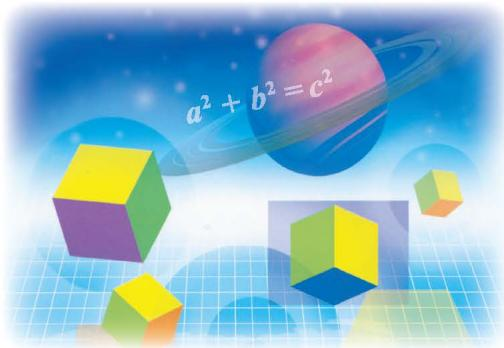

text_image

a² + b² = c²

北京师范大学出版社

· 北京 ·

# 走进数学新天地

亲爱的同学，祝贺你走进八年级！

七年级的学习中，我们体验了“数的扩充”——从正数到有理数，学会了用字母表示数，能用方程和变量之间的关系描述并解决一些现实问题；认识了许多新的图形，并探索了它们的一些基本性质；能从生活中收集数据，获得有关信息；能从数学的角度看待随机现象……

这学期，我们将探索勾股定理，利用它解决简单的实际问题；梳理以前探索过的有关图形的结论，以一些基本事实为出发点，证明有关平行线的定理；将再次经历数的扩充过程，认识无理数和实数；感受平面内确定位置的方法，学习数学上最常用的定位方法——平面直角坐标系，并借此将平面上的点和有序数对对应起来，使得“形”与“数”融为一体；再次认识变量之间的关系，从“数”与“形”两个方面研究最为简单的函数——一次函数；认识二元一次方程组，感受一次函数与二元一次方程之间的关系，并利用它们解决许多现实而有趣的问题；学会用适当的“数”刻画一组数据的“集中趋势”和“离散程度”，进而作出合适的推断。

在解决问题的过程中有效地使用计算器等现代化工具是现代公民的一个标志，探索计算器内部的“数学奥秘”一定会给你带来惊喜；准确判定哪一款手机资费套餐更适合自己，说明哪一个城市更像“火炉”，会让你更像一个“有数学本领的人”。

学好数学固然离不开自主探究，但也需要合作交流，在自己想一想、做一做的基础上，与同伴议一议，从而寻求他人的帮助，分享自己的成果，促进彼此间的共同成长。

祝愿你的数学学习生活成功、快乐！

# 第一章 勾股定理

1 探索勾股定理……2   
2 一定是直角三角形吗……9  
3 勾股定理的应用……13

回顾与思考……16

复习题……16

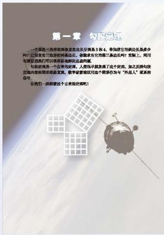

text_image

第一章 勾服定理
一个卫星三角形的两条发射长分别是3和4，例如它的新边长是多少吗？已经发现它们的两条边长，将要求它把第三条边长吗？实验上，利用与卫星定位我们可以获得超能解决这些问题。
勾服定理是一个台湾的定理。人类将早就发展了这个定理，加之反映勾放定理内容的图形或垂直面，数学家建议用这个图形作为与“外星人”联系的合句。
让我们一起探索这个台里的定理吧！

# 第二章 实数

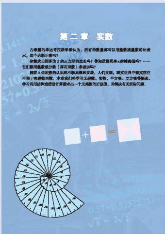

text_image

第二章 实数
古琴是外父教授李学强认为，所有均数量都可以用函数或重数的比表示，这个命题正常写？
根据求面积为2的方程的比长吗？您知道概率的结论值吗……它们即用函数或分条（另有函数）来表示吗？
随着人员对数的认识的不断掌握关系，人们发现，现实世界中确实存在不溶于有函数为数。本章我们将学习无函数、实数、平方根、立方根等概念，学习利用的函数使得计算都求出一个无函数的比较值，并解决有关实际问题。

1 认识无理数……21   
2 平方根……26  
3 立方根……30  
4 估算……33   
5 用计算器开方……36  
6 实数……38   
7 二次根式……41

回顾与思考……49

复习题……49

# 第三章 位置与坐标

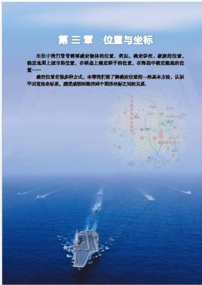

text_image

第三軍 位置与坐标
生活中我們會考察确定物体的位置。例如，确定學校、家庭的位置，
確定地面上城市的位置，在剩余上確定千向的位置，在階級中確定展區的位
置……
确定位置有很多种方式，本會我们将了解确定位置的一些基本方法，认识
平而定的乘标系，既完成相对有效的两个圈形结构之相关关系。

1 确定位置……54  
2 平面直角坐标系……58  
3 轴对称与坐标变化……68

回顾与思考……71

复习题……71

# 第四章 一次函数

1 函数……75  
2 一次函数与正比例函数……79  
3 一次函数的图象……83  
4 一次函数的应用……89

回顾与思考……97

复习题……97

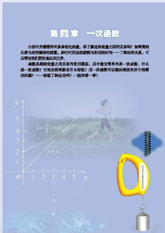

text_image

第四章 一次函数
生活中需要将许多多变量的量，你了解这些变量之间的关系吗？如果我的长度与所指物的重量，或许可给定的量与所用的时间……了解这些关系，可以帮我们更好地认识世界。
函数类别的变量之间关系的奇异模量，其中能为简单的是一次函数。什么是一次函数？它给出的函数有什么特征？用一次函数可以解决或发生组合中的哪些问题？……你做了理解吧？一起麻烦……哦！

# 第五章 二元一次方程组

1 认识二元一次方程组……103   
2 求解二元一次方程组……108  
3 应用二元一次方程组  
——鸡兔同笼 …… 115  
4 应用二元一次方程组  
——增收节支 …… 117  
5 应用二元一次方程组  
——里程碑上的数 …… 120  
6 二元一次方程与一次函数……123  
7 用二元一次方程组确定一次函数表达式\$\cdots\$126  
\*8 三元一次方程组……129  
回顾与思考……132  
复习题……132

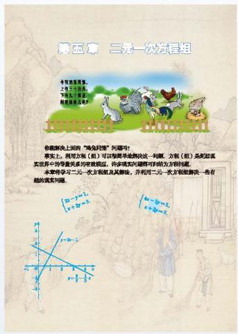

text_image

第五章 二次方程组
今年月度考题。
1. 年度考题：
2. 年度考题：
3. 热点考题（如图）
你能解决上面的“鸡兔母鸡”问题吗？
事实上，利用方程组（组）可以理解并能解决这一问题。方程组（组）是因其实世界中的等量关系的有效题，许多或有问题都可得对方问题。
本节课学习“二元一次方程组及其解体，并利用二元一次方程组解决一些有趣的满米问题。

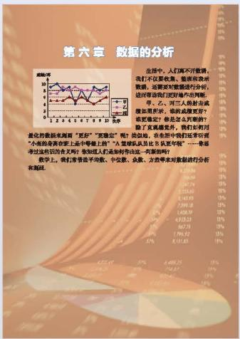

text_image

第六章 数据的分析

生活中，人们离不开数据。
我们不仅收集、整理和改进数据，还需要对数据进行分析，
进而帮助我们更好地操作的判断。

甲、乙、丙三人将射击成
场加用射击，能给战球更好？
需要制定“你怎么用时”
除了克服威胁外，我们如何用
变化的数据米尾居“更好”“更稳定”呢？呢！例如，在您所中我们还可以
“小燕队在营上上中等地上”的“人道球队队员比兄弟年年”……参数
考过这些知识点不另？数据显示人们走到射击这一有效时间？
数学上，请打军事平线校、中位数、众象、方差等要求对数据进行分析
和凝结。

# 第六章 数据的分析

1 平均数……136  
2 中位数与众数……142  
3 从统计图分析数据的集中趋势……145  
4 数据的离散程度……149  
回顾与思考……157  
复习题……157

# 第七章 平行线的证明

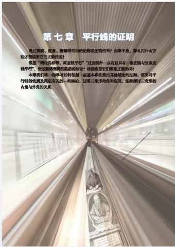

text_image

第七章 平行线的证明
通过国家、威灵、敢略得到检验的论解是正确的吗？如果不，那么是什么方才才物请所写的正确的结论！
都是“阿法西帝”，再宣统平行”。“这首外一品有且只有一套虚星与奴隶盖平行”，他还根据其某些造成的结论？应该肯定它们要真正地听吗？
本章我们发表举手写有其故事——这是本章实出其他结论的过程。征要与平行轴的性质及性质有关的一般结论，证明三岔形内奇和无痕，还称我们三岔形的内容与外貌的关系。

1 为什么要证明……162  
2 定义与命题……165  
3 平行线的判定……172  
4 平行线的性质……175  
5 三角形内角和定理……178  
回顾与思考……184  
复习题……184

# 综合与实践

计算器运用与功能探索……188

# 综合与实践

\- 哪一款手机资费套餐更合适……189

# 综合与实践

\- 哪个城市夏天更热……191

总复习……193

# 第一章 勾股定理

一个直角三角形的两条直角边长分别是 3 和 4，你知道它的斜边长是多少吗？已知直角三角形的两条边长，你能求出它的第三条边长吗？实际上，利用勾股定理我们可以很容易地解决这些问题。

勾股定理是一个古老的定理，人类很早就发现了这个定理，加之反映勾股定理内容的图形形象直观，数学家曾建议用这个图形作为与“外星人”联系的信号。

让我们一起探索这个古老的定理吧！

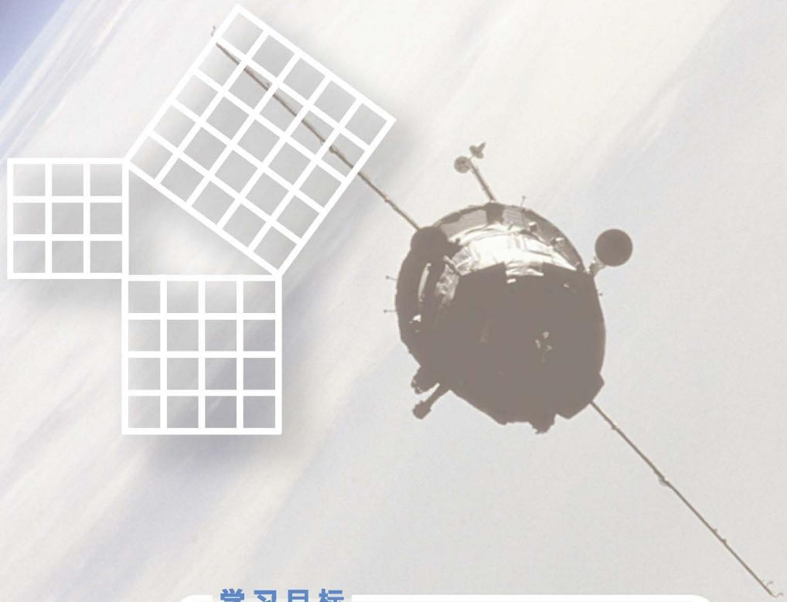

text_image

学习目标

# 学习目标

- 了解勾股定理的历史，感受它的多种证法  
- 体会探究勾股定理的困难和探究成功的喜悦  
会用勾股定理或其逆定理解决简单的问题

# 1

# 探索勾股定理

如图 1-1，从电线杆离地面 $8 \mathrm{~m}$ 处向地面拉一条钢索，如果这条钢索在地面的固定点距离电线杆底部 $6 \mathrm{~m}$ ，那么需要多长的钢索？

在直角三角形中，任意两条边确定了，另外一条边也就随之确定，三边之间存在着一种特定的数量关系。事实上，古人发现，直角三角形的三条边长度的平方存在一种特殊的关系。让我们一起去探索吧！

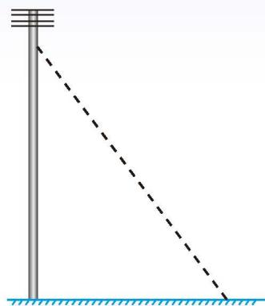

natural_image

Simple diagram showing a vertical pole with horizontal lines and a diagonal dashed line extending from its base, no text or symbols present.

图1-1

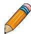

# 做一做
(1) 在纸上画若干个直角三角形, 分别测量它们的三条边, 看看三边长的平方之间有怎样的关系. 与同伴进行交流.  
(2)如图1-2①，直角三角形三边的平方分别是多少，它们满足上面所猜想的数量关系吗？你是如何计算的？与同伴进行交流。对于图1-3中的直角三角形，是否还满足这样的关系？你又是如何计算的呢？  
(3) 如果直角三角形的两直角边分别为 1.6 个单位长度和 2.4 个单位长度, 上面所猜想的数量关系还成立吗? 说明你的理由.

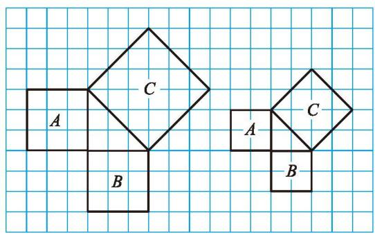

text_image

A
B
C
A
B
C

图1-2

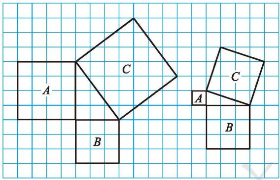

text_image

A
B
C
C
A
B

图1-3

通过上面的活动, 同学们一定已经发现: 直角三角形两直角边的平方和等于斜边的平方. 我国古代把直角三角形中较短的直角边称为勾, 较长的直角边称为股, 斜边称为弦. 因此, 我国称上面的结论为勾股定理.

# 勾股定理①

直角三角形两直角边的平方和等于斜边的平方．如果用 a, b 和 c 分别表示直角三角形的两直角边和斜边，那么 $a^{2} + b^{2} = c^{2}$ .

# 想一想

在图 1-1 的问题中, 需要多长的钢索?

# 随堂练习

1. 求下图中字母所代表的正方形的面积.

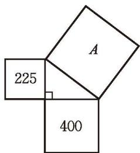

text_image

225
400

(1)

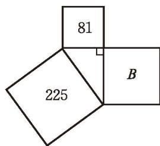

text_image

81
225
B

(2)   
(第1题)

2. 小明家买了一部 55 in $^{②}$ 的电视机。小明量了电视机的屏幕后，发现屏幕只有 121.5 cm 长和 68.5 cm 宽，他觉得一定是售货员搞错了。你同意他的想法吗？你能解释这是为什么吗？

① 勾股定理在很多国家文献中被称为毕达哥拉斯定理(Pythagoras theorem).

② in 表示英寸, 1 in = 25.4 mm.

# 习题 1.1

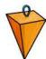

# 知识技能

1. 求出下列直角三角形中未知边的长度.

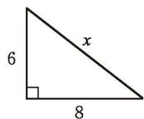

text_image

x
6
8

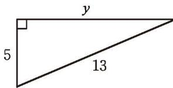

text_image

y
5
13

(第1题)

2. 求斜边长为 $17 \mathrm{~cm}$ 、一条直角边长为 $15 \mathrm{~cm}$ 的直角三角形的面积.

# 数学理解

※3. 如图, 所有的四边形都是正方形, 所有的三角形都是直角三角形, 请在图中找出若干个图形, 使得它们的面积之和恰好等于最大正方形①的面积, 尝试给出两种以上的方案.

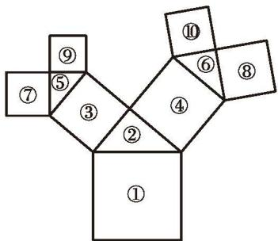

text_image

①
②
③
④
⑤
⑥
⑦
⑧
⑨

(第3题)

# 问题解决

4. 如图，求等腰三角形 $ABC$ 的面积.

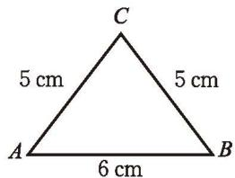

text_image

C
5 cm
5 cm
A
6 cm
B

(第4题)

上一节课，我们通过测量和数格子的方法发现了勾股定理。在图1-4中，分别以直角三角形的三条边为边长向外作正方形，你能利用这个图说明勾股定理的正确性吗？你是如何做的？与同伴进行交流。

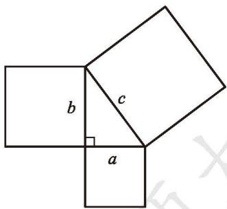

text_image

b
c
a

图1-4

# 做一做

为了计算图 1-4 中大正方形的面积，小明对这个大正方形适当割补后，得到图 1-5、图 1-6.
(1) 将所有三角形和正方形的面积用 $a, b, c$ 的关系式表示出来;  
(2) 图 1-5、图1-6 中正方形 $ABCD$ 的面积分别是多少? 你们有哪些表示方式? 与同伴进行交流.  
(3) 你能分别利用图 1-5、图1-6 验证勾股定理吗?

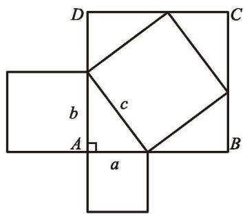

text_image

D
C
b
c
A
a
B

图1-5

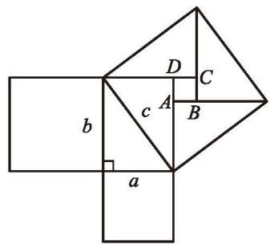

text_image

b
a
c
A
B
C
D

图1-6

例 我方侦察员小王在距离东西向公路 400 m 处侦察, 发现一辆敌方汽车在公路上疾驶。他赶紧拿出红外测距仪, 测得汽车与他相距 400 m, 10 s 后, 汽车与他相距 500 m, 你能帮小王计算敌方汽车的速度吗?
分析：根据题意，可以画出图1-7，其中点 $A$ 表示小王所在位置，点 $C$ 、点 $B$ 表示两个时刻敌方汽车的位置。由于小王距离公路 $400 \mathrm{~m}$ ，因此 $\angle C$ 是直角，这样就可以由勾股定理来解决这个问题了。
解：由勾股定理，可以得到 $AB^{2}=BC^{2}+AC^{2}$ ，也就是 $500^{2}=BC^{2}+400^{2}$ ，所以 BC=300。

敌方汽车 10 s行驶了 300 m，那么它 1 h 行驶的距离为 $300 \times 6 \times 60 = 108000 \, (\text{m})$ ，即它行驶的速度为 $108 \, km/h$ .

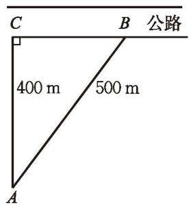

text_image

C
B 公路
400 m 500 m
A

图1-7

# 议一议

观察图1-8，判断图中三角形的三边长是否满足 $a^2 + b^2 = c^2$ 。

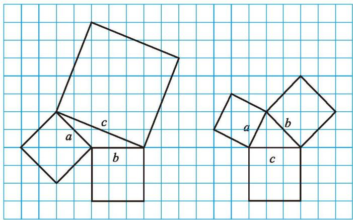

text_image

a
c
b
a
b
c

图1-8

# 随堂练习

如图是某沿江地区交通平面图，为了加快经济发展，该地区拟修建一条连接 M, O, Q 三城市的沿江高速公路，已知沿江高速公路的建设成本是 5000 万元/km，该沿江高速公路的造价预计是多少？

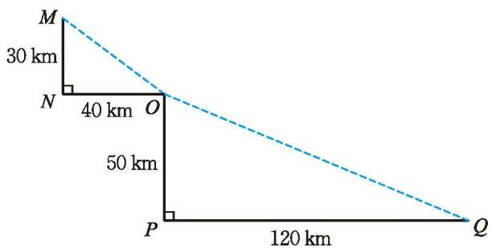

text_image

M
30 km
N
40 km
O
50 km
P
120 km
Q

# 习题 1.2

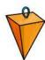

# 知识技能

1. 如图, 强大的台风使得一根旗杆在离地面 $3 \mathrm{~m}$ 处折断倒下, 旗杆顶部落在离旗杆底部 $4 \mathrm{~m}$ 处. 旗杆折断之前有多高?

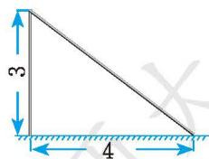

text_image

3
4

(第1题)

# 数学理解

2. 1876年，美国总统伽菲尔德（James Abram Garfield）利用右图验证了勾股定理。你能利用它验证勾股定理吗？说一说这个方法和本节的探索方法的联系。

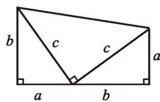

text_image

b
c
c
a
a
b

(第2题)

# 问题解决

3. 如图, 某储藏室入口的截面是一个半径为 $1.2 \mathrm{~m}$ 的半圆形, 一个长、宽、高分别是 $1.2 \mathrm{~m}, 1 \mathrm{~m}, 0.8 \mathrm{~m}$ 的箱子能放进储藏室吗?

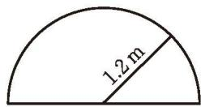

text_image

1.2 m

(第3题)

# 联系拓广

4. 在一张纸上复制四个全等的直角三角形，通过拼图的方法验证勾股定理.你有哪些方法？并说说你的方法与课堂上的方法之间有什么联系与差别.

5. 从网上收集有关勾股定理的资料, 撰写小论文, 与同伴进行交流.

# 读一读

# 漫话勾股世界

我国是最早了解勾股定理的国家之一。早在三千多年前，周朝数学家商高就提出，将一根直尺折成一个直角，如果勾等于三、股等于四，那么弦就等于五，即“勾三、股四、弦五”。它被记载于我国古代著名的数学著作《周髀算经》中。在这本书中的另一处，还记载了勾股定理的一般形式。

1945 年，人们在研究古巴比伦人遗留下的一块数学泥板时，惊讶地发现上面竟然刻有 15 组能构成直角三角形三边的数，其年代远在商高之前。

相传两千多年前，古希腊的毕达哥拉斯学派首先证明了勾股定理，因此在国外人们通常称勾股定理为毕达哥拉斯定理。为了纪念毕达哥拉斯学派，1955年希腊曾经发行了一枚纪念邮票，如右图所示。
事实上，勾股定理的证明方法十分丰富，达数百种之多。其中有一类方法尤为独特，单靠移动几个图形就直观地证出了勾股定理，被誉为“无字的证明”，我们欣赏几种！

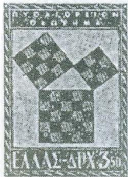

text_image

N.Y.O.K.I.O.P.U.C.N
O.T.P.H.K.
ΕΛΛΑΣ-ΔΡΧ.350

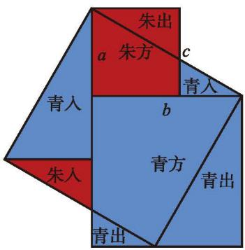

text_image

朱出
a 朱方 c
青入
b
青方
青出
朱入
青出

中国的“青朱出入图”

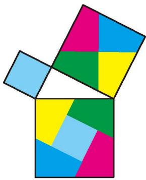

natural_image

Geometric pattern composed of interlocking colored squares (no text or symbols)

古印度的“无字证明”

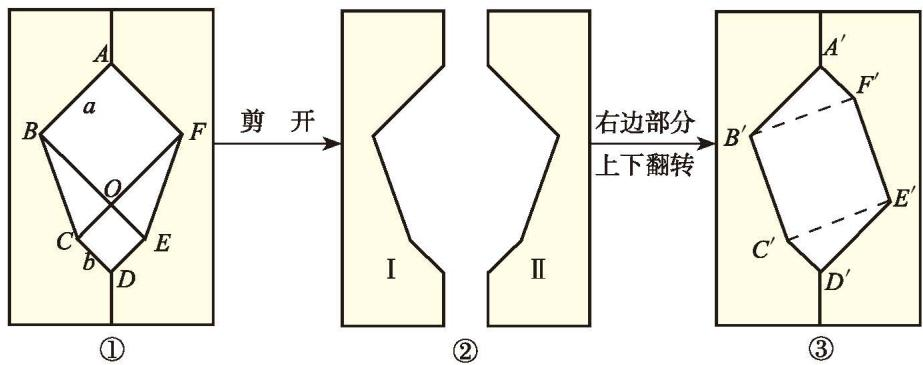

flowchart

意大利著名画家达·芬奇的方法

# 2

# 一定是直角三角形吗

在一个直角三角形中，两直角边的平方和等于斜边的平方．反过来，如果一个三角形中有两边的平方和等于第三边的平方，那么这个三角形是直角三角形吗？

可以画几个满足这个条件的三角形试一试!

# 做一做

下面的每组数分别是一个三角形的三边长 $a, b, c$ ，而且都满足 $a^2 + b^2 = c^2$ :

3, 4, 5; 5, 12, 13; 8, 15, 17; 7, 24, 25.

分别以每组数为三边长画出三角形，它们都是直角三角形吗？你是怎么想的？与同伴进行交流。

如果三角形的三边长 $a, b, c$ 满足 $a^2 + b^2 = c^2$ ，那么这个三角形是直角三角形.

满足 $a^2 + b^2 = c^2$ 的三个正整数，称为勾股数.

例 一个零件的形状如图 1-9 所示, 按规定这个零件中 $\angle A$ 和 $\angle DBC$ 都应为直角. 工人师傅量得这个零件各边尺寸如图 1-10 所示, 这个零件符合要求吗?

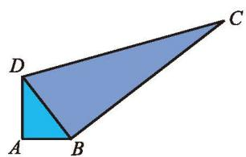

natural_image

Geometric diagram of a triangle with shaded interior (no text or labels)

图1-9

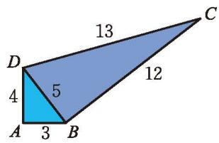

text_image

13
D       12
4     5
A     3   B

图1-10
解：在 $\triangle ABD$ 中， $AB^{2} + AD^{2} = 9 + 16 = 25 = BD^{2}$ ，所以 $\triangle ABD$ 是直角三角形， $\angle A$ 是直角.

在 $\triangle BCD$ 中, $BD^{2} + BC^{2} = 25 + 144 = 169 = CD^{2}$ , 所以 $\triangle BCD$ 是直角三角形, $\angle DBC$ 是直角.
因此，这个零件符合要求.

# 随堂练习

1. 下列几组数能否作为直角三角形的三边长？说说你的理由。
(1) 9, 12, 15;
(2) 12, 18, 22;
(3) 12, 35, 36;
(4) 15, 36, 39.

2. 如图, 在正方形 $ABCD$ 中, $AB = 4$ , $AE = 2$ , $DF = 1$ , 图中有几个直角三角形? 你是如何判断的? 与同伴进行交流.

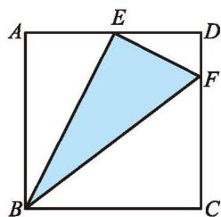

text_image

A
E
D
F
B
C

(第2题)

# 习题 1.3

# 知识技能

1. 如果直角三角形的两直角边长为9,40,那么斜边长为多少?

2. 如果三条线段 $a, b, c$ 满足 $a^2 = c^2 - b^2$ , 那么这三条线段组成的三角形是直角三角形吗? 为什么?

# 数学理解

3. (1) 如果将直角三角形的三条边长同时扩大一个相同的倍数, 那么得到的三角形还是直角三角形吗?
(2) 下表中第一列每组数都是勾股数, 补全下表, 这些勾股数的 2 倍、3 倍、4 倍、 10 倍还是勾股数吗? 任意倍呢? 说说你的理由.

<table><tr><td></td><td>2倍</td><td>3倍</td><td>4倍</td><td>10倍</td></tr><tr><td>3, 4, 5</td><td>6, 8, 10</td><td>_, _, _</td><td>_, _, _</td><td>_, _, _</td></tr><tr><td>5, 12, 13</td><td>_, _, _</td><td>15, 36, 39</td><td>_, _, _</td><td>_, _, _</td></tr><tr><td>8, 15, 17</td><td>_, _, _</td><td>_, _, _</td><td>32, 60, 68</td><td>_, _, _</td></tr><tr><td>7, 24, 25</td><td>_, _, _</td><td>_, _, _</td><td>_, _, _</td><td>70, 240, 250</td></tr></table>

4. 如图, 哪些三角形是直角三角形, 哪些不是? 说说你的理由.

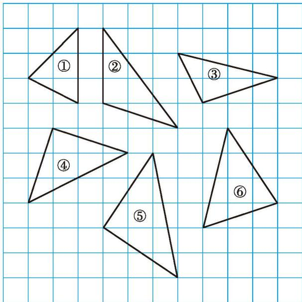

text_image

①
②
③
④
⑤
⑥

(第4题)

# 问题解决

※5. 给你一根长绳子，没有其他工具，你能方便地得到一个直角吗？

# 联系拓广

※6. 美国哥伦比亚大学收藏了一块古巴比伦时代的泥板（如图）。经科学家研究，这块泥板上的三列文字实际上是三列数字（如表）。你知道这些数字间的关系吗？借助计算器进行探索。

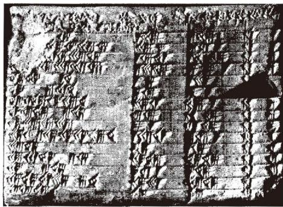

text_image

Historical black-and-white photograph of a stone tablet with engraved Chinese characters, showing dense vertical columns and a central column.

<table><tr><td>a</td><td>b</td><td>c</td></tr><tr><td>120</td><td>119</td><td>169</td></tr><tr><td>3 456</td><td>3 367</td><td>4 825</td></tr><tr><td>4 800</td><td>4 601</td><td>6 649</td></tr><tr><td>13 500</td><td>12 709</td><td>18 541</td></tr><tr><td>72</td><td>65</td><td>97</td></tr><tr><td>360</td><td>319</td><td>481</td></tr><tr><td>2 700</td><td>2 291</td><td>3 541</td></tr><tr><td>960</td><td>799</td><td>1 249</td></tr><tr><td>600</td><td>481</td><td>769</td></tr><tr><td>6 480</td><td>4 961</td><td>8 161</td></tr><tr><td>60</td><td>45</td><td>75</td></tr><tr><td>2 400</td><td>1 679</td><td>2 929</td></tr><tr><td>240</td><td>161</td><td>289</td></tr><tr><td>2 700</td><td>1 771</td><td>3 229</td></tr><tr><td>90</td><td>56</td><td>106</td></tr></table>

# 勾股定理的应用

如图 1-11 所示, 有一个圆柱, 它的高等于 $12 \mathrm{~cm}$ , 底面上圆的周长等于 $18 \mathrm{~cm}$ 。在圆柱下底面的点 $A$ 有一只蚂蚁,它想吃到上底面上与点 $A$ 相对的点 $B$ 处的食物, 沿圆柱侧面爬行的最短路程是多少?

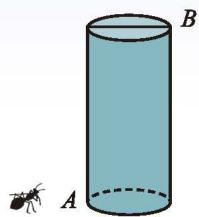

natural_image

Simple diagram of a cylinder with an ant at its base, labeled A and B (no text or symbols on the cylinder itself)

图1-11
(1) 自己做一个圆柱, 尝试从点 $A$ 到点 $B$ 沿圆柱侧面画出几条路线, 你觉得哪条路线最短呢?
(2) 如图 1-12 所示, 将圆柱侧面剪开展成一个长方形, 从点 $A$ 到点 $B$ 的最短路线是什么? 你画对了吗?
（3）蚂蚁从点 A 出发，想吃到点 B 处的食物，它沿圆柱侧面爬行的最短路程是多少？

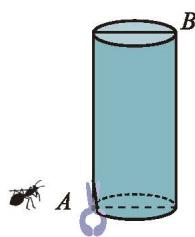

natural_image

Illustration of a cylinder with an ant and a small figure, no text or symbols present

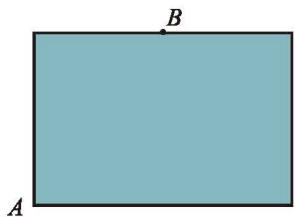

natural_image

Simple geometric diagram of a rectangle with labeled points A and B (no text or symbols beyond labels)

图1-12

# 做一做

李叔叔想要检测雕塑（图 1-13）底座正面的边 $AD$ 和边 $BC$ 是否分别垂直于底边 $AB$ ，但他随身只带了卷尺。
(1) 你能替他想办法完成任务吗?  
(2) 李叔叔量得边 $AD$ 长是 $30 \mathrm{~cm}$ , 边 $AB$ 长是 $40 \mathrm{~cm}$ , 点 $B, D$ 之间的距离是 $50 \mathrm{~cm}$ . 边 $AD$ 垂直于边 $AB$ 吗?  
(3) 小明随身只有一个长度为 $20 \mathrm{~cm}$ 的刻度尺, 他能有办法检验边 $A D$ 是否垂直于边 $A B$ 吗? 边 $B C$ 与边 $A B$ 呢?

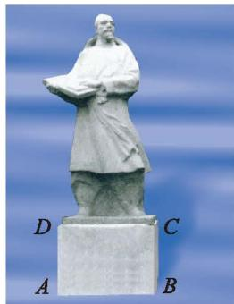

natural_image

Statue of a historical figure holding a book, labeled A, B, C, D (no text or symbols on the statue itself)

图1-13

例 图 1-14 是一个滑梯示意图, 若将滑道 $A C$ 水平放置, 则刚好与 $A B$ 一样长. 已知滑梯的高度 $C E = 3 \mathrm{~m}, C D = 1 \mathrm{~m}$ , 试求滑道 $A C$ 的长.
解：设滑道 $AC$ 的长度为 $x \mathrm{~m}$ ，则 $AB$ 的长度为 $x \mathrm{~m}$ ， $AE$ 的长度为 $(x - 1) \mathrm{~m}$ .
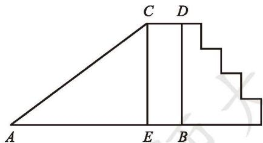

text_image

C D
A E B

图1-14

在 Rt△ACE 中，∠AEC=90°，由勾股定理得 $AE^{2}+CE^{2}=AC^{2}$ ，
即 $(x - 1)^2 + 3^2 = x^2$ ，解得 $x = 5$ .

故滑道 $AC$ 的长度为 $5 \mathrm{~m}$ .

# 随堂练习

甲、乙两位探险者到沙漠进行探险。某日早晨8:00甲先出发，他以6km/h的速度向正东行走。1h后乙出发，他以5km/h的速度向正北行走。上午10:00，甲、乙二人相距多远？

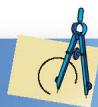

# 习题 1.4

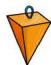

# 知识技能

1. 如图，阴影长方形的面积是多少？

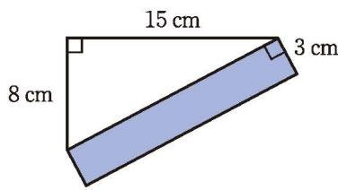

text_image

15 cm
8 cm
3 cm

(第1题)

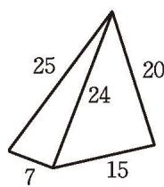

text_image

25
20
24
7
15

(1)

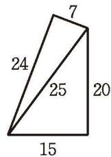

text_image

7
24
25
20
15

(2)

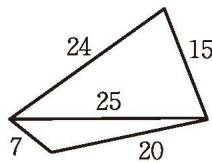

text_image

24
15
25
7
20

(3)   
(第2题)

2. 五根小木棒的长度分别为 7, 15, 20, 24, 25, 现将它们摆成两个直角三角形, 如图所示的三个图中哪个图形是正确的?

# 问题解决

3. 如图, 一座城墙高 $11.7 \mathrm{~m}$ , 墙外有一条宽为 $9 \mathrm{~m}$ 的护城河, 那么一架长为 $15 \mathrm{~m}$ 的云梯能否到达墙的顶端?

text_image

15 m
9 m
11.7 m

(第3题)

4. 如图, 一个无盖的长方体形盒子的长、宽、高分别为 $8 \mathrm{~cm}, 8 \mathrm{~cm}, 12 \mathrm{~cm}$ , 一只蚂蚁想从盒底的点 $A$ 沿盒的表面爬到盒顶的点 $B$ , 你能帮蚂蚁设计一条最短的线路吗? 蚂蚁要爬行的最短路程是多少?

text_image

B
12 cm
A 8 cm 8 cm

(第4题)

natural_image

Simple line drawing of a plant with two stems and leaves, enclosed in a dashed rectangular frame (no text or symbols)

(第5题)

※5. 在我国古代数学著作《九章算术》中记载了一道有趣的问题, 这个问题的大意是: 有一个水池, 水面是一个边长为 $10 \text{ 尺} ^{①}$ 的正方形。在水池正中央有一根新生的芦苇, 它高出水面 $1 \text{ 尺}$ 。如果把这根芦苇垂直拉向岸边, 它的顶端恰好到达岸边的水面。请问: 这个水池水的深度和这根芦苇的长度各是多少?

※6. 借助勾股定理, 利用升旗的绳子、卷尺, 请你设计一个方案, 测算出旗杆的高度.

# 回顾与思考

1. 直角三角形的边、角之间分别存在着什么关系？  
2. 举例说明, 如何判断一个三角形是否为直角三角形.  
3. 请你举一个生活中的实例，并运用勾股定理解决它。  
4. 你了解勾股定理的历史吗？与同伴进行交流。

# 复习题

# 知识技能

1. 蚂蚁沿图中所示的折线由点 $A$ 爬到了点 $D$ , 蚂蚁一共爬行了多少厘米? (图中小方格的边长代表 $1 \mathrm{~cm}$ )

line

| Point | X  | Y  |
|-------|----|----|
| A     | 0  | 17 |
| B     | 5  | 14 |
| C     | 17 | 9  |
| D     | 22 | 1  |

(第1题)

2. 判断下列几组数能否作为直角三角形的三边长.
(1) 8, 15, 17;
(2) 7, 12, 15;
(3) 12, 15, 20;
(4) 7, 24, 25.

3. 一艘帆船由于风向的原因先向正东方向航行了 $160 \mathrm{~km}$ , 然后向正北方向航行了 $120 \mathrm{~km}$ , 这时它离出发点有多远?

4. 如图, $BC$ 长为 $3 \mathrm{~cm}$ , $AB$ 长为 $4 \mathrm{~cm}$ , $AF$ 长为 $12 \mathrm{~cm}$ . 求正方形 CDEF 的面积.

5. 小明从家出发向正北方向走了 $150 \mathrm{~m}$ , 接着向正东方向走到离家 $250 \mathrm{~m}$ 远的地方。小明向正东方向走了多远?

text_image

Geometric diagram of a square with labeled vertices and right angles at A and B

(第4题)

# 数学理解

6. 如图, 直角三角形三边上的半圆面积之间有什么关系?

natural_image

Geometric diagram showing a triangle inscribed in a circle with a right angle marker (no text or labels)

(第6题)

text_image

a
b
b
c
a
b
a
b

(第7题)

text_image

b
a
b
a

7. 据传当年毕达哥拉斯借助如图所示的两个图验证了勾股定理，你能说说其中的道理吗？

8. 据说古埃及人曾用下面的方法得到直角: 如图所示, 他们用 13 个等距的结把一根绳子分成等长的 12 段, 一个工匠同时握住绳子的第 1 个结和第 13 个结, 两个助手分别握住第 4 个结和第 8 个结, 拉紧绳子, 就会得到一个直角三角形, 其直角在第 4 个结处. 你能说说其中的道理吗?

natural_image

Illustration of three ancient figures in a triangular arrangement with trees and sky background (no text or symbols)

(第8题)

text_image

A
B

(第9题)

9. 如图, 方格纸上每个小正方形的面积为 1 个单位.
(1) 在方格纸上, 以线段 ${AB}$ 为边画正方形并计算所画正方形的面积, 解释你的计算方法;
(2) 你能在图上画出面积依次为 5 个单位、10 个单位、13 个单位的正方形吗?

10. 如图①, 直角三角形的两个锐角分别是 ${40}^{ \circ  }$ 和 ${50}^{ \circ  }$ ,其三边上分别有一个正方形. 执行下面的操作：由两个小正方形向外分别作锐角为 ${40}^{ \circ  }$ 和 ${50}^{ \circ  }$ 的直角三角形,再分别以所得到的直角三角形的直角边为边长作正方形. 图②是 1 次操作后的图形.

text_image

a
b
c
①
a
b
c
②
③

(第10题)
(1) 试画出 2 次操作后的图形.
(2)如果原来直角三角形斜边长为 $1 \mathrm{~cm}$ , 写出 2 次操作后的图形中所有正方形的面积和.
(3) 如果一直画下去,你能想象出它的样子吗?
(4) 图③是重复上述步骤若干次后得到的图形, 人们把它称为 “毕达哥拉斯树”。如果最初的直角三角形是等腰直角三角形, 你能想象出此时 “毕达哥拉斯树” 的形状吗?

# 问题解决

11. 一架云梯长 $25 \mathrm{~m}$ , 如图那样斜靠在一面墙上, 云梯底端离墙 $7 \mathrm{~m}$ .
(1) 这架云梯的顶端距地面有多高?
(2) 如果云梯的顶端下滑了 4m，那么它的底部在水平方向也滑动了 4m 吗？

natural_image

Simple geometric diagram showing two red lines intersecting a vertical blue line, with no text or symbols present.

(第11题)

12. 如图, 长方体的长为 $15 \mathrm{~cm}$ , 宽为 $10 \mathrm{~cm}$ , 高为 $20 \mathrm{~cm}$ , 点 $B$ 离点 $C$ 的距离是 $5 \mathrm{~cm}$ , 一只蚂蚁如果要沿着长方体的表面从点 $A$ 爬到点 $B$ , 需要爬行的最短路程是多少?

text_image

5 cm
B C
20 cm
15 cm A
10 cm

(第12题)

# 联系拓广

※13. 装修工人购买了一根装饰用的木条，乘电梯到小明家安装。如果电梯的长、宽、高分别是 $1.5 \mathrm{~m}, 1.5 \mathrm{~m}, 2.2 \mathrm{~m}$ ，那么能放入电梯内的木条的最大长度大约是多少米？你能估计出装修工人买的木条至少是多少米吗？

text_image

糟糕，太长了，
放不进去。

text_image

2.2 m
1.5 m
1.5 m

(第13题)

※14. (1) 大家知道 $(3, 4, 5)(5, 12, 13)(8, 15, 17)$ 都是勾股数组，有人说它们中好像一定有一个是偶数，你认为这种观点正确吗？说明你的理由。
(2) 除此之外, 你还能发现勾股数具有哪些规律? 与同伴进行交流.

# 第二章 实数

古希腊的毕达哥拉斯学派认为，所有的数量都可以用整数或整数的比表示，这个论断正确吗？

你能求出面积为 2 的正方形的边长吗？你知道圆周率 $\pi$ 的精确值吗？……它们能用整数或分数（即有理数）来表示吗？

随着人类对数的认识的不断加深和发展，人们发现，现实世界中确实存在不同于有理数的数。本章我们将学习无理数、实数、平方根、立方根等概念，学习利用估算或借助计算器求出一个无理数的近似值，并解决有关实际问题。

text_image

Mathematical equation template with geometric shapes and a plus sign, likely for solving the addition operation.

radar

| Label | Value |
|---|---|
| √13 | 1 |
| √12 | 1 |
| √11 | 1 |
| √10 | 1 |
| √9 | 1 |
| √8 | 1 |
| √7 | 1 |
| √6 | 1 |
| √5 | 1 |
| √4 | 1 |
| √3 | 1 |
| √2 | 1 |
| √19 | 1 |
| √20 | 1 |
| √21 | 1 |
| √22 | 1 |
| √23 | 1 |
| √24 | 1 |
| √25 | 1 |
| √26 | 1 |
| √27 | 1 |
| √28 | 1 |
| √29 | 1 |
| √30 | 1 |
The chart displays a series of values with '√' as the label for each data point. The legend is not explicitly labeled but corresponds to the visual position of the radial segments.

# 学习目标

感受学习无理数的必要性  
在学习实数的有关概念和运算法则时，感受类比的思想  
能进行实数运算和简单的根式化简，解决简单的问题  
根据实际要求选择恰当的方法，估计实数的大小

# 1

# 认识无理数

图2-1

图2-1是两个边长为1的小正方形，剪一剪、拼一拼，设法得到一个大的正方形.
(1) 设大正方形的边长为 $a, a$ 满足什么条件?   
(2) a 可能是整数吗？说说你的理由.  
(3) $a$ 可能是分数吗? 说说你的理由, 并与同伴进行交流.
事实上，我们可以证明，在等式 $a^2 = 2$ 中， $a$ 既不是整数，也不是分数，所以 $a$ 不是有理数。

# 做一做
(1) 如图 2-2, 以直角三角形的斜边为边的正方形的面积是多少?  
(2) 设该正方形的边长为 $b, b$ 满足什么条件?  
(3) b 是有理数吗?

text_image

2
1

图2-2

在上面的两个问题中，数 $a, b$ 确实存在，但都不是有理数。

# 随堂练习

如图，等边三角形 ABC 的边长为 2，高为 h，h 可能是整数吗？可能是分数吗？

text_image

A
2
h
B
C

## 习题2.1

# 问题解决

1. 右图是由 16 个边长为 1 的小正方形拼成的，任意连接这些小正方形的若干个顶点，可得到一些线段。试分别找出两条长度是有理数的线段和两条长度不是有理数的线段。

2. 请你在方格纸上按照如下要求设计直角三角形：
(1) 使它的三边中有一边边长不是有理数;
(2) 使它的三边中有两边边长不是有理数;
(3) 使它的三边边长都不是有理数.

面积为2的正方形的边长 $a$ 究竟是多少呢？
(1) 如图 2-3, 三个正方形的边长之间有怎样的大小关系? 说说你的理由.
(2) 边长 $a$ 的整数部分是几？十分位是几？百分位呢？千分位呢？……借助计算器进行探索.

natural_image

Simple geometric shape: a light purple square with side length labeled '2' (no additional text or symbols)

图2-3
(3) 小明将他的探索过程整理如下, 你的结果呢?

<table><tr><td>边长a</td><td>面积S</td></tr><tr><td>1 &lt; a &lt; 2</td><td>1 &lt; S &lt; 4</td></tr><tr><td>1.4 &lt; a &lt; 1.5</td><td>1.96 &lt; S &lt; 2.25</td></tr><tr><td>1.41 &lt; a &lt; 1.42</td><td>1.988 1 &lt; S &lt; 2.016 4</td></tr><tr><td>1.414 &lt; a &lt; 1.415</td><td>1.999 396 &lt; S &lt; 2.002 225</td></tr><tr><td>1.414 2 &lt; a &lt; 1.414 3</td><td>1.999 961 64 &lt; S &lt; 2.000 244 49</td></tr></table>

还可以继续算下去吗？a可能是有限小数吗？
事实上， $a=1.414\ 213\ 56\cdots$ 是一个无限不循环小数.

（第1题）

# 做一做
(1) 估计面积为 5 的正方形的边长 $b$ 的值（结果精确到 0.1），并用计算器验证你的估计.  
(2) 如果结果精确到 0.01 呢?
事实上， $b=2.236\ 067\ 977\cdots$ 是一个无限不循环小数.
同样，对于体积为 2 的正方体，借助计算器，可以得到它的棱长 $c = 1.259921049 \cdots$ 也是一个无限不循环小数。

natural_image

3D cube illustration with two shaded faces, labeled 'c' on the left face (no other text or symbols)

# 议一议

把下列各数表示成小数，你发现了什么？

3, $\frac{4}{5}$ , $\frac{5}{9}$ , $-\frac{8}{45}$ , $\frac{2}{11}$ .
事实上，有理数总可以用有限小数或无限循环小数表示。反过来，任何有限小数或无限循环小数也都是有理数。

无限不循环小数称为无理数（irrational number）.

除了像上面所述的数 a, b, c 是无理数外，我们十分熟悉的圆周率 $\pi = 3.14159265\cdots$ 也是一个无限不循环小数，因此它也是一个无理数。再如 0.585885888588885…（相邻两个 5 之间 8 的个数逐次加 1），也是无理数。

# 想一想

你能找到其他的无理数吗？

例 下列各数中，哪些是有理数？哪些是无理数？

3.14, $-\frac{4}{3}$ , 0.57, 0.1010001000001…(相邻两个1之间0的个数逐次加2).
解：有理数有： $3.14, -\frac{4}{3}, 0.57;$

无理数有：0.101 000 100 000 1…（相邻两个1之间0的个数逐次加2）.

# 随堂练习

下列各数中，哪些是有理数？哪些是无理数？

0.4583, $3\dot{7}$ , $-\pi$ , $-\frac{1}{7}$ , 18.

# 读一读

# 无理数的发现

毕达哥拉斯学派是以古希腊哲学家、数学家、天文学家毕达哥拉斯（Pythagoras，约前580—约前500）为代表人物的一个学派。毕达哥拉斯学派发现了无理数，这是数学史上的一件大事，它导致了第一次数学危机。

毕达哥拉斯学派有一个信条：“万物皆数”，即“宇宙间的一切现象都能归结为整数或整数之比”，也就是一切现象都可以用有理数去描述。公元前5世纪，毕达哥拉斯学派的一个成员希伯索斯（Hippasus）发现边长为1的正方形的对角线的长不能用整数或整数之比来表示。这个发现动摇了毕达哥拉斯学派的信条，引起了信徒们的恐慌。据说，希伯索斯为此被投入了大海，他为发现真理而献出了宝贵的生命。但真理是不可战胜的，后来，古希腊人终于正视了希伯索斯的发现，并进一步给出了证明。

假设边长为1的正方形的对角线的长可写成两个整数 $p, q$ 的比 $\frac{p}{q} (p, q$ 互质), 于是有 $(\frac{p}{q})^2 = 2, p^2 = 2q^2$ .
因此， $p^{2}$ 是偶数，p 是偶数。
于是可设 $p = 2m$ ，那么 $p^2 = 4m^2 = 2q^2$ ， $q^{2} = 2m^{2}$
这就是说， $q^{2}$ 是偶数， $q$ 也是偶数。这与“ $p$ ， $q$ 是互质的两个整数”的假设矛盾。

从无理数的发现可以看出，无理数并不“无理”，它和有理数一样，都是现实世界中客观存在的量的反映。

## 习题2.2

# 知识技能

1. 下列各数中，哪些是有理数？哪些是无理数？
$-\frac{559}{180}, 3.97, -234.10101010\cdots$ （相邻两个1之间有1个0），

0.123 456 789 101 112 13…(小数部分由相继的正整数组成).

2. (1) 设面积为 10 的正方形的边长为 $x$ , $x$ 是有理数吗? 说说你的理由.
(2) 估计 $x$ 的值 (结果精确到0.1), 并用计算器验证你的估计.
(3) 如果结果精确到 0.01 呢?

# 数学理解

3. 判断下列说法是否正确：
(1) 所有无限小数都是无理数； ( )
(2) 所有无理数都是无限小数； ( )
(3) 有理数都是有限小数； ( )
(4) 不是有限小数的不是有理数. ( )

4. 再举出三个有关无理数的实例.

# 2

# 平方根
(1) 根据图 2-4 填空:
$x ^ {2} = \underline {{\quad}},$
$y ^ {2} = \underline {{\quad}},$
$z ^ {2} = \underline {{\quad}},$
$w ^ {2} = \underline {{\quad}}.$
(2) $x, y, z, w$ 中哪些是有理数？哪些是无理数？你能表示它们吗？

text_image

E
1
w
z
D
A
y
1
x
C
1
O
1
B

图2-4

一般地，如果一个正数 $x$ 的平方等于 $a$ ，即 $x^2 = a$ ，那么这个正数 $x$ 就叫做 $a$ 的算术平方根，记作 $\sqrt{a}$ ，读作“根号 $a$ ”。

特别地，我们规定：0 的算术平方根是 0，即 $\sqrt{0}=0$ .

> [!example]- 例1 求下列各数的算术平方根：
(1) 900;
(2) 1;
(3) $\frac{49}{64}$ ;
(4) 14.
解: (1) 因为 $30^{2} = 900$ , 所以 900 的算术平方根是 30, 即 $\sqrt{900} = 30$ ;
(2) 因为 $1^{2}=1$ ，所以 1 的算术平方根是 1，即 $\sqrt{1}=1$ ;
(3) 因为 $\left(\frac{7}{8}\right)^2 = \frac{49}{64}$ , 所以 $\frac{49}{64}$ 的算术平方根是 $\frac{7}{8}$ , 即 $\sqrt{\frac{49}{64}} = \frac{7}{8}$ ;
(4) 14 的算术平方根是 $\sqrt{14}$ .

> [!example]- 例2 自由下落物体下落的距离 $s(\mathrm{m})$ 与下落时间 $t(\mathrm{s})$ 的关系为 $s = 4.9 t^{2}$ . 有一铁球从 $19.6 \mathrm{~m}$ 高的建筑物上自由下落, 到达地面需要多长时间?
解：将 $s = 19.6$ 代入公式 $s = 4.9t^2$

得 $t^{2}=4$ ，所以 $t=\sqrt{4}=2\ (s)$ .
即铁球到达地面需要 2 s.

# 随堂练习

1. 求下列各数的算术平方根：

36, $\frac{9}{16}$ , 17, 0.81, $10^{-4}$ .

2. 在 Rt△ABC 中，∠C=90°，BC=3，AC=5，求 AB 的长.

3. 如图, 从帐篷支撑杆 $AB$ 的顶部 $A$ 向地面拉一根绳子 $AC$ 固定帐篷. 若绳子的长度为 $8 \mathrm{~m}$ , 地面固定点 $C$ 到帐篷支撑杆底部 $B$ 的距离是 $6.4 \mathrm{~m}$ , 则帐篷支撑杆的高是多少?

natural_image

Geometric diagram of a triangular pyramid with labeled vertices A, B, and C (no text or symbols present)

(第3题)

## 习题2.3

# 知识技能

1. 求下列各式的值:
(1) $\sqrt{49}$ ; (2) $\sqrt{\frac{25}{196}}$ ; (3) $\sqrt{0.09}$ ; (4) $-\sqrt{64}$ .

2. 求下列各数的算术平方根:

121, $\frac{9}{25}$ , 1.96, $10^{6}$ .

# 问题解决

3. 小明房间的面积为 $10.8 \mathrm{~m}^{2}$ , 房间地面恰由 120 块相同的正方形地砖铺成, 每块地砖的边长是多少?

# 联系拓广

4. 一个正方形的面积变为原来的4倍，它的边长变为原来的多少倍？面积变为原来的9倍，它的边长变为原来的多少倍？面积变为原来的100倍呢？面积变为原来的 $n$ 倍呢？

# 想一想
(1) 9 的算术平方根是 3, 也就是说, 3 的平方是 9. 还有其他的数, 它的平方也是 9 吗?

(2) 平方等于 $\frac{4}{25}$ 的数有几个？平方等于 0.64 的数呢？

一般地，如果一个数 $x$ 的平方等于 $a$ ，即 $x^2 = a$ ，那么这个数 $x$ 就叫做 $a$ 的平方根（square root，也叫做二次方根）.

# 议一议
(1) 一个正数有几个平方根? (2) 0 有几个平方根? (3) 负数呢?

一个正数有两个平方根；0只有一个平方根，它是0本身；负数没有平方根。

正数 $a$ 有两个平方根, 一个是 $a$ 的算术平方根 $\sqrt{a}$ , 另一个是 $-\sqrt{a}$ , 它们互为相反数. 这两个平方根合起来可以记作 $\pm \sqrt{a}$ , 读作 “正、负根号 $a$ ”.

求一个数 $a$ 的平方根的运算, 叫做开平方 (extraction of square root), $a$ 叫做被开方数.

> [!example]- 例3 求下列各数的平方根:
(1) 64;
(2) $\frac{49}{121}$ ;
(3) 0.0004;
(4) $(-25)^{2}$ ;
(5) 11.
解：（1）因为 $(\pm 8)^{2} = 64$ ，所以64的平方根是 $\pm 8$ ，即 $\pm \sqrt{64} = \pm 8$
(2) 因为 $\left(\pm \frac{7}{11}\right)^{2} = \frac{49}{121}$ , 所以 $\frac{49}{121}$ 的平方根是 $\pm \frac{7}{11}$ , 即 $\pm \sqrt{\frac{49}{121}} = \pm \frac{7}{11}$ ;
（3）因为 $(\pm 0.02)^{2} = 0.0004$ ，所以0.0004的平方根是 $\pm 0.02$ ，即 $\pm \sqrt{0.0004} = \pm 0.02;$
（4）因为 $(\pm 25)^{2} = (-25)^{2}$ ，所以 $(-25)^{2}$ 的平方根是 $\pm 25$ ，即 $\pm \sqrt{(-25)^{2}} = \pm 25$ ；
(5) 11 的平方根是 $\pm \sqrt{11}$ .

# 想一想
(1) $(\sqrt{64})^{2}$ 等于多少? $\left(\sqrt{\frac{49}{121}}\right)^{2}$ 等于多少?

(2) $(\sqrt{7.2})^{2}$ 等于多少?   
(3) 对于正数 $a, (\sqrt{a})^2$ 等于多少?

# 随堂练习

1. 求下列各数的平方根：

1.44, 0, 8, $\frac{100}{49}$ , 441, 196, $10^{-4}$ .

2. 填空：
(1) 25 的平方根是 \_\_\_\_；  
(2) $\sqrt{(-5)^2} =$   
(3) $(\sqrt{5})^{2}=$ \_\_\_\_.

3. 当 $a = 5, b = 12$ 时，求 $\sqrt{a^2 + b^2}$ 的值.

## 习题2.4

# 知识技能

1. 求下列各数的平方根：

169, $10^{-6}$ , $\frac{16}{49}$ , $\frac{9}{4}$ , 18.

2. (1) 一个正数的平方等于 361，求这个正数；
(2) 一个负数的平方等于 121，求这个负数；
(3) 一个数的平方等于 196，求这个数.

3. 求满足下列各式的未知数 $x$ :
(1) $x^{2}=\frac{25}{81}$ ;
(2) $x^{2}=6.$

4. 求下列各式的值:
(1) $\sqrt{4^2}$ ;
(2) $\sqrt{(-4)^2}$ ;
(3) $(\sqrt{0.8})^2$

5. 当 c=25, b=24 时，求 $\sqrt{(c+b)(c-b)}$ 的值.

# 联系拓广

※6. 对于任意数 $a, \sqrt{a^2}$ 一定等于 $a$ 吗?

# 立方根

某化工厂使用半径为 $1 \mathrm{~m}$ 的一种球形储气罐储藏气体。现在要造一个新的球形储气罐，如果它的体积①是原来的8倍，那么它的半径是原储气罐半径的多少倍？如果储气罐的体积是原来的4倍呢？

natural_image

Two spherical objects with metal legs, one larger and one smaller, displayed against a plain background (no text or symbols)

一般地, 如果一个数 $x$ 的立方等于 $a$ , 即 $x^{3} = a$ , 那么这个数 $x$ 就叫做 $a$ 的立方根 (cube root, 也叫做三次方根). 如 2 是 8 的立方根, $-\frac{2}{3}$ 是 $-\frac{8}{27}$ 的立方根, 0 是 0 的立方根.

# 做一做
(1) 2 的立方等于多少？是否有其他的数，它的立方也是 8？  
(2) -3 的立方等于多少? 是否有其他的数, 它的立方也是 -27?

# 议一议
(1) 正数有几个立方根?  
(2) 0有几个立方根?   
(3) 负数有几个立方根?

每个数 $a$ 都有一个立方根, 记作 $\sqrt[3]{a}$ , 读作 “三次根号 $a$ ”。例如 $x^{3} = 7$ 时, $x$ 是 7 的立方根, 即 $x = \sqrt[3]{7}$ ; 而 $2^{3} = 8$ , 2 是 8 的立方根, 即 $\sqrt[3]{8} = 2$ .

正数的立方根是正数；0 的立方根是 0；负数的立方根是负数。

① 球的体积公式为 $V=\frac{4}{3}\pi r^{3}$ ，r 为球的半径.

求一个数 $a$ 的立方根的运算叫做开立方（extraction of cubic root）， $a$ 叫做被开方数.

# 例1 求下列各数的立方根：
(1) -27;
(2) $\frac{8}{125}$ ;
(3) 0.216;
(4) -5.
解：（1）因为 $(-3)^{3} = -27$ ，所以-27的立方根是-3，即 $\sqrt[3]{-27} = -3$ ；
(2) 因为 $\left(\frac{2}{5}\right)^{3}=\frac{8}{125}$ ，所以 $\frac{8}{125}$ 的立方根是 $\frac{2}{5}$ ，即 $\sqrt[3]{\frac{8}{125}}=\frac{2}{5}$ ;
（3）因为 $0.6^{3}=0.216$ ，所以 0.216 的立方根是 0.6，即 $\sqrt[3]{0.216}=0.6$ ;
(4) -5 的立方根是 $\sqrt[3]{-5}$ .

# 想一想
$\sqrt[3]{a}$ 表示 $a$ 的立方根，那么 $(\sqrt[3]{a})^3$ 等于什么？ $\sqrt[3]{a^3}$ 呢？

# 例2 求下列各式的值:
(1) $\sqrt[3]{-8}$ ;
(2) $\sqrt[3]{0.064}$ ;
(3) $-\sqrt[3]{\frac{8}{125}};$
(4) $(\sqrt[3]{9})^3$
解：（1） $\sqrt[3]{-8} = \sqrt[3]{(-2)^3} = -2;$
(2) $\sqrt[3]{0.064} = \sqrt[3]{0.4^3} = 0.4;$
(3) $-\sqrt[3]{\frac{8}{125}} = -\sqrt[3]{\left(\frac{2}{5}\right)^3} = -\frac{2}{5};$
(4) $(\sqrt[3]{9})^3 = 9.$

# 随堂练习

1. 求下列各式的值:
$\sqrt [ 3 ]{0 . 1 2 5}, \sqrt [ 3 ]{- 6 4}, \sqrt [ 3 ]{5 ^ {3}}, (\sqrt [ 3 ]{1 6}) ^ {3}.$

2. 一个正方体, 它的体积是棱长为 $3 \mathrm{~cm}$ 的正方体体积的 8 倍, 这个正方体的棱长是多少?

习题2.5

# 知识技能

1. 求下列各数的立方根：
$0. 0 0 1, - 1, - \frac {1}{2 1 6}, 8 0 0 0, \frac {8}{2 7}, - 5 1 2.$

2. 求下列各式的值:
$\sqrt [ 3 ]{8}, \sqrt [ 3 ]{\frac {1}{6 4}}, \sqrt [ 3 ]{(- 3) ^ {3}}, (\sqrt [ 3 ]{1 2 5}) ^ {3}, - \sqrt [ 3 ]{2 7}.$

3. 填写下表:

<table><tr><td>a</td><td>1</td><td>8</td><td>27</td><td>64</td><td></td><td></td><td></td><td></td><td></td><td></td></tr><tr><td> $\sqrt[3]{a}$ </td><td></td><td></td><td></td><td></td><td>5</td><td>6</td><td>7</td><td>8</td><td>9</td><td>10</td></tr></table>

# 数学理解

4. (1) 对于正数 $k$ , 随着 $k$ 值的增大, 它的算术平方根怎样变化?
(2) 对于正数 $k$ , 随着 $k$ 值的增大, 它的立方根怎样变化? 如果 $k$ 是一个负数, 随着 $k$ 值的增大, 它的立方根又怎样变化呢?

# 问题解决

5. 一个正方体木块的体积为 $1000 \mathrm{~cm}^{3}$ , 现要把它锯成 8 块同样大小的正方体小木块, 小木块的棱长是多少?

# 联系拓广

6. 一个正方体的体积变为原来的8倍，它的棱长变为原来的多少倍？体积变为原来的27倍，它的棱长变为原来的多少倍？体积变为原来的1000倍呢？体积变为原来的 $n$ 倍呢？

# 4

# 估算

某地开辟了一块长方形的荒地, 新建一个环保主题公园. 已知这块荒地的长是宽的 2 倍, 它的面积为 $400000 \mathrm{~m}^{2}$ .
(1) 公园的宽大约是多少? 它有 $1000 \mathrm{~m}$ 吗?  
(2) 如果要求结果精确到 $10 \mathrm{~m}$ , 它的宽大约是多少? 与同伴进行交流.  
(3) 该公园中心有一个圆形花圃, 它的面积是 $800 \mathrm{~m}^{2}$ , 你能估计它的半径吗? (结果精确到 $1 \mathrm{~m}$ )

# 议一议
(1) 下列计算结果正确吗？你是怎样判断的？与同伴进行交流。
$\sqrt {0 . 4 3} \approx 0. 6 6; \quad \sqrt [ 3 ]{9 0 0} \approx 9 6; \quad \sqrt {2 5 3 6} \approx 6 0. 4.$
(2)你能估算 $\sqrt[3]{900}$ 的大小吗? (结果精确到1)

例 生活经验表明, 靠墙摆放梯子时, 若梯子底端离墙的距离约为梯子长度的 $\frac{1}{3}$ , 则梯子比较稳定。现有一长度为 $6 \mathrm{~m}$ 的梯子, 当梯子稳定摆放时, 它的顶端能达到 $5.6 \mathrm{~m}$ 高的墙头吗?
解：设梯子稳定摆放时的高度为 $x \mathrm{~m}$ ，此时梯子底端离墙的距离恰为梯子长度的 $\frac{1}{3}$ ，根据勾股定理，有 $x^{2} + \left(\frac{1}{3}\times 6\right)^{2} = 6^{2}$ ，即 $x^{2} = 32$ ， $x = \sqrt{32}$
因为 $5.6^{2} = 31.36 < 32$ ，所以 $\sqrt{32} > 5.6$ .
因此，梯子稳定摆放时，它的顶端能够达到 $5.6 \, m$ 高的墙头。

natural_image

Illustration of a green ladder leaning against a brick wall (no text or symbols)

# 议一议
（1）通过估算，你能比较 $\frac{\sqrt{5} - 1}{2}$ 与 $\frac{1}{2}$ 的大小吗？你是怎样想的？与同伴进行交流.
(2) 小明是这样想的: $\frac{\sqrt{5} - 1}{2}$ 与 $\frac{1}{2}$ 的分母相同, 只要比较它们的分子就可以了. 因为 $\sqrt{5} > 2$ , 所以 $\sqrt{5} - 1 > 1$ , 因此 $\frac{\sqrt{5} - 1}{2} > \frac{1}{2}$ .

你认为小明的想法正确吗？

# 随堂练习

1. 估算下列数的大小:
(1) $\sqrt{13.6}$ (结果精确到0.1);
(2) $\sqrt[3]{800}$ （结果精确到1）.

2. 通过估算，比较 $\sqrt{6}$ 与 2.5 的大小.

## 习题2.6

# 知识技能

1. 估算下列数的大小:
(1) $\sqrt[3]{260}$ （结果精确到1）;
(2) $\sqrt{25.7}$ (结果精确到0.1).

2. 通过估算，比较下面各组数的大小：
(1) $\frac{\sqrt{3}-1}{2},\frac{1}{2};$
(2) $\sqrt{15}$ , 3.85.

※3. 通过估算，比较 $\frac{\sqrt{5} - 1}{2}$ 与 $\frac{5}{8}$ 的大小.

# 数学理解

4. 下列计算结果正确吗？说说你的理由。
(1) $\sqrt{8955} \approx 9.5$ ;
(2) $\sqrt[3]{12345} \approx 231$ .

# 问题解决

5. 一个人每天平均要饮用大约 $0.0015 \mathrm{~m}^{3}$ 的各种液体, 按 70 岁计算, 他所饮用的液体总量大约为 $40 \mathrm{~m}^{3}$ . 如果用一圆柱形的容器 (底面直径等于高) 来装这些液体, 这个容器大约有多高? (结果精确到 $1 \mathrm{~m}$ )

6. 小明放风筝时不小心将风筝落在了 $4.8 \mathrm{~m}$ 高的墙头上, 他请爸爸帮他取。爸爸搬来梯子, 将梯子稳定摆放 (梯子底端离墙的距离约为梯子长度的 $\frac{1}{3}$ ), 此时梯子顶端正好达到墙头, 爸爸问小明梯子的长度有没有 $5 \mathrm{~m}$ 。你能帮小明一起算算吗?

# 用计算器开方

利用科学计算器怎样进行开方运算①？

开方运算要用到键 √ 和键 √

对于开平方运算，按键顺序为：√被开方数=5⇔D.

对于开立方运算，按键顺序为：SHIFT √被开方数 = .

text_image

SNiPT ALPHA 旋钮设置 开机
OPTN x³ Abs logul
左 √ x² x" log In
A FACT B x¹ C sin² D cos² E tan² F
(-) x⁻¹ sin cos tan
使用 ← x⁻¹ x⁻¹ x⁻¹ x⁻¹ x⁻¹ x⁻¹ x⁻¹ x⁻¹ x⁻¹ x⁻¹ x⁻¹ x⁻¹ x⁻¹ x⁻¹ x⁻¹ x⁻¹ x⁻¹ x⁻¹ x⁻¹ x⁻¹
STO ENG ( ) S⊕D M+
单位 进入 撤消 关机
7 8 9 DEL AC
4 5 6 × ÷
1 2 3 + -
Rest Print - e % Ret
0 • ×10⁶ Ans =

<table><tr><td></td><td>按键顺序</td><td>显示结果</td></tr><tr><td> $\sqrt{5.89}$ </td><td>√5 8 9 = S⇔D</td><td>2.426 932 22</td></tr><tr><td> $\sqrt[3]{\frac{2}{7}}$ </td><td>SHIFT √ = 2 7 = SHIFT</td><td>0.658 633 756</td></tr><tr><td> $\sqrt[3]{-1\ 285}$ </td><td>√(-) 1 2 8 5 =</td><td>-10.871 789 69</td></tr><tr><td> $\sqrt{5}+1$ </td><td>√5 + 1 = S⇔D</td><td>3.236 067 977</td></tr><tr><td> $\sqrt{6\times7}-\pi$ </td><td>√6 × 7 - ×10^x =</td><td>3.339 148 045</td></tr></table>

# 做一做

利用计算器，求下列各式的值（结果精确到 0.00001）：
(1) $\sqrt{800}$ ;
(2) $\sqrt[3]{\frac{22}{5}};$
(3) $\sqrt{0.58}$ ;
(4) $\sqrt[3]{-0.432}$ .

用不同型号的计算器进行开方运算, 按键顺序可能有所不同. 请按该型号的计算器使用说明书操作.

例 利用计算器比较 $\sqrt[3]{3}$ 和 $\sqrt{2}$ 的大小.

SHIFT
解: 按键: √3=，显示 1.442 249 57.

按键：√2=5，显示1.414 213 562.
所以， $\sqrt[3]{3} > \sqrt{2}$ .

# 议一议
(1) 任意找一个你认为很大的正数, 利用计算器对它进行开平方运算, 对所得结果再进行开平方运算……随着开方次数的增加, 你发现了什么?  
(2) 改用另一个小于 1 的正数试一试, 看看是否仍有类似规律.

# 随堂练习

利用计算器，比较下列各组数的大小：
(1) $\sqrt[3]{11}, \sqrt{5}$ ;
(2) $\frac{5}{8},\frac{\sqrt{5}-1}{2}.$

## 习题2.7

# 知识技能

1. 利用计算器求下列各式的值（结果精确到 0.00001）:
(1) $\sqrt{2408}$ ;
(2) $\sqrt[3]{-19.78}$ ;
(3) $\sqrt[3]{\frac{55}{9}};$
(4) $\sqrt{67.5}$ ;
(5) $\sqrt{7 \times 8} - 8 \div (-5)$ ;
(6) $\sqrt[3]{3} - \sqrt{2}$ .

2. 利用计算器，比较下列各组数的大小：
(1) $\sqrt{8}, \sqrt[3]{25}$ ;
(2) $\frac{8}{13}, \frac{\sqrt{5} - 1}{2}$ .

# 数学理解

3. 任意找一个非零数，利用计算器对它不断进行开立方运算。你发现了什么？

4. (1) 任意找一个正数, 利用计算器将该数除以 2 , 将所得结果再除以 2 ……随着运算次数的增加, 你发现了什么?
(2) 再用一个负数试一试, 看看是否仍有类似规律.

# 实数

把下列各数分别填入相应的集合内：
$\sqrt[3]{2}, \frac{1}{4}, \sqrt{7}, \pi, -\frac{5}{2}, \sqrt{2}, \sqrt{\frac{20}{3}}, -\sqrt{5}, -\sqrt[3]{8}, \sqrt{\frac{4}{9}}, 0, 0.3737737773 \cdots$ （相邻两个3之间的7的个数逐次加1）.

  
有理数集合

  
无理数集合

有理数和无理数统称为实数（real number），即实数可以分为有理数和无理数。

# 议一议

无理数和有理数一样，也有正负之分。如 $\sqrt{3}$ 是正的， $-\pi$ 是负的。
(1) 你能把上面各数填入下面相应的集合内吗?

  
正数集合

  
负数集合
(2) 实数还可以怎样分类?

实数也可以分为正实数、0、负实数.

在实数范围内，相反数、倒数、绝对值的意义和有理数范围内的相反数、倒数、绝对值的意义完全一样。例如， $\sqrt{2}$ 和 $-\sqrt{2}$ 互为相反数， $\sqrt[3]{5}$ 和 $\frac{1}{\sqrt[3]{5}}$ 互为倒数， $|\sqrt{3}| = \sqrt{3}, |0| = 0, |- \pi| = \pi$ 。

实数和有理数一样，可以进行加、减、乘、除、乘方运算，而且有理数的运算法则与运算律对实数仍然适用.

例如， $\sqrt{2} \times \sqrt{5} = \sqrt{5} \times \sqrt{2}$
$\sqrt {3} \times \sqrt {5} \times \frac {1}{\sqrt {5}} = \sqrt {3} \times (\sqrt {5} \times \frac {1}{\sqrt {5}}) = \sqrt {3},$
$4 \sqrt [ 3 ]{2} + 7 \sqrt [ 3 ]{2} = (4 + 7) \sqrt [ 3 ]{2} = 1 1 \sqrt [ 3 ]{2}.$

# 想一想
(1) $a$ 是一个实数, 它的相反数为 $\underline{\quad}$ , 绝对值为 $\underline{\quad}$ ;  
(2) 如果 $a \neq 0$ , 那么它的倒数为

# 议一议
(1) 如图 2-5, $OA = OB$ , 数轴上点 $A$ 对应的数是什么? 它介于哪两个整数之间?  
(2) 你能在数轴上找到 $\sqrt{5}$ 对应的点吗? 与同伴进行交流.

text_image

-2
-1
O
1
B
√2
A
2

图2-5
事实上, 每一个实数都可以用数轴上的一个点来表示; 反过来, 数轴上的每一个点都表示一个实数。即实数和数轴上的点是一一对应的。

在数轴上，右边的点表示的数比左边的点表示的数大。

# 随堂练习

1. 判断下列说法是否正确：
(1) 带根号的数都是无理数; (2) 绝对值最小的实数是 0;   
(3) 数轴上的每一个点都表示一个有理数.

2. 求下列各数的相反数、倒数和绝对值:
(1) $\sqrt{7}$ ;
(2) $\sqrt[3]{-8}$ ;
(3) $\sqrt{49}$ .

3. 在数轴上找出 $\sqrt{10}$ 对应的点.

## 习题2.8

# 知识技能

1. 把下列各数填入相应的集合内：

7.5, $\sqrt{15}$ , 4, $\sqrt{\frac{9}{17}}$ , $\frac{2}{3}$ , $\sqrt[3]{-27}$ , 0.31, -π, 0.15.
(1) 有理数集合 { … };
(2) 无理数集合 { …};
(3) 正实数集合 { …};
(4) 负实数集合 $\{\quad\cdots\}$ .

2. 求下列各数的相反数、倒数和绝对值:
(1) 3.8;
(2) $-\sqrt{21}$ ;
(3) $-\pi$ ;
(4) $\sqrt{3}$ ;
(5) $\sqrt[3]{\frac{27}{1000}}$

3. 在数轴上找出 $-\sqrt{10}$ 对应的点.

# 问题解决

4. 如图, 方格纸中每个小方格的边长为 1 . 画一钝角三角形, 使其面积为 3 , 并求出三边的长.

natural_image

Grid pattern with 10 empty rectangular cells (no text or symbols)

(第4题)

# 7

# 二次根式

观察下列代数式:
$\sqrt{5}, \sqrt{11}, \sqrt{7.2}, \sqrt{\frac{49}{121}}, \sqrt{(c + b)(c - b)}$ （其中 $b = 24, c = 25$ ）.

可以发现，这些式子我们在前面都已学习过，它们的共同特征是：都含有开平方运算，并且被开方数都是非负数。

一般地，形如 $\sqrt{a} (a \geqslant 0)$ 的式子叫做二次根式，a 叫做被开方数.

二次根式有些什么性质呢？让我们一起探索！

# 做一做
(1) 计算下列各式，你能得到什么猜想？
$\sqrt {4 \times 9} = \underline {{\quad}}, \sqrt {4} \times \sqrt {9} = \underline {{\quad}}; \sqrt {\frac {4}{9}} = \underline {{\quad}}, \frac {\sqrt {4}}{\sqrt {9}} = \underline {{\quad}};$
$\sqrt {\frac {2 5}{4 9}} = \_ \_, \frac {\sqrt {2 5}}{\sqrt {4 9}} = \_.$
(2) 根据上面的猜想, 估计下面每组两个式子是否相等, 借助计算器验证, 并与同伴进行交流.
$\sqrt{6 \times 7}$ 与 $\sqrt{6} \times \sqrt{7}, \sqrt{\frac{6}{7}}$ 与 $\frac{\sqrt{6}}{\sqrt{7}}$ .

$\sqrt {a b} = \sqrt {a} \cdot \sqrt {b} (a \geqslant 0, b \geqslant 0), \sqrt {\frac {a}{b}} = \frac {\sqrt {a}}{\sqrt {b}} (a \geqslant 0, b > 0).$

积的算术平方根，等于\_\_\_\_；
商的算术平方根，等于

# 例1 化简：
(1) $\sqrt{81 \times 64}$ ;
(2) $\sqrt{25 \times 6}$ ;
(3) $\sqrt{\frac{5}{9}}$ .
解：（1） $\sqrt{81\times 64} = \sqrt{81}\times \sqrt{64} = 9\times 8 = 72;$
(2) $\sqrt{25 \times 6} = \sqrt{25} \times \sqrt{6} = 5\sqrt{6}$ ;
(3) $\sqrt{\frac{5}{9}} = \frac{\sqrt{5}}{\sqrt{9}} = \frac{\sqrt{5}}{3}$ .

> [!example]- 例 1 的化简结果 $5 \sqrt{6}, \frac{\sqrt{5}}{3}$ 中, 被开方数中都不含分母, 也不含能开得尽方的因数。一般地, 被开方数不含分母, 也不含能开得尽方的因数或因式, 这样的二次根式, 叫做最简二次根式。
化简时，通常要求最终结果中分母不含有根号，而且各个二次根式是最简二次根式.

# 例2 化简：
(1) $\sqrt{50}$ ;
(2) $\sqrt{\frac{2}{7}}$ ;
(3) $\frac{1}{\sqrt{3}}$ .
解：（1） $\sqrt{50} = \sqrt{25\times 2} = \sqrt{25}\times \sqrt{2} = 5\sqrt{2};$
(2) $\sqrt{\frac{2}{7}} = \sqrt{\frac{2\times 7}{7\times 7}} = \frac{\sqrt{2\times 7}}{\sqrt{7\times 7}} = \frac{\sqrt{14}}{7};$
(3) $\frac{1}{\sqrt{3}} = \frac{1 \times \sqrt{3}}{\sqrt{3} \times \sqrt{3}} = \frac{\sqrt{3}}{3}$ .

# 议一议
(1) 你是怎么发现 $\sqrt{50}$ 的被开方数含有开得尽方的因数的? 你是怎么判断 $\frac{\sqrt{14}}{7}$ 是最简二次根式的?
(2) 将二次根式化成最简二次根式时, 你有哪些经验与体会? 与同伴进行交流.

# 随堂练习

化简：
(1) $\sqrt{32}$ ;
(2) $\sqrt{72}$ ;
(3) $\sqrt{\frac{12}{7}}$ ;
(4) $\sqrt{1.5}$ ;
(5) $\frac{1}{\sqrt{5}}.$

## 习题2.9

# 知识技能

1. 化简：
(1) $\sqrt{9 \times 49}$ ;
(2) $\sqrt{16 \times 7}$ ;
(3) $\sqrt{\frac{12}{25}}$ ;
(4) $\sqrt{27}$ ;
(5) $\sqrt{18}$ ;
(6) $\sqrt{\frac{3}{13}}$ ;
(7) $\sqrt{\frac{9}{50}}$ ;
(8) $\frac{1}{\sqrt{2}}$ .

2. 一个直角三角形的斜边长为 $15 \mathrm{~cm}$ , 一条直角边长为 $10 \mathrm{~cm}$ , 求另一条直角边长.

# 数学理解

3. 如图，两个正方形的边长分别是多少？你能借助这个图形解释 $\sqrt{8}=2\sqrt{2}$ 吗？

text_image

面积为8

（第3题）

# 问题解决

4. 如图, 方格纸中每个小方格的边长为 1 , 画一条长为 $\sqrt{20}$ 的线段.

natural_image

Grid pattern with 10 cells in top-left and bottom-right (no text or symbols)

(第4题)

分别把下面两个式子
$\sqrt {a b} = \sqrt {a} \cdot \sqrt {b} (a \geqslant 0, b \geqslant 0), \sqrt {\frac {a}{b}} = \frac {\sqrt {a}}{\sqrt {b}} (a \geqslant 0, b > 0)$

等号的左边与右边对换，就得到二次根式的乘法法则和除法法则：

$\sqrt {a} \cdot \sqrt {b} = \sqrt {a b} (a \geqslant 0, b \geqslant 0), \frac {\sqrt {a}}{\sqrt {b}} = \sqrt {\frac {a}{b}} (a \geqslant 0, b > 0).$

> [!example]- 例3 计算:
(1) $\sqrt{6} \times \sqrt{\frac{2}{3}}$ ;
(2) $\frac{\sqrt{6} \times \sqrt{3}}{\sqrt{2}}$ ;
(3) $\frac{\sqrt{2}}{\sqrt{5}}$ .
解：(1) $\sqrt{6} \times \sqrt{\frac{2}{3}} = \sqrt{6 \times \frac{2}{3}} = \sqrt{4} = 2;$
(2) $\frac{\sqrt{6} \times \sqrt{3}}{\sqrt{2}} = \frac{\sqrt{6 \times 3}}{\sqrt{2}} = \sqrt{\frac{6 \times 3}{2}} = \sqrt{9} = 3;$
(3) $\frac{\sqrt{2}}{\sqrt{5}} = \sqrt{\frac{2}{5}} = \sqrt{\frac{5 \times 2}{5 \times 5}} = \frac{\sqrt{10}}{5}$ .
同样, 二次根式也可以进行加减运算, 这时, 以前学习的实数的运算法则、运算律仍然适用. 当然, 如果运算结果中出现某些项, 它们各自化简后的被开方数相同, 那么应当将这些项合并.

> [!example]- 例4 计算:
(1) $3\sqrt{2}\times2\sqrt{3}$ ;
(2) $\sqrt{12} \times \sqrt{3} - 5$ ;
(3) $(\sqrt{5} + 1)^2$ ;
(4) $(\sqrt{13} + 3)(\sqrt{13} - 3)$ ;
(5) $\left(\sqrt{12} - \sqrt{\frac{1}{3}}\right) \times \sqrt{3}$ ;
(6) $\frac{\sqrt{8}+\sqrt{18}}{\sqrt{2}}.$
解：（1） $3\sqrt{2}\times2\sqrt{3}=3\times2\times\sqrt{2\times3}=6\sqrt{6}$ ;
(2) $\sqrt{12} \times \sqrt{3} - 5 = \sqrt{12 \times 3} - 5 = \sqrt{36} - 5 = 6 - 5 = 1$ ;
(3) $(\sqrt{5} + 1)^2 = (\sqrt{5})^2 + 2\sqrt{5} + 1^2 = 5 + 2\sqrt{5} + 1 = 6 + 2\sqrt{5}$ ;
(4) $(\sqrt{13} + 3)(\sqrt{13} - 3) = (\sqrt{13})^2 - 3^2 = 13 - 9 = 4;$
(5) $\left(\sqrt{12} - \sqrt{\frac{1}{3}}\right) \times \sqrt{3} = \sqrt{12} \times \sqrt{3} - \sqrt{\frac{1}{3}} \times \sqrt{3} = \sqrt{36} - \sqrt{1} = 6 - 1 = 5;$
(6) $\frac{\sqrt{8} + \sqrt{18}}{\sqrt{2}} = \frac{\sqrt{8}}{\sqrt{2}} + \frac{\sqrt{18}}{\sqrt{2}} = \sqrt{4} + \sqrt{9} = 2 + 3 = 5.$

> [!example]- 例5 计算:
(1) $\sqrt{48} + \sqrt{3}$ ;
(2) $\sqrt{5} - \sqrt{\frac{1}{5}}$ ;
(3) $\left(\sqrt{\frac{4}{3}}+\sqrt{3}\right)\times\sqrt{6}.$
解：（1） $\sqrt{48}+\sqrt{3}=\sqrt{16\times3}+\sqrt{3}=\sqrt{16}\times\sqrt{3}+\sqrt{3}=4\sqrt{3}+\sqrt{3}=5\sqrt{3}$ ；

(2) $\sqrt{5} - \sqrt{\frac{1}{5}} = \sqrt{5} - \sqrt{\frac{5}{25}} = \sqrt{5} - \frac{\sqrt{5}}{5} = \frac{4}{5}\sqrt{5}$ ;   
(3) $\left(\sqrt{\frac{4}{3}} + \sqrt{3}\right) \times \sqrt{6} = \sqrt{\frac{4}{3} \times 6} + \sqrt{3 \times 6} = \sqrt{8} + \sqrt{18} = 2\sqrt{2} + 3\sqrt{2} = 5\sqrt{2}$ .

# 随堂练习

1. 计算：
(1) $\sqrt{5} \times \sqrt{\frac{9}{20}}$ ;
(2) $\frac{\sqrt{12} \times \sqrt{6}}{\sqrt{3}}$ ;
(3) $(1 + \sqrt{3})(2 - \sqrt{3})$ ;
(4) $(2\sqrt{3} - 1)^{2}$ ;
(5) $\left(\sqrt{27}+\sqrt{\frac{1}{3}}\right)\times\sqrt{3}$ ;
(6) $\frac{\sqrt{27} - \sqrt{12}}{\sqrt{3}};$
(7) $3\sqrt{3}-\sqrt{75}$ ;
(8) $\left(\sqrt{\frac{9}{2}} - \frac{\sqrt{98}}{3}\right) \times 2\sqrt{2}$ .

2. 下列计算是否正确？
(1) $\sqrt{2} + \sqrt{3} = \sqrt{5}$ ;
(2) $2 + \sqrt{2} = 2\sqrt{2}$ ;
(3) $\frac{\sqrt{8}}{2} = \sqrt{4}$ .

## 习题2.10

# 知识技能

1. 计算:
(1) $\sqrt{3} \times \sqrt{\frac{1}{3}}$ ;
(2) $\frac{\sqrt{15} \times \sqrt{3}}{\sqrt{5}}$ ;
(3) $(\sqrt{2} + \sqrt{5})^2$ ;
(4) $\sqrt{50} \times \sqrt{8} - 21$ ;
(5) $(3 + \sqrt{5})(\sqrt{5} - 2)$ ;
(6) $3\sqrt{8}-5\sqrt{32}$ ;
(7) $7\sqrt{3}-\sqrt{\frac{1}{3}}$ ;
(8) $\sqrt{40} - 5\sqrt{\frac{1}{10}} + \sqrt{10}$ .

# 数学理解

2. (1) 两个有理数相加、相减、相乘、相除, 结果一定还是有理数吗? 说明理由. (2) 两个无理数相加、相减、相乘、相除, 结果一定还是无理数吗? 举例说明.

# 问题解决

3. 如图, 小正方形的边长为 1 , 求 $\triangle ABC$ 的面积.

4. 已知 $\sqrt{2} \approx 1.414, \sqrt{3} \approx 1.732, \sqrt{6} \approx 2.449$ ，计算 $\frac{\sqrt{3}}{\sqrt{2}}$ ，并与同伴交流你的方法。

text_image

C
A
B

(第3题)

# 例6 计算：
(1) $\sqrt{\frac{3}{2}} - \sqrt{\frac{2}{3}}$ ;
(2) $\sqrt{18} - \sqrt{8} + \sqrt{\frac{1}{8}}$ ;
(3) $\left(\sqrt{24} - \sqrt{\frac{1}{6}}\right) \div \sqrt{3}$ ;
(4) $\sqrt{\frac{25}{2}} + \sqrt{99} - \sqrt{18}$ .
解：（1） $\sqrt{\frac{3}{2}} -\sqrt{\frac{2}{3}} = \sqrt{\frac{3\times 2}{2\times 2}} -\sqrt{\frac{2\times 3}{3\times 3}} = \frac{1}{2}\sqrt{6} -\frac{1}{3}\sqrt{6} = \frac{1}{6}\sqrt{6};$
(2) $\sqrt{18} - \sqrt{8} + \sqrt{\frac{1}{8}} = \sqrt{9 \times 2} - \sqrt{4 \times 2} + \sqrt{\frac{2}{16}} = 3\sqrt{2} - 2\sqrt{2} + \frac{1}{4}\sqrt{2} = \frac{5}{4}\sqrt{2};$
(3) $\left(\sqrt{24} - \sqrt{\frac{1}{6}}\right) \div \sqrt{3}$
$= \sqrt {2 4} \div \sqrt {3} - \sqrt {\frac {1}{6}} \div \sqrt {3}$
$= \sqrt {2 4 \div 3} - \sqrt {\frac {1}{6} \div 3}$
$= \sqrt {8} - \sqrt {\frac {1}{6 \times 3}}$
$= \sqrt {4 \times 2} - \sqrt {\frac {2}{6 \times 6}}$
$= 2 \sqrt {2} - \frac {1}{6} \sqrt {2}$
$= \frac {1 1}{6} \sqrt {2};$
(4) $\sqrt{\frac{25}{2}} + \sqrt{99} - \sqrt{18}$
$= \sqrt {\frac {2 5 \times 2}{2 \times 2}} + \sqrt {9 9} - \sqrt {9 \times 2}$
$= \frac {5}{2} \sqrt {2} + \sqrt {9 9} - 3 \sqrt {2}$
$= - \frac {1}{2} \sqrt {2} + \sqrt {9 9}.$

对于第（3）题，你还有哪些做法？试一试，看看结果是否一致。

在上面第（4）题中，很容易看出， $\sqrt{99}$ 化成最简二次根式后与 $\sqrt{\frac{25}{2}}$ ， $\sqrt{18}$ 化简后的被开方数不可能相同，因此，结果中可以保留 $\sqrt{99}$ ，不必将它化成最简二次根式。

# 议一议

化简 $\left(\sqrt{\frac{1}{a}} -\sqrt{b}\right)\cdot \sqrt{ab}$ ，其中 $a = 3$ ， $b = 2$ 。你是怎么做的？与同伴进行交流。

# 做一做

如图 2-6 所示, 图中小正方形的边长为 1 , 试求图中梯形 $ABCD$ 的面积. 你有哪些方法? 与同伴进行交流.

text_image

C
D
B
A

图2-6

# 随堂练习

计算：
(1) $\sqrt{\frac{2}{5}} - \sqrt{\frac{1}{10}}$ ;
(2) $\sqrt{12} - \sqrt{3} + \sqrt{\frac{1}{3}}$ ;
(3) $\left(\sqrt{18} - \sqrt{\frac{1}{2}}\right) \times \sqrt{8}$ ;
(4) $2\sqrt{75} + \sqrt{8} - \sqrt{27}$ .

## 习题2.11

# 知识技能

1. 计算:
(1) $\sqrt{28} - \sqrt{\frac{4}{7}}$ ;
(2) $\sqrt{\frac{4}{5}} -\sqrt{5} +\sqrt{\frac{1}{6}};$
(3) $\left(\sqrt{\frac{5}{3}} + \sqrt{\frac{3}{5}}\right) \times \sqrt{20}$ ;
(4) $\sqrt{\frac{49}{2}} + \sqrt{108} - \sqrt{12}$ .

# 问题解决

2. 试求出本节 “做一做” 中梯形 $ABCD$ 的周长.

# 联系拓广

※3. 对于正数 $a, b$ , 化简 $\sqrt{4a^2b^3}$ .

※4. 我们已经知道 $(\sqrt{13} + 3)(\sqrt{13} - 3) = 4$ ，因此将 $\frac{8}{\sqrt{13} - 3}$ 分子、分母同时乘“ $\sqrt{13} + 3$ ”，分母就变成了4。请仿照这种方法化简： $\frac{1}{2 + \sqrt{3}}$ ， $\frac{2}{\sqrt{5} - \sqrt{3}}$ 。

# 回顾与思考

1. 有理数和无理数有什么区别？分别举几个有理数和无理数的例子。  
2. 开方运算和乘方运算有什么联系？举例说明。  
3. 对于任意一个直角三角形，已知其中两边的长，你能求出第三边的长吗？与同伴进行交流。  
4. 你在生活中使用过估算的方法吗？你能用有理数估计一个无理数的大致范围吗？举例说明。  
5. 举例说明如何化简二次根式.  
6. 举例说明二次根式的运算法则.   
7. 梳理本章内容，用适当的方式呈现全章知识结构，并与同伴进行交流。

# 复习题

# 知识技能

1. 把下列各数写入相应的集合中:
$- \frac {1}{7}, \sqrt [ 3 ]{1 1}, 0. 3, \frac {\pi}{2}, \sqrt {2 5}, \sqrt [ 3 ]{- 2 7},$

0, 0.575 775 777 5…（相邻两个 5 之间 7 的个数逐次加 1）.
(1) 正数集合 { … };   
(2) 负数集合 { … };  
(3) 有理数集合 { … };  
(4) 无理数集合 { … }.

2. 求下列各数的平方根和算术平方根：
(1) 2.25;
(2) 361;
(3) $\frac{49}{36};$
(4) $10^{-4}$ .

3. 求下列各数的立方根:
(1) -512;
(2) 0.008;
(3) $-\frac{27}{64};$
(4) $10^{6}$ .

4. 求下列各式的值:
(1) $\sqrt{\frac{25}{121}}$ ;
(2) $\sqrt[3]{0.125}$ ;
(3) $-\sqrt{\frac{4}{81}};$
(4) $\sqrt[3]{-1}$ ;
(5) $\sqrt[3]{-\frac{125}{27}};$
(6) $-\sqrt{10^{-4}}$

5. 用计算器求下列各式的值（结果精确到0.01）:
(1) $\sqrt{75}$ ;
(2) $-\sqrt{28.8}$ ;
(3) $\sqrt[3]{15.4}$ ;
(4) $\sqrt[3]{1150}$ ;
(5) $-\sqrt{8000}$ .

6. 估算下列各数的大小:
(1) $\sqrt{44}$ (结果精确到0.1); (2) $\sqrt[3]{90}$ (结果精确到1).

7. 比较下列各组数的大小：
(1) $|-1.5|$ , $1.5$ ;
(2) $-\sqrt{2}$ , 1.414;
(3) $\sqrt[3]{9}, \sqrt{3}$ .

8. 计算:
(1) $\frac{\sqrt{20} + \sqrt{5}}{\sqrt{5}} - 2;$
(2) $\frac{\sqrt{12} + \sqrt{27}}{\sqrt{3}};$
(3) $(\sqrt{3} + \sqrt{2})(\sqrt{3} - \sqrt{2})$ ;
(4) $2\sqrt{12} + 3\sqrt{48}$ ;
(5) $\sqrt{\frac{1}{7}} + \sqrt{28} - \sqrt{700}$ ;
(6) $\sqrt{32} - 3\sqrt{\frac{1}{2}} + \sqrt{2}$ .

9. 求代数式 $\sqrt{b^2 - 4ac}$ 的值:
(1) a=1, b=10, c=-15;
(2) a=2, b=-8, c=5.

10. 如图，已知 $OA = OB$ .
(1) 说出数轴上点 A 所表示的数;
(2) 比较点 $A$ 所表示的数与 -2.5 的大小.

text_image

B
1
-3 A -2 -1 0 1 x

(第10题)

text_image

D E C
A B

(第11题)

11. 如图, 在长方形 $ABCD$ 中, $\angle DAE = \angle CBE = 45^{\circ}$ , $AD = 1$ , 求 $\triangle ABE$ 的面积和周长 (结果精确到 0.01).

※12. 在数轴上找出表示下列各数的点:
$\sqrt {3}, - \sqrt {8}, \sqrt {\frac {5}{4}}.$

# 数学理解

13. 1, 2, 3, 4, 5, 6, 7, 8, 9, 10的平方根和立方根中，哪些是有理数？哪些是无理数？

14. 填空题:
(1) 一个数的平方等于它本身，这个数是 \_\_\_\_；  
(2) 平方根等于本身的数是  
(3) 算术平方根等于本身的数是 \_\_\_\_；  
(4) 立方根等于本身的数是  
(5) 大于0且小于π的整数是  
(6) 满足 $-\sqrt{2}<x<\sqrt{5}$ 的整数 x 是 \_\_\_\_。

15. 判断题:
(1) 不带根号的数都是有理数； ( )  
(2) 两个无理数的和还是无理数. ( )

16. “无理数就是开方开不尽的数”这句话对吗？请举例说明。

17. 如图,每个小正方形的边长为 1 , 剪一剪, 并拼成一个正方形, 这个正方形的边长是多少?

（第17题）

# 问题解决

18. 一个圆的半径为 $1 \mathrm{~cm}$ , 和它等面积的正方形的边长是多少厘米? (结果精确到 $0.01 \mathrm{~cm}$ )   
19. 一个正方体形状的木箱容积是 $4 \mathrm{~m}^{3}$ , 求此木箱的棱长 (结果精确到 $0.1 \mathrm{~m}$ ).  
20. 一个篮球的体积为 $9850 \mathrm{~cm}^{3}$ , 求该篮球的半径 $r$ (π取3.14, 结果精确到 $0.1 \mathrm{~cm}$ ).  
21. 一个长方形的长与宽的比是 $5:3$ , 它的对角线长为 $\sqrt{68} \mathrm{~cm}$ , 求这个长方形的长与宽 (结果精确到 $0.1 \mathrm{~cm}$ ).  
22. 设一个三角形的三边长分别为 $a, b, c, p = \frac{1}{2} (a + b + c)$ , 则有下列面积公式:
$S=\sqrt{p(p-a)(p-b)(p-c)}$ （海伦公式），
$S = \sqrt{\frac{1}{4}\left[a^2b^2 - \left(\frac{a^2 + b^2 - c^2}{2}\right)^2\right]}$ （秦九韶公式）.
(1)一个三角形的三边长依次为5,6,7,利用两个公式分别求这个三角形的面积；  
(2) 一个三角形的三边长依次为 $\sqrt{5}, \sqrt{6}, \sqrt{7}$ , 利用两个公式分别求这个三角形的面积.

23. 座钟的摆针摆动一个来回所需的时间称为一个周期, 其计算公式为 $T = 2 \pi \sqrt{\frac{l}{g}}$ , 其中 $T$ 表示周期 (单位: s), $l$ 表示摆长 (单位: m), $\pi$ 取 3.14, $g = 9.8 \mathrm{~m} / \mathrm{s}^{2}$ . 假如一台座钟的摆长为 $0.5 \mathrm{~m}$ , 它每摆动一个来回发出一次滴答声, 那么在 $1 \mathrm{~min}$ 内, 该座钟大约发出了多少次滴答声?

24. 交通警察通常根据刹车后车轮滑过的距离估计车辆行驶的速度, 所用的经验公式是 $v = {16}\sqrt{df}$ ,其中 $v$ 表示车速(单位： $\mathrm{{km}}/\mathrm{h}$ ), $d$ 表示刹车后车轮滑过的距离 (单位： $\mathrm{m}$ ), $f$ 表示摩擦因数。在某次交通事故调查中, 测得 $d = {20}\mathrm{\;m},f = {1.2}$ , 肇事汽车的车速大约是多少？(结果精确到 ${0.1}\mathrm{\;{km}}/\mathrm{h}$ )

25. 用电器的电阻 $R$ 、功率 $P$ 与它两端的电压 $U$ 之间有关系: $P = \frac{U^2}{R}$ . 有两个外观完全相同的用电器, 甲的电阻为 $18.4 \Omega$ , 乙的电阻为 $20.8 \Omega$ . 现测得某用电器的功率为 $1500 \mathrm{~W}$ , 两端电压在 $150 \sim 170 \mathrm{~V}$ , 该用电器到底是甲还是乙?

※26. 如图, 15 只空油桶 (每只油桶底面的直径均为 $50 \mathrm{~cm}$ ) 堆在一起, 要给它们盖一个遮雨棚, 遮雨棚起码要多高? (结果精确到 $0.1 \mathrm{~cm}$ )

natural_image

Stacked blue cylindrical pipes or cylinders, no text or symbols visible

(第26题)

# 第三章 位置与坐标

生活中我们常常需要确定物体的位置。例如，确定学校、家庭的位置，确定地图上城市的位置，在棋盘上确定棋子的位置，在海战中确定舰艇的位置……

确定位置有很多种方式，本章我们将了解确定位置的一些基本方法，认识平面直角坐标系，感受成轴对称的两个图形坐标之间的关系.

# 学习目标

感受多种确定位置的方法，形成一定的空间观念  
认识平面直角坐标系，并借助平面直角坐标系来确定物体的位置，形成数形结合的意识  
- 体会轴对称与相应图形坐标的变化之间的关系

text_image

阿坝藏族羌族自治州
峡
理县
汶川
德
北川
绵阳
南郊机场
德阳
什邡
阳
小金
达维河
都江堰
成都
市龙
双流国际机场
泉
简阳
资
眉山
山仁寿
资阳
间观念
标系来确
关系

natural_image

Aerial view of a large aircraft carrier sailing on open blue sea with multiple naval ships visible in the distance (no text or symbols)

# 1

# 确定位置

natural_image

Interior view of a large auditorium with red seating and curved ceiling lighting (no visible text or symbols)

text_image

××电影城
影厅 1号厅
HALL
时间 2012.02.07
TIME 15:20
影片 ×××
MOVIE
座位 3排6座 对号入座
SEAT
座类
GRADE
普通区 活动
票类
TYPE
票价
PRICE
No. 0564809
4 6 6 1 2 0 2 5 2 2 6 8 9 002
02.07 14:45

(1) 在电影院内如何找到电影票上所指的位置?  
(2) 在电影票上, “3排6座”与“6排3座”中的“6”的含义有什么不同?

# 议一议
(1) 在电影院内，确定一个座位一般需要几个数据？  
(2) 在生活中, 确定物体的位置还有其他方法吗? 与同伴进行交流.

例 图 3-1 是某次海战中敌我双方舰艇对峙示意图（图中 $1 \mathrm{~cm}$ 表示 $20 \mathrm{n mile}^{\bullet}$ ）。对我方潜艇 $O$ 来说：
（1）北偏东 $40^{\circ}$ 的方向上有哪些目标？要想确定敌舰 B 的位置，还需要什么数据？

text_image

小岛
敌方战舰 B
我方潜艇
40°
O
敌方战舰 C
我方战舰 2号
敌方战舰 A
我方战舰 1号
北

图3-1
(2) 距离我方潜艇 20 n mile 的敌舰有哪几艘?
(3) 要确定每艘敌舰的位置, 各需要几个数据?
解: (1) 如图 3-1, 对我方潜艇来说, 北偏东 $40^{\circ}$ 的方向上有两个目标: 敌舰 $B$ 和小岛.

要想确定敌舰 B 的位置，仅用北偏东 $40^{\circ}$ 的方向是不够的，还需要知道敌舰 B 距我方潜艇的距离.
(2) 距离我方潜艇 20 n mile 的敌舰有两艘: 敌舰 A 和敌舰 C.  
(3)要确定每艘敌舰的位置,各需要两个数据:距离和方位角.例如, 对我方潜艇来说,敌舰 $A$ 在正南方向,距离为 $20 \mathrm{~n} \mathrm{~mile}$ 处;敌舰 $B$ 在北偏东 $40^{\circ}$ 的方向,距离为 $28 \mathrm{~n} \mathrm{~mile}$ 处;敌舰 $C$ 在正东方向,距离为 $20 \mathrm{~n} \mathrm{~mile}$ 处.

# 做一做
(1) 据新华社报道, 2008 年 5 月 12 日 14:28, 我国四川省发生里氏 8.0 级强烈地震, 震中位于阿坝州汶川县境内, 即北纬 $31^{\circ}$ , 东经 $103.4^{\circ}$ . 这是新中国成立以来破坏性最强、波及范围最大的一次地震. 你能在图 3-2 中找到震中的大致位置吗?

text_image

阿坝藏族羌族自治州
山
金川
小金
大金
雅安
安
济定
荣校
103°
黑水
马尔康
河
岷江
河
成都
都江堰
阳江
阳江
阳江
阳江
阳江
阳江
阳江
阳江
阳江
阳江
阳江
阳江
阳江
阳江
阳江
阳江
阳江
阳江
阳江
阳江
阳江
阳江
阳江
阳江
阳江
阳江
阳江
阳江
阳江
阳江
阳江
阳江
阳江
阳江

图3-2

text_image

B
C
D
3
广州火车站
广州电视台
黄花岗
花园
4
省政府
市政府
广州起义
烈士陵园
省人大

图3-3
(2) 图 3-3 是广州市地图简图的一部分, 如何向同伴介绍 “广州起义烈士陵园” 所在的区域? “广州火车站” 呢?

# 议一议
(1) 你能举出生活中需要确定位置的例子吗? 与同伴进行交流.  
(2) 在平面内, 确定一个物体的位置一般需要几个数据?

在平面内，确定一个物体的位置一般需要两个数据.

# 随堂练习

1. 如图是某风景区的地图，请向来访的客人介绍其中 3 个景点的位置。

text_image

A
B
C
1
青兰之家餐厅
青浦飞瀑
大同阁云天
2
旅游之家
餐厅
西家庄
工人户井南
西店
3
江心岛
工人江上运动站
江心岛分站
九站码头
江土俱乐部
长江街码头
纪念楼

(第1题)

text_image

1 2 3 4 5 6 7 8 9
车
孙
悍
卧
宫
宫
宫
宫
宫
宫
宫
宫
宫
宫
宫
宫
宫
宫
宫
宫
宫
宫
宫
宫
宫
宫
宫
宫
宫
宫
宫
宫
宫
宫
宫
宫
宫
宫
宫
宫
宫
宫
宫
宫
宫
宫
宫
宫
宫
宫
宫
宫
宫
宫
官
将
配

(第2题)

2. 观察如图所示象棋棋盘，回答下列问题：
(1) 说出 “将” 与 “帅” 的位置;  
(2) 说出 “马3进4”（即第3列的“马”前进到第4列）后的位置.

# 读一读

# 平面定位的方式

要确定图中船只 A 的位置，可以像本节那样，选择某个参照点（如点 B），确定点 A 相对于点 B 的方位角和距离（一个角度、一个距离）；或者确定点 A 相对于点 B 在东西、南北两个方向的距离，如 $A$ 在 $B$ 东面多少海里, 南面多少海里 (两个距离).

text_image

B
C
A

也可以选择两个参照点（如图中的 B, C 两点），同时观测船只 A 相对于两个观测点的方位角（两个角）。因为有了两个方位角，就确定了两条射线 $BA, CA$ ，船只 $A$ 既在射线 $BA$ 上，又在射线 $CA$ 上，两条射线的交点就是船只的位置。当然，知道船只 $A$ 相对于两个观测点的距离 $BA, CA$ 也可以。

总之，确定平面上的点，两个数据就可以了。聪明的你，想必还可以用其他数据确定船只的位置。

## 习题3.1

# 知识技能

1. 在中国地图上确定北京、上海、南京、西安的经纬度，并分别找出与北京的经度大致相同的一个城市，以及与上海的纬度大致相同的一个城市。

2. 郑州市区的许多街道习惯用“经几纬几”来表示。小颖所乘的汽车从“经七纬五”出发，经过“经六纬五”到达“经五纬一”。
(1) 在图上标出 “经五纬一” 的位置;
(2) 在图上标出小颖所乘汽车可能行驶的一条路线图. 还有其他可能吗?
(3) 你能说出图中“华美达广场”的位置吗?

text_image

海通大厦
元大厦
经七路
纬三路
经八路
商务
方远大厦
金长城大厦
经六路
海通居
亚龙大厦
金信大厦
纬五路
经五路
华元大厦
正文商务
华美达广场
国际酒店
丰乐园
商务酒店
河南省直
第二医院
纬一路
广播大厦
新闻大厦
文纬一路小学
花园路
纬四路
正道花园
百货
纬二路

(第2题)

# 联系拓广

3. 画出你们学校的平面示意图, 尝试向你的家人描述学校各个建筑物的位置, 并要求你的家人根据你的描述画出相应的示意图, 将两个示意图进行对比, 看看是否一致. 如果有不一致的地方, 分析不一致的原因是什么.

※4. 举出在空间确定物体位置的一种方法，在你的方法中用到了几个数据？

# 2

# 平面直角坐标系

如图 3-4 是某市的旅游示意图，在科技大学的小亮如何向来访的朋友介绍该市的几个风景点的位置呢？

text_image

雁塔
钟楼
中心广场
大成殿
影月湖
科技大学
碑林
北

图3-4

# 做一做
(1) 小红在旅游示意图上画上了方格, 标上数字 (图 3-5), 并用 (0, 0) 表示科技大学的位置, 用 (5, 7) 表示中心广场的位置, 那么钟楼的位置如何表示? (2, 5) 表示哪个地点的位置? (5, 2) 呢?

text_image

通常将
(0, 0)点称
为原点.

text_image

北
雁塔
钟楼
碑林
中心广场
大成殿
影月湖
科技大学

图3-5

text_image

北
雁塔
钟楼
中心广场
碑林
大成殿
影月湖
科技大学

图3-6
(2) 如果小亮和他的朋友在中心广场, 并以中心广场为 “原点”, 做了如图 3-6 所示的标记, 那么你能表示 “碑林” 的位置吗? “大成殿” 的位置呢?

在平面内，两条互相垂直且有公共原点的数轴组成平面直角坐标系①（rectangular coordinates system）。通常，两条数轴分别置于水平位置与铅直位置，取向右与向上的方向分别为两条数轴的正方向。水平的数轴叫做 $x$ 轴或横轴，铅直的数轴叫做 $y$ 轴或纵轴， $x$ 轴和 $y$ 轴统称坐标轴，它们的公共原点 $O$ 称为直角坐标系的原点。

建立了平面直角坐标系，平面内的点就可以用一组有序实数对来表示了.

如图3-7，对于平面内任意一点 $P$ ，过点 $P$ 分别向 $x$ 轴、 $y$ 轴作垂线，垂足在 $x$ 轴、 $y$ 轴上对应的数 $a, b$ 分别叫做点 $P$ 的横坐标、纵坐标，有序数对 $(a, b)$ 叫做点 $P$ 的坐标.

text_image

y
b
1
O 1 a x
P (a, b)

图3-7

text_image

第二象限
第一象限
第三象限
第四象限

图3-8

如图 3-8, 在平面直角坐标系中, 两条坐标轴将坐标平面分成了四部分. 右上方的部分叫做第一象限, 其他三部分按逆时针方向依次叫做第二象限、第三象限和第四象限. 坐标轴上的点不在任何一个象限内.

> [!example]- 例1 写出图 3-9 中的多边形 $ABCDEF$ 各个顶点的坐标.
解：如图 3- 9，各个顶点的坐标分别为：
$A (- 2, 0), B (0, - 3), C (3, - 3),$
$D (4, 0), E (3, 3), F (0, 3).$

text_image

y
F
E
1
A
O
1
D
x
B
C

图3-9

# 做一做
(1) 在图 3-10 所示的平面直角坐标系中, 描出下列各点: $A(-5, 0)$ , $B(1, 4)$ , $C(3, 3)$ , $D(1, 0)$ , $E(3, -3)$ , $F(1, -4)$ .  
(2) 依次连接 A, B, C, D, E, F, A, 你得到什么图形?  
(3) 在平面直角坐标系中, 点与实数对之间有何关系?

text_image

y
1
O 1
x

图3-10

在直角坐标系中，对于平面上的任意一点，都有唯一的一个有序实数对（即点的坐标）与它对应；反过来，对于任意一个有序实数对，都有平面上唯一的一点与它对应.

# 随堂练习

右面是某学校的示意图，以办公楼所在位置为原点，以图中小正方形的边长为单位长度，建立平面直角坐标系.
(1) 请写出教学楼、实验楼、图书馆的坐标；  
(2) 学校准备在 $(-3, -3)$ 处建一栋学生公寓，请你标出学生公寓的位置.

text_image

图书馆
教学楼
北
办公楼
操场
校门
旗杆
实验楼
花坛

## 习题3.2

# 知识技能

1. 如图，分别写出五边形各个顶点的坐标.

text_image

y
B
4
3
C
2
A
-1
O
1
2
3
4
5
x
-5
-3
-2
-1
D
-4
E

(第 1 题)

2. 下图是画在方格纸上的某岛简图.
(1) 分别写出地点 A, L, N, P, E 的坐标;  
(2) 坐标 (4, 7), (5, 5), (2, 5) 所代表的分别是图中的哪个点?

text_image

y
9
8
7
6
5
4
3
2
1
O 1 2 3 4 5 6 7 8 9 10 11 12 13 x

(第2题)

text_image

C
D A B
E

(第3题)

3. 如图, 五个学生正在做游戏, 建立适当的直角坐标系, 写出这五个学生所在位置的坐标.

# 数学理解

※4. 小明在右图所示的旅游简图上建立了直角坐标系，并写出了五个景点的坐标，但他只告诉小颖大学城的坐标是（2，6），景山的坐标是（5，-4）。聪明的小颖想了想，就在图中准确画出了直角坐标系，并说出了其他景点的坐标。你知道小颖是怎么做的吗？画出相应的直角坐标系，并写出其他景点的坐标。

text_image

大学城
游乐园
碑林
映月湖
景山

(第4题)

# 问题解决

※5. 你能建立适当的直角坐标系来描述你学校各建筑物所在的位置吗？

> [!example]- 例2 在直角坐标系中描出下列各点，并将各组内这些点依次用线段连接.
(1) $D(-3, 5)$ , $E(-7, 3)$ , $C(1, 3)$ , $D(-3, 5)$ ;   
(2) $F(-6,3), G(-6,0), A(0,0), B(0,3);$

观察所描出的图形，它像什么？根据图形回答下列问题：
(1) 图形中哪些点在坐标轴上, 它们的坐标有什么特点?  
(2) 线段 $EC$ 与 $x$ 轴有什么位置关系? 点 $E$ 和点 $C$ 的坐标有什么特点? 线段 $EC$ 上其他点的坐标呢?  
（3）点 F 和点 G 的横坐标有什么共同特点？线段 FG 与 y 轴有怎样的位置关系？
解：连接起来的图形像“房子”（如图3-11）.
（1）线段 AG 上的点都在 x 轴上，它们的纵坐标都等于 0；线段 AB 上的点、线段 CD 与 y 轴的交点，它们都在 y 轴上，它们的横坐标都等于 0.
（2）线段 $EC$ 平行于 $x$ 轴，点 $E$ 和点 $C$ 的纵坐标相同。线段 $EC$ 上其他点的纵坐标也相同，都是3。
（3）点 F 和点 G 的横坐标相同，线段 FG 与 y 轴平行.

text_image

y
6
D
5
E F 3 B C
2
G 1 A O 1 x
-7 -6 -5 -4 -3 -2 -1 O 1 x

图3-11

# 议一议

在平面直角坐标系中，坐标轴上的点的坐标有什么特点？

# 做一做

图 3-12 是一个笑脸.
(1) 在 “笑脸” 上找出几个位于第一象限的点, 指出它们的坐标, 说说这些点的坐标有什么特点.
(2) 在其他象限内分别找几个点, 看看其他各个象限内的点的坐标有什么特点.
（3）不描出点，分别判断 $A(1,2)$ ， $B(-1,-3)$ ， $C(2,-1)$ ， $D(-3,4)$ 所在的象限.

text_image

y
5
4
3
2
1
O 1 3 4 5 x
-5 -4 -3 -2 0 1 3
-1
-2

图3-12

# 随堂练习

在直角坐标系中描出各组点，并将各组内的点用线段依次连接起来.

①(2,5),(0,3),(4,3),(2,5);   
② $(1,3),(-2,0),(6,0),(3,3);$   
③ $(1,0),(1,-6),(3,-6),(3,0)$ .
(1) 观察得到的图形，你觉得它像什么？  
(2) 找出图形上位于坐标轴上的点，与同伴进行交流；  
(3) 上面三组点分别位于哪个象限, 你是如何判断的?  
(4) 图形上一些点之间具有特殊的位置关系，找出几对，它们的坐标有何特点？说说你的发现.

text_image

y
6
5
4
3
2
1
-5 -4 -3 -2 -1 O 1 2 3 4 5 x
-1
-2
-3
-4
-5
-6

# 习题 3.3

# 知识技能

1. 在直角坐标系中描出下列各组点,并将各组内的点依次用线段连接起来.
(1)(0, 0), (1, 3), (2, 0), (3, 3), (4, 0);   
(2)(0,3),(1,0),(2,3),(3,0),(4,3).

观察所得的图形，你觉得它像什么？

2. 观察如图所示的图形，解答下列问题.
(1) 写出每个象限四个点的坐标，它们的坐标各有什么特点？  
(2)写出与坐标轴平行的线段上的点的坐标,并说说它们的坐标的特点.

text_image

-5 -4 -3 -2 -1 O 1 2 3 4 5
-1
-2
-3
-4
y
5
4
2
1
x

(第2题)

text_image

C
y
B
D
3
2
1
O 1 2 3
x
E
H
F
G

(第3题)

3. (1) 写出图中八边形各顶点的坐标;   
(2) 找出图中几个具有特殊位置关系的点, 说说它们的坐标之间的关系.

# 问题解决

4. 在方格纸上设计一个由一些线段组成的图案，并给出一个说明，使得你的同学按照你的说明能够比较顺利地“复制”你的图案。

natural_image

Grid pattern with empty squares and faint diagonal lines (no text or symbols)

(第4题)

> [!example]- 例3 如图 3-13, 长方形 $ABCD$ 的长与宽分别是 6, 4, 建立适当的直角坐标系, 并写出各个顶点的坐标.
解：以点 C 为坐标原点，分别以 CD，CB 所在直线为 x 轴、y 轴，建立直角坐标系，如图 3-14. 此时点 C 的坐标是 $(0, 0)$ .
由 $CD = 6$ ， $CB = 4$ ，可得 $D$ ， $B$ ， $A$ 的坐标分别为 $D(6,0)$ ， $B(0,4)$ ， $A(6,4)$

text_image

B
A
4
C 6 D

图3-13

# 议一议

在例3中，你还可以怎样建立直角坐标系？与同伴进行交流.

> [!example]- 例4 对于边长为 4 的等边三角形 $ABC$ （图 3-15），建立适当的直角坐标系，写出各个顶点的坐标。
解：如图3-16，以边 $BC$ 所在直线为 $x$ 轴，以边 $BC$ 的中垂线为 $y$ 轴建立直角坐标系.
由等边三角形的性质可知 $AO = \sqrt{AB^2 - BO^2} = \sqrt{4^2 - 2^2} = 2\sqrt{3}$ , 顶点 $A, B, C$ 的坐标分别为 $A(0, 2\sqrt{3})$ , $B(-2, 0)$ , $C(2, 0)$ .

text_image

y
4 B A
C D
O 6 x

图3-14

text_image

A
4
B C

图3-15

text_image

y
A
4
B 2 O 2 C x

图3-16

# 议一议

在一次 “寻宝” 游戏中，寻宝人已经找到了 A（3，2）和 B（3，-2）两个标志点（图 3-17），并且知道藏宝地点的坐标为（4，4），除此之外不知道其他信息。如何确定直角坐标系找到 “宝藏”？与同伴进行交流。

text_image

•A(3,2)
•B(3,-2)

图3-17

# 随堂练习

如图, 建立适当的直角坐标系, 并写出这个四角星的 8 个 “顶点” 的坐标.

text_image

C
D
B
E
A
F
H
G

# 习题 3.4

# 知识技能

1. 如图, 围棋棋盘放在某平面直角坐标系内, 已知黑棋 (甲) 的坐标为 $(-2, 2)$ , 黑棋 (乙) 的坐标为 $(-1, -2)$ , 则白棋 (甲) 的坐标为 \_\_\_\_.

2. 对于边长为 4 的正方形, 建立适当的直角坐标系, 写出各个顶点的坐标.

text_image

黑(甲)
白(甲)

黑(乙)  
(第1题)

# 问题解决

3. 如图, $A$ , $B$ 两点的坐标分别是 $(2, -1)$ , $(2, 1)$ , 你能确定 $(3, 3)$ 的位置吗?
$\underset {\bullet} {B} (2, 1)$
$\underset {\bullet} {A} (2, - 1)$

(第3题)

natural_image

Geometric diagram of a regular hexagon divided into six equilateral triangles (no text or symbols)

(第4题)

※4. 如图是由边长为 2 的六个等边三角形组成的正六边形，建立适当的直角坐标系，写出各顶点的坐标.

# 联系拓广

5. 如图, 建立两个不同的直角坐标系, 在各个直角坐标系中, 分别写出八角星 8 个 “角” 的顶点的坐标, 并比较同一顶点在两个坐标系中的坐标.

text_image

C
D
B
E
A
F
H
G

(第5题)

# 轴对称与坐标变化

在图 3-18 所示的平面直角坐标系中，第一、二象限内各有一面小旗.
(1)两面小旗之间有怎样的位置关系? 对应点 $A$ 与 $A_{1}$ 的坐标又有什么共同特点? 其他对应的点也有这个特点吗?  
(2) 在这个坐标系里画出小旗 $ABCD$ 关于 $x$ 轴的对称图形, 它的各个“顶点”的坐标与原来的点的坐标有什么关系?

例 (1) 在平面直角坐标系中依次连接下列各点: $(0, 0), (5, 4), (3, 0), (5, 1), (5, -1), (3, 0), (4, -2), (0, 0)$ , 你得到了一个怎样的图案?

text_image

y
7
A
6
5
4
3
2
1
0 1 2 3 4 5 x
-5 -4 -3 -2 -1 O 1 2 D 3 4 5
-1
-2
-3
-4
-5
-6
-7

图3-18
(2) 将所得图案的各个 “顶点” 的纵

坐标保持不变，横坐标分别乘-1，依次连接这些点，你会得到怎样的图案？这个图案与原图案又有怎样的位置关系呢？
解: (1) 依次连接各点得到的图案如图 3-19 所示, 它像一条小鱼;

text_image

-5 -4 -3 -2 -1 O 2 3 4 x
-1
-2

图3-19

text_image

-5 -4 -2 -1 O 2 3 5 x
y
4
3
2
1
-1
-2

图3-20
(2) 纵坐标保持不变, 横坐标分别乘 -1 , 所得各点的坐标依次是 $(0, 0)$ , $(-5, 4)$ , $(-3, 0)$ , $(-5, 1)$ , $(-5, -1)$ , $(-3, 0)$ , $(-4, -2)$ , $(0, 0)$ , 依次连接这些点, 所得图案如图 3-20 所示, 它与原图案关于 $y$ 轴对称.

# 做一做

将图 3-19 图案的各个“顶点”的横坐标保持不变，纵坐标分别乘 -1，依次连接这些点，你会得到怎样的图案？这个图案与原图案有怎样的位置关系呢？

# 议一议

关于 $x$ 轴对称的两个点的坐标之间有什么关系？关于 $y$ 轴呢？

关于 $x$ 轴对称的两个点的坐标，横坐标相同，纵坐标互为相反数.

关于 $y$ 轴对称的两个点的坐标，纵坐标相同，横坐标互为相反数.

坐标具有这样关系的点，关于坐标轴对称吗？

# 习题 3.5

# 知识技能

1. 如图, $\triangle DEF$ 与 $\triangle ABC$ 具有怎样的位置关系? 它们相应顶点的坐标又有怎样的关系? $\triangle PMN$ 与 $\triangle ABC$ 呢?

# 数学理解

2. 如图, 在平面直角坐标系中, 先画出 $\triangle ABC$ 关于 $x$ 轴对称的图形, 再画出所得图形关于 $y$ 轴对称的图形. 你是怎样做的?

text_image

y
5
4
M
3
N
2
P
1
-4 -3 -2 -1 O 1 2 3 4 x
-1
D
F
C
B
E

(第1题)

text_image

y
5
4
C
A
2
B
1
-4 -3 -2 -1 O 1 2 3 4 x
-1
-2
-3
-4
-5

(第2题)

text_image

y
6
E
G
F
3
D
C
H
2
1
I
-6
-3
-2
-1
O
1
2
3
A
6
x
J
-1
P
K
L
-2
N
Q
M
-6

(第3题)

3. 你能尽快说出如图所示图案上各个“顶点”的坐标吗？它们的坐标有什么特点？  
4. 在直角坐标系中, 画一幅关于 $x$ 轴 (或 $y$ 轴) 对称的美丽图案, 并说明你是如何做的.

natural_image

Blank Cartesian coordinate grid with x and y axes labeled (no plotted data or text)

(第4题)

# 回顾与思考

1. 在平面内，确定点的位置一般需要几个数据？举例说明。  
2. 在直角坐标系中, 如何确定给定点的坐标? 给定坐标, 如何确定对应的点? 分别举例说明.  
3. 在直角坐标系中, 坐标轴上的点具有什么特点? 平行于坐标轴的线段上的点, 它们的坐标之间有什么样的关系? 分别举例说明.  
4. 在直角坐标系中, 关于坐标轴对称的点的坐标之间具有怎样的关系? 反过来, 坐标具有这样的关系的点关于坐标轴对称吗? 这些结论可以帮助你解决哪些问题?  
5. 梳理本章内容，用适当的方式呈现全章知识结构，并与同伴进行交流。

# 复习题

# 知识技能

1. 在直角坐标系中，写出下列各点的坐标：
(1) 点 $A$ 在 $x$ 轴上, 位于原点的左侧, 距离坐标原点 4 个单位长度;  
(2) 点 B 在 y 轴上，位于原点的上侧，距离坐标原点 4 个单位长度；  
(3) 点 $C$ 在 $y$ 轴的左侧,在 $x$ 轴的上侧,距离每个坐标轴都是 4 个单位长度.

2. 在直角坐标系中, 如果 $a, b$ 都为正数, 那么点 $(0, a), (b, 0)$ 分别在什么位置?

3. 长方形的两条边长分别为 8, 6, 建立适当的直角坐标系, 并写出它的四个顶点的坐标.

4. 在直角坐标系中, 将坐标为 $(0, 0)$ , $(2, 4)$ , $(2, 0)$ ,

(4, 4) 的点用线段依次连接起来形成一个图案.
(1) 这四个点的纵坐标保持不变, 横坐标分别乘 -1 , 将所得的四个点用线段依次连接起来, 这个图案与原图案有怎样的位置关系?
(2) 原图案四个点的横坐标保持不变, 纵坐标分别乘 -1 , 将所得的四个点用线段依次连接起来, 这个图案与原图案又有怎样的位置关系?

5. 描出与右图中的枫叶图案关于 x 轴对称的图形的简图.

text_image

y
O 1 x

(第5题)

6. 在直角坐标系中, 将坐标是 $(2, 0), (2, 2), (0, 2), (0, 3), (2, 5), (3, 5), (2, 2), (5, 3), (5, 2), (3, 0), (2, 0)$ 的点用线段依次连接起来形成一个图案.
(1) 每个点的纵坐标保持不变, 横坐标分别乘 -1 , 再将所得的点用线段依次连接起来, 所得的图案与原图案有怎样的位置关系?
(2) 原图案每个点的横坐标保持不变, 纵坐标分别乘 $-1$ , 顺次连接这些点, 你会得到怎样的图案? 这个图案与原图案又有怎样的位置关系呢?

# 数学理解

7. 某个图形上各点的纵坐标保持不变,而横坐标变为原来的相反数,此时图形却未发生任何改变。你认为这可能吗?举例说明。

8. 长方形的两条边长分别为 4, 6, 建立适当的直角坐标系, 使它的一个顶点的坐标为 $(-2, -3)$ . 与同伴进行交流, 你们的答案相同吗?

9. (1) 与 $x$ 轴平行的直线上的点, 它们的坐标之间有什么关系? 与 $y$ 轴平行的直线上的点呢? (2) 如果 $a, b$ 同号, 则点 $P(a, b)$ 在第几象限? 如果 $a, b$ 异号呢?

# 问题解决

10. 试用两个数据表示学校的旗杆相对于学校大门的位置.

11. 在世界地图上找出位于东经 $120^{\circ}$ 、北纬 $30^{\circ}$ 附近的城市。

12. 某路公交车由实验中学出发, 途经 A2 区、A3 区、B3 区、B2 区、B1 区、C1 区、 C2 区、D2 区、D1 区, 到达博物馆。在下边的城市简图上描出它的行车路线。

text_image

A	B	C	D
1
实验中学
火车站
博物馆
购物中心
电视台
体育馆

(第12题)

text_image

y
4
3
2
1
O 1 2 3 4 x
-4 -3 -2 -1 O 1 2 3 4
-1

(第13题)

13. 如图, 画出与第一象限内的图形关于 $y$ 轴对称的图形, 你是怎样画的? 它与原图中对应点的坐标有什么关系?

14. 在如图所示的直角坐标系中, 四边形 $ABCD$ 各个顶点的坐标分别是 $A(0, 0)$ , $B(3, 6)$ , $C(14, 8)$ , $D(16, 0)$ , 确定这个四边形的面积. 你是怎么做的? 与同伴进行交流.

line

| Point | x | y |
|---|---|---|
| A | 1 | 1 |
| B | 3 | 7 |
| C | 15 | 8 |
| D | 15 | 0 |

(第14题)

# 联系拓广

15. 如图为上海世博园区的一部分.
(1) 你能向你的同学介绍如何才能找到土库曼斯坦馆和澳门馆吗?  
(2) 小明现在正在等候广场, 他想到亚洲广场, 你能告诉他该如何走吗?  
(3) 小颖想从中国国家馆到摩洛哥馆, 她该如何走呢?

text_image

尼泊尔馆
亚洲广场
摩洛哥塔
斯里兰卡馆
以色列馆
巴基斯坦馆
巴基斯坦馆
中心广场
阿曼馆
卡塔尔馆
等模广场
中国国家馆
中国省区
市联合馆
世博轴
澳门馆
香港馆

(第15题)

# 第四章 一次函数

生活中充满着许许多多变化的量，你了解这些变量之间的关系吗？如弹簧的长度与所挂物体的质量，步行时所走的路程与所用的时间……了解这些关系，可以帮助我们更好地认识世界。

函数是刻画变量之间关系的常用模型，其中最为简单的是一次函数。什么是一次函数？它对应的图象有什么特征？用一次函数可以解决现实生活中的哪些问题？……你想了解这些吗？一起来看一看！

text_image

y
y = 1/2 x + 2
y = x
0
1
2
3
4
5
x
y

# 学习目标

“发现”一些生活中的函数  
从“数”“形”两个角度认识一次函数，并形成一定的数形结合的意识  
会用一次函数解决一些简单的实际问题

# 1

# 函数

你坐过摩天轮吗？想一想，如果你坐在摩天轮上，随着时间的变化，你离开地面的高度是如何变化的？

natural_image

Large Ferris wheel with multiple cable cars and a blue stand, set against an industrial construction site (no visible text or symbols)

图4-1反映了摩天轮上一点的高度 $h(\mathrm{m})$ 与旋转时间 $t(\mathrm{min})$ 之间的关系.

line

| t/min | h/m |
|-------|-----|
| 0     | 5   |
| 1     | 15  |
| 2     | 30  |
| 3     | 45  |
| 4     | 35  |
| 5     | 20  |
| 6     | 5   |
| 7     | 15  |
| 8     | 30  |
| 9     | 45  |
| 10    | 35  |
| 11    | 20  |
| 12    | 5   |

图4-1
(1) 根据图 4-1 填表:

<table><tr><td>t/min</td><td>0</td><td>1</td><td>2</td><td>3</td><td>4</td><td>5</td><td>...</td></tr><tr><td>h/m</td><td></td><td></td><td></td><td></td><td></td><td></td><td>...</td></tr></table>
(2) 对于给定的时间 $t$ , 相应的高度 $h$ 确定吗?

# 做一做

1. 罐头盒等圆柱形的物体常常如下图那样堆放。随着层数的增加，物体的总数是如何变化的？

natural_image

Illustration of blue cylindrical objects arranged in three groups (no text or symbols)

填写下表:

<table><tr><td>层数n</td><td>1</td><td>2</td><td>3</td><td>4</td><td>5</td><td>...</td></tr><tr><td>物体总数y</td><td></td><td></td><td></td><td></td><td></td><td>...</td></tr></table>

2. 一定质量的气体在体积不变时, 假若温度降低到 $-273^{\circ} \mathrm{C}$ , 则气体的压强为零。因此, 物理学中把 $-273^{\circ} \mathrm{C}$ 作为热力学温度的零度。热力学温度 $T(\mathrm{K})$ 与摄氏温度 $t(^{\circ} \mathrm{C})$ 之间有如下数量关系: $T = t + 273, T \geqslant 0$ 。
(1) 当 $t$ 分别为 $-43^{\circ} \mathrm{C}, -27^{\circ} \mathrm{C}, 0^{\circ} \mathrm{C}, 18^{\circ} \mathrm{C}$ 时, 相应的热力学温度 $T$ 是多少?
(2) 给定一个大于 $-273^{\circ} \mathrm{C}$ 的 $t$ 值, 你都能求出相应的 $T$ 值吗?

在上面各例中，都有两个变量，给定其中某一个变量的值，相应地就确定了另一个变量的值.

一般地, 如果在一个变化过程中有两个变量 $x$ 和 $y$ , 并且对于变量 $x$ 的每一个值, 变量 $y$ 都有唯一的值与它对应, 那么我们称 $y$ 是 $x$ 的函数 (function), 其中 $x$ 是自变量.

表示函数的方法一般有：列表法、关系式法和图象法.

# 想一想

上述问题中，自变量能取哪些值？

对于自变量在可取值范围内的一个确定的值 $a$ ，函数有唯一确定的对应值，这个对应值称为当自变量等于 $a$ 时的函数值.

# 随堂练习

下列各题中分别有几个变量？你能将其中某个变量看成另一个变量的函数吗？若能，请指出自变量的取值范围.
(1)

line

| 时间/时 | 温度/℃ |
| ------- | ------ |
| 0       | -3     |
| 3       | -6     |
| 6       | -6     |
| 9       | -3     |
| 12      | 9      |
| 15      | 9      |
| 18      | 6      |
| 21      | 3      |
| 24      | -3     |

北京某日温度变化图
(2) 在平整的路面上, 某型号汽车紧急刹车后仍将滑行 $s \mathrm{~m}$ , 一般地有经验公式 $s = \frac{v^2}{300}$ , 其中 $\nu$ 表示刹车前汽车的速度 (单位: $\mathrm{km/h}$ ).  
(3) 在国内投寄到外埠质量为 $100 \mathrm{~g}$ 以内的普通信函应付邮资如下表:

<table><tr><td>信件质量m/g</td><td>020406080</td><td>20406080</td><td>406080</td><td>6080</td><td>80</td></tr><tr><td>邮资y/元</td><td>1.20</td><td>2.40</td><td>3.60</td><td>4.80</td><td>6.00</td></tr></table>

text_image

汽车速度 v
s = v²/300

滑行距离 $s$

## 习题4.1

# 知识技能

1. 下图是某物体的抛射曲线图, 其中 $s$ 表示物体与抛射点之间的水平距离, $h$ 表示物体的高度.

line

| s/m | h/m |
|-----|-----|
| 0   | 2   |
| 2   | 2.8 |
| 4   | 2   |
| 6   | 0   |

(第1题)

(1) 这个图象反映了哪两个变量之间的关系?
(2) 根据图象填表:

<table><tr><td>s/m</td><td>0</td><td>1</td><td>2</td><td>3</td><td>4</td><td>5</td><td>6</td></tr><tr><td>h/m</td><td></td><td></td><td></td><td></td><td></td><td></td><td></td></tr></table>
(3) 当距离 s 取 0\~6m 之间的一个确定的值时，相应的高度 h 确定吗？
(4) 高度 h 可以看成距离 s 的函数吗?

2. 中国人饮食中食盐的含量偏大。据研究, 每人每天的食盐摄入量以不超过 $6 \mathrm{~g}$ 为宜。为控制食盐摄入量, 某市向每个家庭发放一个小盐勺 (容量 $2 \mathrm{~g}$ )。设家庭人口数为 $x$ , 家庭每天所应摄入盐的勺数的最大值为 $y$ 。
(1) 当 $x = 3$ 时, $\nu$ 的值是多少?
(2)写出 $v$ 与 $x$ 之间的关系式和 $x$ 的取值范围.

# 数学理解

3. 观察生活,寻找一个变化过程,说明其中的函数关系,并指出自变量的取值范围.

# 联系拓广

4. 七年级下册第三章中有如下三个问题，能否将其中变量之间的关系看成函数？
(1) 小车下滑过程中下滑时间 $t$ 与支撑物高度 $h$ 之间的关系;
(2)三角形一边上的高一定时,三角形面积 $S$ 与该边的长度 $x$ 之间的关系:
(3) 骆驼某日体温随时间的变化曲线所确定的温度与时间的关系.

# 2

# 一次函数与正比例函数

某弹簧的自然长度为 $3 \mathrm{~cm}$ 。在弹性限度内，所挂物体的质量 $x$ 每增加 $1 \mathrm{~kg}$ ，弹簧长度 $y$ 增加 $0.5 \mathrm{~cm}$ 。
(1) 计算所挂物体的质量分别为 $1 \mathrm{~kg}, 2 \mathrm{~kg}, 3 \mathrm{~kg}, 4 \mathrm{~kg}, 5 \mathrm{~kg}$ 时弹簧的长度, 并填入下表:

<table><tr><td>x/kg</td><td>0</td><td>1</td><td>2</td><td>3</td><td>4</td><td>5</td></tr><tr><td>y/cm</td><td></td><td></td><td></td><td></td><td></td><td></td></tr></table>
(2) 你能写出 $y$ 与 $x$ 之间的关系式吗?

# 做一做

某辆汽车油箱中原有汽油 60 L，汽车每行驶 50 km 耗油 6 L.
(1) 完成下表:

<table><tr><td>汽车行驶路程x/km</td><td>0</td><td>50</td><td>100</td><td>150</td><td>200</td><td>300</td></tr><tr><td>耗油量y/L</td><td></td><td></td><td></td><td></td><td></td><td></td></tr></table>
(2) 你能写出耗油量 $y(\mathrm{L})$ 与汽车行驶路程 $x(\mathrm{km})$ 之间的关系式吗? (3) 你能写出油箱剩余油量 $z(\mathrm{L})$ 与汽车行驶路程 $x(\mathrm{km})$ 之间的关系式吗?

若两个变量 $x, y$ 间的对应关系可以表示成 $y = kx + b$ ( $k, b$ 为常数, $k \neq 0$ ) 的形式, 则称 $y$ 是 $x$ 的一次函数 (linear function). 特别地, 当 $b = 0$ 时, 称 $y$ 是 $x$ 的正比例函数.

> [!example]- 例1 写出下列各题中 $y$ 与 $x$ 之间的关系式，并判断： $y$ 是否为 $x$ 的一次函数？是否为正比例函数？
(1)汽车以 $60 \, km/h$ 的速度匀速行驶，行驶路程 $y(\text{km})$ 与行驶时间 $x(\text{h})$

之间的关系；
(2) 圆的面积 $y(\mathrm{cm}^2)$ 与它的半径 $x(\mathrm{cm})$ 之间的关系;  
(3) 某水池有水 $15 \mathrm{~m}^{3}$ , 现打开进水管进水, 进水速度为 $5 \mathrm{~m}^{3} / \mathrm{h}, x \mathrm{~h}$ 后这个水池内有水 $y \mathrm{~m}^{3}$ .
解: (1) 由路程 = 速度 × 时间, 得 $y = 60x$ , $y$ 是 $x$ 的一次函数, 也是 $x$ 的正比例函数;
(2) 由圆的面积公式, 得 $y = \pi x^{2}$ , $y$ 不是 $x$ 的正比例函数, 也不是 $x$ 的一次函数;  
(3) 这个水池每时增加 $5 \mathrm{~m}^{3}$ 水, $x \mathrm{~h}$ 增加 $5 x \mathrm{~m}^{3}$ 水, 因而 $y = 15 + 5 x$ , $y$ 是 $x$ 的一次函数, 但不是 $x$ 的正比例函数.

> [!example]- 例2 自2019年1月1日起, 我国居民个人劳务报酬所得税预扣预缴税款的计算方法是: 每次收入不超过800元的, 预扣预缴税款为0; 每次收入超过800元但不超过4000元的, 预扣预缴税款 $= (\text{每次收入} - 800) \times 20\%$ ; ……如某人取得劳务报酬2000元, 他这笔所得应预扣预缴税款 $(2000 - 800) \times 20\% = 240$ (元).
(1) 当每次收入超过 800 元但不超过 4000 元时, 写出劳务报酬所得税预扣预缴税款 $y$ (元)与每次收入 $x$ (元)之间的关系式;  
(2) 某人某次取得劳务报酬 3500 元, 他这笔所得应预扣预缴税款多少元?  
(3) 如果某人某次预扣预缴劳务报酬所得税 600 元, 那么此人这次取得的劳务报酬是多少元?
解: (1) 当每次收入超过 800 元但不超过 4000 元时,
$y = (x - 800) \times 20\% , \text{即} y = 0.2x - 160;$
(2) 当 x=3500 时， $y=0.2\times3500-160=540$ （元）；
(3) 因为 $(4000 - 800) \times 20\% = 640$ （元）， $600 < 640$ ，所以此人这次取得的劳务报酬不超过 $4000$ 元。设此人这次取得的劳务报酬是 $x$ 元，则
$6 0 0 = 0. 2 x - 1 6 0. \text {   解得   } x = 3 8 0 0.$
所以此人这次取得的劳务报酬是 3800 元.

# 随堂练习

1. 某种大米的单价是 2.2 元/kg，当购买 x kg 大米时，花费为 y 元。y 是 x 的一次函数吗？是正比例函数吗？

2. 如图, 甲、乙两地相距 $500 \mathrm{~km}$ , 现有一列 “复兴号” 动车组列车从乙地出发, 以 $350 \mathrm{~km} / \mathrm{h}$ 的速度向丙地行驶.

text_image

v = 350 km/h
甲	乙	丙

(第2题)
设 $x(\mathrm{~h})$ 表示列车行驶的时间， $y(\mathrm{km})$ 表示列车与甲地的距离.
(1) 写出 y 与 x 之间的关系式，并判断 y 是否为 x 的一次函数；  
(2) 当 x=0.5 时，求 y 的值.

# 读一读

# 中国古代漏刻

日常生活中，人们常常利用一次函数解决实际问题，时间的计量就是一个例子。普通钟表指针转动的角度是所用时间的一次函数。在古代，许多民族与地区使用水钟来计时，其中容器泄水的流量也是时间的一次函数。

水钟在中国古代叫“漏刻”或“漏壶”。图4-2是一种原始漏刻的示意图：水从上面的贮水壶慢慢漏入下方的受水壶中，受水壶中的浮子上竖直放置一根标尺（称为“漏箭”）。假设漏水量是均匀的，受水壶中的浮子就会均匀升高，也就是说浮子升高的高度 $h$ 与所经历的时间 $t$ 成正比:

natural_image

Simple line drawing of a bucket pouring liquid into a container (no text or symbols)

图4-2

text_image

水海
萬分壺
平壺
日天池
夜天池

图4-3
$h = k t (k \text {为比例常数}).$

利用这一关系，在漏箭上标上适当的刻度，就可以用来计时了（中国古代天文学家通常将一昼夜分为100刻）.
当然，古人注意到随着贮水壶中水的减少，漏水速度会变慢，因此就出现了设置多个贮水壶（即“补偿壶”）的多级型漏壶，使水逐级下漏，以保证最后漏入受水壶的水流的均匀性（图4-3为唐代制造的一种四级漏刻）。另外，水流速度还受到四季温度变化等诸多因素的影响，因此古人设计漏刻时常常会根据实际情况采取相应措施来保证最后漏入受水壶的水流的均匀性和计时的准确性。

## 习题4.2

# 知识技能

1. 根据下表写出 $y$ 与 $x$ 之间的一个关系式.

<table><tr><td>x</td><td>-1</td><td>0</td><td>1</td><td>2</td><td>3</td></tr><tr><td>y</td><td>3</td><td>0</td><td>-3</td><td>-6</td><td>-9</td></tr></table>

2. 写出下列各题中 $y$ 与 $x$ 间的关系式,并判断： $y$ 是否为 $x$ 的一次函数？是否为正比例函数？
(1) 一个在斜坡上由静止开始向下滚动的小球, 其速度每秒增加 $3 \mathrm{~m} / \mathrm{s}$ , 小球的速度 $y (\mathrm{~m} / \mathrm{s})$ 与时间 $x (\mathrm{~s})$ 之间的关系;  
(2) 周长为 $10 \mathrm{~cm}$ 的长方形的一边长为 $x \mathrm{~cm}$ , 其面积 $y(\mathrm{~cm}^{2})$ 与 $x(\mathrm{~cm})$ 之间的关系.

# 问题解决

3. 某电信公司手机的 A 类收费标准如下：不管通话时间多长，每部手机每月必须缴月租费 12 元，另外，通话费按 0.2 元 / min 计.
(1) 写出每月应缴费用 y (元) 与通话时间 x (min) 之间的关系式;  
(2) 某手机用户这个月通话时间为 $180 \mathrm{~min}$ , 他应缴费多少元?  
(3) 如果该手机用户本月预缴了 100 元的话费，那么该用户本月可通话多长时间？

4. 某电信公司手机的 B 类收费标准如下：没有月租费，但通话费按 0.25 元 / min 计。按照此类收费标准，分别完成第 3 题中的各小题。

※5. 根据上面第3, 4题中的条件, 完成下列各题:
(1) 若每月平均通话时间为 300 min，你选择哪类收费方式？  
(2) 每月通话多长时间, 按 A, B 两类收费标准缴费, 所缴话费相等?

# 一次函数的图象

把一个函数自变量的每一个值与对应的函数值分别作为点的横坐标和纵坐标，在直角坐标系内描出相应的点，所有这些点组成的图形叫做该函数的图象（graph）。如图4-1就是摩天轮上一点的高度 $h$ （m）与旋转时间 $t$ （min）之间函数关系的图象。

一次函数 $y = kx + b$ 的图象是怎样的呢？我们先研究较为简单的正比例函数的图象.

> [!example]- 例1 画出正比例函数 $y = 2x$ 的图象.
解：列表：

<table><tr><td>x</td><td>...</td><td>-2</td><td>-1</td><td>0</td><td>1</td><td>2</td><td>...</td></tr><tr><td>y</td><td>...</td><td>-4</td><td>-2</td><td>0</td><td>2</td><td>4</td><td>...</td></tr></table>

描点: 以表中各组对应值作为点的坐标, 在直角坐标系内描出相应的点.

连线：把这些点依次连接起来，得到 $y = 2x$ 的图象（图4-4），它是一条直线.

line

| x | y |
|---|---|
| -3 | -4 |
| -2 | -2 |
| -1 | 0 |
| 0 | 1 |
| 1 | 2 |
| 2 | 3 |
| 3 | 4 |

图4-4

画函数图象的一般步骤：列表、描点、连线.

# 做一做
(1) 画出正比例函数 y = -3x 的图象.  
(2) 在所画的图象上任意取几个点, 找出它们的横坐标和纵坐标, 并验证

它们是否都满足关系式 $y = -3x$ .

# 议一议
（1）满足关系式 y = -3x 的 x, y 所对应的点 $(x, y)$ 都在正比例函数 y = -3x 的图象上吗？
(2) 正比例函数 $y = -3x$ 的图象上的点 $(x, y)$ 都满足关系式 $y = -3x$ 吗?
(3) 正比例函数 y = kx 的图象有何特点？你是怎样理解的？

正比例函数 y = kx 的图象是一条经过原点 $(0, 0)$ 的直线。因此，画正比例函数图象时，只要再确定一个点，过这点与原点画直线就可以了。

# 做一做

在同一直角坐标系内画出正比例函数 $y = x$ , $y = 3x$ , $y = -\frac{1}{2}x$ 和 $y = -4x$ 的图象.

# 议一议

上述四个函数中，随着 x 值的增大，y 的值分别如何变化？

在正比例函数 y = kx 中，
当 $k > 0$ 时， $y$ 的值随着 $x$ 值的增大而增大；
当 $k < 0$ 时， $y$ 的值随着 $x$ 值的增大而减小.

相应图象上的点的变化趋势如何？

# 想一想
(1) 正比例函数 $y = x$ 和 $y = {3x}$ 中, 随着 $x$ 值的增大, $y$ 的值都增加了, 其中哪一个增加得更快? 你能解释其中的道理吗?
(2) 类似地, 正比例函数 $y = - \frac{1}{2} x$ 和 $y = - 4x$ 中, 随着 $x$ 值的增大, $y$ 的值都减小了, 其中哪一个减小得更快? 你是如何判断的?

# 随堂练习

在同一直角坐标系内画出正比例函数 $y = \frac{1}{2} x$ 与 $y = -\frac{1}{3} x$ 的图象，并指出随着 $x$ 值的增大， $y$ 的值分别如何变化.

## 习题4.3

# 知识技能

1. 下列哪些点在正比例函数 $y = -5x$ 的图象上？

(1, 5), (-1, 5), (0.5, -2.5), (-5, 1).

2. 画出下列正比例函数的图象:
(1) $y = 4x$ ;
(2) $y=\frac{2}{3}x;$
(3) $y = -\frac{2}{3} x.$

3. 下列正比例函数中，y 的值随着 x 值的增大而减小的有 \_\_\_\_.
(1) $y = 8x$ ;
(2) $y = -0.6x$ ;
(3) $y=\sqrt{5}x;$
(4) $y=(\sqrt{2}-\sqrt{3})x.$

4. 写出图中直线 l 所对应的函数表达式.

line

| Point | x | y |
|---|---|---|
| (1, 3) | 1 | 3 |

(第4题)

# 数学理解

※5. 小明是这样理解“函数 $y = x$ 的图象是一条经过原点的直线”的：如图，当 $x = 0$ 时， $y = 0$ ，所以原点（0，0）在函数 $y = x$ 的图象上；当 $x = t$ 时， $y = t$ ，即 $MN = ON$ ， $\angle MON = 45^\circ$ ，而这个结论对任意的 $t$ 值都正确，所以函数 $y = x$ 的图象是一条经过原点、与水平方向成 $45^\circ$ 角的直线．你理解他的想法吗？

text_image

y
M
N
-3 -2 -1 O 1 2 3 x
-1
-2
-3

(第5题)

正比例函数 $y = -2x$ 的图象是过原点的一条直线，那么一次函数 $y = -2x + 1$ 的图象又是怎样的呢？下面研究一次函数 $y = kx + b$ 的图象。

> [!example]- 例2 画出一次函数 $y = -2x + 1$ 的图象.
解: 列表:

<table><tr><td>x</td><td>...</td><td>-2</td><td>-1</td><td>0</td><td>1</td><td>2</td><td>...</td></tr><tr><td>y</td><td>...</td><td>5</td><td>3</td><td>1</td><td>-1</td><td>-3</td><td>...</td></tr></table>

描点: 以表中各组对应值作为点的坐标, 在直角坐标系内描出相应的点.

连线：把这些点依次连接起来，得到 $y = -2x + 1$ 的图象（图4-5），它是一条直线.

line

| x | y |
|---|---|
| -2 | 5 |
| -1 | 3 |
| 0 | 1 |
| 1 | -1 |
| 2 | -3 |

图4-5

反过来，图象上的点都满足关系式.

# 议一议

一次函数 $y = {kx} + b$ 的图象有什么特点？你是怎样理解的？

一次函数 $y = kx + b$ 的图象是一条直线，因此画一次函数图象时，只要确定两个点，再过这两点画直线就可以了。一次函数 $y = kx + b$ 的图象也称为直线 $y = kx + b$ 。

# 做一做

在同一直角坐标系内分别画出一次函数 $y = 2x + 3$ , $y = -x$ , $y = -x + 3$ 和 $y = 5x - 2$ 的图象.

# 议一议
(1) 上述四个函数中, 随着 $x$ 值的增大, $y$ 的值分别如何变化? 相应图象上点的变化趋势如何?
（2）直线 y = -x 与 $y = -x + 3$ 的位置关系如何？你能通过适当的移动将直线 y = -x 变为直线 $y = -x + 3$ 吗？一般地，直线 $y = kx + b$ 与 y = kx 又有怎样的位置关系呢？
（3）直线 $y = 2x + 3$ 与直线 $y = -x + 3$ 有什么共同点？一般地，你能从函数 $y = kx + b$ 的图象上直接看出 $b$ 的数值吗？

一次函数 $y = kx + b$ 的图象经过点（0， $b$ ）。当 $k > 0$ 时， $y$ 的值随着 $x$ 值的增大而增大；当 $k < 0$ 时， $y$ 的值随着 $x$ 值的增大而减小。

# 随堂练习

1. 在同一直角坐标系内画出下列一次函数的图象：
(1) $y=\frac{1}{3}x-1;$
(2) $y=\frac{1}{3}x+1;$
(3) $y = \frac{1}{3} x.$

2. 函数 $y = 4x - 3$ 中， $y$ 的值随着 $x$ 值的增大而 \_\_\_\_，它的图象与 $y$ 轴的交点坐标是 \_\_\_\_.

3. $x$ 从0开始逐渐增大时，函数 $y = 2x + 6$ 和 $y = 5x - 2$ 哪一个的值先到达10？哪一个的值先到达20？这说明了什么？

## 习题4.4

# 知识技能

1. 下列哪些点在一次函数 $y = 2x - 3$ 的图象上？

(2, 3), (2, 1), (0, 3), (3, 0).

2. 在同一直角坐标系内画出下列函数的图象：
(1) y=4x-1;
(2) $y = 4x + 1$ ;
(3) y = -4x - 1.

3. 下列三条直线中，与 $y$ 轴的交点坐标相同的两条直线是 \_\_\_\_ 与 \_\_\_\_, $y$ 的值随着 $x$ 值的增大而减小的是 \_\_\_\_.
(1) y = 6x - 2;
(2) $y = -6x - 2;$
(3) $y = -6x + 2$ .

4. 如图, 将直线 $OA$ 向上平移 1 个单位, 得到一个一次函数的图象, 求这个一次函数的表达式.

line

| Point | x | y |
|---|---|---|
| A | 2 | 4 |

(第4题)

# 数学理解

5. (1) 写出 $m$ 的两个值, 使相应的一次函数 $y = {mx} - 2$ 的值都是随 $x$ 值的增大而减小； (2)写出 $m$ 的两个值,使相应的一次函数 $y = \left( {{2m} - 1}\right) x + 2$ 的值都是随 $x$ 值的增大而减小.

# 4

# 一次函数的应用

某物体沿一个斜坡下滑，它的速度 $v(\mathrm{m} / \mathrm{s})$ 与其下滑时间 $t(\mathrm{s})$ 的关系如图4-6所示.
(1) 写出 v 与 t 之间的关系式;  
(2) 下滑 3s 时物体的速度是多少?

# 想一想

确定正比例函数的表达式需要几个条件？确定一次函数的表达式呢？

line

| t/s | v/(m/s) |
|---|---|
| 0 | 0 |
| 2 | 5 |

图4-6

> [!example]- 例1 在弹性限度内, 弹簧的长度 $y (\mathrm{~cm})$ 是所挂物体质量 $x (\mathrm{kg})$ 的一次函数。某弹簧不挂物体时长 $14.5 \mathrm{~cm}$ ; 当所挂物体的质量为 $3 \mathrm{~kg}$ 时, 弹簧长 $16 \mathrm{~cm}$ 。写出 $y$ 与 $x$ 之间的关系式, 并求当所挂物体的质量为 $4 \mathrm{~kg}$ 时弹簧的长度。
解：设 $y = {kx} + b$ ,根据题意,得
$1 4. 5 = b, \tag {①}$
$1 6 = 3 k + b. \tag {②}$

将 ① 代入 ②，得 k=0.5.
所以在弹性限度内， $y=0.5x+14.5$ .
当 x=4 时， $y=0.5\times4+14.5=16.5\left(\mathrm{cm}\right)$ .
即物体的质量为 $4 \, kg$ 时，弹簧长度为 $16.5 \, cm$ .

# 随堂练习

1. 如图，直线 $l$ 是某正比例函数的图象，点 $A(-4, 12)$ ， $B(3, -9)$ 是否在该函数的图象上？

2. 若一次函数 $y = 2x + b$ 的图象经过点 $A(-1, 1)$ ，点 $B(1, 5)$ ， $C(-10, -17)$ ， $D(10, 17)$ 是否在该函数的图象上？

text_image

y
3
2
1
O
-1
-2
-3
-3
x
-3-2-1
1 2 3

(第1题)

3. 如图, 直线 $l$ 是一次函数 $y = {kx} + b$ 的图象, 填空:
(1) 当 x=30 时，y=\_\_\_\_;  
(2) 当 y=30 时，x= \_\_\_\_.

line

| x | y |
|---|---|
| -10 | 3 |
| 0 | 2 |
| 1 | 1 |
| 2 | 0 |
| 3 | -1 |
| -2 | -2 |
| -1 | -3 |

(第3题)

## 习题4.5

# 知识技能

1. 一个正比例函数的图象经过点 $A(-2,3), B(a,-3)$ , 求 $a$ 的值.  
2. 如图, 直线 $l$ 是一次函数 $y = kx + b$ 的图象, 求 $l$ 与两坐标轴所围成的三角形的面积.

line

| x | y |
|---|---|
| -1 | 2 |
| 0 | 1 |
| 3 | -3 |
(3,-3)

(第2题)

# 数学理解

※3. 小明说，在式子 $y = kx + b$ 中， $x$ 每增加 1， $kx$ 增加了 $k$ ， $b$ 没变，因此 $y$ 也增加了 $k$ 。而如图所示的一次函数图象中， $x$ 从 1 变成 2 时，函数值从 3 变为 5，增加了 2，因此该一次函数中 $k$ 的值是 2。小明这种确定 $k$ 的方法有道理吗？说说你的认识。

line

| x | y |
|---|---|
| -1 | 0 |
| 1 | 3 |
| 2 | 5 |

(第3题)

# 问题解决

4. 从地面竖直向上抛射一个物体, 在落地之前, 物体向上的速度 $v(\mathrm{m/s})$ 是运动时间 $t(\mathrm{s})$ 的一次函数。经测量, 该物体的初始速度 ( $t=0$ 时物体的速度) 为 $25 \mathrm{~m/s}$ , $2 \mathrm{~s}$ 后物体的速度为 $5 \mathrm{~m/s}$ 。
(1) 写出 v, t 之间的关系式;  
(2)经过多长时间后,物体将达到最高点？(此时物体的速度为零)

由于持续高温和连日无雨，某水库的蓄水量随着时间的增加而减少。蓄水量 $V$ （万 $\mathrm{m}^3$ ）与干旱持续时间 $t$ （天）的关系如图4-7所示，根据图象回答下列问题：
(1) 水库干旱前的蓄水量是多少?  
(2) 干旱持续 10 天, 蓄水量是多少? 干旱持续 23 天呢?

natural_image

Dry, cracked earth with a small blue water body in the center (no text or symbols)

(3) 蓄水量小于 $400 \mathrm{万} \mathrm{~m}^{3}$ 时, 将发出严重干旱警报。干旱持续多少天后将发出严重干旱警报?
(4) 按照这个规律, 预计干旱持续多少天水库将干涸?

line

| t / 天 | V / 万m³ |
|---|---|
| 0 | 1200 |
| 50 | 200 |

图4-7

> [!example]- 例2 某种摩托车的油箱加满油后，油箱中的剩余油量 $y$ (L) 与摩托车行驶路程 $x$ (km) 之间的关系如图4-8所示。根据图象回答下列问题：
(1) 油箱最多可储油多少升?   
(2) 一箱汽油可供摩托车行驶多少千米?   
(3) 摩托车每行驶 $100 \mathrm{~km}$ 消耗多少升汽油?  
(4) 油箱中的剩余油量小于 $1 \mathrm{~L}$ 时, 摩托车将自动报警. 行驶多少千米后, 摩托车将自动报警?
解：观察图象，得
（1）当 $x = 0$ 时， $y = 10$ 。因此，油箱最多可储油 $10 \mathrm{~L}$ 。  
(2) 当 y=0 时，x=500。因此，一箱汽油

line

| x /km | y /L |
|---|---|
| 0 | 10 |
| 500 | 0 |

图4-8

可供摩托车行驶 500 km.
(3) $x$ 从 0 增加到 100 时, $y$ 从 10 减少到 8 , 减少了 2 , 因此摩托车每行驶 $100 \mathrm{~km}$ 消耗 $2 \mathrm{~L}$ 汽油.  
(4) 当 $y = 1$ 时, $x = {450}$ . 因此,行驶 ${450}\mathrm{\;{km}}$ 后,摩托车将自动报警.

# 做一做

图4-9是某一次函数的图象，根据图象填空：
(1) 当 $y=0$ 时, $x=$ \_\_\_\_;  
(2) 这个函数的表达式是 \_\_\_\_.

text_image

y
2
-1
-2 O 1 2 3 x

图4-9

# 议一议

一元一次方程 $0.5x + 1 = 0$ 与一次函数 $y = 0.5x + 1$ 有什么联系？

一般地，当一次函数 $y = kx + b$ 的函数值为 0 时，相应的自变量的值就是方程 $kx + b = 0$ 的解。从图象上看，一次函数 $y = kx + b$ 的图象与 $x$ 轴交点的横坐标就是方程 $kx + b = 0$ 的解。

## 习题4.6

# 知识技能

1. 为了提高某种农作物的产量，农场通常采用喷施药物的方法控制其高度。已知该种农作物的平均高度 $y$ (m) 与每公顷所喷施药物的质量 $x$ (kg) 之间的关系如图所示。经验表明，该种农作物高度在 $1.25 \mathrm{~m}$ 左右时，它的产量最高，此时每公顷应喷施药物多少千克？

line

| x (kg) | y (m) |
|---|---|
| 0 | 1.5 |
| 10 | 0.5 |

(第1题)

2. 如图, 某植物 $t$ 天后的高度为 $y \mathrm{~cm}, l$ 反映了 $y$ 与 $t$ 之间的关系。根据图象回答下列问题:
(1) 3天后该植物高度为多少?  
(2) 预测该植物 12 天后的高度;  
(3) 几天后该植物的高度为 $10 \mathrm{~cm}$ ?  
(4) 图象对应的一次函数 $y = kt + b$ 中，
k 和 b 的实际意义分别是什么？

line

| t/天 | y/cm |
| ---- | ---- |
| 0    | 3    |
| 10   | 10   |

(第2题)

# 数学理解

3. 某汽车离开某城市的距离 $y(\mathrm{km})$ 与行驶时间 $t(\mathrm{h})$ 之间的关系式为 $y = kt + 30$ , 其图象如图所示.
(1) 在 $1 \mathrm{~h}$ 至 $3 \mathrm{~h}$ 之间, 汽车行驶的路程是多少?  
(2) 你能确定 $k$ 的值吗? 这里 $k$ 的具体含义是什么?

line

| t/h | y/km |
|---|---|
| 0 | 50 |
| 1 | 90 |
| 2 | 130 |
| 3 | 180 |
| 4 | 250 |
| 5 | 300 |

(第3题)

如图4-10， $l_{1}$ 反映了某公司产品的销售收入与销售量的关系， $l_{2}$ 反映了该公司产品的销售成本与销售量的关系，根据图象填空：
(1) 当销售量为 $2 \mathrm{t}$ 时, 销售收入 $= \_\_\_\_$ 元, 销售成本 $=\_\_\_\_$ 元;  
(2) 当销售量为 $6 \mathrm{t}$ 时, 销售收入 $=$ \_\_\_\_ 元, 销售成本 $=$ \_\_\_\_ 元;  
(3) 当销售量等于 \_\_\_\_ 时, 销售收入等于销售成本;
(4) 当销售量 \_\_\_\_ 时, 该公司盈利 (收入大于成本); 当销售量 \_\_\_\_ 时, 该公司亏损 (收入小于成本);  
(5) $l_{1}$ 对应的函数表达式是 $\quad$ ， $l_{2}$ 对应的函数表达式是 $\quad$ 。

line

| x/t | l1    | l2    |
|-----|-------|-------|
| 0   | 2000  | 0     |
| 4   | 4000  | 4000  |
| 6   | 6000  | 5000  |

图4-10

# 想一想

图4-10中， $l_{1}$ 对应的一次函数 $y = k_{1}x + b_{1}$ 中， $k_{1}$ 和 $b_{1}$ 的实际意义各是什么？ $l_{2}$ 对应的一次函数 $y = k_{2}x + b_{2}$ 中， $k_{2}$ 和 $b_{2}$ 的实际意义各是什么？

> [!example]- 例3 我边防局接到情报，近海处有一可疑船只 A 正向公海方向行驶。边防局迅速派出快艇 B 追赶（图 4-11）。图 4-12 中 $l_{1}, l_{2}$ 分别表示两船相对于海岸的距离 $s$ （n mile）与追赶时间 $t$ （min）之间的关系。

text_image

海岸
B
A
公海

图4-11

line

| t/min | l1 (s/n mile) | l2 (s/n mile) |
|---|---|---|
| 0 | 0 | 5 |
| 10 | 5 | 7 |

图4-12

根据图象回答下列问题:
(1) $l_{1}, l_{2}$ 中哪条直线表示 B 到海岸的距离与追赶时间之间的关系?  
(2) A, B 哪个速度快?  
(3) $15 \mathrm{~min}$ 内 B 能否追上 A?  
(4) 如果一直追下去, 那么 B 能否追上 A?  
(5)照此速度,在 A 逃到离海岸 $12 \mathrm{~n} \mathrm{mile}$ 前,B 能否追上 A?  
(6) $l_{1}$ 与 $l_{2}$ 对应的两个一次函数 $s = k_{1} t + b_{1}$ 与 $s = k_{2} t + b_{2}$ 中, $k_{1}, k_{2}$ 的实际意义各是什么? 可疑船只 A 与快艇 B 的速度各是多少?
解: (1) 当 $t = 0$ 时, $\mathbf{B}$ 距海岸 $0 \mathrm{~nmile}$ , 即 $s = 0$ , 故 $l_{1}$ 表示 $\mathbf{B}$ 到海岸的距离与追赶时间之间的关系.
(2) $t$ 从 0 增加到 10 时, $l_{2}$ 的纵坐标增加了 2 , 而 $l_{1}$ 的纵坐标增加了 5 , 即 $10 \mathrm{~min}$ 内, A 行驶了 $2 \mathrm{n} \mathrm{mile}$ , B 行驶了 $5 \mathrm{n} \mathrm{mile}$ , 所以 B 的速度快.  
(3) 延长 $l_{1}, l_{2}$ (图4-13), 可以看出, 当 $t = 15$ 时, $l_{1}$ 上的对应点在 $l_{2}$ 上对应点的下方, 这表明, $15 \mathrm{~min}$ 时B尚未追上A.

(4) 如图 4-13, $l_{1}, l_{2}$ 相交于点 $P$ . 因此, 如果一直追下去, 那么 B 一定能追上 A.
（5）图4-13中， $l_{1}$ 与 $l_{2}$ 交点 $P$ 的纵坐标小于12，这说明，在A逃到离海岸 $12 \mathrm{~nmile}$ 前，B能够追上A.
(6) $k_{1}$ 表示快艇 B 的速度, $k_{2}$ 表示可疑船只 A 的速度. 可疑船只 A 的速度是 0.2 n mile/min, 快艇 B 的速度是 0.5 n mile/min.

line

| t/min | l1 (s/n mile) | l2 (s/n mile) |
|---|---|---|
| 0 | 0 | 5 |
| 10 | 5 | 7 |
| 16 | 8 | 9 |

图4-13

# 想一想

你能用其他方法解决例 3(1)～(5) 吗?

## 习题4.7

# 知识技能

1. 观察图 4-10，回答下列问题：

x=3 时，销售收入=\_\_\_\_，销售成本=\_\_\_\_；盈利（收入-成本）=\_\_\_\_。

# 问题解决

2. A, B 两地相距 $80 \mathrm{~km}$ , 甲、乙两人沿同一条路从 A 地到 B 地. $l_{1}, l_{2}$ 分别表示甲、乙两人离开 A 地的距离 $s(\mathrm{km})$ 与时间 $t(\mathrm{h})$ 之间的关系. 根据图象填空:
(1) 乙先出发 \_\_\_\_ h 后，甲才出发；
(2) 大约在乙出发 \_\_\_\_ h 后，两人相遇，这时他们离开 A 地 \_\_\_\_ km;
(3) 甲的速度是 \_\_\_\_ km/h; 乙的速度

line

| t/h | s/km (l₁) | s/km (l₂) |
|---|---|---|
| 0 | 0 | 0 |
| 1 | 10 | 10 |
| 1.5 | 20 | 20 |
| 3 | 80 | 40 |

(第2题)

是 \_\_\_\_ km/h.

3. 某公司要印制产品宣传材料。甲印刷厂提出：每份材料收 1 元印制费，另收 1500 元制版费；乙印刷厂提出：每份材料收 2.5 元印制费，不收制版费。
(1) 分别写出两印刷厂的收费 $y$ (元) 与印制数量 $x$ (份) 之间的关系式;
(2) 在同一直角坐标系内画出它们的图象;
(3) 根据图象回答下列问题:

印制 800 份宣传材料时，选择哪家印刷厂比较合算？

该公司拟拿出3000元用于印制宣传材料，找哪家印刷厂印制宣传材料能多一些？

# 回顾与思考

1. 你能举出现实生活中有关一次函数的几个例子吗？  
2. 举例说明一次函数的几种表示方式。你能通过它的一种表示方式获得其他表示方式吗？  
3. 正比例函数 $y = kx$ 的图象、一次函数 $y = kx + b$ 的图象有什么特征？两者之间有什么联系？  
4. k 和 b 对一次函数的图象有什么影响？你能根据图象设法确定 k 和 b 吗？  
5. 一元一次方程与一次函数有什么联系？举例说明。  
6. 你能应用一次函数解决哪些问题？举例说明。  
7. 本章是第一次系统地研究一个具体的函数, 梳理本章内容, 用适当的方式呈现全章知识结构, 并与同伴进行交流, 这可有助于后续有关函数的学习.

# 复习题

# 知识技能

1. 下面有 3 个表格、3 幅图、3 个表达式，将表示同一函数的三种方式的相应字母填到同一条横线上：\_\_\_\_，\_\_\_\_，\_\_\_\_。

<table><tr><td colspan="8">A</td><td colspan="8">B</td><td colspan="8">C</td></tr><tr><td>x</td><td>...</td><td>-2</td><td>-1</td><td>0</td><td>1</td><td>2</td><td>...</td><td>x</td><td>...</td><td>-2</td><td>-1</td><td>0</td><td>1</td><td>2</td><td>...</td><td>x</td><td>...</td><td>-2</td><td>-1</td><td>0</td><td>1</td><td>2</td><td>...</td></tr><tr><td>y</td><td>...</td><td>5</td><td>3</td><td>1</td><td>-1</td><td>-3</td><td>...</td><td>y</td><td>...</td><td>-5</td><td>-3</td><td>-1</td><td>1</td><td>3</td><td>...</td><td>y</td><td>...</td><td>-3</td><td>-2</td><td>-1</td><td>0</td><td>1</td><td>...</td></tr><tr><td colspan="8">D</td><td colspan="8">E</td><td colspan="8">F</td></tr><tr><td colspan="8">G: y=-2x+1</td><td colspan="8">H: y=x-1</td><td colspan="8">I: y=2x-1</td></tr></table>

(第1题)

2. 下列图象中，表示一次函数的有哪些？

text_image

y
O
x

(1)

text_image

y
O
x

(2)

text_image

y
O
x

(3)   
(第2题)

3. 在弹性限度内, 弹簧伸长的长度与所挂物体的质量成正比。某弹簧不挂物体时长 $15 \mathrm{~cm}$ ; 当所挂物体质量为 $3 \mathrm{~kg}$ 时, 弹簧长 $16.8 \mathrm{~cm}$ .
(1) 求弹簧长度 $y\left( \mathrm{\;{cm}}\right)$ 与所挂物体质量 $x\left( \mathrm{\;{kg}}\right)$ 之间的函数表达式.
(2) 表达式中一次项系数和常数项的实际意义分别是什么?

4. 下表中，y 是 x 的一次函数，写出该函数表达式，并补全下表。

<table><tr><td>x</td><td>-3</td><td>-2</td><td>-1</td><td>0</td><td>1</td></tr><tr><td>y</td><td>6</td><td>4</td><td></td><td></td><td></td></tr></table>

5. 画出函数 $y = 3 - {2x}$ 的图象,根据图象回答下列问题：
(1) y 的值随 x 值的增大而 \_\_\_\_;
(2) 图象与 $x$ 轴的交点坐标是 $\quad$ ，与 $y$ 轴的交点坐标是 $\quad$ ；
(3) 当 x \_\_\_\_ 时，y > 0.

6. 下面分别给出了三个一次函数的一种表示方式，试写出它们的另外两种表示方式。

<table><tr><td colspan="8">表</td><td>图</td><td>式</td></tr><tr><td colspan="8"></td><td rowspan="3"></td><td rowspan="3"></td></tr><tr><td>x</td><td>...</td><td>-2</td><td>0</td><td>1</td><td>2</td><td>3</td><td>...</td></tr><tr><td>y</td><td>...</td><td>10</td><td>4</td><td>1</td><td>-2</td><td>-5</td><td>...</td></tr><tr><td colspan="8"></td><td rowspan="3"></td><td rowspan="3"></td></tr><tr><td>x</td><td>...</td><td>-2</td><td>0</td><td>1</td><td>2</td><td>3</td><td>...</td></tr><tr><td>y</td><td>...</td><td></td><td></td><td></td><td></td><td></td><td>...</td></tr><tr><td colspan="8"></td><td rowspan="3"></td><td rowspan="3"></td></tr><tr><td>x</td><td>...</td><td>-2</td><td>0</td><td>1</td><td>2</td><td>3</td><td>...</td></tr><tr><td>y</td><td>...</td><td></td><td></td><td></td><td></td><td></td><td>...</td></tr></table>

(第6题)

7. 一水池的容积是 $90 \mathrm{~m}^{3}$ , 现蓄水 $10 \mathrm{~m}^{3}$ , 用水管以 $5 \mathrm{~m}^{3} / \mathrm{h}$ 的速度向水池中注水, 直到注满为止.
(1) 写出水池蓄水量 $V(\mathrm{m}^{3})$ 与注水时间 $t(\mathrm{h})$ 之间的关系式, 并指出自变量 $t$ 的取值范围;
(2) 当 t=10 时，V 的值是多少？

8. 已知一次函数 $y = kx + b$ 的图象如图所示，则 k, b 的取值范围是（）.

text_image

y
O
x
y = kx + b

(第8题)

A. k>0, b>0

B. $k > 0, b < 0$

C. $k <   0,b > 0$

D. k<0, b<0

# 数学理解

9. 小明用的练习本可在甲、乙两个商店买到。已知两个商店的标价都是每本 1 元。但甲商店的优惠条件是：购买 10 本以上，从第 11 本开始按标价的七折卖；乙商店的优惠条件是：从第 1 本开始就按标价的八五折卖。
(1) 小明要买 20 本练习本, 到哪个商店购买较省钱?
(2) 小明现有 24 元，最多可买多少本练习本？

10. (1) 右图可以用来反映这样一个实际情境: 一艘船从甲地航行到乙地, 到达乙地后旋即返回。这里横坐标表示航行的时间, 纵坐标表示船只与甲地的距离。你认为, 船只从甲地到乙地航行的速度与返航的速度是否相同? 说说你的理由。

text_image

y
A
O
B
x

(第10题)
(2)请再给该图赋予一个实际背景,提出一个具体的问题. 指出实际背景中横坐标、纵坐标所表示的意思,写出 $A$ , $B$ 两点的坐标,并解决你所提出的实际问题.

11. (1) 如果把人的头顶和脚底分别看做一个点, 把地球赤道看做一个圆, 那么身高 $1.5 \mathrm{~m}$ 的小明沿地球赤道环行一周, 他的头顶比脚底多 “走” 了多少米? 先猜一猜, 再算一算, 看看你的猜想如何.
(2) 假设小明在某个半径为 $1 \mathrm{~km}$ 的星球上沿着其赤道环行一周, 他的头顶比脚底又多 “走” 了多少米呢? 在半径为 $10 \mathrm{~km}$ 的星球上情况又如何呢?

※12. 物体通常有热胀冷缩现象，研究表明，热胀冷缩物体的体积 V 是温度 t 的一次函数。观察水银或酒精温度计，它们的刻度均匀吗？你能解释其中的道理吗？

※13.（1）如图是温度计的示意图，图中左边的温度表示摄氏温度，右边的温度表示华氏温度。你能求出华氏温度 $y$ （°F）与摄氏温度 $x$ （℃）之间的函数关系吗？
(2)小明观察温度计发现,两个刻度 $x,y$ 之间的关系如下表：

<table><tr><td>x/°C</td><td>10</td><td>20</td><td>25</td><td>30</td></tr><tr><td>y/°F</td><td>50</td><td>68</td><td>77</td><td>86</td></tr></table>

根据上表, 小明发现 $x,y$ 成一次函数关系, 并列出了相应的关系式. 试列出它们之间的关系式, 并选取更多的数据进行验证.

text_image

℃ °F
30
20
10
70
60
50

(第13题)
(3) 现实生活中有很多量都有不同的单位, 如长度有英制单位和公制单位，我国也有传统的长度单位（如丈、尺、寸）。找出几种测量工具，观察并设法求出同一个测量工具上不同测量单位之间的关系。

※14. 图（a）是某公共汽车线路收支差额 $y$ （票价总收入减去运营成本）与乘客量 $x$ 的函数图象。目前这条线路亏损，为了扭亏，有关部门举行提高票价的听证会。

乘客代表认为：公交公司应节约能源，改善管理，降低运营成本，从而实现扭亏.

公交公司认为：运营成本难以下降，公司已尽力，提高票价才能扭亏。

根据这两种意见，可以把图（a）分别改画成图（b）和图（c）.
(1)说明图(a)中点A和点B的实际意义.
(2) 你认为图 (b) 和图 (c) 两个图象中, 反映乘客意见的是 $\underline{\quad}$ , 反映公交公司意见的是 $\underline{\quad}$ .

line

| Point | x (万人) | y (万元) |
|-------|----------|----------|
| A     | 1.5      | -1       |
| B     | 1.5      | 1        |

(a)

line

| x/万人 | y/万元 |
| ------ | ------ |
| -1     | -1     |
| 1.5    | 1      |
| 3      | 3      |

(b)

line

| x/万人 | y/万元 |
| ------ | ------ |
| 0      | -1     |
| 1.5    | 0      |

(c)   
(第14题)

# 问题解决

15. 小明和小亮进行百米赛跑, 小明比小亮跑得快. 如果两人同时起跑, 小明肯定赢. 现在小明让小亮先跑若干米. 图中 $l_{1}$ , $l_{2}$ 分别表示两人的路程与小明追赶时间的关系.
(1) 哪条线表示小明的路程与时间之间的关系?
(2) 小明让小亮先跑了多少米?
(3) 谁将赢得这场比赛?

line

| Point | t (s) | s (m) |
|---|---|---|
| O | 0 | 10 |
| l₁ | 5 | 40 |
| l₂ | 5 | 35 |

(第15题)

(4) ${l}_{1}$ 对应的一次函数表达式中,一次项系数是多少？它的实际意义是什么？

※16. 为了研究某地的高度 $h(\mathrm{km})$ 与温度 $t(\mathrm{°C})$ 之间的关系, 某日研究人员在该地的不同高度处同时进行了若干次测量, 测得的数据如下表:

<table><tr><td>h/km</td><td>0</td><td>0.5</td><td>1</td><td>1.5</td><td>2</td><td>2.5</td><td>3</td></tr><tr><td>t/°C</td><td>25</td><td>21.8</td><td>18.6</td><td>15.3</td><td>12</td><td>8.7</td><td>5.5</td></tr></table>
(1) 在直角坐标系内, 描出各组有序数对 $(h, t)$ 所对应的点;  
(2) 这些点是否近似地在一条直线上?  
(3) 写出 h 与 t 之间的一个近似关系式；  
(4) 估计此时 3.5 km 高度处的温度.

※17. 某空储蓄罐的质量为 $50 \mathrm{~g}$ . 假设储蓄罐中只许投入一角硬币, 不倒出硬币, 你能估算出储蓄罐中的硬币数吗?

# 联系拓广

※18.（1）在同一直角坐标系内画出函数 $y = -x + 2$ , $y = x + 2$ 的图象，这两个图象有怎样的位置关系？  
(2) 函数 $y =  - {3x} + 2,y = {3x} + 2$ 的图象又有怎样的位置关系？一般地,你有怎样的猜想？

# 第五章 二元一次方程组

今有鸡兔同笼，

上有三十五头，

下有九十四足.

问鸡兔各几何？

natural_image

Illustration of various animals including a rabbit, roosters, chickens, and a nest on a wooden fence (no text or symbols)

你能解决上面的“鸡兔同笼”问题吗？
事实上，利用方程（组）可以很简单地解决这一问题。方程（组）是刻画现实世界中等量关系的有效模型，许多现实问题都可归结为方程问题。

本章将学习二元一次方程组及其解法，并利用二元一次方程组解决一些有趣的现实问题.
$\left\{ \begin{array}{l} 2 x - y = 1, \\ x + 2 y = 3. \end{array} \right.$
$\left\{ \begin{array}{l} 4 x - 2 y = 2, \\ x + 2 y = 3. \end{array} \right.$

line

| Point | x | y |
|---|---|---|
| 1 | 0.5 | -1 |
| 2 | 1.5 | 2 |
| 3 | 3 | 3 |
| 4 | 4 | -1.5 |

# 学习目标

感受二元一次方程组是刻画现实问题的有效模型  
会解二元一次方程组，体会“消元”思想  
能应用二元一次方程组解决现实生活中的实际问题  
感受二元一次方程组和一次函数的关系

# 1

# 认识二元一次方程组

累死我了!

你还累？这么大的个，才比我多驮了2个。

text_image

么大的
我多驮

哼，我从你背上拿来1个，我的包裹数就是你的2倍！

真的？！

它们各驮了多少包裹呢？

natural_image

Illustration of a person in a green and orange outfit with hands on head, no text or symbols present

natural_image

Cartoon illustration of two horses, one standing and one running, on a grassy field with thought bubbles (no text or symbols)

设老牛驮了 $x$ 个包裹, 小马驮了 $y$ 个包裹.

老牛驮的包裹数比小马驮的多2个，由此你能得到怎样的方程？

若老牛从小马背上拿来1个包裹，这时它们各有几个包裹？由此你又能得到怎样的方程？

昨天，我们8个人去红山公园玩，买门票花了34元.

natural_image

Illustration of two boys interacting, one pointing at the other's hand (no text or symbols present)

每张成人票5元，每张儿童票3元。他们到底去了几个成人、几个儿童呢？
设他们中有 $x$ 个成人、 $y$ 个儿童。由此你能得到怎样的方程？

# 想一想

上面两个问题中，我们分别得到方程 $x - y = 2, x + 1 = 2 (y - 1)$ 和 $x + y = 8, 5x + 3y = 34$ 。这些方程各含有几个未知数？含未知数的项的次数是多少？

含有两个未知数，并且所含未知数的项的次数都是1的方程叫做二元一次方程（linear equation with two unknowns）。

# 议一议

在上面的方程 $x + y = 8$ 和 $5x + 3y = 34$ 中， $x$ 所代表的对象相同吗？ $y$ 呢？

方程 $x + y = 8$ 和 $5x + 3y = 34$ 中， $x, y$ 所代表的对象分别相同。因而 $x, y$ 必须同时满足方程 $x + y = 8$ 和 $5x + 3y = 34$ 。把它们联立起来，得
$\left\{ \begin{array}{l} x + y = 8, \\ 5 x + 3 y = 3 4. \end{array} \right.$

像这样, 共含有两个未知数的两个一次方程所组成的一组方程, 叫做二元一次方程组 (system of linear equations with two unknowns).

例如， $\left\{\begin{aligned}x-y=2,\\ x+1=2(y-1)\end{aligned}\right.$ 和 $\left\{\begin{aligned}x+2y=7,\\ 3y+1=2\end{aligned}\right.$ 等都是二元一次方程组.

# 做一做
(1) $x = 6, y = 2$ 适合方程 $x + y = 8$ 吗? $x = 5, y = 3$ 呢? $x = 4, y = 4$ 呢? 你还能找到其他 $x, y$ 值适合方程 $x + y = 8$ 吗?
(2) x=5, y=3 适合方程 $5x+3y=34$ 吗? x=2, y=8 呢?
（3）你能找到一组 x, y 值，同时适合方程 $x + y = 8$ 和 $5x + 3y = 34$ 吗？

适合一个二元一次方程的一组未知数的值，叫做这个二元一次方程的一个解.

如 $x = 6, y = 2$ 是方程 $x + y = 8$ 的一个解，记作 $\left\{ \begin{array}{l} x = 6, \\ y = 2. \end{array} \right.$ 同样， $\left\{ \begin{array}{l} x = 5, \\ y = 3 \end{array} \right.$ 也是方程 $x + y = 8$ 的一个解.

二元一次方程组中各个方程的公共解，叫做这个二元一次方程组的解。

例如， $\left\{\begin{aligned}x=5,\\ y=3\end{aligned}\right.$ 就是二元一次方程组 $\left\{\begin{aligned}x+y=8,\\ 5x+3y=34\end{aligned}\right.$ 的解.

# 随堂练习

1. 根据题意列方程组:

小明从邮局买了面值 50 分和 80 分的邮票共 9 枚，花了 6.3 元。小明买了两种邮票各多少枚？

2. 下面 4 组数值中, 哪些是二元一次方程 $2x + y = 10$ 的解?
(1) $\left\{\begin{aligned}x&=-2,\\ y&=6;\end{aligned}\right.$
(2) $\left\{ \begin{array}{l} x = 3, \\ y = 4; \end{array} \right.$
(3) $\left\{ \begin{array}{l} x = 4, \\ y = 3; \end{array} \right.$
(4) $\left\{\begin{aligned}x=6,\\ y=-2.\end{aligned}\right.$

3. 二元一次方程组 $\left\{\begin{array}{l} x + 2y = 10, \\ y = 2x \end{array}\right.$ 的解是 \_\_\_\_.
(1) $\left\{\begin{aligned}x&=4,\\ y&=3;\end{aligned}\right.$
(2) $\left\{\begin{aligned}x&=3,\\ y&=6;\end{aligned}\right.$
(3) $\left\{\begin{aligned}x&=2,\\ y&=4;\end{aligned}\right.$
(4) $\left\{\begin{aligned}x&=4,\\ y&=2.\end{aligned}\right.$

## 习题5.1

# 知识技能

1. 甲种物品每个 $4 \mathrm{~kg}$ , 乙种物品每个 $7 \mathrm{~kg}$ . 现有甲种物品 $x$ 个, 乙种物品 $y$ 个, 共 $76 \mathrm{~kg}$ .
(1) 列出关于 $x, y$ 的二元一次方程 \_\_\_\_；
(2) 若 x=12，则 $\gamma=$
(3) 若有乙种物品 8 个, 则甲种物品有 \_\_\_\_ 个.

2. 下面4组数值中，哪一组是二元一次方程组 $\left\{\begin{array}{l}7x-3y=2,\\2x+y=8\end{array}\right.$ 的解？
(1) $\left\{ \begin{array}{l} x = -1, \\ y = -3; \end{array} \right.$
(2) $\left\{ \begin{array}{l} x = 2, \\ y = 4; \end{array} \right.$
(3) $\left\{ \begin{array}{l} x = 4, \\ y = 2; \end{array} \right.$
(4) $\left\{\begin{aligned}x&=1,\\ y&=6.\end{aligned}\right.$

3. 根据题意列方程组：
(1) 2017 年和 2021 年, 我国成功完成宇航发射共计 69 次, 其中 2021 年成功完成宇航发射的次数比 2017 年的 3 倍多 1 次, 我国 2017 年和 2021 年成功完成宇航发射各多少次?
(2) 将一摞笔记本分给若干同学。每个同学 5 本, 则剩下 8 本; 每个同学 8 本, 又差了 7 本。共有多少本笔记本、多少个同学？

# 数学理解

4.（1）找到几组适合方程 $x + y = 0$ 的 $x, y$ 值；
(2) 找到几组适合方程 x-y=2 的 x, y 值;
(3) 找出一组 $x, y$ 值，使它们同时适合方程 $x + y = 0$ 和 $x - y = 2$ ;
(4) 根据上面的结论, 你能直接写出二元一次方程组 $\left\{ \begin{array}{l} x + y = 0, \\ x - y = 2 \end{array} \right.$ 的解吗?

5. 小明和小丽两人同时到一家水果店买水果。小明买了 $1 \mathrm{~kg}$ 苹果和 $2 \mathrm{~kg}$ 梨, 共花了 26 元; 小丽买了 $2 \mathrm{~kg}$ 苹果和 $1 \mathrm{~kg}$ 梨, 共花了 28 元。苹果和梨的价格各为多少? 根据题意, 小明列出方程组:
$\left\{ \begin{array}{l} x + 2 y = 2 6, \\ 2 x + y = 2 8. \end{array} \right.$

而小丽列出的是：
$\left\{ \begin{array}{l} 2 x + y = 2 6, \\ x + 2 y = 2 8. \end{array} \right.$

交流后，他们发现两个方程组不同，于是展开了争论，都说自己是正确的，而对方是错误的。他们列的方程组正确吗？你认为他们产生分歧的原因是什么？

# 2

# 求解二元一次方程组

老牛和小马到底各驮了几个包裹呢？这就需要解方程组
$\left\{ \begin{array}{l} x - y = 2, \\ x + 1 = 2 (y - 1). \end{array} \right. \tag {①}$

一元一次方程
我会解！二元一次
方程组……
由①，得 $y = x - 2.$ ③
由于方程组中相同的字母代表同一对象，所以方程②中的 $y$ 也等于 $x - 2$ 可以用 $x - 2$ 代替方程②中的 $y$ 。这样有
$x + 1 = 2 (x - 2 - 1). \tag {4}$
解所得的一元一次方程④，得 x=7.

再把 x=7 代入③，得 y=5.

啊哈，二元化为一元了！

这样, 我们得到二元一次方程组 $\left\{ \begin{array}{l} x - y = 2, \\ x + 1 = 2 (y - 1) \end{array} \right.$ 的解 $\left\{ \begin{array}{l} x = 7, \\ y = 5. \end{array} \right.$ 因此, 老牛驮了 7 个包裹, 小马驮了 5 个包裹.

把求出的未知数的值代入原方程组，可以知道你求得的解对不对.

> [!example]- 例1 解方程组:
$\left\{ \begin{array}{l l} 3 x + 2 y = 1 4, & \\ x = y + 3. & \end{array} \right. \tag {①}$
解：将②代入①，得 $3(y+3)+2y=14$ ，
$3 y + 9 + 2 y = 1 4,$
$5 y = 5,$
$y = 1.$

将 $y = 1$ 代入②，得 $x = 4$

检验可以口算或在草稿纸上演算，以后可以不必写出.

经检验, x=4, y=1 适合原方程组.
所以原方程组的解是 $\left\{\begin{aligned}x=4,\\ y=1.\end{aligned}\right.$

> [!example]- 例2 解方程组:
$\left\{ \begin{array}{l l} 2 x + 3 y = 1 6, & \\ x + 4 y = 1 3. & \end{array} \right. \tag {①}$
解：由②，得 $x = 13 - 4y.$ ③

将③代入①，得 $2(13 - 4y) + 3y = 16$
$2 6 - 8 y + 3 y = 1 6,$
$- 5 y = - 1 0,$
$y = 2.$

将 $y = 2$ 代入③，得 $x = 5$ .
所以原方程组的解是 $\left\{ \begin{array}{l} x = 5, \\ y = 2. \end{array} \right.$

# 议一议

上面解方程组的基本思路是什么？主要步骤有哪些？

上面解方程组的基本思路是“消元”——把“二元”变为“一元”.

主要步骤是: 将其中一个方程中的某个未知数用含有另一个未知数的代数式表示出来, 并代入另一个方程中, 从而消去一个未知数, 化二元一次方程组为一元一次方程。这种解方程组的方法称为代入消元法, 简称代入法。

# 随堂练习

用代入消元法解下列方程组：
(1) $\left\{ \begin{array}{l} y = 2x, \\ x + y = 12; \end{array} \right.$
(2) $\left\{ \begin{array}{l} x = \frac{y - 5}{2}, \\ 4x + 3y = 65; \end{array} \right.$
(3) $\left\{ \begin{array}{l} x + y = 11, \\ x - y = 7; \end{array} \right.$
(4) $\left\{ \begin{array}{l} 3x - 2y = 9, \\ x + 2y = 3. \end{array} \right.$

## 习题5.2

# 知识技能

1. 用代入消元法解下列方程组：
(1) $\left\{\begin{aligned}x-3y=2,\\ y=x;\end{aligned}\right.$
(2) $\left\{\begin{aligned}x+y&=5,\\ 2x+y&=8;\end{aligned}\right.$
(3) $\left\{ \begin{array}{l} 4x + 3y = 5, \\ x - 2y = 4; \end{array} \right.$
(4) $\left\{ \begin{array}{l} m - \frac{n}{2} = 2, \\ 2m + 3n = 12. \end{array} \right.$

# 数学理解

2. 还记得上一节课我们是用什么方法找到二元一次方程组 $\left\{\begin{array}{l} x + y = 8, \\ 5x + 3y = 34 \end{array}\right.$ 的解的吗？用代入消元法解这个方程组，并比较一下这两种方法，说说你的体会。

怎样解下面的二元一次方程组呢?
$\left\{ \begin{array}{l l} 3 x + 5 y = 2 1, & \\ 2 x - 5 y = - 1 1. & \end{array} \right. \tag {①}$

natural_image

Cartoon illustration of a smiling boy in a green jacket pointing upward (no text or symbols)

小明

把②变形得 $x=\frac{5y-11}{2}$ ，代入①，不就消去 x 了！

把②变形得 $5y = 2x + 11$ ，可以直接代入①呀！

natural_image

Cartoon illustration of a smiling girl pointing upward (no text or symbols)

小丽

5y 和 -5y 互为相反数……

  
小亮

按小丽的思路，你能消去一个未知数吗？

两个方程相加，可以得到 $5x = 10$
$x = 2.$

将 $x = 2$ 代入①，得 $6 + 5y = 21$
$y = 3.$
所以方程组 $\left\{ \begin{array}{l} 3x + 5y = 21, \\ 2x - 5y = -11 \end{array} \right.$ 的解是 $\left\{ \begin{array}{l} x = 2, \\ y = 3. \end{array} \right.$

> [!example]- 例3 解方程组:
$\left\{ \begin{array}{l l} 2 x - 5 y = 7, & \\ 2 x + 3 y = - 1. & \end{array} \right. \tag {①}$
解：②-①，得 $8y = -8,$
$y = - 1.$

将 $y = -1$ 代入①，得 $2x + 5 = 7$
$x = 1.$
所以原方程组的解是 $\left\{ \begin{array}{l} x = 1, \\ y = -1. \end{array} \right.$

> [!example]- 例4 解方程组:
$\left\{ \begin{array}{l l} 2 x + 3 y = 1 2, & \\ 3 x + 4 y = 1 7. & \end{array} \right. \tag {①}$

能否使两个方程
中 $x$ (或 $y$ ) 的系数相
等（或相反）呢？
解：①×3，得 $6x + 9y = 36.$ ③

②×2，得 $6x + 8y = 34.$ ④

③-④，得 y=2.

将 $y = 2$ 代入①，得 $x = 3$ .
所以原方程组的解是 $\left\{ \begin{array}{l}x = 3,\\ y = 2. \end{array} \right.$

# 议一议

上面解方程组的基本思路是什么？主要步骤有哪些？

上面解方程组的基本思路仍然是“消元”。主要步骤是通过两式相加（减）消去其中一个未知数，这种解二元一次方程组的方法叫做加减消元法，简称加减法。

# 随堂练习

用加减消元法解下列方程组：
(1) $\left\{\begin{aligned}7x-2y&=3,\\ 9x+2y&=-19;\end{aligned}\right.$
(2) $\left\{ \begin{array}{l} 6x - 5y = 3, \\ 6x + y = -15; \end{array} \right.$
(3) $\left\{ \begin{array}{l} 4s + 3t = 5, \\ 2s - t = -5; \end{array} \right.$
(4) $\left\{ \begin{array}{l} 5x - 6y = 9, \\ 7x - 4y = -5. \end{array} \right.$

# 读一读

# 你知道计算机是如何解方程组的吗

计算机的迅速发展大大提高了运算的速度和解数学问题的能力。你知道吗，先进的计算机能快速准确地求出含有成千上万个未知数的一次方程组的解。这是个程序化的过程，它的数学原理其实与我们所学的消元法一致。下面就以二元一次方程组为例，介绍计算机的求解原理和步骤。

基本原理：设二元一次方程组为
$\left\{ \begin{array}{l} a _ {1 1} x + a _ {1 2} y = b _ {1}, \\ a _ {2 1} x + a _ {2 2} y = b _ {2}. \end{array} \right. \tag {①}$

不妨假设 $a_{11} \neq 0$ ，则 $(- \frac{a_{21}}{a_{11}}) \times ① + ②$ ，得
$\left(a _ {2 2} - \frac {a _ {2 1}}{a _ {1 1}} \cdot a _ {1 2}\right) y = b _ {2} - \frac {a _ {2 1}}{a _ {1 1}} \cdot b _ {1}. \tag {③}$

若③中 $a_{22}-\frac{a_{21}}{a_{11}}\cdot a_{12}\neq0$ ，则

$\left\{ \begin{array}{l} y = \frac {b _ {2} - \frac {a _ {2 1}}{a _ {1 1}} \cdot b _ {1}}{a _ {2 2} - \frac {a _ {2 1}}{a _ {1 1}} \cdot a _ {1 2}}, \\ x = \frac {b _ {1} - a _ {1 2} y}{a _ {1 1}}. \end{array} \right.$

计算步骤如下表：

<table><tr><td>一般计算步骤</td><td>以方程组 $\begin{cases} 4x + 3y = 5, \\ 2x - y = -5 \end{cases}$ 为例</td></tr><tr><td>(1)计算 $m=\frac{a_{21}}{a_{11}}$ ;(2)计算 $a'_{22}=a_{22}-ma_{12}$ , $b'_{2}=b_{2}-mb_{1}$ ;(3)计算 $y=\frac{b'_{2}}{a'_{22}}$ , $x=\frac{b_{1}-a_{12}y}{a_{11}}$ .</td><td>(1) $m=\frac{2}{4}=0.5$ ;(2) $a'_{22}=-1-0.5\times3=-2.5$ , $b'_{2}=-5-0.5\times5=-7.5$ ;(3) $y=\frac{-7.5}{-2.5}=3$ , $x=\frac{5-3\times3}{4}=-1$ .所以方程组的解为 $\begin{cases} x=-1,\\ y=3.\end{cases}$ </td></tr></table>

以上这一过程称为顺序消元法。对于三元一次方程组、四元一次方程组等多元方程组，求解原理也一样。

# 习题 5.3

# 知识技能

1. 用加减消元法解下列方程组：
(1) $\left\{ \begin{array}{l} 4x - 3y = 14, \\ 5x + 3y = 31; \end{array} \right.$
(2) $\left\{ \begin{array}{l} 2x - 5y = -21, \\ 4x + 3y = 23; \end{array} \right.$
(3) $\left\{ \begin{array}{l} 4x + 7y = -19, \\ 4x - 5y = 17; \end{array} \right.$
(4) $\left\{ \begin{array}{l} 3(x - 1) = y + 5, \\ 5(y - 1) = 3(x + 5). \end{array} \right.$

# 数学理解

2. 分别用代入消元法和加减消元法解方程组 $\left\{\begin{array}{l} x + y = 7, \\ 5x + 3y = 31, \end{array}\right.$ 并说明两种方法的共同点.

3.（1）解二元一次方程组 $\left\{ \begin{array}{l}5x - 3y = 16,\\ 3x - 5y = 0; \end{array} \right.$
(2) 现在你可以用哪些方法得到方程组 $\left\{\begin{aligned}5(x+y)-3(x-y)=16,\\ 3(x+y)-5(x-y)=0\end{aligned}\right.$ 的解？请你对这些方法进行比较.

# 联系拓广

4. 如果知道了两个数的和与差，你一定能求出这两个数吗？说说你的理由。

# 应用二元一次方程组——鸡兔同笼

《孙子算经》是我国古代一部较为普及的算书，许多问题浅显有趣。其中下卷第31题“雉兔同笼”流传尤为广泛，漂洋过海流传到了日本等国。

“雉兔同笼”题为：“今有雉（鸡）兔同笼，上有三十五头，下有九十四足．问雉兔各几何？”

natural_image

Illustration of a family of cartoon chickens and rabbits in a green outdoor setting with a wooden fence (no text or symbols)

(1)“上有三十五头”的意思是什么?“下有九十四足”呢?  
(2)你能根据(1)中的数量关系列出方程组吗?  
(3) 你能解决这个有趣的问题吗? 与同伴进行交流.
设笼中有鸡 $x$ 只、兔 $y$ 只, 根据以上分析, 得方程组
$\left\{ \begin{array}{l} x + y = 3 5, \\ 2 x + 4 y = 9 4. \end{array} \right.$
解这个方程组，得
$\left\{ \begin{array}{l} x = 2 3, \\ y = 1 2. \end{array} \right.$
所以笼中有鸡 23 只、兔 12 只.

例 以绳测井。若将绳三折测之，绳多五尺；若将绳四折测之，绳多一尺。绳长、井深各几何？

题目大意是: 用绳子测量水井的深度。如果将绳子折成三等份, 一份绳长比井深多5尺; 如果将绳子折成四等份, 一份绳长比井深多1尺。绳长、井深各是多少尺?
解：设绳长 $x$ 尺，井深 $y$ 尺，根据题意，得
$\left\{ \begin{array}{l l} \frac {x}{3} - y = 5, & \\ \frac {x}{4} - y = 1. & \end{array} \right. \tag {①}$

①-②，得 $\frac{x}{3} -\frac{x}{4} = 4,$
$\frac {x}{1 2} = 4,$
$x = 4 8.$

将 $x = 48$ 代入①，得 $y = 11$ .
所以绳长 48 尺，井深 11 尺.

# 随堂练习

列方程组解古算题：

“今有牛五、羊二，直金十两．牛二、羊五，直金八两．牛、羊各直金几何？”

题目大意是: 5头牛、2只羊共价值10两“金”。2头牛、5只羊共价值8两“金”。每头牛、每只羊各价值多少“金”？

# 习题 5.4

# 数学理解

1. 我们知道, 一些通过列二元一次方程组解决的应用题, 往往也可以通过列一元一次方程甚至用小学的算术方法获得解决, 如本节的 “鸡兔同笼” 问题。试用这些方法解决本节的 “鸡兔同笼” 问题和随堂练习中的问题, 看看这些方法之间有什么异同之处, 并与同伴进行交流。

# 问题解决

2. 用一根绳子环绕一棵大树。若环绕大树3周，则绳子还多4尺；若环绕大树4周，则绳子又少了3尺。这根绳子有多长？环绕大树一周需要多少尺？

3.《算法统宗》中记载了一个问题，大意是：100个和尚分100个馒头，大和尚1人分3个馒头，小和尚3人分1个馒头。问大、小和尚各有多少人？

4.《九章算术》中记载了一个问题,大意是:有几个人一起去买一件物品,每人出8元,多3元;每人出7元,少4元.问有多少人?该物品价值多少元?

# 4

# 应用二元一次方程组——增收节支

某工厂去年的利润（总收入－总支出）为 200 万元。今年总收入比去年增加了 20%，总支出比去年减少了 10%，今年的利润为 780 万元。去年的总收入、总支出各是多少万元？
设去年的总收入为 $x$ 万元，总支出为 $y$ 万元，则有

<table><tr><td></td><td>总收入/万元</td><td>总支出/万元</td><td>利润/万元</td></tr><tr><td>去年</td><td>x</td><td>y</td><td>200</td></tr><tr><td>今年</td><td></td><td></td><td></td></tr></table>

根据上表，可以列出方程组\_\_\_\_。
解得\_\_\_\_。
因此，去年的总收入是\_\_\_\_，

总支出是\_\_\_\_。

例 医院用甲、乙两种原料为手术后的病人配制营养品。每克甲原料含0.5单位蛋白质和1单位铁质，每克乙原料含0.7单位蛋白质和0.4单位铁质。若病人每餐需要35单位蛋白质和40单位铁质，那么每餐甲、乙两种原料各多少克恰好满足病人的需要？
分析：设每餐需甲原料x g、乙原料y g，则有

<table><tr><td></td><td>甲原料xg</td><td>乙原料yg</td><td>所配制的营养品</td></tr><tr><td>其中所含蛋白质</td><td></td><td></td><td></td></tr><tr><td>其中所含铁质</td><td></td><td></td><td></td></tr></table>
解: 设每餐需甲原料 $x \mathrm{~g}$ 、乙原料 $y \mathrm{~g}$ , 根据题意, 得
$\left\{ \begin{array}{c} 0. 5 x + 0. 7 y = 3 5, \\ x + 0. 4 y = 4 0. \end{array} \right.$

化简，得
$\left\{ \begin{array}{l l} 5 x + 7 y = 3 5 0, & \\ 5 x + 2 y = 2 0 0. & \end{array} \right. \tag {①}$

①-②，得
$5 y = 1 5 0,$
$y = 3 0.$

将 $y = 30$ 代入①，得
$x = 2 8.$
所以每餐需甲原料 28 g、乙原料 30 g.

# 随堂练习

1. 一、二两班共有 100 名学生，他们的体育达标率（达到标准的百分率）为 81%. 如果一班学生的体育达标率为 87.5%，二班学生的体育达标率为 75%，那么一、二两班各有多少名学生？
设一、二两班分别有学生人数为 $x$ 名、 $y$ 名,填写下表并求出 $x,y$ 的值.

<table><tr><td></td><td>一班</td><td>二班</td><td>两班总和</td></tr><tr><td>学生人数</td><td></td><td></td><td></td></tr><tr><td>达标学生人数</td><td></td><td></td><td></td></tr></table>

2. 甲、乙两人从相距 $36 \mathrm{~km}$ 的两地相向而行。如果甲比乙先走 $2 \mathrm{~h}$ , 那么他们在乙出发 $2.5 \mathrm{~h}$ 后相遇; 如果乙比甲先走 $2 \mathrm{~h}$ , 那么他们在甲出发 $3 \mathrm{~h}$ 后相遇。甲、乙两人的速度各是多少?
设甲、乙两人的速度分别是 $x \mathrm{~km} / \mathrm{h}, y \mathrm{~km} / \mathrm{h}$ , 填写下表并求 $x, y$ 的值.

<table><tr><td></td><td>甲行走的路程</td><td>乙行走的路程</td><td>甲、乙两人行走的路程之和</td></tr><tr><td>第一种情况(甲先走2h)</td><td></td><td></td><td></td></tr><tr><td>第二种情况(乙先走2h)</td><td></td><td></td><td></td></tr></table>

## 习题5.5

# 数学理解

1. 编一道应用题，使得其中的未知数满足方程组
$\left\{ \begin{array}{l} x + y = 200, \\ 5 \% \cdot x + 45 \% \cdot y = 35 \% \times 200. \end{array} \right.$
当然，在编拟应用题时，你可以根据实际背景适当改变上面方程中的数据，但不要改变方程的形式。

# 问题解决

2. 某旅馆的客房有三人间和两人间两种, 三人间每人每天 25 元, 两人间每人每天 35 元. 一个 50 人的旅游团到该旅馆住宿, 租住了若干客房, 且每个客房正好住满, 一天共花去住宿费 1510 元. 两种客房各租住了多少间?  
3. 某体育场的环行跑道长 $400 \mathrm{~m}$ , 甲、乙分别以一定的速度练习长跑和骑自行车。如果反向而行, 那么他们每隔 $30 \mathrm{~s}$ 相遇一次。如果同向而行, 那么每隔 $80 \mathrm{~s}$ 乙就追上甲一次。甲、乙的速度分别是多少?  
4. 某一天,蔬菜经营户花 90 元从蔬菜批发市场批发了黄瓜和茄子共 $40 \mathrm{~kg}$ , 到菜市场去卖, 黄瓜和茄子当天的批发价与零售价如下表所示:

<table><tr><td>品名</td><td>黄瓜</td><td>茄子</td></tr><tr><td>批发价/(元/kg)</td><td>2.4</td><td>2</td></tr><tr><td>零售价/(元/kg)</td><td>3.6</td><td>2.8</td></tr></table>

他当天卖完这些黄瓜和茄子可赚多少元？

# 5

# 应用二元一次方程组——里程碑上的数

小明爸爸骑着摩托车带着小明在公路上匀速行驶，下图是小明每隔 1 h 看到的里程情况。你能确定小明在 12:00 时看到的里程碑上的数吗？

是一个两位数，它的两个数字之和为7.

十位与个位数字与 12:00 时所看到的正好互换了.

比 12:00 时看到的两位数中间多了个 0.

natural_image

Cartoon illustration of two people riding a scooter on a road with trees and a yellow traffic sign (no text or symbols)

12:00

natural_image

Cartoon illustration of a person riding an overbike on a road with greenery and a bridge in the background (no text or symbols)

13:00

natural_image

Cartoon illustration of a person riding a scooter on a road with a building and trees in the background (no text or symbols)

14:00
如果设小明在 12:00 时看到的数的十位数字是 $x$ ，个位数字是 $y$ ，那么
(1) 12:00 时小明看到的数可表示为 \_\_\_\_, 根据两个数字之和是 7，可列出方程 \_\_\_\_；  
(2) 13:00 时小明看到的数可表示为 \_\_\_\_, 12:00 \~ 13:00 间摩托车行驶的路程是 \_\_\_\_；  
(3) 14:00 时小明看到的数可表示为 \_\_\_\_, 13:00 \~ 14:00 间摩托车行驶的路程是 \_\_\_\_；  
(4) $12:00 \sim 13:00$ 与 $13:00 \sim 14:00$ 两段时间内摩托车的行驶路程有什么关系? 你能列出相应的方程吗?

根据以上分析，得方程组
$\left\{ \begin{array}{l} x + y = 7, \\ (1 0 0 x + y) - (1 0 y + x) = (1 0 y + x) - (1 0 x + y). \end{array} \right.$
解这个方程组，得
$\left\{ \begin{array}{l} x = 1, \\ y = 6. \end{array} \right.$
因此，小明在 $12:00$ 时看到的里程碑上的数是 16.

例 两个两位数的和是 68，在较大的两位数的右边接着写较小的两位数，得到一个四位数；在较大的两位数的左边写上较小的两位数，也得到一个四位数。已知前一个四位数比后一个四位数大 2178，求这两个两位数。
分析：设较大的两位数为 $x$ ,较小的两位数为 $y$ .

在较大数的右边接着写较小的数，所写的数可表示为\_\_\_\_；
在较大数的左边写上较小的数，所写的数可表示为
解：设较大的两位数为 $x$ ，较小的两位数为 $y$ ，根据题意，得
$\left\{ \begin{array}{l} x + y = 6 8, \\ (1 0 0 x + y) - (1 0 0 y + x) = 2 1 7 8. \end{array} \right.$

化简，得
$\left\{ \begin{array}{l} x + y = 6 8, \\ 9 9 x - 9 9 y = 2 1 7 8, \end{array} \right.$
即
$\left\{ \begin{array}{l} x + y = 6 8, \\ x - y = 2 2. \end{array} \right.$
解这个方程组，得 $\left\{\begin{aligned}x=45,\\ y=23.\end{aligned}\right.$
所以这两个两位数分别是 45 和 23.

# 议一议

列二元一次方程组解决实际问题的一般步骤是怎样的？与同伴进行交流.

# 随堂练习

一个两位数，减去它的各位数字之和的 3 倍，结果是 23；这个两位数除以它的各位数字之和，商是 5，余数是 1。这个两位数是多少？

习题 5.6

# 数学理解

1. 现实生活和数学学习中,有许多问题可以借助二元一次方程组解决。试编制一个可以用二元一次方程组解决的问题。

# 问题解决

2. 小明和小亮做加法游戏。小明在一个加数后面多写了一个0，得到的和为242；而小亮在另一个加数后面多写了一个0，得到的和为341。原来的两个加数分别是多少？

3. 小颖家离学校 1880 m，其中有一段为上坡路，另一段为下坡路。她跑步去学校共用了 16 min，已知小颖在上坡路上的平均速度是 4.8 km/h，在下坡路上的平均速度是 12 km/h。小颖上坡、下坡各用了多长时间？

4. 某商店准备用两种价格分别为 36 元/kg 和 20 元/kg 的糖果混合成杂拌糖果出售, 混合后糖果的价格是 28 元/kg。现在要配制这种杂拌糖果 $100 \mathrm{~kg}$ , 需要两种糖果各多少千克?

# 二元一次方程与一次函数
(1) 方程 $x + y = 5$ 的解有多少个？写出其中的几个.  
(2) 在直角坐标系内分别描出以这些解为坐标的点, 它们在一次函数 $y = 5 - x$ 的图象上吗?  
(3) 在一次函数 $y = 5 - x$ 的图象上任取一点，它的坐标适合方程 $x + y = 5$ 吗？  
（4）以方程 $x + y = 5$ 的解为坐标的所有点组成的图象与一次函数 $y = 5 - x$ 的图象相同吗？

方程 $x + y = 5$ 的解有无数个。以方程 $x + y = 5$ 的解为坐标的点组成的图象与一次函数 $y = 5 - x$ 的图象相同，是同一条直线。
$x + y = 5$ 与 y = 5 - x 表示的关系相同.

一般地，以一个二元一次方程的解为坐标的点组成的图象与相应的一次函数的图象相同，是一条直线.

# 做一做

在同一直角坐标系内分别画出一次函数 y=5-x 和 y=2x-1 的图象（图5-1），这两个图象有交点吗？交点的坐标与方程组 $\left\{\begin{aligned} x+y=5, \\ 2x-y=1 \end{aligned}\right.$ 的解有什么关系？

一次函数 $y = 5 - x$ 与 $y = 2x - 1$ 图象的交点为 $A(2,3)$ , 而 $\left\{ \begin{array}{l} x = 2, \\ y = 3 \end{array} \right.$ 就是方程组 $\left\{ \begin{array}{l} x + y = 5, \\ 2x - y = 1 \end{array} \right.$ 的解.

text_image

y
y = 2x - 1
4
A
2
y = 5 - x
O
x
-2

图5-1

一般地, 从图形的角度看, 确定两条直线交点的坐标, 相当于求相应的二元一次方程组的解; 解一个二元一次方程组相当于确定相应两条直线交点的坐标.

# 想一想

在同一直角坐标系内，一次函数 $y = x + 1$ 和 y = x - 2 的图象（图 5-2）有怎样的位置关系？方程组 $\left\{\begin{aligned}x-y&=-1,\\ x-y&=2\end{aligned}\right.$ 解的情况如何？你发现了什么？

line

| x | y = x + 1 | y = x - 2 |
|---|---|---|
| -3 | -2.5 | -2.5 |
| -2 | -1.5 | -1.5 |
| -1 | -0.5 | -0.5 |
| 0 | 1 | 1 |
| 1 | 2 | 0.5 |
| 2 | 3 | 0.5 |
| 3 | 4 | 1 |
| 4 | 5 | 2 |
| 5 | 6 | 3 |

图5-2

# 随堂练习

1. 已知一次函数 $y = 3x - 1$ 与 $y = 2x$ 图象的交点的坐标是（1，2），求方程组 $\left\{ \begin{array}{l} 3x - y = 1, \\ y = 2x \end{array} \right.$ 的解.

2. 有一组数同时适合方程 $x + y = 2$ 和 $x + y = 5$ 吗？直线 $y = 2 - x$ 与 $y = 5 - x$ 之间有什么关系？

## 习题5.7

# 知识技能

1. 已知方程组 $\left\{\begin{aligned}-3x+y+3&=0,\\3x+2y-6&=0\end{aligned}\right.$ 的解是 $\left\{\begin{aligned}x&=\frac{4}{3},\\ y&=1,\end{aligned}\right.$ 试求直线 y=3x-3 与 $y=-\frac{3}{2}x+3$ 交点的坐标.

2. 已知直线 $y = 2x$ 与 $y = -x + b$ 的交点的坐标为(1, a)，试确定方程组 $\left\{ \begin{array}{l} 2x - y = 0, \\ x + y - b = 0 \end{array} \right.$ 的解和 $a, b$ 的值.

3. 一次函数 y = 3x - 5 与 $y = 2x + b$ 的图象的交点的坐标为 $P(1, -2)$ ，试确定方程组 $\left\{\begin{aligned}y=3x-5,\\ y=2x+b\end{aligned}\right.$ 的解和 b 的值.

# 数学理解

※4.（1）请写出一个二元一次方程组，使该方程组无解；
(2) 你还能写出其他无解的二元一次方程组吗? 如果能, 请观察这些方程组中两个方程有什么共同特征.

# 7

# 用二元一次方程组确定一次函数表达式

A, B 两地相距 $100 \mathrm{~km}$ , 甲、乙两人骑车同时分别从 A, B 两地相向而行. 假设他们都保持匀速行驶, 则他们各自到 A 地的距离 $s(\mathrm{km})$ 都是骑车时间 $t(\mathrm{h})$ 的一次函数. $1 \mathrm{~h}$ 后乙距离 A 地 $80 \mathrm{~km}$ ; $2 \mathrm{~h}$ 后甲距离 A 地 $30 \mathrm{~km}$ . 经过多长时间两人将相遇?

你是怎样做的？与同伴进行交流。

natural_image

Cartoon illustration of a smiling boy in a green jacket pointing upward (no text or symbols)

小明

可以分别画出两人 s 与 t 之间关系的图象（图 5-3），找出交点的横坐标就行了！

line

| t/h | 甲 (s/km) | 乙 (s/km) |
|---|---|---|
| 0 | 0 | 100 |
| 1 | 80 | 60 |
| 2 | 30 | 30 |
| 3 | 40 | 20 |

图5-3

natural_image

Cartoon illustration of a girl with pigtails wearing a yellow top and brown overalls, pointing upward (no text or symbols)

小颖

对于乙，s 是 t 的一次函数，可以设 $s = kt + b$ 。当 t = 0 时，s = 100；当 t = 1 时，s = 80。将它们分别代入 $s = kt + b$ 中，可以求出 k，b 的值，也即可以求出乙的 $s$ 与 $t$ 之间的函数表达式。同样可以求出甲的 $s$ 与 $t$ 之间的函数表达式，再联立这两个表达式，求解方程组就行了！

  
小亮

1 h 后乙距离 A 地 80 km，即乙的速度是 20 km/h；2 h 后甲距离 A 地 30 km，也即甲的速度是 15 km/h，由此可以求出甲、乙两人的速度和……
(1) 你明白他们的想法吗? 用他们的方法做一做, 看看和你的结果一致吗?
(2) 小明的方法求出的结果准确吗?

在上面的问题中，用画图象的方法可以直观地获得问题的结果，但有时却难以获得问题的准确结果。为了获得准确的结果，我们一般用代数方法。

例 某长途汽车客运站规定，乘客可以免费携带一定质量的行李，但超过该质量则需购买行李票，且行李费 $y$ （元）是行李质量 $x$ （kg）的一次函数。已知李明带了 $60 \mathrm{~kg}$ 的行李，交了行李费5元；张华带了 $90 \mathrm{~kg}$ 的行李，交了行李费10元。
(1) 写出 y 与 x 之间的函数表达式;  
(2) 旅客最多可免费携带多少千克的行李?
解:(1)设 $y=kx+b$ ，根据题意，得
$\left\{ \begin{array}{l l} 5 = 6 0 k + b, & \\ 1 0 = 9 0 k + b. & \end{array} \right. \tag {①}$

②-①，得 30k=5，
$k = \frac {1}{6}.$

将 $k = \frac{1}{6}$ 代入①，得 $b = -5$
所以 $y = \frac{1}{6} x - 5.$
(2) 令 y=0，即 $\frac{1}{6}x-5=0$ ，解得 x=30；当 x>30 时，y>0.
所以旅客最多可免费携带 30 kg 的行李.

像本例这样，先设出函数表达式，再根据所给条件确定表达式中未知的系数，从而得到函数表达式的方法，叫做待定系数法.

# 做一做

已知函数 $y = 2x + b$ 的图象经过点（a, 7）和（-2, a），求这个函数的表达式.

# 随堂练习

1. 右图中的两条直线 $l_{1}, l_{2}$ 的交点坐标可以看做方程组 \_\_\_\_ 的解.  
2. 在弹性限度内，弹簧的长度 $y$ (cm) 是所挂物体质量 $x$ (kg) 的一次函数。当所挂物体的质量为 $1 \mathrm{~kg}$ 时，弹簧长 $15 \mathrm{~cm}$ ；当所挂物体的质量为 $3 \mathrm{~kg}$ 时，弹簧长 $16 \mathrm{~cm}$ 。写出 $y$ 与 $x$ 之间的关系式，并求当所挂物体的质量为 $4 \mathrm{~kg}$ 时弹簧的长度。

line

| t/h | s/km (l₁) | s/km (l₂) |
|---|---|---|
| 0 | 4 | 0 |
| 1 | 3 | 1 |
| 4 | 0 | 0 |

(第1题)

## 习题5.8

# 问题解决

1. 生物学研究表明,某种蛇的长度 $y\left( \mathrm{\;{cm}}\right)$ 是其尾长 $x\left( \mathrm{\;{cm}}\right)$ 的一次函数. 当蛇的尾长为 $6\mathrm{\;{cm}}$ 时,蛇长为 ${45.5}\mathrm{\;{cm}}$ ；当尾长为 ${14}\mathrm{\;{cm}}$ 时,蛇长为 ${105.5}\mathrm{\;{cm}}$ .
(1) 写出 x, y 之间的关系式;   
(2) 当一条蛇的尾长为 $10 \mathrm{~cm}$ 时, 这条蛇的长度是多少?

2. 为了倡导节约用水, 某城市规定: 每户居民每月的用水标准为 $8 \mathrm{~m}^{3}$ , 超过标准部分加价收费。已知某户居民某两个月的用水量和水费分别是 $11 \mathrm{~m}^{3}, 28$ 元和 $15 \mathrm{~m}^{3}, 44$ 元。 标准内水价和超过标准部分的水价分别是多少? 你是怎么做的? 与同伴进行交流。

3. 汽车出发前油箱有油 50 L，行驶若干小时后，在加油站加油若干升。图象表示的是从出发后，油箱中剩余油量 y（L）与行驶时间 t（h）之间的关系。

line

| t/h | y/L |
|---|---|
| 0 | 50 |
| 3 | 14 |
| 6 | 14 |

(第3题)
(1) 汽车行驶 h 后加油，中途加油 L;   
(2) 求加油前油箱剩余油量 y 与行驶时间 t 的函数关系式;  
(3) 已知加油前、后汽车都以 $70 \mathrm{~km} / \mathrm{h}$ 匀速行驶, 如果加油站距目的地 $210 \mathrm{~km}$ , 那么要到达目的地, 油箱中的油是否够用? 请说明理由.

# 联系拓广

4. 回顾本书第四章第 4 节的有关例题、习题，你能通过二元一次方程组来获得问题的解答吗？

# 三元一次方程组 $^{1}$

已知甲、乙、丙三数的和是23，甲数比乙数大1，甲数的2倍与乙数的和比丙数大20，求这三个数.

在上述问题中，设甲数为 $x$ ，乙数为 $y$ ，丙数为 $z$ ，由题意可得到方程组：
$\left\{ \begin{array}{l} x + y + z = 2 3, \\ x - y = 1, \\ 2 x + y - z = 2 0. \end{array} \right.$

这个方程组和前面学过的二元一次方程组有什么区别和联系？

在这个方程组中， $x + y + z = 23$ 和 $2x + y - z = 20$ 都含有三个未知数，并且所含未知数的项的次数都是 1，这样的方程叫做三元一次方程（linear equation with three unknowns）。

像这样, 共含有三个未知数的三个一次方程所组成的一组方程, 叫做三元一次方程组 (system of linear equations with three unknowns).

三元一次方程组中各个方程的公共解，叫做这个三元一次方程组的解.

怎样解三元一次方程组呢？
$\left\{ \begin{array}{l} x + y + z = 2 3, \\ x - y = 1, \\ 2 x + y - z = 2 0. \end{array} \right.$

我们会解二元一次方程组，能不能像以前一样“消元”，把“三元”化成“二元”呢？

用代入消元法试一试！

例 解方程组:
$\left\{ \begin{array}{l l} x + y + z = 2 3, & \\ x - y = 1, & \\ 2 x + y - z = 2 0. & \end{array} \right. \tag {①}$
解：由方程②得
$x = y + 1. \tag {4}$

把④分别代入①③，得
$2 y + z = 2 2, \tag {⑤}$
$3 y - z = 1 8. \tag {6}$
解由⑤⑥组成的二元一次方程组，得
$\left\{ \begin{array}{l} y = 8, \\ z = 6. \end{array} \right.$

把 y=8 代入④，得 x=9.

啊哈，消去了未知数 $x$ ，变成二元一次方程组了，我会解！

经检验，x=9，y=8，z=6适合原方程组.
所以原方程组的解是 $\left\{\begin{aligned}x&=9,\\ y&=8,\\ z&=6.\end{aligned}\right.$

检验可以口算或在草稿纸上演算，以后可以不必写出.

# 做一做
(1) 解上面的方程组时, 你能用代入消元法先消去未知数 $y$ (或 $z$ ), 从而得到方程组的解吗?
(2) 你还有其他方法吗? 与同伴进行交流.

# 议一议

上述不同的解法有什么共同之处？与二元一次方程组的解法有什么联系？解三元一次方程组的思路是什么？
解三元一次方程组的基本思路仍然是“消元”——把“三元”化为“二元”，再化为“一元”.

flowchart

# 随堂练习

1. 一个三位数，各数位上的数字和是 14，个位数字、百位数字的和等于十位数字，百位数字的 7 倍比个位数字、十位数字的和大 2。求这个三位数。

2. 解方程组:
$\left\{ \begin{array}{l} x + y + z = 2 6, \\ x - y = 1, \\ 2 x - y + z = 1 8. \end{array} \right.$

# 习题 5.9

# 知识技能

1. 解下列方程组:
(1) $\left\{ \begin{array}{l} 2x - y + 2z = 8, \\ y + 2z = -2, \\ 3x + y - 4z = 1; \end{array} \right.$
(2) $\left\{ \begin{array}{l} x + y + z = 10, \\ 2x + 3y + z = 17, \\ 3x + 2y - z = 8. \end{array} \right.$

2. 用不同的方法解方程组:
$\left\{ \begin{array}{l} x + y = 1 5, \\ y + z = 5, \\ z + x = 2 0. \end{array} \right.$

再对这些方法进行比较.

# 问题解决

3. 在第 24 届冬季奥林匹克运动会上, 中国队共获得 15 枚奖牌, 其中金牌比银牌多 $125\%$ , 银牌比铜牌多 $100\%$ . 中国队获得的金、银、铜牌各有多少枚?

4. 一个三位数，十位数字比个位数字大2，百位数字是十位数字的2倍，如果把百位数字与个位数字对调，那么得到的三位数比原来的三位数小495。求原来的三位数。

# 回顾与思考

1. 举出生活中运用二元一次方程组解决问题的两个例子.  
2. 在列二元一次方程组解决实际问题的过程中，你认为最关键的是什么？  
3. 解二元一次方程组的基本思路是什么？有哪些方法？举例说明解二元一次方程组的过程。解三元一次方程组呢？  
4. 举例说明二元一次方程与一次函数有什么关系.  
5. 梳理本章内容，用适当的方式呈现全章知识结构，并与同伴进行交流。

# 复习题

# 知识技能

1. 二元一次方程组 $\left\{\begin{array}{l}3x-2y=3,\\x+2y=5\end{array}\right.$ 的解是 \_\_\_\_.

(A) $\left\{\begin{aligned}x=1,\\ y=0;\end{aligned}\right.$

(B) $\left\{\begin{aligned}x&=\frac{3}{2},\\ y&=2;\end{aligned}\right.$

(C) $\left\{ \begin{array}{l} x = 2, \\ y = \frac{3}{2}; \end{array} \right.$

(D) $\left\{ \begin{array}{l} x = 7, \\ y = -1. \end{array} \right.$

2. 解下列方程组:
(1) $\left\{\begin{aligned}&2x-y=5,\\ &7x-3y=20;\end{aligned}\right.$
(2) $\left\{ \begin{array}{l} 4x - y = 1, \\ y = 2x + 3; \end{array} \right.$
(3) $\left\{ \begin{array}{l} 5x + y = 2, \\ x - 3y = 4; \end{array} \right.$
(4) $\left\{ \begin{array}{l} 3x - 2y = 1, \\ 2x + 3y = -7; \end{array} \right.$

\* (5) $\left\{ \begin{array}{l} z = x + y, \\ 2x - 3y + 2z = 5, \\ x + 2y - z = 3. \end{array} \right.$

3. $\left\{ \begin{array}{l} x = 1, \\ y = 3 \end{array} \right.$ 和 $\left\{ \begin{array}{l} x = 0, \\ y = -2 \end{array} \right.$ 都是方程 $ax - y = b$ 的解，求 $a$ 与 $b$ 的值.

\*4. 在代数式 $ax^2 + bx + c$ 中，当 $x = 1, 2, 3$ 时，代数式的值依次是 0, 3, 28.
(1) 求 a, b, c 的值;  
(2) 当 x = -1 时，求这个代数式的值.

# 数学理解

5. 如图, 直线 $l_{1}, l_{2}$ 的交点坐标可以看做方程组 的解.

line

| Point | x | y |
|---|---|---|
| -1 | -1 | -1 |
| 1 | 0 | 1 |
| 2 | 2 | 3 |
| 3 | 3 | 4 |

(第5题)

text_image

y
5
4
3
2
1
O
A
-2 -1 1 2 3 4 5 x
l₁
l₂

(第6题)

6. 如图, 直线 ${l}_{1},{l}_{2}$ 相交于点 $A$ . 试求出点 $A$ 的坐标.  
7. 编一个二元一次方程组，使它的解是 $\left\{\begin{array}{l} x = -2, \\ y = 4. \end{array}\right.$

# 问题解决

8. 某长方形的周长是 $44 \mathrm{~cm}$ , 若宽的 3 倍比长多 $6 \mathrm{~cm}$ , 则该长方形的长和宽各是多少?  
9. 如图, 8 块相同的小长方形地砖拼成一个大长方形, 每块小长方形地砖的长和宽分别是多少? (单位: $\mathrm{{cm}}$ )

natural_image

Geometric layout of light blue rectangles with a vertical dimension labeled 60 (no text or symbols beyond the dimension)

(第9题)

text_image

D
C
A
E
B

(第10题)

10. 如图, 在四边形 ${ABCD}$ 中,点 $E$ 在 ${AB}$ 上, ${CE}//{AD}$ ,且 ${BE} = {CE},\angle B - \angle A = {30}^{ \circ  }$ , 求 $\angle A,\angle B$ 的度数.  
11. 某厂的甲、乙两个小组共同生产某种产品。若甲组先生产 1 天，然后两组又各生产 5 天，则两组产量一样多。若甲组先生产了 300 个产品，然后两组又各生产 4 天，则乙组比甲组多生产 100 个产品。两组每天各生产多少个产品？  
12. A, B 两地相距 $80 \mathrm{~km}$ . 一艘船从 A 出发, 顺水航行 $4 \mathrm{~h}$ 到 B, 而从 B 出发逆水航行 $5 \mathrm{~h}$ 到 A, 已知船顺水航行、逆水航行的速度分别是船在静水中的速度与水流速度的和与差, 求船在静水中的速度和水流速度.

13. 某粮食生产专业户去年计划生产水稻和小麦共 $15 \mathrm{t}$ , 实际生产了 $17 \mathrm{t}$ , 其中水稻超产 $15 \%$ ，小麦超产 $10 \%$ 。该专业户去年实际生产水稻、小麦各多少吨？

14. 在美国职业篮球联赛常规赛中，我国著名篮球运动员姚明在一次比赛中22投14中得22分。若他投中了2个三分球，则他还投中了几个两分球和几个罚球？（罚球投中一次记1分）

15. 某商场按定价销售某种商品时, 每件可获利 45 元; 按定价的八五折销售该商品 8 件与将定价降低 35 元销售该商品 12 件所获利润相等。该商品进价、定价分别是多少？

16. 某商场购进商品后，加价 $40\%$ 作为销售价。商场搞优惠促销，决定由顾客抽奖确定折扣。某顾客购买甲、乙两种商品，分别抽到七折和九折，共付款399元，两种商品原销售价之和为490元。两种商品进价分别为多少元？

17. 列方程组解古算题：“今有甲、乙二人持钱不知其数。甲得乙半而钱五十，乙得甲太半而亦钱五十。甲、乙持钱各几何？”

题目大意是：甲、乙两人各带了若干钱。如果甲得到乙所有钱的一半，那么甲共有钱50。如果乙得到甲所有钱的 $\frac{2}{3}$ ，那么乙也共有钱50。甲、乙两人各带了多少钱？

18. 某景点的门票价格如下表:

<table><tr><td>购票人数/人</td><td>1~50</td><td>51~100</td><td>100以上</td></tr><tr><td>每人门票价/元</td><td>12</td><td>10</td><td>8</td></tr></table>

某校七年级（1）（2）两个班共102人去游览该景点，其中（1）班人数较少，不到50人，（2）班人数较多，有50多人。如果两班都以班级为单位分别购票，则一共应付1118元；如果两班联合起来作为一个团体购票，则可以节省不少钱。两班各有多少名学生？联合起来购票能省多少钱？

※19. 如图是由6块颜色不同的正方形组成的长方形。已知中间小正方形的边长是1，求这个长方形的面积。

natural_image

Geometric composition of five colored squares (blue, orange, green, red, magenta) with no text or symbols

(第19题)

# 联系拓广

※20. 方程组 $\left\{\begin{aligned}-2x+y&=3,\\4x-2y&=-6\end{aligned}\right.$ 的解是什么？两个方程对应的两个一次函数的图象有怎样的位置关系？你能从中悟出些什么？

# 第六章 数据的分析

成绩/环  

line

| 次序 | 甲 | 乙 | 丙 |
|---|---|---|---|
| 1 | 9 | 7 | 5 |
| 2 | 10 | 7 | 5 |
| 3 | 8 | 9 | 5 |
| 4 | 9 | 8 | 6 |
| 5 | 4 | 9 | 5 |
| 6 | 6 | 8 | 6 |
| 7 | 5 | 8 | 5 |
| 8 | 9 | 8 | 4 |
| 9 | 8 | 7 | 5 |
| 10 | 9 | 8 | 6 |

生活中，人们离不开数据，我们不仅要收集、整理和表示数据，还需要对数据进行分析，进而帮助我们更好地作出判断。

甲、乙、丙三人的射击成绩如图所示，谁的成绩更好？谁更稳定？你是怎么判断的？除了直观感觉外，我们如何用

量化的数据来刻画“更好”“更稳定”呢？类似地，在生活中我们还常听到“小亮的身高在班上是中等偏上的”“A 篮球队队员比 B 队更年轻”……你思考过这些话的含义吗？你知道人们是如何作出这一判断的吗？

数学上，我们常借助平均数、中位数、众数、方差等来对数据进行分析和刻画.

# 学习目标

经历数据收集、整理、分析等活动过程，形成用数据说话的习惯  
能根据实际需要，选择恰当的方法分析数据、解决问题  
会计算一组数据的平均数、中位数、众数、方差等，在实际背景中体会它们的含义

# 1

# 平均数

在篮球比赛中，队员的身高、年龄都是影响球队实力的因素，如何衡量两个球队队员的身高？怎样理解“甲队队员的身高比乙队更高”？怎样理解“甲队队员比乙队更年轻”？

中国男子篮球职业联赛 2011～2012 赛季冠、亚军球队队员身高、年龄如下：

<table><tr><td colspan="3">北京金隅队</td><td colspan="3">广东东莞银行队</td></tr><tr><td>号码</td><td>身高/cm</td><td>年龄/岁</td><td>号码</td><td>身高/cm</td><td>年龄/岁</td></tr><tr><td>3</td><td>188</td><td>35</td><td>3</td><td>205</td><td>31</td></tr><tr><td>6</td><td>175</td><td>28</td><td>5</td><td>206</td><td>21</td></tr><tr><td>7</td><td>190</td><td>27</td><td>6</td><td>188</td><td>23</td></tr><tr><td>8</td><td>188</td><td>22</td><td>7</td><td>196</td><td>29</td></tr><tr><td>9</td><td>196</td><td>22</td><td>8</td><td>201</td><td>29</td></tr><tr><td>10</td><td>206</td><td>22</td><td>9</td><td>211</td><td>25</td></tr><tr><td>12</td><td>195</td><td>29</td><td>10</td><td>190</td><td>23</td></tr><tr><td>13</td><td>209</td><td>22</td><td>11</td><td>206</td><td>23</td></tr><tr><td>20</td><td>204</td><td>19</td><td>12</td><td>212</td><td>23</td></tr><tr><td>21</td><td>185</td><td>23</td><td>20</td><td>203</td><td>21</td></tr><tr><td>25</td><td>204</td><td>23</td><td>22</td><td>216</td><td>22</td></tr><tr><td>31</td><td>195</td><td>28</td><td>30</td><td>180</td><td>19</td></tr><tr><td>32</td><td>211</td><td>26</td><td>32</td><td>207</td><td>21</td></tr><tr><td>51</td><td>202</td><td>26</td><td>0</td><td>183</td><td>27</td></tr><tr><td>55</td><td>227</td><td>29</td><td></td><td></td><td></td></tr></table>

上述两支篮球队中，哪支球队队员的身高更高？哪支球队的队员更为年轻？你是怎样判断的？与同伴进行交流。

在日常生活中，我们常用平均数描述一组数据的集中趋势。

一般地，对于 n 个数 $x_{1}, x_{2}, \cdots, x_{n}$ ，我们把 $\frac{1}{n}(x_{1} + x_{2} + \cdots + x_{n})$ 叫做这 n 个数的算术平均数（mean），简称平均数，记为 $\overline{x}$ .

本章数据可能比较复杂，别忘了使用计算器.

# 想一想

小明是这样计算北京金隅队队员的平均年龄的：

<table><tr><td>年龄/岁</td><td>19</td><td>22</td><td>23</td><td>26</td><td>27</td><td>28</td><td>29</td><td>35</td></tr><tr><td>相应的队员数</td><td>1</td><td>4</td><td>2</td><td>2</td><td>1</td><td>2</td><td>2</td><td>1</td></tr></table>

平均年龄 $= (19 \times 1 + 22 \times 4 + 23 \times 2 + 26 \times 2 + 27 \times 1 + 28 \times 2 + 29 \times 2 + 35 \times 1) \div$
$(1 + 4 + 2 + 2 + 1 + 2 + 2 + 1)$
$= 2 5. 4 (\text {岁}).$

你能说说小明这样做的道理吗？

例 某广告公司欲招聘广告策划人员一名，对 A, B, C 三名候选人进行了三项素质测试。他们的各项测试成绩如下表所示：

<table><tr><td rowspan="2">测试项目</td><td colspan="3">测试成绩/分</td></tr><tr><td>A</td><td>B</td><td>C</td></tr><tr><td>创新</td><td>72</td><td>85</td><td>67</td></tr><tr><td>综合知识</td><td>50</td><td>74</td><td>70</td></tr><tr><td>语言</td><td>88</td><td>45</td><td>67</td></tr></table>
(1) 如果根据三项测试的平均成绩确定录用人选, 那么谁将被录用?
(2) 根据实际需要, 公司将创新、综合知识和语言三项测试得分按 $4:3:1$ 的比例确定各人的测试成绩, 此时谁将被录用?
解: (1) A 的平均成绩为 $\frac{1}{3} (72 + 50 + 88) = 70$ (分).

B 的平均成绩为 $\frac{1}{3}(85+74+45)=68$ (分).

C 的平均成绩为 $\frac{1}{3}(67+70+67)=68$ (分).
因此候选人 A 将被录用.
(2) 根据题意, 三人的测试成绩如下:

A 的测试成绩为 $\frac{72 \times 4 + 50 \times 3 + 88 \times 1}{4 + 3 + 1} = 65.75$ (分).

B 的测试成绩为 $\frac{85 \times 4 + 74 \times 3 + 45 \times 1}{4 + 3 + 1} = 75.875$ (分).

C 的测试成绩为 $\frac{67 \times 4 + 70 \times 3 + 67 \times 1}{4 + 3 + 1} = 68.125$ (分).
因此候选人 B 将被录用.
(1)(2) 的结果不一样说明了什么?

实际问题中, 一组数据里的各个数据的 “重要程度” 未必相同. 因而, 在计算这组数据的平均数时, 往往给每个数据一个 “权”. 例如, 在例题中 4,3, 1 分别是创新、综合知识、语言三项测试成绩的权, 而称 $\frac{72 \times 4 + 50 \times 3 + 88 \times 1}{4 + 3 + 1}$ 为 A 的三项测试成绩的加权平均数 (weighted mean).

# 随堂练习

1. 某次体操比赛, 六位评委对某位选手的打分 (单位: 分) 如下:

9.5, 9.3, 9.1, 9.5, 9.4, 9.3.
(1) 求这六个分数的平均分;
(2) 如果规定: 去掉一个最高分和一个最低分, 余下分数的平均值作为这位选手的最后得分, 那么该选手的最后得分是多少?

2. 某校规定学生的体育成绩由三部分组成: 早锻炼及体育课外活动表现占成绩的 $20\%$ , 体育理论测试占 $30\%$ , 体育技能测试占 $50\%$ . 小颖的上述三项成绩依次是: 92 分, 80 分, 84 分, 则小颖这学期的体育成绩是多少?

## 习题6.1

# 知识技能

1. 某灯泡厂为了测定本厂生产的灯泡的使用寿命（单位：h），从中抽查了400只灯泡，测得它们的使用寿命如下：

<table><tr><td>使用寿命/h</td><td>500~600</td><td>600~700</td><td>700~800</td><td>800~900</td><td>900~1 000</td><td>1 000~1 100</td></tr><tr><td>灯泡数/只</td><td>21</td><td>79</td><td>108</td><td>92</td><td>76</td><td>24</td></tr></table>

为了计算方便, 把使用寿命介于 $500 \sim 600 \mathrm{~h}$ 之间的灯泡的使用寿命均近似地看做 $550 \mathrm{~h} \dots$ 把使用寿命介于 $1000 \sim 1100 \mathrm{~h}$ 之间的灯泡的使用寿命均近似地看做 $1050 \mathrm{~h}$ , 这 400 只灯泡的平均使用寿命约是多少? (结果精确到 $1 \mathrm{~h}$ )

2. 八年级（1）班有学生50人，八年级（2）班有学生45人。期末数学测试中，（1）班学生的平均分为81.5分，（2）班学生的平均分为83.4分，这两个班95名学生的平均分是多少？

# 数学理解

3. 某条小河平均水深 $1.3 \mathrm{~m}$ , 一个身高 $1.6 \mathrm{~m}$ 的小孩在这条河里游泳是否一定没有危险?

# 问题解决

4. 为考察甲、乙两种农作物的长势，研究人员分别抽取了10株苗，测得它们的高度（单位：cm）如下：

甲：9，14，11，12，9，13，10，8，12，8；
乙：8，13，12，11，9，12，7，7，9，11.

你认为哪种农作物长得高一些？说明理由。

5. 抽样调查了20名同学的打字速度（字/min），结果如下：15, 18, 10, 32, 8, 12, 13, 17, 9, 9, 27, 18, 4, 6, 11, 14, 16, 21, 25, 12.

求这20人打字的平均速度。你可以尝试用计算器解决。

某学校进行广播操比赛，比赛打分包括以下几项：服装统一、进退场有序、动作规范、动作整齐（每项满分10分）.

其中三个班级的成绩分别如下：

<table><tr><td></td><td>服装统一</td><td>进退场有序</td><td>动作规范</td><td>动作整齐</td></tr><tr><td>一班</td><td>9</td><td>8</td><td>9</td><td>8</td></tr><tr><td>二班</td><td>10</td><td>9</td><td>7</td><td>8</td></tr><tr><td>三班</td><td>8</td><td>9</td><td>8</td><td>9</td></tr></table>
(1) 若将服装统一、进退场有序、动作规范、动作整齐这四项得分依次按 $10\%$ , $20\%$ , $30\%$ , $40\%$ 的比例计算各班的广播操比赛成绩, 那么哪个班的成绩最高?
(2) 你认为上述四项中, 哪一项更为重要? 请你按自己的想法设计一个评分方案。根据你的评分方案, 哪一个班的广播操比赛成绩最高? 与同伴进行交流。

# 议一议

小明骑自行车的速度是 $15 \mathrm{~km} / \mathrm{h}$ , 步行的速度是 $5 \mathrm{~km} / \mathrm{h}$ .
(1) 如果小明先骑自行车 $1 \mathrm{~h}$ , 然后又步行了 $1 \mathrm{~h}$ , 那么他的平均速度是多少?

(2) 如果小明先骑自行车 $2 \mathrm{~h}$ , 然后步行了 $3 \mathrm{~h}$ , 那么他的平均速度是多少? 你能从权的角度来理解这样的平均速度吗?
(3) 举出生活中加权平均数的几个实例, 并与同伴进行交流.

# 随堂练习

1. 菲尔兹奖是数学领域的一项国际大奖，每四年颁发一次。从 1936 年到 2010 年，共有 53 人获奖，获奖者获奖时的年龄分布如下，请计算获奖者的平均获奖年龄。（结果精确到 0.1 岁）

bar

| 年龄/岁 | 人数 |
|---|---|
| 28 | 1 |
| 29 | 3 |
| 31 | 4 |
| 32 | 4 |
| 33 | 3 |
| 34 | 3 |
| 35 | 5 |
| 36 | 6 |
| 37 | 5 |
| 38 | 7 |
| 39 | 6 |
| 40 | 5 |
| 45 | 1 |

2. 面试时, 某人的基本知识、表达能力、工作态度的得分分别是 80 分, 70 分, 85 分, 若依次按 $30 \%, 30 \%, 40 \%$ 的比例确定成绩, 则这个人的面试成绩是多少?

## 习题6.2

# 知识技能

1. 在 A, B, C, D 四块试验田进行水稻新品种种植试验, 各块试验田的面积和所种水稻的单位产量如下表:

<table><tr><td></td><td>A</td><td>B</td><td>C</td><td>D</td></tr><tr><td>单位产量/(kg/hm2)</td><td>8 250</td><td>7 875</td><td>7 125</td><td>6 375</td></tr><tr><td>面积/hm2</td><td>4</td><td>3</td><td>1</td><td>2</td></tr></table>

则四块试验田中水稻的平均单位产量是多少？

2. 在学校内随机调查 20 位男同学所穿运动鞋的尺码，计算它们的平均数.

# 数学理解

※3. 某年级共有 4 个班, 各班学生的平均身高分别为 $1.65 \mathrm{~m}, 1.63 \mathrm{~m}, 1.65 \mathrm{~m}, 1.66 \mathrm{~m}$ , 你能估计出该年级学生平均身高的范围吗? 你能具体计算出该年级学生的平均身高吗?

※4. 八年级一班共有学生 46 人, 学生的平均身高是 $1.58 \mathrm{~m}$ , 小明身高 $1.59 \mathrm{~m}$ , 但小明说他的身高在全班是中等偏下的, 班上有 25 位同学比他高, 20 位同学比他矮, 这可能吗?

# 问题解决

5. 某公司欲招收职员一名，从学历、经验和工作态度三个方面对甲、乙、丙三名应聘者进行了初步测试，测试成绩如下表：

<table><tr><td>项目\应聘者</td><td>甲</td><td>乙</td><td>丙</td></tr><tr><td>学历</td><td>7</td><td>9</td><td>8</td></tr><tr><td>经验</td><td>8</td><td>7</td><td>7</td></tr><tr><td>工作态度</td><td>6</td><td>8</td><td>5</td></tr></table>
如果将学历、经验和工作态度三项得分按 $1:2:2$ 的比例确定各人的最终得分，并以此为依据确定录用者，那么谁将被录用？

6. 某学校考察各个班级的教室卫生情况时包括以下几项：黑板、门窗、桌椅、地面。一天，三个班级的各项卫生成绩（单位：分）分别如下：

<table><tr><td></td><td>黑板</td><td>门窗</td><td>桌椅</td><td>地面</td></tr><tr><td>一班</td><td>95</td><td>90</td><td>90</td><td>85</td></tr><tr><td>二班</td><td>90</td><td>95</td><td>85</td><td>90</td></tr><tr><td>三班</td><td>85</td><td>90</td><td>95</td><td>90</td></tr></table>
(1) 小明将黑板、门窗、桌椅、地面这四项得分依次按 $15\%$ , $10\%$ , $35\%$ , $40\%$ 的比例计算各班的卫生成绩, 那么哪个班的成绩最高?
(2)你认为上述四项中,哪一项更为重要？请你按自己的想法设计一个评分方案,根据你的评分方案,哪一个班的卫生成绩最高？

# 2

# 中位数与众数

某公司员工的月工资如下：

<table><tr><td>员工</td><td>经理</td><td>副经理</td><td>职员A</td><td>职员B</td><td>职员C</td><td>职员D</td><td>职员E</td><td>职员F</td><td>杂工G</td></tr><tr><td>月工资/元</td><td>7000</td><td>4400</td><td>2400</td><td>2000</td><td>1900</td><td>1800</td><td>1800</td><td>1800</td><td>1200</td></tr></table>

natural_image

Cartoon illustration of a man in a brown suit with bow tie and black pants (no text or symbols)

经理

natural_image

Illustration of a smiling woman in business attire (no text or symbols)

职员D

我公司员工收入很高，月平均工资为 2700 元.

我们好几个人工资都是1800元.

这个公司员工收入到底怎样呢？

我的工资是 1900 元，在公司算中等收入.

natural_image

Cartoon illustration of a smiling man in a suit and tie, raising one finger with his index finger (no text or symbols present)

职员C

natural_image

Cartoon illustration of a man in a suit running while carrying a briefcase (no text or symbols)

应聘者

你怎样看待该公司员工的收入？

经理、职员 C、职员 D 从不同的角度描述了该公司员工的收入情况.

月平均工资 2700 元，指所有员工工资的平均数是 2700 元，说明公司每月将支付工资总计 $2700 \times 9 = 24300$ （元）.

职员 C 的工资 1900 元，恰好居于所有员工工资的 “正中间”（恰有 4 人的工资比他高，有 4 人的工资比他低），我们称它为中位数。

9 个员工中有 3 个人的工资为 1800 元，出现的次数最多，我们称它为众数。

# 议一议
(1) 你认为用哪个数据描述该公司员工收入的集中趋势更合适?  
(2)为什么该公司员工收入的平均数比中位数高得多?

一般地，n 个数据按大小顺序排列，处于最中间位置的一个数据（或最中间两个数据的平均数）叫做这组数据的中位数（median）。一组数据中出现次数最多的那个数据叫做这组数据的众数（mode）。如一组数据 1.5, 1.5, 1.6, 1.65, 1.7, 1.7, 1.75, 1.8 的中位数是 $\frac{1}{2}(1.65 + 1.7)$ ，即 1.675；众数是 1.5 和 1.7。

# 做一做
(1) 2011～2012赛季北京金隅队队员身高的平均数（结果精确到 $0.1 \mathrm{~cm}$ ）、中位数和众数分别是多少？  
(2) 你课前所调查的 20 位男同学所穿运动鞋尺码的平均数、中位数和众数分别是多少? 你认为学校商店应多进哪种尺码的运动鞋?

# 议一议

平均数、中位数和众数有哪些特征？

平均数、中位数和众数都是描述数据集中趋势的统计量.

计算平均数时, 所有数据都参加运算, 它能充分地利用数据所提供的信息, 因此在现实生活中较为常用, 但它容易受极端值的影响. 如体操比赛评分时, 个别裁判不公正打分将直接影响运动员的成绩. 为此一般先去掉一个最高分和一个最低分, 然后求其余得分的平均数作为运动员的得分.

中位数的优点是计算简单，受极端值影响较小，但不能充分利用所有数据的信息.

一组数据中某些数据多次重复出现时, 众数往往是人们尤为关心的一个量. 如选举, 就是选择名字出现次数最多的那个人, 因而可以将当选者的名字当做 “众数”. 但各个数据的重复次数大致相等时, 众数往往没有特别意义.

# 习题 6.3

# 知识技能

1. 某商店销售 5 种领口大小（单位：cm）分别为 38, 39, 40, 41, 42 的衬衫。为了调查各种领口大小衬衫的销售情况，商店统计了某天的销售情况，并绘制了右面的扇形统计图。你认为该商店应多进哪种衬衫？

2. 两个人群 A, B 的年龄（单位：岁）如下：

A: 13, 13, 14, 15, 15, 15, 15, 16, 17, 17;

B: 3,4,4,5,5,6,6,6,54,57.

pie

| Category | Value (%) |
|---|---|
| 42 cm | 9 |
| 38 cm | 13 |
| 39 cm | 19 |
| 40 cm | 34 |
| 41 cm | 25 |

(第1题)
(1) 人群 A 年龄的平均数、中位数和众数分别是多少？你认为用哪个数据可以较好地描述该人群年龄的集中趋势？
(2)人群B年龄的平均数、中位数和众数分别是多少？你认为用哪个数据可以较好地描述该人群年龄的集中趋势？

# 数学理解

3. 2011\~2012赛季广东东莞银行队队员的身高及年龄的平均数（结果精确到0.1）、中位数和众数分别是多少？你认为用平均数、中位数和众数中哪一个数据描述广东东莞银行队队员身高的集中趋势更合适？

# 问题解决

4. 一个小饭店所有员工的月收入情况如下：

<table><tr><td></td><td>经理</td><td>领班</td><td>迎宾</td><td>厨师</td><td>厨师助理</td><td>服务员</td><td>洗碗工</td></tr><tr><td>人数/人</td><td>1</td><td>2</td><td>2</td><td>2</td><td>3</td><td>8</td><td>2</td></tr><tr><td>月收入/元</td><td>4700</td><td>1900</td><td>1500</td><td>2200</td><td>1500</td><td>1400</td><td>1200</td></tr></table>
(1)该饭店所有员工的月平均收入是多少元？月收入的中位数、众数呢？
(2) 你觉得用以上三个数据中的哪一个来描述该饭店员工的月收入水平更为恰当? 说说你的理由.
(3)某天,一个员工辞职了,若其他员工的月收入不变,平均收入升高了.你认为辞职的可能是哪个岗位上的员工？

# 从统计图分析数据的集中趋势

为了检查面包的质量是否达标，随机抽取了同种规格的面包10个，这10个面包的质量如图6-1所示.

这 10 个面包质量的众数是多少？你能估计出一个这样的面包的平均质量吗？你是怎么估计的？

scatter

| 号数 | 质量/g |
| ---- | ------ |
| 1    | 101    |
| 2    | 105    |
| 3    | 98     |
| 4    | 100    |
| 5    | 103    |
| 6    | 95     |
| 7    | 100    |
| 8    | 99     |
| 9    | 97     |
| 10   | 100    |

图6-1

# 议一议

甲、乙、丙三支青年排球队各有12名队员，三队队员的年龄情况如图.

bar

| 年龄/岁 | 人数 |
|---|---|
| 18 | 1 |
| 19 | 3 |
| 20 | 4 |
| 21 | 3 |
| 22 | 1 |

bar

| 年龄/岁 | 数 |
|---|---|
| 18 | 3 |
| 19 | 5 |
| 20 | 2 |
| 21 | 1 |
| 22 | 1 |

bar

| 年龄/岁 | 数 |
|---|---|
| 18 | 1 |
| 19 | 2 |
| 20 | 1 |
| 21 | 5 |
| 22 | 3 |

图6-2
(1) 观察图 6-2, 你能从图中分别看出三支球队队员年龄的众数吗? 中位数呢?
(2) 根据图 6-2, 你能大致估计出三支球队队员的平均年龄哪个大、哪个小吗? 你是怎么估计的?
(3) 计算出三支球队队员的平均年龄, 看看你的估计是否准确.

# 做一做

小明调查了班级里 20 名同学本学期计划购买课外书的花费情况，并将结果绘制成了图 6-3.
(1) 在这 20 名同学中, 本学期计划购买课外书的花费的众数是多少?
（2）计算这 20 名同学计划购买课外书的平均花费．你是怎么计算的？

pie

| Price Range | Percentage (%) |
| :--- | :--- |
| 100元 | 10 |
| 80元 | 25 |
| 50元 | 40 |
| 30元 | 20 |
| 20元 | 5 |

图6-3

# 想一想

在上面的问题中，如果不知道调查的总人数，你还能求平均数吗？

例 某地连续统计了 10 天日最高气温，并绘制成如图 6-4 所示的扇形统计图.
(1) 这 10 天中, 日最高气温的众数是多少?  
(2) 计算这 10 天日最高气温的平均值.
解: (1) 根据扇形统计图, $35^{\circ} \mathrm{C}$ 占的比例最大, 因此日最高气温的众数是 $35^{\circ} \mathrm{C}$ ;
(2) 这 10 天日最高气温的平均值是:

pie

| Temperature | Percentage (%) |
| :--- | :--- |
| 32°C | 10 |
| 33°C | 20 |
| 34°C | 20 |
| 35°C | 30 |
| 36°C | 20 |

图6-4
$32 \times 10 \% + 33 \times 20 \% + 34 \times 20 \% + 35 \times 30 \% + 36 \times 20 \% = 34.3 (\mathrm{C}).$

# 随堂练习

根据下列统计图，写出相应分数的平均数、众数和中位数.

某题的得分情况（满分5分）  

bar

| 得分/分 | 人数 |
|---|---|
| 0 | 2 |
| 1 | 7 |
| 3 | 21 |
| 5 | 10 |

(1)

学生给学校食堂的打分情况  

pie

| 分数 | 占比 (%) |
| :--- | :--- |
| 1分 | 3 |
| 2分 | 4 |
| 3分 | 51 |
| 4分 | 32 |
| 5分 | 10 |

(2)

## 习题6.4

# 知识技能

1. 光明中学八年级（1）班在一次测试中，某题（满分为5分）的得分情况如图，计算这题得分的众数、中位数和平均数。

某题得分情况   

pie

| 分数 | 占比 (%) |
| :--- | :--- |
| 0分 | 6 |
| 1分 | 8 |
| 2分 | 16 |
| 3分 | 40 |
| 4分 | 24 |
| 5分 | 6 |

(第1题)

某队员射击成绩   

line

| 次序 | 成绩/环 |
| ---- | ------- |
| 1    | 9.4     |
| 2    | 8.4     |
| 3    | 9.2     |
| 4    | 9.2     |
| 5    | 8.8     |
| 6    | 9.0     |
| 7    | 8.6     |
| 8    | 9.0     |
| 9    | 9.0     |
| 10   | 9.4     |

(第2题)

2. 射击比赛中,某队员的 10 次射击成绩如图所示. 试估计他的平均成绩.  
3. 某鞋厂为了了解初中学生穿鞋的尺码情况，对某中学八年级（1）班的20名男生进行了调查，结果如图所示.

bar

| 尺码/码 | 人数 |
|---|---|
| 37 | 3 |
| 38 | 4 |
| 39 | 4 |
| 40 | 7 |
| 41 | 1 |
| 42 | 1 |

(第3题)
(1) 写出这 20 个数据的平均数、中位数、众数；  
(2) 在平均数、中位数和众数中, 鞋厂最感兴趣的是哪一个?

# 联系拓广

4. 下图反映了九年级两个班的体育成绩.

bar

| 成绩 | 人数 |
| :--- | :--- |
| 不及格 | 5 |
| 及格 | 10 |
| 中 | 20 |
| 良好 | 10 |
| 优秀 | 5 |

bar

| 成绩 | 人数 |
|---|---|
| 不及格 | 1 |
| 及格 | 10 |
| 中 | 20 |
| 良好 | 11 |
| 优秀 | 8 |

(第4题)
(1) 不用计算, 根据条形统计图, 你能判断哪个班学生的体育成绩好一些吗?
(2)你能从图中观察出各班学生体育成绩等级的“众数”吗?
(3) 依次将不及格、及格、中、良好、优秀记为 55 分, 65 分, 75 分, 85 分, 95 分, 先分别估算一下两个班学生体育成绩的平均值, 再算一算, 看看你估计的结果怎么样.
(4) 九年级 (1) 班学生体育成绩的平均数、中位数和众数有什么关系? 你能说说其中的理由吗?

5. 小明调查了班级中 20 名同学某月的家庭用电量, 结果如图所示。若把每组中各个用电量用这组数据的中间值代替 (如 $30 \sim 40 \mathrm{kW} \cdot \mathrm{h}$ 的中间值为 $35 \mathrm{kW} \cdot \mathrm{h}$ ), 则这 20 名同学家这个月的平均用电量是多少?

histogram

| 用电量 (kW·h) | 家庭数 |
|---|---|
| 30-40 | 2 |
| 40-50 | 3 |
| 50-60 | 8 |
| 60-70 | 4 |
| 70-80 | 3 |

(第5题)

# 4

# 数据的离散程度

为了提高农副产品的国际竞争力, 一些行业协会对农副产品的规格进行了划分. 某外贸公司要出口一批规格为 $75 \mathrm{~g}$ 的鸡腿, 现有 2 个厂家提供货源, 它们的价格相同, 鸡腿的品质也相近.

质检员分别从甲、乙两厂的产品中抽样调查了 20 只鸡腿，它们的质量（单位：g）如下：

甲厂：75，74，74，76，73，76，75，77，77，74，

74, 75, 75, 76, 73, 76, 73, 78, 77, 72;

乙厂：75，78，72，77，74，75，73，79，72，75，

80, 71, 76, 77, 73, 78, 71, 76, 73, 75;

把这些数据表示成如图 6-5 所示.

scatter

| 项目 | 质量/g |
| :--- | :--- |
| 甲厂 | 75.0 |
| 甲厂 | 74.0 |
| 甲厂 | 73.0 |
| 甲厂 | 76.0 |
| 甲厂 | 77.0 |
| 甲厂 | 74.0 |
| 甲厂 | 75.0 |
| 甲厂 | 76.0 |
| 甲厂 | 74.0 |
| 甲厂 | 75.0 |
| 甲厂 | 76.0 |
| 甲厂 | 73.0 |
| 甲厂 | 73.0 |
| 甲厂 | 78.0 |
| 甲厂 | 77.0 |
| 甲厂 | 72.0 |

scatter

| 质量/g | 乙厂 |
|---|---|
| 80 | 72 |
| 78 | 72 |
| 76 | 74 |
| 74 | 74 |
| 72 | 72 |
| 70 | 71 |
| 78 | 73 |
| 76 | 75 |
| 74 | 75 |
| 72 | 76 |
| 70 | 76 |
| 78 | 78 |
| 76 | 79 |
| 74 | 80 |
| 72 | 80 |
| 70 | 81 |
| 78 | 82 |
| 76 | 83 |
| 74 | 84 |
| 72 | 85 |
| 70 | 86 |

图6-5
(1) 你能从图中估计出甲、乙两厂抽取的鸡腿的平均质量吗?  
(2) 从甲、乙两厂抽取的鸡腿的平均质量分别是多少? 在图 6-5 中画出纵坐标等于平均质量的直线.  
(3) 从甲厂抽取的这 20 只鸡腿质量的最大值是多少? 最小值又是多少? 它们相差几克? 乙厂呢?  
(4) 如果只考虑鸡腿的规格, 你认为外贸公司应买哪个厂的鸡腿?

实际生活中，除了关心数据的集中趋势外，人们往往还关注数据的离散程度，即它们相对于集中趋势的偏离情况。一组数据中最大数据与最小数据的差（称为极差），就是刻画数据离散程度的一个统计量。

# 做一做
如果丙厂也参与了竞争，从该厂抽样调查了20只鸡腿，数据如图6-6所示.
(1) 丙厂这 20 只鸡腿质量的平均数和极差分别是多少?  
(2) 如何刻画丙厂这 20 只鸡腿的质量与其平均数的差距？分别求出甲、丙两厂的 20 只鸡腿质量与其相应平均数的差距.

图6-6

(3) 在甲、丙两厂中, 你认为哪个厂的鸡腿质量更符合要求? 为什么?

数学上, 数据的离散程度还可以用方差或标准差刻画.

方差（variance）是各个数据与平均数差的平方的平均数，即
$s ^ {2} = \frac {1}{n} \left[ (x _ {1} - \bar {x}) ^ {2} + (x _ {2} - \bar {x}) ^ {2} + \dots + (x _ {n} - \bar {x}) ^ {2} \right].$

其中， $\bar{x}$ 是 $x_{1}, x_{2}, \cdots, x_{n}$ 的平均数， $s^{2}$ 是方差．而标准差（standard deviation）就是方差的算术平方根.

一般而言，一组数据的极差、方差或标准差越小，这组数据就越稳定。

例 计算从甲厂抽取的 20 只鸡腿质量的方差.
解：甲厂20只鸡腿的平均质量：
$\overline {{{x}}} _ {\mathrm{甲}} = \frac {7 2 + 7 3 \times 3 + 7 4 \times 4 + 7 5 \times 4 + 7 6 \times 4 + 7 7 \times 3 + 7 8}{2 0} = 7 5 (\mathrm{g}).$

甲厂 20 只鸡腿质量的方差:
$\begin{array}{l} s _ {\text {甲}} ^ {2} = \frac {(7 2 - 7 5) ^ {2} + (7 3 - 7 5) ^ {2} \times 3 + \cdots + (7 7 - 7 5) ^ {2} \times 3 + (7 8 - 7 5) ^ {2}}{2 0} \\ = 2. 5. \\ \end{array}$
$\begin{array}{l} s _ {\text {甲}} ^ {2} = \frac {(7 2 - 7 5) ^ {2} + (7 3 - 7 5) ^ {2} \times 3 + \cdots + (7 7 - 7 5) ^ {2} \times 3 + (7 8 - 7 5) ^ {2}}{2 0} \\ = 2. 5. \\ \end{array}$

# 做一做
(1) 计算从丙厂抽取的 20 只鸡腿质量的方差.  
(2) 根据计算结果, 你认为甲、丙两厂的产品哪个更符合规格?

使用计算器可以很方便地计算一组数据的标准差，其大体步骤是：进入统计计算状态，输入数据，按键得出标准差.

以图中所示的计算器为例，依次按键 ☐ 2 即可进入统计计算状态，然后按键 1 就可开始输入数据.

请在你自己使用的计算器上探索计算标准差的具体操作步骤.

计算器一般不具有求方差的功能，可以先求出标准差，再平方即可求出方差.

text_image

SHIFT ALPHA 安装设置 开机
OPTN x^1 Abs log Mali
+ 要 1/2 y0 x^2 log In
总 A FACT B X^7 C x^4 E x^3 E tan F
(-) x^3 sin cos tan
通用 - X >0 Y M
STO ENG ( ) S≠D M+
单位 插入端口
7 8 9 DEL AC
4 5 6 X ÷
1 2 3 + -
Bnd N=1 Bnd = e - 
0 • x10^x Ans =

# 随堂练习

甲、乙两支仪仗队队员的身高（单位：cm）如下：

甲队：178，177，179，179，178，178，177，178，177，179；
乙队：178，177，179，176，178，180，180，178，176，178.

哪支仪仗队队员的身高更为整齐？你是怎么判断的？

## 习题6.5

# 知识技能

1. 某单位要买一批直径为 $60 \mathrm{~mm}$ 的螺丝。现有甲、乙两个螺丝加工厂, 它们生产的螺丝的材料相同, 价格也相同。该单位分别从甲、乙两厂的产品中抽样调查了 20 个螺丝, 它们的直径 (单位: $\mathrm{mm}$ ) 如下:

甲厂：60，59，59.8，59.7，60.2，60.3，61，60，60，60.5，59.5，60.3，60.1，60.2，60，59.9，59.7，59.8，60，60；
乙厂：60.1，60，60，60.2，59.9，60.1，59.7，59.9，60，60，60，60.1，60.5，60.4，60，59.6，59.5，59.9，60.1，60.

你认为该单位应买哪个厂的螺丝？

2. 甲、乙两台包装机同时分装质量为 $400 \mathrm{~g}$ 的奶粉。从它们各自分装的奶粉中各随机抽取了 10 袋, 测得它们的实际质量 (单位: $\mathrm{g}$ ) 如下:

甲：401，400，408，406，410，409，400，393，394，394；
乙：403，404，396，399，402，401，405，397，402，399.

哪台包装机包装的奶粉质量比较稳定？

3. 甲、乙两名战士在相同条件下各射击10次，每次命中的环数如下：

甲：8，6，7，8，9，10，6，5，4，7；
乙：7，9，8，5，6，7，7，6，7，8.
(1) 分别计算以上两组数据的方差;
(2) 根据计算结果, 评价一下两名战士的射击情况.

# 数学理解

4. 射箭时, 新手成绩通常不太稳定。小明和小华练习射箭, 第一局 12 支箭射完后, 两人的成绩如图所示。请根据图中信息估计小明和小华谁是新手, 并说明你这样估计的理由。

line

| 次序 | 小明 | 小华 |
| ---- | ---- | ---- |
| 1    | 6.0  | 9.0  |
| 2    | 8.0  | 6.0  |
| 3    | 8.0  | 2.0  |
| 4    | 9.0  | 6.0  |
| 5    | 7.0  | 9.0  |
| 6    | 8.0  | 10.0 |
| 7    | 7.0  | 4.0  |
| 8    | 7.0  | 8.0  |
| 9    | 8.0  | 6.0  |
| 10   | 9.0  | 8.0  |
| 11   | 8.0  | 2.0  |
| 12   | 7.0  | 9.0  |

(第4题)

某日,A,B两地的气温如图6-7所示.

line

| 时间 | 气温/℃ |
| ---- | ------- |
| 0    | 18      |
| 4    | 16      |
| 8    | 20      |
| 12   | 24      |
| 16   | 26      |
| 20   | 20      |
| 24   | 18      |

line

| 时刻 | 气温/℃ |
| ---- | ------- |
| 0    | 20      |
| 4    | 18      |
| 8    | 22      |
| 12   | 24      |
| 16   | 23      |
| 20   | 21      |
| 24   | 20      |

图6-7
(1) 不进行计算, 说说 A, B 两地这一天气温的特点.
(2) 分别计算这一天 A, B 两地气温的平均数和方差, 与你刚才的看法一致吗?

# 议一议

某校要从甲、乙两个跳远运动员中挑选一人参加一项比赛。在最近的10次选拔赛中，他们的成绩（单位：cm）如下：

甲：585，596，610，598，612，597，604，600，613，601；
乙：613，618，580，574，618，593，585，590，598，624.
(1) 甲、乙的平均成绩分别是多少?  
(2) 甲、乙这10次比赛成绩的方差分别是多少?  
(3) 这两名运动员的运动成绩各有什么特点?
(4) 历届比赛成绩表明, 成绩达到 $5.96 \mathrm{~m}$ 就很可能夺冠, 你认为为了夺冠应选谁参加这项比赛? 如果历届比赛成绩表明, 成绩达到 $6.10 \mathrm{~m}$ 就能打破纪录, 那么你认为为了打破纪录应选谁参加这项比赛呢?

# 做一做
(1) 两人一组, 在安静的环境中估计 $1 \mathrm{~min}$ 的时间, 一人估计, 另一人记下实际时间, 将结果记录下来.  
(2) 在吵闹的环境中, 再做一次这样的实验.  
(3) 将全班的结果汇总起来, 并分别计算安静状态和吵闹环境下估计结果的平均值和方差.  
(4) 两种情况下的结果是否一致？说说你的理由。

# 随堂练习

甲、乙、丙三人的射击成绩如图所示，三人中，谁射击成绩更好？谁更稳定？你是怎么判断的？

成绩/环  

line

| 次序 | 甲   | 乙   | 丙   |
| ---- | ---- | ---- | ---- |
| 1    | 9.0  | 7.0  | 5.0  |
| 2    | 10.0 | 7.0  | 5.0  |
| 3    | 8.0  | 9.0  | 5.0  |
| 4    | 9.0  | 8.0  | 6.0  |
| 5    | 4.0  | 9.0  | 5.0  |
| 6    | 8.0  | 8.0  | 6.0  |
| 7    | 5.0  | 8.0  | 5.0  |
| 8    | 9.0  | 8.0  | 4.0  |
| 9    | 8.0  | 7.0  | 5.0  |
| 10   | 9.0  | 8.0  | 6.0  |

# 读一读

# 利用计算机分析数据

我们知道，利用 Microsoft Office 软件中的 Excel 可以很方便地制作统计图。其实，利用 Excel 同样可以很方便地求出平均数、中位数、众数和标准差等，进而更好地分析数据。下面以 Microsoft Office Excel 2003 举例说明其具体操作过程。

text_image

Microsoft Excel - Book1
文件(F) 编辑(E) 视图(V) 插入(I) 格式(O)
C1 A B C D
1 7000
2 4400
3 2400
4 2000
5 1900
6 1800
7 1800
8 1800
9 1200
10

图6-8

1. 打开 Excel，将本章第 2 节中提供的员工月  
工资依次输入，输入完毕后，选中一个空白格作为给出答案的位置，如图6-8.  
2. 在工具栏中, 选择插入函数, 然后在 “选择类别” 一栏中选中 “统计”, 并在 “选择函数” 一栏中选中 “AVERAGE”, 出现对话框如图 6-9.

text_image

函数参数
AVERAGE
Number1 A1:A9 = {7000;4400;2400.;
Number2 = 数值
= 2700
返回其参数的算术平均值；参数可以是数值或包含数值的名称、数组或引用
Number1: number1,number2,... 用于计算平均值的 1 到 30 个数值参数
计算结果 = 2700
有关该函数的帮助 (F1) 确定 取消

图6-9

<table><tr><td colspan="2">C1</td><td colspan="2">= AVERAGE (A1:A9)</td><td></td></tr><tr><td></td><td>A</td><td>B</td><td>C</td><td>D</td></tr><tr><td>1</td><td>7000</td><td colspan="2">27000</td><td></td></tr><tr><td>2</td><td>4400</td><td></td><td></td><td></td></tr><tr><td>3</td><td>2400</td><td></td><td></td><td></td></tr><tr><td>4</td><td>2000</td><td></td><td></td><td></td></tr><tr><td>5</td><td>1900</td><td></td><td></td><td></td></tr><tr><td>6</td><td>1800</td><td></td><td></td><td></td></tr><tr><td>7</td><td>1800</td><td></td><td></td><td></td></tr><tr><td>8</td><td>1800</td><td></td><td></td><td></td></tr><tr><td>9</td><td>1200</td><td></td><td></td><td></td></tr><tr><td>10</td><td></td><td></td><td></td><td></td></tr></table>

图6-10
因为求的是 A1 到 A9 中数据的平均数，只要在 Number1 中输入 A1:A9（或拖动鼠标选择 A1 到 A9），然后点击确定，即可在所选的空白格得到平均数，如图 6-10.

3. 若想得到这组数据的中位数（众数、方差或标准差）方法同上。只要在“选择函数”一栏中改选“MEDIAN”（“MODE”“VARP”或“STDEVP”），就可得到中位数（众数、方差或标准差）了。

## 习题6.6

# 问题解决

1. 姚明在 $2005 \sim 2006$ 赛季美国职业篮球联赛常规赛中表现优异。下面是他在这个赛季中，分别与“超音速”和“快船”队各四场比赛中的技术统计。

<table><tr><td rowspan="2">场次</td><td colspan="3">对阵“超音速”</td><td colspan="3">对阵“快船”</td></tr><tr><td>得分</td><td>篮板</td><td>失误</td><td>得分</td><td>篮板</td><td>失误</td></tr><tr><td>第一场</td><td>22</td><td>10</td><td>2</td><td>25</td><td>17</td><td>2</td></tr><tr><td>第二场</td><td>29</td><td>10</td><td>2</td><td>29</td><td>15</td><td>0</td></tr><tr><td>第三场</td><td>24</td><td>14</td><td>2</td><td>17</td><td>12</td><td>4</td></tr><tr><td>第四场</td><td>26</td><td>10</td><td>5</td><td>22</td><td>7</td><td>2</td></tr></table>
(1) 姚明在对阵“超音速”和“快船”两队各四场比赛中, 平均每场得分是多少?
(2)请你从得分的角度分析: 姚明在与“超音速”和“快船”队的比赛中, 对阵哪一个队的发挥比较稳定?
(3) 如果规定 “综合得分” 为: 平均每场得分 $\times 1 +$ 平均每场篮板 $\times 1.2 +$ 平均每场失误 $\times (-1)$ , 且综合得分越高表现越好, 那么请你利用这种评价方法, 比较姚明在对阵哪一个队时表现更好.

# 数学理解

2. 某校拟派一名跳高运动员参加一项校际比赛，对甲、乙两名跳高运动员进行了8次选拔比赛，他们的成绩（单位：m）如下：

甲：1.70，1.65，1.68，1.69，1.72，1.73，1.68，1.67；
乙：1.60，1.73，1.72，1.61，1.62，1.71，1.70，1.75.
(1) 甲、乙两名运动员的平均成绩分别是多少?
(2) 这两人中，谁的成绩更为稳定？
(3) 经预测, 跳高 $1.65 \mathrm{~m}$ 就很可能获得冠军, 该校为了获取跳高比赛冠军, 可能选哪位运动员参赛? 若预测跳高 $1.70 \mathrm{~m}$ 方可夺得冠军呢?

3. 2012年8月6日,我国选手吴敏霞、何姿分别获得伦敦奥运会女子三米板跳水冠军和亚军. 获得前6名的选手的决赛成绩如下：

<table><tr><td>姓名\跳次</td><td>第一跳</td><td>第二跳</td><td>第三跳</td><td>第四跳</td><td>第五跳</td></tr><tr><td>吴敏霞(中国)</td><td>79.50</td><td>79.75</td><td>85.25</td><td>84.00</td><td>85.50</td></tr><tr><td>何姿(中国)</td><td>76.50</td><td>83.70</td><td>78.00</td><td>76.50</td><td>64.50</td></tr><tr><td>劳拉桑切斯(墨西哥)</td><td>70.50</td><td>67.50</td><td>75.00</td><td>74.40</td><td>75.00</td></tr><tr><td>卡格诺托(意大利)</td><td>76.50</td><td>69.00</td><td>68.20</td><td>72.00</td><td>76.50</td></tr><tr><td>沙林斯特拉顿(澳大利亚)</td><td>70.50</td><td>67.50</td><td>66.65</td><td>69.00</td><td>72.00</td></tr><tr><td>阿贝尔(加拿大)</td><td>66.00</td><td>77.50</td><td>55.50</td><td>72.00</td><td>72.00</td></tr></table>

试计算各个选手5次跳水成绩的平均分和方差，并比较这6名选手的表现。

4. (1) 从下面两幅图中,分别 “读” 出甲、乙两队员射击成绩的平均数.

甲队员的射击成绩  

bar

| 成绩/环 | 次数 |
| :--- | :--- |
| 6 | 1 |
| 7 | 3 |
| 8 | 2 |
| 9 | 3 |
| 10 | 1 |

乙队员的射击成绩  

bar

| 成绩/环 | 次数 |
|---|---|
| 6 | 1 |
| 7 | 2 |
| 8 | 4 |
| 9 | 2 |
| 10 | 1 |

(2)通过估计,比较甲、乙两队员射击成绩的方差的大小,说说你是怎么估计的；  
(3) 分别计算甲、乙两队员射击成绩的方差, 看看刚才自己的估计是否正确;  
(4) 如果丙队员的射击成绩如下, 那么三人射击成绩的方差谁的最大, 谁的最小? 你是怎样判断的?

丙队员的射击成绩   

bar

| 成绩/环 | 次数 |
| :--- | :--- |
| 6 | 3 |
| 7 | 1 |
| 8 | 2 |
| 9 | 1 |
| 10 | 3 |

# 回顾与思考

1. 刻画数据集中趋势的统计量有哪些?  
2. 举出生活中与平均数、中位数和众数有关的几个例子.  
3. 平均数、中位数和众数各有什么特点？举例说明。  
4. 举出生活中与加权平均数有关的几个例子, 并说明算术平均数与加权平均数的区别和联系.  
5. 刻画数据离散程度的统计量有哪些？它们有什么作用？举例说明。  
6. 如何从统计图上直观地估计出相应的统计量？举例说明。  
7. 利用计算器怎样计算数据的平均数等统计量？举例说明.  
8. 梳理本章内容，用适当的方式呈现全章知识结构，并与同伴进行交流。

# 复习题

# 知识技能

1. 从一批零件毛坯中抽取 10 个, 称得它们的质量 (单位: g) 如下:

400.0, 400.3, 401.2, 398.9, 399.8, 399.8, 400.0, 400.5, 399.7, 399.8.

求这 10 个零件的平均质量.

2. 为了了解秦兵马俑的身高状况，某考古队随机调查了36尊秦兵马俑，它们的高度（单位：cm）如下：

172, 178, 181, 184, 184, 187, 187, 190, 190, 175, 181, 181, 184, 184, 187,

187, 190, 193, 178, 181, 181, 184, 187, 187, 187, 190, 193, 178, 181, 184,

184, 187, 187, 190, 190, 196.
(1) 这 36 尊秦兵马俑高度的平均数、中位数和众数分别是多少?
(2)你能据此估计出秦兵马俑的平均高度吗?

3. 学校小卖部有 A, B, C, D, E 五种冷饮销售, 它们的单价依次是 5 元、3 元、2 元、1 元和 0.5 元. 某天的冷饮销售情况如图所示, 那么, 这天该小卖部销售的冷饮的单价的平均值是多少元?

pie

| Category | Value (%) |
|---|---|
| A | 6 |
| B | 14 |
| C | 51 |
| D | 20 |
| E | 9 |

(第3题)

4. 某校规定：学生的平时作业、期中练习、期末考试三项成绩分别按 $40\%$ ， $20\%$ ， $40\%$ 的比例计入学期总评成绩。小亮的平时作业、期中练习、期末考试的数学成绩依次为90分，92分，85分，小亮这学期的数学总评成绩是多少？

5. 现有两批苹果，从中各随机抽取20个，测得它们的直径（单位：mm）如下：

第一批：81，85，80，75，78，76，83，82，78，84，

79, 76, 85, 79, 76, 83, 82, 81, 78, 79.

第二批：80，81，78，74，83，88，76，75，84，83，

82, 80, 78, 84, 85, 78, 76, 77, 83, 77.

哪一批苹果的大小更为整齐？

6. 某商场新进了一批直径为 $12 \mathrm{~mm}$ 的螺丝, 从中抽取了 20 个螺丝, 并规定它们的标准差若大于 $0.2 \mathrm{~mm}$ , 就可要求退货。这 20 个螺丝的直径 (单位: $\mathrm{mm}$ ) 如下:

11.8, 11.7, 12.0, 12.1, 12.3, 12.2, 12.0, 11.5, 12.3, 12.1,

12.0, 12.2, 11.9, 11.7, 11.9, 12.1, 12.3, 12.4, 11.8, 11.9.

该商场是否可以要求退货？

7. 某小区有 500 户家庭，从中随机抽取了 100 户，调查了他们 5 月的用水量情况，结果如图所示.
(1) 试估计该小区用水量不高于 $20 \mathrm{t}$ 的户数占小区总户数的百分比;
(2) 把图中每组用水量的值用该组的中间值（如 0\~10 的中间值为 5）来代替，估计该小区 5 月的用水量.

bar

| 用水量/t | 户数 |
| :--- | :--- |
| 10 | 51 |
| 20 | 33 |
| 30 | 10 |
| 40 | 6 |

(第7题)

# 数学理解

8. 小明所在班级学生的平均身高是 $1.65 \mathrm{~m}$ , 小亮所在班级学生的平均身高是 $1.60 \mathrm{~m}$ , 小颖说 “小亮一定比小明矮”。你认为小颖的说法正确吗？说说你的理由。

9. 一段时间内，一家鞋店销售了某种品牌的女鞋30双，各种尺码的销售量如下表所示：

<table><tr><td>尺码/cm</td><td>22</td><td>22.5</td><td>23</td><td>23.5</td><td>24</td><td>24.5</td><td>25</td></tr><tr><td>销售量/双</td><td>1</td><td>2</td><td>5</td><td>11</td><td>7</td><td>3</td><td>1</td></tr></table>
(1) 求出这 30 双女鞋尺码的平均数（结果精确到 $0.01 \mathrm{~cm}$ ）、中位数和众数；
(2) 在 (1) 中求出的三个数据中, 你认为鞋店老板最感兴趣的是哪一个? 说说你的理由.

10. 某公司销售部有营销人员 15 人，销售部为了确定某种商品的月销售定额，统计了

这 15 人某月的销售量，如下表所示：

<table><tr><td>每人销售量/件数</td><td>1800</td><td>510</td><td>250</td><td>210</td><td>150</td><td>120</td></tr><tr><td>人数</td><td>1</td><td>1</td><td>3</td><td>5</td><td>3</td><td>2</td></tr></table>
(1) 求这 15 位销售人员该月销售量的平均数、中位数、众数；
(2) 假设销售部经理把每位营销员的月销售额定为 320 件, 你认为是否合理? 为什么? ※11. (1) 三个小组每组都有 20 人, 一道满分为 4 分的题目, 三个小组的得分情况如下:

bar

| 得分/分 | 人数 |
|---|---|
| 0 | 1 |
| 1 | 2 |
| 2 | 3 |
| 3 | 6 |
| 4 | 8 |

第一组

bar

| 得分/分 | 人数 |
|---|---|
| 0 | 8 |
| 1 | 6 |
| 2 | 3 |
| 3 | 2 |
| 4 | 1 |

第二组

bar

| 得分/分 | 人数 |
|---|---|
| 0 | 1 |
| 1 | 3 |
| 2 | 8 |
| 3 | 6 |
| 4 | 2 |

第三组  
(第11题)

请分别计算三个小组该题的平均得分和方差；
(2)观察这三个小组的得分情况,小明发现,“柱子的高度”总是1,2,3,6,8,但是它们排列的顺序不同,导致了平均数和方差发生了变化. 请尝试将这些“柱子”重新排列一下,使平均数最大,再将这些“柱子”重新排列,使方差最小.

# 问题解决

12. 一个中学礼仪队的20名女队员的身高（单位：cm）如图所示，你能大致估计出队员的平均身高吗？能用一种简便的方法计算这些队员的平均身高吗？

13. 用直尺测量你的“拃长”，连续测量10次，计算这10次“拃长”的平均数，这样你就有了一把自

scatter

| 身高/cm | 身高/cm |
|---|---|
| 1 | 169.5 |
| 2 | 167.0 |
| 3 | 171.0 |
| 4 | 168.5 |
| 5 | 172.5 |
| 6 | 169.0 |
| 7 | 171.0 |
| 8 | 169.5 |
| 9 | 173.0 |
| 10 | 169.0 |
| 11 | 167.0 |
| 12 | 174.5 |
| 13 | 165.0 |
| 14 | 169.5 |
| 15 | 172.5 |
| 16 | 171.0 |
| 17 | 169.5 |
| 18 | 173.0 |
| 19 | 168.5 |
| 20 | 169.5 |

(第12题)

己的“尺子”了，试用这把“尺子”测量课桌的长度。你还能在自己的身上找到其他的“尺子”吗？

14. 某厂用罐头分装机分装某种鱼罐头（每只罐头的标准质量为 $207 \mathrm{~g}$ ）。为了监控分装质量，该厂决定定期对罐头的质量进行抽样检查，并规定抽检产品的平均质量与标准质量相差大于 $5 \mathrm{~g}$ 或罐头质量的标准差大于 $8 \mathrm{~g}$ 时，就认为该分装机运行不正常，将对它进行检修。现抽取了20只罐头，它们的质量（单位：g）如下：

200, 205, 208, 212, 223, 199, 193, 208, 204, 200, 208, 201, 215, 190, 193, 206, 215, 198, 206, 216.

该分装机运行是否正常？

15. 小明想调查某个高速公路入口处每天的汽车流量（单位：辆）。一天，他从上午8:00～11:00在该入口处，每隔相等的一段时间作一次统计，共统计了8次，数据如下：

<table><tr><td>记录的次数</td><td>第一次</td><td>第二次</td><td>第三次</td><td>第四次</td><td>第五次</td><td>第六次</td><td>第七次</td><td>第八次</td></tr><tr><td>3 min内通过的汽车流量</td><td>51</td><td>50</td><td>64</td><td>62</td><td>58</td><td>55</td><td>55</td><td>53</td></tr></table>

试估计：这天上午这3h内共有多少车次通过该入口？

※16. 小明和小亮家去年的饮食、教育和其他支出都分别是 18000 元、6000 元、36000 元，小明家今年这三项支出依次比去年增长了 10%，20%，30%，小亮家今年的这三项支出依次比去年增长了 20%，30%，10%，小明和小亮家今年的总支出比去年增长的百分数相等吗？它们分别是多少？

# 第七章 平行线的证明

通过观察、度量、猜测得到的结论都是正确的吗？如果不是，那么用什么方法才能说明它的正确性呢？

根据 “同位角相等，两直线平行” “过直线外一点有且只有一条直线与这条直线平行”，你还能得到哪些熟悉的结论？你能肯定它们都是正确的吗？

本章我们将一起学习如何根据一些基本事实推出其他结论的过程，证明与平行线的性质及判定有关的一些结论，证明三角形内角和定理，还将探讨三角形的内角与外角的关系.

# 学习目标

知道通过探索得到的结论不一定正确  
知道证明要有出发点，要步步有据  
会证明平行线及三角形内角和的有关结论

text_image

Historical photograph of a modern subway station corridor with engraved classical Chinese text and an engraved portrait of the author ECLIDE.

# 1

# 为什么要证明

以前，我们通过观察、实验、归纳得到了很多正确的结论。观察、实验、归纳得到的结论一定正确吗？我们再感受几个！
(1) 图 7-1 中两条线段 $a, b$ 的长度相等吗? 图 7-2 中的四边形是正方形吗? 请你先观察, 再设法检验你观察到的结论.

text_image

a
b

图7-1

natural_image

Concentric circular pattern with concentric rings and a central circle, no text or symbols present.

图7-2

natural_image

Globe showing Earth with visible continents and cloud cover, no text or symbols present

图7-3
(2) 如图 7-3, 把地球看成球形, 假如用一根比地球赤道长 $1 \mathrm{~m}$ 的铁丝将地球赤道围起来, 铁丝与地球赤道之间的间隙能有多大? 能放进一个拳头吗? 先凭感觉想象一下, 再具体算一算, 看看与你的感觉是否一致, 并与同伴进行交流.

别太信任你的眼睛和直觉哟！

# 做一做
(1) 代数式 $n^2 - n + 11$ 的值是质数吗? 取 $n = 0, 1, 2, 3, 4, 5$ 试一试, 你能否由此得到结论: 对于所有自然数 $n, n^2 - n + 11$ 的值都是质数? 与同伴进行交流.
(2) 如图 7-4, 在 $\triangle ABC$ 中, 点 $D$ , $E$ 分别是 $AB$ , $AC$ 的中点, 连接 $DE$ . $DE$ 与 $BC$ 有怎样的位置关系和数量关系? 请你先猜一猜, 再设法检验你的猜想. 你能肯定你的结论对所有的 $\triangle ABC$ 都成立吗? 与同伴进行交流.

text_image

A
D
E
B
C

图7-4

# 议一议

实验、观察、归纳是人们认识事物的重要手段。通过实验、观察、归纳得到的结论都正确吗？在上面的问题中，你是怎样判断一个结论是否正确的？说说你的经验与困惑。

实验、观察、归纳得到的结论可能正确，也可能不正确。因此，要判断一个数学结论是否正确，仅仅依靠实验、观察、归纳是不够的，必须进行有根有据的证明。

# 随堂练习

1. (1) 图中三条线段 $a, b, c$ , 哪一条和线段 $d$ 在同一条直线上? 请你先观察, 再用直尺验证一下.

text_image

a b c
d

(1)

text_image

a
b

(2)
(2) 图中两条线段 a 与 b 的长度相等吗?

2. 当 $n$ 为正整数时, $n^2 + 3n + 1$ 的值一定是质数吗?

# 读一读

# 费马的失误

历史上，很多数学家都想找到求质数的公式．1640年，数学家费马（Pierre de Fermat，1601—1665）验证了当 $n = 0, 1, 2, 3, 4$ 时，式子 $2^{2^n} + 1$ 的值3，5，17，257，65537都是质数，于是他高兴地断言：“对所有的自然数 $n$ ， $2^{2^n} + 1$ 的值都是质数。”由于费马在数学界的崇高威望，以及验证这类数字是否为质数的艰巨性，因此在很长一段时间里没有人怀疑这一结论的正确性，并且把这类数称之为费马数。

natural_image

Portrait painting of a man with long hair and period attire (no visible text or symbols)

费马

1732 年，数学家欧拉（Euler，1707—1783）指出，当 n=5 时， $2^{2^{n}}+1=4294967297=641\times6700417$ ，从而否定了费马的结论。更有意思的是，从第6个费马数开始，数学家们在费马数中再也没有发现一个新的质数，全都是合数。有人甚至给出一个新的猜想：当 n 大于或等于 5 时，费马数全都是合数！

## 习题7.1

# 数学理解

1. 八(1)班有39位同学,他们每人将自己的学号作为 $n$ 的取值 $(n = 1,2,3,\dots,39)$ 代入式子 $n^2 + n + 41$ ,结果发现式子 $n^2 + n + 41$ 的值都是质数,于是他们猜想: “对于所有的自然数,式子 $n^2 + n + 41$ 的值都是质数.”

你认为这个猜想正确吗？验证一下 $n = 40$ 的情形.

2. 观察下列各式：
$1 = 1 ^ {2} - 0 ^ {2},$
$3 = 2 ^ {2} - 1 ^ {2},$
$5 = 3 ^ {2} - 2 ^ {2},$
$7 = 4 ^ {2} - 3 ^ {2},$

...

你能否得到结论：所有奇数都可以表示为两个自然数的平方差？所有偶数也能表示为两个自然数的平方差吗？与同伴进行交流.

3. 如图, $AB \parallel DE$ , $BC \parallel EF$ , 那么你能判断 $\angle ABC$ 与 $\angle DEF$ 的大小关系吗? 小颖据此得出结论: 如果两个角的两边分别平行, 那么这两个角相等. 你认为她的想法正确吗? 与同伴进行交流.

text_image

A
B
D
C
G
E
F

(第3题)

# 2

# 定义与命题
证明时, 为了交流的方便, 必须对某些名称和术语形成共同的认识。为此, 就要对名称和术语的含义加以描述, 作出明确的规定, 也就是给出它们的定义 (definition)。

例如，

“具有中华人民共和国国籍的人，叫做中华人民共和国公民”是“中华人民共和国公民”的定义；
“两点之间线段的长度，叫做这两点之间的距离”是“两点之间的距离”的定义；
“无限不循环小数称为无理数”是“无理数”的定义；
“由不在同一直线上的若干线段首尾顺次连接所组成的平面图形叫做多边形”是“多边形”的定义；
“有两条边相等的三角形叫做等腰三角形”是“等腰三角形”的定义.

# 议一议

下面的语句中, 哪些语句对事情作出了判断, 哪些没有? 与同伴进行交流.
(1) 任何一个三角形一定有一个角是直角;  
(2) 对顶角相等;  
(3) 无论 $n$ 为怎样的自然数, 式子 $n^2 - n + 11$ 的值都是质数;  
(4) 如果两条直线都和第三条直线平行, 那么这两条直线也互相平行;  
(5) 你喜欢数学吗?  
(6) 作线段 AB = CD.

判断一件事情的句子，叫做命题（statement）。例如，上面“议一议”中的（1）（2）（3）（4）对事情进行了判断，都是命题。
如果一个句子没有对某一件事情作出任何判断，那么它就不是命题。例如，上面“议一议”中的（5）（6）都不是命题。

# 想一想

观察下列命题，你能发现这些命题有什么共同的结构特征？与同伴进行交流。
(1) 如果一个三角形是等腰三角形, 那么这个三角形的两个底角相等;  
(2) 如果 a=b ，那么 $a^{2}=b^{2}$ ;  
(3) 如果两个三角形中有两边和一个角分别相等, 那么这两个三角形全等.

一般地, 每个命题都由条件 (condition) 和结论 (conclusion) 两部分组成. 条件是已知的事项, 结论是由已知事项推断出的事项. 命题通常可以写成 “如果……那么……” 的形式, 其中 “如果” 引出的部分是条件, “那么” 引出的部分是结论.

# 做一做

指出下列各命题的条件和结论，其中哪些命题是错误的？你是如何判断的？与同伴进行交流。
(1) 如果两个角相等, 那么它们是对顶角;  
(2) 如果 $a \neq b, b \neq c$ ，那么 $a \neq c$ ;  
(3) 全等三角形的面积相等;  
(4) 三角形三个内角的和等于 $180^{\circ}$ .

正确的命题称为真命题（true statement），不正确的命题称为假命题（false statement）.

要说明一个命题是假命题，常常可以举出一个例子，使它具备命题的条件，而不具有命题的结论，这种例子称为反例（counter example）.

# 随堂练习

1. (1) 你能列举出一些学过的定义吗?  
(2) 分别举出一些是命题和不是命题的语句.

2. 指出下列各命题的条件和结论，并通过反例说明其中的假命题.
(1) 在同一年内, 如果 5 月 4 日是星期一, 那么 5 月 11 日也是星期一;  
(2) 三个内角都相等的三角形是等边三角形;

（3）如果 $\frac{x - 5}{2} = \frac{3 - x}{3}$ ，那么 $x = 4$   
(4) 两个锐角之和一定是钝角；  
(5) 如果 $x^{2}>0$ ，那么 x>0;  
(6) 两边分别相等且其中一组等边的对角相等的两个三角形全等.

## 习题7.2

# 知识技能

1. 找出本书第六章中的所有定义，并用红色笔标注出来。  
2. 下列句子中哪些是命题？
(1) 动物都需要水;
(2) 猴子是动物的一种;
(3) 玫瑰花是动物;
(4) 美丽的天空;
(5) 相等的角是对顶角；
(6) 负数都小于零;
(7) 你的作业做完了吗?
(8) 所有的质数都是奇数;
(9) 过直线 l 外一点作 l 的平行线;
(10) 如果 a=b, a=c, 那么 b=c.

# 数学理解

3. 下列命题的条件是什么？结论是什么？
(1) 如果两个三角形的两边及其夹角分别相等, 那么这两个三角形全等:  
(2)如果一个三角形中有两个角相等,那么这个三角形是等腰三角形；  
(3) 直角三角形的两锐角互余;  
(4) 两直线平行，同位角相等.

# 想一想

举一个反例就可以说明一个命题是假命题，那么如何证实一个命题是真命题呢？

text_image

用我们以前学过的观察、实验、验证特例等方法。
这些方法往往不可靠。
能不能根据已经知道的真命题证实呢？
那已经知道的真命题又是如何证实的？
哦……那可怎么办？

其实，在数学发展史上，数学家们也遇到过类似的问题。公元前3世纪，人们已经积累了大量的数学知识，在此基础上，古希腊数学家欧几里得（Euclid，公元前300年前后）编写了一本书，书名叫做《原本》（Elements）。为了说明每一结论的正确性，他在编写这本书时进行了大胆创造：挑选了一部分数学名词和一部分公认的真命题作为证实其他命题的出发点和依据，其中的数学名词称为原名，公认的真命题称为公理①（axiom）。除了公理外，其他命题的真假都需要通过演绎推理的方法进行判断。

演绎推理的过程称为证明（proof），经过证明的真命题称为定理（theorem）。每个定理都只能用公理、定义和已经证明为真的命题来证明。

本套教科书选用九条基本事实作为证明的出发点和依据，我们已经认识了其中的八条，它们是：

1. 两点确定一条直线.   
2. 两点之间线段最短.

3. 同一平面内，过一点有且只有一条直线与已知直线垂直.  
4. 两条直线被第三条直线所截, 如果同位角相等, 那么这两条直线平行 (简述为: 同位角相等, 两直线平行).  
5. 过直线外一点有且只有一条直线与这条直线平行.   
6. 两边及其夹角分别相等的两个三角形全等.  
7. 两角及其夹边分别相等的两个三角形全等.  
8. 三边分别相等的两个三角形全等.

另外一条基本事实我们将在后面的学习中认识它.

此外,数与式的运算律和运算法则、等式的有关性质,以及反映大小关系的有关性质都可以作为证明的依据. 例如,如果 $a = b$ , $b = c$ , 那么 $a = c$ , 这一性质也可以作为证明的依据, 称为 “等量代换”. 又如, 如果 $a > b$ , $b > c$ , 那么 $a > c$ , 这一性质同样可以作为证明的依据.

从这些基本事实出发, 就可以证明已经探索过的结论了. 例如, 我们可以证明下面的定理:

定理 同角（等角）的补角相等.

定理 同角（等角）的余角相等.

定理 三角形的任意两边之和大于第三边.

例 已知: 如图 7-5, 直线 $AB$ 与直线 $CD$ 相交于点 $O$ , $\angle AOC$ 与 $\angle BOD$ 是对顶角.

求证: $\angle AOC = \angle BOD$ .
证明：∵① 直线 AB 与直线 CD 相交于点 O,

∴ $\angle AOB$ 和 $\angle COD$ 都是平角（平角的定义）.

∴ $\angle AOC$ 和 $\angle BOD$ 都是 $\angle AOD$ 的补角（补角的定义）.

∴ $\angle AOC = \angle BOD$ (同角的补角相等).
由上面的例题，我们可以得到定理：

text_image

A
O
C
B
D

图7-5

# 定理 对顶角相等.

# 随堂练习

请你完成定理“三角形的任意两边之和大于第三边”的证明.

# 读一读

# 《原本》

《原本》，欧几里得著，约成书于公元前300年，原书已失传。现在见到的《原本》是经过后来的数学家们修改过的，而且有的包含13卷，有的包含15卷，书中大部分内容是有关图形的知识（即几何知识）。

1582年，意大利人利玛窦到我国传教，带来了15卷本的《原本》。1600年，明代数学家徐光启（1562—1633）与利玛窦相识后，便经常来往。1607年，他们把该书的前6卷平面几何部分合译成中文，并定名为《几何原本》。后9卷是1857年由我国清代数学家李善兰（1811—1882）和英国人伟烈亚历译完的。

text_image

Scanned page of classical Chinese text, likely from a historical or literary manuscript, with vertical layout and traditional script.

《几何原本》

《原本》以公理和原始概念为基础推演出更

多的结论。这种做法为人们提供了一种研究问题的方法（称为公理化方法），标志着人类思维的一场革命，是科学思想史上的一个里程碑，它对数学及其他科学乃至人类的思想所产生的巨大推动作用是其他著作无法取代的。1687年牛顿在撰写《自然哲学的数学原理》时就曾受到过《原本》的启迪。有人说，进化论乃至美国的《独立宣言》，都深受欧几里得方法的影响。甚至于，几百年前有的哲学家在自己的著作中也曾设法从定义、公理导出定理的形式进行论证。

正因为此，《原本》成为流传最广、影响最大的一部世界数学名著。

# 习题 7.3

# 数学理解

1. 请你完成定理“同角（等角）的补角相等”的证明.  
2. 请你完成定理“同角（等角）的余角相等”的证明.

# 联系拓广

3. 收集欧几里得和《原本》的有关资料，并与同伴进行交流。  
4. 现实生活中的交流、游戏等活动，也得选定一些大家认可的结论、规则作为出发点，这不正是《原本》的思想吗！试找出几个这样的生活实例，与同伴进行交流。

# 平行线的判定

前面我们探索过两条直线平行的哪些判别条件？利用“同位角相等，两直线平行”这个基本事实，你能证明它们吗？试一试。

定理 两条直线被第三条直线所截，如果内错角相等，那么这两条直线平行.

简述为：内错角相等，两直线平行。

已知：如图 7-6，∠1 和 ∠2 是直线 a, b 被直线 c 截出的内错角，且 ∠1 = ∠2.

求证： $a / / b$
证明：∵ $\angle1=\angle2$ （已知），
$\angle1=\angle3$ （对顶角相等），

∴ $\angle3=\angle2$ (等量代换).

∴ $a \parallel b$ (同位角相等，两直线平行).

text_image

a
c
1
3
b
2

图7-6

定理 两条直线被第三条直线所截，如果同旁内角互补，那么这两条直线平行.

简述为：同旁内角互补，两直线平行。

已知：如图7-7，∠1和∠2是直线a，b被直线c截出的同旁内角，且∠1与∠2互补.

求证： $a \parallel b$
证明：∵ $\angle1$ 与 $\angle2$ 互补（已知），

∴ $\angle1+\angle2=180^{\circ}$ (互补的定义).

∴ $\angle1=180^{\circ}-\angle2$ (等式的性质).

text_image

a
1
c
b
2
3

图7-7
$\because \angle3+\angle2=180^{\circ}$ （平角的定义），

∴ $\angle3=180^{\circ}-\angle2$ (等式的性质).

∴ $\angle1=\angle3$ （等量代换）.

∴ $a \parallel b$ (同位角相等，两直线平行).

已给的基本事实、定义和已经证明的定理以后都可以作为依据，用来证明新的结论.

# 想一想

我们可以用右图的方法作出平行线，你能说说其中的道理吗？

text_image

12
17
01
B
T
B
B
C
C
C
C
C
C
C
C
C
C
C
C
C
C
C
C
C
C
C
C
C
C
C
C
C
C
C
C
C
C
C
C
C
C
C
C
C
C
C
C
C
C
C
C
C
C
C
C
C
C
T1
11
01
B
T
B
B
T
B
B
T
B
T
B
T
B
T
B
T
B
T
B
T
B
T
B
T
B
T
B
T

# 随堂练习

蜂房的顶部由三个全等的四边形围成，每个四边形的形状如图所示，其中 $\angle\alpha=109^{\circ}28'$ ， $\angle\beta=70^{\circ}32'$ 。试确定这个四边形对边的位置关系，并证明你的结论。

text_image

α
β
β
α

## 习题7.4

# 知识技能

1. 下列推理是否正确？为什么？
(1) 如图，
$\because \angle 1 = \angle 2,$
$\therefore l _ {1} / / l _ {2};$
(2) 如图，
$\because \angle 4 + \angle 5 = 1 8 0 ^ {\circ},$
$\therefore \quad l _ {3} \parallel l _ {4};$

text_image

l₃
l₄
l₁
5
1
6
4
3
2
l₂

(第1题)
(3) 如图，
$\because \angle 2 = \angle 4,$
$\therefore l _ {3} \parallel l _ {4};$
(4) 如图，
$\because \angle 3 + \angle 6 = 1 8 0 ^ {\circ},$
$\therefore l _ {1} / / l _ {2}.$

# 数学理解

2. 已知: 如图, 点 $D$ , $E$ 分别在 $AB$ 和 $AC$ 上, $CD$ 平分 $\angle ACB$ , $\angle DCB = 40^{\circ}$ , $\angle AED = 80^{\circ}$ . 求证: $DE \parallel BC$ .

text_image

A
D
E
B
C

(第2题)

text_image

a
1
c
b
2

(第3题)

3. 已知：如图，直线 $a, b$ 被直线 $c$ 所截，且 $\angle 1 + \angle 2 = 180^{\circ}$ 。求证： $a // b$ . 你有几种证明方法？

# 问题解决

4. 如图, 木工师傅经常用一把直角尺画出两条平行的直线 $a$ 和 $b$ . 你知道这样做的道理吗?

text_image

b
a

(第4题)

# 4

# 平行线的性质

我们已经探索过平行线的性质，下面证明它们。

定理 两条平行直线被第三条直线所截，同位角相等.

简述为：两直线平行，同位角相等.

已知：如图7-8，直线 $AB \parallel CD$ ， $\angle 1$ 和 $\angle 2$ 是直线 $AB$ ， $CD$ 被直线 $EF$ 截出的同位角.

求证: $\angle 1 = \angle 2$ .

text_image

A
M
1
B
C
N
2
D
F
E

图7-8
如果 $\angle 1 \neq \angle 2$ , $AB$ 与 $CD$ 的位置关系会怎样呢?

\* 证明：假设 $\angle 1 \neq \angle 2$ ，那么我们可以过点 $M$ 作直线 $GH$ ，使 $\angle EMH = \angle 2$ ，如图7-9所示.

根据 “同位角相等, 两直线平行”, 可知 $GH \parallel CD$ .
又因为 $AB \parallel CD$ ，这样经过点 M 存在两条直线 AB 和 GH 都与直线 CD 平行.

这与基本事实 “过直线外一点有且只有一条直线与这条直线平行” 相矛盾.

这说明 $\angle 1 \neq \angle 2$ 的假设不成立, 所以 $\angle 1 = \angle 2$ .

text_image

E
G
1
A
M
B
H
C
N
2
D
F

图7-9

利用上面的定理，我们可以证明：

定理 两条平行直线被第三条直线所截，内错角相等.

简述为：两直线平行，内错角相等.

已知：如图7-10，直线 $l_{1} \parallel l_{2}$ ， $\angle 1$ 和 $\angle 2$ 是直线 $l_{1}, l_{2}$ 被直线 $l$ 截出的内错角.

求证: $\angle 1 = \angle 2$ .
证明：∵ $l_{1} \parallel l_{2}$ （已知），

∴ $\angle1=\angle3$ （两直线平行，同位角相等）.
又∵ $\angle2=\angle3$ （对顶角相等），

∴ $\angle1=\angle2$ (等量代换).

text_image

l
1
l₁
2
l₂
3

图7-10

类似地，还可以证明：

定理 两条平行直线被第三条直线所截，同旁内角互补.

简述为：两直线平行，同旁内角互补.

例 已知：如图7-11， $b \parallel a$ ， $c \parallel a$ ， $\angle 1$ ， $\angle 2$ ， $\angle 3$ 是直线 $a$ ， $b$ ， $c$ 被直线 $d$ 截出的同位角.

求证： $b \parallel c$ .
证明：∵ $b \parallel a$ （已知），

∴ $\angle2=\angle1$ （两直线平行，同位角相等）.
$\because c//a$ （已知），

∴ $\angle3=\angle1$ (两直线平行，同位角相等).

∴ $\angle2=\angle3$ （等量代换）.

∴ $b \parallel c$ （同位角相等，两直线平行）.

一般地，我们有如下的定理：

平行线的性质定理与判定定理在条件和结论方面有什么关系？

text_image

d
a 1
b 2
c 3

图7-11

定理 平行于同一条直线的两条直线平行.

# 议一议

完成一个命题的证明，需要哪些主要环节？与同伴进行交流。

# 随堂练习

请你完成定理“两直线平行，同旁内角互补”的证明.

# 习题 7.5

# 知识技能

1. 太阳灶、卫星信号接收锅、探照灯以及其他很多灯具都与抛物线有关。如图, 从点 $O$ 照射到抛物线上的光线 ${OB}$ , ${OC}$ 等反射以后沿着与 ${POQ}$ 平行的方向射出。图中如果 $\angle {BOP} = {45}^{ \circ  },\angle {QOC} = {88}^{ \circ  }$ ,那么 $\angle {ABO}$ 和 $\angle {DCO}$ 各是多少度？

text_image

B
A
O
P
C
D
Q

(第1题)

text_image

A
D
B
C

(第2题)

2. 已知：如图， $AD \parallel BC$ ， $\angle ABD = \angle D$ 。求证：BD 平分 $\angle ABC$ 。

# 数学理解

3. 已知：如图， $AB \parallel CD$ ， $AD \parallel BC$ .

求证： $\angle A=\angle C,\quad\angle B=\angle D.$

natural_image

Simple geometric diagram of a parallelogram labeled with vertices A, B, C, D (no additional text or symbols)

(第3题)

text_image

A E B
1
G 2 H
C F D

(第4题)

4. 如图, 一条直线分别与直线 $BE$ 、直线 $CE$ 、直线 $BF$ 、直线 $CF$ 相交于点 $A, G, H, D$ , 且 $\angle 1 = \angle 2, \angle B = \angle C$ .
(1) 找出图中相互平行的线，说说它们之间为什么是平行的；
(2) 证明: $\angle A = \angle D$ .

# 5

# 三角形内角和定理

我们知道，三角形内角和等于 $180^{\circ}$ 。你还记得这个结论的探索过程吗？
(1) 如图7-12, 如果我们只把 $\angle A$ 移到 $\angle 1$ 的位置, 你能说明这个结论吗? 如果不移动 $\angle A$ , 那么你还有什么方法可以达到同样的效果?  
(2) 根据前面给出的基本事实和定理, 你能用自己的语言说说这一结论的证明思路吗? 你能用比较简洁的语言写出这一证明过程吗? 与同伴进行交流.

已知：如图 7-13， $\triangle ABC$ .

求证： $\angle A + \angle B + \angle C = 180^{\circ}$ .
分析：延长 BC 到 D，过点 C 作射线 $CE \parallel BA$ （图 7-14），这样就相当于把 $\angle A$ 移到了 $\angle 1$ 的位置，把 $\angle B$ 移到了 $\angle 2$ 的位置.

text_image

A
a
b
1
2
B
C

图7-12

natural_image

Simple geometric triangle diagram labeled A, B, C at vertices (no additional text or symbols)

图7-13

text_image

A
B
C
D
E
1
2

图7-14

这里的 $CD, CE$ 称为辅助线，辅助线通常画成虚线.
证明：延长 $BC$ 到 $D$ , 过点 $C$ 作射线 $CE \parallel BA$ , 则
$\angle1=\angle A$ （两直线平行，内错角相等），
$\angle2=\angle B$ （两直线平行，同位角相等）.
$\because \angle1+\angle2+\angle ACB=180^{\circ}$ （平角的定义），
$\therefore \angle A + \angle B + \angle ACB = 180^{\circ}$ (等量代换).

# 三角形内角和定理 三角形的内角和等于 $180^{\circ}$ .

你还能用其他方法证明三角形内角和定理吗？

# 想一想

在证明三角形内角和定理时，小明的想法是把三个角“凑”到 A 处，他过点 A 作直线 $PQ \parallel BC$ （图7-15），他的想法可行吗？如果可行，你能写出证明过程吗？与同伴进行交流。

> [!example]- 例1 如图7-16, 在 $\triangle ABC$ 中, $\angle B = 38^{\circ}, \angle C = 62^{\circ}$ , $AD$ 是 $\triangle ABC$ 的角平分线, 求 $\angle ADB$ 的度数.
解：在 $\triangle ABC$ 中，
$\angle B + \angle C + \angle BAC = 180^{\circ}$ （三角形内角和定理）.
$\because \angle B=38^{\circ},\angle C=62^{\circ}$ （已知），

∴ $\angle BAC = 180^{\circ} - 38^{\circ} - 62^{\circ} = 80^{\circ}$ (等式的性质).

∵ AD 平分 $\angle BAC$ (已知),
$\therefore \angle BAD = \angle CAD = \frac{1}{2} \angle BAC = \frac{1}{2} \times 80^{\circ} = 40^{\circ}$ （角平分线的定义）.

在 $\triangle ADB$ 中，
$\angle B + \angle BAD + \angle ADB = 180^{\circ}$ （三角形内角和定理）.
$\because \angle B = 38^{\circ}$ （已知）， $\angle BAD = 40^{\circ}$ （已证），

∴ $\angle ADB = 180^{\circ} - 38^{\circ} - 40^{\circ} = 102^{\circ}$ (等式的性质).

text_image

A
P
Q
B
C

图7-15  

text_image

A
B D C

图7-16

# 随堂练习

1. 直角三角形的两锐角之和是多少度？证明你的结论。

2. 正三角形的一个内角是多少度？证明你的结论。

3. 已知：如图，在 $\triangle ABC$ 中， $\angle A = 60^{\circ}$ ， $\angle C = 70^{\circ}$ ，点 $D$ ， $E$ 分别在 $AB$ 和 $AC$ 上，且 $DE \parallel BC$ .

求证： $\angle ADE = 50^{\circ}$ 。

text_image

A
D	E
B	C

(第3题)

习题 7.6

# 知识技能

1. 根据下列条件，求 $\angle A, \angle B$ 和 $\angle C$ 的度数.

text_image

A
∠B = ∠C,
∠A = ∠B - 30°
B C

(1)

text_image

∠B = 2∠C - 6°,
∠A = ∠B + ∠C

(2)

text_image

C
B A
∠A:∠B:∠C=4:3:2

(3)   
(第1题)

# 数学理解

2. 已知：如图，在 Rt△ABC 中，∠ACB = 90°，CD⊥AB，垂足为 D.
求证： $\angle A = \angle DCB$ .

text_image

C
A
D
B

(第2题)

text_image

A
B
E
C
D

(第3题)

text_image

A
F
B
C

(第4题)

3. 已知：如图， $AB \parallel CD$ ，点 E 在 AC 上。求证： $\angle A = \angle CED + \angle D$ 。  
4. 如图, 在 $\triangle ABC$ 中, $BF$ 平分 $\angle ABC$ , $CF$ 平分 $\angle ACB$ , $\angle A = 65^{\circ}$ , 求 $\angle F$ 的度数.

# 联系拓广

※5. 在证明三角形内角和定理时, 是否可以把三角形的三个角的顶点 “凑” 到 $BC$ 边上的一点 $P$ (如图 (1))？如果把三个角的顶点 “凑” 到三角形内一点呢 (如图 (2))？

“凑”到三角形外一点呢（如图（3））？你还能想出其他证法吗？

text_image

A
Q
R
B
P
C

(1)

text_image

A
S
N
Q
P
R
B
M
T
C

(2)

text_image

S
P
N
Q
A
R
M
T
B
C

(3)   
(第5题)
$\triangle ABC$ 内角的一条边与另一条边的反向延长线组成的角，称为 $\triangle ABC$ 的外角．如图7-17， $\angle 1$ 是 $\triangle ABC$ 的 $\angle ABC$ 的外角．你能在图中画出 $\triangle ABC$ 的其他外角吗？

text_image

A
2
3
4
1
C
B
D

图7-17

# 议一议

在图 7-17 中，∠1与其他角有什么关系？能证明你的结论吗？

定理 三角形的一个外角等于和它不相邻的两个内角的和.

定理 三角形的一个外角大于任何一个和它不相邻的内角.

在这里，我们通过三角形的内角和定理直接推导出两个新定理。像这样，由一个基本事实或定理直接推出的定理，叫做这个基本事实或定理的推论（corollary）。推论可以当做定理使用。

> [!example]- 例2 已知：如图7-18，在 $\triangle ABC$ 中， $\angle B=\angle C$ ， $AD$ 平分外角 $\angle EAC$ .
求证: $AD \parallel BC$ .
分析：要证明 $AD \parallel BC$ ，只需证明 “同位角相等” 或 “内错角相等” 或 “同旁内角互补”。
证明：∵ $\angle EAC = \angle B + \angle C$ (三角形的一个外

text_image

E
A
D
B
C

图7-18

角等于和它不相邻的两个内角的和),
$\angle B = \angle C$ (已知),

∴ $\angle C=\frac{1}{2}\angle EAC$ (等式的性质).

∵ AD 平分 $\angle EAC$ (已知),

∴ $\angle DAC = \frac{1}{2} \angle EAC$ (角平分线的定义).

∴ $\angle DAC = \angle C$ (等量代换).

∴ $AD \parallel BC$ (内错角相等，两直线平行).

# 想一想

对于例2，你还有其他证明方法吗？

> [!example]- 例3 已知：如图7-19， $P$ 是 $\triangle ABC$ 内一点，连接 $PB, PC$ .
求证： $\angle {BPC} > \angle A$ .
证明：如图7-20，延长 $BP$ ，交 $AC$ 于点 $D$ .

∵ $\angle BPC$ 是 $\triangle PDC$ 的一个外角（外角的定义），

∴ $\angle BPC > \angle PDC$ （三角形的一个外角大于任何一个和它不相邻的内角）.
$\because \angle PDC$ 是 $\triangle ABD$ 的一个外角（外角的定义），

∴ $\angle PDC > \angle A$ (三角形的一个外角大于任何一个和它不相邻的内角).
$\therefore \angle B P C > \angle A.$

text_image

A
P
B
C

图7-19

text_image

A
D
P
B
C

图7-20

你还有其他的证明方法吗？与同伴进行交流。

# 随堂练习

natural_image

Repeating pattern of metallic spiral rings with blue swirls on a white background (no text or symbols)

1. 如图, 在 $\triangle ABC$ 中, $\angle A = 45^{\circ}$ , 外角 $\angle DCA = 100^{\circ}$ . 求 $\angle B$ 和 $\angle ACB$ 的度数.

text_image

A
B C D

(第1题)

text_image

1
A
B
2
C
3

(第2题)

2. 如图, $\angle 1, \angle 2, \angle 3$ 是 $\triangle ABC$ 的三个外角, 那么 $\angle 1, \angle 2, \angle 3$ 的和是多少度?

## 习题7.7

# 知识技能

1. 如图, $\angle ACD$ 是 $\triangle ABC$ 的一个外角, 过点 $D$ 作直线, 分别交 $AC$ 和 $AB$ 于点 $E$ , $H$ . 下列哪个结论一定不正确?
(1) $\angle B > \angle ACD$ ;   
(2) $\angle B + \angle ACB = 180^{\circ} - \angle A;$   
(3) $\angle B + \angle ACB < 180^{\circ}$ ;   
(4) $\angle HEC > \angle B$ .

2. 已知：如图，D 是 $\triangle ABC$ 的边 BC 上的一点， $\angle DAC = \angle B$ . 求证： $\angle ADC = \angle BAC$ .

text_image

A
H
E
B
C
D

(第1题)

text_image

A
B
D
C

(第2题)

# 联系拓广

3. 如图，求证：
(1) $\angle BDC > \angle A$ ;   
(2) $\angle BDC = \angle B + \angle C + \angle A.$

※4. 在上题中，如果点 $D$ 在线段 $BC$ 的另一侧，又会有怎样的结论？

text_image

B
D
C
A

(第3题)

# 回顾与思考

1. 直观是重要的，但它有时也会欺骗人。你能找到这样的例子吗？  
2. 请用自己的语言说说什么是定义、命题，并举例说明。  
3. 本书中作为证明出发点的基本事实有哪些?  
4. 为什么需要证明？证明的一般步骤如何？与同伴进行交流。  
5. 什么条件下两条直线平行？两条直线平行又会有怎样的结论？这两类命题的条件和结论有什么关系？  
6. 三角形内角和定理是什么？如何证明的？  
7. 三角形的内角和外角有什么关系？关于三角形的外角的定理有哪些？  
8. 梳理本章内容，用适当的方式呈现全章知识结构，并与同伴进行交流。

# 复习题

# 知识技能

1. 将正方形的四个顶点用线段连接,什么样的连法最短？研究发现,并非对角线最短,而是如图的连法最短(即用线段 $AE$ , $DE$ , $EF$ , $BF$ , $CF$ 把四个顶点连接起来). 已知图中 $\angle DAE = \angle ADE = 30^{\circ}$ , $\angle AEF = \angle BFE = 120^{\circ}$ , 你能证明此时 $AB \parallel EF$ 吗?

text_image

A
B
E
F
D
C

(第1题)

text_image

a
c
1
b
2

(第2题)

text_image

O
1
C
E
2
A
3
D
4
F
B

(第3题)

2. 已知：如图，直线 $a, b$ 被直线 $c$ 所截， $a \parallel b$ .

求证： $\angle 1 + \angle 2 = 180^{\circ}$ 。

3. 已知：如图，直线 CD，EF 被直线 OA，OB 所截， $\angle1+\angle2=180^{\circ}$

求证： $\angle3=\angle4.$

4. 如图, $AB \perp BC$ , $BC \perp CD$ , $AC \perp BD$ , 垂足为 $P$ . 如果 $\angle A = \alpha$ , 那么 $\angle ABP$ 和 $\angle PCD$ 分别等于多少?

text_image

A
P
B
C
D

(第4题)

text_image

A
F
D
E
B
C
G
H

(第5题)

text_image

A
D
E
B
C

(第6题)

5. 已知：如图，点 $D, E$ 分别在 $AB$ 和 $AC$ 上， $DE \parallel BC, F$ 是 $AD$ 上一点， $FE$ 的延长线交 $BC$ 的延长线于点 $G$ . 求证： $\angle EGH > \angle ADE$ .

6. 如图, 点 $D$ , $E$ 分别在 $AB$ 和 $AC$ 上, $DE \parallel BC$ , $\angle DBE = 30^{\circ}$ , $\angle EBC = 25^{\circ}$ , 求 $\angle BDE$ 的度数.

7. 把长方形 $A{B}^{\prime }{CD}$ 沿对角线 ${AC}$ 折叠,得到如图所示的图形, 已知 $\angle {BAO} = {30}^{ \circ  }$ ,求 $\angle {AOC}$ 和 $\angle {BAC}$ 的度数.

text_image

B
O
D
A
C
B'

(第7题)

# 数学理解

8. 回答下列问题:
(1) 三角形的一个内角一定小于 $180^{\circ}$ 吗? 一定小于 $90^{\circ}$ 吗?  
(2) 一个三角形中最多有几个直角？最多有几个钝角？  
(3)一个三角形的最大角不会小于 $60^{\circ}$ ，为什么？最小角不会大于多少度？

9. 如图, 在 $\triangle ABC$ 中, $\angle B = 40^{\circ}$ , $\angle C = 60^{\circ}$ , $AD$ , $AE$ 分别是角平分线和高. 求 $\angle DAE$ 的度数.

text_image

A
B
D E C

(第9题)

text_image

a
c
1
2
b
6
3
5
4

(第10题)

10. 如图, 直线 $a, b$ 被直线 $c$ 所截, 请利用 $\angle 1, \angle 2, \angle 3, \angle 4, \angle 5, \angle 6$ 这 6 个角, 写出能够证明 $a \parallel b$ 的条件 (能写出几个就写几个).  
11. 已知：如图，在 $\triangle ABC$ 中， $\angle 1$ 是它的一个外角， $E$ 为边 $AC$ 上一点，延长 $BC$ 到 $D$ ，连接 $DE$ ．求证： $\angle 1 > \angle 2$ ．

text_image

D
2
C
5
3
E
4
A
B
F
1

(第11题)

natural_image

Illustration of a person using a pipe to lift water (no text or symbols)

(第12题)  

text_image

45°
a
1
3
b
4
2
45°

12. 如图, 潜望镜中的两个镜片都是与水平面成 ${45}^{ \circ  }$ 角放置的, 这样的设计就可以保证下面人的视线和上面的光线是平行的。你能说明其中的道理吗？

13. 如图, $MN$ , $EF$ 分别表示两面互相平行的镜面, 一束光线 $AB$ 照射到镜面 $MN$ 上, 反射光线为 $BC$ , 此时, $\angle 1 = \angle 2$ ; 光线 $BC$ 经镜面 $EF$ 反射后的反射光线为 $CD$ , 此时 $\angle 3 = \angle 4$ . 试判断 $AB$ 与 $CD$ 的位置关系, 你是如何思考的?

text_image

M B N
1 2
A D
3 4
E C F

(第13题)

text_image

B
D
45°
A
E
C

(第14题)

14. 某城市几条道路的位置关系如图所示, 道路 ${AB}$ 与道路 ${CD}$ 平行,道路 ${AB}$ 与道路 ${AE}$ 的夹角为 ${45}^{ \circ  }$ . 城市规划部门想新修一条道路 ${CE}$ ,要求 $\angle C = \angle E$ ,求 $\angle C$ 的度数.

# 联系拓广

15. (1) 已知: 如图 (a), 直线 $AB \parallel ED$ . 求证: $\angle ABC + \angle CDE = \angle BCD$ ;
(2) 如图 (b), 如果点 $C$ 在 $AB$ 与 $ED$ 之外, 其他条件不变, 那么会有什么结果? 你还能就本题作出什么新的猜想?

text_image

A
B
C
E
D

(a)

text_image

A
B
E
C
D

(b)   
(第15题)

16. (1) 如图 (a), ${BD}$ 平分 $\angle {ABC}$ , ${CD}$ 平分 $\angle {ACB}$ . 试确定 $\angle A$ 和 $\angle D$ 的数量关系.  
(2)如图(b), $BE$ 平分 $\angle ABC, CE$ 平分外角 $\angle ACM$ . 试确定 $\angle A$ 和 $\angle E$ 的数量关系.  
(3) 如图 (c), $BF$ 平分外角 $\angle CBP$ , $CF$ 平分外角 $\angle BCQ$ . 试确定 $\angle A$ 和 $\angle F$ 的数量关系.

text_image

A
D
B
C

(a)

text_image

A
E
B
C
M

(b)

text_image

A
B
C
P
Q
F

(c)   
(第16题)

※17. 如图, $BE$ 和 $BF$ 三等分 $\angle ABC$ , $CE$ 和 $CF$ 三等分 $\angle ACB$ , $\angle A = 75^{\circ}$ . 求 $\angle BEC$ 和 $\angle BFC$ 的度数.

text_image

A
E
F
B
C

(第17题)

# 综合与实践

# 计算器运用与功能探索

计算器, 运算快捷而又 “不辞辛劳”, 可以代替我们进行繁杂的运算, 让我们腾出更多的时间进行规律的探索, 相信你已经有很多这样的经验。当然, 在实际使用中, 你也许遇到过一些困惑。例如: 任何计算器都有一定精度要求和显示范围, 也许你手中的计算器还不能满足你的要求; 个别按键使用频率较高, 容易发生故障, 因为一个按键的故障就弃用计算器也太不低碳了, 能不能想个办法替代? 这可是对你思维的一次挑战哟……

以小组为单位，研究下面某两个问题，并完成研究报告，进行班级交流.

问题 1 任选一个三位数（要求：百位数比个位数至少大 2），将这个数的百位、十位、个位数字顺序完全颠倒，得到另一个三位数，用其中较大的那个三位数减去较小的三位数，再将所得差的各位数字的顺序完全颠倒，又得到一个三位数，将这个三位数再加上差本身，你得到的结果是多少？再换几个数试试，你发现了什么？

任选一个四位数，仿照上面的规则，你会得到什么结果呢？
如果任选一个五位数呢？……

问题 2 任选一个正数，执行下列操作：加 1，再取倒数。将所得到的结果不断执行上述操作……你发现了什么？
如果改变操作规则（如“加2，再取倒数”“平方加1，再开平方、取倒数”……）还会发现类似的规律吗？

问题 3 借助你的计算器分别得出 $\frac{1}{13}$ ， $\frac{1}{17}$ ， $\frac{1}{23}$ ， $\frac{1}{29}$ 的循环节.

问题 4 如果计算器上的某个数字按键（比如 3）坏了，怎样计算含有这个数字的算式呢？（如 $2 + 3, 34 - 12, 3 \times 49, 325, 413, \cdots$ ）
如果某个运算符按键坏了呢？

# 综合与实践

# 哪一款手机资费套餐更合适

手机已成为现代人生活的一个重要组成部分，它给人们的生活带来了许多方便。你了解哪些与手机资费相关的专业术语？你知道有哪些手机资费套餐？它们的收费标准是怎样的？

假如你家刚刚添置了一部手机，下表是一份手机资费宣传单，选择其中哪一款手机资费套餐更合适？

<table><tr><td rowspan="2">套餐名称</td><td colspan="5">资费内容</td><td>备注</td></tr><tr><td>月租</td><td>本地主叫</td><td>长途主叫</td><td>本地以及长途被叫</td><td>基础定制</td><td></td></tr><tr><td>A</td><td>0月租</td><td>0.2元/min</td><td>0.28元/min</td><td>免费</td><td>2元来话宝+3元来电显示+5元炫铃</td><td>市话最低消费40元;套餐最低月消费50元</td></tr><tr><td>B</td><td>0月租</td><td>0.18元/min</td><td>0.3元/min</td><td>免费</td><td></td><td>市话最低消费60元;套餐最低月消费70元</td></tr><tr><td>C</td><td>0月租</td><td>0.15元/min</td><td>0.3元/min</td><td>免费</td><td>3元来电显示+3元来话宝或新闻早晚报</td><td>市话、国内长途月最低消费66元;套餐最低月消费72元</td></tr></table>

# 做一做

以小组为单位合作完成下列任务：
(1) 分析手机资费宣传单, 根据宣传单, 每月的资费受哪些因素影响? 影响资费的通话时间有哪些?
(2) 了解你家某部手机若干月的各项通话时间, 影响该手机资费变化的主要因素是哪项通话时间?
(3) 固定其他通话时间, 分别确定三种套餐下相应的资费和主要通话时间之间的函数表达式, 并解释所得的函数表达式中一次项系数 $k$ 和常数项 $b$ 的实际意义.  
(4) 根据你家的实际情况, 选择哪种套餐较合算? 说明理由.  
(3) 固定其他通话时间, 分别确定三种套餐下相应的资费和主要通话时间之间的函数表达式, 并解释所得的函数表达式中一次项系数 $k$ 和常数项 $b$ 的实际意义.  
(4) 根据你家的实际情况, 选择哪种套餐较合算? 说明理由.

# 议一议
(1) 所得的函数表达式中的 $k, b$ 分别对每月资费有怎样的影响? (2) 一般地, 什么情况下选择 A 套餐? 说说你的理由. 什么情况下选择 B 套餐呢? C 套餐呢?

以小组为单位，把你们的分析过程和最终结论总结成一份课题报告，说明它所适用的消费群体，并进行班级交流。

# 做一做

在手机资费问题中，通话时间直接影响着资费的多少，而且在其他通话时间固定的情况下，在一定时段内手机资费与主要通话时间成一次函数关系。
(1)生活中有很多与上述“手机资费”类似的问题情境, 其中变量之间的关系可以用一次函数来近似地表述, 请你找出一些这样的问题. (2)一次函数由两个系数 $k$ , $b$ 确定. 在你所举的具体背景中, $k$ , $b$ 的具体意义是什么? 具体背景中哪些因素可以导致 $k$ , $b$ 的变化?

以小组为单位，探究上述问题，写出有关实践活动的报告，并进行班级交流。

# 综合与实践

# 哪个城市夏天更热

natural_image

Illustration of a smiling person waving, wearing a blue shirt (no text or symbols)

我要到长沙去出差，长沙挺热的。

我要到武汉去工作几天，武汉也很热.

natural_image

Illustration of a woman waving with bubbles floating around her (no text or symbols)

natural_image

Cartoon illustration of a boy in a green jacket pointing upward (no text or symbols)

长沙和武汉，哪个城市夏天更热？不妨考察一下7，8月份的数据吧！

××××年7月××城市

<table><tr><td>温度\日期</td><td>1</td><td>2</td><td>3</td><td>4</td><td>5</td><td>6</td><td>7</td><td>8</td><td>9</td><td>10</td><td>...</td></tr><tr><td>平均温度/°C</td><td>25</td><td>26</td><td>26</td><td>28</td><td>27</td><td>29</td><td>27</td><td>30</td><td>32</td><td>28</td><td>...</td></tr><tr><td>最高温度/°C</td><td></td><td></td><td></td><td></td><td></td><td></td><td></td><td></td><td></td><td></td><td></td></tr></table>

# 议一议
(1) 影响人体冷热感觉的因素有哪些? 我们可以在上述小明设计的表格中增补哪些数据?
(2) 如何制订适当的标准进行比较?
（3）为作出客观的判断，我们应该收集哪个时间段内这两个城市的相关数据？

# 做一做

以小组为单位合作完成下列任务：
(1) 制订适当的比较标准;  
(2) 收集某段时间内几个城市的相关数据;  
(3) 对调查数据进行处理并完成调查报告;  
(4) 进行全班交流.

# 议一议

全班交流，各组的结果一致吗？如果不一致，原因是什么？

# 习题

生活中还有一些与“哪个城市夏天更热”类似的问题,也需要制订标准、进行比较. 组成兴趣小组,选择某个感兴趣的问题进行研究,并形成调查报告,进行班级交流.

text_image

总复习

- 整理本学期学过的数学内容，设法用一张图把它们表示出来，与同伴进行交流。  
- 在自己经历过的解决问题活动中，选择一个最具有挑战性的问题，写下解决它的过程：包括遇到的困难、克服困难的方法与过程及所获得的体会，并解释选择这个问题的原因。  
● 通过本学期的数学学习，你有哪些收获？有哪些需要改进的地方？

# 知识技能

1. 如图所示, 有一个长方形的公园. 如果游人要从 $A$ 景点走到 $C$ 景点, 至少要走多远?

2. 把下列各数分别填入所属的集合中：

-3.14159, 2.5, $\sqrt{0.9}$ , $\sqrt[3]{-1}$ , -3.75, $\frac{11}{5}$ , $2\pi$ ,

-3.747 747 774 …(相邻两个4之间7的个数逐次加1).

text_image

D
A
600 m
C
800 m
B

(第1题)
(1) 有理数 { … };  
(2) 无理数 { … };  
(3) 正实数 { … };  
(4) 负实数 { … } .

3. 求下列各数的平方根和算术平方根：
(1) 0.04;
(2) $\frac{9}{256};$
(3) 7;
(4) $10^{-8}$ .

4. 求下列各数的立方根：
(1) -2 ;
(2) 0.512 ;
(3) $-\frac{125}{8}$ ;
(4) $10^{9}$ .

5. 估算下列各数的大小：
(1) $\sqrt{20}$ (结果精确到 0.1);
(2) $\sqrt[3]{900}$ (结果精确到1);
(3) $\sqrt{32.5}$ (结果精确到0.1);
(4) $\sqrt[3]{155.2}$ （结果精确到1）.

6. 利用计算器计算下列各式（结果精确到0.01）:
(1) $0.5 - \pi + \sqrt{5} - 8$ ;
(2) $\sqrt[3]{70} \times \sqrt{2} - \sqrt{6.2} \div 4 + 3.$

7. 计算：
(1) $\frac{\sqrt{50} \times \sqrt{32}}{\sqrt{8}} - 4$ ;
(2) $\frac{\sqrt{24} \times \sqrt{216}}{\sqrt{6}} + 5;$
(3) $\left(\sqrt{6}-2\sqrt{15}\right)\times\sqrt{3}-6\sqrt{\frac{1}{2}};$
(4) $\sqrt{\frac{2}{3}} - 4\sqrt{216} + 42\sqrt{\frac{1}{6}}.$

8. 物体在地面附近绕地球做匀速圆周运动的速度, 叫做第一宇宙速度, 它的计算公式为 $v = \sqrt{g R}$ , 其中 $g = 0.0098 \mathrm{~km} / \mathrm{s}^{2}, R = 6370 \mathrm{~km}$ , 求第一宇宙速度 (结果精确到 $0.1 \mathrm{~km} / \mathrm{s}$ ).

9. 如图是某个小岛的简图，试用数对表示出相关地点的位置。

text_image

哨所1
哨所2
小广场
雷达
码头
营房
0 1 2 3 4 5 6 7 8 9 10

(第9题)

text_image

y
3
C
D
2
1
B
I
O
1
E
F
x
-5
-3
-1
A
H
-2
G
-3

(第10题)

10. 在直角坐标系中,写出图中从 $A$ 点出发、按箭头所指方向先后经过的各点的坐标.

11. 在直角坐标系中, 描出点 (9, 1), (11, 6), (16, 8), (11, 10), (9, 15), (7, 10), (2, 8), (7, 6), (9, 1), 并将各点依次用线段连接起来.
(1) 观察这组点组成的图形，你觉得它像什么？
(2)上面各点的横坐标不变,纵坐标变为原来的相反数. 按同样的方法将所得各点连接起来. 与原图形相比,所得图形有什么变化?
(3) 将横坐标分别变为原来的相反数, 纵坐标不变呢?

12. 如图所示的图案中有两个图形，它们具有怎样的位置关系？在图案中选择三对对应点，寻找每对对应点之间的坐标关系。

text_image

y
3
1
-5 -3 -10 1 3 5 x
-1
-3
-5

(第12题)

13. 某商场搞促销活动,一次性购买 $x$ 件 T 恤的售价为 $y$ 元, $y$ 与 $x$ 之间的关系如下表：

<table><tr><td>x/件</td><td>1</td><td>2</td><td>3</td><td>4</td></tr><tr><td>y/元</td><td>38</td><td>68</td><td>90</td><td>108</td></tr></table>

能将 $y$ 看成 $x$ 的一次函数吗？

14. 实验测得, 从 $150 \mathrm{~m}$ 高处自由下落的物体的下落时间 $t(\mathrm{~s})$ 与相应的高度 $h(\mathrm{~m})$ , 速度 $v(\mathrm{~m} / \mathrm{s})$ 间的关系如下表:

<table><tr><td>t/s</td><td>1</td><td>2</td><td>3</td><td>4</td><td>5</td></tr><tr><td>v/(m/s)</td><td>9.8</td><td>19.6</td><td>29.4</td><td>39.2</td><td>49</td></tr><tr><td>h/m</td><td>145.1</td><td>130.4</td><td>105.9</td><td>71.6</td><td>27.5</td></tr></table>

v 能看成 t 的一次函数吗? h 呢?

15. 解下列方程组：
(1) $\left\{ \begin{array}{l} 6x - 3y = -3, \\ 5x - 9y = -35; \end{array} \right.$
(2) $\left\{ \begin{array}{l} 2x - 5y = -3, \\ 5x - 2y = -18; \end{array} \right.$
(3) $\left\{ \begin{array}{l} 2x - y = -4, \\ 4x - 5y = -23; \end{array} \right.$
(4) $\left\{ \begin{array}{l} 3m - 2n = 7, \\ 3m - n = 5; \end{array} \right.$
(5) $\left\{ \begin{array}{l} 4x - y = 30, \\ x - 2y = -10; \end{array} \right.$
(6) $\left\{\begin{aligned}0.3x-y=1,\\ 0.2x-0.5y=19;\end{aligned}\right.$
(7) $\left\{ \begin{array}{l} \frac{x}{3} - \frac{y}{4} = 1, \\ 3x - 4y = 2; \end{array} \right.$
(8) $\left\{ \begin{array}{l} 4x - 15y + 17 = 20, \\ 6x - 25y - 23 = -16; \end{array} \right.$
$^{*}$ (9) $\left\{\begin{aligned}&x+y+z=4,\\ &2x-y+z=3,\\ &3x-2y-3z=-5;\end{aligned}\right.$

\* (10) $\left\{ \begin{array}{l} 2x - 3y + 4z = 11, \\ 3x + y - 2z = 3, \\ z = x + y. \end{array} \right.$

16. 某公司员工的月工资统计如下：

<table><tr><td>月工资/元</td><td>6 000</td><td>5 000</td><td>3 000</td><td>2 000</td><td>1 800</td><td>1 500</td></tr><tr><td>人数</td><td>1</td><td>2</td><td>5</td><td>12</td><td>24</td><td>6</td></tr></table>

求该公司员工月工资的平均数、中位数和众数.

17. 某超市招聘收银员一名。对三名申请人进行了三项素质测试。三名候选人的素质测试成绩如右表。公司根据实际需要，对计算机、语言、商品知识三项测试成绩分别赋予权4, 3, 2，这三人中谁将被录用？

<table><tr><td rowspan="2">素质测试</td><td colspan="3">测试成绩/分</td></tr><tr><td>小赵</td><td>小钱</td><td>小孙</td></tr><tr><td>计算机</td><td>70</td><td>90</td><td>65</td></tr><tr><td>语言</td><td>50</td><td>75</td><td>55</td></tr><tr><td>商品知识</td><td>80</td><td>35</td><td>80</td></tr></table>

18. 某农科所在我国八个不同的地方对两个小麦新品种进行种植试验。连续几年试种的平均产量（单位： $\text{kg/hm}^2$ ）见下表：

<table><tr><td>品种\试验区</td><td>A</td><td>B</td><td>C</td><td>D</td><td>E</td><td>F</td><td>G</td><td>H</td></tr><tr><td>甲</td><td>4 800</td><td>5 200</td><td>4 600</td><td>6 000</td><td>6 500</td><td>4 300</td><td>5 000</td><td>5 200</td></tr><tr><td>乙</td><td>5 200</td><td>5 400</td><td>4 800</td><td>5 500</td><td>5 200</td><td>4 900</td><td>5 300</td><td>5 300</td></tr></table>

你认为哪个品种的小麦对气候等条件的适应性较强？

19. 我们知道, 光线从空气射入水中会发生折射现象. 光线从水射入空气中, 同样也会发生折射现象. 如图, 已知 $\angle 1 = \angle 4$ , $\angle 2 = \angle 3$ . 求证: 直线 $c \parallel d$ .

text_image

a
2
1
b
3
4
d

(第19题)

text_image

A
P
E
B
C
O
R
D
F
S

(第20题)

text_image

P
A
E
B
C
Q
F
D
M
N

(第21题)

20. 已知：如图，直线 $AB \parallel CD$ ，并且被直线 $EF$ 所截， $EF$ 分别交 $AB$ 和 $CD$ 于点 $P$ 与 $Q$ ，射线 $PR$ 和 $QS$ 分别平分 $\angle BPF$ 与 $\angle DQF$ . 求证： $\angle BPR = \angle DQS$ .

21. 已知: 如图, 直线 $AB \parallel CD$ , 并且被直线 $MN$ 所截, $MN$ 分别交 $AB$ 和 $CD$ 于点 $E$ 与 $F$ , 点 $Q$ 在 $PM$ 上, 且 $\angle AEP = \angle CFQ$ .

求证： $\angle EPM=\angle FQM$

# 数学理解

22. 有最小的实数吗？有绝对值最小的实数吗？

23. 如图是一台雷达探测器测得的结果。图中显示，在 $A, B, C, D, E$ 处有目标出现。试用适当方式分别表示每个目标的位置。

24. 在同一直角坐标系内画出一次函数 $y = -\frac{3}{2}x + 3$ 和 $y = \frac{3}{2}x$ 的图象。直线 $y = -\frac{3}{2}x + 3$ 与直线 $y = \frac{3}{2}x$ 的交点是 \_\_\_\_。你能据此求出方程组 $\left\{\begin{aligned}y&=-\frac{3}{2}x+3,\\ y&=\frac{3}{2}x\end{aligned}\right.$ 的解吗？

（第23题）

# 问题解决

25. 如图, 有两棵树, 一棵高 $6 \mathrm{~m}$ , 另一棵高 $2 \mathrm{~m}$ , 两树相距 $5 \mathrm{~m}$ . 一只小鸟从一棵树的树梢飞到另一棵树的树梢, 至少飞了多少米? (结果精确到 $0.1 \mathrm{~m}$ )

text_image

6
5
2

(第25题)

26. 如图, 小明将升旗的绳子拉到旗杆底端, 并在绳子上打了一个结, 然后将绳子拉到离旗杆底端 $6 \mathrm{~m}$ 处, 发现此时绳子底端距离打结处约 $2 \mathrm{~m}$ . 请设法算出旗杆的高度.

text_image

6
θ

(第26题)

text_image

2.6
4

(第27题)

27. 一辆卡车装满货物后, 高 $4 \mathrm{~m}$ , 宽 $2.8 \mathrm{~m}$ . 这辆卡车能通过横截面如图所示 (上方是一个半圆) 的隧道吗?

28. 某地气象资料表明, 当地雷雨持续的时间 $t(\mathrm{h})$ 可以用公式 $t^{2} = \frac{d^{3}}{900}$ 来估计, 其中 $d(\mathrm{km})$ 是雷雨区域的直径.
(1) 如果雷雨区域的直径为 6 km，那么这场雷雨大约能持续多长时间？（结果精确到 0.1h）
(2) 如果一场雷雨持续了 1 h，那么这场雷雨区域的直径大约是多少？（结果精确到 0.01 km）

29. 如图是由五个边长为 1 的小正方形组成的十字形.
(1) 剪一剪, 再拼成一个正方形. 你是怎么剪的?
(2) 小明说只剪两刀就可以拼成, 你知道他是怎么剪的吗?

natural_image

Pure geometric cross shape formed by four connected rectangles (no text or symbols)

(第29题)

30. 如图（单位：cm），规格相同的某种盘子整齐地摞在一起。
(1) 设 $x$ 个这种盘子摞在一起的高度为 $y\mathrm{\;{cm}}$ ,求 $y$ 与 $x$ 之间的关系式；  
(2) 求 10 个这种盘子摞在一起的高度.

natural_image

Two views of a white plastic cup with a flat top, each showing a 9-inch measurement (no text or symbols present)

(第30题)

31. 如图, $l_{1}$ 表示某公司一种产品一天的销售收入与销售量的关系, $l_{2}$ 表示该公司这种产品一天的销售成本与销售量的关系.
(1) $x = 1$ 时, 销售收入 $= \_\_\_\_\_$ 万元, 销售成本 $=\_\_\_\_\_$ 万元, 盈利 (收入-成本) $= \_\_\_\_\_$ 万元;
(2) 一天销售\_\_\_\_件时, 销售收入等于销售成本;
(3) $l_{1}$ 对应的函数表达式是\_\_\_\_；
(4) 你能写出利润与销售量间的函数表达式吗?

line

| x/件 | y/万元 (l₁) | y/万元 (l₂) |
| ---- | ----------- | ----------- |
| 0    | 1           | 1           |
| 2    | 2           | 2           |

(第31题)

32. 某校有两种类型的学生宿舍 30 间, 大的宿舍每间可住 8 人, 小的每间可住 5 人. 该校 198 个住宿生恰好住满这 30 间宿舍. 大、小宿舍各有多少间?  
33. 甲、乙两种商品原来的单价和为 100 元。因市场变化，甲商品降价 10%，乙商品提价 40%，调价后，两种商品的单价和比原来的单价和提高了 20%。甲、乙两种商品原来的单价各是多少元？  
34. 10年前, 小明妈妈的年龄是小明的6倍; 10年后, 小明妈妈的年龄将是小明的2倍. 小明和他妈妈现在的年龄分别是多少?

# 联系拓广

35. “三等分一个任意角”是数学史上一个著名问题。今天人们已经知道，仅用圆规和直尺是不可能作出的。在探索中，有人曾利用过如图所示的图形，其中，ABCD是长方形，F是DA延长线上一点，G是CF上一点，并且 $\angle ACG = \angle AGC, \angle GAF = \angle F$ 。你能证明 $\angle ECB = \frac{1}{3} \angle ACB$ 吗？

text_image

Geometric diagram with labeled points A, B, C, D, E, F, G and line segments forming triangles and quadrilaterals

(第35题)

※36.（1）你探索出了哪些有关勾股数组的规律？
(2) 小明发现: 很多已经约去公因数的勾股数组中, 都有一个数是偶数, 如果将它写成 $2mn$ , 那么另外两个数分别可以写成 $m^{2} + n^{2}$ , $m^{2} - n^{2}$ , 如 $4 = 2 \times 2 \times 1$ , $5 = 2^{2} + 1^{2}$ , $3 = 2^{2} - 1^{2}$ . 再找几组数, 看看他发现的规律是否正确. 满足这个规律的数组都是勾股数组吗?

※37. 根据习题 7.7 第 3 题的结论，在图（1）中， $\angle BDC = \angle B + \angle C + \angle A$ .

text_image

A
B
D
C

(1)

natural_image

Simple five-pointed star outline drawing (no text or symbols)

(2)

(第37题)

利用上述结论求图（2）五角星五个“角”的和.

# 后记

《北师大版义务教育教科书》由众多国家基础教育课程标准研制组负责人和核心成员、学科专家、教育专家、心理学专家和特级教师参加编写，研究基础深厚、教育理念先进、编写质量上乘、服务水平专业。教材力求反映国家基础教育课程标准精神，重视多种信息资源手段的利用，适当体现最新的学科进展，强调知识、技能与思想方法在实际生活中的应用，贴近学生生活，关注学生的学习过程，满足学生多样化的学习需求，促进每一位学生的全面发展。

《北师大版义务教育教科书·数学》(7～9年级)充分体现数学课程标准的基本理念，以实现课程目标为宗旨，使学生：获得适应社会生活和进一步发展所必需的数学的基础知识、基本技能、基本思想、基本活动经验；用数学的眼光观察世界，体会数学知识之间、数学与其他学科之间、数学与生活之间的联系，运用数学的思维方式进行思考，增强发现和提出问题的能力、分析和解决问题的能力；了解数学的价值，提高学习数学的兴趣，增强学好数学的信心，养成良好的学习习惯，具有初步的创新意识和科学态度。

教材力图向学生提供现实、有趣、富有挑战性的学习素材，为学生提供探索、交流的时间与空间，展现数学知识的形成与应用过程，满足不同学生发展的需求，逐步渗透重要的数学思想方法。

《北师大版义务教育教科书·数学》(7～9年级)编写组成员有(按姓氏笔画排序): 马复、王永会、王建波、史炳星、刘晓玫、江守福、张惠英、胡赵云、顾继玲、章飞、程燕云、綦春霞.

本册教材作者是(按姓氏笔画排序): 王永会、王建波、陈怡、凌晓牧、贾燕军、高峻、章飞、喻汉林。

参与本册教材编写修改的人员还有(按姓氏笔画排序): 孔凡哲、刘晓玫、李素敏、赵大悌、徐游、顾继玲. 很多实验区的教研员和一线教师也为教材的修改提供了宝贵的意见, 在此一并表示感谢!

希望广大师生在使用过程中提出宝贵意见，以便我们进一步修改和完善。欢迎来电来函与我们联系：北京师范大学出版社初中数学编辑室(100088)，(010)58802832, czsx@bnupg.com.

北京师范大学出版社