# 义务教育教科书

# 数学

# SHUXUE

# 八年级 下册
$a ^ {2} - b ^ {2} = (a + b) (a - b)$

# 义务教育教科书

# SHU XUE 数学

# 八年级 下册

主 编 马 复

副主编 史炳星 章飞

本册主编 张惠英

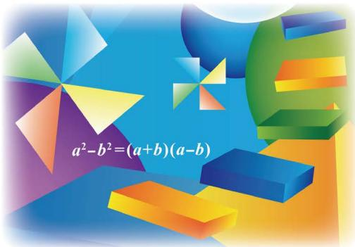

text_image

a²-b²=(a+b)(a-b)

北京师范大学出版社

· 北京 ·

# 走进数学新天地

亲爱的同学，祝贺你跨入了新学期，并在数学世界里不断成长！

在此之前，我们已经认识了有理数及其扩充——实数，体会到方程（组）和一次函数模型的作用，多角度分析了数据所蕴含的信息，知道了直角坐标系中的简单轴对称与坐标之间的关系，研究了为什么要证明、怎样证明一个命题是正确的……

在学习过程中，我们不仅学到了丰富的数学知识，而且还积累了观察、归纳、类比、猜想、证明等许多数学活动的经验，这将有助于我们进一步发现和提出数学问题、分析和解决数学问题。

在本册教科书中，我们将要学习一些新内容。

等腰三角形、直角三角形、平行四边形有哪些基本性质？我们采用什么方法发现并证明这些性质？通过第一章和第六章的学习，相信你会找到自己的答案。

与 “相等” 关系相比, 生活中我们见到的更多是 “不等” 关系. 在数学里, 不等式 (组) 是刻画不等关系的最常见模型. 在第二章中我们会研究最基本的一元一次不等式 (组).

图形的变化也是我们要继续研究的一个课题，在图形平移、旋转过程中什么是不变的？平移、旋转有什么基本性质？相信你也很好奇！通过第三章的学习，你一定会有更多的收获！

除此之外，我们还将学习因式分解的基本方法，了解分式的意义，学习解分式方程……

你在以前的数学学习过程中可能已经体会到, 有效的学习方法对于学好数学有很大的作用. 继续尝试下面的方法吧: 先自己想一想、做一做, 再与同伴议一议, 然后读一读教科书, 听一听老师的讲解, 再试一试解几个问题.

让我们一起走进数学新天地!

# 第一章 三角形的证明

1 等腰三角形 …… 2  
2 直角三角形 …… 14  
3 线段的垂直平分线 …… 22  
4 角平分线 …… 28  
回顾与思考 …… 33  
复习题 …… 33

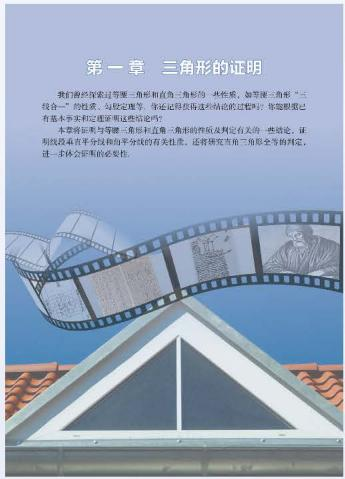

text_image

第一章 三角形的证明
我们能探索过等腰三角形和直角三角形的一种性质，如等腰三角形“三线合一”的性质、与稳定理等。你还能获得这些结论的过程？你能够还有基本事实和定理这些结论吗？
本章将采用导等腰三角形和且腰三角形的性质判定有关的一些结论，证明该段具有完全和均匀分线的有关性质，还有研究在前三角形全等的判定，进一步探究世界的文化性。

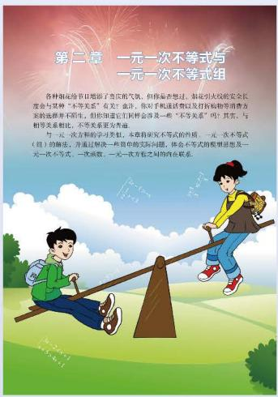

text_image

第二章 一元一次不等式与
一元一次不等式组

各种触底细节已地测了喜欢稍欠欠，但你易在想法、触底引火过的安全长度会与某种“不等关系”有关。你对手机通讯费以及打印机购物等消费方面的选择并不听外，但你知道它们样会得及一些“不等关系”吗？其中，与相关关系相比，不等关系更为高速。
与一元一次方程的学习关联，本章将研究不等式的性质，一元一次不等式（且）的结论，并通过解决一些简单的实际问题，体会不等式的模糊思想及一元一次不等式、一次函数、一元一次方程之间的内在联系。

# 第二章 一元一次不等式与一元一次不等式组

1 不等关系 …… 37  
2 不等式的基本性质 …… 40  
3 不等式的解集 …… 43  
4 一元一次不等式 …… 46  
5 一元一次不等式与一次函数 …… 50  
6 一元一次不等式组 ……54  
回顾与思考 ……61  
复习题 61

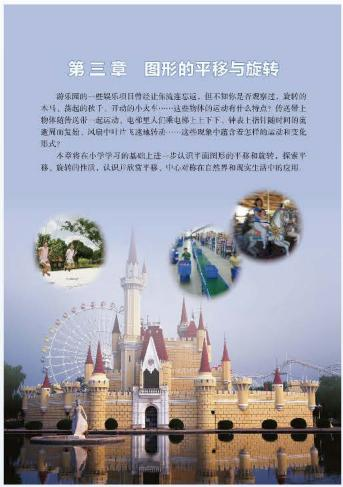

text_image

第三章 图形的平移与旋转
游乐圈的一些娱乐项目曾受让车流量发运，但不知你是否观察过。旋转的大马，荡起的扶子，开动的小火车……这些物体的运动有什么特点？传感器上物体随传送一起运动，电笔把人们乘电梯上下下。种类上因时间时的流道两侧而发起，环境中叶片迅速转速……这些现象中蕴含怎样的运动和变化形式。
本文将在小学学习的基础上进一步认识平面图间的平移和旋转，探索平移、旋转的性质，认识开放平稳、中心对称在自然界和现实生活中的应用。

# 第三章 图形的平移与旋转

1 图形的平移 …… 65  
2 图形的旋转 …… 75  
3 中心对称 81  
4 简单的图案设计 …… 85

回顾与思考 87

复习题 87

# 第四章 因式分解

1 因式分解 ……92  
2 提公因式法 …… 95  
3 公式法 99

回顾与思考 …… 104

复习题 …… 104

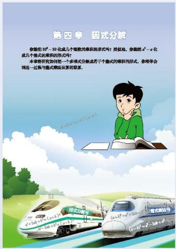

text_image

第四章 因式分解
你能把  \( a^{2}-a-99 \)  代成几个整数的乘积值形式吗？类似地，你能把  \( a^{2}-a \)  化成几个整式的乘积值的形式吗？
本文将研究如何把一个多项式分数法若干个整式的乘积值形式，参阅体会到这一过程与整式乘积法运算的联系。

# 第五章 分式与分式方程

1 认识分式 …… 108  
2 分式的乘除法 …… 114  
3 分式的加减法 …… 117  
4 分式方程 …… 125

回顾与思考 …… 131

复习题 …… 131

text_image

第五章 分式与分式方程
我们在数学学中会遇到诸如 \(\frac{a+1}{2a}\), \(\frac{8}{a-4}\), \(\frac{x+2}{y}\) 之类的式子, 你知道这些式子与零式有什么区别吗? 你认为 \(\frac{x+2}{y} + \frac{3}{y}\) 与 \(\frac{x+2}{y}\) 相等吗?
你见过类似于 \(\frac{1}{x}-\frac{3}{y}\) 这样的方程吗? 你请求出它的罪吗?
本题将学习分式的观念、性质和两题运算; 专属分式方程的解法, 并运用分式方程解决一些两串问题。

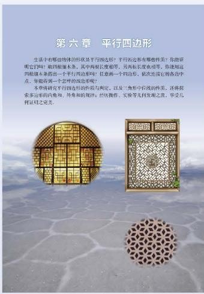

text_image

第六章 平行四边形

生活中有哪些物体的形状是平行四边形？平行四边形有哪些性质？你能证明它们吗？取回制厘米条，其中两相长度相等，另向长腰长度也相等。你使用这四根厘米条推出一个平行四边形吗？任意两个一四边形，依次放送它的各齿中点。朱雀将用一个艺样的四边形呢？

本草请研究平行四边形的性质与规定，以及三角形中位线的性质，还将其更多公司相似角、角角和圆角的直径、结构操作、实操等共同发展之底。毕竟比列证马之突兀。

# 第六章 平行四边形

1 平行四边形的性质 …… 135  
2 平行四边形的判定 …… 140  
3 三角形的中位线 …… 150  
4 多边形的内角和与外角和 …… 153

回顾与思考 …… 158

复习题 …… 158

# 综合与实践

\- 生活中的“一次模型” …… 162

# 综合与实践

\- 平面图形的镶嵌 …… 163

# 总复习

166

# 第一章 三角形的证明

我们曾经探索过等腰三角形和直角三角形的一些性质，如等腰三角形“三线合一”的性质、勾股定理等。你还记得获得这些结论的过程吗？你能根据已有基本事实和定理证明这些结论吗？

本章将证明与等腰三角形和直角三角形的性质及判定有关的一些结论，证明线段垂直平分线和角平分线的有关性质，还将研究直角三角形全等的判定，进一步体会证明的必要性.

# 学习目标

经历探索、证明等腰三角形和直角三角形等图形性质与判定的过程，进一步发展推理能力  
能证明等腰三角形的性质定理和判定定理  
掌握勾股定理及其逆定理，并能运用它们解决一些简单的实际问题  
探索并掌握直角三角形全等的“斜边、直角边”定理  
能证明线段垂直平分线、角平分线的性质定理及其逆定理

# 1

# 等腰三角形

在 “平行线的证明” 一章中, 我们给出了 8 条基本事实, 并从其中的几条基本事实出发证明了有关平行线的一些结论. 运用这些基本事实和已经学习过的定理, 我们还可以证明有关三角形的一些结论.

# 想一想

我们已经探索过“两角分别相等且其中一组等角的对边相等的两个三角形全等”这个结论，你能用有关的基本事实和已经学习过的定理证明它吗？

定理 两角分别相等且其中一组等角的对边相等的两个三角形全等. (AAS)

根据全等三角形的定义，我们可以得到

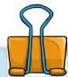

全等三角形的对应边相等、对应角相等.

# 议一议
(1) 还记得我们探索过的等腰三角形的性质吗?  
(2) 请你选择等腰三角形的一条性质进行证明, 并与同伴交流.

定理 等腰三角形的两底角相等.

这一定理可以简述为：等边对等角.

已知：如图1-1，在 $\triangle ABC$ 中， $AB = AC$

求证： $\angle B = \angle C.$

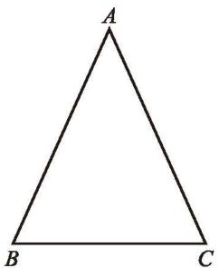

natural_image

Simple geometric triangle diagram labeled A, B, C at vertices (no additional text or symbols)

图1-1

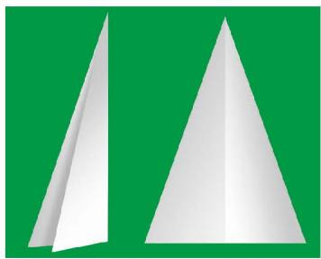

natural_image

Two white paper airplanes on a green background, no text or symbols present

图1-2

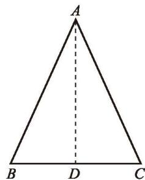

text_image

A
B D C

图1-3
分析：我们曾经利用折叠的方法说明了这两个底角相等（如图1-2）。实际上，折痕将等腰三角形分成了两个全等三角形。这启发我们，可以作一条辅助线，把原三角形分成两个全等的三角形，从而证明这两个底角相等。
证明：如图 1-3，取 $BC$ 的中点 $D$ ，连接 $AD$ .
$\because A B = A C, B D = C D, A D = A D,$
$\therefore \triangle A B D \cong \triangle A C D (\text { S   S   S }).$

∴ $\angle B = \angle C$ (全等三角形的对应角相等).

你还有其他证明方法吗？与同伴交流。

# 想一想

在图1-3中，线段 $AD$ 还具有怎样的性质？为什么？由此你能得到什么结论？

推论 等腰三角形顶角的平分线、底边上的中线及底边上的高线互相重合.

# 随堂练习

1. 在 $\triangle ABC$ 中, $AB = AC$ .
(1) 若 $\angle A = 40^{\circ}$ ，则 $\angle C$ 等于多少度？
(2) 若 $\angle B = 72^{\circ}$ ，则 $\angle A$ 等于多少度？

2. 如图, 在 $\triangle ABD$ 中, $AC \perp BD$ , 垂足为 $C$ , $AC = BC = CD$ .
(1) 求证: $\triangle ABD$ 是等腰三角形;  
(2) 求 $\angle BAD$ 的度数.

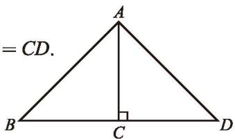

text_image

=CD.
B	C	D

(第2题)

# 习题 1.1

# 知识技能

1. 将下面证明中每一步的理由写在括号内.

已知：如图， $AB = CD$ ， $AD = CB$

求证： $\angle A=\angle C.$
证明：如图，连接 $BD$ .

在 $\triangle BAD$ 和 $\triangle DCB$ 中，
$\because A B = C D (\quad),$
$A D = C B (\quad),$
$B D = D B (\quad),$
$\therefore \quad \triangle B A D \cong \triangle D C B (\quad).$
$\therefore \angle A = \angle C (\quad).$

2. 已知：如图，点 $B, E, C, F$ 在同一条直线上， $AB = DE$ ， $AC = DF$ ， $BE = CF$ .

求证： $\angle A=\angle D.$

3. 如图, 在 $\triangle ABC$ 中, $\angle BAC = 108^{\circ}$ , $AB = AC$ , $AD \perp BC$ , 垂足为 $D$ , 求 $\angle BAD$ 的度数.

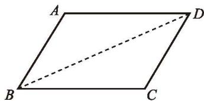

text_image

A
B
C
D

(第1题)

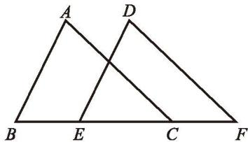

text_image

A
D
B E C F

(第2题)

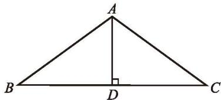

text_image

A
B
D
C

(第3题)

# 数学理解

4. 如图, 在 $\triangle ABC$ 中, $AB = AC$ , $AD \perp BC$ , 垂足为 $D$ , 点 $E$ 是 $AD$ 上一点, 连接 $BE$ , $CE$ . 请找出图中所有相等的角, 并说明理由.

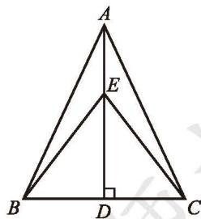

text_image

A
E
B
D
C

(第4题)

5. 两个等腰三角形的顶角和底边分别相等,那么这两个三角形全等吗？

请证明你的结论.

# 问题解决

6. 如图, 在 $\triangle ABC$ 中, $AB = AC$ , 点 $D$ , $E$ 都在边 $BC$ 上, 且 $AD = AE$ , 那么 $BD$ 与 $CE$ 相等吗? 请证明你的结论.

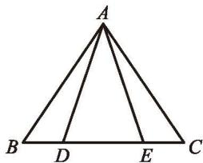

text_image

A
B D E C

(第6题)

在等腰三角形中画出一些线段（如角平分线、中线、高等），你能发现其中一些相等的线段吗？能证明你的结论吗？

> [!example]- 例1 证明：等腰三角形两底角的平分线相等.
已知: 如图 1-4, 在 $\triangle ABC$ 中, $AB = AC$ , $BD$ 和 $CE$ 是 $\triangle ABC$ 的角平分线.

求证：BD = CE.
证明：∵ AB = AC,

∴ $\angle ABC = \angle ACB$ （等边对等角）.

∵ BD, CE 分别平分 ∠ABC 和 ∠ACB,
$\begin{array}{l} \therefore \angle 1 = \frac {1}{2} \angle A B C, \angle 2 = \frac {1}{2} \angle A C B. \\ \therefore \angle 1 = \angle 2. \\ \end{array}$

在 $\triangle BDC$ 和 $\triangle CEB$ 中，
$\because \angle A C B = \angle A B C, B C = C B, \angle 1 = \angle 2,$
$\therefore \quad \triangle B D C \cong \triangle C E B (\mathrm{ASA}).$
$\therefore BD=CE$ （全等三角形的对应边相等）.

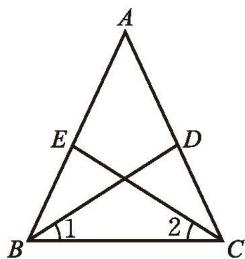

text_image

A
E       D
B 1     2 C

图1-4

等腰三角形两腰上的中线相等吗？高呢？还有其他的结论吗？请你证明它们，并与同伴交流。

# 议一议

如图 1-5, 在 $\triangle ABC$ 中, $AB = AC$ , 点 $D$ , $E$ 分别在边 $AC$ 和 $AB$ 上.

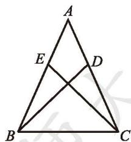

text_image

A
E
D
B
C

图1-5

(1) 如果 $\angle ABD = \frac{1}{3} \angle ABC$ , $\angle ACE = \frac{1}{3} \angle ACB$ , 那么 $BD = CE$ 吗? 如果 $\angle ABD = \frac{1}{4} \angle ABC$ , $\angle ACE = \frac{1}{4} \angle ACB$ 呢? 由此你能得到一个什么结论?
(2) 如果 $AD = \frac{1}{2} AC$ , $AE = \frac{1}{2} AB$ , 那么 $BD = CE$ 吗? 如果 $AD = \frac{1}{3} AC$ , $AE = \frac{1}{3} AB$ 呢? 由此你能得到一个什么结论?

# 想一想

等边三角形是特殊的等腰三角形，那么等边三角形的内角有什么特征呢？

定理 等边三角形的三个内角都相等，并且每个角都等于 $60^{\circ}$

已知：如图1-6，在 $\triangle ABC$ 中， $AB = AC = BC.$

求证： $\angle A = \angle B = \angle C = 60^{\circ}.$
证明：∵ AB = AC,
$\therefore \angle B = \angle C$ (等边对等角).
又∵ AC = BC,

∴ $\angle A = \angle B$ (等边对等角).
$\therefore \quad \angle A = \angle B = \angle C.$

在 $\triangle ABC$ 中，
$\because \angle A + \angle B + \angle C = 1 8 0 ^ {\circ},$
$\therefore \angle A = \angle B = \angle C = 6 0 ^ {\circ}.$

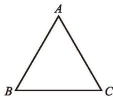

natural_image

Simple geometric triangle diagram labeled A, B, C at vertices (no additional text or symbols)

图1-6

# 随堂练习

1. 求等边三角形两条中线相交所成锐角的度数.

2. 如图, 在 $\triangle ABC$ 中, $D$ , $E$ 是 $BC$ 的三等分点, 且 $\triangle ADE$ 是等边三角形, 求 $\angle BAC$ 的度数.

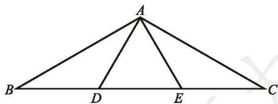

text_image

A
B D E C

(第2题)

# 习题 1.2

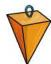

# 知识技能

1. 如图, 在 $\triangle ABC$ 中, $AB = AC$ , $BD$ 平分 $\angle ABC$ , 交 $AC$ 于点 $D$ . 若 $BD = BC$ , 则 $\angle A$ 等于多少度?

2. 已知：如图，在 $\triangle ABC$ 中， $AB = AC$ ， $D$ 为 $BC$ 的中点，点 $E$ ， $F$ 分别在 $AB$ 和 $AC$ 上，并且 $AE = AF$ 。求证： $DE = DF$ 。

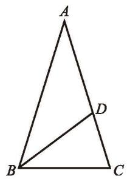

text_image

A
B
C
D

(第1题)

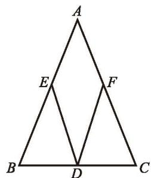

text_image

A
E
F
B
D
C

(第2题)

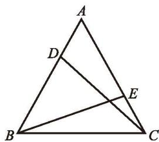

text_image

A
D
B
C
E

(第3题)

3. 已知：如图，D，E分别是等边三角形ABC的两边AB，AC上的点，且AD=CE.
求证：CD = BE.

# 数学理解

4. 如图, 在一个风筝 $ABCD$ 中, $AB = AD$ , $BC = DC$ .
(1) 分别在 $AB, AD$ 的中点 $E, F$ 处拉两根彩线 $EC, FC$ , 证明: 这两根彩线的长度相等;
(2) 如果 $AE = \frac{1}{3}AB$ ， $AF = \frac{1}{3}AD$ ，那么彩线的长度相等吗？
如果 $AE = \frac{1}{4}AB$ ， $AF = \frac{1}{4}AD$ 呢？由此你能得到什么结论？
(3) 除了 (1)(2) 的条件外, 你还能在哪些已知条件下得到两根彩线的长度相等的结论?

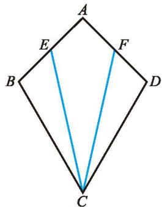

text_image

A
E
F
B
D
C

(第4题)

前面已经证明了等腰三角形的两底角相等。反过来，有两个角相等的三角形是等腰三角形吗？

如图1-7, 在 $\triangle ABC$ 中, $\angle B = \angle C$ , 要想证明 $AB = AC$ , 只要能构造两个全等的三角形, 使 $AB$ 与 $AC$ 成为对应边就可以了. 你是怎样构造的?

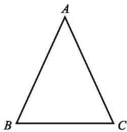

natural_image

Simple geometric triangle diagram labeled A, B, C at vertices (no additional text or symbols)

图1-7

定理 有两个角相等的三角形是等腰三角形.

这一定理可以简述为：等角对等边.

请你写出证明过程.

> [!example]- 例2 已知：如图 1-8，AB = DC，BD = CA，BD 与 CA 相交于点 E.
求证： $\triangle AED$ 是等腰三角形.
证明：∵ AB = DC，BD = CA，AD = DA，
$\therefore \triangle A B D \cong \triangle D C A (\text { S   S   S }).$

∴ $\angle ADB = \angle DAC$ （全等三角形的对应角相等）.
$\therefore AE=DE$ （等角对等边）.
$\therefore \triangle AED$ 是等腰三角形.

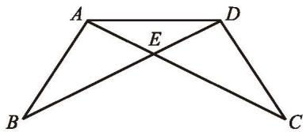

text_image

A
E
D
B
C

图1-8

# 想一想

小明认为，在一个三角形中，如果两个角不相等，那么这两个角所对的边也不相等。你认为小明这个结论成立吗？如果成立，你能证明它吗？

小明是这样想的:

natural_image

Cartoon illustration of a smiling boy in a green jacket pointing with his right hand (no text or symbols)

如图1-9，在 $\triangle ABC$ 中，已知 $\angle B \neq \angle C$ ，此时 $AB$ 与 $AC$ 要么相等，要么不相等.

假设 AB = AC，那么根据“等边对等角”定理可得 $\angle C = \angle B$ ，

这与已知条件 $\angle B \neq \angle C$ 相矛盾, 因此 $AB \neq AC$ .

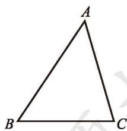

text_image

A
B C

图1-9

你能理解他的推理过程吗？

小明在证明时, 先假设命题的结论不成立, 然后推导出与定义、基本事实、已有定理或已知条件相矛盾的结果, 从而证明命题的结论一定成立. 这种证明方法称为反证法 (reduction to absurdity).

> [!example]- 例3 用反证法证明：一个三角形中不能有两个角是直角.
已知： $\triangle ABC$ .

求证: $\angle A, \angle B, \angle C$ 中不能有两个角是直角.
证明：假设 $\angle A, \angle B, \angle C$ 中有两个角是直角，不妨设 $\angle A$ 和 $\angle B$ 是直角，即 $\angle A = 90^{\circ}, \angle B = 90^{\circ}$ .
于是 $\angle A + \angle B + \angle C = 90^{\circ} + 90^{\circ} + \angle C > 180^{\circ}$

这与三角形内角和定理相矛盾，因此“∠A和∠B是直角”的假设不成立.
所以，一个三角形中不能有两个角是直角.

# 随堂练习

1. 如图, 在 $\triangle ABC$ 中, $BD$ 平分 $\angle ABC$ , 交 $AC$ 于点 $D$ , 过点 $D$ 作 $BC$ 的平行线, 交 $AB$ 于点 $E$ , 请判断 $\triangle BDE$ 的形状, 并说明理由.

2. 已知五个正数的和等于 1，用反证法证明：这五个正数中至少有一个大于或等于 $\frac{1}{5}$ .

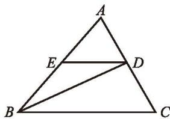

text_image

A
E
D
B
C

(第1题)

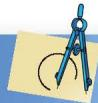

# 习题 1.3

# 知识技能

1. 已知：如图， $\angle CAE$ 是 $\triangle ABC$ 的外角， $AD \parallel BC$ ，

且 $\angle 1 = \angle 2$

求证：AB = AC.

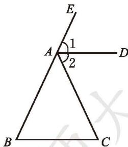

text_image

E
1
A
2
D
B
C

(第1题)

2. 已知：如图，在 $\triangle ABC$ 中， $AB = AC$ ，点 $E$ 在 $CA$ 的延长线上， $EP \perp BC$ ，垂足为 $P$ ， $EP$ 交 $AB$ 于点 $F$ 。求证： $\triangle AEF$ 是等腰三角形。

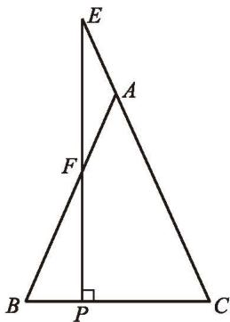

text_image

E
A
F
B
P
C

(第2题)

# 数学理解

3. (1) 已知: 如图 (甲), 等腰三角形的一个内角为锐角 $a$ , 腰为 $a$ , 求作这个等腰三角形;

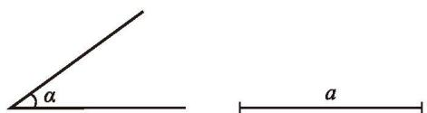

text_image

a
a

(甲)

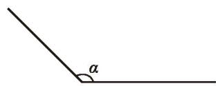

text_image

α

(乙)   
(第3题)
(2) 在 (1) 中, 把锐角 $\alpha$ 变成钝角 $\alpha$ , 其他条件不变, 求作这个等腰三角形.

# 问题解决

4. 如图, 一艘船从 $A$ 处出发, 以 $18 \mathrm{~kn}^{\textcircled{1}}$ 的速度向正北航行, 经过 $10 \mathrm{~h}$ 到达 $B$ 处. 分别从 $A$ , $B$ 望灯塔 $C$ , 测得 $\angle NAC = 42^{\circ}$ , $\angle NBC = 84^{\circ}$ . 求从 $B$ 处到灯塔 $C$ 的距离.

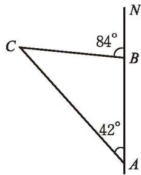

text_image

C
84°
B
42°
A
N

(第4题)

一个三角形满足什么条件时是等边三角形？一个等腰三角形满足什么条件时是等边三角形？请证明自己的结论，并与同伴交流。

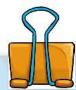

定理 三个角都相等的三角形是等边三角形.

定理 有一个角等于 $60^{\circ}$ 的等腰三角形是等边三角形.

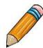

# 做一做

用两个含 $30^{\circ}$ 角的全等的三角尺, 你能拼成一个怎样的三角形? 能拼出一个等边三角形吗? 由此你能发现什么结论? 说说你的理由.

定理 在直角三角形中, 如果一个锐角等于 $30^{\circ}$ , 那么它所对的直角边等于斜边的一半.

已知：如图 1-10（1），△ABC 是直角三角形， $\angle C=90^{\circ}$ ， $\angle A=30^{\circ}$

求证: $BC = \frac{1}{2} AB$ .

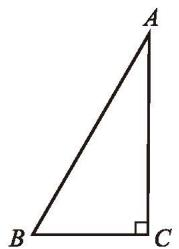

text_image

A
B
C

(1)

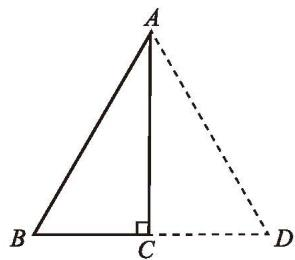

text_image

A
B C D

(2)   
图1-10
证明: 如图 1-10 (2), 延长 $BC$ 至点 $D$ , 使 $CD = BC$ , 连接 $AD$ .
$\because \angle A C B = 9 0 ^ {\circ}, \angle B A C = 3 0 ^ {\circ},$
$\therefore \angle A C D = 9 0 ^ {\circ}, \angle B = 6 0 ^ {\circ}.$
$\because A C = A C,$
$\therefore \quad \triangle A B C \cong \triangle A D C (\text { SAS }).$
$\therefore AB=AD$ （全等三角形的对应边相等）.

∴ $\triangle ABD$ 是等边三角形（有一个角等于 $60^{\circ}$ 的等腰三角形是等边三角形）.
$\therefore B C = \frac {1}{2} B D = \frac {1}{2} A B.$

> [!example]- 例4 求证: 如果等腰三角形的底角为 $15^{\circ}$ , 那么腰上的高是腰长的一半.
已知：如图 1-11，在 $\triangle ABC$ 中， $AB = AC$ ， $\angle B = 15^{\circ}$ ， $CD$ 是腰 $AB$ 上

的高.

求证: $CD = \frac{1}{2} AB$ .
证明：在 $\triangle ABC$ 中，
$\because A B = A C, \angle B = 1 5 ^ {\circ},$
$\therefore \angle ACB = \angle B = 15^{\circ}$ （等边对等角）.
$\therefore \angle D A C = \angle B + \angle A C B = 1 5 ^ {\circ} + 1 5 ^ {\circ} = 3 0 ^ {\circ}.$

∵ CD 是腰 AB 上的高，
$\therefore \angle A D C = 9 0 ^ {\circ}.$
$\therefore CD=\frac{1}{2}AC$ （在直角三角形中，如果一个锐角等于 $30^{\circ}$ ，那么它所对的直角边等于斜边的一半）.
$\therefore C D = \frac {1}{2} A B.$

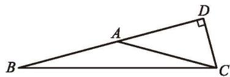

text_image

Geometric diagram showing triangle ABC with right angle at D and point A on AB

图1-11

# 随堂练习

如图, 在 Rt△ABC 中, $\angle ACB = 90^{\circ}$ , $\angle B = 60^{\circ}$ , $CD$ 是 $\triangle ABC$ 的高, 且 $BD = 1$ , 求 $AD$ 的长.

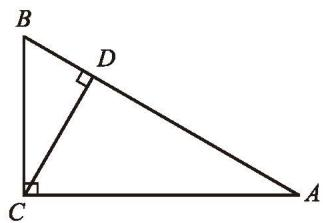

text_image

B
D
C
A

# 习题 1.4

# 知识技能

1. 已知：如图，△ABC是等边三角形，与BC平行的直线分别交AB和AC于点D，E.

求证： $\bigtriangleup {ADE}$ 是等边三角形.

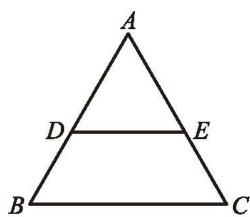

text_image

A
D E
B C

(第1题)

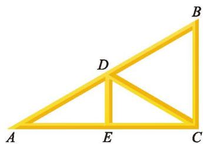

natural_image

Geometric diagram of a yellow right triangle ABC with point D on side AB and point E on base AC (no labels or measurements)

(第2题)

2. 房梁的一部分如图所示, 其中 $BC \perp AC$ , $\angle A = 30^{\circ}$ , $AB = 7.4 \mathrm{~m}$ , 点 $D$ 是 $AB$ 的中点, 且 $DE \perp AC$ , 垂足为 $E$ , 求 $BC$ , $DE$ 的长.

# 联系拓广

3. (1) 如图, $\triangle ABC$ 是等边三角形, 过它的三个顶点分别作对边的平行线, 得到一个新的 $\triangle DEF$ , $\triangle DEF$ 是等边三角形吗? 你还能找到其他的等边三角形吗? 点 $A, B, C$ 分别是 $EF, ED, FD$ 的中点吗? 请证明你的结论.
(2) 如果 $\triangle DEF$ 是等边三角形, 点 $A, B, C$ 分别是 $EF$ , $ED, FD$ 的中点, 那么 $\triangle ABC$ 是等边三角形吗? 请证明你的结论.

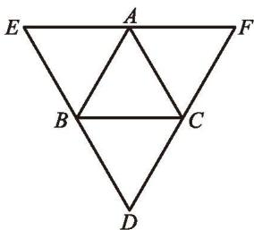

text_image

E
A
F
B
C
D

(第3题)

※4. 证明：在直角三角形中，如果一条直角边等于斜边的一半，那么这条直角边所对的锐角等于 $30^{\circ}$ .

※5. 如图, $ABCD$ 是一张长方形纸片, 且 $AD = 2AB$ , 沿过点 $D$ 的折痕将 $A$ 角翻折, 使得点 $A$ 落在 $BC$ 上 (如图中的点 $A'$ ), 折痕交 $AB$ 于点 $G$ , 那么 $\angle ADG$ 等于多少度? 你能证明你的结论吗? (提示: 利用第4题的结论)

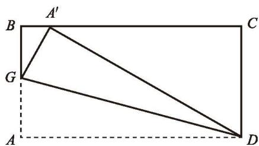

text_image

A'
B
C
G
A
D

(第5题)

# 2

# 直角三角形

我们曾经探索过直角三角形的哪些性质和判定方法？与同伴交流.

# 想一想
(1) 直角三角形的两个锐角有怎样的关系? 为什么? (2) 如果一个三角形有两个角互余, 那么这个三角形是直角三角形吗? 为什么?

定理 直角三角形的两个锐角互余.

定理 有两个角互余的三角形是直角三角形.

我们曾经利用数方格和割补图形的方法得到了勾股定理。实际上，利用基本事实和已有定理，我们能够证明勾股定理（有关证明过程参见本节“读一读”）。

勾股定理 直角三角形两条直角边的平方和等于斜边的平方.

反过来，在一个三角形中，当两边的平方和等于第三边的平方时，我们曾用度量的办法得出“这个三角形是直角三角形”的结论。下面我们证明这个结论。

已知: 如图 1-12 (1), 在 $\triangle ABC$ 中, $AB^{2} + AC^{2} = BC^{2}$ .

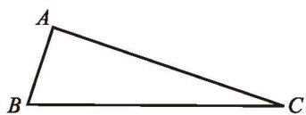

natural_image

Simple geometric diagram of a triangle labeled A, B, C (no additional text or symbols)

(1)

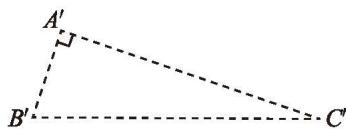

text_image

A'
B'
C'

(2)   
图1-12

求证： $\bigtriangleup ABC$ 是直角三角形.
证明：如图 1-12（2），作 Rt△A'B'C'，使
$\angle A ^ {\prime} = 9 0 ^ {\circ}, A ^ {\prime} B ^ {\prime} = A B, A ^ {\prime} C ^ {\prime} = A C,$

则 $A'B'^2 + A'C'^2 = B'C'^2$ （勾股定理）.
$\because A B ^ {2} + A C ^ {2} = B C ^ {2},$
$\therefore B C ^ {2} = B ^ {\prime} C ^ {2}.$
$\therefore B C = B ^ {\prime} C ^ {\prime}.$
$\therefore \quad \triangle A B C \cong \triangle A ^ {\prime} B ^ {\prime} C ^ {\prime} (\text { S   S   S }).$
$\therefore \angle A = \angle {A}^{\prime } = {90}^{ \circ  }$ (全等三角形的对应角相等).
因此， $\triangle ABC$ 是直角三角形.

定理 如果三角形两边的平方和等于第三边的平方，那么这个三角形是直角三角形.

# 议一议

观察上面第一个定理和第二个定理，它们的条件和结论之间有怎样的关系？第三个定理和第四个定理呢？与同伴交流。

再观察下面三组命题：
如果两个角是对顶角，那么它们相等；如果两个角相等，那么它们是对顶角。
如果小明患了肺炎，那么他一定会发烧；如果小明发烧，那么他一定患了肺炎。

一个三角形中相等的边所对的角相等；一个三角形中相等的角所对的边相等.

上面每组中两个命题的条件和结论也有类似的关系吗？与同伴交流。

在两个命题中，如果一个命题的条件和结论分别是另一个命题的结论和条

件, 那么这两个命题称为互逆命题, 其中一个命题称为另一个命题的逆命题.

# 想一想

你能写出命题 “如果两个有理数相等，那么它们的平方相等” 的逆命题吗？它们都是真命题吗？

一个命题是真命题，它的逆命题不一定是真命题。如果一个定理的逆命题经过证明是真命题，那么它也是一个定理，其中一个定理称为另一个定理的逆定理。例如，本节课学习的第一个定理和第二个定理就是一对互逆定理，第三个定理和第四个定理也是一对互逆定理。你还能举出一些互逆定理的例子吗？

# 随堂练习

1. 在 $\triangle ABC$ 中, 已知 $\angle A = \angle B = 45^{\circ}$ , $BC = 3$ , 求 $AB$ 的长.

2. 已知：在 $\triangle ABC$ 中，AB = 13 cm，BC = 10 cm，BC 边上的中线 AD = 12 cm.
求证：AB = AC.

3. 说出下列命题的逆命题，并判断每对命题的真假：
(1) 四边形是多边形;  
(2) 两直线平行, 同旁内角互补;  
(3) 如果 ab=0，那么 a=0，b=0。

# 读一读

# 勾股定理的证明

利用教科书给出的基本事实和已有定理，我们可以证明勾股定理.

如图 1-13（1），在 $\triangle ABC$ 中， $\angle C = 90^{\circ}$ ， $BC = a$ ， $AC = b$ ， $AB = c$ 。

分别以 Rt△ABC 的三边为边长作正方形 AHIB, ACDE, CBFG (如图 1-13(2)). 连接 EB, CH. 过点 C 作 AB 的垂线, 分别交 AB 和 HI 于

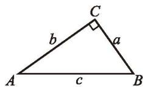

text_image

C
b	a
A	c	B

(1)

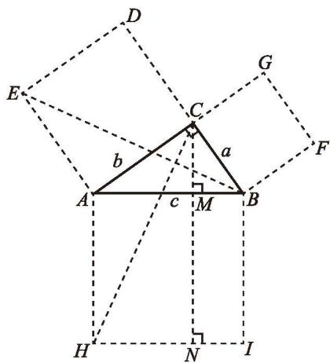

text_image

Geometric diagram with labeled points, lines, and right-angle markers for mathematical analysis

(2)   
图1-13

点 $M, N$ .
$\because \quad E A = C A, \angle E A B = \angle C A H = 9 0 ^ {\circ} + \angle C A B, A B = A H,$
$\therefore \quad \triangle E A B \cong \triangle C A H (\mathrm{SAS}).$
又∵ $S_{正方形ACDE}=2S_{\triangle EAB},\quad S_{长方形AHNM}=2S_{\triangle CAH},$
$\therefore \quad b ^ {2} = S _ {\text {长方形} A H N M}.$
同理 $a^2 = S_{\text{长方形}MNIB}$
$\therefore \quad c ^ {2} = a ^ {2} + b ^ {2}.$

以上是欧几里得在《原本》中证明勾股定理的大致过程.

勾股定理是数学史上非常重要的定理之一。两千多年来，人们对它进行了大量的研究，给出了多达数百种的证明方法。如果你有兴趣，可查阅有关资料，了解勾股定理的其他证明方法。

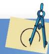

# 习题 1.5

# 知识技能

1. 如图, 在四边形 $ABCD$ 中, $AB \parallel CD$ , $E$ 为 $BC$ 上的一点, 且 $\angle BAE = 25^{\circ}$ , $\angle CDE = 65^{\circ}$ , $AE = 2$ , $DE = 3$ , 求 $AD$ 的长.

text_image

Geometric diagram of quadrilateral ABCD with internal points E and connecting segments

(第1题)

2. 一个直角三角形房梁如图所示, 其中 $BC \perp AC$ , $\angle A = 30^{\circ}$ , $AB = 10 \mathrm{~m}$ , $CB_{1} \perp AB$ , $B_{1}C_{1} \perp AC$ , 垂足分别为 $B_{1}, C_{1}$ , 那么 $BC$ 的长是多少? $B_{1}C_{1}$ 呢?

text_image

A
B
B₁
C₁
C

(第2题)

# 问题解决

3. 如图, 小红想测量离 $A$ 处 ${30}\mathrm{\;m}$ 的大树的高度, 她站在 $A$ 处仰望树顶 $B$ , 仰角为 ${30}^{ \circ  }$ (即 $\angle {BDE} = {30}^{ \circ  }$ ). 已知小红身高 ${1.52}\mathrm{\;m}$ ,求大树的高度(结果精确到 ${0.1}\mathrm{\;m}$ ).

text_image

B
E
30°
D
A

(第3题)

text_image

D'
A'
B'
C'
D
C
A
B

(第5题)

4. 有一块三角形空地，它的三条边线分别长 $45 \mathrm{~m}, 60 \mathrm{~m}$ 和 $70 \mathrm{~m}$ . 已知 $60 \mathrm{~m}$ 长的边线为南北向，是否有一条边线为东西向？

5. 如图, 正四棱柱的底面边长为 $5 \mathrm{~cm}$ , 侧棱长为 $8 \mathrm{~cm}$ , 一只蚂蚁从点 $A$ 出发, 沿棱柱侧面到点 $C'$ 处吃食物, 那么它需要爬行的最短路径的长是多少?

两边分别相等且其中一组等边的对角相等的两个三角形全等吗？如果其中一组等边所对的角是直角呢？

# 做一做

已知一条直角边和斜边，求作一个直角三角形.

已知：如图1-14，线段 $a, c (a < c)$ ，直角 $\alpha$ 。

text_image

a
c
α

图1-14

求作：Rt△ABC，使 $\angle C = \angle a, BC = a, AB = c.$

小明的作法如下：
(1) 作 $\angle MCN = \angle \alpha = 90^{\circ}$ .

text_image

M
C
N

(2) 在射线 CM 上截取 CB = a.

text_image

M
B
C
N

(3) 以点 B 为圆心，线段 c 的长为半径作弧，交射线 CN 于点 A.

text_image

M
B
C
A
N

(4) 连接 $AB$ , 得到 Rt△ABC.

text_image

M
B
C
A
N

你作的直角三角形与小明作的全等吗？

定理 斜边和一条直角边分别相等的两个直角三角形全等.

已知：如图1-15，在 $\triangle ABC$ 与 $\triangle A'B'C'$ 中， $\angle C = \angle C' = 90^\circ, AB = A'B', AC = A'C'$ .

求证： $\triangle ABC \cong \triangle A'B'C'$ .
证明：在 $\triangle ABC$ 中，
$\because \angle C = 9 0 ^ {\circ},$

∴ $BC^{2}=AB^{2}-AC^{2}$ （勾股定理）.
同理， $B^{\prime}C^{\prime2}=A^{\prime}B^{\prime2}-A^{\prime}C^{\prime2}.$
$\because A B = A ^ {\prime} B ^ {\prime}, A C = A ^ {\prime} C ^ {\prime},$
$\therefore B C = B ^ {\prime} C ^ {\prime}.$
$\therefore \quad \triangle A B C \cong \triangle A ^ {\prime} B ^ {\prime} C ^ {\prime} (\text { SSS }).$

text_image

A
C
B

text_image

A'
C'
B'

图1-15

这一定理可以简述为“斜边、直角边”或“HL”.

例如图 1-16, 有两个长度相等的滑梯, 左边滑梯的高度 $AC$ 与右边滑梯水平方向的长度 $DF$ 相等, 两个滑梯的倾斜角 $\angle B$ 和 $\angle F$ 的大小有什么关系?
解：根据题意，可知
$\angle B A C = \angle E D F = 9 0 ^ {\circ},$
$B C = E F, A C = D F,$

∴ Rt△BAC ≅ Rt△EDF (HL).

∴ $\angle B = \angle DEF$ (全等三角形的对应角相等).
$\because \angle DEF + \angle F = 90^{\circ}$ （直角三角形的两锐角互余），
$\therefore \angle B + \angle F = 9 0 ^ {\circ}.$

text_image

Geometric diagram showing a tower with multiple trapezoids and labeled points A, B, C, D, E, F, including right-angle markers at B and D.

图1-16

# 随堂练习

1. 判断下列命题的真假，并说明理由：
(1) 两个锐角分别相等的两个直角三角形全等;  
(2) 斜边及一锐角分别相等的两个直角三角形全等;  
(3) 两条直角边分别相等的两个直角三角形全等;  
(4) 一条直角边相等且另一条直角边上的中线相等的两个直角三角形全等.

2. 如图, 两根长度均为 $12 \mathrm{~m}$ 的绳子, 一端系在旗杆上, 另一端分别固定在地面的两个木桩上, 两个木桩离旗杆底部的距离相等吗? 请说明你的理由.

text_image

A
B O C

(第2题)

# 习题 1.6

# 知识技能

1. 已知：如图，D 是 $\triangle ABC$ 的 BC 边的中点， $DE \perp AC$ ， $DF \perp AB$ ，垂足分别为 E，F，且 DE = DF。求证： $\triangle ABC$ 是等腰三角形。

text_image

A
F
E
B
D
C

(第1题)

text_image

D
E
F
A
B
C

(第2题)

2. 已知：如图， $AB = CD$ ， $DE \perp AC$ ， $BF \perp AC$ ，垂足分别为 E，F，且 DE = BF。求证：
(1) $AE = CF$ ; (2) $AB \parallel CD$ .

3. 用三角尺可以画角平分线: 如图所示, 在已知 $\angle AOB$ 的两边上分别取点 $M, N$ , 使 $OM = ON$ , 再过点 $M$ 画 $OA$ 的垂线, 过点 $N$ 画 $OB$ 的垂线, 两垂线交于点 $P$ , 那么射线 $OP$ 就是 $\angle AOB$ 的平分线. 请你证明这一结论.

text_image

O
M
A
P
N
B

(第3题)

# 数学理解

4. 判断下列命题的真假，并说明理由：
(1) 两边分别相等的两个直角三角形全等;  
(2)一个锐角和一条边分别相等的两个直角三角形全等.

# 联系拓广

5. 在如图所示的三角形纸片 ${ABC}$ 中, $\angle C = {90}^{ \circ  }$ , $\angle B = {30}^{ \circ  }$ . 按如下步骤可以把这个直角三角形纸片分成三个全等的小直角三角形(图中虚线表示折痕): ①折叠三角形纸片 ${ABC}$ ,

使点 B 与点 A 重合；② 将折叠后的纸片再沿 AD 折叠.
(1) 由步骤①可以得到哪些等量关系?  
(2) 请证明 $\triangle ACD \cong \triangle AED;$   
(3) 按照这种方法能否将任意一个直角三角形分成三个全等的小三角形?

text_image

A
E
C
D
B

(第5题)

# 线段的垂直平分线

我们曾经利用折纸的办法得到：线段垂直平分线上的点到这条线段两个端点的距离相等。请你尝试证明这一结论，并与同伴交流。

定理 线段垂直平分线上的点到这条线段两个端点的距离相等.

已知: 如图 1-17, 直线 $MN \perp AB$ , 垂足为 $C$ , 且 $AC = BC$ , $P$ 是 $MN$ 上的任意一点.

求证： $PA = PB$
证明：∵ $MN \perp AB$ ,
$\therefore \angle P C A = \angle P C B = 9 0 ^ {\circ}.$
$\because A C = B C, P C = P C,$
$\therefore \quad \triangle P C A \cong \triangle P C B (\mathrm{SAS}).$

∴ PA = PB（全等三角形的对应边相等）.

text_image

M
P
A
C
B
N

图1-17
如果点 $P$ 与点 $C$ 重合, 那么结论显然成立.

# 想一想

你能写出上面这个定理的逆命题吗？它是真命题吗？如果是，请你加以证明。

定理 到一条线段两个端点距离相等的点，在这条线段的垂直平分线上.

> [!example]- 例1 已知：如图 1-18，在 $\triangle ABC$ 中， $AB = AC$ ， $O$ 是 $\triangle ABC$ 内一点，且 $OB = OC$ .
求证: 直线 $AO$ 垂直平分线段 $BC$ .
证明：∵ AB = AC,

∴ 点 A 在线段 BC 的垂直平分线上（到一条线段两个端点距离相等的点，在这条线段的垂直平分线上）.
同理，点 O 在线段 BC 的垂直平分线上.

text_image

A
O
B
C

图1-18

你还有其他证明方法吗？

∴ 直线 AO 是线段 BC 的垂直平分线（两点确定一条直线）.

# 随堂练习

已知：如图， $AB$ 是线段 $CD$ 的垂直平分线， $E, F$ 是 $AB$ 上的两点. 求证： $\angle ECF = \angle EDF$ .

text_image

A E C B
F
D

# 习题 1.7

# 知识技能

1. 如图, 在 $\triangle ABC$ 中, $AB = AC$ , $\angle BAC = 120^{\circ}$ , $AB$ 的垂直平分线交 $AB$ 于点 $E$ , 交 $BC$ 于点 $F$ , 连接 $AF$ , 求 $\angle AFC$ 的度数.

text_image

Geometric diagram of triangle ABC with perpendicular lines and labeled points E, F, and right angle at E

(第1题)

# 数学理解

2. 在以线段 $AB$ 为底边的所有等腰三角形中, 它们另一个顶点的位置有什么共同特征?

# 问题解决

3. 如图, 在 $\triangle ABC$ 中, 已知 $AC = 27$ , $AB$ 的垂直平分线交 $AB$ 于点 $D$ , 交 $AC$ 于点 $E$ , $\triangle BCE$ 的周长等于 50 , 求 $BC$ 的长.

text_image

A
D
E
B
C

(第3题)

text_image

A
•B

(第4题)

4. 如图, $A$ , $B$ 表示两个仓库, 要在 $A$ , $B$ 一侧的河岸边建造一个码头, 使它到两个仓库的距离相等, 码头应建造在什么位置?

> [!example]- 例2 求证：三角形三条边的垂直平分线相交于一点, 并且这一点到三个顶点的距离相等.
已知：如图1-19，在 $\triangle ABC$ 中，边 $AB$ 的垂直平分线与边 $BC$ 的垂直平分线相交于点 $P$ .

求证：边 $AC$ 的垂直平分线经过点 $P$ ，且 $PA = PB = PC$ .

text_image

Geometric diagram of triangle ABC with perpendicular lines and labeled points P and right-angle symbols

图1-19
证明：∵ 点 P 在线段 AB 的垂直平分线上，

∴ PA = PB（线段垂直平分线上的点到这条线段两个端点的距离相等）.
同理，PB = PC.
$\therefore \quad P A = P B = P C.$

∴ 点 P 在线段 AC 的垂直平分线上（到一条线段两个端点距离相等的点，在这条线段的垂直平分线上），
即 边 $AC$ 的垂直平分线经过点 $P$ .

# 议一议
(1) 已知三角形的一条边及这条边上的高, 你能画出满足条件的三角形吗? 如果能, 能画出几个? 所画出的三角形都全等吗?

(2) 已知等腰三角形的底边及底边上的高, 你能用尺规作出满足条件的一个等腰三角形吗?

> [!example]- 例3 已知一个等腰三角形的底边及底边上的高, 求作这个等腰三角形.
已知：如图1-20（1），线段 $a, h$ .

求作： $\triangle ABC$ ，使 $AB = AC$ ，且 $BC = a$ ，高 $AD = h$ .
作法：
(1) 作线段 BC = a (如图 1-20(2)).  
(2) 作线段 BC 的垂直平分线 l，
交 BC 于点 D.  
(3) 在 l 上作线段 DA，使 DA = h.  
(4) 连接 AB, AC.

△ABC 为所求的等腰三角形.

text_image

a
h
(1)

text_image

A
B C
D
l
(2)

图1-20

# 做一做

已知直线 l 和 l 上一点 P，用尺规作 l 的垂线，使它经过点 P.

text_image

我的作法如
图 1-21 所示.

text_image

m
A P B l

图1-21

你能明白小明的作法吗？你是怎样作的？

# 议一议
如果点 $P$ 是直线 $l$ 外一点, 那么怎样用尺规作 $l$ 的垂线, 使它经过点 $P$ 呢? 说说你的作法, 并与同伴交流.

# 随堂练习

如图, 在 $\triangle ABC$ 中, $BC = 2$ , $\angle BAC > 90^{\circ}$ , $AB$ 的垂直平分线交 $BC$ 于点 $E$ , $AC$ 的垂直平分线交 $BC$ 于点 $F$ , 请找出图中相等的线段, 并求 $\triangle AEF$ 的周长.

text_image

Geometric diagram with labeled points A, B, C, E, F and right-angle markers at A and B

# 习题 1.8

# 知识技能

1. 如图, 已知线段 $a$ , 求作以 $a$ 为底边、以 $\frac{1}{2} a$ 为高的等腰三角形, 这个等腰三角形有什么特征?

（第1题）

natural_image

Simple geometric diagram of a triangle labeled A, B, C (no additional text or symbols)

(第2题)

2. 如图，已知 $\triangle ABC$ ，求作：
(1) $AC$ 边上的高; (2) $BC$ 边上的高.

# 问题解决

3. 为筹办一个大型运动会, 某市政府打算修建一个大型体育中心. 在选址过程中, 有人建议该体育中心所在位置应与该市的三个城镇中心 (图中以 $P, Q, R$ 表示) 的距离相等.

(1) 根据上述建议, 试在图 (1) 中画出体育中心 $G$ 的位置;

text_image

P
Q
R

(1)

text_image

P
Q
R

(2)   
(第3题)
(2) 如果这三个城镇的位置如图 (2) 所示, $\angle RPQ$ 是一个钝角, 那么根据上述建议, 体育中心 $G$ 应在什么位置?
(3) 你对上述建议有何评论？你对选址有什么建议？

4. 如图,某市三个城镇中心 $A$ , $B$ , $C$ 恰好分别位于一个等边三角形的三个顶点处,在三个城镇中心之间铺设通信光缆,以城镇 $A$ 为出发点设计了三种连接方案:
(1) $AB + BC$ ;   
(2) $AD + BC$ (D 为 BC 的中点);  
(3) $OA + OB + OC$ ( $O$ 为 $\triangle ABC$ 三边的垂直平分线的交点).

要使铺设的光缆长度最短，应选哪种方案？

text_image

A
B
C

(1)

text_image

A
B D C

(2)

text_image

A
O
B
D
C

(3)   
(第4题)

# 4

# 角平分线

还记得角平分线上的点有什么性质吗？你是怎样得到的？请你尝试证明这一性质，并与同伴交流。

定理 角平分线上的点到这个角的两边的距离相等.

已知: 如图 1-22, $OC$ 是 $\angle AOB$ 的平分线, 点 $P$ 在 $OC$ 上, $PD \perp OA$ , $PE \perp OB$ , 垂足分别为 $D$ , $E$ .

求证：PD = PE.
证明：∵ $PD \perp OA$ ， $PE \perp OB$ ，垂足分别为 D，E，
$\therefore \angle P D O = \angle P E O = 9 0 ^ {\circ}.$
$\because \angle 1 = \angle 2, O P = O P,$
$\therefore \quad \triangle P D O \cong \triangle P E O (\text { A   A   S }).$

∴ PD = PE（全等三角形的对应边相等）.

text_image

O
1
2
D
A
P
C
E
B

图1-22

# 想一想

你能写出这个定理的逆命题吗？它是真命题吗？

定理 在一个角的内部，到角的两边距离相等的点在这个角的平分线上.

已知: 如图 1-23, 点 $P$ 为 $\angle AOB$ 内一点, $PD \perp OA$ , $PE \perp OB$ , 垂足分别为 $D, E$ , 且 $PD = PE$ .

求证: $OP$ 平分 $\angle AOB$ .
证明：∵ $PD \perp OA$ ， $PE \perp OB$ ，垂足分别为 D，E，

text_image

O
1
2
D
A
P
E
B

图1-23
$\therefore \angle O D P = \angle O E P = 9 0 ^ {\circ}.$
$\because \quad P D = P E, O P = O P,$
$\therefore \quad \mathrm{Rt} \triangle D O P \cong \mathrm{Rt} \triangle E O P (\mathrm{HL}).$

∴ $\angle1=\angle2$ （全等三角形的对应角相等）.

∴ OP 平分 ∠AOB.

> [!example]- 例1 如图 1-24, 在 $\triangle ABC$ 中, $\angle BAC = 60^{\circ}$ , 点 $D$ 在 $BC$ 上, $AD = 10$ , $DE \perp AB$ , $DF \perp AC$ , 垂足分别为 $E$ , $F$ , 且 $DE = DF$ , 求 $DE$ 的长.
解：∵ $DE \perp AB$ ， $DF \perp AC$ ，垂足分别为 E，F，
且 DE = DF，

∴ AD 平分 $\angle BAC$ （在一个角的内部，到角的两边距离相等的点在这个角的平分线上）.
又∵ $\angle BAC=60^{\circ}$ ,
$\therefore \angle B A D = 3 0 ^ {\circ}.$

在 Rt△ADE 中，∠AED = 90°，AD = 10，

text_image

Geometric diagram of triangle ABC with perpendiculars from points D and E to sides, forming right angles at F.

图 1-24

∴ $DE=\frac{1}{2}AD=\frac{1}{2}\times10=5$ （在直角三角形中，如果一个锐角等于 $30^{\circ}$ ，那么它所对的直角边等于斜边的一半）.

# 随堂练习

natural_image

Repeating pattern of metallic spiral rings on a blue horizontal line (no text or symbols)

1. 如图, $AD$ , $AE$ 分别是 $\triangle ABC$ 中 $\angle A$ 的内角平分线和外角平分线, 它们有什么关系?

text_image

Geometric diagram showing triangle ABC with extended lines and labeled points D, E, F

(第1题)

text_image

A区

(第2题)

2. 如图, 一目标在 A 区, 到公路、铁路距离相等, 离公路与铁路交叉处 $500 \mathrm{~m}$ , 在图上标出它的位置 (比例尺 1:20000).

# 习题 1.9

# 知识技能

1. 利用尺规作一个三角形三个内角的平分线，你发现了什么？

2. 已知：如图，在 $\triangle ABC$ 中， $AD$ 是它的角平分线，且 $BD = CD$ ， $DE \perp AB$ ， $DF \perp AC$ ，垂足分别为 $E, F$ .

求证：EB = FC.

text_image

A
E
F
B
D
C

(第2题)

# 联系拓广

3. 如图, 在 $\triangle ABC$ 中, $\angle C = 90^{\circ}$ , $\angle A = 30^{\circ}$ , 作 $AB$ 的垂直平分线, 交 $AB$ 于点 $D$ , 交 $AC$ 于点 $E$ , 连接 $BE$ , 则 $BE$ 平分 $\angle ABC$ . 请证明这一结论. 你有几种证明方法?

text_image

Geometric diagram of triangle ABC with perpendiculars from point E on BC to AB at D, and right angle at C.

(第3题)

text_image

B
O
C
D
A

(第4题)

4. 如图, 在 $\angle AOB$ 内部求作一点 $P$ , 使 $PC = PD$ , 并且点 $P$ 到 $\angle AOB$ 两边的距离相等.

> [!example]- 例2 求证：三角形的三条角平分线相交于一点，并且这一点到三条边的距离相等.
已知: 如图 1-25, 在 $\triangle ABC$ 中, 角平分线 $BM$ 与角平分线 $CN$ 相交于点 $P$ , 过点 $P$ 分别作 $AB, BC, AC$ 的垂线, 垂足分别为 $D, E, F$ .

求证： $\angle A$ 的平分线经过点 P，且 PD = PE = PF.
证明：∵ BM 是 $\triangle ABC$ 的角平分线，点 P 在 BM 上，且 $PD \perp AB, PE \perp BC$ ，垂足分别为 D, E,

∴ PD = PE（角平分线上的点到这个角的两边的距离相等）.
同理，PE = PF.
$\therefore \quad P D = P E = P F.$

∴ 点 P 在 $\angle A$ 的平分线上（在一个角的内部，到

text_image

Geometric diagram of triangle ABC with perpendiculars and labeled points D, E, F, M, N, P

图1-25

角的两边距离相等的点在这个角的平分线上),
即 $\angle A$ 的平分线经过点 $P$ .

> [!example]- 例3 如图 1-26, 在 $\triangle ABC$ 中, $AC = BC$ , $\angle C = 90^{\circ}$ , $AD$ 是 $\triangle ABC$ 的角平分线, $DE \perp AB$ , 垂足为 $E$ .
(1) 已知 $CD = 4 \mathrm{~cm}$ , 求 $AC$ 的长;  
(2) 求证: $AB = AC + CD$ .   
(1) 解: $\because AD$ 是 $\triangle ABC$ 的角平分线, $DC \perp AC$ , $DE \perp AB$ , 垂足为 $E$ ,
$\therefore {DE} = {CD} = 4\mathrm{\;{cm}}$ (角平分线上的点到这个角的两边的距离相等).
$\because A C = B C,$

∴ $\angle B = \angle BAC$ （等边对等角）.
$\because \angle C = 9 0 ^ {\circ},$
$\therefore \angle B = \frac {1}{2} \times 9 0 ^ {\circ} = 4 5 ^ {\circ}.$
$\therefore \angle B D E = 9 0 ^ {\circ} - 4 5 ^ {\circ} = 4 5 ^ {\circ}.$

∴ BE = DE（等角对等边）.

在等腰直角三角形 BDE 中，
$BD=\sqrt{2DE^{2}}=4\sqrt{2}\ cm$ （勾股定理）.
$\therefore A C = B C = C D + B D = (4 + 4 \sqrt {2}) \mathrm{cm}.$
(2) 证明: 由 (1) 的求解过程易知,

Rt△ACD ≅ Rt△AED (HL).
$\therefore AC=AE$ (全等三角形的对应边相等).
$\because \quad B E = D E = C D,$
$\therefore A B = A E + B E = A C + C D.$

text_image

A
C
D
B
E

图1-26

# 随堂练习

已知：如图，在 Rt△ABC 中，∠ACB = 90°，∠B = 60°，AD，CE 是角平分线，AD 与 CE 相交于点 F，FM⊥AB，FN⊥BC，垂足分别为 M，N.

求证：FE = FD.

text_image

Geometric diagram of triangle ABC with perpendiculars and labeled points E, F, M, N, D

# 习题 1.10

# 知识技能

1. 已知：如图， $\angle C=90^{\circ}$ ， $\angle B=30^{\circ}$ ，AD 是 $\triangle ABC$ 的角平分线.
求证：BD=2CD.

2. 已知：如图， $\triangle ABC$ 的外角 $\angle CBD$ 和 $\angle BCE$ 的平分线相交于点F. 求证：点F在 $\angle DAE$ 的平分线上.

text_image

Geometric diagram of triangle ABC with point D on BC and right angle at C, labeled with vertices A, B, C, D

(第1题)

text_image

A
B
C
D
F
E

(第2题)

text_image

Geometric diagram showing angles formed by rays OA, OB, OC, OD and point P on line OP, with right-angle markers at C and D.

(第3题)

3. 已知：如图， $P$ 是 $\angle AOB$ 平分线上的一点， $PC \perp OA$ ， $PD \perp OB$ ，垂足分别为 $C, D$ . 求证：
(1) OC = OD;   
(2) OP 是 CD 的垂直平分线.

# 问题解决

4. 如图,三条公路两两相交,现计划修建一个油库.
(1) 如果要求油库到两条公路 $AB, AC$ 的距离都相等, 那么如何选择油库的位置?  
(2) 如果要求油库到这三条公路的距离都相等, 那么如何选择油库的位置?

text_image

A
B
C

(第4题)

# 回顾与思考

1. 说说作为证明基础的几条基本事实.  
2. 等腰三角形有哪些性质？等边三角形呢？直角三角形呢？它们各自分别有哪些判定条件？  
3. 说说两个直角三角形全等的判定条件，并证明本章中学过的一个判定条件。  
4. 分别说说线段垂直平分线、角平分线的性质定理及其逆定理。你是怎样发现和证明它们的？  
5. 如何用反证法证明？请举例说明，并与同伴交流。  
6. 请你说出一对互逆命题，并判断它们是真命题还是假命题。  
7. 你认为本章哪些定理的证明方法比较独特？与同伴交流。  
8. 已知底边及底边上的高, 如何用尺规作等腰三角形? 已知一直角边和斜边, 如何用尺规作直角三角形?  
9. 梳理本章内容，用适当的方式呈现全章知识结构，并与同伴交流。

# 复习题

# 知识技能

1. 请将下面证明中每一步的理由填在括号内.

已知：如图，D, E, F 分别是 BC, CA, AB 上的点， $DE \parallel BA$ , $DF \parallel CA$ .

求证： $\angle FDE = \angle A.$
证明：∵ $DE \parallel BA$ ( ),
$\therefore \angle F D E = \angle B F D (\quad).$
$\because D F \parallel C A (\quad),$
$\therefore \angle B F D = \angle A (\quad).$
$\therefore \angle F D E = \angle A (\quad).$

text_image

A
F
B
D
C
E

(第1题)

2. 已知：如图， $AD \parallel CB$ ，AD = CB。求证： $\triangle ABC \cong \triangle CDA$ 。

3. 已知：如图，在 $\triangle ABC$ 中， $AB = AC$ ，点 $D, E$ 分别在边 $AC, AB$ 上，且 $\angle ABD = \angle ACE$ ， $BD$ 与 $CE$ 相交于点 $O$ . 求证：（1） $OB = OC$ ；（2） $BE = CD$ .

text_image

A
B
C
D

(第2题)

text_image

A
E
O
D
B
C

(第3题)

text_image

A
E
D
B
C

(第4题)

4. 已知：如图，BD，CE 是 $\triangle ABC$ 的高，且 BD = CE。求证： $\triangle ABC$ 是等腰三角形。

5. 在 $\triangle ABC$ 中, 已知 $\angle A, \angle B, \angle C$ 的度数之比是 $1: 2: 3$ , $AB = \sqrt{3}$ , 求 $AC$ 的长.

6. 已知：如图， $AN \perp OB$ ， $BM \perp OA$ ，垂足分别为 N, M, OM = ON, BM 与 AN 相交于点 P。求证：PM = PN。

text_image

O
N
B
P
M
A

(第6题)

（第8题）

text_image

A
B
D
C

(第9题)

7. 已知： ${MN}$ 是线段 ${AB}$ 的垂直平分线, $C,D$ 是 ${MN}$ 上的两点. 求证:
(1) $\triangle ABC$ ， $\triangle ABD$ 是等腰三角形；(2) $\angle CAD = \angle CBD$ .

8. 如图, 已知线段 $a$ , 利用尺规求作以 $a$ 为底边、以 $2a$ 为高的等腰三角形.

9. 如图, 在 $\triangle ABC$ 中, $\angle BAC = 90^{\circ}$ , $AB = AC = a$ , $AD$ 是 $\triangle ABC$ 的高, 求 $AD$ 的长.

# 数学理解

10. 如图, $\triangle ABC$ 的高 $BD$ 与 $CE$ 相交于点 $O$ , $OD = OE$ , $AO$ 的延长线交 $BC$ 于点 $M$ , 请你从图中找出几对全等的直角三角形, 并给出证明.

11. 如图, 在 $\triangle ABC$ 中, $\angle C = 90^{\circ}$ , $\angle A = 30^{\circ}$ , $AB$ 的垂直平分线分别交 $AB$ , $AC$ 于点 $D$ , $E$ . 求证: $AE = 2CE$ .

text_image

A
E
O
D
B
M
C

(第10题)

text_image

Geometric diagram of triangle ABC with perpendiculars from D and E to base BC, labeled with points A, B, C, D, E.

(第11题)

text_image

Geometric diagram of triangle ABC with perpendiculars from points D and E to base BC, labeled with right angles at C and D.

(第12题)

text_image

C
D
A
B

(第13题)

12. 如图, 在四边形 $BCDE$ 中, $\angle C = \angle BED = 90^{\circ}$ , $\angle B = 60^{\circ}$ , 延长 $CD$ , $BE$ , 两线相交于点 $A$ . 已知 $CD = 2$ , $DE = 1$ , 求 Rt△ABC 的面积.

13. 如图, 已知 $\angle ACB = \angle BDA = 90^{\circ}$ , 要使 $\triangle ACB \cong \triangle BDA$ , 还需要添加什么条件? 请你选择其中一个加以证明.

14. 求证：等腰三角形的底角必为锐角。

15. 如图, 在 $\triangle ABC$ 中, $\angle B = 64^{\circ}$ , $\angle BAC = 72^{\circ}$ , $D$ 为 $BC$ 上一点, $DE$ 交 $AC$ 于点 $F$ , 且 $AB = AD = DE$ , 连接 $AE$ , $\angle E = 55^{\circ}$ . 请判断 $\triangle AFD$ 的形状, 并说明理由.

text_image

Geometric diagram with labeled points A, B, C, D, E, F and intersecting lines forming triangles and quadrilaterals

(第15题)

# 联系拓广

16. 如图, 在 $\triangle ABC$ 中, $AB = AC$ , $AB$ 的垂直平分线交 $AB$ 于点 $D$ , 交 $AC$ 于点 $E$ . 已知 $\triangle BCE$ 的周长为 8 , $AC - BC = 2$ , 求 $AB$ 与 $BC$ 的长.

text_image

A
D
E
B
C

(第16题)

text_image

Geometric diagram of triangle ABC with internal points D, E, F and connecting line segments

(第17题)

（第18题）

17. 已知：如图，在等边三角形 $ABC$ 的三边上分别取点 $D, E, F$ , 使得 $AD = BE = CF$ . 求证: $\triangle DEF$ 是等边三角形.

18. 如图, 已知线段 $c$ , 求作等腰直角三角形, 使其斜边等于线段 $c$ (保留作图痕迹, 不必写作法).

19. 已知等腰三角形底边和腰的长分别为 6 和 5，求这个等腰三角形的面积.

# 第二章 一元一次不等式与 一元一次不等式组

各种烟花给节日增添了喜庆的气氛，但你是否想过，烟花引火线的安全长度会与某种“不等关系”有关？也许，你对手机通话费以及打折购物等消费方案的选择并不陌生，但你知道它们同样会涉及一些“不等关系”吗？其实，与相等关系相比，不等关系更为普遍。

与一元一次方程的学习类似，本章将研究不等式的性质、一元一次不等式（组）的解法，并通过解决一些简单的实际问题，体会不等式的模型思想及一元一次不等式、一次函数、一元一次方程之间的内在联系.

text_image

{2x-1>-x
1/2 x<3
x+3 ≤ x-1/3 5
x-5>-1

# 学习目标

经历探索、发现不等关系的过程，进一步体会模型思想探索并掌握不等式的基本性质，体会类比的思想方法会解一元一次不等式（组）并直观表示其解集，发展几何直观

能够用一元一次不等式解决一些简单的实际问题  
- 体会不等式、函数、方程之间的联系

# 1 不等关系

如图2-1，用两根长度均为 $l \mathrm{~cm}$ 的绳子分别围成一个正方形和一个圆.

natural_image

Two simple geometric shapes: a square and a circle, both outlined in black on white background (no text or symbols)

图2-1
(1) 如果要使正方形的面积不大于 $25 \mathrm{~cm}^{2}$ , 那么绳长 $l$ 应满足怎样的关系式?
(2) 如果要使圆的面积不小于 $100 \mathrm{~cm}^{2}$ , 那么绳长 $l$ 应满足怎样的关系式?
（3）当 $l = 8$ 时，正方形和圆的面积哪个大？ $l = 12$ 呢？改变 $l$ 的取值再试一试，由此你能得到什么猜想？

# 做一做
(1) 铁路部门对旅客随身携带的行李有如下规定: 每件行李的长、宽、高之和不得超过 $160 \mathrm{~cm}$ . 设行李的长、宽、高分别为 $a \mathrm{~cm}, b \mathrm{~cm}, c \mathrm{~cm}$ , 请你列出行李的长、宽、高满足的关系式.  
(2)通过测量一棵树的树围 (树干的周长) 可以估算出它的树龄。通常规定以树干离地面 $1.5 \mathrm{~m}$ 的地方为测量部位。某树栽种时的树围为 $6 \mathrm{~cm}$ , 在一定生长期内每年增加约 $3 \mathrm{~cm}$ , 设经过 $x$ 年后这棵树的树围超过 $30 \mathrm{~cm}$ , 请你列出 $x$ 满足的关系式。

# 议一议

观察由上述问题得到的关系式: $\frac{l^{2}}{4 \pi} > \frac{l^{2}}{16}, a + b + c \leqslant 160, 6 + 3x > 30$ , 它们有什么共同特点?

一般地，用符号“<”（或“≤”），“>”（或“≥”）连接的式子叫做不等式（inequality）。

# 随堂练习

1. 试举几个用不等式表示的例子.   
2. 用适当的符号表示下列关系：
(1) a 是非负数;  
(2) 直角三角形斜边 $c$ 比它的两直角边 $a, b$ 都长;  
(3) x 与 17 的和比它的 5 倍小;  
(4) 两数的平方和不小于这两数积的 2 倍.

3. 根据下列信息, 写出有关不等式: 2021 年, 我国自主研制的 “海斗一号” 全海深自主遥控潜水器打破了多项无人潜水器的世界纪录, 包括最大下潜深度达到 $10908 \mathrm{~m}$ , 海底连续作业时间超过 $8 \mathrm{~h}$ , 近海底航行距离超过 $14 \mathrm{~km}$ .

## 习题2.1

# 知识技能

1. 用适当的符号表示下列关系：
(1) x 的 3 倍与 8 的和比 x 的 5 倍大;  
(2) $x^{2}$ 是非负数；  
(3) 地球上海洋面积大于陆地面积;  
(4) 老师的年龄比你年龄的 2 倍还大;  
(5) 铅球的质量比篮球的质量大;   
(6) 中国人民解放军海军福建舰的满载排水量比山东舰的满载排水量大.

# 数学理解

2. 请设计不同的实际背景来表示下列不等式：
(1) $x+y\leq5;$
(2) $2x + 1 \geqslant 3.$

# 问题解决

3. 用甲、乙两种原料配制成某种饮料，已知这两种原料的维生素C含量及购买这两种原料的价格如下表所示：

<table><tr><td>原料</td><td>甲</td><td>乙</td></tr><tr><td>维生素C的含量/(单位/kg)</td><td>600</td><td>100</td></tr><tr><td>原料价格/(元/kg)</td><td>8</td><td>4</td></tr></table>
(1) 现配制这种饮料 $10 \mathrm{~kg}$ , 要求至少含有 4200 单位的维生素 C, 试写出所需甲种原料的质量 $x(\mathrm{kg})$ 应满足的不等式;
(2) 如果还要求购买甲、乙两种原料的费用不超过 72 元, 那么你能写出 $x(\mathrm{kg})$ 应满足的另一个不等式吗?

# 联系拓广

4. 在通过桥洞时，我们往往会看到如图（1）所示的标志，这是限制车高的标志。你知道通过该桥洞的车高 $x(\mathrm{m})$ 的范围吗？在通过桥面时，我们往往会看到如图（2）所示的标志，这是限制车重的标志。你知道通过该桥面的车重 $y(t)$ 的范围吗？

text_image

5m

(1)

  
(2)   
(第4题)

# 不等式的基本性质

还记得等式的基本性质吗?
如果在不等式的两边都加或都减同一个整式，那么结果会怎样？请举几例试一试，并与同伴交流。

不等式的基本性质 1 不等式的两边都加（或减）同一个整式，不等号的方向不变.

与等式的基本性质类似.

# 做一做

natural_image

Cartoon illustration of a smiling boy in overalls and boots, pointing upward with both hands (no text or symbols)

完成下列填空：
$2 <   3;$
$2 \times 5 \_ \_ \_ \_ 3 \times 5;$
$2 \times \frac {1}{2} \_ 3 \times \frac {1}{2};$
$2 \times (- 1) \_ \_ \_ \_ 3 \times (- 1);$
$2 \times (- 5) \_ \_ \_ \_ 3 \times (- 5);$
$2 \times \left(- \frac {1}{2}\right) \_ \_ \_ \_ 3 \times \left(- \frac {1}{2}\right).$

你发现了什么？请再举几例试一试，还有类似的结论吗？与同伴交流。

不等式的基本性质 2 不等式的两边都乘（或除以）同一个正数，不等号的方向 \_\_\_\_.

不等式的基本性质 3 不等式的两边都乘（或除以）同一个负数，不等号的方向 \_\_\_\_.

在上一节课中, 我们猜想, 无论绳长 $l$ 取何值, 圆的面积总大于正方形的面积, 即 $\frac{l^{2}}{4 \pi} > \frac{l^{2}}{16}$ .

你相信这个结论吗？你能利用不等式的基本性质解释这一结论吗？

例 将下列不等式化成 “x > a” 或 “x < a” 的形式:
(1) x - 5 > -1;
(2) $-2x > 3$ .
解: (1) 根据不等式的基本性质 1, 两边都加 5, 得
$x > - 1 + 5,$
即
$x > 4;$
(2) 根据不等式的基本性质 3, 两边都除以 -2 , 得
$x <   - \frac {3}{2}.$

# 随堂练习

1. 将下列不等式化成 “x > a” 或 “x < a” 的形式:
(1) $x - 1 > 2$ ;
(2) $-x < \frac{5}{6}$ ;
(3) $\frac{1}{2} x < 3$ .

2. 已知 $x > y$ ，下列不等式一定成立吗？
(1) x - 6 < y - 6;
(2) 3x < 3y;
(3) -2x<-2y;
(4) $2x + 1 > 2y + 1.$

## 习题2.2

# 知识技能

1. 已知 $a < b$ , 用“<”或“>”填空:
(1) $a - 3$ \_\_\_\_ $b - 3$ ;
(2) 6a \_\_\_\_ 6b;
(3) -a \_\_\_\_ -b;
(4) $a - b$ \_\_\_\_ 0.

2. 将下列不等式化成 “x > a” 或 “x < a” 的形式:
(1) $x+3<-1;$
(2) 3x > 27;
(3) $-\frac{x}{3}>5;$
(4) 5x < 4x - 6.

# 数学理解

3. (1) 比较 $a$ 与 $a + 2$ 的大小;
(2) 比较 2 与 $2 + a$ 的大小;

※(3) 比较 a 与 2a 的大小.

4. 举例说明不等式的基本性质与等式的基本性质的区别.

# 不等式的解集

燃放某种烟花时, 为了确保安全, 燃放者在点燃引火线后要在燃放前转移到 $10 \mathrm{~m}$ 以外的安全区域. 已知引火线的燃烧速度为 $0.02 \mathrm{~m} / \mathrm{s}$ , 燃放者离开的速度为 $4 \mathrm{~m} / \mathrm{s}$ , 那么引火线的长度应满足什么条件?
设引火线的长度为 $x \mathrm{~cm}$ , 根据题意, 得
$\frac {x}{0 . 0 2 \times 1 0 0} > \frac {1 0}{4}.$

根据不等式的基本性质，得
$x > 5.$
所以，引火线的长度应大于 $5 \mathrm{~cm}$ .

# 想一想
(1) x=4, 5, 6, 7.2 能使不等式 x>5 成立吗?  
(2) 你还能找出一些使不等式 $x > 5$ 成立的 $x$ 的值吗?

能使不等式成立的未知数的值，叫做不等式的解。一个含有未知数的不等式的所有解，组成这个不等式的解集（solution set）。例如，5是不等式 $x+1>5$ 的一个解，4.2，6，7，8，…也是它的解，不等式 $x+1>5$ 的解集是x>4；不等式 $x^{2}>0$ 的解集是所有非零实数。

求不等式解集的过程叫做解不等式.

# 议一议

请你用自己的方式将不等式 $x > 5$ 的解集和不等式 $x - 5 \leqslant -1$ 的解集分别表示在数轴上，并与同伴交流.

不等式 $x > 5$ 的解集可以用数轴上表示5的点的右边部分来表示（如图

2-2)，在数轴上表示5的点的位置上画空心圆圈，表示5不在这个解集内.

text_image

-1 0 1 2 3 4 5 6 7 8 9 10

图2-2

不等式 $x - 5 \leqslant -1$ 的解集 $x \leqslant 4$ 可以用数轴上表示 4 的点及其左边部分来表示（如图 2-3），在数轴上表示 4 的点的位置上画实心圆点，表示 4 在这个解集内.

text_image

-4 -3 -2 -1 0 1 2 3 4 5

图2-3

# 随堂练习

1. 判断正误:
(1) 不等式 x-1>0 有无数个解；  
(2) 不等式 $2x - 3 \leqslant 0$ 的解集为 $x \geqslant \frac{2}{3}$ . ()

2. 将下列不等式的解集分别表示在数轴上:
(1) $x > 4$ ;
(2) $x < -1$ ;
(3) $x \geqslant -2$ ;
(4) $x \leqslant 6$ .

## 习题2.3

# 知识技能

1. 在 0, -4, 3, -3, $\frac{1}{5}$ , -5, 4, -10 中, \_\_\_\_ 是方程 $x + 4 = 0$ 的解; \_\_\_\_ 是不等式 $x + 4 \geqslant 0$ 的解; \_\_\_\_ 是不等式 $x + 4 < 0$ 的解.

2. 将下列不等式的解集分别表示在数轴上:
(1) $x \leqslant 0$ ;
(2) x > -2.5;
(3) $x < \frac{2}{3};$
(4) $x \geqslant 4$ .

# 数学理解

3.（1）不等式 $x < \frac{10}{3}$ 有多少个解？请找出几个；
(2) 不等式 $x < \frac{10}{3}$ 有多少个正整数解？请一一写出来.

# 问题解决

4. 某弹簧测力计的测量范围是 0 至 50 N，小明未注意弹簧测力计的测量范围，用弹簧测力计测量一个物体，取下物体后，发现弹簧没有恢复原状。你知道这个物体所受的重力在什么范围吗？

# 4

# 一元一次不等式

观察下列不等式:
$6 + 3 x > 3 0, x + 1 7 <   5 x, x > 5, \frac {x}{0 . 0 2 \times 1 0 0} > \frac {1 0}{4}.$

这些不等式有哪些共同特点？

这些不等式的左右两边都是整式，只含有一个未知数，并且未知数的最高次数是1，像这样的不等式，叫做一元一次不等式（linear inequality with one unknown）。

# 想一想

在前面几节课中，你列出了哪些一元一次不等式？试举两例，并与同伴交流。

> [!example]- 例1 解不等式 $3 - x < 2x + 6$ , 并把它的解集表示在数轴上.
解：两边都加 $-2x$ ，得
$3 - x - 2 x <   2 x + 6 - 2 x.$

合并同类项，得
$3 - 3 x <   6.$

两边都加-3，得
$3 - 3 x - 3 <   6 - 3.$

合并同类项，得
$- 3 x <   3.$

两边都除以-3，得
$x > - 1.$
解方程的移项变形对于解不等式同样适用.

natural_image

Cartoon illustration of a smiling boy in overalls and boots, pointing upward with both hands (no text or symbols)

这个不等式的解集在数轴上的表示如图2-4所示：

text_image

-4 -3 -2 -1 0 1 2 3 4 5

图2-4

> [!example]- 例2 解不等式 $\frac{x - 2}{2} \geqslant \frac{7 - x}{3}$ , 并把它的解集表示在数轴上.
解：去分母，得
$3 (x - 2) \geqslant 2 (7 - x).$

去括号，得
$3 x - 6 \geqslant 1 4 - 2 x.$

移项、合并同类项，得
$5 x \geqslant 2 0.$

两边都除以5，得
$x \geqslant 4.$

这个不等式的解集在数轴上的表示如图2-5所示：

text_image

-1 0 1 2 3 4 5 6 7 8

图2-5

# 随堂练习

1. 解下列不等式，并把它们的解集分别表示在数轴上：
(1) 5x < 200;
(2) $-\frac{x + 1}{2} < 3;$
(3) $x - 4 \geqslant 2(x + 2)$ ;
(4) $\frac{x - 1}{2} < \frac{4x - 5}{3}$ .

2. 求不等式 $4(x + 1) \leqslant 24$ 的正整数解.

## 习题2.4

# 知识技能

1. 解下列不等式，并把它们的解集分别表示在数轴上：
(1) $-x+1>7x-3;$
(2) $\frac{1 - 2x}{3} \geqslant \frac{4 - 3x}{6}$ ;
(3) $\frac{x}{5} + 1 < x$ ;
(4) $\frac{x + 3}{7} > x - 5$ ;
(5) $\frac{x}{2} + 2 \leqslant \frac{x}{3} - 1$ ;
(6) $6(x-1) \geqslant 3 + 4x.$

2. 三个连续正偶数的和小于19，这样的正偶数组共有多少组？把它们都写出来。

# 数学理解

3. 下面是小明解不等式 $\frac{x + 5}{2} - 1 < \frac{3x + 2}{2}$ 的过程:

去分母，得 $x+5-1<3x+2.$

移项、合并同类项，得 $-2x < -2$ .

两边都除以-2，得 x<1.

他的解法有错误吗？如果有错误，请你指出错在哪里。

# 做一做

某种商品进价为 200 元，标价 300 元出售，商场规定可以打折销售，但其利润率不能少于 5%。请你帮助售货员计算一下，这种商品最多可以按几折销售？

> [!example]- 例3 一次环保知识竞赛共有25道题，规定答对一道题得4分，答错或不答一道题扣1分。在这次竞赛中，小明被评为优秀（85分或85分以上），小明至少答对了几道题？
解: 设小明答对了 $x$ 道题, 则他答错和不答的共有 $(25 - x)$ 道题. 根据题意, 得

$4 x - 1 \times (2 5 - x) \geqslant 8 5.$
解这个不等式，得
$x \geqslant 2 2.$
所以，小明至少答对了22道题.

# 随堂练习

1. 某种商品的进价为 400 元，出售时标价为 500 元，商店准备打折出售，但要保持利润率不低于 10%，则至多可打几折？

2. 小明准备用 26 元买火腿肠和方便面，已知一根火腿肠 2 元，一盒方便面 3 元，他买了 5 盒方便面，他最多还能买多少根火腿肠？

## 习题2.5

# 知识技能

1. 解下列不等式:
(1) $\frac{x - 5}{2} + 1 > x - 3$ ;
(2) $-\frac{x}{5} + \frac{x}{15} \leqslant -1$ ;
(3) $\frac{1}{3} x - 2 < 1 - \frac{1}{5} x;$
(4) $x - (3x - 1) \leqslant x + 2$ .

# 问题解决

2. 学校准备用 2000 元购买名著和辞典作为文艺节奖品，其中名著每套 65 元，辞典每本 40 元。现已购买名著 20 套，最多还能买多少本辞典？

3. 小颖准备用 21 元买笔和笔记本。已知每支笔 3 元，每个笔记本 2.2 元，她买了 2 个笔记本。请你帮她算一算，她还可能买几支笔？

4. 某校学生会组织七年级和八年级共 60 名同学参加环保活动, 七年级学生平均每人收集 15 个废弃塑料瓶, 八年级学生平均每人收集 20 个废弃塑料瓶。为了保证所收集的塑料瓶总数不少于 1000 个, 至少需要多少名八年级学生参加活动?

# 5

# 一元一次不等式与一次函数

函数 $y = 2x - 5$ 的图象如图2-6所示，观察图象回答下列问题：
(1) x 取何值时，2x - 5 = 0?   
(2) x 取哪些值时，2x - 5 > 0?  
(3) x 取哪些值时，2x - 5 < 0?  
(4) x 取哪些值时，2x - 5 > 1?

你是怎样思考的？与同伴交流。

line

| Point | x | y |
|---|---|---|
| A (2.5, 0) | 2.5 | 0 |

图2-6

# 想一想
如果 $y = -2x - 5$ ，那么当 $x$ 取哪些值时， $y < 0$ ？当 $x$ 取哪些值时， $y < 1$ ？你是怎样求解的？与同伴交流。

# 做一做

兄弟俩赛跑，哥哥先让弟弟跑 9 m，然后自己才开始跑。已知弟弟每秒跑 3 m，哥哥每秒跑 4 m。列出函数关系式，画出函数图象，观察图象回答下列问题：
(1) 何时弟弟跑在哥哥前面?  
(2) 何时哥哥跑在弟弟前面?  
(3) 谁先跑过 $20 \mathrm{~m}$ ? 谁先跑过 $100 \mathrm{~m}$ ?

你是怎样求解的？与同伴交流。

# 随堂练习

已知 $y_{1}=-x+3,\quad y_{2}=3x-4$ ，当 x 取哪些值时， $y_{1}>y_{2}$ ？你是怎样做的？与同伴交流.

## 习题2.6

# 知识技能

1. 已知 $y_{1} = -x + 3$ , $y_{2} = 3x - 4$ , 当 $x$ 取哪些值时, $y_{1} < y_{2}$ ? 你是怎样做的?

# 问题解决

2. 如图, $l_{1}$ 反映了某产品的销售收入与销售量之间的关系, $l_{2}$ 反映了该产品的销售成本与销售量之间的关系, 当销售收入大于销售成本时, 该产品才开始赢利。该产品的销售量达到多少吨时, 生产该产品才能赢利?

line

| x/t | l1    | l2    |
|-----|-------|-------|
| 0   | 0     | 0     |
| 4   | 4000  | 4000  |
| 8   | 6000  | 6000  |

(第2题)

line

| t/h | s/km (l₁) | s/km (l₂) |
|-----|-----------|-----------|
| 0.0 | 20        | 0         |
| 0.6 | 20        | 0         |

(第3题)

3. 甲、乙两辆摩托车从相距 $20 \mathrm{~km}$ 的 A, B 两地相向而行, 图中 $l_{1}, l_{2}$ 分别表示甲、乙两辆摩托车离 A 地的距离 $s(\mathrm{km})$ 与行驶时间 $t(\mathrm{h})$ 之间的函数关系.
(1) 哪辆摩托车的速度较快?  
(2)何时甲摩托车离B地的距离大于乙摩托车离B地的距离?

4. 小明和小新同时去上学，从家到学校的距离都是 2 km，他们走路的速度为 6 km/h，跑步的速度为 10 km/h。请你根据以上信息，设计一个可以用一元一次不等式解决的问题，并给出解决方案。

# 做一做

某电信公司有甲、乙两种手机收费业务。甲种业务规定月租费 10 元，每通话 1 min 收费 0.3 元；乙种业务不收月租费，但每通话 1 min 收费 0.4 元。你认为何时选择甲种业务对顾客更合算？何时选择乙种业务对顾客更合算？

例 某单位计划在新年期间组织员工到某地旅游, 参加旅游的人数估计为 10 至 25 人, 甲、乙两家旅行社的服务质量相同, 且报价都是每人 200 元. 经过协商, 甲旅行社表示可给予每位游客七五折优惠; 乙旅行社表示可先免去一位游客的旅游费用, 然后给予其余游客八折优惠. 该单位选择哪一家旅行社支付的旅游费用较少?
解: 设该单位参加这次旅游的人数是 $x$ 人, 选择甲旅行社时, 所需的费用为 $y_{1}$ 元, 选择乙旅行社时, 所需的费用为 $y_{2}$ 元, 则
$y _ {1} = 2 0 0 \times 0. 7 5 x, \quad \text { 即 } y _ {1} = 1 5 0 x;$
$y _ {2} = 2 0 0 \times 0. 8 (x - 1), \text {即} y _ {2} = 1 6 0 x - 1 6 0.$
由 $y_{1}=y_{2}$ ，得150x=160x-160，解得 x=16；
由 $y_{1}>y_{2}$ ，得150x>160x-160，解得 x<16；
由 $y_{1}<y_{2}$ ，得150x<160x-160，解得 x>16.
因为参加旅游的人数为 10 至 25 人，所以，当 $x = 16$ 时，甲、乙两家旅行社的收费相同；当 $17 \leqslant x \leqslant 25$ 时，选择甲旅行社费用较少；当 $10 \leqslant x \leqslant 15$ 时，选择乙旅行社费用较少.

在本节问题中, 一次函数刻画了问题中两个变量之间存在的一种相互依赖关系, 而一元一次不等式则描述了问题中这两个变量满足某些特定条件时的状态. 因此, 可以从一次函数的角度解决一元一次不等式的问题, 也可以利用一元一次不等式解决一次函数的相关问题.

# 随堂练习

某公司 40 名员工到一景点集体参观, 景点门票价格为 30 元/人. 该景点规定满 40 人可以购买团体票, 票价打八折. 这天恰逢妇女节, 该景点做活动, 女士票价打五折, 但不能同时享受两种优惠. 请你帮助他们选择购票方案.

## 习题2.7

# 问题解决

1. 某单位要制作一批宣传材料。甲公司提出：每份材料收费 20 元，另收 3000 元设计费；乙公司提出：每份材料收费 30 元，不收设计费。
(1) 什么情况下选择甲公司比较合算?
(2) 什么情况下选择乙公司比较合算?
(3) 什么情况下两公司的收费相同?

2. 某学校计划购买若干台电脑, 现从两家商场了解到同一型号电脑每台报价均为 6000 元, 并且多买都有一定的优惠。各商场的优惠条件如下表所示：

<table><tr><td>商场</td><td>优惠条件</td></tr><tr><td>甲商场</td><td>第一台按原报价收费,其余每台优惠25%</td></tr><tr><td>乙商场</td><td>每台优惠20%</td></tr></table>
(1) 什么情况下到甲商场购买更优惠?
(2) 什么情况下到乙商场购买更优惠?
(3) 什么情况下两家商场的收费相同?

3. 某乳品公司向某地运输一批牛奶，由铁路运输每千克只需运费0.58元；由公路运输，每千克需运费0.28元，运完这批牛奶还需其他费用600元。
(1) 设该公司运输的这批牛奶为 $x \mathrm{~kg}$ , 选择铁路运输时, 所需运费为 $y_{1}$ 元, 选择公路运输时, 所需运费为 $y_{2}$ 元, 请分别写出 $y_{1}, y_{2}$ 与 $x$ 之间的关系式;
(2) 若公司只支出运费 1500 元, 则选用哪种运输方式运送的牛奶多? 若公司运送 $1500 \mathrm{~kg}$ 牛奶, 则选用哪种运输方式所需费用较少?

# 一元一次不等式组

某校今年冬季烧煤取暖时间为 4 个月。如果每月比计划多烧 5 t 煤，那么取暖用煤总量将超过 100 t；如果每月比计划少烧 5 t 煤，那么取暖用煤总量不足 68 t。若该校计划每月烧煤 x t，则 x 满足怎样的关系式？

根据题意，得
$4 (x + 5) > 1 0 0, \tag {①}$

且
$4 (x - 5) <   6 8. \tag {②}$

未知数 $x$ 同时满足 ① ② 两个条件。把 ① ② 两个不等式合在一起，就组成一个一元一次不等式组，记作
$\left\{ \begin{array}{l} 4 (x + 5) > 1 0 0, \\ 4 (x - 5) <   6 8. \end{array} \right. \tag {*}$

一般地, 关于同一未知数的几个一元一次不等式合在一起, 就组成一个一元一次不等式组 (system of linear inequalities with one unknown).

# 想一想
(1) 在习题 2.1 第 3 题中, 如果要配制的饮料同时满足两个小题的条件,那么你能列出一个不等式组吗?  
(2) 你能尝试找出符合上面一元一次不等式组（\*）的未知数的值吗？与同伴交流.

一元一次不等式组中各个不等式的解集的公共部分, 叫做这个一元一次不等式组的解集. 求不等式组解集的过程, 叫做解不等式组.

> [!example]- 例1 解不等式组:
$\left\{ \begin{array}{l l} 2 x - 1 > - x, & \\ \frac {1}{2} x <   3. & \end{array} \right. \tag {①}$
解：解不等式 ①，得
$x > \frac {1}{3}.$
解不等式 ②，得
$x <   6.$

在同一条数轴上表示不等式 ①②的解集，如图2-7.

text_image

-1
0 1/3
1
2
3
4
5
6
7

图2-7
因此，原不等式组的解集为
$\frac {1}{3} <   x <   6.$

# 随堂练习

1. 解下列不等式组:
(1) $\left\{ \begin{array}{l} 2x > 1, \\ x - 3 < 0; \end{array} \right.$
(2) $\left\{ \begin{array}{l} x - 2 > -1, \\ 3x + 1 < 8. \end{array} \right.$

2. 填表:

<table><tr><td>不等式组</td><td>在数轴上表示</td><td>解集</td></tr><tr><td>(1)  $\left\{ \begin{array}{l} x > - 1, \\ x < 1 \end{array}\right.$ </td><td></td><td></td></tr><tr><td>(2)  $\left\{ \begin{array}{l} x > - 1, \\ x > 1 \end{array}\right.$ </td><td></td><td></td></tr><tr><td>(3)  $\left\{ \begin{array}{l} x < - 1, \\ x < 1 \end{array}\right.$ </td><td></td><td></td></tr><tr><td>(4)  $\left\{ \begin{array}{l} x < - 1, \\ x > 1 \end{array}\right.$ </td><td></td><td></td></tr></table>

## 习题2.8

# 知识技能

1. 解下列不等式组:
(1) $\left\{\begin{aligned}x-5&<1,\\ 2x&>3;\end{aligned}\right.$
(2) $\left\{ \begin{array}{l} 2x - 5 > 0, \\ 3 - x < -1; \end{array} \right.$
(3) $\left\{ \begin{array}{l} 3x - 1 > 5, \\ 2x < 6; \end{array} \right.$
(4) $\left\{ \begin{array}{l} \frac{1}{2} x > \frac{1}{3} x, \\ 4x - 3 \geqslant 1; \end{array} \right.$
(5) $\left\{ \begin{array}{l} -2x \geqslant 0, \\ 3x + 5 \leqslant 0; \end{array} \right.$
(6) $\left\{ \begin{array}{l} \frac{x + 1}{2} > 1, \\ 7x - 8 < 9x. \end{array} \right.$

# 数学理解

2. 不等式 $3x - 7 > x$ 的解集、不等式 $2 - 5x < 2x$ 的解集与不等式组 $\left\{ \begin{array}{l} 3x - 7 > x, \\ 2 - 5x < 2x \end{array} \right.$ 的解集之间有什么关系？

※3. 如果一元一次不等式组 $\left\{\begin{array}{l} x > 3, \\ x > a \end{array}\right.$ 的解集为 x > 3，那么你能求出 a 的取值范围吗？

# 问题解决

※4. 一台装载机每时可装载石料 $50 \mathrm{t}$ . 一堆石料的质量在 $1800 \mathrm{t}$ 到 $2200 \mathrm{t}$ 之间, 那么这台装载机大约要用多长时间才能将这堆石料装完?

# 做一做

在什么条件下，长度为 $3 \mathrm{~cm}, 7 \mathrm{~cm}, x \mathrm{~cm}$ 的三条线段可以围成一个三角形？

你和同伴所列的不等式组一样吗？解集呢？与同伴交流。

> [!example]- 例2 解不等式组:
$\left\{ \begin{array}{l l} 3 x - 2 <   x + 1, & \\ x + 5 > 4 x + 1. & \end{array} \right. \tag {①}$
解：解不等式 ①，得
$x <   \frac {3}{2}.$
解不等式 ②，得
$x <   \frac {4}{3}.$

在同一条数轴上表示不等式 ①②的解集，如图2-8.

text_image

-3
-2
-1
0
1
4/3
3/2
2
3

图2-8
所以，原不等式组的解集是
$x <   \frac {4}{3}.$

> [!example]- 例3 解不等式组:
$\left\{ \begin{array}{l} 5 x - 2 > 3 (x + 1), \\ \frac {1}{2} x - 1 \geqslant 7 - \frac {3}{2} x. \end{array} \right. \tag {①}$
解：解不等式 ①，得
$x > \frac {5}{2}.$
解不等式 ②，得
$x \geqslant 4.$

在同一条数轴上表示不等式 ①②的解集，如图2-9.

text_image

0
1
2
5/2
3
4
5
6

图2-9

所以，原不等式组的解集是
$x \geqslant 4.$

# 议一议

是否存在实数 $x$ ，使得 $x + 3 < 5$ ，且 $x - 2 > 4$ ？

# 随堂练习

1. 解下列不等式组:
(1) $\left\{\begin{aligned}x+3&<5,\\ 3x-1&>8;\end{aligned}\right.$
(2) $\left\{ \begin{array}{l} \frac{x}{2} + 1 < 2(x - 1), \\ \frac{x}{3} > \frac{x + 2}{5}. \end{array} \right.$

2. 解答上一节课一开始提出的“烧煤取暖”问题.

# 读一读

# 一元一次不等式组的应用

在以前的学习中，我们曾经利用方程（组）解决了许多实际问题；在本章我们又学习了用一元一次不等式解决一些实际问题。其实，用一元一次不等式组也可以解决一些实际问题。

问题1 一个人的头发大约有 10 万根到 20 万根, 每根头发每天大约生长 $0.32 \mathrm{~mm}$ 。小颖的头发现在大约有 $10 \mathrm{~cm}$ 长, 那么大约经过多长时间, 她的头发才能生长到 $16 \mathrm{~cm}$ 到 $28 \mathrm{~cm}$ ?
分析与解：这个问题中的不等关系是
$16 \mathrm{~cm} \leqslant$ 小颖若干天后的头发长度 $\leqslant 28 \mathrm{~cm}$ .

小颖现在的头发长度为 $10 \mathrm{~cm}$ , 每根头发每天大约生长 $0.32 \mathrm{~mm}$ , 如果设经过 $x$ 天小颖的头发可以生长到 $16 \mathrm{~cm}$ 到 $28 \mathrm{~cm}$ 之间, 那么她 $x$ 天后的头发长度为 $(100 + 0.32 x) \mathrm{mm}$ . 于是, 可得

$1 6 0 \leqslant 1 0 0 + 0. 3 2 x \leqslant 2 8 0.$
解这个不等式组，得 $187.5 \leqslant x \leqslant 562.5$ .
因此，大约需要 188 天到 562 天，小颖的头发才能生长到 16 cm 到 28 cm.

问题2 用若干辆载重量为 8 t 的汽车运一批货物, 若每辆汽车只装 4 t, 则剩下 20 t 货物; 若每辆汽车装满 8 t, 则最后一辆汽车不满也不空. 请你算一算: 有多少辆汽车运这批货物?
分析与解：这个问题中的不等关系是

货物的总质量<全部汽车载重量之和，

货物的总质量>减少1辆后剩余汽车的载重量之和.
如果设有 $x$ 辆汽车, 那么这批货物共有 $(4 x + 20) t$ . 于是, 可得
$\left\{ \begin{array}{l} 4 x + 2 0 <   8 x, \\ 4 x + 2 0 > 8 (x - 1). \end{array} \right.$
解这个不等式组，得 $5 < x < 7$ .
因为 $x$ 只能取整数，所以 $x = 6$ ，即有6辆汽车运这批货物.

## 习题2.9

# 知识技能

1. 解下列不等式组:
(1) $\left\{ \begin{array}{l} x - 1 > 2x, \\ \frac{x}{2} + 3 < -2; \end{array} \right.$
(3) $\left\{ \begin{array}{l} 0.2x > 0.3x + 1, \\ 0.5x - 1 < 0.2; \end{array} \right.$
(2) $\left\{ \begin{array}{l} 2x + 5 \leqslant 3(x + 2), \\ \frac{x - 1}{2} < \frac{x}{3}; \end{array} \right.$
(4) $\left\{ \begin{array}{l} x - \frac{1}{2} \leqslant \frac{1}{4}, \\ \frac{x}{3} + \frac{x}{2} \geqslant -1. \end{array} \right.$

# 数学理解

2. 三个数 3, $1 - a$ , $1 - 2a$ 在数轴上从左到右依次排列, 你能确定 $a$ 的取值范围吗?

3. 小明、小华、小刚三人在一起讨论一个一元一次不等式组.

小明：它的所有解为非负数；
小华：其中一个不等式的解集为 $x \leqslant 8$ ；
小刚：其中有一个不等式在求解的过程中需要改变不等号的方向.

请你试着写出符合上述条件的不等式组，并解这个不等式组。

# 联系拓广

4. 已知不等式组
$\left\{ \begin{array}{l} 2 x - a <   1, \\ x - 2 b > 3 \end{array} \right.$

的解集为 -1 < x < 1，则 $(a + 1)(b - 1)$ 的值等于多少？

# 回顾与思考

1. 不等式有哪些基本性质？它与等式的基本性质有什么异同？  
2. 解一元一次不等式和解一元一次方程有什么异同？  
3. 举例说明在数轴上如何表示一元一次不等式（组）的解集.  
4. 说一说运用不等式解决实际问题的基本过程以及你的心得体会.  
5. 举例说明不等式、函数、方程的联系.   
6. 梳理本章内容，用适当的方式呈现全章知识结构，并与同伴交流.

# 复习题

# 知识技能

1. 在不等式 $ax + b > 0$ 中, $a, b$ 是常数, 且 $a \neq 0$ . 当 $\underline{\hspace{2cm}}$ 时, 不等式的解集是 $x > -\frac{b}{a}$ ; 当 $\underline{\hspace{2cm}}$ 时, 不等式的解集是 $x < -\frac{b}{a}$ .

2. 解下列不等式，并把它们的解集分别表示在数轴上：
(1) $2x+3<-1;$   
(3) $2(-3 + x) > 3(x + 2)$ ;   
(5) $\frac{2x + 1}{3} \leqslant -\frac{x + 5}{2}$ ;   
(7) $\frac{7x + 5}{7} - 2 > 2(x + 1)$ ;
(2) $-2x+1<x+4;$
(4) $\frac{x}{2} - \frac{x - 1}{3} \geqslant 1$ ;
(6) $x+\frac{x}{2}+\frac{x}{3}>11;$
(8) $\frac{1 + 2x}{4} - \frac{1 - 3x}{10} > -\frac{1}{5}$ .

3. 列不等式（组）:
(1) $x+1$ 是负数;
(2) $x^{2}$ 是非负数；
(3) x 的 2 倍与 -3 的差小于零;
(4) a 的 5 倍与 3 的差不小于 10，且不大于 20.

4. 解下列不等式组，并把它们的解集分别表示在数轴上：
(1) $-5 < 2x + 1 < 6$ ;
(2) $-2 < 1 - \frac{1}{5} x < \frac{3}{5}$ ;

(3) $\left\{ \begin{array}{l} 8x + 5 > 9x + 6, \\ 2x - 1 < 7; \end{array} \right.$
(4) $\left\{ \begin{array}{l} 2x + 3 \leqslant 5, \\ 3x - 2 \geqslant 4. \end{array} \right.$

5. 已知函数 $y = {3x} + 5$ .
(1) 当 x 取哪些值时，y > 0?
(2) 当 x 取何值时，y = 0?
(3) 当 x 取哪些值时, y < 0?

6. 求不等式 $5(x - 2) \leqslant 28 + 2x$ 的正整数解.

7. 解下列不等式组:
(1) $\left\{ \begin{array}{l} \frac{2x - 1}{3} - \frac{5x + 1}{2} \leqslant 1, \\ 5x - 1 < 3(x + 1); \end{array} \right.$
(2) $\left\{ \begin{array}{l} 2x - 7 < 3(x - 1), \\ \frac{4}{3} x + 3 \geqslant 1 - \frac{2}{3} x. \end{array} \right.$

# 数学理解

8. 判断正误:
(1) 由 $2a > 3$ ，得 $a > \frac{3}{2}$ ;
(2) 由 $2 - a < 0$ ，得 $2 < a$ ;
(3) 由 a < b，得 2a < 2b；
(4) 由 a > b，得 $a + m > b + m$ ;
(5) 由 a > b，得 -3a > -3b；
(6) 由 $-\frac{1}{2} > -1$ ，得 $-\frac{a}{2} > -a$ . ()

9. a, b 两个实数在数轴上的对应点如图所示:

（第9题）

用“<”或“>”填空：
(1) $a$ \_\_\_\_ b;
(2) $|a|$ \_\_\_\_ $|b|$ ;
(3) $a+b$ \_\_\_\_ 0;
(4) $a - b$ 0;
(5) $a+b$ \_\_\_\_a-b;
(6) ab \_\_\_\_ a.

※10. 如果不等式组 $\left\{\begin{aligned} x+8&<4x-1, \\ x&>m \end{aligned}\right.$ 的解集是 x>3，那么 m 的取值范围是（）.

(A) $m \geqslant 3$

(B) $m \leqslant 3$

(C) $m = 3$

(D) $m < 3$

※11. 设 $a > b > 0$ ，用适当的符号填空：

(1) b - a \_\_\_\_ 0;
(2) $a^{2}-b^{2}$ \_\_\_\_ 0;
(3) $\sqrt{a}-\sqrt{b}$ 0.

# 问题解决

12. 暑假期间，两位家长计划带领若干名学生去旅游，他们联系了报价均为每人500元的两家旅行社。经协商，甲旅行社的优惠条件是：两位家长全额收费，学生都按七折收费；乙旅行社的优惠条件是：家长、学生都按八折收费。假设这两位家长带领x名学生去旅游，他们应该选择哪家旅行社？

13. 某大型超市从生产基地购进一批水果，运输过程中质量损失 5%，假设不计超市其他费用。
(1) 如果超市在进价的基础上提高 $5 \%$ 作为售价, 那么请你通过计算说明超市是否亏本:
(2) 如果超市至少要获得 $20\%$ 的利润, 那么这种水果的售价最低应提高百分之几? (结果精确到 $0.1\%$ )

14. 已知关于 $x$ 的方程 ${3x} + a = x - 7$ 的根是正数,求实数 $a$ 的取值范围.

15. 某工厂要招聘 A, B 两个工种的工人 150 人, A, B 两个工种的工人的月工资分别为 1500 元和 3000 元。现要求 B 工种的人数不少于 A 工种人数的 2 倍, 那么招聘 A 工种工人多少人时, 可使每月所付的工资总额最少?

# 联系拓广

16. (1) 用“<”“>”或“=”填空:
$5 ^ {2} + 3 ^ {2} \quad 2 \times 5 \times 3;$
$3 ^ {2} + 3 ^ {2} \quad 2 \times 3 \times 3;$
$(- 3) ^ {2} + 2 ^ {2} \quad 2 \times (- 3) \times 2;$
$(- 4) ^ {2} + (- 4) ^ {2} \underline {{{}}} 2 \times (- 4) \times (- 4).$
(2)观察以上各式,你发现它们有什么规律吗？你能用一个含有字母 $a,b$ 的式子表示上述规律吗？再换几个数试一试.

※(3) 运用你所学的知识说明你发现的规律的正确性.

# 第三章 图形的平移与旋转

游乐园的一些娱乐项目曾经让你流连忘返，但不知你是否观察过，旋转的木马、荡起的秋千、开动的小火车……这些物体的运动有什么特点？传送带上物体随传送带一起运动、电梯里人们乘电梯上上下下、钟表上指针随时间的流逝周而复始、风扇中叶片飞速地转动……这些现象中蕴含着怎样的运动和变化形式？

本章将在小学学习的基础上进一步认识平面图形的平移和旋转，探索平移、旋转的性质，认识并欣赏平移、中心对称在自然界和现实生活中的应用。

text_image

学习目标
• 经历平移与旋转的认识及应用的过程，发展空间观念
• 探索平移与旋转的基本性质
• 探索图形的平移与坐标变化之间的关系
• 增强观察、归纳、抽象、概括等能力

# 学习目标

经历平移与旋转的认识及应用的过程，发展空间观念  
探索平移与旋转的基本性质  
探索图形的平移与坐标变化之间的关系  
增强观察、归纳、抽象、概括等能力

# 1

# 图形的平移

natural_image

Display of luggage on a conveyor belt in an airport terminal (no visible text or symbols)

natural_image

Man in suit reading newspaper on escalator (no visible text or symbols)

natural_image

Interior view of a modern, ornate corridor with illuminated staircases and ceiling lighting (no visible text or symbols)

上面图片反映的是日常生活中物体运动的一些场景。你还能举出一些类似的例子吗？与同伴交流。

在平面内，将一个图形沿某个方向移动一定的距离，这样的图形运动称为平移（translation）。平移不改变图形的形状和大小。

如图 3-1, $\triangle ABC$ 经过平移得到 $\triangle DEF$ , 点 $A, B, C$ 分别平移到了点 $D, E, F$ . 点 $A$ 与点 $D$ 是一组对应点, 线段 $AB$ 与线段 $DE$ 是一组对应线段, $\angle BAC$ 与 $\angle EDF$ 是一组对应角.

你还能从图3-1中找出其他的对应点、对应线段和对应角吗？

text_image

A
D
C
B
E
F

图3-1

# 做一做

将图 3-2 所示的四边形硬纸片按某一方向平移一定距离。图 3-3 画出了平移前的四边形 $ABCD$ 和平移后的四边形 $EFGH$ .

图3-2

text_image

Geometric diagram showing two adjacent polygons ABCD and DEF with labeled vertices and dashed lines indicating projections or transformations.

图3-3
(1) 在图中任意选一组对应线段, 这两条线段之间有怎样的关系?  
(2) 在图中任意选一组对应角, 这两个角之间有怎样的关系?  
(3) 线段 $AE, BF, CG, DH$ 分别是对应点所连成的线段, 它们之间有怎样的关系?

改变硬纸片的形状，再试一试，并与同伴交流。

一个图形和它经过平移所得的图形中，对应点所连的线段平行（或在一条直线上）且相等；对应线段平行（或在一条直线上）且相等，对应角相等.

> [!example]- 例1 如图 3-4, 经过平移, $\triangle ABC$ 的顶点 $A$ 移到了点 $D$ .

text_image

A
B
C

图3-4
(1) 指出平移的方向和平移的距离;  
(2) 画出平移后的三角形.
解: (1) 如图 3-5, 连接 $AD$ , 平移的方向是点 $A$ 到点 $D$ 的方向, 平移的距离是线段 $AD$ 的长度.
(2) 如图 3-5, 分别过点 $B$ , $C$ 按射线 $AD$ 的方向作线段 $BE$ , $CF$ , 使得它们与线段 $AD$ 平行且相等, 连接 $DE$ , $DF$ , $EF$ , $\triangle DEF$ 就是 $\triangle ABC$ 平移后的图形.

text_image

A
B
C
D
E
F

图3-5

请在图中找出平行且相等的线段，以及相等的角.

# 想一想

在例 1 中，你还有画 $\triangle DEF$ 的其他方法吗？与同伴交流。

# 议一议

确定一个图形平移后的位置，需要哪些条件？

# 随堂练习

如图，点 A, B, C, D, E, F 都在网格纸的格点上①，你能平移线段 AB，使得 AB 与 CD 重合吗？你能平移线段 AB，使得 AB 与 EF 重合吗？

text_image

A
B
C
D
E
F

## 习题3.1

# 知识技能

1. 如图,经过平移, $\bigtriangleup  {ABC}$ 的边 ${AB}$ 移到了 ${EF}$ ,画出平移后的三角形. 你有几种画法？

text_image

A
B C

(第1题)

natural_image

Simple geometric diagram showing a triangle with an arrow pointing to its vertex (no text or labels)

(第2题)

2. 如图, 将字母 A 按箭头所指的方向平移 $3 \mathrm{~cm}$ , 画出平移后的图形.

3. 如图,经过平移,五边形的顶点 $A$ 移到了点 $F$ ,画出平移后的五边形.

text_image

A
F

(第3题)

# 数学理解

4. 小明挪动家里的桌子，对应的四条腿移动的距离分别是：10.8 cm, 11.1 cm, 11.1 cm, 11.2 cm，这样的挪动是平移吗？为什么？

# 问题解决

5. 平移△ABC，使得边AB移到DE的位置。下面是小刚的作业，他的做法完全正确，可由于不小心将一团墨汁沾染到了作业本上，请设法帮小刚补全平移前后的△ABC和△DEF。

text_image

A
B
D
F

(第5题)

图3-6中的“鱼”是将坐标为 $(0,0)$ , $(5,4)$ , $(3,0)$ , $(5,1)$ , $(5,-1)$ , $(3,0)$ , $(4,-2)$ , $(0,0)$ 的点用线段依次连接而成的. 将这条“鱼”向右平移5个单位长度.
(1) 画出平移后的新 “鱼”.  
(2) 在图中尽量多选取几组对应点, 并将它们的坐标填入下表:

text_image

Coordinate plane diagram showing triangle and quadrilateral with labeled axes and vertices

图3-6

<table><tr><td>原来的“鱼”</td><td>( , )</td><td>( , )</td><td>( , )</td><td>...</td></tr><tr><td>向右平移5个单位长度后的新“鱼”</td><td>( , )</td><td>( , )</td><td>( , )</td><td>...</td></tr></table>
(3) 你发现对应点的坐标之间有什么关系?
如果将原来的 “鱼” 向左平移 4 个单位长度呢？请你先想一想，然后再具体做一做。

# 想一想
如果将图 3-6 中的 “鱼” 向上平移 3 个单位长度, 那么平移前后的两条 “鱼” 中, 对应点的坐标之间有什么关系? 如果将图 3-6 中的 “鱼” 向下平移 2 个单位长度呢?

# 做一做
(1) 将图 3-6 中 “鱼” 的每个 “顶点” 的纵坐标保持不变, 横坐标分别加 3 , 再将得到的点用线段依次连接起来, 从而画出一条新 “鱼”, 这条新 “鱼” 与原来的 “鱼” 相比有什么变化? 如果纵坐标保持不变, 横坐标分别减 2 呢?
(2) 将图 3-6 中 “鱼” 的每个 “顶点” 的横坐标保持不变, 纵坐标分别加 3 , 所得到的新 “鱼” 与原来的 “鱼” 相比又有什么变化? 如果横坐标保持不变, 纵坐标分别减 2 呢?

# 议一议

在平面直角坐标系中，一个图形沿 $x$ 轴方向平移 $a (a > 0)$ 个单位长度后的图形与原图形对应点的坐标之间有什么关系？如果图形沿 $y$ 轴方向平移 $a (a > 0)$ 个单位长度呢？与同伴交流。

# 随堂练习

1. 四边形ABCD的顶点坐标分别是A(0,3), B(-3,0), C(0,-3), D(3,0).
(1) 将四边形 ABCD 向右平移 6 个单位长度, 得到四边形 $A_{1} B_{1} C_{1} D_{1}$ , 写出四边形 $A_{1} B_{1} C_{1} D_{1}$ 各顶点的坐标;  
(2) 将四边形 $A_{1} B_{1} C_{1} D_{1}$ 向上平移 6 个单位长度, 得到四边形 $A_{2} B_{2} C_{2} D_{2}$ , 写出四边形 $A_{2} B_{2} C_{2} D_{2}$ 各顶点的坐标.

2. (1) 将第 1 题中的四边形 $A_{2}B_{2}C_{2}D_{2}$ 各顶点的纵坐标不变, 横坐标分别减 4 , 得到四边形 $A_{3}B_{3}C_{3}D_{3}$ , 它与四边形 $A_{2}B_{2}C_{2}D_{2}$ 相比有什么变化?
(2) 将四边形 $A_{3}B_{3}C_{3}D_{3}$ 各顶点的横坐标不变，纵坐标分别减 4，得到四边形 $A_{4}B_{4}C_{4}D_{4}$ ，它与四边形 $A_{3}B_{3}C_{3}D_{3}$ 相比有什么变化？

# 习题 3.2

# 知识技能

1. 如图所示的图形是将坐标为 $(0,3),(1,1),(3,0),(1,-1),(0,-3),(-1,-1),(-3,0),(-1,1),(0,3)$ 的点用线段依次连接而成的。将上述各“顶点”的纵坐标不变，横坐标分别加3，再将得到的点用线段依次连接起来，这样得到的图形与原图形相比有什么变化？如果原图形各“顶点”的横坐标不变，纵坐标分别加3呢？

line

| x | y |
|---|---|
| -3 | 4 |
| -1 | 1 |
| 0 | 0 |
| 1 | -1 |
| 3 | -4 |
| -5 | -1 |
| -4 | 0 |
| -3 | 1 |
| -2 | 3 |
| -1 | 4 |
| 0 | 5 |
| 1 | 4 |
| 2 | 3 |
| 3 | 2 |
| 4 | 1 |
| 5 | 0 |

(第1题)

2. 将第1题中的原图形向下平移3个单位长度，写出平移后图形各“顶点”的坐标。如果将原图形向左平移3个单位长度呢？

# 数学理解

3. (1) 把图 (1) 中的图形平移后, “顶点” $A(4, 4)$ 的对应点是 $A'(4, 0)$ , 写出另外 6 个 “顶点” 的对应点的坐标.

line

| x | y |
|---|---|
| 1 | 2 |
| 4 | 4 |
| 7 | 2 |

(1)

text_image

-1O
-1
-2
-3
-4
-5
1 2 3 4 5 6 7
x
y
1
2
3
4
5
6
7

(2)

text_image

-7-6-5-4-3-2-1
O 1 x
y
2
1
4
3
2

(3)   
(第3题)
(2) 图 (2) 与图 (1) 对应 “顶点” 的坐标之间有什么样的关系? 它可以由图 (1) 如何变化而来?
(3) 图 (3) 与图 (1) 对应 “顶点” 的坐标之间有什么样的关系? 它可以由图 (1) 如何变化而来?

4. 四边形的顶点坐标分别为 $A(1, 8)$ , $B(0, 6)$ , $C(3, 4)$ , $D(3, 7)$ . 将四边形 $ABCD$ 平移后得到的四个对应顶点的坐标可能分别是 $A'(1, 5)$ , $B'(0, 3)$ , $C'(3, 1)$ , $D'(3, 4)$ 吗? 可能分别是 $A'(8, 8)$ , $B'(7, 6)$ , $C'(9, 4)$ , $D'(3, 7)$ 吗?

先将图 3-7 中的 “鱼” F 向下平移 2 个单位长度，再向右平移 3 个单位长度，得到新 “鱼” F'.
(1) 在图 3-7 所示的平面直角坐标系中画出 “鱼” F'.
(2) 能否将 “鱼” F' 看成是 “鱼” F 经过一次平移得到的? 如果能, 请指出平移的方向和平移的距离, 并与同伴交流.
(3) 在 “鱼” F 和 “鱼” F' 中, 对应点的坐标之间有什么关系?

text_image

y
5
4
3
2
1
F
O
-1 O 2 3 6 7 8 9 10 x
-2
-3
-4

图3-7

改变 “鱼” F 最初的平移方向（仍沿坐标轴方向）和平移距离，再试一试，并与同伴交流.

# 做一做

先将图 3-7 中 “鱼” F 的每个 “顶点” 的横坐标分别加 2，纵坐标不变，得到 “鱼” G；再将 “鱼” G 的每个 “顶点” 的纵坐标分别加 3，横坐标不变，得到 “鱼” H。“鱼” H 与原来的 “鱼” F 相比有什么变化？能否将 “鱼” H 看成是 “鱼” F 经过一次平移得到的？与同伴交流。
如果横坐标分别加2、纵坐标分别减3呢？

# 议一议

一个图形依次沿 $x$ 轴方向、 $y$ 轴方向平移后所得图形与原来的图形相比，位置有什么变化？它们对应点的坐标之间有怎样的关系？

一个图形依次沿 $x$ 轴方向、 $y$ 轴方向平移后所得图形，可以看成是由原来的图形经过一次平移得到的。

> [!example]- 例2 如图3-8, 四边形 $ABCD$ 各顶点的坐标分别为 $A(-3, 5)$ , $B(-4, 3)$ , $C(-1, 1)$ , $D(-1, 4)$ , 将四边形 $ABCD$ 先向上平移3个单位长度, 再向右平移4个单位长度, 得到四边形 $A'B'C'D'$ .
(1) 四边形 $A'B'C'D'$ 与四边形 $ABCD$ 对应点的横坐标有什么关系? 纵坐标呢? 分别写出点 $A', B', C', D'$ 的坐标;  
(2) 如果将四边形 $A'B'C'D'$ 看成是由四边形 $ABCD$ 经过一次平移得到的, 请指出这一平移的平移方向和平移距离.

text_image

y
8
7
A'
6
B'
4
D
3
B
1
C
-5 -4 -3 -2 -1 O 1 2 3 4 5 x

图3-8

解: (1) 四边形 $A'B'C'D'$ 与四边形 $ABCD$ 相比, 对应点的横坐标分别增加了 4 , 纵坐标分别增加了 3 ; $A'(1,8), B'(0,6), C'(3,4), D'(3,7)$ ;
(2) 如图 3-9, 连接 $AA'$ , 由图可知, $AA' = \sqrt{4^2 + 3^2} = 5$ . 因此, 如果将四边形 $A'B'C'D'$ 看成是由四边形 $ABCD$ 经过一次平移得到的, 那么这一平移的平移方向是由 $A$ 到 $A'$ 的方向, 平移距离是 5 个单位长度.

text_image

y
8
A'
6
D'
A
B'
5
D
4
B
3
C
2
1
C
-5 -4 -3 -2 -1 O 1 2 3 4 5 x

图3-9

# 随堂练习
(1) 在平面直角坐标系中描出点 $A(6,0), B(10,3), C(9,1), D(12,0), E(9,-1), F(10,-3)$ , 然后用线段依次连接 $A, B, C, D, E, F, A$ 各点;  
(2) 将 (1) 中所画图形先向左平移 12 个单位长度, 再向上平移 5 个单位长度, 画出第二次平移后的图形;  
(3) 如何将 (1) 中所画图形经过一次平移得到 (2) 中所画图形? 平移前后对应点的横坐标有什么关系? 纵坐标呢?

# 习题 3.3

# 知识技能

1. (1) 在平面直角坐标系中描出点 $A(-8, 7)$ , $B(-7, 3)$ , $C(-6, 7)$ , $D(-5, 3)$ , $E(-4, 7)$ , 并将它们依次连接;
(2) 将 (1) 中所画图形先向右平移 10 个单位长度, 再向下平移 10 个单位长度, 画出第二次平移后的图形;  
(3) 如何将 (1) 中所画图形经过一次平移得到 (2) 中所画图形? 平移前后对应点的横坐标有什么关系? 纵坐标呢?

2. 四边形 ABCD 的顶点坐标分别为 A(-5, -1), B(-1, -1), C(-3, -4), D(-7, -4), 将四边形 ABCD 先向上平移 5 个单位长度，再向右平移 8 个单位长度，请你直接写出第二次平移后四个对应顶点的坐标.

# 数学理解

3. 五边形 $ABCDE$ 的顶点坐标分别为 $A(0,6)$ , $B(-3,-3)$ , $C(-1,0)$ , $D(1,0)$ , $E(3,3)$ . 将五边形 $ABCDE$ 平移后顶点 $A$ 的对应点是 $A'(10,10)$ , 请你写出其他对应顶点的坐标.

4. 图（1）与图（2）对应“顶点”的坐标之间有什么关系？图（2）可以由图（1）经过怎样的变化而得到？

line

| x | y |
|---|---|
| -4 | 3 |
| -3 | 2 |
| -2 | 2 |
| -1 | 0 |
| 1 | -1 |
| 2 | -2 |
| 3 | -4 |
| 4 | -4 |
The chart is a Cartesian coordinate system with x and y axes. The function labels are '1' and '(2)'.

(第4题)

5. $\triangle ABC$ 三个顶点的坐标分别为 $A(0,3), B(-1,0), C(1,0)$ . 小红把 $\triangle ABC$ 平移后得到了 $\triangle A'B'C'$ , 并写出了它的三个顶点的坐标 $A'(0,0), B'(-2,-3), C'(2,-3)$ .
(1) 你认为小红所写的三个顶点的坐标正确吗?
(2) 如果小红所写三个顶点的纵坐标都正确, 三个顶点的横坐标中只有一个正确, 那么你能帮小红正确写出三个顶点的坐标吗?

# 2

# 图形的旋转

natural_image

Wind turbines in a field under clear blue sky (no text or symbols visible)

natural_image

Vintage black-and-white alarm clock with dual bells on a plain background (no text or symbols visible)

natural_image

Large steel Ferris wheel with people on a wooden platform in the background (no visible text or symbols)

上面图片反映的是日常生活中物体运动的一些场景。你还能举出一些类似的例子吗？与同伴交流。

在平面内，将一个图形绕一个定点按某个方向转动一个角度，这样的图形运动称为旋转（rotation），这个定点称为旋转中心，转动的角称为旋转角。旋转不改变图形的形状和大小。

如图 3-10, $\triangle ABC$ 绕点 $O$ 按顺时针方向旋转一个角度, 得到 $\triangle DEF$ , 点 $A, B, C$ 分别旋转到了点 $D, E, F$ . 点 $A$ 与点 $D$ 是一组对应点, 线段 $AB$ 与线段 $DE$ 是一组对应线段, $\angle BAC$ 与 $\angle EDF$ 是一组对应角. 在这一旋转过程中, 点 $O$ 是旋转中心, $\angle AOD$ , $\angle BOE$ , $\angle COF$ 都是旋转角.

text_image

A
B
C
D
E
F
O

图3-10

# 做一做

如图 3-11, 两张透明纸上的四边形 $ABCD$ 和四边形 $EFGH$ 完全重合, 在纸上选取旋转中心 $O$ , 并将其固定. 把其中一张纸片绕点 $O$ 旋转一定角度 (如图 3-12).

text_image

A(E) D(H)
B(F) C(G)

图3-11

text_image

A D
B C
I O
H G
E F

图3-12
（1）观察图3-12的两个四边形，你能发现有哪些相等的线段和相等的角？  
(2) 连接 $AO, BO, CO, DO, EO, FO, GO, HO$ , 你又能发现有哪些相等的线段和相等的角?  
(3) 在图 3-12 中再取一些对应点, 画出它们与旋转中心所连成的线段, 你又能发现什么?

改变透明纸上所画图形的形状，再试一试，并与同伴交流。

一个图形和它经过旋转所得的图形中，对应点到旋转中心的距离相等，任意一组对应点与旋转中心的连线所成的角都等于旋转角；对应线段相等，对应角相等.

# 想一想

在图 3-13（1）～（4）的四个三角形中，哪个不能由 $\triangle ABC$ 经过平移或旋转得到？

text_image

C
B
A
(1)
(2)
(3)
(4)

图3-13

# 随堂练习

1. 如图, 四边形 $ABCD$ 经过旋转后与四边形 $ADEF$ 重合.
(1) 指出这一旋转的旋转中心和旋转角;  
(2) 写出图中相等的线段和相等的角.

natural_image

Geometric diagram of a pentagon with labeled vertices A, B, C, D, E, F (no text or symbols)

(第1题)

text_image

A
B
C
O
D

(第2题)

2. 如图, 你能绕点 $O$ 旋转, 使得线段 ${AB}$ 与线段 ${CD}$ 重合吗？为什么？

## 习题3.4

# 知识技能

1. 如图, 在 Rt△ABC 中, ∠A=50°, 点 D 在斜边 AB 上. 如果△ABC 经过旋转后与 $\bigtriangleup  {EBD}$ 重合,那么这一旋转的旋转中心是哪个点？旋转角是多少度？

text_image

E
A D B
C

(第1题)

natural_image

3D rendering of a modern office ceiling fan with three blades and a conical top (no text or symbols visible)

(第2题)

2. 如图是一个三叶吊扇的图片，回答下列问题：
(1) 吊扇正常工作 (运转) 时, 其叶片的转动可以看成是一个旋转运动, 试找出它的旋转中心;  
(2) 当第一个叶片转动到第二个叶片的位置时, 它转过了多少度? 转动到第三个叶片的位置时呢?

(3) 在转动过程中, 叶片的大小和形状发生变化了吗?

# 数学理解

3. 吊扇在运转过程中，相同的时间内吊扇上每个点运动的路程是否都一样？  
4. 举出现实生活中旋转的一些实例.  
5. 如图所示的四个四边形全等。在图(1)～(3)中，哪个图形可以由四边形ABCD经过平移或旋转得到？

natural_image

Simple geometric diagram of a quadrilateral labeled ABCD with vertices marked (no additional text or symbols)

> 

> 
> |  |  |  |
> | --- | --- | --- |
> | （1） | （2） | （3） |
> 

> 
(第5题)

> 

例 在图 3-14 中, 画出线段 $AB$ 绕点 $A$ 按顺时针方向旋转 $60^{\circ}$ 后的线段.

natural_image

Simple geometric diagram showing two connected points labeled A and B (no text or symbols beyond labels)

图3-14

text_image

B
A
C
X

图3-15
解: (1) 如图3-15, 以AB为一边按顺时针方向画∠BAX, 使得∠BAX=60°.
(2) 在射线 AX 上取点 C，使得 AC = AB.

线段 AC 就是线段 AB 绕点 A 按顺时针方向旋转 $60^{\circ}$ 后的线段.

# 做一做

如图 3-16, $\triangle ABC$ 绕点 $O$ 按逆时针方向旋转后, 顶点 $A$ 旋转到了点 $D$ .
(1) 指出这一旋转的旋转角.   
(2) 画出旋转后的三角形.

text_image

A
B
C

o.   
D   
图3-16

# 议一议

确定一个图形旋转后的位置，需要哪些条件？

# 做一做

如图 3-17，你能对甲图案进行适当的运动变化，使它与乙图案重合吗？写出你的操作过程.

text_image

乙
B
A
甲

图3-17

# 随堂练习

1. 在图中画出线段 $AB$ 绕点 $O$ 按顺时针方向旋转 $50^{\circ}$ 后的线段.

text_image

A
O
B

(第1题)

（第2题）

2. 将如图所示的五边形绕点 $O$ 按顺时针方向旋转 ${90}^{ \circ  }$ ,画出旋转后的图形.

# 习题 3.5

# 知识技能

1. 如图， $\triangle ABC$ 绕点 C 旋转后，顶点 A 旋转到了点 D.
(1) 指出这一旋转的旋转角；  
(2) 画出旋转后的三角形.

text_image

A
B
C

(第1题)
$^{D}$

2. 如图, $\triangle ABC$ 为等边三角形, 点 $O$ 是 $\triangle ABC$ 角平分线的交点. 将 $\triangle ABC$ 绕点 $O$ 按逆时针方向旋转, 分别画出旋转 $30^{\circ}, 60^{\circ}, 90^{\circ}$ 后的图形.

3. 如图, 你能对 (甲) 图案进行适当的运动变化, 使它与 (乙) 图案重合吗? 写出你的操作过程.

text_image

A
O
B C

(第2题)

text_image

A
(甲)
B
(乙)

(第3题)

# 问题解决

4. 如图,在 $\bigtriangleup  {ABC}$ 中, ${AB} = {AC}$ . 请你用两个与 $\bigtriangleup  {ABC}$ 全等的三角形拼成一个四边形, 并说明在你拼成的图形中,其中一个三角形经过怎样运动变化就可得到另一个三角形.

natural_image

Simple geometric diagram of a triangle labeled A, B, C (no additional text or symbols)

(第4题)

# 中心对称

观察图 3-18，图（1）经过怎样的运动变化就可以与图（2）重合？观察图 3-19，再试一试．你还能举出一些类似的例子吗？与同伴交流.
> 

> 
> |  |  |
> | --- | --- |
> | （1） | （2） |
> 

> 
图3-18

> 
> 

> 
> |  |  |
> | --- | --- |
> | （1） | （2） |
> 

> 
图3-19

> 
如果把一个图形绕着某一点旋转 $180^{\circ}$ , 它能够与另一个图形重合, 那么就说这两个图形关于这个点对称或中心对称 (central symmetry), 这个点叫做它们的对称中心 (centre of symmetry). 如图 3-20, $\triangle ABC$ 与 $\triangle A'B'C'$ 成中心对称, 点 $O$ 是它们的对称中心.

text_image

Geometric diagram showing triangle ABC and its transformed version A'B'C' with dashed arcs and directional arrows, likely illustrating a transformation or projection concept.

图3-20

“两个图形关于一个点对称”可以简称为“两个图形成中心对称”.

natural_image

Cartoon illustration of a smiling boy in overalls and boots, pointing upward with both hands (no text or symbols)

# 做一做

自己画一个图形，选取一个旋转中心，把所画的图形绕旋转中心旋转 $180^{\circ}$ .

连接旋转前后一组对应点，你发现了什么？再选几组对应点试一试，并与同伴交流。

成中心对称的两个图形中，对应点所连线段经过对称中心，且被对称中心平分.

例如图 3-21, 点 $O$ 是线段 $AE$ 的中点, 以点 $O$ 为对称中心, 画出与五边形 $ABCDE$ 成中心对称的图形.
解：如图 3-22，连接 BO 并延长至 $B'$ ，使得 $OB' = OB$ ；
连接 $CO$ 并延长至 $C'$ ，使得 $OC' = OC$ ;

连接 DO 并延长至 $D'$ ，使得 $OD' = OD$ ;

顺次连接 $E, B', C', D', A$ .

图形 $EB'C'D'A$ 就是以点 $O$ 为对称中心、与五边形 $ABCDE$ 成中心对称的图形.

text_image

C
B
D
A
O
E

图3-21

text_image

Geometric diagram of a hexagon with labeled vertices and internal diagonals, used for spatial geometry problems.

图3-22

# 议一议

观察图3-23，这些图形有什么共同特征？你还能举出一些类似的图形吗？
> 

> 
> |  |  |  |  |
> | --- | --- | --- | --- |
> 

> 
图3-23

> 

把一个图形绕某个点旋转 $180^{\circ}$ , 如果旋转后的图形能与原来的图形重合, 那么这个图形叫做中心对称图形, 这个点叫做它的对称中心.

# 想一想
(1) 在你所学过的平面图形中, 哪些图形是中心对称图形?  
(2) 在上面例题中, 图形 ${ABCDE}{B}^{\prime }{C}^{\prime }{D}^{\prime }$ 是中心对称图形吗?

# 随堂练习

1. 下面哪些图形是中心对称图形？
> 

> 
> |  |  |  |  |
> | --- | --- | --- | --- |
> | （1） | （2） | （3） | （4） |
> 

> 
(第1题)

> 

2. 下面扑克牌中, 哪些牌的牌面是中心对称图形?

natural_image

Playing card showing the 2 of two (no text or symbols beyond card design)

natural_image

Playing card showing 9 and 6 of the following (no text or symbols beyond card faces)

text_image

J
J

natural_image

Playing card showing multiple dark-colored spades (no text or symbols)

text_image

3
♣
♣
♣
♣
♣
2

# 读一读

# 旋转对称图形

观察图3-24中的等边三角形，点 $O$ 是它的角平分线的交点，将这个三角形绕着点 $O$ 旋转 $120^{\circ}$ ，可以发现，旋转后的图形与旋转前的图形重合。

text_image

O

图3-24

text_image

O

图3-25

类似地, 观察图 3-25 中的正六边形, 点 $O$ 是它的内角平分线的交点, 将这个正六边形绕着点 $O$ 旋转 $60^{\circ}$ , 旋转后的图形也与旋转前的图形重合.

一般地, 如果把一个图形绕着某一点旋转一定角度 (小于 $360^{\circ}$ ) 后, 能够与原来的图形重合, 那么这个图形叫做旋转对称图形, 这个点叫做它的对称中心.

上述等边三角形和正六边形都是旋转对称图形，下列图形也都是旋转对称图形：

  
(1)

natural_image

Orange five-pointed star with red outline (no text or symbols)

(2)

natural_image

Green five-pointed star symbol with black outlines (no text or symbols)

(3)   
图3-26

想一想，在你所学过的几何图形中，哪些图形是旋转对称图形？

你能设计一个旋转对称图形吗？（要求它不是中心对称图形）请你试一试。

# 习题 3.6

# 知识技能

1. 在 26 个英文大写正体字母中, 哪些字母是中心对称图形?

A B C D E F G H I J K L M
N O P Q R S T U V W X Y Z

(第1题)

2. 以线段 $AB$ 的中点 $O$ 为对称中心, 画出与如图所示图形成中心对称的图形.

text_image

A
O
B

(第2题)

# 数学理解

3. 有的图形是轴对称图形但不是中心对称图形，有的图形既是轴对称图形又是中心对称图形。你能分别举出一些例子吗？

# 问题解决

4. 在图中的空白正方形内部设计一个图案, 使得设计的图案和正方形构成的整体是一个既中心对称又轴对称的图案, 并说明你所设计图案的含义.

natural_image

Blank white image with faint gray curved lines on the right side (no text or symbols)

(第4题)

# 4

# 简单的图案设计

在现实生活中，我们经常见到一些美丽的图案。

  
(1)

natural_image

Three blue diamond shapes arranged in a triangular pattern (no text or symbols)

(2)
> 

> 
> |  |  |  |  |
> | --- | --- | --- | --- |
> | （3） | （4） | （5） | （6） |
> 

> 
图3-27

> 

你能用平移、旋转或轴对称分析图中各个图案的形成过程吗？与同伴交流。

例 欣赏图 3-28 中的图案, 并分析这个图案形成的过程.
解：图 3-28 中的图案是由三个“基本图案”组成的，它们分别是三种不同颜色的“蜥蜴”（形状、大小完全相同）.

natural_image

Repeating geometric pattern with green and black shapes, no text or symbols present

图3-28

在图中, 同色的 “蜥蜴” 之间是平移关系, 所有同色的 “蜥蜴” 可以通过其中一只经过平移而得到; 相邻的不同色的 “蜥蜴” 之间可以通过旋转而得到, 其中, 旋转角为 $120^{\circ}$ , 旋转中心为 “蜥蜴” 头上、腿上或脚趾上一点.

# 做一做

仿照图 3-27 中的某个标志设计一个图案，与同伴交流，并简述你的设计意图.

# 议一议

生活中还有哪些图案用到了平移、旋转或轴对称？分析其中的一个，并与同伴交流。

# 习题 3.7

# 数学理解

1. 利用旋转分析下列图案，并设计一个你喜欢的徽标.
> 

> 
> |  |  |  |  |
> | --- | --- | --- | --- |
> | （1） | （2） | （3） | （4） |
> 

> 
(第1题)

> 

# 问题解决

2. 利用角、线段等基本图形，借助旋转、平移或轴对称设计一个图案，并简述你的设计意图。

3. 按下面的步骤，可以得到一个很别致的图案：
(1) 准备一张正三角形纸片；  
(2) 把纸片任意撕成两部分（如图①、图②）;  
(3) 以图①中原正三角形的一边为对称轴, 画出与图①成轴对称的图形 (如图③), 并将新画出的图形以正三角形的一个顶点作为旋转中心旋转, 得到图④ (图②保持不动);
(4) 把图④平移到图②的右边, 得到图⑤;
(5) 对图⑤进行适当的修饰，便得到一个别致的图案⑥.

仿照上述步骤具体做一做，并将你的设计与同伴交流。

  
①

  
②

natural_image

Abstract yellow shape with a dashed diagonal line (no text or symbols)

③

  
④

  
⑤

  
⑥

# 回顾与思考

1. 平移是否改变图形的位置、形状和大小？旋转呢？请举例说明。  
2. 平移、旋转各有哪些基本性质？请举例说明。  
3. 在平面直角坐标系中, 平移后的图形与原图形对应点的坐标之间有怎样的关系? 请举例说明.  
4. 两个成中心对称的图形有哪些特性？中心对称图形有哪些特性？  
5. 你能利用一次平移和一次旋转设计一个图案吗？你想表达什么含义？  
6. 梳理本章内容，用适当的方式呈现全章知识结构，并与同伴交流。

# 复习题

# 知识技能

1. 如图所示的图形向箭头所指方向平移了 $4 \mathrm{~cm}$ , 请画出平移后的图形.

2. 在平面直角坐标系中, 将坐标为 $(0, 0), (2, 4), (2, 0), (4, 4)$ 的点用线段依次连接起来得到一个图案 N.
(1) 将图案 N 向左平移 3 个单位长度，画出平移后的图案；
(2) 将图案 N 向下平移 4 个单位长度，画出平移后的图案；
(3) 将图案 $\mathrm{N}$ 先向左平移 3 个单位长度, 再向下平移 4 个单位长度, 画出第二次平移后的图案;
(4) 画出图案 N 关于横轴对称的图案;
(5) 画出图案 N 关于纵轴对称的图案;
(6) 以原点为对称中心, 画出与图案 $\mathrm{N}$ 成中心对称的图案.

3. 在平面直角坐标系中, 将坐标为 $(2, 0), (2, 2), (0, 2), (0, 3), (2, 5), (3, 5), (2, 2), (5, 3), (5, 2), (3, 0), (2, 0)$ 的点用线段依次连接起来得到一个图案.
(1) 每个点的纵坐标不变, 横坐标分别加 5 , 再将所得到的各个点用线段依次连接起来, 所得的图案与原图案相比有什么变化?

natural_image

Simple geometric shape resembling a T with a dashed arrow pointing upward (no text or symbols)

(第1题)
(2)如果横坐标不变,纵坐标分别加7呢？  
(3) 如果横坐标分别加7. 纵坐标分别加5呢?  
(4) 如果纵坐标不变，横坐标分别乘 -1 呢?   
(5) 如果横坐标不变，纵坐标分别乘 -1 呢？   
(6) 如果横、纵坐标都分别乘 -1 呢?

4. 将一个正三角形绕它的一个顶点按逆时针方向旋转，分别画出旋转下列角度后的图形：
(1) $30^{\circ}$ ; (2) $60^{\circ}$ ; (3) $90^{\circ}$ ; (4) $120^{\circ}$ .

5. 如图, $\bigtriangleup  {AOB}$ 绕点 $O$ 旋转后,点 $G$ 是点 $B$ 的对应点,画

出 $\bigtriangleup  {AOB}$ 旋转后的三角形.

6. 画一个 Rt △ABC，其中 ∠B=90°，分别画出△ABC 按如

下条件旋转或平移后的图形:

（第5题）

(1) 以点 $B$ 为旋转中心,按逆时针方向旋转 ${30}^{ \circ  }$ ；  
(2)以点B为旋转中心,按逆时针方向旋转180°:  
(3) 取 $\triangle ABC$ 外一点 $P$ 为旋转中心, 按逆时针方向旋转 $180^{\circ}$ ;  
(4)将 $\bigtriangleup  {ABC}$ 平移,使得点 $B$ 的对应点为点 $A$ .

7. 如图, 长方形 $A'B'C'D'$ 是长方形 $ABCD$ 绕点 $O$ 按顺时针方向旋转 $70^{\circ}$ 后得到的, 请画出旋转前的长方形 $ABCD$ .
$\dot{o}$

text_image

D'
A'
C'
B'

(第7题)

（第8题）

8. 如图, 以点 $O$ 为对称中心, 画出与如图所示图形成中心对称的图形.

9. 已知点 $A(2,7), B(-5,0), C(0,-1)$ , 在平面直角坐标系中以原点为对称中心, 画出与 $\triangle ABC$ 成中心对称的图形.

# 数学理解

10. 火车在一段笔直的铁轨上行驶, 这个过程可以看成是车厢沿着铁轨的方向平移的过程. 如果火车驶入弯道, 这时还可以看成是平移吗? 说说你的理由.

11. 如图（1），点 D 在等边三角形 ABC 的边 BC 上，将 $\triangle ABD$ 绕点 A 旋转，使得旋转后点 B 的对应点为点 C.
(1) 在图 (1) 中画出旋转后的图形.  
(2) 小明是这样做的: 如图 (2), 过点 $C$ 画 $BA$ 的平行线 $l$ , 在 $l$ 上取 $CE = BD$ , 连接 $AE$ , 则 $\triangle ACE$

text_image

A
B D C

(1)

text_image

A
B D C
E
l

(2)   
(第11题)

即为旋转后的图形。你能说说小明这样做的道理吗？

12. 如图, $\triangle ABC$ , $\triangle ADE$ 均是顶角为 $42^{\circ}$ 的等腰三角形, $BC$ , $DE$ 分别是底边, 图中的哪两个三角形可以通过怎样的旋转而相互得到?

text_image

Geometric diagram of a tetrahedron with labeled vertices A, B, C, D, E and internal diagonals

(第12题)

text_image

A
B
C

(第13题)

text_image

B'
A'
C'

※13. 如图, $\triangle ABC$ 经过一次旋转得到 $\triangle A'B'C'$ , 请找出这一旋转的旋转中心.

14. 判断正误：
(1) 在同一平面内, 可以把半径相等的两个圆中的一个看成是由另一个平移得到的; (   )  
(2) 可以把两个全等图形中的一个看成是由另一个平移得到的；()  
(3) 经过旋转, 对应线段平行且相等; ( )  
(4) 中心对称图形上每一对对应点所连成的线段都被对称中心平分. ( )

# 问题解决

\*15. 如图所示的“鱼”是将坐标为 $(0, 0), (5, 4), (3, 0)$ , $(5, 1), (5, -1), (3, 0), (4, -2), (0, 0)$ 的点用线段依次连接而成的。将这条“鱼”绕原点 $O$ 按顺时针方向旋转 $90^{\circ}$ 。
(1) 画出旋转后的新 “鱼”;  
(2) 写出旋转后新 “鱼” 各 “顶点” 的坐标.

text_image

-1 O
2 3 4
-1 -2 -3 -4
x

(第15题)

16. 利用平移、旋转、轴对称设计一个图案，说明你所表达的含义，并在班上展示你的作品。

17. 利用一个圆、一个正三角形，通过2次旋转或平移设计一个图案，说明你的设计意图。※18. 如图，甲、乙两个单位分别位于一条封闭式街道的两旁，现准备合作修建一座过街天桥。
(1) 天桥建在何处才能使由甲到乙的路线最短？注意：天桥必须与街道垂直。
(2) 天桥建在何处才能使甲、乙到天桥的距离相等?

text_image

甲
乙

(第18题)

（第19题）

19. 如图, $A$ , $B$ 两点被大山阻隔, 为了改善山区的交通, 现拟开凿一个贯穿 $A$ , $B$ 的隧道, 修建一条高速公路。请你设计出一个方案, 利用平移的有关知识测量出 $A$ , $B$ 之间的距离和隧道开凿的方向。

# 联系拓广

20. 如图, 将 $\triangle ABC$ 绕点 $A$ 按顺时针方向旋转 $60^{\circ}$ , 得到 $\triangle AB'C'$ . 试判断 $\triangle ABB'$ , $\triangle ACC'$ 的形状.

natural_image

Simple geometric diagram of a triangle labeled A, B, C (no additional text or symbols)

(第20题)

text_image

y
B
A O x

(第21题)

21. 如图, 点 $O$ 为平面直角坐标系的原点, 点 $A$ 在 $x$ 轴上, $\triangle OAB$ 是边长为 2 的等边三角形.
(1) 写出 $\triangle OAB$ 各顶点的坐标;
(2)以点 $O$ 为旋转中心,将 $\bigtriangleup  {OAB}$ 按顺时针方向旋转 ${60}^{ \circ  }$ ,得到 $\bigtriangleup  O{A}^{\prime }{B}^{\prime }$ ,写出点 ${A}^{\prime }$ , ${B}^{\prime }$ 的坐标.

# 第四章 因式分解

你能把 $99^{3} - 99$ 化成几个整数的乘积的形式吗？类似地，你能把 $a^{3} - a$ 化成几个整式的乘积的形式吗？

本章将研究如何把一个多项式分解成若干个整式的乘积的形式，你将体会到这一过程与整式乘法运算的联系.

text_image

a²-b²=(a+b)(a-b)
学习目标
○ 体会因式分解的意义
○ 能运用提公因式法和公式法进行因式分解, 发展运算
能力
○ 体会因式分解与整式乘法之间的联系与区别
(a²+2ab+b²=(a+b)²)
(a²-2ab+b²=(a-b)²)
因式分解号
(a+b)²=a²+2ab+b²
整式乘法号
(a-b)²=a²-2ab+b²

# 学习目标

- 体会因式分解的意义  
能运用提公因式法和公式法进行因式分解，发展运算能力  
体会因式分解与整式乘法之间的联系与区别

因式分解号

整式乘法号
$2 a b + b ^ {2}$

# 1

# 因式分解
$99^{3}-99$ 能被100整除吗？你是怎样想的？与同伴交流。

小明是这样做的:
$\begin{array}{l} 9 9 ^ {3} - 9 9 \\ = 9 9 \times 9 9 ^ {2} - 9 9 \times 1 \\ = 9 9 (9 9 ^ {2} - 1) \\ = 9 9 \times 9 8 0 0 \\ = 9 8 \times 9 9 \times 1 0 0. \\ \end{array}$
所以， $99^{3}-99$ 能被100整除.
$99^{3}-99$ 还能被哪些正整数整除?

在这里，解决问题的关键是把一个数式化成了几个数的积的形式.

# 议一议

你能尝试把 $a^3 - a$ 化成几个整式的乘积的形式吗？与同伴交流。

# 做一做

观察下面拼图过程，写出相应的关系式.
(1)   

text_image

m
a
m
b
m
c
→
m
a + b + c
=

(2)   

text_image

x
x
x
x
x+1
x+1
=
=

把一个多项式化成几个整式的积的形式，这种变形叫做因式分解（factorization）。例如， $a^{3}-a=a(a+1)(a-1)$ ， $am+bm+cm=m(a+b+c)$ ， $x^{2}+2x+1=(x+1)^{2}$ 都是因式分解。因式分解也可称为分解因式。

# 做一做

计算下列各式:
(1) $3x(x-1)=$ \_\_\_\_;   
(2) $m(a + b - 1) =$   
(3) $(m + 4)(m - 4) =$   
(4) $(y-3)^{2}=$ \_\_\_\_.

根据上面的算式进行因式分解:
(1) $3x^{2} - 3x = (\quad)$ ( );   
(2) $ma + mb - m = (\quad)$ ( );   
(3) $m^{2}-16=(\quad)(\quad)$ ;   
(4) $y^{2}-6y+9=(\quad)(\quad)$ .

# 想一想

因式分解与整式乘法有什么关系？请举例说明.

# 随堂练习

1. 连一连:

text_image

x²-y²
9-25x²
x²+6x+9
xy-y²
(x+3)²
y(x-y)
(3-5x)(3+5x)
(x+y)(x-y)

2. 下列由左边到右边的变形，哪些是因式分解？为什么？
(1) $(a + 3)(a - 3) = a^2 - 9$ ;
(2) $m^{2}-4=(m+2)(m-2);$
(3) $a^{2}-b^{2}+1=(a+b)(a-b)+1;$
(4) $2mR + 2mr = 2m(R + r)$ .

## 习题4.1

# 知识技能

1. 连一连：

text_image

x² + 4x + 4
x² - 2x + 1
4x² - 1
x² - 1
x² - 4
(x + 2)(x - 2)
(x - 1)(x + 1)
(x - 1)²
(x + 2)²
(2x - 1)(2x + 1)

# 数学理解

2. 下列由左边到右边的变形，哪些是因式分解？
(1) $a(x + y) = ax + ay;$   
(2) $10x^{2} - 5x = 5x(2x - 1)$ ;   
(3) $y^{2}-4y+4=(y-2)^{2};$   
(4) $t^2 - 16 + 3t = (t + 4)(t - 4) + 3t.$

3. 求代数式 $IR_{1} + IR_{2} + IR_{3}$ 的值，其中 $R_{1} = 24.2, R_{2} = 36.4, R_{3} = 39.4, I = 2.5.$   
4. 将下列四个图形拼成一个大长方形，再据此写出一个多项式的因式分解.

  
①

  
②

  
③

  
④   
(第4题)

# 问题解决

5. (1) $1999^{2} + 1999$ 能被 1999 整除吗? 能被 2000 整除吗?
(2) $16.9 \times \frac{1}{8} + 15.1 \times \frac{1}{8}$ 能被4整除吗?

# 2

# 提公因式法

多项式 $ab + bc$ 各项都含有相同的因式吗？多项式 $3x^{2} + x$ 呢？多项式 $mb^{2} + nb - b$ 呢？尝试将这几个多项式分别写成几个因式的乘积，并与同伴交流。

多项式 $ab + bc$ 的各项都含有相同的因式 $b$ . 我们把多项式各项都含有的相同因式, 叫做这个多项式各项的公因式 (common factor). 如 $b$ 就是多项式 $ab + bc$ 各项的公因式.

# 议一议
(1) 多项式 $2x^{2} + 6x^{3}$ 中各项的公因式是什么?
(2) 你能尝试将多项式 $2x^{2} + 6x^{3}$ 因式分解吗？与同伴交流.

如果一个多项式的各项含有公因式，那么就可以把这个公因式提出来，从而将多项式化成两个因式乘积的形式。这种因式分解的方法叫做提公因式法。

> [!example]- 例1 把下列各式因式分解:
(1) $3x + x^{3}$ ;   
(2) $7x^{3}-21x^{2}$ ;   
(3) $8a^{3}b^{2} - 12ab^{3}c + ab;$   
(4) $-24x^{3}+12x^{2}-28x.$
解：（1） $3x + x^{3} = x \cdot 3 + x \cdot x^{2} = x(3 + x^{2})$ ;
(2) $7x^{3}-21x^{2}=7x^{2}\cdot x-7x^{2}\cdot3=7x^{2}(x-3);$
(3) $8a^{3}b^{2} - 12ab^{3}c + ab = ab\cdot 8a^{2}b - ab\cdot 12b^{2}c + ab\cdot 1$
$= a b \left(8 a ^ {2} b - 1 2 b ^ {2} c + 1\right);$
(4) $-24x^{3} + 12x^{2} - 28x$
$\begin{array}{l} = - (2 4 x ^ {3} - 1 2 x ^ {2} + 2 8 x) \\ = - (4 x \cdot 6 x ^ {2} - 4 x \cdot 3 x + 4 x \cdot 7) \\ = - 4 x \left(6 x ^ {2} - 3 x + 7\right). \\ = - (2 4 x ^ {3} - 1 2 x ^ {2} + 2 8 x) \\ = - (4 x \cdot 6 x ^ {2} - 4 x \cdot 3 x + 4 x \cdot 7) \\ = - 4 x \left(6 x ^ {2} - 3 x + 7\right). \\ \end{array}$
(4) $-24x^{3} + 12x^{2} - 28x$
当多项式第一项的系数是负数时, 通常先提出 “-” 号, 使括号内第一项的系数成为正数. 在提出 “-” 号时, 多项式的各项都要变号.

natural_image

Cartoon illustration of a smiling boy in blue overalls and boots, pointing upward with both hands (no text or symbols)

# 想一想

提公因式法因式分解与单项式乘多项式有什么关系？

# 随堂练习

把下列各式因式分解：
(1) ma + mb;
(2) $5y^{3} + 20y^{2}$ ;
(3) 6x - 9xy;
(4) $a^{2}b-5ab;$
(5) $4m^{3}-6m^{2}$ ;
(6) $a^{2}b-5ab+9b;$
(7) $-a^{2}+ab-ac;$
(8) $-2x^{3}+4x^{2}-6x.$

## 习题4.2

# 知识技能

1. 把下列各式因式分解：
(1) $2x^{2}-4x;$
(2) $8m^{2}n+2mn;$
(3) $a^{2}x^{2}y - axy^{2};$
(4) $3x^{3} - 3x^{2} + 9x$ ;
(5) $-24x^{2}y - 12xy^{2} - 28y^{3}$ ;
(6) $-4a^{3}b^{3} + 6a^{2}b - 2ab;$
(7) $-2x^{2}-12xy^{2}+8xy^{3};$
(8) $-3ma^{3} + 6ma^{2} - 12ma.$

2. (1) 利用因式分解进行计算:
$mR_{1}^{2}+mR_{2}^{2}+mR_{3}^{2}$ ，其中 $R_{1}=20,\ R_{2}=16,\ R_{3}=12,\ m=3.14;$
(2) 求 $xz - yz$ 的值，其中 $x = 17.8, y = 28.8, z = \frac{7}{11}$ ;  
(3) 已知 ab = 7, $a + b = 6$ ，求多项式 $a^{2}b + ab^{2}$ 的值.

# 数学理解

3. 下列因式分解是否正确？为什么？
(1) $2n^{2} - nm - n = 2n(n - m - 1)$ ;
(2) $-ab^{2} + 2ab - 3b = -b(ab - 2a - 3)$ ;
(3) $x(x - y) - y(x - y) = (x - y)^2$ ;
(4) $a^{2}-a-2=a(a-1)-2.$

> [!example]- 例2 把下列各式因式分解:
(1) $a(x - 3) + 2b(x - 3)$ ;
(2) $y(x+1)+y^{2}(x+1)^{2}$ .
解：(1) $a(x-3)+2b(x-3)=(x-3)(a+2b)$ ;
(2) $y(x + 1) + y^{2}(x + 1)^{2} = y(x + 1)[1 + y(x + 1)]$
$= y (x + 1) (x y + y + 1).$

> [!example]- 例3 把下列各式因式分解:
(1) $a(x - y) + b(y - x)$ ;
(2) $6(m - n)^{3} - 12(n - m)^{2}$ .
解：(1) $a(x-y)+b(y-x)=a(x-y)-b(x-y)=(x-y)(a-b)$ ;
(2) $6(m - n)^{3} - 12(n - m)^{2} = 6(m - n)^{3} - 12[-(m - n)]^{2}$
$\begin{array}{l} = 6 (m - n) ^ {3} - 1 2 (m - n) ^ {2} \\ = 6 (m - n) ^ {2} (m - n - 2). \\ \end{array}$

# 做一做

请在下列各式等号右边的括号前填入 “+” 或 “-”，使等式成立：
(1) 2 - a = \_\_\_\_ (a - 2);
(2) $y - x =$ \_\_\_\_ (x - y);
(3) $b + a =$ \_\_\_\_ (a + b);
(4) $(b - a)^{2} =$ (a-b)
(5) $-m - n =$ \_\_\_\_ $(m + n)$ ;
(6) $-s^{2} + t^{2} =$ \_\_\_\_ $(s^2 -t^2)$ .

# 随堂练习

把下列各式因式分解：
(1) $x(a + b) + y(a + b)$ ;
(2) $3a(x-y)-(x-y)$ ;
(3) $6(p + q)^{2} - 12(q + p)$ ;
(4) $a(m - 2) + b(2 - m)$ ;
(5) $2(y-x)^{2}+3(x-y);$
(6) $mn(m-n)-m(n-m)^{2}.$

## 习题4.3

# 知识技能

1. 把下列各式因式分解：
(1) $7(a-1)+x(a-1)$ ;
(2) $3(a - b)^{2} + 6(b - a)$ ;
(3) $2(m - n)^{2} - m(m - n)$ ;
(4) $x(x - y)^2 -y(y - x)^2$
(5) $m(a^{2} + b^{2}) + n(a^{2} + b^{2});$
(6) $18(a - b)^{3} - 12b(b - a)^{2}$ ;
(7) $(2a + b)(2a - 3b) - 3a(2a + b)$ ;
(8) $x(x + y)(x - y) - x(x + y)^2.$

2. 先因式分解，再计算求值：
(1) $4x(m-2)-3x(m-2)^{2}$ ，其中 x=1.5, m=6;
(2) $(a - 2)^{2} - 6(2 - a)$ ，其中 $a = -2$ .

# 问题解决

3. 某大学有三块草坪, 第一块草坪的面积为 $(a + b)^{2} \mathrm{~m}^{2}$ , 第二块草坪的面积为 $a(a + b) \mathrm{~m}^{2}$ , 第三块草坪的面积为 $(a + b) b \mathrm{~m}^{2}$ , 求这三块草坪的总面积.

# 公式法

观察多项式 $x^{2} - 25, 9x^{2} - y^{2}$ , 它们有什么共同特征? 尝试将它们分别写成两个因式的乘积, 并与同伴交流.
事实上，把乘法公式 $(a + b)(a - b) = a^2 -b^2$ 反过来，就得到

$a ^ {2} - b ^ {2} = (a + b) (a - b).$

# 例1 把下列各式因式分解:
(1) $25 - 16x^{2}$ ;
(2) $9a^{2}-\frac{1}{4}b^{2}.$
解：(1) $25 - 16x^{2} = 5^{2} - (4x)^{2} = (5 + 4x)(5 - 4x)$
(2) $9a^{2} - \frac{1}{4} b^{2} = (3a)^{2} - \left(\frac{1}{2} b\right)^{2} = \left(3a + \frac{1}{2} b\right)\left(3a - \frac{1}{2} b\right).$

# 例2 把下列各式因式分解:
(1) $9(m + n)^{2} - (m - n)^{2}$ ;
(2) $2x^{3}-8x.$
解：(1) $9(m+n)^{2}-(m-n)^{2}$
$\begin{array}{l} = [ 3 (m + n) ] ^ {2} - (m - n) ^ {2} \\ = [ 3 (m + n) + (m - n) ] [ 3 (m + n) - (m - n) ] \\ = (3 m + 3 n + m - n) (3 m + 3 n - m + n) \\ = (4 m + 2 n) (2 m + 4 n) \\ = 4 (2 m + n) (m + 2 n); \\ \end{array}$
(2) $2x^{3}-8x=2x(x^{2}-4)$
$= 2 x \left(x ^ {2} - 2 ^ {2}\right)$
$= 2 x (x + 2) (x - 2).$
当多项式的各项含有公因式时，通常先提出这个公因式，然后再进一步因式分解。

# 随堂练习

1. 判断正误:
(1) $x^{2} + y^{2} = (x + y)(x + y)$ ;   
(2) $x^{2} - y^{2} = (x + y)(x - y)$ ;   
(3) $-x^{2} + y^{2} = (-x + y)(-x - y)$ ;   
(4) $-x^{2}-y^{2}=-(x+y)(x-y).$ ( )

2. 把下列各式因式分解：
(1) $a^{2}b^{2}-m^{2};$   
(2) $(m - a)^{2} - (n + b)^{2}$ ;   
(3) $x^{2} - (a + b - c)^{2}$ ;   
(4) $-16x^{4} + 81y^{4}$ .

3. 如图, 在一块边长为 $a \mathrm{~cm}$ 的正方形纸片的四角, 各剪去一个边长为 $b \mathrm{~cm}$ 的正方形, 求剩余部分的面积. 如果 $a = 3.6$ , $b = 0.8$ 呢?

text_image

a
b

(第3题)

## 习题4.4

# 知识技能

1. 把下列各式因式分解：
(1) $a^2 - 81$ ; (2) $36 - x^2$ ;   
(3) $1 - 16b^{2}$ ; (4) $m^2 - 9n^2$ ;   
(5) $0.25q^{2} - 121p^{2}$ ; (6) $169x^{2} - 4y^{2}$ ;   
(7) $9a^{2}p^{2}-b^{2}q^{2};$ (8) $\frac{49}{4}a^{2}-x^{2}y^{2}.$

2. 把下列各式因式分解：
(1) $(m + n)^2 - n^2$ ; (2) $49(a - b)^2 - 16(a + b)^2$ ;   
(3) $(2x + y)^{2} - (x + 2y)^{2}$ ; (4) $(x^{2} + y^{2})^{2} - x^{2}y^{2}$ ;   
(5) $3ax^{2} - 3ay^{4}$ ; (6) $p^4 - 1$ .

# 问题解决

3. 如图, 大小两圆的圆心相同, 已知它们的半径分别是 $R \mathrm{~cm}$ 和 $r \mathrm{~cm}$ , 求它们所围成的环形的面积. 如果 $R = 8.45, r = 3.45$ 呢? (π取3.14)

text_image

r
R

(第3题)

把乘法公式 $(a + b)^2 = a^2 + 2ab + b^2, (a - b)^2 = a^2 - 2ab + b^2$ 反过来，就得到

$a ^ {2} + 2 a b + b ^ {2} = (a + b) ^ {2}, a ^ {2} - 2 a b + b ^ {2} = (a - b) ^ {2}.$

形如 $a^{2} \pm 2ab + b^{2}$ 的式子称为完全平方式.

根据因式分解与整式乘法的关系，我们可以利用乘法公式把某些多项式因式分解，这种因式分解的方法叫做公式法.

> [!example]- 例3 把下列完全平方式因式分解:
(1) $x^{2}+14x+49;$
(2) $(m + n)^{2} - 6(m + n) + 9.$
解：(1) $x^{2}+14x+49=x^{2}+2\times7x+7^{2}=(x+7)^{2}$ ;
(2) $(m + n)^{2} - 6(m + n) + 9 = [(m + n) - 3]^{2} = (m + n - 3)^{2}$ .

> [!example]- 例4 把下列各式因式分解:
(1) $3ax^{2} + 6axy + 3ay^{2};$
(2) $-x^{2}-4y^{2}+4xy.$
解：（1） $3ax^{2}+6axy+3ay^{2}=3a(x^{2}+2xy+y^{2})=3a(x+y)^{2}$ ;
(2) $-x^{2} - 4y^{2} + 4xy = -(x^{2} + 4y^{2} - 4xy)$
$= - \left(x ^ {2} - 4 x y + 4 y ^ {2}\right)$
$= - \left[ x ^ {2} - 2 \cdot x \cdot 2 y + (2 y) ^ {2} \right]$
$= - (x - 2 y) ^ {2}.$

# 随堂练习

1. 下列多项式中, 哪几个是完全平方式? 请把是完全平方式的多项式因式分解:
(1) $x^{2}-x+\frac{1}{4};$
(2) $9a^{2}b^{2} - 3ab + 1$
(3) $\frac{1}{4} m^2 + 3mn + 9n^2$ ;
(4) $x^{6}-10x^{3}-25.$

2. 把下列各式因式分解：
(1) $x^{2}-12xy+36y^{2};$
(2) $16a^{4} + 24a^{2}b^{2} + 9b^{4};$
(3) $-2xy - x^{2} - y^{2}$ ;
(4) $4 - 12(x - y) + 9(x - y)^{2}$ .

# 读一读

# 智慧数
如果一个正整数能表示为两个正整数的平方差，那么称这个正整数为“智慧数”。例如， $16 = 5^{2} - 3^{2}$ ，16就是一个智慧数。在正整数中，从1开始，第2012个智慧数是哪个数？

小颖的方法是一个一个找出来：
$3 = 2 ^ {2} - 1 ^ {2}, 5 = 3 ^ {2} - 2 ^ {2}, 7 = 4 ^ {2} - 3 ^ {2},$
$8 = 3 ^ {2} - 1 ^ {2}, 9 = 5 ^ {2} - 4 ^ {2}, 1 1 = 6 ^ {2} - 5 ^ {2},$

■ ◆ ■ ■ ◆ ■

小明认为小颖的方法太麻烦。他想到：
设 $k$ 是正整数，由于
$(k + 1) ^ {2} - k ^ {2} = (k + 1 + k) (k + 1 - k) = 2 k + 1,$
所以，除1外，所有的奇数都是智慧数。
又因为 $(k + 1)^2 -(k - 1)^2 = (k + 1 + k - 1)(k + 1 - k + 1) = 4k,$
所以，除4外，所有能被4整除的偶数都是智慧数。

还剩什么数没搞清楚呢？还剩被4除余2的数。

试一下，2，6，10都不是智慧数．能否下结论：被4除余2的正整数都不是智慧数？不行！特殊不能代替一般．那怎么办呢？小明“卡壳”了！

小亮认为，如果 $4k+2$ 是智慧数，那么必有两个正整数m和n，使得

$4 k + 2 = m ^ {2} - n ^ {2},$
即 $2(2k + 1) = (m + n)(m - n).$ （\*）
因为 $m + n$ 和 $m - n$ 这两个数的奇偶性相同, 所以 (\*) 式右边要么是 4 的倍数, 要么是奇数, 而左边一定是偶数, 但一定不是 4 的倍数, 可见左、右两边不相等. 所以 $4k + 2$ 不是智慧数, 即被 4 除余 2 的正整数都不是智慧数.

至此，问题就比较清楚了，把从1开始的正整数依次每4个分成一组，除第一组有1个智慧数外，其余各组都有3个智慧数，而且每组中第二个不是智慧数。

有了这些结论，再找第2012个智慧数就容易多了！同学们，你们知道这个智慧数是多少吗？

## 习题4.5

# 知识技能

1. 把下列各式因式分解：
(1) $x^{2}y^{2}-2xy+1;$
(2) $9 - 12t + 4t^{2}$ ;
(3) $y^{2}+y+\frac{1}{4};$
(4) $25m^{2} - 80m + 64$ ;
(5) $\frac{x^{2}}{4}+xy+y^{2};$
(6) $a^{2}b^{2}-4ab+4.$

2. 把下列各式因式分解：
(1) $(x + y)^2 + 6(x + y) + 9$ ;
(2) $a^2 - 2a(b + c) + (b + c)^2$ ;
(3) $4xy^{2}-4x^{2}y-y^{3};$
(4) $-a + 2a^{2} - a^{3}$ .

# 数学理解

3. 已知多项式 $x^{2} + 1$ 与一个单项式的和是一个多项式的平方, 请你找出一个满足条件的单项式.

# 问题解决

4. 两个连续奇数的平方差能被8整除吗？为什么？

# 回顾与思考

1. 举例说明什么是因式分解.  
2. 因式分解与整式乘法有什么关系？  
3. 因式分解常用的方法有哪些?  
4. 梳理本章内容，用适当的方式呈现全章知识结构，并与同伴交流。

# 复习题

# 知识技能

1. 把下列各式因式分解：
(1) $7x^{2}-63;$
(2) $a^{3}-a;$
(3) $3a^{2}-3b^{2}$ ;
(4) $y^{2}-9(x+y)^{2}$ ;
(5) $a(x - y) - b(y - x) + c(x - y)$ ;
(6) $x(m + n) - y(n + m) + (m + n)$ ;
(7) $(x + y)^2 - 16(x - y)^2$ ;
(8) $a^2 (a - b)^2 - b^2 (a - b)^2$ ;
(9) $(x + y + z)^2 - (x - y - z)^2$ ;
(10) $(x + y)^2 - 14(x + y) + 49$ .

2. 把下列各式因式分解：
(1) $a^{2}b^{2}-0.01;$
(2) $x^{2}y - 2xy^{2} + y^{3}$ ;
(3) $16 - (2a + 3b)^{2}$ ;
(4) $(a^2 + 4)^2 - 16a^2$ ;
(5) $x^{2}-xy+\frac{1}{4}y^{2};$
(6) $a^{2}x^{2}+16ax+64;$
(7) $a^4 - 8a^2b^2 + 16b^4$ ;
(8) $9 + 6(a + b) + (a + b)^{2}$ .

3. 先因式分解，然后计算求值：
(1) $9x^{2}+12xy+4y^{2}$ ，其中 $x=\frac{4}{3}$ ， $y=-\frac{1}{2}$ ;
(2) $\left(\frac{a+b}{2}\right)^{2}-\left(\frac{a-b}{2}\right)^{2}$ ，其中 $a=-\frac{1}{8}$ ，b=2.

4. 把下列各式因式分解：
(1) $2x^{2}+2x+\frac{1}{2};$
(2) $(x + 1)(x + 2) + \frac{1}{4}$ .

# 数学理解

5. 利用因式分解说明: $25^{7} - 5^{12}$ 能被 120 整除.

※6. 已知 $x + y = 1$ ，求 $\frac{1}{2} x^2 + xy + \frac{1}{2} y^2$ 的值.

# 问题解决

7. 利用因式分解计算：
(1) $3^{2014} - 3^{2013}$ ;
(2) $(-2)^{101} + (-2)^{100} + 2^{99}$ .

8. 如图, 某农场修建一座小型水库, 需要一种空心混凝土管道, 它的规格是内径 $d = 45 \mathrm{~cm}$ , 外径 $D = 75 \mathrm{~cm}$ , 长 $l = 300 \mathrm{~cm}$ . 利用因式分解计算浇制一节这样的管道约需要多少立方米的混凝土 (π取3.14, 结果精确到 $0.01 \mathrm{~m}^{3}$ ).

text_image

l
D
d

(第8题)

9. 已知正方形的面积是 $9x^{2} + 6xy + y^{2}$ ( $x > 0, y > 0$ )，利用因式分解写出表示该正方形的边长的代数式.

※10. 当 $x$ 取何值时, 多项式 $x^{2} + 2x + 1$ 取得最小值?

※11. 正方形Ⅰ的周长比正方形Ⅱ的周长长 96 cm，它们的面积相差 $960 \, cm^{2}$ . 求这两个正方形的边长.

※12. 已知 $a, b, c$ 是 $\triangle ABC$ 的三边，且满足 $a^2 - b^2 + ac - bc = 0$ ，请判断 $\triangle ABC$ 的形状，并说明理由。

# 联系拓广

13. 当 $k$ 取何值时, ${100}{x}^{2} - {kxy} + {49}{y}^{2}$ 是一个完全平方式？

※14. $2^{48} - 1$ 可以被60和70之间某两个数整除，求这两个数.

※15. 计算下列各式：
(1) $1-\frac{1}{2^{2}}=$ \_\_\_\_;   
(2) $\left(1-\frac{1}{2^{2}}\right)\left(1-\frac{1}{3^{2}}\right)=$ \_\_\_\_;   
(3) $\left(1 - \frac{1}{2^2}\right)\left(1 - \frac{1}{3^2}\right)\left(1 - \frac{1}{4^2}\right) =$

你能根据所学知识找到计算上面算式的简便方法吗？请你利用你找到的简便方法计算下式：
$\left(1 - \frac {1}{2 ^ {2}}\right) \left(1 - \frac {1}{3 ^ {2}}\right) \left(1 - \frac {1}{4 ^ {2}}\right) \dots \left(1 - \frac {1}{9 ^ {2}}\right) \left(1 - \frac {1}{1 0 ^ {2}}\right) \dots \left(1 - \frac {1}{n ^ {2}}\right).$

# 第五章 分式与分式方程

我们在数学学习中会遇到诸如 $\frac{a + 1}{2a}, \frac{8}{a - x}, \frac{x + 2}{y}$ 之类的式子，你知道这些式子与整式有什么区别吗？你认为 $\frac{x(x + 2)}{xy}$ 与 $\frac{x + 2}{y}$ 相等吗？

你见过类似于 $\frac{1}{x - 2} = \frac{3}{x}$ 这样的方程吗？你能求出它的解吗？

本章将学习分式的概念、性质和四则运算；掌握分式方程的解法，并运用分式方程解决一些简单问题.

# 学习目标

- 了解分式的概念，探索分式的基本性质   
能进行分式的四则运算，发展运算能力  
会解可化为一元一次方程的分式方程  
能运用分式方程解决一些简单的实际问题，发展应用意识，体会模型思想
$\frac {y}{1 5 x ^ {2}} \frac {1}{4 - x}$
$\frac {a}{b c}$
$\frac {3 - x}{x - 4}$

$\frac {5 x y}{y}$
$\frac {a}{m - n}$
$\frac {3}{x}$
$x (x + 2)$
$1 5 x ^ {2}$
$x ^ {2} + 4$

# 1 认识分式

natural_image

Dramatic sand dune over a hazy urban landscape under cloudy sky (no text or symbols visible)

natural_image

Group of people planting crops in a dry, open field under clear sky (no visible text or symbols)

natural_image

Agricultural field with rows of young trees under a blue sky with scattered clouds (no text or symbols visible)

面对日益严重的土地沙化问题, 某县决定在一定期限内固沙造林 $2400 \mathrm{hm}^{2}$ , 实际每月固沙造林的面积比原计划多 $30 \mathrm{hm}^{2}$ , 结果提前完成原计划的任务.
如果设原计划每月固沙造林 $x \mathrm{hm}^{2}$ , 那么
(1) 原计划完成造林任务需要多少个月?
(2) 实际完成造林任务用了多少个月?

# 做一做
(1) 在第 24 届冬季奥林匹克运动会期间, 某电视台对其中一项赛事进行了连续转播. 据统计, 这项赛事前 $a$ 天日均收看人数为 $m$ 万, 后 $b$ 天日均收看人数为 $n$ 万, 那么这 $(a + b)$ 天该赛事的日均收看人数为多少万?
(2) 文林书店库存一批图书, 其中一种图书的原价是每册 $a$ 元, 现每册降价 $x$ 元销售, 当这种图书的库存全部售出时, 其销售额为 $b$ 元. 降价销售开始时, 文林书店这种图书的库存量是多少?

# 议一议

上面问题中出现了代数式 $\frac{2400}{x}, \frac{2400}{x + 30}, \frac{ma + nb}{a + b}$ 和 $\frac{b}{a - x}$ , 它们有什么共同特征? 它们与整式有什么不同?

一般地，用 $A, B$ 表示两个整式， $A \div B$ 可以表示成 $\frac{A}{B}$ 的形式。如果 $B$ 中含有字母, 那么称 $\frac { A } { B }$ 为分式 (fraction), 其中 $A$ 称为分式的分子, $B$ 称为分式的分母. 对于任意一个分式, 分母都不能为零.

> [!example]- 例1 (1) 当 $a = 1, 2, -1$ 时, 分别求分式 $\frac{a + 1}{2a - 1}$ 的值;
(2) 当 a 取何值时，分式 $\frac{a+1}{2a-1}$ 有意义？
解：（1）当 $a = 1$ 时， $\frac{a + 1}{2a - 1} = \frac{1 + 1}{2\times 1 - 1} = 2;$
当 $a = 2$ 时， $\frac{a + 1}{2a - 1} = \frac{2 + 1}{2\times 2 - 1} = 1;$
当 $a = -1$ 时， $\frac{a + 1}{2a - 1} = \frac{-1 + 1}{2\times(-1) - 1} = 0.$
(2)当分母的值等于零时,分式没有意义,除此之外,分式都有意义.
由分母 2a-1=0，得 $a=\frac{1}{2}$ .
所以，当 $a \neq \frac{1}{2}$ 时，分式 $\frac{a + 1}{2a - 1}$ 有意义.

# 随堂练习

1. 当 $x$ 取什么值时，下列分式有意义？
(1) $\frac{8}{x - 1}$ ;
(2) $\frac{1}{x^2 - 9}$ .

2. 当 $x = 0, -2, \frac{1}{2}$ 时，分别求分式 $\frac{2x - 1}{3x + 2}$ 的值.

3. 把甲、乙两种饮料按质量比 $x:y$ 混合在一起, 可以调制成一种混合饮料。调制 $1 \mathrm{~kg}$ 这种混合饮料需多少甲种饮料?

## 习题5.1

# 知识技能

1. 下列各式中，哪些是整式？哪些是分式？
(1) $\frac{b}{2a};$
(2) $\frac{a+b}{2};$
(3) $-\frac{x+1}{4-x};$
(4) $\frac{1}{2} xy + x^2 y.$

2. 当 $x$ 取什么值时, 下列分式无意义?
(1) $\frac{x}{2x-3};$
(2) $\frac{x - 1}{5x + 10}$ .

3. 当 $a = -1, b = \frac{2}{3}$ 时，求分式 $\frac{a - b}{4a + 3b}$ 的值.

# 问题解决

4. 水果店购进一箱橘子需要 $a$ 元, 已知橘子与箱子的总质量为 $m \mathrm{~kg}$ , 箱子的质量为 $n \mathrm{~kg}$ , 为了不亏本, 这箱橘子的零售价至少应定为每千克多少元?

5. (1) 有两块棉田, 第一块 $x \mathrm{hm}^{2}$ , 收棉花 $m \mathrm{kg}$ ; 第二块 $y \mathrm{hm}^{2}$ , 收棉花 $n \mathrm{kg}$ . 这两块棉田平均每公顷的棉产量是多少?
(2) 一件商品售价 $x$ 元, 利润率为 $a\% (a > 0)$ , 则这种商品每件的成本是多少元?

你认为分式 $\frac{a}{2a}$ 与 $\frac{1}{2}$ 相等吗？ $\frac{n^2}{mn}$ 与 $\frac{n}{m}$ 呢？与同伴交流.

分式的基本性质 分式的分子与分母都乘（或除以）同一个不等于零的整式，分式的值不变.

这一性质可以用式子表示为： $\frac{b}{a}=\frac{b\cdot m}{a\cdot m}$ ， $\frac{b}{a}=\frac{b\div m}{a\div m}(m\neq0)$ .

> [!example]- 例2 下列等式的右边是怎样从左边得到的?
(1) $\frac{b}{2x} = \frac{by}{2xy} (y \neq 0)$ ;
(2) $\frac{ax}{bx} = \frac{a}{b}$ .
解：（1）因为 $y \neq 0$ ，所以 $\frac{b}{2x} = \frac{b \cdot y}{2x \cdot y} = \frac{by}{2xy}$ ;

在例2（2）中，
为什么 $x \neq 0$ ?
（2）因为 $x \neq 0$ ，所以 $\frac{ax}{bx} = \frac{ax \div x}{bx \div x} = \frac{a}{b}$ .

> [!example]- 例3 化简下列分式:
(1) $\frac{a^2bc}{ab}$ ;
(2) $\frac{x^2 - 1}{x^2 - 2x + 1}$ .

解：(1) $\frac{a^{2}bc}{ab}=\frac{ab\cdot ac}{ab}=ac;$
(2) $\frac{x^2 - 1}{x^2 - 2x + 1} = \frac{(x - 1)(x + 1)}{(x - 1)^2} = \frac{x + 1}{x - 1}$ .

> [!example]- 例3中， $\frac{a^{2}bc}{ab}=ac$ ，即分子、分母同时约去了整式 $ab$ ； $\frac{x^{2}-1}{x^{2}-2x+1}=\frac{x+1}{x-1}$ ，即分子、分母同时约去了整式 $x-1$ 。把一个分式的分子和分母的公因式约去，这种变形称为分式的约分（reduction of a fraction）。

# 做一做

化简下列分式:
(1) $\frac{5xy}{20x^2y}$ ;
(2) $\frac{a^2 + ab}{b^2 + ab}$ .

# 议一议

在化简 $\frac{5xy}{20x^2y}$ 时，小颖和小明出现了分歧.

text_image

5xy/20x²y = 5x/20x².
5xy/20x²y = 5xy/4x·5xy = 1/4x.

你对他们两人的做法有何看法？与同伴交流。

在小明的化简结果中, 分子和分母已没有公因式, 这样的分式称为最简分式. 化简分式时, 通常要使结果成为最简分式或者整式.

# 想一想
(1) $\frac{-x}{-y}$ 与 $\frac{x}{y}$ 有什么关系？  
(2) $\frac{-x}{y}$ ， $\frac{x}{-y}$ 与 $-\frac{x}{y}$ 有什么关系？

# 随堂练习

1. 填空：
(1) $\frac{2x}{x - y} = \frac{()}{(x - y)(x + y)} (x + y \neq 0)$ ;
(2) $\frac{y + 2}{y^2 - 4} = \frac{1}{(\quad)}$ .

2. 化简下列分式:
(1) $\frac{-14mn^2k}{4m^2n}$ ;
(2) $\frac{x - y}{(x - y)^3}$ ;
(3) $\frac{4 - x^2}{x^2 - 2x}$ .

# 读一读

# 新建购物中心的吸引力有多大

新建购物中心的吸引力有多大？我们可考虑两个重要的客观因素：购物中心的占地面积，以及购物中心与民居之间的距离。购物中心占地越大，意味着可供选购的品种越多，购物中心投资者会投入更多的资金去宣传以吸引购物者光顾。因此，购物中心占地面积可视为一个重要“吸引指标”。另外，购物中心越靠近居住区，就越具有“地利”优势。
如果我们用 $F$ 表示每季度的平均购物次数, 用 $S$ 表示购物中心的占地面积, 用 $d$ 表示民居与购物中心之间的距离, 那么依据经验, $F$ 与 $S$ 近似成正比, 与 $d^{2}$ 近似成反比, 即 $F = \frac{k S}{d^{2}} (k$ 为常数).

不知你想过没有，为什么我们会较多光顾离家较近的新购物中心？上述公式或许有助于我们理解这一现象。

# 习题 5.2

# 知识技能

1. 化简下列分式：
(1) $\frac{12x^{2}y^{3}}{9x^{3}y^{2}};$
(2) $\frac{x^2 + x}{x^2 - 1}$ ;
(3) $\frac{x^2 - 9}{x^2 - 6x + 9}$ .

2. 求下列各式的值:
(1) $\frac{x^{2}-8x+16}{x^{2}-16}$ ，其中x=100；
(2) $\frac{x^{2}-2x}{2y-xy}$ ，其中x=-6，y=28.

# 数学理解

3. 下列等式的右边是怎样从左边得到的？
(1) $\frac{b}{2b} = \frac{1}{2}$ ;
(2) $\frac{b}{x^2y} = \frac{bx}{x^3y}$ ;
(3) $\frac{ab}{4a^2b} = \frac{1}{4a}$ ;
(4) $\frac{y}{2x} = \frac{aby}{2abx} (ab \neq 0)$ .

4. 写出一个能够约分的分式，并进行约分.

# 2

# 分式的乘除法

观察下列运算：
$\frac {2}{3} \times \frac {4}{5} = \frac {2 \times 4}{3 \times 5}, \frac {5}{7} \times \frac {2}{9} = \frac {5 \times 2}{7 \times 9},$
$\frac {2}{3} \div \frac {4}{5} = \frac {2}{3} \times \frac {5}{4} = \frac {2 \times 5}{3 \times 4}, \frac {5}{7} \div \frac {2}{9} = \frac {5}{7} \times \frac {9}{2} = \frac {5 \times 9}{7 \times 2}.$

猜一猜， $\frac{b}{a}\cdot\frac{d}{c}=?$ $\frac{b}{a}\div\frac{d}{c}=?$ 与同伴交流.

与分数乘除法的法则类似，分式乘除法的法则是：

两个分式相乘，把分子相乘的积作为积的分子，把分母相乘的积作为积的分母；
两个分式相除，把除式的分子和分母颠倒位置后再与被除式相乘.

这一法则可以用式子表示为： $\frac{b}{a}\cdot\frac{d}{c}=\frac{bd}{ac}$ ， $\frac{b}{a}\div\frac{d}{c}=\frac{b}{a}\cdot\frac{c}{d}=\frac{bc}{ad}$

# 想一想
$\left(\frac{b}{a}\right)^n$ 与 $\frac{b^n}{a^n}$ 有什么关系？与同伴交流.

> [!example]- 例1 计算:
(1) $\frac{3a}{4y} \cdot \frac{2y^2}{3a^2}$ ;
(2) $\frac{a + 2}{a - 2} \cdot \frac{1}{a^2 + 2a}$ .
解：(1) $\frac{3a}{4y}\cdot\frac{2y^{2}}{3a^{2}}=\frac{3a\cdot2y^{2}}{4y\cdot3a^{2}}=\frac{y}{2a};$
(2) $\frac{a + 2}{a - 2} \cdot \frac{1}{a^2 + 2a} = \frac{a + 2}{(a - 2) \cdot a(a + 2)} = \frac{1}{a^2 - 2a}$ .

> [!example]- 例2 计算:
(1) $3xy^{2} \div \frac{6y^{2}}{x};$
(2) $\frac{a - 1}{a^2 - 4a + 4} \div \frac{a^2 - 1}{a^2 - 4}$ .
解：（1） $3xy^{2}\div\frac{6y^{2}}{x}=3xy^{2}\cdot\frac{x}{6y^{2}}=\frac{3xy^{2}\cdot x}{6y^{2}}=\frac{1}{2}x^{2};$
(2) $\frac{a - 1}{a^2 - 4a + 4} \div \frac{a^2 - 1}{a^2 - 4} = \frac{a - 1}{a^2 - 4a + 4} \cdot \frac{a^2 - 4}{a^2 - 1}$
$= \frac {(a - 1) (a ^ {2} - 4)}{(a ^ {2} - 4 a + 4) (a ^ {2} - 1)}$
$= \frac {(a - 1) (a - 2) (a + 2)}{(a - 2) ^ {2} (a - 1) (a + 1)}$
$= \frac {a + 2}{(a - 2) (a + 1)}.$

# 做一做

购买西瓜时, 人们总是希望西瓜瓤占整个西瓜的比例越大越好. 假如我们把西瓜都看成球形, 并且西瓜瓤的分布是均匀的, 西瓜皮的厚度都是 $d$ , 已知球的体积公式为 $V = \frac{4}{3} \pi R^{3}$ (其中 $R$ 为球的半径), 那么
(1) 西瓜瓤与整个西瓜的体积各是多少?  
(2) 西瓜瓤与整个西瓜的体积的比是多少?  
(3) 你认为买大西瓜合算还是买小西瓜合算？与同伴交流。

# 随堂练习

计算：
(1) $\frac{a}{b} \cdot \frac{b}{a^2}$ ;
(2) $(a^2 - a) \div \frac{a}{a - 1}$ ;
(3) $\frac{x^2 - 1}{y} \div \frac{x + 1}{y^2}$ ;
(4) $\frac{x^2 + 2x}{x^2 - 6x + 9} \div \frac{x^2 - 4}{x^2 - 3x}$ .

# 习题 5.3

# 知识技能

1. 计算：
(1) $\frac{bc}{a^2} \cdot \frac{2a}{b^2c}$ ;
(2) $\frac{b}{a^2 - 9} \cdot \frac{a + 3}{b^2 - b}$ ;
(3) $\frac{x^2 + xy}{x - y} \div \frac{xy}{x - y}$ ;
(4) $\frac{a}{a - b} \cdot \left(\frac{b - a}{b}\right)^2$ .

2. 计算:
(1) $\frac{a - b}{a + b} \cdot \frac{a^4 - a^2b^2}{a^2 - ab}$ ;
(2) $\frac{4x^2 - 4xy + y^2}{2x + y} \div (4x^2 - y^2)$ ;
(3) $\left(\frac{y}{x}\right)^{3}\cdot\frac{1}{2y}.$

# 数学理解

3. 对于 $a \div b \cdot \frac{1}{b}$ , 小明是这样计算的: $a \div b \cdot \frac{1}{b} = a \div 1 = a$ . 他的计算过程正确吗? 为什么?

# 问题解决

4. 由甲地到乙地的一条铁路全程为 $s \mathrm{~km}$ , 火车全程运行时间为 $a \mathrm{~h}$ ; 由甲地到乙地的公路全程为这条铁路全程的 $m$ 倍, 汽车全程运行时间为 $b \mathrm{~h}$ . 那么火车的速度是汽车速度的多少倍?

# 分式的加减法

还记得同分母的分数如何加减吗？你认为 $\frac{1}{a} + \frac{2}{a}$ 应该等于多少呢？与同伴交流。

猜一猜，同分母的分式应该如何加减？

与同分母的分数加减法法则类似，同分母的分式加减法法则是：

同分母的分式相加减，分母不变，把分子相加减。

这一法则可以用式子表示为： $\frac{b}{a} \pm \frac{c}{a} = \frac{b \pm c}{a}$ .

> [!example]- 例1 计算:
(1) $\frac{a + b}{ab} - \frac{a - b}{ab}$ ;
(2) $\frac{x^2}{x - 2} - \frac{4}{x - 2}$ ;
(3) $\frac{m - 2n}{m + n} - \frac{4m + n}{m + n}$ ;
(4) $\frac{x - 3}{x + 1} + \frac{x + 2}{x + 1} - \frac{x - 1}{x + 1}$ .
解：(1) $\frac{a + b}{ab} -\frac{a - b}{ab} = \frac{a + b - (a - b)}{ab} = \frac{2b}{ab} = \frac{2}{a};$
(2) $\frac{x^2}{x - 2} - \frac{4}{x - 2} = \frac{x^2 - 4}{x - 2} = \frac{(x - 2)(x + 2)}{x - 2} = x + 2;$
(3) $\frac{m - 2n}{m + n} - \frac{4m + n}{m + n} = \frac{m - 2n - (4m + n)}{m + n}$
$= \frac {- 3 m - 3 n}{m + n}$
$= \frac {- 3 (m + n)}{m + n}$
$= - 3;$

结果要化成最简形式哟！
(4) $\frac{x - 3}{x + 1} + \frac{x + 2}{x + 1} - \frac{x - 1}{x + 1} = \frac{x - 3 + x + 2 - (x - 1)}{x + 1} = \frac{x}{x + 1}$ .

# 例2 计算:
(1) $\frac{x}{x - y} + \frac{y}{y - x}$ ;
(2) $\frac{a^2}{a - 1} - \frac{1 - 2a}{1 - a}$ .
解：(1) $\frac{x}{x-y}+\frac{y}{y-x}=\frac{x}{x-y}-\frac{y}{x-y}=\frac{x-y}{x-y}=1;$
(2) $\frac{a^2}{a - 1} -\frac{1 - 2a}{1 - a} = \frac{a^2}{a - 1} +\frac{1 - 2a}{a - 1} = \frac{a^2 - 2a + 1}{a - 1} = \frac{(a - 1)^2}{a - 1} = a - 1.$

# 随堂练习

1. 下列运算正确吗？如果不正确，请改正。
(1) $\frac{a}{m} + \frac{b}{m} = \frac{a + b}{2m}$ ;
(2) $\frac{a}{x - y} - \frac{a}{y - x} = 0;$
(3) $1 + \frac{1}{a} = \frac{2}{a}$ ;
(4) $\frac{x}{x + y} + \frac{y}{x + y} = 1.$

2. 计算:
(1) $\frac{2}{a} - \frac{5}{a}$ ;
(2) $\frac{3b}{x} - \frac{b}{x}$ ;
(3) $\frac{2a}{2a - b} + \frac{b}{b - 2a}$ .

## 习题5.4

# 知识技能

1. 计算：
(1) $\frac{m - 1}{x} + \frac{n - m}{x}$ ;
(2) $\frac{1}{m} + \frac{3}{m} - \frac{5}{m}$ .

2. 计算：
(1) $\frac{a^{2}}{a+b}+\frac{b^{2}+2ab}{a+b};$
(2) $\frac{x - 2y}{2x - y} - \frac{x + y}{2x - y}$ ;

(3) $\frac{m + 2n}{n - m} + \frac{n}{n - m} - \frac{2n}{n - m}$ ;
(4) $\frac{x^{2}-5}{x-2}-\frac{x}{x-2}-\frac{1+x}{2-x}.$

3. 先化简，再求值：
$\frac{x^{2}+1}{x+1}-\frac{2}{x+1}$ ，其中 $x=\frac{1}{100}$ .

# 问题解决

4. 某人用电脑录入汉字文稿的速度相当于手抄的3倍，设他手抄的速度为 $a$ 字/h，那么他录入3000字文稿比手抄少用多长时间？

还记得异分母的分数如何加减吗？你认为异分母的分式应该如何加减？比如， $\frac{3}{a} + \frac{1}{4a}$ 应该怎样计算？

# 议一议

小明认为, 只要把异分母的分式化成同分母的分式, 异分母分式的加减问题就变成了同分母分式的加减问题. 小亮同意小明的这种看法, 但他俩的具体做法不同.

natural_image

Cartoon illustration of a smiling boy in a green jacket pointing upward (no text or symbols)

$\begin{aligned}
\frac{3}{a} + \frac{1}{4a} &= \frac{3 \times 4a}{a \cdot 4a} + \frac{a}{4a \cdot a} \\
&= \frac{12a}{4a^2} + \frac{a}{4a^2} = \frac{13a}{4a^2} = \frac{13}{4a}.
\end{aligned}$

text_image

3/a + 1/4a = (3 × 4/a · 4) + 1/4a
= (12/4a) + 1/4a = (13/4a).

natural_image

Cartoon illustration of a smiling boy wearing a cap and holding a pointer (no text or symbols)

你对这两种做法有何评论？与同伴交流。

根据分式的基本性质，异分母的分式可以化为同分母的分式，这一过程称为分式的通分。为了计算方便，异分母分式通分时，通常取最简单的公分母（简称最简公分母）作为它们的共同分母。

与异分母的分数加减法法则类似，异分母的分式加减法法则是：

异分母的分式相加减, 先通分, 化为同分母的分式, 然后再按同分母分式的加减法法则进行计算.

这一法则可以用式子表示为： $\frac{b}{a} \pm \frac{d}{c} = \frac{bc}{ac} \pm \frac{ad}{ac} = \frac{bc \pm ad}{ac}$ .

> [!example]- 例3 计算:
(1) $\frac{3}{a} + \frac{a - 15}{5a}$ ;
(2) $\frac{1}{x - 3} - \frac{1}{x + 3}$ ;
(3) $\frac{2a}{a^2 - 4} - \frac{1}{a - 2}$ .
解：（1） $\frac{3}{a} +\frac{a - 15}{5a} = \frac{15}{5a} +\frac{a - 15}{5a} = \frac{15 + a - 15}{5a} = \frac{a}{5a} = \frac{1}{5};$
(2) $\frac{1}{x - 3} - \frac{1}{x + 3} = \frac{x + 3}{(x - 3)(x + 3)} - \frac{x - 3}{(x - 3)(x + 3)} = \frac{x + 3 - (x - 3)}{x^2 - 9} = \frac{6}{x^2 - 9};$
(3) $\frac{2a}{a^2 - 4} - \frac{1}{a - 2} = \frac{2a}{(a - 2)(a + 2)} - \frac{a + 2}{(a - 2)(a + 2)}$
$\begin{array}{l} = \frac {2 a - (a + 2)}{(a - 2) (a + 2)} \\ = \frac {a - 2}{(a - 2) (a + 2)} \\ = \frac {1}{a + 2}. \\ \end{array}$

> [!example]- 例4 小刚家和小丽家到学校的路程都是 $3 \mathrm{~km}$ , 其中小丽走的是平路, 骑车速度是 $2 \nu \mathrm{km} / \mathrm{h}$ 。小刚需要走 $1 \mathrm{~km}$ 的上坡路、 $2 \mathrm{~km}$ 的下坡路, 在上坡路上的骑车速度为 $\nu \mathrm{km} / \mathrm{h}$ , 在下坡路上的骑车速度为 $3 \nu \mathrm{km} / \mathrm{h}$ 。那么
(1) 小刚从家到学校需要多长时间?  
(2) 小刚和小丽谁在路上花费的时间少? 少用多长时间?

解：（1）小刚从家到学校需要 $\frac{1}{v} +\frac{2}{3v} = \frac{3 + 2}{3v} = \frac{5}{3v}$ （h）.
(2) 小丽从家到学校需要 $\frac{3}{2\nu}\mathrm{h}$ .
因为 $\frac{5}{3\nu} >\frac{3}{2\nu}$ ，所以小丽在路上花费时间少.

小丽比小刚在路上花费时间少 $\frac{5}{3\nu} -\frac{3}{2\nu} = \frac{10 - 9}{6\nu} = \frac{1}{6\nu}$ (h).

# 随堂练习

1. 将下列各分式通分:
(1) $\frac{x - 1}{3x^2}, \frac{2}{ax}$ ;
(2) $\frac{3a}{2a - b}, -\frac{1}{b - 2a};$
(3) $\frac{1}{a^2 - 9}, \frac{2}{a^2 + 6a + 9}$ ;
(4) $\frac{1}{x^2 - 4}, \frac{x}{4 - 2x}$ .

2. 计算：
(1) $\frac{b}{3a} + \frac{a}{2b}$ ;
(2) $\frac{1}{a - 1} - \frac{2}{1 - a^2}$ .

## 习题5.5

# 知识技能

1. 计算：
(1) $\frac{x}{a} + \frac{y}{b}$ ;
(2) $\frac{1}{a^2b} - \frac{b}{ab^2}$ ;
(3) $\frac{a + b}{ab} - \frac{b + c}{bc}$ ;
(4) $\frac{3x}{(x - 3)^2} - \frac{x}{3 - x}$ .

2. 计算：
(1) $\frac{x}{y} - \frac{y}{x} - \frac{x^2 + y^2}{xy}$ ;
(2) $\frac{1}{x - 1} + \frac{1}{x^2 - 2x + 1}$ .

3. 用两种方法计算 $\left(\frac{3x}{x - 2} - \frac{x}{x + 2}\right) \cdot \frac{x^2 - 4}{x}$ .

# 数学理解

4. 按下列程序计算，把答案填写在表格内，并回答下列问题：

flowchart

<table><tr><td>输入x</td><td>3</td><td>2</td><td>-2</td><td> $\frac{1}{3}$ </td><td>...</td></tr><tr><td>输出答案</td><td>1</td><td>1</td><td></td><td></td><td>...</td></tr></table>
(1) 根据上述计算你发现了什么规律?  
(2) 你能说明你发现的规律是正确的吗?

# 问题解决

5. 临近春节, 甲厂决定包租一辆车送员工返乡过年, 租金为 $3000$ 元。出发时, 乙厂有 3 名同乡员工也随车返乡 (车费自付), 总人数达到 $x$ 名。如果包车租金不变, 那么甲厂为员工支付的人均车费可比原来少多少元?

> [!example]- 例5 计算:
(1) $\frac{y}{xy + x} + \frac{1}{xy - x}$ ;
(2) $\frac{x^2}{x + 1} - x + 1$ ;
(3) $\frac{a}{a - 3} + \frac{1}{a^2 - 9} - \frac{a - 1}{a + 3}$ .
解：(1) $\frac{y}{xy + x} +\frac{1}{xy - x} = \frac{y}{x(y + 1)} +\frac{1}{x(y - 1)}$
$\begin{array}{l} = \frac {y (y - 1)}{x (y + 1) (y - 1)} + \frac {y + 1}{x (y + 1) (y - 1)} \\ = \frac {y (y - 1) + y + 1}{x (y + 1) (y - 1)} \\ = \frac {y ^ {2} + 1}{x y ^ {2} - x}; \\ \end{array}$
(2) $\frac{x^2}{x + 1} - x + 1 = \frac{x^2}{x + 1} - (x - 1)$
$= \frac {x ^ {2}}{x + 1} - \frac {(x - 1) (x + 1)}{x + 1}$

$\begin{array}{l} = \frac {x ^ {2} - (x - 1) (x + 1)}{x + 1} \\ = \frac {1}{x + 1}; \\ \end{array}$
(3) $\frac{a}{a - 3} + \frac{1}{a^2 - 9} - \frac{a - 1}{a + 3} = \frac{a(a + 3)}{a^2 - 9} + \frac{1}{a^2 - 9} - \frac{(a - 1)(a - 3)}{a^2 - 9}$
$\begin{array}{l} = \frac {a (a + 3) + 1 - (a - 1) (a - 3)}{a ^ {2} - 9} \\ = \frac {7 a - 2}{a ^ {2} - 9}. \\ \end{array}$

> [!example]- 例6 已知 $\frac{x}{y} = 2$ ，求 $\frac{x}{x - y} - \frac{y}{x + y} - \frac{y^2}{x^2 - y^2}$ 的值.
解： $\frac{x}{x - y} -\frac{y}{x + y} -\frac{y^2}{x^2 - y^2} = \frac{x(x + y) - y(x - y) - y^2}{x^2 - y^2} = \frac{x^2}{x^2 - y^2}.$
因为 $\frac{x}{y} = 2$ ，即 $x = 2y$
所以，原式 $= \frac{(2y)^2}{(2y)^2 - y^2} = \frac{4y^2}{3y^2} = \frac{4}{3}.$

text_image

还有其他解法吗？

# 做一做

根据规划设计, 某工程队准备修建一条长 $1120 \mathrm{~m}$ 的盲道。由于采用新的施工方式, 实际每天修建盲道的长度比原计划增加 $10 \mathrm{~m}$ , 从而缩短了工期。假设原计划每天修建盲道 $x \mathrm{~m}$ , 那么
(1) 原计划修建这条盲道需要多少天? 实际修建这条盲道用了多少天?  
(2) 实际修建这条盲道的工期比原计划缩短了几天?

# 随堂练习

1. 计算:
(1) $\frac{2}{x-1}-1;$
(2) $\frac{n - 1}{m + 1} - n + 1$ ;
(3) $\frac{1}{a^2 - a} + \frac{a - 3}{a^2 - 1}$ .

2. 先化简，再求值：
(1) 当 $a=\frac{1}{10}$ 时，求 $\frac{a+1}{a^{2}-1}-\frac{a+1}{1-a}$ 的值；  
(2) 设 x=3y，求 $\frac{4xy}{x^{2}-y^{2}}-\frac{x+y}{x-y}$ 的值.

# 习题 5.6

# 知识技能

1. 计算：
(1) $\frac{2}{x - 3} - \frac{6}{x^2 - 9}$ ;
(2) $1 + \frac{1}{x - 3} +\frac{1 - x}{3 - x};$
(3) $\frac{1}{x} - \frac{2}{3x} + \frac{x}{3x - 2}$ ;
(4) $\frac{m}{m + n} + \frac{n}{m + n} + \frac{m^2}{n^2 - m^2}$ .

2. 先化简，再求值：
(1) 已知 r=100，求 $\frac{2r+2}{r^{2}+2r+1}+\frac{r-1}{r+1}+r$ 的值；  
(2) 设 $m=\frac{1}{5}n$ ，求 $\frac{2n}{m+2n}+\frac{m}{2n-m}+\frac{4mn}{4n^{2}-m^{2}}$ 的值.

# 问题解决

3. 一项工程, 甲单独做 $a \mathrm{~h}$ 完成, 乙单独做 $b \mathrm{~h}$ 完成, 甲、乙两人一起完成这项工程需要多长时间?  
4. 某蓄水池装有 A, B 两个进水管, 每时可分别进水 $a \mathrm{t}, b \mathrm{t}$ . 若单独开放 A 进水管, $p \mathrm{h}$ 可将该水池注满. 如果 A, B 两个水管同时开放, 那么能提前多长时间将该蓄水池注满?

# 联系拓广

※5. 有一杯糖水的含糖量为 $\frac{a}{b} (a < b)$ , 往杯中加入 $c (c > 0) \mathrm{~g}$ 糖, 经验告诉我们现在糖水的含糖量比原来高了, 你能用所学的数学知识解释其中的道理吗?

# 4

# 分式方程

甲、乙两地相距 1400 km，乘高铁列车从甲地到乙地比乘特快列车少用 9 h，已知高铁列车的平均行驶速度是特快列车的 2.8 倍.
（1）你能找出这一问题中的所有等量关系吗？

natural_image

High-speed train traveling on elevated tracks with mountainous background (no visible text or symbols)

(2) 如果设特快列车的平均行驶速度为 $x \mathrm{~km} / \mathrm{h}$ , 那么 $x$ 满足怎样的方程?
(3) 如果设小明乘高铁列车从甲地到乙地需 $y \mathrm{~h}$ ，那么 $y$ 满足怎样的方程？

# 做一做

为了帮助遭受自然灾害的地区重建家园，某学校号召同学们自愿捐款。已知七年级同学捐款总额为 4800 元，八年级同学捐款总额为 5000 元，八年级捐款人数比七年级多 20 人，而且两个年级人均捐款额恰好相等。如果设七年级捐款人数为 $x$ 人，那么 $x$ 满足怎样的方程？

# 议一议
由上面的问题，你得到了哪些方程？下列方程有什么共同特点？
$\frac {1 4 0 0}{x} - \frac {1 4 0 0}{2 . 8 x} = 9, \frac {1 4 0 0}{y} = 2. 8 \times \frac {1 4 0 0}{y + 9}, \frac {4 8 0 0}{x} = \frac {5 0 0 0}{x + 2 0}.$

分母中含有未知数的方程叫做分式方程（fractional equation）.

# 随堂练习

1. 2021年，我国全年货物进出口总额为391009亿元，比2020年增长 $21.4\%$ . 设2020年我国全年货物进出口总额为 $x$ 亿元，请你写出 $x$ 满足的方程，你能写出几个？其中哪一个是分式方程？

2. 李庄村原来用 $10 \mathrm{hm}^{2}$ 耕地种植粮食作物, 用 $80 \mathrm{hm}^{2}$ 耕地种植经济作物。为了增加粮食作物的种植面积, 该村计划将部分种植经济作物的耕地改为种植粮食作物, 使得粮食作物的种植面积与经济作物的种植面积之比为 5:7。设有 $x \mathrm{hm}^{2}$ 种植经济作物的耕地改为种植粮食作物, 那么 $x$ 满足怎样的分式方程?

# 习题 5.7

# 问题解决

1. 有两块面积相同的小麦试验田，第一块使用原品种，第二块使用新品种，分别收获小麦 $12000 \mathrm{~kg}$ 和 $14000 \mathrm{~kg}$ ，已知第一块试验田每公顷的产量比第二块少 $1500 \mathrm{~kg}$ 。如果设第一块试验田每公顷的产量为 $x \mathrm{~kg}$ ，那么 $x$ 满足怎样的分式方程？

2. 某运输公司需要装运一批货物，由于机械设备没有及时到位，只好先用人工装运，6h 完成了一半任务；后来机械装运和人工装运同时进行，1h 完成了后一半任务。如果设单独采用机械装运 $x\mathrm{h}$ 可以完成后一半任务，那么 $x$ 满足怎样的分式方程？

3. 从甲地到乙地有两条公路: 一条是全长 $600 \mathrm{~km}$ 的普通公路, 另一条是全长 $480 \mathrm{~km}$ 的高速公路。某客车在高速公路上行驶的平均速度比在普通公路上快 $45 \mathrm{~km} / \mathrm{h}$ , 由高速公路从甲地到乙地所需的时间是由普通公路从甲地到乙地所需时间的一半。如果设该客车由高速公路从甲地到乙地所需的时间为 $x \mathrm{~h}$ , 那么 $x$ 满足怎样的分式方程?

还记得什么是方程的解吗？你能设法求出上一节课列出的分式方程
$\frac {1 4 0 0}{x} - \frac {1 4 0 0}{2 . 8 x} = 9$

的解吗?

> [!example]- 例1 解方程 $\frac{1}{x - 2} = \frac{3}{x}$ .
解：方程两边都乘 $x(x - 2)$ ，得
$x = 3 (x - 2).$
解这个方程，得 $x = 3$

检验：将 $x = 3$ 代入原方程，得

化成一元一次方程来求解.

natural_image

Cartoon illustration of a smiling boy in blue overalls and boots, pointing upward with both hands (no text or symbols)

左边=1，右边=1，左边=右边.
所以，x=3 是原方程的根.

# 议一议

在解方程 $\frac{1 - x}{x - 2} = \frac{1}{2 - x} - 2$ 时，小亮的解法如下：

natural_image

Cartoon illustration of a boy wearing a cap and pointing (no text or symbols)

方程两边都乘 $x - 2$ ，得
$1 - x = - 1 - 2 (x - 2).$
解这个方程，得
$x = 2.$

你认为 $x = 2$ 是原方程的根吗？与同伴交流.

在这里， $x = 2$ 不是原方程的根，因为它使得原分式方程的分母为零，我们称它为原方程的增根.

产生增根的原因是, 我们在方程的两边同乘了一个使分母为零的整式.
因为解分式方程可能产生增根，所以解分式方程必须检验。通常只需检验所得的根是否使原方程中分式的分母的值等于零就可以了。

> [!example]- 例2 解方程: $\frac{480}{x} - \frac{600}{2x} = 45$ .
解：方程两边都乘 $2x$ ，得
$9 6 0 - 6 0 0 = 9 0 x.$
解这个方程，得
$x = 4.$

经检验，x=4 是原方程的根.

# 想一想
解分式方程一般需要经过哪几个步骤?

# 随堂练习

1. 解方程:
(1) $\frac{3}{x - 1} = \frac{4}{x}$ ;
(2) $\frac{x}{2x - 3} + \frac{5}{3 - 2x} = 4.$

2. 解上一节课 “做一做” 中所列的分式方程.

# 习题 5.8

# 知识技能

1. 解方程:
(1) $\frac{6}{x + 1} = \frac{x + 5}{x(x + 1)};$
(2) $\frac{3 - x}{x - 4} + \frac{1}{4 - x} = 1$ ;
(3) $\frac{y - 2}{y - 3} = 2 - \frac{1}{3 - y}$ .

# 数学理解

2. 小明解方程 $\frac{x - 2}{2x - 1} + 1 = \frac{1.5}{1 - 2x}$ 的过程如下：

方程两边都乘 2x-1，得 $x-2+(2x-1)=-1.5$ .
解这个方程，得 $x=\frac{1}{2}$ .
所以 $x=\frac{1}{2}$ 是原方程的根.

你认为小明的解法对吗？为什么？

# 问题解决

利用分式方程解决下列问题（第3\~4题）：

3. 某市为治理污水, 需要铺设一段全长为 $3000 \mathrm{~m}$ 的污水排放管道。为了尽量减少施工对城市交通所造成的影响, 实际施工时每天的工效比原计划增加 $25 \%$ ，结果提前 30 天完成这一任务。实际每天铺设多长管道?

4. 某质检部门抽取甲、乙两厂相同数量的产品进行质量检测，结果甲厂有 48 件合格产品，乙厂有 45 件合格产品，甲厂产品的合格率比乙厂高 5%，求甲厂产品的合格率。

# 做一做

某单位将沿街的一部分房屋出租。每间房屋的租金第二年比第一年多500元，所有房屋出租的租金第一年为9.6万元，第二年为10.2万元。
(1) 你能找出这一情境中的等量关系吗?  
(2) 根据这一情境你能提出哪些问题?  
(3) 你能利用方程求出这两年每间房屋的租金各是多少吗?

> [!example]- 例3 某市从今年1月1日起调整居民用水价格, 每立方米水费上涨 $\frac{1}{3}$ . 小丽家去年12月的水费是15元, 而今年7月的水费则是30元. 已知小丽家今年7月的用水量比去年12月的用水量多 $5 \mathrm{~m}^{3}$ , 求该市今年居民用水的价格.
分析：此题的主要等量关系是：

小丽家今年7月的用水量-小丽家去年12月的用水量 $= 5\mathrm{m}^3$
所以, 首先要表示出小丽家这两个月的用水量, 而用水量可以用水费除以水的单价得出.
解: 设该市去年居民用水的价格为 $x$ 元/ $\mathrm{m}^{3}$ , 则今年的水价为 $(1 + \frac{1}{3}) x$ 元/ $\mathrm{m}^{3}$ , 根据题意, 得
$\frac {3 0}{(1 + \frac {1}{3}) x} - \frac {1 5}{x} = 5.$
解这个方程，得
$x = \frac {3}{2}.$

经检验， $x=\frac{3}{2}$ 是所列方程的根.
$\frac {3}{2} \times (1 + \frac {1}{3}) = 2 (\text {元} / \mathrm{m} ^ {3}).$
所以，该市今年居民用水的价格为 2 元/ $m^{3}$ .

# 随堂练习

小明和同学一起去书店买书，他们先用15元买了一种科普书，又用15元买了一种文学书。科普书的价格比文学书高出一半，他们所买的科普书比所买的文学书少1本。这种科普书和这种文学书的价格各是多少？

# 习题 5.9

# 问题解决

利用分式方程解决下列问题（第1\~3题）：

1. 甲种原料与乙种原料的单价比为 $2:3$ , 将价值 2000 元的甲种原料与价值 1000 元的乙种原料混合后, 单价为 9 元, 求甲种原料的单价.

2. 某商店销售一批服装，每件售价150元，可获利 $25\%$ 。求这种服装的成本价。

3. 甲、乙两人加工同一种零件, 每时甲比乙多加工 10 个这种零件, 甲加工 150 个这种零件所用的时间与乙加工 120 个这种零件所用的时间相等, 甲、乙两人每时各加工多少个这种零件?

# 回顾与思考

1. 实际生活中的一些量可以用分式表示, 一些问题可以通过列分式方程解决, 请举例说明.  
2. 分式的基本性质及有关运算法则与分数有什么异同？分式的基本性质有哪些方面的应用？请举例说明。  
3. 如何解分式方程？它与解一元一次方程有何联系与区别？  
4. 梳理本章内容，用适当的方式呈现全章知识结构，并与同伴交流.

# 复习题

# 知识技能

1. 化简下列分式：
(1) $\frac{-2ac^2}{14a^2bc}$ ;
(2) $\frac{4 - a^2}{a^2 - 2a}$ ;
(3) $\frac{x^{2}-16}{2x+8}.$

2. 计算：
(1) $\frac{5x}{y} \cdot \frac{y}{15x^2}$ ;
(2) $\frac{2a^2b}{x} \div (-2xb)$ ;
(3) $\frac{5x - 5y}{3x^2y} \cdot \frac{9xy^2}{x^2 - y^2}$ ;
(4) $\frac{a^2 - b^2}{4a^2 + 12ab} \div \frac{a - b}{a + 3b}$ .

3. 计算：
(1) $\frac{c}{ab} - \frac{a}{bc}$ ;
(2) $\frac{1}{x - 3} - \frac{1}{3 + x}$ ;
(3) $\frac{a}{a^2 - 1} + \frac{3a + 1}{a^2 - 1} + \frac{2a + 3}{1 - a^2}$ ;
(4) $\left(\frac{1}{a}+\frac{1}{b}\right)^{2}\div\left(\frac{a}{b}-\frac{b}{a}\right);$
(5) $m - 1 + \frac{2m - 6}{m^2 - 9} \div \frac{2m + 2}{m + 3}$ ;
(6) $\left(\frac{2}{m} - \frac{1}{n}\right) \div \left(\frac{m^2 + n^2}{n} - 5n\right) \cdot \left(\frac{m}{2n} + \frac{2n}{m} + 2\right)$ .

4. 解方程:
(1) $\frac{1}{x - 1} = \frac{1}{x^2 - 1}$ ;
(2) $\frac{1}{x - 2} + 3 = \frac{x - 1}{x - 2}$ ;
(3) $\frac{2 - x}{3 + x} = \frac{1}{2} + \frac{1}{x + 3}$ .

※5.（1）已知 $\frac{m}{n} = \frac{5}{3}$ ，求 $\frac{m}{m + n} + \frac{m}{m - n} - \frac{n^2}{m^2 - n^2}$ 的值；
(2) 已知 $x + \frac{1}{x} = 2$ ，求 $x^{2} + \frac{1}{x^{2}}$ 的值；
（3）已知 $\frac{3x - 4}{(x - 1)(x - 2)} = \frac{A}{x - 1} +\frac{B}{x - 2}$ ，求实数 $A$ ， $B.$

# 数学理解

6. 当 $x$ 为何值时, 下列分式有意义?
(1) $\frac{x + 1}{1 - x}$ ;
(2) $\frac{2x}{(1 - x)^2}$ ;
(3) $\frac{ax}{x}$ .

7. “因为 $\frac{x^{2}}{x}=x$ ，而 x 取任意实数 x 都有意义，所以使分式 $\frac{x^{2}}{x}$ 有意义的条件是 x 为任意实数。”你认为这种说法对吗？为什么？

8. 分式 $\frac{a - b}{a + 1}$ 的值为零时, 实数 $a, b$ 应满足什么条件?

# 问题解决

9. (1) 如果某商品降价 $x\%$ 后的售价为 $a$ 元, 那么该商品的原价为多少元?
(2)某人打靶,有 $m$ 次每次打中 $a$ 环,有 $n$ 次每次打中 $b$ 环,求此人平均每次中靶的环数. 利用分式方程解决下列问题 (第 10\~12 题):

10. 甲、乙两地相距 $360 \mathrm{~km}$ , 新修的高速公路开通后, 在甲、乙两地间行驶的长途客运车平均车速提高了 $50 \%$ ，而从甲地到乙地的时间缩短了 $2 \mathrm{~h}$ 。试确定原来的平均车速。

11. 八年级（1）班学生周末乘汽车到游览区游览，游览区距学校 120 km。一部分学生乘慢车先行，出发 0.5 h 后，另一部分学生乘快车前往，结果他们同时到达游览区。已知快车的速度是慢车速度的 1.2 倍，求慢车的速度。

12. 某车间加工 1300 个零件后，采用了新工艺，工效提升了 30%，这样加工同样多的零件就少用 10 h。采用新工艺前、后每时分别加工多少个零件？

13. 一个批发兼零售的文具店规定：凡一次购买铅笔300支以上（不包括300支），可以按批发价付款；购买300支以下（包括300支）只能按零售价付款。小明来该店购买铅笔，如果给学校八年级学生每人购买1支，那么只能按零售价付款，需用120元；如果多购买60支，那么可以按批发价付款，同样需用120元。
(1) 这个学校八年级的学生总数在什么范围内?

(2) 如果按批发价购买 360 支与按零售价购买 300 支所付款相同, 那么这个学校八年级学生有多少人?

14. 某商厦进货员预测一种应季衬衫能畅销市场，就用8万元购进这种衬衫，面市后果然供不应求。商厦又用17.6万元购进了第二批这种衬衫，所购数量是第一批购进量的2倍，但单价贵了4元。商厦销售这种衬衫时每件定价都是58元，最后剩下150件按八折销售，很快售完。在这两笔生意中，商厦共赢利多少元？

※15. 某人沿一条河顺流游泳 $l \mathrm{~m}$ , 然后逆流游回出发点, 设此人在静水中的游泳速度为 $x \mathrm{~m} / \mathrm{s}$ , 水流速度为 $n \mathrm{~m} / \mathrm{s}$ .
(1) 求他来回一趟所需的时间 t;
(2) 用含 t, x, n 的代数式表示 l.

※16. 某商品的标价比成本高 $p\%$ ，当该商品降价出售时，为了不亏本，降价幅度最多为 $d\%$ ，请用 $p$ 表示 $d$ .

※17. 甲、乙两位采购员同去一家饲料公司购买两次饲料。两次饲料的价格有变化，两位采购员的购货方式也不同，其中，甲每次购买 $1000 \mathrm{~kg}$ ，乙每次用去800元，而不管购买多少饲料。设两次购买的饲料单价分别为 $m$ 元/kg 和 $n$ 元/kg（ $m, n$ 是正数，且 $m \neq n$ ），那么甲、乙所购饲料的平均单价各是多少？哪一个较低？

# 联系拓广

18. 已知 $b > a > 0$ .
(1) 分式 $\frac{a}{b}$ 的分子、分母都加 1，所得的分式 $\frac{a+1}{b+1}$ 的值增大了还是减小了？为什么？
(2) 将分式 $\frac{a}{b}$ 的分子、分母都加 2，结果又怎样呢？
(3) 将分式 $\frac{a}{b}$ 的分子、分母都分别加 $c (c > 0)$ , 你还能得到什么结论? 说说你的理由, 也可举实例说明.

# 第六章 平行四边形

生活中有哪些物体的形状是平行四边形？平行四边形有哪些性质？你能证明它们吗？取四根细木条，其中两根长度相等，另两根长度也相等，你能用这四根细木条搭出一个平行四边形吗？任意画一个四边形，依次连接它的各边中点，你能得到一个怎样的四边形呢？

本章将研究平行四边形的性质与判定，以及三角形中位线的性质，还将探索多边形的内角和、外角和的规律；经历操作、实验等几何发现之旅，享受几何证明之完美。

natural_image

Traditional Chinese architectural window with golden lattice and red decorative elements, framed by a curved black frame (no text or symbols)

natural_image

Traditional Chinese decorative panel with geometric lattice and floral motifs, framed by ornate wooden borders (no text or symbols)

# 学习目标

探索并证明平行四边形的性质定理和判定定理  
探索并证明三角形中位线定理  
探索并掌握多边形内角和与外角和公式  
积累数学活动经验，发展推理能力

natural_image

Hexagonal pattern composed of black and beige diamond shapes on a light background (no text or symbols)

# 1

# 平行四边形的性质

平行四边形是生活中常见的图形，你能举出一些实例吗？

natural_image

Exterior view of a modern multi-story building with columns and entrance (no visible signage or text)

natural_image

Blue and beige geometric pattern with interlocking diamond shapes (no text or symbols)

natural_image

Patterned hexagonal tile design with no text or symbols

两组对边分别平行的四边形叫做平行四边形（parallelogram）。平行四边形不相邻的两个顶点连成的线段叫做它的对角线。如图6-1，四边形ABCD是平行四边形，记作□ABCD，读作“平行四边形ABCD”，线段BD就是□ABCD的一条对角线。

natural_image

Geometric diagram of a parallelogram ABCD with diagonal BD, no text or symbols present

图6-1

# 做一做
(1) 平行四边形是中心对称图形吗? 如果是, 你能找出它的对称中心并验证你的结论吗?
(2) 你还发现平行四边形有哪些性质?

平行四边形是中心对称图形，两条对角线的交点是它的对称中心.

我们还发现：平行四边形的对边相等、对角相等. 请你尝试证明这些结论.

已知：如图 6-2（1），四边形 $ABCD$ 是平行四边形.

求证: $AB = CD$ , $BC = DA$ .

text_image

A
B
C
D

(1)

text_image

A
1
4
B
C
2
3
D

(2)   
图6-2
证明：连接 $AC$ （如图6-2（2））.

∵ 四边形 ABCD 是平行四边形，

∴ $AB \parallel CD$ ， $BC \parallel DA$ （平行四边形的定义）.
$\therefore \angle 1 = \angle 2, \angle 3 = \angle 4.$
$\because A C = C A,$
$\therefore \quad \triangle A B C \cong \triangle C D A.$
$\therefore A B = C D, B C = D A.$

请你证明：平行四边形的对角相等.

定理 平行四边形的对边相等.

定理 平行四边形的对角相等.

> [!example]- 例1 已知：如图 6-3，在 □ABCD 中，E，F 是对角线 AC 上的两点，并且 AE = CF.
求证：BE = DF.
证明：∵ 四边形 ABCD 是平行四边形，

∴ AB = CD (平行四边形的对边相等),
$AB \parallel CD$ （平行四边形的定义）.
$\therefore \angle B A E = \angle D C F.$
又∵ AE = CF,
$\therefore \quad \triangle A B E \cong \triangle C D F.$
$\therefore B E = D F.$

text_image

A
E
D
B
F
C

图6-3

# 随堂练习

1. 已知平行四边形一个内角的度数，能确定其他内角的度数吗？说说你的理由。

2. 如图, 四边形 $ABCD$ 是平行四边形. 求:
(1) $\angle ADC$ 和 $\angle BCD$ 的度数;
(2) $AB$ 和 $BC$ 的长度.

text_image

A
30
D
25
B
56°
C

(第2题)

## 习题6.1

# 知识技能

1. 在 $\square ABCD$ 中, $\angle A = 48^{\circ}$ , $BC = 3\mathrm{cm}$ , 求 $\angle B$ , $\angle C$ 的度数及 $AD$ 边的长度.  
2. 如图, 在 $\square ABCD$ 中, $\angle ADC = 125^{\circ}$ , $\angle CAD = 21^{\circ}$ , 求 $\angle ABC$ 和 $\angle CAB$ 的度数.

natural_image

Geometric diagram of a parallelogram ABCD with diagonal AC, no text or symbols present

(第2题)

text_image

A
F
D
B
E
C

(第3题)

3. 已知：如图，在 $\square ABCD$ 中， $E, F$ 分别是 $BC$ 和 $AD$ 上的点，且 $BE = DF$ . 求证： $\triangle ABE \cong \triangle CDF$ .

# 联系拓广

4. 已知：如图，在 $\square ABCD$ 中， $\angle ABC$ 的平分线交 $CD$ 于点 $E$ ， $\angle ADC$ 的平分线交 $AB$ 于点 $F$ 。求证： $BF = DE$ .

text_image

D E C
A F B

(第4题)

在上一课的“做一做”中，我们还发现：平行四边形的对角线互相平分。请你尝试证明这一结论。

已知：如图 6-4，□ABCD 的两条对角线 AC 与 BD 相交于点 O.

求证：OA = OC，OB = OD。
证明：∵ 四边形 ABCD 是平行四边形，

∴ AB = CD（平行四边形的对边相等）， $AB \parallel CD$ （平行四边形的定义）.
$\therefore \angle B A O = \angle D C O, \angle A B O = \angle C D O.$
$\therefore \quad \triangle A B O \cong \triangle C D O.$
$\therefore O A = O C, O B = O D.$

text_image

A
O
B
C
D

图6-4

你还有其他证明方法吗？与同伴交流。

# 定理 平行四边形的对角线互相平分.

> [!example]- 例2 已知：如图 6-5， $\square ABCD$ 的对角线 $AC$ 与 $BD$ 相交于点 $O$ ，过点 $O$ 的直线与 $AD, BC$ 分别相交于点 $E, F$ .
求证：OE = OF。
证明：∵ 四边形 ABCD 是平行四边形，

∴ DO = BO（平行四边形的对角线互相平分）， $AD \parallel BC$ （平行四边形的定义）.
$\therefore \angle O D E = \angle O B F.$
$\because \angle D O E = \angle B O F,$
$\therefore \quad \triangle D O E \cong \triangle B O F.$
$\therefore O E = O F.$

text_image

A
E
D
O
B
F
C

图6-5

# 做一做

如图 6-6, □ABCD 的对角线 AC 与 BD 相交于点 O, ∠ADB = 90°, OA = 6, OB = 3. 求 AD 和 AC 的长度.

text_image

Geometric diagram of parallelogram ABCD with diagonals intersecting at O and a right angle at D

图6-6

# 随堂练习

已知 $\square ABCD$ 的对角线 $AC$ 与 $BD$ 相交于点 $O, OA, OB, AB$ 的长分别为 3, 4, 5, 求其他各边以及两条对角线的长度.

## 习题6.2

# 知识技能

1. 如图, 小斌用一根 $50 \mathrm{~m}$ 长的绳子围成一个平行四边形场地, 其中一边长 $16 \mathrm{~m}$ , 求其他三边的长度.

natural_image

Simple geometric diagram of a parallelogram labeled ABCD with no additional text or symbols

(第1题)

text_image

A 8 D
10 O B C

(第2题)

2. 如图, 在 $\square ABCD$ 中, 对角线 $AC$ 与 $BD$ 相交于点 $O$ , $BD \perp AD$ . 求 $OB$ 的长度及 $\square ABCD$ 的面积.

3. 已知：如图，点 O 为 □ABCD 的对角线 BD 的中点，经过点 O 的直线分别交 BA 的延长线、DC 的延长线于点 E, F. 求证: AE = CF.

text_image

Geometric diagram with labeled points A, B, C, D, E, F, and intersection O

(第3题)

text_image

A
B
C
D

(第4题)

4. 如图, 直线 ${BD}$ 可以将 $\square  {ABCD}$ 分成全等的两部分, 这样的直线还有很多.
(1) 多画几条这样的直线, 看看它们有什么共同的特征;
(2) 尝试用中心对称图形的性质去解释你的发现.

# 2

# 平行四边形的判定

取四根细木条，其中两根长度相等，另两根长度也相等，能否在平面内将这四根细木条首尾顺次相接搭成一个平行四边形？说说你的理由，并与同伴交流。

natural_image

Simple geometric diagram of a parallelogram labeled with vertices A, B, C, D (no additional text or symbols)

图6-7

定理 两组对边分别相等的四边形是平行四边形.

已知: 如图 6-8 (1), 在四边形 $ABCD$ 中, $AB = CD$ , $AD = CB$ .

求证: 四边形 $ABCD$ 是平行四边形.

natural_image

Simple geometric diagram of a parallelogram labeled ABD and CDE (no additional text or symbols)

(1)

text_image

A
1
4
B
C
3
2
D

(2)   
图6-8
证明：如图 6-8（2），连接 $BD$ .

在 $\triangle ABD$ 和 $\triangle CDB$ 中，
$\because A B = C D, A D = C B, B D = D B,$
$\therefore \quad \triangle A B D \cong \triangle C D B.$
$\therefore \angle 1 = \angle 2, \angle 3 = \angle 4.$
$\therefore A B \parallel C D, A D \parallel C B.$

∴ 四边形 ABCD 是平行四边形（平行四边形的定义）.

# 议一议
(1) 取两根长度相等的细木条, 你能将它们摆放在一张纸上, 使得这两根

细木条的四个端点恰好是一个平行四边形的四个顶点吗？
(2) 如果四边形有一组对边相等, 那么还需要添加什么条件, 才能使它成为平行四边形? 与同伴交流.

定理 一组对边平行且相等的四边形是平行四边形.

已知: 如图 6-9 (1), 在四边形 $ABCD$ 中, $AB \perp CD$ .

求证: 四边形 $ABCD$ 是平行四边形.

natural_image

Simple geometric diagram of a parallelogram labeled ABD with point C on base BC (no text or symbols beyond labels)

(1)

text_image

A
B
C
D

(2)   
图6-9
证明：如图 6-9（2），连接 $AC$ .
$\begin{array}{l} \because \quad A B \parallel C D, \\ \therefore \angle B A C = \angle D C A. \\ \end{array}$
又∵ AB = CD, AC = CA,
$\begin{array}{l} \therefore \quad \triangle A B C \cong \triangle C D A. \\ \therefore B C = D A. \\ \end{array}$

∴ 四边形 ABCD 是平行四边形（两组对边分别相等的四边形是平行四边形）.

> [!example]- 例1 已知：如图 6-10，在 $\square ABCD$ 中， $E, F$ 分别为 $AD$ 和 $CB$ 的中点.
求证: 四边形 $BFDE$ 是平行四边形.
证明：∵ 四边形 ABCD 是平行四边形，

∴ AD = CB（平行四边形的对边相等），
AD // CB（平行四边形的定义）.

∵ E, F 分别是 AD 和 CB 的中点，

text_image

A
E
D
B
F
C

图6-10
$\therefore E D = \frac {1}{2} A D, F B = \frac {1}{2} C B.$
$\therefore \quad E D = F B, E D \parallel F B.$

∴ 四边形 BFDE 是平行四边形（一组对边平行且相等的四边形是平行四边形）.

# 随堂练习

1. 如图, 线段 ${AD}$ 是线段 ${BC}$ 经过平移得到的,分别连接 ${AB},{CD}$ ,四边形 ${ABCD}$ 是平行四边形吗？请说明理由.

natural_image

Simple geometric diagram of a parallelogram labeled A, B, C, D (no additional text or symbols)

(第1题)

text_image

A
C
B
D
E
F

(第2题)

2. 如图, $AC = BD$ , $AB = CD = EF$ , $CE = DF$ . 图中有哪些互相平行的线段? 请说明理由.

## 习题6.3

# 知识技能

1. 如图, $AC \parallel DE$ , 点 $B$ 在 $AC$ 上, 且 $AB = DE = BC$ . 找出图中的平行四边形, 并说明理由.

2. 已知：如图，在 $\square ABCD$ 中，点 $E, F$ 分别在 $AB$ 和 $CD$ 上， $BE = DF$ .

求证：四边形 DEBF 是平行四边形.

text_image

E
D
A
B
C

(第1题)

text_image

D
F
C
A
E
B

(第2题)

3. 已知：如图,在四边形 ${ABCD}$ 中, $\angle B = \angle D$ ,
$\angle 1 = \angle 2.$

求证：四边形 ABCD 是平行四边形.

text_image

A
1
2
B
C
D

(第3题)

# 数学理解

4. 小明是这样画平行四边形的：如图，将三角尺 $ABC$ 的一边 $AC$ 贴着直尺推移到 $A_{1}B_{1}C_{1}$ 的位置，这时四边形 $ABB_{1}A_{1}$ 就是平行四边形。你能说说小明这样做的道理吗？

text_image

A₁
B₁
C₁
A
B
C

(第4题)

前面我们已经得到了平行四边形的两个判定方法，你还能找到其他的判定方法吗？

natural_image

Cartoon illustration of a smiling boy in a green jacket pointing upward (no text or symbols)

如图 6-11，将两根木条 $AC$ ， $BD$ 的中点重叠，并用钉子固定，四边形 $ABCD$ 看起来是平行四边形。于是我猜想：对角线互相平分的四边形是平行四边形.

text_image

A
O
B
C
D

图6-11

你同意他的想法吗？你能证明他的猜想吗？请你试一试.

已知: 如图 6-12, 四边形 $ABCD$ 的两条对角线 $AC$ 与 $BD$ 相交于点 $O$ , 并且 $OA=OC$ , $OB=OD$ .

求证: 四边形 $ABCD$ 是平行四边形.
证明：∵ OA = OC, OD = OB, $\angle AOD = \angle COB,$
$\therefore \quad \triangle A O D \cong \triangle C O B.$
$\therefore A D = C B, \angle A D O = \angle C B O.$

text_image

A
O
B
C
D

图6-12

∴ $AD \parallel CB.$

∴ 四边形 ABCD 是平行四边形（一组对边平行且相等的四边形是平行四边形）.

定理 对角线互相平分的四边形是平行四边形.

> [!example]- 例2 已知：如图 6-13（1），E，F 是 □ABCD 对角线 AC 上的两点，且 AE = CF.
求证: 四边形 $BFDE$ 是平行四边形.

text_image

Geometric diagram of a parallelogram ABCD with internal points E and F, showing diagonals and segments labeled.

(1)

text_image

Geometric diagram of a parallelogram ABCD with internal points E, F, O and connecting lines forming triangles and diagonals.

(2)   
图6-13
证明：如图 6-13（2），连接 $BD$ ，交 $AC$ 于点 $O$ .

∵ 四边形 ABCD 是平行四边形，
$\therefore {OA} = {OC},{OB} = {OD}$ (平行四边形的对角线互相平分).

∵ AE = CF,

∴ OA - AE = OC - CF，即 OE = OF.

∴ 四边形 BFDE 是平行四边形（对角线互相平分的四边形是平行四边形）.

# 随堂练习

如图，在 $\square ABCD$ 中，对角线 $AC$ 与 $BD$ 相交于点 $O$ ，点 $E, F$ 分别是 $OA$ 和 $OC$ 的中点，四边形 $BFDE$ 是平行四边形吗？请说明理由.

text_image

Geometric diagram of a parallelogram with labeled vertices and internal points, used for spatial geometry problems.

## 习题6.4

# 知识技能

1. 已知：如图，AC 是 □ABCD 的对角线，BM⊥AC，DN⊥AC，垂足分别为 M，N.

求证: 四边形 $BMDN$ 是平行四边形.

text_image

Geometric diagram of parallelogram ABCD with diagonals and perpendiculars marked at points M and N

(第1题)

# 数学理解

2. 如图, $\square ABCD$ 的对角线 $AC$ 与 $BD$ 相交于点 $O$ , 点 $E$ , $F$ 分别在 $OB$ 和 $OD$ 上.
(1) 当 $BE, DF$ 满足什么条件时, 四边形 $AECF$ 是平行四边形? 请说明理由;
(2) 当 $\angle AEB$ 与 $\angle CFD$ 满足什么条件时，四边形 AECF 是平行四边形？请说明理由.

text_image

A
O
F
B
E
C
D

(第2题)

# 问题解决

3. 如图, 在 $\square ABCD$ 中, 对角线 $AC$ 与 $BD$ 相交于点 $O$ , 点 $E, F, G, H$ 分别在 $AO, BO, CO, DO$ 上.
(1) 如果 $AE = \frac{1}{2} AO$ ， $BF = \frac{1}{2} BO$ ， $CG = \frac{1}{2} CO$ ，
DH = $\frac{1}{2} DO$ ，那么四边形 EFGH 是平行四边形吗？证明你的结论；

text_image

Geometric diagram of a parallelogram with labeled points and intersecting diagonals

(第3题)
(2) 如果 $AE = \frac{1}{3} AO$ , $BF = \frac{1}{3} BO$ , $CG = \frac{1}{3} CO$ , $DH = \frac{1}{3} DO$ , 那么四边形 $EFGH$ 是平行四边形吗? 证明你的结论;
(3) 如果 $AE = \frac{1}{n} AO$ , $BF = \frac{1}{n} BO$ , $CG = \frac{1}{n} CO$ , $DH = \frac{1}{n} DO$ , 其中 $n$ 为大于 1 的正整数, 那么上述结论还成立吗?

在笔直的铁轨下，夹在两根铁轨之间的平行枕木是否一样长？你能说明理由吗？与同伴交流。

> [!example]- 例3 已知：如图 6-14，直线 $a \parallel b$ ， $A$ ， $B$ 是直线 $a$ 上任意两点， $AC \perp b$ ， $BD \perp b$ ，垂足分别为 $C$ ， $D$ .

natural_image

Railway tracks extending into the distance with overhead power lines and green vegetation (no text or symbols visible)

求证： $AC = BD$
证明：∵ $AC \perp CD$ ， $BD \perp CD$ ，
$\therefore \angle 1 = \angle 2 = 9 0 ^ {\circ}.$
$\therefore A C \parallel B D.$
$\because A B \parallel C D,$

∴ 四边形 ACDB 是平行四边形（平行四边形的定义）.

∴ AC = BD (平行四边形的对边相等).

text_image

a
A
B
b
C
D
1
2

图6-14
如果两条直线互相平行，则其中一条直线上任意一点到另一条直线的距离都相等，这个距离称为平行线之间的距离.

# 想一想

夹在两条平行线间的平行线段一定相等吗？

# 做一做

如图 6-15，以方格纸的格点为顶点画出几个平行四边形，并说明你画图的方法和其中的道理.

> [!example]- 例4 已知：如图 6-16，在 $\square ABCD$ 中，点 $M, N$ 分别在 $AD$ 和 $BC$ 上，点 $E, F$ 在 $BD$ 上，且 $DM = BN$ , $DF = BE$ .
求证: 四边形 ${MENF}$ 是平行四边形.
证明：∵ 四边形 ABCD 是平行四边形，

natural_image

Blank grid paper with blue border, no text or symbols present

图6-15

∴ $AD \parallel BC$ (平行四边形的定义).
$\therefore \angle M D F = \angle N B E.$
$\because D M = B N, D F = B E,$
$\therefore \quad \triangle M D F \cong \triangle N B E.$
$\therefore M F = N E, \angle M F D = \angle N E B.$
$\therefore \angle M F E = \angle N E F.$
$\therefore \quad M F \parallel N E.$

∴ 四边形MENF是平行四边形（一组对边平行且相等的四边形是平行四边形）.

text_image

A M D
E F
B N C

图6-16

# 随堂练习

如图, 在 $\square ABCD$ 中, $\angle ABC = 70^{\circ}$ , $\angle ABC$ 的平分线交 $AD$ 于点 $E$ , 过点 $D$ 作 $BE$ 的平行线交 $BC$ 于点 $F$ , 求 $\angle CDF$ 的度数.

text_image

A
E
D
B
F
C

# 读一读

# 生活中的平行四边形

平行四边形是日常生活中常见的图形，如折叠晾衣架、折叠拉门等。此外，如图6-17所示的缩放尺的结构也是平行四边形。

natural_image

Illustration of a wooden fence with diagonal braces and a map showing a red marker, set against a green background (no text or symbols)

natural_image

Abstract geometric diagram with orange lines and green map shapes on a green background (no text or symbols)

图6-17

实际上, 平行四边形连杆式是机械结构中常见的一种部件。这种连杆在移动时, 两对边始终保持平行, 能方便地进行往复运动。

下面有三组平行四边形连杆机械的实例设计图（图6-18），它们分别是：（A）指针式弹簧秤；（B）活动工具箱；（C）儿童荡板。每一组设计图中有一幅是合理的，有一幅有一点问题，你知道哪一幅有问题吗？

图6-18

## 习题6.5

# 知识技能

1. 已知：在四边形 $ABCD$ 中， $AB \parallel CD$ ， $\angle B = \angle D$ 。求证：四边形 $ABCD$ 是平行四边形。  
2. 已知：如图，在 $\square ABCD$ 中， $E, F$ 分别是 $AB$ 和 $CD$ 上的点， $AE = CF, M, N$ 分别是 $DE$ 和 $BF$ 的中点。求证：四边形 $ENFM$ 是平行四边形。

text_image

D
F
C
M
N
A
E
B

(第2题)

3. 已知：如图，在 $\square ABCD$ 中， $E, F$ 分别是边 $CD$ 和 $AB$ 上的点， $AE \parallel CF$ ， $BE$ 交 $CF$ 于点 $H, DF$ 交 $AE$ 于点 $G$ . 求证： $EG = FH$ .

text_image

A
G
D
E
F
H
B
C

(第3题)

# 数学理解

4. 如图, 为了检验一块木板相对的两个边缘是否平行, 木工师傅常常把两把曲尺的一边紧靠木板一个边缘, 再看木板另一边缘对应曲尺上的刻度是否相等, 如果刻度相等, 木工师傅就判断木板相对的两个边缘平行。你能说说木工师傅这样做的道理吗？

natural_image

Pure diagram of a ruler and two rectangular rulers aligned horizontally (no text or symbols)

(第4题)

（第5题）

5. 如图, $4 \times 4$ 方格纸中小正方形的边长为 1 , $A$ , $B$ 两点在格点上, 请在图中格点上找到点 $C$ , 使得 $\triangle ABC$ 的面积为 2 . 满足条件的点 $C$ 有几个?

# 三角形的中位线

你能将任意一个三角形分成四个全等的三角形吗？你能通过剪拼的方式，将一个三角形拼成一个与其面积相等的平行四边形吗？

natural_image

Cartoon illustration of a smiling boy in a green jacket pointing upward (no text or symbols)

如图 6-19（1），在 $\triangle ABC$ 中，连接每两边的中点，看上去就得到了四个全等的三角形。将 $\triangle ADE$ 绕点 $E$ 按顺时针方向旋转 $180^{\circ}$ 到 $\triangle CFE$ 的位置（如图 6-19（2）），这样就得到了一个与 $\triangle ABC$ 面积相等的 $\square DBCF$ .

text_image

A
D
E
B
C

(1)

text_image

Geometric diagram showing triangle ABC with points D, E, F and a dashed extension from A to D, including a blue rotation arrow.

(2)   
图6-19

# 想一想

从小明的上述做法中，你能猜想出三角形两边中点的连线与第三边有怎样的关系？能证明你的猜想吗？

连接三角形两边中点的线段叫做三角形的中位线.

三角形中位线定理 三角形的中位线平行于第三边，且等于第三边的一半.

已知: 如图 6-20 (1), $DE$ 是 $\triangle ABC$ 的中位线.

求证： $DE \parallel BC$ ， $DE = \frac{1}{2} BC$ .

text_image

A
D
E
B
C

(1)

text_image

A
1
D
E
2
F
B
C

(2)   
图6-20
证明：如图 6-20（2），延长 $DE$ 到 $F$ ，使 $FE = DE$ ，连接 $CF$ .

在 $\triangle ADE$ 和 $\triangle CFE$ 中，
$\because A E = C E, \angle 1 = \angle 2, D E = F E,$
$\therefore \quad \triangle A D E \cong \triangle C F E.$
$\therefore \quad \angle A = \angle E C F, A D = C F.$
$\therefore \quad C F \parallel A B.$
$\because \quad B D = A D,$
$\therefore \quad C F = B D.$

∴ 四边形 DBCF 是平行四边形（一组对边平行且相等的四边形是平行四边形）.

∴ $DF \parallel BC$ (平行四边形的定义),

DF=BC（平行四边形的对边相等）.
$\therefore \quad D E \parallel B C, D E = \frac {1}{2} B C.$

利用三角形中位线定理可以证明小明分割的四个小三角形全等.

# 议一议

如图 6-21，任意画一个四边形，以四边的中点为顶点组成一个新四边形，这个新四边形的形状有什么特征？请证明你的结论，并与同伴交流。

text_image

Geometric diagram of a quadrilateral with labeled vertices and internal diagonals

图6-21

# 随堂练习

1. 已知三角形的各边长分别为 $8 \mathrm{~cm}, 10 \mathrm{~cm}$ 和 $12 \mathrm{~cm}$ , 求以各边中点为顶点的三角形的周长.  
2. 如图, $A, B$ 两地被池塘隔开, 小明通过下面的方法估测出了 $A, B$ 间的距离: 先在 $AB$ 外选一点 $C$ , 然后步测出 $AC, BC$ 的中点 $M, N$ , 并步测出 $MN$ 的长, 由此他就知道了 $A, B$ 间的距离. 你能说说其中的道理吗?

text_image

A
M
C
N
B

(第2题)

## 习题6.6

# 知识技能

1. 已知：在 $\triangle ABC$ 中， $D, E, F$ 分别是边 $BC, CA, AB$ 的中点。求证：四边形 $AFDE$ 的周长等于 $AB + AC$ .

2. 求证：三角形的一条中位线与第三边上的中线互相平分.

# 数学理解

3. 如图, 在四边形 $ABCD$ 中, $E$ , $F$ , $G$ , $H$ 分别是 $AB$ , $CD$ , $AC$ , $BD$ 的中点. 四边形 $EGFH$ 是平行四边形吗? 请证明你的结论.

text_image

Geometric diagram of a trapezoid with labeled vertices and internal points, showing intersecting diagonals and segments.

(第3题)

# 问题解决

4. 在本节随堂练习第2题中，如果 $M, N$ 两点之间还有阻隔，你有什么解决办法？说明你的理由。

# 4

# 多边形的内角和与外角和

natural_image

Aerial view of a complex geometric architectural structure with interconnected pentagons and pathways (no text or symbols visible)

(1) 上图中广场中心的边缘是一个五边形, 你能设法求出它的五个内角的和吗? 与同伴交流.  
(2) 小明、小亮分别利用下面的图形求出了五边形的五个内角的和。你知道他们是怎样做的吗？你还有其他的方法吗？

natural_image

Geometric diagram of a pentagon with internal dashed lines forming triangles (no text or labels)

图6-22

natural_image

Geometric diagram of a pentagon with dashed internal lines and center point (no text or labels)

图6-23

# 想一想
(1) 按照图 6-22 的方法, 六边形能分成多少个三角形? $n$ 边形呢? 你能确定 $n$ 边形的内角和吗? ( $n$ 是大于或等于 3 的自然数)  
(2) 按照图 6-23 的方法再试一试.

定理 $n$ 边形的内角和等于 $(n - 2) \cdot 180^{\circ}$ .

> [!example]- 例1 如图 6-24, 在四边形 $ABCD$ 中, $\angle A + \angle C = 180^{\circ}$ . $\angle B$ 与 $\angle D$ 有
怎样的关系?

text_image

B
A
C
D

图6-24
解：∵ $\angle A + \angle B + \angle C + \angle D$
$= (4 - 2) \times 1 8 0 ^ {\circ} = 3 6 0 ^ {\circ},$
$\begin{array}{l} \therefore \angle B + \angle D \\ = 3 6 0 ^ {\circ} - (\angle A + \angle C) \\ = 3 6 0 ^ {\circ} - 1 8 0 ^ {\circ} \\ = 1 8 0 ^ {\circ}. \\ \end{array}$

# 想一想

正三角形（等边三角形）、正四边形（正方形）、正五边形、正六边形、正八边形的内角分别是多少度？

# 议一议

剪掉一张长方形纸片的一个角后，纸片还剩几个角？这个多边形的内角和是多少度？与同伴交流。

# 随堂练习

小彬求出一个正多边形的一个内角为 $145^{\circ}$ 。他的计算正确吗？如果正确，他求的是正几边形的内角？如果不正确，请说明理由。

> [!example]- 例 1 说明：如果四边形一组对角互补，那么另一组对角也互补.

natural_image

Cartoon illustration of a smiling boy in overalls and pointing upward (no text or symbols)

## 习题6.7

# 知识技能

1. 过某个多边形一个顶点的所有对角线，将这个多边形分成5个三角形。这个多边形是几边形？它的内角和是多少？

2. 一个多边形的内角和是 $1080^{\circ}$ , 它是几边形?

# 数学理解

3. 如图所示是三个完全相同的正多边形拼成的无缝隙、不重叠的图形的一部分，这种多边形是几边形？为什么？

chemical

Simple three-pyrrole molecular structure diagram

(第3题)

# 问题解决

4. 设计一个实验（如剪纸、拼图等），说明四边形的内角和是 $360^{\circ}$ .

如图 6-25，小刚沿一个五边形广场周围的小路，按逆时针方向跑步.
(1)小刚每从一条小路转到下一条小路时, 跑步方向改变的角是哪个角? 在图上标出这些角.
（2）他每跑完一圈，跑步方向改变的角一共有几个？它们的和是多少？

natural_image

Illustration of a park road with labeled points A, B, C, D, E and two figures walking along paths (no text or symbols beyond labels)

图6-25

小刚是这样思考的：如图 6-26，跑步方向改变的角分别是 $\angle 1, \angle 2, \angle 3, \angle 4, \angle 5$ .
$\because \angle 1 + \angle E A B = 1 8 0 ^ {\circ},$
$\angle 2 + \angle A B C = 1 8 0 ^ {\circ},$
$\angle 3 + \angle B C D = 1 8 0 ^ {\circ},$
$\angle 4 + \angle C D E = 1 8 0 ^ {\circ},$
$\angle 5 + \angle D E A = 1 8 0 ^ {\circ},$

text_image

A
1
B
2
C
3
D
4
E
5

图6-26
$\begin{array}{l} \therefore \angle 1 + \angle E A B + \angle 2 + \angle A B C + \angle 3 + \angle B C D + \\ \angle 4 + \angle C D E + \angle 5 + \angle D E A = 9 0 0 ^ {\circ}. \\ \end{array}$

∵ 五边形的内角和为 $(5-2)\times180^{\circ}=540^{\circ}$ ,
即 $\angle EAB + \angle ABC + \angle BCD + \angle CDE + \angle DEA = 540^{\circ},$
$\therefore \angle 1 + \angle 2 + \angle 3 + \angle 4 + \angle 5 = 9 0 0 ^ {\circ} - 5 4 0 ^ {\circ} = 3 6 0 ^ {\circ}.$

你的思路与小刚一样吗？与同伴交流。

# 想一想
如果广场的形状是六边形、八边形，那么结果会怎样？

多边形内角的一边与另一边的反向延长线所组成的角叫做这个多边形的外角（exterior angle）。在每个顶点处取这个多边形的一个外角，它们的和叫做这个多边形的外角和。

# 定理 多边形的外角和都等于 $360^{\circ}$ .

> [!example]- 例2 一个多边形的内角和等于它的外角和的3倍，它是几边形？
解: 设这个多边形是 $n$ 边形, 则它的内角和是 $(n - 2) \cdot 180^{\circ}$ , 外角和等于 $360^{\circ}$ . 根据题意, 得 $(n - 2) \cdot 180^{\circ} = 3 \times 360^{\circ}$ .
解得 n=8.
所以，这个多边形是八边形。

# 随堂练习

一个多边形的内角和是外角和的2倍，它是几边形？如果这个多边形的每个内角都相等，那么每个内角等于多少度？

## 习题6.8

# 知识技能

1. 一个多边形的每个外角都等于与它相邻的内角，这个多边形是几边形？能确定它的每个外角的度数吗？  
2. 是否存在一个多边形，它的每个外角都等于相邻内角的 $\frac{1}{5}$ ？简述你的理由。  
3. 若两个多边形的边数相差 1，则它们的内角和、外角和分别有什么异同？

# 数学理解

4. 如图, 下列四边形是同一个四边形不断缩小 (保持形状不变) 的结果.

text_image

Geometric diagram showing four quadrilateral configurations with labeled vertices A, B, C and D, including dashed lines indicating hidden edges.

(第4题)
(1) 在图中标出各个四边形的外角；  
(2) 在缩小的过程中, 四边形对应的各个外角的大小是否发生了变化?  
(3) 如果保持四边形的形状不变, 将四边形不断缩小下去, 你能想象一下最终的形状吗? 你能借助上面的变化过程说明四边形的外角和吗?  
(4) 你能类似地说明五边形、六边形……一般多边形的外角和吗?

※5. 在四边形的四个内角中, 最多能有几个钝角? 最多能有几个锐角?

# 回顾与思考

1. 平行四边形是轴对称图形吗？是中心对称图形吗？此外，平行四边形还有哪些性质？  
2. 一个四边形满足什么条件时是平行四边形？这些结论与平行四边形的性质之间有什么样的关系？  
3. 你是怎样得到三角形中位线定理的？  
4. 多边形的内角和与边数有什么关系？内角和随着边数的增加有什么变化？多边形的外角和呢？  
5. 梳理本章内容，用适当的方式呈现全章知识结构，并与同伴交流.

# 复习题

# 知识技能

1. 在 $\square ABCD$ 中, 已知 $AB = 6$ , $AD$ 为 $\square ABCD$ 周长的 $\frac{2}{7}$ , 求 $BC$ 的长度.  
2. 在四边形 $ABCD$ 中, $\angle A = 30^{\circ}$ , $\angle B = 150^{\circ}$ , $\angle C = 30^{\circ}$ , $AB = 2$ , 求 $DC$ 的长度.  
3. 如图, 在 $\square ABCD$ 中, 点 $E, H, F, G$ 分别在边 $AB, BC, CD, AD$ 上, $EF \parallel AD$ , $GH \parallel CD$ , $EF$ 与 $GH$ 相交于点 $O$ , 图中共有多少个平行四边形?

text_image

A
G
D
E
O
F
B
H
C

(第3题)

text_image

A
B
E
F
C
D

(第4题)

text_image

A
D
B
C
E

(第5题)

4. 已知：如图，在□ABCD中，AE⊥BD，CF⊥BD，垂足分别为E，F．求证：∠BAE=∠DCF.

5. 已知：如图，点E在□ABCD边BC的延长线上，且CE=BC.

求证：四边形 ACED 是平行四边形.

6. 如图, 剪两张对边平行的纸条, 随意交叉叠放在一起, 转动其中一张, 重合的部分构成了一个四边形. 线段 ${AB}$ 和 ${CD}$ 的长度有什么关系?

text_image

D
C
A
B

(第6题)

natural_image

Simple geometric diagram of a parallelogram labeled ABCD with no additional text or symbols

(第7题)

7. 如图, 在 $\square ABCD$ 中, 已知 $AB = 4 \mathrm{~cm}$ , $BC = 9 \mathrm{~cm}$ , $\angle B = 30^{\circ}$ , 求 $\square ABCD$ 的面积.

8. 画一个 $\square ABCD$ ，使 $\angle B = 45^{\circ}$ ， $AB = 2\mathrm{cm}$ ， $BC = 3\mathrm{cm}$ .

9. 已知：如图，四边形 ABCD 是平行四边形，P, Q 是对角线 BD 上的两个点，且 BP = DQ。求证： $AP \parallel QC$ 。

10. 已知：如图，在 $\square ABCD$ 中， $\angle ABC$ 的平分线交 $AD$ 于点 $E$ ， $\angle BCD$ 的平分线交 $AD$ 于点 $F$ ，交 $BE$ 于点 $G$ 。求证： $AF = DE$ .

text_image

A
Q
P
D
C
B

(第9题)

text_image

A F E D
G
B C

(第10题)

natural_image

Geometric diagram of nested triangles forming a larger triangle (no text or symbols)

(第11题)

11. 如图, $\triangle ABC$ 的三边长分别为 $a, b, c$ , 以它的三边中点为顶点组成一个新三角形, 再以这个新三角形三边中点为顶点又组成一个小三角形. 求这个小三角形的周长.

12. 分别确定一般三角形、四边形、五边形、六边形……的内角和，以及正三角形、正四边形、正五边形、正六边形……内角的度数，并填入下表：

<table><tr><td>边数</td><td>3</td><td>4</td><td>5</td><td>6</td><td>...</td></tr><tr><td>多边形的内角和</td><td></td><td></td><td></td><td></td><td></td></tr><tr><td>正多边形内角的度数</td><td></td><td></td><td></td><td></td><td></td></tr></table>

13. 过多边形某个顶点的所有对角线，将这个多边形分成7个三角形，这个多边形是几边形？

14. 以正八边形为“基本图形”构成的一种图案如图所示。图中的白色缝隙所形成的图形的轮廓是怎样的四边形？

natural_image

Geometric pattern of interlocking yellow octagons with white diamond cutouts (no text or symbols)

(第14题)

text_image

A
F
D
O
B
E
C

(第15题)

text_image

Geometric diagram of parallelogram ABCD with diagonals and perpendiculars labeled E and F

(第16题)

15. 已知：如图，点 O 是 □ABCD 的对角线 BD 的中点，E，F 分别是 BC 和 AD 上的点，且 $AE \parallel FC$ .

求证：EF 经过点 O.

16. 已知：如图，在四边形 $ABCD$ 中， $DE \perp AC$ ， $BF \perp AC$ ，垂足分别为 $E$ ， $F$ ， $DE = BF$ ， $\angle ADB = \angle CBD$ 。求证：四边形 $ABCD$ 是平行四边形。

# 数学理解

17. 如图, $DE$ 是 $\triangle ABC$ 的中位线, 过点 $E$ 作 $AB$ 的平行线交 $BC$ 于点 $F$ , 过点 $A$ 作 $BC$ 的平行线交直线 $EF$ 于点 $G$ . 线段 $DE$ , $BF$ , $FC$ 之间有怎样的关系? 请证明你的结论.

text_image

A
G
D
E
B
F
C

(第17题)

text_image

A
F
B
O
E
C
D

(第18题)

text_image

Geometric diagram with labeled points and intersecting lines, likely from a math problem or proof

(第19题)

18. 用六个全等的正三角形拼成如图所示的图形,请找出其中所有的平行四边形,并选择其中之一加以证明.

19. 已知: 如图, 直线 $MN$ 与 $\square ABCD$ 的对角线 $AC$ 平行, 延长 $DA$ , $CB$ , $AB$ , $DC$ , 分别交 $MN$ 于点 $E$ , $F$ , $G$ , $H$ . 求证: $EF = GH$ .

# 问题解决

20. 小华要做一个平行四边形木框, 他手头有七根木条, 长度分别为: ① $3 \mathrm{~cm}$ , ② $5 \mathrm{~cm}$ , ③ $3 \mathrm{~cm}$ , ④ $6 \mathrm{~cm}$ , ⑤ $5 \mathrm{~cm}$ , ⑥ $8 \mathrm{~cm}$ , ⑦ $9 \mathrm{~cm}$ . 请你帮他选一选, 用哪四根木条可以组成一个平行四边形木框? 请说明理由.

21. 如图, 在平行四边形纸片 $ABCD$ 中, $AB = 3 \mathrm{~cm}$ , 将纸片沿对角线 $AC$ 对折, $BC$ 边与 $AD$ 边交于点 $E$ , 此时 $\triangle CDE$ 恰为等边三角形. 求:
(1) AD 的长度;

(2) 重叠部分的面积.

text_image

B'
A
E
D
B
C

(第21题)

natural_image

Simple geometric diagram of a quadrilateral labeled ABCD (no additional text or symbols)

(第22题)

22. 如图, 某村有一个四边形池塘, 它的四个顶点 $A, B, C, D$ 处均有一棵大树, 村里准备开挖池塘建鱼塘, 想使池塘的面积扩大一倍, 又想保持大树在池塘边不动, 并要求扩建后的池塘成平行四边形的形状, 请问能否实现这一设想? 若能, 请你设计出所要求的平行四边形; 若不能, 请说明理由.

# 综合与实践

# 生活中的“一次模型”

你了解一元一次不等式、一元一次方程和一次函数在现实情境中的应用吗？选择你感兴趣的话题，小组合作展开调查，利用得到的数据构造一个可以综合运用这些知识解决的问题，并加以解决。

# 议一议

你们准备研究的主题是什么？研究的具体问题是什么？研究的方案是什么？

包括：小组成员的分工，收集数据的方式，以及可能遇到的困难等.

# 做一做
(1) 根据小组研究的问题和所得到的数据, 运用一元一次方程、一元一次不等式或一次函数尝试解决这些问题.
(2) 撰写研究报告。其中至少需包括: 所选择的问题情境、获得数据的过程、建立的数学模型、求解过程、解释与应用等。

# 议一议

交流各组的研究报告，分享彼此的研究经验，并提出希望进一步研究的问题.

# 习题

1. 根据小组之间的交流情况，进一步开展研究，完善小组的研究报告。

2. 写一篇短文，谈谈你在本次活动中的感受和体会。

# 综合与实践

# 平面图形的镶嵌

生活中，我们所见到的地面、墙面、服装面料等，常常是由一种或几种形状相同的图形拼接而成的。

用形状、大小完全相同的一种或几种平面图形进行拼接，彼此之间不留空隙、不重叠地铺成一片，就是平面图形的镶嵌。

镶嵌平面的图形有很多，值得我们研究的问题也有很多！

# 做一做

1. 如果只用一种多边形镶嵌整个平面，那么这样的多边形可能有哪些？它们是如何镶嵌而成的？请你试一试。

2. (1) 用图 1 中的若干正三角形和若干正六边形能镶嵌整个平面吗? 如果能, 请你试一试. 如果用图 2 中的若干正三角形和若干正六边形呢?

text_image

1 cm

图1

text_image

2 cm

text_image

1 cm

图2
(2) 用其他两种正多边形能镶嵌整个平面吗?

# 议一议
（1）用若干图3中的两种图形，能镶嵌整个平面吗？请你试一试.  
(2) 用图 4 中的两种图形分别能镶嵌整个平面吗? 将它们与平行四边形的镶嵌图案比较, 两者之间分别有什么关系?
> 

> 
> |  |  |  |
> | --- | --- | --- |
> 

> 
图3

> 

图4
(3) 从问题 (2) 的解决过程中, 你获得了哪些启发?  
(4) 设计一个自己喜欢的图形, 构造美丽的镶嵌图案, 与同伴交流你的设计过程和成果.

# 习题

1. 为了灵活地拼接书桌以举行各种活动，某学校阅览室特意设计了一种书桌，桌面形状如图所示。

natural_image

Simple geometric shape with curved and dashed lines forming a symmetrical form (no text or symbols)

(第1题)
(1) 将 4 张这样的书桌拼接成一个图案，并与同伴交流；  
(2) 你能说说这个桌面是如何设计的吗? 请仿照这个桌面设计一个可以随意拼接的桌面.

2. 下图是一个学生的作品，你能说说他绘制图案的过程吗？

natural_image

Illustration of a group of stylized human face profiles with geometric shapes and directional arrows, no text or symbols present.

(第2题)

3. 请你仿照第2题图案的绘制方法设计一个平面镶嵌图，并写一篇小论文与同伴交流你的设计过程和原理。

# 总复习

● 整理本学期学过的知识和方法，并与同伴交流.

\- 在自己经历过的解决问题的活动中，选择一个最具有挑战性的问题，写下解决它的过程：包括遇到的困难、克服困难的方法与过程，以及所获得的体会，并解释选择这个问题的原因。

● 通过本学期的数学学习，你有哪些收获？有哪些需要改进的地方？

# 知识技能

1. 如图，已知 $AB = A_{1}B$ ， $A_{1}C = A_{1}A_{2}$ ， $A_{2}D = A_{2}A_{3}$ ， $A_{3}E = A_{3}A_{4}$ ， $\angle B = 20^{\circ}$ ，求 $\angle A_{4}$ 的度数.

2. 在 $\triangle ABC$ 中, 已知 $\angle A, \angle B, \angle C$ 的度数之比是 $1: 2: 3$ , $BC = 4$ , 求 $\triangle ABC$ 的面积.

3. 已知：如图， $BD \perp AC$ ， $CE \perp AB$ ，垂足分别为 D，E，BD 与 CE 相交于点 O，AO 平分 $\angle BAC$ .

求证：OB = OC.

text_image

B
C
D
E
A
A₁
A₂
A₃
A₄

(第1题)

text_image

A
E
D
O
B
C

(第3题)

text_image

Geometric diagram of triangle ABC with perpendicular from D to AE, labeled points A, B, C, D, E

(第4题)

4. 如图, 在 $\triangle ABC$ 中, $\angle B = 30^{\circ}$ , 边 $AB$ 的垂直平分线分别交 $AB$ 和 $BC$ 于点 $D$ , $E$ , 且 $AE$ 平分 $\angle BAC$ , 求 $\angle C$ 的度数.

5. 解下列不等式，并把它们的解集分别表示在数轴上：
(1) 3x - 2x < 5;
(2) $x - 6 > 2x$ ;
(3) $\frac{x}{2} > \frac{x}{3}$ ;
(4) 2x - 7 > 5 - 2x;
(5) $\frac{1 - 3x}{2} > 1 - 2x$ ;
(6) $x-\frac{1}{2}(4x-1)\leqslant2;$
(7) $\frac{x - 1}{2} + 1 \geqslant \frac{x}{4}$ ;
(8) 0.01x - 1 ≤ 0.02x.

6. 解下列不等式组:
(1) $\left\{\begin{aligned}1+2x&>3+x,\\ 5x&\leqslant4x-1;\end{aligned}\right.$
(2) $\left\{ \begin{array}{l} 2 - x \leqslant -1, \\ 3 < x - 1; \end{array} \right.$
(3) $\left\{ \begin{array}{l} 3(x - 1) < 4x - 2, \\ \frac{-x}{5} > \frac{x + 1}{2}; \end{array} \right.$
(4) $\left\{\frac{1}{2}+\frac{2x}{3}\leqslant\frac{-x}{2}+\frac{5}{3},\right.$ $3(x-1)<x-5;$
(5) $\left\{ \begin{array}{l} \frac{1}{2} (x + 3) < 2, \\ \frac{x + 2}{2} > \frac{x + 3}{3}; \end{array} \right.$
(6) $\left\{ \begin{array}{l} x - 3(x - 2) \geqslant 4, \\ \frac{1 + 2x}{3} > x - 1. \end{array} \right.$

7. 已知一个直角三角形的两条直角边长分别为 $2 \mathrm{~cm}, 4 \mathrm{~cm}$ , 将这个三角形绕直角顶点按逆时针方向连续旋转三次, 每次都旋转 $90^{\circ}$ .
(1) 试画出每次旋转前后的三角形;
(2) 将所得的所有三角形看成一个图形，你将得到怎样的图形？

8. (1) 在平面直角坐标系中, 描出点 $(9, 1), (11, 6), (16, 8), (11, 10), (9, 15), (7, 10), (2, 8), (7, 6), (9, 1)$ , 并将各点用线段依次连接起来。观察所得到的图形, 你觉得它像什么? 它是轴对称图形吗? 是中心对称图形吗?
(2) 如果将 (1) 中各点的横坐标分别变为原来的相反数, 纵坐标不变, 按同样的方式连接各点. 这样得到的图形与 (1) 中的图形相比有什么变化?
(3) 如果将 (1) 中各点的横、纵坐标都分别变为原来的相反数呢?
(4) 如果将 (1) 中各点的横坐标分别减 2，纵坐标分别减 1 呢？

9. 图(1)(2)中各有两个图形,其中一个图形是另一个图形经过某种简单的变换得到的,在图(1)(2)中各选择三对对应点,寻找每对对应点坐标之间的关系.

text_image

-6-5-4-3-2-1Q
y
6
5
4
3
2
1
0
1 2 3 4 5 6 x
-2
-3

(1)

text_image

-6-5-4-3-2-1O 1 2 3 4
-1
-2
-3
-4
x
y

(2)   
(第9题)

10. 把下列各式因式分解:
(1) $xy(x - y) - x(x - y)^2$ ;
(2) $-a^2 + 1.96b^2$ ;
(3) $-12xy + x^{2} + 36y^{2}$ ;
(4) $\frac{1}{4} + a^2 + a^4$ ;
(5) $a^{2}-8ab+16b^{2}$

11. 把下列各式因式分解:
(1) $(a^{2} + b^{2})^{2} - 4a^{2}b^{2}$ ;
(2) $\left(\frac{1}{36} a - \frac{1}{3}\right)a + 1.$

12. 把下列各式因式分解:
(1) $2(a-1)^{2}-12(a-1)+18;$
(2) $(x^{2} - 2xy + y^{2}) + (-2x + 2y) + 1.$

13. 已知 $x + y = 0.2$ , $x + 3y = 1$ , 求 $3x^{2} + 12xy + 12y^{2}$ 的值.

14. 先化简，再求值：
(1) $\frac{(x+2)(x^{2}-6x+9)}{x^{2}-4}$ ，其中x=3；
(2) $\frac{x^{2}-4x}{x^{2}-8x+16}$ ，其中x=5.

15. 解方程:
(1) $\frac{1}{x - 4} = \frac{4}{x^2 - 16}$ ;
(2) $\frac{3}{x - 1} - \frac{x + 2}{x(x - 1)} = 0;$
(3) $\frac{2 - x}{x - 3} + \frac{1}{3 - x} = 1.$

16. 两组对角分别相等的四边形是平行四边形吗？证明你的结论。

17. 如图, 直线 $l_{1} \parallel l_{2}$ , $AB \perp l_{1}$ , $CD \perp l_{2}$ , 垂足分别是 $B$ , $D$ , 过点 $A$ 的直线交 $l_{1}$ 于点 $E$ , 过点 $D$ 的直线交 $l_{1}$ 于点 $F$ , 且 $AE \parallel DF$ . $BE$ 与 $CF$ 相等吗? 为什么?

text_image

l₂
A
D
l₁
B E C F

(第17题)

text_image

D
C
A
M
B

(第18题)

18. 已知：如图，在 $\square ABCD$ 中， $AB = 2AD$ ， $M$ 为 $AB$ 的中点，连接 $DM$ ， $MC$ . 求证： $DM \perp MC$ .

# 数学理解

19. 已知四边形 $ABCD$ 四条边相等, 它的两个顶点坐标分别为 $A(3, 3), B(1, 2)$ , 对角线的交点为 $M(3, 2)$ . 将四边形 $ABCD$ 平移后, 顶点 $A$ 的对应点是 $A'(7, 6)$ , 请写出点 $B, C, D$ , $M$ 对应点的坐标.

20. 如图,四边形 $ABCD$ 是正方形,点 $E$ 在 $AB$ 上,点 $F$ 在 $AD$ 的延长线上，BE = DF，在此图中是否存在两个全等的三角形？其中一个三角形能够通过旋转另外一个三角形而得到吗？

text_image

Geometric diagram of a square with internal points and lines, labeled with letters A through F

(第20题)

text_image

A
O

(第21(2)题)

21. (1) $OA$ 是圆 $O$ 的任意一条半径, 将 $OA$ 绕点 $O$ 按同一方向连续旋转三次, 每次旋转 $90^{\circ}$ , 依次得到半径 $OB$ , $OC$ , $OD$ , 它们将圆分成四部分, 这四部分的形状和大小有什么关系?
(2)如图，A为圆周上一点，O为圆心，将曲线OA绕点O按同一

方向连续旋转三次，每次旋转 $90^{\circ}$ ，这样得到的四条曲线将圆分成了四部分，这四部分的形状和大小又有什么关系？你能利用旋转的有关知识进行说明吗？

22. 在 $3 \times 3$ 的方格纸中, 试用格点连线将方格纸分割成全等的两部分. 如图所示就是其中的两例.

natural_image

Two abstract geometric line patterns on a grid background, no text or symbols present

(第22题)
(1) 具体做一做，你一定还能给出其他的画法!   
(2) 观察你所画的 “分割线”, 看看它们有什么共同的特征.

23. 求证：当 n 为自然数时， $(n+7)^{2}-(n-5)^{2}$ 能被 24 整除.

24. 如图, $A$ , $B$ 是平面上的两定点, 在平面上找一点 $C$ , 使 $\triangle ABC$ 为等腰直角三角形, 且点 $C$ 为直角顶点, 这样的点 $C$ 有几个?

（第24题）

# 问题解决

25. 如图, $\triangle ABC$ 是边长为 2 的等边三角形, 将 $\triangle ABC$ 沿直线 $BC$ 平移到 $\triangle DCE$ 的位置, 连接 $BD$ . 求 $\triangle ABC$ 平移的距离和 $BD$ 的长.

※26. 某种植物适宜生长在温度为 $16^{\circ}$ C 至 $20^{\circ}$ C 的山坡上，已知山区海拔每升高 100 m 气温便下降 $0.55^{\circ}$ C，现测出山

text_image

A
B
C
D
E

(第25题)

脚下的平均气温为 $22^{\circ} \mathrm{C}$ , 那么该种植物种在山的哪一部分为宜?

27. 三个连续自然数的和小于15，这样的自然数组共有多少？把它们分别写出来。

28. 甲、乙两家旅行社为了吸引更多的顾客，分别推出了赴某地旅游的团体优惠办法。甲旅行社的优惠办法是：买4张全票，其余人按半价优惠；乙旅行社的优惠办法是：

一律按原价的 $\frac{3}{4}$ 优惠。已知这两家旅行社的原价均为每人100元，那么随着团体人数的变化，哪家旅行社的收费更优惠？

※29. 某地为促进淡水养殖业的发展, 决定对淡水鱼的养殖提供政府补贴, 以使淡水鱼的价格控制在 $6 \text{ 至 } 12 \text{ 元} / \mathrm{kg}$ . 据市场调查, 如果淡水鱼的市场价格为 $a \text{ 元} / \mathrm{kg}$ , 政府补贴为 $t \text{ 元} / \mathrm{kg}$ , 那么要使每日市场的淡水鱼供应量与需求量正好相等, $t \text{ 与 } a \text{ 应满足关系式 } 100 (a + t - 8) = 270 - 3a$ . 为使市场价格不高于 $10 \text{ 元} / \mathrm{kg}$ , 政府补贴至少应为多少?

30. 某校组织师生春游, 若单独租用 45 座客车若干辆, 则刚好坐满; 若单独租用 60 座客车, 则可以少租 1 辆, 且余 30 个空座位.
(1) 求该校参加春游的人数;

※(2)该校决定这次春游同时租用这两种车, 其中 60 座客车比 45 座客车多租 1 辆, 这样要比单独租用一种车辆节省租金。已知 45 座客车的租金为每辆 250 元, 60 座客车的租金为每辆 300 元, 请你帮助计算本次春游所需车辆的租金。

\*31. 在平面直角坐标系中描出点 $O(0,0), A(1,2), B(2,4), C(3,2), D(4,0)$ . 先用线段依次连接点 $O, A, B, C, D$ , 然后再用线段连接 $A, C$ 两点.
(1) 你得到了一个什么图形?
(2)填写表1,在平面直角坐标系中描出点 $O_{1}, A_{1}, B_{1}, C_{1}, D_{1}$ , 并按同样的方式连接各点. 这样得到的图形与 (1) 中的图形相比有什么变化?
(3) 如果把表 1 换成表 2 呢?

表1

<table><tr><td> $(x, y)$ </td><td> $O(0, 0)$ </td><td> $A(1, 2)$ </td><td> $B(2, 4)$ </td><td> $C(3, 2)$ </td><td> $D(4, 0)$ </td></tr><tr><td> $(-y, x)$ </td><td> $O_1( , )$ </td><td> $A_1( , )$ </td><td> $B_1( , )$ </td><td> $C_1( , )$ </td><td> $D_1( , )$ </td></tr></table>

表2

<table><tr><td> $(x, y)$ </td><td> $O(0, 0)$ </td><td> $A(1, 2)$ </td><td> $B(2, 4)$ </td><td> $C(3, 2)$ </td><td> $D(4, 0)$ </td></tr><tr><td> $(y, -x)$ </td><td> $O_2( , )$ </td><td> $A_2( , )$ </td><td> $B_2( , )$ </td><td> $C_2( , )$ </td><td> $D_2( , )$ </td></tr></table>

\*32. 如图所示的“鱼”是将坐标为 \((3, -2), (8, 2), (6, -2), (8, -1), (8, -3), (6, -2), (7, -4), (3, -2) 的点用线段依次连接而成的.
(1) 以原点 O 为对称中心，画出与这条“鱼”成中心对称的新“鱼”；
(2) 写出新 “鱼” 各 “顶点” 的坐标.

text_image

-8-7-6-5-4-3-2-1O
-1
-2
-3
-4
4
3
2
1
x
y

(第32题)

\*33. 在平面直角坐标系中将点 $(3, 0), (3, 2), (2, 3), (2, 5), (3, 4), (4, 5), (4, 3), (3, 2)$ 用线段依次连接，可以得到一个图形。把这些点的横、纵坐标都乘 $-1$ ，再将所得的各个点用线段依次连接起来，所得的图形与原图形相比有什么变化？

34. 现有如图所示两种瓷砖，请用其中 4 块瓷砖（可以重复），设计出美丽的“基本图案”，然后利用“基本图案”，通过平移、旋转或轴对称，设计出更加美丽、更大的图案。

natural_image

Simple geometric diagram of a square divided diagonally into two triangles (no text or symbols)

natural_image

Geometric diagram of a square divided into two triangles by diagonals, one shaded gray (no text or symbols)

(第34题)

35. 研究地震的活动规律，需要知道古地震的发

生年代。据科学家研究，古地震发生至现代的间隔年代 $y$ 与被测树木树干基部的周长 $C$ 成正比，而与被测树木年轮的平均生长宽度 $d$ 成反比，具体的计算公式为： $y = \frac{C}{2\pi d}$ 。1982年，科学家从西藏某处古地震断裂面上生长的香柏树中取出一棵，测得 $d = 0.22 \mathrm{~mm}, C = 80 \mathrm{~cm}$ ，根据以上公式确定该地发生地震的大致年代。

36. 某农场原计划在 m 天内收割小麦 $960 \, hm^{2}$ ，实际每天比原计划多收割 $40 \, hm^{2}$ ，实际几天完成了任务？

37. 某工厂储存了 a 天用的煤 m t，要使储存的煤比预定的时间多用 d 天，每天应节约用煤多少吨？

38. 某航空公司为了保证 C 检工作正常进行, 事先组织机务人员到外地跟班学习 C 检工作, 后又具体分析研究, 周密地制订出 C 检的具体实施方案, 因而工作效率提高了 $30\%$ , 经过 31 名机务人员的艰苦努力, 终于提前 5 天完成了 C 检, 为公司节约了数十万元的维修费用。请问: 原计划多少天完成 C 检? (根据飞机维护规定, 一架飞机每飞行 $250 \mathrm{~h}$ , 要进行一次定期检查, 称为 A 检; 每飞行 $3000 \mathrm{~h}$ , 就要进行一次中大修性质的全面维护、保养、检查工作, 称为 C 检。)

# 联系拓广

39. 已知: $a, b, c$ 是三角形的三边, 且满足 $(a + b + c)^{2} = 3(a^{2} + b^{2} + c^{2})$ .

求证：这个三角形是等边三角形.

40. 如图，点 M, N 分别在 □ABCD 的边 AB 和 CD 上.
(1) 已知 $AM = \frac{1}{2} AB, CN = \frac{1}{2} CD$ , 求证: 四边形 $AMCN$ 是平行四边形;
(2) 当 $AM = \frac{1}{3} AB$ ， $CN = \frac{1}{3} CD$ 时，四边形 AMCN 是平行四边形吗？
(3) 如果 $AM = \frac{1}{m} AB$ ， $CN = \frac{1}{m} CD (m > 1)$ 呢？

text_image

A
M
B
C
N
D

(第40题)

你能得出一个一般性的结论吗？

41. 先判断下列各命题的真假，然后写出它们的逆命题，并判断逆命题的真假：
(1) 平行四边形相邻的两个角都相等;
(2)一组对边平行,另一组对边相等的四边形是平行四边形.

42. 已知：如图，将 □ABCD 纸片折叠，使得点 C 落在点 A 的位置，折痕为 EF，连接 CE。求证：四边形 AFCE 为平行四边形。

text_image

D'
A E D
B F C
→
D'
A E D
B F C

(第42题)

43. 如图, 如果四边形 $ABCD$ 和 $BEFC$ 都是平行四边形, 那么四边形 $AEFD$ 是平行四边形吗? 小明认为四边形 $AEFD$ 是平行四边形, 并且给出了证明.
证明：∵ 四边形 ABCD 是平行四边形，
$\therefore A D = B C, \tag {1}$
$A B = D C. \tag {②}$
又∵ 四边形 BEFC 也是平行四边形，
$\therefore B C = E F, \tag {③}$
$B E = C F. \tag {4}$
由①③，得
$A D = E F. \tag {5}$

text_image

A
B
C
D
E
F

(第43题)

由 ② ④，得
$A B + B E = D C + C F, \tag {6}$
即 $AE = DF.$

∴ 四边形 AEFD 是平行四边形.

小明的考虑全面吗？为什么？你是怎样想的？把你的想法写出来。

北师大版

# 后记

《北师大版义务教育教科书》由众多国家基础教育课程标准研制组负责人和核心成员、学科专家、教育专家、心理学专家和特级教师参加编写，研究基础深厚、教育理念先进、编写质量上乘、服务水平专业。教材力求反映国家基础教育课程标准精神，重视多种信息资源手段的利用，适当体现最新的学科进展，强调知识、技能与思想方法在实际生活中的应用，贴近学生生活，关注学生的学习过程，满足学生多样化的学习需求，促进每一位学生的全面发展。

《北师大版义务教育教科书·数学》(7～9年级)充分体现数学课程标准的基本理念，以实现课程目标为宗旨，使学生：获得适应社会生活和进一步发展所必需的数学的基础知识、基本技能、基本思想、基本活动经验；用数学的眼光观察世界，体会数学知识之间、数学与其他学科之间、数学与生活之间的联系，运用数学的思维方式进行思考，增强发现和提出问题的能力、分析和解决问题的能力；了解数学的价值，提高学习数学的兴趣，增强学好数学的信心，养成良好的学习习惯，具有初步的创新意识和科学态度。

教材力图向学生提供现实、有趣、富有挑战性的学习素材，为学生提供探索、交流的时间与空间，展现数学知识的形成与应用过程，满足不同学生发展的需求，逐步渗透重要的数学思想方法。

《北师大版义务教育教科书·数学》(7～9年级)编写组成员有(按姓氏笔画排序): 马复、王永会、王建波、史炳星、刘晓玫、江守福、张惠英、胡赵云、顾继玲、章飞、程燕云、綦春霞.

本册教材作者是(按姓氏笔画排序): 王永会、王瑞霖、张惠英、胡赵云、贾燕军、綦春霞.

参与本册教材编写修改的人员还有(按姓氏笔画排序): 孔凡哲、王志亮、刘晓玫、江守福、李德山. 很多实验区的教研员和一线教师也为教材的修改提供了宝贵的意见, 在此一并表示感谢!

希望广大师生在使用过程中提出宝贵意见，以便我们进一步修改和完善。欢迎来电来函与我们联系：北京师范大学出版社初中数学编辑室(100088)，(010)58802832, czsx@bnupg.com.

北京师范大学出版社

北师大版