# 数学

# 七年级

上册
$7 2 a + 1 2 0 a = ?$
$9 2 b - 7 2 (b - 0. 1 5) = ?$

# 数学

# 七年级

# 上册

人民教育出版社 课程教材研究所 编著

人民教育出版社

· 北京 ·

顾问：林群田刚

主 编：王长平

执行主编：李海东

分册主编：王光明

编写人员（以姓氏笔画为序）：

王翠巧 朱航 李龙才 姚芳

秦德生 曹自由 梁 燕 雷晓莉

责任编辑：张艳娇

责任设计：王俊宏

责任校对：褚君

责任印制：

义务教育教科书 数学 七年级 上册

人民教育出版社 课程教材研究所 编著

出版 人民教育出版社

（北京市海淀区中关村南大街17号院1号楼 邮编：100081）

网址 http://www.pep.com.cn

版权所有·侵权必究

# 致同学

亲爱的同学，欢迎你使用本套数学教科书，希望它成为你学习数学的好帮手。

数学是重要的基础科学，帮助人们认识、理解和表达现实世界的本质、关系和规律。数学不仅对社会发展和科技进步作用巨大，而且在形成人的理性思维、科学精神和促进个人智力发展中发挥着不可替代的作用。学好数学很重要。

为了帮助你学好数学，教科书在章、节引言中，在“思考”“探究”等栏目中，设计了由表及里、逐步深入的问题，引导你经历观察、实验、猜想、推理、反思、交流等学习过程，获得数学知识和技能，体会数学思想，积累活动经验。教科书安排了例题、不同层次的习题、“数学活动”、跨学科的“综合与实践”，结合解决数学、其他学科以及现实生活中的问题，带领你分析问题情境、探寻解决问题的思路、落实解决问题的步骤、反思解决问题的过程，培养发现和提出问题、分析和解决问题的能力。教科书的“阅读与思考”“探究与发现”“图说数学史”等选学内容为你提供了更广阔的数学天地，帮助你开阔视野、拓展探究，感受数学的源远流长、博大精深，提升自主学习的能力，增强创新意识。

相信通过本套书的学习，你将逐步会用数学的眼光观察现实世界，会用数学的思维思考现实世界，会用数学的语言表达现实世界.

千里之行，始于足下，让我们从七年级上册开始学习吧！

在本册书中，你认识的数的范围将扩大到“有理数”，并学习“有理数的运算”，从中你将初步感受数系扩充的过程与方法，提升运算能力.

用字母表示数后，你会发现“代数式”能简明地表示一般的数量和数量关系；“整式的加减”让你进一步认识一类基本的代数式及其运算；“一元一次方程”为你提供解决实际问题的一种数学模型。它们将带你走进代数的世界，提升你的抽象能力、运算能力、模型观念和应用意识。

在 “几何图形初步” 中，你将认识更多的几何图形，并研究线段、角等最基本的几何图形，初步体会研究几何图形的方法，增强几何直观和空间观念.

“进位制的认识与探究”和“设计学校田径运动会比赛场地”，将带你探究、解决数学和现实世界中的综合性问题，进一步提升你的运算能力和应用意识。

数学伴着我们成长，数学伴着我们进步，数学伴着我们成功。让我们一起畅游神奇、美妙的数学世界吧！

# 目录

# 第一章 有理数 1

natural_image

Exterior view of Tiananmen Gate with red walls and orange roof, under clear blue sky (no signage)

1.1 正数和负数 2

阅读与思考 用正负数表示允许偏差 6

1.2 有理数及其大小比较 7

图说数学史 漫漫长路识负数 18

数学活动 20

小结 21

# 第二章 有理数的运算 24

natural_image

Exterior view of a modern, curved stadium with snow-covered ground and distant hills (no signage or text visible)

2.1 有理数的加法与减法 25

阅读与思考 我国古代的正负数加减运算

法则——正负术 37

2.2 有理数的乘法与除法 38

探究与发现 从数系扩充看有理数乘法法则 50

2.3 有理数的乘方 51

数学活动 58

小结 59

# 综合与实践 进位制的认识与探究 63

# 第三章 代数式 68

natural_image

Close-up of a robotic arm pruning red pomegranate on an apple tree (no text or symbols visible)

3.1 列代数式表示数量关系 69

阅读与思考 数字1与字母X的对话 78

3.2 代数式的值 79

数学活动 83

小结 85

# 第四章 整式的加减 88

natural_image

Aerial view of a long sea bridge spanning across calm blue water under a partly cloudy sky (no visible text or symbols)

4.1 整式 89

4.2 整式的加法与减法 95

信息技术应用 用电子表格进行数据计算 104

数学活动 105

小结 107

# 第五章 一元一次方程 110

natural_image

Group of people hiking up a snowy mountain slope under a clear blue sky (no text or symbols visible)

5.1 方程 111

5.2 解一元一次方程 120

探究与发现 无限循环小数化分数 132

5.3 实际问题与一元一次方程 133

阅读与思考 初步认识数学模型 142

数学活动 143

小结 145

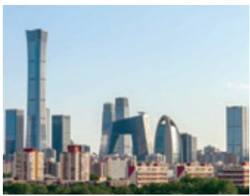

natural_image

City skyline featuring modern skyscrapers and a distinctive arched bridge under a clear sky (no visible text or signage)

# 第六章 几何图形初步 149

6.1 几何图形 150

图说数学史 几何的起源 160

6.2 直线、射线、线段 162

阅读与思考 长度的测量 168

6.3 角 170

阅读与思考 角的度量 180

数学活动 182

小结 184

# 综合与实践 设计学校田径运动会 比赛场地 189

# 第一章 有理数

在小学，我们从日常生活中的实例出发，学习了自然数、小数、分数及其运算。在日常生活、生产和科研中，还会遇到另外一些数的表示问题。例如：
(1) 北京冬季某一天的最高气温为零上 3 摄氏度, 最低气温为零下 3 摄氏度. 如何用数区分 “零上 3 摄氏度” 和 “零下 3 摄氏度”?  
（2）某公司今年7月份盈利50万元，8月份亏损10万元。该公司在记账时如何用数分别表示“盈利50万元”和“亏损10万元”？  
（3）某年，我国棉花产量比上年增长 $7.8\%$ ，玉米产量比上年减少 $0.7\%$ 统计这两种农作物产量的变化情况时，如何用数分别表示“增长 $7.8\%$ ”和“减少 $0.7\%$ ”？

上面的问题都涉及意义相反的两个量，为了能用数表示像这样具有相反意义的两个量，需要引入负数。本章我们将认识负数的意义，把数的范围扩大到有理数，并在有理数范围内学习数的表示和大小比较等。

text_image

中华人民共和国万岁
世界人民大团结万岁
人民教育出版社

## 1.1 正数和负数

数的产生和发展离不开生活和生产的需要。人们对于数的认识就是伴随着记数、测量、运算等方面的需求不断拓展的（图1.1-1）。在小学，我们学过自然数、小数和分数，它们都是大于或等于0的数，但是在日常生活和生产实践中，为了表达和运算的需要，还有必要引入一类新的数。

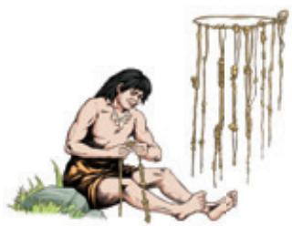

natural_image

Illustration of a person kneeling with a string, next to hanging hanging objects (no text or symbols)

在我国古代，由记数、排序，产生数 1，2，3，…

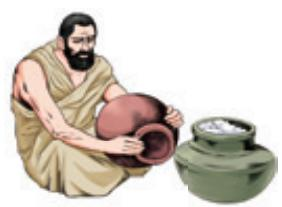

natural_image

Illustration of a bearded man in traditional robes pouring a red ceramic bowl into a green ceramic pot (no text or symbols)

在古印度，由表示“没有”“空位”，产生数0

natural_image

Illustration of two ancient Greek figures seated on piles of grain, one kneeling and gesturing, the other kneeling with a clay pot nearby (no text or symbols)

在古埃及，由分物、测量，
产生分数 $\frac{1}{2}$ ， $\frac{1}{3}$ ，…

图1.1-1

在本章引言的问题中，温度比 $0^{\circ}$ C 高，称为零上温度；温度比 $0^{\circ}$ C 低，称为零下温度。零上温度和零下温度是以 $0^{\circ}$ C 为分界点的具有相反意义的量。从图 1.1-2 的天气预报中可以看出，零上 3 摄氏度用 $3^{\circ}$ C 表示，零下 3 摄氏度则用 $-3^{\circ}$ C 表示，这里出现了 “-3”。类似地，盈利额和亏损额是具有相反意义的量，如果用 50 万元表示盈利 50 万元，就可以用 -10 万元表示亏损 10 万元；增长的百分率和减少的百分率是具有相反意义的量，如果用 7.8% 表示增长 7.8%，就可以用 -0.7% 表示减少 0.7%。

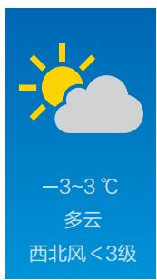

text_image

-3~3 ℃
多云
西北风 < 3级

图1.1-2

在数学中，像 3, 50, 7.8% 这样大于 0 的数叫作正数，像 -3, -10, -0.7% 这样在正数前加上符号 “-” 的数叫作负数，其中符号 “-” 是负号，读作 “负”。有时，为了明确表达与负数的相反意义，在正数的前面也加上符号 “+”（读作 “正”）。例如，+1800, +3, +0.5, + $\frac{1}{3}$ , … 就是 1800, 3, 0.5, $\frac{1}{3}$ , … 一个数前面的 “+” “-” 号叫作这个数的符号。

0 既不是正数，也不是负数.

# 溯源

我国是历史上最早认识和使用负数的国家。至迟成书于东汉早期（约1世纪）的我国古代数学著作《九章算术》，在“方程”一章中提出了正数、负数的概念及其加减运算法则，如关于家畜买卖的第八题，使用“正与负”来表示“卖出与买入”，将卖出家畜获得的钱数记为正，买入家畜付出的钱数记为负。魏晋时期的数学家刘徽在为《九章算术》作注时，用不同颜色的算筹分别表示正数和负数，红色为正，黑色为负。

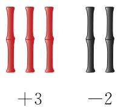

text_image

+3
-2

我国古代用
算筹来记数
和计算
如果一个问题中出现具有相反意义的量，就可以用正数和负数分别表示它们.

> [!example]- 例 1 某校组织学生去劳动实践基地采摘橘子，并称重、封装。一箱橘子的标准质量为 2.5 kg。如果用正数表示超过标准质量的克数，那么
(1) 比标准质量多 65 g 和比标准质量少 30 g 各怎么表示?  
(2) 50 g, -27 g 各表示什么意思?
解：（1）比标准质量多65 g用+65 g表示，比标准质量少30 g用-30 g表示；
(2) $50 \mathrm{~g}$ 表示这箱橘子的质量比标准质量多 $50 \mathrm{~g}, -27 \mathrm{~g}$ 表示这箱橘子的质量比标准质量少 $27 \mathrm{~g}$ .

#### 练习

1. 指出下面各数中的正数、负数：
$\frac {4}{3}, - 1, 2. 5, + \frac {1}{4}, 0, - 3. 1 4, 1 2 0, - \frac {2}{7}.$

2. 如果 80 m 表示向右走 80 m，那么 \_\_\_\_ 表示向左走 60 m.  
3. 某天，月球表面白天的最高温度为零上 $126^{\circ}$ C，如果把它记作 $126^{\circ}$ C，那么夜间的最低温度零下 $150^{\circ}$ C 记作 \_\_\_\_ ℃。  
4. 在足球比赛中，如果甲队进 3 个球，记作 +3 个，那么甲队失 2 个球，记作 \_\_\_\_ 个.

把 0 以外的数分为正数和负数，它们表示具有相反意义的量。随着人们对正数、负数意义认识的加深，正数和负数在实践中得到了广泛应用。例如，在表示某地的高度时，通常以海平面为基准，用 0 m 表示海平面的海拔，用正数表示高于海平面的海拔，用负数表示低于海平面的海拔。我国水准零点位于山东省青岛市（图 1.1-3 是 “中华人民共和国水准零点” 标志）；世界最高峰珠穆朗玛峰的海拔为 8 848.86 m；我国陆地海拔最低处位于新疆吐鲁番盆地的艾丁湖，其海拔为 -154.31 m.

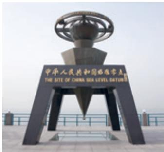

text_image

中华人民共和国西陲守志
THE SITE OF CHINA SEA LEVEL TATJIN

图1.1-3

0 是正数与负数的分界. $0^{\circ}$ C 是一个确定的温度, 海拔 0 m 是一个确定的海拔. 0 已不只是表示 “没有”.

> [!think] 思考
图 1.1-4 是地理中的分层设色地形图，图 1.1-5 是手机中的部分收支款账单，其中的正数和负数的意义分别是什么？你能再举一些用正数、负数表示具有相反意义的量的例子吗？

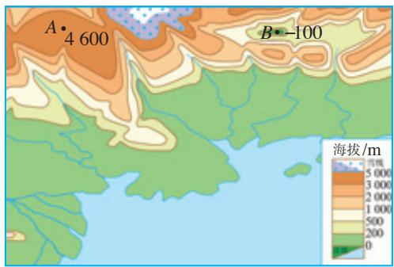

text_image

A•4 600
B•-100
海拔/m
5 000
3 000
2 000
1 000
500
200
0

图1.1-4

text_image

2023年8月
支出¥170.60 收入¥611.00
扫二维码付款
8月8日10:27
-10.00
转账-退款
8月8日10:53
+15.00
扫二维码付款
8月8日13:51
-30.00

图1.1-5

> [!example]- 例 2 （1）一个月内，李明体重增加 1.2 kg，张华体重减少 0.5 kg，刘伟体重无变化，写出他们这个月的体重增长值.
（2）四种品牌的手机今年第二季度的销售量与第一季度相比，变化率如下：

A 品牌减少 2%，B 品牌增长 4%，C 品牌增长 1%，D 品牌减少 3%.

写出今年第二季度这些品牌的手机销售量的增长率.
解：（1）这个月李明体重增长 1.2 kg，张华体重增长 -0.5 kg，刘伟体重增长 0 kg.
（2）四种品牌的手机今年第二季度销售量的增长率是：

A 品牌 -2%，B 品牌 4%，C 品牌 1%，D 品牌 -3%.

增长 $-2\%$ ，是什么意思？什么情况下增长率是0？

#### 练习

1. 如果水库的水位升高 3 m 时，水位变化记作 +3 m，那么水位下降 3 m 时，水位变化记作 \_\_\_\_ m，水位不升不降时，水位变化记作 \_\_\_\_ m.  
2. 一袋面粉的标准质量是 $10 \mathrm{~kg}$ , 如果比标准质量多 $0.1 \mathrm{~kg}$ 记作 $+0.1 \mathrm{~kg}$ , 那么 $-0.1 \mathrm{~kg}, 0 \mathrm{~kg}, +0.5 \mathrm{~kg}$ 分别表示什么?  
3. 若规定商品涨价为正，则甲商品涨价 10% 可以记作 \_\_\_\_，乙商品降价 5% 可以记作 \_\_\_\_.

# 习题 1.1

### 复习巩固

1. 指出下面各数中的正数、负数：
$5, - \frac {5}{7}, 0, 0. 5 6, - 3, - 2 5. 8, \frac {1 2}{5}, - 0. 0 0 0 1, + 2, - 6 0 0.$

2. 某年，我国全年平均降水量比上年增加 53.5 mm，接下来的第二年比上年减少 81.5 mm，第三年比上年增加 108.7 mm。用正数和负数表示这三年我国全年平均降水量比上年的增长量。  
3. “不是正数的数一定是负数，不是负数的数一定是正数”的说法对吗？为什么？

### 综合运用

4. 科学实验表明, 原子中的原子核与核外电子所带电荷是两种相反的电荷. 物理学中规定, 原子核所带电荷为正电荷, 核外电子所带电荷为负电荷. 氢原子中的原子核与核外电子各带 1 个电荷, 把它们所带电荷用正数和负数表示出来.  
5. 如果把一个物体向正后方移动 $5 \, m$ 记作移动 $-5 \, m$ ，那么这个物体又移动了 $+5 \, m$ 是什么意思？这时物体距它两次移动前的位置多远？  
6. 在测量某些量（如长度、质量、时间）时会产生误差，有时采用多次测量求平均值的方法可以减小误差。某班七组同学分别测量同一座楼的高度，测得

的数据（单位：m）分别是：79.4，80.6，80.8，79.1，80，79.6，80.5。这些数据的平均值是多少？以平均值为标准，用正数表示超出的部分，用负数表示不足的部分，它们对应的数分别是什么？

### 拓广探索

7. 某地一天中午12时的气温是 $7^{\circ}$ C，过5 h气温下降了 $4^{\circ}$ C，再过7 h气温又下降了 $4^{\circ}$ C，第二天0时的气温是多少？

8. 如图是一种转盘型密码锁，每次开锁时需要先把表示“0”的刻度线与固定盘上的标记线对齐，再按顺时针或逆时针方向旋转带有刻度的转盘三次。例如，按逆时针方向旋转5个小格记为“+5”，此时标记线对准的数是5，再顺时针旋转2个小格记为“-2”，再逆时针旋转3个小格记为“+3”，锁可以打开，那么开锁密码就可以记为“+5，-2，+3”，此时标记线对准的刻度线表示哪个数？如果一组开锁密码为“-15，+10，-5”，要想打开锁，应如何旋转锁盘？锁打开时标记线对准的刻度线表示哪个数？

natural_image

Red padlock with silver handle and orange laces, no visible text or symbols

(第8题)

## 阅读与思考

### 用正负数表示允许偏差

在现代工业生产中，产品的尺寸、质量等都有标准规格。但是，一般在实际加工中，每个产品不可能都做得与标准规格完全一样。通常在某个范围内，只要不影响使用，产品比标准规格稍大或稍小一点，稍轻或稍重一点，都属于合格品，而超出这个范围的产品就是不合格品.

生活中经常能看到用正负数表示允许偏差的情形.如图1，某品牌乒乓球的产品参数中标明球的直径是 $40\mathrm{mm}\pm 0.05\mathrm{mm}$ ，这表示乒乓球的标准直径是 $40~\mathrm{mm}$ ，允许偏差是 $\pm 0.05\mathrm{mm}$ .也就是说实际直径最大可以是 $(40 + 0.05)\mathrm{mm}$ ，最小可以是 $(40 - 0.05)\mathrm{mm}$ 直径在这个范围内的乒乓球都是合格的.

类似地，你能说出图1中 $2.74\mathrm{g}\pm 0.02\mathrm{g}$ 的含义吗？你还能举出用正负数表示允许偏差的例子吗？

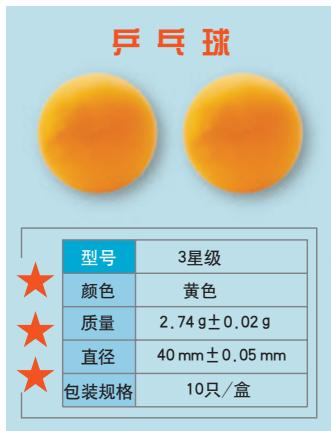

text_image

乒乓球
型号	3星级
颜色	黄色
质量	2.74 g±0.02 g
直径	40 mm±0.05 mm
包装规格	10只/盒

图1

## 1.2 有理数及其大小比较

引入负数后，数的范围就扩大了。与小学对数的学习类似，我们进一步在这个范围内学习数的表示以及大小比较等问题。

### 1.2.1 有理数的概念

> [!think] 思考
在小学阶段和上一节中，我们认识了很多数。回想一下，到目前为止，我们认识了哪些数？

我们学习过正整数，如 1, 2, 3, …; 0；负整数，如 -1, -2, -3, …. 正整数、0、负整数统称为整数.

我们还学习过正分数，如 $\frac{1}{2}$ ， $\frac{2}{3}$ ， $\frac{15}{7}$ ，0.1，
5.32, 0.3, …; 负分数，如 $-\frac{5}{2}$ , $-\frac{2}{3}$ , $-\frac{1}{7}$ ,
-0.5, -150.5, …. 它们都是分数.

进一步地，正整数可以写成正分数的形式，例如 $2 = \frac{2}{1}$ ；负整数可以写成负分数的形式，例如 $-3 =$ $0.1=\frac{1}{10},\quad-0.5=-\frac{1}{2},\quad0.\dot{3}=\frac{1}{3},\cdots$ 事实上，有限小数和无限循环小数都可以化为分数，因此它们也可以看成分数.
$-\frac{3}{1}$ ; 0 也可以写成分数的形式 $\frac{0}{1}$ . 这样, 整数可以写成分数的形式.

可以写成分数形式的数称为有理数（rational number）。其中，可以写成正分数形式的数为正有理数，可以写成负分数形式的数为负有理数。

这样，引入负数后，我们对数的认识就扩大到了有理数范围.

> [!example]- 例 1 指出下列各数中的正有理数、负有理数，并分别指出其中的正整数、负整数：
13, 4.3, $-\frac{3}{8}$ , $8.5\%$ , $-30$ , $-12\%$ , $\frac{1}{9}$ , $-7.5$ , $20$ , $-60$ , $1.\dot{2}$ .
解：正有理数：13，4.3，8.5%， $\frac{1}{9}$ ，20，1. $\dot{2}$ ；其中正整数有13，20.

负有理数： $-\frac{3}{8}$ ， $-30$ ， $-12\%$ ， $-7.5$ ， $-60$ ；其中负整数有 $-30$ ， $-60$ 。

#### 练习

1. 所有正有理数组成正有理数集合，所有负有理数组成负有理数集合。把下面的有理数填入它们属于的集合内：
$1 5, - \frac {1}{9}, - 5, 7, 0. 5, - 8 0, 1 2, - 4. 2, 2. 3.$

正有理数集合：{ …}.

负有理数集合：{ …}.

2. 指出下列各数中的正有理数、负有理数、整数：
$- 1 5, + 6, - 2, - 0. \dot {4}, 1, \frac {3}{5}, 0, 3 \frac {1}{4}, 0. 6 3, - \frac {1 0}{3}.$

3. 在 $-12, \frac{4}{7}, 19\%$ , $50, -3.12, -11, -5\%$ , $6.3, 2022$ 中，正有理数的个数为 \_\_\_\_，其中正整数的个数为 \_\_\_\_；负有理数的个数为 \_\_\_\_，其中负整数的个数为 \_\_\_\_。

### 1.2.2 数轴

在小学，我们曾经在有刻度的直线上表示出 0 和正数，并借助这种图形来直观理解和分析问题。下面我们在此基础上直观表示有理数。看下面的问题。

问题 在一条东西向的马路旁，有一个汽车站牌，汽车站牌东侧 3 m 和 7.5 m 处分别有一棵柳树和一根交通标志杆，汽车站牌西侧 3 m 和 4.8 m 处分别有一棵槐树和一根电线杆，试画图表示这一情境.

如图 1.2-1，画一条直线表示马路，从左到右表示从西到东的方向，在直线上任取一点 O 表示汽车站牌的位置，规定 1 个单位长度（线段 OA 的长）代表 1 m 长。于是，在点 O 右边，与点 O 距离 3 个和 7.5 个单位长度的点 B 和点 C，分别表示柳树和交通标志杆的位置；在点 O 左边，与点 O 距离 3 个和 4.8 个单位长度的点 D 和点 E，分别表示槐树和电线杆的位置。

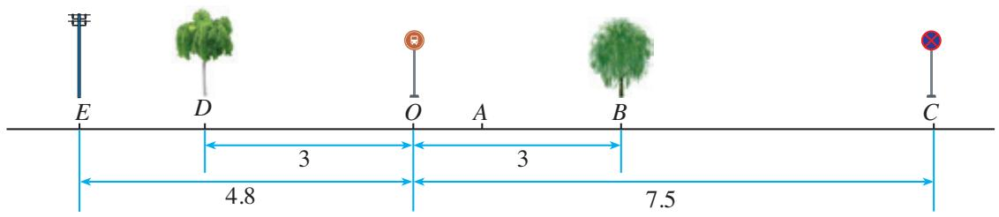

text_image

E
D
O
A
B
C
3
3
4.8
7.5

图1.2-1

> [!think] 思考
怎样用数简明地表示柳树、交通标志杆、槐树、电线杆与汽车站牌的相对位置关系（方向、距离）？

在上面的问题中，“东”与“西”、“左”与“右”都具有相反意义．如图1.2-2，在一条直线上任取一点 O 为基准点，规定 1 个单位长度（线段 OA 的长）代表 1 m 长，再用 0 表示点 O，用负数表示点 O 左边的点，用正数表示点 O 右边的点．这样，我们就用负数、0、正数表示出了这条直线上的点．

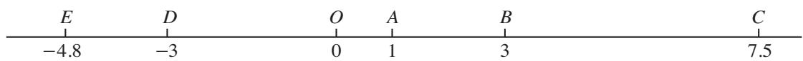

text_image

E D O A B C
-4.8 -3 0 1 3 7.5

图1.2-2

用上述方法，我们就可以把柳树、交通标志杆、槐树、电线杆与汽车站牌的相对位置关系表示出来了。例如，3 表示位于汽车站牌东侧 3 m 处的柳树的位置，-4.8 表示位于汽车站牌西侧 4.8 m 处的电线杆的位置，等等。

> [!think] 思考
图 1.2-3 中的温度计可以看作表示正数、0 和负数的直线。它和图 1.2-2 有什么共同点？

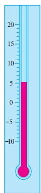

text_image

20
15
10
5
0
-5
-10
-15

图1.2-3

在数学中，可以用一条直线上的点表示数，它满足以下三个条件：
（1）在直线上任取一个点表示数0，这个点叫作原点（origin）；  
（2）通常规定直线上从原点向右（或上）为正方向，从原点向左（或下）为负方向；
0 是正数和负数的分界；原点是数轴的“基准点”.
（3）选取适当的长度为单位长度，直线上从原点向右，每隔一个单位长度取一个点，依次表示 1, 2, 3, …；从原点向左，用类似方法依次表示 -1, -2, -3, …（图 1.2-4）.

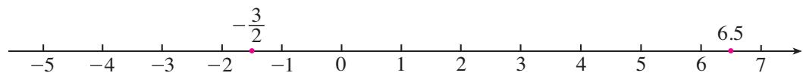

line

| x | y |
|---|---|
| -3/2 | -3/2 |
| 6.5 | 6.5 |

图1.2-4

像这样，规定了原点、正方向和单位长度的直线叫作数轴（number axis）.

原点将数轴（原点除外）分成两部分，其中正方向一侧的部分叫作数轴的正半轴；另一侧的部分叫作数轴的负半轴.

有理数可以用数轴上的点表示，例如，在数轴的正半轴上，距离原点6.5个单位长度的点表示数6.5；在数轴的负半轴上，距离原点 $\frac{3}{2}$ 个单位长度的点表示数 $-\frac{3}{2}$ （图1.2-4）.

> [!tip] 归纳

一般地，设 $a$ 是一个正数，则数轴上表示数 $a$ 的点在数轴的正半轴上，与原点的距离是 $a$ 个单位长度；表示数 $-a$ 的点在数轴的负半轴上，与原点的距离是 $a$ 个单位长度。数轴上与原点的距离是 $a$ 个单位长度的点，简称为数轴上与原点的距离是 $a$ 的点。

用数轴上的点表示数对数学的发展起了重要作用，以它作基础，可以借助图形直观地表示很多与数相关的问题.

> [!example]- 例 2 画出数轴，并在数轴上表示下列各数：
$3, - 4, 4, 0. 5, 0, - \frac {5}{2}, - 1.$
解：如图 1.2-5 所示.
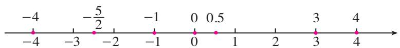

text_image

-4
-5/2
-1
0 0.5
-4 -3 -2 -1 0 1 2 3 4
→

图1.2-5

#### 练习

1. 如图，写出数轴上点 A, B, C, D, E 表示的数.

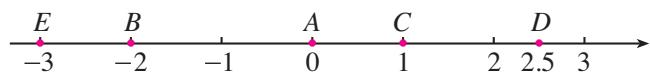

text_image

E B A C D
-3 -2 -1 0 1 2 2.5 3

(第1题)

2. 画出数轴，并在数轴上表示下列有理数：
$- 5, 3. 5, - \frac {7}{2}, - \frac {1}{2}, \frac {3}{2}, 5, \frac {9}{2}.$

3. 在数轴上，表示-2与4的点之间（包括这两个点）有\_\_\_\_个点表示的数是整数，它们表示的数分别是\_\_\_\_，其中负整数有\_\_\_\_个.

4. 在数轴上，点 $A$ 表示的数是 $-3$ ，从点 $A$ 出发，沿数轴向某一方向移动 4 个单位长度到达点 $B$ ，则点 $B$ 表示的数是多少？

### 1.2.3 相反数

> [!explore] 探究
在数轴上，与原点的距离是3的点有几个？这些点分别表示什么数？这些数之间有什么关系？与原点的距离是 $\frac{1}{2}$ 的点呢？

可以发现，数轴上与原点的距离是3的点有两个，它们表示的数是3和-3，这两个数只有符号不同；与原点的距离是 $\frac{1}{2}$ 的点也有两个，它们表示的数是 $\frac{1}{2}$ 和 $-\frac{1}{2}$ ，这两个数也只有符号不同。

> [!tip] 归纳

一般地，设 a 是一个正数，数轴上与原点的距离是 a 的点有两个，它们分别在正、负半轴上，表示 a 和 -a（图 1.2-6），这两个数只有符号不同.

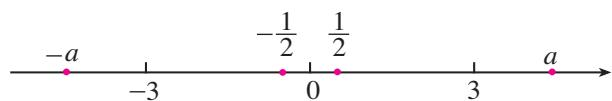

text_image

-a
-3
-1/2 1/2
0
3
a

图1.2-6

像 3 和 -3， $\frac{1}{2}$ 和 $-\frac{1}{2}$ 这样只有符号不同的两个数，互为相反数（opposite number）。这就是说，3 的相反数是 -3，-3 的相反数是 3，3 与 -3 互为相反数；同样地， $\frac{1}{2}$ 和 $-\frac{1}{2}$ 互为相反数。

0 的相反数是 0.

一般地，a 和 -a 互为相反数。这里，a 表示任意一个数，可以是正数、负数，也可以是 0。例如，当 a=1 时，-a=-1，1 的相反数是 -1；同时，-1 的相反数是 1。

容易看出，在正数前面添上“一”号，就得到这个正数的相反数。在任意一个数前面添上“一”号，新的数就表示原数的相反数。例如，
$- (+ 5) = - 5, - (- 5) = + 5, - 0 = 0.$
设 $a$ 表示一个数， $-a$ 一定是负数吗？

你能借助数轴说明 $-(-5)=+5$ 吗?

> [!example]- 例 3 （1）分别写出 -7 和 $\frac{4}{3}$ 的相反数；
(2) a 的相反数是 2.4，写出 a 的值.
解：（1）-7的相反数是7， $\frac{4}{3}$ 的相反数是 $-\frac{4}{3}$ ;
(2) 因为 2.4 与 -2.4 互为相反数，所以 a 的值是 -2.4.

#### 练习

1. 判断题.
(1) -6 是相反数;
(2) +6 是相反数;
(3) 6 是 -6 的相反数;
(4) -6 与 +6 互为相反数；
(5) 正数和负数互为相反数；
(6) 任何一个数都有相反数.

2. 写出下列各数的相反数：
$- \frac {9}{4}, 6, - 8, - 3. 5, \frac {5}{2}, 1 0, - 1 0 0, \frac {1}{3}.$

3. 如果 a = -a，那么表示数 a 的点在数轴上的什么位置？

4. 化简下列各数：
$- (- 7), - (+ 0. 5), - (- 6 8), - (+ 3. 8).$

### 1.2.4 绝对值

我们知道，互为相反数的两个数（除0以外）只有符号不同。这两个数的相同部分在数轴上表示什么？

看一个具体例子. 10 和 -10 互为相反数, 在数轴上分别用点 $A$ , $B$ 表示这两个数, 可以发现, 点 $A$ , $B$ 与原点的距离都是 10 (图 1.2-7).

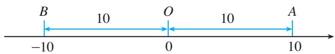

text_image

B
10
O
10
A
-10
0
10

图1.2-7

一般地，数轴上表示数 $a$ 的点与原点的距离叫作数 $a$ 的绝对值（absolute value），记作 $|a|$ 。例如，图1.2-7中表示10和一10的点与原点的距离都是10，所以10和一10的绝对值都是10，即

这里的数 a 可以是正数、负数和 0.
$\vert 1 0 \vert = 1 0, \vert - 1 0 \vert = 1 0.$
显然 $|0|=0$ .

> [!explore] 探究
一个数的绝对值与这个数有什么关系？借助数轴多取几个数试一试，看能不能发现规律.

可以得到：一个正数的绝对值是它本身；一个负数的绝对值是它的相反数；0 的绝对值是 0。即
（1）如果 a 是正数，那么 $\left|a\right|=a$ ;  
(2) 如果 a 是 0，那么 $\left|a\right|=0$ ;  
（3）如果 $a$ 是负数，那么 $|a| = -a$

> [!example]- 例4（1）写出 $1, -0.5, -\frac{7}{4}$ 的绝对值；
用字母表示数后，
可以用含字母的式子表达一般规律.
（2）如图1.2-8，数轴上的点 $A, B, C, D$ 分别表示有理数 $a, b, c, d$ ，这四个数中，绝对值最小的是哪个数？

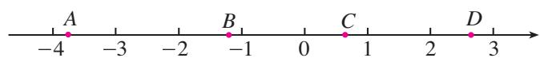

text_image

-4
A
-3
B
-2
C
0
1
2
D
3

图1.2-8
分析：对于（2），一个数的绝对值越小，数轴上表示它的点离原点越近；
反过来，数轴上的点离原点越近，它所表示的数的绝对值越小.
解：（1） $|1| = 1$ ， $\vert -0.5\vert = 0.5$ ， $\left| -\frac{7}{4} \right| = \frac{7}{4}$
（2）因为在点 A, B, C, D 中，点 C 离原点最近，所以在有理数 a, b, c, d 中，c 的绝对值最小.

#### 练习

1. 写出下列各数的绝对值：
$8, - 3. 9, - \frac {2}{1 1}, 1 0 0, 7. 5, 0, - (- 1 3), - (+ 1 8).$

2. 判断题.
（1）绝对值是它本身的数是正数；（2）当 $a \neq 0$ 时， $|a|$ 总是大于0；  
(3) 绝对值小于 2 的整数是 1 和 -1.

3. 如果 $|a| = |-2|$ ，那么 $a =$ \_\_\_\_；如果 $m$ 是负数，且 $|m| = 10$ ，那么 $m =$ \_\_\_\_.

4. 化简下列各数：
$+ \left| - 3. 5 \right|, - \left| + \frac {5}{6} \right|, - \left| - 1 1 \right|, \left| + (- 1 5) \right|, \left| - (- 7) \right|, \left| - (+ 9) \right|.$

### 1.2.5 有理数的大小比较

我们已经知道两个正数（或0）之间怎样比较大小，例如，0<1，1<2，2<3，… 引入负数后，任意两个有理数（例如，-4和-3，-2和0，-1和1）之间怎样比较大小呢？

> [!think] 思考
图 1.2-9 给出了未来一星期中每天的最高气温和最低气温，其中最低气温是多少？最高气温呢？你能将这七天中每天的最低气温按从低到高的顺序排列吗？

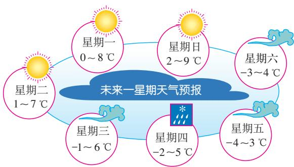

flowchart

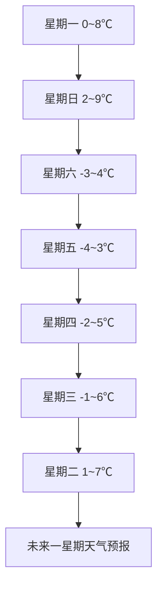

图1.2-9

这七天中每天的最低气温按从低到高的顺序排列为
$- 4, - 3, - 2, - 1, 0, 1, 2.$

按照这个顺序排列的温度，在竖直放置的温度计上所对应的点是从下到上的。依次把这些数表示在水平的数轴上，表示它们的各点的顺序是从左到右的（图1.2-10）。
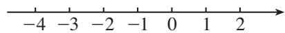

图1.2-10

在水平的数轴上表示有理数，数学中规定：它们从左到右的顺序，就是从小到大的顺序，即左边的数小于右边的数.

你在小学学过的正数及0的大小比较符合这个规定吗？
由这个规定可知：
$- 6 <   - 5, - 5 <   - 4, - 4 <   - 3, - 2 <   0, - 1 <   1, \dots .$

> [!think] 思考
对于正数、0和负数这三类数，它们之间有什么大小关系？两个负数之间如何比较大小？前面最低气温从低到高的排列与你的结论一致吗？

一般地，
(1) 正数大于 0, 0 大于负数, 正数大于负数;  
(2) 两个负数，绝对值大的反而小.

> [!example]- 例5 比较下列各组数的大小：
(1) 5 和 -2;  
(2) -3 和 -7;  
(3) $-(-1)$ 和 $-(+2)$ ;  
(4) $-(-0.5)$ 和 $|-1.5|$ .
解：（1）因为正数大于负数，所以 5 > -2.
(2) 先求绝对值， $|-3|=3,\quad|-7|=7.$
因为 $3 < 7$
即 $|-3| < |-7|$
所以 $-3 > -7.$
(3) 先化简， $-(-1)=1$ ， $-(+2)=-2$ .
因为正数大于负数，所以
$1 > - 2,$

异号两数比较大小，要考虑它们的正负；同号两数比较大小，要考虑它们的绝对值.
即 $-(-1) > -(+2)$ .
（4）先化简， $-(-0.5)=0.5,\quad|-1.5|=1.5.$
因为 0.5<1.5，
所以 $-(-0.5) < |-1.5|$ .

#### 练习

1. 比较下列各组数的大小:
(1) 3 和 -5;
(2) -3 和 -5;
(3) -2.5 和 $\left| -2\frac{1}{4} \right|$ ;
(4) $-\frac{3}{5}$ 和 $-\frac{3}{4}$ ;
(5) $-(+8)$ 和 $-(-9)$ ;
(6) $-(-0.3)$ 和 $\left| -\frac{1}{3} \right|$ .

2. 将下列各组数按从小到大的顺序排列，并用“<”连接：
(1) $-3, +2, +5, 0, -10, 8$ ;
(2) $-\frac{1}{4}, +2.3, -0.3, 0, -\frac{3}{2}, -\frac{1}{2}$ .

3. 下面是我国几个城市某年1月份的平均气温，把这些温度按从高到低的顺序排列.

<table><tr><td>北京</td><td>武汉</td><td>广州</td><td>哈尔滨</td><td>南京</td></tr><tr><td>-4.6°C</td><td>3.8°C</td><td>13.1°C</td><td>-19.4°C</td><td>2.4°C</td></tr></table>

# 习题 1.2

### 复习巩固

1. 把下列各有理数填在相应的集合内：
$3, - \frac {4}{5}, 0, 1 \frac {3}{4}, 0. 4 5, 1 2 0, - 7 7, - 2. 5 6, - 1 2 3 \frac {1}{2}, 0. \dot {3}.$

正有理数集合：{ …}.

负有理数集合：{ …}.

整数集合：{ …}.

2. 如图, 数轴上点 $A$ 表示的数是 , 点 $B$ 表示的数是 , 点 $C$ 表示的数是 , 点 $D$ 表示的数是 , 点 $E$ 表示的数是 .

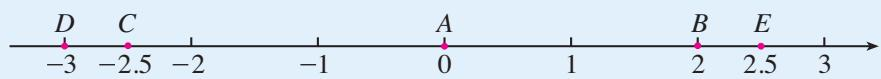

text_image

D C A B E
-3 -2.5 -2 0 1 2 2.5 3

(第2题)

3. 7 的相反数是\_\_\_\_， $-\frac{1}{4}$ 是\_\_\_\_的相反数，相反数是它本身的数是\_\_\_\_。

4. 写出下列各数的绝对值，并指出哪个数的绝对值最大，哪个数的绝对值最小：
$- 9, 3. 7 5, 0, \frac {4}{3}, - 0. 0 0 1, - 1.$

5. 比较大小:
(1) -21\_\_\_\_0;
(2) -10\_\_\_\_-5;
(3) $-\frac{2}{7}$ —— $-\frac{4}{7}$ ;
(4) $-3$ \_\_\_\_ $-\frac{22}{7}$ ;
(5) $-\frac{5}{6}$ —— $-\frac{6}{7}$ ;
(6) \(-(-3)\_\_\_\_\_\_\_\_\_\_\_\_\_\_\_\_\_\_\_\_\_\_\_\_\_\_\_\_\_\_\_\_\_\_\_\_\_\_\_\_\_\_\_\_\_\_\_\_\_\_\_\_\_

### 综合运用

6. 在数轴上表示下列各数：
$2, 2 \frac {4}{5}, - 0. 5, - 2, 0, - 2 \frac {4}{5}, \frac {1}{2}, 1. 2.$

7. 如果平时不注意爱护眼睛，就有可能形成近视。在验光时，验光师经常会以“×××D”的方式记录近视程度，例如，将近视50度记录为“-0.50D”，近视100度记录为“-1.00D”，等等。现有6位同学的验光记录如下：
$- 0. 5 0 \mathrm{D}, - 1. 2 5 \mathrm{D}, - 2. 5 0 \mathrm{D}, - 0. 7 5 \mathrm{D}, - 1. 7 5 \mathrm{D}, - 2. 2 5 \mathrm{D}.$

通常，近视超过 200 度时就要持续配戴眼镜进行视力矫正，在这 6 位同学中，有几位同学需要持续配戴眼镜？

### 拓广探索

8. 在数轴上，如果点 A, B 分别表示互为相反数的两个数，并且这两个点的距离是 5，那么这两个点所表示的数分别是多少？

9. 如果 $a$ 是一个有理数，那么当 $a$ 满足什么条件时，
(1) $a = -a?$
(2) $-a > a?$
(3) $-a < a?$

# 漫漫长路识负数

今天，负数在我们的日常生活中无处不在，比如温度、海拔、账户收支的表示等。你肯定想不到这种对于负数的“自然而然”的使用，在数学史上却是“一波三折”的。让我们一起来重温负数走过的漫漫长路吧。

在我国，《九章算术》的“方程”章明确提出了“正负术”——正数、负数的加减运算法则.

这种源于方程解法的探究，突破了正数的限制，引入了负数.

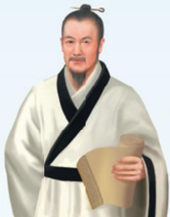

natural_image

Illustration of a historical Chinese figure in traditional robes holding a scroll (no text or symbols visible)

刘徽（魏晋时期）

在印度，数学家婆罗摩笈多在算术运算中使用了负数。他研究了关于“财产”（正数）、“债务”（负数）的和、差、倍数、分割等问题。

# 1世纪

# 3世纪

# 7世纪

刘徽在为《九章算术》作注时写道：“今两算得失相反，要令正负以名之．正算赤，负算黑。”即明确正负数是表示相反意义的量，并用算筹的颜色区分正负数.

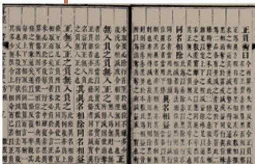

text_image

正貫
曰
即對則類位同名相除其右無正之或無足為其有之以無其無其無其無其無其無其無其無其無其無其無其無其無其無其無其無其無其無其無其無其無其無其無其無其無其無其無其無其無其無其無其無其無其無其無其無其無其無其無其無其無其無其無其無其無其無其無其無其無其無其無其他名者當用此為其無其無其無其無其無其無其無其無其無其無其無其無其無其無其無其無其無其無其無其無其無其無其無其無其無其無其無其無其無其無其無其無其無其無其無其無其無其無其無其無其無其無其無其無其無其無其無其無其無其无
且不令
本數以上有於本數以上有於本數以上有於本數以上有於本數以上有於本數以上有於本數以上有於本數以上有於本數以上有於本數以上有於本數以上有於本數以上有於本數以上有於本數以上有於本數以上有於本數以上有於本數以上有於本數以上有於本數以上有於本數以上有於本數以上有于
本數以上有於本數以上有於本數以上有於本數以上有於本數以上有於本數以上有於本數以上有於本數以上有於本數以上有於本數以上有於本數以上有於本數以上有於本數以上有於本數以上有於本數以上有於本數以上有於本數以上有於本數以上有於本數以上有於本數以上<nl>
此為全取現入之負入之負入之負入之負入之負入之負入之負入之負入之負入之負入之負入之負入之負入之負入之負入之負入之負入之負入之負入之負入之負入之負入之負入之負入之負入之負入之負入之負入之負入之負入之負入之負入之負入之負人
此為全取現入之負入之負入之負入之負入之負入之負入之負入之負入之負入之負入之負入之負入之負入之負入之負入之負入之負入之負入之負入之負入之負入之負入之負入之負入之負入之負入之負入之負入之負入之負入之負人
此為全取原定員會計所與原定員會計所與原定員會計所與原定員會計所與原定員會計所與原定員會計所與原定員會計所與原定員會計所與原定員會計所與原定員會計所與原定員會計所與原定員會計所與原定員會計所與原定員會計所與原定員會計所與原固定員會計所與原固定員會計所與原固定員會計所與原固定員會計所與原固定員會計所與原固定員會計所與原固定員會計所與原固定員會計所與原固定員會計所與原固定員會計所與原固定員會計所與原固定員會計所與原固定員會計所與原固定員會計所與原固定員会計所與原固定員会計所與原固定員会計所與原固定員会計所與原固定員会計所與原固定員会計所與原固定員会計所與原固定員会計所與原固定員会計所與原固定員会計所與原固定員会計所與原固定員会計所與原固定員会計所與原固定員会計所與原固定員会計所有者，並以該等者，並以該等者，並以該等者，並以該等者，並以該等者，並以該等者，並以該等者，並以該等者，並以該等者，並以該等者，並以該等者，並以該等者，並以該等者，並以該等者，並以該等者，並以該等者，並以該等者，並以下述三者，以下述三者，以下述三者，以下述三者，以下述三者，以下述三者，以下述三者，以下述三者，以下述三者，以下述三者，以下述三者，以下述三者，以下述三者，以下述三者，以下述三者，以下述三者，以下述三者，以下述三者，以下述三者，以下述三者，以下述三者

《九章算术》中的“正负术”

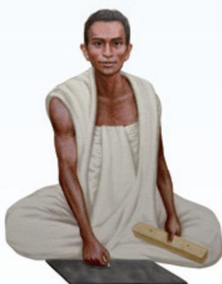

natural_image

Illustration of a seated man in traditional attire holding a wooden object (no text or symbols visible)

婆罗摩笈多  
(Brahmagupta，约598—约665)

在欧洲，对于负数的认识和使用进程缓慢而又艰难。意大利数学家斐波那契在《算盘书》（1202年）中面对“一个相对较小的数减去一个较大的数”时使用了负数。

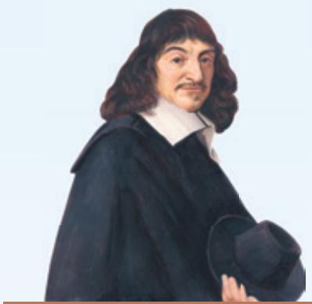

natural_image

Portrait painting of a man in 17th-century attire holding a hat (no text or symbols visible)

笛卡儿
(Descartes, 1596—1650)

随着数学的发展，代数越来越抽象，与数字的“实际”意义相比，抽象运算越来越重要，对于负数的质疑消失了，负数完全成了数字系统中的一员。

# 12—13 世纪

# 16—17世纪

# 19 世纪

natural_image

Portrait painting of a person wearing a blue garment and headscarf (no text or symbols visible)

斐波那契   
(Fibonacci, 约 1170—约 1250)

面对负数，欧洲大多数数学家一方面使用着负数，另一方面又不理解负数。如笛卡儿，虽然他接受并比较全面和系统地使用了负数，但他把方程的负根称作“假根”。

欧洲人迟迟不肯接受负数和他们自古以来对“数”的观念有关，比如0表示一无所有，“世界上怎么还有比一无所有小的量？”而我国古代是在方程背景下，从“相对”角度认识正负数，于是自然地接受并使用负数。不过，欧洲人的“质疑”“争论”也促使他们不断地探寻负数及其他新数的意义，并最终建立了关于数的严密的理论。

# 数学活动

# 活动1 体重调查

党和国家非常重视青少年的身心健康，采取多种举措增强青少年体质。有数据显示，近几年，青少年身体健康状况有一定提升，但肥胖问题仍不容忽视。一种少年儿童的标准体重（单位：kg）的计算方式为：标准体重= $(年龄\times7-5)\div2$ 。下表是七年级某小组6位同学的体重情况，其中超出标准体重的千克数记为正数，少于标准体重的千克数记为负数。

<table><tr><td>编号</td><td>1</td><td>2</td><td>3</td><td>4</td><td>5</td><td>6</td></tr><tr><td>体重情况</td><td>-1.1</td><td>+2</td><td>-0.5</td><td>+10</td><td>+4.7</td><td>-8.3</td></tr></table>
（1）表中哪几位同学的体重超出标准体重？分析该小组同学的体重超出或少于标准体重的情况.  
（2）表中哪位同学的体重最符合标准体重？要想了解同学的体重情况，除了判断正负数，还要考虑什么？据此进一步分析该小组同学的整体体重情况.

请同学们根据这种标准体重的计算方式，计算自己的体重超出或少于标准体重的千克数。以小组为单位填写上表，分析本组同学的体重情况，并通过查阅资料或咨询体育老师等方式，制订适合你们小组的体育锻炼方案。

# 活动2 猜数游戏

两个人合作，按下面的步骤完成游戏：
(1) 第一位同学默想一个 $-50 \sim 50$ 的整数并记住；  
（2）第二位同学对第一位同学默想的数提出一个猜想，第一位同学比较这个数和自己心中所想数的大小，然后回答“大了”“小了”或者“相等”，若相等则说明第二位同学猜中；  
（3）若第二位同学没有猜中，则根据第一位同学的回答，调整猜想；  
(4) 重复步骤 (2) (3)，直到猜中.

请大家玩一玩这个游戏，并思考，如何猜想能更快地猜中？多做几次游戏，检验一下你的猜数策略是否有效。

## 小结

### 一、本章知识结构图

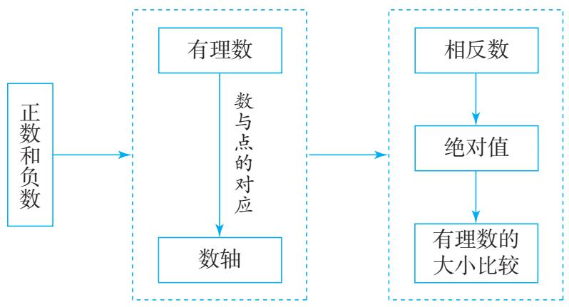

flowchart

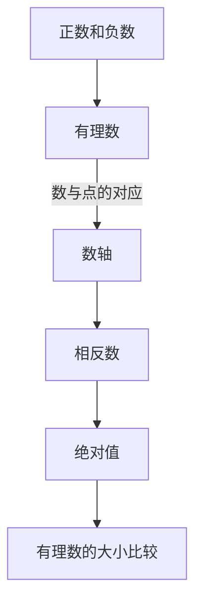

### 二、回顾与思考

本章我们通过研究实际问题中具有相反意义的量，引入了负数，使数的范围扩大到有理数.

数轴是研究有理数的重要工具，有了数轴这个工具，就可以“用数轴上的点表示数”和“用数表示数轴上的点”，这为我们数形结合地研究数学问题提供了重要手段。本章我们还借助数轴研究了相反数和绝对值，并探究了如何比较有理数的大小。利用数轴认识有理数，可以培养我们运用图形直观描述和分析问题的意识和习惯。在后续学习中，数轴和数形结合思想还将发挥更加重要的作用。

请你带着下面的问题，复习一下全章的内容吧.

1. 梳理已学的数，数的范围扩大了几次？每次扩大数的范围时，引入一类新的数的原因是什么？  
2. 你能举出一些实例，说明正数、负数在表示具有相反意义的量时的作用吗？  
3. 你能用一个图表示有理数的分类吗？  
4. 数轴与普通的直线有什么不同？怎样在数轴上表示有理数？怎样利用数轴解释一个数的相反数和绝对值？

5. 如何比较有理数的大小？数轴能发挥怎样的作用？  
6. 回忆小学学过的与数有关的内容，想一想接下来应该继续研究哪些与有理数有关的问题.

# 复习题 1

### 复习巩固

1. 填空题.
(1) 如果温度上升 $3^{\circ}$ C 记作 + $3^{\circ}$ C，那么下降 $2^{\circ}$ C 记作 \_\_\_\_ ℃；  
(2) 如果收入用正数表示, 支出用负数表示, 那么 -56 元表示 \_\_\_\_ 元.

2. 在数轴上表示下列各数，并将这些数按从小到大的顺序排列，再用“<”连接起来：
$3, - 4, 0, 2, - 2, - 1.$

3. 分别写出-2，-5，7.5的相反数和绝对值.  
4. 比较下列各组数的大小:
(1) +(-3)和-(-4);
(2) $-(-2)$ 和 $-|+2|$ ;
(3) $+\left|-3\right|$ 和 $\left|-(+5)\right|$ ;
(4) $-\left(+\frac{1}{2}\right)$ 和 $-\left| -\frac{1}{3} \right|$ .

5. 下表是某公司某年四个季度的盈利情况，把它们按从高到低的顺序排列.

<table><tr><td>时间</td><td>第一季度</td><td>第二季度</td><td>第三季度</td><td>第四季度</td></tr><tr><td>盈利/万元</td><td>-6.8</td><td>-10.7</td><td>31.5</td><td>27.8</td></tr></table>

6. 某年我国人均水资源比上年的增幅是 $-5.6\%$ 。后续三年各年比上年的增幅分别是 $-4.0\%$ ， $13.0\%$ ， $-9.6\%$ 。这些增幅中哪个最小？增幅是负数说明什么？

### 综合运用

7. 已知 x 是整数，并且 -3 < x < 4，在数轴上表示 x 可能取的所有数.  
8. 数轴上表示数 $a, b$ 的点如图所示。把 $a, -a, b, -b$ 按照从小到大的顺序排列，正确的是（ ）.

(A) $-b < -a < a < b$

(B) $-a < -b < a < b$

(C) $-b < a < -a < b$

(D) $-b < b < -a < a$
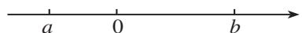

（第8题）

9. 如图，检测 5 个排球，其中超过标准质量的克数记为正数.
(1) +5, -3.5, +0.7, -2.5, -0.6 各表示什么?  
(2) 哪个球的质量最接近标准质量？请说明理由.

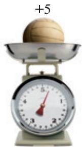

natural_image

Illustration of a balance scale with a wooden ball on top, showing time and weight (no text or symbols)

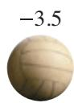

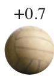

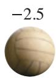
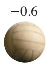

（第9题）

### 拓广探索

10.（1）-1 与 0 之间有负数吗？0 与 1 之间呢？如果有，请举例；如果没有，请说明理由.
(2) -3 与 -1 之间有负整数吗？-2 与 2 之间有哪些整数？  
(3) 有比 -1 还大的负整数吗?  
(4) 写出 3 个小于 -100 并且大于 -103 的数.

11. 如果 $|x| = 2$ ，那么 $x$ 一定是2吗？如果 $|x| = 0$ ，那么 $x$ 等于几？如果 $x = -x$ ，那么 $x$ 等于几？

在本题中， $a$ 与 $b$ 之间的数不包括 $a$ 和 $b$ .

# 第二章 有理数的运算

在第一章中，我们把数的范围扩大到了有理数。根据小学阶段学习数的经验，接下来就要研究有理数的运算。

在实际问题中，我们也会遇到有理数的运算问题。例如：
(1) 北京冬季某一天的气温为 $-3 \sim 3^{\circ}C$ . 这一天北京的温差是多少?  
(2) 李明同学经常对家里的生活垃圾分类, 并卖出积攒的可回收物. 这样既保护了环境, 又增加了零花钱. 下表是他某个月零花钱的部分收支情况.

收支情况表

<table><tr><td>日期</td><td>收入(+)或支出(-)/元</td><td>结余/元</td><td>注释</td></tr><tr><td>2日</td><td>3.5</td><td>18.5</td><td>卖可回收物</td></tr><tr><td>8日</td><td>-6.5</td><td>12.0</td><td>买中性笔、记号笔</td></tr><tr><td>12日</td><td>-15.2</td><td>-3.2</td><td>买科普书,同学代付</td></tr></table>

这里，“结余 12.0”和“结余-3.2”是怎么得到的？

要解决上面的问题，就要计算 $3-(-3)$ ， $18.5+(-6.5)$ ， $12.0+(-15.2)$ .

本章我们将在上一章以及小学已学的数的运算的基础上，进一步学习有理数的运算，将数的运算推广到有理数范围内，从而初步感悟数系扩充的完整过程，并认识运算在数学中的价值及其在解决实际问题中的作用.

text_image

人民教育出版社

## 2.1 有理数的加法与减法

数的范围扩大到有理数后，就要研究有理数的运算。我们先把小学学习的加法与减法运算推广到有理数范围内。

### 2.1.1 有理数的加法

在小学，我们学过正数及0的加法运算，引入负数后，在有理数范围内怎样进行加法运算呢？

在实际问题中，有时也会遇到与负数有关的加法运算。例如，在本章引言中，把收入记作正数，支出记作负数，在求“结余”时，需要计算 $18.5 + (-6.5), 12.0 + (-15.2)$ 等。

> [!think] 思考
小学学过的加法运算涉及正数与正数相加、正数与0相加以及0与0相加．引入负数后，在有理数范围内，加法有哪几种情况？

引入负数后，在有理数范围内，除了小学学过的加法运算，还有负数与负数相加、负数与正数相加、负数与0相加等．下面借助具体情境和数轴来讨论有理数的加法.

看下面的问题.

一个物体沿着一条直线做左右方向的运动，我们规定向右为正，向左为负。例如，将向右运动 5 m 记作 5 m，向左运动 5 m 记作 -5 m。

> [!think] 思考
如果物体沿着一条直线先向右运动 $5 \, m$ ，再向右运动 $3 \, m$ ，那么两次运动的最后结果是什么？可以用怎样的算式表示？

两次运动后，物体从起点向右运动了 $8 \, m$ . 写成算式就是
$5 + 3 = 8. \tag {①}$

若将物体的运动起点放在原点 O，则这个算式可以用数轴表示为图 2.1-1.

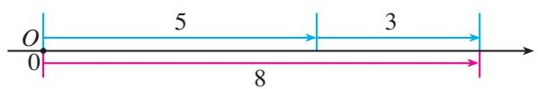

text_image

O
5
3
0
8

图2.1-1

> [!think] 思考
如果物体沿着一条直线先向左运动 $5 \, m$ ，再向左运动 $3 \, m$ ，那么两次运动的最后结果是什么？可以用怎样的算式表示？

两次运动后，物体从起点向左运动了 $8 \, m$ . 写成算式就是
$(- 5) + (- 3) = - 8. \tag {②}$

这个算式也可以用数轴表示，如图 2.1-2 所示，其中假设原点 O 为物体的运动起点.

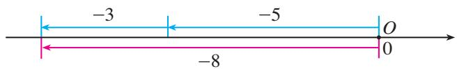

text_image

-3
-5
O
-8
0

图2.1-2

从算式①②可以看出：符号相同的两个数相加，和的符号不变，且和的绝对值等于加数的绝对值的和.

> [!explore] 探究
（1）如果物体沿着一条直线先向左运动 $3 \mathrm{~m}$ ，再向右运动 $5 \mathrm{~m}$ ，那么两次运动的最后结果是什么？如何用算式表示？  
（2）如果物体沿着一条直线先向右运动 $3 \mathrm{~m}$ ，再向左运动 $5 \mathrm{~m}$ ，那么两次运动的最后结果是什么？如何用算式表示？
（1）结果是物体从起点向右运动了 $2 \mathrm{~m}$ 。写成算式就是
$(- 3) + 5 = 2. \tag {③}$
（2）结果是物体从起点向左运动了 $2 \mathrm{~m}$ 。写成算式就是
$3 + (- 5) = - 2. \tag {④}$

你能用数轴表示算式③④吗？

从算式③④可以看出：绝对值不相等、符号相反的两个数相加，和的符号与绝对值较大的加数的符号相同，且和的绝对值等于加数的绝对值中较大者与较小者的差.

> [!explore] 探究
如果物体沿着一条直线先向右运动 $5 \, m$ ，再向左运动 $5 \, m$ ，那么两次运动的最后结果是什么？

结果是物体仍在起点处. 写成算式就是
$5 + (- 5) = 0. \tag {⑤}$

算式⑤表明，互为相反数的两个数相加，结果为0.
如果物体第 1 s 向右（或左）运动 5 m，第 2 s 原地不动，那么 2 s 后物体从起点向右（或左）运动了 5 m。写成算式就是
$5 + 0 = 5 (\text {或} (- 5) + 0 = - 5). \tag {6}$

算式⑥表明，一个数与0相加，结果仍是这个数.

从算式①～⑥可知，在有理数的加法运算中，既要考虑符号，又要考虑绝对值．你能从这些算式中归纳出有理数加法的运算法则吗？

有理数加法法则：

1. 同号两数相加，和取相同的符号，且和的绝对值等于加数的绝对值的和.  
2. 绝对值不相等的异号两数相加，和取绝对值较大的加数的符号，且和的绝对值等于加数的绝对值中较大者与较小者的差。互为相反数的两个数相加得0。  
3. 一个数与 0 相加，仍得这个数.
显然，两个有理数相加，和是一个有理数.

> [!think] 思考
按照有理数加法法则进行正数及0的加法运算，它和小学学过的正数及0的加法运算一致吗？

> [!example]- 例 1 计算:
(1) $(-3) + (-9)$ ;
(2) $(-8) + 0$ ;
(3) $12 + (-8)$ ;
(4) $(-4.7) + 3.9$ ;
(5) $\left(-\frac{1}{2}\right) + \left(+\frac{1}{2}\right)$ .
解：(1) $(-3)+(-9)=-(3+9)=-12;$
(2) $(-8) + 0 = -8$ ;
(3) $12 + (-8) = +(12 - 8) = 4;$
(4) $(-4.7) + 3.9 = -(4.7 - 3.9) = -0.8$ ;

在运算过程中，“先定和的符号，再算和的绝对值”，是一种有效的方法.
(5) $\left(-\frac{1}{2}\right) + \left(+\frac{1}{2}\right) = 0.$

> [!think] 思考
任何一个数加上一个正数，和与原来的数有怎样的大小关系？加上一个负数呢？请你先借助数轴直观地得出结论，再利用有理数的加法法则进行说明.

#### 练习

1. 用算式表示下面的结果:
(1) 温度由 $-4^{\circ}C$ 上升 $7^{\circ}C$ ;
(2) 收入 7 元，又支出 5 元.

2. 口算：
(1) $(-4)+(-6)$ ;
(2) $4 + (-6)$ ;
(3) $(-4) + 6$ ;
(4) $(-4) + 4$ ;
(5) $(-4)+14;$
(6) $(-14) + 4$ ;
(7) $6+(-6)$ ;
(8) $0 + (-6)$ ;
(9) $(-6) + 0$ .

3. 计算：
(1) $15+(-22)$ ;
(2) $(-13) + (-8)$ ;
(3) $(-0.9) + 1.5$ ;
(4) $\frac{1}{2} + \left(-\frac{2}{3}\right)$ .

4. 请你用生活实例解释 $(-3) + 2 = -1$ ， $(-3) + (-2) = -5$ 的意义.

有了有理数的加法法则后，还要研究加法的运算律。我们以前学过加法交换律、结合律，对于有理数的加法，它们还成立吗？

> [!explore] 探究
计算
$3 0 + (- 2 0), (- 2 0) + 3 0,$

所得的和相同吗？换几组加数再试一试.

从上述计算中，你能得出什么结论？

在有理数的加法中，两个数相加，交换加数的位置，和不变.

加法交换律： $a+b=b+a$ .

> [!explore] 探究
计算
$[ 8 + (- 5) ] + (- 4), 8 + [ (- 5) + (- 4) ],$

所得的和相同吗？换几组加数再试一试.

从上述计算中，你能得出什么结论？

在有理数的加法中，三个数相加，先把前两个数相加，或者先把后两个数相加，和不变.

加法结合律： $(a + b) + c = a + (b + c)$

根据加法交换律和结合律，多个有理数相加，可以任意交换加数的位置，也可以先把其中的几个数相加.

利用加法交换律、结合律，可以使运算简化。认识运算律对于理解运算有很重要的意义。

> [!example]- 例 2 计算:
(1) $8+(-6)+(-8)$ ;
(2) $16 + (-25) + 24 + (-35)$ .
解：(1) $8 + (-6) + (-8)$
$\begin{array}{l} = [ 8 + (- 8) ] + (- 6) = 0 + (- 6) \\ = - 6; \\ \end{array}$
(2) $16 + (-25) + 24 + (-35)$
$\begin{array}{l} = (1 6 + 2 4) + [ (- 2 5) + (- 3 5) ] \\ = 4 0 + (- 6 0) \\ = - 2 0. \\ \end{array}$

> [!example]- 例 2 中是怎样使计算简化的？依据是什么？
> [!example]- 例 3 10 袋小麦称后记录（单位：kg）如图 2.1-3 所示。10 袋小麦一共多少千克？如果每袋小麦以 50 kg 为质量标准，10 袋小麦总计超过多少千克或不足多少千克？
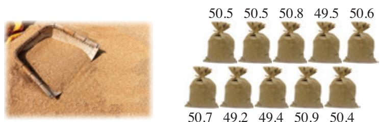

text_image

50.5 50.5 50.8 49.5 50.6
50.7 49.2 49.4 50.9 50.4

图2.1-3
解法 1：先计算 10 袋小麦一共多少千克：
$5 0. 5 + 5 0. 5 + 5 0. 8 + 4 9. 5 + 5 0. 6 + 5 0. 7 + 4 9. 2 + 4 9. 4 + 5 0. 9 + 5 0. 4 = 5 0 2. 5.$

再计算总计超过多少千克：
$5 0 2. 5 - 5 0 \times 1 0 = 2. 5.$
解法 2：把每袋小麦超过 50 kg 的千克数记作正数，不足的千克数记作负数。10 袋小麦对应的数分别为 +0.5，+0.5，+0.8，-0.5，+0.6，+0.7，-0.8，-0.6，+0.9，+0.4。
$\begin{array}{l} 0. 5 + 0. 5 + 0. 8 + (- 0. 5) + 0. 6 + 0. 7 + (- 0. 8) + (- 0. 6) + 0. 9 + 0. 4 \\ = [ 0. 5 + (- 0. 5) ] + [ 0. 8 + (- 0. 8) ] + [ 0. 6 + \\ (- 0. 6) ] + (0. 5 + 0. 7 + 0. 9 + 0. 4) \\ = 2. 5. \\ \end{array}$
$5 0 \times 1 0 + 2. 5 = 5 0 2. 5.$

比较两种解法.解法2中使用了哪些运算律?

答：10 袋小麦一共 502.5 kg，总计超过 2.5 kg.

#### 练习

1. 计算：
(1) $23 + (-17) + 6 + (-22)$ ;
(2) $(-2) + 3 + 1 + (-3) + 2 + (-4)$ ;
(3) $1 + \left(-\frac{1}{2}\right) + \frac{1}{3} + \left(-\frac{1}{6}\right)$ ;
(4) $3\frac{1}{4} + \left(-2\frac{3}{5}\right) + 5\frac{3}{4} + \left(-8\frac{2}{5}\right)$ .

利用有理数的加法解下列各题（第2～3题）：

2. 某银行储蓄卡中存有人民币 450 元，先取出 80 元，随后又存入 150 元.
储蓄卡中还存有人民币多少元?

3. 一架飞机从 $9000 \mathrm{~m}$ 的高度先下降 $300 \mathrm{~m}$ , 再上升 $500 \mathrm{~m}$ . 这时飞机的飞行高度是多少米?

### 2.1.2 有理数的减法

实际问题中还经常涉及有理数的减法。例如，在本章引言中，北京某一天的气温是 $-3\sim 3^{\circ}\mathrm{C}$ ，计算这一天的温差（最高气温减最低气温）就要计算 $3 - (-3)$ 。这里遇到了正数与负数的减法。

如图 2.1-4，你能看出 $3^{\circ}$ C 比 $-3^{\circ}$ C 高多少摄氏度吗？

在小学，我们学习减法时，知道减法是加法的逆运算。在把减法推广到有理数范围内时，为使减法运算具有一致性，规定有理数的减法与加法之间仍然具有上述关系。这样，计算3—（-3），就是要求一个数，使得它与-3相加得3。因为6与-3相加得3，所以这个数应该是6，即
$3 - (- 3) = 6. \tag {①}$
另一方面，我们知道
$3 + (+ 3) = 6, \tag {②}$
由①②，得
$3 - (- 3) = 3 + (+ 3). \tag {③}$

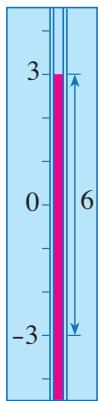

text_image

3
0
-3
6

图2.1-4

> [!explore] 探究
从③式能看出减-3相当于加哪个数吗？把3分别换成0，-1，-5，用上面的方法考虑
$0 - (- 3), (- 1) - (- 3), (- 5) - (- 3).$

这些数减-3的结果与它们加+3的结果相同吗?计算
$9 - 8, 9 + (- 8), 1 5 - 7, 1 5 + (- 7),$

从中又有什么新发现？

换几个数再试一试.

可以发现，有理数的减法可以转化为加法来进行.

有理数减法法则：

减去一个数，等于加这个数的相反数.

有理数减法法则也可以表示成
$a - b = a + (- b).$
显然，两个有理数相减，差是一个有理数.

> [!example]- 例4 计算：
(1) $(-3)-(-5)$ ;
(2) 0-7;
(3) 2-5;
(4) 7.2-(-4.8);
(5) $\left(-3\frac{1}{2}\right) - 5\frac{1}{4}.$
解：(1) $(-3)-(-5)=(-3)+5=2;$
(2) $0 - 7 = 0 + (-7) = -7;$   
(3) 2-5=2+(-5)=-3;   
(4) 7.2-(-4.8)=7.2+4.8=12;   
(5) $\left(-3\frac{1}{2}\right) - 5\frac{1}{4} = \left(-3\frac{1}{2}\right) + \left(-5\frac{1}{4}\right) = -8\frac{3}{4}.$

> [!think] 思考
在小学，只有当 a 大于或等于 b 时（其中 a, b 是 0 或正数），我们才能计算 a-b（如 2-1, 1-1）。现在，当 a 小于 b 时，你能计算 a-b（如 1-2, (-1)-1）吗？

一般地，在有理数范围内，较小的数减去较大的数，所得差的符号是什么？

在数学发展史中，使较小的正数减去较大正数的运算能正常进行，并与已有的运算不矛盾，是引入负数的一个重要原因。

#### 练习

1. 计算：
(1) 6—9;
(2) $(+4) - (-7)$ ;
(3) $(-5)-(-8)$ ;
(4) 0-(-5);
(5) 0-0.2;
(6) $(-2.5)-5.9;$
(7) 1.9—(-0.6);
(8) $\left(-\frac{1}{2}\right)-\frac{1}{4};$
(9) $\left(+1\frac{2}{7}\right) - \left(-3\frac{1}{2}\right)$ .

2. 计算：
(1) 比 $2^{\circ}$ C 低 $8^{\circ}$ C 的温度;
(2) 比—3 ℃低 6 ℃的温度.

下面研究怎样进行有理数的加减混合运算.

> [!example]- 例 5 计算 $(-20)+(+3)-(-5)-(+7)$ .
分析：这个算式中既有加法，也有减法。可以先根据有理数减法法则，把减法转化为加法，即把这个算式改写为
$(- 2 0) + (+ 3) + (+ 5) + (- 7),$

再进行有理数的加法运算.
解： $(-20) + (+3) - (-5) - (+7)$
$= (- 2 0) + (+ 3) + (+ 5) + (- 7)$
$\begin{array}{l} = [ (- 2 0) + (- 7) ] + [ (+ 3) + (+ 5) ] \\ = (- 2 7) + (+ 8) \\ = - 1 9. \\ \end{array}$

这里使用了哪些运算律？

> [!tip] 归纳

引入相反数后，加减混合运算可以统一为加法运算。例如
$a + b - c = a + b + (- c).$

算式 $(-20) + (+3) + (+5) + (-7)$ 是 $-20, +3, +5, -7$ 这四个数的和．为书写简单，可以省略算式中的括号和加号，把它写为
$- 2 0 + 3 + 5 - 7.$

这个算式可以读作 “负 20、正 3、正 5、负 7 的和”，或读作 “负 20 加 3 加 5 减 7”。例 5 的运算过程也可以简单地写为
$\begin{array}{l} (- 2 0) + (+ 3) - (- 5) - (+ 7) \\ = - 2 0 + 3 + 5 - 7 \\ = - 2 0 - 7 + 3 + 5 \\ = - 2 7 + 8 \\ = - 1 9. \\ \end{array}$

> [!example]- 例 6 计算 14-25+12-17.
$\begin{array}{l} = 1 4 + 1 2 - 2 5 - 1 7 \\ = 2 6 - 4 2 \\ = - 1 6. \\ \end{array}$
解： $14 - 25 + 12 - 17$

> [!explore] 探究
在数轴上，点 A，B 分别表示数 a，b．对于下列各组数 a，b：
$a = 2, b = 6; a = 0, b = 6; a = 2, b = - 6; a = - 2, b = - 6.$
（1）观察点 A，B 在数轴上的位置，你能得出它们之间的距离吗？  
（2）利用有理数的运算，你能用含有 $a, b$ 的算式表示上述各组点 $A, B$ 之间的距离吗？

一般地，你能发现点 A，B 之间的距离与数 a，b 之间的关系吗？

#### 练习

1. 计算：
(1) $1-4+3-0.5;$   
(2) $-2.4 + 3.5 - 4.6 + 3.5$ ;   
(3) $(-7) - (+5) + (-4) - (-10)$ ;   
(4) $\frac{3}{4} - \frac{7}{2} + \left(-\frac{1}{6}\right) - \left(-\frac{2}{3}\right) - 1.$

2. 将下列式子先改写成省略括号和加号的形式，再计算：
(1) $(-52) - (+37) + (-19) - (-24)$ ;   
(2) $\left(+2\frac{3}{4}\right) - \left(-\frac{1}{2}\right) - \left(-3\frac{3}{4}\right) - \left(+5\frac{1}{2}\right)$ .

# 习题 2.1

### 复习巩固

1. 计算：
(1) $(-10)+(+6)$ ;   
(4) $(+6.2) + (-9.3)$ ;   
(7) $\frac{2}{5} + \left(-\frac{3}{5}\right)$ ;
(2) $(+12) + (-4)$ ;
(3) $(-5)+(-7)$ ;   
(6) $(-2.1)+(+3.9)$ ;   
(9) $\left(-3\frac{1}{4}\right) + \left(-1\frac{1}{12}\right)$ .
(5) $(-0.9)+(-2.7)$ ;
(8) $\left(-\frac{1}{3}\right)+\frac{2}{5};$

2. 计算：
(1) $(-8) + 10 + 2 + (-1)$ ;   
(2) $5 + (-6) + 3 + 9 + (-4) + (-7)$ ;   
(3) $(-0.8) + 1.2 + (-0.7) + (-2.1) + 0.8 + 3.5$ ;   
(4) $\frac{1}{2} + \left(-\frac{2}{3}\right) + \frac{4}{5} + \left(-\frac{1}{2}\right) + \left(-\frac{1}{3}\right)$ .

3. 计算：
(1) $(-8)-8;$   
(4) 8-8;   
(7) 16—47;
(2) $(-8)-(-8)$ ;
(3) 8-(-8);   
(6) 0-(-6);   
(9) $(-5.9)-(-6.1)$ .
(5) 0—6;
(8) $(-3.8)-(+7)$ ;

#### 4. 计算：
(1) $\left(+\frac{2}{5}\right) - \left(-\frac{3}{5}\right)$ ;
(2) $\left(-\frac{2}{5}\right) - \left(-\frac{3}{5}\right)$ ;
(3) $\frac{1}{2} - \frac{1}{3}$ ;
(4) $\left(-\frac{1}{2}\right) - \frac{1}{3}$ ;
(5) $-\frac{2}{3} - \left(-\frac{1}{6}\right)$ ;
(6) $0 - \left(-\frac{3}{4}\right)$ ;
(7) $(-2) - \left(+\frac{2}{3}\right)$ ;
(8) $\left(-16\frac{3}{4}\right) - \left(-10\frac{1}{4}\right) - \left(+1\frac{1}{2}\right)$ .

#### 5. 计算：
(1) $-4.2 + 5.7 - 8.4 + 10$ ;
(2) $-\frac{1}{4} + \frac{5}{6} + \frac{2}{3} - \frac{1}{2}$ ;
(3) $12-(-18)+(-7)-15;$
(4) 4.7-(-8.9)-7.5+(-6);
(5) $\left(-4\frac{7}{8}\right) - \left(-5\frac{1}{2}\right) + \left(-4\frac{1}{4}\right) - \left(+3\frac{1}{8}\right)$ ;
(6) $\left(-\frac{2}{3}\right) + \left|0 - 5\frac{1}{6}\right| + \left| -4\frac{5}{6}\right| + \left(-9\frac{1}{3}\right)$ .

### 综合运用

6. 如图，陆地上最高处是珠穆朗玛峰的峰顶，最低处位于亚洲西部名为死海的湖，两处高度相差多少米？

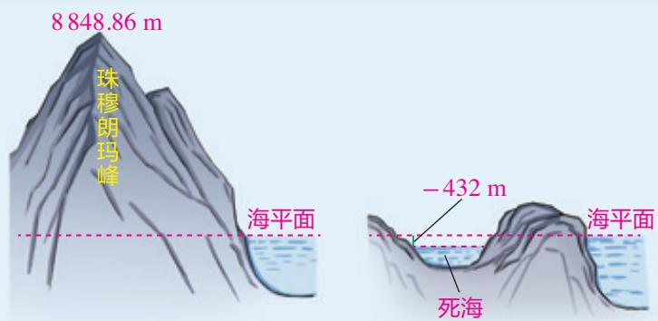

text_image

8 848.86 m
珠穆朗玛峰
海平面
-432 m
海平面
死海

(第6题)

7. 某地一天早晨的气温是 $-7^{\circ} \mathrm{C}$ , 中午上升了 $11^{\circ} \mathrm{C}$ , 半夜又下降了 $9^{\circ} \mathrm{C}$ , 半夜的气温是多少摄氏度?

8. 某食品店一星期中各天的盈亏情况如下（记盈余为正）：

432 元，-12.5 元，-10.5 元，327 元，-87 元，536.5 元，698 元。食品店这一星期总的盈亏情况如何？

9. 有 8 筐白菜，以每筐 25 kg 为质量标准，超过的千克数记作正数，不足的千克数记作负数，称后的记录（单位：kg）如下：
$1. 5, - 3, 2, - 0. 5, 1, - 2, - 2, - 2. 5.$

这8筐白菜一共多少千克？

10. 某地一星期内每天的最高气温与最低气温如下表所示，哪天的温差最大？哪天的温差最小？

<table><tr><td>星期</td><td>一</td><td>二</td><td>三</td><td>四</td><td>五</td><td>六</td><td>日</td></tr><tr><td>最高气温/°C</td><td>10</td><td>12</td><td>11</td><td>9</td><td>7</td><td>5</td><td>7</td></tr><tr><td>最低气温/°C</td><td>2</td><td>1</td><td>0</td><td>-1</td><td>-4</td><td>-5</td><td>-5</td></tr></table>

### 拓广探索

11. 填空题.
(1) \_\_\_\_ + 11 = 27;
(2) $7 + \_\_\_\_ = 4;$
(3) $(-9)+\_=9;$
(4) $12+$ =0;
(5) $(-8)+$ \_\_\_\_=-15;
(6) \_\_\_\_ + (-13) = -6.

12. 计算下列各式的值:
$(- 2) + (- 2),$
$(- 2) + (- 2) + (- 2),$
$(- 2) + (- 2) + (- 2) + (- 2),$
$(- 2) + (- 2) + (- 2) + (- 2) + (- 2).$

猜想下列各式的值:
$(- 2) \times 2, (- 2) \times 3, (- 2) \times 4, (- 2) \times 5.$

你能进一步猜出负数乘正数的法则吗?

13. 某公路养护小组乘车沿一条南北向公路巡视养护。某天早晨他们从 A 地出发，晚上最终到达 B 地。约定向北为正方向，当天汽车的行驶记录（单位：km）如下：
$+ 1 8, - 9, + 7, - 1 4, - 6, + 1 3, - 6, - 8.$

假设汽车在同一行驶记录下是单向行驶.
(1) B地在A地的哪个方向？它们相距多少千米？  
(2) 如果汽车行驶 1 km 平均耗油 a L，那么这天汽车共耗油多少升？

## 阅读与思考

### 我国古代的正负数加减运算法则——正负术

我国古代数学著作《九章算术》的“方程”一章，给出了名为“正负术”的算法：“同名相除，异名相益，正无入负之，负无入正之；其异名相除，同名相益，正无入正之，负无入负之。”你知道它的意思吗？

我们按照加法、减法的顺序，先来看“正负术”中的后四句话，它们符合有理数的加法法则，可以用现代算式解释如下：

“异名相除”，即异号两数相加时，括号前为绝对值较大的加数的符号，括号内为加数的绝对值中较大的减去较小的。例如：
$(+ 5) + (- 3) = + (5 - 3), (- 5) + (+ 3) = - (5 - 3).$

“同名相益”，即同号两数相加时，括号前为加数的符号，括号内为加数的绝对值之和。例如：
$(+ 5) + (+ 3) = + (5 + 3), (- 5) + (- 3) = - (5 + 3).$

“正无入正之，负无入负之”，即0加正数得正数本身，0加负数得负数本身．例如：
$0 + (+ 3) = + 3, 0 + (- 3) = - 3.$

对于 “正负术” 中的前四句话，其实它们符合有理数的减法法则，其中的 “异名相益，正无入负之，负无入正之”，可以用现代算式解释如下：

“异名相益”，即异号两数相减时，括号前为被减数的符号，括号内为被减数的绝对值与减数的绝对值之和。例如：
$(+ 5) - (- 3) = + (5 + 3), (- 5) - (+ 3) = - (5 + 3).$

“正无入负之，负无入正之”，即0减正数得负数（该正数的相反数），0减负数得正数（该负数的相反数）。例如：
$0 - (+ 3) = - 3, 0 - (- 3) = + 3.$

对于“同名相除”，你能用现代算式加以解释吗？

《九章算术》中给出的“正负术”实际上符合现代有理数的加减运算法则，这是世界数学史上第一个有理数的加减运算法则，是我国古代数学的一个辉煌成就.

## 2.2 有理数的乘法与除法

与加法、减法一样，乘法、除法也是有理数的基本运算. 小学时学习的乘法、除法运算也可以推广到有理数范围内.

### 2.2.1 有理数的乘法

我们已经熟悉正数及0的乘法。与加法类似，数的范围扩大到了有理数后，我们希望在有理数范围内，所有数都能像正数及0一样进行乘法运算，并使乘法运算具有一致性，那么该怎样进行有理数的乘法运算呢？

在有理数范围内，除了已有的正数与正数相乘、正数与0相乘以及0与0相乘，乘法还有哪几种情况？

> [!think] 思考
分别观察下面的两列乘法算式，你能发现什么规律？
(1) $3 \times 3 = 9$ ,
$3 \times 2 = 6,$
$3 \times 1 = 3,$
$3 \times 0 = 0;$
(2) $3 \times 3 = 9$ ,
$2 \times 3 = 6,$
$1 \times 3 = 3,$
$0 \times 3 = 0.$

可以发现，对于（1）中的算式，随着后一乘数逐次递减1，积逐次递减3.要使这个规律在引入负数后仍然成立，那么应有：
$3 \times (- 1) = - 3,$
$3 \times (- 2) = \underline {{\quad}},$
$3 \times (- 3) = \underline {{\quad}}.$

对于（2）中的算式，随着前一乘数逐次递减1，积逐次递减3.要使这个规律在引入负数后仍然成立，那么应有：
$(- 1) \times 3 = \underline {{\quad}},$
$(- 2) \times 3 = \underline {{\quad}},$
$(- 3) \times 3 = \underline {{\quad}}.$

从符号和绝对值两个角度分别观察上述所有算式，可以归纳如下：

正数乘正数，积为正数；正数乘负数，积为负数；负数乘正数，积也为负数．积的绝对值等于乘数的绝对值的积.

> [!think] 思考
利用上面归纳的结论计算下面的算式，你能发现什么规律？
$\begin{array}{l} (- 3) \times 3 = \underline {{\quad}}, \\ (- 3) \times 2 = \underline {{\quad}}, \\ (- 3) \times 1 = \underline {{\quad}}. \\ \end{array}$

可以发现，上述算式有如下规律：随着后一乘数逐次递减1，积逐次增加3. 按照上述规律，下面的空格应各填什么数？
$\begin{array}{l} (- 3) \times 0 = \underline {{\quad}}, \\ (- 3) \times (- 1) = \underline {{\quad}}, \\ (- 3) \times (- 2) = \underline {{\quad}}, \\ (- 3) \times (- 3) = \underline {{\quad}}. \\ \end{array}$

你能得出负数与0相乘的结果吗？

观察上述乘数不为 0 的三个算式，可以归纳如下：

负数乘负数，积为正数，且积的绝对值等于乘数的绝对值的积.

与有理数加法类似，有理数相乘，也既要确定积的符号，又要确定积的绝对值。一般地，我们有如下的有理数乘法法则：

两数相乘，同号得正，异号得负，且积的绝对值等于乘数的绝对值的积.

任何数与 0 相乘，都得 0.

有理数乘法法则也可以表示如下：
设 $a, b$ 为正有理数， $c$ 为任意有理数，则
$\begin{array}{l} (+ a) \times (+ b) = + (a \times b), (- a) \times (- b) = + (a \times b); \\ (- a) \times (+ b) = - (a \times b), (+ a) \times (- b) = - (a \times b); \\ c \times 0 = 0, 0 \times c = 0. \\ \end{array}$
显然，两个有理数相乘，积是一个有理数.

> [!example]- 例 1 计算:
(1) $8 \times (-1)$ ;
(2) $\left(-\frac{1}{2}\right) \times (-2)$ ;
(3) $\left(-\frac{2}{3}\right) \times \left(-\frac{5}{7}\right)$ .
解：(1) $8 \times (-1) = -(8 \times 1) = -8;$
(2) $\left(-\frac{1}{2}\right) \times (-2) = +\left(\frac{1}{2} \times 2\right) = 1;$   
(3) $\left(-\frac{2}{3}\right) \times \left(-\frac{5}{7}\right) = +\left(\frac{2}{3} \times \frac{5}{7}\right) = \frac{10}{21}$ .

在例1（2）中， $\left(-\frac{1}{2}\right)\times (-2) = 1$ ，我们说 $-\frac{1}{2}$ 和-2互为倒数．一般地，在有理数中仍然有：

乘积是 1 的两个数互为倒数.

> [!example]- 例 2 用正负数表示气温的变化量，上升为正，下降为负。登山队攀登一座山峰，每登高 1 km 气温的变化量为 $-6^{\circ}C$ 。登高 3 km 后，气温有什么变化？
解： $(-6)\times3=-18.$

答：登高 3 km 后，气温下降 18 ℃.

#### 练习

1. 计算：
(1) $6 \times (-9)$ ;
(2) $(-4)\times 6;$
(3) $(-6)\times (-1)$ ;
(4) $(-6)\times 0;$
(5) $(-4)\times \frac{1}{4}$ ;
(6) $\frac{2}{3} \times \left(-\frac{9}{4}\right)$ .

2. 商店降价销售某种商品，每件降 5 元，售出 60 件。与按原价销售同样数量的商品相比，销售额有什么变化？

3. 写出下列各数的倒数：
$1, - 1, \frac {1}{3}, - \frac {1}{3}, 5, - 5, \frac {2}{3}, - \frac {2}{3}.$

有了有理数的乘法法则后，就要研究乘法的运算律。在小学我们学过乘法的交换律、结合律，乘法对加法的分配律，对于有理数的乘法，它们还成立吗？

> [!explore] 探究
计算
$5 \times (- 6), (- 6) \times 5,$

所得的积相同吗？换几组乘数再试一试.

从上述计算中，你能得出什么结论？

一般地，在有理数乘法中，两个数相乘，交换乘数的位置，积不变.

乘法交换律： $ab = ba$

类似地，可以发现有理数的乘法结合律仍然成立，即在有理数乘法中，三个数相乘，先把前两个数相乘，或者先把后两个数相乘，积不变.
$a \times b$ 也可以写为 $a \cdot b$ 或 ab. 当用字母表示乘数时，“×”可以写为 “·” 或省略.

乘法结合律： $(ab)c = a(bc)$

根据乘法交换律和结合律，多个有理数相乘，可以任意交换乘数的位置，也可以先把其中的几个数相乘.

> [!explore] 探究
计算
$5 \times [ 3 + (- 7) ], 5 \times 3 + 5 \times (- 7),$

所得的结果相同吗？换几组数再试一试。

从上述计算中，你能得出什么结论？

一般地，在有理数中，一个数与两个数的和相乘，等于把这个数分别与这两个数相乘，再把积相加.

分配律： $a(b + c) = ab + ac.$

交换律、结合律、分配律等运算律在运算中有重要作用，它们是解决许多数学问题的基础。

> [!example]- 例 3 （1）计算 $2 \times 3 \times 0.5 \times (-7)$ ;
(2) 用两种方法计算 $\left(\frac{1}{4}+\frac{1}{6}-\frac{1}{2}\right)\times12.$
解：(1) $2 \times 3 \times 0.5 \times (-7)$
$\begin{array}{l} = (2 \times 0. 5) \times [ 3 \times (- 7) ] \\ = 1 \times (- 2 1) \\ = - 2 1. \\ \end{array}$
(2) 解法 1: $\left(\frac{1}{4}+\frac{1}{6}-\frac{1}{2}\right)\times12$
$= \left(\frac {3}{1 2} + \frac {2}{1 2} - \frac {6}{1 2}\right) \times 1 2$
$= - \frac {1}{1 2} \times 1 2 = - 1.$
解法2： $\left(\frac{1}{4} +\frac{1}{6} -\frac{1}{2}\right)\times 12$
$= \frac {1}{4} \times 1 2 + \frac {1}{6} \times 1 2 - \frac {1}{2} \times 1 2$
$= 3 + 2 - 6 = - 1.$

比较解法 1 与解法 2，它们在运算顺序上有什么区别？解法 2 用了什么运算律？哪种解法更简便？

> [!explore] 探究
改变例 3（1）的乘积式子中某些乘数的符号，得到下列一些式子。观察这些式子，它们的积是正的还是负的？
$2 \times 3 \times (- 0. 5) \times (- 7),$
$2 \times (- 3) \times (- 0. 5) \times (- 7),$
$(- 2) \times (- 3) \times (- 0. 5) \times (- 7).$

几个不为0的数相乘，积的符号与负的乘数的个数之间有什么关系？如果有乘数为0，那么积有什么特点？

可以得到：几个不为 0 的数相乘，负的乘数的个数是偶数时，积为正数；负的乘数的个数是奇数时，积为负数；几个数相乘，如果其中有乘数为 0，那么积为 0.

这样，遇到多个不为 0 的数相乘，可以先用上面的结论确定积的符号，再把乘数的绝对值相乘作为积的绝对值．例如：
$\begin{array}{l} (- 3) \times \frac {5}{6} \times \left(- \frac {9}{5}\right) \times \left(- \frac {1}{4}\right) \\ = - \left(3 \times \frac {5}{6} \times \frac {9}{5} \times \frac {1}{4}\right) = - \frac {9}{8}, \\ (- 5) \times 6 \times \left(- \frac {4}{5}\right) \times \frac {1}{4} \\ = 5 \times 6 \times \frac {4}{5} \times \frac {1}{4} = 6. \\ \end{array}$

#### 练习

1. 计算：
(1) $(-85)\times (-25)\times (-4);$
(2) $\left(-\frac{7}{8}\right) \times 15 \times \left(-1\frac{1}{7}\right)$ ;
(3) $\left(\frac{9}{10} - \frac{1}{15}\right) \times 30$ ;   
(4) $\left(-\frac{6}{5}\right) \times \left(-\frac{2}{3}\right) + \left(-\frac{6}{5}\right) \times \left(+\frac{17}{3}\right)$ .

2. 计算：
(1) $\left(-\frac{5}{12}\right) \times \frac{8}{15} \times \frac{1}{2} \times \left(-\frac{2}{3}\right)$ ;   
(2) $(-1) \times \left(-\frac{5}{4}\right) \times \frac{8}{15} \times \frac{3}{2} \times \left(-\frac{2}{3}\right) \times 0 \times (-1)$ .

### 2.2.2 有理数的除法

在小学，我们学习除法时，知道除法是乘法的逆运算。在把除法推广到有理数范围内时，为使除法运算具有一致性，规定有理数的除法与乘法之间仍然具有上述关系。

> [!think] 思考
怎样计算 $8 \div (-4)$ ?

根据除法是乘法的逆运算，计算 $8 \div (-4)$ ，就是要求一个数，使它与 $-4$ 相乘得8.
因为 $(-2)\times (-4) = 8$
所以 $8 \div (-4) = -2.$ ①
另一方面，我们有
$8 \times \left(- \frac {1}{4}\right) = - 2, \tag {②}$
于是有
$8 \div (- 4) = 8 \times \left(- \frac {1}{4}\right). \tag {③}$

③式表明，一个数除以-4可以转化为乘 $-\frac{1}{4}$ 来进行，即一个数除以-4，等于乘-4的倒数 $-\frac{1}{4}$ .

一般地，对于有理数的除法，有如下法则：

除以一个不等于 0 的数，等于乘这个数的倒数.

这个法则也可以表示成
$a \div b = a \cdot \frac {1}{b} (b \neq 0).$

换其他数的除法进行类似讨论，是否仍有除以 $a (a \neq 0)$ 可以转化为乘 $\frac{1}{a}$ ?

两个有理数相除（除数不为0），商是一个有理数.

从有理数除法法则，容易得出：

两数相除，同号得正，异号得负，且商的绝对值等于被除数的绝对值除以除数的绝对值的商。0除以任何一个不等于0的数，都得0。

这是有理数除法法则的另一种说法.

> [!example]- 例4 计算：
(1) $(-36) \div 9$ ;
(2) $\left(-\frac{12}{25}\right)\div\left(-\frac{3}{5}\right).$
解：（1） $(-36)\div 9 = -(36\div 9) = -4$
(2) $\left(-\frac{12}{25}\right) \div \left(-\frac{3}{5}\right) = \left(-\frac{12}{25}\right) \times \left(-\frac{5}{3}\right) = \frac{4}{5}$ .

> [!example]- 例 5 化简:
(1) $\frac{-2}{3}$ ;
(2) $\frac{-45}{-12}.$
解：(1) $\frac{-2}{3} = (-2)\div 3 = -(2\div 3) = -\frac{2}{3};$
(2) $\frac{-45}{-12} = (-45) \div (-12) = 45 \div 12 = \frac{15}{4}$ .

在例 5 中，我们得到 $\frac{-2}{3} = -\frac{2}{3}$ ，这表明 $\frac{-2}{3}$ 是负分数，因而是有理数；反过来看， $-\frac{2}{3} = \frac{-2}{3}$ ，又表明 $-\frac{2}{3}$ 可以写成 $\frac{-2}{3}$ 这样两个整数相除的形式.

一般地，根据有理数的除法，形如 $\frac{p}{q}$ （ $p, q$ 是整数， $q \neq 0$ ）的数都是有理数；有理数又都可以写成上述形式（整数可以看成分母为1的分数）。这样，有理数就是形如 $\frac{p}{q}$ （ $p, q$ 是整数， $q \neq 0$ ）的数。

有理数表示为分数形式非常重要. 在以后的学习中, 你将逐渐体会到它在数学中的价值.

#### 练习

1. 计算：
(1) $(-18) \div 6$ ;
(2) $(-63) \div (-7)$ ;
(3) $1 \div (-9)$ ;
(4) $0 \div (-8)$ ;
(5) $(-6.5)\div0.13;$
(6) $\left(-\frac{6}{5}\right) \div \left(-\frac{2}{5}\right)$ .

2. 化简：
(1) $\frac{-72}{9};$
(2) $\frac{-30}{-45}$ ;
(3) $\frac{0}{-75}$ ;
(4) $\frac{27}{-6}.$
因为有理数的除法可以转化为乘法，所以可以利用与乘法有关的运算律简化运算。乘除混合运算往往先将除法转化为乘法，然后确定积的符号，最后求出结果。

> [!example]- 例6 计算：
(1) $\left(-125\frac{5}{7}\right)\div(-5)$ ;
(2) $-2.5 \div \frac{5}{8} \times \left(-\frac{1}{4}\right)$ .
解：（1） $\left(-125\frac{5}{7}\right)\div (-5)$
$= \left(1 2 5 + \frac {5}{7}\right) \times \frac {1}{5}$
$= 1 2 5 \times \frac {1}{5} + \frac {5}{7} \times \frac {1}{5}$
$= 2 5 + \frac {1}{7}$
$= 2 5 \frac {1}{7};$
(2) $-2.5 \div \frac{5}{8} \times \left(-\frac{1}{4}\right)$
$= \frac {5}{2} \times \frac {8}{5} \times \frac {1}{4}$
$= 1.$

有理数的加、减、乘、除混合运算，如无括号指出先做什么运算，则与小学所学的混合运算一样，按照“先乘除，后加减”的顺序进行.

> [!example]- 例 7 计算:
(1) $-8 + 4 \div (-2)$ ;
解：(1) $-8 + 4 \div (-2)$
$= - 8 + (- 2)$
$= - 1 0;$
(2) $(-7)\times (-5) - 90\div (-15).$
(2) $(-7)\times (-5) - 90\div (-15)$
$= 3 5 - (- 6)$
$= 3 5 + 6$
$= 4 1.$

> [!example]- 例 8 某公司去年 1 月—3 月平均每月亏损 1.5 万元，4 月—6 月平均每月盈利 32 万元，7 月—10 月平均每月盈利 21.7 万元，11 月—12 月平均每月亏损 2.3 万元。这个公司去年总的盈亏情况如何？
解：记盈利额为正数，亏损额为负数．由
$(- 1. 5) \times 3 + 3 2 \times 3 + 2 1. 7 \times 4 + (- 2. 3) \times 2$
$= - 4. 5 + 9 6 + 8 6. 8 - 4. 6$
$= 1 7 3. 7$

可知，这个公司去年全年盈利 173.7 万元.

计算器是一种方便实用的计算工具，用计算器进行比较复杂的数的计算，比笔算要快捷得多．例如，可以用计算器计算例8中的
$(- 1. 5) \times 3 + 3 2 \times 3 + 2 1. 7 \times 4 + (- 2. 3) \times 2.$
如果计算器带符号键(●)，只需按键

①1.5×3+32×3+21.7×4+
②2.3×2=，

显示结果为

173.7,

就可以得到答案 173.7.

不同品牌计算器的操作方法可能有所不同，具体参见计算器的使用说明.

有的计算器用EXE代替；有时候计算器显示的结果是分数 $\pm\frac{p}{q}$ 的形式，可以再通过相关操作转换为小数形式.

#### 练习

#### 1. 计算：
(1) $\frac{1}{5} \div (-6)$ ;
(2) $\left(-36\frac{9}{11}\right)\div 9;$
(3) $(-12) \div (-4) \div \left(-1\frac{1}{5}\right)$ ;
(4) $\left(-\frac{2}{3}\right) \times \frac{8}{5} \div (-0.25)$ .

#### 2. 计算：
(1) $6-(-12)\div(-3)$ ;
(2) $3 \times (-4) + (-28) \div 7$ ;
(3) $(-48) \div 8 - (-25) \times (-6)$ ;
(4) $42 \times \left(-\frac{2}{3}\right) + \left(-\frac{3}{4}\right) \div (-0.5)$ .

#### 3. 用计算器计算：
(1) $357 + (-154) + 26 + (-212)$ ;
(2) $-5.13 + 4.62 + (-8.47) - (-2.3)$ ;
(3) $26 \times (-41) + (-35) \times (-17)$ ;
(4) $1.252 \div (-44) - (-356) \div (-0.196)$ (结果保留小数点后三位).

# 习题 2.2

### 复习巩固

#### 1. 计算：
(1) $(-8)\times(-7)$ ;
(2) $12 \times (-5)$ ;
(3) $2.9 \times (-0.4)$ ;
(4) $(-30.5) \times 0.2$ ;
(5) $100 \times (-0.001)$ ;
(6) $(-4.8)\times (-1.25).$

#### 2. 计算：
(1) $\frac{1}{4} \times \left(-\frac{8}{9}\right)$ ;
(2) $\left(-\frac{5}{6}\right) \times \left(-\frac{3}{10}\right)$ ;
(3) $\left(-\frac{34}{15}\right)\times25;$
(4) $(-0.3) \times \left(-\frac{10}{7}\right)$ .

#### 3. 写出下列各数的倒数：
(1) -15;
(2) $-\frac{5}{9};$
(3) -0.25;
(4) 0.17;
(5) $4\frac{1}{4}$ ;
(6) $-5\frac{2}{5}.$

4. 计算：
(1) $\left(-\frac{8}{25}\right) \times 1.25 \times (-8)$ ;
(2) $(-10)\times (-8.24)\times (-0.1)$ ;
(3) $\left(\frac{7}{9} - \frac{5}{6} + \frac{3}{4} - \frac{7}{18}\right) \times 36$ ;
(4) $-\frac{3}{4} \times \left(8 - 1\frac{1}{3} - 0.04\right)$ .

5. 计算：
(1) $(-2)\times3\times(-4)$ ;
(2) $(-6)\times (-5)\times (-7);$
(3) $(-6)\times (-0.25)\times \frac{11}{14};$
(4) $(-17)\times (-49)\times 0\times 13.$

6. 计算：
(1) $16 \div (-3)$ ;
(2) $(-91) \div 13$ ;
(3) $(-56)\div (-14)$ ;
(4) $\frac{4}{5} \div (-1)$ ;
(5) $(-16)\div (-48)$ ;
(6) $(-0.25) \div \frac{3}{8}$ .

7. 填空题.
$1 \times (- 5) = \underline {{\quad}};$
$1 \div (- 5) = \underline {{{\quad}}};$
$1 + (- 5) = \underline {{{\quad}}};$
$1 - (- 5) = \underline {{{\quad}}};$
$(- 1) \times (- 5) = \underline {{{\quad}}};$
$(- 1) \div (- 5) = \underline {{{\quad}}};$
$(- 1) + (- 5) = \underline {{{\quad}}};$
$(- 1) - (- 5) = \underline {{\quad}}.$

8. 化简：
(1) $\frac{-21}{7}$ ;
(2) $\frac{3}{-36};$
(3) $\frac{-54}{-8}$ ;
(4) $\frac{-6}{-0.3}$ .

9. 计算：
(1) $0.1 \div (-0.001) \div (-1)$ ;
(2) $\left(-\frac{3}{4}\right) \times \left(-1\frac{1}{2}\right) \div \left(-2\frac{1}{4}\right)$ ;
(3) $(-7)\times (-56)\times 0\div (-13);$
(4) $(-9)\times (-11)\div 3\div (-3).$

### 综合运用

10. 计算：
(1) $23 \times (-5) - (-3) \div \frac{3}{128}$ ;
(2) $(-7)\times(-3)\times(-0.5)+(-12)\times(-2.6);$
(3) $\left(1\frac{3}{4} -\frac{7}{8} -\frac{7}{12}\right)\div \left(-\frac{7}{8}\right) + \left(-\frac{7}{8}\right)\div \left(1\frac{3}{4} -\frac{7}{8} -\frac{7}{12}\right);$
(4) $-\left| -\frac{2}{3} \right| - \left| -\frac{1}{2} \times \frac{2}{3} \right| - \left| \frac{1}{3} - \frac{1}{4} \right| - | - 3|$ .

11. 用计算器计算（结果保留小数点后两位）：
(1) $(-36)\times 128\div (-74)$ ;   
(2) $(-6.23) \div (-0.25) \times 94$ ;   
(3) $(-4.325) \times (-0.012) - 2.31 \div (-5.315)$ ;   
(4) 180.65-(-32)×47.8÷(-15.5).

12. 记盈利额为正数，用正数或负数填空：
（1）小商店平均每天盈利250元，一个月（按30天计算）的利润是\_\_\_\_元；  
(2) 小商店一星期的利润是 1400 元，平均每天的利润是 \_\_\_\_ 元；  
（3）小商店一星期共亏损 840 元，平均每天的利润是 \_\_\_\_ 元.

13. 一架直升机从高度为 $450 \mathrm{~m}$ 的位置开始, 先以 $4 \mathrm{~m} / \mathrm{s}$ 的速度竖直上升 $60 \mathrm{~s}$ , 后以 $5 \mathrm{~m} / \mathrm{s}$ 的速度竖直下降 $120 \mathrm{~s}$ , 这时直升机所在高度是多少?

### 拓广探索

14. 计算 $2 \times 1, 2 \times \frac{1}{2}, 2 \times (-1), 2 \times \left(-\frac{1}{2}\right)$ .

联系这类具体的数的乘法，你认为一个非零有理数一定小于它的2倍吗？为什么？

15. 利用分配律可以得到
$\begin{array}{l} - 2 \times 6 + 3 \times 6 = (- 2 + 3) \times 6, \\ - 2 \times (- 5) + 3 \times (- 5) = (- 2 + 3) \times (- 5). \\ \end{array}$
如果用 a 表示任意一个数，那么利用分配律可以得到 $-2a + 3a$ 等于什么？

16. 计算 $(-4) \div 2, 4 \div (-2), (-4) \div (-2)$ .

联系这类具体的数的除法，你认为下列式子是否成立（a，b 是有理数，且 $b \neq 0$ ）？从中可以总结出什么规律？
(1) $\frac{-a}{b} = \frac{a}{-b} = -\frac{a}{b}$ ;
(2) $\frac{-a}{-b} = \frac{a}{b}$ .

## 探究与发现

### 从数系扩充看有理数乘法法则

我们知道，引入负数后，数的范围从非负有理数扩大到有理数。在有理数范围内，除了小学已学的正数与正数相乘、正数与0相乘、0与0相乘，还有正数与负数相乘、0与负数相乘、负数与负数相乘，其中最典型、最简单的情况分别为 $1 \times (-1)$ ， $0 \times (-1)$ ， $(-1) \times (-1)$ 。应当怎样规定这些运算呢？下面我们从数系扩充的角度来探究一下.

正有理数、0统称非负有理数.

在把非负有理数的加法、乘法运算推广到有理数范围内时，我们希望在有理数中新规定的加法、乘法运算与非负有理数中相应的运算具有一致性，并且加法、乘法都满足交换律和结合律，乘法对加法满足分配律.

在研究了有理数的加法运算之后，依照上述设想，研究 $1 \times (-1)$ ， $0 \times (-1)$ ， $(-1) \times (-1)$ 的结果.

对于 $1 \times (-1)$ ，如果分配律成立，那么
$1 \times (- 1) + 1 \times 1 = 1 \times [ (- 1) + 1 ] = 1 \times 0 = 0,$
从而
$1 \times (- 1) = - (1 \times 1) = - 1.$

对于 $0 \times (-1)$ ，如果分配律成立，那么
$0 \times (- 1) + 0 \times 1 = 0 \times [ (- 1) + 1 ] = 0 \times 0 = 0,$
从而
$0 \times (- 1) = - (0 \times 1) = 0.$
如果 $a + b = 0$ ，那么 $a = -b.$

对于 $(-1) \times (-1)$ ，如果分配律成立，那么
$(- 1) \times (- 1) + 1 \times (- 1) = [ (- 1) + 1 ] \times (- 1) = 0 \times (- 1) = 0,$
从而
$(- 1) \times (- 1) = - [ 1 \times (- 1) ] = - (- 1) = 1.$

综合上述分析，从数系扩充的角度来看，为了保证有理数的加法、乘法运算与已有的非负有理数的加法、乘法运算保持一致，规定 $1 \times (-1) = -1$ ， $0 \times (-1) = 0$ ， $(-1) \times (-1) = 1$ 是合理的.

一般地，你能从数系扩充的角度说明有理数乘法法则的合理性吗？

## 2.3 有理数的乘方

在数学和实际问题中，经常会遇到一种特殊形式的乘法运算，其中的各个乘数都相同。下面就来学习这种乘法运算。

### 2.3.1 乘方

我们知道，边长为 $2 \, cm$ 的正方形的面积是 $2 \times 2 = 4 \, (\text{cm}^{2})$ ；棱长为 $2 \, cm$ 的正方体的体积是 $2 \times 2 \times 2 = 8 \, (\text{cm}^{3})$ .
$2 \times 2$ ， $2 \times 2 \times 2$ 都是相同乘数的乘法。为了简便，我们将它们分别记作 $2^{2}$ ， $2^{3}$ 。 $2^{2}$ 读作“2的平方”（或“2的2次方”）， $2^{3}$ 读作“2的立方”（或“2的3次方”）。
同样地，
$(-2)\times(-2)\times(-2)\times(-2)$ 记作 $(-2)^{4}$ ，读作“-2的4次方”；
$(-2)^{4}$ 与 $-2^{4}$ 相等吗？为什么？
$(- \frac{2}{5}) \times (- \frac{2}{5}) \times (- \frac{2}{5}) \times (- \frac{2}{5}) \times (- \frac{2}{5})$ 记作 $\left(-\frac{2}{5}\right)^{5}$ ，读作“ $-\frac{2}{5}$ 的5次方”.

一般地，n 个相同的乘数 a 相乘，即 $\underbrace{a \cdot a \cdot \cdots \cdot a}_{n个}$ ，记作 $a^{n}$ ，读作 “a 的 n 次方”.

求 n 个相同乘数的积的运算，叫作乘方，乘方的结果叫作幂（power）。在 $a^{n}$ 中，a 叫作底数，n 叫作指数，当 $a^{n}$ 看作 a 的 n 次方的结果时，也可读作 “a 的 n 次幂”。例如，在 $9^{4}$ 中，底数是 9，指数是 4， $9^{4}$ 读作 “9 的 4 次方”，或 “9 的 4 次幂”。

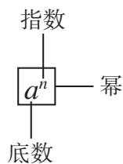

text_image

指数
a^n —— 幂
底数

一个数可以看作这个数本身的1次方. 例如, 5就是 $5^{1}$ . 指数1通常省略不写.
因为 $a^n$ 就是 $n$ 个 $a$ 相乘，所以可以利用有理数的乘法运算来进行有理数的乘方运算.

> [!example]- 例 1 计算:
(1) $(-4)^{3}$ ;
(2) $(-2)^{4}$ ;
(3) $\left(-\frac{2}{3}\right)^3.$
解：(1) $(-4)^{3}=(-4)\times(-4)\times(-4)=-64;$
(2) $(-2)^{4} = (-2)\times (-2)\times (-2)\times (-2) = 16;$
(3) $\left(-\frac{2}{3}\right)^3 = \left(-\frac{2}{3}\right) \times \left(-\frac{2}{3}\right) \times \left(-\frac{2}{3}\right) = -\frac{8}{27}$ .

> [!explore] 探究
请再举一些计算乘方的例子，结合例1，你发现负数的幂的正负与指数有什么关系？

根据有理数的乘法法则可以得出：

负数的奇次幂是负数，负数的偶次幂是正数.
显然，正数的任何正整数次幂都是正数，0 的任何正整数次幂都是 0.

> [!example]- 例 2 用计算器计算 $(-8)^{5}$ 和 $(-3)^{6}$ .
解：用带符号键 $^{①}$ 的计算器，有

①②⑧①⑤=

显示结果为

-32768;

①(一)③①■⑥=

显示结果为

729.
因此， $(-8)^{5}=-32\ 768,\quad(-3)^{6}=729.$

#### 练习

1. (1) $(-7)^{8}$ 中，底数、指数各是什么？
(2) $(-10)^{8}$ 中， $-10$ 叫作什么数？ $8$ 叫作什么数？ $(-10)^{8}$ 是正数还是负数？

2. 计算：
(1) $(-1)^{10}$ ;
(2) $(-1)^{7}$ ;
(3) $8^{3}$ ;
(4) $(-5)^{3}$ ;
(5) $0.1^{3}$ ;
(6) $\left(-\frac{1}{2}\right)^{4}$ ;
(7) $(-10)^{4}$ ;
(8) $(-10)^{5}$ .

3. 用计算器计算：
(1) $(-11)^{6}$ ;
(2) $16^{7}$ ;
(3) $8.4^{3}$ ;
(4) $(-5.6)^{3}$ .

引入有理数的乘方运算后，做有理数的加、减、乘、除、乘方混合运算时，应注意以下运算顺序：

1. 先乘方，再乘除，最后加减；  
2. 同级运算，从左到右进行；  
3. 如有括号，先做括号内的运算，按小括号、中括号、大括号依次进行.

> [!example]- 例 3 计算:
(1) $2 \times (-3)^{3} - 4 \times (-3) + 15;$   
(2) $(-2)^{3} + (-3)\times (-4^{2} + 2) - (-3)^{2}\div (-2).$
解：（1）原式 $= 2 \times (-27) - (-12) + 15$
$= - 5 4 + 1 2 + 1 5$
$= - 2 7;$
(2) 原式 $= -8 + (-3) \times (-16 + 2) - 9 \div (-2)$
$= - 8 + (- 3) \times (- 1 4) - (- 4. 5)$
$= - 8 + 4 2 + 4. 5$
$= 3 8. 5.$

> [!example]- 例 4 观察下面三行数:
-2, 4, -8, 16, -32, 64, …; ①

0, 6, -6, 18, -30, 66, …; ②

-1, 2, -4, 8, -16, 32, …. ③
(1) 第①行中的数可以看成按什么规律排列?  
(2) 第②③行中的数与第①行中的数分别有什么关系?  
(3) 取每行中的第 10 个数，计算这三个数的和.
分析：观察第①行中的数，发现各数均为2的倍数。联系数的乘方，从符号和绝对值两方面考虑，可以发现排列的规律。
解：（1）第①行中的数可以看成按如下规律排列：
$- 2, (- 2) ^ {2}, (- 2) ^ {3}, (- 2) ^ {4}, \dots .$
（2）对比第①②两行中位置对应的数，可以发现：第②行中的数是第①行中相应的数加2，即
$- 2 + 2, (- 2) ^ {2} + 2, (- 2) ^ {3} + 2, (- 2) ^ {4} + 2, \dots ;$

对比第①③两行中位置对应的数，可以发现：第③行中的数是第①行中相

应数的 $\frac{1}{2}$ ，即
$(- 2) \times \frac {1}{2}, (- 2) ^ {2} \times \frac {1}{2}, (- 2) ^ {3} \times \frac {1}{2}, (- 2) ^ {4} \times \frac {1}{2}, \dots .$
(3) 每行中第 10 个数的和是
$\begin{array}{l} (- 2) ^ {1 0} + [ (- 2) ^ {1 0} + 2 ] + (- 2) ^ {1 0} \times \frac {1}{2} \\ = 1 0 2 4 + (1 0 2 4 + 2) + 1 0 2 4 \times \frac {1}{2} \\ = 1 0 2 4 + 1 0 2 6 + 5 1 2 \\ = 2 5 6 2. \\ \end{array}$

#### 练习

计算：
(1) $(-1)^{10} \times 2 + (-2)^{3} \div 4$ ;
(2) $(-5)^{3} - 3 \times \left(-\frac{1}{2}\right)^{4}$ ;
(3) $\frac{11}{5} \times \left(\frac{1}{3} - \frac{1}{2}\right) \times \frac{3}{11} \div \frac{5}{4}$ ;
(4) $(-10)^{4} + [(-4)^{2} - (3 + 3^{2})\times 2]$ .

### 2.3.2 科学记数法

在现实生活中，我们会遇到一些比较大的数。例如，太阳的半径约为696 000 km；光的速度约为300 000 000 m/s；2022年11月15日，联合国宣布世界人口达到8 000 000 000人；等等。读、写这样大的数有一定的困难。

观察 10 的乘方，有如下特点：
$1 0 ^ {2} = 1 0 0, \quad 1 0 ^ {3} = 1 0 0 0, \quad 1 0 ^ {4} = 1 0 0 0 0, \dots .$

一般地，10 的 n 次幂等于 $10 \cdots 0$ （在 1 的后面有 n 个 0），因此可以利用 10 的乘方表示一些大数，例如，
$6 9 6 0 0 0 = 6. 9 6 \times 1 0 ^ {5},$

读作 “6.96 乘 10 的 5 次方”，或 “6.96 乘 10 的 5 次幂”。这样不仅可以使书写简短，同时还便于读数。

像上面这样，把一个大于10的数表示成 $a \times 10^{n}$ 的形式（其中a大于或等于1，且a小于10，n是正整数），使用的是科学记数法.

对于小于-10的数也可以类似表示，例如，
$- 5 6 7 0 0 0 0 0 0 = - 5. 6 7 \times 1 0 ^ {8}.$

> [!example]- 例5 用科学记数法表示下列各数：
$1 0 0 0 0 0 0, 3 0 0 0 0 0 0 0 0, 8 0 0 0 0 0 0 0 0 0, 1 0 1 0 0 0 0 0.$
解： $1\ 000\ 000=1\times10^{6}$
$3 0 0 0 0 0 0 0 0 = 3 \times 1 0 ^ {8},$
$8 0 0 0 0 0 0 0 0 0 0 = 8 \times 1 0 ^ {9},$
$1 0 1 0 0 0 0 0 = 1. 0 1 \times 1 0 ^ {7}.$

> [!think] 思考
在上面的式子中，等号左边整数的位数与右边10的指数有什么关系？用科学记数法表示一个 $n$ 位整数（ $n$ 大于或等于2），其中10的指数是\_\_\_\_。

### 2.3.3 近似数

先看一个例子. 对于参加同一个会议的人数, 有两则报道. 一则报道说: “会议秘书处宣布, 参加今天会议的有 505 人.” 这里数字 505 确切地反映了实际人数, 它是一个准确数. 另一则报道说: “约有五百人参加了今天的会议.” 五百这个数只是接近实际人数, 但与实际人数还有差别, 它是一个近似数 (approximate number).

在许多情况下，很难取得准确数，或者不必使用准确数，而可以使用近似数。例如，宇宙的年龄约为138亿年，长江长约 $6300\mathrm{km}$ ，圆周率 $\pi$ 约为3.14，这里都使用了近似数。

近似数与准确数的接近程度，可以用精确度表示。例如，在前面的例子中，五百是精确到百位的近似数，它与准确数505的误差为5。

按四舍五入法对圆周率 $\pi$ 取近似数时，有
$\pi\approx3$ （精确到个位），
$\pi\approx3.1$ （精确到0.1，或叫作精确到十分位），
$\pi\approx3.14$ （精确到0.01，或叫作精确到百分位），
$\pi\approx3.142$ （精确到0.001，或叫作精确到千分位），
$\pi \approx 3.1416$ （精确到0.0001，或叫作精确到万分位），

●●●●●●

> [!example]- 例6 按括号内的要求，用四舍五入法对下列各数取近似数：
(1) 0.0158 (精确到 0.001);
(2) 304.35 (精确到个位);
(3) 1.804 (精确到 0.1);
(4) 1.804 (精确到百分位).
解：（1）0.015 8≈0.016；
(2) 304.35≈304;
(3) $1.804 \approx 1.8;$
(4) $1.804 \approx 1.80.$

这里的 1.8 和 1.80 的精确度相同吗？表示近似数时，能简单地把 1.80 后面的 0 去掉吗？

#### 练习

1. 用科学记数法表示下列各数：

100 000, 7 400 000, 56 000 000, 567 000 000.

2. 下列用科学记数法表示的数，原来分别是什么数？
$1 \times 1 0 ^ {7}, 4 \times 1 0 ^ {3}, 8. 5 \times 1 0 ^ {6}, 7. 0 4 \times 1 0 ^ {5}, 3. 9 6 \times 1 0 ^ {7}.$

3. 我国的陆地面积约为 $9600\ 000\ km^{2}$ ，用科学记数法表示这个数.

4. 用四舍五入法对下列各数取近似数：
(1) 0.00356 (精确到万分位);
(2) 61.235 (精确到个位);
(3) 1.8935 (精确到 0.001);
(4) 0.0571 (精确到 0.1).

# 习题 2.3

### 复习巩固

1. 计算：
(1) $(-3)^{3}$ ;
(2) $(-5)^{4}$ ;
(3) $(-1.7)^{2}$ ;
(4) $\left(-\frac{4}{3}\right)^{3}$ ;
(5) $-(-2)^{3}$ ;
(6) $(-2)^{2} \times (-3)^{2}$ .

2. 用计算器计算：
(1) $(-12)^{8}$ ;
(2) $103^{4}$ ;
(3) $7.12^{3}$ ;
(4) $(-45.7)^{3}$ .

3. 计算：
(1) $(-1)^{100} \times 5 + (-2)^{4} \div 4$ ;
(2) $(-3)^{3} - 3 \times \left(-\frac{1}{3}\right)^{4}$ ;
(3) $\frac{7}{6} \times \left(\frac{1}{6} - \frac{1}{3}\right) \times \frac{3}{14} \div \frac{3}{5}$ ;
(4) $(-10)^{3} + [(-4)^{2} - (1 - 3^{2})\times 2];$
(5) $(-2^{3})\div \frac{4}{9}\times \left(-\frac{2}{3}\right)^{2};$
(6) $4 + (-2)^{3} \times 5 - (-0.28) \div 4.$

4. 用科学记数法表示下列各数：
(1) 235 000 000;
(2) 188 520 000;
(3) 701 000 000 000;
(4) 36 000 000.

5. 下列用科学记数法表示的数，原来各是什么数？
$3 \times 1 0 ^ {7}, 1. 3 \times 1 0 ^ {3}, 8. 0 5 \times 1 0 ^ {6}, 2. 0 0 4 \times 1 0 ^ {5}.$

6. 用四舍五入法对下列各数取近似数：
(1) 0.00457 (精确到 0.0001);
(2) 566.1235 (精确到个位);
(3) 3.8963 (精确到0.01);
(4) 0.0571 (精确到千分位).

### 综合运用

7. 什么数的平方等于9？什么数的立方等于-27？  
8. 一个长方体的长、宽都是 $a$ ，高是 $h$ ，它的体积和表面积怎样计算？当 $a = 2 \mathrm{~cm}$ ， $h = 5 \mathrm{~cm}$ 时，它的体积和表面积各是多少？  
9. 一天有 $8.64 \times 10^{4} \mathrm{~s}$ , 一年按 365 天计算, 一年有多少秒 (用科学记数法表示)?  
10. 地球绕太阳公转的速度约是 $1.1 \times 10^{5}$ km/h，声音在空气中的传播速度约是 340 m/s，比较两个速度的大小.

### 拓广探索

11.（1）计算 $0.1^{2}, 1^{2}, 10^{2}, 100^{2}$ 。观察这些结果，底数的小数点向左（或右）移动一位时，平方数的小数点有什么移动规律？
(2) 计算 $0.1^{3}, 1^{3}, 10^{3}, 100^{3}$ . 观察这些结果, 底数的小数点向左 (或右) 移动一位时, 立方数的小数点有什么移动规律?  
（3）计算 $0.1^{4}$ ， $1^{4}$ ， $10^{4}$ ， $100^{4}$ 。观察这些结果，底数的小数点向左（或右）移动一位时，四次方数的小数点有什么移动规律？

12. 计算 $(-2)^{2}, 2^{2}, (-2)^{3}, 2^{3}$ . 联系这类具体的数的乘方，你认为当 $a < 0$ 时下列各式是否成立？
(1) $a^2 > 0$ ;
(2) $a^2 = (-a)^2$ ;
(3) $a^2 = -a^2$ ;
(4) $a^3 = -a^3$ .

# 数学活动

# 活动1 整理家庭收支账目

帮助家庭记录一个月（或一星期）的生活收支账目，收入记为正数，支出记为负数，计算当月（或当星期）的总收入、总支出、总结余以及每日平均支出等数据，并对家庭支出提出合理化建议。

妥善保存账目，作为日后家庭理财的参考资料。

# 活动2 填幻方

幻方起源于中国，是我国古代数学的杰作之一.

“洛书”是我国文化中最古老、最神秘的事物之一，对于其来源于何处，如今有各种传说。图1即洛书。数出图1中各处的圆圈和圆点个数，并按照图1中的顺序把它们填入正方形方格中，就得到一个幻方（图2）。在这个幻方中，9个格中的数分别是1，2，3，4，5，6，7，8，9，每一横行、每一竖列以及两条斜对角线上的数的和都为15。

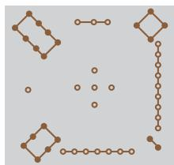

natural_image

Abstract geometric pattern composed of interconnected nodes and lines on a light gray background (no text or symbols)

图1

<table><tr><td>8</td><td>3</td><td>4</td></tr><tr><td>1</td><td>5</td><td>9</td></tr><tr><td>6</td><td>7</td><td>2</td></tr></table>

图2

<table><tr><td></td><td></td><td></td></tr><tr><td></td><td></td><td></td></tr><tr><td></td><td></td><td></td></tr></table>

图3

请将-4，-3，-2，-1，0，1，2，3，4这9个数分别填入图3的幻方的9个空格中，使处于每一横行、每一竖列以及两条斜对角线上的数的和都相等.

与同学交流一下，你们填这个幻方的方法相同吗？

## 小结

### 一、本章知识结构图

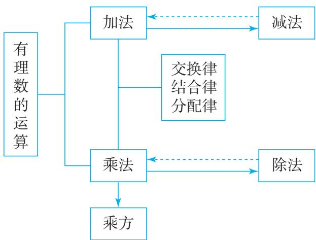

flowchart

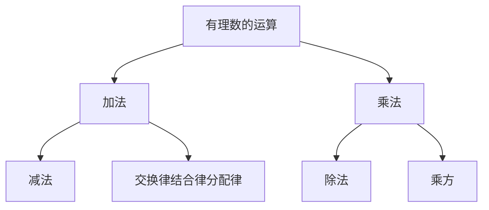

### 二、回顾与思考

在把数的范围从非负有理数（正有理数、0统称非负有理数）扩大到有理数后，本章我们研究了有理数的运算，把非负有理数的加法、乘法推广到有理数范围内，还研究了有理数的加法、乘法的逆运算——减法、除法，从而将非负有理数系扩充成有理数系。从中你可以初步认识数系的扩充过程，体会运算的一致性。

在研究有理数的运算时，一般要考虑两个方面：一是数是正数、负数还是0；二是数的绝对值。实际上，与负数有关的运算，我们都借助绝对值，将它们转化为正数之间的运算。数轴不仅能直观表示数，而且能帮助我们理解数的运算，这可以进一步培养我们运用图形直观描述和分析问题的意识和习惯。在运算的过程中，数形结合、转化是很重要的思想方法。

在有理数系中，有理数的和、差、积、商（除数不为0）仍然是有理数．有理数的四则运算法则可以表示为如下形式：
(1) $\frac{m}{n} \pm \frac{p}{q} = \frac{mq \pm np}{nq}$ ;
(2) $\frac{m}{n} \times \frac{p}{q} = \frac{mp}{nq}$ ;
(3) $\frac{m}{n} \div \frac{p}{q} = \frac{mq}{np} (p \neq 0)$ .

其中，m，n，p，q 均为整数，n，q 均不为 0.

我们从具体数的加法和乘法运算中，归纳出了交换律、结合律和分配律等运算律。运算律不仅能给数的运算带来方便，而且还是今后研究代数问题（如解方程、不等式等）的基础。在后续学习中，你将会进一步体会到运算律的作用。有理数运算的学习，可以进一步提升我们根据运算法则和运算律进行运算的能力，并促进数学推理能力的发展。

请你带着下面的问题，复习一下全章的内容吧.

1. 举例说明如何借助绝对值，把与负数有关的运算转化为正数之间的运算.   
2. 数轴可以帮助我们直观理解有理数的加法、减法运算，请举例说明.  
3. 数系的扩充给数的运算带来了新的变化。例如，对于减法，在引进负数之前，被减数不能小于减数，而在有理数范围内，任意两个有理数总能进行减法运算。对于有理数的除法，你有什么体会？  
4. 有理数的加法与减法、乘法与除法各有什么关系？有理数的混合运算都能转化为加法与乘法运算吗？  
5. 有理数有哪些运算律？结合例子说明运算律在有理数运算中的作用。  
6. 什么是有理数的乘方？对于有理数的混合运算，应按什么顺序进行？  
7. 学习了有理数的运算，可以进一步认识有理数。谈谈你对有理数就是形如 $\frac{p}{q}$ （ $p, q$ 为整数， $q \neq 0$ ）的数的理解。  
8. 联系第一章有理数的学习，请你梳理从非负有理数系扩充到有理数系的过程，并谈谈对数系扩充的认识.

# 复习题 2

### 复习巩固

#### 1. 计算：
(1) $-150 + 250$ ;
(2) $-15 + (-23)$ ;
(3) -5-65;
(4) -26-(-15);
(5) $(-6)\times (-16)$ ;
(6) $\left(-\frac{1}{3}\right) \times 27$ ;
(7) $8 \div (-16)$ ;
(8) $(-25) \div \left(-\frac{2}{3}\right)$ ;
(9) $\left(-\frac{3}{4}\right)\div\left(-\frac{4}{5}\right).$

#### 2. 计算：
(1) $6 + \left(-\frac{1}{5}\right) - 2 - (-1.5)$ ;   
(2) $(-0.02) \times (-20) \times (-5) \times 4.5$ ;   
(3) $(-6.5) \times (-2) \div \left(-\frac{1}{3}\right) \div (-5)$ ;   
(4) $(-66)\times 4 - (-2.5)\div (-0.1)$ ;   
(5) $(-2)^{2} \times 5 - (-2)^{3} \div 4$ ;   
(6) $-(3 - 5) + 3^2 \times (1 - 3)$ .

3. 互为相反数的两个数的和是多少？互为倒数的两个数的积是多少？

4. 用科学记数法表示下列各数：
(1) 100 000 000;
(2) 4 500 000;
(3) 692 400 000 000.

5. 用四舍五入法对下列各数取近似数：
(1) 245.635 (精确到 0.1);
(2) 175.65 (精确到个位);
(3) 12.004 (精确到百分位);
(4) 6.5378 (精确到0.01).

#### 6. 计算：
(1) $-2 - |-3|$ ;
(2) $\left|-2-(-3)\right|$ .

### 综合运用

7. 红、黄、蓝三支足球队进行比赛，比赛结果是：红队胜黄队，比分为4∶2；蓝队胜黄队，比分为3∶1；红队负蓝队，比分为2∶3．如果进球数记为正，失球数记为负，那么三队的净胜球数各是多少？

8. 下列各数是十名学生的数学检测成绩：

82, 83, 78, 66, 95, 75, 61, 93, 82, 81.

先估算他们的平均成绩，然后在此基础上计算平均成绩，由此检验你的估值能力.

9. 某文具店在一星期的销售中，盈亏情况如下表所示（记盈利为正，单位：元）.

<table><tr><td>星期一</td><td>星期二</td><td>星期三</td><td>星期四</td><td>星期五</td><td>星期六</td><td>星期日</td><td>合计</td></tr><tr><td>-27.8</td><td>-70.3</td><td>200</td><td>138.1</td><td>-8</td><td></td><td>188</td><td>458</td></tr></table>

表中星期六的盈亏数被墨水涂污了，请你算出星期六的盈亏数，并说明星期六是盈利还是亏损，金额是多少.

10. 巡道员沿一条东西向的铁路进行巡视维护，从驻地出发先向东走了 7 km，又向东走了 3 km，然后折返向西走了 11.5 km，此时他在驻地的什么方向？与驻地的距离是多少千米？  
11. 在 0～40 ℃ 范围内，当温度每上升 1 ℃ 时，某种金属丝约伸长 0.002 mm；反之，当温度每下降 1 ℃ 时，金属丝约缩短 0.002 mm。把 20 ℃ 的这种金属丝加热到 30 ℃，再使它冷却降温到 5 ℃，金属丝的长度经历了怎样的变化？最后的长度比原长度约伸长多少毫米？  
12. 一年之中地球与太阳之间的距离随时间而变化，1个天文单位是地球与太阳之间的平均距离，约为1.496亿千米。试用科学记数法表示1个天文单位是多少千米。

### 拓广探索

13. 结合具体的数的运算，通过特例进行归纳，然后比较下列数的大小：
（1）小于1的正数 $a, a$ 的平方， $a$ 的立方；  
(2) 大于 -1 的负数 b, b 的平方，b 的立方.

14. 结合具体的数，通过特例进行归纳，然后判断下列说法是否正确。如果认为正确，请说明理由；如果认为错误，请举出反例。
(1) 任何数都不等于它的相反数；  
(2) 互为相反数的两个数的同一正偶数次幂相等;   
(3) 如果 a 大于 b，那么 a 的倒数小于 b 的倒数.

15. 用计算器计算下列各式，将结果写在横线上：
$1 \times 1 = \quad ; \quad 1 1 \times 1 1 = \quad ;$
$1 1 1 \times 1 1 1 = \underline {{{\quad}}}; \quad 1 1 1 1 \times 1 1 1 1 = \underline {{{\quad}}}.$
(1) 你发现了什么?  
(2) 不用计算器，你能直接写出 $111\ 111\ 111 \times 111\ 111\ 111$ 的结果吗？

# 综合与实践

# 进位制的认识与探究

你还记得自己最早学习加法时的情景吗？是不是把双手一伸，掰着手指计算的？手指是世界上最古老的“计算器”，这种掰手指算数的方式，与目前使用最广泛的“十进制记数法”密切相关。而计算机使用的“二进制记数法”，同样具有划时代的意义。

natural_image

Abstract digital illustration of multiple laptops with binary code radiating from a central point (no text or symbols)

两种不同进位制的意义分别是什么？为什么会有不同的进位制？不同进位制的数之间能否互相转换？如何转换？二进制数之间能否进行运算？如何运算？是否还有其他进位制？让我们带着这些问题一起来探究进位制.

# 活动目标

认识进位制，理解不同进位制的数之间的转换以及进制数的加法运算，挖掘古代灿烂文明和现代科学技术的联系.

# 活动准备

查阅相关资料，初步了解二进制；查找第十四届国际数学教育大会（ICME-14）标识及其介绍.

# 活动任务

# 活动一 认识进位制，探究不同进位制的数之间的转换

进位制是人们为了记数和运算方便而约定的记数系统。约定逢十进一就是十进制，逢二进一就是二进制。也就是说，“逢几进一”就是几进制，几进制的基数就是几。

在日常生活中，我们最熟悉、最常用的是十进制。使用 $0 \sim 9$ 十个数字记数时，几个数字排成一行，从右起，第一位是个位，个位上的数字是几就表示几个一；第二位是十位，十位上的数字是几就表示几个十；接着依次是百位、千位……。例如，十进制数3721中的3表示3个千，7表示7个百，2表示2个十，1 表示 1 个一，于是我们得到下面的式子：
$3 7 2 1 = 3 \times 1 0 ^ {3} + 7 \times 1 0 ^ {2} + 2 \times 1 0 ^ {1} + 1 \times 1 0 ^ {0}.$

可见，一个数可以表示成各数位上的数字与基数的幂的乘积之和的形式.

规定当 $a \neq 0$ 时， $a^0 = 1$ .

任务 1 二进制是逢二进一，其各数位上的数字为 0 或 1. 请把二进制数 1011 表示成各数位上的数字与基数的幂的乘积之和的形式，从而转换成十进制数.

说明：为了区分不同的进位制，常在数的右下角标明基数，例如， $(1011)_2$ 就是二进制数1011的简单写法。十进制数一般不标注基数。

任务 2 把 89 转换为二进制数和八进制数.

提示：转换为二进制数时，把89表示成0或1与基数2的幂的乘积之和的形式；转换为八进制数时，把89表示成0，1，2，3，4，5，6或7与基数8的幂的乘积之和的形式.

任务 3 通过研究二进制数及十进制数之间的转换，你有哪些发现？进一步地，你能进行其他不同进制数之间的转换吗？

# 活动二 探究进制数的加法运算

二进制只用0和1两个数字，这正好与电路的断和通两种状态相对应，因此计算机内部都使用二进制。计算机在进行数（十进制）的运算时，先把接收到的数转换为二进制数进行运算，再把运算结果转换为十进制数，并输出结果。

任务 1 查阅资料，分析计算机运算选择二进制的原因，从多个角度分析选择二进制的优越性.

任务 2 小组合作，研究二进制数的加法运算法则，并填写表 1 中的活动记录单.

表 1 活动记录单

<table><tr><td>加数</td><td>0</td><td>0</td><td>1</td><td>1</td></tr><tr><td>加数</td><td>0</td><td>1</td><td>0</td><td>1</td></tr><tr><td>和</td><td></td><td></td><td></td><td></td></tr></table>
（1）根据上面的加法运算法则，计算 $(10010)_2 + (111)_2$ ，并交流一下计算方法.  
(2) ① 计算 $45+23$ ;   
② 把 45，23 分别转换为二进制数，利用二进制数的加法运算法则计算它们的和，再把和转换为十进制数；  
③ 比较①②的计算结果是否相同.

任务 3 计算机的存储容量是指存储器能存放二进制代码的总位数，用于计量存储容量的基本单位是字节（byte）。请研究手机、计算机等电子存储设备的容量以及它们存储的一些电子文件的大小，它们通常以什么单位表示？这些单位之间有什么关系？

任务 4 古人在研究天文、历法时，也曾经采用七进制、十二进制、六十进制记数法. 至今，我们仍然使用一星期 7 天、一年 12 个月、一小时 60 分钟的记时方法. 结合角度、时间等实际问题，分小组讨论一下六十进制数的加法运算法则.

# 活动三 任选下列主题之一进行研究

1. 国际数学教育大会是全球数学教育界水平最高、规模最大的学术盛会，每四年一届。ICME-14于2021年在上海举办，这是国际数学教育大会第一次在中国举办。大会标识（图1）中蕴含着很多数学文化元素，以中国传统文化中“洛书”与“河图”为原本，并将其与我国古老的八卦进行了融合，体现了我国传统文化的博大精深。其中八卦符号（图2）可以用于记数，请探究这个符号所表示的数，互相交流各自的计算方法。

text_image

ICME-14

图1

natural_image

Abstract pattern of black horizontal bars and a red rectangular block (no text or symbols)

图2

提示：八卦中——称为阳爻，——称为阴爻，每卦均由三个阳爻或阴爻组成。把八卦符号看作表示二进制数时，阳爻对应数字1，阴爻对应数字0，这样，图2中从左起第一组符号表示的二进制数为 $(011)_{2}$ 。

大会标识中的记数符号由四个二进制数组成，将它们分别转换为八进制数得到一个四位数；将这个四位数看作一个八进制数，再将这个八进制数转换为十进制数.

2. 除了十进制、二进制、八进制等记数法，日常生活中还经常使用其他进位制，如十二进制、六十进制等。结合上述学习，写一篇与进位制有关的文章，包括进位制的意义及其运算，不同进位制的特点、适用范围及互相转换等。

# 活动过程

#### 1. 组建合作团队

本次综合与实践活动需要团队协作。在班级中组成 5～8 人一组的研究小组，每位同学参加其中一个小组，每个小组确定一名负责人。

#### 2. 方案构思

小组成员进行充分的讨论与交流，集思广益，形成解决上述任务的方案.

#### 3. 方案实施

按照小组设计的方案进行任务分工，使每位成员都有明确的任务。根据规划的研究步骤实施，完成活动任务，形成研究报告。

#### 4. 展示交流

制作向全班汇报的演示文稿，选出代表向全班同学展示本组的研究成果，分享实践过程中的活动经验、遇到的困难及其解决方法，反思活动中的不足.

# 活动评价

通过成果展示与交流，基于各组完成的研究报告，根据情况选择任务完成表、表现评分表、自我反思表等进行评价。与老师和全班同学一起，通过质疑、辩论、评价，总结成果，分享体会，分析不足，开展自我评价、同学评价和教师评价，完成本次综合与实践活动。

# 附：综合与实践活动研究报告的参考形式

报告主题：

\_\_\_\_年级\_\_\_\_班\_\_\_\_组 报告时间：\_\_\_\_

<table><tr><td>1. 活动名称</td></tr><tr><td>2. 研究小组成员与分工</td></tr><tr><td>3. 选题的意义</td></tr><tr><td>4. 研究方案</td></tr><tr><td>5. 研究过程</td></tr><tr><td>6. 研究成果</td></tr><tr><td>7. 收获与体会</td></tr><tr><td>8. 对此研究报告的评价(由评价小组或教师填写)</td></tr></table>

# 第三章 代数式

在小学，我们学过用字母表示数，知道可以用字母或含有字母的式子表示数和数量关系，这样的式子在数学中有重要作用，并在解决实际问题中有着广泛的应用。看下面的问题。

智能机器人的广泛应用是智慧农业的发展趋势之一。某品牌苹果采摘机器人平均每秒可以完成 $5\mathrm{m}^2$ 范围内苹果的识别，并自动对成熟的苹果进行采摘，它的一个机械手平均8s可以采摘一个苹果。根据这些数据回答下列问题：
(1) 该机器人 $10 \mathrm{~s}$ 能识别多大范围内的苹果？ $60 \mathrm{~s}$ 呢？ $t \mathrm{~s}$ 呢？  
(2) 该机器人识别 $n \mathrm{~m}^{2}$ 范围内的苹果需要多少秒?  
（3）若该机器人搭载了 m 个机械手 $(m>1)$ ，它与采摘工人同时工作 1 h，已知工人平均 5 s 可以采摘一个苹果，则机器人可比工人多采摘多少个苹果？

回答上面的问题，要用到含有字母的式子，即本章将要研究的代数式。通过对本章的学习，你将进一步体会到代数式可以简明地表示数量和数量关系，为后续学习方程、不等式、函数等打下基础。

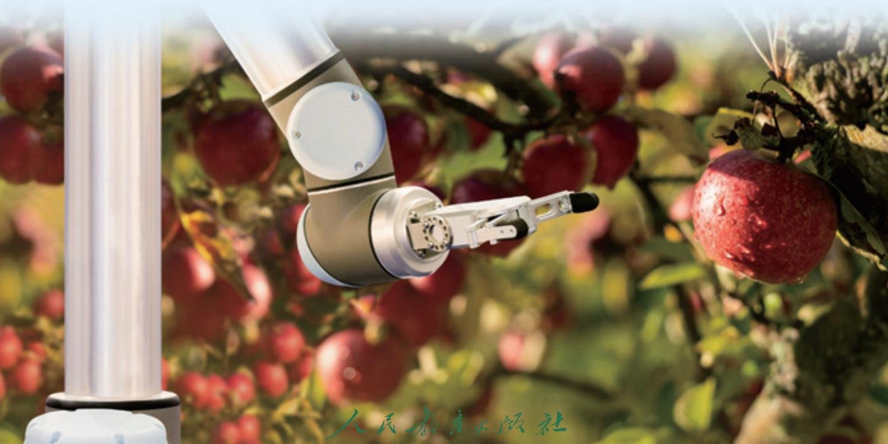

text_image

人民教育出版社

## 3.1 列代数式表示数量关系

实际问题中包含着一些数量和数量关系，可以用数学式子简明地表达.

先来看本章引言中的问题，其中包含三个量：工作量、工作效率和工作时间，它们之间的关系为
$\text { 工   作   量 } = \text { 工   作   效   率 } \times \text { 工   作   时   间 }.$

对于问题（1），该机器人 10 s 能识别的范围（单位： $m^{2}$ ）是
$5 \times 1 0 = 5 0;$

60 s 能识别的范围（单位： $m^{2}$ ）是
$5 \times 6 0 = 3 0 0;$

t s 能识别的范围（单位： $m^{2}$ ）是
$5 \times t = 5 t.$

观察上面的式子，可以看出 $5 \times 10$ ， $5 \times 60$ 表示机器人在两个具体时间内完成的工作量，含有字在含有字母的式子中如果出现乘号，通常将数放在字母前，乘号写作“·”或省略不写。例如， $5 \times t$ 可以写成 $5 \cdot t$ 或 $5t$ 。

母 $t$ 的式子 $5t$ 表示机器人在任意时间 $t$ 内完成的工作量。用字母代替数使我们的表达从一个具体问题推广到一类问题，更具有一般性。

对于问题（2），该机器人识别 $n\mathrm{m}^2$ 范围内的苹果需要的时间是 $\frac{n}{5}$ s.

对于问题（3），

机器人多采摘的苹果个数

=机器人采摘的苹果个数-工人采摘的苹果个数

=一个机械手的采摘效率×工作时间×机械手的个数-工人的采摘效率×工作时间
$= \frac {1}{8} \times 3 6 0 0 \times m - \frac {1}{5} \times 3 6 0 0$
$= 4 5 0 m - 7 2 0.$

下面，再来看两个用含有字母的式子表示数量和数量关系的问题.
(1) 某工程队负责铺设一条长 $2 \mathrm{~km}$ 的地下管道, 经过 $d$ 天完成, 用式子

表示这支工程队平均每天铺设的管道长度.
(2) 一个正方形的边长是 $a$ ，这个正方形的周长 $l$ 是多少？面积 $S$ 呢？

对于问题（1），平均每天铺设的管道长度 $=$ 铺设的管道总长度 $\div$ 工作天数。因此，这支工程队平均每天铺设的管道长度是 $\frac{2}{d} \mathrm{~km}$ 。

对于问题（2），由正方形的周长及面积公式，可得周长 l=4a，面积 $S=a^{2}$ .

上述问题中列出的式子 5t， $\frac{n}{5}$ ，450m-720， $\frac{2}{d}$ ，4a， $a^{2}$ ，它们都是用运算符号把数或表示数的字母连接起来的式子，我们称这样的式子为代数式(algebraic expression).

相同字母相乘，可以写成幂的形式，例如， $a \cdot a$ 写成 $a^{2}$ .

这里的运算包括加、减、乘、除、乘方、开方．开方将在以后学习．

单独的一个数或字母也是代数式，例如，5，t都是代数式.

> [!example]- 例 1 （1）苹果原价是 p 元/kg，现在按九折优惠出售，用代数式表示苹果的售价；
(2) 一个长方形的长是 $0.9 \mathrm{~m}$ , 宽是 $p \mathrm{~m}$ , 用代数式表示这个长方形的面积;  
（3）某产品前年的产量是 n 件，去年的产量比前年产量的 2 倍少 10 件，用代数式表示去年的产量；  
（4）一个长方体水池底面的长和宽都是 $a \mathrm{~m}$ ，高是 $h \mathrm{~m}$ ，池内水的体积占水池容积的三分之一，用代数式表示池内水的体积。
解：（1）苹果的售价是0.9p元/kg；
(2) 这个长方形的面积是 $0.9p \, m^{2}$ ;  
（3）去年的产量是 $(2n-10)$ 件；  
（4）由长方体的体积 $=$ 长 $\times$ 宽 $\times$ 高，得这个长方体水池的容积是 $a \cdot a \cdot h \mathrm{~m}^{3}$ ，即 $a^{2}h \mathrm{~m}^{3}$ ，故池内水的体积为 $\frac{1}{3} a^{2}h \mathrm{~m}^{3}$ .

用字母表示数后，同一个代数式可以表示不同实际问题中的数量或数量关系。例如，在例1第（1）（2）题中，0.9p既可以表示苹果的售价，也可以表示长方形的面积。你能再举出一个例子吗？

> [!example]- 例 2 说出下列代数式的意义:
(1) $2a + 3$ ;
(2) $2(a+3)$ ;
(3) $\frac{c}{ab};$
(4) $x^{2} + 2x + 8.$
解：（1） $2a+3$ 的意义是 a 的 2 倍与 3 的和；
(2) $2(a+3)$ 的意义是a与3的和的2倍；
(3) $\frac{c}{ab}$ 的意义是 $c$ 除以 $a, b$ 的积的商；
(4) $x^{2} + 2x + 8$ 的意义是 $x$ 的平方、 $x$ 的2倍与8的和.

举例说明 $2a+3$ , $2(a+3)$ 所表示的实际问题中的数量关系.

#### 练习

1. 填空题.
（1）每包书有 10 册，6 包书有 \_\_\_\_ 册，n 包书有 \_\_\_\_ 册；  
(2) 王芳今年 m 岁，她去年 \_\_\_\_ 岁，6 年后 \_\_\_\_ 岁；  
（3）将 $p\mathrm{kg}$ 糖装入 $n$ 个包装袋中，每袋糖的质量相同，每袋装入糖 $\underline{\quad}\mathrm{kg}$   
(4) 棱长为 a 的正方体的体积是 \_\_\_\_.

2. 说出下列代数式的意义：
(1) $2a + 3c$ ;
(2) $3(m - n)$ ;
(3) $a^2 + 1$ ;
(4) $\frac{3a}{5b}.$

3. 代数式 $100 - 2x$ 可以表示不同实际问题中的数量或数量关系，请举例说明.

在解决一些数学问题与实际问题时，往往需要先把问题中的数量关系用含有数、字母和运算符号的式子表示出来，也就是要列代数式.

> [!think] 思考
如何用代数式表示 a, b 两数的和与差的积?

可以按下面的步骤列代数式：

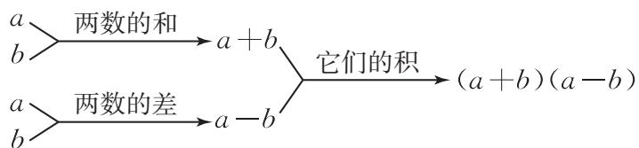

flowchart

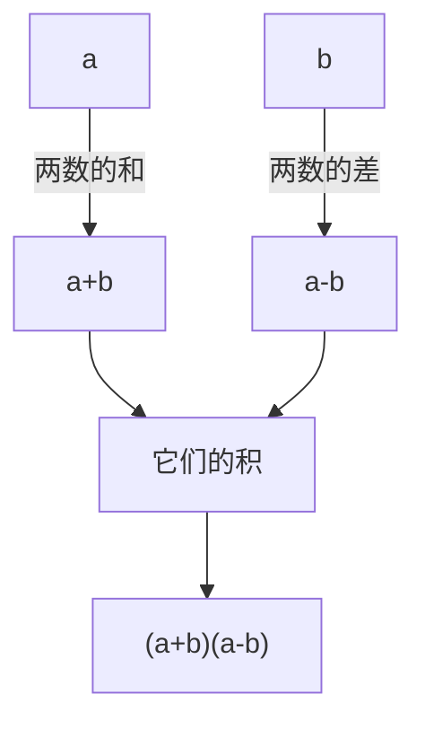

在本套书中，如无特别说明，a，b两数的差，a与b的差，都指“a-b”.
所以 a, b 两数的和与差的积为 $(a+b)(a-b)$ .

> [!example]- 例 3 用代数式表示:
（1）购买 2 个单价为 a 元的面包和 3 瓶单价为 b 元的饮料所需的钱数.  
（2）把 $a$ 元钱存入银行，存期3年，年利率为 $2.75\%$ ，到期时的利息是多少元？  
（3）某商品的进价为 $x$ 元，先按进价的1.1倍标价，后又降价80元出售，现在的售价是多少元？
分析：（1）总钱数 $= 2$ 个面包的总价 $+3$ 瓶饮料的总价；（2）利息 $=$ 本金 $\times$ 年利率 $\times$ 存期；（3）现在的售价 $=$ 原来的标价一降价数.
解：（1）购买 2 个单价为 a 元的面包和 3 瓶单价为 b 元的饮料所需的钱数为 $(2a + 3b)$ 元.
（2）根据题意，得 $a \times 2.75\% \times 3 = 8.25\% a$ ，因此到期时的利息为 $8.25\% a$ 元.
（3）现在的售价为（1.1x-80）元.

> [!example]- 例 4 甲、乙两地之间公路全长 240 km，汽车从甲地开往乙地，行驶速度为 v km/h.
(1) 汽车从甲地到乙地需要行驶多少小时?  
(2) 如果汽车的行驶速度增加 $3 \mathrm{~km} / \mathrm{h}$ , 那么汽车从甲地到乙地需要行驶多少小时? 汽车加快速度后可以早到多少小时?
分析：本题包含路程、速度和时间三个量，它们之间具有关系：时间 $=$ 路程/速度．另外，早到的时间 $=$ 原来需要行驶的时间一加快速度后需要行驶的时间.
解：（1）汽车从甲地到乙地需要行驶 $\frac{240}{v}$ h.
（2）如果汽车的行驶速度增加 $3\mathrm{km / h}$ ，那么汽车从甲地到乙地需要行驶 $\frac{240}{v + 3}\mathrm{h}$ 汽车加快速度后可以早到 $\left(\frac{240}{v} -\frac{240}{v + 3}\right)\mathrm{h}.$

从上面的例子可以看出，用字母表示数，字母可以和数一样参与运算，从而可以用代数式把数量或数量关系简明地表示出来，更具有一般性.

#### 练习

1. 用代数式表示:
(1) 比 a 的 2 倍大 1 的数;  
(2) a 的相反数与 b 的一半的差;  
(3) a 的平方除以 b 的商.

2. 某种商品每袋 4.8 元，一个月内销售了 m 袋。用代数式表示这个月内销售这种商品的收入。  
3. 有两块棉田，一块面积为 $m \mathrm{hm}^2$ （公顷， $1 \mathrm{hm}^2 = 10^4 \mathrm{~m}^2$ ），平均每公顷产棉花 $a \mathrm{kg}$ ；另一块面积为 $n \mathrm{hm}^2$ ，平均每公顷产棉花 $b \mathrm{kg}$ 。用代数式表示两块棉田的棉花总产量。  
4. 在一个大正方形铁皮中挖去一个小正方形铁皮，大正方形的边长是 $a \mathrm{~mm}$ ，小正方形的边长是 $b \mathrm{~mm}$ 。用代数式表示剩余铁皮的面积。

再来看本章引言中的问题（1）。机器人 $t$ s 能识别的范围是 $5t \mathrm{~m}^2$ ，也就是说，机器人能识别的范围与所用时间的比值总是一定的（等于 5）。因此机器人能识别的范围与所用时间是成正比例的量，它们成正比例关系。

一般地，对于工程问题，当工作效率保持不变，工作量与工作时间是成正比例的量，它们成正比例关系。下面我们来讨论，如果工作量保持不变，工作时间与工作效率之间的关系。先看一个实际问题。

问题 北京是全球首个既举办过夏季奥运会又举办过冬季奥运会的城市. 在冬季奥运会前, 某赛场计划造雪 $260000 \mathrm{~m}^{3}$ . 解答下列问题:
（1）根据每天造雪量，计算所需的造雪天数，填写表3.1-1.

表3.1-1

<table><tr><td>每天造雪量/ $m^{3}$ </td><td>5 000</td><td>5 200</td><td>6 500</td><td>...</td></tr><tr><td>造雪天数</td><td></td><td></td><td></td><td>...</td></tr></table>
（2）每天造雪量和造雪天数这两个量是怎样变化的？它们之间有什么关系？

此问题包含三个量：造雪总量、每天造雪量和造雪天数，根据它们之间的关系
$\mathrm{造雪天数} = \frac {\mathrm{造雪总量}}{\mathrm{每天造雪量}},$

每天造雪量为 $5\ 000\ m^{3}$ 时，造雪天数为 $\frac{260\ 000}{5\ 000}=52$ ；每天造雪量为 $5\ 200\ m^{3}$ 时，造雪天数为 $\frac{260\ 000}{5\ 200}=50$ ；每天造雪量为 $6\ 500\ m^{3}$ 时，造雪天数为 $\frac{260\ 000}{6\ 500}=40$ 。因此，表 3.1-1 中依次填 52，50，40。

可以发现，造雪天数随着每天造雪量的变大而变小，而且造雪天数与每天造雪量的乘积一定，总是260 000。例如， $5\ 000 \times 52 = 5\ 200 \times 50 = 6\ 500 \times 40 = 260\ 000$ 。

像这样，两个相关联的量，一个量变化，另一个量也随着变化，且这两个量的乘积一定，这两个量就叫作成反比例的量，它们之间的关系叫作反比例关系.
如果用字母 $x$ 和 $y$ 表示两个相关联的量，用 $k$ 表示它们的积（ $k$ 是一个确定的值，且 $k \neq 0$ ），反比例关系可以用 $xy = k$ 来表示.

> [!example]- 例5 如图3.1-1，四个圆柱形容器内部的底面积分别为 $10\mathrm{cm}^2$ ， $20~\mathrm{cm}^2$ ， $30~\mathrm{cm}^2$ ， $60~\mathrm{cm}^2$ 。分别往这四个容器中注入 $300~\mathrm{cm}^3$ 的水。
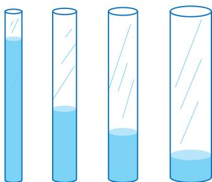

natural_image

Four test tubes with varying liquid levels, no text or symbols present

图3.1-1
(1) 四个容器中水的高度分别是多少厘米?   
（2）分别用 x （单位： $cm^{2}$ ）和 y （单位：cm）表示容器内部的底面积与水的高度，用式子表示 y 与 x 的关系，y 与 x 成什么比例关系？
分析：题中涉及圆柱的体积、底面积及高三个量，它们之间具有关系：圆柱的体积=底面积×高，高= $\frac{圆柱的体积}{底面积}$ .
解：（1）四个容器中水的高度分别为
$\frac {3 0 0}{1 0} = 3 0 (\mathrm{cm}), \frac {3 0 0}{2 0} = 1 5 (\mathrm{cm}), \frac {3 0 0}{3 0} = 1 0 (\mathrm{cm}), \frac {3 0 0}{6 0} = 5 (\mathrm{cm}).$
(2) $xy = 300$ . $y$ 与 $x$ 成反比例关系.

> [!think] 思考
生活中，成反比例关系的例子是很常见的。例如，在购买某种物品时，总价一定，购物的数量与商品的单价成反比例关系。你还能举出一些例子吗？

#### 练习

1. 如果汽车行驶的路程一定，那么汽车行驶的平均速度与时间是否成反比例关系？为什么？
2. 判断下面各题中的两个量是否成反比例关系，并说明理由：
(1) 一批水果质量一定, 按每箱质量相等的规定分装, 装箱数与每箱的质量;   
(2) 长方体的体积一定，长方体的底面积与高；  
（3）购买荧光笔和中性笔的总费用一定，荧光笔的费用与中性笔的费用.

3. 某运输公司计划运输一批货物，每天运输的吨数与运输的天数之间的关系如下表所示.

<table><tr><td>每天运输的吨数</td><td>500</td><td>250</td><td>100</td><td>50</td><td>...</td></tr><tr><td>运输的天数</td><td>1</td><td>2</td><td>5</td><td>10</td><td>...</td></tr></table>
(1) 这批货物共有多少吨?  
(2) 运输的天数是怎样随着每天运输的吨数的变化而变化的?   
(3) 用 $t$ 表示运输的天数, 用 $a$ 表示每天运输的吨数, 用式子表示 $t$ 与 $a$ 的关系. $t$ 与 $a$ 成什么比例关系?

# 习题 3.1

### 复习巩固

1. 用代数式表示:
(1) m 的 2 倍;  
(2) $n$ 的 $\frac{2}{3}$ ;  
(3) 比 x 的 2 倍少 1 的数;  
(4) a 的立方除以 b 的商.

#### 2. 说出下列代数式的意义：
(1) $3x+6;$
(2) $5(m-2)$ ;
(3) $a^2 + b^2$ ;
(4) $\frac{n+1}{n-1}.$

#### 3. 用代数式表示:
(1) 棱长为 a 的正方体的表面积.  
(2) 位于江苏省常州市金坛区的华罗庚纪念馆目前累计接待中外参观者 $a$ 万人，预计今后每年平均接待参观者 $b$ 万人， $c$ 年后累计接待的总人数为多少万人？

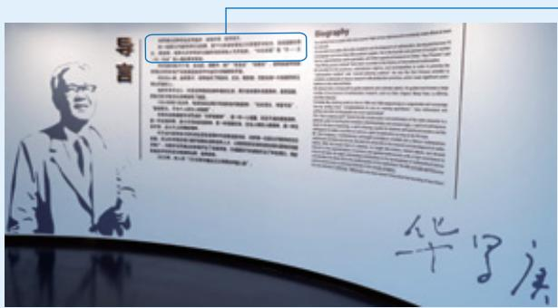

text_image

导言
Geography
华学法

华罗庚从初中毕业文凭起步，自强不息，自学成才.

他一生致力于数学研究与发展，留下10多部专著和200多篇学术论文，是我国解析数论、典型群、矩阵几何学等多方面研究的创始人与开拓者。“华氏定理”和“华－王（元）方法”载入国际数学史册.
（3）设某银行一年定期存款的利率是 $1.5\%$ ，存入 $a$ 元钱，一年后得到的利息是多少元？本息和（存入的钱与利息的和）是多少元？  
(4) 甲、乙两地相距 $s \mathrm{~km}$ . 李明原计划骑车从甲地到乙地, 需用时 $t \mathrm{~h}$ ; 后因天气原因, 改乘公交车前往, 结果提前 $1 \mathrm{~h}$ 到达乙地. 公交车的速度是多少?

#### 4. 判断下列各题中的两个量是否成反比例关系，并说明理由：
（1）200 名同学参加队列操表演，按每排人数相等的规定排列，每排的人数与排数；  
(2) 三角形的面积是 $6 \mathrm{~cm}^{2}$ , 它的一条边的长与这条边上的高;  
（3）张华每小时可以制作 120 朵小红花，她制作的小红花朵数与制作时间.

#### 5. 糖果厂生产一批水果糖，如果把这些水果糖平均分装在若干袋子里，每袋装的颗数和总袋数如下表所示.

<table><tr><td>每袋装的颗数</td><td>10</td><td>12</td><td>18</td><td>20</td><td>24</td><td>...</td></tr><tr><td>总袋数</td><td>360</td><td>300</td><td>200</td><td>180</td><td>150</td><td>...</td></tr></table>
(1) 这批水果糖共有多少颗?  
(2) 总袋数是怎样随着每袋装的颗数的变化而变化的?
（3）用 $n$ 表示总袋数， $m$ 表示每袋装的颗数，用式子表示 $n$ 与 $m$ 的关系。 $n$ 与 $m$ 成什么比例关系？

### 综合运用

6.（1）如图，一个手工串珠作品由5颗红色珠子与5颗黑色珠子串成，红色珠子每颗a元，黑色珠子每颗b元，购买这些珠子共花费\_\_\_\_元.
(2) 甲、乙两车间生产同一种化工产品，甲车间每天生产 $a \mathrm{t}$ ，乙车间每天生产 $b \mathrm{t}$ 。两车间各生产5天，一共生产 \_\_\_\_ t 化工产品。

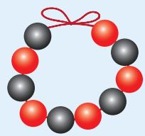

natural_image

Circular arrangement of alternating red and black spheres with a red bow (no text or symbols)

(第6（1）题)

观察你所列的代数式，再举出一个用它表示数量或数量关系的例子.

7. 说出下列各组代数式的意义有什么不同，并举例说明它们表示的实际问题中的数量关系：
(1) 2m-1 与 $2(m-1)$ ;
(2) $\frac{1}{2} a$ 与 $\frac{1}{2} + a$ .

8. 观察一组数：5，10，15，20，25，…
（1）你认为这组数有可能是按什么规律排列的？用文字描述这组数可能的排列规律.  
(2) 根据 (1) 中的规律, 用代数式表示第 $n$ 个数.

9. 甲、乙、丙 3 名同学阅读同一本书，丙的阅读时间最长.
(1) 甲读完这本书用了 14 天, 每天读 18 页. 乙读完这本书用了 21 天, 每天读多少页? 丙读完这本书用了 $x$ 天, 每天读多少页? 他们读的天数和每天读的页数之间有什么关系?  
(2) 两星期内，按照这样的速度阅读 $t$ 天，他们各读了多少页？还剩多少页？已读的页数和剩下的页数成反比例关系吗？为什么？

### 拓广探索

10.（1）设 $n$ 表示任意一个整数，用含 $n$ 的代数式表示任意一个偶数及任意一个奇数；  
(2) 一个三位数的个位上的数字为 $a$ ，十位上的数字为 $b$ ，百位上的数字为 $c$ ，用含 $a, b, c$ 的代数式表示这个三位数.

11. 3 支球队进行单循环比赛（每两队之间都比赛一场），总的比赛场数是多少？

4 支球队呢？5 支球队呢？n 支球队呢？

## 阅读与思考

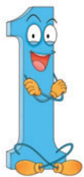

natural_image

Cartoon illustration of a blue number 1 character with a smiling face and limbs (no text or symbols)

# 数字 1 与字母 X 的对话

1: 数学的产生从数开始，数是数学世界的主人.

X: 我是字母，我虽然不是具体的数，但是我可以表示各种各样的数，可以代表你 1，也可以代表其他数.

1：由我们数组成的式子有确切的大小．例如，人们一见到 $1+2$ 就知道是1与2的和，即3．你们字母能做到吗？

X: 含有我们字母的式子进行运算和推理时具有一般性. 例如, $x + y$ 可以表示任何两个数的和, 包括 $1 + 2$ ; $x + y = y + x$ 能表示任何两个数相加时都可以交换顺序, 即加法满足交换律.

1: 人们解决实际问题时, 需要根据已知的具体的数进行计算, 进而求得结果. 字母能发挥什么作用呢?

X: 在解决实际问题时，用字母表示未知数，把字母列入算式（方程），能更方便地表示数量关系．数和字母一起运算使问题的解法更简单.

1: 人们经过长期实践创造出了数，并建立了专门研究数及其运算的数学分支——算术。有专门研究字母的数学分支吗？

X: 随着实践的发展，人们发现只有算术还不够，用字母表示数会起到更大的作用，于是产生了代数这一数学分支。它首先研究的就是用字母表示的式子的运算法则和方程的解法。从算术发展到代数是数学的一大进步。

1: 算术几乎是伴随着人类社会活动的产生和发展而逐渐形成的，它有着非常悠久的历史，代数有怎样的历史呢？

X: 代数的历史可以追溯到约 3800 年前的古埃及和古巴比伦时期，那时就有代数思想的萌芽。中国的《九章算术》中的“方程”是古典代数学研究的核

心内容．3世纪，代数在希腊获得显著的发展，其代表人物是被誉为代数学鼻祖的丢番图（活动于250年前后）．之后，印度的代数发展得很快．同时，阿拉伯地区的代数研究也取得很大进展，其中著名的代表作是数学家花拉子米（约780—约850）于820年左右发表的《代数学》，这本书第一次提出了这门学科的名称．

natural_image

Cartoon illustration of a pink X-shaped character wearing glasses and holding a bottle (no text or symbols)

## 3.2 代数式的值

在解决具体问题时，列出代数式后，往往还需要求出所需的数值.

看下面的问题.

问题 为了开展体育活动，学校要购置一批排球，每班配5个，学校另外留20个．学校总共需要购置多少个排球？

记全校的班级数是 $n$ ，则需要购置的排球总数是
$5 n + 2 0.$
如果班级数是15，用15代替字母 $n$ ，那么需要购置的排球总数是
$5 n + 2 0 = 5 \times 1 5 + 2 0 = 9 5.$
如果班级数是 20，用 20 代替字母 n，那么需要购置的排球总数是
$5 n + 2 0 = 5 \times 2 0 + 2 0 = 1 2 0.$

一般地，用数值代替代数式中的字母，按照代数式中的运算关系计算得出的结果，叫作代数式的值。当字母取不同的数值时，代数式的值一般也不同。

> [!example]- 例 1 根据下列 x, y 的值，分别求代数式 $2x + 3y$ 的值：
(1) $x = 15, y = 12$ ;
(2) $x = 1, y = \frac{1}{2}$ .
解：（1）当 $x = 15$ ， $y = 12$ 时，
$2 x + 3 y = 2 \times 1 5 + 3 \times 1 2 = 6 6;$
(2) 当 $x = 1, y = \frac{1}{2}$ 时，
$2 x + 3 y = 2 \times 1 + 3 \times \frac {1}{2} = \frac {7}{2}.$

> [!example]- 例 2 根据下列 a, b 的值，分别求代数式 $a^{2}-\frac{b}{a}$ 的值：
(1) a=4, b=12;
(2) $a = -3, b = 2.$
解：（1）当 $a = 4$ ， $b = 12$ 时，
$a ^ {2} - \frac {b}{a} = 4 ^ {2} - \frac {1 2}{4} = 1 3;$
(2) 当 a = -3, b = 2 时，
$a ^ {2} - \frac {b}{a} = (- 3) ^ {2} - \frac {2}{- 3} = \frac {2 9}{3}.$

#### 练习

1. 填图：

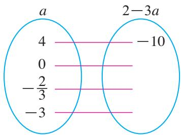

other

| Category | Value |
| -------- | ----- |
| a        | 4     |
| 2-3a     | -10   |
| a        | 0     |
| a        | -2/3  |
| a        | -3    |

2. 根据下列 $x, y$ 的值，分别求代数式 $x^{2} + 2xy + y^{2}$ 的值：
(1) $x = 2, y = -3$ ;
(2) $x = \frac{1}{2}, y = -4.$

3. 一辆汽车从甲地出发，行驶 $3.5 \mathrm{~km}$ 后，又以 $v \mathrm{~km} / \mathrm{h}$ 的速度行驶了 $t \mathrm{~h}$ ，求这辆汽车行驶的全部路程。如果 $v = 56, t = 0.5$ ，求汽车行驶的全部路程。

有些同类事物中的数量关系常常可以用公式来描述。例如，在行程问题中，用 $s$ 表示路程， $v$ 表示速度， $t$ 表示时间，就可以得到路程公式 $s = vt$ ，它表示了路程、速度、时间这三个量之间的关系。知道 $v, t$ 的值，就可以利用公式求出 $s$ 的值。在小学，我们学习过许多公式，如长方形、正方形、三角形、梯形、圆等图形的面积公式，长方体、正方体等图形的体积公式，等等。在解决有关问题时，经常用这些公式进行计算。

> [!example]- 例 3 如图 3.2-1，某学校操场最内侧的跑道由两段直道和两段半圆形的弯道组成，其中直道的长为 a，半圆形弯道的直径为 b.

text_image

b
a

图3.2-1
(1) 用代数式表示这条跑道的周长;
(2) 当 $a=67.3\ m,\ b=52.6\ m$ 时，求这条跑道的周长（ $\pi$ 取 3.14，结果取整数）.
分析：跑道的周长是两段直道和两段弯道的长度和．由圆的周长公式可以

求出弯道的长度.
解：（1）两段直道的长为 $2a$ ；两段弯道组成一个圆，它的直径为 $b$ ，周长为 $\pi b$ 。因此，这条跑道的周长为 $2a + \pi b$ 。
(2) 当 $a=67.3\ m,\ b=52.6\ m$ 时，
$2 a + \pi b = 2 \times 6 7. 3 + 3. 1 4 \times 5 2. 6 \approx 3 0 0 (\mathrm{m}).$
因此，这条跑道的周长约为 $300 \, m$ .

> [!example]- 例 4 一个三角尺的形状和尺寸如图 3.2-2 所示，用代数式表示这个三角尺的面积 S. 当 $a=10\ cm,\ b=17.3\ cm,\ r=2\ cm$ 时，求这个三角尺的面积（ $\pi$ 取 3.14）.
分析：三角尺的面积 $=$ 三角形的面积一圆的面积.根据三角形、圆的面积公式可以求出三角尺的面积.
解：三角形的面积为 $\frac{1}{2}ab$ ，圆的面积为 $\pi r^{2}$ ，这个三角尺的面积 $S=\frac{1}{2}ab-\pi r^{2}$ .

text_image

a
r
b

图3.2-2
当 $a = 10\mathrm{cm}$ ， $b = 17.3\mathrm{cm}$ ， $r = 2\mathrm{cm}$ 时，
$S = \frac {1}{2} \times 1 0 \times 1 7. 3 - 3. 1 4 \times 2 ^ {2} = 7 3. 9 4 (\mathrm{cm} ^ {2}).$
因此，这个三角尺的面积是 $73.94\mathrm{cm}^2$

#### 练习

1. 填空题.
(1) 若 $a, b$ 分别表示平行四边形的底和高，则面积 $S = \_$ ；当 $a = 2\mathrm{cm}$ ， $b = 3\mathrm{cm}$ 时， $S = \_\mathrm{cm}^2$ 。  
(2) 若 $a, b$ 分别表示梯形的上底和下底， $h$ 表示梯形的高，则面积 $S =$ \_\_\_\_；当 $a = 2 \mathrm{~cm}, b = 4 \mathrm{~cm}, h = 5 \mathrm{~cm}$ 时， $S = \mathrm{cm}^2$ .

2. 一个长方体纸箱的长是 $a$ ，宽与高都是 $b$ ，用代数式表示这个纸箱的体积 $V$ 。当 $a = 60 \mathrm{~cm}$ ， $b = 40 \mathrm{~cm}$ 时，求这个纸箱的体积。

3. 如图，用代数式表示圆环的面积。当 $R=15\ cm,\ r=10\ cm$ 时，求圆环的面积（π取3.14）。

text_image

r
R

(第 3 题)

# 习题 3.2

### 复习巩固

1. 填空题.
（1）当 $a = -1$ 时，代数式 $2 - a$ 的值是  
(2) 当 $b = -\frac{1}{2}$ 时，代数式 $1 - b^{2}$ 的值是 \_\_\_\_.

2. 已知 a=12, b=-18，求下表中代数式的值.

<table><tr><td>代数式</td><td>a+b</td><td>a-b</td><td>ab</td><td> $\frac{a}{b}$ </td><td> $\frac{b}{a}$ </td></tr><tr><td>代数式的值</td><td></td><td></td><td></td><td></td><td></td></tr></table>

3. 根据下列 a, b 的值，分别求代数式 $a^{2} + b^{2}$ 与 $(a + b)^{2}$ 的值：
(1) a=3, b=-2;
(2) $a = -3, b = 2.$

4. 求下列代数式的值：
(1) $\frac{n^{2}+1}{n-1}$ ，其中n=4；
(2) $(a - c)^{2} + \frac{1}{4} b$ ，其中 $a = 7, b = 3, c = 5$ .

5. 已知圆锥的体积 $V = \frac{1}{3}\pi r^2 h$ ，其中 $r$ 为底面半径， $h$ 为圆锥的高。当 $r = 15\mathrm{cm}$ ， $h = 16\mathrm{cm}$ 时，求圆锥的体积（π取3.14）。

### 综合运用

6. 一段钢管的形状和尺寸如图所示。如果大圆的半径是 R，小圆的半径是 r，钢管的长度是 a，用代数式表示这段钢管的体积 V。当 $R = 30 \, mm, r = 15 \, mm, a = 120 \, mm$ 时，求这段钢管的体积（ $\pi$ 取 3.14）。

text_image

a
R
r

(第6题)

7. A, B 两地相距 $s \mathrm{~km}$ , 甲、乙两人驾车分别以 $a \mathrm{~km} / \mathrm{h}$ , $b \mathrm{~km} / \mathrm{h}$ 的速度从 A 地到 B 地, 且甲用的时间较少.
（1）用代数式表示甲比乙少用的时间；  
（2）当 $s = 180$ ， $a = 72$ ， $b = 60$ 时，求（1）中代数式的值，并说明这个值表示的实际意义.

### 拓广探索

8. 摄氏温标与华氏温标是两种计量温度的标准，它们分别用摄氏度和华氏度（°F）来计量温度，二者可以互相转换。请你查阅有关资料，解决下列问题：
（1）将 $25^{\circ}$ C 转换成华氏度；（2）将 $-4^{\circ}$ F 转换成摄氏度.

# 数学活动

# 活动1 拼图小游戏
（1）如图1，用火柴棍拼成一排由三角形组成的图形，如果图形中含有2，3或4个三角形，分别需要多少根火柴棍？如果图形中含有 $n$ 个三角形，需要多少根火柴棍？

natural_image

Geometric pattern of interlocking triangles with red dots at vertices (no text or symbols)

图1
（2）如图 2，用相同的小正方形拼大正方形，拼第 1 个正方形需要 4 个小正方形，拼第 2 个正方形需要 9 个小正方形……。拼一拼，想一想，按照这样的方法拼成的第 n 个正方形比第 $(n-1)$ 个正方形多几个小正方形？

  
第1个正方形

  
第2个正方形

  
第3个正方形

● ● ● ● ● ●

图2

# 活动2 密码中的数学

密码学是研究编制和破译密码的规律的一门学科，它与数学有密切关系。例如，对于密文“L dp d vwxghqw”，如果给一把破译它的“钥匙” $x - 3$ ，联想英语字母表中字母的顺序：

a b c d e f g h i j k l m n o p q r s t u v w x y z
如果规定 a 又接在 z 的后面，使 26 个字母排成圈，并能想到 x-3 可以代表 “把一个字母换成字母表中从它向前移动

text_image

x-3

3 位的字母”，按这个规律就有

L dp d vwxghqw → I am a student.

这样就能把密文 “L dp d vwxghqw” 破译成明文 “I am a student”，从而解读出密文的意思了.

请你研究以下问题：
（1）将26个英文字母a，b，c，…，z依次对应自然数1，2，3，…，26.对于密文“26 2 19 7”，给出密文与明文之间的关系如下：
当密文中的数 $x$ 为奇数时，明文对应的序号为 $x + 1$ ；当密文中的数 $x$ 为偶数时，明文对应的序号为 $\frac{x}{2}$ .

请将密文破译成用英文字母表示的明文.
（2）请你和同学利用数学式子来设计一种明文与密文的关系，并互相合作，通过游戏试一试如何进行保密通信.

## 小结

### 一、本章知识结构图

flowchart

### 二、回顾与思考

在本章中，我们学习了代数式、列代数式及代数式的值。用字母表示数，字母参与运算，就得到了代数式。代数式可以简明地表达现实世界中的某些数量和数量关系，同时具有一般性，这给研究问题和计算带来方便。这是数学史上的一个重大发展。

代数式的学习，能够使我们感悟符号的数学功能，认识符号表达的现实意义。把现实世界中数量与数量关系抽象成代数式，能够使我们体会到用符号表达数量关系和规律是数学表达和数学思考的重要形式，提升抽象能力和推理能力。

请你带着下面的问题，复习一下全章的内容吧.

1. 代数式可以简明地表示某些数量和数量关系，你能举例说明吗？  
2. 同一个代数式可以表示不同实际问题中的数量或数量关系，你能举例说明吗？  
3. 用代数式表示数量关系时，关键要弄清楚数量的意义及相互关系。对此你有什么体会？  
4. 两个相关联的量何时满足反比例关系，你能举例说明吗？  
5. 在解决具体问题时，往往需要求代数式的值。求值时，要注意运算符号与运算顺序，你能举例说明吗？

# 复习题 3

### 复习巩固

1. 用代数式表示:
(1) 比 a 的 3 倍小 4 的数.  
(2) a 的一半与 b 的和的平方.  
(3) 我国自主研发的一种近防炮，每分钟可发射10 000发炮弹。近防炮 $t \min$ 能发射多少发炮弹？  
（4）购买 $n$ 件单价为 $c$ 元的商品要花多少元？若支付1000元还有剩余，应找回多少元？

2. 用代数式表示：
（1）某地冬季一天的温差是 $15^{\circ}C$ ，这天最低气温是 $t^{\circ}C$ ，最高气温是多少？  
(2) 某种商品原价为每件 $b$ 元, 第一次降价打八折, 第二次降价每件又降 10 元,第一次降价后的售价是多少元? 第二次降价后的售价是多少元?  
(3) 30 天中, 李明的长跑路程累计达到 $45000 \mathrm{~m}$ , 刘伟的长跑路程累计为 $a \mathrm{~m}$ , 李明和刘伟平均每天各跑多少米? 若刘伟的累计长跑路程多于李明, 则刘伟平均每天比李明多跑多少米?

3.（1）若一个长方形的长为 $p$ ，宽为 $q$ ，则 $2(p + q)$ 表示什么？  
(2) 举两个例子说明代数式 $3a + 2b$ 表示的实际问题中的数量关系.

4. 用一根绳子围成一个长方形，相邻两边的长分别为 $x \mathrm{~m}$ 和 $y \mathrm{~m}$ .
(1) 当绳子的长为 $12 \, m$ 时，用式子表示 y 与 x 的关系.  
(2) 当长方形的面积为 $12 \, m^{2}$ 时，用式子表示 y 与 x 的关系.  
(3) 当长方形的周长一定时, 相邻两边的长成反比例关系吗? 当长方形的面积一定时呢? 为什么?

5. 根据下列 a, b 的值，分别求代数式 $a^{2}-b^{2}$ 与 $(a-b)^{2}$ 的值：
(1) $a = -1, b = -3$ ;
(2) $a = 2, b = -\frac{1}{2}$ .

### 综合运用

6. 礼堂第 1 排有 a 个座位，后面每排都比前一排多 1 个座位.
（1）第2排有多少个座位？第3排呢？用代数式表示第 $n$ 排的座位数.  
(2) 当 a=20 时，计算第 19 排的座位数.

7. 如图，正方形 $ABCD$ 的边长为 $a$ .
（1）根据图中数据，用含 $a$ ， $b$ 的代数式表示阴影部分的面积 $S$ ；  
(2) 当 a=6, b=2 时，求阴影部分的面积.

text_image

A
4
D
b
B
a
C

(第7题)

### 拓广探索

8. 如图，用棋子摆出一组形如正方形的图形，按照这种方法摆下去，摆第 $n$ 个图形需要多少枚棋子？

  
第1个

  
第2个

  
第3个

（第8题）

9. 冰糖葫芦是我国传统小吃，起源于宋代，一般是用竹签穿上山楂，再蘸上熔化的冰糖液制作而成。
(1) 若每根竹签穿 5 个山楂, 穿 $n$ 串冰糖葫芦需要多少个山楂? 需要的山楂总数与冰糖葫芦的串数成什么比例关系?

natural_image

Row of red dumplings on skewers on a wooden board, no visible text or symbols

(2) 若用 200 个山楂穿了 $b$ 串冰糖葫芦, 且每串的山楂个数相等, 则每串冰糖葫芦的山楂个数是多少? 每串冰糖葫芦的山楂个数与冰糖葫芦的总串数成什么比例关系?  
（3）若有 $a$ 个山楂，按每串冰糖葫芦的山楂个数相等的规定，穿了 $b$ 串冰糖葫芦，还剩余 $c$ 个山楂，则每串冰糖葫芦的山楂个数是多少？当 $a = 130$ ， $b = 16$ ， $c = 2$ 时，求每串冰糖葫芦的山楂个数.

# 第四章 整式的加减

港珠澳大桥是集主桥、海底隧道和人工岛于一体的世界上最长的跨海大桥。一辆汽车从香港口岸行驶到东人工岛海底隧道入口的平均速度为 $96\mathrm{km / h}$ ，在海底隧道和主桥上行驶的平均速度分别为 $72\mathrm{km / h}$ 和 $92\mathrm{km / h}$ 。请根据这些数据回答下列问题：
(1) 汽车在主桥上行驶 $t \mathrm{~h}$ 的路程是多少千米?   
（2）如果汽车通过海底隧道需要 $a \mathrm{~h}$ ，从香港口岸行驶到东人工岛海底隧道入口的时间是通过海底隧道时间的1.25倍，你能用含 $a$ 的代数式表示香港口岸到西人工岛的全长吗？  
（3）如果汽车通过主桥需要 b h，通过海底隧道所需时间比通过主桥的时间少 0.15 h，你能用含 b 的代数式表示主桥与海底隧道长度的和吗？主桥与海底隧道的长度相差多少千米？

要解决上面的问题，需要进一步学习代数式。在本章中，我们将学习一类基本的代数式——整式，以及整式的加减运算，并进一步学习列代数式表示数量和数量关系，体会数与整式在加减运算中的一致性，为后续学习方程、不等式、函数等内容打下基础。

text_image

港珠澳大桥主体工程示意图
珠海
澳门
珠海及澳门口岸
港珠澳大桥主桥
港珠澳大桥
西人工岛
海底隧道
东人工岛
香港口岸
人民养老出版社

## 4.1 整式

代数式的类型多种多样，下面我们学习一类基本的代数式——整式.

我们来看本章引言中的问题（1）.

汽车在主桥上行驶的平均速度为 $92 \, km/h$ ，根据路程、速度、时间之间的关系：路程 = 速度 × 时间，汽车在主桥上行驶 t h 的路程（单位：km）是
$9 2 \times t = 9 2 t.$

> [!observe] 观察
我们来看 $92t$ 和上一章中遇到过的一些代数式
$a ^ {2}, 0. 9 p, \frac {1}{3} a ^ {2} h,$

这些代数式有什么共同特点？

这些代数式都是数或字母的积，像这样的代数式叫作单项式（monomial）.
单独的一个数或一个字母也是单项式，例如，-6，x 都是单项式.

单项式中的数字因数叫作这个单项式的系数。例如，单项式 $92t$ ， $a^2$ ， $0.9p$ ， $\frac{1}{3} a^2 h$ 的系数分别是 $92$ ， $1$ ， $0.9$ ， $\frac{1}{3}$ 。单项式表示数与字母相乘时，通常把数写在前面，如 $92t$ 。单项式的系数是 1 或 $-1$ 时，1 通常省略不写，如 $a^3$ ， $-x$ 。

一个单项式中，所有字母的指数的和叫作这个单项式的次数。如果一个单项式的次数是 $n$ ，那么称这个单项式是 $n$ 次单项式。例如，在单项式 $92t$ 中，字母 $t$ 的指数是 $1, 92t$ 的次数就是 $1$ ，它是一次单项式；在单项式 $\frac{1}{3} a^2 h$ 中，字母 $a$ 与 $h$ 的指数的和是 $3, \frac{1}{3} a^2 h$ 的次数就是 $3$ ，它是三次单项式。

对于一个非零的数，规定它的次数为0.

> [!example]- 例 1 用单项式填空，并指出它们的系数和次数.
（1）若三角形的一条边长为 $a$ ，这条边上的高为 $h$ ，则这个三角形的面积为 \_\_\_\_.  
（2）一个长方体包装盒的长、宽、高分别为 $x \mathrm{~cm}, y \mathrm{~cm}, z \mathrm{~cm}$ ，则这个长方体包装盒的体积为 \_\_\_\_ $\mathrm{cm}^{3}$ .  
(3) 有理数 n 的相反数是 \_\_\_\_.  
（4）《北京 2022 年冬奥会——冰上运动》是为了纪念北京 2022 年冬奥会冰上运动发行的邮票。邮票 1 套共 5 枚，价格为 6 元，其中一种版式为一张 10 枚（2 套），如图 4.1-1 所示。某中学举行冬奥会有奖问答活动，买了 m 张这种版式的邮票作为奖品，共花费 \_\_\_\_ 元。

text_image

北京2022年冬奥会——冰上运动
Olympic Winter Games Beijing 2022 — Ice Sports
中国雪球CHINA
120°
CHINA中国邮政
中国雪球CHINA
120°
CHINA中国邮政
中国雪球CHINA
120°
CHINA中国邮政
中国雪球CHINA
120°
CHINA中国邮政
CHINA中国邮政
120°
CHINA中国邮政
CHINA中国邮政
BEIJING, 2022

图4.1-1
（5）《中华人民共和国国旗法》规定，国旗旗面为红色长方形，其长与高之比为 $3:2$ ，有五种通用尺度（尺寸规格）。若一种尺度的国旗的长为 $a\mathrm{cm}$ 则这种尺度的国旗旗面的面积为 $\mathrm{cm}^2$
解：（1） $\frac{1}{2}ah$ ，它的系数是 $\frac{1}{2}$ ，次数是2.
(2) xyz，它的系数是1，次数是3.   
(3) $-n$ ，它的系数是-1，次数是1.  
(4) 12m，它的系数是12，次数是1.   
(5) $\frac{2}{3}a^{2}$ ，它的系数是 $\frac{2}{3}$ ，次数是2.

#### 练习

1. 填表：

<table><tr><td>单项式</td><td> $2a^{2}$ </td><td>-1.2h</td><td> $xy^{2}$ </td><td> $-t^{2}$ </td><td> $-\frac{2vt}{3}$ </td></tr><tr><td>系数</td><td></td><td></td><td></td><td></td><td></td></tr><tr><td>次数</td><td></td><td></td><td></td><td></td><td></td></tr></table>

2. 用单项式填空，并指出它们的系数和次数.
(1) 国家速滑馆 “冰丝带” 采用了我国自有的二氧化碳跨临界直冷制冰系统，不仅安全，而且绿色环保。如果使用传统制冷剂，同等用量下的碳排放量是二氧化碳制冷剂的 3985 倍。若使用一批二氧化碳制冷剂的碳排放量为 $m \mathrm{t}$ ，则相同用量的传统制冷剂的碳排放量为 \_\_\_\_ t.
(2) 某人经营一家网店，“五一”假期期间他对网店的某种商品进行促

销. 若每售出一件这种商品获利 $m$ 元, 则售出 $n$ 件这种商品共获利 \_\_\_\_ 元.
(3) 测量降水量的基本仪器是雨量器. 如图, 一个雨量器的集雨斗是圆锥形状, 其内部的底面半径为 $r$ , 高为 $h$ , 则这个集雨斗的容积为 \_\_\_\_.

text_image

r
h

(第 2 (3) 题)

> [!think] 思考
在上一章中，我们还遇到一些代数式
$2 n - 1 0, x ^ {2} + 2 x + 8, 2 a + 3 b, \frac {1}{2} a b - \pi r ^ {2},$

这些式子与单项式有什么区别和联系？它们有什么共同的特点？

这些式子都可以看作几个单项式的和. 例如, $2n - 10$ 可以看作单项式 $2n$ 与 $-10$ 的和, $x^{2} + 2x + 8$ 可以看作单项式 $x^{2}$ , $2x$ 与 8 的和.

像这样，几个单项式的和叫作多项式（polynomial）。其中，每个单项式叫作多项式的项，不含字母的项叫作常数项。例如，多项式 $2n - 10$ 的项是 $2n$ 与 $-10$ ，其中-10是常数项。

多项式里，次数最高的项的次数，叫作这个多项式的次数。例如，多项式 $2n - 10$ 有2项，次数最高的项是一次项 $2n$ ，这个多项式的次数是1；多项式 $x^{2} + 2x + 8$ 有3项，次数最高的项是二次项 $x^{2}$ 这个多项式的次数是2。
$2 a + 3 b, \frac {1}{2} a b - \pi r ^ {2}$

的项和次数分别是什么？

单项式与多项式统称整式（integral expression）。例如，前面学习的单项式 $92t$ ， $a^2$ ， $0.9p$ ， $\frac{1}{3}a^2h$ ，以及多项式 $2n-10$ ， $x^2+2x+8$ ， $2a+3b$ ， $\frac{1}{2}ab-\pi r^2$ 等都是整式。

> [!example]- 例 2 用多项式填空，并指出它们的项和次数.
（1）一个长方形相邻两条边的长分别为 $a, b$ ，则这个长方形的周长为 \_\_\_\_.  
(2) m 为一个有理数，m 的立方与 2 的差为 \_\_\_\_.  
（3）某公司向某地投放共享单车，前两年每年投放 $a$ 辆，为环保和安全起见，从第三年年初起不再投放，且每个月回收 $b$ 辆。第三年年底，该地区共有这家公司的共享单车的辆数为 \_\_\_\_.
（4）现存于陕西历史博物馆的我国南北朝时期的官员独孤信的印章如图 4.1-2 所示，它由 18 个相同的正方形和 8 个相同的等边三角形围成。如果其中正方形和等边三角形的边长都为 a，等边三角形的高为 b，那么这个印章的表面积为 \_\_\_\_.

text_image

大同
計章
金

natural_image

Geometric polyhedron diagram with solid and dashed lines indicating visible and hidden edges (no text or labels)

图4.1-2
解：（1） $2a+2b$ ，它的项分别为2a，2b，次数是1.
(2) $m^3 - 2$ ，它的项分别为 $m^3, -2$ ，次数是3.  
（3） $2a - 12b$ ，它的项分别为 $2a$ ， $-12b$ ，次数是1.  
（4） $18a^{2}+4ab$ ，它的项分别为 $18a^{2}$ ，4ab，次数是2.

注意多项式中的每一项都包含它前面的正负号.

#### 练习

1. 下列代数式中哪些是单项式？哪些是多项式？分别填入所属的圈中。
$2 a + 1, 4 r ^ {2}, 2 x ^ {2} - 5 y + 1, 3, \frac {3}{8} m ^ {3} - 5 n.$

natural_image

Simple blue oval outline on white background (no text or symbols)

单项式

natural_image

Simple blue oval outline on white background (no text or symbols)

多项式

2. 填表：

<table><tr><td>多项式</td><td> $-5a^{2}b+2ab-b^{4}$ </td><td> $-2h+1$ </td><td> $rl+2r^{2}$ </td><td> $\frac{1}{2}t^{2}-2t+3$ </td><td> $x^{3}-2y+x^{2}$ </td></tr><tr><td>项</td><td></td><td></td><td></td><td></td><td></td></tr><tr><td>次数</td><td></td><td></td><td></td><td></td><td></td></tr></table>

3. 鲁班锁是我国古代传统建筑的固定结合器，也是一种广泛流传的益智玩具（图（1）），其中六根鲁班锁中一个构件的一个面的尺寸如图（2）所示，这个面的面积为\_\_\_\_。

natural_image

3D wooden puzzle piece with interlocking blocks (no text or symbols)

(1)

  
(2)   
(第 3 题)

# 习题 4.1

### 复习巩固

1. 单项式 $-4a^{2}b^{3}c$ 的系数是 \_\_\_\_，次数是 \_\_\_\_。

2. 写出一个系数是 2，次数是 3 的单项式.

3. 多项式 $a^4 - 2a^2b + b^2$ 的项为 \_\_\_\_，次数是 \_\_\_\_.

4. 一所住宅的建筑平面图如图所示（图中长度单位：m），分为Ⅰ，Ⅱ，Ⅲ，Ⅳ四个区域，则这所住宅的建筑面积可以用一个多项式表示为\_\_\_\_，这个多项式的次数是\_\_\_\_。

text_image

x
2
I
4
Ⅱ
Ⅲ
Ⅳ
3
2
x
3

(第4题)

### 综合运用

5. 今年 “十一” 假期期间，某公园接待的游客数比去年同期增长了 5.7%. 若去年同期这个公园接待了游客 x 万人，求今年 “十一” 假期期间这个公园比去年同期多接待的游客人数.  
6. 我国古代数学著作《周髀算经》中提到，冬至、小寒、大寒、立春、雨水、惊蛰、春分、清明、谷雨、立夏、小满、芒种这十二个节气中，在同一地点测量每个节气正午时同一根杆的日影长，发现每个节气与它后一个节气的日影长的差近似为定值。若这个定值为 d 尺（这里的尺是我国古代长度单位），立春当日的日影长为 10.5 尺，求立夏当日日影长的近似值。  
7. 世界杯排球赛的积分规则为：比赛中以 3-0（胜 3 局负 0 局）或者 3-1 取胜的球队积 3 分，负队积 0 分；比赛中以 3-2 取胜的球队积 2 分，负队积 1 分。若某球队以 3-1 胜了 a 场，以 3-2 胜了 b 场，以 2-3 负了 c 场，则这支球队的积分用多项式可以表示为 \_\_\_\_.

### 拓广探索

8. 设 $n$ 表示任意一个整数，用含 $n$ 的代数式表示：
（1）能被3整除的整数； （2）除以3余数为1的整数.

9. 鞋号表明了鞋子的大小，我国 1998 年发布了新鞋号标准。新鞋号标准对应于 20 世纪 60 年代后期制定的旧鞋号标准，部分鞋号对照如下：

<table><tr><td>新鞋号</td><td>220</td><td>225</td><td>230</td><td>235</td><td>⋯</td><td>270</td></tr><tr><td>旧鞋号</td><td>34</td><td>35</td><td>36</td><td>37</td><td>⋯</td><td>a</td></tr></table>
(1) 求 a 的值;  
(2) 若新鞋号为 $m$ ，旧鞋号为 $n$ ，写出一个把旧鞋号转换为新鞋号的公式.

## 4.2 整式的加法与减法

数能进行加减运算，整式中的每个字母都表示数，这样，整式与数一样，也可以进行加减运算.

我们来看本章引言中的问题（2）.

汽车从香港口岸到西人工岛包含两段路程，一段为香港口岸到东人工岛的海底隧道入口，另一段为海底隧道。如果汽车通过海底隧道需要 $a\mathrm{h}$ ，那么从香港口岸到东人工岛的海底隧道入口所需时间是 $1.25a\mathrm{h}$ ，香港口岸到西人工岛的全长（单位：km）是
$7 2 a + 9 6 \times 1. 2 5 a,$
即 $72a + 120a.$

如何计算 $72a + 120a$ 呢？下面我们类比数的运算，讨论整式 $72a$ ， $120a$ 的加法运算.

> [!explore] 探究
(1) 运用运算律计算:
$7 2 \times 2 + 1 2 0 \times 2 = \underline {{\quad}};$
$7 2 \times (- 2) + 1 2 0 \times (- 2) = \underline {{{\quad}}}.$
(2) 根据 (1) 中的方法完成下面的运算, 并说明其中的道理:
$7 2 a + 1 2 0 a = \underline {{\quad}}.$

在（1）中，根据分配律可得
$7 2 \times 2 + 1 2 0 \times 2 = (7 2 + 1 2 0) \times 2 = 1 9 2 \times 2,$
$7 2 \times (- 2) + 1 2 0 \times (- 2) = (7 2 + 1 2 0) \times (- 2) = 1 9 2 \times (- 2).$

在（2）中，多项式 $72a + 120a$ 表示 $72a$ 与 $120a$ 两项的和，它与（1）中的式子
$7 2 \times 2 + 1 2 0 \times 2$

和
$7 2 \times (- 2) + 1 2 0 \times (- 2)$

有相同的结构，并且字母 $a$ 代表的是一个乘数，因此根据分配律也有
$7 2 a + 1 2 0 a = (7 2 + 1 2 0) a = 1 9 2 a.$

> [!explore] 探究
填空：
(1) $72a - 120a = (\quad)a;$   
(2) $3m^{2} + 2m^{2} = (\quad)m^{2};$   
(3) $3xy^{2} - 4xy^{2} = (\quad)xy^{2}$ .

上述运算有什么共同特点？你能从中得出什么规律？

对于上面的（1）（2）（3），利用分配律可得
$\begin{array}{l} 7 2 a - 1 2 0 a = (7 2 - 1 2 0) a = - 4 8 a; \\ 3 m ^ {2} + 2 m ^ {2} = (3 + 2) m ^ {2} = 5 m ^ {2}; \\ 3 x y ^ {2} - 4 x y ^ {2} = (3 - 4) x y ^ {2} = - x y ^ {2}. \\ \end{array}$

观察（1）中的多项式的项 72a 和 -120a，它们含有相同的字母 a，并且 a 的指数都是 1；（2）中的多项式的项 $3m^{2}$ 和 $2m^{2}$ ，含有相同的字母 m，并且 m 的指数都是 2；（3）中的多项式的项 $3xy^{2}$ 与 $-4xy^{2}$ ，都含有字母 x，y，并且 x 的指数都是 1，y 的指数都是 2。像 72a 与 -120a， $3m^{2}$ 与 $2m^{2}$ ， $3xy^{2}$ 与 $-4xy^{2}$ 这样，所含字母相同，并且相同字母的指数也相同的项叫作同类项。几个常数项也是同类项。
因为多项式中的字母表示的是数，所以我们也可以利用交换律、结合律、分配律把多项式中的同类项进行合并．例如，
$\begin{array}{l} 4 x ^ {2} + 2 x + 7 + 3 x - 8 x ^ {2} - 2 \\ = 4 x ^ {2} - 8 x ^ {2} + 2 x + 3 x + 7 - 2 \quad (\text {交换律}) \\ = (4 x ^ {2} - 8 x ^ {2}) + (2 x + 3 x) + (7 - 2) \quad (\text {结合律}) \\ = (4 - 8) x ^ {2} + (2 + 3) x + (7 - 2) \quad (\text {分配律}) \\ = - 4 x ^ {2} + 5 x + 5. \\ \end{array}$

通常我们把一个多项式的各项按照某个字母的指数从大到小（降幂）或者从小到大（升幂）的顺序排列.

把多项式中的同类项合并成一项，叫作合并同类项.

合并同类项后，所得项的系数是合并前各同类项的系数的和，字母连同它的指数不变.

> [!example]- 例 1 合并下列各式的同类项:
(1) $xy^{2} - \frac{1}{5} xy^{2}$ ;
(2) $4a^{2} + 3b^{2} + 2ab - 4a^{2} - 4b^{2}$ .
解：（1） $xy^{2}-\frac{1}{5}xy^{2}=\left(1-\frac{1}{5}\right)xy^{2}=\frac{4}{5}xy^{2}$ ;
(2) $4a^{2} + 3b^{2} + 2ab - 4a^{2} - 4b^{2}$
$\begin{array}{l} = \left(4 a ^ {2} - 4 a ^ {2}\right) + \left(3 b ^ {2} - 4 b ^ {2}\right) + 2 a b \\ = (4 - 4) a ^ {2} + (3 - 4) b ^ {2} + 2 a b \\ = - b ^ {2} + 2 a b. \\ \end{array}$

> [!example]- 例2 （1）求多项式 $2x^{2} - 5x + x^{2} + 4x - 3x^{2} - 2$ 的值，其中 $x = \frac{1}{2}$
(2) 求多项式 $3a + abc - \frac{1}{3}c^{2} - 3a + \frac{1}{3}c^{2}$ 的值，其中 $a = -\frac{1}{6}$ ，b = 2，c = -3.
分析：在求多项式的值时，可以先将多项式中的同类项合并，然后再求值，这样做往往可以简化计算.
解：(1) $2x^{2} - 5x + x^{2} + 4x - 3x^{2} - 2$
$= (2 + 1 - 3) x ^ {2} + (- 5 + 4) x - 2$
$= - x - 2.$
当 $x = \frac{1}{2}$ 时，原式 $= -\frac{1}{2} - 2 = -\frac{5}{2}$ .
(2) $3a + abc - \frac{1}{3} c^2 - 3a + \frac{1}{3} c^2$
$= (3 - 3) a + a b c + \left(- \frac {1}{3} + \frac {1}{3}\right) c ^ {2}$
$= a b c.$
当 $a = -\frac{1}{6}$ ， $b = 2$ ， $c = -3$ 时，原式 $= \left(-\frac{1}{6}\right)\times 2\times (-3) = 1.$

请你把字母的值直接代入原式求值. 与例2的运算过程比较, 哪种方法更简便?

> [!example]- 例 3 （1）水库水位第一天连续下降了 a h，平均每小时下降 2 cm；第二天连续上升了 a h，平均每小时上升 0.5 cm。这两天水位总的变化情况如何？
（2）某商店原有 5 袋大米，每袋大米为 x kg. 上午售出 3 袋，下午又购进同样包装的大米 4 袋. 进货后这个商店有大米多少千克?
解：（1）把下降的水位变化量记为负，上升的水位变化量记为正，则第一天水位的变化量是 $-2a \mathrm{~cm}$ ，第二天水位的变化量是 $0.5a \mathrm{~cm}$ 。由
$- 2 a + 0. 5 a = (- 2 + 0. 5) a = - 1. 5 a$

可知，这两天水位总的变化情况为下降了 $1.5 \, a \, cm$ .
（2）把进货的数量记为正，售出的数量记为负，则上午大米质量的变化量是 $-3x\mathrm{kg}$ ，下午大米质量的变化量是 $4x\mathrm{kg}$ 。由
$5 x - 3 x + 4 x = (5 - 3 + 4) x = 6 x$

可知，进货后这个商店有大米 $6x \, kg$ .

#### 练习

1. 合并下列各式的同类项：
(1) $5x + 4x$ ;
(2) $\frac{1}{3} y - \frac{2}{3} y + 2y$ ;
(3) $-7ab + 6ab$ ;
(4) $10y^{2} - 0.5y^{2}$ ;
(5) $mn^2 + 3mn^2$ ;
(6) $-3x^{2}y + 3xy^{2} + 2x^{2}y - 2xy^{2}$ .

2. 先化简，再求值：
(1) $3a + 2b - 5a - b$ ，其中 a = -2，b = 1；
(2) $3x - 4x^{2} + 7 - 3x + 2x^{2} + 1$ ，其中 $x = -3$

3. 如图，大圆的半径是 R，小圆的面积是大圆面积的 $\frac{4}{9}$ ，求阴影部分的面积.

（第3题）

与数的运算一样，进行整式的运算时也会遇到去括号的问题.

我们来看本章引言中的问题（3）.

汽车通过主桥的行驶时间是 b h，那么汽车在主桥上行驶的路程是 92b km；通过海底隧道所需时间比通过主桥的时间少 0.15 h，那么汽车在海底隧道行驶的时间是 $(b-0.15)$ h，行驶的路程是 $72(b-0.15)$ km。因此，主桥与海底隧道长度的和（单位：km）为
$9 2 b + 7 2 (b - 0. 1 5), \tag {①}$

主桥与海底隧道长度的差（单位：km）为
$9 2 b - 7 2 (b - 0. 1 5). \tag {②}$

上面的代数式①②都带有括号，应如何化简它们？
由于字母表示的是数，所以可以利用分配律，将括号前的乘数与括号内的各项相乘，去掉括号，再合并同类项，得
$9 2 b + 7 2 (b - 0. 1 5) = 9 2 b + 7 2 b - 1 0. 8 = 1 6 4 b - 1 0. 8,$
$9 2 b - 7 2 (b - 0. 1 5) = 9 2 b - 7 2 b + 1 0. 8 = 2 0 b + 1 0. 8.$

一般地，一个数与一个多项式相乘，需要去括号，去括号就是用括号外的数乘括号内的每一项，再把所得的积相加.

特别地， $+(x-3)$ 与 $-(x-3)$ 可以看作1与-1分别乘 $(x-3)$ .利用分配律，可以将式子中的括号去掉，得
$+ (x - 3) = x - 3, \quad - (x - 3) = - x + 3.$

这也符合上面的去括号的方法.

利用去括号，可以对整式进行化简.

> [!example]- 例4 化简：
(1) $8a + 2b + (5a - b)$ ;
(2) $(4y-5)-3(1-2y)$ .
解：(1) $8a + 2b + (5a - b)$
$= 8 a + 2 b + 5 a - b$
$= 1 3 a + b;$
(2) $(4y - 5) - 3(1 - 2y)$
$= 4 y - 5 - 3 + 6 y$
$= 1 0 y - 8.$

为什么 $-3 \times (-2y) = 6y$ ?

> [!example]- 例 5 两船从同一港口同时出发反向而行，甲船顺水，乙船逆水，两船在静水中的速度都是 $50 \, km/h$ ，水流速度是 a km/h.
(1) 2 h 后两船相距多远?
(2) 2 h 后甲船比乙船多航行多少千米?
解：顺水航速=静水航速+水流速度= $(50+a)$ km/h,

逆水航速=静水航速-水流速度=(50-a)km/h.
(1) 由
$2 (5 0 + a) + 2 (5 0 - a) = 1 0 0 + 2 a + 1 0 0 - 2 a$
$= 2 0 0$

可知，2 h 后两船相距 200 km.
(2) 由
$2 (5 0 + a) - 2 (5 0 - a) = 1 0 0 + 2 a - 1 0 0 + 2 a$
$= 4 a$

可知，2 h 后甲船比乙船多航行 4a km.

#### 练习

1. 下列去括号的过程是否正确？如果错误，请改正。
(1) $a^2 - (2a - b + c) = a^2 - 2a - b + c$ ;   
(2) $-(x - y) + (xy - 1) = -x - y + xy - 1.$

2. 去括号：
(1) $a + (b - c)$ ;   
(3) $(a - b) + (c + d)$ ;
(2) $a - (-b + c)$ ;   
(4) $-(a + b) - (-c + d)$ .

3. 化简：
(1) $12(x-0.5)$ ;
(2) $-5\left(1 - \frac{1}{5} x\right)$ ;   
(4) $\frac{1}{3} (9y - 3) + 2(y + 1)$ .
(3) $-5a + (3a - 2) - (3a - 7)$ ;

4. 某地居民的生活用水收费标准为：每月用水量不超过 $15 \mathrm{~m}^{3}$ ，每立方米 $a$ 元；超过部分每立方米 $(a + 2)$ 元。若该地区某家庭上月用水量为 $20 \mathrm{~m}^{3}$ ，则应缴水费多少元？

合并同类项和去括号是进行整式加减运算的基础，利用它们就可以进行整式的加减运算.

> [!example]- 例6 计算：
(1) $(2x-3y)+(5x+4y)$ ;
(2) $(8a - 7b) - (4a - 5b)$ .
$\begin{array}{l} = 2 x - 3 y + 5 x + 4 y \\ = 7 x + y; \\ \end{array}$
解：(1) $(2x - 3y) + (5x + 4y)$
$\begin{array}{l} = 8 a - 7 b - 4 a + 5 b \\ = 4 a - 2 b. \\ \end{array}$
(2) $(8a - 7b) - (4a - 5b)$

> [!example]- 例 7 做大、小两个长方体纸盒，尺寸如表 4.2-1 所示.
表 4.2-1 长方体纸盒的尺寸

<table><tr><td>类型</td><td>长/cm</td><td>宽/cm</td><td>高/cm</td></tr><tr><td>小纸盒</td><td>a</td><td>b</td><td>c</td></tr><tr><td>大纸盒</td><td>1.5a</td><td>2b</td><td>2c</td></tr></table>
(1) 做这两个纸盒共用纸多少平方厘米?   
(2) 做大纸盒比做小纸盒多用纸多少平方厘米?
解：小纸盒的表面积是 $(2ab+2bc+2ca)\ cm^{2}$ ，

大纸盒的表面积是 $(6ab+8bc+6ca)\ cm^{2}$ .
(1) 由
$(2 a b + 2 b c + 2 c a) + (6 a b + 8 b c + 6 c a)$
$= 2 a b + 2 b c + 2 c a + 6 a b + 8 b c + 6 c a$
$= 8 a b + 1 0 b c + 8 c a$

可知，做这两个纸盒共用纸 $(8ab+10bc+8ca)\ cm^{2}$ .
(2) 由
$(6 a b + 8 b c + 6 c a) - (2 a b + 2 b c + 2 c a)$
$= 6 a b + 8 b c + 6 c a - 2 a b - 2 b c - 2 c a$
$= 4 a b + 6 b c + 4 c a$

可知，做大纸盒比做小纸盒多用纸（ $4ab+6bc+4ca$ ）cm $^{2}$ .

通过上面的学习，我们得到整式加减的运算法则：

几个整式相加减，如果有括号就先去括号，然后再合并同类项.

> [!example]- 例8 求 $\frac{1}{2} x - 2\left(x - \frac{1}{3} y^2\right) + \left(-\frac{3}{2} x + \frac{1}{3} y^2\right)$ 的值，其中 $x = -2$ ， $y = \frac{2}{3}$ .
解： $\frac{1}{2} x - 2\left(x - \frac{1}{3} y^2\right) + \left(-\frac{3}{2} x + \frac{1}{3} y^2\right)$
$= \frac {1}{2} x - 2 x + \frac {2}{3} y ^ {2} - \frac {3}{2} x + \frac {1}{3} y ^ {2}$
$= - 3 x + y ^ {2}.$
当 $x = -2$ ， $y = \frac{2}{3}$ 时，

原式 $= (-3)\times (-2) + \left(\frac{2}{3}\right)^{2} = 6 + \frac{4}{9} = 6\frac{4}{9}.$

先将式子化简，再代入数值进行计算往往比较简便.

#### 练习

1. 计算：
(1) $-\frac{1}{3} ab - 4a^2 + 3a^2 - \left(-\frac{2}{3} ab\right)$ ;   
(2) $x^{3} - (x^{2} - x + 1) - 2(x^{3} - x^{2} - 1) - 1;$
(3) $\frac{1}{3} a - \frac{1}{2} (a - 8b - 12c) + 3(-2c + 2b)$ .

2. 求 $x^{2} - 5xy - 3x^{2} - 2(1 - 2xy - x^{2})$ 的值，其中 $x = -\frac{1}{9}$ ， $y = \frac{9}{2}$ .

3. 笔记本的单价是 $x$ 元，中性笔的单价是 $y$ 元。王芳买了 3 本笔记本，2 支中性笔；李明买了 4 本笔记本，3 支中性笔。买这些笔记本和中性笔，王芳和李明一共花费多少元？

# 习题 4.2

### 复习巩固

1. 合并同类项：
(1) 2x-10.3x;
(2) 3x - x - 5x;
(3) $-b + 0.6b - 3.6b$ ;
(4) $m - n^{2} - 6m + 2n^{2}$ .

2. 化简：
(1) $2(4x-0.5)$ ;
(2) $-3(1 - x)$ ;
(3) $-x + 2(2x - 2) - (3x + 5)$ ;
(4) $3a^{2} + a^{2} - (2a^{2} - 2a) + (3a - a^{2})$

3. 计算：
(1) $(5a + 4c + 7b) + (5c - 3b - 6a)$ ;
(2) $(8xy - x^{2} + y^{2}) - (x^{2} - y^{2} + 8xy)$ ;
(3) $\left(\frac{1}{3} x^2 - 1 + 3x\right) - 4\left(x - x^2 + \frac{1}{2}\right)$ ;
(4) $3x^{2} - [7x - (4x - 3) - 2x^{2}]$ .

4. 先化简，再求值：
$4 \left(3 a ^ {2} b - a b ^ {2}\right) - 2 \left(3 a b ^ {2} - a ^ {2} b\right) - 1 4 a ^ {2} b,$

其中 $a = 1, b = -\frac{1}{2}$ .

5. 甲地的海拔是 $h \mathrm{~m}$ , 乙地比甲地高 $20 \mathrm{~m}$ , 丙地比甲地低 $30 \mathrm{~m}$ . 列式表示乙、丙两地的海拔, 并计算乙地与丙地的海拔差.

### 综合运用

6. 在学习了整式的加减后，老师给出一道课堂练习题：

选择 a 的一个值，求 $5a^{3}-(a^{2}-3a+3a^{3})+(a^{2}-a-2a^{3})-2a+2035$ 的值.

甲说：“当 $a = 0$ 时，原式 $= 2035$ 。”

乙说：“当 $a = 1$ 时，原式 $= 2035$ 。”

丙说：“当 $a$ 为任何一个有理数时，原式 $= 2035$ 。”

这三位同学的说法是否正确？请说明理由.

7. 已知三角形的第一条边的长为 $3a + 2b$ ( $a > 0, b > 0$ ), 第二条边比第一条边短 $2a$ , 第三条边比第二条边的长的 2 倍还长 $a - b$ .
(1) 求第二条边和第三条边的长; (2) 求这个三角形的周长.

8. 窗户的形状如图所示（图中长度单位：cm），其上部是半圆形，下部是边长相同的四个小正方形。已知下部小正方形的边长是 a cm，计算：
(1) 窗户的面积; (2) 窗户的外框的总长.

9. 一种商品每件进价为 $a$ 元，商家原来在进价的基础上增加 $20\%$ 定为售价，每件商品的售价为多少元？现在由于库存积压，商家按原售价的 $90\%$ 出售，现售价为多少元？每件还能盈利多少元？

text_image

a
a

(第8题)

### 拓广探索

10. 如图，一些点组成形如三角形的图形。如果图形的每条“边”上有 $n (n > 1)$ 个点（包括两个顶点），那么这个图形中点的总数 $S$ 是多少？当 $n = 5, 7, 11$ 时， $S$ 各是多少？

text_image

n=2
n=3
n=4
n=5

(第10题)

11. 10个棱长为 $a \mathrm{~cm}$ 的正方体摆放成如图的形状，这个图形的表面积是多少平方厘米？

natural_image

3D geometric arrangement of blue cubes forming a stepped structure (no text or symbols)

(第11题)

# 信息技术应用

# 用电子表格进行数据计算

电子表格软件是常用的办公软件。电子表格通常由一些行和列组成，行和列相交的部分叫作单元格。单元格是电子表格的基本元素，是进行整体操作的最小单位。如果行号用数字1，2，3，…表示，列号用字母A，B，C，…表示，那么单元格就可以用列号和行号表示，例如，A2表示A列第2行，列号在前，行号在后。

利用电子表格可以进行数据计算.

例如，如图1，在单元格A1，A2，A3，A4，A5，A6中分别输入163，223，516，87，198，379，选中这六个单元格，底部状态栏就会显示它们的和1566与平均值261。这里的求和（或平均值）就是求当 $a_1 = 163$ ， $a_2 = 223$ $a_3 = 516$ ， $a_4 = 87$ ， $a_5 = 198$ ， $a_6 = 379$ 时，多项式 $a_1 + a_2 + a_3 + a_4 + a_5 + a_6$ （或 $\frac{a_1 + a_2 + a_3 + a_4 + a_5 + a_6}{6}$ )的值.

other

| | A | B | C | D |
|---|---|---|---|---|
| 1 | 163 | | | |
| 2 | 223 | | | |
| 3 | 516 | | | |
| 4 | 87 | | | |
| 5 | 198 | | | |
| 6 | 379 | | | |
| 7 | | | | |
数据: 261 计数: 6 求和: 1566

图1

<table><tr><td></td><td>A</td><td>B</td><td>C</td><td>D</td></tr><tr><td>1</td><td>163</td><td>235</td><td>53843</td><td></td></tr><tr><td>2</td><td>172</td><td>347</td><td>60209</td><td></td></tr><tr><td>3</td><td></td><td></td><td></td><td></td></tr><tr><td>4</td><td></td><td></td><td></td><td></td></tr><tr><td>5</td><td></td><td></td><td></td><td></td></tr><tr><td>6</td><td></td><td></td><td></td><td></td></tr><tr><td>7</td><td></td><td></td><td></td><td></td></tr></table>

图2
又如，如图2，计算当 $x = 163$ ， $y = 235$ 时多项式 $2x^{2} + 3y$ 的值，可以在电子表格的单元格A1和B1中输入163和235（即 $x$ 和 $y$ 的值），然后在C1中输入“=A1^2\*2+B1\*3”（“^”表示乘方，“\*”表示乘号），电子表格软件就会算出 $2x^{2} + 3y$ 的值53843，并自动填入C1.类似地，可以计算出当 $x = 172$ ， $y = 347$ 时，多项式 $2x^{2} + 3y$ 的值是60209.

电子表格操作简单、功能强大，可以有效地进行数据计算和数据处理。在复杂的统计问题中，电子表格的作用可以得到充分的发挥。

# 数学活动

# 活动1 月历中的奥秘

同学们，大家一定很熟悉月历吧！你们知道吗？月历中有很多奥秘，下面就让我们一起来探索吧！

图 1 是某月的月历，请仔细观察并思考下列问题：

text_image

星期日 星期一 星期二 星期三 星期四 星期五 星期六
1 2 3 4 5 6
7 8 9 10 11 12 13
14 15 16 17 18 19 20
21 22 23 24 25 26 27
28 29 30 31

图1
（1）蓝色方框中的9个数的和与方框正中心的数有什么关系？
(2) 如果将蓝色方框移至图 2 的位置,
(1) 中的关系还成立吗?
（3）不改变蓝色方框的大小，将方框移动几个位置试一试，你能得出什么结论？
（4）这个结论对于任何一个月的月历都成立吗？你能说明理由吗？

text_image

星期日 星期一 星期二 星期三 星期四 星期五 星期六
1 2 3 4 5 6
7 8 9 10 11 12 13
14 15 16 17 18 19 20
21 22 23 24 25 26 27
28 29 30 31

图2
（5）仿照上述探究的方法，请你在月历中画出一个图形，例如，图3中的“+”形，图4中的“H”形。图形中的数有什么关系？先从具体的图形开始研究，进而猜想一般结论，并说明结论成立的理由。

text_image

星期日 星期一 星期二 星期三 星期四 星期五 星期六
1 2 3 4 5 6
7 8 9 10 11 12 13
14 15 16 17 18 19 20
21 22 23 24 25 26 27
28 29 30 31

图3

text_image

星期日 星期一 星期二 星期三 星期四 星期五 星期六
1 2 3 4 5 6
7 8 9 10 11 12 13
14 15 16 17 18 19 20
21 22 23 24 25 26 27
28 29 30 31

图4

# 活动2 自然数被3整除的规律

在小学，我们知道像 12，27，36，45，108，…这样的自然数能被 3 整除。一般地，如果一个自然数的所有数位上的数字之和能被 3 整除，那么这个自然数就能被 3 整除。你能说出其中的道理吗？

先来看两位数的情形.

若一个两位数的十位、个位上的数字分别为 $a, b$ ，则通常记这个两位数为 $\overline{ab}$ 。于是
$\overline {{{a b}}} = 1 0 a + b = 9 a + (a + b).$
显然 9a 能被 3 整除，因此，如果 $a+b$ 能被 3 整除，那么 $9a+(a+b)$ 就能被 3 整除，即 ab 能被 3 整除.

请你用类似的方法表示三位数、四位数，并说明前面结论的道理。你还可以继续研究五位数、六位数等情形吗？

## 小结

### 一、本章知识结构图

flowchart

### 二、回顾与思考

在本章中，我们学习了一类基本的代数式——整式，并重点研究了整式的加减运算。整式及其加减运算在现实生活中有广泛的应用，也是后续学习一元一次方程等内容的基础。

用字母表示数，字母和数一起运算，就可以得到表示数量关系的代数式。其中表示数或字母的积的式子叫作单项式，几个单项式的和叫作多项式，单项式与多项式统称整式。因此，整式可以看作仅包含乘法，或仅包含乘法与加法的代数式。

整式中的每个字母都表示数，因此，数的一些运算规律也适用于整式。例如，利用分配律可以合并同类项、去括号，从而可以进行整式的加减运算。整式加减的学习，能使我们进一步体会代数式可以表示数量和数量关系，提升抽象能力和运算能力。

请你带着下面的问题，复习一下全章的内容吧.

1. 举出一些用单项式、多项式表示数量关系的实际例子，并指出其中的单项式的系数和次数，以及多项式的项和次数.  
2. 合并同类项和去括号是整式加减的基础，合并同类项和去括号的依据是什么？请举例说明.  
3. 整式的加减运算法则是什么？请举例说明.

# 复习题 4

### 复习巩固

1. 下列整式中哪些是单项式？哪些是多项式？是单项式的指出系数和次数，是多项式的指出项和次数：
$- \frac {1}{2} a ^ {2} b, \frac {m ^ {4} n ^ {2}}{7}, x ^ {2} + y ^ {2} - 1, x, 3 x ^ {2} - y + 3 x y ^ {2} + x ^ {4} - 1, 3 2 t ^ {3}, 2 x - y.$

2. 写出一个单项式，使它与多项式 $m+2n^{2}$ 的和为单项式.

3. 计算：
(1) $x^{2}y - 3x^{2}y;$
(2) $-\frac{3}{2} a^2 bc + \frac{1}{2} a^2 bc;$
(3) $\frac{1}{4} mn - \frac{1}{3} mn + 2;$
(4) $5x^{4} + 3x^{2}y - 8 - 3x^{2}y - x^{4} - 2;$
(5) $7ab - 3a^{2}b^{2} + 7 + 8ab^{2} + 2a^{2}b^{2} - 3 - 5ab.$

4. 计算：
(1) $(4a^{3}b - 10b^{3}) + (-3a^{2}b^{2} + 10b^{3})$
(2) $(4x^{2}y - 5xy^{2}) - (3x^{2}y - 4xy^{2})$
(3) $3(2a^{2}+4b)+3(-5a^{2}-2b)$ ;
(4) $3(x^{2} - 2xy) - 4(2x^{2} - xy + 1)$ ;
(5) $5a^{2}-\left[a^{2}+(5a^{2}-2a)-2(a^{2}-3a)\right]$ ;
(6) $3x^{2} - \left[5x - \left(\frac{1}{2} x - 3\right) + 2x^{2}\right].$

5. 先化简，再求值：
(1) $5x^{2} + 4 - 3x^{2} - 5x - 2x^{2} - 5 + 6x$ ，其中 $x = -3$
(2) $2\left(a^{2}b+\frac{1}{2}ab^{2}\right)-3(a^{2}b-1)-2ab^{2}-1$ ，其中a=-2，b=2.

### 综合运用

6.（1）列式表示比 $a$ 的5倍大4的数与比 $a$ 的2倍小3的数，并计算这两个数的和；
(2) 列式表示比 $b$ 的 7 倍小 3 的数与比 $b$ 的 6 倍大 5 的数，并计算这两个数的差.

7. 某轮船先顺水航行 $3 \mathrm{~h}$ , 后逆水航行 $1.5 \mathrm{~h}$ , 已知轮船在静水中的速度是 $a \mathrm{~km} / \mathrm{h}$ , 水流速度是 $b \mathrm{~km} / \mathrm{h}$ , 轮船共航行了多少千米?  
8. 如图，边长相等的小正方形组成一组有规律的图案，其中部分小正方形涂有颜色。按照这样的规律，第4个图案中有多少个涂色的小正方形？第 $n$ 个图案呢？

  
(1)

natural_image

Geometric pattern of interlocking yellow and green diamond shapes (no text or symbols)

(2)

natural_image

Geometric pattern of interlocking yellow and teal diamond shapes (no text or symbols)

(3)

（第8题）

### 拓广探索

9. 用代数式表示十位上的数字是 $a$ 、个位上的数字是 $b$ 的两位数，再把这个两位数的十位上的数字与个位上的数字交换位置，计算所得数与原数的和。这个和能被11整除吗？  
10. 把 $(a + b)$ 和 $(x + y)$ 各看成一个整体，对下列各式进行化简：
(1) $4(a + b) + 2(a + b) - (a + b)$ ;   
(2) $3(x + y)^{2} - 7(x + y) + 8(x + y)^{2} + 6(x + y).$

# 第五章 一元一次方程

甲、乙两支登山队沿同一条路线同时向一山峰进发。甲队从距大本营1 km的一号营地出发，每小时行进1.2 km；乙队从距大本营3 km的二号营地出发，每小时行进0.8 km。多长时间后，甲队在途中追上乙队？

你能用小学学过的算术方法解决这个问题吗？本章我们将学习一种新的方法，通过列方程来解决这个问题。方程是含有未知数的等式，它是应用广泛的数学工具。解决许多实际问题时，人们经常用字母表示其中的未知数，通过分析问题中的数量关系，列出方程表示相等关系，然后解方程求出未知数，从而获得实际问题的答案。

怎样根据问题中的数量关系列方程？怎样解方程？这是本章研究的主要问题.

通过解决本章中丰富多彩的问题，你将初步感受方程的作用，并学习利用一元一次方程解决问题的方法.

text_image

峰顶
二号营地
一号营地
大本营
人民教育出版社

## 5.1 方程

在小学，我们利用算术方法解决了很多实际问题。接下来，我们将引入方程解决一些实际问题。首先来认识一下什么是方程。

### 5.1.1 从算式到方程

先来看本章引言中的问题. 请你先试着用列算式的方法解决.

下面，我们引入一种新的方法来解决这个问题。在这个问题中，甲、乙两队的行进速度是已知的，行进的时间和路程是未知的. 如果设两队行进的时间为 $x \mathrm{~h}$ , 根据 “路程 $=$ 速度 $\times$ 时间”, 甲队和乙队的行进路程可以分别表示为 $1.2 x \mathrm{~km}$ 和 $0.8 x \mathrm{~km}$ , 从而甲、乙两队距大本营的路程可以分别表示为 $(1.2 x + 1) \mathrm{~km}$ 和 $(0.8 x + 3) \mathrm{~km}$ .想一想，甲队追上乙队时，他们距大本营的路程之间有什么关系？

甲队追上乙队时，他们处于同一位置，此时

甲队距大本营的路程 $=$ 乙队距大本营的路程，
因此
$1. 2 x + 1 = 0. 8 x + 3.$

这样，我们就根据实际问题中的相等关系，得到了一个含有未知数 $x$ 的等式。通过本章的学习，我们将能够从这个含有未知数 $x$ 的等式中解出未知数的值 $x = 5$ ，从而求出 $5\mathrm{h}$ 后甲队追上乙队。

再来看两个实际问题.

问题 1 用买 3 个大水杯的钱，恰好能买 4 个小水杯，大水杯的单价比小水杯的单价多 5 元，两种水杯的单价各是多少元？
如果设大水杯的单价为 x 元，那么小水杯的单价为 $(x-5)$ 元。因为用买 3 个大水杯的钱，恰好能买 4 个小水杯，所以
$3 x = 4 (x - 5).$
由这个含有未知数 $x$ 的等式可以求出大水杯的单价，进而可以求出小水杯的单价.

问题 2 图 5.1-1 是一枚长方形的庆祝中国共产党成立 100 周年纪念币，其面积是 $4000 \, mm^{2}$ ，长和宽的比为 $8:5\left(\text{即宽是长的}\frac{5}{8}\right)$ 。这枚纪念币的长和宽分别是多少毫米？
如果设这枚纪念币的长为 $x \mathrm{~mm}$ ，则纪念币的宽可以表示为 $\frac{5}{8} x \mathrm{~mm}$ ，面积可以表示为 $\frac{5}{8} x^2 \mathrm{~mm}^2$ 。已知纪念币的面积为 $4000 \mathrm{~mm}^2$ ，所以
$\frac {5}{8} x ^ {2} = 4 0 0 0.$
由这个含有未知数 $x$ 的等式可以求出这枚纪念币的长，进而可以求出纪念币的宽.

像这样，先设出字母表示未知数，然后根据问题中的相等关系，列出一个含有未知数的等式，这样的等式叫作方程（equation）.

text_image

庆祝中国共产党成立100周年

图5.1-1

在我国古代，一般用“天元”“地元”“人元”“物元”等表示未知数。17世纪，法国数学家笛卡儿最早使用 $x$ ， $y$ ， $z$ 等字母表示未知数，这种做法一直沿用至今。

# 溯源

汉语中“方程”一词源于讨论含多个未知数的等式的问题。我国古代数学著作《九章算术》中有专门的“方程”章，其中以一些实际应用问题为例，给出了由几个一次方程组成的方程组的解法，称为“方程术”。19世纪50年代，清代数学家李善兰翻译外国数学著作时，开始将equation（指含有未知数的等式）一词译为“方程”。

natural_image

Portrait of a historical figure in traditional Chinese attire holding books (no visible text or symbols)

李善兰（1811—1882）

用算术方法解题时，列出的算式表示用算术方法解题的计算过程，其中只含有已知数，不含未知数；而方程是根据问题中的相等关系列出的等式，其中既含有已知数，也含有用字母表示的未知数，这为解决许多问题带来了方便。通过今后的学习，你会逐步认识到：从算式到方程是数学的一大进步。

> [!example]- 例 1 根据下列问题，设未知数并列出方程：
（1）某校女生占全体学生数的 $52\%$ ，比男生多80人，这所学校有多少名学生？  
（2）如图 5.1-2，一块正方形绿地沿某一方向加宽 $5 \, m$ ，扩大后的绿地面积是 $500 \, m^{2}$ ，求正方形绿地的边长.
解：（1）设这所学校的学生数为 x，那么女生数为 0.52x，男生数为 $(1-0.52)x$ 。根据 “女生比男生多 80 人”，列得方程
$0. 5 2 x - (1 - 0. 5 2) x = 8 0.$
（2）设正方形绿地的边长为 $x \, m$ ，那么扩大后的绿地面积为 $(x^{2} + 5x) \, \mathrm{m}^{2}$ 。根据 “扩大后的绿地面积是 $500 \, m^{2}$ ”，列得方程
$x ^ {2} + 5 x = 5 0 0.$

text_image

5 m

图5.1-2

你能解释这些方程的左边、右边各表示什么意思吗？由此体会如何根据相等关系列方程.

> [!tip] 归纳
分析实际问题中的数量关系，利用其中的相等关系列出方程，是用数学解决实际问题的一种方法。这个过程可以表示如下：

实际问题 设未知数，用含有未知数的等式表示相等关系 方程

#### 练习

根据下列问题，设未知数并列出方程：

1. 甲种铅笔每支 1.4 元，乙种铅笔每支 1.8 元。用 23 元钱买这两种铅笔，一共买了 15 支，两种铅笔各买了多少支？

2. 有两条电线，第一条长 $90 \mathrm{~m}$ ，第二条长 $40 \mathrm{~m}$ 。要从第一条截下一段接在第二条上，使两条电线长度相等。求截下的那段电线的长度（两条电线接头部分的长度忽略不计）。

3. 某圆环形状的工件如图所示, 它的面积是 $200 \mathrm{~cm}^{2}$ , 外沿大圆的半径是 $10 \mathrm{~cm}$ , 内沿小圆的半径是多少厘米?

natural_image

Simple blue ring shape with no text or symbols

(第 3 题)

列方程是解决实际问题的重要方法，要想得到实际问题的解，还需要求出方程中未知数的值.

对于前面根据本章引言中的问题列出的方程 $1.2x + 1 = 0.8x + 3$ ，可以发现，当 x = 5 时，左边 $= 1.2 \times 5 + 1 = 7$ ，右边 $= 0.8 \times 5 + 3 = 7$ ，这时方程左、右两边的值相等。

一般地，使方程左、右两边的值相等的未知数的值，叫作方程的解（solution）。例如，x=5 就是方程 $1.2x+1=0.8x+3$ 的解。求方程的解的过程，叫作解方程。

> [!example]- 例2 （1） $x = 2$ ， $x = \frac{3}{2}$ 是方程 $2x = 3$ 的解吗？
(2) x=10, x=20 是方程 $3x=4(x-5)$ 的解吗?
解：（1）当 $x = 2$ 时，方程 $2x = 3$ 的左边 $= 2 \times 2 = 4$ ，右边 $= 3$ ，方程左、右两边的值不相等，所以 $x = 2$ 不是方程 $2x = 3$ 的解.
当 $x = \frac{3}{2}$ 时，方程 $2x = 3$ 的左边 $= 2 \times \frac{3}{2} = 3$ ，右边 $= 3$ ，方程左、右两边的值相等，所以 $x = \frac{3}{2}$ 是方程 $2x = 3$ 的解.
（2）当 $x = 10$ 时，方程 $3x = 4(x - 5)$ 的左边 $= 3 \times 10 = 30$ ，右边 $= 4 \times (10 - 5) = 20$ ，方程左、右两边的值不相等，所以 $x = 10$ 不是方程 $3x = 4(x - 5)$ 的解.
当 $x = 20$ 时，方程 $3x = 4(x - 5)$ 的左边 $= 3 \times 20 = 60$ ，右边 $= 4 \times (20 - 5) = 60$ ，方程左、右两边的值相等，所以 $x = 20$ 是方程 $3x = 4(x - 5)$ 的解.

> [!think] 思考
$x = 60$ 是方程 $\frac{5}{8} x^2 = 4000$ 的解吗？ $x = 80$ 呢？

方程有多种类型，本章我们先来研究一类最简单的方程.

> [!think] 思考
观察方程
$1. 2 x + 1 = 0. 8 x + 3, 3 x = 4 (x - 5), 0. 5 2 x - (1 - 0. 5 2) x = 8 0,$

它们有什么共同特征？

一般地，如果方程中只含有一个未知数（元），且含有未知数的式子都是整式，未知数的次数都是1，这样的方程叫作一元一次方程（linear equation with one unknown).

# 溯源

用 “元” 表示未知数，源于我国宋元时期的 “天元术”。天元术指的是用 “天元” 表示未知数，进而列出方程。现存的使用天元术的最早著作是这一时期我国数学家李冶（1192—1279）于 1248 年所著的《测圆海镜》，书中的 “立天元一” 相当于现在的 “设未知数 x”。后来在研究涉及多个未知数的问题时，又引入 “地元” “人元” “物元” 等表示多个未知数。

#### 练习

1. 判断 x=2 和 x=4 是不是方程 2x-3=5 的解.  
2. 下列等式中哪些是方程？哪些是一元一次方程？
(1) $2 + 3 = 3 + 2$ ;
(2) $8y - 9 = 9 - y$ ;
(3) $x^{2} + 2x + 1 = 4.$

### 5.1.2 等式的性质

像 $2x = 3$ ， $x + 1 = 3$ 这样的简单方程，我们可以直接看出方程的解，但是对于比较复杂的方程，仅靠观察来解方程是困难的。因此，还要研究怎样解方程。方程是含有未知数的等式，为了研究解方程，先来看看等式有什么性质。

像 $m+n=n+m,\quad x+2x=3x,\quad 3\times3+1=5\times2,\quad 3x+1=5y$ 这样的式子，都是等式。我们可以用 a=b 表示一般的等式。

首先，给出关于等式的两个基本事实.

等式两边可以交换. 如果 a=b，那么 b=a.

相等关系可以传递. 如果 a=b, b=c, 那么 a=c.

> [!think] 思考
在小学，我们已经知道：等式两边同时加（或减）同一个数，同时乘同一个数，或同时除以同一个不为0的数，结果仍相等．引入负数后，这些性质还成立吗？你可以用一些具体的数试一试.

一般地，等式有以下性质：

等式的性质 1 等式两边加（或减）同一个数（或式子），结果仍相等.
如果 $a = b$ ，那么 $a \pm c = b \pm c$ .

等式的性质 2 等式两边乘同一个数，或除以同一个不为 0 的数，结果仍相等.
如果 a=b，那么 ac=bc；
如果 $a = b$ ， $c\neq 0$ ，那么 $\frac{a}{c} = \frac{b}{c}$

> [!example]- 例 3 根据等式的性质填空，并说明依据：
（1）如果 2x=5-x，那么 $2x+$ =5；  
(2) 如果 $m+2n=5+2n$ ，那么 $m=$ \_\_\_\_；  
(3) 如果 x = -4，那么 $\cdot$ x = 28；  
（4）如果 3m=4n，那么 $\frac{3}{2}m=$ \_\_\_\_·n.
解：（1） $2x + \underline{x} = 5$ ；根据等式的性质1，等式两边加x，结果仍相等.
(2) $m = \underline{5}$ ；根据等式的性质 1，等式两边减 2n，结果仍相等.   
(3) $-7 \cdot x = 28$ ; 根据等式的性质 2, 等式两边乘 -7, 结果仍相等.   
(4) $\frac{3}{2} m = \underline{2} \cdot n$ ；根据等式的性质 2，等式两边除以 2，结果仍相等.

利用等式的性质可以解方程.

> [!example]- 例4 利用等式的性质解下列方程：
(1) $x+7=26;$
(2) $-5x = 20$ ;
(3) $-\frac{1}{3} x - 5 = 4.$
分析：要使方程 $x + 7 = 26$ 转化为 $x = m$ （常数）的形式，需要去掉方程左边的7，利用等式的性质1，方程两边减7就得出 $x$ 的值。类似地，利用等式的性质，可以将另外两个方程转化为 $x = m$ 的形式。
解：（1）方程两边减7，得
$x + 7 - 7 = 2 6 - 7.$
于是
$x = 1 9.$
(2) 方程两边除以 -5，得
$\frac {- 5 x}{- 5} = \frac {2 0}{- 5}.$
于是
$x = - 4.$
(3) 方程两边加 5，得
$- \frac {1}{3} x - 5 + 5 = 4 + 5.$

化简，得
$- \frac {1}{3} x = 9.$

方程两边乘-3，得
$x = - 2 7.$
解以 $x$ 为未知数的方程，就是把方程逐步转化为 $x = m$ （常数）的形式。等式的性质是转化的重要依据。

一般地，从方程解出未知数的值以后，通常需要代入原方程检验，看这个值能否使方程左、右两边的值相等．例如，将 $x = -27$ 代入方程 $-\frac{1}{3} x - 5 = 4$ 的左边，得
$- \frac {1}{3} \times (- 2 7) - 5 = 4.$

方程左、右两边的值相等，所以 $x = -27$ 是方程 $-\frac{1}{3} x - 5 = 4$ 的解.

#### 练习

1. 根据等式的性质填空：
(1) 如果 x=y，那么 $x+1=y+$ \_\_\_\_；  
(2) 如果 $x+2=y+2$ ，那么 \_\_\_\_ = y；  
(3) 如果 x=y，那么 $\cdot x=5y$ ;  
(4) 如果 3x=6y，那么 $x=$ \_\_\_\_·y.

2. 利用等式的性质解下列方程，并检验：
(1) $x - 5 = 6$ (2) $0.3x = 45$   
(3) $5x + 4 = 0$ (4) $2 - \frac{1}{4} x = 3.$

# 习题 5.1

### 复习巩固

#### 1. 列等式表示:
(1) 比 a 大 5 的数等于 8;  
(2) b 的三分之一等于 9;  
(3) x 的 2 倍与 10 的和等于 18;
(4) x 的三分之一与 y 的差等于 6;
(5) 比 a 的 3 倍大 5 的数等于 a 的 4 倍;
(6) 比 b 的一半小 7 的数等于 a 与 b 的和.

第 1 题是把用文字表示的关系转化成用等式表示.

#### 2. 根据下列图形中标出的量及其满足的关系，列出方程：

text_image

x+2
x+3
周长是14
x

(1)

text_image

(3x)°
x°
x°

(2)

text_image

x-1
面积是6
x

(3)

(第2题)

#### 3. x=3, x=0, x=-2 分别是下列哪个方程的解?
(1) $5x + 7 = 7 - 2x$ ;
(2) 6x-8=8x-4;
(3) $3x - 2 = 4 + x$ ;
(4) 2x-3=5x-6.

#### 4. 利用等式的性质解下列方程：
(1) x-4=29;
(2) $\frac{1}{2} x + 2 = 6$ ;
(3) $3x+1=4;$
(4) 4x-2=2.

### 综合运用

列方程（第5～10题）：

5. 某校七年级（1）班共有学生 48 人，其中女生人数比男生人数的 $\frac{4}{5}$ 多 3，这个班有男生多少人？

6. 把 10 000 元奖学金按照两种奖项奖给 20 名学生, 其中一等奖每人 800 元, 二等奖每人 400 元. 获得一等奖的学生有多少人?

7. 去年某镇居民人均可支配收入为 30438 元，比前年增长了 6.8%，前年这个镇居民人均可支配收入为多少元？  
8. 一辆汽车已行驶了 $12000 \mathrm{~km}$ , 计划每月再行驶 $800 \mathrm{~km}$ , 几个月后这辆汽车行驶的总路程为 $20800 \mathrm{~km}$ ?  
9. 一个圆柱形包装盒（厚度忽略不计）的高是 $12 \mathrm{~cm}$ ，表面积是 $108.5 \pi \mathrm{~cm}^{2}$ 。这个包装盒的底面半径是多少厘米？  
10. 某校号召学生用零花钱为地震灾区捐款。七年级（1）班全体学生一共捐款428元，七年级（2）班平均每名学生捐款10元，七年级（1）班的捐款数比七年级（2）班少22元。七年级（2）班有多少名学生？

### 拓广探索

11. 一个两位数个位上的数字是 1，十位上的数字是 $x$ 。把 1 与 $x$ 对调，新的两位数比原两位数小 18， $x$ 的值是多少？请你用方程解决这个问题。

## 5.2 解一元一次方程

我们已经知道，直接利用等式的性质可以解简单的方程。本节我们将结合方程的具体特点，继续研究如何解一元一次方程。

问题 1 某校三年共购买计算机 140 台，去年购买的数量是前年的 2 倍，今年购买的数量又是去年的 2 倍。前年这所学校购买了多少台计算机？
设前年购买计算机 $x$ 台，则去年购买计算机 $2x$ 台，今年购买计算机 $4x$ 台．根据“三年共购买计算机140台”，可以得到如下相等关系：

前年购买量+去年购买量+今年购买量=140.
列得方程
$x + 2 x + 4 x = 1 4 0.$

把含有 $x$ 的项合并同类项，得
$7 x = 1 4 0.$

系数化为1，得
$x = 2 0.$
因此，前年这所学校购买了20台计算机.

“各部分量的和=总量”是一个基本的相等关系.

请你自己检验 x=20 是方程 $x+2x+4x=140$ 的解.

> [!think] 思考
上面解方程中“合并同类项”起了什么作用？

> [!example]- 例 1 解下列方程:
(1) $2x - \frac{5}{2} x = 6 - 8;$   
(2) 7x-2.5x+3x-1.5x=-15×4-6×3.
解：（1）合并同类项，得
$- \frac {1}{2} x = - 2.$

系数化为1，得

根据等式的性质解一元一次方程时，得到的 $x = m$ 就是方程的解（想一想为什么）．今后，检验环节通常可以省略.
$x = 4.$
(2) 合并同类项，得
$6 x = - 7 8.$

系数化为1，得
$x = - 1 3.$

> [!example]- 例 2 有一列数 1, -3, 9, -27, 81, -243, …, 其中第 n 个数是 $(-3)^{n-1}$ (n > 1)，如果这列数中某三个相邻数的和是 -1701，那么这三个数各是多少？
分析：从符号和绝对值两方面观察，可以发现这列数的排列规律，后面的数是它前面的数与-3的乘积.
解：设所求三个数中的第1个数是 $x$ ，则后两个数分别是 $-3x$ ， $9x$
由三个数的和是-1701，得
$x - 3 x + 9 x = - 1 7 0 1.$

合并同类项，得
$7 x = - 1 7 0 1.$

系数化为1，得
$x = - 2 4 3.$
所以
$- 3 x = 7 2 9,$
$9 x = - 2 1 8 7.$

答：这三个数分别是-243，729，-2187.

#### 练习

1. 解下列方程:
(1) 5x-2x=9;
(2) $\frac{x}{2}+\frac{3x}{2}=7;$
(3) $-3x + 0.5x = 10$ ;
(4) 7x-4.5x=2.5×3-5.

2. 某工厂的产值连续增长，2022年是2021年的1.5倍，2023年是2022年的2倍，这三年的总产值为550万元。2021年的产值是多少万元？

3. 某洗衣机厂今年计划生产Ⅰ型、Ⅱ型、Ⅲ型洗衣机共25 500台，其中Ⅰ型、Ⅱ型、Ⅲ型三种洗衣机的数量之比为1∶2∶14。洗衣机厂计划生产这三种洗衣机各多少台？

问题 2 把一批图书分给某班学生阅读, 若每人分 3 本, 则剩余 20 本; 若每人分 4 本, 则缺 25 本. 这个班有多少名学生?
设这个班有 x 名学生.

每人分 3 本，共分出 3x 本，加上剩余的 20 本，这批书共 $(3x+20)$ 本.

每人分 4 本，需要 4x 本，减去缺的 25 本，这批书共（4x-25）本.

这批书的总数是一个定值，表示它的两个式子应相等，根据这一相等关系列得方程
$3 x + 2 0 = 4 x - 2 5.$

这批书的总数有几种表示方法？它们之间有什么关系？

“表示同一个量的两个不同的式子相等”，是一个基本的相等关系.

> [!think] 思考
方程 $3x + 20 = 4x - 25$ 的两边都有含 x 的项（3x 与 4x）和不含字母的常数项（20 与 -25），怎样才能把它转化为 x = m（常数）的形式呢？

为了使方程的右边没有含 x 的项，等式两边减 4x，利用等式的性质 1，得
$3 x + 2 0 - 4 x = - 2 5.$

为了使方程的左边没有常数项，等式两边减20，利用等式的性质1，得
$3 x - 4 x = - 2 5 - 2 0.$

把上面的方程与原方程作比较，这个变形相当于

flowchart

把某项从等式的一边移到另一边时，这项有什么变化？
即把原方程左边的 20 变为 -20 移到右边，把右边的 4x 变为 -4x 移到左边.

像上面那样把等式一边的某项变号后移到另一边，叫作移项.

下面，我们继续解这个方程.

对方程 $3x - 4x = -25 - 20$ 合并同类项，得
$- x = - 4 5.$

系数化为1，得
$x = 4 5.$
由上可知，这个班有 45 名学生.

> [!think] 思考
上面解方程中“移项”起了什么作用？

> [!example]- 例 3 解下列方程:
(1) $3x + 7 = 32 - 2x$ ;
(2) $x - 3 = \frac{3}{2} x + 1.$
解：（1）移项，得
$3 x + 2 x = 3 2 - 7.$

合并同类项，得
$5 x = 2 5.$

系数化为1，得
$x = 5.$
(2) 移项，得
$x - \frac {3}{2} x = 1 + 3.$

合并同类项，得
$- \frac {1}{2} x = 4.$

系数化为1，得
$x = - 8.$

> [!example]- 例 4 某制药厂制造一批药品，如用旧工艺，则废水排量要比环保限制的最大量还多 200 t；如用新工艺，则废水排量比环保限制的最大量少 100 t。新、旧工艺的废水排量之比为 2:5，采用两种工艺的废水排量各是多少吨？
分析：因为采用新、旧工艺的废水排量之比为 2:5，所以可设它们分别为 2x t 和 5x t，再根据它们与环保限制的最大量之间的关系列方程.
解：设采用新、旧工艺的废水排量分别为 2x t 和 5x t.

根据废水排量与环保限制最大量之间的关系，得
$5 x - 2 0 0 = 2 x + 1 0 0.$

移项，得
$5 x - 2 x = 1 0 0 + 2 0 0.$

合并同类项，得
$3 x = 3 0 0.$

系数化为1，得

等式两边代表哪个数量?
$x = 1 0 0.$
所以
$2 x = 2 0 0, 5 x = 5 0 0.$

答：采用新、旧工艺的废水排量分别为 200 t 和 500 t.

# 溯源

约 820 年，阿拉伯数学家花拉子米著有《代数学》（又称《还原与对消计算概要》），其中，“还原”指的是“移项”，“对消”隐含着移项后合并同类项。我国古代数学著作《九章算术》的“方程”章，更早使用了“对消”和“还原”的方法。

#### 练习

1. 解下列方程:
(1) $3x = 4x + 3$ ;
(2) 6x-8=4x;
(3) 6y-7=4y-5;
(4) $\frac{1}{2} y - 6 = \frac{3}{4} y.$

2. 解根据本章引言中的问题列出的方程 $1.2x + 1 = 0.8x + 3$ .

3. 李明出生时父亲 28 岁，现在父亲的年龄是李明年龄的 3 倍。求现在李明的年龄。

4. 王芳和张华同时采摘樱桃，王芳平均每小时采摘 8 kg，张华平均每小时采摘 7 kg。采摘结束后王芳从她采摘的樱桃中取出 0.25 kg 给了张华，这时两人的樱桃一样多。她们采摘用了多长时间？

问题 3 某工厂采取节能措施，去年下半年与上半年相比，月平均用电量减少 $2000 \, kW \cdot h$ （千瓦时），全年的用电量是 $150\,000 \, kW \cdot h$ 。这个工厂去年

上半年平均每月的用电量是多少?
设去年上半年平均每月的用电量是 $x \, kW \cdot h$ ，则下半年平均每月的用电量是 $(x - 2000) \, \text{kW} \cdot \text{h}$ ; 上半年的用电量是 $6x \, kW \cdot h$ ，下半年的用电量是 $6(x - 2000) \, \text{kW} \cdot \text{h}$ .

一台功率为 $1 \, kW$ 的电器 $1 \, h$ 的用电量是 $1 \, kW \cdot h$ .

根据全年的用电量是 $150\ 000\ kW \cdot h$ ，列得方程
$6 x + 6 (x - 2 0 0 0) = 1 5 0 0 0 0.$

方程左边去括号，得
$6 x + 6 x - 1 2 0 0 0 = 1 5 0 0 0 0.$

移项，得
$6 x + 6 x = 1 5 0 0 0 0 + 1 2 0 0 0.$

合并同类项，得
$1 2 x = 1 6 2 0 0 0.$

系数化为1，得
$x = 1 3 5 0 0.$
当方程中有带括号的式子时，去括号是常用的化简步骤.
由上可知，这个工厂去年上半年平均每月的用电量是 $13500 \, kW \cdot h$ .

> [!example]- 例 5 解下列方程:
(1) $2x - (x + 10) = 5x + 2(x - 1)$ ;
(2) $3x - 7(x - 1) = 3 - 2(x + 3).$
解：（1）去括号，得
(2) 去括号，得
$2 x - x - 1 0 = 5 x + 2 x - 2.$
$3 x - 7 x + 7 = 3 - 2 x - 6.$

移项，得
$2 x - x - 5 x - 2 x = - 2 + 1 0.$

移项，得
$3 x - 7 x + 2 x = 3 - 6 - 7.$

合并同类项，得

合并同类项，得
$- 6 x = 8.$
$- 2 x = - 1 0.$

系数化为1，得
$x = - \frac {4}{3}.$

系数化为1，得
$x = 5.$

> [!example]- 例 6 一艘船从甲码头到乙码头顺水而行，用了 2 h；从乙码头返回甲码头逆水而行，用了 2.5 h。已知水流的速度是 3 km/h，求船在静水中的平均速度。
分析：一般情况下，可以认为这艘船往返的路程相等。根据这个相等关系，可以列方程求出船在静水中的平均速度。
解：设船在静水中的平均速度为 $x \, km/h$ ，则顺水速度为 $(x+3) \, \text{km/h}$ ，逆水速度为 $(x-3) \, \text{km/h}$ .

根据往返路程相等，列得方程
$2 (x + 3) = 2. 5 (x - 3).$

去括号，得
$2 x + 6 = 2. 5 x - 7. 5.$

移项及合并同类项，得
$- 0. 5 x = - 1 3. 5.$

系数化为1，得
$x = 2 7.$

答：船在静水中的平均速度为 $27 \, km/h$ .

#### 练习

1. 解下列方程:
(1) $2(x+3)=5x$ ;   
(2) $4x + 3(2x - 3) = 12 - (x + 4)$ ;   
(3) $6\left(\frac{1}{2} x - 4\right) + 2x = 7 - \left(\frac{1}{3} x - 1\right)$ ;   
(4) $2 - 3(x + 1) = 1 - 2(1 + 0.5x)$ .

2. 一个长方形的长减少 $2 \mathrm{~cm}$ , 宽增加 $2 \mathrm{~cm}$ 后, 面积保持不变. 已知这个长方形的长是 $6 \mathrm{~cm}$ , 求它的宽.

3. 编织大、小两种中国结共6个，总计用绳20 m. 已知编织1个大号中国结需用绳4 m，编织1个小号中国结需用绳3 m. 问这两种中国结各编织了多少个.

natural_image

Two red traditional Chinese knot ornaments (tworpoles) with no text or symbols

问题 4 如图 5.2-1，翠湖在青山、绿水两地之间，距青山 50 km，距绿水 70 km。某天，一辆汽车匀速行驶，途经王家庄、青山、绿水三地的时间如表 5.2-1 所示。王家庄距翠湖的路程有多远？

text_image

x km
50 km
70 km
王家庄
青山
翠湖
绿水青山
绿水青山
绿水青山

图5.2-1

表5.2-1

<table><tr><td>地名</td><td>王家庄</td><td>青山</td><td>绿水</td></tr><tr><td>时间</td><td>10:00</td><td>13:00</td><td>15:00</td></tr></table>
设王家庄距翠湖的路程为 x km，则王家庄距青山的路程为 $(x-50)$ km，王家庄距绿水的路程为 $(x+70)$ km。由表 5.2-1 可知，汽车从王家庄到青山的行驶时间为 3 h，从王家庄到绿水的行驶时间为 5 h。

根据汽车在各段的行驶速度相等，列得方程
$\frac {x - 5 0}{3} = \frac {x + 7 0}{5}.$

你还能列得其他方程吗？

这个方程中未知数的系数不是整数，如果能化去分母，把未知数的系数化成整数，就可以使解方程中的计算更简便些.

我们知道，等式两边乘同一个数，结果仍相等．这个方程中各分母的最小公倍数是15，方程两边都乘15，得
$5 (x - 5 0) = 3 (x + 7 0).$

去括号，得
$5 x - 2 5 0 = 3 x + 2 1 0.$

移项，得
$5 x - 3 x = 2 1 0 + 2 5 0.$

合并同类项，得
$2 x = 4 6 0.$

系数化为1，得
$x = 2 3 0.$
因此，王家庄距翠湖的路程为 230 km.

为了更全面地研究问题，我们再以方程 $\frac{3x + 1}{2} - 2 = \frac{3x - 2}{10} - \frac{2x + 3}{5}$ 为例，以框图的形式展示解这类一元一次方程的步骤.

flowchart

方程两边的每一项都要乘分母的最小公倍数 10.

你能说出每个步骤的依据吗？

> [!tip] 归纳
解一元一次方程的一般步骤包括：去分母、去括号、移项、合并同类项、系数化为1等．通过这些步骤，可以使以 $x$ 为未知数的一元一次方程逐步转化为 $x = m$ 的形式．这个过程主要依据等式的性质和运算律等.

> [!example]- 例 7 解下列方程:
(1) $\frac{x + 1}{2} - 1 = 2 + \frac{2 - x}{4}$ ;
(2) $3x + \frac{x - 1}{2} = 3 - \frac{2x - 1}{3}$ .
解：（1）去分母（方程两边乘4），得
$2 (x + 1) - 4 = 8 + (2 - x).$

去括号，得
$2 x + 2 - 4 = 8 + 2 - x.$

移项，得
$2 x + x = 8 + 2 - 2 + 4.$

合并同类项，得
$3 x = 1 2.$

对于 $2x + 2 - 4 = 8 + 2 - x$ ，也可以先合并同类项，再移项.

系数化为1，得
$x = 4.$
(2) 去分母（方程两边乘 6），得
$1 8 x + 3 (x - 1) = 1 8 - 2 (2 x - 1).$

去括号，得
$1 8 x + 3 x - 3 = 1 8 - 4 x + 2.$

移项，得
$1 8 x + 3 x + 4 x = 1 8 + 2 + 3.$

合并同类项，得
$2 5 x = 2 3.$

系数化为1，得
$x = \frac {2 3}{2 5}.$

#### 练习

1. 解下列方程:
(1) $\frac{19}{100} x = \frac{21}{100} (x - 2)$ ;
(2) $\frac{x + 1}{2} - 2 = \frac{x}{4}$ ;
(3) $\frac{5x - 1}{4} = \frac{3x + 1}{2} - \frac{2 - x}{3}$ ;
(4) $\frac{3x + 2}{2} - 1 = \frac{2x - 1}{4} - \frac{2x + 1}{5}$ .

2. 伦敦的不列颠博物馆保存着一件极其珍贵的文物——莱茵德纸草书。这是古埃及人用象形文字写在一种用纸莎草压制成的草片上的著作。书中记载了许多数学问题，其中有一道著名的问题：一个数，它的三分之二，它的一半，它的七分之一，它的全部，加起来总共是33。这个数是多少？请你用方程解决这个问题。

text_image

Handwritten mathematical notes and diagrams with equations and annotations, including grid-like structures and annotations in Chinese.

3. 一辆客车和一辆卡车同时从 A 地出发沿同

一公路同方向匀速行驶，客车的行驶速度是 $70 \mathrm{~km} / \mathrm{h}$ ，卡车的行驶速度是 $60 \mathrm{~km} / \mathrm{h}$ ，客车比卡车早 $1 \mathrm{~h}$ 经过 B 地。求 A，B 两地相距的路程。

# 习题 5.2

### 复习巩固

1. 解下列方程:
(1) $x + 3x = -16;$
(2) 16y-2.5y-7.5y=5;
(3) $3x+5=4x+1;$
(4) 9-3y=5y+5.

2. 解下列方程:
(1) $5c + (2 - 4c) = 0;$
(2) $25b-(b-5)=29;$
(3) $7x + 2(3x - 3) = 20;$
(4) $8y-3(3y+2)=6.$

3. 解下列方程:
(1) $\frac{3x + 5}{2} = \frac{2x - 1}{3}$ ;
(2) $\frac{x - 3}{-5} = \frac{3x + 4}{15}$ ;
(3) $\frac{3y - 1}{4} - 1 = \frac{5y - 7}{6}$ ;
(4) $\frac{5y + 4}{3} +\frac{y - 1}{4} = 2 - \frac{5y - 5}{12}.$

4. 用方程解答下列问题:
(1) $x$ 的 5 倍与 2 的和等于 $x$ 的 3 倍与 4 的差，求 $x$ ;  
(2) y 与 -5 的积等于 y 与 5 的和，求 y;  
(3) x 与 4 的和的 1.2 倍等于 x 与 14 的差的 3.6 倍，求 x；  
(4) y 的 3 倍与 1.5 的和的 $\frac{1}{2}$ 等于 y 与 1 的差的 $\frac{1}{4}$ ，求 y.

5. 用一根 $60 \mathrm{~m}$ 长的绳子围出一个长方形, 使它的长是宽的 1.5 倍. 长方形的长和宽各应是多少米?  
6. 几个人共同种一批树苗，如果每人种 10 棵，则剩下 6 棵树苗未种；如果每人种 12 棵，则缺 6 棵树苗。求参加种树的人数。  
7. 买两种布料共 $64 \mathrm{~m}$ , 花了 550 元, 其中蓝布料每米 8 元, 黑布料每米 9 元. 两种布料各买了多少米?

### 综合运用

8. 一个两位数的个位上数字的 3 倍加 1 是十位上的数字，个位上的数字与十位上数字的和等于 9. 这个两位数是多少？

9. 随着农业技术的现代化，节水型灌溉得到逐步推广。喷灌和滴灌是比漫灌节水的灌溉方式。灌溉三块同样大的田地，第一块用漫灌方式，第二块用喷灌方式，第三块用滴灌方式。后两种方式的用水量分别是漫灌的 $25\%$ 和 $15\%$

natural_image

Agricultural worker spraying irrigation equipment in a field with rows of crops under a clear sky (no text or symbols visible)

（1）设第一块田地用水 $x \mathrm{t}$ ，则另两块田地的用水量各如何表示？  
(2) 如果三块田地共用水 420 t，三块田地各用水多少吨？

10. 某造纸厂为节约木材，大力扩大再生纸的生产。去年10月该厂生产再生纸2050 t，比前年10月再生纸产量的2倍还多150 t。前年10月该造纸厂生产再生纸多少吨？  
11. 张华和李明登一座山。张华平均每分钟登高 $10 \, m$ ，并且先出发 $30 \, min$ ，李明平均每分钟登高 $15 \, m$ ，两人同时登上山顶。设张华登山用了 $x \, min$ 。
(1) 如何用含 x 的代数式表示李明登山所用时间?  
(2) 试用方程求 $x$ 的值. 由 $x$ 的值能求出山高吗? 如果能, 山高多少米?

12. 两辆汽车从相距 $84 \mathrm{~km}$ 的两地同时出发相向而行，甲车的速度比乙车的速度快 $20 \mathrm{~km} / \mathrm{h}$ ，半小时后两车相遇。两车的速度各是多少？  
13. 在风速为 $24\mathrm{km / h}$ 的条件下，一架飞机顺风从A机场飞到B机场要用 $2.8\mathrm{h}$ ，

它逆风飞行同一航线要用 3 h. 求：
(1) 无风时这架飞机在这一航线的平均航速;
(2) 两机场之间的航程.

14. 如图，在一张普通的月历中，相邻三行里同一列的三个日期数之和能否为 30？如果能，这三个日期数分别是多少？

text_image

星期日 星期一 星期二 星期三 星期四 星期五 星期六
1 2 3 4 5 6
7 8 9 10 11 12 13
14 15 16 17 18 19 20
21 22 23 24 25 26 27
28 29 30 31

(第14题)

### 拓广探索

15. 有一些相同的房间需要粉刷墙面。一天3名一级技工去粉刷8个房间，结果有 $50\mathrm{m}^2$ 墙面没来得及粉刷；同样时间内5名二级技工除了粉刷了10个房间，还多粉刷了另外的 $40\mathrm{m}^2$ 墙面。每名一级技工比二级技工每天多粉刷 $10\mathrm{m}^2$ 墙面，求每个房间需要粉刷的墙面面积。  
16. 李明骑自行车从 A 地到 B 地，刘伟骑自行车从 B 地到 A 地，两人沿同一公路匀速前进。已知两人在上午 8 时同时出发，到上午 8 时半，两人相距 9 km，到上午 9 时，两人又相距 9 km。求 A，B 两地相距的路程。  
17. 一列火车匀速行驶，经过一条长 $300 \mathrm{~m}$ 的隧道需要 $20 \mathrm{~s}$ 的时间。隧道的顶上有一盏灯，垂直向下发光，灯光照在火车上的时间是 $10 \mathrm{~s}$ 。
(1) 设火车长 $x \mathrm{~m}$ , 用含 $x$ 的代数式表示: 从车头经过灯下到车尾经过灯下, 火车所走的路程和这段时间内火车的速度.
(2) 设火车长 $x \mathrm{~m}$ , 用含 $x$ 的代数式表示: 从车头进入隧道到车尾离开隧道, 火车所走的路程和这段时间内火车的速度.  
(3) 求这列火车的长度.

## 探究与发现

### 无限循环小数化分数

我们知道分数 $\frac{1}{3}$ 可以写成小数 $0.3$ ，反过来，无限循环小数 $0.3$ 可以写成分数 $\frac{1}{3}$ 。一般地，任何一个无限循环小数都可以写成分数 $\frac{p}{q}$ （ $p, q$ 是整数， $q \neq 0$ ）的形式吗？如果可以，应怎样写呢？

先以无限循环小数 $0.7$ 为例进行讨论.
设 $0.\dot{7}=x$ ，由 $0.\dot{7}=0.777\cdots$ 可知， $10x=7.777\cdots$ ，所以 $10x-x=7$ 。解方程，得 $x=\frac{7}{9}$ 。于是， $0.\dot{7}=\frac{7}{9}$ 。

想一想：如何把像 $0.\dot{1}, 0.\dot{2}, \cdots, 0.\dot{9}$ 这样的无限循环小数化为分数形式？动手试一试.

再以无限循环小数 0.73 为例，作进一步的讨论.

无限循环小数 $0.73 = 0.737373\cdots$ ，它的循环节有两位，类比上面的做法，可以想到：
设 $0.73 = x$ ，由 $0.73 = 0.737373\cdots$ 可知， $100x = 73.7373\cdots$ ，所以 $100x - x = 73$ 。解方程，得 $x = \frac{73}{99}$ 。于是 $0.73 = \frac{73}{99}$ 。

想一想：如何把像 $0.\dot{1}0,\quad0.\dot{1}2,\cdots,0.\dot{9}8$ 这样的无限循环小数化为分数形式？动手试一试.

想一想：如何把无限循环小数 $0.735, 0.8231$ 化为分数形式？动手试一试，并总结把无限循环小数化为分数形式的一般方法.

## 5.3 实际问题与一元一次方程

从前面的学习可以看出，方程是分析和解决问题的一种很有用的数学工具。本节我们重点研究如何用一元一次方程解决实际问题。

> [!example]- 例 1 某车间有 22 名工人，每人每天可以生产 1 200 个螺栓或 2 000 个螺母。1 个螺栓需要配 2 个螺母，为使每天生产的螺栓和螺母刚好配套，应安排生产螺栓和螺母的工人各多少名？
分析：每天生产的螺母数量是螺栓数量的2倍时，它们刚好配套.
解：设应安排 x 名工人生产螺栓， $(22-x)$ 名工人生产螺母.

根据螺母数量应是螺栓数量的 2 倍，列得方程
$2 0 0 0 (2 2 - x) = 2 \times 1 2 0 0 x.$
如果设 $x$ 名工人生产螺母，怎样列方程？
解方程，得
$x = 1 0.$
进而
$2 2 - x = 1 2.$

答：应安排 10 名工人生产螺栓，12 名工人生产螺母.

这类问题中配套的物品之间具有一定的数量关系，这可以作为列方程的依据.

> [!example]- 例 2 整理一批图书，由 1 人整理需要 40 h 完成。现计划由一部分人先整理 4 h，然后增加 2 人与他们一起整理 8 h，完成这项工作。假设这些人的工作效率相同，应先安排多少人进行整理？
分析：如果把总工作量设为 1，则人均效率（一个人 1 h 完成的工作量）为 $\frac{1}{40}$ ，x 人先整理 4 h 完成的工作量为 $\frac{4x}{40}$ ，增加 2 人后再整理 8 h 完成的工作量为 $\frac{8(x+2)}{40}$ ，这两个工作量之和应等于总工作量。
解：设先安排 x 人整理 4 h.

根据先后两个时段的工作量之和等于总工作量，列得方程
$\frac {4 x}{4 0} + \frac {8 (x + 2)}{4 0} = 1.$
解方程，得
$x = 2.$

这类问题中常常把总工作量看作1，并利用“工作量=人均效率×人数×时间”的关系考虑问题.

答：应先安排 2 人进行整理.

> [!tip] 归纳

用一元一次方程解决实际问题的基本过程如下：

flowchart

这一过程一般包括设、列、解、检、答等步骤，即设未知数、列方程、解方程、检验所得结果、确定答案．正确分析问题中的相等关系是列方程的基础.

#### 练习

1. 一条地下管线由甲工程队单独铺设需要 12 天，由乙工程队单独铺设需要 24 天。如果由这两支工程队从两端同时施工，需要多少天可以铺好这条管线？  
2. 在一次劳动课上，有 27 名同学在甲处劳动，有 19 名同学在乙处劳动。现在从其他班级另调 20 人去支援，使得在甲处的人数为在乙处人数的 2 倍，应调往甲、乙两处各多少人？  
3. 一台仪器由1个A部件和3个B部件构成。用 $1 \mathrm{~m}^{3}$ 钢材可以做40个A部件或240个B部件。现要用 $6 \mathrm{~m}^{3}$ 钢材制作这种仪器，应用多少立方米钢材做A部件，多少立方米钢材做B部件，才能制作尽可能多的仪器？最多能制成多少台仪器？

有些实际问题中的数量关系比较隐蔽，需要仔细分析才能列出方程。下面我们进一步探究几个这样的问题。

> [!explore] 探究 1

# 销售中的盈亏

一商店以每件60元的价格卖出两件衣服，其中一件盈利 $25\%$ ，另一件亏损 $25\%$ ，卖这两件衣服总的是盈利还是亏损，或是不盈不亏？

natural_image

Close-up of hands holding a barcode scanner and a small card (no visible text or symbols)

分析：有同学可能认为，一件盈利 25%，另一件亏损 25%，合起来是不盈不亏；实际上，是盈是亏要看这家商店买进这两件衣服时共花了多少元。如果总售价大于总进价就盈利，总售价小于总进价就亏损，相等就不盈不亏。

可以先大体估计盈亏，再通过准确计算检验你的判断.

假设一件商品的进价是 40 元，如果卖出后盈利 25%，那么商品利润是 $40 \times 25\%$ 元；如果卖出后亏损 25%，那么商品利润是 $40 \times (-25\%)$ 元.

在本问题中，设盈利 $25\%$ 的那件衣服的进价是 $x$ 元，它的商品利润就是 $0.25x$ 元。根据进价与利润的和等于售价，列得方程
$x + 0. 2 5 x = 6 0.$
解得
$x = 4 8.$

类似地，可以设另一件衣服的进价为 $y$ 元，它的商品利润是 $-0.25y$ 元，列得方程
$y - 0. 2 5 y = 6 0.$
解得
$y = 8 0.$

两件衣服的总进价是 $48+80=128$ （元），而两件衣服的总售价是 $60+60=120$ （元），总售价小于总进价，由此可知卖这两件衣服共亏损 8 元.

列、解方程后得出的结论与你先前的估计一致吗？通过对本题的探究，你对方程在实际问题中的应用有什么新的认识？

#### 练习

1. 某商店有两种书包。每个小书包比大书包的进价少 10 元，而它们的售后利润额相同，其中，每个小书包的利润率为 30%，每个大书包的利润率为 20%。试求两种书包的进价。  
2. 一件商品按成本价提高 $20\%$ 后标价，再打八折销售，售价为144元。售出这件商品是盈利还是亏损？

> [!explore] 探究 2

# 球赛积分表问题

表 5.3-1 某次篮球联赛积分

<table><tr><td>队名</td><td>比赛场次</td><td>胜场</td><td>负场</td><td>积分</td></tr><tr><td>前进</td><td>14</td><td>10</td><td>4</td><td>24</td></tr><tr><td>东方</td><td>14</td><td>10</td><td>4</td><td>24</td></tr><tr><td>光明</td><td>14</td><td>9</td><td>5</td><td>23</td></tr><tr><td>蓝天</td><td>14</td><td>9</td><td>5</td><td>23</td></tr><tr><td>雄鹰</td><td>14</td><td>7</td><td>7</td><td>21</td></tr><tr><td>远大</td><td>14</td><td>7</td><td>7</td><td>21</td></tr><tr><td>卫星</td><td>14</td><td>4</td><td>10</td><td>18</td></tr><tr><td>钢铁</td><td>14</td><td>0</td><td>14</td><td>14</td></tr></table>

natural_image

Basketball hoop during a game with an orange-red ball in mid-air, crowd visible in background (no text or symbols)

(1) 胜一场和负一场各积多少分?   
(2) 用代数式表示一支球队的总积分与胜、负场数之间的数量关系.  
(3) 某队的胜场总积分能等于它的负场总积分吗?
分析：（1）观察表 5.3-1，从最下面一行数据可以看出，负一场积 1 分.
设胜一场积 $x$ 分，由表5.3-1中其他任何一行可以列方程，求出 $x$ 的值。例如，由第一行得方程
$1 0 x + 1 \times 4 = 2 4.$
解得
$x = 2.$

用表 5.3-1 中其他行可以验证，得出结论：胜一场积 2 分，负一场积 1 分.
（2）若一支球队胜 $m$ 场，则负（ $14 - m$ ）场，胜场积分为 $2m$ ，负场积分为 $14 - m$ ，总积分为
$2 m + (1 4 - m),$
即
$m + 1 4.$
（3）设一支球队胜了 $y$ 场，则负了（ $14 - y$ ）场。若这支球队的胜场总积分等于负场总积分，则得方程
$2 y = 1 4 - y.$
解得
$y = \frac {1 4}{3}.$

想一想， $y$ 表示什么量？它可以不取整数吗？由此你能得出什么结论？
解决实际问题时，要考虑得到的结果是不是符合实际。因为 $y$ （所胜的场数）的值必须是整数，所以 $y = \frac{14}{3}$ 不符合实际，由此可以判定没有哪支球队的胜场总积分等于负场总积分。

这个问题说明：利用方程不仅能求具体数值，而且可以进行推理判断.

上面的问题说明，用方程解决实际问题时，不仅要注意解方程的过程是否正确，还要检验方程的解是否符合问题的实际意义.

#### 练习

1. 在足球联赛中，胜一场得 3 分，平一场得 1 分，负一场得 0 分．某队 9 场比赛保持不败.
(1) 如果这支球队 9 场比赛得到的积分是 21 分, 你能算出这 9 场比赛中的胜场数和平场数吗?  
(2) 这支球队 9 场比赛的胜场总积分能等于它的平场总积分吗?

2. 下表是某校七年级至九年级某月课外兴趣小组的活动时间统计表，其中各年级同一兴趣小组每次活动时间相同.

<table><tr><td>年级</td><td>课外小组活动总时间/h</td><td>文艺小组活动次数</td><td>科技小组活动次数</td></tr><tr><td>七年级</td><td>12.5</td><td>4</td><td>3</td></tr><tr><td>八年级</td><td>10.5</td><td>3</td><td>3</td></tr><tr><td>九年级</td><td>7</td><td></td><td></td></tr></table>

请将九年级课外兴趣小组的活动次数填入上表.

> [!explore] 探究 3

# 不同能效空调的综合费用比较

购买空调时，需要综合考虑空调的价格和耗电情况。某人打算从当年生产的两款空调中选购一台，表5.3-2是这两款空调的部分基本信息。如果电价是0.5元/ $(\mathrm{kW}\cdot\mathrm{h})$ ，请你分析他购买、使用哪款空调综合费用较低。

表 5.3-2 两款空调的部分基本信息

<table><tr><td>匹数</td><td>能效等级</td><td>售价/元</td><td>平均每年耗电量/(kW·h)</td></tr><tr><td>1.5</td><td>1级</td><td>3000</td><td>640</td></tr><tr><td>1.5</td><td>3级</td><td>2600</td><td>800</td></tr></table>

other

| Level | Value |
|-------|-------|
| 1     | 1     |
| 2     | 2     |
| 3     | 3     |
| 4     | 4     |
| 5     | 5     |

耗能高  
中国能效标识
分析：在这个问题中，

综合费用=空调的售价+电费.

选定一种空调后，售价是确定的，电费则与使用的时间有关.
设空调的使用年数是 t，则 1 级能效空调的综合费用（单位：元）是
$3 0 0 0 + 0. 5 \times 6 4 0 t,$
即
$3 0 0 0 + 3 2 0 t.$

3级能效空调的综合费用（单位：元）是
$2 6 0 0 + 0. 5 \times 8 0 0 t,$
即
$2 6 0 0 + 4 0 0 t.$

先来看 t 取什么值时，两款空调的综合费用相等.

列方程
$3 0 0 0 + 3 2 0 t = 2 6 0 0 + 4 0 0 t,$
解得
$t = 5.$

为了比较两款空调的综合费用，我们把表示3级能效空调的综合费用的式子 $2600 + 400t$ 变形为1级能效空调的综合费用与另外一个式子的和，即
$(3 0 0 0 + 3 2 0 t) + (8 0 t - 4 0 0),$

也就是
$3 0 0 0 + 3 2 0 t + 8 0 (t - 5).$

这样，当 $t < 5$ 时， $80(t - 5)$ 是负数，这表明3级能效空调的综合费用较低；当 $t > 5$ 时， $80(t - 5)$ 是正数，这表明1级能效空调的综合费用较低.
由此可见，同样是 1.5 匹的空调，1 级能效空调虽然售价高，但由于比较省电，使用年份长（超过 5 年）时综合费用反而低。根据相关行业标准，空调的安全使用年限是 10 年（从生产日期计起），因此购买、使用 1 级能效空调更划算。

通常，1级能效空调既节能又省钱！

#### 练习

1. 在甲复印店用 A4 纸复印文件，复印页数不超过 20 时，每页收费 0.12 元；复印页数超过 20 时，超过部分每页收费降为 0.09 元。在乙复印店用 A4 纸复印文件，不论复印多少页，每页都收费 0.1 元。复印页数为多少时，两店的收费相同？  
2. 现有两种地铁机场线计次月票：第一种售价 200 元，每月包含 10 次；第二种售价 300 元，每月包含 20 次。两种月票超出每月包含次数后，都需要另外购票，票价为 25 元/次。某人每月乘坐地铁机场线超过 10 次，他购买哪种月票比较节省费用？

# 习题 5.3

### 复习巩固

1. 结合本节内容体会例 2 后归纳的框图.  
2. 制作一张桌子要用 1 个桌面和 4 条桌腿， $1 \, m^{3}$ 木材可制作 20 个桌面，或者制作 400 条桌腿。现有 $12 \, m^{3}$ 木材，应怎样计划用料才能制作尽可能多的桌子？  
3. 某车间每天能制作 500 个甲种零件，或 250 个乙种零件（同一天内不能同时制作这两种零件），甲、乙两种零件各 1 个配成 1 套产品。现要用 30 天制作最多的成套产品，甲、乙两种零件各应制作多少天？  
4. 某项工作由甲、乙两人单独做分别需要 7.5 h 和 5 h. 如果让甲、乙两人一起工作 1 h，再由乙单独完成剩余部分，一共需要多长时间？  
5. 整理一批数据，由 1 人整理需 80 h 完成。现在计划先由一些人整理 2 h，再增加 5 人整理 8 h，完成这项工作的 $\frac{3}{4}$ 。怎样安排参与整理数据的具体人数？

### 综合运用

6. 用 A 型和 B 型机器生产同样的产品，已知 5 台 A 型机器一天生产的产品装满 8 箱后还剩 4 个，7 台 B 型机器一天生产的产品装满 11 箱后还剩 1 个，每台 A 型机器比 B 型机器一天多生产 1 个产品。求每箱装多少个产品。  
7. 下表中记录了一次实验中时间和温度的数据，假设温度的变化是均匀的.

<table><tr><td>时间/min</td><td>0</td><td>5</td><td>10</td><td>15</td><td>20</td><td>25</td></tr><tr><td>温度/°C</td><td>10</td><td>25</td><td>40</td><td>55</td><td>70</td><td>85</td></tr></table>
(1) 实验进行 21 min 时的温度是多少?  
(2) 实验进行多长时间的温度是 $34^{\circ}$ C?

8. 某糕点厂中秋节前要制作一批盒装月饼，每盒中装 2 块大月饼和 4 块小月饼。制作 1 块大月饼要用 0.05 kg 面粉，制作 1 块小月饼要用 0.02 kg 面粉。现有面粉 4500 kg，应各用多少千克面粉制作两种月饼，才能生产最多的盒装月饼？  
9. 李明和刘伟分别从 A, B 两地同时出发, 李明骑自行车, 刘伟步行, 沿同一条道路相向匀速而行, 出发 $24 \mathrm{~min}$ 后两人相遇. 相遇时李明比刘伟多行进 $4.8 \mathrm{~km}$ , 相遇后 $6 \mathrm{~min}$ 李明到达 B 地. 两人每小时分别行进多少千米? 相遇后经过多长时间刘伟到达 A 地?

10. 商店对某商品降价 $20\%$ 促销，为了使销售总金额不变，销售量要比按原价销售时增加百分之几？  
11. 甲组的 4 名工人 3 月份完成的总工作量比此月人均定额的 4 倍多 20 件，乙组的 5 名工人 3 月份完成的总工作量比此月人均定额的 6 倍少 20 件.
（1）如果两组工人此月人均实际完成的工作量相等，那么此月人均定额是多少件？  
(2) 如果甲组工人此月人均实际完成的工作量比乙组的多 2 件, 那么此月人均定额是多少件?  
(3) 如果甲组工人此月人均实际完成的工作量比乙组的少 2 件, 那么此月人均定额是多少件?

### 拓广探索

12. 将探究 2 的积分表换为你们学校某次足球联赛（或其他联赛）积分表，请你根据积分表提出一些数学问题并加以解决.  
13. 希腊数学家丢番图的墓碑上记载着：

“他生命的六分之一是幸福的童年；
再活了他生命的十二分之一，两颊长起了细细的胡须；
又度过了一生的七分之一，他结了婚；
再过五年，他有了儿子，感到很幸福；
可是儿子只活了他父亲全部年龄的一半；
儿子死后，他在极度悲痛中度过了四年，也与世长辞了。”

根据以上信息，请你算出：
(1) 丢番图的寿命;   
(2) 丢番图开始当爸爸时的年龄;  
(3) 儿子死时丢番图的年龄.

14. 下面是某购物平台的两种图书促销方式.

方式一：满 100 元减 50 元.

方式二：单件打六折.

考虑下列问题:
（1）设某本书的原价为 $t$ 元，列表说明当 $t$ 在不同范围内取值时，按两种方式购买分别需要支付的金额.  
(2) 观察你的列表，你能从中发现如何根据图书的原价选择省钱的购买方式吗？通过计算验证你的想法.

natural_image

Illustration of a classical male figure in ancient Greek attire with a silver sleeveless top and gold knob (no text or symbols)

丢番图（Diophantus，活动于250年前后）

## 阅读与思考

### 初步认识数学模型

什么是模型呢？模型可以是按照一定比例缩小的实物，如建筑模型（图1）、船舶模型；模型也可以是从实际问题抽象出的数学式子或计算机程序。模型有物理模型、数学模型、生物模型（图2）、计算机仿真模型（图3）等。建立模型通常是为了用简单的方法去描述现实，即通过研究简化了的模型，来把握现实世界的本质或规律。具体到数学模型，就是要抽象出现实世界中的事物或因素之间的关系，然后用数学表达式（数字、字母和数学符号构成的等式和不等式等）、表格、图象、框图或计算机程序等来表示。

natural_image

Isometric architectural rendering of a two-story house with landscaping and pathways (no text or symbols)

图1

图2

natural_image

Computer monitor displaying a transparent car wireframe model against a dark background (no text or symbols visible)

图3

方程就是一类常见的重要数学模型。从初等数学中简单的代数方程（如一元一次方程），到高等数学中复杂的微分方程、积分方程等，无论方程的类型如何变化，方程模型本质上表示的都是一种相等关系，即方程两边的式子表达的是对同一个事物从不同角度或不同方面的刻画。因此，利用方程模型解决现实问题时，关键是要分析并找到现实问题中蕴含的相等关系。

我们已经知道如何利用一元一次方程解决实际问题。这个过程实际上也反映了建立数学模型解决实际问题的基本过程：首先构造数学模型，这需要对实际问题进行分析，明确其中蕴含的关系或规律，可能还要作一些合理的假设，将实际问题抽象成数学问题（数学模型）；然后求解数学模型，即解决数学问题本身；最后用数学结论解释并解决实际问题，这时需要结合实际问题的意义，来检验数学模型的解，有时候还需要适当改进数学模型，最终得到实际问题的答案.

flowchart

# 数学活动

# 活动1 生活中的阶梯计价问题

居民生活用水通常按户计费。下表是某城市居民生活用水的收费标准（户内人口不超过4人），称这样的收费方式为阶梯计价。

<table><tr><td>收费方式</td><td>年用水量/ $m^3$ </td><td>费用/(元/ $m^3$ )</td></tr><tr><td>第一阶梯</td><td>0~180</td><td>4.5</td></tr><tr><td>第二阶梯</td><td>181~240</td><td>6</td></tr><tr><td>第三阶梯</td><td>240以上</td><td>8</td></tr></table>

考虑如下问题：
（1）设某户居民的年用水量为 $t \, m^{3}$ （t 是正整数）。请你列表说明，当 t 在不同范围内取值时，如何计费。  
（2）已知某户居民一年的水费为 930 元，这户居民的年用水量是多少立方米？  
（3）查阅资料，了解自己所在地区的城市居民生活用水收费标准。据此你能提出一些数学问题并加以解决吗？  
（4）查阅资料，了解生活中还有哪些阶梯计价问题（如电费、停车场收费、出租车收费等），根据相应的收费标准，自己提出可以利用一元一次方程解决的问题，并正确地表述问题及其解决过程.

# 活动2 木杆挂重物问题

用一根质地均匀的木杆和一些等重的小物体，做下列实验：
（1）在木杆中间处拴绳，将木杆吊起并使其左右平衡，吊绳处为木杆的支点；  
(2) 在木杆两端各悬挂一重物，看看左右是否保持平衡；  
（3）在木杆左端小物体下加挂一重物，然后把这两个重物一起向右移动，直至左右平衡，记录此时支点与木杆左右两边挂重物处的距离；  
（4）在木杆左端两小物体下再加挂一重物，然后把这三个重物一起向右移动，直至左右平衡，记录此时支点与木杆左右两边挂重物处的距离；
(5) 在木杆左边继续加挂重物，并重复以上操作和记录.

根据记录你能发现什么规律？

如图1，在木杆右端挂一重物，支点左边挂 $n$ 个重物，并使左右平衡。设木杆长为 $l\mathrm{cm}$ ，支点在木杆中点处，支点与木杆左边挂重物处的距离为 $x\mathrm{cm}$ ，把 $n$ ， $l$ 作为已知数，列出关于 $x$ 的一元一次方程。

text_image

x
l

图1

## 小结

### 一、本章知识结构图

flowchart

### 二、回顾与思考

方程是一种描述现实世界的重要的数学模型。在本章，我们结合一些实际问题，学习了方程的有关概念，并重点研究了最基本的方程——一元一次方程，为进一步学习方程打下基础。

方程是含有未知数的等式，解方程就是求出方程中的未知数的值。解以 $x$ 为未知数的方程，就是把方程逐步转化为 $x = m$ （常数）的形式。一元一次方程是只含有一个未知数，且含有未知数的式子都是整式，未知数的次数都是1的方程。一元一次方程都可以化为标准形式 $ax + b = 0$ （其中 $x$ 是未知数， $a, b$ 是已知数，并且 $a \neq 0$ ）。解一元一次方程是使方程形式逐步化简，最终得出未知数的值。在此过程中，化归的思想起了重要作用，而等式的性质及运算律是化归的根据。

利用方程解决实际问题，应认真分析其中的数量关系，关键是要找出相等关系，由此设未知数、列方程，从而把实际问题转化为数学问题；然后通过解方程获得数学结论；最后用数学结论解释实际问题。这是一个“实际问题—数学问题—实际问题”的过程。今后，我们还将不断经历这一过程，提高用数学解决实际问题的能力.

请你带着下面的问题，复习一下全章的内容吧.

1. 举例说明方程与等式之间的关系以及一元一次方程的特征.  
2. 回顾等式的性质，说明解方程和等式的性质之间有什么关系.   
3. 回顾解一元一次方程的一般步骤，结合例子体会：解关于 $x$ 的一元一次方程，就是运用等式性质和运算律，根据方程的具体特点，通过灵活变形将方程逐步化简，最后变为 $x = m$ （常数）的形式而得解.  
4. 你能举例说明用字母表示数、列代数式和列方程的区别和联系吗？  
5. 在用方程解决实际问题的过程中，要特别关注从实际问题中分析出相等关系，进而把实际问题转化为方程问题。你能举例对此加以说明吗？  
6. 请收集一些重要问题（如气候、节能环保、经济等）的有关数据，经过分析后提出可以利用一元一次方程解决的问题，并正确地表述问题及其解决过程。

# 复习题 5

### 复习巩固

1. 列方程表示下列语句中的相等关系：
（1）某地2023年9月10日的温差是 $4^{\circ}\mathrm{C}$ ，这天最高气温是 $t^{\circ}\mathrm{C}$ ，最低气温是 $\frac{5}{6} t^{\circ}\mathrm{C};$   
（2）某校七年级学生人数为 n，其中男生占 45%，女生有 110 人；  
(3) 一种商品每件进价为 $a$ 元，售价为进价的1.1倍，现每件的售价又降低10元，现售价为每件210元；  
（4）在 5 天中，第一小组共植树 60 棵，第二小组共植树 x （x<60）棵，平均每天第一小组比第二小组多植 2 棵树.

2. 指出 $x = 1, x = 2, x = 3$ 各是下列哪个方程的解：
(1) 3x-3=2x;
(2) 0.3x-30=-9.7-20x;
(3) $\frac{3}{2} x - 3 = 2x - 4.$

3. 解下列方程：
(1) $\frac{4}{3} - 8x = 3 - \frac{11}{2} x$ ;
(2) 0.5x-0.7=6.5-1.3x;
(3) $\frac{1}{6} (3x - 6) = \frac{2}{5} x - 3;$
(4) $\frac{1 - 2x}{3} = \frac{3x + 1}{7} - 3.$

4. 当 x 为何值时，下列各组中两个式子的值相等？
(1) $x - \frac{x - 1}{3}$ 和 $7 - \frac{x + 3}{5}$ ;
(2) $\frac{2}{5} x + \frac{x - 1}{2}$ 和 $\frac{3(x - 1)}{2} -\frac{8}{5} x.$

5. 在梯形面积公式 $S = \frac{1}{2} (a + b)h$ 中，
(1) 已知 S=30, a=6, h=4, 求 b;
(2) 已知 S=60, b=4, h=12, 求 a;
(3) 已知 S=50, a=6, $b=\frac{5}{3}a$ ，求 h.

6. 李明在超市买了 4 瓶矿泉水和 2 条毛巾，共花了 22 元。已知 1 瓶矿泉水的售价是 1.5 元，1 条毛巾的售价是多少元？

### 综合运用

7. 在北京 2022 年冬奥会上，中国代表团共获得 15 枚奖牌，其中金牌数比银牌数多 5 枚，银牌数比铜牌数多 2 枚。中国代表团一共获得多少枚金牌？

natural_image

Three Olympic medals (gold, silver, bronze) with red ribbons and Olympic rings, displayed side by side (no text or symbols visible)

8. (我国古代问题)① 跑得快的马每天走 240 里，跑得慢的马每天走 150 里。慢马先走 12 天，快马几天可以追上慢马？

9. 某人年初购买了 A, B 两只基金共 20 000 元，年底卖出后发现两只基金的实际收益恰好相等，且实际收益率分别为 $4.4\%$ 和 $3.6\%$ 。A, B 两只基金各购买了多少元？

10. 李明和刘伟在 600 m 环形跑道上跑步. 李明平均每分钟跑 190 m, 刘伟平均每分钟跑 210 m. 两人从同一处同时反向出发, 经过多长时间首次相遇? 又经过多长时间再次相遇?  
11. 有一群鸽子和一些鸽笼，如果每个鸽笼住6只鸽子，则剩余3只鸽子无鸽笼可住；如果再飞来5只鸽子，连同原来的鸽子，每个鸽笼刚好住8只鸽子。原来有多少只鸽子和多少个鸽笼？  
12. 父亲和女儿现在的年龄之和是 91，当父亲的年龄是女儿现在年龄的 2 倍时，女儿的年龄是父亲现在年龄的 $\frac{1}{3}$ . 求女儿现在的年龄.

### 拓广探索

13. 学校组织知识竞赛，共设 20 道选择题，各题分值相同，每题必答。下表记录了 5 名参赛同学的得分情况。

<table><tr><td>参赛者</td><td>答对题数</td><td>答错题数</td><td>得分</td></tr><tr><td>A</td><td>20</td><td>0</td><td>100</td></tr><tr><td>B</td><td>19</td><td>1</td><td>94</td></tr><tr><td>C</td><td>18</td><td>2</td><td>88</td></tr><tr><td>D</td><td>14</td><td>6</td><td>64</td></tr><tr><td>E</td><td>10</td><td>10</td><td>40</td></tr></table>
(1) 同学 F 得 76 分，他答对了几道题？  
(2) 同学 G 说他得了 80 分，你认为可能吗？为什么？

14. 一家游泳馆每年6月—8月出售夏季会员证。每张会员证120元，只限本人使用，凭会员证购入场券每张15元，不凭会员证购入场券每张20元。讨论并回答下列问题：
（1）在什么情况下，使用会员证与不使用会员证付一样的钱？  
（2）在什么情况下，使用会员证比不使用会员证更合算？  
（3）在什么情况下，不使用会员证比使用会员证更合算？

15. “丰收1号”油菜籽平均每公顷的产量为2400 kg，含油率为40%. “丰收2号”油菜籽比“丰收1号”平均每公顷的产量提高了300 kg，含油率提高了10个百分点。某村去年种植“丰收1号”油菜，今年改种“丰收2号”油菜，虽然种植面积比去年减少了3 hm²，但是所产油菜籽的总产油量比去年提高了3750 kg。这个村去年和今年油菜的种植面积各是多少公顷？

# 第六章 几何图形初步

现实世界中有形态各异、丰富多彩的图形。在小学我们学过许多关于图形的知识，你能从章前图中找到一些熟悉的图形吗？

千姿百态的图形美化了我们的生活空间，也启发我们思考很多问题。例如，怎样画一个五角星？怎样设计一个产品包装盒？不同的图形各有什么特点和性质？等等。所有这些，都需要我们知道更多的图形知识。

几何就是一门研究图形的形状、大小和位置关系的学科。本章我们将在小学直观认识图形的基础上，继续学习几何图形的基础知识，进一步探索直线、线段、角等基本的几何图形的性质，初步体会几何图形的研究内容、研究方法，为今后进一步学习更复杂的几何图形及其性质作好准备。

text_image

人民检察院出版社

## 6.1 几何图形

从古朴的特色民居到宏伟的城市建筑，从街头巷尾的交通标志到四通八达的立交桥，从古老的剪纸艺术到现代的城市雕塑，从自然界形态各异的生物到北京2022年冬奥会标志（图6.1-1）……，图形世界多姿多彩！

natural_image

Traditional Chinese village with white-walled houses and dark tiled roofs, surrounded by greenery (no visible text or symbols)

natural_image

Exterior view of the Beijing National Stadium (Bird's Nest) with a distinctive curved roof structure and surrounding greenery (no signage visible)

natural_image

Aerial view of a modern orange star-shaped airport terminal with surrounding greenery and water reflections (no visible text or symbols)

natural_image

Aerial view of a complex highway interchange with multiple overpasses and ramps, no visible text or signage.

natural_image

Red circular paper-cut artwork featuring floral and fish motifs, no text or symbols present.

natural_image

Arrangement of various seashells and a starfish on a sandy beach (no text or symbols)

natural_image

Blue circular traffic sign with three white curved arrows forming a cycle (no text or symbols)

natural_image

Abstract metallic sculpture with curved and angular forms, set against a water body and city skyline (no text or symbols visible)

natural_image

Abstract logo design with flowing colorful ribbons (no text or symbols)

图6.1-1

各种各样的物体除了具有颜色、质量、材质等性质，还具有形状（如方的、圆的等）、大小（如长度、面积、体积等）和位置关系（如相交、垂直、平行等），物体的形状、大小和位置关系是几何中研究的内容.

我们在小学学习过的点、线段、三角形、四边形、圆、长方体、圆柱、圆锥、球等，都是从形形色色的物体外形中得出的，它们都是几何图形（geometric figure）。几何图形是数学研究的主要对象之一。

### 6.1.1 立体图形与平面图形

有些几何图形（如长方体、正方体、圆柱、圆锥、球等）的各部分不都在同一平面内，它们是立体图形。棱柱、棱锥也是常见的立体图形。图6.1-2中的包装盒、储物盒等都给我们以棱柱的形象，金字塔则给我们以棱锥的形象。你能再找出一些棱柱、棱锥的实例吗？

图6.1-2

> [!think] 思考
图 6.1-3 中实物的形状对应哪些立体图形？把相应的实物与图形用线连起来.

  
正方体

  
球

  
六棱柱

  
四棱锥

  
长方体

  
圆锥   
图6.1-3

有些几何图形（如线段、角、三角形、长方形、圆等）的各部分都在同一平面内，它们是平面图形.

> [!think] 思考
图6.1-4的各图中包含哪些简单平面图形？请再举出一些平面图形的例子.

图6.1-4

虽然立体图形与平面图形是两类不同的几何图形，但它们是互相联系的。很多立体图形中的某些部分是平面图形，例如，长方体的侧面是长方形。

#### 练习

1. 一个铁球有下列性质: 铁质, 坚硬, 灰黑色, 球形, 直径为 $5 \mathrm{~cm}$ , 质量约为 $517 \mathrm{~g}$ , 摸上去较凉, 等等. 几何研究其中的哪些性质?  
2. 图中的各立体图形的表面中包含哪些平面图形？指出这些平面图形在立体图形中的位置.

（第2题）

对于一些立体图形的问题，常把它们转化为平面图形来研究。从不同方向看立体图形，往往会得到不同形状的平面图形。在建筑、工程等设计中，也常常用从不同方向看到的平面图形来表示立体图形。图6.1-5是一个工件的立体图，设计师们常常画出从不同方向看它得到的平面图形来表示它（图6.1-6）。

natural_image

3D diagram of a stepped rectangular prism with dashed internal lines (no text or symbols)

图6.1-5

text_image

从前面看
从左面看
从上面看

图6.1-6

例 图6.1-7是一个由9个大小相同的正方体组成的立体图形，分别从前面、左面、上面观察这个图形，各能得到什么平面图形？

natural_image

3D geometric arrangement of beige cubes forming a stepped structure (no text or symbols)

图6.1-7

text_image

从前面看
从左面看
从上面看

图6.1-8
解：分别从前面、左面、上面观察这个立体图形，得到的平面图形如图6.1-8所示.

有些立体图形是由一些平面图形围成的，将它们的表面适当展开，可以展开成平面图形。这样的平面图形称为相应立体图形的展开图。如图6.1-9，要设计、制作一个长方体形状的粉笔盒，除了美术设计，还要了解它展开后的形状，根据它的展开图来裁剪纸张。自己动手把一个粉笔盒剪开铺平，看看它的展开图由哪些平面图形组成，再把展开的纸板复原为粉笔盒，体会粉笔盒与它的展开图的关系.

text_image

粉笔
粉笔

natural_image

Abstract geometric arrangement of beige and brown 3D blocks forming a symmetrical pattern (no text or symbols)

图6.1-9

> [!explore] 探究
你还记得长方体和圆柱的展开图吗？图6.1-10是一些立体图形的展开图，用它们能围成什么样的立体图形？把它们画在一张硬纸片上，剪下来，折叠、粘贴，看看得到的图形和你想象的是否相同。

natural_image

Two geometric shapes composed of light blue squares arranged in stepped, angular forms (no text or symbols)

natural_image

Two abstract geometric shapes: a rectangle with two circles and a fan-like shape with a curved base (no text or symbols)

图6.1-10

#### 练习

1. 如图，右面三幅图分别是从哪个方向看这个棱柱得到的？

> 

> 
> |  |  |  |
> | --- | --- | --- |
> | （1） | （2） | （3） |
> 

> 
(第1题)

> 

2. 如图，把相应的立体图形与它的展开图用线连起来.

> 

> 
> |  |  |  |  |  |  |
> | --- | --- | --- | --- | --- | --- |
> | （1） | （2） | （3） | （4） | （5） | （6） |
> 

> 
(第2题)

> 

3. 下列图形中可以作为一个正方体的展开图的是（ ）.

  
(A)

natural_image

Geometric arrangement of light blue squares forming an L-shape (no text or symbols)

(B)

natural_image

Geometric arrangement of light blue squares forming an L-shape (no text or symbols)

(C)

  
(D)   
(第 3 题)

### 6.1.2 点、线、面、体

我们可以用简单图形构造出复杂图形，也可以把复杂图形转化为简单图形进行研究。构成图形的元素是什么？这些元素之间又存在着什么关系？

> [!think] 思考
图 6.1-11 是一个长方体，它有几个面？面和面相交的地方形成了几条棱？棱和棱相交成几个顶点？

natural_image

3D geometric shape resembling a rectangular prism with dashed internal lines (no text or symbols)

图6.1-11

长方体、正方体、圆柱、圆锥、球、棱柱、棱锥等都是几何体．几何体也简称体.

包围着体的是面。面有平的面和曲的面两种。平静的水面给我们以平面的形象，而一些建筑物的屋顶（图6.1-12）则给我们以曲面的形象。你能再举出一些平面与曲面的例子吗？

natural_image

Aerial view of a modern, white architectural structure resembling a distinctive wavy roof or dome, surrounded by water and urban infrastructure (no visible text or symbols).

图6.1-12

natural_image

Night cityscape with fireworks displaying '1921-2021' over a bridge structure (no readable text or symbols)

图6.1-13

夜晚流星划过天空时留下一道明亮的光线，节日的焰火画出的曲线组成优美的图案（图6.1-13），这些都给我们以线的形象。面和面相交的地方形成线。长方体6个面两两相交所成的12条棱（线）是直的，圆柱的侧面与底面相交

得到的圆是曲的.

天上的星星、世界地图上的城市等都给我们以点的形象。线和线相交的地方是点。

如图 6.1-14(1)，笔尖可以看作一个点，这个点在纸上运动时，就形成线，节日的焰火也可以看成由点运动形成的，这可以说点动成线。清洁玻璃时，刮窗器在玻璃上形成一个面（图 6.1-14(2)），这可以说线动成面。长方形硬纸片绕它的一边旋转一周，形成一个圆柱体（图 6.1-14(3)），这可以说面动成体。

natural_image

Simple line drawing of a pencil drawing a red circular outline (no text or symbols)

(1)

natural_image

Hand using a grater to clean the beach with ocean and blue sky background (no text or symbols)

(2)

natural_image

3D illustration of a cylinder with a rotation arrow indicating rotational motion (no text or symbols)

(3)   
图6.1-14

几何图形都是由点、线、面、体组成的，点是构成图形的基本元素。一些庆祝活动的背景图案（图 6.1-15）也可以看作由点组成。

点、线、面、体经过运动变化，就能组合成各种各样的几何图形，形成多姿多彩的图形世界.

text_image

Aerial view of a soccer field with black-and-white patterned football tiles and player numbers on the ground.

图6.1-15

#### 练习

1. 围成下面这些立体图形的各个面中，哪些面是平的？哪些面是曲的？
> 

> 
> |  |  |  |  |  |
> | --- | --- | --- | --- | --- |
> | （1） | （2） | （3） | （4） | （5） |
> 

> 
(第1题)

> 

2. 如图，上面的线分别按箭头所示方向平移或绕定点旋转，可以得出下面的平面图形。把有对应关系的线与平面图形用线连起来。

text_image

Diagram showing transformation of a line with arrows to a curved shape, alongside geometric shapes including parallelogram, rectangle, and curved segment.

(第2题)

3. 如图，上面的平面图形绕轴旋转一周，可以得出下面的立体图形。把有对应关系的平面图形与立体图形用线连起来。

text_image

Diagram illustrating the geometric transformation of a cone into other shapes, with labeled arrows and dashed lines indicating changes.

(第 3 题)

# 习题 6.1

### 复习巩固

1. 把图中的几何图形与它们相应的名称用线连起来.

  
圆锥

  
圆柱

  
棱柱

  
棱锥

  
球  
(第1题)

2. 如图，分别从前面、左面、上面观察这些立体图形，各能得到什么平面图形？

（第2题）

3. 将下列平面图形绕轴旋转一周，可以得到图中所示的立体图形的是（）.

> 

> 
> |  |  |  |  |
> | --- | --- | --- | --- |
> | （A） | （B） | （C） | （D） |
> 

> 
(第3题)

> 

4. 如图，把相应的立体图形与它的展开图用线连起来.

> 

> 
> |  |  |
> | --- | --- |
> | （第4题） | （第5题） |
> 

> 
(第4题)

> 
5. 如图，边长为 $5 \, cm$ 的正方形以它的一边所在直线为轴旋转一周，得到的几何

体是\_\_\_\_；从前面看这个几何体，所得图形的形状是\_\_\_\_，它的面积是\_\_\_\_。

6. 如图，这些图形都是正方体的展开图吗？如果不能确定，折一折，试一试。你还能再画出一些正方体的展开图吗？
> 

> 
> |  |  |  |  |  |  |
> | --- | --- | --- | --- | --- | --- |
> | （1） | （2） | （3） | （4） | （5） | （6） |
> 

> 
(第6题)

> 

### 综合运用

7. “横看成岭侧成峰，远近高低各不同。不识庐山真面目，只缘身在此山中。”这是宋代诗人苏轼的著名诗句。你能说出“横看成岭侧成峰”中蕴含的数学道理吗？

8. 如图是一个正方体的展开图，把展开图折叠成正方体后，有“的”字一面的相对面上的字是（）.

(A) 我

(B) 中

(C) 国

(D) 梦

<table><tr><td>中国</td><td>梦</td><td></td><td></td></tr><tr><td></td><td>我的梦</td><td></td><td></td></tr></table>

(第8题)

9. 如图，下列图形能折叠成什么图形？

natural_image

Simple geometric diagram with two circles and a horizontal bar (no text or symbols)

natural_image

Abstract geometric diagram with blue shapes and dashed lines, no text or symbols present

(第9题)

### 拓广探索

10. 你能把一张正方形纸片折叠成一个三棱锥吗？动手试一试。  
11. 如图，左面的图形可能是右面哪些图形的展开图？
(1)

> 

> 
> |  |  |  |
> | --- | --- | --- |
> | （A） | （B） | （C） |
> 

(2)

> 

> 
> |  |  |  |
> | --- | --- | --- |
> | （A） | （B） | （C） |
> 

(3)

> 

> 
> |  |  |  |
> | --- | --- | --- |
> | （A） | （B） | （C） |
> 

> 
(第11题)

> 

12. 通过查阅图书或网络搜索等，收集能够反映几何知识实际应用的图片等材料，并和同学交流.

# 图说数学史

汉代画像石上的规矩图（拓片）：伏羲（右）手执矩，女娲（左）手执规.

natural_image

Ancient decorative relief depicting stylized human figures and animals (no text or symbols)

新石器时期的玉琮，横截面为圆内切于正方形.

natural_image

Close-up of a carved stone or jade artifact with visible crack and texture (no text or symbols)

在我国古代，夏朝就已有规、矩、准、绳等测量工具，并用圭表测量日影的长度.

text_image

Ancient Chinese stone inscription with vertical text and decorative line marks

魏晋时期的骨尺

text_image

Handwritten mathematical derivation with equations and annotations in Arabic script

历史上最早的数学手稿——古埃及莱茵德纸草书（约公元前1650年），记载了几何测量问题.

# 几何的起源

在古埃及，由于尼罗河经常泛滥需要不断整修和重新丈量土地，所以测量土地的方法引起人们的重视。

natural_image

Ancient Egyptian wall painting depicting human figures in various poses, including marching and interacting, with no visible text or symbols.

古埃及底比斯古墓壁画（约公元前1415年）的一部分，图上的人手持度量用的工具和卷绳.

natural_image

Ancient pottery vase with geometric patterns and a triangular handle (no visible text or symbols)

新石器时期大汶口文化彩陶上的几何图形.

从制造最简单的测量工具开始，就有了初步的对几何图形的认识和度量.

几何作为数学的一个分支起源于遥远的古代，人们通过观察和经验获得了有关物体形状、大小和位置关系的知识，将其应用于制作生活器皿、建造住房中，并用图案加以装饰；在管理和商业交流中要精确划分土地的边界、计算距离和面积等．不同的古代文明中都有对图形形状的认识和几何测量.

在古巴比伦的数学泥版上，记录了对几何图形的认识和度量.

natural_image

Ancient stone carving with geometric patterns and a central figure (no readable text or symbols)

古巴比伦泥版，记载了单位正方形对角线长的近似值（用六十进制表示）.

natural_image

Purple rectangular object with a tall, ornate pillar and a dashed pink line pointing downward (no text or symbols)

圭表，我国古代度量日影长度的一种工具，由圭和表两部分组成.

text_image

S.427
1900年1月1日
1900年1月1日
1900年1月1日
1900年1月1日
1900年1月1日
1900年1月1日
1900年1月1日
1900年1月1日
1900年1月1日
1900年1月1日
1900年1月1
1900年1月1日
1900年1月1日
1900年1月1日
1900年1月1日
1900年1月1日
1900年1月1日
1900年1月1日
1900年1月1日
1900年1月1日
1900年1月1

古巴比伦泥版（公元前1900—前1600），记载了绘制直角的不同方法.

## 6.2 直线、射线、线段

直线、射线、线段是基本的几何图形. 在小学我们已经对它们有了初步认识，你能说说它们的联系与区别吗？

下面我们进一步对它们进行研究.

### 6.2.1 直线、射线、线段

> [!explore] 探究
经过一个点能画几条直线？经过两个点呢？动手试一试。

通过画图和思考，可以得到一个基本事实：

经过两点有一条直线，并且只有一条直线.

简单说成：两点确定一条直线.

在日常生活和生产中常常用到这个基本事实。例如，有些建筑工人砌墙时，会在两个墙脚的位置分别固定一根木杆，然后拉一条直的参照线（图6.2-1）；植树时，只要定出两个树坑的位置，就能使同一行树坑在一条直线上；等等。

natural_image

Illustration of a construction worker laying bricks on a brick wall (no text or symbols)

图6.2-1
因为两点确定一条直线，所以除了用一个小写字母表示直线（如直线 l），我们还经常用一条直线上的两个点来表示这条直线（图 6.2-2）。一个点在一条直线上，也可以说这条直线经过这个点；一个点在一条直线外，也可以说这条直线不经过这个点（图 6.2-3）。

  
直线 $AB$ 或直线 $l$

点 $O$ 在直线 $l$ 上（直线 $l$ 经过点 $O$ ），点 $P$ 在直线 $l$ 外（直线 $l$ 不经过点 $P$ ）

  
直线 $a$ 和 $b$ 相交于点 $O$   
图6.2-2  
图6.2-3  
图6.2-4

如图 6.2-4，当两条不同的直线有一个公共点时，就称这两条直线相交 (intersection)，这个公共点叫作它们的交点.

射线和线段都是直线的一部分。类似于直线的表示，可以用图6.2-5的方式来表示线段 $AB$ （或线段 $BA$ ），其中点 $A$ 、点 $B$ 是线段的端点。用图6.2-6的方式来表示射线 $OA$ ，其中点 $O$ 是射线的端点。

  
线段 $AB$ 或线段 $a$   
图6.2-5

  
射线 $OA$ 或射线 $l$   
图6.2-6

怎样由一条线段得到一条射线或一条直线？

连接 AB，就是要画出以 A，B 为端点的线段；延长线段 AB，是指按从端点 A 到 B 的方向延长（图 6.2-7）；延长线段 BA，是指按从端点 B 到 A 的方向延长，这时也可以说反向延长线段 AB（图 6.2-8）.

图6.2-7

图6.2-8

#### 练习

1. 判断题.
(1) 线段 AB 和射线 AB 都是直线 AB 的一部分；  
(2) 直线 AB 和直线 BA 是同一条直线;  
(3) 射线 AB 和射线 BA 是同一条射线；  
(4) 向一个方向延长线段可得到射线，向两个方向延长线段可得到直线.

2. 按下列语句画出图形：
(1) 直线 EF 经过点 C;  
(2) 点 A 在直线 l 外;  
(3) 经过点 O 的三条线段 a, b, c;  
(4) 线段 AB, CD 相交于点 B, 连接 AD.

3. 用适当的语句表述图中点与直线的关系.

  
(1)

text_image

b
c
A
B
C
a

(2)   
(第 3 题)

### 6.2.2 线段的比较与运算

不同于直线和射线，线段有长度，因而可以比较线段的长短，并能进行一些运算。为进行线段的比较与运算，需要画一条线段等于已知线段。

我们知道，画一条线段等于已知线段 $AB$ ，可以先用刻度尺量出线段 $AB$ 的长度，再画一条等于这个长度的线段。也可以先用直尺画直线 $l$ ，再用圆规在直线 $l$ 上截取 $CD = AB$ （图6.2-9）。在数学中，我们常限定用无刻度的直尺和圆规作图，这就是尺规作图。图6.2-9就是“作一条线段等于已知线段”的尺规作图。

natural_image

Illustration of a compass drawing two equal triangles (A and B) with no text or symbols present.

text_image

C(A)
D(B)
l

图6.2-9

想一想，两种方法中，刻度尺、直尺和圆规分别发挥了什么作用？

> [!explore] 探究
怎样比较两条线段的长短呢？你能从比身高（图 6.2-10）上受到启发吗？

你能再举出一些比较线段长短的实例吗？

text_image

我身高1.56 m，
比你高6 cm.
我身高1.5 m.

图6.2-10

比较两条线段的长短，可用刻度尺分别测量出它们的长度来比较，或者把其中的一条线段移到另一条线段上作比较（图 6.2-11）.

natural_image

Illustration of a compass drawing a right triangle with labeled points A and B (no text or symbols on the compass itself)

text_image

C(A)
B
D

图6.2-11

将一条线段移到另一条线段上时，通常使它们的一个端点重合.

在图 6.2-11 中，点 A 与点 C 重合，点 B 落在点 C，D 之间，这时我们说线段 AB 小于线段 CD，记作 AB < CD。想一想，什么情况下线段 AB 大于线段 CD，线段 AB 等于线段 CD 呢？

> [!explore] 探究
如图 6.2-12，从 A 地到 B 地有四条道路，除它们外能否再修一条从 A 地到 B 地的最短道路？如果能，请你联系以前所学的知识，在图上画出最短道路。

text_image

怎样走最近？
A
B

图6.2-12

在图6.2-12中，连接线段 $AB$ 。把这些道路看成各种形状的软线，将它们展直，比较它们的长度。容易发现线段 $AB$ 最短。这样，可以得到一个关于线段的基本事实：

两点的所有连线中，线段最短.

简单说成：两点之间，线段最短.

你能举出这个基本事实在生活中的一些应用吗？

连接两点的线段的长度，叫作这两点间的距离（distance）.

下面，我们研究线段的运算.

在直线上作线段 AB=a，再在 AB 的延长线上作线段 BC=b，线段 AC 就是 a 与 b 的和，记作 $AC=a+b$ （图 6.2-13（1））。设线段 a>b，如果在线段 AB 上作线段 BD=b，那么线段 AD 就是 a 与 b 的差，记作 AD=a-b（图 6.2-13（2））。

text_image

a
b
A B C
a b
AC=a+b
A D B
a b
AD=a-b
(1)
(2)

图6.2-13

例如图 6.2-14，已知线段 a, b，作一条线段，使它等于 2a-b.

图6.2-14

text_image

a
a
b
A
B
D
C

图6.2-15
解：如图 6.2-15，在直线上作线段 AB=a，再在线段 AB 的延长线上作线段 $BC = a$ ，则线段 $AC = 2a$ 。在线段 $AC$ 上作线段 $CD = b$ ，则线段 $AD = 2a - b$

如图 6.2-16（1），点 M 把线段 AB 分成相等的两条线段 AM 与 MB，点 M 叫作线段 AB 的中点。类似地，还有线段的三等分点、四等分点等（图 6.2-16（2）（3））。

在一张透明的纸上画一条线段，折叠纸片，使线段的端点重合，折痕与线段的交点就是线段的中点.

text_image

A M B
AM=MB=\u00b12AB

(1)

text_image

A M N B
AM=MN=NB=\frac{1}{3}AB

(2)

text_image

A M N P B
AM=MN=NP=PB=\frac{1}{4} AB

(3)   
图6.2-16

#### 练习

1. 估计下列图中线段 AB 与 AC 的大小关系，再用刻度尺或圆规检验.

natural_image

Simple geometric diagram of triangle ABC with vertices labeled (no additional text or symbols)

(1)

natural_image

Simple geometric diagram of triangle ABC with labeled vertices (no additional text or symbols)

(2)

text_image

C
A B

(3)   
(第1题)

2. 如图，已知线段 $a, b$ ，作一条线段，使它等于 $a + 2b$ .  
3. 点 M, N, P 在同一条直线上，MN=3 cm, NP=1 cm.
求线段 MP 的长.

（第2题）

# 习题 6.2

### 复习巩固

1. 如图，已知三点 $A, B, C$
(1) 画直线 AB;
(2) 画射线 AC;
(3) 连接 BC.

A

C

•B

(第1题)

2. 读下列语句，并分别画出图形：
(1) 直线 l 经过 A, B, C 三点，并且点 C 在点 A 与点 B 之间；  
(2) 两条线段 m 与 n 相交于点 P;  
(3) P 是直线 a 外一点，过点 P 有一条直线 b 与直线 a 相交于点 Q；  
(4) 直线 l, m, n 相交于点 Q.

3. 用一个钉子把一根细木条钉在木板上，用手拨木条，木条能转动，这说明\_\_\_\_；在细木条上再钉一个钉子，细木条就被固定在木板上，这说明\_\_\_\_。

4. 如图，点 C, D 在线段 AB 上，且 AC = CB, CD = DB.
(1) 点\_\_\_\_是线段 $AB$ 的中点，点 $C$ 是线段\_\_\_\_的三等分点.

（第4题）

(2) AC 是 DB 的几倍? AB 是 CD 的几倍?

### 综合运用

5. 已知线段 $AB$ ，延长 $AB$ 至点 $C$ ，使 $BC = \frac{1}{3} AB$ ， $D$ 是线段 $AC$ 的中点，如果 $DC = 2$ ，那么 $AB$ 的长为（）.

(A) 4

(B) 3

(C) 2

(D) 1

6. (1) 如图 (1), 把原来弯曲的河道改直, $A, B$ 两地间的河道长度有什么变化?
(2) 如图 (2), 公园里修建了曲折迂回的桥. 与修一座直的桥相比, 修建弯曲的桥能对游人观赏湖面风景起什么作用? 你能用所学数学知识说明其中的道理吗?

natural_image

Illustration of a winding river through mountainous terrain with labeled points A and B (no text or symbols beyond labels)

(1)

text_image

九曲桥
湖
水

(2)   
(第6题)

7. A, B, C 是数轴上的三个点，点 A 表示数 3，且线段 AB 的长为 4，C 为 AB 的中点。点 C 表示的数是多少？

8. 如图，已知线段 a, b, c，作一条线段，使它等于 $a + 2b - c$ .

(第8题)

### 拓广探索

9.（1）如图（1），一只蚂蚁从点 $A$ 沿圆柱表面爬行到它正上方的点 $B$ 处，怎样爬行路线最短？
(2) 如图 (2), 如果蚂蚁从点 $A$ 沿圆柱侧面爬行一圈到达点 $B$ , 怎样爬行路线最短? 从点 $A$ 沿圆柱侧面爬行两圈到达点 $B$ 呢? 说出你的理由.

text_image

B
A

(1)

text_image

B
A

(2)   
(第9题)

10. 如图，两条直线相交，有一个交点。三条直线相交，最多有多少个交点？四条直线呢？你能发现什么规律？

（第10题）

## 阅读与思考

### 长度的测量

在日常生活和生产中，人们经常要进行长度的测量。

测量离不开测量单位。人们最初应用人体自身来测量长度。《孔子家语》中就有记载“布手知尺，布指知寸，舒肘知寻”，即成年男子大拇指与中指张开的长度（即一拃）是一尺，手指顶端一节的长度是一寸，张开双臂的长度（即一度）是一寻。（在我国不同朝代，“尺”“寸”的实际长度有所不同。）

在国际单位制中，长度的基本单位是米（m），1 m 最早是由地球球面上经过巴黎经线的两千万分之一 $\left(\frac{1}{20\ 000\ 000}\right)$ 定出的。在 1889 年第一届国际计量大会上，规定“米原器”为“1 m”的基准。随着计量科学的发展，在 1983 年第十七届国际计量大会上，“1 m”重新被定义为光在真空中经过 $\frac{1}{299\ 792\ 458}$ s 传播的路程，并一直沿用至今。

常用的长度单位还有千米（km）、分米（dm）、厘米（cm）、毫米（mm）、微米（ $\mu$ m）等。科研中还经常用到更小和更大的长度单位。广泛应用的纳米科学，就是在纳米（nm）尺度上研究物质的特性和相互作用的。1 nm等于十亿分之一米，亚洲人头发的平均直径就约为12万纳米！天文学上经常用天文单位和光年计算星体间的距离。1天文单位是地球与太阳的平均距离，约等于 $1.5\times 10^{8}\mathrm{km}$ ，1光年是光1年走过的距离，约等于 $9.46\times 10^{12}\mathrm{km}$ 。

除了国际单位制的长度单位，有时还用到其他一些长度单位。例如，海上航行经常使用海里（n mile，1 n mile=1 852 m）作为长度单位；人们经常提及的“××英寸手机”使用的是英制长度单位；等等。查一查资料，英制长度单位和国际单位制的长度单位是如何换算的？你知道6.7英寸与6.1英寸的手机屏幕对角线长度相差多少厘米吗？

测量长度的工具有很多种，如塑料尺、卷尺、游标卡尺、激光测距仪等。随着科技的发展，测量工具的精度也越来越高，例如，卫星激光测距仪，以毫米级的测距精度服务于测绘和航天等领域。

natural_image

Close-up of a vernier caliper with measurement scale (no visible text or symbols)

游标卡尺

## 6.3 角

与线段一样，角也是一种基本的几何图形。在本节中，我们将类比线段的研究内容和方法研究角的有关问题。

### 6.3.1 角的概念

在日常生活中，角的实例随处可见。例如，钟面上的时针与分针、棱锥相交的两条棱、三角尺两条相交的边线（图6.3-1），都给我们以角的形象。

图6.3-1

我们知道，有公共端点的两条射线组成的图形叫作角（angle），这个公共端点是角的顶点，这两条射线是角的两条边。角通常用如图6.3-2的方法来表示。

图6.3-2

text_image

A
α
β
O
B
C

如图，能把 $\angle \alpha$ 记作 $\angle O$ 吗？为什么？ $\angle \alpha$ 还可以怎样表示？

> [!think] 思考
角也可以看作由一条射线绕着它的端点旋转而形成的图形。如图6.3-3，射线 $OA$ 绕端点 $O$ 旋转，当终止位置 $OB$ 和起始位置 $OA$ 成一条直线时，形成什么角？继续旋转， $OB$ 和 $OA$ 重合时，又形成什么角？①

text_image

终边
O 始边 A
B

> 

> 
> |  |  |
> | --- | --- |
> 

> 
图6.3-3

> 

我们常用量角器量角，度、分、秒是常用的角的度量单位。如图 6.3-4，把一个周角 360 等分，每一份就是 1 度的角，记作 $1^{\circ}$ ；把 1 度的角 60 等分，每一份叫作 1 分的角，记作 $1'$ ；把 1 分的角 60 等分，每一份叫作 1 秒的角，记作 $1''$ 。

natural_image

Circular diagram with concentric rings and radial segments, no text or symbols present

与计量时间的时、分、秒一样，角的度、分、秒也是六十进制的。六十进制起源于四大文明古国之一的古巴比伦。

图6.3-4

1 周角 = \_\_\_\_°，1 平角 = \_\_\_\_°，1° = \_\_\_\_'，1' = \_\_\_\_''.
$\angle \alpha$ 的度数是48度56分37秒，记作 $\angle \alpha = 48^{\circ}56'37''$

借助三角尺，可以画出 $30^{\circ}$ ， $45^{\circ}$ ， $60^{\circ}$ ， $90^{\circ}$ 等特殊角；借助量角器，可以画出任何给定度数（如 $36^{\circ}$ ， $108^{\circ}$ ）的角.

以度、分、秒为单位的角的度量制，叫作角度制。此外，还有其他度量角的单位制。例如，以后将要学到的以弧度为基本度量单位的弧度制，在军事上经常使用的角的密位制，等等。

# 溯源

最早明确使用角度制的文字记载于希腊学者托勒密（Ptolemaeus，约90—168）的《天文学大成》。托勒密在书中将圆周分为360等份，将1份记为 $1^{\circ}$ ，并采用古巴比伦的六十进制，定义出度、分、秒，这样便形成了角度制。

> [!example]- 例 1 如图 6.3-5（1），货轮 O 在航行过程中，发现灯塔 A 在它南偏东 $60^{\circ}$ 的方向上．同时，在它北偏东 $40^{\circ}$ 、南偏西 $10^{\circ}$ 、西北（北偏西 $45^{\circ}$ ）方向上又分别发现了客轮 B、货轮 C 和海岛 D．仿照表示灯塔方位的方法，画出表示客轮 B、货轮 C 和海岛 D 方向的射线.

text_image

北
西
东
O
60°
南
A

(1)

text_image

北
40°
西
O
60°
东
南
A
B

(2)

在航行、测绘等工作中，经常以正北、正南方向为基准，描述物体运动的方向，如“北偏东30°”“南偏西25°”.

图6.3-5
解：以点 O 为顶点，表示正北方向的射线为角的一边，画 $40^{\circ}$ 的角，使它的另一边 OB 落在东与北之间。射线 OB 的方向就是北偏东 $40^{\circ}$ （图 6.3-5（2）），即客轮 B 所在的方向。

类似地，请你在图 6.3-5（2）上画出表示货轮 C 和海岛 D 方向的射线.

#### 练习

1. 6时整，钟表的时针和分针构成多少度的角？8时呢？8时30分呢？  
2. 根据图中信息填写下表，将表中的角用其他方法表示出来.

text_image

A
3
1
B
2
C
4
D

(第2题)

<table><tr><td>表示方法1</td><td>∠1</td><td></td><td>∠3</td><td></td><td></td><td>∠D</td></tr><tr><td>表示方法2</td><td>∠CAD</td><td>∠ACB</td><td></td><td>∠ABC</td><td>∠ACD</td><td></td></tr></table>

3. (1) $35^{\circ}$ 等于多少分？等于多少秒？  
(2) $38^{\circ}15'$ 和 $38.15^{\circ}$ 相等吗？如不相等，哪一个大？

4. 从蜂巢的入口处看，蜂巢由许多正六边形（六条边相等，六个角也相等）构成，按图示的方法，利用三角尺和圆规画出一个正六边形.

natural_image

Close-up of a bee inspecting a honeycomb structure (no text or symbols visible)

text_image

60°

(第 4 题)

### 6.3.2 角的比较与运算

我们已经知道了比较两条线段长短的方法，怎样比较两个角的大小呢？

与线段长短的比较类似，可以用量角器量出角的度数，然后比较它们的大小；也可以把它们的一条边叠合在一起，通过观察另一条边的位置来比较两个角的大小。你能结合图6.3-6，描述比较 $\angle AOB$ 与 $\angle A'O'B'$ 大小的方法和结果吗？

text_image

B'
B
O(O')
A(A')

$\angle A O B <   \angle A ^ {\prime} O ^ {\prime} B ^ {\prime}$

text_image

B(B')
O(O')
A(A')

$\angle A O B = \angle A ^ {\prime} O ^ {\prime} B ^ {\prime}$

text_image

B
B'
O(O')
A(A')

$\angle A O B > \angle A ^ {\prime} O ^ {\prime} B ^ {\prime}$

图6.3-6  
> [!think] 思考
类比两条线段的和与差，你能结合图6.3-7说明什么是两个角的和与差吗？

text_image

C
B
O
A

图6.3-7

在图 6.3-7 中， $\angle AOC$ 是 $\angle AOB$ 与 $\angle BOC$ 的和，记作 $\angle AOC = \angle AOB + \angle BOC$ 。 $\angle AOB$ 是 $\angle AOC$ 与 $\angle BOC$ 的差，记作 $\angle AOB = \angle AOC - \angle BOC$ 。类似地， $\angle AOC - \angle AOB =$ \_\_\_\_.

> [!explore] 探究
参考图 6.3-8，借助一副三角尺的角，结合角的和、差运算，可以画出哪些度数的角？

natural_image

Geometric diagram of a triangle with internal triangles and a 75° angle marker (no text or symbols beyond the angle label)

text_image

15°

图6.3-8

> [!example]- 例 2 如图 6.3-9, O 是直线 AB 上一点, $\angle AOC = 53^{\circ}17'$ , 求 $\angle BOC$ 的度数.

text_image

C
A O B

图6.3-9
分析：AB 是直线， $\angle AOB$ 是平角. $\angle BOC$ 与 $\angle AOC$ 的和是 $\angle AOB$ .
解：由题意可知， $\angle AOB$ 是平角， $\angle AOB = \angle AOC + \angle BOC$ ，
所以 $\angle BOC = \angle AOB - \angle AOC$
$= 1 8 0 ^ {\circ} - 5 3 ^ {\circ} 1 7 ^ {\prime}$
$= 1 2 6 ^ {\circ} 4 3 ^ {\prime}.$

进行角度的加、减运算时，要将度与度、分与分、秒与秒分别相加、减。分、秒相加时，逢60要进位；相减时，如不够减要借1作60。本题中应借 $1^{\circ}$ ，先将 $180^{\circ}$ 化为 $179^{\circ}60'$ ，再进行减法运算。

#### 练习

1. 填空题.
(1) 如果 $\angle1=\angle2$ ， $\angle2=\angle3$ ，则 $\angle1\_\_\_\angle3$ ;  
(2) 如果 $\angle1 > \angle2$ ， $\angle2 > \angle3$ ，则 $\angle1$ \_\_\_\_ $\angle3$ .

2. 按图填空.
(1) $\angle AOB + \angle BOC =$   
(2) $\angle AOC + \angle COD =$ \_\_\_\_；  
(3) $\angle BOD - \angle COD =$ \_\_\_\_；  
(4) $\angle AOD - \_\_\_\_\_ = \angle AOB.$

3. 计算：
(1) $48^{\circ}39' + 67^{\circ}31'$ ;
(2) $41^{\circ}12' - 11^{\circ}27'$ .

text_image

O
D
C
B
A

(第2题)

我们知道，线段的中点把线段分成两条相等的线段。类似地，在图6.3-10中，如果 $\angle AOB = \angle BOC$ ，那么射线 $OB$ 把 $\angle AOC$ 分成两个相等的角。这时有
$\angle A O C = 2 \angle A O B = 2 \quad , \angle A O B = \angle B O C = \frac {1}{2}.$

text_image

C
B
O
A

OB 是 $\angle AOC$ 的平分线

text_image

D
C
B
O
A

$\angle A O B = \angle B O C = \angle C O D = \frac {1}{3} \angle A O D,$

OB，OC是∠AOD的三等分线

图6.3-10

图6.3-11

一般地，从一个角的顶点出发，把这个角分成两个相等的角的射线，叫作这个角的平分线。类似地，还有角的三等分线（图6.3-11）等。

> [!explore] 探究
仿照图 6.3-12，在一张半透明的纸上通过折纸作角的平分线.

text_image

P
Q
R

text_image

Q
P R

text_image

P
Q
R

图6.3-12

> [!example]- 例 3 把一个周角 7 等分，每份是多少度的角（精确到分）?
分析：度、分、秒是六十进制的，不能整除时要把剩余的度数化成分.
解： $360^{\circ} \div 7$
$= 5 1 ^ {\circ} + 3 ^ {\circ} \div 7$
$= 5 1 ^ {\circ} + 1 8 0 ^ {\prime} \div 7$
$\approx 5 1 ^ {\circ} 2 6 ^ {\prime}.$

答：每份是约 $51^{\circ}26'$ 的角.

#### 练习

1. 如图，把一个蛋糕等分成 8 份，每份中的角是多少度？要使每份中的角是 $15^{\circ}$ ，这个蛋糕应等分成多少份？

natural_image

Circular food item with colorful toppings and black cutting lines (no text or symbols)

(第1题)

2. 如图，O 是直线 AB 上一点，OC 是 $\angle AOB$ 的平分线， $\angle COD = 31^{\circ}28'$ . 求 $\angle AOD$ 的度数.

3. 计算：
(1) $21^{\circ}17'\times5;$   
(2) $180^{\circ}\div11$ （精确到分）.

text_image

A
O
B
C
D

(第2题)

### 6.3.3 余角和补角

在一副三角尺中，每个三角尺都有一个角是 $90^{\circ}$ ，而其他两个角的和是 $90^{\circ}$ ( $30^{\circ} + 60^{\circ} = 90^{\circ}$ ， $45^{\circ} + 45^{\circ} = 90^{\circ}$ )。一般地，如图6.3-13，如果两个角的和等于 $90^{\circ}$ （直角），就说这两个角互为余角（complementary angle），简称这两个角互余，其中一个角是另一个角的余角。

图6.3-13

图6.3-14

类似地，如图 6.3-14，如果两个角的和等于 $180^{\circ}$ （平角），就说这两个角互为补角（supplementary angle），简称这两个角互补，其中一个角是另一个角的补角.

下面，我们进一步研究余角、补角的性质.

> [!think] 思考
∠1 与 ∠2，∠3 都互为余角，∠2 与 ∠3 的大小有什么关系？

类似地，与同一个角互补的两个角的大小有什么关系？
因为 $\angle 1$ 与 $\angle 2$ ， $\angle 3$ 都互为余角，所以 $\angle 2 = 90^{\circ} - \angle 1$ ， $\angle 3 = 90^{\circ} - \angle 1$ 所以 $\angle 2 = \angle 3$ .由此得到关于余角的一个性质：

同角（等角）的余角相等.

对于补角也有类似的性质：

同角（等角）的补角相等.

你能说明为什么“同角（等角）的补角相等”吗？

> [!example]- 例 4 如图 6.3-15，点 A, O, B 在同一条直线上，射线 OD 和射线 OE 分别平分 $\angle AOC$ 和 $\angle BOC$ . 图中哪些角互为余角？
分析：互为余角的两个角的和是 $90^{\circ}$ ，而已知条件中隐含互为补角的条件，再利用角平分线的条件，便可以发现互为余角的角.

text_image

D
C
E
A
O
B

图6.3-15
解：因为点 A, O, B 在同一条直线上，所以 $\angle AOC$ 和 $\angle BOC$ 互为补角.
又因为射线 OD 和射线 OE 分别平分 $\angle AOC$ 和 $\angle BOC$ ，所以
$\begin{array}{l} \angle C O D + \angle C O E = \frac {1}{2} \angle A O C + \frac {1}{2} \angle B O C = \frac {1}{2} (\angle A O C + \angle B O C) \\ = 9 0 ^ {\circ}. \\ \end{array}$
所以， $\angle COD$ 和 $\angle COE$ 互为余角.
同理， $\angle AOD$ 和 $\angle BOE$ ， $\angle AOD$ 和 $\angle COE$ ， $\angle COD$ 和 $\angle BOE$ 也互为余角.

#### 练习

1. 图中给出的各角中，哪些互为余角？哪些互为补角？

text_image

10°
30°
60°
80°
100°
120°
150°
170°

(第1题)

2. 一个角是 $70^{\circ}39'$ ，求它的余角和补角。  
3. $\angle \alpha$ 的补角是它的 3 倍， $\angle \alpha$ 是多少度？  
4. 如图，要测量两堵围墙所形成的 $\angle AOB$ 的度数，但人不能进入围墙，如何测量？

natural_image

Isometric view of a brick wall corner with labeled points A, B, and O (no text or symbols beyond labels)

(第 4 题)

# 习题 6.3

### 复习巩固

1. 图中以 OC 为边的角有几个？请把它们表示出来.  
2. 判断题.
(1) 两条射线组成的图形叫作角；  
(2) 平角是一条直线;  
（3）互补且相等的两个角都是直角；  
(4) 一个锐角的补角比这个角的余角大 $90^{\circ}$ ;  
（5）在同一平面内， $\angle AOB = 60^{\circ}$ ， $\angle COB = 30^{\circ}$ ，则 $\angle AOC = 90^{\circ}$ .

text_image

D
C
B
O
A

(第1题)

3. 填空题.
(1) $0.4^{\circ}=$ \_\_\_\_';   
(2) $12''=$ \_\_\_\_';   
(3) $57^{\circ}31' + 17^{\circ}39' = \underline{\quad}^{\circ}\underline{\quad}'$ ;   
(4) $25^{\circ}36^{\prime}\times 4 = \underline{\quad}^{\circ}\underline{\quad}^{\prime};$   
(5) $46.8^{\circ} \div 6 =$ \_\_\_\_°=\_\_\_\_°\_\_\_\_'.

4. 一个角的补角是 $150^{\circ}$ , 这个角的余角是多少度?

5. 按照上北下南、左西右东的规定，画出表示东、南、西、北的十字线，然后在图上画出表示下列方向的射线：
(1) 北偏西 $30^{\circ}$ ;  
(2) 南偏东 $75^{\circ}$ ;  
(3) 北偏东 $40^{\circ}$ ;  
(4) 西南（南偏西 $45^{\circ}$ ).

6.（1）时钟的时针 $1 \mathrm{~h}$ 旋转多少度？
(2) 时钟的分针 $1 \mathrm{~min}$ 旋转多少度?  
(3) 3 时 25 分, 时钟的时针与分针所成的角是多少度?

7. 如图， $\angle AOC = \angle BOD = 90^{\circ}$ 。比较 $\angle AOB$ 与 $\angle COD$ 的大小，并说明理由。

text_image

D
C
O
A
B

(第7题)

text_image

A
D
C
O
B

(第8题)

8. 如图， $\angle COD = 35^{\circ}$ ， $OC$ 平分 $\angle AOB$ ， $OD$ 平分 $\angle AOC$ 。求 $\angle AOB$ 的度数。

### 综合运用

9. 已知 $\angle AOB = 70^{\circ}$ ，以 OA 为边画 $\angle AOC = 32^{\circ}$ 。求 $\angle BOC$ 的度数.

10. 如图，在 $\angle AOB$ 内部任意画一条射线 $OC$ ， $OD$ 平分 $\angle AOC$ ， $OE$ 平分 $\angle BOC$ 。根据图形填空：
(1) $\angle AOB = \angle AOC + \_$   
(2) $\angle COD = \underline{\hspace{2cm}} = \frac{1}{2}\underline{\hspace{2cm}};$   
(3) $\angle DOE =$ \_\_\_\_ + \_\_\_\_ $= \frac{1}{2}$ \_\_\_\_;   
(4) 若 $\angle DOE = 60^{\circ}$ ，则 $\angle AOB =$ \_\_\_\_ $^{\circ}$ ；若 $\angle AOB = n^{\circ}$ ，则 $\angle DOE =$ \_\_\_\_ $^{\circ}$ .

text_image

B
E
C
D
O
A

(第10题)

11. 如图，将一副三角尺按不同位置摆放，在哪种摆放方式中 $\angle \alpha$ 与 $\angle \beta$ 互余？在哪种摆放方式中 $\angle \alpha$ 与 $\angle \beta$ 互补？在哪种摆放方式中 $\angle \alpha$ 与 $\angle \beta$ 相等？

text_image

α ( )
β

(1)

text_image

β
α

(2)
> 

> 
> |  |  |
> | --- | --- |
> | （3） | （4） |
> 

> 
(第11题)

> 

12. 如图，一个齿轮有 24 个齿，每相邻两齿中心线的夹角都相等，这个夹角是多少度？如果是 22 个齿的齿轮，这个夹角又是多少度（精确到分）？

natural_image

Close-up of a metallic gear with visible teeth and central bore, showing angle measurement (no text or symbols)

(第12题)

（第13题）

13. 如图，A 地和 B 地都是海上观测站，从 A 地发现它的北偏东 $60^{\circ}$ 方向上有一艘船，同时，从 B 地发现这艘船在它北偏东 $30^{\circ}$ 方向上．试在图中确定这艘船的位置.

### 拓广探索

14. 画几个不同的四边形，使每个四边形中都有 $30^{\circ}$ ， $90^{\circ}$ ， $105^{\circ}$ 的角。量一量这些四边形中另一个角的度数，你能发现什么规律？

15.（1）如图（1），射线 $AD$ ，BE，CF构成 $\angle 1$ ， $\angle 2$ ， $\angle 3$ ，量出 $\angle 1$ ， $\angle 2$ ， $\angle 3$ 的度数，并计算 $\angle 1 + \angle 2 + \angle 3$ 。画出几个类似的图，计算相应的三个角的和，你有什么发现？

text_image

F
3 A
B 2 E
1 C
D

(1)

text_image

1
2
3
4

(2)

(第 15 题)
（2）类似地，量出图（2）中 $\angle 1$ ， $\angle 2$ ， $\angle 3$ ， $\angle 4$ 的度数，计算 $\angle 1 + \angle 2 + \angle 3 + \angle 4$ 。再换几个类似的图试试，你有什么发现？
（3）综合（1）（2）的发现，你还能进一步得到什么猜想？

## 阅读与思考

### 角的度量

人们很早就借助工具度量角。我国夏商时代就出现了校验直角的工具——“矩”，后又被称为“曲尺”“鲁班尺”。它是由长、短不同的两个直尺组合而成的直角拐尺。《续文献通考·乐考·度量衡》中记载：商尺者，即今木匠所用曲尺，盖自鲁班传至于唐，唐人谓之大尺，由唐至今用之。矩构造简单，工匠们常用它校验物体结构之间是否垂直或构造出特定的角度。《考工记》中记载我国古代名为磬的打击乐器上有一角为“一矩有半”，也就是135°。

natural_image

Three diagonal blue and yellow colored strips arranged in a V-shape (no text or symbols)

natural_image

Close-up of a metallic rectangular object with engraved patterns, no visible text or symbols

13世纪，人们发明了一种简陋的半圆形盘状工具。它可以测量 $0^{\circ} \sim 180^{\circ}$ 的角度，是现在使用的量角器的雏形。在当时，量角器主要在测量土地、绘制地图、探索航海航线等工作中使用。

随着科技的进步，度量角度的工具的精度也不断提升．例如，用于机械加工的万能量角器，它可以测 $0^{\circ} \sim 320^{\circ}$ 的外角及 $40^{\circ} \sim 130^{\circ}$ 的内角，精度可达到 $2'$ ；
再如，利用光学、电学等相关知识的经纬仪和全站仪等测量角度的仪器，精度可达到 $0.5^{\prime \prime}$ ，这些仪器主要用于桥梁、隧道等变形监测，卫星和导弹发射轨道等远距离精密工程测量。

natural_image

Mechanical protractor device with metal frame and lever (no visible text or symbols)

万能量角器

natural_image

Two construction workers in blue helmets and safety gear performing surveying on a concrete structure (no visible text or symbols)

经纬仪

# 数学活动

# 活动1 制作纸魔方
（1）观察图 1 中的展开图，想象折叠后得到的立体图形的形状。在彩色卡纸上，按照图 1 中标注的尺寸绘制展开图，并制作成立体图形。

text_image

6 cm
6 cm
6 cm
6 cm
8.5 cm
6 cm

图1

natural_image

Abstract geometric composition of interlocking colored triangles (no text or symbols)

图2
(2) 按照图 2 的方式, 用透明胶带将这些立体图形 “连接” 在一起, 得到一个纸魔方. 翻转纸魔方, 观察它能变化出哪些不同形状.  
（3）用透明胶带将小组成员制作的纸魔方连接起来，像图3这样，记录纸魔方变化出的不同形状。比一比，看谁的纸魔方变化出的形状更多，更有趣。

natural_image

Geometric puzzle composed of blue and yellow triangles forming a cross shape (no text or symbols)

natural_image

Abstract geometric pattern composed of interlocking triangles in yellow, green, and blue (no text or symbols)

natural_image

Abstract geometric pattern composed of interlocking yellow and cyan triangles (no text or symbols)

图3
(4) 你能否创作一个不同的纸魔方？与同学分享你的创意.

# 活动2 绘制五角星

仿照下面的步骤画一个五角星（图 4）：
(1) 任意画一个圆；  
(2) 以圆心为顶点, 连续画 $72^{\circ}$ (即 $360^{\circ} \div 5$ ) 的角, 与圆相交于五个点;  
(3) 连接每隔一点的两个点；  
(4) 擦去多余的线，就得到五角星.

natural_image

Simple dashed circle outline with no text or symbols

(1)

natural_image

Simple geometric diagram of a circle divided into four equal quadrants by dashed lines (no text or symbols)

(2)

natural_image

Geometric diagram of a red star inscribed in a circle with dashed lines indicating hidden edges (no text or symbols)

(3)

natural_image

Simple red outline of a five-pointed star on white background (no text or symbols)

(4)   
图4

你能说出这种画法的道理吗？你还有其他画法吗？类似地，你能画出一个六角星吗？

通过折纸（图 5），你能制作一个五角星吗？沿不同的 $\angle\alpha$ 剪开，得到的五角星形状相同吗？哪一种更美观？变换不同的 $\angle\alpha$ 试一试！

text_image

Diagram illustrating geometric folding and cutting process with labeled angle α

图5

许多艺术设计和图案设计都与星形有关，在你画出的五角星或六角星上着色，可得到如图6的艺术图案。你能在此基础上再设计一些图案吗？

natural_image

Two geometric shapes: a pink pentagram and a blue hexagon, both outlined in pink and blue respectively (no text or symbols)

图6

## 小结

### 一、本章知识结构图

flowchart

### 二、回顾与思考

几何是研究图形的形状、大小和位置关系的学科。本章我们在小学学习的基础上，梳理并进一步学习了几何的一些基本知识，如几何图形、立体图形和平面图形，点、线、面、体等。我们还学习了确定直线的基本事实，关于线段的基本事实，直线、射线、线段和角的表示，以及线段和角的度量、比较、运算等。这些知识是进一步学习几何的基础。本章的学习，能使我们感知一些基本几何图形的组成元素，认识它们的特征，分析它们的性质，发展几何直观。

几何图形是从各种物体中抽象出来的，是更一般的“形”。要注意几何图形之间的联系：一是从“从不同方向看立体图形”和“展开立体图形”的角度，体会立体图形与平面图形之间的联系；二是从运动的角度，体会几何图形之间的联系，如点动成线、线动成面、面动成体等。这些联系有助于我们增强对几何图形的形状、大小及位置关系的认识，理解和掌握几何图形的知识，增强空间观念。

在研究几何图形的过程中，我们常常采用类比的方法。在本章中，我们类比线段的大小比较、和差运算、中点，研究角的大小比较、和差运算、平分线等。类比的方法既可以引导我们发现问题，又可以帮助我们找到解决问题的途径。

请你带着下面的问题，复习一下全章的内容吧.

1. 下面是本章学到的一些数学名词，你能简洁地描述这些数学名词吗？你能画出图形来表示它们吗？  
立体图形、平面图形、展开图、两点间的距离、线段的中点、余角、补角、角的平分线.  
2. 你能举出几个立体图形和平面图形的实例吗?   
3. 找几个简单的立体图形，分别画出它们的展开图，以及从不同方向看得到的平面图形。你能由此说说立体图形与平面图形的联系吗？  
4. 在本章中，关于直线和线段有哪些重要结论？  
5. 本章我们学习了关于角的哪些知识？有哪些重要结论？  
6. 结合线段和角的学习，谈谈类比方法在数学学习中的作用.

# 复习题 6

### 复习巩固

1. 说出下列图形的名称.

（第1题）

2. 如图，从上往下看 A, B, C, D, E 五个物体，分别能得到 a, b, c, d, e 哪个图形？把上下两行中对应的物体与图形用线连起来.

  
A

  
B

  
C

  
D

  
E

  
a

  
b

  
c

  
d

  
e   
(第2题)

3. 如图，分别从前面、左面、上面观察这些立体图形，各能得到什么平面图形？

natural_image

3D illustration of three pink cubes arranged in a stepped structure (no text or symbols)

(第3题)

4. 如图，平面上有四个点 A, B, C, D，根据下列语句画图：
（1）画直线 AB；（2）画射线 BC；（3）连接 CD；  
（4）连接 DA，并反向延长 DA 至 E，使 DE=2AD.

•A

• B

•D

• C

(第 4 题)  

text_image

A B
C D

(第 5 题)

5. 在一张零件图中， $AD = 76 \mathrm{~mm}$ ， $BD = 70 \mathrm{~mm}$ ， $CD = 19 \mathrm{~mm}$ ，求 $AB$ 和 $BC$ 的长.  
6. 填空题.
(1) 6 时 20 分，钟表的时针和分针构成 \_\_\_\_° 的角；  
(2) $33^{\circ}12^{\prime}\times 6 = \_\_\_\_$ , $121^{\circ}\div 3 = \_\_\_\_$ ;   
(3) 若 $\angle A=55^{\circ}17'$ ，则 $\angle A$ 的余角等于\_\_\_\_， $\angle A$ 的补角等于\_\_\_\_。

#### 7. 判断题.
(1) $37^{\circ}28' > 37.5^{\circ}$ ;   
(2) 如果两个角是同一个角的补角，那么它们相等；  
(3) 一个角的补角一定大于这个角；  
(4) 锐角与钝角互补.

### 综合运用

8. 如图，从前面、左面、上面看某立体图形，得到三个平面图形。请说出这个立体图形的名称，并试着画出来。  
9. 如图，已知 BC 是圆柱底面的直径，AB 是圆柱的高，在圆柱的侧面上，过点 A，C 嵌有一圈路径最短的金属丝。现将圆柱侧面沿 AB 剪开，所得的圆柱侧面展开图是（）。

> 

> 
> |  |  |  |  |
> | --- | --- | --- | --- |
> | （A） | （B） | （C） | （D） |
> 

> 
(第9题)

> 

10. 如图，上面的三角形按图中标注的要求做相应运动，可以得出下面的立体图形。把有对应关系的平面图形与立体图形用线连起来。

（第10题）

11. 如图，点 $E$ ， $F$ 分别在长方形纸片ABCD的边 $AB$ ， $CD$ 上，连接 $EF$ 。将 $\angle BEF$ 对折，点 $B$ 落在直线 $EF$ 上的点 $B'$ 处，得折痕 $EM$ ；将 $\angle AEF$ 对折，点 $A$ 落在直线 $EF$ 上的点 $A'$ 处，得折痕 $EN$ 。求 $\angle NEM$ 的度数。

text_image

Geometric diagram with labeled points and shaded regions, likely from a math problem or proof

(第 11 题)

text_image

动物园导游图
北
猴山
大象馆
大门
狮虎园
海洋世界

(第 12 题)

12. 根据图中信息，指出海洋世界、狮虎园、猴山、大象馆分别在大门的什么方向？

### 拓广探索

13. 任意画一个四边形 $ABCD$ ，记其四边的中点分别为 $E, F, G, H$ ，连接 $EF, FG, GH, HE$ ，并量出它们的长，你发现了什么？量出图中 $\angle 1, \angle 2, \angle 3, \angle 4$ 的度数，你又发现了什么？多画几个四边形试一试。你能得到什么猜想？

text_image

A
H
4
E
1
B
2
F
G
3
C
D

(第 13 题)

text_image

A
D
B
O
C

(第14题)

14. 如图，在四边形 $ABCD$ 内找一点 $O$ ，使它与四边形四个顶点的距离的和 $OA + OB + OC + OD$ 最小，并说出你的理由。由本题你得到什么数学结论？举例说明它在实际中的应用。

# 综合与实践

# 设计学校田径运动会比赛场地

学校体育场是学生进行各类体育运动的主要场所。不同学校的运动场设置不一定相同，如有的学校体育场设置了标准 $400\mathrm{m}$ 跑道，有的学校因场地限制，只能设置 $300\mathrm{m}$ 或 $200\mathrm{m}$ 跑道；有的学校设置了标准篮球场，有的学校设置了半场篮球场；等等。

natural_image

Aerial view of a sports field with striped football and running track, no visible text or symbols.

natural_image

Person operating a water spray machine on a green artificial turf field, with a spool nearby (no text or symbols visible)

学校一般会在春季或秋季举行田径运动会。举行运动会前，需要施划不同项目的比赛场地。施划这些运动场地，除了要考虑体育场的大小、不同运动项目的特点，还要用到数学知识。

下面，我们用数学的眼光观察学校体育场，并为学校日后举行的田径运动会规划比赛场地.

# 活动目标

通过合作探究，了解不同运动项目场地设计的要求，为日后举行的田径运动会规划比赛场地.

# 活动准备

#### 1. 材料用具

卷尺、教学用的三角尺、直尺、量角器、圆规等作图工具.

#### 2. 资料学习

通过咨询体育老师、查阅相关书刊资料或网络搜索，了解田径运动会不同运动项目的场地设计规格与要求.

# 活动任务

# 活动一 了解田径运动会相关运动项目场地设计的要求

田径运动会的运动项目分为田赛、径赛两类。以高度或远度计算成绩的跳跃、投掷项目叫田赛，如跳高、跳远、铅球等，田赛在体育场跑道围成的场地里面或外面进行；以时间计算成绩的竞走和跑的项目叫径赛，径赛通常在体育场的跑道上进行。这些运动项目场地的设计有统一要求吗？

任务 针对学校田径运动会不同运动项目的设置情况，查阅有关资料，了解这些项目场地的国际标准，按适当的比例在 A4 纸上画出这些运动项目的场地示意图，并配以适当的数据和文字说明.

# 活动二 为学校田径运动会规划比赛场地

假设你所在的学校将举行田径运动会，径赛项目有多种距离的赛跑，田赛项目有跳高、跳远、铅球等。请将这些比赛项目合理地安排在自己学校的体育场内。用适当的方式呈现自己的设计，并配以数据和文字说明。

# 任务 1 径赛项目跑道的设计
（1）一个标准的 $400 \, m$ 跑道的直道长是多少米？第一分道的总长度是多少米？弯道是什么形状？弯道中各分道的长度分别是多少米？你能找到其中蕴含的规律吗？

natural_image

Top-down architectural rendering of a stadium with green field and red running track (no text or symbols)

natural_image

Abstract graphic with red and green curved lines forming a fan-like shape (no text or symbols)

（2）在一个标准的 400 m 跑道内，100 m，200 m，400 m，800 m，1500 m 等比赛跑道的起点相同吗？为什么会出现这种情况？  
（3）如何在学校 400 m 跑道内划定 400 m 跑比赛的起跑线？ $4 \times 100$ m 接力跑比赛的起跑线又该如何划定？画出它们的示意图.  
（4）若学校只有 $300 \, m$ 跑道，如何划定 $200 \, m$ 跑比赛的起跑线？画出示意图.

# 任务 2 田赛项目场地的设计
(1) 跳高比赛的场地设置有什么具体要求?

natural_image

Athlete's jump overboard on a colorful track with green field background (no text or symbols visible)

natural_image

Red running track with white lane markings and a white ramp (no text or symbols)

（2）跳远场地中长方形沙坑的长与宽分别是多少米？助跑区的设计有什么要求？选择适当比例画出跳远场地的示意图.  
（3）铅球场地由扇形的一部分与圆组成，圆的半径是多少米？扇形所在圆的半径是多少米？场地的占地面积约是多少平方米？选择适当比例画出铅球场地的示意图.

natural_image

Outdoor sports court with a circular concrete pit and green field, no visible text or symbols

任务 3 综合考虑田径比赛的场地要求，在保障比赛安全的前提下，为使各项比赛互不干扰，你觉得在设计中还要考虑哪些问题？
（1）铅球比赛场地比较特殊，安排在运动场什么位置较好？为什么？  
（2）跳高比赛时需要助跑，为尽量不影响其他项目同时比赛，比赛地点安排在运动场什么位置更合理？

# 活动三 自己提出问题并加以解决

规划比赛场地时，还有其他问题吗？自己提出规划学校田径运动会比赛场地时与数学有关的问题，并加以解决.

# 活动过程

#### 1. 组建合作团队

本次综合与实践活动需要团队协作。在班级中组成 $5 \sim 8$ 人一组的研究小组，每位同学参加其中一个小组，每个小组确定一名负责人。

#### 2. 方案构思

小组成员进行充分的讨论与交流，集思广益，形成解决上述任务的方案.

#### 3. 方案实施

按照小组设计的方案进行任务分工，使每位成员都有明确的任务。根据规划的研究步骤实施，完成活动任务，并给出设计图和设计说明（要给出规划理由等），记录完成任务的过程，形成研究报告。

#### 4. 展示交流

制作向全班汇报的演示文稿，选出代表向全班同学展示本组各项任务的规划示意图，并进行说明。分享实践过程中的活动经验、遇到的困难及其解决方法，反思活动中的不足。

注意：展示交流活动要邀请体育老师参加点评.

# 活动评价

通过成果展示与交流，基于各组完成的研究报告，根据情况选择任务完成表、表现评分表、自我反思表等进行评价。与老师（包括体育老师）和全班同学一起，通过质疑、辩论、评价，总结成果，分享体会，分析不足，开展自我评价、同学评价和教师评价，完成本次综合与实践活动。

# 后记

本套教科书（七～九年级）由人民教育出版社课程教材研究所中学数学课程教材研究开发中心依据教育部《义务教育数学课程标准（2022年版）》编写.

本套教科书集中反映了基础教育课程改革的最新成果，总结了上一版《义务教育教科书数学》的编写经验，凝聚了教育专家、学科专家、教材编写人员、教研人员及一线教师的集体智慧。参加本套教科书统稿的还有薛彬、王光明，参加本册教科书统稿的还有李龙才、姚芳，参加本册教科书编写的还有王飞兵。本套教科书封面设计由中央美术学院设计团队完成，人民教育出版社设计部制作。本册教科书版式设计为王俊宏，内文插图绘制为王俊宏、张婷婷、康鲁雷。我们感谢所有对教科书的编写、审读、试教、出版等提供过帮助与支持的同仁和社会各界朋友。

本册教科书出版之前，我们通过多种渠道与教科书选用作品的作者进行了联系，得到了他们的大力支持。视觉中国、IC photo、中国邮政（邮票设计者：张强）和李文林、张朝平等为本册教科书提供了图片素材。对此，我们表示衷心的感谢！

我们真诚地希望广大教师、学生及家长在使用本册教科书的过程中提出宝贵的意见和建议。我们将本着精益求精的态度，集思广益，不断修订，努力使教科书日趋完善。

联系方式

电话：010-58758331，58758866

电子邮箱：jcfk@pep.com.cn

意见反馈平台：jcyjfk.pep.com.cn

人民教育出版社 课程教材研究所

人民教育出版社

义务教育教科书

# 数学

七年级

上册

YIWU JIAOYU JIAOKESHU

SHUXUE