# 数学

# 八年级

# 上册

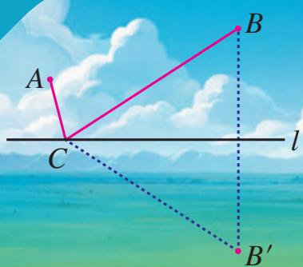

text_image

A
B
C
l
B'

# 数学

# 八年级

# 上册

人民教育出版社 课程教材研究所 编著

人民教育出版社

· 北京 ·

顾问：林群田刚

主 编：王长平

执行主编：李海东

分册主编：孙延洲

编写人员（以姓氏笔画为序）：

王嵘 王用华 刘长明 孙延洲

胡红芳 姚 芳 袁亚良 薛 彬

责任编辑：张伟

责任设计：王俊宏

责任校对：田莉

责任印制：×××

义务教育教科书 数学 八年级 上册

人民教育出版社 课程教材研究所 编著

出版 人民教育出版社

（北京市海淀区中关村南大街17号院1号楼 邮编：100081）

网址 http://www.pep.com.cn

版权所有·侵权必究

# 致同学

亲爱的同学，八年级的数学学习开始了。在本学期，我们将要学习哪些内容？快来了解一下吧。

相信你对三角形并不陌生，比如我们在小学已经学过“三角形的内角和等于 $180^{\circ}$ ”，怎样证明这个结论呢？在“三角形”中，你不仅能够解决这个问题，而且能够学到研究几何图形的重要思想和方法。“全等三角形”将带你认识全等这种图形间特殊的关系，获得判断两个三角形全等的方法，探索并证明角的平分线的性质。学习了这些内容，你的推理能力和解决问题的能力会进一步提升。

在我们周围的世界中，你会看到许多美丽的轴对称图形，在“轴对称”中，你将学习轴对称这种图形变化，并利用它研究等腰三角形这种特殊的三角形。学习了这些内容，你感知并描述图形运动和变化规律的能力以及推理能力会进一步提升。

我们已经学习了整式这种基本的代数式，学习了整式的加减运算，在“整式的乘法”中，你将类比数的运算，进一步学习整式的乘除运算，学习一些重要的运算性质和公式，加深对“从数到式”这个由具体到抽象的过程的认识。在“因式分解”中，你将学习因式分解这种与整式乘法方向相反的变形。通过这些内容的学习，你的运算能力会进一步提升。

数有整数与分数之分，式也有整式与分式之别。在“分式”中，你将类比分数的概念、性质、运算，学习分式的概念、性质、运算，并学习通过建立分式方程解决实际问题。通过这些内容的学习，你的运算能力以及应用数学的概念、原理和方法解决实际问题的能力会进一步提升。

此外，综合与实践“确定匀质薄板的重心位置”将带你了解重心的概念，探究确定平面组合图形重心位置的方法；“最短路径问题”将带你利用轴对称和平移的相关知识解决生活中的最短路径问题，感受数学的广泛应用.

数学伴着我们成长，数学伴着我们进步，数学伴着我们成功。让我们扬帆起航，开启一段新的数学之旅吧！

# 目录

# 第十三章 三角形 1

natural_image

Exterior view of a modern glass skyscraper against a blue sky with scattered clouds (no signage or text visible)

13.1 三角形的概念 2

13.2 与三角形有关的线段 5

13.3 三角形的内角与外角 11

阅读与思考 为什么要证明 18

数学活动 19

小结 20

综合与实践 确定匀质薄板的重心位置 23

第十四章 全等三角形 28

natural_image

Exterior view of a large steel truss bridge spanning a wide river under a clear blue sky (no signage or text visible)

14.1 全等三角形及其性质 29

14.2 三角形全等的判定 32

信息技术应用 探究三角形全等的条件 46

14.3 角的平分线 48

图说数学史 公理化方法 54

数学活动 56

小结 57

natural_image

Aerial view of a traditional Chinese palace complex with red walls and golden-tiled roofs, surrounded by trees and modern buildings in the background (no visible text or symbols).

# 第十五章 轴对称 61

15.1 图形的轴对称 62  
15.2 画轴对称的图形 72  
15.3 等腰三角形 78

探究与发现 三角形中边与角之间的不等关系

86

数学活动 88

小结 90

# 综合与实践 最短路径问题 94

# 第十六章 整式的乘法 97

natural_image

City skyline with modern skyscrapers and a green park in the foreground under a blue sky (no visible text or signage)

16.1 幂的运算 98   
16.2 整式的乘法 103  
16.3 乘法公式 112

阅读与思考 杨辉三角 118

数学活动 119

小结 120

# 第十七章 因式分解 123

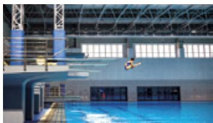

natural_image

Interior view of a modern indoor swimming pool with a person mid-air during the water (no visible text or symbols)

17.1 用提公因式法分解因式 124  
17.2 用公式法分解因式 128

阅读与思考 $x^{2} + (p + q)x + pq$ 型式子的因式分解 133

数学活动 134

小结 135

# 第十八章 分式 137

natural_image

Scenic river valley with lush green mountains, a small boat on the water, and clouds above (no text or symbols visible)

18.1 分式及其基本性质 138  
18.2 分式的乘法与除法 146  
18.3 分式的加法与减法 152

阅读与思考 容器中的水能倒完吗 157

18.4 整数指数幂 158   
18.5 分式方程 164

数学活动 170

小结 171

# 第十三章 三角形

三角形是一种基本的几何图形。从古埃及的金字塔到现代的建筑物，从巨大的高压输电塔到微小的分子结构，到处都有三角形的形象。为什么在工程建筑、机械制造中经常采用三角形的结构呢？这与三角形的性质有关。

一个三角形有三条边、三个角．三条边之间有什么关系？三个角之间有什么关系？在小学，我们通过测量、剪拼等方法，知道三角形两边的和大于第三边，三角形的内角和等于 $180^{\circ}$ 等结论．而在几何中，要确认一个命题的正确性，还必须通过推理证明．在本章中，我们就来证明这些结论.

本章我们将比较系统地学习三角形，同时进一步学习推理证明的方法。学习本章后，我们不仅可以进一步认识三角形，而且可以学习一些几何中研究问题的基本思路和方法。

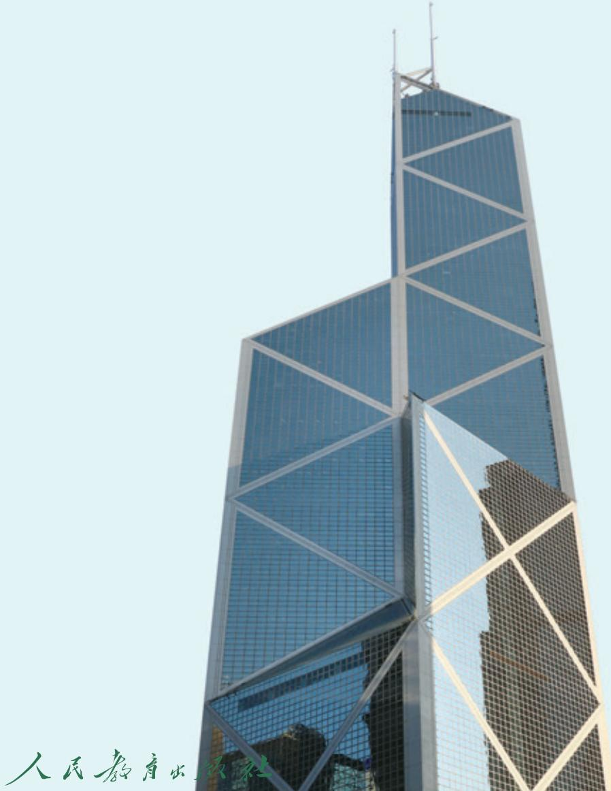

text_image

人民教育出版社

## 13.1 三角形的概念

在小学，我们已经初步认识了三角形。本节我们将进一步学习三角形的有关概念及其符号表示，以及三角形的分类。

如图13.1-1，由不在同一条直线上的三条线段首尾顺次相接所组成的图形叫作三角形（triangle）。组成三角形的线段叫作三角形的边，相邻两边的公共端点叫作三角形的顶点，相邻两边所组成的角叫作三角形的内角，简称三角形的角。例如，在图13.1-1中，线段 $AB$ ， $BC$ ， $CA$ 是三角形的边；点 $A$ ， $B$ ， $C$ 是三角形的顶点； $\angle A$ ， $\angle B$ ， $\angle C$ 是三角形的角。

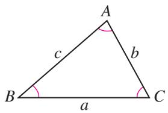

text_image

A
b
c
B
a
C

图13.1-1

顶点是 A, B, C 的三角形，记作 “ $\triangle ABC$ ”，读作 “三角形 ABC”。 $\triangle ABC$ 的三边有时也用 a, b, c 来表示。如图 13.1-1，顶点 A 所对的边 BC 用 a 表示，顶点 B 所对的边 AC 用 b 表示，顶点 C 所对的边 AB 用 c 表示。

> [!explore] 探究
我们知道，按照三个内角的大小，可以将三角形分为锐角三角形、直角三角形和钝角三角形。如何按照边的关系对三角形进行分类呢？说一说你的想法，并与同学交流。

在三角形中，有的三角形三边都不相等（图 13.1-2（1）），有的三角形有两边相等（图 13.1-2（2）），有的三角形三边都相等（图 13.1-2（3））.
> 

> 
> | 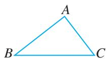 | 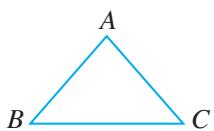 |
> | --- | --- |
> | （1） | （2） |
> 

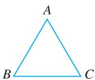

text_image

A
B
C

(3)   
图13.1-2

有两边相等的三角形叫作等腰三角形（isosceles triangle），其中相等的两边叫作腰，另一边叫作底边，两腰的夹角叫作顶角，腰和底边的夹角叫作底角．三边都相等的三角形叫作等边三角形（equilateral triangle），等边三角形是特殊的等腰三角形，即底边和腰相等的等腰三角形.
因此，可以先按 “是否有边相等”，将三角形分成两类：三边都不相等的三角形和等腰三角形；再将等腰三角形分为底边和腰不相等的等腰三角形和等边三角形，得到三角形按边的相等关系分类如下：三角形\$\left\{\begin{array}{l}\$三边都不相等的三角形\\ 等腰三角形\$\left\{\begin{array}{l}\$底边和腰不相等的等腰三角形\\ 等边三角形\end{array}\right.\$\end{array}\right.\$

例如图 13.1-3，在 $\triangle ABC$ 中，点 D 在边 BC 上，BD=AD=DC=AC.

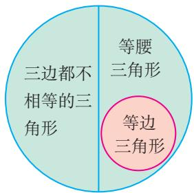

text_image

三边都不相等的三角形
等腰三角形
等边三角形

三角形

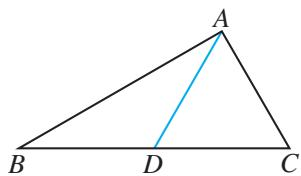

text_image

A
B D C

图13.1-3
(1) 写出以点 C 为顶点的三角形;  
(2) 写出以 AB 为边的三角形;  
(3) 找出图中的等腰三角形和等边三角形.
解：（1）以点 C 为顶点的三角形是 $\triangle ABC$ ， $\triangle ADC$ ;
(2) 以 AB 为边的三角形是 $\triangle ABC$ ， $\triangle ABD$ ;  
（3）等腰三角形是 $\triangle ABD$ ， $\triangle ADC$ ；等边三角形是 $\triangle ADC$ 。

#### 练习

1. 如图，在 $\triangle ABC$ 中， $AB = BC = CA$ ，点 $O$ 在 $\triangle ABC$ 内， $OA = OB = OC$ ，找出图中的等腰三角形和等边三角形.

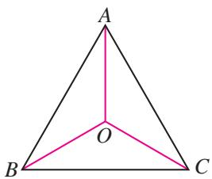

text_image

A
O
B
C

(第1题)

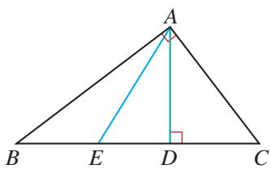

text_image

A
B E D C

(第2题)

2. 如图，在 $\triangle ABC$ 中， $\angle BAC$ 是直角， $AD \perp BC$ ，垂足为 $D$ ，点 $E$ 在线段 $BD$ 上，找出图中的锐角三角形、直角三角形和钝角三角形.

# 习题 13.1

### 复习巩固

1. 如图，写出以 $\angle A$ 为角的三角形，写出以 $BC$ 为边的三角形.

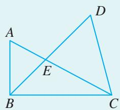

text_image

A
D
E
B
C

(第1题)

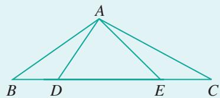

text_image

A
B D E C

(第2题)

2. 图中有几个三角形？用符号表示这些三角形.

### 综合运用

3. 如图，在 $\triangle ABC$ 中， $AD \perp BC$ ，垂足为 $D$ ， $\angle BAC$ 是钝角， $E$ 是 $DC$ 上一点，且 $\angle BAE$ 是锐角， $EF \perp AC$ ，垂足为 $F$ .
(1) 图中有几个三角形？用符号表示这些三角形.  
(2) 找出图中的锐角三角形、直角三角形和钝角三角形.

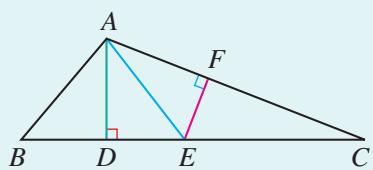

text_image

A
F
B D E C

(第3题)

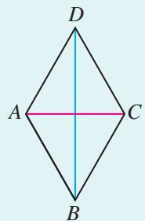

text_image

D
A C
B

(第4题)

4. 如图， $AB = BC = CD = DA = AC$ ，找出图中的等腰三角形和等边三角形.

### 拓广探索

5. 如图，已知点 $A, B$ 在直线 $a$ 上，点 $C, D, E$ 在直线 $b$ 上。以点 $A, B, C, D, E$ 中的任意三点作为三角形的顶点，一共可以组成多少个三角形？分别写出这些三角形。

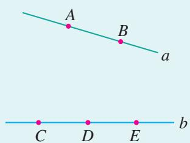

text_image

A
B
a
C D E
b

(第5题)

## 13.2 与三角形有关的线段

三角形的边是构成三角形的元素，本节我们研究三角形三边之间的关系，并认识与三角形有关的三种重要线段.

### 13.2.1 三角形的边

> [!explore] 探究
任意画一个 $\triangle ABC$ （图13.2-1），从点 $B$ 出发，沿三角形的边到点 $C$ ，有几条线路可以选择？各条线路的长有什么关系？这说明三角形的边之间有什么关系？能证明你的结论吗？

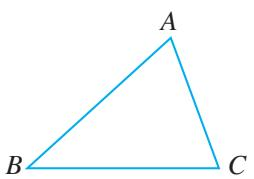

natural_image

Simple geometric triangle labeled ABC with vertices marked (no additional text or symbols)

图13.2-1

在从点 B 到点 C 的线路中，由点 B 先到点 A 再到点 C 的线路，比由点 B 直接到点 C 的线路长，即 $BA + AC > BC$ ，这利用了在小学我们学过的“三角形两边的和大于第三边”的结论。下面对这个结论进行证明。

对于任意一个 $\triangle ABC$ ，如果把其中任意两个顶点（例如 $B, C$ ）看成定点，由“两点之间，线段最短”，可得
$A B + A C > B C. \tag {①}$
同理有
$A C + B C > A B, \tag {②}$
$A B + B C > A C. \tag {③}$

这样，我们就证明了，三角形两边的和大于第三边.

进一步，由不等式②③，移项可得
$B C > A B - A C,$
$B C > A C - A B.$
这就是说，三角形两边的差小于第三边.

> [!think] 思考
上面的结论表明了三角形三边之间的关系．反过来，对于三条线段，当它们满足什么条件时，这三条线段能组成三角形？

一般地，如果三条线段中任意两条线段的和大于第三条线段，那么这三条线段能组成三角形；如果三条线段中有两条线段的和小于或等于第三条线段，那么这三条线段不能组成三角形.

例 用一条长为 $18 \mathrm{~cm}$ 的细绳围成一个等腰三角形.
(1) 如果腰长是底边长的 2 倍, 那么各边的长是多少?  
(2) 能围成有一边的长是 $4 \mathrm{~cm}$ 的等腰三角形吗？为什么？
解：（1）设底边长为 $x \, cm$ ，则腰长为 $2x \, cm$ ，则
$x + 2 x + 2 x = 1 8.$
解得 x=3.6.
所以，三角形三边的长分别为 $3.6 \, cm$ ， $7.2 \, cm$ ， $7.2 \, cm$ .
(2) 因为长为 $4 \mathrm{~cm}$ 的边可能是腰, 也可能是底边, 所以需要分情况讨论.

①如果 $4 \, cm$ 长的边为底边，设腰长为 $x \, cm$ ，则
$4 + 2 x = 1 8.$
解得 x=7.

②如果 $4 \, cm$ 长的边为腰，设底边长为 $y \, cm$ ，则
$2 \times 4 + y = 1 8.$
解得 y=10.
因为 $4+4<10$ ，不符合 “三角形两边的和大于第三边”，所以不能围成腰长是 4 cm 的等腰三角形.
由以上讨论可知，可以围成底边长是 $4 \, cm$ 的等腰三角形.

在日常生活中，三角形的形状随处可见，并且工程建筑中经常采用三角形的结构，如图 13.2-2 中的屋顶钢架结构等，其中的道理是什么？

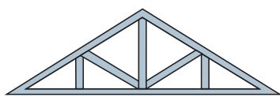

natural_image

Structural truss diagram showing triangular beams and supports (no text or labels)

图13.2-2

> [!explore] 探究
如图 13.2-3，将三根木条用钉子钉成一个三角形木架，然后扭动它，它的形状会改变吗？

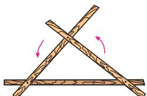

natural_image

Diagram of two crossed wooden sticks forming a triangular cross pattern with rotation arrows (no text or symbols)

图13.2-3

可以发现，三角形木架的形状不会改变，这就是说，三角形是具有稳定性的图形.

三角形的稳定性有着广泛的应用，图 13.2-4 表示其中一些例子．你能再举一些例子吗？

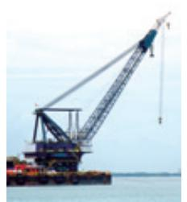

natural_image

Large crane lifting a bridge structure over water, no visible text or symbols

起重机

natural_image

Exterior view of a large steel truss bridge spanning a wide river under a blue sky (no signage or text visible)

钢架桥   
图13.2-4

#### 练习

1. 下列长度的三条线段能否组成三角形？为什么？
(1) 3, 4, 8;
(2) 5, 6, 11;
(3) 5, 6, 10.

2. 一根 $4 \mathrm{dm}$ 长的木条和两根 $1 \mathrm{dm}$ 长的木条, 能否组成一个等腰三角形? 两根 $4 \mathrm{dm}$ 长的木条和一根 $1 \mathrm{dm}$ 长的木条呢?

### 13.2.2 三角形的中线、角平分线、高

与三角形有关的线段，除了三条边，还有三种重要的线段：三角形的中线、角平分线、高.

如图 13.2-5（1），连接△ABC 的顶点 A 和它所对的边 BC 的中点 D，所得线段 AD 叫作△ABC 的边 BC 上的中线.

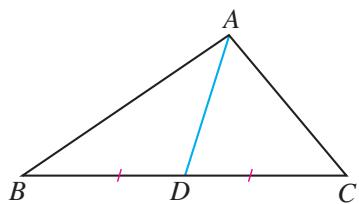

text_image

A
B D C

(1)

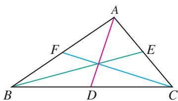

text_image

A
F
E
B
D
C

(2)   
图13.2-5

一个三角形有三条中线，这三条中线相交于一点（图13.2-5（2））。三角形三条中线的交点叫作三角形的重心。

如图 13.2-6（1），画△ABC 的∠A 的平分线 AD，交∠A 所对的边 BC 于点 D，所得线段 AD 叫作△ABC 的角平分线。三角形的三条角平分线相交于一

点（图13.2-6（2））.

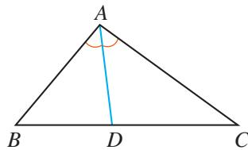

text_image

A
B D C

(1)

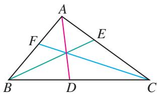

text_image

A
F
E
B
D
C

(2)   
图13.2-6

如图13.2-7，从 $\triangle ABC$ 的顶点 $A$ 向它所对的边 $BC$ 所在直线画垂线，垂足为 $D$ ，所得线段 $AD$ 叫作 $\triangle ABC$ 的边 $BC$ 上的高线．三角形的高线简称三角形的高.

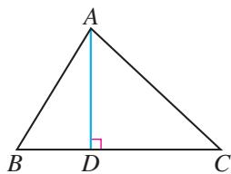

text_image

A
B D C

图 13.2-7

> [!explore] 探究
分别画出锐角三角形、直角三角形、钝角三角形的三条高，你有什么发现？

锐角三角形的三条高都在三角形的内部（图 13.2-8（1））；直角三角形有两条高恰好是它的两条直角边（图 13.2-8（2））；钝角三角形有两条高在三角形的外部，两个垂足落在边的延长线上（图 13.2-8（3））.

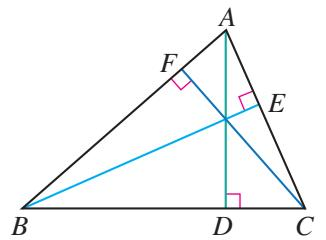

text_image

Geometric diagram of triangle ABC with perpendiculars and labeled points D, E, F

(1)

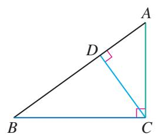

text_image

Geometric diagram of triangle ABC with perpendicular lines from D to AC, labeled with points A, B, C, and D.

(2)

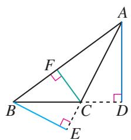

text_image

Geometric diagram of triangle ABC with perpendiculars and labeled points D, E, F

(3)   
图13.2-8

#### 练习

1. 如图，过 $\triangle ABC$ 的顶点 $C$ 分别画出它的中线、角平分线和高.

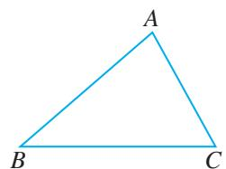

natural_image

Simple geometric diagram of a triangle labeled ABC (no additional text or symbols)

(第1题)

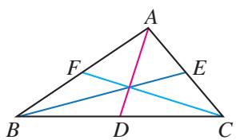

text_image

Geometric diagram of triangle ABC with internal points D, E, F and intersecting lines

(1)

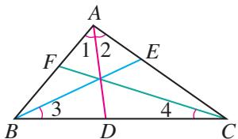

text_image

A
1 2
F       E
B       D       C
3       4

(2)   
(第2题)

#### 2. 填空题.
（1）如图（1），AD，BE，CF是△ABC的三条中线，则 $BD=$ \_\_\_\_，
$A E = \frac {1}{2} \quad , A B = 2 \quad ;$
(2) 如图 (2), AD, BE, CF 是 $\triangle ABC$ 的三条角平分线，则 $\angle1=$ \_\_\_\_，
$\angle 3 = \frac {1}{2} \quad , \angle A C B = 2.$

# 习题 13.2

### 复习巩固

1. 三角形的三边长分别为 2, 7, a，则 a 的取值范围是 \_\_\_\_.  
2. 长为 100 cm, 70 cm, 50 cm, 30 cm 的四根木条，选其中三根组成三角形，有几种选法？为什么？  
3. 对于下面每个三角形，分别过顶点 A 画出它的中线、角平分线和高.

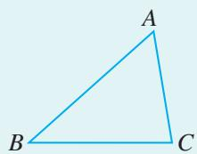

natural_image

Simple geometric diagram of a triangle labeled A, B, C (no additional text or symbols)

(1)

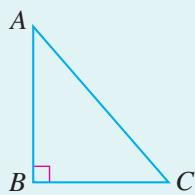

text_image

A
B
C

(2)

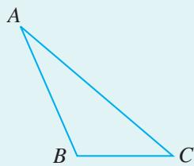

natural_image

Simple geometric diagram of a triangle labeled A, B, C (no additional text or symbols)

(3)   
(第3题)

4. 如图，在 $\triangle ABC$ 中， $AE$ 是中线， $AD$ 是角平分线， $AF$ 是高。填空：
(1) $BE = \underline{\hspace{2cm}} = \frac{1}{2} \underline{\hspace{2cm}}$ ;   
(2) $\angle BAD = \underline{\hspace{2cm}} = \frac{1}{2}\underline{\hspace{2cm}};$   
(3) $\angle AFB =$ \_\_\_\_ $= 90^{\circ}$ ;   
(4) 若 BC=8, AF=5,

则 $S_{\triangle ABC}=$ \_\_\_\_，
$S _ {\triangle A B E} = \underline {{\quad}}.$

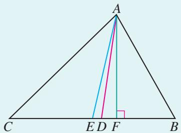

text_image

A
C E D F B

(第4题)

### 综合运用

5. 一个等腰三角形的一边长为 6，周长为 20，求其他两边的长.

6.（1）已知等腰三角形的一边长为5，一边长为6，求它的周长；
(2) 已知等腰三角形的一边长为 4，一边长为 9，求它的周长.

7. 如图，在 $\triangle ABC$ 中，若 $AB = 2$ ， $BC = 4$ ，则 $\triangle ABC$ 的高 $AD$ 与 $CE$ 的比是多少？（提示：利用三角形的面积公式。）

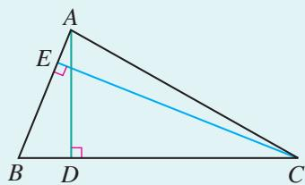

text_image

A
E
B D C

(第7题)

### 拓广探索

8. 如图，在 $\triangle ABC$ 中， $AD$ 是它的角平分线， $DE \parallel AC$ ， $DE$ 交 $AB$ 于点 $E$ ， $DF \parallel AB$ ， $DF$ 交 $AC$ 于点 $F$ 。图中 $\angle 1$ 与 $\angle 2$ 有什么关系？为什么？

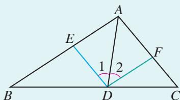

text_image

A
E
1 2
B D C
F

(第8题)

## 13.3 三角形的内角与外角

与边一样，三角形的角也是构成三角形的元素。本节我们学习三角形的三个内角之间的关系，并进一步学习其他与三角形有关的角。

### 13.3.1 三角形的内角

在小学，通过度量或剪拼，我们已经知道三角形的内角和等于 $180^{\circ}$ ，这样的方法获得的结论可靠吗？
由于测量常常有误差，这样验证三角形的内角和等于 $180^{\circ}$ ，不能完全令人信服；又由于形状不同的三角形有无数个，我们不可能用上述方法一一验证所有三角形的内角和等于 $180^{\circ}$ 。因此，需要通过推理的方法去证明：任意一个三角形的内角和等于 $180^{\circ}$ 。

> [!explore] 探究
你还记得在小学是如何通过剪拼的方法得出三角形的内角和吗？图13.3-1给出了两种剪拼的方法。从这个操作过程中，你能发现证明的思路吗？

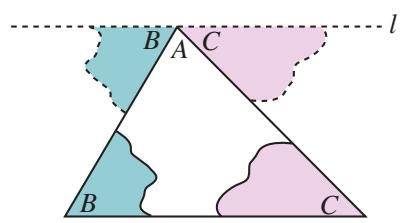

text_image

B A C
l
B C

(1)

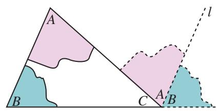

text_image

A
B
C
A'B'
l

(2)   
图13.3-1

在图 13.3-1（1）中，将 $\triangle ABC$ 的 $\angle B$ 和 $\angle C$ 剪下，分别拼在 $\angle A$ 的左右，三个角合起来形成一个平角，出现一条过点 A 的直线 l，移动后的 $\angle B$ 和 $\angle C$ 各有一条边在直线 l 上。想一想，直线 l 与 $\triangle ABC$ 的边 BC 有什么关系？你能由这个图想出证明 “三角形的内角和等于 $180^{\circ}$ ” 的方法吗？
由上述拼合过程得到启发，过 $\triangle ABC$ 的顶点 $A$ 作直线 $l$ 平行于 $\triangle ABC$ 的边 $BC$ （图13.3-2). 由平行线的性质与平角的定义就能证明“三角形的内角和等于 $180^{\circ}$ ”这个结论.

已知： $\triangle ABC$ （图13.3-2）.

求证： $\angle A + \angle B + \angle C = 180^{\circ}.$
证明：如图 13.3-2，过点 A 作直线 l，使 $l \parallel BC$ .
$\because l \parallel BC,$

∴ $\angle2=\angle4$ （两直线平行，内错角相等）.
同理 $\angle 3 = \angle 5.$

∵ $\angle1,\angle4,\angle5$ 组成平角，

∴ $\angle1+\angle4+\angle5=180^{\circ}$ (平角定义).

∴ $\angle1+\angle2+\angle3=180^{\circ}$ (等量代换).

以上我们就证明了任意一个三角形的内角和都等于 $180^{\circ}$ ，得到如下三角形的内角和定理：

# 三角形的内角和等于 $180^{\circ}$ .

> [!example]- 例 1 如图 13.3-3，在 $\triangle ABC$ 中， $\angle BAC = 40^{\circ}$ ， $\angle B = 75^{\circ}$ ， $AD$ 是 $\triangle ABC$ 的角平分线。求 $\angle ADB$ 的度数。
解：由 $\angle BAC = 40^{\circ}$ ， $AD$ 是 $\triangle ABC$ 的角平分线，得
$\angle B A D = \frac {1}{2} \angle B A C = 2 0 ^ {\circ}.$

在 $\triangle ABD$ 中，
$\angle A D B = 1 8 0 ^ {\circ} - \angle B - \angle B A D = 1 8 0 ^ {\circ} - 7 5 ^ {\circ} - 2 0 ^ {\circ} = 8 5 ^ {\circ}.$

> [!example]- 例 2 图 13.3-4 是 A, B, C 三岛的平面图, C 岛在 A 岛的北偏东 $50^{\circ}$ 方向, B 岛在 A 岛的北偏东 $80^{\circ}$ 方向, C 岛在 B 岛的北偏西 $40^{\circ}$ 方向. 从 B 岛看 A, C 两岛的视角 $\angle ABC$ 是多少度? 从 C 岛看 A, B 两岛的视角 $\angle ACB$ 呢?
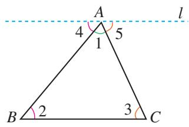

text_image

A
4
1
5
l
B
2
3
C

图13.3-2
由图 13.3-1（2），你能给出这个定理的其他证法吗？  
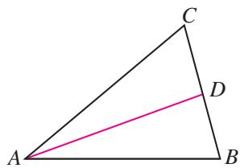

text_image

C
D
A
B

图13.3-3

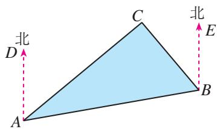

text_image

北
D
C
北
E
A
B

图13.3-4
分析：A，B，C三岛的连线构成△ABC，所求的∠ACB是△ABC的一个内角．如果能求出∠CAB，∠ABC，就能求出∠ACB.
解： $\angle CAB = \angle BAD - \angle CAD = 80^{\circ} - 50^{\circ} = 30^{\circ}$ .
由 $AD \parallel BE$ ，得
$\angle B A D + \angle A B E = 1 8 0 ^ {\circ}.$
所以
$\angle A B E = 1 8 0 ^ {\circ} - \angle B A D = 1 8 0 ^ {\circ} - 8 0 ^ {\circ} = 1 0 0 ^ {\circ},$
$\angle A B C = \angle A B E - \angle C B E = 1 0 0 ^ {\circ} - 4 0 ^ {\circ} = 6 0 ^ {\circ}.$

在 $\triangle ABC$ 中，
$\angle A C B = 1 8 0 ^ {\circ} - \angle A B C - \angle C A B$
$= 1 8 0 ^ {\circ} - 6 0 ^ {\circ} - 3 0 ^ {\circ} = 9 0 ^ {\circ}.$

答：从 B 岛看 A，C 两岛的视角 $\angle ABC$ 是 $60^{\circ}$ ，从 C 岛看 A，B 两岛的视角 $\angle ACB$ 是 $90^{\circ}$ .

你还能给出其他解法吗？

#### 练习

1. 如图，从 $A$ 处观测 $C$ 处的仰角 $\angle CAD = 30^{\circ}$ ，从 $B$ 处观测 $C$ 处的仰角 $\angle CBD = 45^{\circ}$ 。从 $C$ 处观测 $A$ ， $B$ 两处的视角 $\angle ACB$ 是多少度？

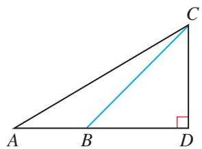

text_image

Geometric diagram of triangle ABC with point D on base AD and line segment BD drawn

(第1题)

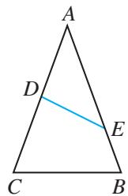

text_image

A
D
E
C
B

(第2题)

2. 如图，在 $\triangle ABC$ 中， $\angle A=40^{\circ}$ ，求 $\angle B+\angle C+\angle ADE+\angle AED$ 的度数.

利用三角形的内角和定理，可以得到一些特殊三角形的内角的关系.

如图 13.3-5，在直角三角形 ABC 中， $\angle C=90^{\circ}$ ，由三角形的内角和定理，得
$\angle A + \angle B + \angle C = 1 8 0 ^ {\circ},$
即
$\angle A + \angle B + 9 0 ^ {\circ} = 1 8 0 ^ {\circ},$
所以

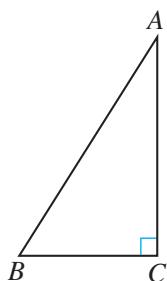

text_image

A
B
C

图13.3-5
$\angle A + \angle B = 9 0 ^ {\circ}.$

也就是说，直角三角形的两个锐角互余.

直角三角形可以用符号 “Rt△” 表示，直角三角形 ABC 可以写成 Rt△ABC.

> [!example]- 例3如图13.3-6， $\angle C = \angle D = 90^{\circ}$ ， $AD$ ，BC相交于点 $E$ .比较∠CAE与∠DBE的大小.
解：在 Rt△ACE 中，
$\angle C A E = 9 0 ^ {\circ} - \angle A E C.$

在 Rt△BDE 中，
$\angle D B E = 9 0 ^ {\circ} - \angle B E D.$
$\because \angle A E C = \angle B E D,$
$\therefore \angle C A E = \angle D B E.$

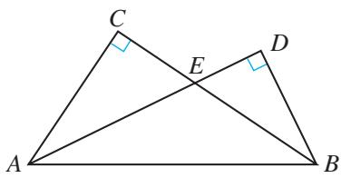

text_image

C
E
D
A
B

图13.3-6

> [!think] 思考
我们知道，如果一个三角形是直角三角形，那么这个三角形有两个角互余．反过来，有两个角互余的三角形是直角三角形吗？试说明理由.
由三角形的内角和定理可得（请你自己完成证明）：

有两个角互余的三角形是直角三角形.

#### 练习

1. 如图，在 $\triangle ABC$ 中， $\angle ACB = 90^{\circ}$ ， $CD \perp AB$ ，垂足为 $D$ 。∠ACD 与 $\angle B$ 有什么关系？为什么？

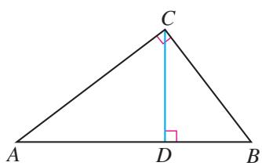

text_image

C
A D B

(第1题)

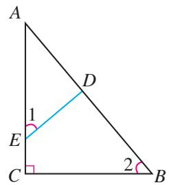

text_image

A
1
E
C
2
B
D

(第2题)

2. 如图，在 $\triangle ABC$ 中， $\angle C = 90^{\circ}$ ，点 $D, E$ 分别在边 $AB, AC$ 上，且 $\angle 1 = \angle 2$ ， $\triangle ADE$ 是直角三角形吗？为什么？

### 13.3.2 三角形的外角

如图 13.3-7，把 $\triangle ABC$ 的一边 BC 延长，得到 $\angle ACD$ 。像这样，三角形的一边与另一边的延长线组成的角，叫作三角形的外角。

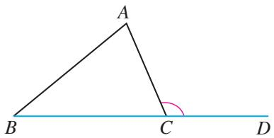

text_image

A
B C D

图13.3-7

> [!think] 思考
如图 13.3-8，在 $\triangle ABC$ 中， $\angle A = 70^{\circ}$ ， $\angle B = 60^{\circ}$ ， $\angle ACD$ 是 $\triangle ABC$ 的一个外角。能由 $\angle A$ ， $\angle B$ 求出 $\angle ACD$ 吗？如果能， $\angle ACD$ 与 $\angle A$ ， $\angle B$ 有什么关系？

任意一个三角形的一个外角与和它不相邻的两个内角是否都有这种关系？

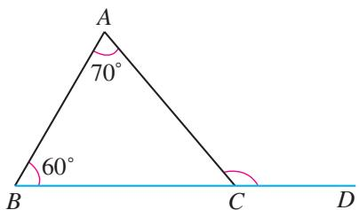

text_image

A
70°
60°
B C D

图13.3-8

一般地，由三角形的内角和定理可以推出下面的推论（请你自己完成证明）：

# 三角形的外角等于与它不相邻的两个内角的和.

> [!example]- 例4 如图13.3-9， $\angle BAE$ ， $\angle CBF$ ， $\angle ACD$ 是 $\triangle ABC$ 的三个外角，它们的和是多少？
解：由三角形的一个外角等于与它不相邻的两个内角的和，得
$\angle B A E = \angle 2 + \angle 3,$
$\angle C B F = \angle 1 + \angle 3,$
$\angle A C D = \angle 1 + \angle 2.$
所以
$\angle B A E + \angle C B F + \angle A C D = 2 (\angle 1 + \angle 2 + \angle 3).$
由 $\angle 1 + \angle 2 + \angle 3 = 180^{\circ}$ ，得
$\angle B A E + \angle C B F + \angle A C D = 2 \times 1 8 0 ^ {\circ} = 3 6 0 ^ {\circ}.$

推论是由定理直接推出的结论. 和定理一样, 推论可以作为进一步推理的依据.

text_image

E
A
1
B
2
3
C
D
F

图13.3-9

你还能给出其他解法吗？

#### 练习

说出下列各图形中 $\angle 1$ 和 $\angle 2$ 的度数：

text_image

80°
60° 1 2

(1)

text_image

2
1
30°
40°

(2)

text_image

1
2
40°

(3)

text_image

A
70°
40°
2
1
CE平分∠ACD
B
C
D
E

(4)

text_image

60°
1
60° 20° 2

(5)

text_image

2
1
30°

(6)

# 习题 13.3

### 复习巩固

1. 求出下列各图形中 $x$ 的值：

text_image

x°
39° 108°

(1)

text_image

x°
x°
x°

(2)

text_image

72°
x°
x°

(3)

text_image

(x-36)°
(x+36)°
x°

(4)   
(第1题)

2.（1）一个三角形最多有几个直角？为什么？  
(2) 一个三角形最多有几个钝角？为什么？  
(3) 直角三角形的外角可以是锐角吗? 为什么?

3. 在 $\triangle ABC$ 中， $\angle B$ 比 $\angle A$ 大 $10^{\circ}$ ， $\angle C$ 比 $\angle B$ 大 $10^{\circ}$ . 求 $\triangle ABC$ 各内角的度数.

4. 如图，在 $\triangle ABC$ 中， $AD \perp BC$ ，垂足为 $D$ ， $\angle 1 = \angle 2$ ， $\angle C = 65^\circ$ 。求 $\angle BAC$ 的度数。

text_image

A
1
2
65°
B D C

(第4题)

### 综合运用

5. 如图， $AB \parallel CD$ ， $\angle A = 40^{\circ}$ ， $\angle D = 45^{\circ}$ 。求 $\angle 1$ 和 $\angle 2$ 的度数。

text_image

D
45°
1
C
2
A
40°
B

(第5题)

text_image

A 45° O E
B
C
D

(第6题)

6. 如图， $AB \parallel CD$ ，AE 与 CD 相交于点 O， $\angle A = 45^{\circ}$ ， $\angle C = \angle E$ 。求 $\angle C$ 的度数。  
7. 如图，B 处在 A 处的南偏西 $45^{\circ}$ 方向，C 处在 A 处的南偏东 $15^{\circ}$ 方向，C 处在 B 处的北偏东 $80^{\circ}$ 方向。求 $\angle ACB$ 的度数。

text_image

北
南
B
C
A

(第7题)

text_image

A
D
E
F
B
C

(第8题)

text_image

A
100°
x°
1
2
B
3
4
C

(第9题)

8. 如图, 在 $\triangle ABC$ 中, $D$ 是边 $AB$ 上一点, $E$ 是边 $AC$ 上一点, $BE$ , $CD$ 相交于点 $F$ , $\angle A = 62^{\circ}$ , $\angle ACD = 35^{\circ}$ , $\angle ABE = 20^{\circ}$ . 求 $\angle BDC$ 和 $\angle BFD$ 的度数.  
9. 如图，在 $\triangle ABC$ 中， $\angle A=100^{\circ}$ ， $\angle 1=\angle 2$ ， $\angle 3=\angle 4$ 。求 $x$ 的值。

### 拓广探索

10. 如图， $AB \parallel CD$ ， $\angle BAE = \angle DCE = 45^{\circ}$ 。填空：
$\because \quad A B \parallel C D,$
$\therefore \angle 1 + 4 5 ^ {\circ} + \angle 2 + 4 5 ^ {\circ} = \underline {{\quad}}.$
$\therefore \angle 1 + \angle 2 = \underline {{\quad}}.$
$\therefore \angle E = \underline {{\quad}}.$

text_image

A
1
45°
E
2
45°
C
D

(第10题)

text_image

Geometric diagram showing triangle ABC with points D, E, and A labeled, including a right angle at C.

(第11题)

11. 如图，CE 是 $\triangle ABC$ 的外角 $\angle ACD$ 的平分线，且 CE 交 BA 的延长线于点 E. 求证 $\angle BAC = \angle B + 2\angle E$ .

## 阅读与思考

### 为什么要证明

李明：我们观察任意一个三角形，量出它的每个内角，都能得出它的内角和等于 $180^{\circ}$ ，为什么还要证明这个结论呢？

刘老师：通过观察、试验等可以寻找规律，但是由于观察可能有误差，试验可能受干扰，考察对象可能不具有一般性等原因，一般来说，由观察、试验等所产生的“结论”未必正确。例如，让一个班的学生每人任意画一个三角形，再量出它的每个内角，计算三个内角的和，得到的结果未必全是 $180^{\circ}$ ，可能有的会比 $180^{\circ}$ 大一些，有的会比 $180^{\circ}$ 小一些。

李明：如果观察细致，仪器精确，不产生误差，还需要证明吗？

刘老师：仅通过观察、试验等就下结论有时也缺乏说服力。例如，即使不考虑误差等因素，当上面观察的所有结果全是 $180^{\circ}$ 时，人们还会有疑问：“不同形状的三角形有无数个，我们画出并验证的只是其中有限个，其余三角形的内角和是多少呢？能对所有的三角形都进行验证吗？”事实上，不管我们经历多长时间，画出多少个三角形，观察、试验的对象也是有限个。因此，要确认“三角形的内角和等于 $180^{\circ}$ ”，就不能仅依靠度量等手段进行验证，而必须进行推理论证——对于一般的三角形，推出它的三个内角的和等于一个平角，从而得出“无论三角形的具体形状如何，它的内角和一定等于 $180^{\circ}$ ”。

李明：现在我明白了，一个数学命题是否正确，需要经过理由充足、使人信服的推理论证才能得出结论。观察、试验等是发现数学公式、定理的重要途径，而证明则是确认数学公式、定理的必要步骤。

# 数学活动

# 活动1 搭等边三角形

取一些等长的磁力棒（图1）。用3根磁力棒能组成1个等边三角形（图2），用6根磁力棒能组成4个等边三角形吗？用9根磁力棒最多能组成几个等边三角形？动手试一试，并与同学交流。（提示：可以考虑立体图形。）

# 活动2 多边形的三角剖分

与三角形类似，多条线段首尾顺次相接就组成多边形。容易发现，三角形是最简单的多边形，那么任意一个多边形是否都能分割成三角形呢？

natural_image

Five horizontal colored bars (orange, green, blue) with no text or symbols

图 1  

natural_image

Simple geometric triangle diagram with blue, green, and orange lines forming a triangle (no text or symbols)

图2

把一个多边形用连接它的不相邻顶点的线段（这些线段不在多边形内部相交）划分为若干个三角形，叫作多边形的三角剖分。图3给出了七边形的三角剖分的几种方法。

natural_image

Four identical geometric diagrams showing a polygon with internal diagonals, no text or symbols present.

图3
（1）试着将一个四边形、五边形、六边形进行三角剖分，分别能剖分出多少个三角形？ $n$ 边形呢？  
(2) 将一个四边形进行三角剖分，你有多少种剖分方法？五边形呢？

1751年，瑞士数学家欧拉（Euler，1707—1783）向德国-俄国数学家哥德巴赫（Goldbach，1690—1764）提出了一个 $n$ 边形的三角剖分有多少种不同方法的问题，并归纳得出了 $n$ 边形的不同三角剖分方法数（ $D_{n}$ ）的公式。后来数学家发现并证明：当 $n \geqslant 3$ 时， $\frac{D_{n+1}}{D_n} = \frac{4n - 6}{n}$ ( $D_3 = 1$ )。请你利用上述公式，验证你前面得到的结果，并计算六边形、七边形的三角剖分方法数。

## 小结

### 一、本章知识结构图

flowchart

### 二、回顾与思考

三角形是基本的几何图形，也是最简单的多边形。本章我们在小学学习的基础上，学习了三角形的有关概念及分类，探索并证明了三角形三边之间的关系以及三角形的内角和定理，了解了三角形具有稳定性。

构成几何图形的元素之间的关系是几何研究的重要内容。边和角是构成三角形的元素。对于边，我们研究了三角形三边之间的关系，并认识了三角形的中线、角平分线、高；对于角，我们研究了三角形三个内角之间的关系，得到了三角形的内角和定理，并认识了三角形的外角。

三角形的内角和定理是几何中一个很重要的结论，我们可以借助几何直观，由平行线的性质与平角的定义对它进行证明。由三角形的内角和定理，可以推理得到直角三角形两个锐角的关系及三角形外角的有关结论，这也可以进一步提升我们的推理能力。

请你带着下面的问题，复习一下全章的内容吧.

1. 按照内角的大小，三角形可以怎样分类？按照边呢？  
2. 三角形的三边之间有怎样的关系？得出这个结论的依据是什么？

3. 三角形中有哪几种重要的线段？你能画出这些线段吗？  
4. 三角形的三个内角之间有怎样的关系？如何证明这个结论？  
5. 直角三角形的两个锐角有怎样的关系？得出这个结论的依据是什么？  
6. 三角形的一个外角与和它不相邻的两个内角有怎样的关系？这个结论能由三角形的内角和定理得出吗？

# 复习题 13

### 复习巩固

1. 下列四个条件：

①在 $\triangle ABC$ 中， $\angle A$ ， $\angle B$ 都是锐角；  
② $\triangle ABC$ 的三个内角的度数之比是1:2:3;  
③在 $\triangle ABC$ 中， $\angle A - \angle B = \angle C$ ;  
④ $\triangle ABC$ 的三个外角的度数之比是3:4:5.

其中能确定 $\triangle ABC$ 是直角三角形的是\_\_\_\_（只填序号）.

2. 如图，在 $\triangle ABC$ 中， $AD$ ， $AE$ 分别是边 $BC$ 上的中线和高， $AE = 2$ ， $S_{\triangle ABD} = 1.5$ . 求 $BC$ 和 $DC$ 的长.

text_image

A
B D E C

(第2题)

text_image

A
P
D
B
C

(第3题)

3. 如图，填空：
由三角形两边的和大于第三边，得
$A B + A D > \underline {{\quad}},$
$P D + C D > \underline {{\quad}}.$

将不等式左边、右边分别相加，得
$A B + A D + P D + C D > \underline {{\quad}},$
即 $AB + AC > \_$

4. 求出下列各图形中 x 的值.
> 

> 
> |  |  |
> | --- | --- |
> | （1） | （2） |
> 

text_image

x°
(x+10)°
(x+70)°

(3)   
(第4题)

### 综合运用

5. 如图， $\angle B = 42^{\circ}$ ， $\angle A$ 比 $\angle 1$ 小 $10^{\circ}$ ， $\angle ACD = 64^{\circ}$ 。求证 $AB \parallel CD$ .

text_image

D
64°
1
A
42°
B
C

(第 5 题)

text_image

A
B
C
D

(第6题)

text_image

A
O
F
B
E
D
C

(第7题)

6. 如图，在 $\triangle ABC$ 中， $\angle C = \angle ABC = 2\angle A$ ， $BD$ 是边 $AC$ 上的高。求 $\angle DBC$ 的度数。  
7. 如图，在 $\triangle ABC$ 中， $AD$ 是高， $AE$ ， $BF$ 是角平分线，且 $AE$ ， $BF$ 相交于点 $O$ ， $\angle BAC = 50^{\circ}$ ， $\angle C = 70^{\circ}$ . 求 $\angle DAC$ 和 $\angle BOA$ 的度数.

### 拓广探索

8. 如图，在 $\triangle ABC$ 中， $BE, CF$ 是角平分线，且 $BE, CF$ 相交于点 $G$ . 求证：
(1) $\angle BGC = 180^{\circ} - \frac{1}{2} (\angle ABC + \angle ACB)$ ;
(2) $\angle BGC = 90^{\circ} + \frac{1}{2}\angle A.$

text_image

A
F
E
G
B
C

(第8题)

text_image

A
B
E
C
D

(第9题)

9. 如图，连接 AC，AD，BD，BE，CE，求证 $\angle A + \angle B + \angle C + \angle D + \angle E = 180^{\circ}$ .

# 综合与实践

# 确定匀质薄板的重心位置

物体重心的位置对于物体保持平衡、运动和稳定的状态至关重要。例如，比赛中运动员在转向时，通过调整身体重心的位置来改变滑行方向（图1）；杂技演员在表演转盘子时，用木棍支撑盘子的重心以使盘子长时间地转动（图2）；等等。

natural_image

Illustration of two speed skaters in action on a track, wearing helmets and uniforms (no text or symbols)

图1

natural_image

Abstract arrangement of circular and straight wooden-like structures against a dark background (no text or symbols)

图2

在工程中，物体重心的位置也有重要的应用。例如，水坝、挡土墙等建筑的重心必须在一定的范围内，否则可能会导致坍塌（图3）；当飞机的重心位于合适的位置时，不仅有利于飞机在飞行状态下保持平衡和稳定，而且能使飞机具有良好的操纵性能（图4）；为了达到预期的搅拌效果，混凝土搅拌机转动部分的重心会设计得偏离转轴一定的距离（图5）；等等。

natural_image

Exterior view of a large hydroelectric dam with water release and surrounding green hills (no visible text or symbols)

图3

natural_image

Airplane in flight against a blue sky with clouds, no visible text or symbols

图4

natural_image

Red and white cement mixer truck with handle, no visible text or symbols

图5

工程中使用的许多物体具有均匀的质地，如工程中常用的工字钢、角钢、槽钢等型钢（图6）．你能通过数学的方法确定工程中薄板、薄壳等匀质物体的重心吗？

natural_image

Three metallic I-beam cross-sections shown from different angles (no text or symbols)

图6

接下来，我们一起来探究解决这个问题.

# 活动目标

发现确定匀质薄板、薄壳（厚度可忽略）重心位置的方法.

# 活动准备

1. 材料用具

质地均匀的薄纸板、直尺、量角器、剪刀、细线.

2. 资料学习

查阅资料，了解重心的概念以及工程中确定物体重心位置的方法.

# 活动任务
由于许多工程用薄板的形状是由常见的简单平面图形组合而成的（如图6中的型钢截面），所以我们可以先想办法确定一些简单平面图形的重心位置，再探究确定平面组合图形重心位置的方法.

# 活动一 确定简单平面图形的重心位置

我们已经知道，三角形的重心位于三条中线的交点处，那么其他平面图形的重心在什么位置呢？

任务1 认识平面图形的重心

通过查资料、做实验、讨论等小组合作活动，探究下列问题.
（1）在物理学中，物体的重心指的是什么？匀质薄板的重心位置与薄板的哪些方面有关？
(2) 用一个支点顶住一个三角形匀质薄板（图7），慢慢调整薄板，使其能够在支点上保持平衡。此时，薄板与支点接触的点就是薄板的重心。三角形匀质薄板的重心位置与三角形的重心位置有什么关系？
（3）你能仿照三角形的重心，给一般平面图形的重心下一个定义吗？

natural_image

Geometric diagram of a triangular pyramid with internal divisions (no text or symbols)

图7

任务 2 了解平面图形重心位置的分布特点

通过查资料、做实验、讨论等小组合作活动，探究下列问题.
（1）你能利用物理知识，设计一个发现三角形的重心位置的实验吗？  
（2）怎样确定其他常见的几何图形（如线段、正方形、长方形、平行四边形等）的重心位置？这些图形的重心位置有什么共同特点？你能尝试说明为什么三角形的重心也满足上述特点吗？  
（3）如果有人问你 “一个平面图形的重心指的是什么？位于它的什么位置？”，你会怎样回答？

任务 3 确定一些平面图形的重心位置

通过查资料、做实验、讨论等小组合作活动，利用前面获得的结论，选择一些平面图形，尝试确定它们的重心位置.
（1）你选择的是什么图形？能否根据它的形状确定其重心位置？如果能，你的依据是什么？如何验证你找到的重心位置的准确性？  
（2）当不能根据图形的形状确定它的重心位置时，你能通过把它分割成已知重心位置的图形来寻找它的重心位置吗？如果能，你是如何做的？如果不能，你遇到了什么困难？

# 活动二 确定平面组合图形的重心位置

平面组合图形由简单平面图形组成，如果能发现平面组合图形的重心位置与被分成的简单平面图形的重心位置之间的关系，就可以确定平面组合图形的重心位置了。为了更加明确地表达位置之间的数量关系，可以建立平面直角坐标系，用坐标来研究重心的位置。

任务 1 把一个图形分成两部分，确定这个图形的重心位置与它的两部分的重心位置之间的关系.

通过小组合作活动，选择一个已知重心位置的平面图形，将它分成已知重心位置的两部分，建立平面直角坐标系，探究图形的重心位置与两部分的重心位置坐标之间的关系.
（1）你选择的是什么图形？你是按照什么标准把图形分成两部分的？图形的重心位置和两部分的重心位置分别位于哪里？  
（2）你是如何建立平面直角坐标系的？图形的重心位置的横坐标 $x$ 、纵坐标 $y$ 与两部分的重心位置的横坐标 $x_{1}$ ， $x_{2}$ 、纵坐标 $y_{1}$ ， $y_{2}$ 之间有什么数量关系？例如，能写成“ $x = (\quad)x_{1} + (\quad)x_{2}$ ， $y = (\quad)y_{1} + (\quad)y_{2}$ ”的

形式吗？两者之间的关系与你选择的分割图形的标准有关吗？如果不能发现 $x$ 与 $x_{1}$ ， $x_{2}$ 、 $y$ 与 $y_{1}$ ， $y_{2}$ 之间的关系，换一种方式建立平面直角坐标系试试看.
（3）换一个标准把图形分成两部分，你能得到图形重心位置的横、纵坐标与两部分的重心位置的横、纵坐标之间的什么数量关系？这种关系是否与前面得到的关系具有一致性？  
（4）你能根据前面的探究结论，猜想这个图形的重心位置的横、纵坐标与分成的两部分的重心位置的横、纵坐标之间的数量关系吗？如果能，你能用式子把这个关系表达出来，并进一步验证它的正确性吗？如果不能，可能的原因是什么？

任务 2 确定一个工程用薄板类工件的重心位置

要求：以小组合作的形式，选择一个组合图形的薄板、薄壳工件（或工件的横截面），也可以从图8提供的工件或横截面中选择一个，通过推理、计算确定它的重心位置.

text_image

12 cm
120 cm
80 cm
12 cm

“L”形角钢的横截面

text_image

10 cm
10 cm 30 cm 10 cm
10 cm 30 cm 30 cm

“Z”形薄板

text_image

20 cm

由小正方形薄板拼接成的薄板  
图8

# 活动三 跳高运动员为什么采用“背越式”（选做）

如图 9，当跳高运动员采用 “背越式” 越过横杆时，成绩往往比采用 “跨越式” 和 “滚式” 要好。试通过查资料、讨论等小组合作活动，探究其中的原因。

natural_image

Illustration of a female athlete jumping over a horizontal bar (no text or symbols)

跨越式

natural_image

Illustration of a person performing a horizontal bar on an inclined track (no text or symbols)

滚式

natural_image

Illustration of a person performing a high jump or stretching exercise (no text or symbols)

背越式  
图9

# 活动过程

#### 1. 组建合作团队

本次综合与实践活动需要团队协作。在班级中组成 $5\sim 8$ 人一组的研究小组，每位同学参加其中一个小组，每个小组确定一名负责人。

#### 2. 方案构思

小组成员进行充分的讨论与交流，集思广益，形成解决上述任务的方案.

#### 3. 方案实施

按照小组设计的方案进行任务分工，使每位成员都有明确的任务。根据规划的研究步骤实施，完成活动任务，形成研究报告。

#### 4. 展示交流

制作向全班汇报的演示文稿，选出代表向全班同学展示本组的研究成果，分享实践过程中的活动经验、遇到的困难及其解决方法，反思活动中的不足.

# 活动评价

通过成果展示与交流，基于各组完成的研究报告，根据情况选择任务完成表、表现评分表、自我反思表等进行评价。与老师和全班同学一起，通过质疑、辩论、评价，总结成果，分享体会，分析不足，开展自我评价、同学评价和教师评价，完成本次综合与实践活动。

# 第十四章 全等三角形

铺设地面的方砖、钢架桥中的三角形结构、足球比赛的场地……，都能在其中找到形状、大小相同的图形的形象。形状、大小相同的图形是全等形。本章我们以全等三角形为例研究全等形，重点学习全等三角形的性质和判定三角形全等的方法。

上一章我们通过推理论证得到了三角形的内角和定理等重要结论。在本章推理论证将发挥更大的作用。我们将通过证明三角形全等来证明线段相等或角相等，利用全等三角形证明角的平分线的性质。通过本章的学习，你对三角形的认识会更加丰富，推理能力会进一步提升。

text_image

人民教育出版社

## 14.1 全等三角形及其性质

如图 14.1-1，对开的大门、设计的图案中都有形状、大小相同的图形的形象，你能再举出一些类似的例子吗？

图14.1-1

形状、大小相同的图形放在一起能够完全重合．能够完全重合的两个图形叫作全等形.

能够完全重合的两个三角形叫作全等三角形（congruent triangles）.

> [!think] 思考
在图 14.1-2（1）中，把△ABC 沿直线 BC 平移，得到 △DEF.

在图 14.1-2（2）中，把△ABC 沿直线 BC 翻折 $180^{\circ}$ ，得到 △DBC.

在图 14.1-2（3）中，把△ABC 绕点 A 旋转，得到△ADE.

各图中的两个三角形全等吗？

图14.1-2

一个图形经过平移、翻折、旋转后，位置变化了，但形状、大小都没有改变，即平移、翻折、旋转前后的图形全等。全等用符号“ $\cong$ ”表示，读作“全等于”。例如，图14.1-2（1）中的 $\triangle ABC$ 和 $\triangle DEF$ 全等，记作 $\triangle ABC \cong \triangle DEF$ 。

把两个全等的三角形重合到一起，重合的顶点叫作对应顶点，重合的边叫作对应边，重合的角叫作对应角。例如，图14.1-2(1)中 $\triangle ABC \cong \triangle DEF$ ，其中点 $A$ 和点 $D$ ，点 $B$ 和点 $E$ ，点 $C$ 和点 $F$ 是对应顶点； $AB$ 和 $DE$ ， $BC$ 和 $EF$ ， $AC$ 和 $DF$ 是对应边； $\angle A$ 和 $\angle D$ ， $\angle B$ 和 $\angle E$ ， $\angle C$ 和 $\angle F$ 是对应角。

记两个三角形全等时，通常把表示对应顶点的字母写在对应的位置上.

> [!think] 思考
图14.1-2（1）中， $\triangle ABC \cong \triangle DEF$ ，对应边有什么关系？对应角呢？其他两图中的全等三角形呢？

全等三角形有这样的性质：

全等三角形的对应边相等，全等三角形的对应角相等.

例如图14.1-3， $\triangle ABC \cong \triangle BAD$ ，点 $A$ 和点 $B$ ，点 $C$ 和点 $D$ 是对应顶点， $\angle BAC = 65^{\circ}$ ， $\angle ABC = 26^{\circ}$ ， $AC$ ， $BD$ 的延长线相交于点 $E$ 。求 $\angle CBD$ ， $\angle E$ 的度数。
解：∵ $\triangle ABC \cong \triangle BAD$ ,
$\therefore \angle A B D = \angle B A C = 6 5 ^ {\circ}.$
$\therefore \angle C B D = \angle A B D - \angle A B C = 6 5 ^ {\circ} - 2 6 ^ {\circ} = 3 9 ^ {\circ}.$

在 $\triangle AEB$ 中， $\angle E + \angle BAE + \angle ABE = 180^{\circ}$
$\therefore \angle E = 1 8 0 ^ {\circ} - \angle B A E - \angle A B E = 1 8 0 ^ {\circ} - 6 5 ^ {\circ} - 6 5 ^ {\circ} = 5 0 ^ {\circ}.$

text_image

E
C D
A B

图14.1-3

#### 练习

1. 如图， $\triangle ABC \cong \triangle BDE$ ， $\angle A$ 和 $\angle EBD$ ， $\angle C$ 和 $\angle E$ 是对应角。说出这两个三角形的对应边和另一组对应角。

text_image

C
A B D
E

(第1题)

text_image

C
O
A
B
D

(第2题)

2. 如图， $\triangle OCA \cong \triangle OBD$ ，点 $C$ 和点 $B$ ，点 $A$ 和点 $D$ 是对应顶点。说出这两个三角形中相等的边和角。

# 习题 14.1

### 复习巩固

1. 如图， $\triangle ABC \cong \triangle CDA$ ， $AB$ 和 $CD$ ， $BC$ 和 $DA$ 是对应边。写出其他对应边和对应角。

natural_image

Geometric diagram of a quadrilateral ABCD with diagonal AC and diagonal BD, no text or symbols present

(第1题)

text_image

A
B M N C

(第2题)

2. 如图， $\triangle ABN \cong \triangle ACM$ ， $AB$ 和 $AC$ 是对应边， $\angle B$ 和 $\angle C$ 是对应角。写出其他对应边和对应角。

### 综合运用

3. 图中有两个全等三角形，其中的字母表示三角形的边长，则∠1等于多少度？

text_image

54°
a
c
60°
b

text_image

b
1
c

(第3题)

4. 如图， $\triangle EFG \cong \triangle NMH$ ， $\angle F$ 和 $\angle M$ 是对应角。在 $\triangle EFG$ 中， $FG$ 是最长边。在 $\triangle NMH$ 中， $MH$ 是最长边，且 $EF = 2.1$ ， $EH = 1.1$ ， $NH = 3.3$ 。
(1) 写出其他对应边及对应角；
(2) 求线段 NM 及线段 HG 的长度.

text_image

E
H
M
F
G
N

(第4题)

text_image

Geometric diagram with labeled points A, B, C, D, E and intersecting lines forming triangles

(第5题)

### 拓广探索

5. 如图， $\triangle ABC \cong \triangle DEC$ ，CA 和 CD，CB 和 CE 是对应边。∠ACD 和 ∠BCE 相等吗？为什么？

## 14.2 三角形全等的判定

性质和判定是几何研究的主要内容。在上一节，我们学习了全等三角形的性质，知道了全等三角形的对应边相等、对应角相等。反过来，具备什么条件的两个三角形全等呢？我们从构成三角形的元素——边、角的关系出发，研究三角形全等的判定方法。

根据全等三角形的定义，如果 $\triangle ABC$ 与 $\triangle A'B'C'$ 满足三条边分别相等，三个角分别相等，即
$A B = A ^ {\prime} B ^ {\prime}, B C = B ^ {\prime} C ^ {\prime}, C A = C ^ {\prime} A ^ {\prime},$
$\angle A = \angle A ^ {\prime}, \angle B = \angle B ^ {\prime}, \angle C = \angle C ^ {\prime},$

就能判定 $\triangle ABC \cong \triangle A'B'C'$ （图14.2-1）.

一定要满足三条边分别相等，三个角也分别相等，才能保证两个三角形全等吗？上述六个条件中，有些条件是相关的。能否在上述六个条件中选择部分条件，简捷地判定两个三角形全等呢？

natural_image

Simple geometric diagram of a triangle labeled A, B, C (no additional text or symbols)

text_image

A'
B' C'

图14.2-1

我们按照条件由少到多的顺序进行研究.

# 探究1

先任意画出一个 $\triangle ABC$ 。再画一个 $\triangle A'B'C'$ ，使 $\triangle ABC$ 与 $\triangle A'B'C'$ 满足上述六个条件中的一个（一边或一角分别相等）或两个（两边、一边一角或两角分别相等）。你画出的 $\triangle A'B'C'$ 与 $\triangle ABC$ 一定全等吗？

通过画图容易举出 $\triangle ABC$ 和 $\triangle A'B'C'$ 不全等的例子，因此满足上述六个条件中的一个或两个， $\triangle ABC$ 与 $\triangle A'B'C'$ 不一定全等。满足上述六个条件中的三个，能保证 $\triangle ABC$ 与 $\triangle A'B'C'$ 全等吗？

我们分情况进行讨论.

# 探究2

如图 14.2-2，直观上，如果 $\angle A, AB, AC$ 的大小确定了， $\triangle ABC$ 的形状、大小也就确定了．也就是说，在 $\triangle A^{\prime}B^{\prime}C^{\prime}$ 与 $\triangle ABC$ 中，如果 $\angle A^{\prime} = \angle A, A^{\prime}B^{\prime} = AB, A^{\prime}C^{\prime} = AC$ ，那么 $\triangle A^{\prime}B^{\prime}C^{\prime} \cong \triangle ABC$ ．这个判断正确吗？

text_image

C
A B

text_image

C'
A'
B'

图14.2-2

如图 14.2-3，由 $\angle A' = \angle A$ 可知，如果使点 $A'$ 与点 A 重合，并且使射线 $A'B'$ 与射线 AB 重合，那么射线 $A'C'$ 与射线 AC 重合。再由 $A'B' = AB$ ， $A'C' = AC$ ，可知点 $B'$ ， $C'$ 分别与点 B，C 重合。这样， $\triangle A'B'C'$ 的三个顶点与 $\triangle ABC$ 的三个顶点分别重合， $\triangle A'B'C'$ 与 $\triangle ABC$ 能够完全重合，因而 $\triangle A'B'C' \cong \triangle ABC$ 。

text_image

C(C')
A(A')      B(B')

图14.2-3
由探究 2 可以得到以下基本事实，用它可以判定两个三角形全等：

两边和它们的夹角分别相等的两个三角形全等（可以简写成“边角边”或“SAS”）.
因为全等三角形的对应边相等、对应角相等，所以在证明线段相等或角相等时，可以通过证明它们是全等三角形的对应边或对应角来解决.

> [!example]- 例 1 如图 14.2-4, AC=AD, AB 平分 $\angle CAD$ , 求证 $\angle C=\angle D$ .

natural_image

Geometric diagram of a quadrilateral ABCD with diagonal AC, no text or symbols present

图14.2-4
分析：如果能证明 $\triangle ABC \cong \triangle ABD$ ，就可以得出 $\angle C = \angle D$ 。由题意可知， $\triangle ABC$ 与 $\triangle ABD$ 具备“边角边”的条件。
证明：∵ AB 平分∠CAD，
$\therefore \angle C A B = \angle D A B.$

在 $\triangle ABC$ 和 $\triangle ABD$ 中，
$\left\{ \begin{array}{l} A C = A D, \\ \angle C A B = \angle D A B, \\ A B = A B, \end{array} \right.$
$\therefore \quad \triangle A B C \cong \triangle A B D (\text { SAS }).$
$\therefore \angle C = \angle D.$

AB 既是 $\triangle ABC$ 的边又是 $\triangle ABD$ 的边. 我们称它为这两个三角形的公共边.

> [!think] 思考
我们知道，如果两个三角形的两边和它们的夹角分别相等，那么这两个三角形全等。如果两个三角形的两边和其中一边的对角分别相等，那么这两个三角形全等吗？

如图 14.2-5， $\triangle ABC$ 与 $\triangle ABD$ 满足两边和其中一边的对角分别相等，即 AB = AB，AC = AD， $\angle B = \angle B$ ，但 $\triangle ABC$ 与 $\triangle ABD$ 显然不全等。这说明，两边和其中一边的对角分别相等的两个三角形不一定全等。

text_image

A
B C D

图14.2-5

#### 练习

1. 如图，有一池塘，要测池塘两端 $A, B$ 的距离，可先在平地上取一个点 $C$ ，从点 $C$ 不经过池塘可以直接到达点 $A$ 和点 $B$ 。连接 $AC$ 并延长到点 $D$ ，使 $CD = CA$ 。连接 $BC$ 并延长到点 $E$ ，使 $CE = CB$ 。连接 $DE$ ，那么量出 $DE$ 的长就是 $A, B$ 的距离。为什么？

text_image

A
B
C
D
E

(第1题)

text_image

A
B E F C
D

(第2题)

2. 如图，点 E，F 在 BC 上，BE=CF，AB=DC， $\angle B=\angle C$ . 求证 $\angle A=\angle D$ .

前面我们研究了两个三角形的两边和一角分别相等的情况。接下来研究两个三角形的两角和一边分别相等的情况。

# 探究3

如图 14.2-6，直观上，AB， $\angle A$ ， $\angle B$ 的大小确定了， $\triangle ABC$ 的形状、大小也就确定了。也就是说，在 $\triangle A'B'C'$ 与 $\triangle ABC$ 中，如果 $A'B'=AB$ ， $\angle A'=\angle A$ ， $\angle B'=\angle B$ ，那么 $\triangle A'B'C'\cong\triangle ABC$ 。这个判断正确吗？

text_image

C
A B
C'
A' B'

图14.2-6

如图 14.2-7，由 $A^{\prime}B^{\prime}=AB$ 可知，如果使点 $A^{\prime}$ 与点 A 重合，点 $B^{\prime}$ 在射线 AB 上，那么点 $B^{\prime}$ 与点 B 重合。再由 $\angle A^{\prime}=\angle A$ ， $\angle B^{\prime}=\angle B$ ，可知射线 $A^{\prime}C^{\prime}$ 与射线 AC 重合，射线 $B^{\prime}C^{\prime}$ 与射线 BC 重合，于是射线 $A^{\prime}C^{\prime}$ ， $B^{\prime}C^{\prime}$ 的交点 $C^{\prime}$ 与射线 AC，BC 的交点 C 重合。这样， $\triangle A^{\prime}B^{\prime}C^{\prime}$ 的三个顶点与 $\triangle ABC$ 的三个顶点分别重合， $\triangle A^{\prime}B^{\prime}C^{\prime}$ 与 $\triangle ABC$ 能够完全重合，因而 $\triangle A^{\prime}B^{\prime}C^{\prime}\cong\triangle ABC$ 。

text_image

C(C')
A(A') B(B')

图14.2-7
由探究 3 可以得到以下基本事实，用它可以判定两个三角形全等：

两角和它们的夹边分别相等的两个三角形全等（可以简写成“角边角”或“ASA”）.

> [!example]- 例 2 如图 14.2-8，点 D 在 AB 上，点 E 在 AC 上，AB = AC， $\angle B = \angle C$ . 求证 AD = AE.
分析：如果能证明 $\triangle ACD \cong \triangle ABE$ ，就可以得出 $AD = AE$ 。由题意可知， $\triangle ACD$ 和 $\triangle ABE$ 具备“角边角”的条件。
证明：在 $\triangle ACD$ 和 $\triangle ABE$ 中，
$\left\{ \begin{array}{l} \angle A = \angle A (\text {公共角}), \\ A C = A B, \\ \angle C = \angle B, \end{array} \right.$
$\therefore \triangle A C D \cong \triangle A B E (\text { ASA }).$
$\therefore A D = A E.$

text_image

A
D	E
B	C

图14.2-8

两个三角形的两角和一边分别相等，除了两角和它们的夹边分别相等，还有两角分别相等且其中一组等角的对边相等的情况.

> [!think] 思考
如果两个三角形的两角分别相等且其中一组等角的对边相等，那么这两个三角形全等吗？

根据三角形的内角和定理，如果两个三角形的两个角分别相等，那么它们的另一个角也相等。这样，由两个三角形的两角分别相等且其中一组等角的对边相等，可以得到这两个三角形的两角和它们的夹边分别相等，进而利用“角边角”的基本事实，就可以判定这两个三角形全等。

如图 14.2-9，在 $\triangle ABC$ 和 $\triangle A'B'C'$ 中， $\angle A=\angle A'$ ， $\angle B=\angle B'$ ， $BC=B'C'$ 。请你按照上述思路证明 $\triangle ABC \cong \triangle A'B'C'$ 。

text_image

C
A B
C'
A' B'

图14.2-9
由此，我们可以得到下面的结论：

两角分别相等且其中一组等角的对边相等的两个三角形全等（可以简写成“角角边”或“AAS”）.

#### 练习

1. 如图， $AB \perp BC$ ， $AD \perp DC$ ，垂足分别为 B，D，且 $\angle1 = \angle2$ 。求证 AB = AD。

text_image

A
1 2
B
C
D

(第1题)

text_image

A
B C D F
E

(第2题)

2. 如图，要测量池塘两岸相对的两点 A, B 的距离，可以在池塘外取 AB 的垂线 BF 上的两点 C, D，使 BC = CD，再画出 BF 的垂线 DE，使点 E 与点 A, C 在一条直线上，这时测得 DE 的长就是 AB 的长。为什么？

前面我们研究了两个三角形的两边和一角分别相等的情况以及两角和一边分别相等的情况。接下来研究三边分别相等的情况。

# 探究4

如图 14.2-10，直观上，AB，BC，CA 的大小确定了， $\triangle ABC$ 的形状、大小也就确定了．也就是说，在 $\triangle A^{\prime}B^{\prime}C^{\prime}$ 与 $\triangle ABC$ 中，如果 $A^{\prime}B^{\prime}=AB$ ， $B^{\prime}C^{\prime}=BC$ ， $C^{\prime}A^{\prime}=CA$ ，那么 $\triangle A^{\prime}B^{\prime}C^{\prime}\cong\triangle ABC$ ．这个判断正确吗？

text_image

C
A B
C'
A' B'

图14.2-10

如图 14.2-11，由 $A^{\prime}B^{\prime}=AB$ 可知，如果使点 $A^{\prime}$ 与点 A 重合，点 $B^{\prime}$ 在射线 AB 上，那么点 $B^{\prime}$ 与点 B 重合。另外，使点 $C^{\prime}$ 落在直线 AB 的含有点 C 的一侧。由于点 C 是以点 A 为圆心、AC 为半径的圆和以点 B 为圆心、BC 为半径的圆的交点，点 $C^{\prime}$ 是以点 $A^{\prime}$ 为圆心、 $A^{\prime}C^{\prime}$ 为半径的圆和以点 $B^{\prime}$ 为圆心、 $B^{\prime}C^{\prime}$ 为半径的圆的交点，所以由 $A^{\prime}C^{\prime}=AC$ ， $B^{\prime}C^{\prime}=BC$ 可知点 $C^{\prime}$ 与点 C 重合。这样， $\triangle A^{\prime}B^{\prime}C^{\prime}$

text_image

C(C')
A(A') B(B')

图14.2-11

的三个顶点与 $\triangle ABC$ 的三个顶点分别重合， $\triangle A^{\prime}B^{\prime}C^{\prime}$ 与 $\triangle ABC$ 能够完全重合，因而 $\triangle A^{\prime}B^{\prime}C^{\prime}\cong\triangle ABC$ .
由探究 4 可以得到以下基本事实，用它可以判定两个三角形全等：

三边分别相等的两个三角形全等（可以简写成“边边边”或“SSS”）.

利用这个基本事实，可以说明我们曾经做过的实验的结果：将三根木条钉成一个三角形木架，这个三角形木架的形状、大小就不变了，也就是三角形具有稳定性.

上述分析过程也告诉我们：已知三角形的三边，可以利用直尺和圆规作一个三角形.

如图 14.2-12，已知三条线段 a, b, c （其中任意两条线段的和大于第三条线段），求作 $\triangle ABC$ ，使其三边分别为 a, b, c.

图14.2-12

text_image

C
A
B

图14.2-13
作法：如图 14.2-13.
(1) 作线段 AB=c;  
(2) 分别以点 A, B 为圆心，线段 b, a 为半径作弧，两弧相交于点 C;  
（3）连接 AC，BC，则 $\triangle ABC$ 就是所求作的三角形.

> [!example]- 例 3 在如图 14.2-14 所示的三角形钢架中，AB = AC，AD 是连接点 A 与 BC 中点 D 的支架。求证 $AD \perp BC$ 。
分析：如果 $\triangle ABD \cong \triangle ACD$ ，那么 $\angle ADB = \angle ADC$ ，从而有 $AD \perp BC$ .

而 $\triangle ABD$ 与 $\triangle ACD$ 具备“边边边”的条件.
证明：∵ D 是 BC 的中点，
$\therefore B D = C D.$

在 $\triangle ABD$ 和 $\triangle ACD$ 中，
$\left\{ \begin{array}{l} A B = A C, \\ B D = C D, \\ A D = A D, \end{array} \right.$
$\therefore \triangle A B D \cong \triangle A C D (\text { S   S   S }).$
$\therefore \angle A D B = \angle A D C.$
又 $\angle ADB + \angle ADC = 180^{\circ}$
$\therefore \angle A D B = 9 0 ^ {\circ}.$
$\therefore A D \perp B C.$

text_image

A
B D C

图14.2-14

最后来看两个三角形的三角分别相等的情况.

> [!think] 思考
三角分别相等的两个三角形全等吗？解答这个问题后，把三角形全等的判定方法做一个小结.

#### 练习

1. 如图，AC=BD，BC=AD。求证 $\angle ABC=\angle BAD$ 。

text_image

D
C
A
B

(第1题)

text_image

O
M
A
C
N
B

(第2题)

2. 工人师傅常用角尺平分一个任意角. 如图, 在 $\angle AOB$ 的边 $OA$ , $OB$ 上分别取 $OM = ON$ , 移动角尺, 使角尺两边相同的刻度分别与点 $M$ , $N$ 重合. 过角尺顶点 $C$ 的射线 $OC$ 便是 $\angle AOB$ 的平分线. 为什么?

下面，利用三角形全等的判定方法，我们再来研究一些尺规作图问题.

> [!think] 思考
线段和角都是基本的几何图形，也是构成其他几何图形的元素。我们已经学习了作一条线段等于已知线段的尺规作图，如何用直尺和圆规作一个角等于已知角呢？

如图 14.2-15（1），已知 $\angle AOB$ ，要用直尺和圆规作一个角与其相等，关键是能用直尺和圆规确定 $\angle AOB$ 的大小.

对于一个三角形，其三条边、三个角是确定的。如果能将 $\angle AOB$ “放在”某个三角形中，作为其一个角，而我们又能用直尺和圆规作出这个三角形，进而再作出与这个三角形全等的三角形，根据全等三角形的性质， $\angle AOB$ 的对应角就是要求作的角。这就说明可以用直尺和圆规确定 $\angle AOB$ 。

text_image

B
O
A

(1)

text_image

O
C
A
B
D

(2)

text_image

D'
O'
C'

(3)   
图14.2-15
显然，这样的三角形是容易作出的。如图14.2-15（2），在∠AOB的边OA，OB上分别取点C，D，连接CD，得到△COD，∠AOB就是△COD的一个内角。再作出△ $C^{\prime}O^{\prime}D^{\prime}$ （图14.2-15（3）），使△ $C^{\prime}O^{\prime}D^{\prime}\cong\triangle COD$ ，则 $\angle C^{\prime}O^{\prime}D^{\prime}=\angle COD=\angle AOB$ 。

为了作图方便，一般取 OC=OD.
由此我们得到作一个角 $\angle A'O'B'$ 等于已知角 $\angle AOB$ 的方法.
作法：如图 14.2-16.

text_image

O
C
A
B
D

text_image

B'
D'
O'
C'
A'

图14.2-16
（1）以点 O 为圆心，任意长为半径作弧，分别交 OA，OB 于点 C，D；  
（2）作一条射线 $O^{\prime}A^{\prime}$ ，以点 $O^{\prime}$ 为圆心，OC 为半径作弧，交 $O^{\prime}A^{\prime}$ 于点 $C^{\prime}$ ;  
（3）以点 $C'$ 为圆心，CD 为半径作弧，与上一步作的弧相交于点 $D'$ ;  
(4) 过点 $D'$ 作射线 $O'B'$ ，则 $\angle A'O'B' = \angle AOB$ .

与 “作一条线段等于已知线段” 一样，“作一个角等于已知角” 也是基本、常用的尺规作图，利用它可以进一步完成其他尺规作图.

> [!example]- 例4 如图14.2-17，已知直线 $AB$ 及直线 $AB$ 外一点 $C$ 。利用直尺和圆规过点 $C$ 作直线 $AB$ 的平行线 $CD$ 。

text_image

C
A B

图14.2-17

text_image

F
C
D
A
E
B

图14.2-18
分析：我们知道，同位角相等，两直线平行．可以利用这个结论，过点 C 作直线 AB 的平行线 CD．为此需要先作出截线，再作出相等的同位角．
作法：如图 14.2-18.
（1）过点 C 作一条直线，与直线 AB 相交于点 E；  
（2）在点 C 处作 $\angle CEB$ 的同位角 $\angle FCD$ ，使 $\angle FCD = \angle CEB$ ;  
（3）反向延长 CD，得直线 CD，则直线 CD∥AB.

还可以利用 “内错角相等，两直线平行” 作图.

> [!example]- 例5 如图14.2-19，已知线段 $a, b$ 和 $\angle \alpha$ ，求作 $\triangle ABC$ ，使 $AB = a$ ， $AC = b$ ， $\angle A = \angle \alpha$

text_image

a
b
α

图 14.2-19

text_image

Geometric diagram showing triangle ABC with points E and D on line, including angle markings and a blue arc.

图 14.2-20
作法：如图 14.2-20.
(1) 作 $\angle DAE = \angle \alpha$ ;  
(2) 在射线 AD 上作 AB = a，在射线 AE 上作 AC = b；  
(3) 连接 BC，则 $\triangle ABC$ 就是所求作的三角形.

#### 练习

1. 如图，用直尺和圆规作一条直线，使这条直线过 $\triangle ABC$ 的顶点 $A$ ，并且与边 $BC$ 平行.

text_image

A
B C

(第1题)

（第2题）

2. 如图，用直尺和圆规作一个三角形，使这个三角形的两角分别等于 $\angle \alpha, \angle \beta$ ，这两角的夹边等于线段 $a$ .

下面我们来研究直角三角形全等的判定.

前面学习的三角形全等的判定方法，对满足条件的三角形都是适用的，同样也适用于直角三角形。因为两个直角三角形的直角相等，所以对于两个直角三角形，满足一直角边和它相对（或相邻）的锐角分别相等，或斜边和一锐角分别相等，或两直角边分别相等，这两个直角三角形就全等了。如果满足斜边和一直角边分别相等，这两个直角三角形全等吗？

# 探究5

如图 14.2-21，在 $\triangle ABC$ 和 $\triangle A^{\prime}B^{\prime}C^{\prime}$ 中， $\angle C^{\prime}=\angle C=90^{\circ}$ ， $A^{\prime}B^{\prime}=AB$ ， $B^{\prime}C^{\prime}=BC$ 。这两个三角形全等吗？

text_image

A
B C
A'
B' C'

图 14.2-21

如图 14.2-22，由 $\angle C' = \angle C = 90^{\circ}$ 可知，如果使点 $C'$ 与点 C 重合，并且使射线 $C'A'$ 与射线 CA 重合，那么射线 $C'B'$ 与射线 CB 重合。再由 $B'C' =$

BC，可知点 $B'$ 与点 B 重合.

为了判断点 $A'$ 与点 A 是否重合，我们讨论射线 CA 上除点 C，A 外的点与点 B 的连线和边 AB 的大小关系.
设点 M 在直角边 AC（不包括端点）上，连接 BM，则 $\angle BMA > \angle C$ ， $\angle BMA$ 是钝角。若过点 M 且垂直于 BM 的直线与线段 AB 相交于点 $M'$ ，则有 $AB > BM' > BM$ 。设点 N 在线段 CA 的延长线上，连接 BN，同理可得 BN > AB。因此，在射线 CA 上，与点 B 的连线长度等于 AB 的点只有一个。再由点 $A'$ 在射线 CA 上， $A'B' = AB$ ，可知点 $A'$ 与点 A 重合。这样， $\triangle A'B'C'$ 的三个顶点与 $\triangle ABC$ 的三个顶点分别重合， $\triangle A'B'C'$ 与 $\triangle ABC$ 能够完全重合，因而 $\triangle A'B'C' \cong \triangle ABC$ 。

text_image

N
A (A')
M'
M
B (B')
C (C')

图14.2-22

在今后的学习中，
我们将用勾股定理证明
这个判定方法.

一般地，有如下判定直角三角形全等的方法：

斜边和一直角边分别相等的两个直角三角形全等（可以简写成“斜边、直角边”或“HL”）.

> [!example]- 例6 如图14.2-23， $AC\perp BC$ ， $BD\perp AD$ ，垂足分别为 $C$ ， $D$ ， $AC = BD$ .求证 $BC = AD$
分析：如果能证明 $\mathrm{Rt}\triangle ABC\cong \mathrm{Rt}\triangle BAD$ ，就可以得出 $BC = AD$ ．由题意可知， $\mathrm{Rt}\triangle ABC$ 和 $\mathrm{Rt}\triangle BAD$ 具备“斜边、直角边”的条件.
证明：∵ $AC \perp BC$ ， $BD \perp AD$ ，
$\therefore \angle C = \angle D = 9 0 ^ {\circ}.$

在 Rt△ABC 和 Rt△BAD 中，
$\left\{ \begin{array}{l} A B = B A, \\ A C = B D, \end{array} \right.$
$\therefore \quad \mathrm{Rt} \triangle A B C \cong \mathrm{Rt} \triangle B A D (\mathrm{HL}).$
$\therefore B C = A D.$

text_image

D
C
A
B

图14.2-23

#### 练习

1. 如图，C 是路段 AB 的中点，两人从 C 同时出发，以相同的速度分别沿两条直线行走，并同时到达 D，E 两地，且 $DA \perp AB$ ， $EB \perp AB$ 。D，E 到路段 AB 的距离相等吗？为什么？

text_image

Geometric diagram showing two triangles sharing a common vertex, with right angles marked at A and B.

(第1题)

text_image

C
D
F
E
A
B

(第2题)

2. 如图， $AB=CD$ ， $AE\perp BC$ ， $DF\perp BC$ ，垂足分别为 E，F，CE=BF.
求证 AE = DF.

# 习题 14.2

### 复习巩固

1. 如图， $M$ 是 $AB$ 的中点， $\angle AMC = \angle BMD$ ， $MC = MD$ 。求证 $AC = BD$ .

text_image

C
D
A
M
B

(第1题)

text_image

A
D	E
B	C

(第2题)

2. 如图， $AB = AC$ ， $AD = AE$ ，求证 $\angle B = \angle C$   
3. 如图，把两根钢条的中点连在一起，可以做成一个测量工件内槽宽的工具（卡钳）。在图中，要测量工件内槽宽 $AB$ ，只需要测量哪些量？为什么？

text_image

A
B'
O
A'
B

(第3题)

4. 如图， $\angle 1 = \angle 2$ ， $\angle 3 = \angle 4$ 。求证 $AC = AD$ .

text_image

A
1
2
B
3
4
C
D

(第4题)

text_image

A
1
B
C
2
D

(第5题)

5. 如图， $\angle 1 = \angle 2$ ， $\angle B = \angle D$ 。求证 $AB = CD$ 。  
6. 如图，从 $C$ 地看 $A, B$ 两地的视角 $\angle C$ 是锐角， $C$ 地与 $A, B$ 两地的距离相等。 $A$ 地到路段 $BC$ 的距离 $AD$ 与 $B$ 地到路段 $AC$ 的距离 $BE$ 相等吗？为什么？

text_image

C
E
D
A
B

(第6题)

text_image

E
A
D
B
C

(第7题)

7. 如图，AB=AD，AC=AE，BC=DE。求证 $\angle BAC=\angle DAE$ 。  
8. 如图，在一个平分角的仪器中， $AB = AD$ ， $BC = DC$ 。将点 $A$ 放在角的顶点， $AB$ 和 $AD$ 沿着角的两边放下，沿 $AC$ 画一条射线 $AE$ ， $AE$ 就是这个角的平分线。你能说明它的道理吗？

text_image

A
B
C
D
E

(第8题)
> 

> 
> |  |  |
> | --- | --- |
> | （第9题） | （第10题） |
> 

> 
(第9题)

> 
9. 如图，点 $C$ 在 $\angle AOB$ 的边 $OB$ 上。利用直尺和圆规过点 $C$ 作射线 $OA$ 的平行线 $CD$ 。  
10. 如图，已知 $\triangle ABC$ 。利用直尺和圆规作 $\triangle ABD$ ，使 $\angle BAD = \angle BAC$ ， $AD = AC$ （点 $D$ 与点 $C$ 在 $AB$ 的不同侧）。

11. 如图，在 $\triangle ABC$ 中， $AB=AC$ ， $AD$ 是高．求证： $BD=CD$ ， $\angle BAD=\angle CAD$ ．

text_image

A
B D C

(第11题)

text_image

A
D
C
B

(第12题)

12. 如图， $AC \perp CB$ ， $DB \perp CB$ ，垂足分别为 C，B，AB = DC。求证 $\angle ABD = \angle ACD$ 。

### 综合运用

13. 如图，点 $B, E, C, F$ 在一条直线上， $AB = DE$ ， $AC = DF$ ， $BE = CF$ 。求证 $\angle A = \angle D$ .

text_image

A
D
B
E
C
F

(第 13 题)

text_image

D
C
O
A
B

(第14题)

14. 如图，AC 和 BD 相交于点 O，OA = OC，OB = OD。求证 $AB \parallel CD$ 。  
15. 如图，点 $B$ ， $F$ ， $C$ ， $E$ 在一条直线上， $FB = CE$ ， $AB \parallel DE$ ， $AC \parallel DF$ ．求证： $AB = DE$ ， $AC = DF$

text_image

A
B F C E
D

(第 15 题)

text_image

A
B D C

text_image

A'
B' D' C'

(第16题)

16. 如图， $\triangle ABC \cong \triangle A'B'C'$ ， $AD$ ， $A'D'$ 分别是 $\triangle ABC$ ， $\triangle A'B'C'$ 的对应角的平分线。求证 $AD = A'D'$ 。

### 拓广探索

17. 如图，D 是 AB 上一点，DF 交 AC 于点 E，DE = FE，FC // AB。AE 与 CE 有什么关系？证明你的结论。

text_image

A
E
F
D
B
C

(第 17 题)

text_image

A
E
B
D
C

(第18题)

18. 如图，在 $\triangle ABC$ 中， $AB = AC$ ，点 $D$ 是 $BC$ 的中点，点 $E$ 在 $AD$ 上。找出图中的全等三角形，并证明它们全等。

# 信息技术应用

# 探究三角形全等的条件

我们知道，三条边、三个角这六个元素中的两个分别相等的两个三角形不一定全等。通过在两个元素分别相等的基础上添加一个元素相等的条件，可以得到判定这两个三角形全等的方法。利用信息技术工具也可以探究这个问题。

先来探究在两边分别相等的基础上再添加它们夹角相等的情况.

如图1，任意画 $\triangle ABC$ ，在 $\angle BAC$ 的内部作 $AC^{\prime}$ 使 $AC^{\prime} = AC$ ，连接 $BC^{\prime}$ .这样 $\triangle ABC$ 与 $\triangle ABC'$ 有两边分别相等．让 $AC^{\prime}$ 绕点 $A$ 旋转，使 $\triangle ABC$ 与 $\triangle ABC'$ 在 $AB$ 的同旁，测量 $\angle BAC$ ， $\angle BAC^{\prime}$ .可以发现：

text_image

C
A
B
C'

图1
当 $\angle BAC^{\prime}<\angle BAC$ 时，点 $C^{\prime}$ 在 $\angle BAC$ 的内部（图2）；

text_image

∠BAC=63.57°
∠BAC'=31.26°
C
A
B
C'

图2

text_image

C(C')
∠BAC=63.57°
∠BAC′=63.57°
A	B

图3

text_image

C′
∠BAC=63.57°
∠BAC′=94.76°
A
B

图4
当 $\angle BAC' = \angle BAC$ 时，点 $C'$ 与点 $C$ 重合（图3）；
当 $\angle BAC' > \angle BAC$ 时，点 $C'$ 在 $\angle BAC$ 的外部（图4）.
由此你能得出什么结论？

类似地，你能探究在两边分别相等的基础上再添加一边相等的情况吗？

我们再来探究两角和它们的夹边分别相等的两个三角形是否全等.

如图 5，任意画 $\triangle ABC$ ，在边 AC 上取点 $C'$ ，连接 $BC'$ 。这样 $\triangle ABC$ 与 $\triangle ABC'$ 有一边和一角分别相等。沿射线 AC 拖动点 $C'$ ，测量 $\angle ABC$ ， $\angle ABC'$ 。可以发现：
当 $\angle ABC' < \angle ABC$ 时，点 $C'$ 在边 $AC$ （不包括端点）上（图6）；
当 $\angle ABC' = \angle ABC$ 时，点 $C'$ 与点 $C$ 重合（图7）；
当 $\angle ABC' > \angle ABC$ 时，点 $C'$ 在边 $AC$ 的延长线上（图8）.

text_image

C
C'
A B

图5
由此你能得出什么结论？

text_image

∠ABC=67.44°
∠ABC′=44.52°
C
C′
A
B

图6

text_image

∠ABC=67.44°
∠ABC'=67.44°
C(C')
A	B

图7

text_image

∠ABC=67.44°
∠ABC'=77.16°
C'
C
A
B

图8

类似地，你能探究斜边和一直角边分别相等的两个直角三角形是否全等吗？

## 14.3 角的平分线

前面我们学习了全等三角形的性质和判定，知道可以通过证明三角形全等，来证明线段相等或角相等。本节利用这个方法研究角的平分线，研究角的平分线上的点具有什么特性，以及满足什么条件的点在角的平分线上。

角的平分线上的点的特性是由其与角的两边的关系体现的. 我们先来看角的平分线上的点与角两边上的点所连线段的数量关系.

> [!explore] 探究
如图14.3-1， $OC$ 是 $\angle AOB$ 的平分线， $P$ 是 $OC$ 上的任意一点， $M$ ， $N$ 分别是 $OA$ ， $OB$ 上的点，我们研究 $PM$ 与 $PN$ 的关系.

研究几何图形的关系时，我们往往关注其中的一些特殊情况。在图14.3-1中，当 $OM$ 与 $ON$ 满足什么关系时， $PM = PN?$

text_image

A
M
P
C
O
N
B

图14.3-1

在图 14.3-1 中可以发现，在 $\triangle OPM$ 和 $\triangle OPN$ 中，OP = OP， $\angle POM = \angle PON$ 。如果 OM = ON，那么 $\triangle OPM \cong \triangle OPN$ （SAS），就有 PM = PN。

反过来，如图14.3-2， $M$ ， $N$ 分别是 $\angle AOB$ 的边 $OA$ ， $OB$ 上的点， $OM = ON$ 。点 $P$ 在 $\angle AOB$ 的内部， $PM = PN$ 。连接 $OP$ ，可以证明 $\triangle OPM \cong \triangle OPN$ (SSS)，所以 $\angle POM = \angle PON$ ，即点 $P$ 在 $\angle AOB$ 的平分线上。

text_image

A
M
P
O
N
B

图14.3-2

> [!think] 思考
由上述结论，你能想到如何作一个角的平分线吗？

根据上述结论，可以先在角的两边上分别作出与角的顶点距离相等的两点，再在角的内部作出与这两点距离相等的点，以角的顶点为端点，作过这个点的射线，就能得到角的平分线了．下面是具体作法.
作法：如图 14.3-3，已知 $\angle AOB$ .
（1）以点 O 为圆心，适当长为半径作弧，交 OA 于点 M，交 OB 于点 N；  
（2）分别以点 M，N 为圆心，大于 $\frac{1}{2}MN$ 的长为半径作弧（想一想为什么），两弧在 $\angle AOB$ 的内部相交于点 C；
（3）作射线 OC，则射线 OC 为 $\angle AOB$ 的平分线.

text_image

A
M
C
O
N
B

图14.3-3

下面再来看角的平分线上的点与角两边上的点所连线段与角两边的位置关系，我们仍研究其中的特殊情形.

> [!explore] 探究
如图 14.3-4, OC 是 $\angle AOB$ 的平分线. 点 $P_{1}$ , $P_{2}$ , $P_{3}$ , …在 OC 上, 过点 $P_{1}$ , $P_{2}$ , $P_{3}$ , …分别画 OA 与 OB 的垂线, 垂足分别为 $D_{1}$ 与 $E_{1}$ 、 $D_{2}$ 与 $E_{2}$ 、 $D_{3}$ 与 $E_{3}$ ……. 分别比较 $P_{1}D_{1}$ 与 $P_{1}E_{1}$ 、 $P_{2}D_{2}$ 与 $P_{2}E_{2}$ 、 $P_{3}D_{3}$ 与 $P_{3}E_{3}$ ……, 你有什么发现?

text_image

A
D3
D2
D1
P1
P2
P3
C
O
E1
E2
E3
B

图14.3-4

可以发现， $P_{1}D_{1}=P_{1}E_{1}$ ， $P_{2}D_{2}=P_{2}E_{2}$ ， $P_{3}D_{3}=P_{3}E_{3}$ ，…，由此我们猜想角的平分线有以下性质：

# 角的平分线上的点到角两边的距离相等.

下面，我们证明这个性质。首先，要分清其中的“已知”和“求证”。显然，已知为“一个点在一个角的平分线上”，要证的结论为“这个点到这个角两边的距离相等”。为了更直观、清楚地表达题意，我们通常在证明之前画出图形，并用符号表示已知和求证.

如图14.3-5， $OC$ 是 $\angle AOB$ 的平分线，点 $P$ 在 $OC$ 上， $PD\perp OA$ ， $PE\perp OB$ ，垂足分别为 $D$ ， $E$ .求证 $PD = PE.$

text_image

Geometric diagram showing two lines intersecting at point P, with perpendiculars from D and E to the rays.

图14.3-5
分析：如果能证明 $\triangle OPD \cong \triangle OPE$ ，就可以得到 $PD = PE$ 。由题意可知， $\triangle OPD$ 和 $\triangle OPE$ 具备“角角边证明：∵ OC 是 $\angle AOB$ 的平分线，
$\therefore \angle A O C = \angle B O C.$
$\because P D \perp O A, P E \perp O B,$
$\therefore \angle P D O = \angle P E O = 9 0 ^ {\circ}.$

在 $\triangle OPD$ 和 $\triangle OPE$ 中，
$\left\{ \begin{array}{l} \angle A O C = \angle B O C, \\ \angle P D O = \angle P E O, \\ O P = O P, \end{array} \right.$
$\therefore \triangle O P D \cong \triangle O P E (\text { A   A   S }).$
$\therefore P D = P E.$

一般情况下，要证明一个几何命题时，可以按照类似的步骤进行，即

1. 明确命题中的已知和求证；  
2. 根据题意，画出图形，并用数学符号表示已知和求证；  
3. 经过分析，找出由已知推出要证的结论的途径，写出证明过程.

#### 练习

1. 如图，在直线 $MN$ 上求作一点 $P$ ，使点 $P$ 在 $\angle AOB$ 的内部，且点 $P$ 到射线 $OA$ 和 $OB$ 的距离相等.

text_image

A
M N
O B

(第1题)

text_image

Geometric diagram showing triangle OAB with points D, E, F, G, C, P and perpendicular lines, labeled for mathematical analysis.

(第2题)

2. 如图，OC 是 $\angle AOB$ 的平分线，点 P 在 OC 上， $PD \perp OA$ ， $PE \perp OB$ ，垂足分别为 D，E。点 F，G 分别在 OA，OB 上，DF = EG，连接 PF，PG。求证 PF = PG。

我们知道，角的平分线上的点到角两边的距离相等。反过来，交换这个性质的题设和结论，得到的命题还成立吗？也就是说，到角两边距离相等的点一定在角的平分线上吗？

通过判定两个三角形全等，可以得到：

# 角的内部到角两边距离相等的点在角的平分线上.

从上面两个结论可以看出，角的平分线上的点到角两边的距离相等；反过来，角的内部到角两边按照证明命题的步骤，自己证明这个结论.

距离相等的点在角的平分线上. 所以在角的内部, 角的平分线 (顶点除外) 可以看成到角两边距离相等的所有点的集合.

例如图14.3-6， $\triangle ABC$ 的角平分线 $BM$ ， $CN$ 相交于点 $P$ 。求证：
(1) 点 P 到三边 AB, BC, CA 的距离相等;  
(2) $\triangle ABC$ 的三条角平分线交于一点.
分析：（1）由已知可得点 P 到边 AB，BC 的距

text_image

A
D
N
P
F
M
B
E
C

图14.3-6

离相等，点 $P$ 到边 $BC$ ， $CA$ 的距离相等，由此可得点 $P$ 到三边的距离相等；
(2) 要证 $\triangle ABC$ 的三条角平分线交于一点，只要证点 $P$ 也在 $\angle A$ 的平分线上.
证明：（1）过点 P 作 $PD \perp AB$ ， $PE \perp BC$ ， $PF \perp CA$ ，垂足分别为 D，E，F.

∵ BM 是 $\triangle ABC$ 的角平分线，点 P 在 BM 上，
$\therefore P D = P E.$
同理 $PE = PF.$
$\therefore P D = P E = P F.$
即点 P 到三边 AB，BC，CA 的距离相等.
(2) 由 (1) 得, 点 $P$ 到边 $A B$ , $C A$ 的距离相等,

∴ 点 P 在 $\angle A$ 的平分线上.

∴ $\triangle ABC$ 的三条角平分线交于一点.

#### 练习

1. 如图， $AB \perp CD$ ， $CE \perp AD$ ，垂足分别为 B，E，AB = CE，AB，CE 相交于点 F，连接 DF。求证：FD 平分 $\angle BFE$ 。

2. 如图，已知 $\triangle ABC$ ， $BF$ 是 $\triangle ABC$ 的外角 $\angle CBD$ 的平分线， $CG$ 是 $\triangle ABC$ 的外角 $\angle BCE$ 的平分线， $BF$ ， $CG$

text_image

A
F
E
C
B
D

(第1题)

相交于点 $P$ ，求证：
(1) 点 P 到三边 AB, BC, CA 所在直线的距离相等;  
(2) 点 P 在 $\angle A$ 的平分线上.

text_image

Geometric diagram with labeled points and lines, showing triangle ABC and intersecting segments

(第2题)

# 习题 14.3

### 复习巩固

1. 如图，在 $\triangle ABC$ 中， $AD$ 是它的角平分线，且 $BD = CD$ ， $DE \perp AB$ ， $DF \perp AC$ ，垂足分别为 $E$ ， $F$ 。求证 $EB = FC$ 。

text_image

A
E
F
B
D
C

(第1题)

text_image

A
E
D
F
B
C

(第2题)

2. 如图，在 $\triangle ABC$ 中， $AB = AC$ ， $BD \perp AC$ ， $CE \perp AB$ ，垂足分别为 $D$ ， $E$ ， $BD$ ， $CE$ 相交于点 $F$ 。求证： $FA$ 平分 $\angle DFE$ .  
3. 如图， $CD \perp AB$ ， $BE \perp AC$ ，垂足分别为 D，E，BE，CD 相交于点 O，OB = OC。求证 $\angle1 = \angle2$ 。

text_image

A
1 2
D E
O
B C

(第3题)

text_image

A
B
C

(第4题)

4. 如图，在 Rt△ABC 中，∠C=90°，在边 AC 上求作一点 P，使点 P 到边 BC 和边 AB 的距离相等.

### 综合运用

5. 如图，在 $\triangle ABC$ 中， $AD$ 是它的角平分线， $P$ 是 $AD$ 上一点， $PE \parallel AB$ ，交 $BC$ 于点 $E$ ， $PF \parallel AC$ ，交 $BC$ 于点 $F$ 。求证：点 $D$ 到 $PE$ 和 $PF$ 的距离相等。

text_image

A
P
B E D F C

(第5题)

text_image

Geometric diagram with labeled points and right angles, showing lines and triangles

(第6题)

6. 如图，OC 是 $\angle AOB$ 的平分线，P 是 OC 上的一点， $PD \perp OA$ ， $PE \perp OB$ ，垂足分别为 D，E。F 是 OC 上的另一点，连接 DF，EF。求证 DF = EF。

### 拓广探索

7. 如图，AD 是 $\triangle ABC$ 的角平分线， $DE \perp AB$ ， $DF \perp AC$ ，垂足分别为 $E$ ， $F$ ，连接 $EF$ ， $EF$ 与 AD 相交于点 G。AD 与 EF 垂直吗？证明你的结论。

text_image

A
E
G
F
B
D
C

(第7题)

text_image

D
C
E
A
B

(第8题)

8. 如图， $\angle B = \angle C = 90^{\circ}$ ， $E$ 是 $BC$ 的中点， $DE$ 平分 $\angle ADC$ 。求证： $AE$ 平分 $\angle DAB$ 。（提示：过点 $E$ 作 $EF \perp AD$ ，垂足为 $F$ 。）

# 公理化方法

公理化方法，就是从尽可能少的基本概念和尽可能少的一组不加证明的原始命题（公理或公设）出发，应用严格的逻辑推理，推导出其余的命题，使某一数学分支成为演绎系统的一种方法.

借助这种方法，就可以将知识整理在一个严密的系统中，建成一座“大厦”。《原本》（Elements）就是从5个公理、5个公设和一些基本定义出发，建立了一座由400多个定理组成的“几何大厦”，这是历史上的第一个数学公理化体系，也称欧氏几何。此后，它成为数学乃至科学发展的公理化典范。

text_image

EUCLID'S
ELEMENTS
of
Geometry.
In SC. 1604
With a Appendix of Science & Literature
and in SC. 1605
Euclid's addition of Science & Literature
in SC. 1607 and in SC. 1608
EUCLID'S DATA:
In SC. 1609 and in SC. 1609
with the following table:
the first element is the following: Science & Literature, which is included in the following:
the second element is the following:
the third element is the following:
the fourth element is the following:
the fifth element is the following:
the sixth element is the following:
the seventh element is the following:
the eighth element is the following:
the sixth element is the following:
the sixth element is the following:
the sixth element is the following:
the sixth element is the following:
the sixth element is the following:
the sixth element is the following:
the sixth element is the following:
the sixth element is the following:
the sixth element is the following:
the sixth element is the following:
the sixth element is the following:
the sixth element is the following:
the sixth element is the following:
the sixth element is the following:
the sixth element in SC. 1604
and in SC. 1605
and in SC. 1606
and in SC. 1607
and in SC. 1608
and in SC. 1609
and in SC. 1610
and in SC. 1611
and in SC. 1612
and in SC. 1613
and in SC. 1614
and in SC. 1615
and in SC. 1616
and in SC. 1617
and in SC. 1618
and in SC. 1619
and in SC. 1620
and in SC. 1621
and in SC. 1622
and in SC. 1623
and in SC. 1624
and in SC. 1625
and in SC. 1626
and in SC. 1627
and in SC. 1628
and in SC. 1629
and in SC. 1630
and in SC. 1631
and in SC. 1632
and in SC. 1633
and in SC. 1634
and in SC. 1635
and in SC. 1636
and in SC. 1637
and in SC. 1638
and in SC. 1639
and in SC. 1640
and in SC. 1641
and in SC. 1642
and in SC. 1643
and in SC. 1644
and in SC. 1645
and in SC. 1646
and in SC. 1647
and in SC. 1648
and in SC. 1649
and in SC. 1650
and in SC. 1651
and in SC. 1652
and in SC. 1653
and in SC. 1654
and in SC. 1655
and in SC. 1656
and in SC. 1657
and in SC. 1658
and in SC. 1659
and in SC. 1660
and in SC. 1661
and in SC. 1662
and in SC. 1663
and in SC. 1664
and in SC. 1665
and in SC. 1666
and in SC. 1667
and in SC. 1668
and in SC. 1669
and in SC. 1670
and in SC. 1671
and in SC. 1672
and in SC. 1673
and in SC. 1674
and in SC. 1675
and in SC. 1676
and in SC. 1677
and in SC. 1678
and in SC. 1679
and in SC. 1680
and in SC. 1681
and in SC. 1682
and in SC. 1683
and in SC. 1684
and in SC. 1685
and in SC. 1686
and in SC. 1687
and in SC. 1688
and in SC. 1689
and in SC. 1690
and in SC. 1691
and in SC. 1692
and in SC. 1693
and in SC. 1694
and in SC. 1695
and in SC. 1696
and in SC. 1697
and in SC. 1698
and in SC. 1699
and in SC. 1700

古希腊数学家欧几里得（Euclid，活动于公元前300年前后）运用公理化方法，系统整理已有的几何知识，写成了《原本》.

text_image

刻幾何原本席
唐雲之世自義和治歷暨司空
后稷工雲典樂五官者非度數
不為功閤官六藝數與屋一鳥
而五藝者不以度數從事而不
得工也衰曬之於音般墨之於撮
其易信使人鐸其文想見其意
理而知先生之學可信不疑大槩
如是則是書之為用更大矣他所
說幾何諸家藉此烏用略具其
自叙中不備論吳淑徐光啓書

text_image

錢何原本第一卷之首
公國三十六
月有四
秦西利瑪寶口譯
吳淞徐光啓筆受
界說三十六回
凡造論先當分別解說論中所用名目故曰界說
凡歷法地理樂律等章技積工巧諸事有度有敬者皆
依賴十府中幾何府屬凡論幾何先從一聽始自
點引之為錄驟及為函向積為體是名三度
第一界
點者無分
刻幾何原本序
吳洪錦光賜

最早的《原本》（前六卷）汉译本是1607年由徐光启（1562—1633）和利玛窦（Matteo Ricci，1552—1610）合译的，翻译时使用了“几何原本”这个名称.

在欧氏几何中，第五公设为：同一平面内一条直线和另外两条直线相交，如果在某一侧的两个内角的和小于 $180^{\circ}$ ，那么这两条直线无限延长后在这一侧相交。第五公设不像其他几个公设那样，看上去简单明了，所以自古希腊时代，数学家们就想方设法地要“证明”它，但都未成功。19世纪初，罗巴切夫斯基（Lobachevsky，1792—1856）、波尔约（Bolyai，1802—1860）、高斯（Gauss，1777—1855）等数学家从“证明”转向“替代”，于是，当定义不相交的直线为平行线，在新系统中，使用新的平行公设时，新的公理系统——非欧几何就诞生了。

过给定直线外一点，可以并且只能作一条直线与已知直线平行。（等价于第五公设。）

欧氏几何中，三角形的内角和等于 $180^{\circ}$

替代公设：过给定直线外一点，至少可以作两条直线与已知直线平行.

双曲几何中，三角形的内角和小于 $180^{\circ}$

替代公设：过给定直线外一点，不能作任何一条直线与已知直线平行.

球面几何中，三角形的内角和大于 $180^{\circ}$

面对新出现的几何，数学家们开始探索它们之间的本质联系，德国数学家希尔伯特（Hilbert，1862—1943）在《几何基础》（1899年）一书中建立了一个完备的几何公理系统.

《原本》启示人们，在众多事物中，可以找出最基本的那些，并把它们作为起点，以推导出各种各样的结论，形成公理体系。

# 数学活动

# 活动1 利用全等设计图案

图 1 是两个根据全等形设计的图案. 仔细观察一下, 每个图案中有哪些全等形? 有哪些全等三角形? 你能类似地设计一些图案吗?

注意一下你的身边，哪些是全等形？哪些是全等三角形？各找几个例子与同学交流。

natural_image

Geometric star pattern composed of blue and purple triangles on a beige background (no text or symbols)

natural_image

Geometric diagram of a square inscribed in a diamond shape on a grid background (no text or symbols)

图1

# 活动2 用全等三角形证明拼图猜想

如图 2， $\triangle ABC \cong \triangle A'B'C'$ 。把 $\triangle ABC$ ， $\triangle A'B'C'$ 剪下来，用它们拼图，使边 $BC$ 与边 $B'C'$ 重合，顶点 $A$ 与顶点 $A'$ 不重合，画出你拼出的图形。在你画出的图形中，连接 $AA'$ ，用测量、折纸等方法猜想 $BC$ ， $AA'$ 有什么关系，然后用全等三角形的知识证明你的猜想。

text_image

A
B C

text_image

A'
B' C'

图2

## 小结

### 一、本章知识结构图

flowchart

### 二、回顾与思考

本章我们首先通过生活实例认识了全等形，了解了全等三角形及其性质。然后，从定义出发，利用几何直观，得出了判定三角形全等的基本事实（“边角边”“角边角”“边边边”）；由“角边角”的基本事实，通过推理论证得到了“角角边”的判定方法；并通过证明三角形全等得出线段相等或角相等。最后，利用全等三角形的知识进一步研究了角的平分线。

三角形的三条边、三个角之间的关系刻画了三角形的性质，全等三角形的性质也是用它们的对应边、对应角之间的关系刻画的。由全等三角形的性质可知，如果两个三角形全等，那么它们的对应边相等，对应角相等。三角形全等的判定方法则指明了两个三角形的边、角分别满足什么条件时这两个三角形全等。对于直角三角形的全等，还可以用“斜边、直角边”来判定。

先判定两个三角形全等，再利用全等三角形的性质，可以证明线段相等或角相等，角的平分线的性质就是用这种方法证明的。今后，我们经常使用这种利用三角形全等研究图形性质的方法，以进一步提升我们的推理能力。

在本章中，我们还进一步学习了尺规作图，包括作一个角等于已知角，已知三边、已知两边和它们的夹角或已知两角和它们的夹边作三角形，作一个角的平分线，等等。我们经历了这些尺规作图的过程，理解了这些尺规作图的原理和方法。在几何学习中，作出规范的图形往往有利于图形性质的发现和问题的解决，对此你在后续的学习中会有进一步的体会。

请你带着下面的问题，复习一下全章的内容吧.

1. 你能举一些实际生活中全等形的例子吗？  
2. 全等三角形有什么性质？  
3. 从三角形的三条边分别相等、三个角分别相等中任选三个作为条件来判定两个三角形是否全等时，哪些是能够判定的？两个直角三角形全等的条件是什么？  
4. 你对角的平分线有了哪些新的认识？你能通过判定三角形的全等证明角的平分线的性质吗？  
5. 你能举例说明证明一个几何命题的一般过程吗？  
6. 从一些基本事实出发，通过推理论证得到图形的性质是几何研究的常用方法。结合本章的学习，你对此有什么体会？

# 复习题 14

### 复习巩固

1. 图中有三个正方形，请你说出图中所有的全等三角形.

natural_image

Geometric diagram with two squares and one diamond divided by diagonal lines (no text or symbols)

(第1题)

text_image

A
D
E
B
F
C

(第2题)

2. 如图，在长方形 ABCD 中， $AF \perp BD$ ，垂足为 E，AF 交 BC 于点 F，连接 DF.
(1) 图中有全等三角形吗?   
(2) 图中有面积相等但不全等的三角形吗?

3. 如图， $AB = AC$ ， $AD = BD = AE = CE$ 求证 $\angle D = \angle E$

text_image

A
D	E
B	C

(第3题)

text_image

A
E
B
C
D
1
2

(第4题)

4. 如图，CA=CD， $\angle1=\angle2$ ，BC=EC。求证 AB=DE。  
5. 如图，海岸上有 $A$ ， $B$ 两个观测点，点 $B$ 在点 $A$ 的正东方，海岛 $C$ 在观测点 $A$ 的正北方，海岛 $D$ 在观测点 $B$ 的正北方。如果从观测点 $A$ 看海岛 $C$ ， $D$ 的视角 $\angle CAD$ 与从观测点 $B$ 看海岛 $C$ ， $D$ 的视角 $\angle CBD$ 相等，那么海岛 $C$ ， $D$ 到观测点 $A$ ， $B$ 所在海岸的距离 $CA$ ， $DB$ 相等。请你说明理由。

text_image

C
D
A
B

(第 5 题)

text_image

D
C
E
A
B

(第6题)

6. 如图， $AB=CD$ ， $AC\perp BD$ ，垂足为 E，AE=CE。求证 BE=DE。  
7. 如图，在 $\triangle ABC$ 中， $D$ 是 $BC$ 的中点， $DE \perp AB$ ， $DF \perp AC$ ，垂足分别为 $E$ ， $F$ ， $BE = CF$ 。求证： $AD$ 是 $\triangle ABC$ 的角平分线。

text_image

A
E
B
D
C
F

(第7题)

natural_image

Two intersecting lines forming an angle, one teal and one light blue, with no text or symbols present.

(第8题)

8. 如图，为了促进旅游业的发展，某地要在三条公路围成的一块平地上修建一个度假村。要使这个度假村到三条公路的距离相等，应在何处修建？

### 综合运用

9. 如图，两车从路段 $AB$ 的两端同时出发，沿平行路线以相同的速度行驶，相同时间

后分别到达 C, D 两地. C, D 两地到路段 AB 的距离 CE, DF 相等吗? 为什么?

text_image

A
C
E
F
D
B

(第9题)

text_image

A
C
D
B
E

(第10题)

10. 如图，点 C 是 AB 的中点， $CD \parallel BE$ ，且 CD = BE。求证 $AD \parallel CE$ 。  
11. 如图， $\angle ACB = 90^{\circ}$ ， $AC = BC$ ， $AD \perp CE$ ， $BE \perp CE$ ，垂足分别为 $D$ ， $E$ ， $AD = 2.5$ ， $DE = 1.7$ 。求 $BE$ 的长。

text_image

Geometric diagram of triangle ABC with perpendiculars from points D and E to base AC, labeled with right angles at B and C.

(第11题)

text_image

C
D
A E B

(第 12 题)

12. 如图的三角形纸片 $ABC$ 中, $AB = 8 \mathrm{~cm}$ , $BC = 6 \mathrm{~cm}$ , $AC = 5 \mathrm{~cm}$ . 沿过点 $B$ 的直线折叠这个三角形, 使点 $C$ 落在 $AB$ 边上的点 $E$ 处, 折痕为 $BD$ . 求 $\triangle AED$ 的周长.  
13. 如图， $\triangle ABC \cong \triangle A'B'C'$ ， $AD$ ， $A'D'$ 分别是 $\triangle ABC$ ， $\triangle A'B'C'$ 的对应边上的中线。 $AD$ 与 $A'D'$ 有什么关系？证明你的结论。

text_image

A
B D C

text_image

A'
B' D' C'

(第 13 题)

text_image

A
B D C

(第 14 题)

### 拓广探索

14. 如图，在 $\triangle ABC$ 中， $AD$ 是它的角平分线。求证 $S_{\triangle ABD}: S_{\triangle ACD} = AB: AC$ .  
15. 求证：如果两个三角形有两条边和其中一边上的中线分别相等，那么这两个三角形全等.

# 第十五章 轴对称

我们生活在一个充满对称的世界中：自然界的许多动植物按对称形生长，许多建筑都设计成对称形，艺术作品的创作往往也从对称角度考虑，我国的方块字中有些也具有对称性，……对称给我们带来很多美的感受！

轴对称是一种重要的对称。本章我们将类比研究平移的方法，从生活中的对称出发，学习几何图形的轴对称及其性质，并利用轴对称来研究等腰三角形，进而通过推理论证得到等腰三角形、等边三角形的性质和判定方法，由此体会图形变化在几何研究中的作用。

让我们一起探索轴对称的奥秘吧！

text_image

故宫博物院
人民名育出版社

## 15.1 图形的轴对称

与平移一样，轴对称也是一种基本的图形变化。本节我们类比研究平移的方法，研究轴对称及其性质。

### 15.1.1 轴对称及其性质

对称现象无处不在，从自然景观到艺术作品，从建筑物到交通标志，甚至日常生活用品中，都可以找到对称的例子（图 15.1-1）.

图15.1-1

> [!observe] 观察
图15.1-2是3种美丽的窗花，它们都是通过把一张纸对折，剪出一个图案（折痕处不要完全剪断），再打开这张对折的纸得到的。观察这些窗花，你能发现它们有什么共同的特点吗？

natural_image

Red paper-cut dragon motif with symmetrical wings and decorative swirls (no text or symbols)

natural_image

Colorful decorative illustration of two birds perched on flowering branches with floral motifs (no text or symbols)

natural_image

Red paper-cut art featuring stylized mythical dragon motifs (no text or symbols)

图15.1-2

像窗花一样，如果一个平面图形沿一条直线折叠，直线两旁的部分能够互相重合，这个图形就叫作轴对称图形（axisymmetric figure），这条直线就是它的对称轴，折叠后重合的点是对应点，叫作对称点。这时，也说这个图形关于这条直线对称。你能再举出一些轴对称图形的例子吗？

> [!observe] 观察
下面的每对图形有什么共同特点？

text_image

Illustration showing four different shapes: a window with a grid, two cartoon birds, a pentagon labeled A and B, and a pentagon labeled C.

图15.1-3

把图 15.1-3 中的每一对图形沿着虚线折叠，左边的图形能与右边的图形重合.

像这样，把一个图形沿着某一条直线折叠，如果它能够与另一个图形重合，那么就说这两个图形关于这条直线成轴对称，也称这两个图形关于这条直线对称。同样地，这条直线叫作对称轴，折叠后重合的点是对应点，叫作对称点。你能再举出一些两个图形成轴对称的例子吗？

请你标出图 15.1-3 中点 A, B, C 的对称点 $A'$ , $B'$ , $C'$ .

> [!think] 思考
轴对称图形和两个图形成轴对称有什么区别和联系？

轴对称图形指的是一个图形沿对称轴折叠后，这个图形的两部分能够重合；两个图形成轴对称指的是两个图形之间的位置关系，这两个图形沿对称轴折叠后能够重合。把一个轴对称图形沿对称轴分成两个图形，这两个图形关于这条轴对称；把成轴对称的两个图形看成一个整体，它就是一个轴对称图形。

下面，我们研究轴对称的性质.
显然，成轴对称的两个图形全等。接下来，类似于平移，我们研究图形变化前后对应点之间的关系。

> [!explore] 探究
如图 15.1-4， $\triangle ABC$ 和 $\triangle A^{\prime}B^{\prime}C^{\prime}$ 关于直线 MN 对称，点 $A^{\prime}, B^{\prime}, C^{\prime}$ 分别是点 A, B, C 的对称点，线段 $AA^{\prime}, BB^{\prime}, CC^{\prime}$ 与直线 MN 有什么关系？其他对称点呢？

text_image

M
A
P
A'
B
B'
C
C'
N

图15.1-4

图 15.1-4 中，点 A 与 $A'$ 是对称点，设 $AA'$ 交对称轴 MN 于点 P，将 $\triangle ABC$ 或 $\triangle A'B'C'$ 沿 MN 折叠后，点 A 与 $A'$ 重合。于是有
$A P = A ^ {\prime} P, \angle M P A = \angle M P A ^ {\prime} = 9 0 ^ {\circ}.$

对于其他对称点，如点 B 与 $B'$ ，点 C 与 $C'$ 也有同样的结论。因此，对称轴经过对称点所连线段的中点，并且垂直于这条线段。这样，就得到轴对称的性质：

成轴对称的两个图形中，连接对称点的线段被对称轴垂直平分.

轴对称图形也具有类似的性质. 例如图15.1-5中，对称轴 $l$ 垂直平分对称点所连线段 $AA'$ ， $BB'$ .

text_image

l
A
A'
B
B'

图15.1-5

经过线段中点并且垂直于这条线段的直线，叫作这条线段的垂直平分线(perpendicular bisector). 由轴对称的性质可知，无论是成轴对称的两个图形，还是轴对称图形，其对称轴都是其任意一对对称点所连线段的垂直平分线.

#### 练习

1. 如图所示的每个图形是轴对称图形吗？如果是，指出它的对称轴。
> 

> 
> |  |  |  |  |  |
> | --- | --- | --- | --- | --- |
> | （1） | （2） | （3） | （4） | （5） |
> 

> 
(第1题)

> 

2. 如图所示的每幅图形中的两个图案是成轴对称的吗？如果是，指出它们的对称轴，并找出一对对称点.

  
(1)

text_image

FF

(2)

natural_image

Abstract orange geometric logo design with stylized letters (no text or symbols)

(3)   
(第2题)

3. 如图，线段 AB 与 $A^{\prime}B^{\prime}$ 关于直线 l 对称， $AA^{\prime}$ 交直线 l 于点 O，连接 BO， $B^{\prime}O$ .
(1) 图中相等的线段有：\_\_\_\_，线段 $AA'$ 的垂直平分线是 \_\_\_\_；  
(2) $\triangle OAB$ 和 $\triangle OA'B'$ 关于直线 $l$ \_\_\_\_， $\triangle OAB$ \_\_\_\_ $\triangle OA'B'$ ， $\angle ABO =$ \_\_\_\_， $\angle A'OB' =$ \_\_\_\_.

text_image

l
A O A'
B B'

(第 3 题)

### 15.1.2 线段的垂直平分线

轴对称图形的对称轴是连接其对称点的线段的垂直平分线，为作出对称轴，需要研究线段的垂直平分线的性质.

我们类比角的平分线研究线段的垂直平分线. 角的平分线的性质反映了角的平分线上的点到角两边的距离的关系, 类似地, 我们研究线段的垂直平分线上的点与线段两个端点的距离的关系.

> [!explore] 探究
如图 15.1-6，直线 l 垂直平分线段 AB，点 $P_{1}$ ， $P_{2}$ ， $P_{3}$ ，… 在 l 上，分别比较点 $P_{1}$ ， $P_{2}$ ， $P_{3}$ ，… 与点 A 的距离和这些点与点 B 的距离，你有什么发现？

text_image

P₁
P₂
P₃
A
B
l

图15.1-6

可以发现， $P_{1}A=P_{1}B$ ， $P_{2}A=P_{2}B$ ， $P_{3}A=P_{3}B$ ，…，如果把线段AB沿直线l对折，线段 $P_{1}A$ 与 $P_{1}B$ 、线段 $P_{2}A$ 与 $P_{2}B$ 、线段 $P_{3}A$ 与 $P_{3}B$ ……都是重合的，因此它们也分别相等．由此猜想线段的垂直平分线有以下性质：

线段垂直平分线上的点与这条线段两个端点的距离相等.

通过证明两个三角形全等，可以证明这个性质.

如图 15.1-7，直线 $l \perp AB$ ，垂足为 C，AC = BC，点 P 在 l 上。求证 PA = PB。

text_image

l
P
A C B

图 15.1-7
证明：当点 $P$ 与点 $C$ 不重合时，
$\because l \perp A B,$
$\therefore \angle P C A = \angle P C B.$
又 AC=BC, PC=PC,
$\therefore \triangle P C A \cong \triangle P C B (\text { SAS }).$
$\therefore \quad P A = P B.$
当点 P 与点 C 重合时，显然成立.

> [!think] 思考
把上面线段的垂直平分线的性质的题设和结论反过来，得到的命题还成立吗？即如果 $PA = PB$ ，那么点 $P$ 是否在线段 $AB$ 的垂直平分线上呢？
同样地，通过证明两个三角形全等，可以得到：

与线段两个端点距离相等的点在这条线段的垂直平分线上.

请你自己证明这个结论.

从上面两个结论可以看出，线段垂直平分线上的点与这条线段两个端点的距离相等；反过来，与线段两个端点距离相等的点在这条线段的垂直平分线上。所以线段的垂直平分线可以看成与这条线段两个端点距离相等的所有点的集合。

> [!think] 思考
分析上面关于线段的垂直平分线的两个命题，它们的题设和结论有什么关系？你还学习过其他具有类似关系的命题吗？

这两个命题的题设、结论正好相反。我们把具有这种关系的两个命题叫作互逆命题。如果把其中一个叫作原命题，那么另一个叫作它的逆命题。

一般地，原命题成立时，它的逆命题可能成立，也可能不成立。例如，上面关于垂直平分线的两个互逆命题都是成立的；而命题“对顶角相等”成立，它的逆命题“如果两个角相等，那么这两个角是对顶角”却不成立。
如果一个定理的逆命题经过证明是真命题，那么它也是一个定理，这两个定理叫作互逆定理，其中一个定理叫作另一个定理的逆定理。在几何中，有许多互逆的定理。例如，上面关于垂直平分线的两个互逆命题是互逆定理，“两直线平行，内错角相等”和“内错角相等，两直线平行”也是互逆定理。

#### 练习

1. 如图， $AD \perp BC$ ，BD = DC，点 C 在 AE 的垂直平分线上。AB，AC，CE 的长度有什么关系？ $AB + BD$ 与 DE 有什么关系？

text_image

A
B D C E

(第1题)

text_image

A
M
B
C

(第2题)

2. 如图， $AB = AC$ ， $MB = MC$ . 直线 $AM$ 是线段 $BC$ 的垂直平分线吗？为什么？  
3. 写出下列命题的逆命题，并判断这些逆命题是否成立.
(1) 两直线平行，同位角相等；  
(2) 如果两个实数相等，那么它们的绝对值相等；  
(3) 全等三角形的对应角相等.

> [!think] 思考
如何利用直尺和圆规作线段的垂直平分线？

如图 15.1-8，已知线段 AB，要作线段 AB 的垂直平分线。由于“两点确定一条直线”，所以作线段 AB 的垂直平分线，关键是确定所求作的垂直平分线上的两个点。根据与 A，B 距离相等的点在线段 AB 的垂直平分线上，可以作出这样的两个点。
作法：如图 15.1-8.

text_image

C
A
B
D

图15.1-8
（1）分别以点 $A$ 和点 $B$ 为圆心，大于 $\frac{1}{2} AB$ 的长为半径作弧，两弧相交于

C, D 两点;
（2）作直线 $CD$ ，则直线 $CD$ 就是线段 $AB$ 的垂直平分线.

也可以用这种方法确定线段的中点.

学习了线段的垂直平分线的作法，就可以作对称轴了.
由于成轴对称的两个图形的对称轴是其任意一对对称点所连线段的垂直平分线，所以只要任意找一对对称点，作出连接它们的线段的垂直平分线，就可以得到这两个图形的对称轴.
同样地，对于轴对称图形，只要任意找一对对称点，作出连接它们的线段的垂直平分线，就得到此图形的对称轴.

例如，对于图15.1-9中的五角星，我们可以找出它的一对对称点 $A$ 和 $A^{\prime}$ ，连接 $AA^{\prime}$ ，作出线段 $AA^{\prime}$ 的垂直平分线 $l$ ，则 $l$ 就是这个五角星的一条对称轴。

类似地，你能作出这个五角星的其他对称轴吗？

利用作线段的垂直平分线，还可以完成其他尺规作图.

例 尺规作图：经过已知直线外一点作这条直线的垂线.

已知：直线 $AB$ 和 $AB$ 外一点 $C$ （图15.1-10）.

求作：AB 的垂线，使它经过点 C.
分析：假设所求作直线已经作出，则它不仅过点 $C$ 与直线 $AB$ 垂直，而且是连接 $AB$ 上与垂足距离相等的两点的线段的垂直平分线. 我们已经会作线段的垂直平分线, 因此需要首先在直线 $AB$ 上确定这两点. 根据前面关于线段的垂直平分线的定理, 这两点只需满足与点 $C$ 的距离相等即可.

text_image

A
l
A'

图15.1-9

text_image

C
A D E B
F

图 15.1-10
作法：如图 15.1-10.
（1）以点 C 为圆心，适当长为半径作弧，交直线 AB 于点 D 和点 E；
（2）分别以点 $D$ 和点 $E$ 为圆心，大于 $\frac{1}{2} DE$ 的长为半径作弧，两弧相交于点 $F$ ；
（3）作直线 CF，则直线 CF 就是所求作的垂线.
由（1）可知，点C在线段DE的垂直平分线上，因而再作出与D，E距离相等的另一点F，就能得到线段DE的垂直平分线.

#### 练习

1. 作出下列各图形的一条对称轴，和同学比较一下，你们作出的对称轴一样吗？

natural_image

Five geometric shapes (square, circle, bow, diamond, triangle) in pink and blue tones, arranged in a grid (no text or symbols)

(第1题)

text_image

(1)
(2)
(3)
(4)

(第2题)

2. 如图，与图形（1）成轴对称的是哪个图形？作出它们的对称轴.  
3. 尺规作图：经过已知直线上的一点作这条直线的垂线.

# 习题 15.1

### 复习巩固

1. 下面的图形是轴对称图形吗？如果是，画出它的对称轴。

（第1题）

2. 图中有阴影的三角形与哪些三角形成轴对称？如果把 4 个三角形看成一个整体，它是轴对称图形吗？共有几条对称轴？

text_image

1
2
3

(第2题)

3. 如图， $\triangle ABC$ 和 $\triangle A'B'C'$ 关于直线 $l$ 对称， $\angle B = 90^\circ$ ， $A'B' = 6$ 。求 $\angle B'$ 的度数和 $AB$ 的长。

text_image

A
A'
C B B' C'
l

(第3题)

text_image

A
B
D
C
E

(第4题)

4. 如图，在 $\triangle ABC$ 中， $DE$ 是 $AC$ 的垂直平分线， $AE = 3$ ， $\triangle ABD$ 的周长为13. 求 $\triangle ABC$ 的周长.  
5. 如图， $AB = AC$ ，DB = DC，点 E 在 AD 上。求证 EB = EC。  
6. 下列各命题都成立，写出它们的逆命题。这些逆命题成立吗？
(1) 同旁内角互补，两直线平行；  
(2) 如果两个实数相等, 那么它们的平方相等;  
(3) 全等三角形的对应边相等.

text_image

A
E
B
C
D

(第5题)

### 综合运用

7. 下面的图形是轴对称图形吗？如果是，作出它的一条对称轴。

natural_image

Simple geometric shapes including triangle, pyramid, square, cross, and pentagon arranged horizontally (no text or symbols)

(第7题)

8. 如图，AD 与 BC 相交于点 O，OA = OC， $\angle A = \angle C$ ，BE = DE。求证：OE 垂直平分 BD。

text_image

A
O
B
D
E
C

(第8题)

text_image

a
c

(第9题)

9. 如图，分别以线段 a, c 为一直角边和斜边，作直角三角形.  
10. 如图，某地由于居民增多，要在公路 l 上增加一个公共汽车站，A，B 是路边两个新建小区，这个公共汽车站建在什么位置，能使两个小区到车站的路程一样长？在图上标出它的位置.

text_image

A
B
l

(第10题)

text_image

A
B
C
l
A'
B'
C'

(第11题)

11. 如图， $\triangle ABC$ 与 $\triangle A'B'C'$ 关于直线 $l$ 对称，对应线段 $AB$ 和 $A'B'$ 所在的直线相交吗？另外两组对应线段所在的直线相交吗？如果相交，交点与对称轴 $l$ 有什么关系？如果不相交，这组对应线段所在直线与对称轴 $l$ 有什么关系？再找几个成轴对称的图形观察一下，你能发现什么规律？

### 拓广探索

12. 如图，电信部门要在 $S$ 区修建一座电视信号发射塔。按照设计要求，发射塔与两个城镇 $A$ ， $B$ 的距离相等，到两条高速公路 $m$ 和 $n$ 的距离也相等。发射塔应修建在什么位置？在图上标出它的位置。

text_image

m
B S
O A
n

(第 12 题)

text_image

A
B
P
C

(第 13 题)

13. 如图，在 $\triangle ABC$ 中，边 $AB, BC$ 的垂直平分线相交于点 $P$ .
(1) 求证 PA = PB = PC.   
(2) 点 $P$ 是否也在边 $AC$ 的垂直平分线上？由此你还能得出什么结论？

## 15.2 画轴对称的图形

利用轴对称的定义，并结合轴对称的性质，可以画出与已知图形关于某条直线对称的图形，并进一步解决有关的问题.

> [!think] 思考
已知一个图形和一条直线，如何画出与这个图形关于这条直线对称的图形呢？

可以通过折叠画出与一个图形成轴对称的图形。如图 15.2-1，在一张半透明的纸的左边，画一只左脚印，把这张纸对折后描图，打开对折的纸，就可以得到与左脚印对称的右脚印，折痕所在直线就是它们的对称轴，并且连接任意一对对称点的线段被对称轴垂直平分。

text_image

P
P'
l

图15.2-1

几何图形都可以看作由点组成. 对于一些规则的几何图形，与画平移后的图形类似，只要画出图形中的一些特殊点（如线段端点）的对称点，连接这些对称点，就可以得到与原图形成轴对称的图形.

> [!example]- 例1如图15.2-2（1），已知 $\triangle ABC$ 和直线 $l$ ，画出与 $\triangle ABC$ 关于直线 $l$ 对称的图形.
分析： $\triangle ABC$ 由三个顶点的位置确定，只要分别画出这三个顶点关于直线 $l$ 的对称点，连接这些对称点，就能得到要画的图形.

text_image

B
A	C
l

(1)

text_image

B
A
O
l
A'
B'
C'
C

(2)   
图 15.2-2

画法：如图 15.2-2 (2).
（1）过点 A 画直线 l 的垂线，垂足为 O，在垂线上截取 $OA' = OA$ ， $A'$ 就是点 A 关于直线 l 的对称点；  
（2）同理，分别画出点 B，C 关于直线 l 的对称点 $B'$ ， $C'$ ;  
(3) 连接 $A^{\prime}B^{\prime}$ ， $B^{\prime}C^{\prime}$ ， $C^{\prime}A^{\prime}$ ，则 $\triangle A^{\prime}B^{\prime}C^{\prime}$ 即为所求.

想一想，为什么点 $A'$ 是点 $A$ 关于直线 $l$ 的对称点.

#### 练习

1. 如图，把各图形补成关于直线 $l$ 对称的图形.

text_image

l

(1)

text_image

<
l

(2)

  
(3)   
(第1题)

2. 用纸片剪一个三角形，分别沿它一边上的中线、高及这边对角的平分线对折，看看哪些部分能够重合，哪些部分不能重合.

类似于平移，下面我们在平面直角坐标系中研究轴对称，研究关于坐标轴对称的图形的对称点坐标之间的关系.

> [!explore] 探究
在如图15.2-3的平面直角坐标系中，画出下列已知点及其关于坐标轴的对称点，并把它们的坐标填入表格中，看一看每对对称点的坐标有怎样的规律，再和同学讨论一下.

<table><tr><td>已知点</td><td> $A(2,-3)$ </td><td> $B(-1,2)$ </td><td> $C(-6,-5)$ </td><td> $D\left(\frac{1}{2},1\right)$ </td><td> $E(4,0)$ </td></tr><tr><td>关于x轴的对称点</td><td> $A'(\_,\_)$ </td><td> $B'(\_,\_)$ </td><td> $C'(\_,\_)$ </td><td> $D'(\_,\_)$ </td><td> $E'(\_,\_)$ </td></tr><tr><td>关于y轴的对称点</td><td> $A''(\_,\_)$ </td><td> $B''(\_,\_)$ </td><td> $C''(\_,\_)$ </td><td> $D''(\_,\_)$ </td><td> $E''(\_,\_)$ </td></tr></table>

text_image

-6 -5 -4 -3 -2 -1 O 1 2 3 4 5 6 x
-1
-2
-3
-4
-5
-6

图15.2-3

再找几个点，分别画出它们关于 x 轴和 y 轴的对称点，检验一下你发现的规律.

> [!tip] 归纳

点 $(x, y)$ 关于 x 轴对称的点的坐标为 $(x, -y)$ ;

点 $(x, y)$ 关于 y 轴对称的点的坐标为 $(-x, y)$ .

在平面直角坐标系中，我们可以利用上述规律画出与一个图形关于 $x$ 轴或 $y$ 轴对称的图形。对于一些规则的几何图形，只要先求出已知图形中的一些关键点（如三角形的顶点）关于坐标轴对称的点的坐标，描出并连接这些点，就可以得到与这个图形关于坐标轴对称的图形。

> [!example]- 例 2 如图 15.2-4，四边形 ABCD 的四个顶点的坐标分别为 A(-5, 1)，B(-2, 1)，C(-2, 5)，D(-5, 4)，画出与四边形 ABCD 关于 y 轴对称的图形.
解：点 $(x, y)$ 关于 y 轴对称的点的坐标为 $(-x, y)$ ，因此四边形 ABCD 的顶点 A，B，C，D 关于 y 轴对称的点分别为 $A'(5, 1)$ ， $B'(2, 1)$ ， $C'(2, 5)$ ， $D'(5, 4)$ ，依次连接 $A'B'$ ， $B'C'$ ， $C'D'$ ， $D'A'$ ，就可得到与四边形 ABCD 关于 y 轴对称的四边形 $A'B'C'D'$ .

text_image

D
C
A
B
-5 -4 -3 -2 -1 O 1 2 3 4 5 x
-1
-2
-3
-4
-5
y
4
3
2
1
C'
D'
B'
A'

图15.2-4

类似地，请你在图15.2-4中画出与四边形ABCD关于 $x$ 轴对称的图形.

#### 练习

1. 分别写出下列各点关于 $x$ 轴和 $y$ 轴对称的点的坐标：
$(-2, 6), (1, -2), (1, 3), (-4, -2), (1, 0)$ .

2. 如图， $\triangle ABO$ 关于 $x$ 轴对称，点 $A$ 的坐标为 $(1, -2)$ ，写出点 $B$ 的坐标.

line

| Point | x | y |
|---|---|---|
| A | 1 | -2 |
| B | 1 | 2 |

(第2题)

line

| Point | x | y |
|---|---|---|
| A | -4 | 1 |
| B | -1 | -1 |
| C | -3 | 2 |
The chart displays a triangle formed by coordinates (x=-4, y=1) and (x=-1, y=-1). The x-axis ranges from -4 to 4 and the y-axis ranges from -3 to 3. The vertices of the triangle represent the coordinates of the triangle.

(第 3 题)

3. 如图，利用关于坐标轴对称的点的坐标的特点，分别画出与 $\triangle ABC$ 关于 $x$ 轴和 $y$ 轴对称的图形.

# 习题 15.2

### 复习巩固

1. 如图，将各图形补成关于直线 $l$ 对称的图形.

natural_image

Four geometric shapes with labeled line segments and shaded triangular regions, no text or symbols present.

(第1题)

2. 在下列各图中的适当位置添加最少的小方格，使得到的图形关于虚线成轴对称.

natural_image

Abstract geometric pattern of blue squares arranged in a cross shape with a dashed magenta line (no text or symbols)

natural_image

Abstract geometric pattern of blue squares arranged in a cross shape with a vertical dashed line (no text or symbols)

（第2题）

3. 如图，以正方形 $ABCD$ 的中心为原点建立平面直角坐标系。点 $A$ 的坐标为 $(1, 1)$ ，写出点 $B, C, D$ 的坐标。

text_image

y
B
A(1, 1)
O
x
C
D

(第3题)

text_image

y
A(0,3)
C(4,3)
O
x
B(3,-2)

(第4题)

4. 如图，利用关于坐标轴对称的点的坐标的特点，分别画出 $\triangle ABC$ 关于 $x$ 轴和 $y$ 轴对称的图形.

### 综合运用

5. 根据下列点的坐标的变化，判断它们进行了怎样的变化.
(1) $(-1, 3) \rightarrow (-1, -3)$ ;   
(2) $(-5, -6) \rightarrow (-5, -1)$ ;   
(3) $(3, 4) \rightarrow (-3, 4)$ ;   
(4) $(-2, 3) \rightarrow (2, -3)$ .

6. 如图，小球起始时位于（3，0）处，沿所示的方向击球，小球运动的轨迹如图所示，用坐标描述这个运动，找出小球运动的轨迹上几个关于直线 $l$ 对称的点。如果小球起始时位于（1，0）处，仍按原来方向击球，请你画出这时小球运动的轨迹。

text_image

y
4
3
2
1
O 1 2 3 4 5 6 7 8 x
l

(第6题)

（第7题）

7. 如图，已知点 $A, B, C$ ，请你再找一个点 $D$ ，使 $A, B, C, D$ 四点构成一个轴对称图形。这样的点 $D$ 有几个？

### 拓广探索

8. 如图，分别作出 $\triangle PQR$ 关于直线 $m$ （直线 $m$ 上各点的横坐标都为1）和直线 $n$ （直线 $n$ 上各点的纵坐标都为-1）对称的图形。它们的对称点的坐标之间分别有什么关系？

text_image

y
7
6
5
4
3
2
1
Q
P
R
-7 -6 -5 -4 -3 -2 -1 O 1 2 3 4 5 6 7 x
-1
-2
-3
-4
-5
-6
-7

(第8题)

## 15.3 等腰三角形

有些几何图形是轴对称图形，利用它们的轴对称性，可以帮助我们研究图形的性质。本节我们利用轴对称研究等腰三角形。

### 15.3.1 等腰三角形

我们知道，有两边相等的三角形是等腰三角形。等腰三角形是一种特殊的三角形，它除了具有一般三角形的性质，还有一些特殊的性质。

> [!explore] 探究
如图 15.3-1，在纸上画一个等腰三角形，把它剪下来。将这个等腰三角形对折，使它的两腰重合，再展开，找出其中重合的线段和角。
由这些重合的线段和角，你能发现等腰三角形的性质吗？说一说你的猜想.
> 

> 
> |  |  |  |
> | --- | --- | --- |
> 

> 
图15.3-1

> 

我们可以发现等腰三角形的性质：

等腰三角形的两个底角相等（简写成“等边对等角”）；
等腰三角形底边上的中线、高及顶角平分线重合（简写成“三线合一”）.
由上面的探究过程获得启发，可以利用三角形的全等证明这些性质.

如图 15.3-2，在 $\triangle ABC$ 中，AB=AC，作底边 BC 的中线 AD，则 BD=CD。

在 $\triangle ABD$ 和 $\triangle ACD$ 中，
$\left\{ \begin{array}{l} A B = A C, \\ B D = C D, \\ A D = A D, \end{array} \right.$
$\therefore \quad \triangle A B D \cong \triangle A C D (\text { S   S   S }).$
$\therefore \angle B = \angle C.$

这样就证明了“等边对等角”.

text_image

A
B D C

图15.3-2
由 $\triangle ABD \cong \triangle ACD$ ，还可得出 $\angle BAD = \angle CAD$ ， $\angle BDA = \angle CDA$ ，从而 $AD \perp BC$ 。这也就证明了等腰三角形 $ABC$ 底边上的中线 $AD$ 平分顶角 $\angle A$ 并垂直于底边 $BC$ 。用类似的方法，还可以证明等腰三角形顶角的平分线平分底边并且垂直于底边，底边上的高平分顶角并且平分底边。这也就证明了等腰三角形“三线合一”。

从以上证明也可以得出，沿底边上的中线翻折等腰三角形，两部分重合，等腰三角形是轴对称图形，底边上的中线（顶角的平分线、底边上的高）所在直线就是它的对称轴.

> [!example]- 例 1 如图 15.3-3，在 $\triangle ABC$ 中，AB=AC，点D在AC上，BD=BC=AD。求 $\triangle ABC$ 各角的度数。
解：∵ AB=AC，BD=BC=AD，
$\therefore \angle A B C = \angle C = \angle B D C,$
$\angle A=\angle ABD$ （等边对等角）.
设 $\angle A = x$ ，则
$\angle B D C = \angle A + \angle A B D = 2 x,$
从而
$\angle A B C = \angle C = \angle B D C = 2 x.$
于是在 $\triangle ABC$ 中，有
$\angle A + \angle A B C + \angle C = x + 2 x + 2 x = 1 8 0 ^ {\circ}.$
解得 $x=36^{\circ}$ .
所以，在 $\triangle ABC$ 中， $\angle A=36^{\circ}$ ， $\angle ABC=\angle C=72^{\circ}$ .

text_image

A
D
B
C

图15.3-3

#### 练习

1. 如图，在 $\triangle ABC$ 中， $AB=AD=DC$ ， $\angle BAD=26^{\circ}$ 。求 $\angle B$ 和 $\angle C$ 的度数。

text_image

A
B D C

(第1题)

text_image

A
B D C

(第2题)

2. 如图， $\triangle ABC$ 是等腰直角三角形（ $AB = AC$ ， $\angle BAC = 90^\circ$ ）， $AD$ 是底边 $BC$ 上的高. 标出 $\angle B, \angle C, \angle BAD, \angle DAC$ 的度数，并写出图中所有相等的线段.

3. 求证：如果三角形一条边上的中线等于这条边的一半，那么这个三角形是直角三角形.

> [!think] 思考
我们知道，如果一个三角形有两条边相等，那么它们所对的角相等。反过来，如果一个三角形有两个角相等，那么它们所对的边有什么关系？

如图15.3-4，在 $\triangle ABC$ 中， $\angle B = \angle C$

作 $\triangle ABC$ 的角平分线AD.

在 $\triangle ABD$ 和 $\triangle ACD$ 中，
$\left\{ \begin{array}{l} \angle 1 = \angle 2, \\ \angle B = \angle C, \\ A D = A D, \end{array} \right.$
$\therefore \quad \triangle A B D \cong \triangle A C D (\text {AAS}).$
$\therefore A B = A C.$

text_image

A
1:2
B D C

图15.3-4
由上面的推理过程，可以得到等腰三角形的判定方法：

有两个角相等的三角形是等腰三角形（简写成“等角对等边”）.

> [!example]- 例 2 求证：如果三角形一个外角的平分线平行于三角形的一边，那么这个三角形是等腰三角形.
已知：如图15.3-5， $AD$ 是 $\triangle ABC$ 的外角 $\angle CAE$ 的平分线， $AD / / BC$ .

求证： $AB = AC$
分析：要证明 $AB = AC$ ，可先证明 $\angle B = \angle C$ 。因为 $\angle 1 = \angle 2$ ，所以可以设法找出 $\angle B$ ， $\angle C$ 与 $\angle 1$ ， $\angle 2$ 的关系.
证明：∵ $AD \parallel BC$ ,
$\therefore \angle 1 = \angle B, \angle 2 = \angle C.$
又 AD 平分 $\angle CAE$ ,

text_image

E
1
A
2
D
B
C

图15.3-5
$\therefore \angle 1 = \angle 2.$
$\therefore \angle B = \angle C.$
$\therefore A B = A C.$

> [!example]- 例 3 尺规作图：已知等腰三角形的底边长为 a，底边上高的长为 h（图 15.3-6（1）），求作这个等腰三角形.
分析：根据等腰三角形“三线合一”的性质，当底边确定时，底边所对的顶点在底边的垂直平分线上。由此，作出底边的垂直平分线，利用高的长度确定底边所对的顶点的位置，即可作出这个等腰三角形。
作法：如图 15.3-6 (2).
(1) 作线段 AB = a;  
（2）作线段 AB 的垂直平分线 MN，与 AB 相交于点 D；  
(3) 在 MN 上取一点 C，使 DC = h；  
（4）连接 AC，BC，则 $\triangle ABC$ 就是所求作的等腰三角形.

  
(1)

text_image

M
C
A
D
B
N

(2)   
图15.3-6

#### 练习

1. 如图， $\angle A = 36^{\circ}$ ， $\angle DBC = 36^{\circ}$ ， $\angle C = 72^{\circ}$ 。分别计算 $\angle 1$ ， $\angle 2$ 的度数，并说明图中有哪些等腰三角形。

text_image

A
2
1
B
C
D

(第1题)

natural_image

Geometric diagram showing two overlapping triangles within a dashed rectangle (no text or symbols)

(第2题)

text_image

D
C
O
A
B

(第 3 题)

2. 如图，把一张长方形的纸沿对角线折叠，重合部分是一个等腰三角形吗？为什么？  
3. 如图，AC 和 BD 相交于点 O，且 $AB \parallel CD$ ，OA = OB。求证 OC = OD。

### 15.3.2 等边三角形

我们知道，三边都相等的三角形是等边三角形，等边三角形是特殊的等腰三角形。对于等边三角形，我们同样从它的边、角关系出发，研究它的性质和判定。

> [!explore] 探究
把等腰三角形的性质用于等边三角形，能得到什么结论？一个三角形满足什么条件才是等边三角形？
由等腰三角形的性质和判定方法，可以得到：

等边三角形的三个角都相等，并且每一个角都等于 $60^{\circ}$

三个角都相等的三角形是等边三角形.

有一个角是 $60^{\circ}$ 的等腰三角形是等边三角形.

> [!example]- 例 4 如图 15.3-7, $\triangle ABC$ 是等边三角形, $DE \parallel BC$ , 分别交 AB, AC 于点 D, E. 求证: $\triangle ADE$ 是等边三角形.
证明：∵ $\triangle ABC$ 是等边三角形，
$\therefore \angle A = \angle B = \angle C.$
$\because \quad D E \parallel B C,$
$\therefore \angle A D E = \angle B, \angle A E D = \angle C.$
$\therefore \angle A = \angle A D E = \angle A E D.$
$\therefore \quad \triangle A D E \text {   是等边三角形.   }$

请你自己证明这些结论.

text_image

A
D	E
B	C

图15.3-7

#### 练习

1. 画出等边三角形的三条对称轴。你能发现什么？  
2. 如图，在等边三角形 $ABC$ 中， $AD$ 是 $BC$ 上的高， $\angle BDE = \angle CDF = 60^\circ$ ，图中有哪些与 $BD$ 相等的线段？证明你的结论。

text_image

A
E
F
B
D
C

(第2题)

利用等边三角形的性质和判定，可以发现并证明直角三角形的一个性质.

> [!explore] 探究
如图15.3-8，在 $\triangle ABC$ 中， $\angle C = 90^{\circ}$ ， $\angle A = 30^{\circ}$ ，测量 $\angle A$ 所对的直角边 $BC$ 与斜边 $AB$ ，你能得到什么结论？再画几个满足条件的三角形，你得到的结论还成立吗？证明你的结论。

text_image

A
30°
B C

图15.3-8

通过测量发现：在 Rt△ABC 中，如果 $\angle A = 30^{\circ}$ ，那么直角边 BC 等于斜边 AB 的一半。下面证明这一结论。

要证明 $BC = \frac{1}{2} AB$ ，只要证明 $2BC = AB$ ．为此可以构造长为 $2BC$ 的线段，证明它和 $AB$ 相等即可.

如图 15.3-9，延长 BC 到 D，使 CD=BC，连接 AD，则 AC 是 BD 的垂直平分线，所以 AB=AD。又因为 $\angle B=90^{\circ}-\angle BAC=90^{\circ}-30^{\circ}=60^{\circ}$ ，所以 $\triangle ABD$ 是等边三角形，所以 BD=AB。又 BD=2BC，所以 $BC=\frac{1}{2}AB$ 。由此可以得到：

text_image

A
30°
B C D

图15.3-9

在直角三角形中，如果一个锐角等于 $30^{\circ}$ ，那么它所对的直角边等于斜边的一半.

你还有其他证明方法吗？

> [!example]- 例 5 图 15.3-10 是屋架设计图的一部分，点 D 是斜梁 AB 的中点，立柱 BC，DE 垂直于横梁 AC，AB = 7.4 m， $\angle A = 30^{\circ}$ . 求立柱 BC，DE 的长.
解：∵ $DE \perp AC$ ， $BC \perp AC$ ， $\angle A = 30^{\circ}$ ，
$\therefore B C = \frac {1}{2} A B, D E = \frac {1}{2} A D.$
$\therefore B C = \frac {1}{2} \times 7. 4 = 3. 7.$
又 $AD = \frac{1}{2} AB$
$\therefore D E = \frac {1}{2} A D = \frac {1}{2} \times 3. 7 = 1. 8 5.$

text_image

B
D
A E C

图15.3-10

答：立柱 BC 的长是 3.7 m，DE 的长是 1.85 m.

#### 练习

1. 在 Rt△ABC 中，∠C=90°，∠B=2∠A，∠B 和∠A 各是多少度？边 AB 与 BC 之间有什么关系？  
2. 在 Rt△ABC 中，∠C=90°，AB=2BC，∠B 和 ∠A 各是多少度？

# 习题 15.3

### 复习巩固

1. (1) 等腰三角形的一个角是 $110^{\circ}$ , 它的另外两个角是多少度? (2) 等腰三角形的一边长是 8, 周长是 18, 它的另外两边长是多少?  
2. 如图， $AD \parallel BC$ ，BD 平分 $\angle ABC$ 。求证 AB = AD。

text_image

A
D
B
C

(第2题)

text_image

A
M
B

(第3题)

3. 如图，五角星中有五个全等的等腰三角形，它们的顶角都是 $36^{\circ}$ 。求 $\angle AMB$ 的度数。  
4. 如图，在 $\triangle ABC$ 中，点 $D$ ， $E$ 在边 $BC$ 上， $AB=AC$ ， $AD=AE$ 。求证 $BD=CE$ 。

text_image

A
B D E C

(第4题)

text_image

D
C
A
E
B

(第5题)

5. 如图， $\angle A = \angle B = 60^{\circ}$ ， $CE \parallel DA$ ， $CE$ 交 $AB$ 于点 $E$ 。求证： $\triangle CEB$ 是等边三角形。  
6. 如图， $AB = AC$ ， $\angle A = 40^{\circ}$ ，AB 的垂直平分线 MN 交 AC 于点 D．求 $\angle DBC$ 的度数.

text_image

A
M
D
N
B
C

(第6题)

text_image

A
B D C

(第7题)

7. 如图，厂房屋顶钢架外框是等腰三角形，其中 $AB = AC$ ，立柱 $AD \perp BC$ ，且顶角 $\angle BAC = 120^{\circ}$ 。 $AD$ 与 $AB$ 有什么数量关系？

### 综合运用

8. 某中学的同学们设计了下面的方法检测教室的房梁是否水平：

在等腰直角三角尺斜边的中点拴一条线绳，线绳的另一端挂一个铅锤，把这块三角尺的斜边贴在房梁上，如果线绳经过三角尺的直角顶点，那么可以确定房梁是水平的。他们的方法对吗？为什么？

text_image

O
A B
C

(第8题)

text_image

C
84°
N
B
42°
A

(第9题)

9. 上午 8 时，一条船从海岛 A 出发，以 15 n mile/h 的速度向正北航行，10 时到达海岛 B 处。从 A，B 望灯塔 C，测得 $\angle NAC = 42^{\circ}$ ， $\angle NBC = 84^{\circ}$ 。求海岛 B 与灯塔 C 的距离。  
10. 如图， $\triangle ABC$ 是等边三角形， $E$ 是边 $AC$ 上的点，且 $\angle 1 = \angle 2$ ， $CD = BE$ 。判断 $\triangle ADE$ 的形状，并说明理由。

text_image

A
D
E
1
2
B
C

(第10题)

text_image

Geometric diagram with labeled points A, B, C, D, E and intersecting lines forming triangles and quadrilaterals

(第11题)

11. 如图， $\triangle ABD$ ， $\triangle AEC$ 都是等边三角形。求证 $BE = DC$ 。

12. 如图，在 $\triangle ABC$ 中， $AB = AC$ ， $\angle B = 30^{\circ}$ ， $AD \perp AB$ ，交 $BC$ 于点 $D$ 。若 $AD = 2$ ，求 $BC$ 的长。

text_image

A
B D C

(第12题)

text_image

A
B P Q C

(第13题)

13. 如图，P，Q 是 $\triangle ABC$ 的边 BC 上的两点，并且 BP = PQ = QC = AP = AQ.
求 $\angle BAC$ 的度数.

### 拓广探索

14. 等腰三角形两底角的平分线相等吗？两腰上的中线呢？两腰上的高呢？证明

其中的一个结论. 你还能发现其他结论吗?

15. 如图，要把一块三角形的土地均匀分给甲、乙、丙三家农户．如果 $\angle C = 90^{\circ}$ ， $\angle B = 30^{\circ}$ ，要使这三家农户所得土地的大小、形状都相同，请你试着分一分，并在图上画出来.

text_image

A
C
B

(第 15 题)

## 探究与发现

### 三角形中边与角之间的不等关系

学习了等腰三角形，我们知道：在一个三角形中，等边所对的角相等；反过来，等角所对的边也相等。那么，不相等的边（或角）所对的角（或边）之间的大小关系怎样呢？大边所对的角也大吗？

如图 1，在 $\triangle ABC$ 中，如果 AB > AC，那么我们可以将 $\triangle ABC$ 折叠，使边 AC 落在 AB 上，点 C 落在 AB 上的 D 点，折痕交 BC 于点 E，则

natural_image

Simple geometric triangle diagram labeled A, B, C (no additional text or symbols)

text_image

A
D(C)
B E C

图1
$\angle C = \angle A D E.$

∵ $\angle ADE > \angle B$ （想一想为什么），
$\therefore \angle C > \angle B.$

这说明，在一个三角形中，如果两条边不等，那么它们所对的角也不等，大边所对的角较大.

从上面的过程可以看出，利用轴对称的性质，可以把研究两个量之间的不等问题，转化为较大量的一部分与较小量相等的问题，这是几何中研究不等问题时常用的方法.

类似地，应用这种方法，你能说明“在一个三角形中，如果两个角不等，那么它们所对的边也不等，大角所对的边较大”吗（图2）?

text_image

A
B
C

图2

利用上面两个结论，回答下面的问题：
（1）在 $\triangle ABC$ 中，已知 $BC > AB > AC$ ，那么 $\angle A$ ， $\angle B$ ， $\angle C$ 有怎样的大小关系？  
（2）如果一个三角形中最大的边所对的角是锐角，这个三角形一定是锐角三角形吗？为什么？  
(3) 直角三角形的哪一条边最长？为什么？

# 数学活动

# 活动1 美术字与轴对称

在美术字中，有些文字、字母和数字是轴对称的。如图1，画出这些文字、字母和数字的对称轴，或者把它们补齐。

text_image

米田喜非
A H W 8
丰工 F RED

图1

你能再写出几个轴对称的美术字吗？画出它们的对称轴，并与同学交流。

# 活动2 利用轴对称设计图案

利用轴对称，可以由一个基本图形得到与它成轴对称的另一个图形，重复这个过程，可以得到美丽的图案（图2、图3）.

natural_image

Decorative pattern with purple and green lily flowers and geometric star shapes (no text or symbols)

图2  
图3

自己动手在一张半透明的纸上画一个图形，将这张纸折叠，描图，再打开纸，看看你得到了什么？改变折痕的位置并重复几次，你又得到了什么？与同学交流一下。

我们也可以利用多次轴对称进行图案设计。对称轴的位置不同，由同样的基本图形得到的图案也不同，如图4和图5所示。

natural_image

Sequence of identical pink circular shapes on a light green background, no text or symbols present

图4

natural_image

Abstract diagram of pink bird-like shapes with blue lines, no text or symbols present

图5

有时，将平移和轴对称结合起来，可以设计出更丰富的图案，许多镶边和背景的图案就是这样设计的（图6）.

natural_image

Decorative ornamental border pattern with symmetrical floral and scroll motifs (no text or symbols)

图6

展开你的想象，借助信息技术工具，从一个或几个图形出发，利用轴对称或与平移进行组合，设计一些图案，并与同学交流.

# 活动3 等腰三角形中相等的线段

猜想一下，等腰三角形底边中点到两腰的距离相等吗？如图7，你可以将等腰三角形ABC沿对称轴AD折叠，观察DE与DF的关系，并证明你的结论.

text_image

A
E
B
D
C
F

text_image

A
D
E
C
B
F

图7
如果 $DE$ ， $DF$ 分别是 $AB$ ， $AC$ 上的中线或 $\angle ADB$ ， $\angle ADC$ 的平分线，它们还相等吗？由等腰三角形是轴对称图形，利用类似的方法，还可以得到等腰三角形中哪些线段相等？证明其中的一些结论.

## 小结

### 一、本章知识结构图

flowchart

### 二、回顾与思考

轴对称是一种图形变化，它在现实生活中有广泛的应用。本章我们类比研究平移的思路与方法，首先学习了轴对称的概念及其性质，然后学习了画对称轴和轴对称的图形的方法。在此过程中，我们还学习了线段的垂直平分线的性质和与之相关的尺规作图。最后利用轴对称研究等腰三角形，重点研究了等腰三角形和等边三角形的性质和判定方法。

等腰三角形是特殊的三角形，也是轴对称图形。利用它的轴对称性，我们不仅发现了等腰三角形的一些性质，而且从中找到了证明这些性质的思路。借助图形的变化研究图形的性质，是几何中常用的方法，有助于增强空间观念和几何直观，提升推理能力。

请你带着下面的问题，复习一下全章的内容吧.

1. 在现实世界中存在着大量的轴对称现象，你能举出一些例子吗？成轴对称的图形有什么特点？  
2. 在我们学过的几何图形中，有哪些是轴对称图形？它们的对称轴与这个图形有怎样的位置关系？  
3. 对于成轴对称的两个图形，对称点所连线段与对称轴有什么关系？如何作出与一个图形成轴对称的图形？

4. 在平面直角坐标系中，如果两个图形关于 $x$ 轴或 $y$ 轴对称，那么对称点的坐标有什么关系？请举例说明.  
5. 利用等腰三角形的轴对称性，我们发现了它的哪些性质？你能通过全等三角形加以证明吗？等边三角形作为特殊的等腰三角形，有哪些特殊性质？

# 复习题 15

### 复习巩固

1. 下列图形是轴对称图形吗？如果是，画出它们的对称轴。

（第1题）

2. 下列各命题都成立，写出它们的逆命题。这些逆命题成立吗？
（1）如果两个实数都是正数，那么它们的积是正数；  
(2) 等边三角形是锐角三角形；  
（3）如果两个角是直角，那么它们相等；  
（4）角的内部到角的两边距离相等的点在角的平分线上.

3. 如图，D，E 分别是 AB，AC 的中点， $CD \perp AB$ ，垂足为 D， $BE \perp AC$ ，垂足为 E。求证 AC = AB。

text_image

C
E
A D B

(第3题)

text_image

A
B
C
D
E
-4 -2 0 2 4 x
y

(第4题)

4. 如图所示的点 $A, B, C, D, E$ 中，哪两个点关于 $x$ 轴对称？哪两个点关于 $y$ 轴对称？

5. 如图，在 $\triangle ABC$ 中， $\angle ABC = 50^{\circ}$ ， $\angle ACB = 80^{\circ}$ ，延长 $CB$ 至 $D$ ，使 $DB = BA$ ，延长 $BC$ 至 $E$ ，使 $CE = CA$ ，连接 $AD$ ， $AE$ 。求 $\angle D$ ， $\angle E$ ， $\angle DAE$ 的度数。

text_image

A
D B C E

(第 5 题)

text_image

D
E
C
A
B

(第6题)

text_image

C
B D A

(第7题)

6. 如图，AD=BC，AC=BD，求证： $\triangle EAB$ 是等腰三角形.  
7. 如图，在 $\triangle ABC$ 中， $\angle ACB = 90^{\circ}$ ， $CD$ 是高， $\angle A = 30^{\circ}$ 。求证 $BD = \frac{1}{4} AB$ .

### 综合运用

8. 作出下列轴对称图形的对称轴.

（第8题）

9. 如图，从图形Ⅰ到图形Ⅱ是进行了平移还是轴对称？如果是轴对称，找出对称轴；如果是平移，是怎样的平移？

text_image

y
4
II 2 I
-4 -2 O 2 4 x
-2 -2 -4

(1)

text_image

y
4
I
-4 -2 O 2 4 x
II
-4 -2 O 2 4

(2)

text_image

I
II

(3)

text_image

y
4
I
2
x
-4 -2 O 2 4
-2
-2
II
-4

(4)   
(第9题)

10. 如图， $AD$ 是 $\triangle ABC$ 的角平分线， $DE$ ， $DF$ 分别是 $\triangle ABD$ 和 $\triangle ACD$ 的高. 求证： $AD$ 垂直平分 $EF$ .

text_image

Geometric diagram of triangle ABC with internal points D, E, F and intersecting lines forming triangles and chords

(第10题)

text_image

A
D
F
B E C

(第11题)

text_image

A
D
B
C
E

(第12题)

11. 如图，在等边三角形 $ABC$ 的三边上，分别取点 $D, E, F$ ，使 $AD = BE = CF$ . 求证： $\triangle DEF$ 是等边三角形.  
12. 如图， $\triangle ABC$ 是等边三角形， $BD$ 是中线，延长 $BC$ 至 $E$ ，使 $CE = CD$ 。求证 $DB = DE$ 。

### 拓广探索

13. 如图， $\triangle ABC$ 是等腰三角形， $AC = BC$ ， $\triangle BCD$ 和 $\triangle ACE$ 是等边三角形， $AE$ 与 $BD$ 相交于点 $F$ ，连接 $CF$ 并延长，交 $AB$ 于点 $G$ . 求证： $G$ 为 $AB$ 的中点.

text_image

C
D
F
E
A
G
B

(第 13 题)

text_image

l₁
G
G₁
l₂
G₂

(第 14 题)

14. 如图，直线 $l_{1}$ ， $l_{2}$ 是两条平行的直线，图形 $G$ 是一条封闭的曲线。先作图形 $G$ 关于直线 $l_{1}$ 对称的图形，得到图形 $G_{1}$ ，再作图形 $G_{1}$ 关于直线 $l_{2}$ 对称的图形，得到图形 $G_{2}$ 。图形 $G_{2}$ 可以由图形 $G$ 平移得到吗？如果可以，平移的方向与直线 $l_{1}$ ， $l_{2}$ 有什么关系？平移的距离是多少？

# 综合与实践

# 最短路径问题

日常生活中经常会遇到最短路径问题，从数学的角度看，这类问题抽象为几何问题后，常常是求线段和的最小值问题。在前面的学习中，我们知道，“两点之间，线段最短”“连接直线外一点与直线上各点的所有线段中，垂线段最短”等，接下来我们对最短路径问题进行探究。

# 活动目标

会用数学的眼光发现生活中的最短路径问题；会用数学知识、思想、方法描述最短路径问题，把最短路径问题转化为数学问题；会通过逻辑推理解决数学问题；会用数学问题的结果解释最短路径问题，获得最短路径问题的答案.

# 活动准备

1. 查阅资料，列举生活中的最短路径问题.  
2. 了解光行最速原理：光线所行进的“光程”最短，即光行进的时间最短.

# 活动任务

# 活动一 牧民饮马问题

任务1 如图1，牧民从 $A$ 地出发，到一条笔直的河边 $l$ 饮马，然后到 $B$ 地。牧民到河边的什么地方饮马可使所走的路径最短？

text_image

A
B
l

图1

text_image

A
B
C
l

图2

提示：从数学的角度看，如果把河边 $l$ 近似地看成一条直线，问题就是要在直线 $l$ 上找一点 $C$ ，使 $AC$ 与 $CB$ 的和最小（图2).
（1）如果点 $A$ ， $B$ 是直线 $l$ 异侧的两个点，如何在 $l$ 上找一点 $C$ ，使 $AC$ 与 $CB$ 的和最小（图3)?

text_image

A
C
l
B

图3

text_image

A
C
B
l
B'

图4
(2) 在任务 1 中, 点 $A$ , $B$ 在直线 $l$ 的同侧, 你能利用轴对称, 把这个问题转化为 (1) 中的问题吗 (参考图 4)?

任务 2 证明你在任务 1 中得到的结论.

提示：设点 C 为河边 l 上使 $AC + CB$ 最小的点，在 l 上另外任取一点 $C'$ ，证明 $AC + CB < AC' + C'B$ .

任务 3 举出类似上述数学模型的其他现实问题并加以解决.

# 活动二 牧民饮马问题的拓展

任务 1 如图 5，牧民从 A 地出发，先到草地边某一处牧马，再到河边饮马，最后回到 A 处。牧民怎样走可使所走的路径最短？

text_image

草地
河
A

图5

text_image

草地
河
A
B

图6

任务 2 如图 6，牧民从 A 地出发，先到草地边某一处牧马，再到河边饮马，然后回到 B 处。牧民怎样走可使所走的路径最短？

任务 3 如图 7，牧民每天从生活区的边沿 A 处出发，先到草地边的 B 处牧马，再到河边 C 处饮马，然后回到 A 处. 如何确定 A, B, C 的位置，使从 A处出发，到 B 处牧马，再到 C 处饮马，最后回到 A 处所走的路径最短？

text_image

草地
河
生活区

图7

任务 4 举出类似上述数学模型的其他现实问题并加以解决.

# 活动三 造桥选址问题

任务 1 如图 8, A, B 两地在一条河的两岸，现要在河上造一座桥 MN. 桥造在何处可使从 A 到 B 的路径 AMNB 最短？（假设河的两岸是平行的直线，桥要与河垂直.）

text_image

A
M
N
B

图8

提示：可以把河的两岸看成两条平行线，由

于河宽固定，所以可以考虑将点 A（或 B）按与河岸垂直的方向平移河宽的距离，使问题转化为可以利用“两点之间，线段最短”解决的问题.

任务 2 举出类似上述数学模型的其他现实问题并加以解决.

# 活动过程

#### 1. 组建合作团队

本次综合与实践活动需要团队协作。在班级中组成 $5\sim 8$ 人一组的研究小组，每位同学参加其中一个小组，每个小组确定一名负责人。

#### 2. 方案构思

小组成员进行充分的讨论与交流，集思广益，形成解决上述任务的方案.

#### 3. 方案实施

按照小组设计的方案进行任务分工，使每位成员都有明确的任务。根据规划的研究步骤实施，完成活动任务，形成研究报告。

#### 4. 展示交流

制作向全班汇报的演示文稿，选出代表向全班同学展示本组的研究成果，分享实践过程中的活动经验、遇到的困难及其解决方法，反思活动中的不足.

# 活动评价

通过成果展示与交流，基于各组完成的研究报告，根据情况选择任务完成表、表现评分表、自我反思表等进行评价。与老师和全班同学一起，通过质疑、辩论、评价，总结成果，分享体会，分析不足，开展自我评价、同学评价和教师评价，完成本次综合与实践活动。

# 第十六章 整式的乘法

为了扩大绿地面积，要把街心花园的一块长为 $p \mathrm{~m}$ ，宽为 $b \mathrm{~m}$ 的长方形绿地，向两边分别加宽 $a \mathrm{~m}$ 和 $c \mathrm{~m}$ ，你能用几种方法表示扩大后的绿地面积？不同的表示方法之间有什么关系？

回答上面的问题，要用到整式的乘法知识。本章我们将在七年级学习整式的加减法的基础上，继续学习整式的乘法。整式的乘法是代数运算以及解决许多数学问题的重要基础。我们可以类比数的运算，以运算律为基础，研究整式的乘法运算。

text_image

整式乘法
p(a+b+c)=pa+pb+pc

text_image

人民教育出版社

## 16.1 幂的运算

幂的运算是整式的乘法的基础，学习整式的乘法，需要先学习幂的运算性质.

### 16.1.1 同底数幂的乘法

问题 一种电子计算机每秒可进行1亿亿（ $10^{16}$ ）次运算，它工作 $10^{3} \mathrm{~s}$ 可进行多少次运算？

它工作 $10^{3}$ s 可进行运算的次数为 $10^{16} \times 10^{3}$ . 怎样计算 $10^{16} \times 10^{3}$ 呢?

根据乘方的意义可知

natural_image

Interior view of a modern data center with rows of server racks and a central illuminated '神威' (Shenwei) cabinet (no visible text or symbols on equipment)

搭载国产芯片的“神威·太湖之光”是世界上首台运行速度超过每秒10亿亿次的超级计算机.
$\begin{array}{l} 1 0 ^ {1 6} \times 1 0 ^ {3} = (\underbrace {1 0 \times 1 0 \times \cdots \times 1 0} _ {1 6 \text {个} 1 0}) \times (1 0 \times 1 0 \times 1 0) \\ = \underbrace {1 0 \times 1 0 \times \cdots \times 1 0} _ {1 9 \text {个} 1 0} \\ = 1 0 ^ {1 9}. \\ \end{array}$

> [!explore] 探究
根据乘方的意义填空，观察计算结果，你能发现什么规律？
(1) $10^{5} \times 10^{2} = 10^{(\quad)}$ ;   
(2) $a^3 \cdot a^2 = a^{()}$ ;   
(3) $5^{m} \times 5^{n} = 5^{()}$ ( $m, n$ 都是正整数).

一般地，对于任意底数 a 与任意正整数 m，n，
$a ^ {m} \bullet a ^ {n} = (\underbrace {a \bullet a \bullet \cdots \bullet a} _ {m \text {个} a}) \bullet (\underbrace {a \bullet a \bullet \cdots \bullet a} _ {n \text {个} a}) = \underbrace {a \bullet a \bullet \cdots \bullet a} _ {(m + n) \text {个} a} = a ^ {m + n}.$
因此，我们有
$a ^ {m} \cdot a ^ {n} = a ^ {m + n} (m, n \text {都是正整数}).$
即同底数幂相乘，底数不变，指数相加.

本章中，若没有特别说明，指数中的字母均为正整数.

# 例 1 计算:
(1) $x^{2} \cdot x^{5}$ ;
(2) $a \cdot a^6$ ;
(3) $(-2)\times (-2)^{4}\times (-2)^{3}$ ;
(4) $x^{m} \cdot x^{3m + 1}$ .
解：(1) $x^{2}\cdot x^{5}=x^{2+5}=x^{7}$ ;
(2) $a \cdot a^6 = a^{1 + 6} = a^7$ ;
(3) $(-2)\times (-2)^{4}\times (-2)^{3}$
$= (- 2) ^ {1 + 4 + 3}$
$= (- 2) ^ {8} = 2 5 6;$
(4) $x^{m} \cdot x^{3m + 1} = x^{m + 3m + 1} = x^{4m + 1}$ .

三个或三个以上同底数幂相乘，也具有这一性质.

#### 练习

1. 下面的计算是否正确？如果不正确，应当怎样改正？
(1) $a^3 \cdot a^2 = a^6$ ;
(2) $a \cdot a^3 = a^{0 + 3} = a^3$ ;
(3) $m^3 \cdot m^3 = 2m^3$ ;
(4) $x^{2m} \cdot x^{4n-2} = x^{2m+4n-2}$ .

2. 计算：
(1) $a^2 \cdot a^6$ ;
(2) $b^{5} \cdot b;$
(3) $y^{2n} \cdot y^{n+1}$ ;
(4) $\left(-\frac{1}{2}\right) \times \left(-\frac{1}{2}\right)^2 \times \left(-\frac{1}{2}\right)^3.$

### 16.1.2 幂的乘方与积的乘方

> [!explore] 探究
根据乘方的意义及同底数幂的运算性质填空，观察计算结果，你能发现什么规律？
(1) $(3^{2})^{3} = 3^{2}\times 3^{2}\times 3^{2} = 3^{(\quad)}$
(2) $(a^2)^3 =$ \_\_\_\_ $= a^{()}$ ;
(3) $(a^{m})^{3} =$ \_\_\_\_ $= a^{()}$ .

一般地，对于任意底数 a 与任意正整数 m，n，
$(a ^ {m}) ^ {n} = a ^ {\overbrace {m \cdot a ^ {m} \cdot \cdots \cdot a ^ {m}} ^ {n \text {个} a ^ {m}}} = a ^ {\overbrace {m + m + \cdots + m} ^ {n \text {个} m}} = a ^ {m n}.$
因此，我们有
$(a^{m})^{n}=a^{mn}$ (m, n 都是正整数).
即幂的乘方，底数不变，指数相乘.

> [!example]- 例 2 计算:
(1) $(10^{3})^{5}$ ;
(2) $(a^4)^4$ ;
(3) $(a^{m})^{2}$ ;
(4) $-(x^{4})^{3}$ .
解：(1) $(10^{3})^{5}=10^{3\times5}=10^{15}$ ;
(2) $(a^4)^4 = a^{4\times 4} = a^{16}$ ;   
(3) $(a^{m})^{2} = a^{m\times 2} = a^{2m}$ ;   
(4) $-(x^{4})^{3} = -x^{4 \times 3} = -x^{12}$ .

> [!explore] 探究
填空，下面的运算过程用到哪些运算律？运算结果有什么规律？
(1) $(ab)^{2} = (ab)\cdot (ab) = (a\cdot a)\cdot (b\cdot b) = a^{()}b^{()}$ ;   
(2) $(ab)^{3} =$ \_\_\_\_ $= = a^{()}b^{()}$ .

一般地，对于任意底数 a，b 与任意正整数 n，
$\begin{array}{l} (a b) ^ {n} = \overbrace {(a b) \cdot (a b) \cdot \cdots \cdot (a b)} ^ {n \text {个} a b} \\ = \overbrace {(a \cdot a \cdot \cdots \cdot a)} ^ {n \text {个} a} \cdot \overbrace {(b \cdot b \cdot \cdots \cdot b)} ^ {n \text {个} b} = a ^ {n} b ^ {n}. \\ \end{array}$
因此，我们有
$(ab)^{n} = a^{n}b^{n}$ （ $n$ 是正整数）.
即积的乘方，等于把积的每一个因式分别乘方，再把所得的幂相乘.

> [!example]- 例 3 计算:
(1) $(2a)^{3}$ ;
(2) $(-5b)^{3}$ ;
(3) $(xy^{2})^{2}$ ;

三个或三个以上的积的乘方，也具有这一性质.
解：(1) $(2a)^{3} = 2^{3}\cdot a^{3} = 8a^{3};$
(2) $(-5b)^{3} = (-5)^{3} \cdot b^{3} = -125b^{3}$ ;   
(3) $(xy^{2})^{2} = x^{2}\cdot (y^{2})^{2} = x^{2}y^{4};$   
(4) $(-2x^{3}y)^{4} = (-2)^{4}\cdot (x^{3})^{4}\cdot y^{4} = 16x^{12}y^{4}.$

#### 练习

1. 下面的计算是否正确？如果不正确，应当怎样改正？
(1) $(a^5)^2 = a^7$ ;
(2) $(ab^{2})^{3} = ab^{6}$ ;
(3) $(-2a)^{2} = -4a^{2}$ .

2. 计算：
(1) $(10^{3})^{3}$ ;
(2) $(x^{3})^{2}$ ;
(3) $-\left(x^{m}\right)^{5}$ ;
(4) $(a^2)^3 \cdot a^5$ .

3. 计算：
(1) $(ab)^{4}$ ;
(2) $(-3 \times 10^{2})^{3}$ ;
(3) $\left(-\frac{1}{2}xy^{2}\right)^{3};$
(4) $(2ab^{2})^{3} \cdot 2ab^{2}$ .

# 习题 16.1

### 复习巩固

1. 计算：
(1) $b^{3} \cdot b;$
(2) $a^5 \cdot a^2$ ;
(3) $(-x) \cdot (-x)^2 \cdot (-x)^3$ ;
(4) $x^{m} \cdot x^{2m - 1}$ .

2. 计算：
(1) $(10^{2})^{8}$ ;
(2) $(x^{m})^{2}$ ;
(3) $\left[(-a)^{3}\right]^{5}$ ;
(4) $-(x^{2})^{m}$ .

3. 计算：
(1) $(2ab)^{3}$ ;
(2) $(-3x)^{4}$ ;
(3) $(x^{m}y^{n})^{2}$ ;
(4) $(-2 \times 10^{3})^{4}$ .

4. 计算：
(1) $x \cdot x^{3} + x^{2} \cdot x^{2}$ ;
(2) $(-3pq)^{3}$ ;
(3) $-(-2a^{2}b)^{4};$
(4) $a^3 \cdot a^4 \cdot a + (a^2)^4 + (-2a^4)^2$ .

### 综合运用

5. 计算：
(1) $(x^{2})^{3} \cdot x^{2} - (x^{4})^{2}$ ;
(2) $7x^{2} \cdot x^{5} \cdot (-x)^{5} + 5(x^{4})^{3}$ .

6. 计算：
(1) $\left[-2a^2b^3\right]^2;$
(2) $(-2xy^{2})^{6} + (-3x^{2}y^{4})^{3}$ .

7. 信息存储设备常用 B, KB, MB, GB, TB 等作为存储量的单位, 其中 $1 \mathrm{~KB} = 2^{10} \mathrm{~B}$ (字节), $1 \mathrm{~MB} = 2^{10} \mathrm{~KB}$ , $1 \mathrm{GB} = 2^{10} \mathrm{~MB}$ , $1 \mathrm{TB} = 2^{10} \mathrm{GB}$ . 例如, 我们常说某计算机的硬盘容量是 $2 \mathrm{TB}$ , 某移动硬盘的容量是 $512 \mathrm{GB}$ , 某文件的大小是 $156 \mathrm{KB}$ 等. 对于一个存储量为 $64 \mathrm{GB}$ 的闪存盘, 其容量有多少字节?

### 拓广探索

8.（1）已知 $2^{m} = a$ ， $32^{n} = b$ ，求 $2^{3m + 10n}$
(2) 已知 $x + 2y - 7 = 0$ (x, y 都是正整数)，求 $2^{x} \cdot 4^{y}$ 的值.

9. 若 $a^m = a^n$ ( $a > 0, a \neq 1$ ), 则 $m = n$ .

请利用上面的结论解决下面的问题：
(1) 如果 $2 \times 8^{x} \times 16^{x} = 2^{22}$ ，求 x 的值；  
(2) 如果 $(9^{x})^{2}=3^{8}$ ，求 x 的值.

## 16.2 整式的乘法

前面，我们学习了幂的运算性质。本节我们将以运算律及幂的运算性质为基础，研究整式的乘法。

问题 1 光的速度约是 $3 \times 10^{5}$ km/s，太阳光照射到地球上需要的时间约是 $5 \times 10^{2}$ s，你知道地球与太阳的距离约是多少吗？

根据乘法的意义，地球与太阳的距离约是 $(3\times10^{5})\times(5\times10^{2})$ km.

> [!think] 思考
（1）怎样计算 $(3\times 10^{5})\times (5\times 10^{2})$ ？计算过程中用到哪些运算律及幂的运算性质？  
（2）如果将上式中的数字改为字母，比如 $ac^5 \cdot bc^2$ ，怎样计算这个式子？
$(3\times10^{5})\times(5\times10^{2})$ 是 $3\times10^{5}$ 与 $5\times10^{2}$ 相乘，利用乘法交换律、结合律及同底数幂的运算性质，可以得到
$\begin{array}{l} (3 \times 1 0 ^ {5}) \times (5 \times 1 0 ^ {2}) = (3 \times 5) \times (1 0 ^ {5} \times 1 0 ^ {2}) \\ = 1 5 \times 1 0 ^ {7} \\ = 1. 5 \times 1 0 ^ {8}. \\ \end{array}$
$ac^{5} \cdot bc^{2}$ 是单项式 $ac^{5}$ 与 $bc^{2}$ 相乘，由于其中的字母表示数，所以同样可以利用乘法交换律、结合律以及同底数幂的运算性质来计算：
$\begin{array}{l} a c ^ {5} \cdot b c ^ {2} = (a \cdot b) \cdot \left(c ^ {5} \cdot c ^ {2}\right) \quad (\text {乘法的交换律、结合律}) \\ = a b c ^ {5 + 2} \quad (\text {同底数幂的运算性质}) \\ = a b c ^ {7}. \\ \end{array}$

一般地，单项式与单项式相乘，把它们的系数、同底数幂分别相乘作为积的因式，对于只在一个单项式里含有的字母，则连同它的指数作为积的一个因式.

> [!example]- 例 1 计算:
(1) $3xy^{2} \cdot 2y^{3}$ ; (2) $(-5a^{2}b)(-3a)$ ;   
(3) $(2x)^{3}(-5xy^{2})$ ; (4) $(-3x^{2}y)^{2}(-xy^{3})^{2}$ .
解：(1) $3xy^{2}\cdot2y^{3}$ ;
$= (3 \times 2) x \cdot \left(y ^ {2} \cdot y ^ {3}\right)$
$= 6 x y ^ {5};$
(2) $(-5a^{2}b)(-3a)$
$= [ (- 5) \times (- 3) ] \left(a ^ {2} \cdot a\right) \cdot b$
$= 1 5 a ^ {3} b;$
(3) $(2x)^{3}(-5xy^{2})$
$= 8 x ^ {3} \cdot (- 5 x y ^ {2})$
$= [ 8 \times (- 5) ] (x ^ {3} \cdot x) \cdot y ^ {2}$
$= - 4 0 x ^ {4} y ^ {2};$
(4) $(-3x^{2}y)^{2}(-xy^{3})^{2}$
$= 9 x ^ {4} y ^ {2} \cdot x ^ {2} y ^ {6}$
$= 9 \left(x ^ {4} \cdot x ^ {2}\right) \left(y ^ {2} \cdot y ^ {6}\right)$
$= 9 x ^ {6} y ^ {8}.$
由 $(ab)^{n} = a^{n}b^{n}$ ，可知 $a^n b^n = (ab)^n$ ，据此你能给出例1（4）的其他解法吗？

#### 练习

1. 下面的计算是否正确？如果不正确，应当怎样改正？
(1) $3a^{3} \cdot 2a^{2} = 6a^{6}$ ;
(2) $3x^{2} \cdot (-4x^{2}) = -12x^{2}$ ;
(3) $5y^{3} \cdot 3y^{5} = 15y^{15}$ ;
(4) $x^{2} \cdot y^{2}(-xy^{3})^{2} = x^{4}y^{8}$ .

2. 计算：
(1) $3x^{2} \cdot 5x^{3}$ ;
(2) $6x^{2} \cdot 3xy$ ;
(3) $4y \cdot (-2xy^{2})$ ;
(4) $-2ab^{2} \cdot (-3ab)$ .

3. 计算：
(1) $(-3xy^{2})^{2}(-2xy)^{2};$
(2) $(-a)^{5} - (2a \cdot 3a)^{2} \cdot (-a)$ .

4. 卫星绕地球运动的速度（即第一宇宙速度）是 $7.9 \times 10^{3}$ m/s，求卫星绕地球运行 1 h 飞过的路程.

下面来看本章引言中提出的问题.

为了求扩大后的绿地面积，可以先求扩大后的绿地的边长，再求面积，即
$p (a + b + c). \tag {①}$

也可以先分别求原来绿地和新增绿地的面积，再求它们的和，即
$p a + p b + p c. \tag {②}$
由于①②表示同一个数量，所以
$p (a + b + c) = p a + p b + p c.$

上面的等式提供了单项式与多项式相乘的方法. 这个结果也可以由图 16.2-1 看出.

一般地，单项式与多项式相乘，就是用单项式去乘多项式的每一项，再把所得的积相加.

你能根据分配律得到这个等式吗？

text_image

pa pb pc
a b c

图16.2-1

> [!example]- 例 2 计算:
(1) $(-4x^{2})(3x + 1)$ ;
(2) $\left(\frac{2}{3} ab^2 - 2ab\right) \cdot \frac{1}{2} ab$ ;
(3) $(x - 3y)(xy^{2})^{2}$ ;
(4) $x(y - z) - y(z - x) + z(x - y)$ .
解：(1) $(-4x^{2})(3x + 1)$
$\begin{array}{l} = (- 4 x ^ {2}) (3 x) + (- 4 x ^ {2}) \cdot 1 \\ = (- 4 \times 3) \left(x ^ {2} \cdot x\right) + (- 4 x ^ {2}) \\ = - 1 2 x ^ {3} - 4 x ^ {2}; \\ \end{array}$
(2) $\left(\frac{2}{3} ab^2 - 2ab\right) \cdot \frac{1}{2} ab$
$\begin{array}{l} = \frac {2}{3} a b ^ {2} \cdot \frac {1}{2} a b + (- 2 a b) \cdot \frac {1}{2} a b \\ = \frac {1}{3} a ^ {2} b ^ {3} - a ^ {2} b ^ {2}; \\ \end{array}$
(3) $(x - 3y)(xy^{2})^{2}$
$\begin{array}{l} = (x - 3 y) \cdot x ^ {2} y ^ {4} \\ = x \cdot x ^ {2} y ^ {4} + (- 3 y) \cdot x ^ {2} y ^ {4} \\ = x ^ {3} y ^ {4} - 3 x ^ {2} y ^ {5}; \\ \end{array}$
(4) $x(y - z) - y(z - x) + z(x - y)$
$= x y + x (- z) + (- y) z + (- y) (- x) +$
$z x + z (- y)$
$= x y - x z - y z + y x + z x - z y$
$= 2 x y - 2 y z.$

把单项式与多项式相乘的问题转化为单项式与单项式相乘的问题.

与数的混合运算一样,整式的混合运算要注意运算顺序.

#### 练习

1. 下面的计算是否正确？如果不正确，应当怎样改正？
(1) $(-2x)(x^2 - x) = -2x^3 - 2x^2$ ;   
(2) $a(b - c) + b(c - a) + c(a - b) = 0.$

2. 计算：
(1) $3a(5a - 2b)$ ; (2) $-2xy(2xy^2 - 3xy)$ ;   
(3) $(x - 3y)(-6x)$ ; (4) $(-2ab)^{2}(2a - b + 1)$ .

3. 计算： $x(x-1)+2x(x+1)-3x(2x-5)$ .

4. 先化简，再求值： $x^{2}(x-1)-x(x^{2}+x-1)$ ，其中 $x=\frac{1}{2}$ .

问题 2 如图 16.2-2，为了扩大街心花园的绿地面积，把一块原长 a m、宽 p m 的长方形绿地，加长了 b m，加宽了 q m。你能用几种方法求出扩大后的绿地面积？

text_image

a
b
p
ap
bp
q
aq
bq

图16.2-2

扩大后的绿地可以看成长为 $(a+b)\ m$ ,宽为 $(p+q)$ m 的长方形，所以这块绿地的面积（单位： $m^{2}$ ）为
$(a + b) (p + q).$

扩大后的绿地还可以看成由四个小长方形组成，所以这块绿地的面积（单位： $m^{2}$ ）为
$a p + a q + b p + b q.$
因此 $(a + b)(p + q) = ap + aq + bp + bq.$

上面的等式提供了多项式与多项式相乘的方法.

计算 $(a+b)(p+q)$ ，可以先把其中的一个多项式（如 $p+q$ ）看成一个整体，运用单项式与多项式相乘的法则，得
$(a + b) (p + q) = a (p + q) + b (p + q),$

再利用单项式与多项式相乘的法则，得
$a (p + q) + b (p + q) = a p + a q + b p + b q.$

把多项式相乘的问题转化为单项式与多项式相乘的问题.

总体上看， $(a + b)(p + q)$ 的结果可以看作由 $a + b$ 的每一项乘 $p + q$ 的每一项，再把所得的积相加而得到的，即
$(a + b) (p + q) = a p + a q + b p + b q.$

一般地，多项式与多项式相乘，先用一个多项式的每一项乘另一个多项式的每一项，再把所得的积相加.

> [!example]- 例 3 计算:
(1) $(a + 3)(a - 2)$ ;
(2) $(3x + 1)(x + 2)$ ;
(3) $(x - 8y)(x - y)$ ;
(4) $(a + b)(a^2 - ab + b^2)$ .
解：(1) $(a + 3)(a - 2)$
$= a \cdot a + a \cdot (- 2) +$
$3 \cdot a + 3 \times (- 2)$
$= a ^ {2} - 2 a + 3 a - 6$
$= a ^ {2} + a - 6;$
(3) $(x - 8y)(x - y)$
$= x ^ {2} - x y - 8 x y + 8 y ^ {2}$
$= x ^ {2} - 9 x y + 8 y ^ {2};$
(2) $(3x + 1)(x + 2)$
$= (3 x) \cdot x + (3 x) \cdot 2 +$
$1 \cdot x + 1 \times 2$
$= 3 x ^ {2} + 6 x + x + 2$
$= 3 x ^ {2} + 7 x + 2;$
(4) $(a + b)(a^2 - ab + b^2)$
$= a ^ {3} - a ^ {2} b + a b ^ {2} + a ^ {2} b - a b ^ {2} + b ^ {3}$
$= a ^ {3} + b ^ {3}.$

#### 练习

1. 计算：
(1) $(2x + 1)(x + 3)$ ;
(2) $(m + 2n)(3n - m)$ ;
(3) $(a - 1)^{2}$ ;
(4) $(a + 3b)(a - 3b)$ ;
(5) $(2x^{2} - 1)(x - 4)$ ;
(6) $(x^{2} + 2x + 3)(2x - 5)$ .

2. 计算：
(1) $(x + 2)(x + 3)$ ;
(2) $(x - 4)(x + 1)$ ;
(3) $(x + 4)(x - 2)$ ;
(4) $(x-5)(x-3)$ .
由上面计算的结果找规律，观察右图，填空：
$(x + p) (x + q) = (\quad) ^ {2} + (\quad) x + (\quad).$

text_image

x
x²
qx
p
px
pq
x
q

(第2题)

3. 先化简，再求值： $(x - y)(x^2 + xy + y^2) - (x + y)(x^2 - y^2)$ ，其中 $x = \frac{1}{5}$ ， $y = 5$ 。

在整式的运算中，有时还会遇到两个整式相除的情况。像利用数的乘法研究数的除法那样，可以利用整式的乘法来研究整式的除法。

首先来看同底数幂相除的情况.

我们来计算 $a^{m} \div a^{n}$ （ $a \neq 0, m, n$ 都是正整数，m > n）.

我们知道，计算被除数除以除数所得的商，就是求一个数，使它与除数的积等于被除数。类似地，计算 $a^m \div a^n$ ，就是求一个式子，使它与 $a^n$ 的积等于 $a^m$ 。
因为 $a^{m-n} \cdot a^{n}=a^{(m-n)+n}=a^{m}$ ,
所以 $a^{m} \div a^{n} = a^{m-n}$ .

一般地，我们有
$a ^ {m} \div a ^ {n} = a ^ {m - n} (a \neq 0, m, n \text {都是正整数，} m > n).$
即同底数幂相除，底数不变，指数相减.

同底数幂相除，如果被除式的指数等于除式的指数，例如 $a^m \div a^m$ ，根据除法的意义可知所得的商为1．另一方面，如果依照同底数幂的除法来计算，又有 $a^m \div a^m = a^{m - m} = a^0$ ．于是规定
$a ^ {0} = 1 (a \neq 0).$
这就是说，任何不等于 0 的数的 0 次幂都等于 1.

> [!example]- 例4 计算：
(1) $x^{8} \div x^{2}$ ;
(2) $(ab)^{5} \div (ab)^{2}$ .
解：（1） $x^{8}\div x^{2}=x^{8-2}=x^{6}$ ;
(2) $(ab)^{5} \div (ab)^{2} = (ab)^{5 - 2} = (ab)^{3} = a^{3}b^{3}$ .

对于单项式除以单项式，例如，计算 $(12a^{3}b^{2}x^{3})\div (3ab^{2})$ ，就是要求一个单项式，使它与 $3ab^{2}$ 的乘积等于 $12a^{3}b^{2}x^{3}$
因为 $(4a^{2}x^{3})\cdot (3ab^{2}) = 12a^{3}b^{2}x^{3}$
所以 $(12a^{3}b^{2}x^{3})\div (3ab^{2}) = 4a^{2}x^{3}$

上面的商式 $4a^{2}x^{3}$ 的系数 $4=12\div3$ ，a 的指数 2=3-1，b 的指数 0=2-2，而 $b^{0}=1$ ，x 的指数 3=3-0.

一般地，单项式相除，把系数与同底数幂分别相除作为商的因式，对于只在被除式里含有的字母，则连同它的指数作为商的一个因式.

对于多项式除以单项式，例如，计算 $(am+bm)\div m$ ，就是要求一个多项式，使它与m的积等于 $am+bm$ 。
因为 $(a+b)m=am+bm$ ，
所以 $(am+bm)\div m=a+b.$
又 $am \div m + bm \div m = a + b$ ,
所以 $(am + bm)\div m = am\div m + bm\div m.$

一般地，多项式除以单项式，先把这个多项式的每一项除以这个单项式，再把所得的商相加.

把多项式除以单项式的问题转化为单项式除以单项式的问题.

> [!example]- 例5 计算：
(1) $(28x^{4}y^{2})\div(7x^{3}y)$ ;   
(2) $(-5a^{5}b^{3}c)\div (15a^{4}b)$ ;   
(3) $(12a^{3} - 6a^{2} + 3a)\div (3a)$ .
解：(1) $(28x^{4}y^{2})\div (7x^{3}y)$
$= (2 8 \div 7) x ^ {4 - 3} y ^ {2 - 1}$
$= 4 x y;$
(2) $(-5a^{5}b^{3}c)\div (15a^{4}b)$
$\begin{array}{l} = [ (- 5) \div 1 5 ] a ^ {5 - 4} b ^ {3 - 1} c \\ = - \frac {1}{3} a b ^ {2} c; \\ \end{array}$
(3) $(12a^{3} - 6a^{2} + 3a)\div (3a)$
$= (1 2 a ^ {3}) \div (3 a) - (6 a ^ {2}) \div (3 a) + (3 a) \div (3 a)$
$= 4 a ^ {2} - 2 a + 1.$

#### 练习

1. 计算：
(1) $x^{7} \div x^{5}$ ;
(2) $m^8 \div m^8$ ;
(3) $(-a)^{10} \div (-a)^{7}$ ;
(4) $(xy)^{5} \div (xy)^{3}$ .

2. 计算：
(1) $(10ab^{3})\div (-5ab)$ ;
(2) $(-8a^{2}b^{3})\div (6ab^{2})$
(3) $(-21x^{2}y^{4})\div (-3x^{2}y^{3})$
(4) $(6\times 10^{8})\div (3\times 10^{5})$

3. 计算：
(1) $(6ab + 5a) \div a$ ;
(2) $(15x^{2}y - 10xy^{2})\div (5xy)$ .

# 习题 16.2

### 复习巩固

#### 1. 计算：
(1) $3x \cdot 6x^{2}y;$
(2) $a^2 b(-3ab^2)$ ;
(3) $4x^{2}y(-xy^{2})^{3}$ ;
(4) $(1.25 \times 10^{5}) \times (2 \times 10^{3})^{3}$ .

#### 2. 计算：
(1) $(4a - b^{2})(-2b)$ ;
(2) $2x^{2}\left(x-\frac{1}{2}\right)$ ;
(3) $5ab(2a-b+0.2)$ ;
(4) $\left(2a^{2} - \frac{2}{3} a - \frac{4}{9}\right)(-9a)$ .

#### 3. 计算：
(1) $(x-6)(x-3)$ ;
(2) $\left(x + \frac{1}{2}\right)\left(x - \frac{1}{3}\right)$ ;
(3) $(3x+2)(x+2)$ ;
(4) $(4y-1)(5-y)$ ;
(5) $(x-2)(x^{2}+4)$ ;
(6) $(x - 1)(x^{2} + x + 1)$ .

#### 4. 计算：
(1) $(a^3)^2 \div (a^2)^3$ ;
(2) $(ab^{2})^{3} \div (-ab)^{2}$ ;
(3) $(25a^{3}b^{2})\div (5ab)^{2}$ ;
(4) $(14m^{2}n)^{2}\div (7m^{2})\div (7m)$ ;
(5) $(-5a^{3}b^{5}c + 35a^{2}b^{3}c^{2} - abc)\div (-abc)$ ;
(6) $(-81x^{n + 5} + 15x^{n + 1} - 3x^{n - 1})\div (-3x^{n - 1}).$

#### 5. 计算：
(1) $(-3x^{2}y)^{2} \cdot \left(-\frac{2}{3} xyz\right) \div \left(\frac{3}{4} xy^{2}\right)$ ;
(2) $(-4ab^{3})\left(-\frac{1}{8} ab\right)-\left(\frac{1}{2} ab^{2}\right)^{2}$ ;
(3) $(x - 3)(x - 2) - 6(x^{2} + x - 1)$ ;
(4) $(-4ab^{3} + 8a^{2}b^{2})\div (4ab) - (2a + b)(a - b).$

### 综合运用

#### 6. 计算：
(1) $\left[5a^{4} \cdot a^{2} - (3a^{3})^{2}\right] \div (2a^{2})^{2}$ ;
(2) $\left[(ab + 1)(ab - 1) - 2a^2b^2 + 1\right] \div (-ab)^2.$

7. 先化简，再求值：
(1) $x(1 - x^2) + x^2 (x - 1) + x(x + 1)$ ，其中 $x = 2$ ；  
(2) $(a^2 b - 2ab^2 - b^3) \div b - (a + b)^2$ ，其中 $a = \frac{1}{2}$ ， $b = -1$ .

8. 已知 3x-4y=3 (x, y 为正整数)，求 $27^{x} \div 9^{2y}$ .

9. 计算图中阴影所示绿地的面积（长度单位：m）.

text_image

2.5a
1.5a
a 2a 2a 2a a

(第9题)

text_image

a
b

(第10题)

10. 如图，有一张长方形纸板，在它的四角各切去一个同样的正方形，然后将四周突出部分折起，制成一个高为 $a \mathrm{~cm}$ 的长方体形状的无盖纸盒。如果纸盒的容积为 $4a^{2}b \mathrm{~cm}^{3}$ ，底面长方形的一边长为 $b (b < 4a) \mathrm{~cm}$ ，求原长方形纸板的长和宽。

### 拓广探索

11. 确定下列各式中 m 的值（其中 p, q 为正整数）：
(1) $(x+4)(x+9)=x^{2}+mx+36;$   
(2) $(x - 2)(x - 18) = x^{2} + mx + 36;$   
(3) $(x+3)(x+p)=x^{2}+mx+36;$   
(4) $(x - 6)(x - p) = x^{2} + mx + 36;$   
(5) $(x+p)(x+q)=x^{2}+mx+36.$

## 16.3 乘法公式

某些特殊形式的多项式相乘，可以写成公式的形式，当遇到相同形式的多项式相乘时，就可以直接运用公式写出结果.

### 16.3.1 平方差公式

> [!explore] 探究
计算下列多项式的积，你能发现什么规律？
(1) $(x + 1)(x - 1) =$
(2) $(m + 2)(m - 2) =$
(3) $(2x + 1)(2x - 1) =$

上面的几个运算都是形如 $a + b$ 的多项式与形如 $a - b$ 的多项式相乘. 因为
$\begin{array}{l} (a + b) (a - b) = a ^ {2} - a b + a b - b ^ {2} \\ = a ^ {2} - b ^ {2}, \\ \end{array}$
所以，对于具有与此相同形式的多项式相乘，可以直接写出运算结果，即
$(a + b) (a - b) = a ^ {2} - b ^ {2}.$

也就是说，两个数的和与这两个数的差的积，等于这两个数的平方差.

平方差公式是多项式乘法 $(a+b)(p+q)$ 中 p=a, q=-b 的特殊情形.

这个公式叫作（乘法的）平方差公式.

> [!think] 思考
你能根据图 16.3-1 中图形的面积说明平方差公式吗？

text_image

a
b
a
b
b

图16.3-1

> [!example]- 例 1 运用平方差公式计算:
(1) $(3x + 2)(3x - 2)$ ;
(2) $(-x + 2y)(-x - 2y)$ .
分析：在（1）中，可以把 3x 看成 a，2 看成 b，即

text_image

(3x+2)(3x-2)=(3x)^2-2^2.
(a + b)(a - b)=a^2 - b^2

解：(1) $(3x + 2)(3x - 2)$
$\begin{array}{l} = (3 x) ^ {2} - 2 ^ {2} \\ = 9 x ^ {2} - 4; \\ \end{array}$
(2) $(-x + 2y)(-x - 2y)$
$= (- x) ^ {2} - (2 y) ^ {2}$
$= x ^ {2} - 4 y ^ {2}.$

> [!example]- 例 2 计算:
(1) $(x-1)(x+1)(x^{2}+1)$ ;
(2) $(y + 2)(y - 2) - (y - 1)(y + 5)$ ;
(3) $102 \times 98.$
解：(1) $(x - 1)(x + 1)(x^{2} + 1)$
$\begin{array}{l} = (x ^ {2} - 1) (x ^ {2} + 1) \\ = x ^ {4} - 1; \\ \end{array}$
(2) $(y + 2)(y - 2) - (y - 1)(y + 5)$
$\begin{array}{l} = y ^ {2} - 2 ^ {2} - (y ^ {2} + 4 y - 5) \\ = y ^ {2} - 4 - y ^ {2} - 4 y + 5 \\ = - 4 y + 1; \\ \end{array}$
(3) $102 \times 98 = (100 + 2)(100 - 2)$
$\begin{array}{l} = 1 0 0 ^ {2} - 2 ^ {2} = 1 0 0 0 0 - 4 \\ = 9 9 9 6. \\ \end{array}$

#### 练习

1. 下面的计算是否正确？如果不正确，应当怎样改正？
(1) $(x + 2)(x - 2) = x^{2} - 2;$   
(2) $(-a - 2)(a - 2) = a^2 - 4$ ;   
(3) $(x + 2y)(-x - 2y) = x^2 - 4y^2$ ;   
(4) $(3a + 4b)(3a - 4b) = 9a^2 - 4b^2$ .

2. 计算：
(1) $(a + 3b)(a - 3b)$ ;
(2) $(3 + 2a)(-3 + 2a)$ ;
(3) $(xy + 1)(x^{2}y^{2} + 1)(xy - 1)$ ;
(4) $(3x + 4)(3x - 4) - (2x + 3)(3x - 2)$ .

3. 运用平方差公式计算：
(1) $51 \times 49;$
(2) $200\frac{1}{5}\times 199\frac{4}{5}.$

### 16.3.2 完全平方公式

> [!explore] 探究
计算下列多项式的积，你能发现什么规律？
(1) $(p + 1)^2 = (p + 1)(p + 1) =$   
(2) $(m + 2)^{2} = (\underline{\quad})(\underline{\quad}) = \underline{\quad}$ ;   
(3) $(p - 1)^{2} = (\underline{\quad})(\underline{\quad}) = \underline{\quad}$ ;   
(4) $(m - 2)^{2} = (\underline{\quad})(\underline{\quad}) = \underline{\quad}$ .

上面的几个运算都是形如 $(a \pm b)^2$ 的多项式相乘，因为
$\begin{array}{l} (a + b) ^ {2} = (a + b) (a + b) \\ = a ^ {2} + a b + a b + b ^ {2} \\ = a ^ {2} + 2 a b + b ^ {2}, \\ (a - b) ^ {2} = (a - b) (a - b) \\ = a ^ {2} - a b - a b + b ^ {2} \\ = a ^ {2} - 2 a b + b ^ {2}, \\ \end{array}$
所以，对于具有与此相同形式的多项式相乘，可以直接写出运算结果，即
$(a + b) ^ {2} = a ^ {2} + 2 a b + b ^ {2},$
$(a - b) ^ {2} = a ^ {2} - 2 a b + b ^ {2}.$

也就是说，两个数的和（或差）的平方，等于它们的平方和，加上（或减去）它们的积的2倍.

这两个公式叫作（乘法的）完全平方公式.
$(a+b)^{2}=a^{2}+2ab+b^{2}$ 是多项式乘法 $(a+b)\cdot(p+q)$ 中p=a,q=b的特殊情形.

> [!think] 思考
你能根据图16.3-2和图16.3-3中图形的面积说明完全平方公式吗？

text_image

b
a
a
b

图16.3-2

text_image

a
b
a
b

图 16.3-3

> [!example]- 例 3 运用完全平方公式计算:
(1) $(4m + n)^{2}$ ;
(2) $\left(y - \frac{1}{2}\right)^2$ .
解：(1) $(4m + n)^{2} = (4m)^{2} + 2\cdot (4m)\cdot n + n^{2}$
$= 1 6 m ^ {2} + 8 m n + n ^ {2};$
(2) $\left(y - \frac{1}{2}\right)^2 = y^2 - 2 \cdot y \cdot \frac{1}{2} + \left(\frac{1}{2}\right)^2$
$= y ^ {2} - y + \frac {1}{4}.$

> [!example]- 例 4 运用完全平方公式计算：
(1) $102^{2}$ ;
(2) $99^{2}$ .
解：(1) $102^{2}=(100+2)^{2}$
$= 1 0 0 ^ {2} + 2 \times 1 0 0 \times 2 + 2 ^ {2}$
$= 1 0 4 0 4;$
(2) $99^{2} = (100 - 1)^{2}$
$= 1 0 0 ^ {2} - 2 \times 1 0 0 \times 1 + 1 ^ {2}$
$= 9 8 0 1.$

> [!think] 思考
$(a + b)^{2}$ 与 $(-a - b)^{2}$ 相等吗？ $(a - b)^{2}$ 与 $(b - a)^{2}$ 相等吗？ $(a - b)^{2}$ 与 $a^2 -b^2$ 相等吗？为什么？

#### 练习

1. 下面的计算是否正确？如果不正确，应当怎样改正？
(1) $(a + b)^2 = a^2 + b^2$ ;
(2) $(a - b)^{2} = a^{2} - ab + b^{2}$ .

2. 运用完全平方公式计算：
(1) $(x + 6)^{2}$ ;
(2) $(y - 5)^{2}$ ;
(3) $(-2x + 5)^{2}$ ;
(4) $\left(\frac{3}{4} x - \frac{2}{3} y\right)^2.$

3. 运用完全平方公式计算：
(1) $98^{2}$ ;
(2) $70.5^{2}$ .

运用乘法公式计算，有时要在式子中添括号。在前面，我们学过去括号，由去括号法则可以得到
$a + (b + c) = a + b + c;$
$a - (b + c) = a - b - c.$

反过来，就得到
$a + b + c = a + (b + c);$
$a - b - c = a - (b + c).$

也就是说，添括号时，如果括号前面是正号，括到括号里的各项都不变符号；如果括号前面是负号，括到括号里的各项都改变符号.

> [!example]- 例5 运用乘法公式计算：
(1) $(x+2y-3)(x-2y+3)$ ;
(2) $(a + b + c)^{2}$ .
解：(1) $(x + 2y - 3)(x - 2y + 3)$
$= [ x + (2 y - 3) ] [ x - (2 y - 3) ]$
$= x ^ {2} - (2 y - 3) ^ {2}$
$= x ^ {2} - (4 y ^ {2} - 1 2 y + 9)$
$= x ^ {2} - 4 y ^ {2} + 1 2 y - 9;$
(2) $(a + b + c)^{2}$
$= [ (a + b) + c ] ^ {2}$
$= (a + b) ^ {2} + 2 (a + b) c + c ^ {2}$
$= a ^ {2} + 2 a b + b ^ {2} + 2 a c + 2 b c + c ^ {2}$
$= a ^ {2} + b ^ {2} + c ^ {2} + 2 a b + 2 a c + 2 b c.$

有些整式相乘需要先作适当变形，然后再用公式.

#### 练习

1. 在等号右边的括号内填上适当的项.
(1) $a + b - c = a + (\quad)$ ;
(2) $a - b + c = a - (\quad)$ ;
(3) $a + b - c = a - (\quad)$ ;
(4) $a + b + c = a - (\quad)$ .

2. 运用乘法公式计算：
(1) $(x+y-1)(x-y-1)$ ;
(2) $(2x + y + z)(2x - y - z)$ .

3. 运用乘法公式计算：
(1) $(a + 2b - 1)^{2}$ ;
(2) $(2x - y + 1)^{2}$ .

# 习题 16.3

### 复习巩固

1. 运用平方差公式计算：
(1) $\left(\frac{2}{3}x-y\right)\left(\frac{2}{3}x+y\right);$
(2) $(y^{2} + 1)(y^{2} - 1)$ ;
(3) $(2a - 3b)(3b + 2a)$ ;
(4) $(-2b-5)(2b-5)$ ;
(5) $100.5 \times 99.5$ ;
(6) $998 \times 1002.$

2. 运用完全平方公式计算：
(1) $(2a+5b)^{2}$ ;
(2) $(4x - 3y)^{2}$ ;
(3) $(-2m - 1)^{2}$ ;
(4) $\left(1.5a - \frac{2}{3} b\right)^2;$
(5) $63^{2}$ ;
(6) $85^{2}$ .

3. 运用乘法公式计算：
(1) $(3x - 5)^{2} - (2x + 7)^{2}$ ;
(2) $(x+y+1)(x+y-1)$ ;
(3) $(2x - y - 3)^{2}$ ;
(4) $\left[(x + 2)(x - 2)\right]^2$ .

### 综合运用

4. 先化简，再求值： $(2x + 3y)^2 - (2x + y)(2x - y)$ ，其中 $x = \frac{1}{3}$ ， $y = -\frac{1}{2}$ .

5. 一个正方形纸片的边长增加 $3 \mathrm{~cm}$ , 它的面积就增加 $39 \mathrm{~cm}^{2}$ , 这个正方形纸片的边长是多少?

6. 如图，一块直径为 $(a+b)$ cm 的圆形钢板，从中挖去直径分别为 a cm 与 b cm 的两个圆，求剩下的钢板的面积.

text_image

a
b

(第6题)

### 拓广探索

7. 已知 $a + b = 5, ab = 3$ ，求 $a^2 + b^2$ 的值.  
8. 计算下列式子:
$(x - 1) (x + 1), (x - 1) \left(x ^ {2} + x + 1\right), (x - 1) \left(x ^ {3} + x ^ {2} + x + 1\right), \dots .$

你能发现什么规律？验证你发现的规律。利用你发现的规律，计算
$2 ^ {9} + 2 ^ {8} + 2 ^ {7} + \dots + 2 + 1.$

## 阅读与思考

### 杨辉三角

我国著名数学家华罗庚曾在所撰写的《数学是我国人民所擅长的学科》一文中谈到，我国古代数学的许多创新与发展都曾居世界前列。他说：“实际上我们祖国伟大人民在人类史上，有过无比的睿智的成就。”其中“杨辉三角”（图1）就是一例。

在我国南宋数学家杨辉（约13世纪）所著的《详解九章算法》（1261年）一书中，用图1的三角形解释二项和的乘方规律。杨辉在书中提到，在他之前北宋数学家贾宪（约11世纪上半叶）发明了上述方法，因此我们称这个三角形为“杨辉三角”或“贾宪三角”。

杨辉三角两腰上的数都是1，其余每个数为它的上方（左右）两数之和．事实上，这个三角形给出了 $(a + b)^n (n = 0,1,2,3,4,5,$ 6）的展开式（按 $a$ 的次数由大到小的顺序）的系数规律．例如，此三角形中第3行的3个数1，2，1，恰好对应着 $(a + b)^2 = a^2 +2ab + b^2$ 展开式中的各项的系数；第4行的4个数1，3，这个三角形被欧洲学者称为“帕斯卡三角”. 法国数学家帕斯卡（Pascal，1623—1662）于1654年发现了此三角形.

text_image

一
一
一
一
二
一
三
三
一
四
六
四
一
五
十
十
五
一
一
六
十五
二十
十五
六
一

图1

3，1，恰好对应着 $(a + b)^{3} = a^{3} + 3a^{2}b + 3ab^{2} + b^{3}$ 展开式中各项的系数；等等.利用上面的三角形，你能写出 $(a + b)^{6}$ 的展开式吗？请利用整式的乘法验证你的结果.

# 数学活动

# 活动1 月历中的奥秘（续）

如图 1 是某月的月历.
（1）选择其中所示的蓝色方框部分，将每个蓝色方框部分中4个位置上的数交叉相乘，再相减，能得出什么结论？请再选择几个类似的部分试一试，看一看是否符合这个规律.  
（2）换一个月的月历试一试，是否有同样的规律？  
(3) 请利用整式的运算对以上的规律加以证明.  
(4) 你还能发现其他规律吗?

text_image

星期日 星期一 星期二 星期三 星期四 星期五 星期六
1 2 3 4
5 6 7 8 9 10 11
12 13 14 15 16 17 18
19 20 21 22 23 24 25
26 27 28 29 30 31

图1

# 活动2 和为定值的两数积的规律
（1）计算下列两个数的积（每组中两个数的和为定值），你能发现结果有什么规律吗？

① $30 \times 30$ , $35 \times 25$ , $43 \times 17$ , $52 \times 8$ ;   
② $50 \times 50$ , $53 \times 47$ , $74 \times 26$ , $91 \times 9$ .
(2) 你能用本章所学知识解释你发现的规律吗?
(3) 利用你发现的规律解决下面的问题:

用 $10 \mathrm{~m}$ 长的绳子围成一个长方形, 长方形的最大面积是多少? 此时长方形的两条邻边长有什么关系? 你能得出更一般的结论吗?

## 小结

### 一、本章知识结构图

flowchart

### 二、回顾与思考

本章我们类比数的乘法学习整式的乘法。首先学习了幂的运算性质，在此基础上学习了单项式的乘法、多项式的乘法等，并利用整式的乘法学习了简单的整式除法。与整式的加减一样，整式的乘除也是今后进一步学习代数式的运算的基础。根据运算法则和运算律进行运算，有助于提升运算能力。
由于整式中的字母表示数，所以数的运算律和运算性质在整式的运算中仍然成立。在整式的乘法中，多项式的乘法要利用分配律转化为单项式的乘法，而单项式的乘法又要利用交换律和结合律转化为幂的运算。因此，幂的运算是基础，单项式的乘法是关键。整式的除法也与此类似。

某些具有特殊形式的多项式相乘，可以写成乘法公式的形式，利用它们可以简化运算.

请你带着下面的问题，复习一下全章的内容吧.

1. 举例说明同底数幂的乘法、幂的乘方、积的乘方如何运算.   
2. 举例说明怎样将多项式乘（或除以）单项式转化为单项式乘（或除以）单项式．多项式乘多项式是如何转化为单项式相乘的？  
3. 本章学习了哪几个乘法公式？你能说出它们的结构特点吗？你能从几何直观的角度用图形的面积解释乘法公式吗？

# 复习题 16

### 复习巩固

1. 计算：
(1) $100 \times 10^{3} \times 10^{2}$ ;
(2) $\left[(-2)^{2}\right]^{3}$ ;
(3) $(-x)^{2} \cdot x^{3}$ ;
(4) $x \cdot x^{2} \cdot x^{3} + (x^{3})^{2}$ .

2. 计算：
(1) $(-2x^{2}y^{3})^{2}(xy)^{3}$ ;
(2) $(2a + 3b)(2a - b)$ ;
(3) $5x^{2}(x + 1)(x - 1)$ ;
(4) $(2x + y - 1)^{2}$ ;
(5) $59.8 \times 60.2$ ;
(6) $198^{2}$ .

3. 计算：
(1) $(2a)^{3} \cdot b^{4} \div (12a^{3}b^{2})$ ;
(2) $\left(-\frac{2}{3} a^7 b^5\right) \div \left(\frac{3}{2} a^2 b^5\right)$ ;
(3) $\left(\frac{6}{5} a^3 x^4 - 0.9ax^3\right) \div \left(\frac{3}{5} ax^3\right)$ ;
(4) $(7x^{2}y^{3} - 8x^{3}y^{2}z)\div (8x^{2}y^{2}).$

4. 计算：
(1) $2x(x^{2} - 1) - x(x^{2} + 2)$ ;
(2) $\left[(x - 3)(x + 3)\right]^2 - (x^2 + 1)^2$ .

5. 先化简，再求值： $(x+2y)^{2}+(x+y)(x-y)-y^{2}$ ，其中 x=3, y=2.

### 综合运用

6. 计算：
(1) $4(x + 1)^{2} - 2(x + 5)(2x - 10)$ ;   
(2) $3(y - z)^{2} - (2y + z)(-z + 2y)$ ;   
(3) $(2x^{2} + 1)^{2} - (x + 2)(x^{2} + 4)(x - 2)$ ;   
(4) $\left[x(x^2 y^2 - xy) - y(x^2 - x^3 y)\right] \div (3x^2 y)$ .

7. 已知 $m = \frac{1}{2}$ ， $n = \frac{3}{5}$ ，求代数式 $(m - 2n)(m + 2n) + (m + 2n)^2 - 4mn$ 的值.

8. 已知 $(x+y)^{2}=25$ ， $(x-y)^{2}=9$ ，求 xy 与 $x^{2}+y^{2}$ 的值.

9. 一张正方形纸片的边长减少 $2 \mathrm{~cm}$ , 它的面积就减少 $20 \mathrm{~cm}^{2}$ , 这张正方形纸片的边长是多少?

10. 如图是一水压机空心钢立柱的示意图. 如果其高 h 为 18 m, 外径 D 为 1 m, 内径 d 为 0.4 m, 每立方米钢的质量为 7.8 t, 求该立柱的质量. ( $\pi$ 取 3.14, 结果保留小数点后两位.)

text_image

D
d
h

(第10题)

### 拓广探索

11. 已知 $x^{m} = 64$ ， $x^{n} = 8$ ，求 $x^{m - n}$ 的值.  
12. 某种产品的原料提价，因而厂家决定对产品进行提价，现有三种方案：
(1) 第一次提价 $p\%$ ，第二次提价 $q\%$ ;  
(2) 第一次提价 $q\%$ ，第二次提价 $p\%$ ；  
(3) 第一、二次提价均为 $\frac{p+q}{2}\%$ .

其中 $p, q$ 是不相等的正数. 三种方案哪种提价最多?

（提示：因为 $p \neq q$ ， $(p - q)^2 = p^2 - 2pq + q^2 > 0$ ，所以 $p^2 + q^2 > 2pq$ 。）

# 第十七章 因式分解

在跳水比赛中，选手每一跳的得分是根据裁判的评分和难度系数计算得出的。某单人跳水选手完成了一个难度系数为 $p$ 的动作，如果有7名裁判进行评分，按照评分规则，去掉2个最高分和2个最低分后，会剩下3个分数 $a, b, c$ ，选手的得分有两种计算方法：
$p a + p b + p c \tag {①}$

和
$p (a + b + c). \tag {②}$

我们知道上述两式是相等的。从整式运算的角度看，从②式到①式就是上一章我们学习的整式的乘法运算；从①式到②式，相当于把一个多项式写成两个整式的乘积。

利用整式的乘法运算，可以将几个整式的乘积化为一个多项式的形式。反过来，有时需要将一个多项式写成几个整式的乘积的形式，这就是本章要学习的内容。在本章的学习中，要注意与整式的乘法紧密联系，运用对比方法进行观察和思考，以加深对本章知识的理解和认识，提升运算能力。

text_image

人民教育出版社

## 17.1 用提公因式法分解因式

在求最小公倍数和最大公因数时，往往需要把一个整数分解成几个因数的乘积。如33分解成 $3 \times 11$ ，42分解成 $2 \times 3 \times 7$ 。类似于整数的分解，有时也需要将整式分解成几个因式的乘积的形式。

在章引言里，我们知道
$p a + p b + p c = p (a + b + c).$

这表明多项式 $pa + pb + pc$ 可以写成两个整式的乘积的形式.

> [!explore] 探究
请把下列多项式写成整式的乘积的形式：
(1) $x^{2} + x =$
(2) $x^{2} - 1 = \underline{\quad}$ ;
(3) $x^{2} + 2x + 1 = \_$ .

根据整式的乘法，可以得到
$x ^ {2} + x = x (x + 1),$
$x ^ {2} - 1 = (x + 1) (x - 1),$
$x ^ {2} + 2 x + 1 = (x + 1) ^ {2}.$

上面我们把一个多项式化成了几个整式的乘积的形式，像这样的式子变形叫作这个多项式的因式分解（factorization），也叫作把这个多项式分解因式。可以看出，因式分解与整式乘法是方向相反的变形，即
$p a + p b + p c \xrightarrow [ \text {整式乘法} ]{\text {因式分解}} p (a + b + c).$

下面我们来学习如何对多项式进行因式分解.

观察多项式
$p a + p b + p c,$

它的各项都有一个公共的因式 p，我们把因式 p 叫作这个多项式各项的公因式.
由
$p a + p b + p c = p (a + b + c)$

可知， $pa + pb + pc$ 可以分解成两个因式乘积的形式，其中一个因式 $p$ 是各项的公因式，另一个因式 $a + b + c$ 是 $pa + pb + pc$ 除以 $p$ 所得的商.

一般地，如果多项式的各项有公因式，可以把这个公因式提取出来，将多项式写成公因式与另一个因式的乘积的形式，这种分解因式的方法叫作提公因式法.

利用提公因式法，可以把一些多项式分解因式.

> [!example]- 例 1 分解因式:
(1) $mx^{2} + my^{2}$ ; (2) $3x^{2} - 4xy^{2} + x$ .
解：（1） $mx^{2}+my^{2}=m(x^{2}+y^{2})$ ;
$\begin{array}{l} = x \cdot 3 x - x \cdot 4 y ^ {2} + x \cdot 1 \\ = x (3 x - 4 y ^ {2} + 1). \\ \end{array}$
(2) $3x^{2} - 4xy^{2} + x$

对于（2），将 $x$ 提出后，括号内的第三项为1.

#### 练习

1. 下列由左边到右边的式子变形，哪些是因式分解？哪些不是？为什么？
(1) $4a(a + 2b) = 4a^2 +8ab;$
(2) $a^2 - 4 = (a + 2)(a - 2)$ ;
(3) $x^{2} - 3x + 2 = x(x - 3) + 2.$

2. 分解因式:
(1) $ax - ay$ ;
(2) $a^2 - 2a$ ;
(3) $a^2 + ab$ ;
(4) $xy - y^{2} + yz.$

3. 利用因式分解计算：
(1) $1.99^{2}+1.99\times0.01;$
(2) $49 \times 20.22 + 52 \times 20.22 - 20.22$ ;
(3) $5 \times 3^{4} + 4 \times 3^{4} + 9 \times 3^{2}$ .

> [!example]- 例 2 把 $8a^{3}b^{2}+12ab^{3}c$ 分解因式.
分析：先找出 $8a^{3}b^{2}$ 与 $12ab^{3}c$ 的公因式，再提出公因式。我们看这两项的系数8与12，它们的最大公因数是4；两项的字母部分 $a^{3}b^{2}$ 与 $ab^{3}c$ 都含有字母 $a$ 和 $b$ ，其中 $a$ 的最低次数是1， $b$ 的最低次数是2，因此我们选定 $4ab^{2}$ 为要提出的公因式。提
如果提出公因式4ab，另一个因式的两项是否还有公因式？

出公因式 $4ab^{2}$ 后，另一个因式 $2a^{2} + 3bc$ 的两项就不再有公因式了.
解： $8a^{3}b^{2} + 12ab^{3}c$
$= 4 a b ^ {2} \cdot 2 a ^ {2} + 4 a b ^ {2} \cdot 3 b c$
$= 4 a b ^ {2} \left(2 a ^ {2} + 3 b c\right).$

> [!example]- 例 3 分解因式:
(1) $2a(b + c) - 3(b + c)$ ;
(2) $4(a - b)^{3} + 8(b - a)^{2}$ .
分析：在（1）中， $b+c$ 是 $2a(b+c)$ 和 $-3(b+c)$ 的公因式，可以用提公因式法分解因式；在（2）中，因为 $(b-a)^{2}=(a-b)^{2}$ ，所以各项含有公因式 $4(a-b)^{2}$ ，也可以用提公因式法分解因式.
解：(1) $2a(b + c) - 3(b + c)$
$= (b + c) (2 a - 3);$
(2) $4(a - b)^{3} + 8(b - a)^{2}$
$= 4 (a - b) ^ {2} \cdot (a - b) + 4 (a - b) ^ {2} \cdot 2$
$= 4 (a - b) ^ {2} (a - b + 2).$

#### 练习

1. 分解因式:
(1) $8m^{2}n + 2mn$ ;
(2) $4a^{2}b + 10ab - ab^{2}$ ;
(3) $p(a^{2} + b^{2}) - q(a^{2} + b^{2})$ ;
(4) $2a(y - z)^{3} - 4b(z - y)^{3}$ .

2. 先分解因式，再求值：
$4a^{2}(x+7)-3(x+7)$ ，其中 a=-5，x=3。

# 习题 17.1

### 复习巩固

1. 下列由左边到右边的式子变形，哪些是因式分解？哪些不是？为什么？
(1) $6ax - 3ax^{2} = 3ax(2 - x)$ ;   
(2) $a^2 - b^2 + 1 = (a + b)(a - b) + 1$ ;   
(3) $x(x - y) - y(x - y) = (x - y)^2$ ;   
(4) $a^2 b - 3ab^2 + ab = ab(a - 3b + 1)$ .

#### 2. 分解因式:
(1) $x + xy$ ;
(2) $-2x + 3x^{2}$ ;
(3) $a^2 b + 5ab - b$ ;
(4) $2mn - n^{2} + 8n.$

### 综合运用

#### 3. 利用因式分解计算：
(1) $999^{2}+999;$
(2) $17 \times 0.11 + 37 \times 0.11 - 46 \times 0.11$ .

#### 4. 分解因式:
(1) $2mn^{2}+mn;$
(2) $6xy^{2} - 8x^{2}y^{3}$ ;
(3) $6a^{2}b + 9ab^{2} - 15ab$ ;
(4) $3m^{2}n - 3mn + 6n$ ;
(5) $4x^{2}y^{3} + 8x^{3}y^{2} + 12x^{4}y;$
(6) $2m(x - y) - 3n(x - y)$ ;
(7) $2a(a - b)^{2} - (a - b)^{3}$ ;
(8) $x^{2}(3y - 6) + x(6 - 3y)$ .

#### 5. 先分解因式，再求值：
(1) $(a - 2)^{2} - 6(2 - a)$ ，其中 $a = -2$ ；
(2) $4x(y + 4) - x(y + 4)^{2}$ ，其中 $x = 2$ ， $y = 5$

### 拓广探索

6. 已知 $ab = 2, a - 4b = -5$ ，求 $a^2 b - 4ab^2 + ab$ 的值.

7. 设 $n$ 为奇数，求证： $n^2$ 除以8的余数为1.

8. 已知一个三角形的三边长分别为 $a, b, c$ ，且 $ab - ac = b^2 - bc$ ，证明这个三角形是等腰三角形.

## 17.2 用公式法分解因式

对于某些特殊的多项式相乘，可以直接运用公式写出结果。类似地，对于某些特殊的多项式，也可以利用公式分解因式。

> [!think] 思考
多项式 $a^2 - b^2$ 有什么特点？你能将它分解因式吗？

这个多项式是两个数的平方差的形式. 由于整式的乘法与因式分解是方向相反的变形, 把整式乘法的平方差公式
$(a + b) (a - b) = a ^ {2} - b ^ {2}$

的等号两边互换，就得到
$a ^ {2} - b ^ {2} = (a + b) (a - b),$
即两个数的平方差，等于这两个数的和与这两个数的差的积.

运用这个公式，可以把形如平方差的多项式分解因式.

> [!example]- 例 1 分解因式:
(1) $4x^{2} - 9$ ;
(2) $a^2 - 25b^2$ .
分析：在（1）中，由于 $4x^{2} = (2x)^{2}$ ， $9 = 3^{2}$ ，所以 $4x^{2} - 9 = (2x)^{2} - 3^{2}$ ，即可以利用平方差公式分解因式；在（2）中，由于 $25b^{2} = (5b)^{2}$ ，所以 $a^{2} - 25b^{2} = a^{2} - (5b)^{2}$ ，即可以利用平方差公式分解因式.
解：(1) $4x^{2} - 9$
$= (2 x) ^ {2} - 3 ^ {2}$
$= (2 x + 3) (2 x - 3);$
(2) $a^2 - 25b^2$
$= a ^ {2} - (5 b) ^ {2}$
$= (a + 5 b) (a - 5 b).$

> [!example]- 例 2 分解因式:
(1) $x^{2} - y^{4}$ ;
(2) $(x + p)^{2} - (x + q)^{2}$ .
分析：在（1）中，由于 $y^{4} = (y^{2})^{2}$ ，所以 $x^{2} - y^{4} = x^{2} - (y^{2})^{2}$ ，即可以利用平方差公式分解因式；在（2）中，可把 $x + p$ 和 $x + q$ 各看成一个整体，设 $x + p = a$ ， $x + q = b$ ，则原式化为 $a^2 - b^2$ ，即可以利用平方差公式分解因式.
解：(1) $x^{2} - y^{4}$
$= x ^ {2} - (y ^ {2}) ^ {2}$
$= (x + y ^ {2}) \left(x - y ^ {2}\right);$
(2) $(x + p)^{2} - (x + q)^{2}$
$= [ (x + p) + (x + q) ] [ (x + p) - (x + q) ]$
$= (2 x + p + q) (p - q).$

#### 练习

1. 下列多项式能否利用平方差公式分解因式？为什么？
(1) $x^{2} + y^{2}$ ;
(2) $x^{2} - y^{2}$ ;
(3) $-x^{2} + y^{2}$ ;
(4) $-x^{2} - y^{2}$ .

2. 分解因式:
(1) $36 - m^{2}$ ;
(2) $49n^{2} - 1$ ;
(3) $a^2 - \frac{1}{25} b^2$ ;
(4) $81a^{2} - 16b^{4}$ ;
(5) $4b^{2} - (b + c)^{2}$ ;
(6) $(m + n)^2 - (m - 2n)^2$ .

> [!think] 思考
多项式 $a^2 + 2ab + b^2$ 与 $a^2 - 2ab + b^2$ 有什么特点？你能将它们分解因式吗？

这两个多项式是两个数的平方和加上或减去这两个数的积的2倍，这恰是两个数的和或差的平方，我们把 $a^{2}+2ab+b^{2}$ 和 $a^{2}-2ab+b^{2}$ 这样的式子叫作完全平方式，利用完全平方公式可以把形如完全平方式的多项式分解因式.

把整式乘法的完全平方公式
$(a + b) ^ {2} = a ^ {2} + 2 a b + b ^ {2},$
$(a - b) ^ {2} = a ^ {2} - 2 a b + b ^ {2}$

的等号两边互换，就得到
$\begin{array}{l} a ^ {2} + 2 a b + b ^ {2} = (a + b) ^ {2}, \\ a ^ {2} - 2 a b + b ^ {2} = (a - b) ^ {2}. \\ \end{array}$
即两个数的平方和加上（或减去）这两个数的积的 2 倍，等于这两个数的和（或差）的平方.

> [!example]- 例 3 分解因式:
(1) $x^{2} + 4x + 4;$
(2) $16x^{2} - 24x + 9.$
分析：在（1）中，由于 $4 = 2^{2}$ ， $4x = 2 \cdot x \cdot 2$ ，所以 $x^{2} + 4x + 4$ 是一个完全平方式，即
$\begin{array}{c} x ^ {2} + 4 x + 4 = x ^ {2} + 2 \cdot x \cdot 2 + 2 ^ {2}. \\ \updownarrow \quad \updownarrow \quad \updownarrow \quad \updownarrow \quad \updownarrow \\ a ^ {2} + 2 \cdot a \cdot b + b ^ {2} \end{array}$

在（2）中，由于 $16x^{2} = (4x)^{2}$ ， $9 = 3^{2}$ ， $24x = 2\cdot 4x\cdot 3$ ，所以 $16x^{2} - 24x + 9$ 是一个完全平方式.
解：(1) $x^{2} + 4x + 4$
$= x ^ {2} + 2 \cdot x \cdot 2 + 2 ^ {2}$
$= (x + 2) ^ {2};$
(2) $16x^{2} - 24x + 9$
$= (4 x) ^ {2} - 2 \cdot 4 x \cdot 3 + 3 ^ {2}$
$= (4 x - 3) ^ {2}.$

> [!example]- 例 4 分解因式:
(1) $(a + b)^2 - 12(a + b) + 36$ ;
(2) $-x^{2} + 4xy - 4y^{2}$ .
分析：在（1）中，将 $a + b$ 看作一个整体，设 $a + b = m$ ，则原式化为完全平方式 $m^2 - 12m + 36$ ；对于（2），可通过添括号将原式写成 $-(x^2 - 4xy + 4y^2)$ ，括号内的式子为完全平方式.
解：(1) $(a + b)^{2} - 12(a + b) + 36$
$= (a + b) ^ {2} - 2 \cdot (a + b) \cdot 6 + 6 ^ {2}$
$= (a + b - 6) ^ {2};$
(2) $-x^{2} + 4xy - 4y^{2}$
$= - \left(x ^ {2} - 4 x y + 4 y ^ {2}\right)$
$= - \left[ x ^ {2} - 2 \cdot x \cdot 2 y + (2 y) ^ {2} \right]$
$= - (x - 2 y) ^ {2}.$

可以看出，把乘法公式的等号两边互换，就可以得到把某些特殊形式的多项式分解因式的公式. 运用公式把多项式分解因式的方法叫作公式法.

#### 练习

1. 下列多项式是不是完全平方式？为什么？
(1) $a^2 - 4a + 4$ ;
(2) $1 + 4a^{2}$ ;
(3) $4b^{2}+4b-1;$
(4) $a^2 + ab + b^2$ .

2. 分解因式:
(1) $a^2 + 2a + 1$ ;
(2) $x^{2} - 12x + 36$ ;
(3) $4x^{2} - 4x + 1$ ;
(4) $4p^{2}+12pq+9q^{2}$ ;
(5) $(x + y)^{2} - 10(x + y) + 25$ ;
(6) $-2xy - x^{2} - y^{2}$ .

对于一些复杂的因式分解问题，有时需要多次运用公式法，有时还需要综合运用提公因式法和公式法.

> [!example]- 例 5 分解因式:
(1) $x^{4} - y^{4}$ ;
(2) $a^3 b - ab$ .
分析：在（1）中， $x^{4}-y^{4}$ 可以写成 $(x^{2})^{2}-(y^{2})^{2}$ 的形式，可用公式法分解因式；对于（2）， $a^{3}b-ab$ 的两项有公因式ab，可以先提出公因式，再进一步分解因式.
解：(1) $x^{4} - y^{4}$
$= (x ^ {2} + y ^ {2}) (x ^ {2} - y ^ {2})$
$= \left(x ^ {2} + y ^ {2}\right) (x + y) (x - y);$
(2) $a^3 b - ab$
$= a b \left(a ^ {2} - 1\right)$
$= a b (a + 1) (a - 1).$

分解因式，要进行到每一个多项式因式都不能再分解为止.

> [!example]- 例 6 分解因式:
(1) $3ax^{2} + 6axy + 3ay^{2}$ ;
(2) $-ax^{2} + 2a^{2}x - a^{3}$ .
分析：先提出公因式，再用公式法进一步分解因式.
解：(1) $3ax^{2} + 6axy + 3ay^{2}$
$= 3 a \left(x ^ {2} + 2 x y + y ^ {2}\right)$
$= 3 a (x + y) ^ {2};$
(2) $-ax^{2} + 2a^{2}x - a^{3}$
$= - a \left(x ^ {2} - 2 a x + a ^ {2}\right)$
$= - a (x - a) ^ {2}.$

#### 练习

1. 分解因式:
(1) $x^{2}y - 4y$
(2) $a^3 - 2a^2 + a$ ;
(3) $ax^2 + 2a^2x + a^3$ ;
(4) $-a^4 + 16$ ;
(5) $3a - 6ax + 3ax^2$ ;
(6) $-4bx^{2} + 8bxy - 4by^{2}$ .

2. 分解因式:
(1) $(a - b)^2 + 4ab$ ;
(2) $(p - 4)(p + 1) + 3p$ .

# 习题 17.2

### 复习巩固

分解因式（第1～3题）.

1. (1) $9a^{2} - 16$ ;
(2) $81x^{2} - 64y^{2}$ ;
(3) $m^2 - \frac{1}{36}$ ;
(4) $\frac{1}{25} y^2 - \frac{1}{49} z^2$ .

2. (1) $a^2 - 4ab + 4b^2$ ;
(2) $-x^{2} + 10xy - 25y^{2}$ ;
(3) $4 + 12(x - y) + 9(x - y)^{2}$ ;
(4) $-(m + n)^2 + 4(m + n) - 4$

3. (1) $18y^{3} - 27y^{4} - 3y^{2}$ ;
(2) $m^4 - 18m^2 + 81$ ;
(3) $x^{4} - 16y^{4}$ ;
(4) $(a^{2} + b^{2} - c^{2})^{2} - (a^{2} - b^{2} - c^{2})^{2}$ .

### 综合运用

4. 利用因式分解计算：
(1) $103^{2}+103\times194+97^{2}$ ;
(2) $2021^{2} - 2020^{2} + 2010^{2} - 2009^{2}$ .

5. 已知 $xy = 4, x + y = 5$ ，求 $x^{3}y + 2x^{2}y^{2} + xy^{3}$ .

6. 分解因式:
(1) $(2ab + 1)^{2} - a^{4}b^{4}$ ;
(2) $(p + q)^{2} - 6(p^{2} - q^{2}) + 9(p - q)^{2}$ .

### 拓广探索

7. 已知 $n$ 为正整数，求证： $(4n + 3)^2 - (2n + 3)^2$ 能被24整除.

8. 已知 $4y^{2} + my + 9$ 是完全平方式，求 m 的值.

9. 观察下列式子，你得出了什么结论？你能证明你的结论吗？
$1 ^ {2} + 1 ^ {2} \times 2 ^ {2} + 2 ^ {2} = (1 + 1 + 1) ^ {2},$
$2 ^ {2} + 2 ^ {2} \times 3 ^ {2} + 3 ^ {2} = (4 + 2 + 1) ^ {2},$
$3 ^ {2} + 3 ^ {2} \times 4 ^ {2} + 4 ^ {2} = (9 + 3 + 1) ^ {2},$

●●●●●●

## 阅读与思考

### $x^{2} + (p + q)x + pq$ 型式子的因式分解
$x^{2} + (p + q)x + pq$ 型式子是数学学习中常见的一类多项式，如何将这种类型的式子进行因式分解呢？

我们发现， $(x + p)(x + q) = x^2 + (p + q)x + pq$ 。这个规律可以利用多项式的乘法法则推导得出：
$\begin{array}{l} (x + p) (x + q) \\ = x ^ {2} + p x + q x + p q \\ = x ^ {2} + (p + q) x + p q. \\ \end{array}$

因式分解是与整式乘法方向相反的变形，利用这种关系可得
$x ^ {2} + (p + q) x + p q = (x + p) (x + q). \tag {*}$

利用（ $*$ ）式可以将某些二次项系数是1的二次三项式分解因式。例如，将式子 $x^{2} + 3x + 2$ 分解因式。这个式子的二次项系数是1，常数项 $2 = 1 \times 2$ ，一次项系数 $3 = 1 + 2$ ，因此这是一个 $x^{2} + (p + q)x + pq$ 型的式子。利用（ $*$ ）式可得 $x^{2} + 3x + 2 = (x + 1)(x + 2)$ 。

上述分解因式 $x^{2}+3x+2$ 的过程，也可以用十字相乘的形式形象地表示：先分解二次项系数，分别写在十字交叉线的左上角和左下角；再分解常数项，分别写在十字交叉线的右上角和右下角；然后交叉相乘，求代数和，使其等于一次项系数（图 1）.

text_image

1
1
1×2+1×1=3

图1

这样，我们也可以得到 $x^{2}+3x+2=(x+1)(x+2)$ .

利用这种方法，你能把下列多项式分解因式吗？
(1) $x^{2} + 7x + 10$ ;
(2) $x^{2} - 2x - 8;$
(3) $y^{2}-7y+12;$
(4) $x^{2} + 7x - 18.$

# 数学活动

# 活动1 个位数字是5的两位数平方的规律

我们在过去的学习中已经发现了如下的运算规律：
$1 5 \times 1 5 = 2 2 5 = 1 \times 2 \times 1 0 0 + 2 5,$
$2 5 \times 2 5 = 6 2 5 = 2 \times 3 \times 1 0 0 + 2 5,$
$3 5 \times 3 5 = 1 2 2 5 = 3 \times 4 \times 1 0 0 + 2 5,$

●●●●●●

你能写出一般的规律吗？你能用所学知识证明你的结论吗？

# 活动2 利用因式分解生成密码

人类使用密码的历史悠久，利用因式分解可以生成密码：先将确定的多项式分解因式，再对因式赋值生成正整数或0的因式码，将因式码按从小到大的顺序排列就可以形成密码。例如多项式 $x^{2}y-4y$ ，将其分解因式为 $y(x+2)(x-2)$ 。若取x=15，y=12，则有y=12， $x+2=17$ ，x-2=13，其中12，17，13分别为因式码。将这三个因式码按从小到大的顺序排列就形成密码121317。当然也可取另外一些适当的数字，得出新的密码。
（1）已知多项式 $16p^{4} - q^{4}$ ，当取 $p = 10$ ， $q = 5$ 时，用上述方法生成的密码是什么？  
(2) 已知多项式 $16p^{4} - q^{4}$ ，当 $p, q$ 分别取正整数时，用上述方法生成密码，若密码的前两个因式码为 5，15，你能求出第三个因式码吗？  
(3) 自己写一个多项式，并用上述方法生成密码.

## 小结

### 一、本章知识结构图

flowchart

### 二、回顾与思考

本章我们在整式的乘法的基础上，学习了与整式的乘法方向相反的变形——因式分解。整式的乘法是把几个整式相乘，得到一个新的整式，而因式分解是把一个多项式化为几个整式相乘。知道这种关系，不仅有助于理解因式分解的意义，而且可以把整式的乘法的过程反过来，得到因式分解的方法。

在本章，我们学习了两种分解因式的方法——提公因式法和公式法。在分解因式时，要注意灵活运用这两种方法，并且要把每一个多项式因式都分解到不能再分解为止。

请你带着下面的问题，复习一下全章的内容吧.

1. 举例说明因式分解与整式的乘法之间的关系.   
2. 因式分解的方法有哪几种？举例说明如何运用所学的方法分解因式.  
3. 分解因式时应注意什么？

# 复习题 17

### 复习巩固

分解因式（第1～3题）.

1. (1) $15a^{3} + 10a^{2}$ ;
(3) $6p(p + q) - 4q(p + q)$ ;

2. (1) $1 - 36b^{2}$ ;
(3) $0.49p^{2} - 144;$

3. (1) $1 + 10t + 25t^2$ ;
(3) $y^{2}+y+\frac{1}{4};$
(5) $(m + n)^2 - 4m(m + n) + 4m^2$ ;
(2) $12abc - 3bc^{2}$ ;
(4) $m(a - 3) + 2(3 - a)$ .
(2) $12x^{2} - 3y^{2}$ ;
(4) $(2x + y)^{2} - (x + 2y)^{2}$ .
(2) $m^2 - 14m + 49$ ;
(4) $25a^{2} - 80a + 64$ ;
(6) $a^2 + 2a(b + c) + (b + c)^2$ .

### 综合运用

4. 利用因式分解计算：
(1) $21 \times 3.14 + 62 \times 3.14 + 17 \times 3.14$ ;
(2) $758^{2} - 258^{2}$ .

5. 分解因式:
(1) $3ax^{2} - 3ay^{2}$ ;
(2) $4xy^{2} - 4x^{2}y - y^{3}$ .

6. 如图，在半径为 R 的圆形钢板上，挖去半径为 r 的四个小圆，计算当 $R = 5.6 \, cm$ ， $r = 1.2 \, cm$ 时剩余部分的面积（ $\pi$ 取 3.14）.

text_image

R
r r
r r

(第6题)

### 拓广探索

7. 求证：当 n 是整数时，两个连续奇数的平方差 $(2n+1)^{2}-(2n-1)^{2}$ 是 8 的倍数.

8. 阅读下面的分解因式的过程:
$p ^ {2} - 1 + q ^ {2} + 2 p q = \left(p ^ {2} + 2 p q + q ^ {2}\right) - 1$
$= (p + q) ^ {2} - 1$
$= (p + q + 1) (p + q - 1).$

利用上述分解因式的方法证明：
如果 a, b, c 是 $\triangle ABC$ 的三条边的长，那么 $a^{2}-b^{2}+c^{2}-2ac<0$ .

# 第十八章 分式

我们知道，整式可以表示一些问题中的数量和数量关系。在表示有些问题中的数量和数量关系时，还需要用到其他类型的代数式。例如，一艘轮船在静水中的最大航速为 $30 \, km/h$ ，它以最大航速沿江顺流航行 $90 \, km$ 所用的时间，与以最大航速逆流航行 $60 \, km$ 所用的时间相等，江水的流速为多少？
设江水流速为 $v \mathrm{~km} / \mathrm{h}$ ，则轮船顺流航行 $90 \mathrm{~km}$ 所用的时间为 $\frac{90}{30 + v} \mathrm{~h}$ ，逆流航行 $60 \mathrm{~km}$ 所用的时间为 $\frac{60}{30 - v} \mathrm{~h}$ ，由方程 $\frac{90}{30 + v} = \frac{60}{30 - v}$ 可以解出 $v$ 的值.

像 $\frac{90}{30 + v}$ 和 $\frac{60}{30 - v}$ 这样，分母中含有字母的式子都是分式，像 $\frac{90}{30 + v} = \frac{60}{30 - v}$ 这样，分母中含有未知数的方程是分式方程.在本章，我们将类比分数的概念、基本性质、运算法则来学习分式的相应知识，研究分式方程的解法，并利用分式和分式方程的知识解决一些实际问题

text_image

人民教育出版社

## 18.1 分式及其基本性质

分式与分数具有类似的形式，我们类比分数学习分式的概念和基本性质.

### 18.1.1 从分数到分式

我们知道，两个数相除可以表示成分数的形式，例如， $3 \div 4$ ， $(-7) \div 2$ 可以分别表示成 $\frac{3}{4}$ ， $\frac{-7}{2}$ 。整式的除法也可以类似表示，例如，在章引言中，江水流速为 $v \, \text{km/h}$ ，轮船顺流航行 $90 \, \text{km}$ 所用时间 $[90 \div (30 + v)] \, \text{h}$ 可以用 $\frac{90}{30 + v} \, \text{h}$ 来表示。再来看几个问题。

> [!think] 思考
（1）长方形的面积为 10，长为 7，则宽为 \_\_\_\_；长方形的面积为 S，长为 a，则宽为 \_\_\_\_.  
（2）在越野滑雪比赛中，若一名滑雪运动员在平地滑行 $a \mathrm{~km}$ 用时 $b \mathrm{~h}$ ，则他的平均速度为 \_\_\_\_ $\mathrm{km/h}$ ；若他在上坡滑行 $a \mathrm{~km}$ 比在平地滑行同样的距离多用 $c \mathrm{~h}$ ，则他的平均速度为 \_\_\_\_ $\mathrm{km/h}$ .

在上面的问题中，填出的依次是 $\frac{10}{7}$ ， $\frac{S}{a}$ ， $\frac{a}{b}$ ， $\frac{a}{b+c}$ .

> [!think] 思考
式子 $\frac{S}{a}$ , $\frac{a}{b}$ , $\frac{a}{b + c}$ 以及本章引言中的式子 $\frac{90}{30 + v}$ , $\frac{60}{30 - v}$ 有什么共同点？它们与分数有什么相同点和不同点？

可以发现，这些式子与分数一样都是 $\frac{A}{B}$ （即 $A \div B$ ）的形式。分数的分子 $A$ 与分母 $B$ 都是整数，而这些式子中的 $A$ 与 $B$ 都是整式，并且 $B$ 中都含有字母。

一般地，如果 $A$ ， $B$ 表示两个整式，并且 $B$ 中含有字母，那么式子 $\frac{A}{B}$ 叫作分式（fraction）. 在分式 $\frac{A}{B}$ 中， $A$ 叫作分子， $B$ 叫作分母.

分式是不同于整式的另一类代数式. 上面的 $\frac{S}{a}$ , $\frac{a}{b}$ , $\frac{a}{b + c}$ , $\frac{90}{30 + v}$ 和 $\frac{60}{30 - v}$ 等都是分式. 因为字母可以表示不同的数, 所以分式比分数更具有一般性. 例如, 分数 $\frac{2}{3}$ 仅表示 $2 \div 3$ 的商, 而分式 $\frac{x}{y}$ 既可以表示 $2 \div 3$ , 又可以表示 $(-5) \div 2, 8 \div (-9)$ 等.

> [!think] 思考
我们知道，要使分数有意义，分数中的分母不能为0．要使分式有意义，分式中的分母应满足什么条件？

分式的分母表示除数，因为除数不能为0，所以分式的分母不能为0，即当 $B\neq0$ 时，分式 $\frac{A}{B}$ 才有意义.

> [!example]- 例 1 下列分式中的字母满足什么条件时分式有意义?
(1) $\frac{2}{3x};$
(2) $\frac{x}{x - 1}$ ;
(3) $\frac{1}{5 - 3b}$ ;
(4) $\frac{x+y}{x-y}.$
解：（1）要使分式 $\frac{2}{3x}$ 有意义，则分母 $3x\neq0$ ，即 $x\neq0$ ;

今后，如无特别说明，本套书中出现的分式都有意义.
（2）要使分式 $\frac{x}{x - 1}$ 有意义，则分母 $x - 1 \neq 0$ 即 $x \neq 1$ ；  
（3）要使分式 $\frac{1}{5 - 3b}$ 有意义，则分母 $5 - 3b\neq 0$ ，即 $b\neq \frac{5}{3}$   
(4) 要使分式 $\frac{x + y}{x - y}$ 有意义，则分母 $x - y \neq 0$ ，即 $x \neq y$ .

#### 练习

1. 列式表示下列各量:
（1）某村有 n 个人，耕地 $40 \, hm^{2}$ ，则人均耕地面积为 \_\_\_\_ $hm^{2}$ .  
(2) $\triangle ABC$ 的面积为 $S$ , 边 $BC$ 的长为 $a$ , 则高 $AD$ 为 \_\_\_\_.

2. 下列式子中，哪些是分式？哪些是整式？两类式子的区别是什么？
$\frac {1}{x}, \frac {x}{3}, \frac {4}{3 b ^ {3} + 5}, \frac {2 a - 5}{3}, \frac {x}{x ^ {2} - y ^ {2}}, \frac {m - n}{m + n}, \frac {x ^ {2} + 2 x + 1}{x ^ {2} - 2 x + 1}, \frac {c}{3 (a - b)}.$

3. 下列分式中的字母满足什么条件时分式有意义?
(1) $\frac{2}{a};$
(2) $\frac{x+1}{x-1};$
(3) $\frac{2m}{3m + 2}$ ;
(4) $\frac{1}{x - y}$ ;
(5) $\frac{2a + b}{3a - b}$ ;
(6) $\frac{2}{(x + 2)^2}$ .

4. 分式可以表示现实生活中的某些数量关系. 请你构造一个问题情境, 使其中的数量关系可以用分式 $\frac{100}{a}$ 表示.

### 18.1.2 分式的基本性质

下面，我们类比分数的基本性质，学习分式的基本性质.

> [!think] 思考
回想一下，分数的基本性质是什么？请用符号表示分数的基本性质，并猜想分式的基本性质.

类比分数的基本性质：分数的分子与分母都乘（或除以）同一个不为0的数，分数的值不变．分式具有基本性质：

分式的分子与分母乘（或除以）同一个不等于 0 的整式，分式的值不变.

上述性质可以用式子表示为
$\frac {A}{B} = \frac {A \cdot C}{B \cdot C}, \quad \frac {A}{B} = \frac {A \div C}{B \div C},$

其中 A, B, C (C≠0) 是整式.

> [!example]- 例 2 下列等式，从左到右是如何运用分式的基本性质变形的？
(1) $\frac{a}{2b} = \frac{ac}{2bc}$ ( $c \neq 0$ );
(2) $\frac{x^3}{xy} = \frac{x^2}{y}$ .
解：（1）分式 $\frac{a}{2b}$ 的分子与分母乘同一个不等于0的整式c，分式的值不变，即 $\frac{a}{2b}=\frac{a\cdot c}{2b\cdot c}=\frac{ac}{2bc}$ ;
（2）分式 $\frac{x^3}{xy}$ 的分子与分母除以同一个不等于0的整式 $x$ ，分式的值不变，即 $\frac{x^3}{xy} = \frac{x^3\div x}{xy\div x} = \frac{x^2}{y}$

> [!example]- 例 3 填空:
(1) $\frac{x^3}{x^2y} = \frac{()}{y}$ ;
(2) $\frac{3x^2 + 3xy}{6x^2} = \frac{x + y}{(\quad)};$
(3) $\frac{1}{ab} = \frac{(\quad)}{a^2b}$ ;
(4) $\frac{2a - b}{a^2} = \frac{()}{a^2b}$ ( $b \neq 0$ ).
分析：观察等式，从左边到右边，分母（或分子）是如何变化的。为保证分式的值不变，根据分式的基本性质，分子（或分母）也应做同样的变化。对于（1），分母 $x^{2}y$ 除以 $x^{2}$ 化为y，因此分子也需要除以 $x^{2}$ ；对于（2），分子除以3x化为 $x+y$ ，因此分母也需要除以3x。

对于（3）（4），观察等式，从左边到右边，分母是如何变化的？相应地，分子应该如何变化？
解：（1）因为 $\frac{x^3}{x^2y} = \frac{x^3\div x^2}{x^2y\div x^2} = \frac{x}{y}$ ，所以括号中应填 $x$
(2) 因为 $\frac{3x^{2}+3xy}{6x^{2}}=\frac{(3x^{2}+3xy)\div(3x)}{6x^{2}\div(3x)}=\frac{x+y}{2x}$ ，所以括号中应填 2x；  
（3）因为 $\frac{1}{ab} = \frac{1\cdot a}{ab\cdot a} = \frac{a}{a^2b}$ ，所以括号中应填 $a$   
（4）因为 $\frac{2a - b}{a^2} = \frac{(2a - b) \cdot b}{a^2 \cdot b} = \frac{2ab - b^2}{a^2b}$ ，所以括号中应填 $2ab - b^2$ 。

#### 练习

1. 下列等式，从左到右是如何运用分式的基本性质变形的？
(1) $\frac{a^2}{b} = \frac{a^2x}{bx}$ ( $x \neq 0$ );
(2) $\frac{(x - y)^2}{x^2 - y^2} = \frac{x - y}{x + y}$ .

2. 填空：
(1) $\frac{ab}{b^2} = \frac{a}{(\quad)}$ ;
(2) $\frac{a^2 + a}{ac} = \frac{()}{c}$ ;
(3) $\frac{y}{x} = \frac{()}{x^2}$ ;
(4) $\frac{1}{xy} = \frac{()}{2xy^2}$ .

3. 不改变分式的值，把下列各式中分子与分母的各项系数化为整数：
(1) $\frac{\frac{1}{2}x + \frac{2}{3}y}{\frac{1}{2}x - \frac{2}{3}y}$ ;
(2) $\frac{0.3a + 0.5b}{0.2a - b}$ .

我们知道，分数的约分和通分在分数的运算中起着非常重要的作用。类似地，分式的约分和通分在分式的运算中也有非常重要的作用。下面讨论分式的约分和通分。

> [!think] 思考
联想分数的约分，由例3（1）（2），你能想出如何对分式进行约分吗？

与分数的约分类似，在例3（1）中，我们利用分式的基本性质，约去 $\frac{x^3}{x^2y}$ 的分子和分母的公因式 $x^{2}$ ，不改变分式的值，把 $\frac{x^3}{x^2y}$ 化为 $\frac{x}{y}$ 。像这样，根据分式的基本性质，把一个分式的分子与分母的公因式约去，叫作分式的约分（reduction of a fraction）。经过约分后的分式 $\frac{x}{y}$ ，其分子与分母没有公因式。像这样分子与分母没有公因式的分式，叫作最简分式。同样地， $\frac{3x^2 + 3xy}{6x^2}$ 被约分成 $\frac{x + y}{2x}$ ， $\frac{x + y}{2x}$ 也是最简分式。

分式的约分，一般要约去分子和分母所有的公因式，使所得结果成为最简分式或者整式.

> [!example]- 例 4 约分:
(1) $\frac{-25a^2bc^3}{15ab^2c}$ ;
(2) $\frac{x^2 - 9}{x^2 + 6x + 9}$ ;
(3) $\frac{6x^2 - 12xy + 6y^2}{3x - 3y}$ .
分析：为约分，要先找出分子和分母的公因式.
解：（1） $\frac{-25a^2bc^3}{15ab^2c} = -\frac{5abc\cdot 5ac^2}{5abc\cdot 3b} = -\frac{5ac^2}{3b};$
(2) $\frac{x^2 - 9}{x^2 + 6x + 9} = \frac{(x + 3)(x - 3)}{(x + 3)^2} = \frac{x - 3}{x + 3}$ ;
如果分式的分子或分母是多项式，分解因式对约分有什么作用？
(3) $\frac{6x^2 - 12xy + 6y^2}{3x - 3y} = \frac{6(x - y)^2}{3(x - y)} = 2(x - y).$

> [!think] 思考
联想分数的通分，由例 3（3）（4），你能想出如何对分式进行通分吗？

与分数的通分类似，在例 3（3）（4）中，我们利用分式的基本性质，将分子和分母同乘适当的整式，不改变分式的值，把 $\frac{1}{ab}$ 和 $\frac{2a-b}{a^{2}}$ 化成分母相同的分式。像这样，根据分式的基本性质，把几个异分母的分式分别化成与原来的分式相等的同分母的分式，叫作分式的通分（reduction of fractions to a common denominator）。

分式的通分，关键是确定几个分式的公分母，一般取各分母的所有因式的最高次幂的积作公分母，它叫作最简公分母.

> [!example]- 例 5 通分:
(1) $\frac{3}{2a^2b}$ 与 $\frac{a - b}{3ab^2c}$ ;
(2) $\frac{2x}{x^2 - 25}$ 与 $\frac{3x}{2x + 10}$ .
分析：为通分，要先确定最简公分母. 对于（1），因为分母系数的最小公倍数是6，字母 $a, b, c$ 的最高次幂分别是 $a^2, b^2, c$ ，所以最简公分母是 $6a^2b^2c$ ；对于（2），分母是多项式，要先分解因式，再通分.
解：（1）最简公分母是 $6a^{2}b^{2}c$
$\frac {3}{2 a ^ {2} b} = \frac {3 \cdot 3 b c}{2 a ^ {2} b \cdot 3 b c} = \frac {9 b c}{6 a ^ {2} b ^ {2} c},$
$\frac {a - b}{3 a b ^ {2} c} = \frac {(a - b) \cdot 2 a}{3 a b ^ {2} c \cdot 2 a} = \frac {2 a ^ {2} - 2 a b}{6 a ^ {2} b ^ {2} c}.$
(2) 最简公分母是 $2(x-5)(x+5)$ .
$\frac {2 x}{x ^ {2} - 2 5} = \frac {2 x \cdot 2}{(x - 5) (x + 5) \cdot 2} = \frac {4 x}{2 x ^ {2} - 5 0},$
$\frac {3 x}{2 x + 1 0} = \frac {3 x (x - 5)}{2 (x + 5) (x - 5)} = \frac {3 x ^ {2} - 1 5 x}{2 x ^ {2} - 5 0}.$
如果分式的分母是多项式，分解因式对于通分有什么作用？

> [!think] 思考
分数和分式在约分和通分的做法上有什么共同点？这些做法的根据是什么？

#### 练习

1. 约分：
(1) $\frac{2bc}{ac}$ ;
(2) $\frac{(x + y)y}{xy^2}$ ;
(3) $\frac{x^2 + xy}{(x + y)^2}$ ;
(4) $\frac{x^2 - 4y^2}{(x - 2y)^2}$ .

2. 通分:
(1) $\frac{x}{ab}$ 与 $\frac{y}{bc}$ ;
(2) $\frac{2c}{bd}$ 与 $\frac{3ac}{4b^2}$ ;
(3) $\frac{x}{a(x + 2)}$ 与 $\frac{y}{b(x + 2)}$ ;
(4) $\frac{2xy}{(x + y)^2}$ 与 $\frac{x}{x^2 - y^2}$ .

# 习题 18.1

### 复习巩固

1. 填空并判断所填式子是不是分式.
(1) 一位作家先用 $m$ 天写完了一部小说的上集, 又用 $n$ 天写完下集, 这部小说 (上、下集) 共 120 万字, 这位作家平均每天的写作量为 \_\_\_\_ 万字;  
(2) 走一段长 10 km 的路, 步行用 2x h, 骑自行车所用时间比步行所用时间的一半少 0.2 h, 骑自行车的平均速度为 \_\_\_\_ km/h;  
(3) 甲完成一项工作需 $t \mathrm{~h}$ , 乙完成同样工作比甲少用 $1 \mathrm{~h}$ , 乙的工作效率为 \_\_\_\_.

2. 下列各式中，哪些是整式？哪些是分式？
$\frac {1}{a}, x - 1, \frac {3}{m}, \frac {b}{3}, \frac {c}{a - b}, \frac {a + 6}{2 b}, \frac {3}{4} (x + y), \frac {x ^ {2} + 2 x + 1}{5}, \frac {m + n}{m - n}.$

3. $x$ 满足什么条件时下列分式有意义？
(1) $\frac{1}{3-x};$
(2) $\frac{x-5}{3x+5};$
(3) $\frac{x+5}{x^{2}+1};$
(4) $\frac{1}{x^2 - 16}$ .

4. 下列各组中的两个分式是否相等？为什么？
(1) $\frac{2x}{y}$ 与 $\frac{4xy}{2y^2}$ ;
(2) $\frac{6ac}{9a^2b}$ 与 $\frac{2c}{3ab}$ .

5. 不改变分式的值，使下列分式的分子和分母都不含“—”号.
(1) $\frac{-5y}{-x^{2}};$
(2) $\frac{-a}{2b};$
(3) $\frac{4m}{-3n}$ ;
(4) $-\frac{-x}{2y}$ .

6. 约分:
(1) $\frac{5x}{25x^{2}};$
(2) $\frac{9ab^2 + 6abc}{3a^2b}$ ;
(3) $\frac{9a^2 + 6ab + b^2}{3a + b}$ ;
(4) $\frac{x^2 - 36}{2x + 12}$ .

7. 通分:
(1) $\frac{x}{3y}$ 与 $\frac{3x}{2y^2}$ ;
(2) $\frac{6c}{a^2b}$ 与 $\frac{c}{3ab^2}$ ;
(3) $\frac{x - y}{2x + 2y}$ 与 $\frac{xy}{(x + y)^2}$ ;
(4) $\frac{2mn}{4m^2 - 9}$ 与 $\frac{2m - 3}{2m + 3}$ .

### 综合运用

8. 小李要打一份 12000 字的文件，第一天她打字 2 h，平均打字速度为 w 字/min，第二天她平均打字速度比第一天快了 10 字/min，两天打完全部文件，第二天她打字用了多长时间？

9. 某村种植了 $m \, hm^{2}$ 玉米，总产量为 n kg；水稻的种植面积比玉米的种植面积多 $p \, hm^{2}$ ，水稻的总产量比玉米总产量的 2 倍多 q kg。写出表示玉米和水稻的单位面积产量（单位： $kg/hm^{2}$ ）的式子。

10. 有四块小场地：第一块是边长为 $a \mathrm{~m}$ 的正方形，第二块是边长为 $b \mathrm{~m}$ 的正方形，其余两块都是长为 $a \mathrm{~m}$ 、宽为 $b \mathrm{~m}$ 的长方形。另有一块大长方形场地，它的面积等于上面四块场地面积的和，它的长为 $2(a + b) \mathrm{~m}$ ，用最简单的式子表示出大长方形的宽。

### 拓广探索

11. 在什么条件下，下列分式的值为 0?
(1) $\frac{3x^2 - 12}{x^2 + 4x + 4}$ ;
(2) $\frac{5a - b}{a + b}$ .

12. 已知 $a - \frac{1}{a} = 1$ ，且 $\frac{2a^4 - 3a^2x + 2}{a^3 - a} = 1$ ，求 $x$ 的值.

## 18.2 分式的乘法与除法

与学习了整式的概念后要学习整式的运算类似，学习了分式的概念，接下来也要学习分式的运算。分式与分数具有类似的形式，我们可以类比分数的运算法则认识分式的运算法则。

> [!think] 思考
你还记得分数的乘除法法则吗？类比分数的乘除法法则，你能说出分式的乘除法法则吗？

类似于分数，分式有：

乘法法则：分式乘分式，用分子的积作为积的分子，分母的积作为积的分母.

除法法则：分式除以分式，把除式的分子、分母颠倒位置后，与被除式相乘.

上述法则可以用式子表示为
$\begin{array}{l} \frac {a}{b} \cdot \frac {c}{d} = \frac {a \cdot c}{b \cdot d}, \\ \frac {a}{b} \div \frac {c}{d} = \frac {a}{b} \cdot \frac {d}{c} = \frac {a \cdot d}{b \cdot c}. \end{array}$

> [!example]- 例 1 计算:
(1) $\frac{4x}{3y} \cdot \frac{y}{2x^3}$ ;
(2) $\frac{ab^3}{2c^2} \div \frac{-5a^2b^2}{4cd}$ .
解：(1) $\frac{4x}{3y} \cdot \frac{y}{2x^3} = \frac{4xy}{6x^3y} = \frac{2}{3x^2}$ ;
$\begin{array}{l} = - \frac {4 a b ^ {3} c d}{1 0 a ^ {2} b ^ {2} c ^ {2}} \\ = - \frac {2 b d}{5 a c}. \\ \end{array}$
(2) $\frac{ab^3}{2c^2} \div \frac{-5a^2b^2}{4cd} = \frac{ab^3}{2c^2} \cdot \frac{4cd}{-5a^2b^2}$

运算结果应化为最简分式.

> [!example]- 例 2 计算:
(1) $\frac{a^2 - 4a + 4}{a^2 - 2a + 1} \cdot \frac{a - 1}{a^2 - 4}$ ;
(2) $\frac{1}{49 - m^2} \div \frac{1}{m^2 - 7m}$ .
解：(1) $\frac{a^2 - 4a + 4}{a^2 - 2a + 1} \cdot \frac{a - 1}{a^2 - 4}$
$\begin{array}{l} = \frac {(a - 2) ^ {2}}{(a - 1) ^ {2}} \cdot \frac {a - 1}{(a - 2) (a + 2)} \\ = \frac {(a - 2) ^ {2} (a - 1)}{(a - 1) ^ {2} (a - 2) (a + 2)} \\ = \frac {a - 2}{(a - 1) (a + 2)}; \\ \end{array}$
(2) $\frac{1}{49 - m^2} \div \frac{1}{m^2 - 7m} = -\frac{1}{m^2 - 49} \cdot (m^2 - 7m)$
$= - \frac {m (m - 7)}{(m + 7) (m - 7)}$
$= - \frac {m}{m + 7}.$

> [!example]- 例 3 如图 18.2-1，“丰收 1 号”小麦的试验田是边长为 a m (a > 1) 的正方形去掉一个边长为 1 m 的正方形蓄水池后余下的部分，“丰收 2 号”小麦的试验田是边长为 $(a - 1)$ m 的正方形，两块试验田都收获了 500 kg 小麦.
分子、分母是多项式时，通常先分解因式，再约分.
(1) 哪种小麦的单位面积产量高?  
(2) 高的单位面积产量是低的单位面积产量的多少倍?

text_image

(a-1) m
1 m
a m

图 18.2-1

text_image

1 m → ← (a - 1) m →
← a m →

图18.2-2
解：（1）“丰收 1 号”小麦的试验田面积是 $(a^{2}-1)\ m^{2}$ ，单位面积产量是 $\frac{500}{a^{2}-1}\ kg/m^{2}$ ；“丰收 2 号”小麦的试验田面积是 $(a-1)^{2}\ m^{2}$ ，单位面积产量是
$\frac {5 0 0}{(a - 1) ^ {2}} \mathrm{kg} / \mathrm{m} ^ {2}.$
因为 $a > 1$
所以 $(a-1)^{2}>0,\ a^{2}-1>0.$
由图18.2-2，可得 $(a - 1)^{2} < a^{2} - 1$
所以 $\frac{500}{a^2 - 1} < \frac{500}{(a - 1)^2}$ .
所以，“丰收2号”小麦的单位面积产量高.
$\begin{array}{l} \frac {5 0 0}{(a - 1) ^ {2}} \div \frac {5 0 0}{a ^ {2} - 1} = \frac {5 0 0}{(a - 1) ^ {2}} \cdot \frac {a ^ {2} - 1}{5 0 0} \tag {2} \\ = \frac {(a + 1) (a - 1)}{(a - 1) ^ {2}} = \frac {a + 1}{a - 1}. \\ \end{array}$
所以，“丰收2号”小麦的单位面积产量是“丰收1号”小麦的单位面积产量的 $\frac{a+1}{a-1}$ 倍.
因为 $a > 1$ ，所以
$\begin{array}{l} (a - 1) ^ {2} - (a ^ {2} - 1) \\ = (a ^ {2} - 2 a + 1) - (a ^ {2} - 1) \\ = - 2 (a - 1) <   0, \\ \end{array}$
即 $(a - 1)^{2} < a^{2} - 1$

#### 练习

1. 计算：
(1) $\frac{3a}{4b} \cdot \frac{16b}{9a^2}$ ;
(2) $\frac{12xy}{5a} \div (8x^2y)$ ;
(3) $(-3xy)\div \frac{2y^2}{3x}$ ;
(4) $\frac{x + y}{x - y} \cdot \frac{y - x}{x + y}$ .

2. 计算：
(1) $\frac{3a - 3b}{10ab} \cdot \frac{25a^2b^3}{a^2 - b^2}$ ;
(2) $\frac{4y^2 - x^2}{x^2 + 2xy + y^2} \div \frac{x - 2y}{2x^2 + 2xy}$ .

3. 一个水平放置的长方体容器, 其容积为 $V$ , 底面的长为 $a$ , 宽为 $b$ , 当容器内的水占容积的 $\frac{m}{n}$ 时, 水面的高度为多少?

4. 大拖拉机 m 天耕地 $a \, hm^{2}$ ，小拖拉机 n 天耕地 $b \, hm^{2}$ ，大拖拉机的工作效率是小拖拉机工作效率的多少倍？

在分式的乘法和除法运算基础上，我们来看分式的乘除混合运算.

> [!example]- 例4 计算 $\frac{2x}{5x - 3} \div \frac{3}{25x^2 - 9} \cdot \frac{x}{5x + 3}$ .
解： $\frac{2x}{5x - 3}\div \frac{3}{25x^2 - 9}\cdot \frac{x}{5x + 3}$
$\begin{array}{l} = \frac {2 x}{5 x - 3} \cdot \frac {2 5 x ^ {2} - 9}{3} \cdot \frac {x}{5 x + 3} \\ = \frac {2 x}{5 x - 3} \cdot \frac {(5 x + 3) (5 x - 3)}{3} \cdot \frac {x}{5 x + 3} \\ = \frac {2 x ^ {2}}{3}. \\ \end{array}$

乘除混合运算可以统一为乘法运算.

> [!think] 思考
$\left(\frac {a}{b}\right) ^ {2} = \underline {{{\quad}}};$
$\left(\frac {a}{b}\right) ^ {3} = \underline {{{\quad}}};$
$\left(\frac {a}{b}\right) ^ {1 0} = \underline {{\quad}}.$

根据乘方的意义和分式的乘法法则，可得：
$\left(\frac {a}{b}\right) ^ {2} = \frac {a}{b} \cdot \frac {a}{b} = \frac {a \cdot a}{b \cdot b} = \frac {a ^ {2}}{b ^ {2}};$
$\left(\frac {a}{b}\right) ^ {3} = \frac {a}{b} \cdot \frac {a}{b} \cdot \frac {a}{b} = \underline {{{\quad}}};$
$\left(\frac {a}{b}\right) ^ {1 0} = \underline {{\quad}}.$

一般地，当 $n$ 是正整数时，
$\begin{array}{c} {\left(\frac {a}{b}\right) ^ {n} = \underbrace {\frac {a}{b} \cdot \frac {a}{b} \cdot \cdots \cdot \frac {a}{b}} _ {n \text {个}} = \underbrace {\frac {a \cdot a \cdot \cdots \cdot a}{b \cdot b \cdot \cdots \cdot b}} _ {n \text {个}} = \frac {a ^ {n}}{b ^ {n}}, \text {即}} \\ {\left(\frac {a}{b}\right) ^ {n} = \frac {a ^ {n}}{b ^ {n}}.} \end{array}$
这就是说，分式乘方要把分子、分母分别乘方.

> [!example]- 例5 计算：
(1) $\left(\frac{-2a^{2}b}{3c}\right)^{2};$
(2) $\left(\frac{a^2b}{-cd^3}\right)^3 \div \frac{2a}{d^3} \cdot \left(\frac{c}{2a}\right)^2.$
解：（1） $\left(\frac{-2a^{2}b}{3c}\right)^{2}=\frac{(-2a^{2}b)^{2}}{(3c)^{2}}=\frac{4a^{4}b^{2}}{9c^{2}}$ ;
(2) $\left(\frac{a^2b}{-cd^3}\right)^3\div \frac{2a}{d^3}\cdot \left(\frac{c}{2a}\right)^2 = \frac{a^6b^3}{-c^3d^9}\div \frac{2a}{d^3}\cdot \frac{c^2}{4a^2}$
$= \frac {a ^ {6} b ^ {3}}{- c ^ {3} d ^ {9}} \cdot \frac {d ^ {3}}{2 a} \cdot \frac {c ^ {2}}{4 a ^ {2}}$
$= - \frac {a ^ {3} b ^ {3}}{8 c d ^ {6}}.$

分式与数有相同的混合运算顺序：先乘方，再乘除.

#### 练习

1. 计算：
(1) $\frac{2m^2n}{3pq^2} \cdot \frac{5p^2q}{4mn^2} \div \frac{5mnp}{3q}$ ;
(2) $\frac{16 - a^2}{a^2 + 8a + 16} \div \frac{a - 4}{2a + 8} \cdot \frac{a - 2}{a + 2}$ .

2. 计算：
(1) $\left(\frac{-2x^4y^2}{3z}\right)^3$ ;
(2) $\left(\frac{2x}{3y}\right)^2 \cdot \left(\frac{3y}{4x}\right)^3$ ;
(3) $\left(\frac{b^2}{ac}\right)^3 \div (-b^6 c)$ ;
(4) $\left(\frac{2ab^3}{-c^2d}\right)^2 \div \frac{6a^4}{b^3} \cdot \left(\frac{-3c}{b^2}\right)^3.$

# 习题 18.2

### 复习巩固

1. 计算：
(1) $\frac{6ab}{5c^2} \cdot \frac{10c}{3b}$ ;
(2) $\frac{-7x}{3yz} \cdot \left(-\frac{9y^2}{x^2}\right)$ ;
(3) $\frac{2m}{5n} \div \frac{4m^2}{10n^3}$ ;
(4) $\frac{x}{5y} \div \left(-\frac{4x^2}{5y^2}\right)$ .

2. 计算：
(1) $\frac{4a + 4b}{5ab} \cdot \frac{15a^2b}{a^2 - b^2}$ ;
(2) $\frac{x^2 - 4y^2}{x^2 + 4x + 4} \cdot \frac{x + 2}{3x^2 + 6xy}$ ;
(3) $\frac{x^2 + 1}{x - 6} \cdot \frac{x^2 - 36}{x^3 + x}$ ;
(4) $\frac{y^2 - x^2}{5x^2 - 4xy} \div \frac{x + y}{5x - 4y}$ .

3. 计算：
(1) $\left(\frac{-3a}{2b}\right)^3$ ;
(2) $\left(\frac{-3x^3y}{z^2}\right)^2.$

4. 计算：
(1) $\frac{4a^2b}{3cd^2} \cdot \frac{5c^2d}{4ab^2} \div \frac{2abc}{3d}$ ;
(2) $\frac{81 - a^2}{a^2 + 6a + 9} \div \frac{a - 9}{2a + 6} \cdot \frac{a + 3}{a + 9}$ ;
(3) $\left(\frac{a^2b}{-c}\right)^2 \cdot \left(\frac{c^2}{-ab}\right)^2 \div \left(\frac{bc}{a}\right)^4$ ;
(4) $\left(\frac{-a}{b}\right)^2 \div \left(\frac{2a^2}{5b}\right)^2 \cdot \frac{a}{5b}$ .

5. 先化简，再求值：
(1) $\frac{a - 2}{a + 1} \cdot \frac{a^2 - 1}{a^2 - 4a + 4} \div \frac{1}{a^2 - 4}$ , 其中 $a = 3$ ;
(2) $\frac{x + y}{2xy^2} \div \left(\frac{x^2 - y^2}{xy}\right)^2 \div \frac{1}{(x - y)^2}$ , 其中 $x = -\frac{1}{2}, y = \frac{1}{3}$ .

### 综合运用

6. 如图，有甲、乙两个花坛（阴影部分），分别在这两个花坛中均匀播种 $m$ 颗花种，哪一个花坛的撒播密度大 $\left(\text{撒播密度} = \frac{\text{花种数量}}{\text{撒播面积}}\right)$ ?

text_image

a
b
b
a

甲

text_image

a/2
b/2

乙

(第6题)

7. 一艘船顺流航行 $n \mathrm{~km}$ 用了 $m \mathrm{~h}$ , 如果逆流航速是顺流航速的 $\frac{p}{q}$ , 那么这艘船逆流航行 $t \mathrm{~h}$ 走了多少路程?  
8. 在一块 $a \mathrm{hm}^2$ 的稻田上插秧, 如果 10 个人插秧, 要用 $m$ 天完成; 如果一台插秧机工作, 要比 10 个人插秧提前 3 天完成. 一台插秧机的工作效率是一个人工作效率的多少倍?  
9. 在调配饮料时, 需要考虑不同原料的质量配比. 如果一种由甲、乙两种原料配制成的饮料成品是 $1 \mathrm{~kg}$ , 甲、乙两种原料的配比是 $x: y$ , 那么需要甲原料多少千克?

### 拓广探索

10. 观察周边生活或查阅书籍，设计一个运用分式乘除运算的实际问题，并给出解答.

## 18.3 分式的加法与减法

与类比分数的乘法与除法学习分式的乘法与除法一样，我们类比分数的加法与减法，学习分式的加法与减法.

> [!think] 思考
观察下列分数加减运算的式子:
$\frac {1}{5} + \frac {2}{5} = \frac {3}{5}, \frac {1}{5} - \frac {2}{5} = - \frac {1}{5}, \frac {1}{2} + \frac {1}{3} = \frac {3}{6} + \frac {2}{6} = \frac {5}{6}, \frac {1}{2} - \frac {1}{3} = \frac {3}{6} - \frac {2}{6} = \frac {1}{6}.$

你能将它们推广，得出分式的加减法法则吗？

分式的加减法与分数的加减法实质相同. 类似分数的加减法，分式的加减法法则是：

同分母分式相加减，分母不变，把分子相加减；
异分母分式相加减，先通分，变为同分母的分式，再加减.

上述法则可用式子表示为
$\begin{array}{l} \hline \frac {a}{c} \pm \frac {b}{c} = \frac {a \pm b}{c}, \\ \hline \frac {a}{b} \pm \frac {c}{d} = \frac {a d}{b d} \pm \frac {b c}{b d} = \frac {a d \pm b c}{b d}. \end{array}$

> [!example]- 例 1 计算:
(1) $\frac{5x + 3y}{x^2 - y^2} - \frac{2x}{x^2 - y^2}$ ;
(2) $\frac{m + 2n}{n - m} + \frac{n}{m - n} - \frac{2m}{n - m}$ .
解：(1) $\frac{5x + 3y}{x^2 - y^2} -\frac{2x}{x^2 - y^2} = \frac{5x + 3y - 2x}{x^2 - y^2} = \frac{3x + 3y}{x^2 - y^2}$
$= \frac {3}{x - y};$
(2) $\frac{m + 2n}{n - m} + \frac{n}{m - n} - \frac{2m}{n - m} = \frac{m + 2n}{n - m} + \frac{-n}{n - m} - \frac{2m}{n - m}$
$= \frac {m + 2 n - n - 2 m}{n - m}$
$\begin{array}{l} = \frac {n - m}{n - m} \\ = 1. \\ \end{array}$

> [!example]- 例 2 计算:
(1) $\frac{5}{6ab} - \frac{2}{3ac} + \frac{3}{4abc}$ ;
(2) $\frac{12}{m^2 - 9} + \frac{2}{3 - m}$ .
解：（1） $\frac{5}{6ab} -\frac{2}{3ac} +\frac{3}{4abc} = \frac{10c}{12abc} -\frac{8b}{12abc} +\frac{9}{12abc} = \frac{10c - 8b + 9}{12abc};$
(2) $\frac{12}{m^2 - 9} + \frac{2}{3 - m} = \frac{12}{(m + 3)(m - 3)} - \frac{2}{m - 3}$
$\begin{array}{l} = \frac {1 2}{(m + 3) (m - 3)} - \frac {2 (m + 3)}{(m - 3) (m + 3)} \\ = \frac {1 2 - 2 (m + 3)}{(m + 3) (m - 3)} = \frac {- 2 m + 6}{(m + 3) (m - 3)} \\ = \frac {- 2 (m - 3)}{(m + 3) (m - 3)} \\ = - \frac {2}{m + 3}. \\ \end{array}$

#### 练习

1. 计算：
(1) $\frac{x + 1}{x} -\frac{1}{x};$
(2) $\frac{a}{b + 1} + \frac{2a}{b + 1} - \frac{3a}{b + 1}$ .

2. 计算：
(1) $\frac{1}{2c^2d} + \frac{1}{3cd^2}$ ;
(2) $\frac{3}{2m - n} - \frac{2m - n}{(2m - n)^2}$ ;
(3) $\frac{a}{a^2 - b^2} - \frac{1}{a + b}$ ;
(4) $\frac{a^2}{a - 1} - a - 1$ .

式与数有相同的混合运算顺序，涉及分式的混合运算，也要先乘方，再乘除，然后加减.

> [!example]- 例 3 计算:
(1) $\left(\frac{2a}{b}\right)^2 \cdot \frac{1}{a - b} - \frac{a}{b} \div \frac{b}{4}$ ;
(2) $\left(\frac{x + 2}{x^2 - 2x} - \frac{x - 1}{x^2 - 4x + 4}\right) \div \frac{x - 4}{x}$ .
解：（1） $\left(\frac{2a}{b}\right)^2\cdot \frac{1}{a - b} -\frac{a}{b}\div \frac{b}{4} = \frac{4a^2}{b^2}\cdot \frac{1}{a - b} -\frac{a}{b}\cdot \frac{4}{b}$
$\begin{array}{l} = \frac {4 a ^ {2}}{b ^ {2} (a - b)} - \frac {4 a}{b ^ {2}} = \frac {4 a ^ {2}}{b ^ {2} (a - b)} - \frac {4 a (a - b)}{b ^ {2} (a - b)} \\ = \frac {4 a ^ {2} - 4 a ^ {2} + 4 a b}{b ^ {2} (a - b)} \\ = \frac {4 a b}{b ^ {2} (a - b)} \\ = \frac {4 a}{a b - b ^ {2}}; \\ \end{array}$
(2) $\left(\frac{x + 2}{x^2 - 2x} - \frac{x - 1}{x^2 - 4x + 4}\right) \div \frac{x - 4}{x} = \left[\frac{x + 2}{x(x - 2)} - \frac{x - 1}{(x - 2)^2}\right] \cdot \frac{x}{x - 4}$
$= \frac {(x + 2) (x - 2) - (x - 1) x}{x (x - 2) ^ {2}} \cdot \frac {x}{x - 4}$
$= \frac {x ^ {2} - 4 - x ^ {2} + x}{(x - 2) ^ {2} (x - 4)}$
$= \frac {1}{(x - 2) ^ {2}}.$

> [!example]- 例 4 张华和李明同时从甲地沿同一路线步行去乙地. 张华在前半段路程的平均行走速度是 a km/h，在后半段路程的平均行走速度是 b km/h；李明全程的平均行走速度是 $\frac{a+b}{2}$ km/h. 如果 $a \neq b$ ，两人谁先到达乙地？
解：设从甲地到乙地的路程为 s km，张华从甲地到乙地的时间（单位：h）为
$\frac {\frac {s}{2}}{a} + \frac {\frac {s}{2}}{b} = \frac {(a + b) s}{2 a b}.$

李明从甲地到乙地的时间（单位：h）为
$\frac {s}{\frac {a + b}{2}} = \frac {2 s}{a + b}.$

两人的时间差为
$\frac {(a + b) s}{2 a b} - \frac {2 s}{a + b} = \frac {(a + b) ^ {2} s - 4 a b s}{2 a b (a + b)} = \frac {(a ^ {2} - 2 a b + b ^ {2}) s}{2 a b (a + b)} = \frac {(a - b) ^ {2} s}{2 a b (a + b)},$
因为 s, a, b 均大于 0，且 $a \neq b$ ，所以 $\frac{(a-b)^{2}s}{2ab(a+b)}>0$ ，即 $\frac{(a+b)s}{2ab}>\frac{2s}{a+b}$ .
因此，李明先到达乙地。

#### 练习

1. 计算：
(1) $\left(\frac{x}{2y}\right)^2 \cdot \frac{y}{2x} - \frac{x}{y^2} \div \frac{2y^2}{x}$ ;
(2) $\left(m + 2 + \frac{5}{2 - m}\right) \cdot \frac{2m - 4}{3 - m}$ ;
(3) $\frac{x + 1}{x} \cdot \left(\frac{2x}{x + 1}\right)^2 - \left(\frac{1}{x - 1} - \frac{1}{x + 1}\right)$ ;
(4) $1 - \frac{a + b}{a - 2b} \div \frac{a^2 - b^2}{a^2 - 4ab + 4b^2}$ .

2. 甲工程队完成一项工程需 $n$ 天，乙工程队要比甲工程队多用3天才能完成这项工程，两队共同工作一天完成这项工程的几分之几？

3. 前年、去年、今年某地的森林面积（单位： $\mathrm{km}^2$ ）分别是 $S_{1}, S_{2}, S_{3}$ ，今年与去年相比，森林面积增长率提高了多少？

# 习题 18.3

### 复习巩固

1. 计算：
(1) $\frac{a}{a + 1} + \frac{1}{a + 1}$ ;
(2) $\frac{3}{x + 1} -\frac{3x}{x + 1};$
(3) $\frac{a}{(a + 1)^2} + \frac{1}{(a + 1)^2}$ ;
(4) $\frac{3}{(x - 1)^2} - \frac{3x}{(x - 1)^2}$ .

2. 计算：
(1) $\frac{2a}{5a^2b} + \frac{3b}{10ab^2}$ ;
(2) $\frac{2m}{5n^2p} - \frac{3n}{4mp^2}$ ;
(3) $\frac{3y}{2x + 2y} + \frac{2xy}{x^2 + xy}$ ;
(4) $\frac{2x}{x^2 - 64y^2} - \frac{1}{x - 8y}$ .

3. 计算：
(1) $\left(\frac{1}{a} + \frac{1}{b}\right)^2 \div \left(\frac{1}{a^2} - \frac{1}{b^2}\right)$ ;
(2) $\left(\frac{3x^2}{4y}\right)^2 \cdot \frac{2y}{3x} + \frac{x^2}{2y^2} \div \frac{2y^2}{x}$ ;
(3) $\left(\frac{x}{x + y} +\frac{2y}{x + y}\right)\cdot \frac{xy}{x + 2y}\div \left(\frac{1}{x} +\frac{1}{y}\right);$
(4) $\left(\frac{a + b}{a - b}\right)^2 \cdot \frac{2a - 2b}{3a + 3b} - \frac{a^2}{a^2 - b^2} \div \frac{a}{b}$ .

4. 先化简，再求值： $\frac{x}{x^2 - 1} \div \frac{x^2 + x}{x^2 + 2x + 1} + \frac{1}{x - 1}$ ，其中 $x = 2$ .

### 综合运用

5. 绿化队原来用漫灌方式灌溉绿地，a 天用水 m t，现在改用喷灌方式，可使这些水多用 3 天，现在比原来每天节约用水多少吨？  
6. 甲、乙两地相距 $n \mathrm{~km}$ , 提速前高铁列车从甲地到乙地要用 $t \mathrm{~h}$ , 提速后行驶时间减少了 $0.5 \mathrm{~h}$ , 提速后高铁列车的平均速度比原来的平均速度快了多少?  
7. 一块麦田有 $m \, hm^{2}$ ，甲收割完这块麦田需 n h，乙比甲少用 0.5 h 就能收割完这块麦田，两人一起收割完这块麦田需要多少小时？

### 拓广探索

8. 一个无盖长方体盒子的容积是 V.
（1）如果盒子底面是边长为 $a$ 的正方形，这个盒子的表面积是多少？  
(2) 如果盒子底面是长为 $b$ 、宽为 $c$ 的长方形，这个盒子的表面积是多少？  
（3）上面两种情况下，如果盒子的底面面积相等，那么两种盒子的表面积相差多少？

(不计制造材料的厚度.)

natural_image

Simple illustration of a beige cardboard box with no text or symbols

(第8题)

## 阅读与思考

### 容器中的水能倒完吗

一个容器装有 1 L 水，按照如下要求把水倒出：第 1 次倒出 $\frac{1}{2}$ L 水，第 2 次倒出的水量是 $\frac{1}{2}$ L 的 $\frac{1}{3}$ ，第 3 次倒出的水量是 $\frac{1}{3}$ L 的 $\frac{1}{4}$ ，第 4 次倒出的水量是 $\frac{1}{4}$ L 的 $\frac{1}{5}$ ，……第 n 次倒出的水量是 $\frac{1}{n}$ L 的 $\frac{1}{n+1}$ ，……按照这种倒水的方法，这 1 L 水经过多少次可以倒完？

你可能会想到通过实验探寻问题的答案，但是实验中要精确地测量倒出的水量，当倒出的水量很小时测量的难度非常大。我们不考虑实际操作因素，将上面的问题抽象成数学问题加以解决。

容易列出倒 n 次水倒出的总水量（单位：L）为
$\frac {1}{2} + \frac {1}{2 \times 3} + \frac {1}{3 \times 4} + \frac {1}{4 \times 5} + \dots + \frac {1}{(n - 1) n} + \frac {1}{n (n + 1)}. \tag {①}$

根据分式的减法法则，
$\frac {1}{n} - \frac {1}{n + 1} = \frac {n + 1}{n (n + 1)} - \frac {n}{n (n + 1)} = \frac {1}{n (n + 1)}.$

反过来，有
$\frac {1}{n (n + 1)} = \frac {1}{n} - \frac {1}{n + 1}. \tag {②}$

利用②可以把①改写为
$\frac {1}{2} + \left(\frac {1}{2} - \frac {1}{3}\right) + \left(\frac {1}{3} - \frac {1}{4}\right) + \left(\frac {1}{4} - \frac {1}{5}\right) + \dots + \left(\frac {1}{n - 1} - \frac {1}{n}\right) + \left(\frac {1}{n} - \frac {1}{n + 1}\right). \tag {③}$

合并③中的相反数，得 $1 - \frac{1}{n + 1}$ ，即倒 $n$ 次水倒出的总水量（单位：L）为
$1 - \frac {1}{n + 1} = \frac {n}{n + 1}.$

可以发现，从数学上看，随着倒水次数 $n$ 的不断增加，倒出的总水量 $\frac{n}{n + 1}\mathrm{L}$ 也不断增加。然而，不论倒水次数 $n$ 有多大，倒出的总水量 $\frac{n}{n + 1}\mathrm{L}$ 总小于 $1\mathrm{L}$ 因此，按这种方法，容器中的 $1\mathrm{L}$ 水是倒不完的。

## 18.4 整数指数幂

随着我们认识的数的范围不断扩大，数的运算也在不断推广。例如，加法运算从非负整数范围推广到非负有理数范围，再到有理数范围。同样地，对于幂的运算，是否也可以从正整数指数幂推广到更大的范围呢？下面，我们从追溯幂的符号的演变开始。

# 溯源

幂的符号的演变经历了漫长的时间， $a^2$ ， $a^3$ ， $a^4$ 的一些表示如图18.4-1所示.

text_image

Δγ, Kγ, ΔγΔ
韦达（Viète，1540—1603）
16世纪
aa, aaa, aaaa
笛卡儿
1637年
3世纪
丢番图
Aq, Acu, Aqq
哈里奥特（Harriot，1560—1621）
a², a³, a⁴

图18.4-1
$a^{n}$ 这种幂的符号不仅简明、利于运算，而且有助于幂的运算的推广。1676年，牛顿（Newton，1643—1727）提出了一个设想：“因为数学家将aa，aaa，aaaa，…写成 $a^{2}$ ， $a^{3}$ ， $a^{4}$ ，…，所以我将 $\frac{1}{a}$ ， $\frac{1}{aa}$ ， $\frac{1}{aaa}$ ，…写成 $a^{-1}$ ， $a^{-2}$ ， $a^{-3}$ ，…。”

> [!think] 思考
你认为牛顿的这个设想合理吗？也就是说，如果 $a^m$ 中的 $m$ 可以是负整数，那么负整数指数幂 $a^m$ 表示什么？
由分式的约分可知，当 $a \neq 0$ 时，
$a ^ {3} \div a ^ {5} = \frac {a ^ {3}}{a ^ {5}} = \frac {a ^ {3}}{a ^ {3} \cdot a ^ {2}} = \frac {1}{a ^ {2}}. \tag {①}$
另一方面，如果把正整数指数幂的运算性质 $a^{m} \div a^{n} = a^{m-n}$ （ $a \neq 0, m, n$ 是正整数，m > n）中的条件 m > n 去掉，即假设这个性质对于像 $a^{3} \div a^{5}$ 的情形也能使用，则有
$a ^ {3} \div a ^ {5} = a ^ {3 - 5} = a ^ {- 2}. \tag {②}$
由①②两式，我们想到如果规定 $a^{-2} = \frac{1}{a^2} (a \neq 0)$ ，就能使 $a^m \div a^n = a^{m - n}$ 这条性质也适用于像 $a^3 \div a^5$ 这样的情形。为使上述运算性质适用范围更广，同时也可以更简便地表示分式，数学中规定：

一般地，当 $n$ 是正整数时，
$a ^ {- n} = \frac {1}{a ^ {n}} (a \neq 0).$
这就是说， $a^{-n}(a\neq 0)$ 是 $a^n$ 的倒数.

引入负整数指数幂后，指数的取值范围就扩充到全体整数.

今后，如无特别说明，本套书中涉及的负整数指数幂的底数均不为0.

> [!think] 思考
引入负整数指数和0指数后，正整数指数幂的运算性质
$a ^ {m} \cdot a ^ {n} = a ^ {m + n} (m, n \text {是正整数}) \tag {1}$

能否推广到 m, n 是任意整数的情形?

我们从特殊情形入手进行研究. 例如,
$a^3 \cdot a^{-5} = \frac{a^3}{a^5} = \frac{1}{a^2} = a^{-2} = a^{3 + (-5)}$ ，即
$a ^ {3} \cdot a ^ {- 5} = a ^ {3 + (- 5)};$
$a^{-3} \cdot a^{-5} = \frac{1}{a^{3}} \cdot \frac{1}{a^{5}} = \frac{1}{a^{8}} = a^{-8} = a^{(-3) + (-5)}$ ，即
$a ^ {- 3} \cdot a ^ {- 5} = a ^ {(- 3) + (- 5)};$
$a^{0} \cdot a^{-5} = 1 \cdot \frac{1}{a^{5}} = \frac{1}{a^{5}} = a^{-5} = a^{0+(-5)}$ ，即
$a ^ {0} \cdot a ^ {- 5} = a ^ {0 + (- 5)}.$

可以换其他整数指数再验证这个规律.

一般地， $a^{m} \cdot a^{n} = a^{m+n}$ 这条性质对于 m，n 是任意整数的情形仍然适用.

> [!explore] 探究
类似地，你可以用负整数指数幂或0指数幂对于其他四个正整数指数幂的运算性质
$(a ^ {m}) ^ {n} = a ^ {m n} (m, n \text {是正整数}), \tag {②}$
$(a b) ^ {n} = a ^ {n} b ^ {n} (n \text {是正整数}), \tag {③}$
$a ^ {m} \div a ^ {n} = a ^ {m - n} (a \neq 0, m, n \text {是正整数，} m > n), \tag {④}$
$\left(\frac {a}{b}\right) ^ {n} = \frac {a ^ {n}}{b ^ {n}} (n \text {是正整数}) \tag {⑤}$

进行尝试，看看这些性质在整数指数幂范围内是否还适用.
事实上，随着指数的取值范围由正整数推广到全体整数，这些运算性质也推广到整数指数幂.

> [!example]- 例 1 计算:
(1) $a^{-2} \div a^5$ ;
(2) $\left(\frac{b^3}{a^2}\right)^{-2}$ ;
(3) $(a^{-1}b^{2})^{3}$ ;
(4) $a^{-2}b^{2}\cdot (a^{2}b^{-2})^{-3}$ .
解：(1) $a^{-2}\div a^{5}=a^{-2-5}=a^{-7}=\frac{1}{a^{7}}$ ;
(2) $\left(\frac{b^3}{a^2}\right)^{-2} = \frac{b^{-6}}{a^{-4}} = a^4 b^{-6} = \frac{a^4}{b^6};$
(3) $(a^{-1}b^{2})^{3} = a^{-3}b^{6} = \frac{b^{6}}{a^{3}};$
(4) $a^{-2}b^{2}\cdot (a^{2}b^{-2})^{-3} = a^{-2}b^{2}\cdot a^{-6}b^{6} = a^{-8}b^{8} = \frac{b^{8}}{a^{8}}.$

根据整数指数幂的运算性质，当 $m, n$ 为整数时，
$a ^ {m} \div a ^ {n} = a ^ {m - n},$
$a ^ {m} \cdot a ^ {- n} = a ^ {m + (- n)} = a ^ {m - n},$
因此
$a ^ {m} \div a ^ {n} = a ^ {m} \cdot a ^ {- n},$
即同底数幂的除法 $a^{m} \div a^{n}$ 可以转化为同底数幂的乘法 $a^{m} \cdot a^{-n}$ .

特别地， $\frac{a}{b}=a\div b=a\cdot b^{-1}$ ，所以 $\left(\frac{a}{b}\right)^{n}=(a\cdot b^{-1})^{n}$ ，即商的乘方 $\left(\frac{a}{b}\right)^{n}$ 可以转化为积的乘方 $(a\cdot b^{-1})^{n}$ .
于是，整数指数幂的运算性质可以归结为：
(1) $a^m \cdot a^n = a^{m + n}$ ( $m, n$ 是整数);  
(2) $(a^{m})^{n} = a^{mn}$ （ $m, n$ 是整数）；  
(3) $(ab)^{n} = a^{n}b^{n}$ （ $n$ 是整数）.

#### 练习

1. 填空：
(1) $3^{0} = \_\_\_\_$ , $3^{-2} = \_\_\_\_$ ;   
(2) $(-3)^{0} =$ \_\_\_\_， $(-3)^{-2} =$ \_\_\_\_；  
(3) $b^{0} =$ \_\_\_\_ , $b^{-2} =$ \_\_\_\_.

2. 计算：
(1) $x^{2}y^{-3}\cdot (x^{-1}y)^{3};$
(2) $(2ab^{2}c^{-3})^{-2}\div (a^{-2}b)^{3}$ .

我们已经知道，一些较大的数适合用科学记数法表示。例如，光速约为 $3 \times 10^{8} \mathrm{~m/s}$ ，太阳半径约为 $6.96 \times 10^{5} \mathrm{~km}$ 等。有了负整数指数幂后，小于1的正数也可以用科学记数法表示。例如， $0.00001 = 1 \times 10^{-5}$ ， $0.0000257 = 2.57 \times 10^{-5}$ ， $0.000000257 = 2.57 \times 10^{-8}$ 等。

一般地，小于1的正数可以用科学记数法表示为 $a \times 10^{-n}$ 的形式，其中 $1 \leqslant a < 10$ ， $n$ 是正整数。这种形式更便于比较数的大小和运算，例如，自然科学和生活中经常用到的分（d）、厘（c）、毫（m）、微（ $\mu$ ）、纳（n）等国际单位制词头，其中微对应 $10^{-6}$ ，纳对应 $10^{-9}$ 。微米（ $\mu \mathrm{m}$ ）、纳米（nm）都是长度单位， $1\mu \mathrm{m} = 10^{-6}\mathrm{m}$ ， $1\mathrm{nm} = 10^{-9}\mathrm{m}$ 。

> [!think] 思考
对于一个小于1的正小数，如果小数点后至第一个非0数字前有8个0，用科学记数法表示这个数时，10的指数是多少？如果有 $m$ 个0呢？

> [!example]- 例 2 碳纳米管是一种前沿纳米材料，有很多神奇的特性。它是由呈六边形排列的碳原子构成的单层或多层的同轴圆管，其直径一般为 $2 \sim 20 \, nm$ 。通常一根头发丝的直径约为 $70 \, \mu m$ ，一根头发丝的直径大约是碳纳米管直径的多少倍？
解： $70\ \mu m=70\times10^{-6}\ m,\ 2\ nm=2\times10^{-9}\ m,$ $20\ nm=20\times10^{-9}\ m.$
$(7 0 \times 1 0 ^ {- 6}) \div (2 \times 1 0 ^ {- 9}) = 3. 5 \times 1 0 ^ {4}.$
$(7 0 \times 1 0 ^ {- 6}) \div (2 0 \times 1 0 ^ {- 9}) = 3. 5 \times 1 0 ^ {3}.$
因此，一根头发丝的直径是碳纳米管直径的 $3.5\times10^{3}\sim3.5\times10^{4}$ 倍.

natural_image

3D molecular structure visualization of a nanoscale carbon nanotube (C60), showing layered atomic arrangement with blue and green atoms connected by hexagonal lattice lines.

纳米技术是一种高新技术，主要是在纳米尺度内探索物质的性质，从而创造新材料。

#### 练习

1. 用科学记数法表示下列数：

0.000 000 001, 0.001 2, 0.000 000 345, 0.000 000 010 8.

2. 计算：
(1) $(2\times 10^{-6})\times (3.2\times 10^{3})$
(2) $(2\times 10^{-6})^{2}\div (10^{-4})^{3}$ .

# 习题 18.4

### 复习巩固

1. 填空：
(1) 若 $(a-3)^{-2}$ 有意义，则 a 的取值范围为 \_\_\_\_；  
(2) $1 \div a^{-1} = \underline{\quad}$ ; $a^2 \cdot a^{-2} = \underline{\quad}$ ; $(-ab^{-1})^{-2} = \underline{\quad}$ .

2. 计算：
(1) $\pi^0 + (-2)^{-2} - \left(-\frac{1}{3}\right)^{-3}$ ;
(2) $2^{-2}-5\times\left(-\frac{3}{5}\right)^{0}\times\left(\frac{5}{2}\right)^{-1}$ .

3. 计算：
(1) $3a^{-2}b \cdot 2ab^{-2}$ ;
(2) $4xy^{2}z\div (-2x^{-2}yz^{-1})$
(3) $(-3ab^{-1})^{3}$ ;
(4) $(2m^{2}n^{-2})^{2}\cdot 3m^{-3}n^{3}$ .

4. 用科学记数法表示下列数：

0.000 01, 0.000 02, 0.000 000 567, 0.000 000 301.

### 综合运用

5. 计算：
(1) $(2 \times 10^{-3}) \times (5 \times 10^{-3})$ ;
(2) $(3\times 10^{-5})^{2}\div (3\times 10^{-1})^{2}$ .

6. 计算：
(1) $\frac{a^{-2}b^3(-3a^{-1}b^2)}{6a^{-3}b^{-2}};$
(2) $\left(\frac{x^2 + xy}{x}\right)^{-1} \div \left(\frac{x - y}{x} \cdot \frac{x}{y - x}\right)^{-3}$ .

### 拓广探索

7. 已知 $x + x^{-1} = 3$ ，求 $x^{2} + x^{-2}$ ， $x^{4} + x^{-4}$ 的值.

8. 通常分子的质量和体积都很小，已知1个水分子的质量约是 $3 \times 10^{-26} \mathrm{~kg}$ ，1滴水（以20滴水为 $1 \mathrm{~g}$ 计）中大约有多少个水分子？假设10亿人来数1滴水中的水分子，每人每分数100个，日夜不停，大约需要多长时间才能数完？

## 18.5 分式方程

为解决章引言中提出的问题，我们通过设未知数，用分式表示问题中的量，根据问题中的等量关系得到了方程
$\frac {9 0}{3 0 + v} = \frac {6 0}{3 0 - v}. \tag {①}$

方程①的分母中含有未知数，像这样分母中含未知数的方程叫作分式方程（fractional equation）。我们以前学习的方程都是整式方程，它们的未知数不在分母中。

> [!think] 思考
如何解分式方程①呢？

我们已经熟悉一元一次方程等整式方程的解法，但是分式方程的分母中含未知数，因此解分式方程是一个新的问题。能否将分式方程化为整式方程呢？我们自然会想到通过“去分母”实现这种转变。

分式方程①中各分母的最简公分母是 $(30 + v)(30 - v)$ 。把方程①的两边乘最简公分母可化为整式方程，得
$9 0 (3 0 - v) = 6 0 (3 0 + v).$
解得

将方程①化成整式方程的关键步骤是什么？
$v = 6.$

检验：将 $v = 6$ 代入①中，左边 $= \frac{5}{2}$ ，右边 $= \frac{5}{2}$ ，这时左、右两边的值相等，因此 $v = 6$ 是分式方程①的解.
由此可知，江水的流速为 $6 \, km/h$ .

> [!explore] 探究
运用上述“去分母化为整式方程”的方法解分式方程
$\frac {1}{x - 5} = \frac {1 0}{x ^ {2} - 2 5}, \tag {②}$

你发现了什么问题？

类似于解分式方程①，在分式方程②的两边乘最简公分母 $(x - 5)(x + 5)$ ，去分母得整式方程
$x + 5 = 1 0.$
解得
$x = 5.$

将 $x = 5$ 代入②，分母 $x - 5$ 和 $x^{2} - 25$ 的值都为0，相应的分式无意义．因此， $x = 5$ 虽然是整式方程 $x + 5 = 10$ 的解，但不是分式方程 $\frac{1}{x - 5} = \frac{10}{x^2 - 25}$ 的解．实际上，这个分式方程无解.

> [!think] 思考
比较解分式方程①和②的过程，为什么分式方程①去分母后所得整式方程的解就是①的解，而分式方程②去分母后所得整式方程的解却不是②的解呢？
解分式方程去分母时，方程两边要乘同一个含未知数的式子（最简公分母）。方程①两边乘 $(30+v)(30-v)$ ，得到整式方程，它的解为v=6。当v=6时，最简公分母 $(30+v)(30-v)\neq0$ ，这就是说，去分母时，①两边乘了同一个不为0的式子，因此所得整式方程的解与①的解相同。

方程②两边乘 $(x-5)(x+5)$ ，得到整式方程，它的解为x=5。当x=5时，最简公分母 $(x-5)(x+5)=0$ ，这就是说，去分母时，②两边乘了同一个等于0的式子，这时所得整式方程的解使②分母为0，因此这样的解不是②的解。

一般地，解分式方程时，去分母后所得整式方程的解有可能使原方程中分母为0，因此应做如下检验：

将整式方程的解代入最简公分母，如果最简公分母的值不为0，则整式方程的解是原分式方程的解；否则，这个解不是原分式方程的解.

> [!example]- 例 1 解方程 $\frac{2}{x-3}=\frac{3}{x}$ .
解：方程两边乘 $x(x - 3)$ ，得
$2 x = 3 x - 9.$
解得
$x = 9.$

检验：当 $x = 9$ 时， $x(x - 3) \neq 0$ .
所以，原分式方程的解为 x=9.

> [!example]- 例 2 解方程 $\frac{x}{x-1}-1=\frac{3}{(x-1)(x+2)}$ .
解：方程两边乘 $(x - 1)(x + 2)$ ，得
$x (x + 2) - (x - 1) (x + 2) = 3.$
解得
$x = 1.$

检验：当 x=1 时， $(x-1)(x+2)=0$ ，因此 x=1 不是原分式方程的解。所以，原分式方程无解。

> [!tip] 归纳
解分式方程的关键是将分式方程化为整式方程，具体做法是“去分母”，即方程两边乘最简公分母。得到整式方程的解后，要对其进行检验。
解分式方程的一般过程如下：

flowchart

#### 练习
解下列方程：
(1) $\frac{5}{x} = \frac{7}{x - 2}$ ;
(2) $\frac{2}{x + 3} = \frac{1}{x - 1}$ ;
(3) $\frac{1}{2x} = \frac{2}{x + 3}$ ;
(4) $\frac{x}{x + 1} = \frac{2x}{3x + 3} + 1$ ;
(5) $\frac{2}{x - 1} = \frac{4}{x^2 - 1}$ ;
(6) $\frac{5}{x^2 + x} -\frac{1}{x^2 - x} = 0.$

在解决实际问题时，有时需要列、解分式方程.

> [!example]- 例 3 两个工程队共同参与一项筑路工程，甲队单独施工 1 个月完成总工程的 $\frac{1}{3}$ ，这时增加了乙队，两队又共同工作了半个月，总工程全部完成。哪个队的施工速度快？
分析：甲队1个月完成总工程的 $\frac{1}{3}$ ，设乙队单独施工1个月能完成总工程的 $\frac{1}{x}$ ，那么甲队一个半月的施工量与乙队半个月的施工量的和等于总工程量。由此列方程，进而求出 $x$ ，就可以比较甲、乙两队的施工速度。
解：设乙队单独施工1个月能完成总工程的 $\frac{1}{x}$ 。记总工程量为1，根据工程的实际进度，得
$\frac {1}{3} + \frac {1}{6} + \frac {1}{2 x} = 1.$

方程两边乘 $6x$ ，得
$2 x + x + 3 = 6 x.$
解得
$x = 1.$

检验：当 $x = 1$ 时， $6x \neq 0$ .
所以，原分式方程的解为 x=1.
由上可知，若乙队单独施工1个月可以完成全部任务，对比甲队1个月完成任务的 $\frac{1}{3}$ ，可知乙队的施工速度快。

> [!example]- 例 4 某次列车平均提速 v km/h. 在相同的时间内，列车提速前行驶 s km，提速后比提速前多行驶 50 km，提速前列车的平均速度为多少？
分析：这里的字母 $v$ ， $s$ 表示已知数据，设提速前列车的平均速度为 $x \mathrm{~km} / \mathrm{h}$ ，那么提速前列车行驶 $s \mathrm{~km}$ 所用时间等于提速后列车运行 $(s + 50) \mathrm{~km}$ 所用时间。由此列方程，进而求出 $x$ 。

表达问题时，用字母不仅可以表示未知数（或未知量），也可以表示已知数（或已知量）.
解：设提速前这次列车的平均速度为 $x \mathrm{~km} / \mathrm{h}$ ，则提速前它行驶 $s \mathrm{~km}$ 所用时间为 $\frac{s}{x} \mathrm{~h}$ ；提速后列车的平均速度为 $(x + v) \mathrm{~km} / \mathrm{h}$ ，提速后它行驶 $(s + 50) \mathrm{~km}$ 所用时间为 $\frac{s + 50}{x + v} \mathrm{~h}$ .

根据行驶时间的相等关系，得
$\frac {s}{x} = \frac {s + 5 0}{x + v}. \tag {①}$

方程两边乘 $x(x + v)$ ，得
$s (x + v) = x (s + 5 0).$
解得
$x = \frac {s v}{5 0}.$

检验：因为 $v, s$ 都是正数，所以当 $x = \frac{sv}{50}$ 时， $x(x + v) \neq 0$ .
所以，原分式方程的解为 $x=\frac{sv}{50}$ .

答：提速前列车的平均速度为 $\frac{sv}{50}$ km/h.

在例 4 中，出现了一些用字母表示已知数据的形式，这在分析问题寻找规律时经常出现。方程①是以 x 为未知数的分式方程，其中 v，s 是已知数，根据它们所表示的实际意义可知，它们是正数。

#### 练习

1. 八年级学生去距学校 30 km 的中国人民抗日战争纪念馆参观，一部分学生乘大巴先出发，过了 5 min，其余学生乘中巴出发，结果他们同时到达。已知中巴的平均速度是大巴平均速度的 1.2 倍，求大巴的平均速度。

natural_image

Exterior view of a modern building with Chinese characters on the facade and a bronze inscribed plaque (no readable text in image)

2. 甲、乙两人做某种机械零件。已知甲每小时比乙多做6个，甲做90个所用的时间与乙做60个所用的时间相等。求甲、乙每小时各做零件多少个。

# 习题 18.5

### 复习巩固

1. 解下列方程:
(1) $\frac{1}{x} = \frac{5}{x + 3}$ ;
(2) $\frac{x}{x - 1} = \frac{3}{2x - 2} - 2;$
(3) $\frac{2}{2x - 1} = \frac{4}{4x^2 - 1}$ ;
(4) $\frac{3}{x^2 + 2x} - \frac{1}{x^2 - 2x} = 0;$
(5) $\frac{x}{x - 3} = \frac{x + 1}{x - 1}$ ;
(6) $\frac{x - 3}{x - 2} + 1 = \frac{3}{2 - x}$ ;
(7) $\frac{2x + 1}{x^2 + x} = \frac{5}{6x + 6}$ ;
(8) $\frac{3}{2} - \frac{1}{3x - 1} = \frac{5}{6x - 2}$ .

### 综合运用

2. 解下列关于 $x$ 的方程：
(1) $\frac{1}{x - 1} + a = 1 (a \neq 1)$ ;   
(2) $\frac{m}{x} - \frac{1}{x + 1} = 0 (m \neq 0, \text{且} m \neq 1)$ .   
3. 甲、乙两人分别从距目的地 $6 \mathrm{~km}$ 和 $10 \mathrm{~km}$ 的两地同时出发，甲、乙的平均速度比是 $3:4$ ，结果甲比乙提前 $20 \mathrm{~min}$ 到达目的地。求甲、乙的平均速度。  
4. A, B 两种机器都被用来搬运化工原料，A 型机器比 B 型机器每小时多搬运 30 kg，A 型机器搬运 900 kg 所用时间与 B 型机器搬运 600 kg 所用时间相等，两种机器每小时分别搬运多少化工原料？  
5. 王芳 $3 \mathrm{~h}$ 清点完一批图书的一半, 刘伟加入清点另一半图书的工作, 两人合作 $1.2 \mathrm{~h}$ 清点完另一半图书. 刘伟单独清点这批图书需要几小时?  
6. 一个圆柱形容器的容积为 $V \mathrm{~m}^{3}$ , 开始用一根小水管向容器内注水, 水面高度达到容器高度一半后, 改用一根口径为小水管 2 倍的大水管注水, 向容器中注满水的全过程共用时 $t \min$ . 求两根水管各自的注水速度. (提示: 要考虑大水管的注水速度是小水管注水速度的多少倍.)

### 拓广探索

7. 改良玉米品种后，迎春村玉米平均每公顷增加产量 $a \mathrm{t}$ ，原来产 $m \mathrm{t}$ 玉米的一块土地，现在的总产量增加了 $20 \mathrm{t}$ . 原来和现在平均每公顷玉米的产量各是多少？  
8. 两个小组同时开始攀登一座 $450 \mathrm{~m}$ 高的山, 第一组的平均登高速度是第二组的 1.2 倍, 他们比第二组早 $15 \mathrm{~min}$ 到达顶峰. 两个小组的平均登高速度各是多少? 如果山高为 $h \mathrm{~m}$ , 第一组的平均登高速度是第二组的 $a$ 倍, 并比第二组早 $t \mathrm{~min}$ 到达顶峰, 那么两组的平均登高速度各是多少?

# 数学活动

# 活动1 探究比例的性质

找一组都不为0的数 $a, b, c, d$ ，使得 $\frac{a}{b} = \frac{c}{d}$ 成立（即 $a, b, c, d$ 成比例）。由这组数值计算下面各组中的两个分式的值，看看它们之间有什么关系。
(1) $\frac{a}{c}$ 和 $\frac{b}{d}$ ;  
(2) $\frac{b}{a}$ 和 $\frac{d}{c}$ ;  
(3) $\frac{a + b}{b}$ 和 $\frac{c + d}{d}$ ;  
(4) $\frac{a + b}{a - b}$ 和 $\frac{c + d}{c - d} (a \neq b, c \neq d)$ .

多找几组这样的数 $a, b, c, d$ 试一试.

猜想各组中的两个分式之间的关系，并证明你的猜想.

# 活动2 探究 $x^{2}+\frac{1}{x^{2}}$ 取值的规律

填写下表，分别求出当 $x = -3, -2, -1, -\frac{1}{2}, -\frac{1}{3}, \frac{1}{3}, \frac{1}{2}, 1, 2, 3$ 时 $x^{2} + \frac{1}{x^{2}}$ 的值.

<table><tr><td>x</td><td>-3</td><td>-2</td><td>-1</td><td>-1/2</td><td>-1/3</td><td>1/3</td><td>1/2</td><td>1</td><td>2</td><td>3</td></tr><tr><td> $x^{2}+\frac{1}{x^{2}}$ </td><td></td><td></td><td></td><td></td><td></td><td></td><td></td><td></td><td></td><td></td></tr></table>
由填写完成的表，你能提出关于 $x^{2} + \frac{1}{x^{2}}$ 的值的一些猜想吗？能证明你提出的猜想吗？

## 小结

### 一、本章知识结构图

flowchart

### 二、回顾与思考

数与式是数学的重要研究对象，由于式中的字母表示数，所以数的运算律和运算性质在式中仍然成立，即“数式通性”，因此可以类比数研究式。与整式一样，本章对于分式的研究都是类比数进行的。分式与分数具有类似的形式，也具有类似的性质和运算。本章通过与分数进行类比，得到了分式的概念、基本性质、约分与通分及运算法则。通过对分式运算的学习，可以提升运算能力。

与整式一样，分式也表达了数量和数量关系，因此也是解决现实问题的有力工具。本章讨论了可化为一元一次方程的分式方程的解法，并应用它解决了一些实际问题，增强应用意识。解分式方程的基本思路是：先通过去分母将分式方程化归为整式方程，求出整式方程的解，再经过检验得到分式方程的解。

请你带着下面的问题，复习一下全章的内容吧.

1. 如何用式子表示分式的基本性质和运算法则？通过比较分数和分式的基本性质和运算法则，你有什么认识？类比的方法在本章的学习中起什么作用？

2. 分式怎样约分和通分？依据是什么？  
3. 当 $n$ 是正整数时， $a^{-n}$ 表示什么意思？整数指数幂有哪些运算性质？  
4. 怎样解分式方程？解分式方程要注意什么？为什么解分式方程要检验？  
5. 方程是一种刻画实际问题中数量关系的重要数学模型，你能结合利用分式方程解决实际问题的实例，谈谈你的体会吗？

# 复习题 18

### 复习巩固

1. 下列各式中，哪些是整式？哪些是分式？
$\frac {x}{3}, \frac {1}{n}, \frac {1}{a + 5}, \frac {a + 5}{1 5}, \frac {z}{x ^ {2} y}, \frac {2 a b}{(a + b) ^ {2}}.$

2. 计算：
(1) $\frac{s - 2t}{3s} \cdot \frac{6s^2}{s + 2t}$ ;   
(4) $\frac{u - 2v}{u + 2v} -\frac{2}{u^2 - 4v^2};$
(2) $\frac{x - y}{x + y} \div (x - y)^2$ ;
(3) $\frac{2a}{a + 1} +\frac{2}{a + 1};$
(5) $(x^{-2}y^{3})^{-3}$ ;
(6) $\left(\frac{-3x}{y^3z}\right)^2$ .

3. 计算：
(1) $\frac{2m}{3n} \cdot \left(\frac{3n}{p}\right)^2 \div \frac{mn}{p^2}$ ;
(2) $a^2 b^3 \cdot (ab^2)^{-2}$ ;
(3) $\frac{x^2 - 16}{x^2 + 8x + 16} + \frac{x}{x - 4}$ ;
(4) $\left(\frac{pq}{2r}\right)^3 \div \frac{2p}{r^2} + \frac{1}{2q}$ ;
(5) $1 \div \left(2x + \frac{1 - x^2}{x}\right)$ ;
(6) $\frac{a - b}{a} \div \left(a - \frac{2ab - b^2}{a}\right)$ ;
(7) $1 - \frac{a - b}{a + 2b} \div \frac{a^2 - b^2}{a^2 + 4ab + 4b^2}$ ;
(8) $\left(x - y + \frac{4xy}{x - y}\right)\left(x + y - \frac{4xy}{x + y}\right)$ .

4. 解下列方程：
(1) $\frac{5x + 2}{x^2 + x} = \frac{3}{x + 1}$ ;
(2) $\frac{2x}{2x - 5} - \frac{2}{2x + 5} = 1.$

### 综合运用

5. $x$ 满足什么条件时下列式子有意义？
(1) $\frac{x - 2}{2x + 1} - \frac{1}{x - 2}$ ;
(2) $\frac{3x}{x + 2} \div \frac{x - 2}{2x - 3}$ .

6.（1）当 $x$ 取什么值时，分式 $\frac{3x - 6}{2x + 1}$ 的值为0？
(2) 当 x 取什么值时，分式 $\frac{2x+1}{x^{2}}$ 的值为正？
(3) 当 x 取什么值时，分式 $\frac{x-2}{x^{2}}$ 的值为负？

7. 什么情况下 $2(x + 1)^{-1}$ 与 $3(x - 2)^{-1}$ 的值相等？

8.（1）先化简，再求值： $\frac{x^2 - 1}{x^2 - 2x + 1}\div \frac{x + 1}{x - 1}\cdot \frac{1 - x}{1 + x}$ ，其中 $x = \frac{1}{2}$
(2) 当 $x = -3.2$ 时，求 $\frac{x^2 - 4x + 4}{x^2 - 4} \div \frac{x - 2}{x^2 + 2x} + 3$ 的值.

9. 某工厂现在平均每天比原计划多生产 50 台机器，现在生产 600 台机器所需时间与原计划生产 450 台机器所需时间相同. 现在平均每天生产多少台机器?

10. 一台收割机的工作效率相当于一个农民工作效率的 150 倍，用这台机器收割 $10 \, hm^{2}$ 小麦比 100 个农民人工收割这些小麦要少用 1 h. 这台收割机每小时收割多少公顷小麦？

11. 一辆汽车开往距离出发地 180 km 的目的地，出发后第一小时内按原计划的速度匀速行驶，一小时后以原来速度的 1.5 倍匀速行驶，并比原计划提前 40 min 到达目的地。求第一小时的行驶速度。

### 拓广探索

12. 如图，运动场两端的半圆形跑道外径为 $R$ ，内径为 $r$ ，中间为直跑道，整个跑道总面积为 $S$ ，试用含 $S, R, r$ 的式子表示直跑道的长 $a$ .

13.（1）式子 $\frac{a}{bc} +\frac{b}{ca} +\frac{c}{ab}$ 的值能否为0？为什么？

text_image

r
a
R

(第12题)
(2) 式子 $\frac{a - b}{(b - c)(c - a)} + \frac{b - c}{(a - b)(c - a)} + \frac{c - a}{(a - b)(b - c)}$ 的值能否为 0? 为什么?

# 后记

本套教科书（七～九年级）由人民教育出版社课程教材研究所中学数学课程教材研究开发中心依据教育部《义务教育数学课程标准（2022年版）》编写.

本套教科书集中反映了基础教育课程改革的最新成果，总结了上一版《义务教育教科书 数学》的编写经验，凝聚了教育专家、学科专家、教材编写人员、教研人员及一线教师的集体智慧。参加本套教科书统稿的还有薛彬、王光明，参加本册教科书统稿的还有刘长明，参加本册教科书编写的还有宋莉莉。本套教科书封面设计由中央美术学院设计团队完成，人民教育出版社设计部制作。本册教科书版式设计为王俊宏，封面插图绘制为康鲁雷，内文插图绘制为王俊宏、张婷婷、康鲁雷。我们感谢所有对教科书的编写、审读、试教、出版等提供过帮助与支持的同仁和社会各界朋友。

本册教科书出版之前，我们通过多种渠道与教科书选用作品的作者进行了联系，得到了他们的大力支持。视觉中国、IC photo 等为本册教科书提供了图片素材。对此，我们表示衷心的感谢！

我们真诚地希望广大教师、学生及家长在使用本册教科书的过程中提出宝贵的意见和建议。我们将本着精益求精的态度，集思广益，不断修订，努力使教科书日趋完善。

联系方式

电话：010-58758326，58758866

电子邮箱：jcfk@pep.com.cn

意见反馈平台：jcyjfk.pep.com.cn

人民教育出版社 课程教材研究所

义务教育教科书

# 数学

八年级

上册

YIWU JIAOYU JIAOKESHU

SHUXUE