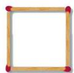
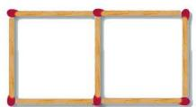
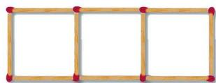

用长度相同的小棒按图 3-1 所示的方式拼摆正方形。

<table border="0" cellspacing="0" cellpadding="5">
  <tr align="center">
    <td  style="vertical-align: bottom;"></td>
    <td  style="vertical-align: bottom;"></td>
    <td  style="vertical-align: bottom;"></td>
	<td style="vertical-align: middle;">…</td>
  </tr>
</table>
<b style="display:block; margin-top:10px;">图 3-1</b>

(1) 拼摆 5 个这样的正方形需要多少根小棒?  
(2) 拼摆 100 个这样的正方形需要多少根小棒？你是怎么得到的？  
(3) 拼摆 $x$ 个这样的正方形需要多少根小棒? 与同伴进行交流。  
(4) 拼摆 200 个这样的正方形需要多少根小棒? 你是怎样计算的? 与同伴进行交流。

[[学习代数式]]

列代数式，并求值
> [!example] 列代数式，并求值 
> 某景点的门票价格：成人票每张 10 元，学生票每张 5 元。
> 1. 一个旅游团有成人 $x$ 名、学生 $y$ 名，那么该旅游团应付多少门票费？
> 2. 如果该旅游团有 37 名成人、15 名学生，那么他们应付多少门票费？
>
> > [!success]- 解
> > 1. 该旅游团应付门票费 $(10x + 5y)$ 元。
> > 2. 把 $x = 37, y = 15$ 代入代数式 $10x + 5y$，得
> >
> > $$
> > 10 \times 37 + 5 \times 15 = 445.
> > $$
> >
> > 因此，他们应付门票费 445 元。

[[列代数式]]

#### 阅读·欣赏：
[[“代数”的由来]]

一个组合柜如图 3-2 所示，内部用隔板纵向分隔成 5 个独立的小柜子（如图 3-3），柜门由 5 个完全相同的长方形组成。

<table border="0" cellspacing="0" cellpadding="5">
  <tr align="center">
    <td width="50%" style="vertical-align: bottom;"> 图 3-2</td>
    <td width="50%" style="vertical-align: bottom;"> 图 3-3</td>
  </tr>
</table>

(1) 若要在 5 个柜门的周边都贴上装饰条, 则所需装饰条的总长度是多少?  
(2) 若要给柜门外表面喷漆, 则需要喷漆的面积是多少 (边框缝隙忽略不计)?  
(3) 设柜子的进深为 $c$ (如图 3-2), 则整个柜子的容积是多少 (柜门、隔板及背板的厚度忽略不计)?
[[学习整式]]

#### 习题3.1
[[代数式 习题3.1]]