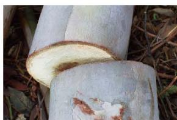

## 2 从立体图形到平面图形

还记得小学学过的正方体表面的展开图吗？  
[展开图](展开图.md)

在生活中我们常常需要将一个物体截开，如切西瓜、锯木头等（如图 1-16）。

<table border="0" cellspacing="0" cellpadding="5">
  <tr align="center">
    <td width="50%" style="vertical-align: bottom;"></td>
    <td width="50%" style="vertical-align: bottom;"></td>
  </tr>
</table>
<b style="display:block; margin-top:10px;">图 1-16</b>

  

[截面](截面.md)

#### 阅读·欣赏

[[生活中的截面]]

[三视图](三视图.md)
