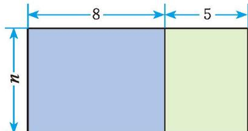

图 3-6 中的长方形由两个小长方形组成。
1. 利用图 3-6 化简 $8n + 5n$，并用运算律解释你的化简结果。
2. 你能用类似的方法化简 $2xy + 3xy$ 及 $-7a^{2}b + 2a^{2}b$ 吗？

  
   
  <small>图 3-6</small>

[同类项及合并同类项](课本/【2024版】【北师大版】/【2024版】【北师大版】七年级上册数学/同类项及合并同类项.md)

在上一节用小棒拼摆正方形时，我们得到了几个不同的代数式：
$$
x + x + (x + 1), 4 + 3 (x - 1), 4 x - (x - 1), 3 x + 1 。
$$
它们都表示拼摆 $x$ 个正方形所需小棒的根数，因此应该相等。对此，你能用运算律加以解释吗？与同伴进行交流。
[利用乘法对加法的分配律去括号](课本/【2024版】【北师大版】/【2024版】【北师大版】七年级上册数学/利用乘法对加法的分配律去括号.md)

按照下面的步骤做一做：  
(1) 任意写一个两位数;  
(2) 交换这个两位数的十位数字和个位数字, 又得到一个数;  
(3) 求这两个数的和。
再写几个两位数重复上面的过程。这些和有什么规律？这个规律对任意一个两位数都成立吗？
[整式加减运算](课本/【2024版】【北师大版】/【2024版】【北师大版】七年级上册数学/整式加减运算.md)

[整式的加减 习题 3.2](课本/【2024版】【北师大版】/【2024版】【北师大版】七年级上册数学/整式的加减%20习题%203.2.md)