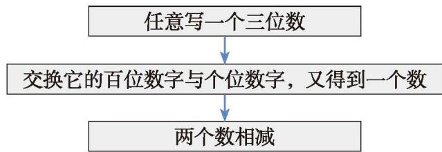
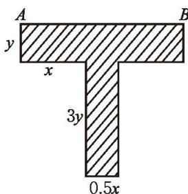
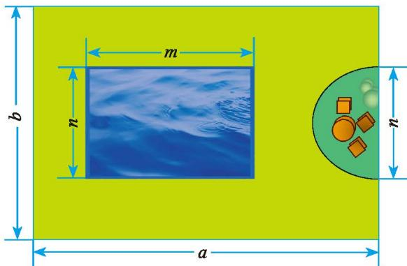
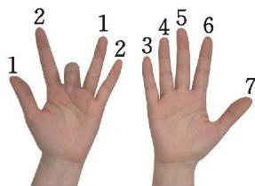

## 2 整式的加减

图 3-6 中的长方形由两个小长方形组成。  
（1）利用图 3-6 化简 $8n + 5n$ ，并用运算律解释你的化简结果。  
（2）你能用类似的方法化简 $2xy + 3xy$ 及 $-7a^{2}b + 2a^{2}b$ 吗？

  
图3-6

根据乘法对加法的分配律可得

$$
\begin{array}{l} 8 n + 5 n = (8 + 5) n = 1 3 n, \\ 2 x y + 3 x y = (2 + 3) x y = 5 x y, \\ - 7 a ^ {2} b + 2 a ^ {2} b = (- 7 + 2) a ^ {2} b = - 5 a ^ {2} b _ {\circ} \end{array}
$$

字母可以和数一样进行运算。

像 8n 与 5n, 2xy 与 3xy, $-7a^{2}b$ 与 $2a^{2}b$ 这样所含字母相同，并且相同字母的指数也相同的项，叫作同类项（like terms）。

把同类项合并成一项叫作合并同类项（unite like terms）。例如，

$$
8 n + 5 n = 1 3 n, 2 x y + 3 x y = 5 x y, - 7 a ^ {2} b + 2 a ^ {2} b = - 5 a ^ {2} b _ {\circ}
$$

> [!example]- 例1 根据乘法对加法的分配律合并同类项:  
(1) $-xy^{2}+3xy^{2};$ (2) $7a+3a^{2}+2a-a^{2}+3$ 。
解：(1) $-xy^{2}+3xy^{2}=(-1+3)xy^{2}=2xy^{2};$

$$
\begin{array}{r l} (2) 7 a + 3 a ^ {2} + 2 a - a ^ {2} + 3 & \\ = (7 a + 2 a) + (3 a ^ {2} - a ^ {2}) + 3 & \\ = (7 + 2) a + (3 - 1) a ^ {2} + 3 & \\ = 9 a + 2 a ^ {2} + 3. \end{array}
$$
合并同类项时，把同类项的系数相加，字母和字母的指数不变。

合并同类项：  
(1) $3a + 2b - 5a - b;$

$$
\begin{array}{r l} \text { 解: (1) } & 3 a + 2 b - 5 a - b \\ & = (3 a - 5 a) + (2 b - b) \\ & = (3 - 5) a + (2 - 1) b \\ & = - 2 a + b; \end{array}
$$

$$
(2) - 4 a b + \frac {1}{3} b ^ {2} - 9 a b - \frac {1}{2} b ^ {2} 。
$$

$$
\begin{array}{r l} & (2) - 4 a b + \frac {1}{3} b ^ {2} - 9 a b - \frac {1}{2} b ^ {2} \\ & = (- 4 a b - 9 a b) + \left(\frac {1}{3} b ^ {2} - \frac {1}{2} b ^ {2}\right) \\ & = - 1 3 a b - \frac {1}{6} b ^ {2}. \end{array}
$$

> [!tip] 尝试·交流

求代数式 $-3x^{2}y + 5x - 0.5x^{2}y + 3.5x^{2}y - 2$ 的值，其中 $x = \frac{1}{5}$ ，y = 7。说说你是怎么做的，并与同伴进行交流。

#### 随堂练习

1. 合并同类项：  
(1) $3f + 2f - 7f;$  
(2) $3pq + 7pq + 4pq + pq$ ;  
(3) $2y + 6y + 2xy - 5;$

$$
(4) 3 b - 3 a ^ {3} + 1 + a ^ {3} - 2 b _ {\circ}
$$

2. 判断下列各题的结果是否正确：  
(1) $3x + 3y = 6xy;$ (2) $7x - 5x = 2x^{2};$ (3) $-y^{2} - y^{2} = 0;$ (4) $19a^{2}b - 9ab^{2} = 10$ 。

3. 求下列各式的值:  
(1) $8p^{2}-7q+6q-7p^{2}-7$ ，其中p=3，q=3；  
(2) $\frac{1}{3}m-\frac{3}{2}n-\frac{5}{6}n-\frac{1}{6}m$ ，其中m=6，n=2。

在上一节用小棒拼摆正方形时，我们得到了几个不同的代数式：

$$
x + x + (x + 1), 4 + 3 (x - 1), 4 x - (x - 1), 3 x + 1 。
$$

它们都表示拼摆 $x$ 个正方形所需小棒的根数，因此应该相等。对此，你能用运算律加以解释吗？与同伴进行交流。

利用乘法对加法的分配律去括号，可得

$x+x+(x+1)=x+x+x+1=3x+1;$ $4+\underline{3(x-1)}=4+\underline{3x-3}=3x+1;$ $4x-(x-1)=4x+(-1)(x-1)$ $=4x+(-1)x+(-1)\times(-1)=4x-x+1=3x+1.$

三个代数式都可化为 $3x + 1$ 的形式，因此，这四个代数式是相等的。

> [!tip] 尝试·交流

利用乘法对加法的分配律将下列各式去括号。去括号前后，括号里各项的符号有什么变化？与同伴进行交流。  
(1) $a + (b + c)$ ; (2) $a - (b + c)$ ;  
(3) $a + (b - c)$ ; (4) $a - (b - c)$ 。

括号前是 “+”，把括号和它前面的 “+” 去掉后，原括号里各项的符号都不改变；
括号前是“-”，把括号和它前面的“-”去掉后，原括号里各项的符号都要改变。

> [!example]- 例3 化简下列各式:  
(1) $4a-(a-3b)$ ; (2) $a+(5a-3b)-(a-2b)$ ;  
(3) $3(2xy-y)-2xy;$ (4) $5x-y-2(x-y)$ 。
解：（1） $4a-(a-3b)=4a-a+3b=3a+3b;$  
(2) $a + (5a - 3b) - (a - 2b) = a + 5a - 3b - a + 2b = 5a - b;$  
(3) $3(2xy-y)-2xy=(6xy-3y)-2xy=6xy-3y-2xy=4xy-3y;$

$$
5 x - y - 2 (x - y) = 5 x - y - (2 x - 2 y) = 5 x - y - 2 x + 2 y = 3 x + y _ {\circ}
$$

> [!think] 思考·交流

你认为去括号时要注意什么？与同伴进行交流。

#### 随堂练习

1. 化简下列各式：  
(1) $8x - (-3x - 5) =$  
(2) $(3x - 1) - (2 - 5x) =$  
(3) $(-4y + 3) - (-5y - 2) =$  
(4) $3x + 1 - 2(4 - x) =$

2. 下列各式一定成立吗？  
(1) $3(x + 8) = 3x + 8;$ (2) $6x + 5 = 6(x + 5);$  
(3) $-(x - 6) = -x - 6;$ (4) $-a + b = -(a + b)$ 。

按照下面的步骤做一做：  
(1) 任意写一个两位数;  
(2) 交换这个两位数的十位数字和个位数字, 又得到一个数;  
(3) 求这两个数的和。

再写几个两位数重复上面的过程。这些和有什么规律？这个规律对任意一个两位数都成立吗？

如果用 a, b 分别表示一个两位数的十位数字和个位数字，那么这个两位数可以表示为 $10a + b$ 。交换这个两位数的十位数字和个位数字，得到的数是 $10b + a$ 。这两个数相加：

$$
(1 0 a + b) + (1 0 b + a) = \underline {{\quad}} \text { 。 }
$$

根据运算结果，你能解决上面的问题吗？

> [!think] 尝试·思考

两个数相减后的结果有什么规律？这个规律对任意一个三位数都成立吗？

> [!think] 思考·交流

在上面的两个问题中，分别涉及整式的什么运算？说一说你是如何运算的，并与同伴进行交流。

进行整式加减运算时，如果遇到括号要先去括号，再合并同类项。

> [!example]- 例4 计算:  
(1) $2x^{2}-3x+1$ 与 $-3x^{2}+5x-7$ 的和；  
(2) $-x^{2}+3xy-\frac{1}{2}y^{2}$ 与 $-\frac{1}{2}x^{2}+4xy-\frac{3}{2}y^{2}$ 的差。

$$
\begin{array}{r l} {\text {解: (1) (2x^ {2} -3x + 1) + (-3 x ^ {2} +5x - 7)}} \\ & {\qquad = 2 x ^ {2} - 3 x + 1 - 3 x ^ {2} + 5 x - 7} \\ & {\qquad = 2 x ^ {2} - 3 x ^ {2} - 3 x + 5 x + 1 - 7} \\ & {\qquad = - x ^ {2} + 2 x - 6;} \end{array}
$$

$$
\begin{array}{r l} & (2) \left(- x ^ {2} + 3 x y - \frac {1}{2} y ^ {2}\right) - \left(- \frac {1}{2} x ^ {2} + 4 x y - \frac {3}{2} y ^ {2}\right) \\ & = - x ^ {2} + 3 x y - \frac {1}{2} y ^ {2} + \frac {1}{2} x ^ {2} - 4 x y + \frac {3}{2} y ^ {2} \\ & = - x ^ {2} + \frac {1}{2} x ^ {2} + 3 x y - 4 x y - \frac {1}{2} y ^ {2} + \frac {3}{2} y ^ {2} \\ & = - \frac {1}{2} x ^ {2} - x y + y ^ {2}. \end{array} \tag {2}
$$

#### 随堂练习

1. 计算：  
(1) $(4k^{2} + 7k) + (-k^{2} + 3k - 1)$ ;  
(2) $(5y + 3x - 15z^{2}) - (12y + 7x + z^{2})$ ;  
(3) $7(p^{3} + p^{2} - p - 1) - 2(p^{3} + p)$ ;  
(4) $-\left(\frac{1}{3} + m^2 n + m^3\right) - \left(\frac{2}{3} - m^2 n - m^3\right)$ 。

### 习题3.2

#### > 知识技能

1. 合并同类项：  
(1) $x - f + 5x - 4f;$  
(2) $2a+3b+6a+9b-8a+12b;$  
(3) $30a^{2}b+2b^{2}c-15a^{2}b-4b^{2}c;$  
(4) 7xy-8wx+5xy-12xy。

2. 求下列各式的值:  
(1) $6x+2x^{2}-3x+x^{2}+1$ ，其中x=-5；  
(2) $4x^{2}+3xy-x^{2}-9$ ，其中x=2，y=-3；  
(3) $3pq - \frac{4}{5}m - 4pq$ ，其中 m = 5， $p = \frac{1}{4}$ ， $q = -\frac{3}{2}$ 。

3. 填空：  
(1) 一个长方形的宽为 $a \mathrm{~cm}$ , 长比宽的 2 倍多 $1 \mathrm{~cm}$ , 这个长方形的周长为 \_\_\_\_ cm。  
(2)三个连续整数中， $n$ 是最小的一个，这三个数的和为  
(3) 某景点的成人票价是每张 20 元, 儿童票价是每张 8 元。甲旅行团

有 $x$ 名成人和 $y$ 名儿童；乙旅行团的成人数是甲

旅行团的2倍，儿童数是甲旅行团的 $\frac{1}{2}$ 。两个旅行团的门票费用总和为\_\_\_\_元。

4. 某种 T 形零件尺寸如图所示。  
(1) 你能表示出 $AB$ 的长度吗?  
(2) 阴影部分的周长是多少?

  
(第4题)  
(3) 阴影部分的面积是多少?

5. 化简下列各式：  
(1) $3(xy-2z)+(-xy+3z)$ ;  
(2) $-4(pq + pr) + (4pq + pr)$ ;  
(3) $(2x - 3y) - (5x - y)$ ;  
(4) $-5(x - 2y + 1) - (1 - 3x + 4y)$ ;  
(5) $(2a^{2}b - 5ab) - 2(-ab - a^{2}b)$ ; (6) $1 - 3(x - \frac{1}{2} y^{2}) + (-x + \frac{1}{2} y^{2})$ 。

6. 计算:  
(1) $(3x^{2} + 2xy - \frac{1}{2} x) - (2x^{2} - xy + x)$ ;  
(2) $\left(\frac{1}{2} xy + y^2 + 1\right) + \left(x^2 - \frac{1}{2} xy - 2y^2 - 1\right)$ ;  
(3) $-(x^{2}y+3xy-4)+3(x^{2}y-xy+2);$  
(4) $-\frac{1}{4} (2k^3 + 4k^2 - 28) + \frac{1}{2} (k^3 - 2k^2 + 4k)$ 。

7. 求下列各式的值:  
(1) $3x^{2}-(2x^{2}+5x-1)-(3x+1)$ ，其中x=10;  
(2) $\left(xy-\frac{3}{2}y-\frac{1}{2}\right)-\left(xy-\frac{3}{2}x+1\right)$ ，其中 $x=\frac{10}{3}$ ， $y=\frac{8}{3}$ ;  
(3) $4y^{2}-(x^{2}+y)+(x^{2}-4y^{2})$ ，其中x=-28，y=18。

#### > 数学理解

8. 请写出 $2xyz^{3}$ 的几个同类项。

9. 张老师让同学们计算 “当 a=0.25, b=-0.37 时，代数式 $a^{2}+a(a+b)-2a^{2}-ab$ 的值”。小刚说，不用 a, b 的值就可以求出结果。你认为他的说法有道理吗？

#### 问题解决

10. 小华为一个长方形休闲场所提供了如图所示的设计方案, 其中半圆形休息区和长方形游泳区外的地方都是绿地。如果这个休闲场所需要有一半以上的绿地, 并且它的长与宽之间满足 $a = \frac{3}{2} b$ , 而小华设计的 $m$ , $n$ 分别是 $a, b$ 的 $\frac{1}{2}$ , 那么他的设计方案符合要求吗? 请你为这个休闲场所提供一个既符合要求又美观的设计方案。

  
(第10题)

11. 从 $1 \sim 9$ 这九个数字中选择三个数字, 由这三个数字可以组成六个两位数, 先把这六个两位数相加, 然后再用所得的和除以所选三个数字之和。你发现了什么? 请解释其中的道理。

&emsp;※12. 对于 $3 \times 9 = 27$ , 可以用 10 个手指直观地展示出来: 如图, 将两手平伸, 手心向上, 从左边开始数至第 3 个手指, 将它弯起, 此时它的左边有 2 个手指, 右边有 7 个手指, “27”正是“ $3 \times 9$ ”的结果。类似地, $1 \times 9 = 9$ , $2 \times 9 = 18$ , $4 \times 9 = 36$ , ……, $9 \times 9 = 81$ 也可以用手指直观地展示出来。请用本章学过的知识解释其中的道理。

  
$3 \times 9 = 27$  
(第12题)

