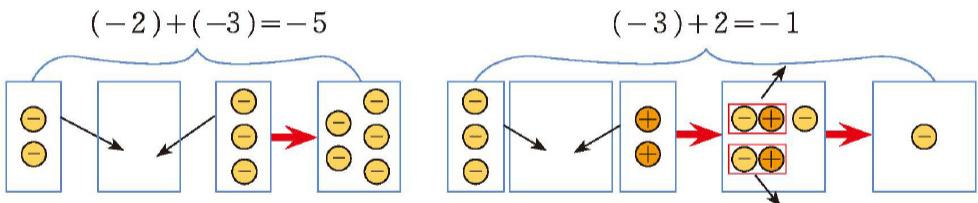
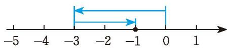
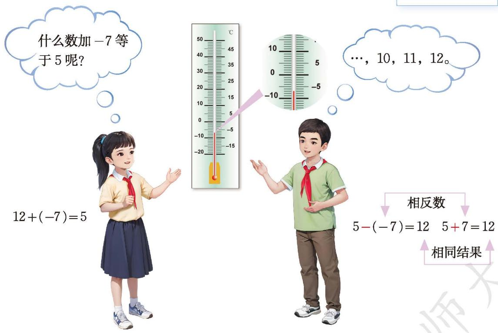
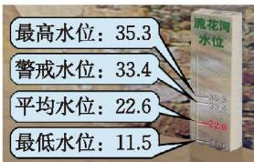
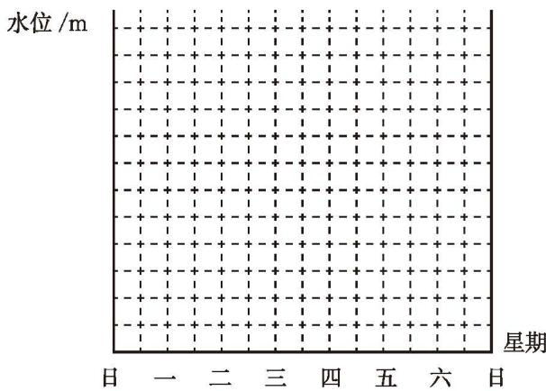

## 2 有理数的加减运算
某班举行知识竞赛，评分标准是：答对 1 题加 1 分，答错 1 题扣 1 分，不回答得 0 分。每个参赛队的基本分均为 0 分。

“加 1 分、扣 1 分，得 0 分”“扣 1 分、加 1 分，得 0 分”可以分别用如下算式表示：

$$
(+1) + (-1) = 0,\quad (-1) + (+1) = 0.
$$

1. 第一环节和第二环节各有 5 道题。三个参赛队在前两个环节的得分情况见下表，你能把下表补充完整吗？你是怎么做的？与同伴进行交流。

<table><tr><td>参赛队</td><td>第一环节的得分</td><td>第二环节的得分</td><td>前两个环节的得分之和</td><td>算式表示</td></tr><tr><td>第一队</td><td>2</td><td>3</td><td></td><td></td></tr><tr><td>第二队</td><td>-2</td><td>-3</td><td></td><td></td></tr><tr><td>第三队</td><td>-3</td><td>2</td><td></td><td></td></tr></table>

2. 小明用 1 个 ⊕ 表示 +1，用 1 个 ⊖ 表示 -1，用 ⊕ ⊖ 直观表示 $(+1)+(-1)=0$，用 ⊖ ⊕ 直观表示 $(-1)+(+1)=0$。他列出了两个算式，并给出了直观的解释，你能理解他的做法吗？

3. 如果有第四个参赛队，那么第四队前两个环节的得分可能会出现哪些情形，据此可以列出哪些算式？你能直观解释运算过程和结果吗？

[[有理数的加法运算]]

如图 2-7，数轴上的一个点从原点出发，沿着数轴先向左移动 3 个单位长度，再向右移动 2 个单位长度，到达原点左边 1 个单位长度处。

  
图 2-7

1. 根据图 2-7 你能写出怎样的算式？这个算式的结果与根据运算法则计算得到的结果一致吗？
2. 对于 $(-3)+(-2)$，你能借助数轴解释运算结果吗？

[[借助数轴解释有理数运算]]

> [!tip] 尝试·交流
> 小学学习过哪些加法运算律？这些运算律在有理数范围内还成立吗？请你举一些例子试一试，并与同伴进行交流。

[[有理数加法满足交换律和结合律]]

<table><tr><td>城市</td><td>天气</td><td>高温</td><td>低温</td><td>城市</td><td>天气</td><td>高温</td><td>低温</td></tr><tr><td>北京</td><td>晴转多云</td><td>5</td><td>-7</td><td>西宁</td><td>多云</td><td>-1</td><td>-12</td></tr><tr><td>哈尔滨</td><td>晴</td><td>-14</td><td>-19</td><td>兰州</td><td>多云</td><td>1</td><td>-9</td></tr><tr><td>长春</td><td>晴</td><td>-11</td><td>-19</td><td>西安</td><td>阴转雨夹雪</td><td>2</td><td>-2</td></tr><tr><td>沈阳</td><td>晴</td><td>-4</td><td>-15</td><td>拉萨</td><td>晴</td><td>8</td><td>-7</td></tr><tr><td>天津</td><td>晴转多云</td><td>4</td><td>-6</td><td>成都</td><td>阴转小雨</td><td>8</td><td>5</td></tr><tr><td>呼和浩特</td><td>晴</td><td>-2</td><td>-14</td><td>重庆</td><td>小雨转阴</td><td>10</td><td>8</td></tr><tr><td>乌鲁木齐</td><td>晴</td><td>-8</td><td>-14</td><td>贵阳</td><td>阴</td><td>8</td><td>1</td></tr><tr><td>银川</td><td>多云</td><td>0</td><td>-9</td><td>昆明</td><td>阵雨</td><td>13</td><td>7</td></tr></table>

图 2-8 是 2023 年 1 月 1 日我国部分城市天气情况（单位：℃）。

北京的最高气温为 $5^{\circ} \mathrm{C}$，最低气温为 $-7^{\circ} \mathrm{C}$，这一天北京的温差为多少？你是怎么算的？

$$
5 - (-7) = ?
$$

[[有理数的减法运算]]

> [!example] **例 5** 计算
> 1. $\left(-\frac{3}{5}\right)+\frac{1}{5}-\frac{4}{5}$；
> 2. $(-5)-\left(-\frac{1}{2}\right)+7-\frac{7}{3}$。
>
> > [!abstract]- 解
> > 1. $\left(-\frac{3}{5}\right) + \frac{1}{5} - \frac{4}{5} = \left(-\frac{2}{5}\right) - \frac{4}{5} = \left(-\frac{2}{5}\right) + \left(-\frac{4}{5}\right) = -\frac{6}{5}$；
> >
> > $$
> > \begin{aligned}
> > (2)\quad (-5) - \left(-\frac{1}{2}\right) + 7 - \frac{7}{3}
> > &= (-5) + \frac{1}{2} + 7 - \frac{7}{3} \\
> > &= -\frac{9}{2} + 7 - \frac{7}{3} \\
> > &= \frac{5}{2} - \frac{7}{3} \\
> > &= \frac{15}{6} - \frac{14}{6} \\
> > &= \frac{1}{6}.
> > \end{aligned}
> > $$

> [!think] 思考·交流
> 一架飞机进行特技表演，起飞后的高度变化情况见下表：
>
> <table><tr><td>高度变化</td><td>上升4.5km</td><td>下降3.2km</td><td>上升1.1km</td><td>下降1.4km</td></tr><tr><td>记作</td><td>+4.5km</td><td>-3.2km</td><td>+1.1km</td><td>-1.4km</td></tr></table>
>
> 此时飞机比起飞点高了多少千米？
>
> $$
> 4.5 - 3.2 + 1.1 - 1.4 = 1.3 + 1.1 - 1.4 = 2.4 - 1.4 = 1(\mathrm{km}).
> $$
>
> $$
> 4.5 + (-3.2) + 1.1 + (-1.4) = 1.3 + 1.1 + (-1.4) = 2.4 + (-1.4) = 1(\mathrm{km}).
> $$
>
> 比较以上两种算法，你发现了什么？与同伴进行交流。

[[加减混合运算]]

> [!think] 思考·交流
> 图 2-9 呈现了流花河的水位情况（单位：m），取河流的警戒水位作为 0 点，那么图中的其他数据可以分别记作什么？
>
> 下表是某年雨季流花河一星期内的水位变化情况（正号表示水位比前一天上升，负号表示水位比前一天下降；上星期日的水位达到警戒水位）。
>
>   
> 图 2-9
>
> <table><tr><td>星期</td><td>一</td><td>二</td><td>三</td><td>四</td><td>五</td><td>六</td><td>日</td></tr><tr><td>水位变化/m</td><td>+0.20</td><td>+0.81</td><td>-0.35</td><td>+0.03</td><td>+0.28</td><td>-0.36</td><td>-0.01</td></tr></table>
>
> 1. 本星期哪一天河流的水位最高？哪一天河流的水位最低？它们位于警戒水位之上还是之下？到警戒水位的距离分别是多少米？
> 2. 与上星期日相比，本星期日河流水位是上升了还是下降了？
> 3. 完成本星期水位记录表：
>
> <table><tr><td>星期</td><td>一</td><td>二</td><td>三</td><td>四</td><td>五</td><td>六</td><td>日</td></tr><tr><td>水位记录/m</td><td>33.60</td><td></td><td></td><td></td><td></td><td></td><td></td></tr></table>
>
> 4. 以警戒水位为 0 点，在图 2-10 中画折线表示本星期的水位情况。
>
>   
> 图 2-10
>
> 1. 你还能提出什么数学问题？与同伴进行交流。

[[加减法的别样用法]]

### 习题2.2
[[有理数的加减运算 习题2.2]]