## 2 有理数的加减运算
某班举行知识竞赛，评分标准是：答对 1 题加 1 分，答错 1 题扣 1 分，不回答得 0 分。每个参赛队的基本分均为 0 分。

“加 1 分、扣 1 分，得 0 分”“扣 1 分、加 1 分，得 0 分”可以分别用如下算式表示：

$$
(+1) + (-1) = 0,\quad (-1) + (+1) = 0.
$$

1. 第一环节和第二环节各有 5 道题。三个参赛队在前两个环节的得分情况见下表，你能把下表补充完整吗？你是怎么做的？与同伴进行交流。

<table><tr><td>参赛队</td><td>第一环节的得分</td><td>第二环节的得分</td><td>前两个环节的得分之和</td><td>算式表示</td></tr><tr><td>第一队</td><td>2</td><td>3</td><td></td><td></td></tr><tr><td>第二队</td><td>-2</td><td>-3</td><td></td><td></td></tr><tr><td>第三队</td><td>-3</td><td>2</td><td></td><td></td></tr></table>

2. 小明用 1 个 ⊕ 表示 +1，用 1 个 ⊖ 表示 -1，用 ⊕ ⊖ 直观表示 $(+1)+(-1)=0$，用 ⊖ ⊕ 直观表示 $(-1)+(+1)=0$。他列出了两个算式，并给出了直观的解释，你能理解他的做法吗？

3. 如果有第四个参赛队，那么第四队前两个环节的得分可能会出现哪些情形，据此可以列出哪些算式？你能直观解释运算过程和结果吗？

[[有理数的加法运算]]

如图 2-7，数轴上的一个点从原点出发，沿着数轴先向左移动 3 个单位长度，再向右移动 2 个单位长度，到达原点左边 1 个单位长度处。

  
图 2-7

1. 根据图 2-7 你能写出怎样的算式？这个算式的结果与根据运算法则计算得到的结果一致吗？
2. 对于 $(-3)+(-2)$，你能借助数轴解释运算结果吗？

[[借助数轴解释有理数运算]]

> [!tip] 尝试·交流
> 小学学习过哪些加法运算律？这些运算律在有理数范围内还成立吗？请你举一些例子试一试，并与同伴进行交流。

[[有理数加法满足交换律和结合律]]

<table><tr><td>城市</td><td>天气</td><td>高温</td><td>低温</td><td>城市</td><td>天气</td><td>高温</td><td>低温</td></tr><tr><td>北京</td><td>晴转多云</td><td>5</td><td>-7</td><td>西宁</td><td>多云</td><td>-1</td><td>-12</td></tr><tr><td>哈尔滨</td><td>晴</td><td>-14</td><td>-19</td><td>兰州</td><td>多云</td><td>1</td><td>-9</td></tr><tr><td>长春</td><td>晴</td><td>-11</td><td>-19</td><td>西安</td><td>阴转雨夹雪</td><td>2</td><td>-2</td></tr><tr><td>沈阳</td><td>晴</td><td>-4</td><td>-15</td><td>拉萨</td><td>晴</td><td>8</td><td>-7</td></tr><tr><td>天津</td><td>晴转多云</td><td>4</td><td>-6</td><td>成都</td><td>阴转小雨</td><td>8</td><td>5</td></tr><tr><td>呼和浩特</td><td>晴</td><td>-2</td><td>-14</td><td>重庆</td><td>小雨转阴</td><td>10</td><td>8</td></tr><tr><td>乌鲁木齐</td><td>晴</td><td>-8</td><td>-14</td><td>贵阳</td><td>阴</td><td>8</td><td>1</td></tr><tr><td>银川</td><td>多云</td><td>0</td><td>-9</td><td>昆明</td><td>阵雨</td><td>13</td><td>7</td></tr></table>

图 2-8

图 2-8 是 2023 年 1 月 1 日我国部分城市天气情况（单位：℃）。

北京的最高气温为 $5^{\circ} \mathrm{C}$，最低气温为 $-7^{\circ} \mathrm{C}$，这一天北京的温差为多少？你是怎么算的？

$$
5 - (-7) = ?
$$

减法是加法的逆运算。

> [!tip] 尝试·交流
> 1. 计算下列各式，你是怎么算的？$15 - 6,\ 15 + (-6);\quad 3 - 19,\ 3 + (-19);\ (-12) - 0,\ (-12) + 0;\quad (-8) - (-3),\ (-8) + 3.$
> 2. 再换一些数试试，你能得出什么结论？与同伴进行交流。

[[有理数减法法则]]

> [!tip] 归纳
> 减法统一成加法了！

> [!example] **例 3** 计算
> 1. $9-(-5)$；
> 2. $(-3)-1$；
> 3. $0-8$；
> 4. $(-5)-0$。
>
> > [!abstract]- 解
> > 1. $9-(-5)=9+5=14$；
> > 2. $(-3)-1=(-3)+(-1)=-4$；
> > 3. $0-8=0+(-8)=-8$；
> > 4. $(-5)-0=(-5)+0=-5$。

> [!observe] 观察·思考
> 观察例 3 中的算式和结果，想一想：一个数减一个正数，结果会怎样变化？如果减一个负数呢？

> [!example] **例 4**
> 世界上最高的山峰是珠穆朗玛峰，其海拔大约是 $8848.86 \mathrm{~m}$，吐鲁番盆地最低处的海拔大约是 $-154.31 \mathrm{~m}$。两处海拔相差多少米？
>
> > [!abstract]- 解
> > $8848.86-(-154.31)=8848.86+154.31=9003.17\ (\mathrm{m})$。
> >
> > 因此，两处海拔相差 $9003.17 \mathrm{~m}$。
>
> 每层楼平均高度为 $3 \mathrm{~m}$，$9003.17 \mathrm{~m}$ 约有多少层楼高？

#### 随堂练习

<table><tr><td colspan="3">1. 口算:</td></tr><tr><td>(1) 3-5;</td><td>(2) 3-(-5);</td><td>(3) (-3)-5;</td></tr><tr><td>(4) (-3)-(-5);</td><td>(5) (-6)-(-6);</td><td>(6) (-7)-0;</td></tr><tr><td>(7) 0-(-7);</td><td>(8) (-6)-6;</td><td>(9) 9-(-11)。</td></tr></table>

> [!example] **例 5** 计算
> 1. $\left(-\frac{3}{5}\right)+\frac{1}{5}-\frac{4}{5}$；
> 2. $(-5)-\left(-\frac{1}{2}\right)+7-\frac{7}{3}$。
>
> > [!abstract]- 解
> > 1. $\left(-\frac{3}{5}\right) + \frac{1}{5} - \frac{4}{5} = \left(-\frac{2}{5}\right) - \frac{4}{5} = \left(-\frac{2}{5}\right) + \left(-\frac{4}{5}\right) = -\frac{6}{5}$；
> >
> > $$
> > \begin{aligned}
> > (2)\quad (-5) - \left(-\frac{1}{2}\right) + 7 - \frac{7}{3}
> > &= (-5) + \frac{1}{2} + 7 - \frac{7}{3} \\
> > &= -\frac{9}{2} + 7 - \frac{7}{3} \\
> > &= \frac{5}{2} - \frac{7}{3} \\
> > &= \frac{15}{6} - \frac{14}{6} \\
> > &= \frac{1}{6}.
> > \end{aligned}
> > $$

> [!think] 思考·交流
> 一架飞机进行特技表演，起飞后的高度变化情况见下表：
>
> <table><tr><td>高度变化</td><td>上升4.5km</td><td>下降3.2km</td><td>上升1.1km</td><td>下降1.4km</td></tr><tr><td>记作</td><td>+4.5km</td><td>-3.2km</td><td>+1.1km</td><td>-1.4km</td></tr></table>
>
> 此时飞机比起飞点高了多少千米？
>
> $$
> 4.5 - 3.2 + 1.1 - 1.4 = 1.3 + 1.1 - 1.4 = 2.4 - 1.4 = 1(\mathrm{km}).
> $$
>
> $$
> 4.5 + (-3.2) + 1.1 + (-1.4) = 1.3 + 1.1 + (-1.4) = 2.4 + (-1.4) = 1(\mathrm{km}).
> $$
>
> 比较以上两种算法，你发现了什么？与同伴进行交流。

有理数的加减混合运算可以统一成加法运算，如算式“$4.5 - 3.2 + 1.1 - 1.4$”可以看成 $4.5$，$-3.2$，$1.1$，$-1.4$ 这 4 个数的和，因此在进行加减混合运算时可运用加法交换律和加法结合律简化运算。例如，

$4.5 - 3.2 + 1.1 - 1.4 = 4.5 + 1.1 - 3.2 - 1.4 = 5.6 - 4.6 = 1$

> [!example] **例 6** 计算
> 1. $\left(-\frac{1}{3}\right)-15+\left(-\frac{2}{3}\right)$；
> 2. $(-12)-\left(-\frac{6}{5}\right)+(-8)-\frac{7}{10}$。
>
> > [!abstract]- 解
> > $$
> > \begin{aligned}
> > (1)\quad \left(-\frac{1}{3}\right) - 15 + \left(-\frac{2}{3}\right)
> > &= \left(-\frac{1}{3}\right) + (-15) + \left(-\frac{2}{3}\right) \\
> > &= \left(-\frac{1}{3}\right) + \left(-\frac{2}{3}\right) + (-15) \\
> > &= (-1) + (-15) \\
> > &= -16.
> > \end{aligned}
> > $$
> >
> > $$
> > \begin{aligned}
> > (2)\quad (-12)-\left(-\frac{6}{5}\right)+(-8)-\frac{7}{10}
> > &= -12 + \frac{6}{5} - 8 - \frac{7}{10} \\
> > &= -12 - 8 + \frac{6}{5} - \frac{7}{10} \\
> > &= -20 + \frac{1}{2} \\
> > &= -\frac{39}{2}.
> > \end{aligned}
> > $$
>
> 还可以怎样计算？

> [!think] 尝试·思考

下表是某一年全年某加油站 92 号汽油价格的调整情况（正号表示比表中前一次调价上涨，负号表示比表中前一次调价下降）。

<table><tr><td>时间</td><td>1月14日</td><td>3月25日</td><td>6月1日</td><td>6月30日</td><td>7月28日</td><td>9月1日</td><td>9月29日</td><td>11月9日</td></tr><tr><td>价格变化/(元/t)</td><td>-140</td><td>+290</td><td>+400</td><td>+600</td><td>-220</td><td>+300</td><td>-190</td><td>+480</td></tr></table>

与上一年年底相比，11月9日该加油站92号汽油价格是上涨了还是下降了？变化了多少元？

#### 随堂练习

1. 计算:

$$
(1)\quad 33.1 - (-22.9) + (-10.5);
$$

$$
(2)\quad (-8) - (-15) + (-9) - (-12);
$$

$$
(3)\quad \frac{1}{2} + \left(-\frac{2}{3}\right) - \left(-\frac{4}{5}\right) + \left(-\frac{1}{2}\right);
$$

$$
(4)\quad \frac{10}{3} + \left(-\frac{11}{4}\right) - \left(-\frac{5}{6}\right) + \left(-\frac{7}{12}\right).
$$

请按下列规则做游戏：  
(1) 每人每次抽取 4 张卡片。若抽到白底卡片, 则加卡片上的数字; 若抽到红底卡片, 则减卡片上的数字。  
(2) 比较两人所抽 4 张卡片的计算结果, 结果大的为胜者。

小丽抽到的 4 张卡片依次为:

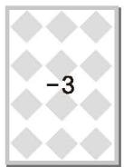

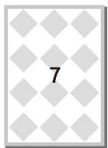

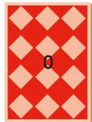

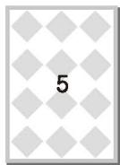

她抽到的卡片的计算结果是多少？小彬抽到的 4 张卡片依次为：

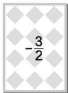

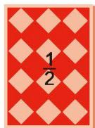

与同伴做一做这个游戏。

获胜的是谁？

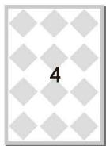

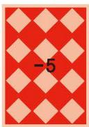

> [!think] 思考·交流
> 图 2-9 呈现了流花河的水位情况（单位：m），取河流的警戒水位作为 0 点，那么图中的其他数据可以分别记作什么？
>
> 下表是某年雨季流花河一星期内的水位变化情况（正号表示水位比前一天上升，负号表示水位比前一天下降；上星期日的水位达到警戒水位）。
>
>   
> 图 2-9
>
> <table><tr><td>星期</td><td>一</td><td>二</td><td>三</td><td>四</td><td>五</td><td>六</td><td>日</td></tr><tr><td>水位变化/m</td><td>+0.20</td><td>+0.81</td><td>-0.35</td><td>+0.03</td><td>+0.28</td><td>-0.36</td><td>-0.01</td></tr></table>
>
> 1. 本星期哪一天河流的水位最高？哪一天河流的水位最低？它们位于警戒水位之上还是之下？到警戒水位的距离分别是多少米？
> 2. 与上星期日相比，本星期日河流水位是上升了还是下降了？
> 3. 完成本星期水位记录表：
>
> <table><tr><td>星期</td><td>一</td><td>二</td><td>三</td><td>四</td><td>五</td><td>六</td><td>日</td></tr><tr><td>水位记录/m</td><td>33.60</td><td></td><td></td><td></td><td></td><td></td><td></td></tr></table>
>
> 4. 以警戒水位为 0 点，在图 2-10 中画折线表示本星期的水位情况。
>
>   
> 图 2-10
>
> 5. 你还能提出什么数学问题？与同伴进行交流。

#### 随堂练习

1. 某运动队队员的平均身高是 $180 \mathrm{~cm}$ 。下表给出了该运动队 6 名队员的身高情况（单位： $\mathrm{cm}$ ）。

<table><tr><td>队员</td><td>A</td><td>B</td><td>C</td><td>D</td><td>E</td><td>F</td></tr><tr><td>身高</td><td>179</td><td></td><td></td><td>174</td><td></td><td>182</td></tr><tr><td>身高与平均身高的差</td><td>-1</td><td>+2</td><td>0</td><td></td><td>+3</td><td></td></tr></table>  
(1) 试完成上表。  
(2) 这 6 名队员中谁最高，谁最矮？  
(3) 这 6 名队员中，最高与最矮的队员身高相差多少？

### 习题2.2

#### 知识技能

1. 计算：  
(1) $(-8)+(-9)$ ; (2) $(-17)+21$ ; (3) $(-12)+25$ ;  
(4) $45+(-23)$ ; (5) $(-45)+23$ ; (6) $(-29)+(-31)$ ;  
(7) $(-39)+(-45)$ ; (8) $(-28)+37$ ; (9) $(-13)+0$ 。

2. 土星表面的夜间平均温度为 $-150^{\circ} \mathrm{C}$ , 白天平均温度比夜间平均温度高 $27^{\circ} \mathrm{C}$ , 那么白天的平均温度是多少?

3. 计算:  
(1) $(-25)+34+156+(-65)$ ; (2) $(-64)+17+(-23)+68$ ;  
(3) $(-42)+57+(-84)+(-23)$ ; (4) $63+72+(-96)+(-37)$ ;  
(5) $(-301)+125+301+(-75)$ ; (6) $(-52)+24+(-74)+12$ ;  
(7) $41+(-23)+(-31)+0$ ; (8) $(-26)+52+16+(-72)$ 。

4. 某只股票一星期的涨跌情况见下表（正号表示价格比前一天上涨，负号表示价格比前一天下跌；股市周末不开盘，股价无变化）：

<table><tr><td>星期</td><td>一</td><td>二</td><td>三</td><td>四</td><td>五</td></tr><tr><td>涨跌情况/元</td><td>+4.18</td><td>-3.24</td><td>+0.25</td><td>-1.73</td><td>+1.46</td></tr></table>

该只股票星期五的价格与上星期五相比情况如何？

5. 某日小明在一条南北方向的健身步道上跑步。他从 A 地出发，每隔 10 min 记录下自己的跑步情况（向南为正方向，单位：m）：
-1008, 1100, -976, 1010, -827, 946。

1 h 后他停下来休息，此时他在 A 地的什么方向，距 A 地多远？小明共跑了多少米？

6. 分别列出一个满足下列条件的算式：  
(1) 所有的加数是负整数，和是 -5； (2) 一个加数是 0，和是 -5；  
(3) 至少有一个加数是正整数，和是 -5。

7. 分别找出一个满足下列条件的整数：  
(1) 加 -15，和大于 0;  
(2) 加 -15，和小于 0;  
(3) 加 -15，和等于 0。

8. 计算：  
(1) $(-3)-(-7)$ ; (2) $(-10)-3$ ;  
(3) $33-(-27)$ ; (4) 0-12;  
(5) $(-11)-0$ ; (6) $(-4)-16$ 。

$$
(-72) - (-37) - (-22) - 17;
$$

$$
23 - (-76) - 36 - (-105);
$$

$$
(-16) - (-12) - 24 - (-18);
$$

$$
(-32) - (-27) - (-72) - 87.
$$

10. 计算：  
(1) $27 - 18 + (-7) - 32$ ;  
(2) $\frac{1}{3} + \left(-\frac{1}{5}\right) - 1 + \frac{2}{3}$ ;  
(3) $0.5 + \left(-\frac{1}{4}\right) - (-2.75) + \frac{1}{2}$ ;  
(4) $\left(-\frac{2}{3}\right) + \left(-\frac{1}{6}\right) - \left(-\frac{1}{4}\right) - \frac{1}{2}$ 。

11. 计算：  
(1) $7 + (-2) - 3.4;$ (2) $(-21.6) + 3 - 7.4 + \left(-\frac{2}{5}\right);$ (3) $31 + \left(-\frac{5}{4}\right) + 0.25;$ (4) $7 - \left(-\frac{1}{2}\right) + 1.5;$ (5) $49 - (-20.6) - \frac{3}{5};$ (6) $\left(-\frac{6}{5}\right) - 7 - (-3.2) + (-1).$

#### 数学理解

12. 教科书中为加法运算和减法运算提供了实际背景, 请你设计一种新的情境来表示加法算式 $(-4) + 3$ 、减法算式 $(-3) - (-2)$ 。

13. 请借助图形直观解释算式 $2 + (-5) = -3$ 的运算过程和结果。

14. 小明用下图直观解释 $4 - (-3) = 7$ , 请你解释一下小明的想法, 并用类似的方法直观解释 $(-5) - (-2) = -3$ 。

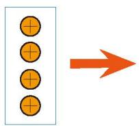  
4

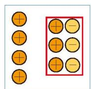  
4

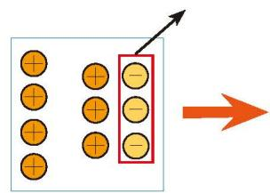  
4-(-3)  
(第14题)

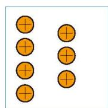  
4+3

#### 问题解决

15. 2020 年 11 月 10 日，我国自主研发的载人潜水器“奋斗者”号，在西太平洋马里亚纳海沟成功坐底，坐底深度 $10909 \mathrm{~m}$，创造了中国载人深潜的新纪录。马里亚纳海沟是地球海洋最深的地方，最深处深约 $11000 \mathrm{~m}$，“奋斗者”号此次坐底深度与马里亚纳海沟最深处大约相差多少米？

16. 王大爷把今年收获的土豆装在大小相同的袋子里，一共装了 10 袋。每袋称重结果如下：

<table><tr><td>袋号</td><td>1</td><td>2</td><td>3</td><td>4</td><td>5</td><td>6</td><td>7</td><td>8</td><td>9</td><td>10</td></tr><tr><td>质量/kg</td><td>54</td><td>49</td><td>51</td><td>50</td><td>48</td><td>52</td><td>50</td><td>47</td><td>53</td><td>46</td></tr></table>

这 10 袋土豆的总质量是多少？你是怎么算的？

17. 下图是一页账单，但有一部分破损了，请你根据上面残余的信息算出这一页最后的结余。

<table><tr><td>日期</td><td>支出或存入</td><td>结余</td><td>备注</td></tr><tr><td>2022-05-26</td><td>-120.00</td><td>9 546.00</td><td></td></tr><tr><td>2022-06-12</td><td>-150.00</td><td></td><td></td></tr><tr><td>2022-06-25</td><td>280.00</td><td></td><td></td></tr><tr><td>2022-07-05</td><td>-315.00</td><td></td><td></td></tr><tr><td>2022-08-12</td><td>-540.00</td><td></td><td></td></tr><tr><td>2022-09-06</td><td>-470.00</td><td></td><td></td></tr></table>

(第17题)

18. 下表列出了国外几个城市与北京的时差①。  
(1) 如果现在的北京时间是 7:00，那么现在的东京时间是几点？

<table><tr><td>城市</td><td>纽约</td><td>巴黎</td><td>东京</td><td>芝加哥</td></tr><tr><td>时差 /h</td><td>-13</td><td>-7</td><td>+1</td><td>-14</td></tr></table>  
(2) 小丽想在北京时间 7:00 给在巴黎的姑妈打电话, 你认为合适吗?  
(3) 李伯伯从北京乘坐早晨 8:00 的航班经过约 $20 \mathrm{~h}$ 到达纽约, 那么李伯伯到达纽约时当地时间大约是几点?  
(4) 了解国外其他城市与北京的时差, 以时差为背景联系实际生活编写一道数学问题。

19. 如图, 一辆货车从超市出发, 向东走了 $3 \mathrm{~km}$ 到达小彬家, 继续走了 $1.5 \mathrm{~km}$ 到达小颖家, 然后向西走了 $9.5 \mathrm{~km}$ 到达小明家, 最后回到超市。

  
(1) 小明家在超市的什么方向, 距超市多远? 以超市为原点, 以向东的方向为正方向, 用 1 个单位长度表示 $1 \mathrm{~km}$ , 请在数轴上表示出小明家、小彬家和小颖家的位置。  
(2) 小明家距小彬家多远?  
(3) 货车一共行驶了多少千米?

20. 某市客运管理部门对“十一”国庆假期七天客流变化量进行了不完全统计，数据如下（正号表示客流量比前一天增加，负号表示客流量比前一天减少）：

<table><tr><td>日期</td><td>1日</td><td>2日</td><td>3日</td><td>4日</td><td>5日</td><td>6日</td><td>7日</td></tr><tr><td>变化/万人</td><td>+20</td><td>-3</td><td>-10</td><td>-3</td><td>+2</td><td>+9</td><td>+3</td></tr></table>

与 9 月 30 日相比，10 月 7 日的客流量是增加了还是减少了，变化了多少？

21. 一位患者每天下午需要测量一次血压，下表是该患者星期一至星期五收缩压的变化情况。该患者上星期日的收缩压为 $160 \mathrm{~mmHg}^{\text{①}}$ 。

<table><tr><td>星期</td><td>一</td><td>二</td><td>三</td><td>四</td><td>五</td></tr><tr><td>收缩压的变化 / mmHg(与前一天比较)</td><td>升 30</td><td>降 20</td><td>升 17</td><td>升 18</td><td>降 20</td></tr></table>  
(1) 请算出该患者星期五的收缩压;  
(2) 请画折线图表示该患者这五天的收缩压情况。

#### 联系拓广

22. 数轴上任意两点 $A, B$ 表示的数分别是 $a, b$ 。  
(1) 当 a, b 分别取下列值时，求 A, B 两点间的距离。

$$
a = 3, b = 6; a = - 3, b = 6; a = - 3, b = - 6 。
$$

&emsp;※（2）用 a, b 表示 A, B 两点间的距离。
