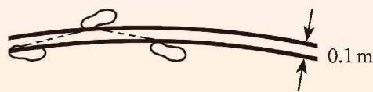

## 3 一元一次方程的应用

某饮料公司有一种底面直径和高分别为 $6.6 \, cm$ ， $12 \, cm$ 的圆柱形易拉罐饮料。经市场调研决定对该产品外包装进行改造，计划将它的底面直径减少为 $6 \, cm$ 。那么在容积不变的前提下，易拉罐的高度将变为多少厘米？  
(1) 这个问题中包含哪些量? 它们之间有怎样的等量关系?  
(2) 设新包装的高度为 $x \mathrm{~cm}$ , 你能借助下面的表格梳理问题中的信息吗?

<table><tr><td>有关量</td><td>旧包装</td><td>新包装</td></tr><tr><td>底面半径 /cm</td><td></td><td></td></tr><tr><td>高 /cm</td><td></td><td></td></tr><tr><td>容积 /cm3</td><td></td><td></td></tr></table>  
(3) 根据等量关系, 你能列出怎样的方程?
设新包装的高度为 $x \mathrm{~cm}$ 。
列方程时，关键是找出问题中的等量关系。

根据等量关系，列出方程：
解这个方程，得 $x =$ \_\_\_\_。
因此，易拉罐的高度变为 \_\_\_\_ cm。

> [!example]- 例1 用一根长为 $10 \mathrm{~m}$ 的铁丝围成一个长方形。  
(1) 如果该长方形的长比宽多 $1.4 \mathrm{~m}$ , 那么此时长方形的长、宽各为多少米?  
(2) 如果该长方形的长比宽多 $0.8 \mathrm{~m}$ , 那么此时长方形的长、宽各为多少米? 此时的长方形与 (1) 中的长方形相比, 面积有什么变化?  
(3) 如果该长方形的长与宽相等, 即围成一个正方形, 那么此时正方形的边长是多少米? 正方形的面积与 (2) 中长方形的面积相比又有什么变化?
分析：本题涉及哪些量？它们之间有怎样的等量关系？

解: (1) 设此时长方形的宽为 $x \mathrm{~m}$ , 则它的长为 $(x + 1.4) \mathrm{~m}$ 。
根据题意，得 $2(x + 1.4) + 2x = 10$ 。
解这个方程，得

$$
x = 1. 8 _ {\circ}
$$

$$
1. 8 + 1. 4 = 3. 2 \text {。}
$$

此时长方形的长为 $3.2 \mathrm{~m}$ , 宽为 $1.8 \mathrm{~m}$ 。  
(2) 设此时长方形的宽为 $x \mathrm{~m}$ , 则它的长为 $(x + 0.8) \mathrm{~m}$ 。
根据题意，得 $2(x+0.8)+2x=10$ 。
解这个方程，得

$$
x = 2. 1 _ {\circ}
$$

$$
2. 1 + 0. 8 = 2. 9 _ {\circ}
$$

此时长方形的长为 $2.9 \mathrm{~m}$ , 宽为 $2.1 \mathrm{~m}$ , 面积为

$$
2. 9 \times 2. 1 = 6. 0 9 (\mathrm{m} ^ {2}),
$$  
(1) 中长方形的面积为

$$
3. 2 \times 1. 8 = 5. 7 6 (\mathrm{m} ^ {2}) _ {\circ}
$$

此时长方形的面积比（1）中长方形的面积增大

$$
6. 0 9 - 5. 7 6 = 0. 3 3 \left(\mathrm{m} ^ {2}\right) _ {\circ}
$$  
(3) 设正方形的边长为 $x \mathrm{~m}$ 。
根据题意，得

$$
4 x = 1 0 _ {\circ}
$$
解这个方程，得

$$
x = 2. 5 _ {\circ}
$$

正方形的边长为 $2.5 \mathrm{~m}$ , 面积为

$$
2. 5 \times 2. 5 = 6. 2 5 (\mathrm{m} ^ {2}),
$$

比（2）中长方形的面积增大

$$
6. 2 5 - 6. 0 9 = 0. 1 6 \left(\mathrm{m} ^ {2}\right) _ {\circ}
$$

> [!think] 思考·交流

在上面的问题中，所列方程的两边分别表示什么量？列方程的思路是什么？与同伴进行交流。

#### 随堂练习

1. 一个梯形的下底比上底多 $6 \mathrm{~cm}$ , 高是 $8 \mathrm{~cm}$ , 面积为 $88 \mathrm{~cm}^{2}$ , 求这个梯形的上底和下底的长度。

《九章算术》“盈不足”章第一题：今有共买物，人出八，盈三；人出七，不足四。问：人数、物价各几何？

题目大意：几个人合伙买东西，若每人出8钱，则会多出3钱；若每人出7钱，则还少4钱。合伙人数、物品的价格分别是多少？  
(1) 问题中有哪些已知量和未知量? 它们之间有怎样的等量关系?  
(2) 设人数为 $x$ , 其他未知量能用含 $x$ 的代数式表示吗? 请完成下表。

<table><tr><td>有关量</td><td>每人出8钱</td><td>每人出7钱</td></tr><tr><td>人数</td><td>x</td><td></td></tr><tr><td>出钱总数</td><td></td><td></td></tr><tr><td>物价</td><td></td><td></td></tr></table>

利用表格分析数量关系是一种有效方法。  
(3) 根据等量关系, 你能列出怎样的方程?
设人数为 $x$ 。

根据等量关系，列出方程：\_\_\_\_。
解这个方程，得 $x =$ \_\_\_\_。
因此，人数为\_\_\_\_，物价为\_\_\_\_钱。

如果设物价为 $y$ 钱，你能列出怎样的方程？与同伴进行交流。

> [!example]- 例2《九章算术》“盈不足”章第五题：今有共买金，人出四百，盈三千四百；人出三百，盈一百。问：人数、金价各几何？

题目大意：几个人合伙买金，每人出 400 钱，会多出 3400 钱；每人出 300 钱，会多出 100 钱。合伙人数、金价各是多少？

分析：设人数为 $x$ ，你能把下表补充完整吗？

<table><tr><td>有关量</td><td>每人出400钱</td><td>每人出300钱</td></tr><tr><td>人数</td><td>x</td><td></td></tr><tr><td>出钱总数</td><td></td><td></td></tr><tr><td>金价</td><td></td><td></td></tr></table>
解：设合伙人数为 $x$ ，则金价可表示为 $(400x - 3400)$ 钱，还可表示为 $(300x - 100)$ 钱，根据等量关系，列出方程：

$$
4 0 0 x - 3 4 0 0 = 3 0 0 x - 1 0 0 _ {\circ}
$$

方程的两边就是金价的两种不同的表达式。
解这个方程，得 $x = 33$ 。

$$
3 0 0 \times 3 3 - 1 0 0 = 9 8 0 0 _ {\circ}
$$
因此，人数为 33，金价为 9800 钱。

> [!think] 思考·交流  
(1) 对于例 2, 如果设金价为 $y$ 钱, 能列出怎样的方程?  
(2) 对于例 2,《九章算术》给出了一种算法:

人数 = 两次剩余钱数之差 ÷ 两次每人所出钱数之差;

物价 = 每人出的钱数 × 人数 - 剩余钱数。

你能理解这种解法吗？与方程的求解过程相比，有什么不同？与同伴进行交流。

#### 随堂练习

1. 隔墙听得客分银，不知人数不知银，七两分之多四两，九两分之少半斤①。问：人、银各几何？（选自《算法统宗》）

题目大意：几个人分银子，若每人分7两，则剩余4两；若每人分9两，则差8两。有多少个人？有多少两银子？

小明家与他就读的学校相距 $1000 \, m$ 。一天，小明以 $80 \, m/min$ 的速度出发，出发后 $5 \, min$ ，小明的爸爸发现小明忘了带语文书。于是，爸爸立即以 $180 \, m/min$ 的速度沿同一条路去追小明，并且在途中追上了他。爸爸追上小明用了多长时间？追上小明时，距离学校还有多远？  
(1) 问题中有哪些已知量和未知量?  
(2) 想象一下追及的过程, 你能用一个图直观表示问题中各个量之间的关系吗?  
(3) 你是怎样列出方程的？与同伴进行交流。
设爸爸追上小明用了 $x \min$ 。当爸爸追上小明时，两人所行路程相等，如图5-3所示。

  
图5-3

画图分析数量关系是一种有效方法。

根据等量关系，可列出方程：\_\_\_\_。
解这个方程，得 $x =$ \_\_\_\_。
因此，爸爸追上小明用了\_\_\_\_min，此时距离学校还有\_\_\_\_m。

根据相等量的两种不同表达式就可以建立等量关系，列出方程了。

> [!example]- 例3 小明和小华两人在 $400 \mathrm{~m}$ 的环形跑道上练习长跑, 小明每分钟跑 $260 \mathrm{~m}$ , 小华每分钟跑 $300 \mathrm{~m}$ , 两人起跑时站在跑道同一位置。  
(1) 如果小明起跑后 $1 \mathrm{~min}$ 小华才开始跑, 那么小华用多长时间能追上小明?  
(2) 如果小明起跑后 $1 \mathrm{~min}$ 小华开始反向跑, 那么小华起跑后多长时间两人首次相遇?
分析：本题涉及哪些量？你能画图说明小明和小华跑步的情形吗？在问题（1）和（2）中，两人所走的路程分别有什么关系？

解: (1) 设小华用 $x \min$ 追上小明, 根据等量关系, 可列出方程:

$$
2 6 0 + 2 6 0 x = 3 0 0 x _ {\circ}
$$
解这个方程，得

$$
x = 6. 5 _ {\circ}
$$
因此，小华用 6.5 min 追上小明。  
(2) 设小华起跑后 $x \min$ 两人首次相遇, 根据等量关系, 可列出方程:

$$
2 6 0 x + 3 0 0 x = 4 0 0 - 2 6 0 _ {\circ}
$$
解这个方程，得

$$
x = 0. 2 5 _ {\circ}
$$
因此，小华起跑后 0.25 min 两人首次相遇。

> [!think] 思考·交流

用一元一次方程解决实际问题的一般步骤是什么？与同伴进行交流。

用一元一次方程解决实际问题的一般步骤如图 5-4 所示:

  
图5-4

> [!summary] 回顾·反思

回顾本节一元一次方程应用的学习，对于如何寻找等量关系列方程，你积累了哪些经验？

#### 随堂练习

1. 今有木, 不知长短, 引绳度之, 余绳四尺五寸①; 屈绳量之, 不足一尺。问: 几何? (选自《孙子算经》)

题目大意：有一根木材，不知道它的长度，用一根绳子来量，绳子长出4尺5寸；将这根绳子对折来量，绳子差1尺。这根木材有多长？

#### 阅读·思考

#### “瞎转圈”的道理

有人曾经做过一个很有趣的实验: 100 名飞行员在草坪上整齐地排列, 把他们的眼睛都蒙起来, 然后叫他们一直向前走。起初, 他们走得还比较直; 接着一些人渐渐向右偏转, 另一些人向左偏转, 逐渐转起圈来, 最后他们又踏上了自己已走过的路径。实际上, 很久以前人们就已经注意到: 在荒漠中没有携带指南针的旅行家, 也不太能走成直线方向, 而是绕着圆圈打转, 接连多次回到他的出发点。

上面的现象看起来仿佛有点神秘, 其实道理并不复杂。人走路的时候, 只有两腿肌肉工作得完全相同, 他才可以不需要用眼睛就能走成直线。但实际上, 绝大多数人的双腿肌肉发育得并不相同。举例来说, 一位步行者左腿比右腿迈的步子大, 除非用眼睛来帮助修正走路的方向, 否则他就要向右边斜过去, 直至走成两个同心圆 (如图 5-5)。如果这个人两腿走路的时候踏脚线间的距离大约是 $10 \mathrm{~cm}$ , 即 $0.1 \mathrm{~m}$ , 那么当他走完一个圆周 (设圆周的半径为 $R \mathrm{~m}$ ) 时, 他右腿走的路程是 $2 \pi R \mathrm{~m}$ , 左腿走的路程是 $2 \pi (R + 0.1) \mathrm{~m}$ , 二者相差

$$
2 \pi \times 0. 1 = 0. 2 \pi (\mathrm{m}) _ {\circ}
$$

另一方面，如果他行走的平均步长为 $0.7 \mathrm{~m}$ ，那么走完一个圆周所走步数近似等于 $\frac{2 \pi R}{0.7}$ ，即左右腿所走步数都可以近似看作 $\frac{2 \pi R}{2 \times 0.7}$ 。把这个结果乘两腿步长差 $x$ （单位： $\mathrm{m}$ ），就应为两腿走完一个圆周的路程差 $0.2 \pi \mathrm{~m}$ ，即

  
图5-5

$$
\frac {2 \pi R x}{2 \times 0 . 7} = 0. 2 \pi ,
$$

$$
R x = 0. 1 4 _ {\circ}
$$

如果这个人左腿的每一步比右腿的每一步多 0.4 mm，那么蒙上眼睛后他所走圆周的半径满足方程 0.0004R=0.14，因此这一半径大约是 350 m。

### 习题5.3

#### 数学理解

1. 两个圆柱体容器如图所示, 它们的底面直径分别为 $4 \mathrm{~cm}$ 和 $8 \mathrm{~cm}$ , 高分别为 $39 \mathrm{~cm}$ 和 $10 \mathrm{~cm}$ 。先在右侧容器中倒满水, 然后将其倒入左侧容器中。倒完以后, 左侧容器中的水面离容器口有多少厘米? 小刚是这样做的: 设倒完以后, 左侧容器中的水面离容器口有 $x \mathrm{~cm}$ 。列方程 $\pi \times 2^{2} \times (39 - x) = \pi \times 4^{2} \times 10$ 。解得 $x = -1$ 。请你对他的结果作出合理的解释。

  
(第1题)

2. 试联系生活实际编写一道可以用一元一次方程解决的应用问题。

#### 问题解决

3. 现有两块试验田，第一块试验田的面积比第二块试验田面积的 3 倍还多 $100 \mathrm{~m}^{2}$ ，这两块试验田的面积共 $2900 \mathrm{~m}^{2}$ ，两块试验田的面积分别是多少？

4. 如图, 小强将一张正方形纸片剪去一个宽为 $4 \mathrm{~cm}$ 的长条后, 再从剩下的长方形纸片上剪去一个宽为 $5 \mathrm{~cm}$ 的长条。如果两次剪下的长条面积正好相等, 那么每一个长条的面积为多少?

  
(第4题)

5. 如图, 某种卷筒纸的外直径为 $14 \mathrm{~cm}$ , 内直径为 $6 \mathrm{~cm}$ , 每层纸的厚度为 $0.02 \mathrm{~cm}$ 。假如把这筒纸全部拉开, 那么这筒纸的总长度大约是多少米 ( $\pi$ 取 3.14)?

6. 某物流中转站为提高工作效率, 配置了快递自动化智能分拣设备, 现对一批中转货物进行分拣。若每套设备每小时分拣 3.5 万件, 则经过 $1 \mathrm{~h}$ , 剩下 4 万

(第5题)

件未分拣；若每套设备每小时分拣4万件，则经过1h，剩下1万件未分拣。该物流中转站配置了多少套这样的分拣设备？

7. 今有共买牛, 七家共出一百九十, 不足三百三十; 九家共出二百七十, 盈三十。问: 家数、牛价各几何? (选自《九章算术》) 题目大意: 几家人合伙买牛, 若每 7 家合伙出 190 钱, 则差 330 钱; 若每 9 家合伙出 270 钱, 则多了 30 钱。家数、牛价各是多少?

8. 小彬和小强每天早晨坚持跑步, 小彬每秒跑 $4 \mathrm{~m}$ , 小强每秒跑 $6 \mathrm{~m}$ 。  
(1) 如果他们站在百米跑道的两端同时相向起跑, 那么几秒后两人相遇?  
(2) 如果小强站在百米跑道的起点处, 小彬站在他前面 $10 \mathrm{~m}$ 处, 两人同时同向起跑, 经过几秒小强能追上小彬?

9. 古希腊数学家丢番图的墓碑上记载着: 他生命的 $\frac{1}{6}$ 是幸福的童年; 再度过了生命的 $\frac{1}{12}$ , 他两颊长起了细细的胡须; 又度过了一生的 $\frac{1}{7}$ , 他结婚了; 5年后, 他有了儿子, 感到很幸福; 可是儿子只活了他全部年龄的一半; 儿子去世后, 他在极度痛苦中度过了4年, 与世长辞了。  
(1) 求丢番图去世时的年龄;  
(2) 尝试提出其他问题并列方程解决。

10. 根据本节例 3 的情境, 你还能提出其他问题并列方程解决吗?

### ☆ 问题解决策略：直观分析

在利用一元一次方程解决问题时，借助表格和示意图可以直观分析问题，使问题中的数量关系更加清晰。实际上，借助图表直观分析数量关系，往往是解决问题的一种重要策略。

问题 一家商店将某种服装按成本价提高 $40 \%$ 后标价, 又以八折优惠卖出, 结果每件仍获利 15 元, 这种服装每件的成本是多少元?

#### 理解问题  
(1) 这个问题中涉及哪些量？哪些是已知量？哪些是未知量？  
(2) 你能用文字语言描述这个问题中所蕴含的等量关系吗?  
(3) 采用什么方式可以更清楚地展示这个问题中各个量之间的关系?

#### 拟订计划  
(1) 想象一下商店从进货、标价到销售获利的过程, 你能用示意图直观地表示这一过程吗?  
(2) 根据自己画的示意图, 你能写出哪些等量关系?  
(3) 设这种服装每件的成本为 $x$ 元, 你能用含 $x$ 的代数式表示其他量吗? 根据自己写出的等量关系, 你能列出怎样的方程?

#### 实施计划

写出你的解决方案，并与同伴进行交流。

小明用图 5-6 所示的框图直观地表示了商店从进货、标价到销售获利的过程，并将问题中的数量信息标注在框图中。据此，他列出了方程

$$
(1 + 40\%) x \cdot 80\% - x = 15_{\circ}
$$
解这个方程，得 $x = 125$ 。
因此，这种服装每件的成本是 125 元。

  
图5-6

#### 回顾反思  
(1) 你是用怎样的示意图表示商店从进货、标价到销售获利全过程的？与同伴交流不同示意图的优缺点。  
(2) 示意图对解决这类问题有什么作用? 请举例说明。

借助适当的图表，可以直观、形象地呈现数量关系，使复杂的数量关系变得清晰明了，从而帮助我们更好地理解问题、分析问题、解决问题。

请用直观分析策略解答下列问题。

1. 某单位的四幢宿舍楼在一条直线上，现要在这四幢宿舍楼之间建一个超市，使得四幢宿舍楼到超市的距离之和最短。超市应建在什么位置？

2. 小明和爸爸周末骑自行车去郊外游玩, 他们同时出发, 分别以 $10 \mathrm{~km} / \mathrm{h}$ 和 $12 \mathrm{~km} / \mathrm{h}$ 的速度沿相同路线骑行, 爸爸骑行 $11 \mathrm{~km}$ 后立即掉转车头, 仍以 $12 \mathrm{~km} / \mathrm{h}$ 的速度往回骑 (小明仍按原速度向前骑行), 直到与小明会合。会合时他们骑行了多长时间?

3. 五个人聚会, 如果每两个人要握一次手, 那么五个人共握多少次手?

4. 一次测试共有两道题，全班有 45 名同学参加测试，答对第一题的有 32 人，答对第二题的有 27 人，两道题都答对的有 20 人，那么两道题都答错的有多少人？

5. 某公司办公大楼共 5 层，公司要召开会议。  
(1) 如果从 1 层到 5 层每层参会人数分别为 2, 1, 2, 1, 1, 那么要使所有参会人员到会议地点爬楼的距离之和最短, 会议地点应设在几层? 你是怎样思考的?  
(2) 如果从 1 层到 5 层每层参会人数分别为 2, 2, 1, 2, 1 呢?  
（3）如果从1层到5层每层参会人数分别为18，14，10，10，11呢？你是如何解决的？

