## 3 数据的表示

书籍是人类进步的阶梯，阅读能使人不断进步。为办好学校阅读周的活动，校图书馆计划购买200册图书，奖励在阅读周各项活动中表现优异的学生。图书馆张老师想了解现在同学们更喜欢读什么类型的图书，以便购买的图书受同学们欢迎。于是他设计了如下调查问卷，在全校随机选取了120名同学进行调查。

#### 调查问卷

你最喜欢阅读的图书类型是什么？（单选）
A. 文学 
B. 历史 
C. 科普 
D. 军事 
E. 艺术 
F. 其他

调查结果见下表:

<table><tr><td>最喜欢阅读的图书类型</td><td>文学</td><td>历史</td><td>科普</td><td>军事</td><td>艺术</td><td>其他</td></tr><tr><td>人数</td><td>36</td><td>24</td><td>27</td><td>12</td><td>12</td><td>9</td></tr></table>  
(1) 如果让你协助张老师买书, 你会提出什么购买建议? 你是如何考虑的?  
(2) 喜欢文学类图书的人数占调查总人数的百分比是多少? 喜欢历史、科普、军事、艺术、其他类型图书的人数占调查总人数的百分比分别是多少? 上述所有百分比之和是多少?  
(3) 你能尝试用扇形统计图表示上述结果吗?

在扇形统计图中，每部分占总体的百分比等于该部分所对应的扇形圆心角的度数与 $360^{\circ}$ 的比。

#### 操作·思考

根据上述张老师的调查数据，按如下方法绘制扇形统计图。  
(1) 计算各选项人数占调查总人数的百分比, 并填在下表中。  
(2) 计算各个扇形圆心角的度数, 并填在下表中。其中, 圆心角度数 $= 360^{\circ} \times$ 该项所占的百分比。

<table><tr><td>最喜欢阅读的图书类型</td><td>文学</td><td>历史</td><td>科普</td><td>军事</td><td>艺术</td><td>其他</td></tr><tr><td>百分比</td><td></td><td></td><td></td><td></td><td></td><td></td></tr><tr><td>对应的圆心角度数</td><td></td><td></td><td></td><td></td><td></td><td></td></tr></table>  
(3) 在图 6-7 的圆中画出各个扇形，并标上百分比。

扇形统计图可以直观地反映各部分在总体中所占的比例。

> [!observe] 观察·思考

  
图6-7

观察图 6-8，回答下列问题：  
(1) 如果用整个圆表示总体, 那么哪个扇形表示总体的 $25 \%$ ?  
(2) 如果用整个圆表示你们班的人数, 那么扇形 B 大约表示多少人?

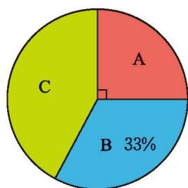  
(3) 如果用整个圆表示 $9 \mathrm{hm}^{2}$ 稻田, 那么扇形 C 表示多少公顷稻田?

> [!think] 思考·交流

图 6-9 是甲、乙两家庭全年支出费用的扇形统计图。根据统计图，小刚认为就全年食品支出费用来说，乙家庭比甲家庭多，你同意他的看法吗？为什么？与同伴进行交流。

图6-8  
  
图6-9

> [!think] 尝试·思考

小亮对全班 40 名学生进行了 “你对哪些课程非常感兴趣” 的调查，获得如下数据：语文 20 人，数学 25 人，英语 18 人，生物学 10 人，信息科技 34 人，其他 12 人。他想用扇形统计图表示这些数据，却发现 6 项的百分比之和大于 1，为什么会这样呢？

#### 随堂练习

1. 根据下表绘制扇形统计图，表示各大洋面积占四大洋总面积的百分比。

四大洋的面积统计表

<table><tr><td>海洋名</td><td>面积/万km2</td></tr><tr><td>太平洋</td><td>17 967.9</td></tr><tr><td>大西洋</td><td>9 336.3</td></tr><tr><td>印度洋</td><td>7 492.0</td></tr><tr><td>北冰洋</td><td>1 475.0</td></tr></table>

表 6-2 是本章第 1 节七（1）班学生的部分数据信息。

表 6-2 七（1）班全班学生部分数据表

<table><tr><td>学号</td><td>性别</td><td>肺活量/mL</td><td>立定跳远成绩/cm</td><td>课间操成绩/分</td><td>美术成绩</td><td>学号</td><td>性别</td><td>肺活量/mL</td><td>立定跳远成绩/cm</td><td>课间操成绩/分</td><td>美术成绩</td></tr><tr><td>1</td><td>男</td><td>2 926</td><td>180</td><td>81</td><td>优</td><td>8</td><td>男</td><td>4 480</td><td>211</td><td>79</td><td>优</td></tr><tr><td>2</td><td>男</td><td>2 234</td><td>154</td><td>78</td><td>良</td><td>9</td><td>男</td><td>3 617</td><td>160</td><td>72</td><td>中</td></tr><tr><td>3</td><td>女</td><td>2 540</td><td>165</td><td>86</td><td>优</td><td>10</td><td>女</td><td>3 240</td><td>143</td><td>86</td><td>优</td></tr><tr><td>4</td><td>男</td><td>3 720</td><td>172</td><td>81</td><td>中</td><td>11</td><td>男</td><td>3 377</td><td>205</td><td>91</td><td>优</td></tr><tr><td>5</td><td>男</td><td>3 212</td><td>183</td><td>94</td><td>优</td><td>12</td><td>男</td><td>2 312</td><td>175</td><td>80</td><td>良</td></tr><tr><td>6</td><td>男</td><td>2 361</td><td>165</td><td>83</td><td>良</td><td>13</td><td>女</td><td>2 843</td><td>148</td><td>85</td><td>优</td></tr><tr><td>7</td><td>女</td><td>2 397</td><td>135</td><td>88</td><td>优</td><td>14</td><td>男</td><td>2 984</td><td>207</td><td>90</td><td>优</td></tr><tr><td>15</td><td>女</td><td>2 077</td><td>145</td><td>91</td><td>优</td><td>23</td><td>女</td><td>3 024</td><td>165</td><td>87</td><td>优</td></tr><tr><td>16</td><td>男</td><td>2 829</td><td>188</td><td>83</td><td>优</td><td>24</td><td>女</td><td>3 189</td><td>189</td><td>82</td><td>优</td></tr><tr><td>17</td><td>男</td><td>3 346</td><td>198</td><td>86</td><td>优</td><td>25</td><td>女</td><td>2 511</td><td>165</td><td>68</td><td>中</td></tr><tr><td>18</td><td>女</td><td>2 504</td><td>177</td><td>92</td><td>优</td><td>26</td><td>女</td><td>2 646</td><td>152</td><td>88</td><td>优</td></tr><tr><td>19</td><td>女</td><td>3 240</td><td>157</td><td>83</td><td>优</td><td>27</td><td>女</td><td>2 385</td><td>150</td><td>80</td><td>优</td></tr><tr><td>20</td><td>男</td><td>2 939</td><td>157</td><td>75</td><td>良</td><td>28</td><td>女</td><td>3 504</td><td>150</td><td>82</td><td>优</td></tr><tr><td>21</td><td>男</td><td>4 029</td><td>171</td><td>86</td><td>优</td><td>29</td><td>男</td><td>2 517</td><td>180</td><td>78</td><td>良</td></tr><tr><td>22</td><td>女</td><td>3 022</td><td>162</td><td>91</td><td>优</td><td>30</td><td>女</td><td>2 914</td><td>163</td><td>89</td><td>优</td></tr></table>  
(1) 你能用恰当的统计图表表示该班学生的美术成绩吗? 从你的图表中能看出大部分学生处于哪个等级吗? 成绩的整体分布情况怎样?  
(2) 你能用恰当的统计图表表示该班学生的课间操成绩吗? 从你的图表中能看出大部分学生处于哪个分数段吗? 分数的整体分布情况怎样?

对于（1），可以采用表格的形式，也可以采用条形统计图的形式（如图6-10）。

<table><tr><td>美术成绩</td><td>优</td><td>良</td><td>中</td></tr><tr><td>人数(频数)1</td><td>22</td><td>5</td><td>3</td></tr></table>

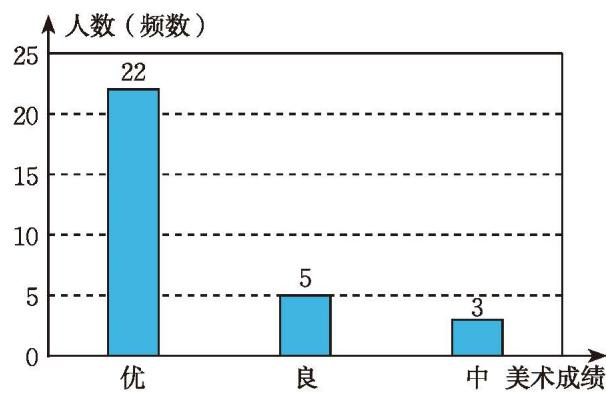  
图6-10

对于（2），可以借鉴美术成绩的表示，将课间操成绩每10分为一段分

组，统计每个分数段的学生人数，得到下面的表格和统计图（如图 6-11）。

<table><tr><td>课间操成绩/分</td><td>60~70</td><td>70~80</td><td>80~90</td><td>90~100</td></tr><tr><td>人数(频数)</td><td>1</td><td>5</td><td>18</td><td>6</td></tr></table>

  
图6-11  
你能明白这种统计图的画法吗？  

像图 6-11 这样的统计图称为频数直方图。当遇到大量的数据或数据连续取值时，我们通常先将数据适当分组，然后绘制频数直方图直观地反映数据的整体分布状况。

例 水资源问题是全球关注的热点。为避免水资源浪费，某市政府计划对居民家庭生活用水情况进行调查。为此，相关部门在该市通过随机抽样，获得了60户居民的月均生活用水量（单位： $\mathrm{m}^{3}$ ）数据：

<table><tr><td>8.6</td><td>14.8</td><td>10.5</td><td>6.9</td><td>5.4</td><td>9.6</td><td>5.3</td><td>5.8</td><td>11.4</td><td>4.7</td></tr><tr><td>10.3</td><td>12.4</td><td>7.9</td><td>13.5</td><td>22.5</td><td>7.2</td><td>25.4</td><td>18.6</td><td>2.2</td><td>11.9</td></tr><tr><td>22.0</td><td>5.3</td><td>23.4</td><td>3.6</td><td>8.5</td><td>5.2</td><td>6.2</td><td>4.6</td><td>5.6</td><td>12.8</td></tr><tr><td>26.8</td><td>10.5</td><td>2.4</td><td>8.9</td><td>7.3</td><td>8.0</td><td>16.0</td><td>4.9</td><td>2.7</td><td>3.0</td></tr><tr><td>5.7</td><td>16.2</td><td>6.6</td><td>13.8</td><td>17.6</td><td>4.2</td><td>3.1</td><td>10.7</td><td>21.6</td><td>9.4</td></tr><tr><td>7.8</td><td>8.6</td><td>13.2</td><td>9.5</td><td>4.6</td><td>2.3</td><td>5.7</td><td>11.1</td><td>14.2</td><td>10.0</td></tr></table>
将数据适当分组，并绘制相应的频数直方图反映该市居民月均生活用水量的整体状况。
解: (1) 确定所给数据中的最大值和最小值: 上述数据中最大值是 26.8, 最小值是 2.2。  
(2) 将数据适当分组: 最大值和最小值相差 $26.8 - 2.2 = 24.6$ , 组数太多或太少, 都会影响对数据整体状况的了解。考虑以 $4 \mathrm{~m}^{3}$ 为组距 (每组两个端点之间的距离称为组距), $24.6 \div 4 = 6.15$ , 可以考虑分成 7 组。  
(3) 统计每组中数据出现的次数:

<table><tr><td>分组</td><td>家庭数(频数)</td><td>分组</td><td>家庭数(频数)</td></tr><tr><td>2.0~6.0</td><td>20</td><td>18.0~22.0</td><td>2</td></tr><tr><td>6.0~10.0</td><td>15</td><td>22.0~26.0</td><td>4</td></tr><tr><td>10.0~14.0</td><td>13</td><td>26.0~30.0</td><td>1</td></tr><tr><td>14.0~18.0</td><td>5</td><td></td><td></td></tr></table>  
(4) 绘制频数直方图（如图 6-12）:

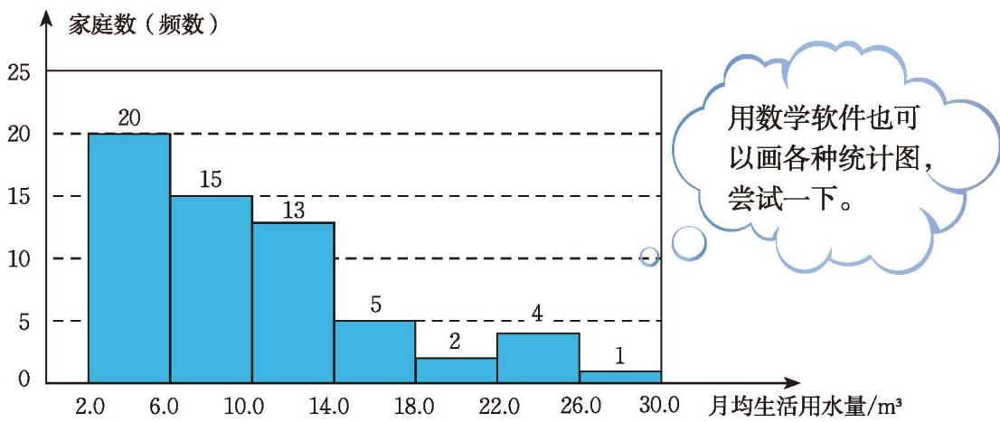  
图6-12

> [!think] 思考·交流

你认为频数直方图有什么特点？与条形统计图相比有哪些不同？与同伴进行交流。

#### 随堂练习

1. 请将表 6-2 中学生的课间操成绩以 5 分为组距分段，并用频数直方图表示。

图 6-13 呈现了世界人口情况及预测数据。  
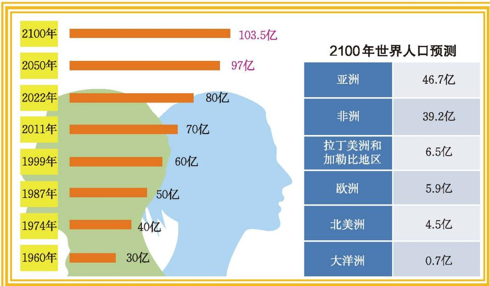  
图6-13

小亮据此绘制了下面的统计图（如图 6-14、图 6-15、图 6-16）。

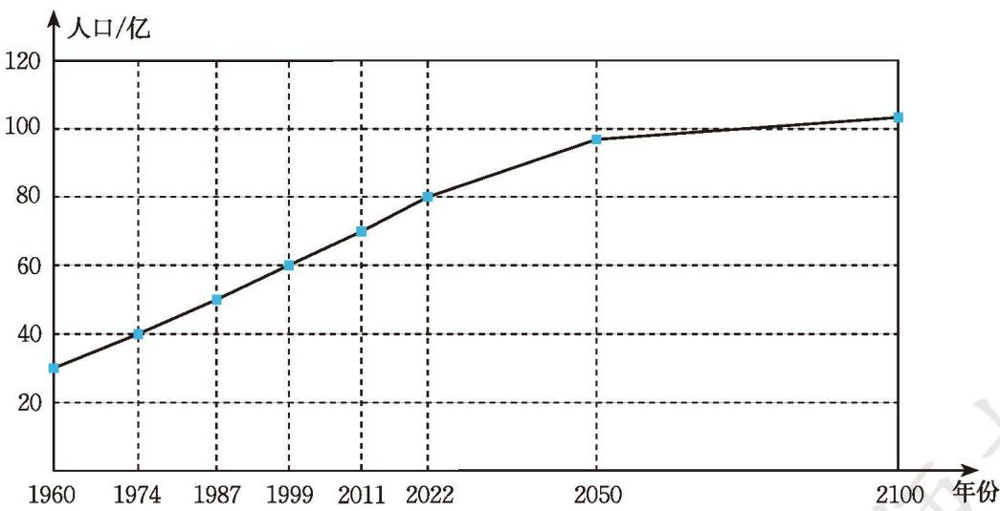  
图6-14

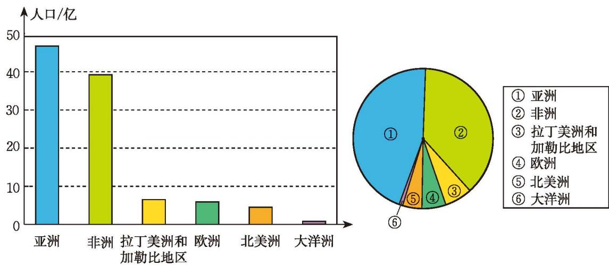  
图6-15  
图6-16  
根据小亮绘制的统计图，回答下列问题：  
(1) 三幅统计图分别表示什么内容?  
(2) 从哪幅统计图中你能看出世界人口的变化情况?  
(3) 预计 2100 年非洲人口大约将达到多少亿? 你是从哪幅统计图中得到这个数据的?  
(4) 预计 2100 年亚洲人口比拉丁美洲和加勒比地区、欧洲、北美洲、大洋洲的人口总和还要多, 你从哪幅统计图中可以明显地得到这个结论?  
(5) 比较三种统计图的特点, 并与同伴进行交流。

条形统计图、折线统计图、扇形统计图各自的特点如图 6-17 所示。

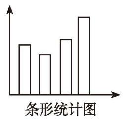  
条形统计图能清楚地表示出每个项目的具体数目。

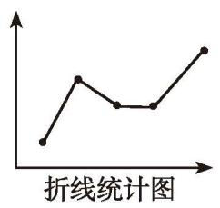  
折线统计图能清楚地反映事物的变化情况。

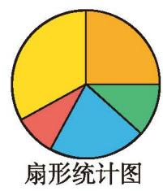  
扇形统计图能清楚地表示出各部分在总体中所占的百分比。

图6-17

> [!think] 思考·交流

2013—2022年这10年，我国快递业发展迅猛，业务量规模稳居世界第一。观察图6-18，哪一年的快递业务量增长率最高？从图中还能发现哪些信息？与同伴进行交流。

2013—2022年我国快递业务量及其增长速度  
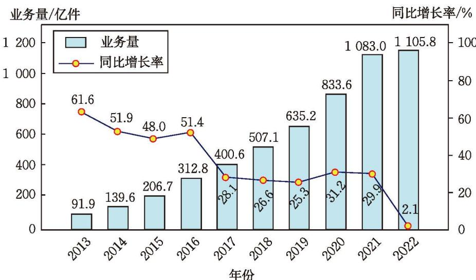  
图6-18

> [!think] 尝试·思考

为了解学校七年级学生上周参加家务劳动的情况，请设计调查方案，收集数据并绘制适当的统计图表示数据。从中你能得到哪些结论？

> [!summary] 回顾·反思

回顾你从事过的统计活动，大致经历了哪些过程？通过调查得到的结论与调查前的预想一致吗？不一致时你分析过其中的原因吗？尝试过哪些改进措施？

#### 随堂练习

1. 下面是 2018—2022 年我国每年实物商品网上零售额统计图。

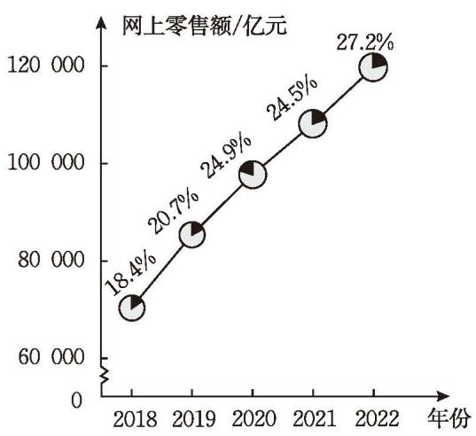  
(第1题)

实物商品网上零售额占社会消费品零售总额的比例
— 实物商品网上零售额  
(1) 你发现了哪些熟悉的统计图？选择这些统计图表示数据有什么优势？  
(2) 试根据上面的统计图描述全年实物商品网上零售额的变化趋势,以及全年实物商品网上零售额占社会消费品零售总额比例的变化趋势。

### 习题6.3

#### > 知识技能

1. 请用扇形统计图表示本章表6-1呈现的全班学生上学采用的交通方式。

2. 小颖一天的时间安排统计图如图所示。  
(1) 根据图中的数据绘制扇形统计图, 表示小颖一天的时间安排;  
(2) 比较两幅统计图的不同;  
(3) 绘制扇形统计图表示你一天的时间安排。

3. 某地区随机抽调一部分居民进行了一次法律知识测试，将测试成绩（得分取整数）整理后分成五组，绘制成如图所示的频数直方图。  
(1) 这次活动共抽取了多少人测试?  
(2) 测试成绩的整体分布情况怎样?

4. (1) 请将本章表 6-2 呈现的全班学生的立定跳远成绩以 $10 \mathrm{~cm}$ 为组距分段, 并用频数直方图表示;

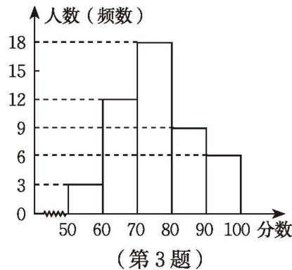  
(2) 请用其他统计图表示本章表 6-2 呈现的全班学生的立定跳远成绩，并与频数直方图进行比较。

5. 某银行营业网点抽样调查了 50 名顾客, 他们的等待时间 (从进入银行营业网点到开始办理业务的时间间隔, 单位: $\min$ ) 如下:

<table><tr><td>15</td><td>20</td><td>18</td><td>3</td><td>25</td><td>34</td><td>6</td><td>0</td><td>17</td><td>24</td></tr><tr><td>23</td><td>30</td><td>35</td><td>42</td><td>37</td><td>24</td><td>21</td><td>1</td><td>14</td><td>12</td></tr><tr><td>34</td><td>22</td><td>13</td><td>34</td><td>8</td><td>22</td><td>31</td><td>24</td><td>17</td><td>33</td></tr><tr><td>4</td><td>14</td><td>23</td><td>32</td><td>33</td><td>28</td><td>42</td><td>25</td><td>14</td><td>22</td></tr><tr><td>31</td><td>42</td><td>34</td><td>26</td><td>14</td><td>25</td><td>40</td><td>14</td><td>24</td><td>11</td></tr></table>
将数据适当分组，并绘制相应的频数直方图。

6. 某公司 2021—2022 年的总支出情况如图所示。

某公司 2021—2022 年总支出情况  
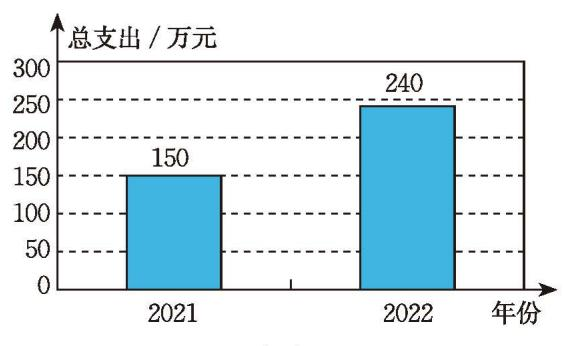

某公司 2022 年总支出的分配情况  
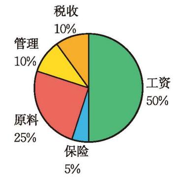  
(1) 2022年该公司原料的支出金额是多少？工资的支出金额是多少？  
(2) 2021年该公司的工资支出占总支出的 $60\%$ , 2022年与2021年相比, 该公司在工资方面的支出金额是增加了还是减少了?

#### 数学理解

7. (1) 请将本章表 6-2 呈现的课间操分数以 3 分为组距分段, 并用频数直方图表示;  
(2) 比较将学生的课间操分数分别以 10 分、5 分和 3 分为组距分段得到的频数直方图, 它们之间有哪些区别和联系?

8. 本章表6-2呈现的课间操分数还可以用下面的统计图表示：

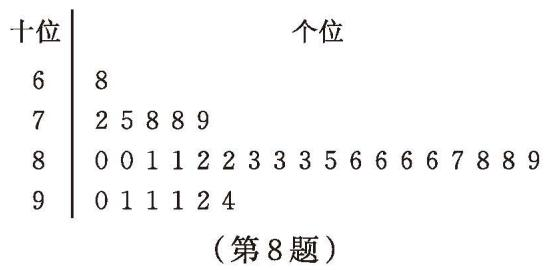

试根据这个图说说课间操分数的整体分布情况。这个图与频数直方图相比，有哪些相同与不同之处？  
(1)

&emsp;※9. 某地区 0\~59 岁人口与 60 岁及以上人口的比例如图（1）所示，如果用图  
(2) 的正方形表示该地区全部人口, 请在图 (2) 中直观地表示该地区 $0 \sim 59$ 岁人口与 60 岁及以上人口的比例关系。

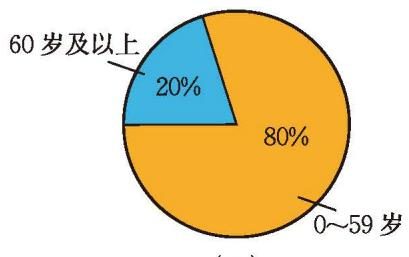

  
(2)

(第9题)

#### 问题解决

10. 统计你家一个月的人均消费支出及其构成情况，并用扇形统计图表示。

11. 调查你所在班级全班同学的血型，并用扇形统计图表示。查阅资料，了解我国不同血型人群的比例情况，与你们班级的情况相比有什么差异？

12. (1) 为了解某地区新生儿体重状况, 某医院随机调取了该地区 60 名新生儿的出生体重, 结果 (单位: $\mathrm{g}$ ) 如下:

<table><tr><td>3 850</td><td>3 900</td><td>3 300</td><td>3 500</td><td>3 315</td><td>3 800</td><td>2 550</td><td>3 800</td><td>4 150</td></tr><tr><td>2 500</td><td>2 700</td><td>2 850</td><td>3 800</td><td>3 500</td><td>2 900</td><td>2 850</td><td>3 300</td><td>3 650</td></tr><tr><td>4 000</td><td>3 300</td><td>2 800</td><td>2 150</td><td>3 700</td><td>3 465</td><td>3 680</td><td>2 900</td><td>3 050</td></tr><tr><td>3 850</td><td>3 610</td><td>3 800</td><td>3 280</td><td>3 100</td><td>3 000</td><td>2 800</td><td>3 500</td><td>4 050</td></tr><tr><td>3 300</td><td>3 450</td><td>3 100</td><td>3 400</td><td>4 160</td><td>3 300</td><td>2 750</td><td>3 250</td><td>2 350</td></tr><tr><td>3 520</td><td>3 850</td><td>2 850</td><td>3 450</td><td>3 800</td><td>3 500</td><td>3 100</td><td>1 900</td><td>3 200</td></tr><tr><td>3 400</td><td>3 400</td><td>3 400</td><td>3 120</td><td>3 600</td><td>2 900</td><td></td><td></td><td></td></tr></table>
将数据适当分组，绘制相应的频数直方图，图中反映出该地区新生儿体重的整体状况是怎样的？  
(2) 调查你们班同学出生时的体重情况, 将数据适当分组, 绘制相应的频数直方图, 并与 (1) 中新生儿体重状况进行比较。

13. 测量你 $1 \mathrm{~min}$ 脉搏的次数。  
(1) 汇总全班同学的数据, 绘制频数直方图;  
(2) 大多数同学 $1 \mathrm{~min}$ 脉搏的次数处于哪个范围?

14. 为提高长跑成绩，小彬坚持锻炼并于每星期日记录下 $1500 \mathrm{~m}$ 成绩。

小彬 1500 m 成绩统计表

<table><tr><td>锻炼的星期数</td><td>1</td><td>2</td><td>3</td><td>4</td><td>5</td><td>6</td></tr><tr><td>小彬的成绩</td><td>7 min 42 s</td><td>7 min</td><td>6 min 30 s</td><td>6 min 18 s</td><td>6 min 12 s</td><td>6 min 12 s</td></tr></table>

小彬 1500 m 成绩统计图  
  
(第14题)

如果要更清楚地看出小彬成绩的变化情况，你选择统计图还是统计表？如果要方便、准确地获得他锻炼5星期后的长跑成绩，你会如何选择？

15. 空气质量指数（Air Quality Index，AQI）是定量描述空气质量状况的指数，其数值越大说明空气污染状况越严重，对人体健康的危害也就越大。  
(1) 查阅资料, 了解我国空气质量指数的相关规定;  
(2)收集你所在地区连续30天的空气质量指数,用适当的统计图进行表示,并分析空气质量情况。

