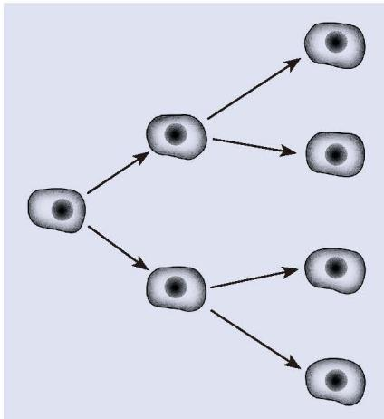
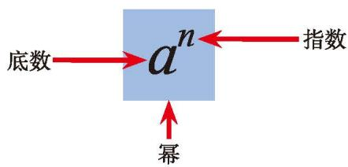
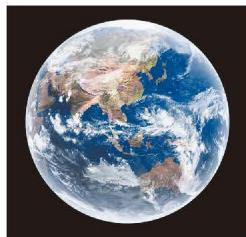
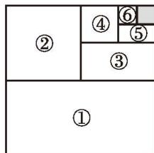

## 4 有理数的乘方

如图 2-11，某种细胞每过 30 min 便由 1 个分裂成 2 个。经过 5 h，这种细胞能由 1 个分裂成多少个？

1 个细胞经过 30 min 分裂成 2 个，经过 1 h 分裂成 $2 \times 2$ 个，经过 $\frac{3}{2}$ h 分裂成 $2 \times 2 \times 2$ 个……

经过 $5 \mathrm{~h}$ 分裂 10 次，分裂成

$$
\overbrace{2 \times 2 \times \cdots \times 2 \times 2}^{10\text{ 个 }2}=1024\text{（个）}.
$$

  
图 2-11

$$
\underbrace{2 \times 2 \times \cdots \times 2 \times 2}_{10\text{ 个 }2}
$$

为了简便，可将 $2\times2\times\cdots\times2\times2$ 记为 $2^{10}$。

[[乘方]]、[[幂]]、[[底数]]、[[指数]]

$a^{n}$ 读作“$a$ 的 $n$ 次幂”（或“$a$ 的 $n$ 次方”）。

> [!think] 思考·交流
> 你能举出有关乘方运算的实例吗？与同伴进行交流。

> [!example]- **例 1** 计算
> 1. $5^3$；
> 2. $(-3)^4$；
> 3. $\left(-\frac{1}{2}\right)^3$；
> 4. $-(2)^3$。
>
> > [!todo]- 解
> > 1. $5^3=5\times5\times5=125$；
> > 2. $(-3)^4=(-3)\times(-3)\times(-3)\times(-3)=81$；
> > 3. $\left(-\frac{1}{2}\right)^3=\left(-\frac{1}{2}\right)\times\left(-\frac{1}{2}\right)\times\left(-\frac{1}{2}\right)=-\frac{1}{8}$；
> > 4. $-(2)^3=-(2\times2\times2)=-8$。

> [!think] 尝试·思考
> 有一张厚度为 $0.1 \mathrm{~mm}$ 的纸，将它对折 1 次后，厚度为 $2 \times 0.1 \mathrm{~mm}$。
> 1. 将这张纸对折 2 次后，厚度为多少毫米？
> 2. 假设可以将这张纸对折 20 次，那么对折 20 次后厚度为多少毫米？
>
> 每层楼的平均高度为 $3 \mathrm{~m}$，这张纸对折 20 次后大约有多少层楼高？

#### 随堂练习

1. (1) 在 $7^4$ 中，底数是 $\underline{\hspace{2cm}}$，指数是 $\underline{\hspace{2cm}}$；  
(2) 在 $\left(-\frac{1}{3}\right)^5$ 中，底数是 $\underline{\hspace{2cm}}$，指数是 $\underline{\hspace{2cm}}$。

2. 计算：  
(1) $(-3)^3$；(2) $(-1.5)^2$；(3) $\left(-\frac{1}{7}\right)^2$；  
(4) $-(-3)^2$；(5) $-\left(-\frac{1}{4}\right)^3$。  
(1) 计算:

$10^2$，$10^3$，$10^4$，$10^5$；$(-10)^2$，$(-10)^3$，$(-10)^4$，$(-10)^5$。  
(2) 观察上面的结果，你能发现什么规律？

> [!observe] 观察·思考
> 观察图 2-12 中的数据，如何简单地表示这些大数呢？

  
第七次全国人口普查时，我国全国总人口约为 1440000000 人

  
地球半径约为 $6400000 \mathrm{~m}$

图 2-12  
  
光在真空中的传播速度约为 $300000000 \mathrm{~m/s}$

我们可以借用乘方的形式表示大数。例如：

$1440000000$ 可以表示成 $1.44 \times 10^9$；

$6400000$ 可以表示成 $6.4 \times 10^6$；

$300000000$ 可以表示成 $3 \times 10^8$。

[[科学记数法]]

> [!example]- **例 2** 用科学记数法表示下列数据
> 1. 赤道长约为 $40000000 \mathrm{~m}$；
> 2. 地球表面积约为 $510000000 \mathrm{~km}^2$。
>
> > [!todo]- 解
> > 1. $40000000 \mathrm{~m}=4 \times 10^7 \mathrm{~m}$；
> > 2. $510000000 \mathrm{~km}^2=5.1\times 10^8 \mathrm{~km}^2$。

> [!think] 思考·交流
> 2016 年，由我国自主研发的“神威·太湖之光”超级计算机（如图 2-13）运算速度可达到 1250000000 亿次/s。假设一个人每秒可做一次简单的运算，要完成 1250000000 亿次运算大约需要多少年？用科学记数法表示结果，并与同伴进行交流。

  
图 2-13

#### 随堂练习

1. 塞罕坝机械林场是目前世界上最大的人工林场。半个多世纪以来，经过三代塞罕坝务林人的接续奋斗，林木总蓄积由 $330000 \mathrm{~m}^3$ 增加到 $10368000 \mathrm{~m}^3$。用科学记数法表示这两个数据。

2. 一个正常人平均每分钟心跳约 70 次，一年大约心跳多少次？用科学记数法表示这个结果。一个正常人一生心跳能达到 1 亿次吗？

### 习题 2.4

#### 知识技能

1. 填空：  
(1) 在 $(-6)^3$ 中，底数是 \_\_\_\_，指数是 \_\_\_\_；  
(2) 在 $\left(-\frac{6}{5}\right)^4$ 中，底数是 \_\_\_\_，指数是 \_\_\_\_。

2. 计算：  
(1) $7^2$；(2) $(-6)^3$；(3) $\left(\frac{2}{3}\right)^3$；(4) $-3^2$；(5) $-\frac{2^3}{5}$；(6) $-\left(-\frac{3}{4}\right)^3$。

3. 用科学记数法表示下列数据：  
(1) 水星的赤道半径约为 $2440000 \mathrm{~m}$；  
(2) 木星的赤道半径约为 $71500000 \mathrm{~m}$；  
(3) 地球上的陆地面积约为 $149000000 \mathrm{~km}^2$；  
(4) 地球上的海洋面积约为 $362000000 \mathrm{~km}^2$。

4. 下列用科学记数法表示的数据，原来各是什么数？  
(1) 北京故宫的占地面积约为 $7.2 \times 10^5 \mathrm{~m}^2$；  
(2) 人体中约有 $2.5 \times 10^{13}$ 个红细胞；  
(3) 港珠澳大桥全长 $5.5 \times 10^4 \mathrm{~m}$。

#### 数学理解

5. 一个数的平方是 16，这个数可能是几？一个数的平方可能是零吗？可能是负数吗？

#### 问题解决

6. “星等”是表示天体相对亮度强弱的等级。天体越亮，星等的数值越小。早在公元前 2 世纪，人们已将肉眼能看见的恒星分为 6 等。现规定天体星等数值每减小 1，亮度就大约增加为原来的 2.512 倍。假如 6 等星的亮度是 1，那么 1 等星的亮度是多少？$-2$ 等星的亮度是多少？

7. 你见过拉面师傅拉面条吗？拉面师傅将一根粗面条拉长、两头捏合，再拉长、两头再捏合，重复这样，就拉成许多根细面条了。据报道，在一次比赛中，某拉面师傅用 $1 \mathrm{~kg}$ 面粉拉出约 209 万根面条，你认为该报道是怎样得出“209 万根”这个结果的？

8. 《庄子》中有这样一句话：“一尺 $^{①}$ 之棰，日取其半，万世不竭。”意思是一尺长的木棒，每日截取它的一半，永远截不完。那么第 7 次截取后剩下的木棒有多长？

9. (1) 一棵生长了 20 年的大树，仅能制成 $5000 \sim 8000$ 双一次性筷子。假设每人每天用 1 双一次性筷子，调查你所在地区的人口数，估算一下一年我们要为此砍多少棵这样的大树（用科学记数法表示）。如果是一个 1000 万人口的城市呢？  
(2) 根据 (1) 中的估算结果，你有何感想？

#### 联系拓广

&emsp;※10. 设 $n$ 为正整数，计算：  
(1) $(-1)^{2n}$；(2) $(-1)^{2n+1}$。

11. 如图，将一张边长为 1 的正方形纸片分割成 7 部分，部分①的面积是边长为 1 的正方形纸片面积的一半，部分②的面积是部分①面积的一半，部分③的面积是部分②面积的一半，依此类推。  
(1) 阴影部分的面积是多少？

&emsp;※（2）试求出 $\frac{1}{2} +\frac{1}{4} +\frac{1}{8} +\dots +\frac{1}{2^6}$ 的值。

  
(第11题)
