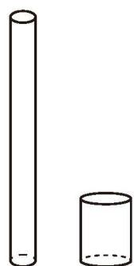
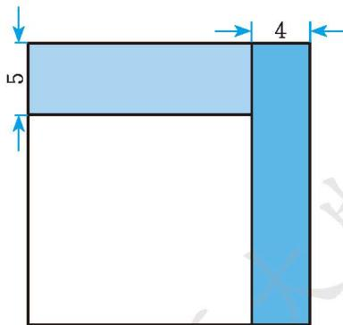

### 习题5.3

#### 数学理解

1. 两个圆柱体容器如图所示, 它们的底面直径分别为 $4 \mathrm{~cm}$ 和 $8 \mathrm{~cm}$ , 高分别为 $39 \mathrm{~cm}$ 和 $10 \mathrm{~cm}$ 。先在右侧容器中倒满水, 然后将其倒入左侧容器中。倒完以后, 左侧容器中的水面离容器口有多少厘米? 小刚是这样做的: 设倒完以后, 左侧容器中的水面离容器口有 $x \mathrm{~cm}$ 。列方程 $\pi \times 2^{2} \times (39 - x) = \pi \times 4^{2} \times 10$ 。解得 $x = -1$ 。请你对他的结果作出合理的解释。

(第1题)

2. 试联系生活实际编写一道可以用一元一次方程解决的应用问题。

#### 问题解决

3. 现有两块试验田，第一块试验田的面积比第二块试验田面积的 3 倍还多 $100 \mathrm{~m}^{2}$ ，这两块试验田的面积共 $2900 \mathrm{~m}^{2}$ ，两块试验田的面积分别是多少？

4. 如图, 小强将一张正方形纸片剪去一个宽为 $4 \mathrm{~cm}$ 的长条后, 再从剩下的长方形纸片上剪去一个宽为 $5 \mathrm{~cm}$ 的长条。如果两次剪下的长条面积正好相等, 那么每一个长条的面积为多少?

(第4题)

5. 如图, 某种卷筒纸的外直径为 $14 \mathrm{~cm}$ , 内直径为 $6 \mathrm{~cm}$ , 每层纸的厚度为 $0.02 \mathrm{~cm}$ 。假如把这筒纸全部拉开, 那么这筒纸的总长度大约是多少米 ( $\pi$ 取 3.14)?

6. 某物流中转站为提高工作效率, 配置了快递自动化智能分拣设备, 现对一批中转货物进行分拣。若每套设备每小时分拣 3.5 万件, 则经过 $1 \mathrm{~h}$ , 剩下 4 万

(第5题)

件未分拣；若每套设备每小时分拣4万件，则经过1h，剩下1万件未分拣。该物流中转站配置了多少套这样的分拣设备？

7. 今有共买牛, 七家共出一百九十, 不足三百三十; 九家共出二百七十, 盈三十。问: 家数、牛价各几何? (选自《九章算术》) 题目大意: 几家人合伙买牛, 若每 7 家合伙出 190 钱, 则差 330 钱; 若每 9 家合伙出 270 钱, 则多了 30 钱。家数、牛价各是多少?

8. 小彬和小强每天早晨坚持跑步, 小彬每秒跑 $4 \mathrm{~m}$ , 小强每秒跑 $6 \mathrm{~m}$ 。  
(1) 如果他们站在百米跑道的两端同时相向起跑, 那么几秒后两人相遇?  
(2) 如果小强站在百米跑道的起点处, 小彬站在他前面 $10 \mathrm{~m}$ 处, 两人同时同向起跑, 经过几秒小强能追上小彬?

9. 古希腊数学家丢番图的墓碑上记载着: 他生命的 $\frac{1}{6}$ 是幸福的童年; 再度过了生命的 $\frac{1}{12}$ , 他两颊长起了细细的胡须; 又度过了一生的 $\frac{1}{7}$ , 他结婚了; 5年后, 他有了儿子, 感到很幸福; 可是儿子只活了他全部年龄的一半; 儿子去世后, 他在极度痛苦中度过了4年, 与世长辞了。  
(1) 求丢番图去世时的年龄;  
(2) 尝试提出其他问题并列方程解决。

10. 根据本节例 3 的情境, 你还能提出其他问题并列方程解决吗?
