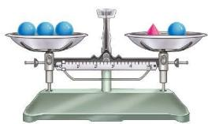
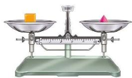
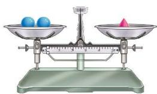
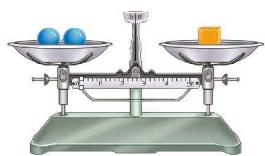

### 习题 5.2

#### 知识技能

1. 解方程：

(1) $x + 21 = 36$； (2) $\frac{1}{9} = \frac{x}{3} - \frac{1}{6}$； (3) $4y - 2 = 3 - y$； (4) $2x - \frac{1}{3} = -\frac{x}{3} + 2$。

2. 求解由习题 5.1 第 1(1)(2)(4) 题、第 4 题列出的方程。

3. 解方程：

(1) $12(2 - 3x) = 4x + 4$； (2) $6 - 3\left(x + \frac{2}{3}\right) = \frac{2}{3}$。

4. 求解本章第 1 节中的方程 $10x + 15(45 - x) = 475$。

5. 解方程：

(1) $\frac{7x - 5}{4} = \frac{3}{8}$；

(2) $\frac{2x - 1}{6} = \frac{5x + 1}{8}$；

(3) $\frac{1}{2} x - 7 = \frac{9x - 2}{6}$；

(4) $\frac{1}{5} x - \frac{1}{2}(3 - 2x) = 1$；

(5) $\frac{2x + 1}{3} - \frac{5x - 1}{6} = 1$；

(6) $\frac{1}{7}(2x + 14) = 4 - 2x$。

#### 数学理解

6. 设"○""▲""■"表示三种不同的物体，现用天平称了两次，情况如图所示：

  
  
   
  （第 6 题）

则下列图示正确的是（ ）。

  
   
  (A)

  
   
  (B)

  
   
  (C)

7. 如何解方程 $2x = 5x$？小颖在方程的两边都除以 $x$，竟然得到 $2 = 5$。她错在哪里？

#### 问题解决

8. 地球上的海洋面积约为陆地面积的 2.4 倍，地球的表面积约为 $5.1 \mathrm{~亿} \mathrm{km}^{2}$，求地球上的海洋面积和陆地面积。

9. 如图，足球的表面是由若干黑色五边形和白色六边形皮块围成的，黑、白皮块的数量比为 $3:5$。一个足球的表面一共有 32 个皮块，黑色皮块和白色皮块各有多少？

10. 某航空公司规定：乘坐飞机经济舱的旅客每人最多可免费托运 $20 \mathrm{~kg}$ 行李，超出部分每千克按经济舱全票价的

  
   
  （第 9 题）

$1.5\%$ 计费。一名经济舱旅客托运了 35 kg 行李，行李费连同八折机票共付 1107 元，求该旅客机票的全票价。

11. 一个两位数，十位数字是个位数字的 2 倍，将这两个数字对调后得到的两位数比原来的两位数小 36，求原来的两位数。
