## 丰富的图形世界 复习题

#### > 知识技能

1. 折一折，连一连。

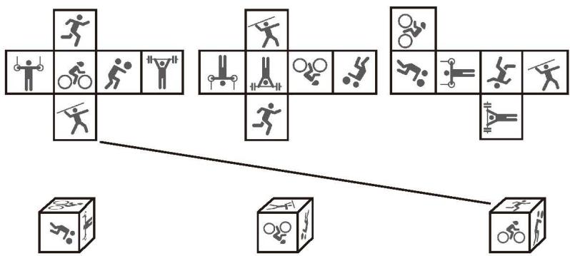  
(第1题)

#### > 数学理解

2. 图中哪些图形经过折叠可以围成一个棱柱？先想一想，再折一折。

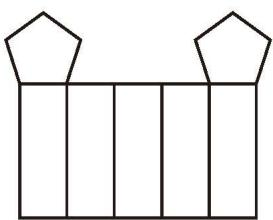  
(1)

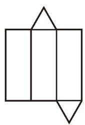  
(2)  
(第2题)

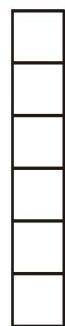  
(3)

3. 将下图中各几何体的截面用阴影表示出来，并分别指出它们的形状。

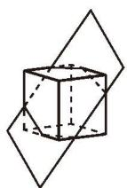

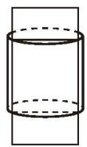

  
(第3题)

4. 用一个平面截一个正方体, 截面的形状可能是长方形吗? 用一个平面截一个长方体, 截面的形状可能是正方形吗? 与同伴进行交流。

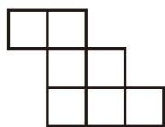  
(第5题)

5. 在图中剪去 1 个小正方形，使得到的图形经过折叠能够围成一个正方体。先想一想，再试一试。

6. 下列图形是正方体表面的展开图，将它们折叠成正方体后，与“1”“2”“3”面相对的面分别是什么？

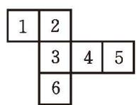  
(1)

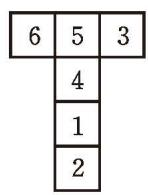  
(2)

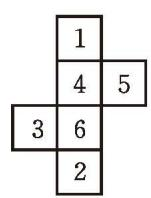  
(3)

(第6题)  
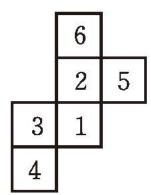  
(4)

7. 一个几何体由若干大小相同的小立方块搭成, 从上面看到的几何体的形状图如图所示, 其中小正方形中的数字表示在该位置的小立方块的个数。请画出从正面和从左面看到的这个几何体的形状图。

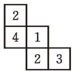  
(第7题)

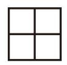  
从正面看

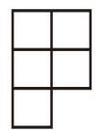  
(第8题)  
从上面看

8. 用若干大小相同的小立方块搭一个几何体，使得从正面和从上面看到的这个几何体的形状图如图所示。根据你所搭的几何体画出从左面看到的它的形状图。你还能搭出满足条件的其他几何体吗？试一试！

&emsp;※9. 一个几何体由若干大小相同的小立方块搭成，图中所示的分别是从它的正面、上面看到的形状图，这个几何体至少是用多少个小立方块搭成的？

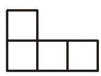  
从正面看

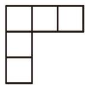  
(第9题)  
从上面看

#### > 问题解决

10. (1) 将正方体沿图中红色的棱剪开, 请画出它的展开图。  
(2) 请你编一道类似 (1) 的题目。如果正方体是 “无盖” 的呢?

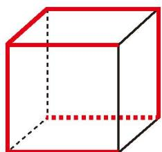  
(第10题)

11. 甲、乙、丙三人组成一个小组，甲用若干大小相同的小立方块搭成一个几何体，乙用自己的方式描述这个几何体的形状，丙在不看这个几何体的情况下仅根据乙的描述搭出这个几何体。小组内三人互换角色，继续这个活动。

&emsp;※12. 如图, 已知长方形的长为 $a$ 、宽为 $b$ , 将这个长方形分别绕它的长和宽旋转一周, 可以得到两个圆柱。这两个圆柱的侧面积有什么关系?

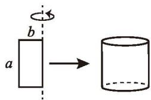  
(1)

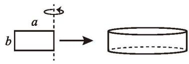  
(2)  
(第12题)

13. 请收集生活中各种各样的包装盒，并将它们沿某些棱剪开，你能得到哪些形状的展开图？将你的成果以演示文档的形式进行展示与交流。

#### > 联系拓广

14. 请查阅资料，了解“虚拟数字人”的研究进展。

