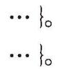
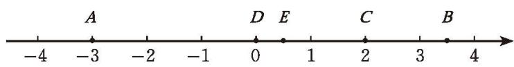
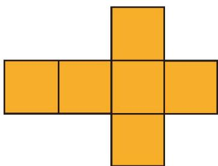

### 1 认识有理数 习题 2.1

#### 知识技能

1. 举出几对具有相反意义的量，并分别用正负数表示。

2. 完成下列问题。
   3. 如果节约电 $20 \mathrm{kW} \cdot \mathrm{h}$ 记作 $+20 \mathrm{kW} \cdot \mathrm{h}$，那么浪费电 $10 \mathrm{kW} \cdot \mathrm{h}$ 记作什么？
   4. 如果 $-20.50$ 元表示亏本 20.50 元，那么 +100.57 元表示什么？
   5. 如果 +20% 表示增加 20%，那么 -6% 表示什么？

6. 下列各数中，哪些是正整数，哪些是负整数？哪些是正分数，哪些是负分数？哪些是正数，哪些是负数？

$$
7, -9.25, -\frac{9}{10}, -301, \frac{4}{27}, 31.25, \frac{7}{15}, -3.5.
$$

4. 任意写出 5 个正数和 5 个负数，并分别把它们填入所属的集合内。

正数集合：$\{ \cdots \}$。

负数集合：$\{ \cdots \}$。

  

5. 下面的说法是否正确？请将错误的改正过来。
   6. 有理数的绝对值一定比 0 大；
   7. 有理数的相反数一定比 0 小；
   8. 如果两个数的绝对值相等，那么这两个数相等；
   9. 互为相反数的两个数的绝对值相等。

10. 求下列各数的相反数和绝对值：$-21.4$，$\frac{1}{2}$，-36，$\frac{7}{5}$。

11. 比较下列每组数的大小：
   12. $-\frac{8}{9}$，$-\frac{9}{10}$；
   13. -0.618，$-\frac{3}{5}$；
   14. 0，$|-8|$；
   15. $-1\frac{2}{7}$，$-1\frac{1}{3}$。

16. 完成下列问题。
   17. 指出图中数轴上 $A$，$B$，$C$，$D$，$E$ 各点分别表示的有理数，并用 “<” 将它们连接起来。

  
   
  第 8（1）题

   2. 在数轴上把下列各数表示出来，并比较它们的大小：

$$
7, -\frac{4}{5}, -3.5, 0, \frac{4}{3}.
$$

#### 数学理解

9. 小丽说：“一个数，如果不是正数，必定就是负数。”你认为她说得对吗？为什么？

10. 某种食品包装袋上标注质量为 $450 \mathrm{~g}$，对 6 袋该种食品的实际质量进行检测，检测结果如下（用正号表示超过标注质量，用负号表示低于标注质量）：

$$
-25, +10, -20, +30, +15, -40.
$$

哪袋食品的实际质量更接近标注质量？为什么？

11. 某班 8 名学生的体重（单位：kg）分别为：52，51.5，49.5，50.5，45，56，47.5，42.5。请你设定一个标准，用正数、负数或 0 表示他们的体重。

12. 根据相反数的意义化简下列各数：
    1. $-(+36)$；
    2. $-(-5)$；
    3. $-\left(-\frac{1}{3}\right)$；
    4. $-(+14.8)$。

13. $-(-2)$ 等于多少？你是怎样得到的？试借助数轴解释你的结果。

14. 字母 $a$ 表示一个有理数，$-a$ 表示什么数？$-a$ 一定是负数吗？

#### 问题解决

15. 下表呈现了李阿姨半年内体重的变化情况，正数表示体重比上月增加，负数表示体重比上月减少。

<table>
  <tr>
    <td align="center">月份</td>
    <td align="center">3 月</td>
    <td align="center">4 月</td>
    <td align="center">5 月</td>
    <td align="center">6 月</td>
    <td align="center">7 月</td>
    <td align="center">8 月</td>
  </tr>
  <tr>
    <td align="center">体重变化/kg</td>
    <td align="center">-1</td>
    <td align="center">-1</td>
    <td align="center">+1</td>
    <td align="center">-2</td>
    <td align="center">0</td>
    <td align="center">+0.5</td>
  </tr>
</table>

1. 0 kg 是什么意思？
2. 哪个月李阿姨的体重变化最大？

3. 点 $A$ 在数轴上距原点 3 个单位长度，且位于原点左侧。一个点从点 $A$ 出发，先向右移动 4 个单位长度，再向左移动 1 个单位长度到达点 $B$，点 $B$ 表示的是什么数？

#### 联系拓广

17. 下面是一个正方体形纸盒的展开图，请把 -10，7，10，-2，-7，2 分别填入六个正方形，使得折成正方体后，相对面上的两数互为相反数。

  
   
  第 17 题

18. 请查阅相关资料，了解《九章算术》“方程”章第八题是如何使用负数解决问题的，并了解《九章算术》的大致内容和历史成就。
