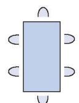
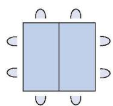
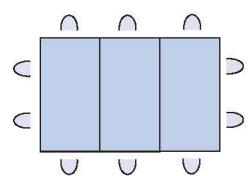
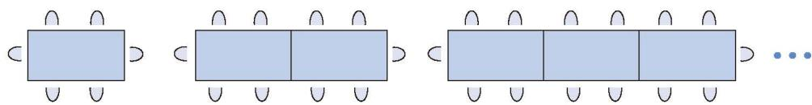
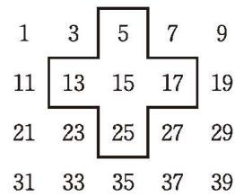

### 探索与表达规律 习题 3.3

#### 问题解决

1. 某学校食堂的餐桌椅有两种摆放方式。
(1) 按下图方式摆放餐桌和椅子，照这样的方式继续排列餐桌，摆 4 张桌子可坐多少人？摆 5 张桌子呢？摆 $n$ 张桌子呢？

<table border="0" cellspacing="0" cellpadding="5" width="100%">
  <tr align="center">
    <td width="33%" style="vertical-align: bottom;"></td>
    <td width="33%" style="vertical-align: bottom;"></td>
    <td width="33%" style="vertical-align: bottom;"></td>
  </tr>
</table>
<b style="display:block; margin-top:10px;">[第 1(1) 题]</b>

(2) 按下图方式摆放餐桌和椅子，照这样的方式继续排列餐桌，摆 4 张桌子可坐多少人？摆 5 张桌子呢？摆 $n$ 张桌子呢？

[第 1(2) 题]
(3) 在食堂就餐的高峰时段，要求同时能坐下 300 人，上面哪种方式所需要的餐桌数较少？

2. 将连续的奇数 1，3，5，7，9，… 排成如图所示的数表。
(1) 十字形框中的五个数之和与中间数 15 有什么关系？
(2) 设中间数为 $a$，如何用代数式表示十字形框中五个数之和？

(第 2 题)
(3) 若将十字形框上下左右移动，可框住另外五个数，这五个数还有上述的规律吗？
(4) 十字形框中的五个数之和能等于 2022 吗？能等于 2025 吗？

3. 小强：“你在心里想好一个数，按照下列步骤进行运算：把这个数乘 4，然后加 8，再把所得的和乘 5，然后再加 7，最后再把得到的数乘 5。把你的结果告诉我，我就知道你心里想的数了。”同学们试了几次，小强都猜对了。请你解释这是为什么。

4. 小亮和好朋友经常玩一种密码游戏：他们事先约定英文字母表中各字母位置的变化规则，以此实现加密和解密。有一次小亮给好朋友留了一张纸条，纸条上写着“kccr zcfglb rfc jgzpypw”，好朋友一下子就明白了“meet behind the library”。
(1) 小亮他们这次事先约定的字母位置变化规则是什么？请用代数式表达他们的规则。
(2) 请你尝试设计一个类似的密码游戏。

#### 联系拓广

5. 末两位是 00，25，50，75 的任何数均能被 25 整除，这是为什么？请解释其中的道理。
