### 习题 4.2

#### 知识技能

1. 将图中的角用不同方法表示出来，并填写下表。

<table><tr><td>∠1</td><td></td><td>∠3</td><td>∠4</td><td></td></tr><tr><td></td><td>∠BCA</td><td></td><td></td><td>∠ABC</td></tr></table>

  
   
  （第 1 题）

2. 计算：

(1) $\left(\frac{1}{8}\right)^{\circ}$ 等于多少分？等于多少秒？

(2) $6000''$ 等于多少分？等于多少度？

3. 把两个三角尺按如图所示那样拼在一起，试确定图中 $\angle B$，$\angle E$，$\angle BAD$，$\angle DCE$ 的度数及它们的大小关系。

  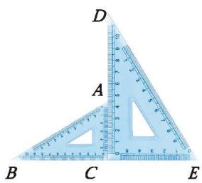
   
  （第 3 题）

  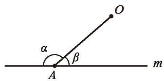
   
  （第 4 题）

4. 如图，直线 $m$ 外有一定点 $O$，$A$ 是 $m$ 上的一个动点，当点 $A$ 从左向右运动时，观察 $\angle \alpha$ 和 $\angle \beta$ 是如何变化的，$\angle \alpha$ 和 $\angle \beta$ 之间有关系吗？

5. 用尺规完成下列作图：

(1) 如图 (1)，已知 $\angle ABC$，以点 $B$ 为顶点，射线 $BA$ 为一边，在 $\angle ABC$ 外作一个角，使它等于 $\angle ABC$；

  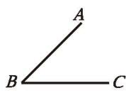

  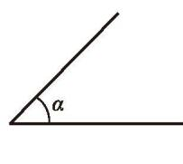
   
  (2)

  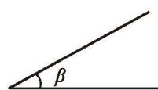
   
  （第 5 题）

(2) 如图 (2)，已知 $\angle \alpha$，$\angle \beta$，作一个角，使它等于 $\angle \alpha$ 与 $\angle \beta$ 的和。

#### 数学理解

6. 借助一副三角尺的拼摆，你能画出 $75^{\circ}$ 的角吗？$15^{\circ}$ 呢？你还能画出哪些角？这些角有什么共同特征？

7. 小华在探究用尺规作与 $\angle AOB$ 相等的 $\angle A'O'B'$ 时，提出了如图所示的方法，小华的作法与本节的作法有什么区别？请你说说小华这样做的道理。

  

    

      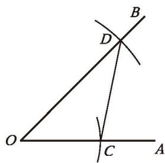
    

    

      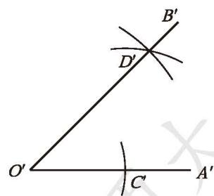
      
（第 7 题）

    

  

#### 问题解决

8. (1) 如图，分别确定四个城市相应钟表上时针与分针所成角的度数。

  

    

      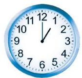
      
巴黎

    

    

      
      
伦敦

    

    

      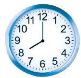
      
北京

    

    

      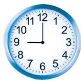
      
东京

    

  

  
（第 8 题）

(2) 每经过 $1 \mathrm{~h}$，时针转过多少度？每经过 $1 \mathrm{~min}$，分针转过多少度？

(3) 当时钟指向上午 10:10 时，时针与分针的夹角是多少度？

※ (4) 请你的同伴任意报一个时间（精确到分），你来确定时针与分针的夹角。

9. 如图 (1)，$\angle AOC$ 和 $\angle BOD$ 都是直角。

(1) 如果 $\angle DOC = 28^{\circ}$，那么 $\angle AOB$ 的度数是多少？

(2) 找出图 (1) 中相等的角。如果 $\angle DOC \neq 28^{\circ}$，它们还会相等吗？

  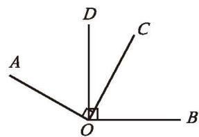

(3) 如果 $\angle DOC$ 变小，那么 $\angle AOB$ 如何变化？

  

    

      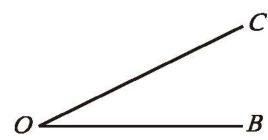
      
(1)

    

    

      
(2)

    

  

  
（第 9 题）

(4) 在图 (2) 中利用能够画直角的工具再画一个与 $\angle COB$ 相等的角。

10. 如图，蜂房的顶部由三个相同的四边形围成，每个四边形中的两个锐角均为 $70^{\circ} 32'$，两个钝角均为 $109^{\circ} 28'$。这样的结构很奇妙吧！请你查阅资料，了解大自然中其他的奇妙角度。

  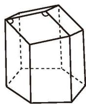
   
  （第 10 题）

11. (1) 请用尺规作出如图所示的图形。

(2) 你还能设计什么样的图案？试一试，并说说你设计的图案的寓意。

  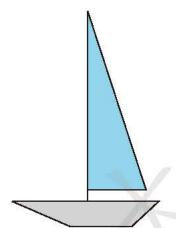
   
  [第 11(1) 题]

