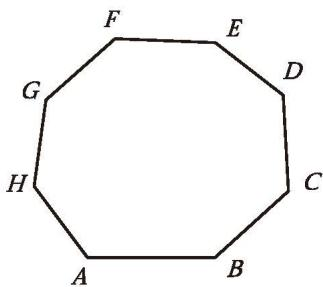
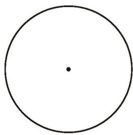

### 习题 4.3

#### 知识技能

1. 观察如图所示图形，回答下列问题：  
(1) 从八边形 $ABCDEFGH$ 的顶点 $A$ 出发, 可以画出多少条对角线? 分别用字母表示出来。  
(2) 上面 (1) 中这些对角线将八边形分割成多少个三角形?

  
   
  <small style="color: var(--text-muted, #666);">（第 1 题）</small>

2. 半径为 1 的圆中, 扇形 $AOB$ 的圆心角为 $120^{\circ}$ , 请在如图所示的圆内画出这个扇形, 并求它的面积。

  
   
  <small style="color: var(--text-muted, #666);">（第 2 题）</small>

#### 数学理解

3. 过某个多边形一个顶点的所有对角线，将这个多边形分成 5 个三角形，这个多边形是几边形？