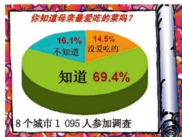

### 习题 6.2

#### 知识技能

1. 请你通过查阅资料回答下列问题：

(1) 我国水资源总量（全国降水形成的地表和地下产水总量）及人均占有量分别约为多少立方米？

(2) 从 1949 年中华人民共和国成立到现在，我国进行过几次国庆阅兵？分别在哪些年份举行？其中，国庆 70 周年阅兵受阅的徒步方队、装备方队和空中梯队分别有多少个？

2. 为完成下列任务，你认为采用什么调查方式更合适？

(1) 了解你们班同学周末时间是如何安排的；

(2) 了解一批笔芯的使用寿命；

(3) 了解我国七年级学生的视力情况。

3. 电视台需要在本市调查某节目的收视率，每个看电视的人都要被问到吗？对一所中学学生的调查结果能否作为该节目的收视率？你认为对不同地区、不同年龄、不同文化背景的人进行的调查结果会一样吗？

4. 为了解本校学生的睡眠时间情况，以下哪种抽样方法得到的样本具有代表性？

(1) 将全校学生的学号做成号签放入盒中，从盒中无放回地连续随机抽取 50 个号签，这 50 个号签对应的学生；

(2) 从每个班级抽取学号尾数为 1 的学生；

(3) 从中午在食堂排队买饭的学生中，每隔 2 名学生抽取 1 名学生。

#### 数学理解

5. 王叔叔准备买一台电脑，他从网上得知上季度甲型号的电脑销售量比乙型号电脑销售量略高。于是他决定买甲型号电脑。可是，到了商店以后，他观察了 $20 \mathrm{~min}$，发现有 3 人买了乙型号电脑，只有 1 人买了甲型号电脑。他想一定是网上信息错了，于是也买了乙型号电脑。你认为一定是网上信息错了吗？

6. 统计资料表明，大多数汽车发生交通事故时其速度为中等，极少的事故发生于车速大于 $150 \mathrm{~km/h}$ 的情况。因此，小华认为高速行驶比较安全。你认为小华的结论正确吗？为什么？

7. 为调查学校附近某路口一个月的交通流量情况，小红选择了一个月中的每个星期一对该路口的交通流量进行统计。你认为小红调查得到的数据有代表性吗？

#### 问题解决

8. 某电视台进行了一项调查，结果如图所示。

(1) 从这幅图中，你得到什么信息？有什么感想？

(2) 就这个问题，对全班同学进行调查，看看结果怎样。

  
   
  （第 8 题）

9. 1984—2021 年，我国先后参加了第 23 至第 32 届夏季奥运会，取得了骄人的成绩。

(1) 查阅资料，了解我国在历届夏季奥运会金牌榜上的排名，以及所获金牌总数、奖牌总数、奖牌分布等情况。

(2) 你能从查阅到的资料中得到哪些信息？你有什么感触？

10. 调查全班同学在家做家务的现状。注意明确你的调查内容和目的，用适当的图表表示你的调查结果，并说明你获得数据信息的方式。

11. 根据本节设计的关于男女生喜欢的体育活动的调查问卷对全班同学进行调查，你认为男女生应分别组织什么体育活动？

12. 一个人的"优势眼"就是视力相对更好的那只眼睛。例如，在射击时，用来瞄准的那只眼睛就是优势眼。调查全班同学的优势眼情况，并用适当的方式表示你的调查结果。

13. 在正式出版物中，你认为"的"和"了"哪个汉字使用得多？请你设计一个调查方案。

14. 我国自古就流传着"百家姓"，现在哪个姓氏的人比较多呢？

(1) 调查全校同学的姓氏情况，你打算怎样调查？写出你们学校人数最多的三个姓氏。

(2) 查阅资料，了解全国人数最多的三个姓氏，这个结果与你调查的全校姓氏情况一致吗？
