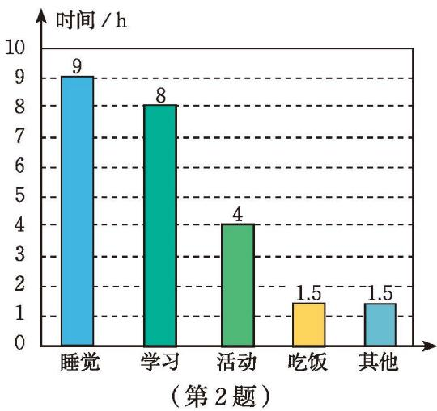
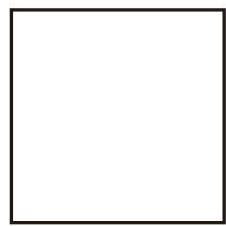
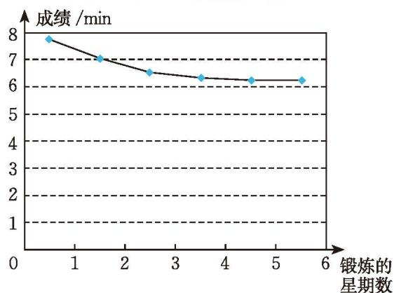

### 习题 6.3

#### 知识技能

1. 请用扇形统计图表示本章表 6-1 呈现的全班学生上学采用的交通方式。

2. 小颖一天的时间安排统计图如图所示。

(1) 根据图中的数据绘制扇形统计图，表示小颖一天的时间安排；

(2) 比较两幅统计图的不同；

(3) 绘制扇形统计图表示你一天的时间安排。

  

3. 某地区随机抽调一部分居民进行了一次法律知识测试，将测试成绩（得分取整数）整理后分成五组，绘制成如图所示的频数直方图。

(1) 这次活动共抽取了多少人测试？

(2) 测试成绩的整体分布情况怎样？

4. (1) 请将本章表 6-2 呈现的全班学生的立定跳远成绩以 $10 \mathrm{~cm}$ 为组距分段，并用频数直方图表示；

  

(2) 请用其他统计图表示本章表 6-2 呈现的全班学生的立定跳远成绩，并与频数直方图进行比较。

5. 某银行营业网点抽样调查了 50 名顾客，他们的等待时间（从进入银行营业网点到开始办理业务的时间间隔，单位：min）如下：

<table><tr><td>15</td><td>20</td><td>18</td><td>3</td><td>25</td><td>34</td><td>6</td><td>0</td><td>17</td><td>24</td></tr><tr><td>23</td><td>30</td><td>35</td><td>42</td><td>37</td><td>24</td><td>21</td><td>1</td><td>14</td><td>12</td></tr><tr><td>34</td><td>22</td><td>13</td><td>34</td><td>8</td><td>22</td><td>31</td><td>24</td><td>17</td><td>33</td></tr><tr><td>4</td><td>14</td><td>23</td><td>32</td><td>33</td><td>28</td><td>42</td><td>25</td><td>14</td><td>22</td></tr><tr><td>31</td><td>42</td><td>34</td><td>26</td><td>14</td><td>25</td><td>40</td><td>14</td><td>24</td><td>11</td></tr></table>

将数据适当分组，并绘制相应的频数直方图。

6. 某公司 2021—2022 年的总支出情况如图所示。

某公司 2021—2022 年总支出情况

  

某公司 2022 年总支出的分配情况

  

(1) 2022 年该公司原料的支出金额是多少？工资的支出金额是多少？

(2) 2021 年该公司的工资支出占总支出的 $60\%$，2022 年与 2021 年相比，该公司在工资方面的支出金额是增加了还是减少了？

#### 数学理解

7. (1) 请将本章表 6-2 呈现的课间操分数以 3 分为组距分段，并用频数直方图表示；

(2) 比较将学生的课间操分数分别以 10 分、5 分和 3 分为组距分段得到的频数直方图，它们之间有哪些区别和联系？

8. 本章表 6-2 呈现的课间操分数还可以用下面的统计图表示：

  

试根据这个图说说课间操分数的整体分布情况。这个图与频数直方图相比，有哪些相同与不同之处？

&emsp;※9. 某地区 0\~59 岁人口与 60 岁及以上人口的比例如图 (1) 所示，如果用图 (2) 的正方形表示该地区全部人口，请在图 (2) 中直观地表示该地区 $0 \sim 59$ 岁人口与 60 岁及以上人口的比例关系。

  

    

      
      
(1)

    

    

      
      
(2)

    

  

  
（第 9 题）

#### 问题解决

10. 统计你家一个月的人均消费支出及其构成情况，并用扇形统计图表示。

11. 调查你所在班级全班同学的血型，并用扇形统计图表示。查阅资料，了解我国不同血型人群的比例情况，与你们班级的情况相比有什么差异？

12. (1) 为了解某地区新生儿体重状况，某医院随机调取了该地区 60 名新生儿的出生体重，结果（单位：g）如下：

<table><tr><td>3 850</td><td>3 900</td><td>3 300</td><td>3 500</td><td>3 315</td><td>3 800</td><td>2 550</td><td>3 800</td><td>4 150</td></tr><tr><td>2 500</td><td>2 700</td><td>2 850</td><td>3 800</td><td>3 500</td><td>2 900</td><td>2 850</td><td>3 300</td><td>3 650</td></tr><tr><td>4 000</td><td>3 300</td><td>2 800</td><td>2 150</td><td>3 700</td><td>3 465</td><td>3 680</td><td>2 900</td><td>3 050</td></tr><tr><td>3 850</td><td>3 610</td><td>3 800</td><td>3 280</td><td>3 100</td><td>3 000</td><td>2 800</td><td>3 500</td><td>4 050</td></tr><tr><td>3 300</td><td>3 450</td><td>3 100</td><td>3 400</td><td>4 160</td><td>3 300</td><td>2 750</td><td>3 250</td><td>2 350</td></tr><tr><td>3 520</td><td>3 850</td><td>2 850</td><td>3 450</td><td>3 800</td><td>3 500</td><td>3 100</td><td>1 900</td><td>3 200</td></tr><tr><td>3 400</td><td>3 400</td><td>3 400</td><td>3 120</td><td>3 600</td><td>2 900</td><td></td><td></td><td></td></tr></table>

将数据适当分组，绘制相应的频数直方图，图中反映出该地区新生儿体重的整体状况是怎样的？

(2) 调查你们班同学出生时的体重情况，将数据适当分组，绘制相应的频数直方图，并与 (1) 中新生儿体重状况进行比较。

13. 测量你 $1 \mathrm{~min}$ 脉搏的次数。

(1) 汇总全班同学的数据，绘制频数直方图；

(2) 大多数同学 $1 \mathrm{~min}$ 脉搏的次数处于哪个范围？

14. 为提高长跑成绩，小彬坚持锻炼并于每星期日记录下 $1500 \mathrm{~m}$ 成绩。

小彬 1500 m 成绩统计表

<table><tr><td>锻炼的星期数</td><td>1</td><td>2</td><td>3</td><td>4</td><td>5</td><td>6</td></tr><tr><td>小彬的成绩</td><td>7 min 42 s</td><td>7 min</td><td>6 min 30 s</td><td>6 min 18 s</td><td>6 min 12 s</td><td>6 min 12 s</td></tr></table>

小彬 1500 m 成绩统计图

  
   
  （第 14 题）

如果要更清楚地看出小彬成绩的变化情况，你选择统计图还是统计表？如果要方便、准确地获得他锻炼 5 星期后的长跑成绩，你会如何选择？

15. 空气质量指数（Air Quality Index，AQI）是定量描述空气质量状况的指数，其数值越大说明空气污染状况越严重，对人体健康的危害也就越大。

(1) 查阅资料，了解我国空气质量指数的相关规定；

(2) 收集你所在地区连续 30 天的空气质量指数，用适当的统计图进行表示，并分析空气质量情况。