## 习题1.1

## 知识技能

1. 五棱柱、六棱柱各有多少个面？多少个顶点？多少条棱？猜测七棱柱的情形并设法验证你的猜测。

2. 一个六棱柱框架如图所示，它的底面边长都是 $5 \mathrm{~cm}$ ，侧棱长 $4 \mathrm{~cm}$ 。观察这个框架，回答下列问题：

(1) 这个六棱柱的几个面分别是什么形状？哪些面的形状、大小完全相同？

(2) 这个六棱柱所有侧面的面积之和是多少?

  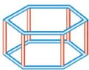
   
  (第 2 题)

3. 图中的棱柱、圆锥分别是由几个面围成的？它们是平的还是曲的？

<table border="0" cellspacing="0" cellpadding="5">
  <tr align="center">
    <td width="50%" style="vertical-align: bottom;"></td>
    <td width="50%" style="vertical-align: bottom;"></td>
  </tr>
</table>
<b style="display:block; margin-top:10px;">(第 3 题)</b>

## 数学理解

4. 将下图中的几何体分类，并说明理由。

<table border="0" cellspacing="0" cellpadding="5" >
  <tr align="center">
    <td width="25%" style="vertical-align: bottom;">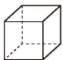 (1)</td>
    <td width="25%" style="vertical-align: bottom;">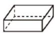 (2)</td>
    <td width="25%" style="vertical-align: bottom;">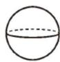 (3)</td>
    <td width="25%" style="vertical-align: bottom;">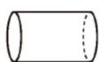 (4)</td>
  </tr>
  <tr align="center">
    <td width="25%" style="vertical-align: bottom;">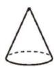 (5)</td>
    <td width="25%" style="vertical-align: bottom;">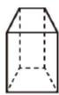 (6)</td>
    <td width="25%" style="vertical-align: bottom;">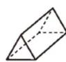 (7)</td>
    <td width="25%" style="vertical-align: bottom;"></td>
  </tr>
</table>
<b style="display:block; margin-top:10px;">(第 4 题)</b>

5. 找出下列图片中你熟悉的几何体。

<table border="0" cellspacing="0" cellpadding="5" >
  <tr align="center">
    <td width="25%" style="vertical-align: bottom;">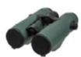 (1)</td>
    <td width="25%" style="vertical-align: bottom;"> (2)</td>
    <td width="25%" style="vertical-align: bottom;"> (3)</td>
    <td width="25%" style="vertical-align: bottom;"> (4)</td>
  </tr>
</table>
<b style="display:block; margin-top:10px;">(第 5 题)</b>

6. 下列物体可以近似地看成是由什么几何体组成的？

<table border="0" cellspacing="0" cellpadding="5" >
  <tr align="center">
    <td width="25%" style="vertical-align: bottom;">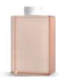 (1)</td>
    <td width="25%" style="vertical-align: bottom;">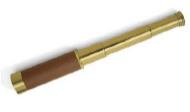 (2)</td>
    <td width="25%" style="vertical-align: bottom;"> (3)</td>
    <td width="25%" style="vertical-align: bottom;">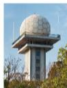 (4)</td>
  </tr>
</table>
<b style="display:block; margin-top:10px;">(第 6 题)</b>

7. 生活中有哪些几何体可以由平面图形旋转得到？你能想象它们是由什么平面图形旋转得到的吗？请举例说明。

※8. 下列哪些几何体可以由平面图形绕一条直线旋转一周得到？

<table border="0" cellspacing="0" cellpadding="5" >
  <tr align="center">
    <td width="25%" style="vertical-align: bottom;"> (1)</td>
    <td width="25%" style="vertical-align: bottom;"> (2)</td>
    <td width="25%" style="vertical-align: bottom;"> (3)</td>
    <td width="25%" style="vertical-align: bottom;">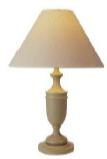 (4)</td>
  </tr>
</table>
<b style="display:block; margin-top:10px;">(第 8 题)</b>

## 联系拓广

※9. 圆柱和棱柱有很多相同点，下面这个几何体和它们也有这样的相同点吗？

  
   
  (第 9 题)

