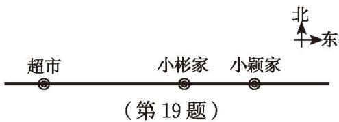

### 习题2.2

#### 知识技能

1. 计算：  
(1) $(-8)+(-9)$ ; (2) $(-17)+21$ ; (3) $(-12)+25$ ;  
(4) $45+(-23)$ ; (5) $(-45)+23$ ; (6) $(-29)+(-31)$ ;  
(7) $(-39)+(-45)$ ; (8) $(-28)+37$ ; (9) $(-13)+0$ 。

2. 土星表面的夜间平均温度为 $-150^{\circ} \mathrm{C}$ , 白天平均温度比夜间平均温度高 $27^{\circ} \mathrm{C}$ , 那么白天的平均温度是多少?

3. 计算:  
(1) $(-25)+34+156+(-65)$ ; (2) $(-64)+17+(-23)+68$ ;  
(3) $(-42)+57+(-84)+(-23)$ ; (4) $63+72+(-96)+(-37)$ ;  
(5) $(-301)+125+301+(-75)$ ; (6) $(-52)+24+(-74)+12$ ;  
(7) $41+(-23)+(-31)+0$ ; (8) $(-26)+52+16+(-72)$ 。

4. 某只股票一星期的涨跌情况见下表（正号表示价格比前一天上涨，负号表示价格比前一天下跌；股市周末不开盘，股价无变化）：

<table><tr><td>星期</td><td>一</td><td>二</td><td>三</td><td>四</td><td>五</td></tr><tr><td>涨跌情况/元</td><td>+4.18</td><td>-3.24</td><td>+0.25</td><td>-1.73</td><td>+1.46</td></tr></table>

该只股票星期五的价格与上星期五相比情况如何？

5. 某日小明在一条南北方向的健身步道上跑步。他从 A 地出发，每隔 10 min 记录下自己的跑步情况（向南为正方向，单位：m）：
-1008, 1100, -976, 1010, -827, 946。

1 h 后他停下来休息，此时他在 A 地的什么方向，距 A 地多远？小明共跑了多少米？

6. 分别列出一个满足下列条件的算式：  
(1) 所有的加数是负整数，和是 -5； (2) 一个加数是 0，和是 -5；  
(3) 至少有一个加数是正整数，和是 -5。

7. 分别找出一个满足下列条件的整数：  
(1) 加 -15，和大于 0;  
(2) 加 -15，和小于 0;  
(3) 加 -15，和等于 0。

8. 计算：  
(1) $(-3)-(-7)$ ; (2) $(-10)-3$ ;  
(3) $33-(-27)$ ; (4) 0-12;  
(5) $(-11)-0$ ; (6) $(-4)-16$ 。

$$
(-72) - (-37) - (-22) - 17;
$$

$$
23 - (-76) - 36 - (-105);
$$

$$
(-16) - (-12) - 24 - (-18);
$$

$$
(-32) - (-27) - (-72) - 87.
$$

10. 计算：  
(1) $27 - 18 + (-7) - 32$ ;  
(2) $\frac{1}{3} + \left(-\frac{1}{5}\right) - 1 + \frac{2}{3}$ ;  
(3) $0.5 + \left(-\frac{1}{4}\right) - (-2.75) + \frac{1}{2}$ ;  
(4) $\left(-\frac{2}{3}\right) + \left(-\frac{1}{6}\right) - \left(-\frac{1}{4}\right) - \frac{1}{2}$ 。

11. 计算：  
(1) $7 + (-2) - 3.4;$ (2) $(-21.6) + 3 - 7.4 + \left(-\frac{2}{5}\right);$ (3) $31 + \left(-\frac{5}{4}\right) + 0.25;$ (4) $7 - \left(-\frac{1}{2}\right) + 1.5;$ (5) $49 - (-20.6) - \frac{3}{5};$ (6) $\left(-\frac{6}{5}\right) - 7 - (-3.2) + (-1).$

#### 数学理解

12. 教科书中为加法运算和减法运算提供了实际背景, 请你设计一种新的情境来表示加法算式 $(-4) + 3$ 、减法算式 $(-3) - (-2)$ 。

13. 请借助图形直观解释算式 $2 + (-5) = -3$ 的运算过程和结果。

14. 小明用下图直观解释 $4 - (-3) = 7$ , 请你解释一下小明的想法, 并用类似的方法直观解释 $(-5) - (-2) = -3$ 。

  
4

  
4

  
4-(-3)  
(第14题)

  
4+3

#### 问题解决

15. 2020 年 11 月 10 日，我国自主研发的载人潜水器“奋斗者”号，在西太平洋马里亚纳海沟成功坐底，坐底深度 $10909 \mathrm{~m}$，创造了中国载人深潜的新纪录。马里亚纳海沟是地球海洋最深的地方，最深处深约 $11000 \mathrm{~m}$，“奋斗者”号此次坐底深度与马里亚纳海沟最深处大约相差多少米？

16. 王大爷把今年收获的土豆装在大小相同的袋子里，一共装了 10 袋。每袋称重结果如下：

<table><tr><td>袋号</td><td>1</td><td>2</td><td>3</td><td>4</td><td>5</td><td>6</td><td>7</td><td>8</td><td>9</td><td>10</td></tr><tr><td>质量/kg</td><td>54</td><td>49</td><td>51</td><td>50</td><td>48</td><td>52</td><td>50</td><td>47</td><td>53</td><td>46</td></tr></table>

这 10 袋土豆的总质量是多少？你是怎么算的？

17. 下图是一页账单，但有一部分破损了，请你根据上面残余的信息算出这一页最后的结余。

<table><tr><td>日期</td><td>支出或存入</td><td>结余</td><td>备注</td></tr><tr><td>2022-05-26</td><td>-120.00</td><td>9 546.00</td><td></td></tr><tr><td>2022-06-12</td><td>-150.00</td><td></td><td></td></tr><tr><td>2022-06-25</td><td>280.00</td><td></td><td></td></tr><tr><td>2022-07-05</td><td>-315.00</td><td></td><td></td></tr><tr><td>2022-08-12</td><td>-540.00</td><td></td><td></td></tr><tr><td>2022-09-06</td><td>-470.00</td><td></td><td></td></tr></table>

(第17题)

18. 下表列出了国外几个城市与北京的时差①。  
(1) 如果现在的北京时间是 7:00，那么现在的东京时间是几点？

<table><tr><td>城市</td><td>纽约</td><td>巴黎</td><td>东京</td><td>芝加哥</td></tr><tr><td>时差 /h</td><td>-13</td><td>-7</td><td>+1</td><td>-14</td></tr></table>  
(2) 小丽想在北京时间 7:00 给在巴黎的姑妈打电话, 你认为合适吗?  
(3) 李伯伯从北京乘坐早晨 8:00 的航班经过约 $20 \mathrm{~h}$ 到达纽约, 那么李伯伯到达纽约时当地时间大约是几点?  
(4) 了解国外其他城市与北京的时差, 以时差为背景联系实际生活编写一道数学问题。

19. 如图, 一辆货车从超市出发, 向东走了 $3 \mathrm{~km}$ 到达小彬家, 继续走了 $1.5 \mathrm{~km}$ 到达小颖家, 然后向西走了 $9.5 \mathrm{~km}$ 到达小明家, 最后回到超市。

  
(1) 小明家在超市的什么方向, 距超市多远? 以超市为原点, 以向东的方向为正方向, 用 1 个单位长度表示 $1 \mathrm{~km}$ , 请在数轴上表示出小明家、小彬家和小颖家的位置。  
(2) 小明家距小彬家多远?  
(3) 货车一共行驶了多少千米?

20. 某市客运管理部门对“十一”国庆假期七天客流变化量进行了不完全统计，数据如下（正号表示客流量比前一天增加，负号表示客流量比前一天减少）：

<table><tr><td>日期</td><td>1日</td><td>2日</td><td>3日</td><td>4日</td><td>5日</td><td>6日</td><td>7日</td></tr><tr><td>变化/万人</td><td>+20</td><td>-3</td><td>-10</td><td>-3</td><td>+2</td><td>+9</td><td>+3</td></tr></table>

与 9 月 30 日相比，10 月 7 日的客流量是增加了还是减少了，变化了多少？

21. 一位患者每天下午需要测量一次血压，下表是该患者星期一至星期五收缩压的变化情况。该患者上星期日的收缩压为 $160 \mathrm{~mmHg}^{\text{①}}$ 。

<table><tr><td>星期</td><td>一</td><td>二</td><td>三</td><td>四</td><td>五</td></tr><tr><td>收缩压的变化 / mmHg(与前一天比较)</td><td>升 30</td><td>降 20</td><td>升 17</td><td>升 18</td><td>降 20</td></tr></table>  
(1) 请算出该患者星期五的收缩压;  
(2) 请画折线图表示该患者这五天的收缩压情况。

#### 联系拓广

22. 数轴上任意两点 $A, B$ 表示的数分别是 $a, b$ 。  
(1) 当 a, b 分别取下列值时，求 A, B 两点间的距离。

$$
a = 3, b = 6; a = - 3, b = 6; a = - 3, b = - 6 。
$$

&emsp;※（2）用 a, b 表示 A, B 两点间的距离。
