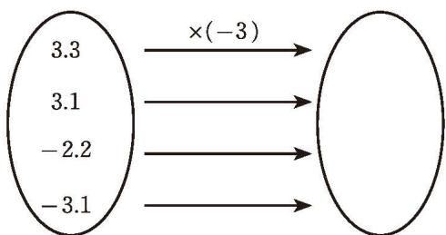
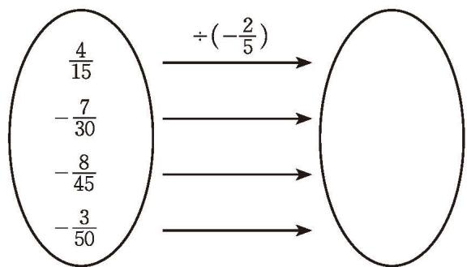

### 习题2.3

#### 知识技能

1. 计算：  
(1) $0 \times (-2024)$ ; (2) $(-8) \times 1.25$ ;  
(3) $\frac{7}{10} \times \left(-\frac{3}{14}\right)$ ;  
(4) $\left(-\frac{3}{16}\right)\times\left(-\frac{8}{9}\right);$  
(5) $(- \frac{14}{3}) \times \frac{5}{7}$ ;  
(6) $7 \times \left(-1 + \frac{3}{14}\right)$ 。

2. 把下图中左圈内的每个数分别乘 -3，将结果写在右圈内相应的位置。

3.3

3.1

-2.2

-3.1

(第2题)

3. 计算：  
(1) $7.5 \times (-8.2) \times 0 \times (-19.1)$ ;  
(2) $(-0.12) \times \frac{1}{12} \times (-100)$ ;  
(3) $100 \times (-3) \times (-5) \times 0.01$ ;  
(4) $(\frac{1}{9} - \frac{1}{6} - \frac{1}{18}) \times 36;$  
(5) $(\frac{1}{4} - \frac{1}{2} - \frac{1}{8}) \times 128;$  
(6) $[9 \times (-4)] \times \left(-\frac{1}{4}\right)$ ;  
(7) $2.25 \times (-2.3) \times \frac{3}{25}$ ;  
(8) $(-2.1)\times 6.5\times \left(-\frac{3}{7}\right)$ 。

4. 计算：  
(1) $0 \div (-0.24)$ ;  
(2) $(-0.5) \div (-\frac{1}{4})$ ;  
(3) $(-1.25)\div\frac{1}{4};$  
(4) $\frac{4}{7} \div (-12)$ ;  
(5) $(-378)\div(-7)\div(-9);$  
(6) $(-0.75) \div \frac{5}{4} \div (-0.3)$ ;  
(7) $(-3.2) \div \frac{96}{5}$ ;  
(8) $\left(-\frac{9}{14}\right)\div2.5$ 。

5. 求下列各数的倒数，并用“<”把这些倒数连接起来：

$-\frac{5}{12}, 3.7, \left| -\frac{1}{6} \right|, 2, -1.8$ 。

6. 把下图中左圈内的每个数分别除以 $-\frac{2}{5}$ , 将结果写在右圈内相应的位置。

  
(第6题)

#### 数学理解

7. 请在下列括号里填写运算的依据：

$$
\begin{array}{rl}
& 10 \times \left(-\frac{3}{7}\right) \times \left(\frac{5}{2} - \frac{6}{5} + \frac{1}{10}\right) \\
&= \left(-\frac{3}{7}\right) \times 10 \times \left(\frac{5}{2} - \frac{6}{5} + \frac{1}{10}\right) \\
&= \left(-\frac{3}{7}\right) \times \left[10 \times \left(\frac{5}{2} - \frac{6}{5} + \frac{1}{10}\right)\right] \\
&= \left(-\frac{3}{7}\right) \times \left[10 \times \frac{5}{2} + 10 \times \left(-\frac{6}{5}\right) + 10 \times \frac{1}{10}\right] \\
&= \left(-\frac{3}{7}\right) \times (25 - 12 + 1) \\
&= \left(-\frac{3}{7}\right) \times 14 \\
&= -6.
\end{array}
$$

( )

( )

( )

#### 问题解决

8. (1) 某地气象统计资料表明, 海拔每增加 $1000 \mathrm{~m}$ , 气温就降低大约 $6^{\circ} \mathrm{C}$ 。现在地面气温是 $37^{\circ} \mathrm{C}$ , 则 $10000 \mathrm{~m}$ 高空的气温大约是多少?  
(2) 根据 (1) 中的信息, 试提出一种估计一座山峰海拔的方法。  
(3) 请查阅资料, 了解科学家是如何测量珠穆朗玛峰的 “身高” 的。

#### 联系拓广

9. 利用乘法法则完成下表，你能发现什么规律？

<table><tr><td>×</td><td>3</td><td>2</td><td>1</td><td>0</td><td>-1</td><td>-2</td><td>-3</td></tr><tr><td>3</td><td>9</td><td>6</td><td>3</td><td>0</td><td>-3</td><td></td><td></td></tr><tr><td>2</td><td>6</td><td>4</td><td>2</td><td></td><td></td><td></td><td></td></tr><tr><td>1</td><td>3</td><td>2</td><td>1</td><td></td><td></td><td></td><td></td></tr><tr><td>0</td><td></td><td></td><td></td><td></td><td></td><td></td><td></td></tr><tr><td>-1</td><td></td><td></td><td></td><td></td><td></td><td></td><td></td></tr><tr><td>-2</td><td></td><td></td><td></td><td></td><td></td><td></td><td></td></tr><tr><td>-3</td><td></td><td></td><td></td><td></td><td></td><td></td><td></td></tr></table>

(第9题)

10. 如果两个数的乘积为负数，那么这两个数的符号分别是什么？如果两个数的乘积为正数呢？你能推广到多个数相乘的情形吗？试一试！

&emsp;※11. 用“>”“<”或“=”填空：  
(1) 若 a<0，则 a \_\_\_\_ 2a;  
(2) 若 a < c < 0 < b，则 $a \times b \times c$ \_\_\_\_ 0。
