### 习题3.1

#### 知识技能

1. 用代数式表示:  
(1) $f$ 的 11 倍再加 2 可以表示为 \_\_\_\_；  
(2) 数 $a$ 的 $\frac{1}{8}$ 与数 $a$ 的和可以表示为 \_\_\_\_；  
(3) 一间教室有 2 扇门和 4 扇窗户, $n$ 间这样的教室有 \_\_\_\_ 扇门和 \_\_\_\_ 扇窗户;  
(4) 产量由 $m \mathrm{~kg}$ 增长 $15 \%$ 后, 达到 \_\_\_\_ kg;  
(5) 某班共有 $x$ 名学生, 其中女生人数占 $45\%$ , 那么男生人数是

2. 人体血液的质量占人体体重的 $7\% \sim 8\%$ 。  
(1) 如果某人体重是 $a \mathrm{~kg}$ , 那么他的血液质量大约在什么范围内?  
(2) 小亮体重是 $35 \mathrm{~kg}$ , 他的血液质量大约在什么范围内?  
(3) 估计你自己的血液质量。

3. 物体由静止自由下落的高度 $h$ (单位: $\mathrm{m}$ ) 和下落时间 $t$ (单位: $\mathrm{s}$ ) 之间的关系, 在地球上大约是 $h = 4.9 t^{2}$ , 在月球上大约是 $h = 0.8 t^{2}$ 。  
(1) 填写下表。

<table><tr><td>t</td><td>0</td><td>2</td><td>4</td><td>6</td><td>8</td><td>10</td></tr><tr><td> $h=4.9t^{2}$ </td><td></td><td></td><td></td><td></td><td></td><td></td></tr><tr><td> $h=0.8t^{2}$ </td><td></td><td></td><td></td><td></td><td></td><td></td></tr></table>  
(2)物体在地球上下落得较快还是在月球上下落得较快？  
(3)当 $h = {20}\mathrm{\;m}$ 时,比较物体在地球上和在月球上自由下落所需的时间。

4. 声音在干燥空气中传播的速度随着温度的变化而变化, 当温度为 $t^{\circ} \mathrm{C}$ 时, 声音的传播速度 (单位: $\mathrm{m} / \mathrm{s}$ ) 大约是 $331 + 0.6 t$ , 求温度分别为 $2^{\circ} \mathrm{C}$ 和 $30^{\circ} \mathrm{C}$ 时声音的传播速度。

5. 观察右图，回答下列问题：  
(1) 标出未注明的边的长度;  
(2) 阴影部分的周长是\_\_\_\_；  
(3) 阴影部分的面积是\_\_\_\_；
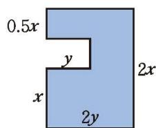  
(4) 当 $x = 5.5, y = 4$ 时, 阴影部分的周长是 $\underline{\quad}$ , 面积是 $\underline{\quad}$ 。

(第5题)

6. 某物体由静止竖直向上运动, 物体的高度 $h$ (单位: $\mathrm{m}$ ) 与运动时间 $t$ (单位: $\mathrm{s}$ ) 之间的关系可以用公式 $h = -5t^{2} + 150t + 10$ 表示, 求运动时间分别为 $10 \mathrm{~s}, 15 \mathrm{~s}, 20 \mathrm{~s}$ 时该物体的高度。

7. 下图是一个“数值转换机”的示意图，写出运算过程并填写下表。

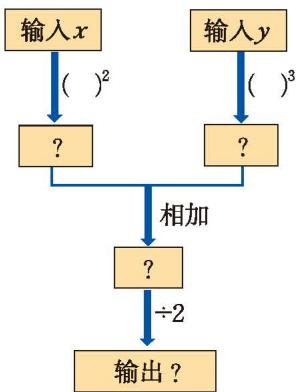  
(第7题)

<table><tr><td>x</td><td>-1</td><td>0</td><td>1</td><td>2</td></tr><tr><td>y</td><td>1</td><td>-0.5</td><td>0</td><td>0.5</td></tr><tr><td>输出</td><td></td><td></td><td></td><td></td></tr></table>

8. 下列代数式中哪些是单项式, 哪些是多项式? 它们的次数分别是多少? $7 h, x y ^ { 3 } + 1 , 2 a b + 6 , \frac { 2 } { 5 } x - b y ^ { 3 }$ 。

9. 下列多项式分别有几项？每项的系数和次数分别是多少？  
(1) $-\frac{1}{3}x-x^{2}y+2\pi;$ (2) $x^{3}-2x^{2}y^{2}+3y^{2}$ 。

#### 数学理解

10. (1) 小明用棋子按如图所示的规律摆出图形, 并写出 $1 + 3 n$ 的结果, 请解释他的想法。

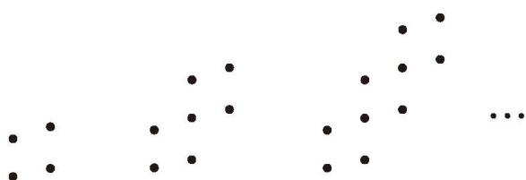  
(第10题)  
(2) 与本节 “用小棒拼摆正方形” 活动中得到的结果相比较, 你在 (1) 中有什么发现?  
(3) 用 99 枚棋子能恰好摆出符合 (1) 中规律的图形吗? 用 100 枚呢? 11. 下列代数式可以表示什么? (1) $2 x$ ; (2) $\frac{a + b}{2}$ ; (3) $8 a^{3}$ 。

12. 填写下表，并观察 $-8n+5$ 和 $-n^{2}$ 这两个代数式的值的变化情况。

<table><tr><td>n</td><td>1</td><td>2</td><td>3</td><td>4</td><td>5</td><td>6</td><td>7</td><td>8</td></tr><tr><td>-8n+5</td><td></td><td></td><td></td><td></td><td></td><td></td><td></td><td></td></tr><tr><td>-n2</td><td></td><td></td><td></td><td></td><td></td><td></td><td></td><td></td></tr></table>  
(1) 随着 $n$ 的值逐渐变大, $-8n + 5$ 和 $-n^2$ 这两个代数式的值如何变化?  
(2)估计一下,哪个代数式的值先小于 -100?

#### 问题解决

13. (1) 小明用长度相同的小棒按如图所示的规律拼摆图形, 第 $n$ 个图形需要多少根小棒?  
(2) 小颖给出一种新的拼摆方式，按照小颖的方式拼摆，第 $n$ 个图形所需小棒的根数

<table border="0" cellspacing="0" cellpadding="5">
  <tr align="center">
    <td  style="vertical-align: bottom;">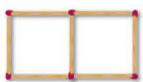 ①</td>
    <td  style="vertical-align: bottom;">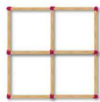 ②</td>
    <td  style="vertical-align: bottom;">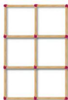 ③</td>
  </tr>
</table>
<b style="display:block; margin-top:10px;">[第 13(1) 题]</b>

为 $3 + 2(n - 1)$ 。请你画图表示小颖的拼摆方式。  
(3) 请你设计出其他有规律的拼摆方式, 根据你的拼摆规律提出问题并加以解决。

14. 在某地, 人们发现在一定气温下某种蟋蟀叫的次数与气温之间有如下的近似关系: 用蟋蟀 $1 \mathrm{~min}$ 叫的次数加 30 , 再把结果除以 7 , 就近似地得到该地当时的气温 (单位: ℃)。  
(1) 用代数式表示该地当时的气温;  
(2) 当蟋蟀 $1 \mathrm{~min}$ 叫的次数分别是 80, 100 和 120 时, 该地当时的气温大约是多少?

15. 遗传是影响一个人身高的因素之一。有学者总结出用父母身高预测子女身高的经验公式：儿子成年后的身高 = $\frac{a+b}{2} \times 1.08$ ，女儿成年后的身高 = $\frac{0.923a+b}{2}$ ，其中 a 为父亲身高，b 为母亲身高，身高单位：m。  
(1) 七年级男生小刚的爸爸身高为 $1.72 \mathrm{~m}$ , 妈妈身高为 $1.65 \mathrm{~m}$ , 根据这个公式预测小刚成年后的身高;  
(2) 根据这个公式, 预测一下自己成年后的身高;  
(3) 请查阅资料, 收集一些预测人体身高的其他经验公式。

16. 骑山地自行车过程中, 如果车座高度不合适, 会使骑行者踩踏费力, 甚至造成膝盖磨损。如何确定合适的车座高度呢? 有一种雷蒙德 (Lemond) 测量方法: 双腿站立, 两脚 (不穿鞋) 间距约 $15 \mathrm{~cm}$ , 测量裆部离地面的高度 $h$ (单位: $\mathrm{cm}$ ), 得出的数据乘 0.883 就是相应的车座顶部到中轴的距离 $l$ (如图, 单位: $\mathrm{cm}$ ), 此时的车座高度是骑行最合适的高度。根据雷蒙德测量方法解决下列问题:  
(1) 用含 $h$ 的代数式表示 $l$ 。  
(2) 当 $h = 84 \mathrm{~cm}$ 时, $l$ 为多少厘米?  
(3) 请测量自身的相关数据, 计算并调整自己山地自行车的车座高度, 检验雷蒙德测量方法是否适合自己。

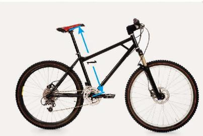  
(第16题)

17. 如图(1)(2), 某餐桌桌面可由圆形折叠成正方形 (图中阴影表示可折叠部分)。已知折叠前圆形桌面的直径为 $a \mathrm{~m}$ , 折叠成正方形后其边长为 $b \mathrm{~m}$ 。如果一块正方形桌布的边长为 $a \mathrm{~m}$ , 并按图(3)所示把它铺在折叠前的圆形桌面上, 那么桌布垂下部分的面积是多少? 如果按图(4)所示把这块桌布铺在折叠后的正方形桌面上呢?

<table border="0" cellspacing="0" cellpadding="5">
  <tr align="center">
    <td width="25%" style="vertical-align: bottom;">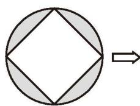 (1)</td>
    <td width="25%" style="vertical-align: bottom;">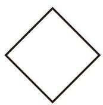 (2)</td>
    <td width="25%" style="vertical-align: bottom;">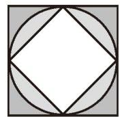 (3)</td>
    <td width="25%" style="vertical-align: bottom;">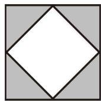 (4)</td>
  </tr>
</table>
<b style="display:block; margin-top:10px;">(第 17 题)</b>

#### 联系拓广

&emsp;※18. 当 $a = -1, -0.5, 0, 0.5, 1, 1.5, 2$ 时， $a^2 - a$ 是正数还是负数？当 $|a| > 2$ 时， $a^2 - a$ 是正数还是负数？

19. 请你设计一个方案，估计一卷空心卷筒纸（如图）展开的总长度。

  
(第19题)
