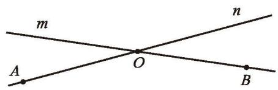
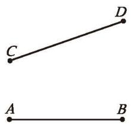
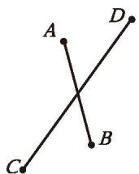
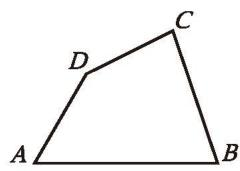
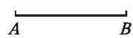
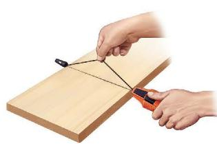
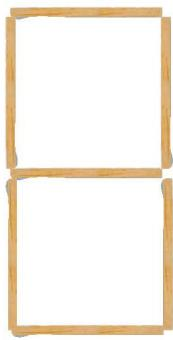
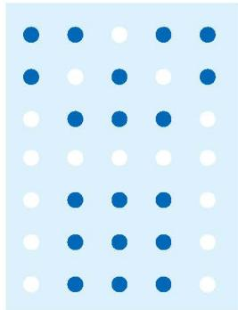
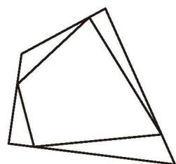

### 习题4.1

#### 知识技能
1. 如图，请用两种方式分别表示图中的两条直线。

<table border="0" cellspacing="0" cellpadding="5" width="40%">
   <tr align="center">
     <td  style="vertical-align: bottom;"></td>
   </tr>
</table>
<small><b>(第1题)</b></small>

2. 如图, 已知平面上三点 $A,B,C$ 。  
(1) 画直线 $AC$ ; (2) 画射线 $BA$ ;  
(3) 画线段 $BC$ 。

3. 分别比较图 (1)(2)(3) 中每组线段的长短:

<table border="0" cellspacing="0" cellpadding="5" >
   <tr align="center">
     <td  style="vertical-align: bottom;"> <small>(1)</small></td>
     <td  style="vertical-align: bottom;"> <small>(2)</small></td>
     <td  style="vertical-align: bottom;"> <small>(3)</small></td>
   </tr>
</table>
<small><b>(第3题)</b></small>

4. 如图, 已知线段 $a, b$ , 用尺规作一条线段 $c$ , 使 $c = b - a$ 。

<table border="0" cellspacing="0" cellpadding="5" width="40%">
   <tr align="center">
     <td  style="vertical-align: bottom;"></td>
   </tr>
</table>
<small><b>(第4题)</b></small>

5. 如图, 已知线段 $AB$ , 请用尺规按下列步骤作图:  
(1) 延长线段 $AB$ 到 $C$ , 使 $BC = AB$ ;  
(2) 延长线段 BA 到 D，使 AD = AC。  
如果 AB=2 cm，那么 AC=____ cm，BD=____ cm，CD=____ cm。

<table border="0" cellspacing="0" cellpadding="5" width="40%">
   <tr align="center">
     <td  style="vertical-align: bottom;"></td>
   </tr>
</table>
<small><b>(第5题)</b></small>

#### 数学理解
6. 墨斗是中国传统木工行业中画直线的常用工具。如图, 木匠师傅锯木料时, 一般先在木板上画出两个点, 从墨斗中拉出墨线一端固定在一个点, 另一端固定在另一点, 绷紧并提起墨线中段, 过这两点就弹出一条墨线。请你解释其中的道理。

<table border="0" cellspacing="0" cellpadding="5" width="40%">
   <tr align="center">
     <td  style="vertical-align: bottom;"></td>
   </tr>
</table>
<small><b>(第6题)</b></small>

#### 问题解决
7. 点和线段在生活中有着广泛的应用。  
(1) 如图 (1), 用 7 根长度相同的小棒可以摆出图中的 “8”。你能去掉其中的若干小棒, 摆出其他的 9 个数字吗? 这种用 7 条线段构成的数字称为 “7 画字”, 它可以用在计算器或电梯的楼层显示屏上。

<table border="0" cellspacing="0" cellpadding="5" width="80%">
   <tr align="center">
     <td  style="vertical-align: bottom;"> <small>(1)</small></td>
     <td  style="vertical-align: bottom;"> <small>(2)</small></td>
   </tr>
</table>
<small><b>(第7题)</b></small>

(2) 点也可以用来构成数字或符号, 点阵式打印机就是利用了这个原理。如图 (2), 在长方形点阵中, 白色的点就构成了英文字母 “A”。试利用这种方法做出其他 25 个英文字母。  
(3) 试用点阵显示的方式在纸上做出“强国有我”这四个字。

#### 联系拓广
8. 如图, 在一个四边形各边上任意取一点, 并顺次连接它们。想一想, 你得到的图形的周长与原四边形周长哪一个长? 为什么? 如果是一个五边形呢? 六边形呢?

<table border="0" cellspacing="0" cellpadding="5" width="40%">
   <tr align="center">
     <td  style="vertical-align: bottom;"></td>
   </tr>
</table>
<small><b>(第8题)</b></small>

