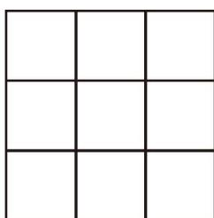

## 一元一次方程 复习题

### 知识技能

1. 解方程：

(1) $\frac{5}{12} x - \frac{x}{4} = \frac{1}{3}$；

(2) $\frac{2}{3} - 8x = 3 - \frac{1}{2} x$；

(3) $0.5x - 0.7 = 6.5 - 1.3x$；

(4) $\frac{1}{6} (3x - 6) = \frac{2}{5} x - 3$；

(5) $3(x - 7) + 5(x - 4) = 15$；

(6) $4x - 3(20 - x) = -4$；

(7) $\frac{y - 1}{2} = 2 - \frac{y + 2}{5}$；

(8) $\frac{1}{3} (1 - 2x) = \frac{2}{7} (3x + 1)$。

2. 在公式 $s = s_0 + vt$ 中，已知 $s = 100$，$s_0 = 25$，$v = 10$，求 $t$ 的值。

### 数学理解

3. 儿子今年 13 岁，父亲今年 40 岁，是否有哪一年父亲的年龄恰好是儿子年龄的 4 倍？为什么？

4. 《九章算术》中给出"盈不足术"：把盈余数与不足数相加，和为被除数，把两次每人出的钱数之差作为除数，所得的商即为人数；将人数乘每人出的钱数，然后减对应的盈余数或加对应的不足数即为物价。试解释这种算法。

请分别用"盈不足术"及方程的方法求解下面的问题。

今有共买鸡，人出九，盈一十一；人出六，不足十六。问：人数、鸡价各几何？

### 问题解决

5. 把 100 写成两个数的和，使第一个数加 3 与第二个数减 3 的结果相等。这两个数分别是多少？

6. 今有共买羊，人出五，不足四十五；人出七，不足三。问：人数、羊价各几何？（选自《九章算术》）题目大意：几个人合伙买羊，若每人出 5 钱，则差 45 钱；若每人出 7 钱，则差 3 钱。合伙人数、羊价各是多少？

7. 牧童分杏各争竞，不知人数不知杏。三人五个多十枚，四人八枚两个剩。问：有几个牧童几个杏？（选自《算法统宗》）题目大意：牧童们要分一堆杏，不知道人数也不知道有多少个杏。若 3 人一组，每组 5 个杏，则多 10 个杏；若 4 人一组，每组 8 个杏，则多 2 个杏。有多少个牧童、多少个杏？

8. 爷爷与孙子下棋，爷爷赢 1 盘记 1 分，孙子赢 1 盘记 3 分，下了 8 盘，每盘都分出了胜负，此时两人得分相等。他们各赢了多少盘？

9. 某文件需要排版，小李独立做需要 $6 \mathrm{~h}$ 完成，小王独立做需要 $8 \mathrm{~h}$ 完成。如果他们俩共同做，需要多长时间完成？

10. 一辆收割机收割一块麦田，上午收割了麦田的 $25\%$，下午收割了剩下麦田的 $20\%$，结果还剩下 $6 \mathrm{hm}^{2}$ 麦田未收割。这块麦田一共有多少公顷？

11. 某商店出售两件衣服，每件 60 元，其中一件赚 $25\%$，而另一件赔 $25\%$，那么这家商店是赚了还是赔了，或是不赚也不赔呢？

12. 甲车从 A 地开往 B 地，速度是 60 km/h；乙车沿同一路线同时从 B 地开往 A 地，速度是 90 km/h。已知 A，B 两地相距 200 km，两车相遇的地方离 A 地多远？

13. 某商场将某种商品按原价的八折出售，此时商品的利润率是 $10\%$。已知这种商品的成本价为 1800 元，那么这种商品的原价是多少？

14. 某文艺团体为公益募捐组织了一场义演，成人票每张 80 元，学生票每张 50 元，共售出 1000 张票，所得票款可能是 69300 元吗？为什么？可能是 69320 元吗？如果可能，那么成人票比学生票多售出多少张？

&emsp;※15. 把 99 写成四个数的和，使第一个数加 2，第二个数减 2，第三个数乘 2，第四个数除以 2，得到的结果都相等。这四个数分别是多少？

16. 设未知数列方程与用字母表示数、表示数量关系有什么区别和联系？谈谈你的体会。

### 联系拓广

&emsp;※17. 已知 $x = 5$ 是方程 $ax - 8 = 20 + a$ 的解，求 $a$ 的值。

18. 图中的正方形由 9 个小方格组成。在每个小方格中各填一个数，如果每行、每列、每条对角线上的三个数的和都相等，那么就称这个图是一个三阶幻方。

  
   
  （第 18 题）

(1) 请将 $1 \sim 9$ 这 9 个数填入图中的小方格中，构造一个三阶幻方。

(2) 改变 (1) 中所构造的三阶幻方中某些数的位置，构造一个新的三阶幻方。

(3) 在 (1)(2) 所构造的不同三阶幻方中，有没有位置始终不变的数？如果有，请你解释其中的道理。

(4) 你能选择其他 9 个数构造一个三阶幻方吗？请你试一试。
