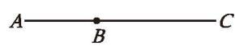
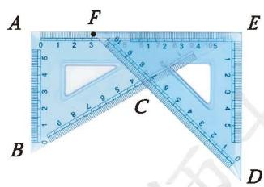
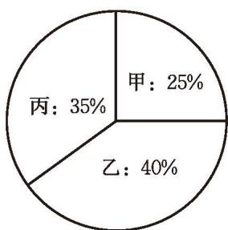
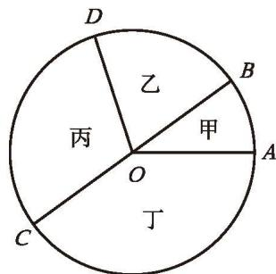
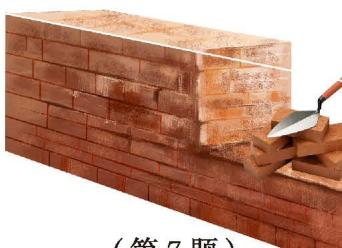
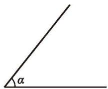
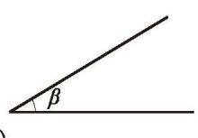
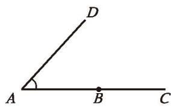
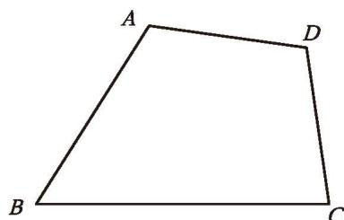

## 基本平面图形 复习题

#### 知识技能

1. 如图, 在同一平面内有四个点 $A, B, C, D$ , 请用直尺按下列要求作图:  
(1) 作射线 $CD$ ; (2) 作直线 $AD$ ;  
(3) 连接 AB;

(第1题)  
(4)作直线 $BD$ 与直线 $AC$ 相交于点 $O$ 。

2. 将弯曲的河道改直，可以缩短航程，请你说一说其中的道理。

  
   
  (第3题)

3. 如图, $\angle ABC$ 是平角, 过点 $B$ 任作一条射线 $BD$ , 得到 $\angle DBA$ 与 $\angle DBC$ 。当 $\angle DBA$ 分别是什么角时, $\angle DBA < \angle DBC$ , $\angle DBA > \angle DBC$ , $\angle DBA = \angle DBC$ ?

4. 一副三角尺拼成如图所示的图案，求 $\angle EFC$ ， $\angle CED$ ， $\angle AFC$ 的度数。

  
   
  (第4题)

5. 如图,分别求出甲、乙、丙三个扇形的圆心角的度数。

  
   
  (第5题)

  
   
  (第6题)

6. 如图，甲、乙、丙、丁四个扇形的面积之比为 $1: 2: 3: 4$ ，分别求出它们圆心角的度数。

#### 数学理解

7. 如图，建筑工人砌墙时，经常先在两端立桩拉线，然后沿着线砌墙，请你用数学知识解释这样做的道理。

  
   
  (第7题)

#### 问题解决

8. 如图, 已知线段 $a$ , 直线 $AB$ 与直线 $CD$ 相交于点 $O$ , 请用尺规按下列要求作图:  
(1) 在射线 $OA, OB, OC, OD$ 上作线段 $OA', OB', OC', OD'$ , 使它们分别与线段 $a$ 相等;  
(2) 连接 $A^{\prime} C^{\prime}, C^{\prime} B^{\prime}, B^{\prime} D^{\prime}, D^{\prime} A^{\prime}$ 。

你得到了一个怎样的图形？

  
   
  (第8题)

9. 用尺规完成下列作图：  
(1) 如图 (1), 已知 $\angle \alpha, \angle \beta$ , 且 $\angle \alpha > \angle \beta$ , 作 $\angle DEF$ , 使 $\angle DEF = \angle \alpha - \angle \beta$ ;  
(2)如图(2),以点 $B$ 为顶点、射线 ${BC}$ 为一边,作 $\angle {EBC}$ ,使 $\angle {EBC} = \angle A$ 。

|  |  |  |
|---|---|---|
|  |  |  |
| (1) |  | (2) |
|  | (第9题) |  |

10. 通过本章的学习，你对线段、射线、直线和角有了哪些新的认识？谈谈你的感悟。

#### 联系拓广

&emsp;※11. 如图，在任意四边形 ABCD 内找一点 O，使它到四边形四个顶点的距离之和最小，并说说你的理由。

  
   
  (第11题)

