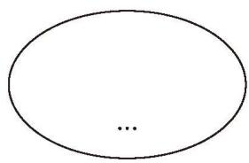
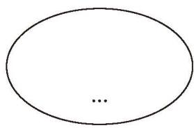
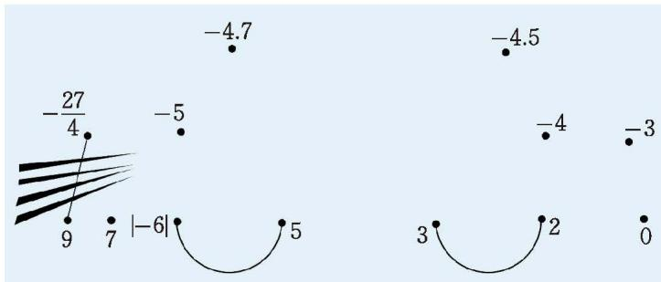
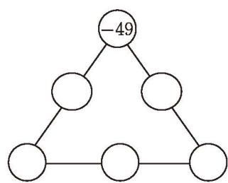
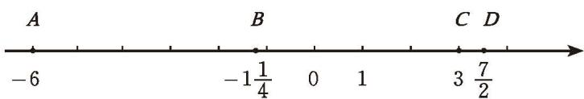
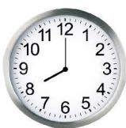
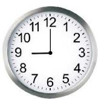
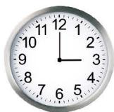
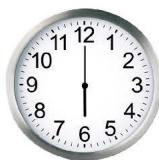

## 有理数及其运算 复习题

#### > 知识技能

1. 下表记录了某星期股市的涨跌情况，请完成下表。

<table><tr><td>星期</td><td>涨跌情况(相较前一交易日)</td><td>用正负数表示</td></tr><tr><td>一</td><td>上涨100点</td><td>+100</td></tr><tr><td>二</td><td>下跌50点</td><td></td></tr><tr><td>三</td><td>上涨60点</td><td></td></tr><tr><td>四</td><td>下跌30点</td><td></td></tr><tr><td>五</td><td>上涨2点</td><td></td></tr></table>

2. 用数轴上的点表示下列各数，并求它们的相反数和绝对值：

$$
- 0. 5, - 3. 5, 7, - 4. 5, - 4 _ {\circ}
$$

3. 下面两个圈分别表示负数集合和整数集合, 请将下列各数填在适当的圈中。

$$
- 5 \frac {1}{2}, 0, 2, - 7, 1. 2 5, - \frac {7}{3}, - 3, - \frac {3}{4} 。
$$

  
负数集合

  
整数集合  
(第3题)

4. 比较下列每组数的大小：  
(1) $\frac{1}{100}, -0.009;$ (2) $-\frac{8}{7}, -\frac{7}{8};$ (3) $\frac{2}{3}, \frac{3}{5};$ (4) $-2\frac{1}{3}, -2.3$ 。

5. 从下图中最小的数开始，由小到大依次用线段连接各数。看看你画出了什么。

  
(第5题)

  
(第6题)

6. 在如图所示的圆圈内填上彼此都不相等的数，使得每条线上的三个数之和为零。你有几种填法？

7. 计算：  
(1) $(-8)-(-1)$ ;  
(2) $45 + (-30)$ ;  
(3) $(-1.5)-(-11.5)$ ;  
(4) $(- \frac{1}{4}) - (- \frac{1}{2})$ ;  
(5) 15- $[1-(-20-4)]$ ;  
(6) $(-40) - 28 - (-19) + (-24)$ ;  
(7) $7.5 + (-4.4) + (-2.5) + 4.4;$  
(9) $2.4 - \left(-\frac{3}{5}\right) + (-3.1) + \frac{4}{5};$  
(11) $\frac{3}{4} - (-\frac{11}{6}) + (-\frac{7}{3})$ ;  
(8) $(\frac{2}{3} - \frac{1}{2}) - (\frac{1}{3} - \frac{5}{6})$ ;  
(10) $(- \frac{6}{13}) + (- \frac{7}{13}) - (-2)$ ;  
(12) $11 + (-22) - 3 \times (-11)$ ;  
(13) $(-0.1) \div \frac{1}{2} \times (-100)$ ; (14) $(- \frac{3}{4}) \times (- \frac{2}{3} - \frac{1}{3}) \times 0$ ; (15) $(-2)^{3} - 3^{2}$ ; (16) $23 \div [(-2)^{3} - (-4)]$ ; (17) $(\frac{3}{4} - \frac{7}{8}) \div (-\frac{7}{8})$ ; (18) $(-60) \times (\frac{3}{4} + \frac{5}{6})$ 。

8. 请用科学记数法表示下表中的数据。

<table><tr><td>天体名称</td><td>围绕太阳公转的轨道长半径/km</td></tr><tr><td>水星</td><td>58 000 000</td></tr><tr><td>金星</td><td>110 000 000</td></tr><tr><td>地球</td><td>150 000 000</td></tr><tr><td>火星</td><td>230 000 000</td></tr><tr><td>木星</td><td>780 000 000</td></tr><tr><td>土星</td><td>1 400 000 000</td></tr><tr><td>天王星</td><td>2 900 000 000</td></tr><tr><td>海王星</td><td>4 500 000 000</td></tr></table>

9. 计算： $1-2+3-4+5-6+\cdots+99-100$ 。

10. 点 $A, B, C, D$ 所表示的数如图所示, 回答下列问题:

  
(第10题)  
(1) $C, D$ 两点间的距离是多少?  
(2) $A, B$ 两点间的距离是多少?  
(3) $A, D$ 两点间的距离是多少?

#### > 数学理解

11. “一只闹钟一昼夜误差在±20s之内。”这句话是什么意思？

12. 下列说法是否正确？请将错误的改正过来。  
(1) 所有的有理数都能用数轴上的点表示;  
(2) 符号不同的两个数互为相反数;  
(3) 有理数分为正数和负数;  
(4)两数相加,和一定大于任何一个加数;  
(5)两数相减，差一定小于被减数。

13. 写出符合下列条件的数：  
(1) 最小的正整数;  
(2) 最大的负整数;  
(3) 大于 -3 且小于 2 的所有整数;  
(4) 绝对值最小的有理数;  
(5) 绝对值大于 2 且小于 5 的所有负整数;  
(6) 在数轴上, 到表示 -1 的点的距离为 2 的所有数。

#### 14. 填空：  
(1) 两个互为相反数的数（0除外）的商是\_\_\_\_；  
(2) 两个互为倒数的数的积是\_\_\_\_。

15. 观察下面的每组数，按某种规律在横线上填上适当的数，并说明你的理由。  
(1) -23, -18, -13, \_\_\_\_, \_\_\_\_;  
(2) $\frac{2}{8}, -\frac{3}{16}, \frac{4}{32}, -\frac{5}{64}, \_\_\_\_$ ,  
(3) 2, -4, 8, -16, \_\_\_\_, \_\_\_\_;  
(4) -2, -4, 0, -2, 2, \_\_\_\_, \_\_\_\_。

16. 小于 $\left(-\frac{5}{3}\right)^{3}$ 的最大整数是多少？

17. 绝对值大于 1 且小于 5 的所有整数的和是多少？

18. 下面的解题过程正确吗？如果不正确，请指出错误的原因并给出正确的解答。  
(1) $(-330 + 240 + \frac{30}{7}) \div 30$ $= -330 \div 30 + 240 \div 30 + \frac{30}{7} \div 30 = -11 + 8 + \frac{1}{7} = -\frac{20}{7};$  
(2) $120 \div (12 - 60 + \frac{3}{2})$ $= 120 \div 12 - 120 \div 60 + 120 \div \frac{3}{2} = 10 - 2 + 80 = 8 + 80 = 88.$

19. 与同伴做下面的游戏：每个人从同一副扑克牌（去掉大王、小王和 J，Q，K）中选择 3 张黑色牌和 3 张红色牌（黑色牌代表正分，红色牌代表负分），使得 6 张牌的总分为零。两人轮流从同伴手中抽 1 张牌，10 次以后，计算每人手中牌的总分，得分高者获胜。  
(1) 你希望抽到哪种颜色的牌？你希望哪种颜色的牌不被抽走？  
(2) 游戏结束后, 你手中牌的总分与同伴手中牌的总分有什么关系?  
(3) 你可能得到的最高分是多少?

#### 问题解决

20. 全班学生分为五个组进行知识抢答比赛, 每组的基本分为 $100 \mathrm{~分}$ , 答对 1 题加 $50 \mathrm{~分}$ , 答错 1 题扣 $50 \mathrm{~分}$ 。游戏结束时, 各组的分数如下:

<table><tr><td>第一组</td><td>第二组</td><td>第三组</td><td>第四组</td><td>第五组</td></tr><tr><td>100</td><td>150</td><td>-400</td><td>350</td><td>-100</td></tr></table>  
(1) 第一名超出第二名多少分?  
(2)第一名超出第五名多少分?

21. 矿井下 $A, B, C$ 三处的高度分别是 $-37.4 \mathrm{~m}, -129.8 \mathrm{~m}, -71.3 \mathrm{~m}, A$ 处比 $B$ 处高多少米? $C$ 处比 $B$ 处高多少米? $A$ 处比 $C$ 处高多少米?

22. 小华记录了本小组同学的身高（单位：cm）数据：
158, 163, 154, 160, 165, 162, 157, 160。
请你计算这个小组学生的平均身高。

23. 10 名学生参加体检, 体重 (单位: $\mathrm{{kg}}$ ) 的测量结果如下: 47, 48, 37.5, 42, 45, 40, 38.5, 34.5, 38, 42.5。 这 10 名学生的平均体重是多少? 你是怎么算的?

24. 某航空公司规定每名旅客随身携带的行李不能超过 $5 \mathrm{~kg}$ 。李叔叔一家 4 人携带的行李情况如下（正数表示行李超过限额，负数表示行李低于限额）： $+1.5 \mathrm{~kg}, -0.8 \mathrm{~kg}, +1 \mathrm{~kg}, -2.5 \mathrm{~kg}$ 。  
(1) 李叔叔一家携带的行李总质量是多少?  
(2) 如果李叔叔一家想再多随身携带 $1 \mathrm{~kg}$ 行李, 那么总质量是否超过 4 人携带行李限额之和?

25. 地震震级是划分震源放出的能量大小的等级。(n+2)级地震释放的能量大约是n级地震的1000倍。8级地震释放的能量大约是4级地震的多少倍?

26. 用计算器求下列各式的值, 将结果填写在横线上。 ${99999} \times  {11} =$ \_\_\_\_；
99 999×12=\_\_\_\_;

99 999×13=\_\_\_\_;

$99\ 999 \times 14 =$ \_\_\_\_。  
(1) 你发现了什么？  
(2) 不用计算器, 试直接写出 $99999 \times 19$ 的结果。

&emsp;※27. 下面的五个时钟显示了同一时刻国外四个城市时间和北京时间，根据下表给出的国外四个城市与北京的时差，请分别在时钟下标明五个城市的名称。

<table><tr><td>城市</td><td>时差 /h</td></tr><tr><td>纽约</td><td>-13</td></tr><tr><td>悉尼</td><td>+2</td></tr><tr><td>伦敦</td><td>-8</td></tr><tr><td>罗马</td><td>-7</td></tr></table>

  
(第27题)

#### > 联系拓广

28. (1) 如果数 $a$ 的绝对值等于 $a$ , 那么 $a$ 可能是正数吗? 可能是零吗? 可能是负数吗?  
(2) 如果数 $a$ 的绝对值大于 $a$ , 那么 $a$ 可能是正数吗? 可能是零吗? 可能是负数吗?  
(3) 一个数的绝对值可能小于它本身吗?

29. 某地区海拔每增加 $1000 \mathrm{~m}$ , 气温就降低大约 $6^{\circ} \mathrm{C}$ 。设地面气温是 $a^{\circ} \mathrm{C}$ , 请写出表示 $x \mathrm{~m}$ 高空气温的式子。

&emsp;※30. 下列各式一定成立吗?  
(1) $a^2 = (-a)^2$ ; (2) $a^3 = (-a)^3$ ; (3) $-a^2 = |-a^2|$ ; (4) $a^3 = |a^3|$ .

31. 将数的范围扩充到有理数给我们带来哪些便利？对此你有哪些感悟？将你的感悟写成一篇小短文，并在班级内分享。

