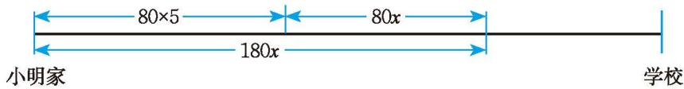
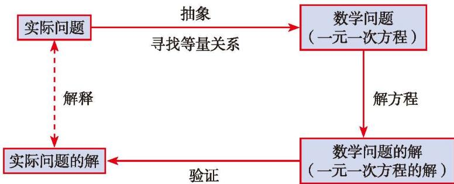

小明家与他就读的学校相距 $1000 \, m$ 。一天，小明以 $80 \, m/min$ 的速度出发，出发后 $5 \, min$ ，小明的爸爸发现小明忘了带语文书。于是，爸爸立即以 $180 \, m/min$ 的速度沿同一条路去追小明，并且在途中追上了他。爸爸追上小明用了多长时间？追上小明时，距离学校还有多远？  
(1) 问题中有哪些已知量和未知量?  
(2) 想象一下追及的过程, 你能用一个图直观表示问题中各个量之间的关系吗?  
(3) 你是怎样列出方程的？与同伴进行交流。
设爸爸追上小明用了 $x \min$ 。当爸爸追上小明时，两人所行路程相等，如图5-3所示。

图5-3

画图分析数量关系是一种有效方法。

根据等量关系，可列出方程：\_\_\_\_。
解这个方程，得 $x =$ \_\_\_\_。
因此，爸爸追上小明用了\_\_\_\_min，此时距离学校还有\_\_\_\_m。

根据相等量的两种不同表达式就可以建立等量关系，列出方程了。

> [!example]- 例3 小明和小华两人在 $400 \mathrm{~m}$ 的环形跑道上练习长跑, 小明每分钟跑 $260 \mathrm{~m}$ , 小华每分钟跑 $300 \mathrm{~m}$ , 两人起跑时站在跑道同一位置。  
> (1) 如果小明起跑后 $1 \mathrm{~min}$ 小华才开始跑, 那么小华用多长时间能追上小明?  
> (2) 如果小明起跑后 $1 \mathrm{~min}$ 小华开始反向跑, 那么小华起跑后多长时间两人首次相遇?
> 分析：本题涉及哪些量？你能画图说明小明和小华跑步的情形吗？在问题（1）和（2）中，两人所走的路程分别有什么关系？
>
> > [!success]- 解
> > (1) 设小华用 $x \min$ 追上小明, 根据等量关系, 可列出方程:
> >
> > $$
> > 260 + 260x = 300x.
> > $$
> > 解这个方程，得
> >
> > $$
> > x = 6.5.
> > $$
> > 因此，小华用 6.5 min 追上小明。  
> > (2) 设小华起跑后 $x \min$ 两人首次相遇, 根据等量关系, 可列出方程:
> >
> > $$
> > 260x + 300x = 400 - 260.
> > $$
> > 解这个方程，得
> >
> > $$
> > x = 0.25.
> > $$
> > 因此，小华起跑后 0.25 min 两人首次相遇。

> [!question] 思考·交流

用一元一次方程解决实际问题的一般步骤是什么？与同伴进行交流。

用一元一次方程解决实际问题的一般步骤如图 5-4 所示:

图5-4

> [!summary] 回顾·反思

回顾本节一元一次方程应用的学习，对于如何寻找等量关系列方程，你积累了哪些经验？

> [!exercise] 随堂练习

1. 今有木, 不知长短, 引绳度之, 余绳四尺五寸①; 屈绳量之, 不足一尺。问: 几何? (选自《孙子算经》)

题目大意：有一根木材，不知道它的长度，用一根绳子来量，绳子长出4尺5寸；将这根绳子对折来量，绳子差1尺。这根木材有多长？