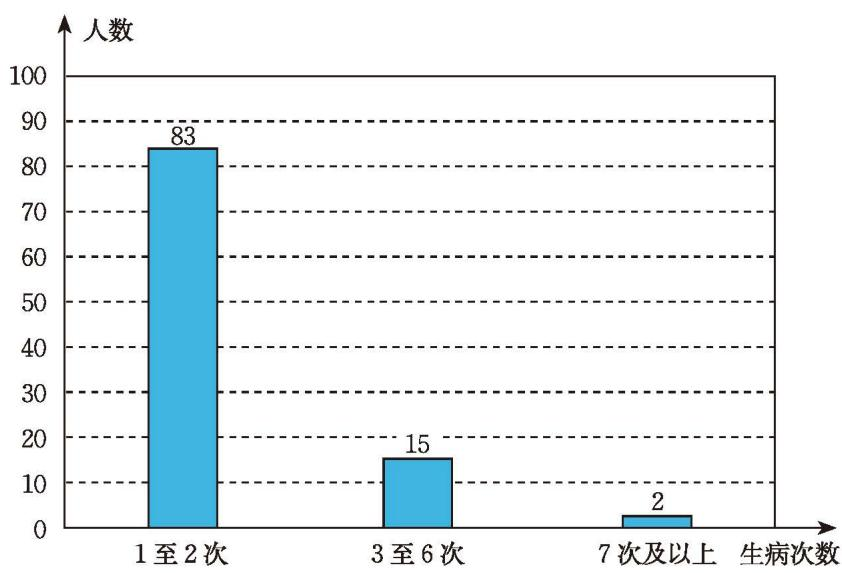
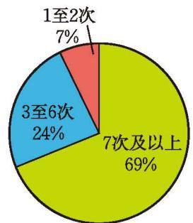

为了解你所在地区 70 岁以上老年人的健康状况，你准备怎样收集数据？

下面分别是小明、小颖、小亮所在三个小组的调查结果：
#### 🧑‍🤝‍🧑 各小组的调查过程与结果

* **小明小组（公园调查）：**
  > “我们小组在公园里调查了 100 名 70 岁以上老年人，他们一年中生病的次数如图 6-5 所示。”
  

    

      
      
    

    
图 6-5

  

* **小颖小组（医院调查）：**
  > “我们小组在医院调查了 100 名 70 岁以上老年患者，他们一年中生病的次数如图 6-6 所示。”
  

    

      
      
    

    
图 6-6

  

* **小亮小组（社区邻居调查）：**
  > “我们小组调查了 10 名 70 岁以上老年邻居，他们一年中生病的次数如右表所示。”
  

    

      
      

        
        | 生病的次数 | 人数 |
        | :---: | :---: |
        | 1 至 2 次 | 4 |
        | 3 至 6 次 | 5 |
        | 7 次及以上 | 1 |
        
      

    

  

---

> [!question] 讨论·思考
> (1) 你同意他们的做法吗？说说你的理由。  
> (2) 为了解该地区 70 岁以上老年人的健康状况，你认为应当怎样收集数据？与同伴进行交流。  
> (3) 小华利用派出所的户籍网随机调查[^1]了该地区 $10\%$ 的 70 岁以上老年人，发现他们一年平均生病 3 次左右。你认为他的调查方式如何？

> [!question] 思考·交流
>
> 抽样调查有什么特点？抽样时应注意什么？与同伴进行交流。

抽样调查只考察总体的一部分个体，因此它的优点是调查范围小，节省时间、人力、物力和财力，但其调查结果往往不如普查得到的结果准确。为了获得较为准确的调查结果，抽样时要注意样本的代表性和广泛性。

> [!question] 尝试·思考
>
> 某校七年级共有 16 个班，每个班 50 名学生。为了解该校七年级学生的课外阅读情况，从全部 800 名学生中随机抽取 $10\%$ 作为样本进行调查。
>
> (1) 为保证样本的代表性，你认为应该怎样抽取样本？
>
> (2) 下面分别是三个小组的抽样方法，你能理解他们的做法吗？他们得到的样本具有代表性吗？
> - 将 800 名学生的学号做成号签放入盒中，从盒中无放回地连续随机抽取 80 个号签，对应的 80 名学生即为抽取的样本。
> - 从每个班级随机抽取 5 名学生，汇总得到的 80 名学生即为抽取的样本。
> - 七年级全体学生会议前，在会议室门口从第 1 个进入会议室的学生起，每隔 9 名学生抽取 1 名学生，得到的 80 名学生即为抽取的样本。

> [!summary] 回顾·反思
>
> 回顾你经历过的统计活动，在数据收集环节你积累了哪些经验？

> [!exercise] 随堂练习
>
> 1. 为了解你们学校的学生是否吃早饭，下列这些抽样的方式是否合适？
>
> (1) 早上 7:00 至 7:30 在校门口随机选择 50 名同学进行调查；
>
> (2) 选择全校每个班级中学号是 5 和 15 的同学进行调查；
>
> (3) 选择七（1）班全体学生进行调查。

[^1]: 随机调查，就是按机会均等的原则进行调查，即总体中每个个体被选中的可能性都相等。
