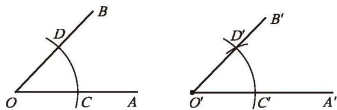
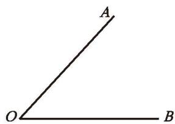
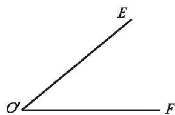
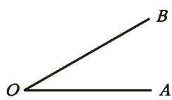

我们已经知道可以通过移动其中一个角的方法比较两个角的大小。如何移动一个角呢？比如，如何将图 4-28（1）中的 $\angle AOB$ 移动到图 4-28（2）的位置，使 $OA$ 与 $O'A'$ 重合？

  

    

      
      
<small>(1)</small>

    

    

      
      
<small>(2)</small>

    

    

      
    

  

  
图 4-28

(1) 请你用三角尺、量角器、圆规等工具解决这一问题。  
(2) 如果只用尺规，如何解决这个问题？请你试一试，并与同伴进行交流。

---

> [!example]- 例 2
> 如图 4-29，已知 $\angle AOB$，用尺规作 $\angle A'O'B'$，使 $\angle A'O'B' = \angle AOB$。
> 
> > [!success]- 作法
> > 1. 作射线 $O'A'$（如图 4-29）。
> > 2. 以点 $O$ 为圆心，以任意长为半径作弧，交 $OA$ 于点 $C$，交 $OB$ 于点 $D$。
> > 3. 以点 $O'$ 为圆心，以 $OC$ 的长为半径作弧，交 $O'A'$ 于点 $C'$。
> > 4. 以点 $C'$ 为圆心，以 $CD$ 的长为半径作弧，交前面的弧于点 $D'$。
> > 5. 过点 $D'$ 作射线 $O'B'$。
> > 
> > $\angle A'O'B'$ 就是所要作的角。
> 
> 

>   
>    
>   
图 4-29

> 

> [!question] 操作·思考
> 如图 4-30，已知 $\angle AOB$，$\angle EOF$，用尺规作图比较它们的大小。你是怎样做的？
> 
> 

>   

>     

>       
>     

>     

>       
>     

>   

>   
图 4-30

> 

#### 随堂练习

> [!exercise] 随堂练习
> 1. 如图，已知 $\angle AOB$，请用尺规作 $\angle A'O'B'$，使 $\angle A'O'B' = 2\angle AOB$。
> 

>   

>     

>       
>     

>   

>   
（第 1 题）

> 
