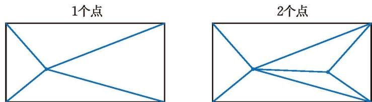
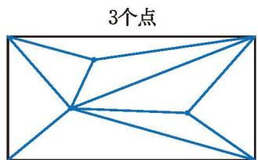
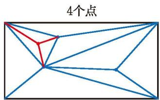
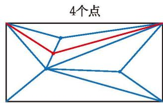
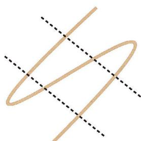
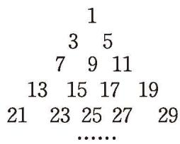
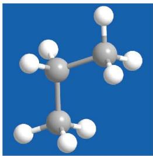

### ☆ 问题解决策略：归纳

在本章学习过程中，我们经历过很多次“[归纳](课本/【2024版】【北师大版】/【2024版】【北师大版】七年级上册数学/概念/归纳%20思维.md)”的过程。

#### 问题：
“低多边形风格”是一种数字艺术设计风格。它将整个区域分割为若干三角形，通过把相邻三角形涂上不同颜色，产生立体及光影的效果，随着三角形数量增加，效果更为斑斓绚丽（如图 3-9）。

图 3-9

将长方形区域分割成三角形的过程是：在长方形内取一定数量的点，连同长方形的 4 个顶点，逐步连接这些点，保证所有连线不再相交产生新的点，直到长方形内所有区域都变成三角形。

如图 3-10，当长方形内有 1 个点时，可分得 4 个三角形；当长方形内有 2 个点时，可分得 6 个三角形（不计被分割的三角形）。

图 3-10
当长方形内有 35 个点时，可分得多少个三角形？
##### 理解问题
> 1. 先动手画一画，感受分割得到三角形的过程。
> 2. 已知条件是什么？目标是什么？
##### 拟订计划
> 1. 直接研究“长方形内有 35 个点”的情形，你遇到了什么困难？
> 2. 哪些情形容易研究？从中你能发现什么规律？
> 3. 你发现的规律正确吗？你能给出合理的解释吗？
##### 实施计划
>写出你的解决方案，并说明其中的道理。

#### 小明的思考过程如下。
(1) 先研究长方形内有 3 个点、4 个点的情形（如图 3-11）。

<table border="0" cellspacing="0" cellpadding="5" width="100%">
  <tr align="center">
    <td width="50%" style="vertical-align: bottom;"></td>
    <td width="50%" style="vertical-align: bottom;"></td>
  </tr>
</table>
<b style="display:block; margin-top:10px;">图 3-11</b>

(2) 几种简单情形的数据见下表，发现规律：长方形内点的个数增加 1，三角形的个数增加 2。

<table><tr><td>长方形内点的个数</td><td>1</td><td>2</td><td>3</td><td>4</td><td>...</td></tr><tr><td>三角形的个数</td><td>4</td><td>6</td><td>8</td><td>10</td><td>...</td></tr></table>
(3) 猜想是合理的。在长方形内已经有 $n$ 个点的情况下，新增的一个点要么在某个三角形内部，要么在某条线段上。当新增的这个点在某个三角形内部时，连接该点和三角形的顶点，原来的 1 个三角形分成 3 个小三角形，三角形的个数增加 2；当新增的这个点在某条线段上时，连接该点和它所在两个三角形的顶点，三角形的个数同样增加 2。

因此，当长方形内有 35 个点时，分得的三角形的个数是

$$
4 + 2 \times 34 = 72.
$$

#### 回顾反思
> [!summary] 回顾反思
> 1. 如果长方形内有 100 个点呢？一般地，如果长方形内有 $n$ 个点呢？
> 2. 你还能提出并解决什么问题？
> 3. 从简单的情形开始思考有什么好处？通过简单情形归纳一般性结论，你有哪些经验？

>[!tip] 在运用归纳策略寻找规律时，要先在若干简单情形中寻找相应的规律。初步发现规律后，可以通过更多的情形验证，再考虑一般情况。最后，试着给出合理的解释，并用数学语言简洁地表达规律。

#### 课堂练习
请用归纳策略解答下列问题。
1. $3^{2024}$ 的个位数字是多少？

2. 如图 3-12，将一根绳子折成三段，然后按如图所示方式剪开。剪 1 刀，绳子变为 4 段；剪 2 刀，绳子变为 7 段。
(1) 剪 12 刀，绳子变为多少段？
(2) 有可能正好剪得 101 段吗？

图 3-12

3. 由 1，3，5，7，9，11，13，15，17，19，… 组成的三角形数阵如图 3-13 所示。
(1) 第 10 行的 10 个数的和是多少？

(2) 你还能找到其他规律吗？试一试！

图 3-13

4. 某类简单化合物中前 6 种化合物的分子结构模型如图 3-14 所示，其中灰球代表碳原子，白球代表氢原子。按照这一规律，第 60 种化合物的分子结构模型中有多少个氢原子？

<table border="0" cellspacing="0" cellpadding="5" width="100%">
  <tr align="center">
    <td width="16%" style="vertical-align: bottom;"> ①</td>
    <td width="16%" style="vertical-align: bottom;"> ②</td>
    <td width="16%" style="vertical-align: bottom;"> ③</td>
    <td width="16%" style="vertical-align: bottom;"> ④</td>
    <td width="16%" style="vertical-align: bottom;"> ⑤</td>
    <td width="16%" style="vertical-align: bottom;"> ⑥</td>
  </tr>
</table>
<b style="display:block; margin-top:10px;">图 3-14</b>

