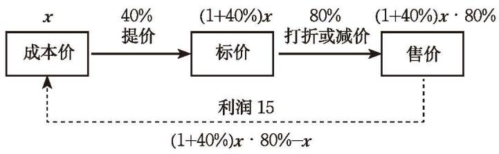

### ☆ 问题解决策略：直观分析

在利用一元一次方程解决问题时，借助表格和示意图可以直观分析问题，使问题中的数量关系更加清晰。实际上，借助图表直观分析数量关系，往往是解决问题的一种重要策略。

问题 一家商店将某种服装按成本价提高 $40 \%$ 后标价, 又以八折优惠卖出, 结果每件仍获利 15 元, 这种服装每件的成本是多少元?

#### 理解问题  
(1) 这个问题中涉及哪些量？哪些是已知量？哪些是未知量？  
(2) 你能用文字语言描述这个问题中所蕴含的等量关系吗?  
(3) 采用什么方式可以更清楚地展示这个问题中各个量之间的关系?

#### 拟订计划  
(1) 想象一下商店从进货、标价到销售获利的过程, 你能用示意图直观地表示这一过程吗?  
(2) 根据自己画的示意图, 你能写出哪些等量关系?  
(3) 设这种服装每件的成本为 $x$ 元, 你能用含 $x$ 的代数式表示其他量吗? 根据自己写出的等量关系, 你能列出怎样的方程?

#### 实施计划

写出你的解决方案，并与同伴进行交流。

小明用图 5-6 所示的框图直观地表示了商店从进货、标价到销售获利的过程，并将问题中的数量信息标注在框图中。据此，他列出了方程

$$
(1 + 40\%) x \cdot 80\% - x = 15.
$$
解这个方程，得 $x = 125$ 。
因此，这种服装每件的成本是 125 元。

图5-6

#### 回顾反思  
(1) 你是用怎样的示意图表示商店从进货、标价到销售获利全过程的？与同伴交流不同示意图的优缺点。  
(2) 示意图对解决这类问题有什么作用? 请举例说明。

借助适当的图表，可以直观、形象地呈现数量关系，使复杂的数量关系变得清晰明了，从而帮助我们更好地理解问题、分析问题、解决问题。

请用直观分析策略解答下列问题。

1. 某单位的四幢宿舍楼在一条直线上，现要在这四幢宿舍楼之间建一个超市，使得四幢宿舍楼到超市的距离之和最短。超市应建在什么位置？

2. 小明和爸爸周末骑自行车去郊外游玩, 他们同时出发, 分别以 $10 \mathrm{~km} / \mathrm{h}$ 和 $12 \mathrm{~km} / \mathrm{h}$ 的速度沿相同路线骑行, 爸爸骑行 $11 \mathrm{~km}$ 后立即掉转车头, 仍以 $12 \mathrm{~km} / \mathrm{h}$ 的速度往回骑 (小明仍按原速度向前骑行), 直到与小明会合。会合时他们骑行了多长时间?

3. 五个人聚会, 如果每两个人要握一次手, 那么五个人共握多少次手?

4. 一次测试共有两道题，全班有 45 名同学参加测试，答对第一题的有 32 人，答对第二题的有 27 人，两道题都答对的有 20 人，那么两道题都答错的有多少人？

5. 某公司办公大楼共 5 层，公司要召开会议。  
(1) 如果从 1 层到 5 层每层参会人数分别为 2, 1, 2, 1, 1, 那么要使所有参会人员到会议地点爬楼的距离之和最短, 会议地点应设在几层? 你是怎样思考的?  
(2) 如果从 1 层到 5 层每层参会人数分别为 2, 2, 1, 2, 1 呢?  
(3) 如果从1层到5层每层参会人数分别为18，14，10，10，11呢？你是如何解决的？

