

  
   
  图 1-17

如图 1-17，用一个平面去截一个几何体，截出的面叫作 [[截面]]（section）。

> [!question] 尝试·思考

如图 1-18，用一个平面去截一个正方体，截面是什么形状？

<table border="0" cellspacing="0" cellpadding="5">
  <tr align="center">
    <td width="33%" style="vertical-align: bottom;"> (1)</td>
    <td width="33%" style="vertical-align: bottom;"> (2)</td>
    <td width="33%" style="vertical-align: bottom;"> (3)</td>
  </tr>
</table>
<b style="display:block; margin-top:10px;">图 1-18</b>

(1) 截面的形状可能是三角形吗? 先想一想, 再试一试。  
(2) 截面的形状还可能是几边形?

> [!question] 观察·思考

图 1-19 中的截面分别是什么形状?

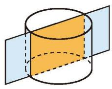  
(1)

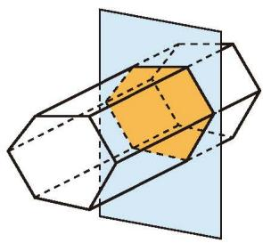  
(2)

图 1-19  
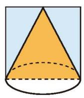  
(3)

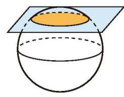  
(4)

#### 随堂练习

1. 分别指出图中几何体截面形状的标号。  
(1)

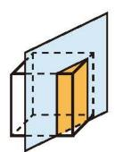

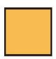

(A)

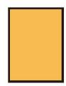

(B)

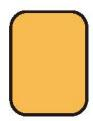  
(C)

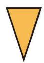  
(2)

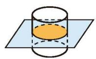

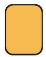  
(D)  
(A)

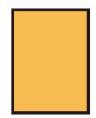  
(B)  
(第1题)

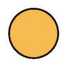  
(C)

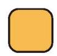  
(D)

2. 用一个平面去截一个几何体, 如果截面的形状是长方形, 那么原来的几何体可能是什么?
