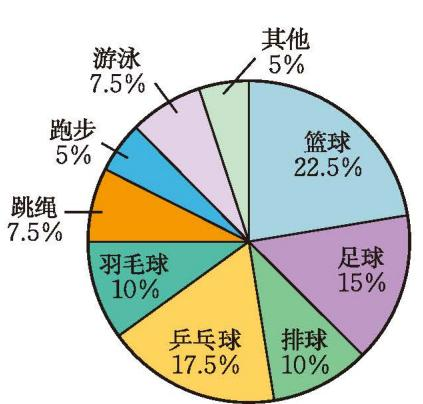
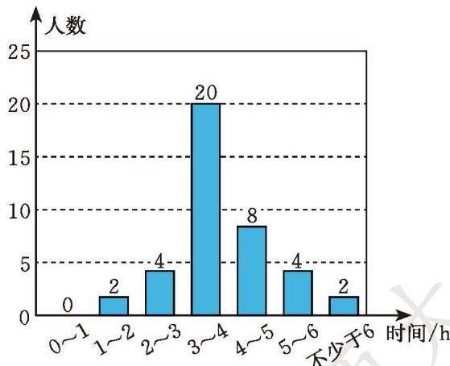

为更好地了解全班同学参加体育活动的情况，体育委员小刚设计了一份简单的调查问卷，并对全班 40 名同学进行了调查。

> [!todo] 📝 调查问卷
> 
> **1. 你最喜欢参加的体育活动项目是什么？（单选）**
> * [ ] A. 篮球 &nbsp;&nbsp;&nbsp;&nbsp;&nbsp;&nbsp;  [ ] B. 足球 &nbsp;&nbsp;&nbsp;&nbsp;&nbsp;&nbsp; [ ] C. 排球
> * [ ] D. 乒乓球 &nbsp;&nbsp; [ ] E. 羽毛球 &nbsp;&nbsp; [ ] F. 跳绳
> * [ ] G. 跑步 &nbsp;&nbsp;&nbsp;&nbsp;&nbsp;&nbsp; [ ] H. 游泳 &nbsp;&nbsp;&nbsp;&nbsp;&nbsp;&nbsp; [ ] I. 其他
> 
> ---
> 
> **2. 你每周参加体育活动的时间是多少？（单选）**
> * [ ] A. $0 \sim 1\text{ h}$
> * [ ] B. $1 \sim 2\text{ h}$
> * [ ] C. $2 \sim 3\text{ h}$
> * [ ] D. $3 \sim 4\text{ h}$
> * [ ] E. $4 \sim 5\text{ h}$
> * [ ] F. $5 \sim 6\text{ h}$
> * [ ] G. 不少于 $6\text{ h}$

根据调查结果，小刚绘制出图 6-3 和图 6-4。

  

    

      
全班同学最喜欢参加的体育活动项目

      
      
图 6-3

    

    

      
全班同学每周参加体育活动的时间

      
      
图 6-4

    

  

(1) 该班学生最喜欢参加的体育活动项目排名前三的分别是什么？
(2) 该班每周参加体育活动的时间不少于 $3 \mathrm{~h}$ 的学生有多少名？

> [!question] 尝试·思考
>
> 如果你们班准备按男女生分别组织体育活动，为了使活动受到更多人欢迎，你准备如何设计调查问卷进行调查？你设计的调查问卷和小刚设计的有什么不同？

> [!question] 思考·交流
>
> (1) 为得到"掷一枚质地均匀的硬币 50 次，出现正面朝上的次数"，你打算如何收集这个数据？
>
> (2) 如果想了解我国近两次全国人口普查的数据，你打算怎么做？
>
> (3) 获得数据的常用方式有哪些？与同伴进行交流。

人们经常通过调查、试验等方式获得数据信息。

借助报纸杂志、广播电视、统计年报或互联网等，也可以获得某些数据信息。国家统计局的网站（www.stats.gov.cn）就是查找有关资料的好地方。

你能利用搜索引擎或一些应用软件查找有关数据吗？