## 整式及其加减 复习题

#### 知识技能

1. 用字母表示：
(1) 乘法对加法的分配律 \_\_\_\_；  
(2) 一个长方形的长是 $b$，宽是长的一半，它的周长是 $\underline{\hspace{2cm}}$，面积是 $\underline{\hspace{2cm}}$；  
(3) 一个三角形的三边长都是 $c$，它的周长是 \_\_\_\_；  
(4) 一个平行四边形的一边长是 $a$，该边上的高是这边长的 $\frac{2}{3}$，这个平行四边形的面积是 \_\_\_\_。

2. 一组“数值转换机”如图所示，请填写下表，并写出图（1）的输出结果、图（2）的运算过程。

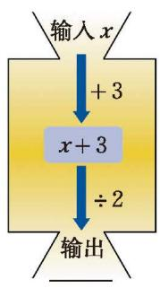  
(1)

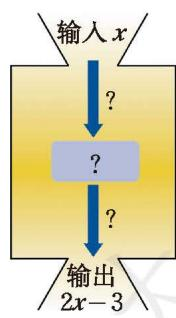  
(第2题)  
(2)

<table><tr><td>输入x</td><td>-2</td><td>-1</td><td>-1/2</td><td>0</td><td>1</td><td>1.5</td></tr><tr><td>图(1)的输出结果</td><td></td><td></td><td></td><td></td><td></td><td></td></tr><tr><td>图(2)的输出结果</td><td></td><td></td><td></td><td></td><td></td><td></td></tr></table>

3. 下列 [[学习整式]] 哪些是 [[单项式]]，哪些是 [[多项式]]？它们的次数分别是多少？  
(1) $7y^{2}$；(2) $4xy^{2}$；(3) $35abc$；(4) $3x+5y$；(5) $1+s^{2}+st$；(6) $\frac{4}{5}a^{2}x-a^{2}x^{3}+\frac{1}{5}x$。

4. 下列多项式中分别有几项？每项的系数和次数分别是多少？  
(1) $-abx^{2}+\frac{1}{5}x^{3}-\frac{1}{2}ab;$ (2) $xy-pqx^{2}+\frac{5}{9}p^{3}+9$ 。

5. 化简下列各式：  
(1) $5x^{4} + 3x^{2}y - 10 - 3x^{2}y + x^{4} - 1$ ; (2) $p^{2} + 3pq + 6 - 8p^{2} + pq$ ;  
(3) $(7y-3z)-(8y-5z)$ ; (4) $-(a^{5}-6b)-(-7+3b)$ ;  
(5) $2(2a^{2}+9b)+3(-5a^{2}-4b)$ ; (6) $-3(2x^{2}-xy)+4(x^{2}+xy-6)$ 。

6. 求下列各式的值：  
(1) $-3x^{2}+5x-0.5x^{2}+x-1$ ，其中 x=2；  
(2) $\frac{1}{4}(-4x^{2}+2x-8)-\left(\frac{1}{2}x-1\right)$ ，其中 $x=\frac{1}{2}$ ;  
(3) $(5a^{2}-3b^{2})+(a^{2}+b^{2})-(5a^{2}+3b^{2})$ ，其中 a=-1, b=1;  
(4) $2(a^{2}b+ab^{2})-2(a^{2}b-1)-2ab^{2}-2$ ，其中 a=-2, b=2。

7. 如图, 一个窗户的上部是个半圆, 下部是由边长相同的 4 个小正方形组成的正方形。请计算这个窗户的面积和窗户外框的总长。

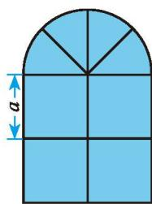  
(第7题)

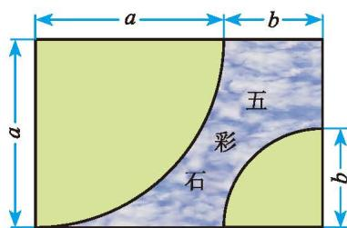  
(第8题)

8. 某小区一块长方形绿地的造型如图所示（单位：m），其中两个扇形表示绿地，两块绿地用五彩石隔开，那么需要铺多大面积的五彩石？

9. 计算：  
(1) $(2x^{2}y + 3xy^{2}) - (6x^{2}y - 3xy^{2})$ ;  
(2) $(5mn - 2m + 3n) + (-7m - 7mn)$ ;  
(3) $(6a^{2} - 8a + 11b^{3}) - (11a^{2} + 2b^{3})$ ;  
(4) $(2ab + 3b^{2} - 5) - (3ab + 3b^{2} - 8)$ 。

10. 已知 $A = a^{2} - 2ab + b^{2}$ , $B = a^{2} + 2ab + b^{2}$ 。  
(1) 求 $A + B;$ (2) 求 $\frac{1}{4}(B - A);$  
(3) 如果 $2A - 3B + C = 0$ , 那么 $C$ 的表达式是什么?

#### 数学理解

11. $a$ 是一个有理数, $10 a$ 一定大于 $a$ 吗? $\frac { a } { 3 }$ 一定小于 $a$ 吗?

12. 有一道题目是一个多项式减 $x^{2} + 14x - 6$ , 小强误当成了加法计算, 结果得到 $2x^{2} - x + 3$ , 正确的结果应该是多少?

13. (1) 观察下面图中小圆圈的排列方式, 你发现了什么规律?  
(2) 根据 (1) 中的规律猜想: $1 + 3 + 5 + 7 + \cdots + 99 =$ 。  
(3) 一般地, 你能得到什么猜想? 请用代数式表示。

<table border="0" cellspacing="0" cellpadding="5" width="100%">
  <tr align="center">
    <td width="25%" style="vertical-align: bottom;"> ①</td>
    <td width="25%" style="vertical-align: bottom;"> ②</td>
    <td width="25%" style="vertical-align: bottom;">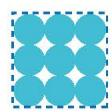 ③</td>
    <td width="25%" style="vertical-align: bottom;"> ④</td>
  </tr>
</table>
<b style="display:block; margin-top:10px;">(第 13 题)</b>

14. 在下列各式的括号内填上恰当的项：  
(1) $-a+b-c+d=-a+($ ;  
(2) $-a + b - c + d = -( \quad ) + d;$  
(3) $-a+b-c+d=-a+b-(\quad)$ ;  
(4) $-a+b-c+d=-(\quad)$ 。

#### 问题解决

15. 人在运动时的心跳速率通常和人的年龄有关。如果用 $a$ 表示一个人的年龄,用 $b$ 表示正常情况下这个人在运动时所能承受的每分钟心跳的最高次数,那么 $b = 0.8(220 - a)$ 。  
(1) 正常情况下, 一个 14 岁的少年在运动时所能承受的每分钟心跳的最高次数是多少?  
(2)一个45岁的人运动时 $10 \mathrm{~s}$ 心跳的次数为 22 次, 他有危险吗?

16. 一根长 $80 \mathrm{~cm}$ 的弹簧, 一端固定悬挂起来。如果另一端挂上物体, 那么在正常情况下物体的质量每增加 $1 \mathrm{~kg}$ 可使弹簧增长 $2 \mathrm{~cm}$ 。  
(1) 正常情况下, 当挂着 $x \mathrm{~kg}$ 的物体时, 弹簧的长度是多少厘米?  
(2) 利用 (1) 的结果完成下表。

<table><tr><td>物体的质量 /kg</td><td>1</td><td>2</td><td>3</td><td>4</td></tr><tr><td>弹簧的长度 /cm</td><td></td><td></td><td></td><td></td></tr></table>

17. 用长度相同的小棒按下图中的方式拼摆图形。

<table border="0" cellspacing="0" cellpadding="5" width="100%">
  <tr align="center">
    <td width="33%" style="vertical-align: bottom;"> ①</td>
    <td width="33%" style="vertical-align: bottom;">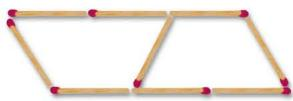 ②</td>
    <td width="33%" style="vertical-align: bottom;">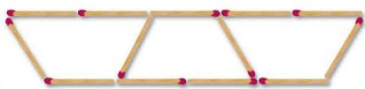 ③</td>
  </tr>
</table>
<b style="display:block; margin-top:10px;">(第 17 题)</b>

(1) 按图示规律填空;

<table><tr><td>图形标号</td><td>1</td><td>2</td><td>3</td><td>4</td><td>5</td></tr><tr><td>小棒数量/根</td><td></td><td></td><td></td><td></td><td></td></tr></table>  
(2) 按照这种方式拼摆下去, 第 $n$ 个图形需要 根小棒。

18. 用棋子摆出下列图形：

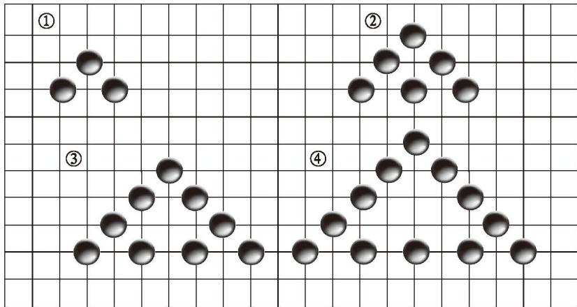  
(第18题)  
(1) 摆第 1 个图形用 \_\_\_\_ 枚棋子, 摆第 2 个图形用 \_\_\_\_ 枚棋子, 摆第 3 个图形用 \_\_\_\_ 枚棋子;  
(2) 按照这种方式摆下去, 摆第 $n$ 个图形用 $\_\_\_\_ \text{枚棋子}$ , 摆第 100 个图形用 $\_\_\_\_ \text{枚棋子}$ 。

19. 某会议中心购买了一批长方形会议桌，每张会议桌的长边可以坐2个人，短边只能坐1个人。按照如图所示的规律拼摆会议桌，能够得到不同型号的大桌子。

<table border="0" cellspacing="0" cellpadding="5" width="100%">
  <tr align="center">
    <td width="33%" style="vertical-align: bottom;">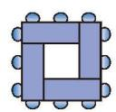 型号 1</td>
    <td width="33%" style="vertical-align: bottom;">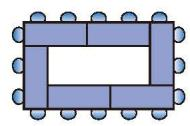 型号 2</td>
    <td width="33%" style="vertical-align: bottom;">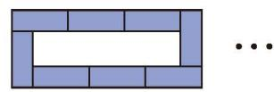 型号 3</td>
  </tr>
</table>
<b style="display:block; margin-top:10px;">(第 19 题)</b>

(1) 型号 3 的大桌子可以坐多少人?  
(2) 型号 $n$ 的大桌子可以坐多少人？  
(3) 如果有 36 人参会, 那么哪个型号的大桌子恰好可以坐下? 请说明理由。

20. 一个两位数, 若交换其个位数字与十位数字的位置, 则所得新两位数比原两位数大9。这样的两位数共有多少个? 它们有什么特点?

21. 某商店出售一种商品, 其原价为 $m$ 元, 现有如下两种调价方案: 一种是先提价 10%，在此基础上再降价 10%；另一种是先降价 10%，在此基础上再提价 10%。  
(1) 用这两种方案调价的结果是否一样？调价后的结果是不是都恢复了原价？  
(2) 将两种调价方案分别改为: 一种是先提价 $20\%$ , 在此基础上再降价 $20\%$ ; 另一种是先降价 $20\%$ , 在此基础上再提价 $20\%$ 。这时结果怎样?  
(3) 你能总结出什么规律?

&emsp;※22. 将一张长方形的纸对折，如右图所示可得到一条折痕。继续对折，对折时每次折痕与上次的折痕保持平行。连续对折6次后，可以得到几条折痕？想象一下，如果对折10次呢？对折 $n$ 次呢？

23. 学习本章后，你对“字母表示数”有哪些新的认识？请谈谈你的感悟。

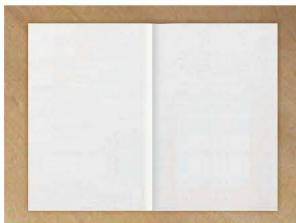  
(第22题)

#### 联系拓广

&emsp;※24. 当 $a = -4, -3, -2, -1, 1, 2, 3, 4$ 时，分别求出代数式 $a^2 + \frac{1}{a^2}$ 的值。你发现了什么？

