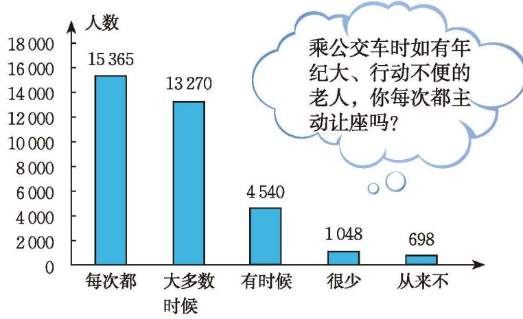

前面小刚对全班同学最喜欢参加的体育活动项目、每周参加体育活动的时间等情况进行了调查，在这些调查中，全班同学是要考察的全部对象。像这种为某一特定目的而对所有考察对象进行的全面调查叫作[普查](课本/【2024版】【北师大版】/【2024版】【北师大版】七年级上册数学/概念/普查.md)。其中，所要考察对象的全体称为[总体](课本/【2024版】【北师大版】/【2024版】【北师大版】七年级上册数学/概念/总体.md)，而组成总体的每一个考察对象称为[个体](课本/【2024版】【北师大版】/【2024版】【北师大版】七年级上册数学/概念/个体.md)。

为强调调查目的，也可以把考察对象的某些指标的全体作为总体，每一个考察对象的相应指标作为个体。例如，调查全班同学每周参加体育活动的时间情况，总体就是全班所有同学每周参加体育活动的时间，个体就是每一名同学每周参加体育活动的时间。

> [!question] 思考·交流
>
> 你能用普查的方式了解下面的信息吗？你准备如何调查？与同伴进行交流。
>
> (1) 我国七年级学生每周参加体育活动的时间；
>
> (2) 中央广播电视总台春节联欢晚会的收视率；
>
> (3) 一批电视机的使用寿命。

普查可以直接获得总体的情况，但有时总体中个体数目较多，普查的工作量较大；有时受客观条件限制，无法对所有个体进行普查；有时调查具有破坏性，不允许普查。这时，人们往往从总体中按照一定的方法抽取部分个体作为代表进行调查分析，并以此推断总体的状况。这种调查方式叫作[抽样调查](课本/【2024版】【北师大版】/【2024版】【北师大版】七年级上册数学/概念/抽样调查.md)，其中从总体抽取的一部分个体叫作总体的一个[样本](课本/【2024版】【北师大版】/【2024版】【北师大版】七年级上册数学/概念/样本.md)。

> [!exercise] 随堂练习
> **1. 有人针对在公交车上是否主动让座做了一次调查，结果如下：**
> 
> 

>   
>    
>   <small style="color: var(--text-muted, #666);">（第 1 题）</small>
> 

> 
> (1) 参与本次调查的人数是多少？  
> (2) "从来不让座的人"的人数占调查总人数的百分比是多少？  
> (3) 面对以上的调查结果，你还能得到什么结论？
> 
> **2. 对于下面的调查问题，你觉得用什么调查方式比较合理？**
> 
> (1) 调查某种灯泡的使用寿命；  
> (2) 调查你们学校七年级学生的体重；  
> (3) 调查你们班 student 早餐是否有喝牛奶的习惯。
