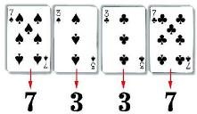
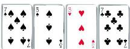
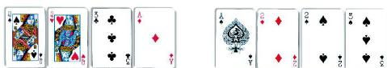

在小学，我们学习过四则混合运算。现在，我们将数的范围扩大到了有理数，并且学习了有理数的加、减、乘、除及乘方运算，那么在有理数混合运算中，运算顺序是怎样的呢？例如，如何计算 $3 + 2^{2} \times \left(-\frac{1}{5}\right)$ 呢？

事实上，与小学数学中的四则混合运算类似，有理数的混合运算可以按下面的[[有理数的混合运算法则]]进行。
>[!tip] 先算乘方，再算乘除，最后算加减；如果有括号，先算括号里面的。

$$
3 + 2^{2} \times \left(-\frac{1}{5}\right) = 3 + 4 \times \left(-\frac{1}{5}\right) = 3 - \frac{4}{5} = \frac{11}{5}.
$$

> [!example]- 例1 计算：$18 - 6 \div (-2) \times \left(-\frac{1}{3}\right)$。
>
> > [!success]- 解
> > $18 - 6 \div (-2) \times \left(-\frac{1}{3}\right) = 18 - (-3) \times \left(-\frac{1}{3}\right) = 18 - 1 = 17$。

> [!example]- 例2 计算：$(-3)^{2} \times \left[-\frac{2}{3} + \left(-\frac{5}{9}\right)\right]$。
>
> > [!success]- 解法一
> > $(-3)^{2} \times \left[-\frac{2}{3} + \left(-\frac{5}{9}\right)\right] = 9 \times \left(-\frac{11}{9}\right) = -11$。
>
> > [!success]- 解法二
> > $(-3)^{2} \times \left[-\frac{2}{3} + \left(-\frac{5}{9}\right)\right] = 9 \times \left[-\frac{2}{3} + \left(-\frac{5}{9}\right)\right] = 9 \times \left(-\frac{2}{3}\right) + 9 \times \left(-\frac{5}{9}\right) = -6 + (-5) = -11$。

> [!question] 尝试·交流
>
> 你会玩「24 点」游戏吗？
> 从一副扑克牌（去掉大王、小王）中任意抽取 4 张，根据牌面上的数字进行混合运算（每张牌必须用一次且只能用一次，可以加括号），使得运算结果为 $24$ 或 $-24$。其中红色扑克牌代表负数，黑色扑克牌代表正数，A，J，Q，K 分别代表 1，11，12，13。
>
> (1) 小飞抽到了 ，他运用下面的方法凑成了 $24$：
>
> $$
> 7 \times (3 + 3 \div 7) = 24.
> $$
>
> 如果抽到的是 ，你能凑成 $24$ 吗？
>
> 如果抽到的是呢？
>
> (2) 请将下面每组扑克牌牌面上的数字凑成 $24$。

>
> 在上述「24 点」游戏中，你积累了哪些经验？与同伴进行交流。

> [!exercise] 随堂练习
>
> 1. 计算：
>
> $$
> (1) \quad 8 + (-3)^{2} \times (-2);
> $$
>
> $$
> (2) \quad 100 \div (-2)^{2} - (-2) \div \left(-\frac{2}{3}\right);
> $$
>
> $$
> (3) \quad (-4) \div \left(-\frac{3}{4}\right) \times (-3);
> $$
>
> $$
> \left(-\frac{1}{3}\right) \div \left(-\frac{1}{3}\right)^{2} - 4 \times \left(-\frac{1}{2}\right)^{3}. \tag{4}
> $$
