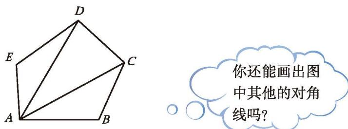

如图 4-32, 在多边形 $ABCDE$ 中, 点 $A, B, C, D, E$ 是多边形的顶点; 线段 $AB, BC, CD, DE, EA$ 是多边形的边; $\angle EAB$ , $\angle ABC$ , $\angle BCD$ , $\angle CDE$ , $\angle DEA$ 是多边形的内角 (可简称为多边形的角); $AC$ , $AD$ 都是连接不相邻两个顶点的线段，像这样的线段叫作多边形的[对角线](课本/【2024版】【北师大版】/【2024版】【北师大版】七年级上册数学/概念/对角线.md) (diagonal)。

  
   
  <b style="color: var(--text-muted, #666);">图 4-32</b>

