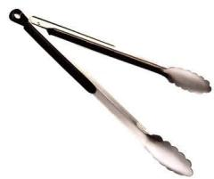
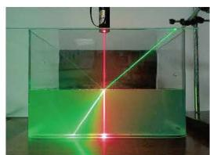
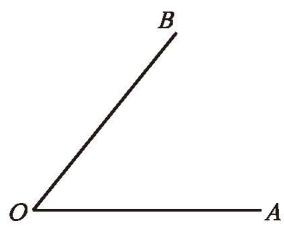
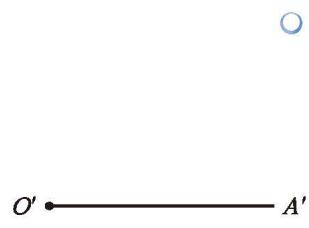

在小学我们学习过角，请说说你对角的认识。你能在图 4-16 中找到角吗？

  

    

      
    

    

      
    

    

      
    

  

  
图 4-16

[角的认识](课本/【2024版】【北师大版】/【2024版】【北师大版】七年级上册数学/知识点/角的认识.md)

还记得怎样比较线段的长短吗？类似地，你能比较图 4-23 中每组角的大小吗？与同伴进行交流。

  

    
  

  
图 4-23

[比较角的大小](课本/【2024版】【北师大版】/【2024版】【北师大版】七年级上册数学/知识点/比较角的大小.md)

我们已经知道可以通过移动其中一个角的方法比较两个角的大小。如何移动一个角呢？比如，如何将图 4-28（1）中的 $\angle AOB$ 移动到图 4-28（2）的位置，使 $OA$ 与 $O'A'$ 重合？

  

    

      
      
<small>(1)</small>

    

    

      
      
<small>(2)</small>

    

    

      
    

  

  
图 4-28

(1) 请你用三角尺、量角器、圆规等工具解决这一问题。  
(2) 如果只用尺规，如何解决这个问题？请你试一试，并与同伴进行交流。
[尺规作图 移动一个角](课本/【2024版】【北师大版】/【2024版】【北师大版】七年级上册数学/知识点/尺规作图%20移动一个角.md)

[习题 4.2角](课本/【2024版】【北师大版】/【2024版】【北师大版】七年级上册数学/习题/习题%204.2角.md)

---

[探究同位角](课本/【2024版】【北师大版】/【2024版】【北师大版】七年级下册数学/知识点/探究同位角.md)
[内错角、同旁内角](课本/【2024版】【北师大版】/【2024版】【北师大版】七年级下册数学/知识点/内错角、同旁内角.md)

[对顶角、补角、余角](课本/【2024版】【北师大版】/【2024版】【北师大版】七年级下册数学/知识点/对顶角、补角、余角.md)

[平行线的性质](课本/【2024版】【北师大版】/【2024版】【北师大版】七年级下册数学/知识点/平行线的性质.md)