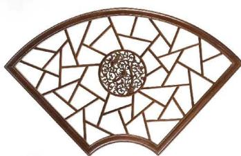
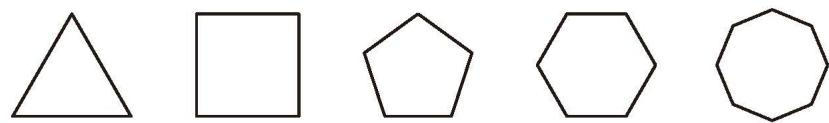
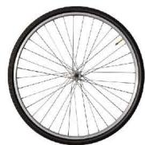
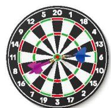
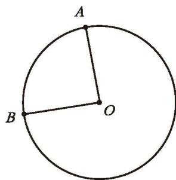
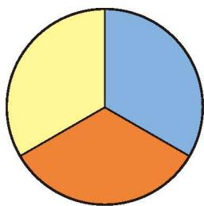
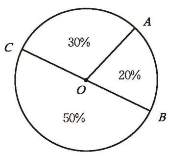

观察图 4-31，你能发现哪些熟悉的平面图形？与同伴进行交流。

  

    

      
    

    

      
    

    

      
    

  

  
图 4-31

三角形、四边形、五边形、六边形等都是 [多边形](课本/【2024版】【北师大版】/【2024版】【北师大版】七年级上册数学/概念/多边形.md)[^1]（polygon）。它们都是由若干条不在同一直线上的线段首尾顺次相连组成的封闭平面图形。

如图 4-32, 在多边形 $ABCDE$ 中, 点 $A, B, C, D, E$ 是多边形的顶点; 线段 $AB, BC, CD, DE, EA$ 是多边形的边; $\angle EAB$ , $\angle ABC$ , $\angle BCD$ , $\angle CDE$ , $\angle DEA$ 是多边形的内角 (可简称为多边形的角); $AC$ , $AD$ 都是连接不相邻两个顶点的线段，像这样的线段叫作多边形的[对角线](课本/【2024版】【北师大版】/【2024版】【北师大版】七年级上册数学/概念/对角线.md) (diagonal)。

  
   
  <b style="color: var(--text-muted, #666);">图 4-32</b>

> [!question] 尝试·思考
> (1) $n$ 边形有多少个顶点、多少条边、多少个内角？  
> (2) 过 $n$ 边形的每一个顶点有几条对角线?

> [!question] 观察·交流
> 观察图 4-33 中的多边形，它们的边、角有什么特点？与同伴进行交流。
> 
> 

>   
>    
>   
图 4-33

> 

各边相等、各角也相等的多边形叫作 [正多边形](课本/【2024版】【北师大版】/【2024版】【北师大版】七年级上册数学/概念/正多边形.md)。图 4-33 中的多边形分别是正三角形、正四边形（正方形）、正五边形、正六边形、正八边形。

---

> [!question] 观察·思考
> 图 4-34 中的图形中有我们熟悉的圆和扇形，你还记得用哪些方法可以画一个圆吗？你能用一根细绳和笔画出一个圆吗？
> 
> 

>   

>     

>       
>     

>     

>       
>     

>     

>       
>     

>     

>       
>     

>   

>   
图 4-34

> 

如图 4-35，平面上，一条线段 $OA$ 绕着它固定的一个端点 $O$ 旋转一周，另一个端点 $A$ 所形成的图形叫作 [圆](课本/【2024版】【北师大版】/【2024版】【北师大版】七年级上册数学/概念/圆.md)（circle）。固定的端点 $O$ 称为 [圆心](课本/【2024版】【北师大版】/【2024版】【北师大版】七年级上册数学/概念/圆心.md)（center of a circle），线段 $OA$ 称为 [半径](课本/【2024版】【北师大版】/【2024版】【北师大版】七年级上册数学/概念/半径.md)（radius）。

圆上任意两点 $A, B$ 间的部分叫作 [圆弧](课本/【2024版】【北师大版】/【2024版】【北师大版】七年级上册数学/概念/圆弧.md)，简称弧 (arc)，记作 $\widehat{AB}$ ，读作 “圆弧 $AB$” 或 “弧 $AB$”；由一条弧 $\widehat{AB}$ 和经过这条弧的端点的两条半径 $OA，OB$ 所组成的图形叫作 [扇形](课本/【2024版】【北师大版】/【2024版】【北师大版】七年级上册数学/概念/扇形.md)（sector）；顶点在圆心的角叫作 [圆心角](课本/【2024版】【北师大版】/【2024版】【北师大版】七年级上册数学/概念/圆心角.md)（central angle）。

  
   
  <b style="color: var(--text-muted, #666);">图 4-35</b>

---

> [!example]- 例
> 将一个圆分割成三个扇形，它们的圆心角的度数比为 $1: 2: 3$ ，求这三个扇形的圆心角的度数。
> 
> > [!success]- 解
> > 因为一个周角为 $360^{\circ}$ ，所以分成的三个扇形的圆心角分别是：
> > $$
> > 360^{\circ} \times \frac {1}{1 + 2 + 3} = 60^{\circ},
> > $$
> > $$
> > 360^{\circ} \times \frac {2}{1 + 2 + 3} = 120^{\circ},
> > $$
> > $$
> > 360^{\circ} \times \frac {3}{1 + 2 + 3} = 180^{\circ}。
> > $$

> [!question] 思考·交流
> (1) 如图 4-36, 将一个圆分成三个大小相同的扇形,你能算出它们的圆心角的度数吗? 你知道每个扇形的面积和整个圆的面积的关系吗?  
> (2) 画一个半径是 $2 \text{ cm}$ 的圆, 并在其中画一个圆心角为 $60^{\circ}$ 的扇形, 你会计算这个扇形的面积吗? 与同伴进行交流。
> 
> 

>   
>    
>   
图 4-36

> 

---

#### 随堂练习

> [!exercise] 1
> 现实生活中有许多正多边形的实例，试举出两例。

> [!exercise] 2
> 如图, 将一个圆分割成三个扇形, 求这三个扇形的圆心角的度数。
> 
> 

>   

>     

>       
>     

>   

> 

---

[习题 4.3多边形和圆的初步认识](课本/【2024版】【北师大版】/【2024版】【北师大版】七年级上册数学/习题/习题%204.3多边形和圆的初步认识.md)

[^1]: 如没有特别说明，本书所说的多边形都是指凸多边形， 即多边形总在其任意一条边所在直线的同一侧。
