> [!question] 引入问题
> 如图 4-10，从 $A$ 地到 $C$ 地有四条道路，哪条路最近？
> 
> 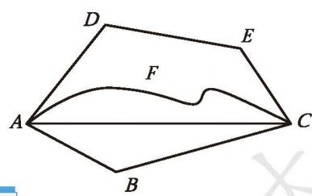
> **图 4-10**
> 
> > [!summary]- 根据生活经验，我们发现：
> > 两点之间的所有连线中，线段最短。

这一事实可以简述为： [两点之间线段最短 1](课本/【2024版】【北师大版】/【2024版】【北师大版】七年级上册数学/概念/两点之间线段最短%201.md)
我们把两点之间线段的长度，叫作这[两点之间的距离 1](课本/【2024版】【北师大版】/【2024版】【北师大版】七年级上册数学/概念/两点之间的距离%201.md)（distance）。

> [!question] 思考·交流
> 1. 图 4-11 中哪棵树较高？哪支铅笔较长？窗框相邻的两条边哪条较长？你是怎么比较的？
> 
> | | | |
> | :---: | :---: | :---: |
> |  | 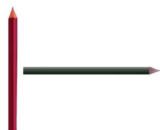 |  |
> | | **图 4-11** | |
> 
> 2. 怎样比较两条线段的长短？与同伴进行交流。
> 
> > [!summary]- 方法归纳
> > 如果直接观察难以判断，我们可以有两种方法进行比较：
> > 
> > 1. **度量法**：用刻度尺量出它们的长度，再进行比较。
> > 2. **叠合法**：把其中的一条线段移到另一条线段上去，将其中的一个端点重合在一起加以比较（如图 4-12）。
> > 
> > | | |
> > | :---: | :---: |
> > | 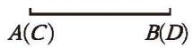   线段 $AB$ 等于线段 $CD$，记作 $AB = CD$ | 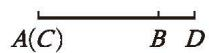   线段 $AB$ 大于线段 $CD$，记作 $AB > CD$ |
> > | 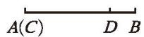   线段 $AB$ 小于线段 $CD$，记作 $AB < CD$ | |
> > 
> > **图 4-12**

---

💡用尺规作图[^1]的方法可以将一条线段移到另一条线段上。

> [!example] **例** 
> 如图 4-13，已知线段 $AB$，用尺规作一条线段等于已知线段 $AB$。
> 
> 

> <table border="0" cellspacing="0" cellpadding="5" width="80%">
>   <tr align="bottom">
>     <td>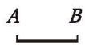 <small><b>图 4-13</b></small></td>
>     <td>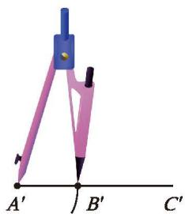 <small><b>图 4-14</b></small></td>
>      <td>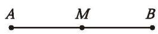   <small><b>图 4-15</b></small>
>   </tr>
> </table>
> 

> 
> > [!success]- [尺规作图 将一条线段移到另一条线段上](课本/【2024版】【北师大版】/【2024版】【北师大版】七年级上册数学/知识点/尺规作图%20将一条线段移到另一条线段上.md)
> > 1. 作射线 $A^{\prime} C^{\prime}$（如图 4-14）。
> > 2. 用圆规在射线 $A^{\prime} C^{\prime}$ 上截取 $A^{\prime} B^{\prime} = AB$。
> > 
> > 线段 $A'B'$ 就是所要作的线段。

如图 4-15，点 $M$ 把线段 $AB$ 分成相等的两条线段 $AM$ 与 $BM$，点 $M$ 叫作线段 $AB$ 的 [中点](课本/【2024版】【北师大版】/【2024版】【北师大版】七年级上册数学/概念/中点.md) (midpoint)。这时：$AM = BM = \frac{1}{2} AB \quad (\text{或 } AB = 2AM = 2BM)$

---

> [!question] 尝试·思考
> 在直线 $l$ 上顺次取 $A, B, C$ 三点，使得 $AB = 4\text{ cm}, BC = 3\text{ cm}$。如果点 $O$ 是线段 $AC$ 的中点，那么线段 $AC$ 和 $OB$ 的长度分别是多少？
> 
> > [!success]- 解析
> > ∵ $A, B, C$ 三点在直线 $l$ 上顺次排列，
> > ∴ $AC = AB + BC = 4 + 3 = 7\text{ cm}$。
> > 
> > ∵ 点 $O$ 是线段 $AC$ 的中点，
> > ∴ $AO = OC = \frac{1}{2} AC = 3.5\text{ cm}$。
> > 
> > ∵ $AB = 4\text{ cm}, AO = 3.5\text{ cm}$，且点 $O$ 在线段 $AB$ 上，
> > ∴ $OB = AB - AO = 4 - 3.5 = 0.5\text{ cm}$。
> > 
> > 答：线段 $AC$ 的长度是 $7\text{ cm}$，线段 $OB$ 的长度是 $0.5\text{ cm}$。

---

### 📝 随堂练习
1. 如图，比较折线 $AB$ 和线段 $A^{\prime}B^{\prime}$ 的长短，你有什么方法？需要什么工具？

<table border="0" cellspacing="0" cellpadding="5" width="80%">
   <tr align="center">
     <td>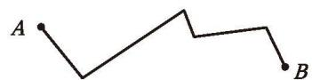</td>
     <td>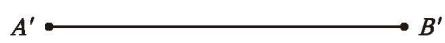</td>
   </tr>
</table>
<small><b>(第 1 题)</b></small>

2. 如图，已知线段 $a$ 和 $b$，直线 $AB$ 和 $CD$ 相交于点 $O$。请用尺规按下列要求作图：  
(1) 在射线 $OA, OB, OC$ 上作线段 $OA', OB', OC'$，使它们分别与线段 $a$ 相等；  
(2) 在射线 $OD$ 上作线段 $OD'$，使 $OD'$ 与线段 $b$ 相等；  
(3) 连接 $A^{\prime} C^{\prime}, C^{\prime} B^{\prime}, B^{\prime} D^{\prime}, D^{\prime} A^{\prime}$。
你得到了一个怎样的图形？与同伴进行交流。

<table border="0" cellspacing="0" cellpadding="5" width="80%">
   <tr align="bottom">
     <td>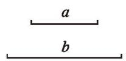</td>
     <td>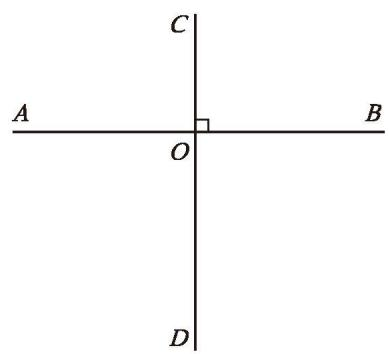</td>
   </tr>
</table>
<small><b>(第 2 题)</b></small>

3. 如图，已知线段 $a, b$，用尺规作一条线段 $m$，使 $m = a + b$。

   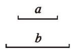
    
   <small><b>(第 3 题)</b></small>

[^1]: 只用没有刻度的直尺和圆规画图称为尺规作图。
