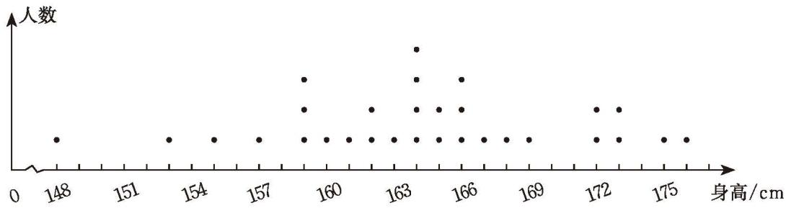
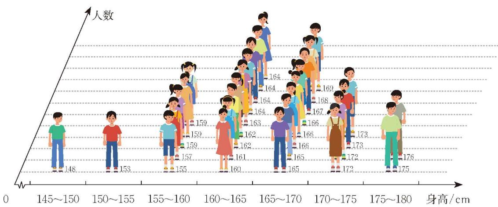

日常生活中，存在着各种各样的数据，如计步器记录的行走步数、距离等，天气预报的气温、湿度、平均风速、能见度和空气质量指数等，导航系统结合实时交通路况提供不同路线的距离、所需时间和途经的红绿灯路口个数等。

数据能够提供丰富的信息，帮助人们解决各种问题。你的周围还有哪些数据，你能从中获得哪些有用的信息？

> [!question] 尝试·思考
>
> 1. 收集你所在班级全班同学的性别、身高、体重、左右眼视力、肺活量、立定跳远成绩、课间操成绩、美术成绩、上学采用的交通方式及一周内每天到校所用时间等数据，并用适当的方式进行整理。
>
> 2. 小亮收集了他所在班级全班同学的上述数据，并将部分数据整理得到表 6-1。

表 6-1 七（1）班全班学生部分数据表

<table><tr><td rowspan="2">学号</td><td rowspan="2">性别</td><td rowspan="2">身高 /cm</td><td rowspan="2">体重 /kg</td><td rowspan="2">立定跳远成绩 /cm</td><td rowspan="2">美术 成绩</td><td rowspan="2">上学采用的 交通方式</td><td colspan="5">到校所用时间 /min</td></tr><tr><td>周一</td><td>周二</td><td>周三</td><td>周四</td><td>周五</td></tr><tr><td>1</td><td>男</td><td>165</td><td>44</td><td>180</td><td>优</td><td>步行</td><td>15</td><td>15</td><td>15</td><td>16</td><td>15</td></tr><tr><td>2</td><td>男</td><td>148</td><td>36</td><td>154</td><td>良</td><td>自行车</td><td>12</td><td>10</td><td>10</td><td>10</td><td>10</td></tr><tr><td>3</td><td>女</td><td>159</td><td>60</td><td>165</td><td>优</td><td>电动自行车</td><td>9</td><td>8</td><td>8</td><td>8</td><td>8</td></tr><tr><td>4</td><td>男</td><td>173</td><td>60</td><td>172</td><td>中</td><td>私家车</td><td>10</td><td>10</td><td>10</td><td>10</td><td>9</td></tr><tr><td>5</td><td>男</td><td>164</td><td>51</td><td>183</td><td>优</td><td>电动自行车</td><td>10</td><td>10</td><td>9</td><td>10</td><td>10</td></tr><tr><td>6</td><td>男</td><td>164</td><td>60</td><td>165</td><td>良</td><td>电动自行车</td><td>15</td><td>14</td><td>15</td><td>15</td><td>15</td></tr><tr><td>7</td><td>女</td><td>157</td><td>49</td><td>135</td><td>优</td><td>电动自行车</td><td>8</td><td>8</td><td>8</td><td>8</td><td>8</td></tr><tr><td>8</td><td>男</td><td>176</td><td>76</td><td>211</td><td>优</td><td>步行</td><td>10</td><td>10</td><td>10</td><td>10</td><td>10</td></tr><tr><td>9</td><td>男</td><td>169</td><td>50</td><td>160</td><td>中</td><td>步行</td><td>6</td><td>6</td><td>6</td><td>6</td><td>6</td></tr><tr><td>10</td><td>女</td><td>166</td><td>62</td><td>143</td><td>优</td><td>电动自行车</td><td>13</td><td>13</td><td>12</td><td>12</td><td>12</td></tr><tr><td>11</td><td>男</td><td>165</td><td>52</td><td>205</td><td>优</td><td>地铁+公交车</td><td>35</td><td>30</td><td>30</td><td>35</td><td>30</td></tr><tr><td>12</td><td>男</td><td>153</td><td>39</td><td>175</td><td>良</td><td>地铁+公交车</td><td>38</td><td>35</td><td>36</td><td>33</td><td>33</td></tr></table>

(1) 你能从表 6-1 中得到哪些信息？

(2) 根据表 6-1 你能提出哪些问题？你能用表中的数据解决你提出的问题吗？

> [!question] 思考·交流
>
> 对于表 6-1，如果关注全班学生上学采用的交通方式及到校所用时间，那么你能解决下列问题吗？
>
> (1) 全班学生上学采用了哪些不同的交通方式？如何表示全班学生上学所采用交通方式的情况？
>
> (2) 学号为 1 的学生周一至周五每天到校所用的时间相同吗？预测一下，他下周一到校需要多长时间？其他学生有类似的规律吗？与同伴进行交流。
>
> 对于上学采用的交通方式及到校所用时间，你还有什么发现和建议？与同伴进行交流。

> [!question] 尝试·思考
>
> 对于表 6-1，如果关注全班学生的身高，那么你能解决下列问题吗？
>
> (1) 全班学生最高身高是多少？最矮呢？出现次数最多的身高数据是哪个？全班学生身高的平均数是多少？
>
> (2) 你能用适当的统计图表示全班学生的身高情况吗？在你画的统计图中能找出 (1) 中要求的各个数值吗？
>
> (3) 图 6-1 和图 6-2 都是根据表 6-1 中的身高数据画出的统计图。你能从这两幅图中得到哪些信息？这两幅图与你画的统计图有什么区别和联系？

  

    

      
      
图 6-1

    

    

      
      
图 6-2

    

  

> [!question] 思考·交流
>
> (1) 你对数据有哪些进一步的认识？
>
> (2) 为了利用数据作出决策，一般需要经历怎样的过程？与同伴进行交流。

数据的世界是丰富多彩的，上述问题中呈现了各种不同类型的数据：有的是用数值表示的，如学生的身高、体重、到校所用时间等，我们把这类数据称为[定量数据](课本/【2024版】【北师大版】/【2024版】【北师大版】七年级上册数学/概念/定量数据.md)；有的不是用数值表示的，如学生上学采用的交通方式、学生美术成绩（等级）等，我们把这类数据称为[定性数据](课本/【2024版】【北师大版】/【2024版】【北师大版】七年级上册数学/概念/定性数据.md)。

数据蕴含着丰富的信息，为了从数据中获取信息，一般可以通过收集、整理和分析数据，帮助我们得出结论或作出决策。

> [!exercise] 随堂练习
>
> 1. 你收集的数据中还有哪些是定量数据，哪些是定性数据？

---
[2 数据的收集](课本/【2024版】【北师大版】/【2024版】【北师大版】七年级上册数学/知识点/2%20数据的收集.md)