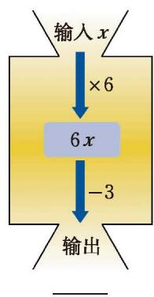
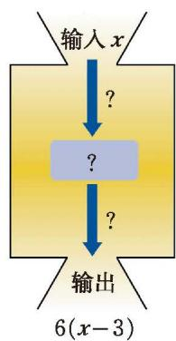

> [!example] 列代数式，并求值 
> 某景点的门票价格：成人票每张 10 元，学生票每张 5 元。
> 1. 一个旅游团有成人 $x$ 名、学生 $y$ 名，那么该旅游团应付多少门票费？
> 2. 如果该旅游团有 37 名成人、15 名学生，那么他们应付多少门票费？
>
> > [!success]- 解
> > 1. 该旅游团应付门票费 $(10x + 5y)$ 元。
> > 2. 把 $x = 37, y = 15$ 代入代数式 $10x + 5y$，得
> >
> > $$
> > 10 \times 37 + 5 \times 15 = 445.
> > $$
> >
> > 因此，他们应付门票费 445 元。

代数式 $10x + 5y$ 还可以表示哪些生活中的问题？

> [!question] 尝试·思考：身体质量指数
> 营养学家通常用 [[课本/【2024版】【北师大版】/【2024版】【北师大版】七年级上册数学/概念/身体质量指数]]（简称 **BMI**）衡量人体胖瘦程度，这个指数等于人体体重（单位：$\text{kg}$）与人体身高（单位：$\text{m}$）平方的商。
> 
> 对于成年人来说：
> * $\text{BMI} < 18.5$ ：体重过轻；
> * $18.5 \leqslant \text{BMI} \leqslant 24$ ：体重适中；
> * $\text{BMI} > 24$ ：体重超重。
> 
> 1. 设一个人的体重为 $w \text{ kg}$，身高为 $h \text{ m}$，请用含 $w, h$ 的代数式表示这个人的 $\text{BMI}$。
> 2. 张老师的身高为 $1.75 \text{ m}$，体重为 $65 \text{ kg}$，他的体重是否适中？
> 3. $\text{BMI}$ 对未成年人的胖瘦程度也有一定参考意义，请计算你的 $\text{BMI}$。

> [!question] 观察·思考：代数式求值
> 填写下表，并观察 $5n+6$ 和 $n^{2}$ 这两个代数式的值的变化情况。
> 
> | $n$ | 1 | 2 | 3 | 4 | 5 | 6 | 7 | 8 |
> | :---: | :---: | :---: | :---: | :---: | :---: | :---: | :---: | :---: |
> | $5n+6$ | | | | | | | | |
> | $n^2$ | | | | | | | | |
> 
> 1. 随着 $n$ 的值逐渐变大，$5n+6$ 和 $n^2$ 这两个代数式的值如何变化？
> 2. 估计一下，哪个代数式的值先超过 $100$？

---

### 随堂练习

#### 1. 代数式应用
代数式 $6p$ 可以表示什么？

#### 2. 数值转换机探究
在计算机上可以设置运算程序，输入一组数据，计算机就会呈现运算结果，就好像一个“数值转换机”。下面是一组“数值转换机”，请填写下表，并写出图 (1) 的输出结果、图 (2) 的运算过程。

<table border="0" cellspacing="0" cellpadding="5" width="100%">
  <tr align="center">
    <td width="50%" style="vertical-align: bottom;">
       
      <b>(1)</b>
    </td>
    <td width="50%" style="vertical-align: bottom;">
       
      <b>(2)</b>
    </td>
  </tr>
</table>
<b style="display:block; margin-top:10px; color: var(--text-muted, #666);">图 3-6 “数值转换机”示意图 (第 2 题)</b>

|       输入        | $-2$ | $-\frac{1}{2}$ | $0$ | $0.26$ | $\frac{1}{3}$ | $\frac{5}{2}$ | $4.5$ |
| :-------------: | :--: | :------------: | :-: | :----: | :-----------: | :-----------: | :---: |
| **图 (1) 的输出结果** |      |                |     |        |               |               |       |
| **图 (2) 的输出结果** |      |                |     |        |               |               |       |