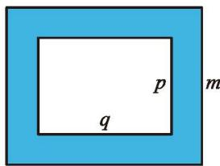

用长度相同的小棒按图 3-1 所示的方式拼摆正方形。

<table border="0" cellspacing="0" cellpadding="5">
  <tr align="center">
    <td  style="vertical-align: bottom;"></td>
    <td  style="vertical-align: bottom;"></td>
    <td  style="vertical-align: bottom;"></td>
	<td style="vertical-align: middle;">…</td>
  </tr>
</table>
<b style="display:block; margin-top:10px;">图 3-1</b>

(1) 拼摆 5 个这样的正方形需要多少根小棒?  
(2) 拼摆 100 个这样的正方形需要多少根小棒？你是怎么得到的？  
(3) 拼摆 $x$ 个这样的正方形需要多少根小棒? 与同伴进行交流。  
(4) 拼摆 200 个这样的正方形需要多少根小棒? 你是怎样计算的? 与同伴进行交流。

> [!question] 思考·交流
> 1. 在上面的活动中，我们借助字母表示正方形的个数与小棒的根数之间的关系，这样做有什么好处？
> 2. 在以前的学习中还有哪些地方用到了字母？这些字母都表示什么？与同伴进行交流。

> [!question] 尝试·思考
> 1. 今年李华 $m$ 岁，去年李华 \_\_\_\_ 岁，5 年后李华 \_\_\_\_ 岁。
> 2. $a$ 个人 $n$ 天完成一项工作，那么平均每人每天的工作量为 \_\_\_\_。
> 3. 某商店上月的收入为 $a$ 元，本月的收入比上月收入的 2 倍还多 10 元，本月的收入是 \_\_\_\_ 元。
> 4. 如果一个正方体的棱长是 $a - 1$，那么这个正方体的体积是 \_\_\_\_，表面积是 \_\_\_\_。

像 $4 + 3(x - 1), x + x + (x + 1), m - 1, m + 5, \frac{1}{an}, 2a + 10, (a - 1)^{3}, 6(a - 1)^{2}$ 等式子都是用运算符号把数和字母连接而成的，这样的式子叫作 [代数式](课本/【2024版】【北师大版】/【2024版】【北师大版】七年级上册数学/概念/代数式.md)（algebraic expression）。单独一个数或一个字母也是 [代数式](课本/【2024版】【北师大版】/【2024版】【北师大版】七年级上册数学/概念/代数式.md)。

用具体数值代替代数式中的字母，就可以求出代数式的值。

#### 随堂练习

1. (1) 小明步行上学, 速度为 $\nu \mathrm{m} / \mathrm{s}$ ; 小亮骑自行车上学, 速度是小明的 3 倍, 则小亮的速度可以表示为 \_\_\_\_ m/s。  
(2) 如图, 用字母表示图中阴影部分的面积。

[第1(2)题]  
2. 用代数式表示下列各数：

(1)个位数字是 $a$ 、十位数字是 $b(b \neq 0)$ 的两位数;  
(2)个位数字是 $a$ 、十位数字是 $b$ 、百位数字是 $c\left( {c \neq  0}\right)$ 的三位数。

[1 认识方程](课本/【2024版】【北师大版】/【2024版】【北师大版】七年级上册数学/1%20认识方程.md)