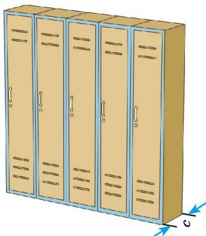
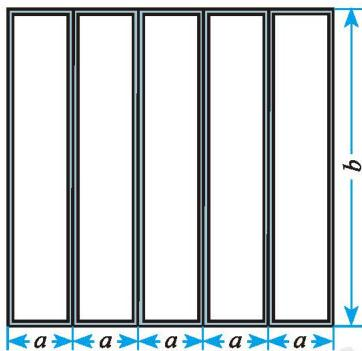
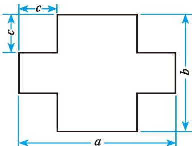
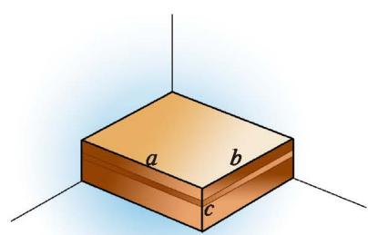
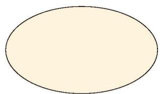
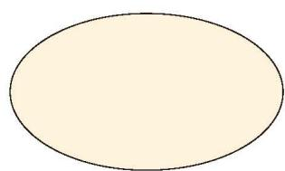

一个组合柜如图 3-2 所示，内部用隔板纵向分隔成 5 个独立的小柜子（如图 3-3），柜门由 5 个完全相同的长方形组成。

<table border="0" cellspacing="0" cellpadding="5">
  <tr align="center">
    <td width="50%" style="vertical-align: bottom;"> 图 3-2</td>
    <td width="50%" style="vertical-align: bottom;"> 图 3-3</td>
  </tr>
</table>

(1) 若要在 5 个柜门的周边都贴上装饰条, 则所需装饰条的总长度是多少?  
(2) 若要给柜门外表面喷漆, 则需要喷漆的面积是多少 (边框缝隙忽略不计)?  
(3) 设柜子的进深为 $c$ (如图 3-2), 则整个柜子的容积是多少 (柜门、隔板及背板的厚度忽略不计)?

像 $5ab, 5abc, 3v, 6p$ 等，它们都是数与字母的乘积，这样的代数式叫作 [单项式](课本/【2024版】【北师大版】/【2024版】【北师大版】七年级上册数学/概念/单项式.md)（monomial）。
单独一个数或一个字母也是 [单项式](课本/【2024版】【北师大版】/【2024版】【北师大版】七年级上册数学/概念/单项式.md)。

几个单项式的和是 [多项式](课本/【2024版】【北师大版】/【2024版】【北师大版】七年级上册数学/概念/多项式.md)（polynomial），如 $5a + 5a + 10b$，$10x + 5y$，$4 + 3(x - 1)$ 等都是多项式。单项式和多项式统称 [整式](课本/【2024版】【北师大版】/【2024版】【北师大版】七年级上册数学/概念/整式.md)（integral expression）。

单项式 中的数字因数是这个 单项式 的 [系数](课本/【2024版】【北师大版】/【2024版】【北师大版】七年级上册数学/概念/系数.md)（coefficient），如 $5ab$ 的系数是 $5$，$3v$ 的系数是 $3$。所有字母的指数和是这个 [单项式的次数](课本/【2024版】【北师大版】/【2024版】【北师大版】七年级上册数学/概念/单项式的次数.md)[^1]（degree of monomial），如 $5ab$ 是 2 次的，$3v$ 是 1 次的。

在多项式中，每个单项式是 [多项式的项](课本/【2024版】【北师大版】/【2024版】【北师大版】七年级上册数学/概念/多项式的项.md)（term），如多项式$10x + 5y$ 是 $10x$ 与 $5y$ 两项的和。
一个多项式中，次数最高的项的次数是 [多项式的次数](课本/【2024版】【北师大版】/【2024版】【北师大版】七年级上册数学/概念/多项式的次数.md)。如 $10x + 5y$ 是 1 次的，$a^2b + 2a$ 是 3 次的。

> [!question] 尝试·思考
> 请列出下列问题中的代数式，并指出其中：
> ① 哪些是单项式？单项式的系数和次数分别是多少？
> ② 哪些是多项式？多项式的次数是多少？
>
> 1. 如图 3-4，一个十字形花坛铺满了草皮，这个花坛草地面积是多少？
>    
>    

>      
>       
>      <small>图 3-4</small>
>    

>
> 2. 当水结冰时，其体积大约会比原来增加 $\frac{1}{9}$，$x \text{ m}^3$ 的水结成冰后体积是多少？
>
> 3. 如图 3-5，一个长方体的箱子紧靠墙角，它的长、宽、高分别是 $a, b, c$。这个箱子露在外面的表面积是多少？
>    
>    

>      
>       
>      <small>图 3-5</small>
>    

>
> 4. 某件商品的成本价为 $a$ 元，按成本价提高 $15\%$ 标价，后又以八折（即按标价的 $80\%$）销售，这件商品的售价为多少元？

> [!exercise] 随堂练习 
> 1. 将下列代数式中的单项式和多项式分别填入所属的圈中，并指出其中：各单项式的系数分别是多少？多项式中哪个次数最高？次数是多少？
> 
> $$
> -15a^2b, \quad \frac{3x^2}{\pi}, \quad 2x - 3y, \quad 4a^2b^2 - 4ab + b^2, \quad -a, \quad x^3 + 2y - x
> $$
> 
> 

>     

>         
>         
单项式

>     

>     

>         
>         
多项式

>     

> 

> 
> > [!success]- 解析
> > **1. 分类结果：**
> > * **单项式圈：** $-15a^2b$ ，$\frac{3x^2}{\pi}$ ，$-a$
> > * **多项式圈：** $2x - 3y$ ，$4a^2b^2 - 4ab + b^2$ ，$x^3 + 2y - x$
> > 
> > **2. 各单项式的系数：**
> > * $-15a^2b$ 的系数是 $-15$；
> > * $\frac{3x^2}{\pi}$ 的系数是 $\frac{3}{\pi}$（注意 $\pi$ 是常数）；
> > * $-a$ 的系数是 $-1$。
> > 
> > **3. 多项式的最高次数结论：**
> > * 在多项式中，$4a^2b^2 - 4ab + b^2$ 的次数最高。
> > * 它的次数是 $4$（最高次项 $4a^2b^2$ 的次数是 $2+2=4$）。

[^1]: 作为单项式，单独一个非零数的次数是 0。
